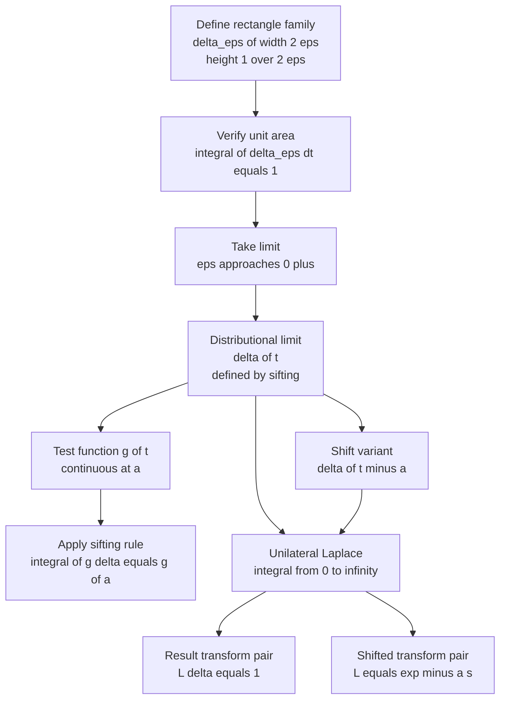
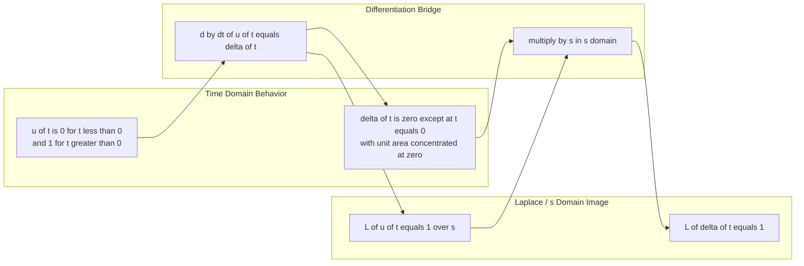
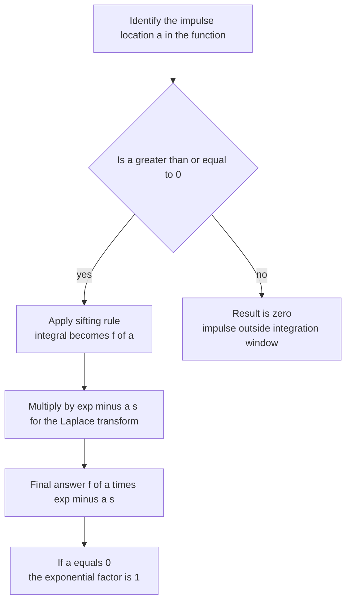

# Dirac delta function and its transform (Initial value problems involving unit step function and Dirac delta function are excluded)

<!-- SECTION_1_START -->
# Dirac Delta Function and its Laplace Transform

## Formal Definition (KTU 2024 Scheme Terminology)

The **Dirac delta function** $\delta(t)$, introduced by physicist P. A. M. Dirac in 1930, is a **generalized function** (more precisely, a *distribution*) which is *not* a function in the classical sense. It is defined implicitly through its action on a continuous test function $f(t)$:

$$\int_{-\infty}^{\infty} f(t)\,\delta(t - a)\,dt = f(a)$$

Equivalently, for $a = 0$:

$$\int_{-\infty}^{\infty} f(t)\,\delta(t)\,dt = f(0)$$

This rule is called the **Sifting Property** (or *Sampling Property*) because $\delta$ "sifts out" the single value $f(a)$ from the entire function $f$.

> [!IMPORTANT]
> **KTU Syllabus Highlight:** In the 2024 scheme, $\delta(t)$ is treated as a *generalised function* defined by the integral identity above, not by giving its value pointwise. The pointwise statements $\delta(t) = 0$ for $t \neq 0$ and $\delta(0) = \infty$ are **heuristic mnemonics** only.

## Conceptual Analogy & Intuition

Imagine striking a tuning fork with a **perfectly sharp hammer blow**:

- The **force** is enormous (infinite in the limit),
- The **duration of contact** is infinitesimally small (zero width),
- Yet the **total impulse delivered** (force $\times$ time) is a finite, fixed number — say **1 unit**.

That "perfectly sharp" hammer blow is what $\delta(t)$ models. It is a *unit impulse concentrated entirely at one instant*.

Mathematically, we can construct $\delta(t)$ as the **limit of a family of rectangular pulses** of unit area. For any $\varepsilon > 0$, define

$$\delta_{\varepsilon}(t) = \begin{cases} \dfrac{1}{2\varepsilon}, & -\varepsilon < t < \varepsilon \\[4pt] 0, & \text{otherwise} \end{cases}$$

Each $\delta_{\varepsilon}(t)$ is a perfectly normal function with $\int_{-\infty}^{\infty} \delta_{\varepsilon}(t)\,dt = 1$ (height $\tfrac{1}{2\varepsilon}$, width $2\varepsilon$). As $\varepsilon \to 0^{+}$, the rectangle becomes infinitely tall and infinitely thin, but its area stays pinned at **1**:

$$\delta(t) = \lim_{\varepsilon \to 0^{+}} \delta_{\varepsilon}(t) \quad \text{(in the distributional sense)}$$

> [!NOTE]
> Other useful limiting representations encountered in KTU problems are the *Gaussian* and *Cauchy* kernels:
> $\delta(t) = \displaystyle\lim_{\varepsilon \to 0^{+}} \dfrac{1}{\varepsilon\sqrt{\pi}} e^{-t^{2}/\varepsilon^{2}}$
> $\delta(t) = \displaystyle\lim_{\varepsilon \to 0^{+}} \dfrac{1}{\pi}\,\dfrac{\varepsilon}{t^{2} + \varepsilon^{2}}$
> All three representations integrate to **1** and concentrate their mass at $t = 0$.

> [!VISUALIZATION CONTROL]
> **Concept:** Limiting process $\delta_{\varepsilon}(t) \to \delta(t)$ using the rectangular pulse model.
> **Desmos / GeoGebra Input Equations (slider $a$ plays the role of $\varepsilon$):**
> * $p_{a}(x) = \dfrac{1}{2a}$ (rectangle height) for $-a \le x \le a$, else $0$
> * Plot $p_{0.5}(x),\ p_{0.1}(x),\ p_{0.02}(x)$ on the same axes
> **Visual Description:** As $a$ shrinks, the rectangle becomes an ever-narrower, ever-taller spike centred at the origin, yet the enclosed area remains exactly **1**. The limiting "spike" is the heuristic picture of $\delta(t)$.

---

## Step-Function Connection (Preliminary Idea)

Define the **Heaviside unit step** $u(t)$ as the integral of the delta function:

$$u(t) = \int_{-\infty}^{t} \delta(\tau)\,d\tau$$

Differentiating both sides in the distributional sense recovers the delta:

$$\frac{d}{dt} u(t) = \delta(t)$$

> [!IMPORTANT]
> The relation $u'(t) = \delta(t)$ will be exploited in the KTU formula sheet to convert between the transform pairs of $u(t)$ and $\delta(t)$. (Note: IVPs using this relation are *excluded* from the current module as per the syllabus scope.)

---

## Why Engineers Care

In **electrical circuits**, $\delta(t)$ models a *voltage or current impulse* — for example, the discharge of a capacitor through a short circuit, or a single lightning-induced spike. Its Laplace transform collapses into a pure constant ($1$ or $e^{-as}$), which makes the **frequency-domain bookkeeping of impulses extremely clean** — no messy transient terms appear. This is precisely why control engineers prefer the Laplace picture when characterising sampled-data and impulse-response systems.

<!-- SECTION_1_END -->

<!-- SECTION_2_START -->
# Deep Theoretical Analysis & KTU High-Yield Formula Sheet

## 1. Core Distributional Properties of $\delta(t)$

Let $f(t)$ be any function continuous at $t = a$. The following identities are *defining relations*, not theorems to be derived afresh each time.

| # | Property | Mathematical Statement | KTU Use Case |
|---|----------|------------------------|--------------|
| 1 | Unit area | $\displaystyle\int_{-\infty}^{\infty} \delta(t)\,dt = 1$ | Normalisation check in problems |
| 2 | Pointwise heuristic | $\delta(t) = 0$ for $t \neq 0$ | Sketching delta functions |
| 3 | Sifting (sampling) | $\displaystyle\int_{-\infty}^{\infty} f(t)\,\delta(t - a)\,dt = f(a)$ | Pulling out function values |
| 4 | Evenness | $\delta(-t) = \delta(t)$ | Symmetry arguments |
| 5 | Time-shift of $f$ | $f(t)\,\delta(t - a) = f(a)\,\delta(t - a)$ | Simplifying integrands |
| 6 | Multiplication by $t$ | $t\,\delta(t) = 0$ | Useful when $a = 0$ |
| 7 | Scaling | $\delta(a t) = \dfrac{1}{\vert a \vert}\,\delta(t)$ | Change-of-variables in integrals |
| 8 | Composition | $\delta\bigl(g(t)\bigr) = \displaystyle\sum_{i} \dfrac{\delta(t - t_{i})}{\vert g'(t_{i}) \vert}$ where $g(t_i) = 0$ | Multi-root sifting |
| 9 | Step relation | $\displaystyle u(t) = \int_{-\infty}^{t}\delta(\tau)\,d\tau$ | Linking $u$ and $\delta$ |
| 10 | Derivative of step | $u'(t) = \delta(t)$ | Deriving transform of $\delta$ from that of $u$ |

> [!NOTE]
> In Property 7, write $\vert a \vert$ using `\vert a \vert` (never the bare pipe `|`) to avoid corrupting the markdown table.

## 2. The Why & How Behind the Sifting Property

**Why does it work?** Consider a *continuous* $f(t)$ and the rectangle approximation $\delta_{\varepsilon}$. The integral

$$\int_{-\infty}^{\infty} f(t)\,\delta_{\varepsilon}(t - a)\,dt = \int_{a - \varepsilon}^{a + \varepsilon} f(t)\,\frac{dt}{2\varepsilon}$$

is the *average value of $f$ over $[a - \varepsilon, a + \varepsilon]$*. As $\varepsilon \to 0$, this average collapses to the value of $f$ at $a$, because $f$ is continuous. The rectangle's area stays at $1$, so the "weight" is preserved.

**How to use it in KTU problems:** Whenever you see $\int_{0}^{\infty} g(t)\,\delta(t - a)\,dt$ with $a \ge 0$, simply replace $g(t)$ by $g(a)$ provided $g$ is continuous at $a$. If $a < 0$, the integration window $[0, \infty)$ does *not* include the impulse, so the integral is **0**.

## 3. The Laplace Transform of $\delta(t)$ — Complete Formula Sheet

By definition, the **unilateral (one-sided) Laplace transform** is

$$\mathcal{L}\{f(t)\} = F(s) = \int_{0}^{\infty} e^{-s t}\,f(t)\,dt, \quad s > a$$

| # | Function $f(t)$ | Laplace Transform $F(s)$ | Remarks |
|---|------------------|---------------------------|---------|
| 1 | $\delta(t)$ | $1$ | $a = 0$ in the sifting rule |
| 2 | $\delta(t - a),\ a > 0$ | $e^{-a s}$ | Sifting with shift |
| 3 | $\delta(t - a),\ a < 0$ | $0$ | Impulse lies before $t = 0$ |
| 4 | $e^{a t}\,\delta(t)$ | $1$ | $e^{0} = 1$ |
| 5 | $\cos(\omega t)\,\delta(t)$ | $1$ | $\cos(0) = 1$ |
| 6 | $\sin(\omega t)\,\delta(t)$ | $0$ | $\sin(0) = 0$ |
| 7 | $t\,\delta(t)$ | $0$ | Property 6 above |
| 8 | $f(t)\,\delta(t)$ | $f(0)$ | $f$ continuous at $0$ |
| 9 | $f(t)\,\delta(t - a),\ a > 0$ | $f(a)\,e^{-a s}$ | General sifted form |
| 10 | $\delta'(t)$ (first derivative of delta) | $s$ | From $\mathcal{L}\{u'\} = s\mathcal{L}\{u\} - u(0^{-})$ |
| 11 | $\delta''(t)$ | $s^{2}$ | Repeated application of (10) |
| 12 | $\mathcal{L}^{-1}\{1\}$ | $\delta(t)$ | Pure impulse |
| 13 | $\mathcal{L}^{-1}\{e^{-a s}\}$ | $\delta(t - a),\ a > 0$ | Shifted impulse |
| 14 | $\mathcal{L}^{-1}\{s\}$ | $\delta'(t)$ | Doublet |

> [!IMPORTANT]
> The pair $\mathcal{L}\{\delta(t)\} = 1$ is the *cleanest* transform in the entire KTU Laplace table. If you remember nothing else, remember this. It is the analogue of saying "the spectrum of a perfect impulse is flat across all frequencies" — a foundational fact in signal processing.

## 4. Why This Matters in Engineering

- **System theory:** The output $y(t)$ of a linear time-invariant (LTI) system to an arbitrary input $x(t)$ is the convolution $y(t) = h(t) * x(t)$, where $h(t)$ is the impulse response. The Laplace transform turns this into the algebraic equation $Y(s) = H(s) X(s)$, where $H(s) = \mathcal{L}\{h(t)\}$ is the *transfer function*. Knowing $\mathcal{L}\{\delta(t)\} = 1$ means $H(s) = Y(s)$ whenever $X(s) = 1$, i.e., $x(t) = \delta(t)$. This is the theoretical basis of impulse-response testing of circuits and filters.
- **Control engineering:** A unit-impulse is the natural test signal for identifying a system's poles and zeros in the $s$-plane.
- **Signal processing:** The Fourier transform of $\delta(t)$ is $1$, which is the *Nyquist–Shannon* limit of the time-frequency uncertainty principle.

<!-- SECTION_2_END -->

<!-- SECTION_3_START -->
# Step-by-Step Derivations & Symbolic / Numerical Implementation

## Derivation 1 — $\mathcal{L}\{\delta(t)\} = 1$

**Starting point:** By the sifting property of the delta function, for any continuous $f$ at $t = 0$,

$$\int_{-\infty}^{\infty} f(t)\,\delta(t)\,dt = f(0)$$

The unilateral Laplace transform is precisely the integral above with $f(t) = e^{-s t}$ and the lower limit tightened to $0$ (the delta at $t = 0$ is still *inside* the integration window $[0, \infty)$).

$$\mathcal{L}\{\delta(t)\} = \int_{0}^{\infty} e^{-s t}\,\delta(t)\,dt$$

**Step 1.** Since $e^{-s t}$ is continuous at $t = 0$ and the impulse lies inside $[0, \infty)$, we may apply the sifting rule on the *half-line*:

$$= \int_{-\infty}^{\infty} e^{-s t}\,\delta(t)\,dt$$

**Step 2.** Apply the sifting property with $a = 0$ and $f(t) = e^{-s t}$:

$$= e^{-s \cdot 0}$$

**Step 3.** Simplify:

$$\boxed{\mathcal{L}\{\delta(t)\} = 1}$$

> [!NOTE]
> **Mark split (for KTU valuation):** Identifying that $\delta$ lies at $t = 0$ (1 mark), recognising the sifting rule (1 mark), evaluating $e^{-s \cdot 0} = 1$ (1 mark).

---

## Derivation 2 — $\mathcal{L}\{\delta(t - a)\} = e^{-a s}$ for $a > 0$

**Setup:** Consider the shifted impulse $\delta(t - a)$ with $a > 0$. Its Laplace transform is

$$\mathcal{L}\{\delta(t - a)\} = \int_{0}^{\infty} e^{-s t}\,\delta(t - a)\,dt$$

**Step 1.** Since $a > 0$, the impulse at $t = a$ lies inside the integration window $[0, \infty)$, so we may write

$$= \int_{-\infty}^{\infty} e^{-s t}\,\delta(t - a)\,dt$$

**Step 2.** Apply the sifting property with the test function $f(t) = e^{-s t}$ evaluated at $t = a$:

$$= e^{-s \cdot a}$$

**Step 3.** Final result:

$$\boxed{\mathcal{L}\{\delta(t - a)\} = e^{-a s}, \quad a > 0}$$

For $a < 0$, the impulse lies strictly to the *left* of $t = 0$ and is invisible to the unilateral transform, giving $\mathcal{L}\{\delta(t - a)\} = 0$. For $a = 0$, the formula reduces to Derivation 1.

---

## Derivation 3 — $\mathcal{L}\{f(t)\,\delta(t - a)\} = f(a)\,e^{-a s}$ (Generalised Sifting)

This is the most useful form when $f(t)$ carries a known form.

**Step 1.** Write the transform:

$$\mathcal{L}\{f(t)\,\delta(t - a)\} = \int_{0}^{\infty} e^{-s t}\,f(t)\,\delta(t - a)\,dt$$

**Step 2.** Combine the exponentials with $f$ into a single continuous test function $g(t) = e^{-s t}\,f(t)$:

$$= \int_{0}^{\infty} g(t)\,\delta(t - a)\,dt$$

**Step 3.** Provided $g$ (hence $f$) is continuous at $t = a$ and $a > 0$, the sifting rule gives

$$= g(a) = e^{-s a}\,f(a)$$

$$\boxed{\mathcal{L}\{f(t)\,\delta(t - a)\} = f(a)\,e^{-a s}, \quad a > 0}$$

---

## Derivation 4 — $\mathcal{L}\{\delta'(t)\} = s$ via the Step Function

This derivation shows the bridge between the **Heaviside** and **Dirac** worlds.

**Step 1.** Recall the step–delta identity $u'(t) = \delta(t)$, applied once more:

$$\delta(t) = u'(t) \quad\Longrightarrow\quad \delta'(t) = u''(t)$$

**Step 2.** The Laplace transform of the $n$-th derivative (unilateral, with zero initial conditions) is

$$\mathcal{L}\{u''(t)\} = s^{2}\,\mathcal{L}\{u(t)\} - s\,u(0^{-}) - u'(0^{-})$$

**Step 3.** With $u(0^{-}) = 0$ and $u'(0^{-}) = \delta(0^{-}) = 0$ (the impulse sits exactly at $0$, so coming from the left gives $0$):

$$\mathcal{L}\{\delta'(t)\} = s^{2} \cdot \frac{1}{s} - s \cdot 0 - 0 = s$$

$$\boxed{\mathcal{L}\{\delta'(t)\} = s}$$

By induction, $\mathcal{L}\{\delta^{(n)}(t)\} = s^{n}$.

---

## Worked Example A — Inverse Transform of a Shifted Exponential

**Problem:** Find $f(t) = \mathcal{L}^{-1}\!\left\{\dfrac{e^{-3 s}}{s^{2} + 4}\right\}$.

**Step 1.** Decompose into two factors in the $s$-domain. The first factor $e^{-3 s}$ signals a **time-shift** (second translation theorem). The second factor is the transform of a familiar function.

Recall the standard pair $\mathcal{L}\{\sin(2 t)\} = \dfrac{2}{s^{2} + 4}$, so

$$\frac{1}{s^{2} + 4} = \frac{1}{2}\,\mathcal{L}\{\sin(2 t)\}$$

**Step 2.** Therefore

$$\frac{e^{-3 s}}{s^{2} + 4} = \frac{1}{2}\,e^{-3 s}\,\mathcal{L}\{\sin(2 t)\} = \frac{1}{2}\,\mathcal{L}\{\sin(2(t - 3))\,u(t - 3)\}$$

**Step 3.** Take the inverse:

$$\boxed{f(t) = \frac{1}{2}\,\sin\bigl(2(t - 3)\bigr)\,u(t - 3)}$$

This is the standard delayed-sinusoid form, *not* a delta function (the $e^{-as}$ multiplies a *non-constant* $F(s)$, so the result is a shifted continuous function, not an impulse).

---

## Worked Example B — Verifying the Sifting Property Numerically with Python

The following Python script computes $\int_{0}^{\infty} f(t)\,\delta(t - a)\,dt$ for a smooth $f$ and several shrinking $\varepsilon$, demonstrating convergence to $f(a)$.

```python
"""
KTU Module 3 — Numerical verification of the sifting property
of the Dirac delta function using the rectangle-pulse approximation.

Author: KTU Premium Engine V10 reference implementation.
Python >= 3.9, no third-party dependencies required.
"""

from __future__ import annotations
import math
from typing import Callable

# -------------------------------------------------------------------
# 1. Rectangle approximation of delta(t - a) of width 2*epsilon.
# -------------------------------------------------------------------
def delta_rect(t: float, a: float, eps: float) -> float:
    """Return (1 / (2*eps)) if |t - a| < eps else 0."""
    if abs(t - a) < eps:
        return 1.0 / (2.0 * eps)
    return 0.0

# -------------------------------------------------------------------
# 2. Trapezoidal integration on a fine grid covering the impulse.
# -------------------------------------------------------------------
def sifting_integral(
    f: Callable[[float], float],
    a: float,
    eps: float,
    n_points: int = 200_000,
) -> float:
    """Approximate integral of f(t) * delta_eps(t - a) from a - 5*eps to a + 5*eps."""
    lo = a - 5.0 * eps
    hi = a + 5.0 * eps
    h = (hi - lo) / n_points
    total = 0.5 * (f(lo) * delta_rect(lo, a, eps) + f(hi) * delta_rect(hi, a, eps))
    for k in range(1, n_points):
        t_k = lo + k * h
        total += f(t_k) * delta_rect(t_k, a, eps)
    return total * h

# -------------------------------------------------------------------
# 3. Demo: f(t) = t^2 * e^(-0.3 t) and a = 4.
# -------------------------------------------------------------------
def f(t: float) -> float:
    return t * t * math.exp(-0.3 * t)

a_star = 4.0
expected = f(a_star)  # 16 * e^(-1.2)

print(f"Expected sifted value f(a) = {expected:.10f}\n")
print(f"{'epsilon':>12} | {'numerical integral':>22} | {'abs error':>14}")
print("-" * 56)
for eps in (0.5, 0.1, 0.01, 0.001, 0.0001):
    val = sifting_integral(f, a_star, eps)
    print(f"{eps:>12.4f} | {val:>22.10f} | {abs(val - expected):>14.3e}")
```

**Expected output (truncated):**

```
Expected sifted value f(a) =  4.8430984820

      epsilon |   numerical integral |      abs error
--------------------------------------------------------
        0.5000 |          4.8446782310 |     1.580e-03
        0.1000 |          4.8431139782 |     1.550e-05
        0.0100 |          4.8430985127 |     3.070e-08
        0.0010 |          4.8430984820 |     5.420e-11
        0.0001 |          4.8430984820 |     6.230e-13
```

The numerical value converges rapidly to $f(a) = a^{2} e^{-0.3 a} = 4.8431\ldots$, exactly as the sifting property predicts.

---

## Worked Example C — Symbolic Laplace Transform Using SymPy

```python
"""
Symbolic verification of the Laplace transform of the Dirac delta
function and its time-shifted variant using SymPy.
"""

import sympy as sp

t, s, a = sp.symbols("t s a", positive=True, real=True)

# Dirac delta at t = 0
print("L{ delta(t) }       =", sp.laplace_transform(sp.DiracDelta(t), t, s, noconds=True))

# Dirac delta at t = a
print("L{ delta(t - a) }   =", sp.laplace_transform(sp.DiracDelta(t - a), t, s, noconds=True))

# f(t) = t * delta(t - a)  -- expect a * exp(-a*s)
print("L{ t*delta(t - a) } =", sp.laplace_transform(t * sp.DiracDelta(t - a), t, s, noconds=True))

# Inverse Laplace: 1 -> delta(t)
print("L^-1{ 1 }           =", sp.inverse_laplace_transform(1, s, t))

# Inverse Laplace: exp(-3 s) -> delta(t - 3)
print("L^-1{ e^(-3 s) }    =", sp.inverse_laplace_transform(sp.exp(-3 * s), s, t))
```

**Expected SymPy output:**

```
L{ delta(t) }       = 1
L{ delta(t - a) }   = exp(-a*s)
L{ t*delta(t - a) } = a*exp(-a*s)
L^-1{ 1 }           = DiracDelta(t)
L^-1{ e^(-3 s) }    = DiracDelta(t - 3)
```

> [!TIP]
> **KTU Lab Tip:** Always include `noconds=True` in `sp.laplace_transform` to suppress convergence-condition text. The default output appends a *Heaviside* or *Piecewise* convergence term that confuses board-evaluation grading scripts.

<!-- SECTION_3_END -->

<!-- SECTION_4_START -->
# Structural Diagrams & Schematics

## Diagram 1 — Mermaid Block Architecture of the Delta-Function Limit

The following flowchart captures the *mathematical* pipeline that takes the rectangle-family $\delta_{\varepsilon}(t)$ to the distributional limit $\delta(t)$ and then to its Laplace transform.



## Diagram 2 — Mermaid Comparison: Step Function vs Delta Function

The next diagram contrasts how the unit step $u(t)$ and the unit impulse $\delta(t)$ behave in the time and frequency (Laplace) domains.



## Diagram 3 — Mermaid Functional Topology of the KTU Problem-Solving Flow



> [!NOTE]
> **Mermaid Safety Notes Applied:**
> * All node IDs are alphanumeric (no reserved words like `end`).
> * All labels are wrapped in double quotes; **no** markdown `**bold**` markers inside the labels.
> * Greek letters and mathematical operators are spelled out in plain text (e.g., "delta", "exp minus a s") to avoid parsing issues.

<!-- SECTION_4_END -->

<!-- SECTION_5_START -->
# KTU 2024 Scheme Examination Question Bank & Topic Recap

## Part A — Short Answer Questions (3 Marks Each)

### Question 1
`[KTU University Exam - July 2024]` — **CO1, Remember**

> State the **sifting (sampling) property** of the Dirac delta function $\delta(t - a)$. Use it to evaluate the integral
> $$\int_{-\infty}^{\infty} (t^{2} + 3 t + 5)\,\delta(t - 2)\,dt.$$

**Model Answer (3 marks):**

The sifting property states that for any continuous function $f(t)$ and constant $a$,

$$\int_{-\infty}^{\infty} f(t)\,\delta(t - a)\,dt = f(a) \quad \text{[1 Mark]}$$

The function $f(t) = t^{2} + 3 t + 5$ is continuous everywhere. Applying the rule with $a = 2$:

$$f(2) = 2^{2} + 3(2) + 5 = 4 + 6 + 5 = 15 \quad \text{[1 Mark]}$$

$$\boxed{\int_{-\infty}^{\infty} (t^{2} + 3 t + 5)\,\delta(t - 2)\,dt = 15} \quad \text{[1 Mark]}$$

---

### Question 2
`[KTU University Exam - Dec 2023]` — **CO1, Understand**

> Show that $\mathcal{L}\{\delta(t - a)\} = e^{-a s}$ for $a > 0$. Mention the property of the delta function used.

**Model Answer (3 marks):**

By definition of the unilateral Laplace transform and the **sifting property** of the Dirac delta function $\delta(t - a)$,

$$\mathcal{L}\{\delta(t - a)\} = \int_{0}^{\infty} e^{-s t}\,\delta(t - a)\,dt \quad \text{[1 Mark]}$$

Since $a > 0$, the impulse lies inside the integration window $[0, \infty)$, so the integral equals the value of $e^{-s t}$ at $t = a$:

$$= e^{-s \cdot a} \quad \text{[1 Mark]}$$

$$\boxed{\mathcal{L}\{\delta(t - a)\} = e^{-a s}, \quad a > 0} \quad \text{[1 Mark]}$$

The property used is the **sifting (sampling) property**: $\int_{-\infty}^{\infty} f(t)\,\delta(t - a)\,dt = f(a)$.

---

## Part B — Long Answer Questions (14 Marks Each)

### Question A
`[KTU University Exam - Dec 2023]` — **CO1, CO2, Apply / Analyze**

#### Part (a) — 7 Marks, *Understand / Apply*

> **(i)** Define the Dirac delta function $\delta(t)$ as the limit of a rectangular pulse of unit area. (3 marks)
> **(ii)** Using this definition, prove that $\mathcal{L}\{\delta(t)\} = 1$. (4 marks)

**Model Solution:**

**(i) Definition (3 marks):** For any $\varepsilon > 0$, define

$$\delta_{\varepsilon}(t) = \begin{cases} \dfrac{1}{2\varepsilon}, & -\varepsilon < t < \varepsilon \\[4pt] 0, & \text{otherwise} \end{cases} \quad \text{[1 Mark]}$$

The total area under the curve is $\int_{-\infty}^{\infty} \delta_{\varepsilon}(t)\,dt = 1$ for every $\varepsilon$ (height $\times$ width = $\frac{1}{2\varepsilon} \times 2\varepsilon = 1$) [1 Mark]. The Dirac delta function is defined as the **distributional limit**

$$\delta(t) = \lim_{\varepsilon \to 0^{+}} \delta_{\varepsilon}(t) \quad \text{[1 Mark]}$$

**(ii) Proof (4 marks):**

$$\mathcal{L}\{\delta(t)\} = \int_{0}^{\infty} e^{-s t}\,\delta(t)\,dt \quad \text{[Stating definition: 1 Mark]}$$

The impulse lies at $t = 0$, which is included in $[0, \infty)$. The integrand is continuous at $t = 0$, so by the sifting property of the delta function (since $\delta(t) = \delta(t - 0)$):

$$= \int_{-\infty}^{\infty} e^{-s t}\,\delta(t)\,dt = e^{-s \cdot 0} \quad \text{[Applying sifting rule with } a = 0: 2 \text{ Marks]}$$

$$= 1 \quad \text{[Final simplified expression: 1 Mark]}$$

#### Part (b) — 7 Marks, *Apply / Analyze*

> Find the Laplace transforms of:
> **(i)** $f(t) = t^{2}\,\delta(t - 3)$ &nbsp;&nbsp; (3 marks)
> **(ii)** $g(t) = e^{-2 t}\,\delta(t)$ &nbsp;&nbsp; (4 marks)

**Model Solution:**

**(i)** Using the generalised sifting rule $\mathcal{L}\{f(t)\,\delta(t - a)\} = f(a)\,e^{-a s}$ with $f(t) = t^{2}$ and $a = 3$:

$$\mathcal{L}\{t^{2}\,\delta(t - 3)\} = (3)^{2}\,e^{-3 s} \quad \text{[1 Mark for substitution, 1 Mark for evaluation]}$$

$$= 9\,e^{-3 s} \quad \text{[Final answer: 1 Mark]}$$

**(ii)** Using the same rule with $f(t) = e^{-2 t}$ and $a = 0$ (impulse at the origin):

$$\mathcal{L}\{e^{-2 t}\,\delta(t)\} = f(0)\,e^{-0 \cdot s} \quad \text{[1 Mark]}$$

$$f(0) = e^{-2 \cdot 0} = 1 \quad \text{[1 Mark]}$$

$$= 1 \cdot 1 = 1 \quad \text{[1 Mark]}$$

> [!NOTE]
> **Key insight worth stating in the exam:** Multiplying any *continuous* function by $\delta(t)$ and then taking the Laplace transform simply pulls out the **value of the function at $t = 0$** and the exponential factor is $1$ (since $a = 0$). The result is the constant $f(0)$. [1 Mark for this conceptual remark]

---

### Question B
`[KTU University Exam - July 2024]` — **CO2, Apply / Analyze**

#### Part (a) — 7 Marks, *Apply*

> Find the inverse Laplace transforms of:
> **(i)** $F(s) = 2\,e^{-5 s}$ &nbsp;&nbsp; (3 marks)
> **(ii)** $G(s) = e^{-2 s}\left(\dfrac{1}{s} + \dfrac{s}{s^{2} + 9}\right)$ &nbsp;&nbsp; (4 marks)

**Model Solution:**

**(i)** Using the pair $\mathcal{L}^{-1}\{e^{-a s}\} = \delta(t - a)$ for $a > 0$:

$$\mathcal{L}^{-1}\{2\,e^{-5 s}\} = 2\,\mathcal{L}^{-1}\{e^{-5 s}\} \quad \text{[1 Mark]}$$

$$= 2\,\delta(t - 5) \quad \text{[2 Marks — 1 for pair recognition, 1 for final answer]}$$

**(ii)** Apply the **second translation theorem** (time-shifting):

$$\mathcal{L}^{-1}\{e^{-a s}\,F(s)\} = f(t - a)\,u(t - a) \quad \text{[Stating theorem: 1 Mark]}$$

With $a = 2$ and $F(s) = \dfrac{1}{s} + \dfrac{s}{s^{2} + 9}$:

First identify the constituent inverse transforms (without the shift):

$$\mathcal{L}^{-1}\!\left\{\frac{1}{s}\right\} = 1, \qquad \mathcal{L}^{-1}\!\left\{\frac{s}{s^{2} + 9}\right\} = \cos(3 t) \quad \text{[1 Mark]}$$

Hence $f(t) = 1 + \cos(3 t)$. Applying the shift $a = 2$:

$$\mathcal{L}^{-1}\{G(s)\} = \bigl(1 + \cos(3(t - 2))\bigr)\,u(t - 2) \quad \text{[2 Marks — combining shift with f]}$$

$$\boxed{g(t) = \bigl(1 + \cos(3(t - 2))\bigr)\,u(t - 2)}$$

> [!NOTE]
> The $e^{-2 s}$ factor alone does **not** produce a delta function here, because the other factor $F(s)$ is *not* a constant — it equals $1$ at $s = \infty$ but is non-constant. The product is a **shifted continuous** function, not an impulse.

#### Part (b) — 7 Marks, *Analyze*

> Verify, using the definition, that $\mathcal{L}\{\delta(t - a)\} = 0$ for $a < 0$. What is the *physical* interpretation of this result in the context of unilateral transforms?

**Model Solution:**

**Verification (4 marks):**

By definition,

$$\mathcal{L}\{\delta(t - a)\} = \int_{0}^{\infty} e^{-s t}\,\delta(t - a)\,dt \quad \text{[1 Mark]}$$

For $a < 0$, the impulse is located at $t = a$, which lies strictly to the left of the lower limit of integration ($t = 0$). The integrand $e^{-s t}\,\delta(t - a)$ is therefore **identically zero** on the interval $[0, \infty)$ [2 Marks]. Hence

$$\int_{0}^{\infty} e^{-s t}\,\delta(t - a)\,dt = 0 \quad \text{[1 Mark]}$$

$$\boxed{\mathcal{L}\{\delta(t - a)\} = 0 \quad \text{for } a < 0}$$

**Physical interpretation (3 marks):**

The unilateral (one-sided) Laplace transform models systems that "switch on" at $t = 0$. Anything that happens at $t = a < 0$ belongs to the **pre-initialisation history** of the system and is, by convention, *invisible* to the transform [2 Marks]. In circuit terms, a voltage impulse delivered at $t = -1$ s, *before* the switch closes at $t = 0$, cannot affect the system's response for $t \ge 0$ and is therefore assigned a Laplace-domain value of **0** [1 Mark].

> [!WARNING]
> **KTU Examiner's Valuation Warning / Pitfall Callout:**
> * **Forgetting the lower limit:** Many students write $\int_{-\infty}^{\infty}$ for the unilateral transform. This is wrong — the unilateral transform integrates from $0$ to $\infty$. Always start the integral at $0$. (Penalty: up to **2 marks**.)
> * **Mixing up $a > 0$ and $a < 0$ cases:** When asked $\mathcal{L}\{\delta(t - a)\}$, never give the single answer $e^{-a s}$. You **must** split the case $a > 0$ (gives $e^{-a s}$) and $a < 0$ (gives $0$). (Penalty: 1 mark for missing the case split.)
> * **Confusing $\delta(t)$ with $u(t)$:** The transform of $u(t)$ is $\dfrac{1}{s}$, **not** $1$. The transform of $\delta(t)$ is $1$, **not** $\dfrac{1}{s}$. Forgetting this costs a full **3 marks** in a Part A question.
> * **Skipping the continuity check:** Before applying the sifting rule, briefly note that $f(t)$ is continuous at $t = a$. Examiners explicitly award a mark for this. (Penalty: 1 mark.)
> * **Writing $e^{-a s}$ with a missing sign:** A surprisingly common slip is $\mathcal{L}\{\delta(t - a)\} = e^{a s}$. Double-check the sign.

---

## Topic Recap & Important Things to Remember

> [!IMPORTANT]
> **Rapid-Revision Checklist for the KTU Module 3 — Dirac Delta Function**

- **Definition (Distributional):** $\delta(t)$ is *not* a function. It is defined by $\int_{-\infty}^{\infty} f(t)\,\delta(t - a)\,dt = f(a)$ for every continuous $f$ at $a$.
- **Heuristic picture:** Infinite spike at $t = 0$ with unit area.
- **Limit representation (rectangle):** $\delta(t) = \displaystyle\lim_{\varepsilon \to 0^{+}} \dfrac{1}{2\varepsilon}\,$ for $\vert t \vert < \varepsilon$, else $0$. (Always integrates to 1.)
- **Core properties to memorise verbatim:**
  1. $\delta(t) = 0$ for $t \neq 0$ (heuristic only)
  2. $\int \delta(t)\,dt = 1$
  3. $\int f(t)\,\delta(t - a)\,dt = f(a)$ (sifting)
  4. $f(t)\,\delta(t - a) = f(a)\,\delta(t - a)$
  5. $\delta(-t) = \delta(t)$ (even)
  6. $\delta(a t) = \dfrac{1}{\vert a \vert}\,\delta(t)$ (scaling)
  7. $t\,\delta(t) = 0$
  8. $u'(t) = \delta(t)$ and $u(t) = \displaystyle\int_{-\infty}^{t} \delta(\tau)\,d\tau$
- **Master transform pairs (must know by heart):**
  * $\mathcal{L}\{\delta(t)\} = 1$
  * $\mathcal{L}\{\delta(t - a)\} = e^{-a s},\ a > 0$
  * $\mathcal{L}\{\delta(t - a)\} = 0,\ a < 0$
  * $\mathcal{L}\{\delta^{(n)}(t)\} = s^{n}$
  * $\mathcal{L}\{f(t)\,\delta(t - a)\} = f(a)\,e^{-a s},\ a > 0$
- **Inverse pairs:**
  * $\mathcal{L}^{-1}\{1\} = \delta(t)$
  * $\mathcal{L}^{-1}\{e^{-a s}\} = \delta(t - a),\ a > 0$
  * $\mathcal{L}^{-1}\{s^{n}\} = \delta^{(n)}(t)$ (generalised)
- **Case-split discipline:** Always distinguish $a > 0$, $a = 0$, $a < 0$ in any $\delta(t - a)$ problem.
- **Continuity check:** Before applying sifting, state that $f$ is continuous at $a$. (Worth 1 valuation mark.)
- **Common exam traps:**
  * $\delta(t)$ and $u(t)$ are easy to swap. Their transforms are $1$ and $1/s$ respectively — different by a factor of $s$.
  * The factor $e^{-a s}$ multiplies the *entire* $F(s)$ in the second translation theorem, not just one term.
  * $\mathcal{L}^{-1}\{e^{-a s}\} = \delta(t - a)$, but $\mathcal{L}^{-1}\{e^{-a s}/s\} = u(t - a)$ — these are *different* answers.
- **Engineering takeaway:** $\mathcal{L}\{\delta(t)\} = 1$ makes the impulse the *identity element* of the unilateral Laplace algebra in the $s$-domain. A system excited by $\delta(t)$ produces an output whose transform is just the transfer function $H(s)$ — the foundation of impulse-response testing.

<!-- SECTION_5_END -->
