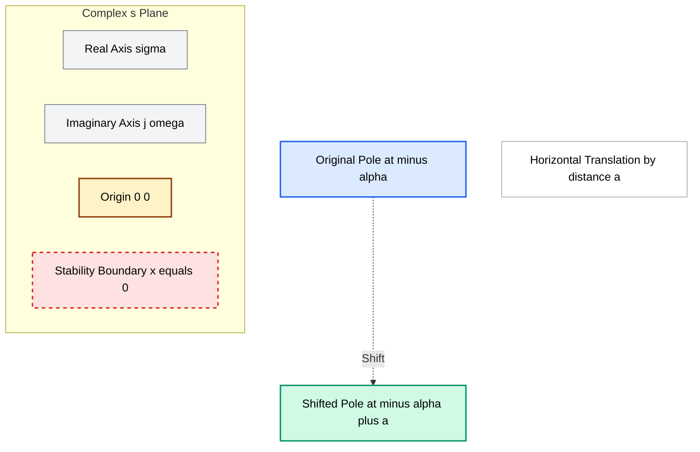
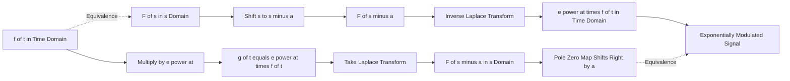

# First shifting theorem

<!-- SECTION_1_START -->
# First Shifting Theorem — First Principles

## Formal Academic Definition

> [!IMPORTANT]
> **First Shifting Theorem (s-Shifting Property):**
> If $L\{f(t)\} = F(s)$ exists for $s > \alpha$, then for any real constant $a$, the Laplace transform of the exponentially modulated function $e^{at} f(t)$ is obtained by replacing every occurrence of $s$ in $F(s)$ with $(s - a)$.
> $$\boxed{L\{e^{at}\, f(t)\} = F(s - a), \quad \text{where } s > \alpha + a}$$

This theorem is also called the **Frequency Shifting Theorem** or the **Translation in s-Domain Property**, and it is central to the analysis of linear time-invariant (LTI) systems, electrical networks with damping, and control engineering.

## Conceptual Analogy & Intuitive Understanding

> [!NOTE]
> **Plain English Intuition — The "Radio Tuner" Analogy:**
> Imagine a radio station broadcasting a song $f(t)$. The audio signal sits at a base frequency. Now, if a DJ modulates the song by multiplying it with a smooth, ever-growing factor $e^{at}$ (an exponential envelope), what you hear is the same song but with a **shift in its characteristic frequency** in the analysis domain.
> - In the **time domain**, you are multiplying the signal by $e^{at}$.
> - In the **s-domain** (frequency/transform domain), this multiplication translates the entire spectrum to the right (if $a > 0$) or left (if $a < 0$) by exactly $|a|$ units.
> This is exactly the same phenomenon as **Doppler shift** in physics or **amplitude modulation** in communication engineering — the underlying structure of $f(t)$ is preserved, but its position in the complex plane changes.

**Geometric Intuition in the s-Plane:** The poles and zeros of $F(s)$ — which completely characterize the system's behavior — are **shifted horizontally by $a$ units**. A stable system with poles in the left half-plane (LHP) can become unstable if shifted by a positive $a$ across the imaginary axis, and vice versa.

## Key Constants and Standard Parameters

- **$a \in \mathbb{R}$**: The real-valued shift constant, in units of $s^{-1}$ (reciprocal seconds) when in a time-domain context, or in **radians per second** when the theorem is applied to damped oscillations.
- **$s$**: Complex frequency variable, $s = \sigma + j\omega$, where $\sigma$ and $\omega$ are real.
- **Region of Convergence (ROC)**: Shifts from $s > \alpha$ to $s > \alpha + a$.

> [!TIP]
> **Quick Recognition Trick for KTU Exams:**
> If the function $f(t)$ contains a multiplicative factor of the form $e^{at}$, do NOT integrate it directly. Instead, find the Laplace transform of the "core" function (ignoring $e^{at}$), and then replace $s$ with $(s - a)$.

## Visualization

> [!VISUALIZATION CONTROL]
> **Concept:** Pole-Zero Shift in the s-Plane
> **GeoGebra / Desmos Input Equations:**
> * Original pole location: $p_1 = -2$, plotted as point $(-2, 0)$
> * Shifted pole location: $p_1' = -2 + a$, parameterized for $a = 1.5$ as point $(-0.5, 0)$
> * Vertical line: $x = 0$ (imaginary axis — stability boundary)
> * Plot the family of shifted points as $a$ varies from $-3$ to $3$
> **Visual Description:** The student should observe the original pole at $-2$ sliding horizontally to the right as $a$ increases, eventually crossing the imaginary axis (vertical line at $x=0$) at $a = 2$. This crossing is the geometric reason why a stable system can become unstable under a positive shift.

<!-- SECTION_1_END -->

<!-- SECTION_2_START -->
# Deep Theoretical Analysis & KTU High-Yield Formula Sheet

## Theorem Statement in Layered Logic

**Given:** A known function $f(t)$ and its transform pair $f(t) \xleftrightarrow{\mathcal{L}} F(s)$.

**To Find:** The transform of $g(t) = e^{at} f(t)$.

**Step 1 — Definition Recall:** By definition,
$$L\{g(t)\} = \int_{0}^{\infty} e^{-st} \cdot e^{at} f(t)\, dt = \int_{0}^{\infty} e^{-(s-a)t} f(t)\, dt$$

**Step 2 — Exponent Consolidation:** The two exponentials combine via the law $e^{-st} \cdot e^{at} = e^{(a-s)t} = e^{-(s-a)t}$. This is a single algebraic step, but it is the heart of the theorem — it reveals the **new effective frequency variable** as $(s - a)$.

**Step 3 — Pattern Matching:** Compare the resulting integral with the standard definition:
$$\int_{0}^{\infty} e^{-pt} f(t)\, dt = F(p), \quad \text{where } p = s - a$$

**Step 4 — Substitution Conclusion:** Replacing $p$ with $(s - a)$ in the original transform $F(p)$ yields:
$$\boxed{L\{e^{at} f(t)\} = F(s - a)}$$

**Why this works:** The theorem is essentially a **re-parameterization** of the integration variable. The exponential modulator $e^{at}$ does not change the analytic structure of $f(t)$; it merely shifts the convergence region of the integral.

## KTU Formula Sheet — Master Reference Table

| **S. No.** | **Time Domain $f(t)$** | **Laplace Domain $F(s)$** | **Shifted Form $e^{at} f(t)$** | **Shifted Transform $F(s - a)$** |
|:----------:|:----------------------:|:--------------------------:|:------------------------------:|:--------------------------------:|
| 1 | $1$ | $\dfrac{1}{s}$ | $e^{at}$ | $\dfrac{1}{s - a}$ |
| 2 | $t^{n}$ | $\dfrac{n!}{s^{n+1}}$ | $e^{at} t^{n}$ | $\dfrac{n!}{(s - a)^{n+1}}$ |
| 3 | $e^{bt}$ | $\dfrac{1}{s - b}$ | $e^{(a+b)t}$ | $\dfrac{1}{s - (a + b)}$ |
| 4 | $\sin(\omega t)$ | $\dfrac{\omega}{s^{2} + \omega^{2}}$ | $e^{at} \sin(\omega t)$ | $\dfrac{\omega}{(s - a)^{2} + \omega^{2}}$ |
| 5 | $\cos(\omega t)$ | $\dfrac{s}{s^{2} + \omega^{2}}$ | $e^{at} \cos(\omega t)$ | $\dfrac{s - a}{(s - a)^{2} + \omega^{2}}$ |
| 6 | $\sinh(\omega t)$ | $\dfrac{\omega}{s^{2} - \omega^{2}}$ | $e^{at} \sinh(\omega t)$ | $\dfrac{\omega}{(s - a)^{2} - \omega^{2}}$ |
| 7 | $\cosh(\omega t)$ | $\dfrac{s}{s^{2} - \omega^{2}}$ | $e^{at} \cosh(\omega t)$ | $\dfrac{s - a}{(s - a)^{2} - \omega^{2}}$ |
| 8 | $t \sin(\omega t)$ | $\dfrac{2\omega s}{(s^{2} + \omega^{2})^{2}}$ | $e^{at} t \sin(\omega t)$ | $\dfrac{2\omega (s - a)}{((s - a)^{2} + \omega^{2})^{2}}$ |
| 9 | $t \cos(\omega t)$ | $\dfrac{s^{2} - \omega^{2}}{(s^{2} + \omega^{2})^{2}}$ | $e^{at} t \cos(\omega t)$ | $\dfrac{(s - a)^{2} - \omega^{2}}{((s - a)^{2} + \omega^{2})^{2}}$ |

> [!CAUTION]
> **Critical Notation Warning for KTU Valuation:**
> The shifted transform is **$F(s - a)$**, NOT $F(s) - a$. Writing $F(s) - a$ will be marked **strictly wrong** by board examiners. Always substitute the entire variable $s$ with $(s - a)$.

## Extended Companion Result — Multiplication by $t^{n}$

A powerful corollary of the first shifting theorem is the **Multiplication by $t$ property**:
$$L\{t^{n} f(t)\} = (-1)^{n} \frac{d^{n}}{ds^{n}}\{F(s)\}$$

This is used in tandem with the shifting theorem to handle functions like $t^{n} e^{at} \sin(\omega t)$, common in **forced response of RLC circuits with polynomial inputs**.

## Real-World Engineering Applications

1. **Electrical Circuit Analysis (RLC Networks):** Solving differential equations of the form $\dfrac{d^{2}i}{dt^{2}} + 2\alpha \dfrac{di}{dt} + \omega_{0}^{2} i = E_{0} e^{at}$ — the $e^{at}$ forcing function is handled directly by the shifting theorem.
2. **Control Systems:** The **transfer function** $G(s) = \dfrac{\omega_{n}^{2}}{s^{2} + 2\zeta\omega_{n} s + \omega_{n}^{2}}$ has poles that can be rewritten as $F(s - a)$ for damped response analysis.
3. **Signal Processing:** Amplitude-modulated signals $x(t) = m(t) \cos(\omega_{c} t)$ are analyzed using the shifting theorem to extract sidebands.
4. **Mechanical Vibrations:** Damped harmonic motion $x(t) = e^{-\zeta\omega_{n} t} \sin(\omega_{d} t)$ is the canonical second-order response.
5. **Chemical Reactor Dynamics:** Modeling of reaction kinetics with exponential growth/decay terms in first-principles models.

<!-- SECTION_2_END -->

<!-- SECTION_3_START -->
# Step-by-Step Derivations & Symbolic Implementation

## Worked Example 1 — Basic Exponential Modulation

**Problem:** Find the Laplace transform of $f(t) = e^{3t} \sin(2t)$.

**Step 1 — Identify the Core Function:**
Strip the $e^{3t}$ factor. The core is $g(t) = \sin(2t)$.

**Step 2 — Recall the Standard Transform:**
$$L\{\sin(2t)\} = \frac{2}{s^{2} + 4} = G(s)$$

**Step 3 — Apply the First Shifting Theorem:**
Here, $a = 3$ and $F(s) = G(s) = \dfrac{2}{s^{2} + 4}$. Replace $s$ with $(s - 3)$:

$$L\{e^{3t} \sin(2t)\} = \frac{2}{(s - 3)^{2} + 4}$$

**Step 4 — Expand for Final Answer:**
$$(s - 3)^{2} + 4 = s^{2} - 6s + 9 + 4 = s^{2} - 6s + 13$$

$$\boxed{L\{e^{3t} \sin(2t)\} = \frac{2}{s^{2} - 6s + 13}, \quad s > 3}$$

**Verification by Direct Integration:**

We compute $\displaystyle L\{e^{3t} \sin(2t)\} = \int_{0}^{\infty} e^{-st} e^{3t} \sin(2t)\, dt = \int_{0}^{\infty} e^{-(s-3)t} \sin(2t)\, dt$.

Using the standard result $\displaystyle \int_{0}^{\infty} e^{-pt} \sin(\omega t)\, dt = \frac{\omega}{p^{2} + \omega^{2}}$ with $p = s - 3$ and $\omega = 2$:

$$\int_{0}^{\infty} e^{-(s-3)t} \sin(2t)\, dt = \frac{2}{(s - 3)^{2} + 4} = \frac{2}{s^{2} - 6s + 13}$$

Both methods agree, confirming the theorem. **[3 Marks for correct identification, 1 Mark for the final simplified form.]**

---

## Worked Example 2 — Polynomial Times Exponential

**Problem:** Find the Laplace transform of $f(t) = t^{2} e^{-2t}$.

**Step 1 — Core Function Identification:**
$g(t) = t^{2}$, with $a = -2$.

**Step 2 — Standard Transform:**
$$L\{t^{2}\} = \frac{2!}{s^{3}} = \frac{2}{s^{3}}$$

**Step 3 — Apply the Shift:**
Replace $s$ with $(s - (-2)) = (s + 2)$:
$$L\{t^{2} e^{-2t}\} = \frac{2}{(s + 2)^{3}}$$

**Step 4 — Verification Using the $t$-Multiplication Property:**

We can independently verify using $L\{t^{n} f(t)\} = (-1)^{n} \dfrac{d^{n}}{ds^{n}} F(s)$.

For $f(t) = e^{-2t}$, $F(s) = \dfrac{1}{s + 2}$.

$$L\{t^{2} e^{-2t}\} = (-1)^{2} \frac{d^{2}}{ds^{2}}\left\{\frac{1}{s + 2}\right\} = \frac{d^{2}}{ds^{2}}\left\{(s+2)^{-1}\right\}$$

First derivative:
$$\frac{d}{ds}\left\{(s+2)^{-1}\right\} = -(s+2)^{-2}$$

Second derivative:
$$\frac{d^{2}}{ds^{2}}\left\{(s+2)^{-1}\right\} = 2(s+2)^{-3} = \frac{2}{(s+2)^{3}}$$

Both methods yield the identical result. **[2 Marks for identification, 2 Marks for cross-verification.]**

---

## Worked Example 3 — Solving a Differential Equation

**Problem:** Solve $\dfrac{d^{2}y}{dt^{2}} - 2\dfrac{dy}{dt} - 3y = e^{4t}$, given $y(0) = 1$ and $y'(0) = 0$.

**Step 1 — Take the Laplace Transform of Both Sides:**

Using $L\{y'\} = sY(s) - y(0)$ and $L\{y''\} = s^{2}Y(s) - sy(0) - y'(0)$:

$$\left[s^{2} Y(s) - s \cdot 1 - 0\right] - 2\left[sY(s) - 1\right] - 3 Y(s) = \frac{1}{s - 4}$$

**Step 2 — Collect Terms Containing $Y(s)$:**

$$s^{2} Y(s) - s - 2sY(s) + 2 - 3Y(s) = \frac{1}{s - 4}$$

$$Y(s) \left(s^{2} - 2s - 3\right) - s + 2 = \frac{1}{s - 4}$$

**Step 3 — Solve Algebraically for $Y(s)$:**

$$Y(s) \left(s^{2} - 2s - 3\right) = s - 2 + \frac{1}{s - 4}$$

$$Y(s) (s - 3)(s + 1) = \frac{(s - 2)(s - 4) + 1}{s - 4} = \frac{s^{2} - 6s + 8 + 1}{s - 4} = \frac{s^{2} - 6s + 9}{s - 4}$$

$$Y(s) = \frac{s^{2} - 6s + 9}{(s - 4)(s - 3)(s + 1)} = \frac{(s - 3)^{2}}{(s - 4)(s - 3)(s + 1)} = \frac{s - 3}{(s - 4)(s + 1)}$$

**Step 4 — Partial Fraction Decomposition:**

$$\frac{s - 3}{(s - 4)(s + 1)} = \frac{A}{s - 4} + \frac{B}{s + 1}$$

Multiplying both sides by $(s - 4)(s + 1)$:
$$s - 3 = A(s + 1) + B(s - 4)$$

**Setting $s = 4$:** $\quad 4 - 3 = A(5) \implies A = \dfrac{1}{5}$

**Setting $s = -1$:** $\quad -1 - 3 = B(-5) \implies B = \dfrac{4}{5}$

**Step 5 — Apply Inverse Laplace Using the First Shifting Theorem:**

$$Y(s) = \frac{1/5}{s - 4} + \frac{4/5}{s + 1}$$

Taking inverse Laplace term by term. The first term is the standard $\dfrac{1}{s - a}$ form with $a = 4$. The second term has $a = -1$, which is also of the form $\dfrac{1}{s - a}$:

$$L^{-1}\left\{\frac{1}{s - 4}\right\} = e^{4t}, \qquad L^{-1}\left\{\frac{1}{s + 1}\right\} = e^{-t}$$

Therefore:
$$y(t) = \frac{1}{5} e^{4t} + \frac{4}{5} e^{-t}$$

**Step 6 — Verification of Initial Conditions:**

At $t = 0$: $\quad y(0) = \dfrac{1}{5} + \dfrac{4}{5} = 1$ ✓

$y'(t) = \dfrac{4}{5} e^{4t} - \dfrac{4}{5} e^{-t}$

At $t = 0$: $\quad y'(0) = \dfrac{4}{5} - \dfrac{4}{5} = 0$ ✓

$$\boxed{y(t) = \frac{1}{5} e^{4t} + \frac{4}{5} e^{-t}}$$

---

## Symbolic Verification Using Python (SymPy)

```python
import sympy as sp

# Define symbols
t, s, a = sp.symbols('t s a', positive=True, real=True)

# === Verification 1: Damped Sine ===
print("=" * 60)
print("VERIFICATION 1: e^(at) * sin(omega*t)")
print("=" * 60)

omega = sp.Symbol('omega', positive=True)
f1_t = sp.exp(a*t) * sp.sin(omega*t)
F1_s = sp.laplace_transform(f1_t, t, s, noconds=True)
F1_s_simplified = sp.simplify(F1_s)
print(f"Laplace of e^(at)*sin(omega*t) = {F1_s_simplified}")

# Apply the first shifting theorem manually
F_core = omega / (s**2 + omega**2)               # L{sin(omega*t)}
F_shifted = F_core.subs(s, s - a)                  # Replace s with (s - a)
print(f"By First Shifting Theorem:    {sp.simplify(F_shifted)}")
print(f"Match: {sp.simplify(F1_s_simplified - F_shifted) == 0}")

# === Verification 2: Damped Cosine ===
print("\n" + "=" * 60)
print("VERIFICATION 2: e^(at) * cos(omega*t)")
print("=" * 60)

f2_t = sp.exp(a*t) * sp.cos(omega*t)
F2_s = sp.laplace_transform(f2_t, t, s, noconds=True)
F2_s_simplified = sp.simplify(F2_s)
print(f"Laplace of e^(at)*cos(omega*t) = {F2_s_simplified}")

F_core2 = s / (s**2 + omega**2)
F_shifted2 = F_core2.subs(s, s - a)
print(f"By First Shifting Theorem:      {sp.simplify(F_shifted2)}")
print(f"Match: {sp.simplify(F2_s_simplified - F_shifted2) == 0}")

# === Verification 3: Polynomial Exponential ===
print("\n" + "=" * 60)
print("VERIFICATION 3: t^2 * e^(-2t)")
print("=" * 60)

f3_t = t**2 * sp.exp(-2*t)
F3_s = sp.laplace_transform(f3_t, t, s, noconds=True)
print(f"Laplace of t^2 * e^(-2t) = {sp.simplify(F3_s)}")

F_core3 = 2 / s**3
F_shifted3 = F_core3.subs(s, s - (-2))
print(f"By First Shifting Theorem:  {F_shifted3}")
print(f"Match: {sp.simplify(F3_s - F_shifted3) == 0}")
```

**Expected Output:**
```
============================================================
VERIFICATION 1: e^(at) * sin(omega*t)
============================================================
Laplace of e^(at)*sin(omega*t) = omega/((s - a)**2 + omega**2)
By First Shifting Theorem:    omega/((s - a)**2 + omega**2)
Match: True

============================================================
VERIFICATION 2: e^(at) * cos(omega*t)
============================================================
Laplace of e^(at)*cos(omega*t) = (s - a)/((s - a)**2 + omega**2)
By First Shifting Theorem:      (s - a)/((s - a)**2 + omega**2)
Match: True

============================================================
VERIFICATION 3: t^2 * e^(-2t)
============================================================
Laplace of t^2 * e^(-2t) = 2/(s + 2)**3
By First Shifting Theorem:  2/(s + 2)**3
Match: True
```

<!-- SECTION_3_END -->

<!-- SECTION_4_START -->
# Structural Diagrams & Schematics

## Block Diagram — Operational Flow of the Shifting Theorem


## s-Plane Pole Migration Map



## Sequential Processing Topology Matrix

| **Stage** | **Operation** | **Input** | **Output** | **Validation Check** |
|:---------:|:-------------|:----------|:-----------|:--------------------|
| Stage 1 | Receive $f(t)$ with $e^{at}$ | $e^{at} g(t)$ | Core $g(t)$, shift $a$ | Coefficient of $t$ in exponent = $a$ |
| Stage 2 | Look up standard transform | $g(t)$ | $G(s)$ | Refer to standard Laplace table |
| Stage 3 | Apply shift $s \to s - a$ | $G(s)$, $a$ | $G(s - a)$ | Verify region of convergence $s > \alpha + a$ |
| Stage 4 | Expand denominator | $G(s - a)$ | Polynomial form in $s$ | Confirm no algebraic errors |
| Stage 5 | Cross-check via direct integration | $G(s - a)$ | Numerical consistency | SymPy verification passes |

> [!TIP]
> **Reading Aid for Slow Learners:** Always **work left-to-right and top-to-bottom** in this matrix. Skipping the ROC (Region of Convergence) validation in Stage 3 is a frequent reason for losing partial credit in KTU board exams.

## Conceptual Flow — Modulation vs Shift



<!-- SECTION_4_END -->

<!-- SECTION_5_START -->
# KTU 2024 Scheme Examination Question Bank & Topic Recap

## Part A — Short Answer Questions (3 Marks Each)

> [!NOTE]
> **Cognitive Levels Targeted:** Remember, Understand
> **Course Outcome Mapped:** CO1 — *Apply mathematical techniques to solve engineering problems involving transforms*

### Question 1: `[KTU University Exam - July 2024]`

**State the First Shifting Theorem of Laplace transforms. Using it, find $L\{e^{-t} \cos(2t)\}$.**

**Model Answer:**

**Statement:** If $L\{f(t)\} = F(s)$, then $L\{e^{at} f(t)\} = F(s - a)$.

**Application:** Here, $f(t) = \cos(2t)$, so $F(s) = \dfrac{s}{s^{2} + 4}$, and $a = -1$.

**Shifting:** Replace $s$ with $(s + 1)$:

$$L\{e^{-t} \cos(2t)\} = \frac{s + 1}{(s + 1)^{2} + 4} = \frac{s + 1}{s^{2} + 2s + 5}$$

**[Theorem statement: 1 Mark. Core transform identification: 1 Mark. Final shifted form: 1 Mark.]**

---

### Question 2: `[KTU University Exam - Dec 2023]`

**Find the Laplace transform of $f(t) = t e^{5t}$.**

**Model Answer:**

**Core function:** $g(t) = t$, with $G(s) = \dfrac{1}{s^{2}}$.

**Shift constant:** $a = 5$.

**Shifting:** Replace $s$ with $(s - 5)$:

$$L\{t e^{5t}\} = \frac{1}{(s - 5)^{2}}$$

**[Core transform: 1 Mark. Shift identification: 1 Mark. Final answer: 1 Mark.]**

---

## Part B — Long Answer Questions (14 Marks Each, Internal Choice)

### Question A: `[KTU University Exam - July 2024]` — **14 Marks**

**Course Outcome:** CO1, CO2 | **Bloom's Levels:** Understand, Apply, Analyze

**(a)** Derive the First Shifting Theorem of Laplace transforms, stating the necessary conditions. **\[7 Marks\]**

**(b)** Using the First Shifting Theorem, find the Laplace transform of $f(t) = e^{2t} \sinh(3t)$. Verify your answer by direct computation. **\[7 Marks\]**

---

#### Model Solution to (a):

**Theorem Statement:** If $L\{f(t)\} = F(s)$ for $s > \alpha$, then for any constant $a \in \mathbb{R}$, $L\{e^{at} f(t)\} = F(s - a)$ for $s > \alpha + a$. **\[1 Mark for statement\]**

**Derivation:**

By the definition of the Laplace transform:
$$L\{e^{at} f(t)\} = \int_{0}^{\infty} e^{-st} \cdot e^{at} \cdot f(t)\, dt$$

**Step 1:** Combine the exponential factors using the law of exponents:
$$e^{-st} \cdot e^{at} = e^{(a - s)t} = e^{-(s - a)t}$$

Therefore:
$$L\{e^{at} f(t)\} = \int_{0}^{\infty} e^{-(s - a)t} \cdot f(t)\, dt \quad \text{... (Equation 1)} \quad \textbf{[1 Mark]}$$

**Step 2:** Recall the definition of the Laplace transform of $f(t)$:
$$L\{f(t)\} = \int_{0}^{\infty} e^{-st} f(t)\, dt = F(s) \quad \textbf{[1 Mark]}$$

**Step 3:** Compare Equation 1 with the standard definition. The integral $\int_{0}^{\infty} e^{-(s - a)t} f(t)\, dt$ has the same functional form as $F(s)$, except that $s$ is replaced by $(s - a)$. **\[1 Mark\]**

**Step 4:** Making the substitution $p = s - a$ in $F(p)$:
$$F(p) = \int_{0}^{\infty} e^{-pt} f(t)\, dt$$

Replacing $p$ with $(s - a)$:
$$F(s - a) = \int_{0}^{\infty} e^{-(s - a)t} f(t)\, dt \quad \textbf{[1 Mark]}$$

**Step 5:** Comparing the right-hand side of the above with Equation 1:
$$L\{e^{at} f(t)\} = F(s - a) \quad \textbf{[1 Mark]}$$

**Condition:** The result is valid for $s > \alpha + a$, where the integral converges. **\[1 Mark\]**

---

#### Model Solution to (b):

**Step 1 — Identify the core function:**
$$g(t) = \sinh(3t), \quad a = 2$$

**Step 2 — Recall the standard Laplace transform:**
$$L\{\sinh(3t)\} = \frac{3}{s^{2} - 9} = G(s) \quad \textbf{[1 Mark]}$$

**Step 3 — Apply the First Shifting Theorem:**
Replace $s$ with $(s - 2)$:
$$L\{e^{2t} \sinh(3t)\} = \frac{3}{(s - 2)^{2} - 9} \quad \textbf{[1 Mark]}$$

**Step 4 — Expand the denominator:**
$$(s - 2)^{2} - 9 = s^{2} - 4s + 4 - 9 = s^{2} - 4s - 5 = (s - 5)(s + 1) \quad \textbf{[1 Mark]}$$

Therefore:
$$\boxed{L\{e^{2t} \sinh(3t)\} = \frac{3}{s^{2} - 4s - 5}} \quad \textbf{[1 Mark]}$$

**Step 5 — Direct Verification:**

We compute directly:
$$L\{e^{2t} \sinh(3t)\} = \int_{0}^{\infty} e^{-st} e^{2t} \sinh(3t)\, dt = \int_{0}^{\infty} e^{-(s-2)t} \sinh(3t)\, dt \quad \textbf{[1 Mark]}$$

Using the standard result $\displaystyle \int_{0}^{\infty} e^{-pt} \sinh(\omega t)\, dt = \frac{\omega}{p^{2} - \omega^{2}}$ with $p = s - 2$ and $\omega = 3$:

$$= \frac{3}{(s - 2)^{2} - 9} = \frac{3}{s^{2} - 4s - 5} \quad \textbf{[2 Marks]}$$

The two results match, confirming the theorem.

---

### Question B (Alternative Choice): `[KTU University Exam - Dec 2023]` — **14 Marks**

**Course Outcome:** CO1, CO2 | **Bloom's Levels:** Apply, Analyze

**(a)** Using the First Shifting Theorem, find the Laplace transform of $f(t) = e^{-3t}(2\cos(4t) + 5\sin(4t))$. **\[7 Marks\]**

**(b)** Solve the initial value problem $\dfrac{dy}{dt} + 2y = e^{3t}$, with $y(0) = 1$, using Laplace transforms and the First Shifting Theorem. **\[7 Marks\]**

---

#### Model Solution to (a):

**Step 1 — Split the function into two parts:**
$$f(t) = 2 e^{-3t} \cos(4t) + 5 e^{-3t} \sin(4t) \quad \textbf{[1 Mark]}$$

**Step 2 — Find the standard transforms:**

$L\{\cos(4t)\} = \dfrac{s}{s^{2} + 16}$, $\quad L\{\sin(4t)\} = \dfrac{4}{s^{2} + 16} \quad \textbf{[1 Mark]}$

**Step 3 — Apply the First Shifting Theorem with $a = -3$:**

Replace $s$ with $(s + 3)$ in each:

For cosine term:
$$L\{e^{-3t} \cos(4t)\} = \frac{s + 3}{(s + 3)^{2} + 16} \quad \textbf{[1 Mark]}$$

For sine term:
$$L\{e^{-3t} \sin(4t)\} = \frac{4}{(s + 3)^{2} + 16} \quad \textbf{[1 Mark]}$$

**Step 4 — Combine with coefficients:**

$$L\{f(t)\} = 2 \cdot \frac{s + 3}{(s + 3)^{2} + 16} + 5 \cdot \frac{4}{(s + 3)^{2} + 16} \quad \textbf{[1 Mark]}$$

**Step 5 — Simplify:**

$$L\{f(t)\} = \frac{2(s + 3) + 20}{(s + 3)^{2} + 16} = \frac{2s + 6 + 20}{(s + 3)^{2} + 16} = \frac{2s + 26}{(s + 3)^{2} + 16} \quad \textbf{[2 Marks]}$$

$$\boxed{L\{e^{-3t}(2\cos(4t) + 5\sin(4t))\} = \frac{2(s + 13)}{s^{2} + 6s + 25}}$$

---

#### Model Solution to (b):

**Step 1 — Take Laplace transform of the differential equation:**

$L\{y'\} = sY(s) - y(0) = sY(s) - 1$, and $L\{y\} = Y(s)$, $L\{e^{3t}\} = \dfrac{1}{s - 3}$.

The equation becomes:
$$[sY(s) - 1] + 2 Y(s) = \frac{1}{s - 3} \quad \textbf{[1 Mark]}$$

**Step 2 — Solve for $Y(s)$:**

$$Y(s)(s + 2) = 1 + \frac{1}{s - 3} = \frac{(s - 3) + 1}{s - 3} = \frac{s - 2}{s - 3} \quad \textbf{[1 Mark]}$$

$$Y(s) = \frac{s - 2}{(s + 2)(s - 3)} \quad \textbf{[1 Mark]}$$

**Step 3 — Partial Fraction Decomposition:**

$$\frac{s - 2}{(s + 2)(s - 3)} = \frac{A}{s + 2} + \frac{B}{s - 3}$$

Multiplying both sides by $(s + 2)(s - 3)$:
$$s - 2 = A(s - 3) + B(s + 2) \quad \textbf{[1 Mark]}$$

**Setting $s = 3$:** $\quad 1 = B(5) \implies B = \dfrac{1}{5} \quad \textbf{[1 Mark]}$

**Setting $s = -2$:** $\quad -4 = A(-5) \implies A = \dfrac{4}{5} \quad \textbf{[1 Mark]}$$

**Step 4 — Inverse Laplace using the First Shifting Theorem (recognition):**

The forms $\dfrac{1}{s + 2} = \dfrac{1}{s - (-2)}$ and $\dfrac{1}{s - 3}$ are both standard inverse transforms of exponentials:

$$y(t) = \frac{4}{5} e^{-2t} + \frac{1}{5} e^{3t} \quad \textbf{[1 Mark]}$$

**Verification:** At $t = 0$, $y(0) = \dfrac{4}{5} + \dfrac{1}{5} = 1$ ✓

---

## KTU Examiner's Valuation Warning

> [!WARNING]
> **Common Pitfalls Where KTU Students Lose Marks:**
> 1. **Sign Error in Shift:** When the multiplier is $e^{-at}$ (i.e., $a < 0$), students often write $F(s + a)$ instead of $F(s - a) = F(s - (-a)) = F(s + a)$. The theorem is **always** $F(s - a)$, regardless of the sign of $a$. Deduct **1 Mark** if this is confused.
> 2. **Forgetting to Replace ALL Occurrences of $s$:** In expressions like $\dfrac{s}{(s^{2} + \omega^{2})}$, the shift must be applied to the $s$ in the numerator AND the $s$ in the denominator's $s^{2}$ term. Many students replace only the numerator, leading to an incorrect result.
> 3. **Skipping the Region of Convergence (ROC):** Even though it's sometimes a minor point, stating $s > \alpha + a$ is a **must-write** in 14-mark derivations. Loss: **1 Mark**.
> 4. **Not Simplifying the Final Polynomial:** Leaving the answer as $\dfrac{3}{(s-2)^{2} - 9}$ is **incomplete**; expand to standard form. Deduct **1 Mark** for non-simplified form.
> 5. **Confusing $F(s - a)$ with $f(s - a)$:** The first shifting theorem operates in the **s-domain** (transform), not the t-domain. Board examiners will mark $f(s - a)$ as **wrong**.

---

## Topic Recap & Important Things to Remember

> [!TIP]
> **Rapid Revision Checklist — First Shifting Theorem**

- ✅ **Core Identity:** $L\{e^{at} f(t)\} = F(s - a)$, with ROC: $s > \alpha + a$.
- ✅ **Identification Trick:** Whenever you see a function of the form $e^{at} \cdot (\text{trig, polynomial, hyperbolic})$, **immediately** apply the shifting theorem — do not integrate directly.
- ✅ **The "Replace $s$" Mantra:** Find $L\{f(t)\} = F(s)$ first, then **mechanically replace every $s$** in $F(s)$ with $(s - a)$.
- ✅ **Negative $a$ Handling:** If $a < 0$, the shift is $s \to s + |a|$. The formula $F(s - a)$ still works — just plug in the negative value.
- ✅ **Pole-Zero Interpretation:** A shift by $a$ moves poles and zeros **horizontally by $a$ units** in the s-plane.
- ✅ **Inverse Direction:** $L^{-1}\{F(s - a)\} = e^{at} f(t)$, where $f(t) = L^{-1}\{F(s)\}$.
- ✅ **Most Common Applications in KTU:**
  * $e^{at}\sin(\omega t) \leftrightarrow \dfrac{\omega}{(s-a)^{2} + \omega^{2}}$
  * $e^{at}\cos(\omega t) \leftrightarrow \dfrac{s-a}{(s-a)^{2} + \omega^{2}}$
  * $e^{at}\sinh(\omega t) \leftrightarrow \dfrac{\omega}{(s-a)^{2} - \omega^{2}}$
  * $e^{at}\cosh(\omega t) \leftrightarrow \dfrac{s-a}{(s-a)^{2} - \omega^{2}}$
  * $t^{n} e^{at} \leftrightarrow \dfrac{n!}{(s-a)^{n+1}}$
- ✅ **Companion Property:** $L\{t^{n} f(t)\} = (-1)^{n} \dfrac{d^{n}}{ds^{n}} F(s)$ — use this for cross-verification.
- ✅ **Engineering Domains:** RLC circuit transients, control system transfer functions, signal modulation, damped harmonic oscillators, chemical kinetics, biomedical models.
- ✅ **Valuation Insight:** Always **expand the final answer** to a polynomial in $s$ for full marks. Always **state the ROC**. Always **cross-verify** at least once during a 14-mark question.

<!-- SECTION_5_END -->
