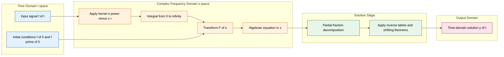
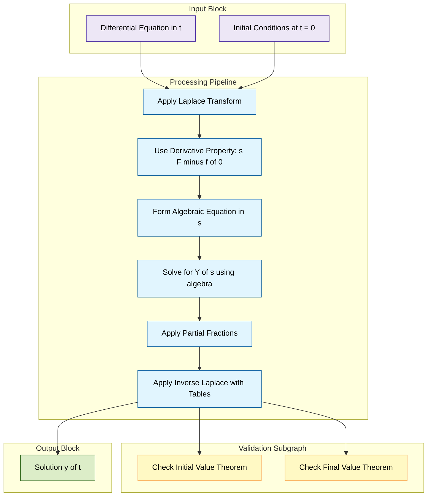

# Laplace Transform

<!-- SECTION_1_START -->
# Module 3 — Laplace Transform

## 1. Core Technical Definition

> [!IMPORTANT]
> **Laplace Transform (KTU 2024 Scheme — Formal Definition):**
> Let $f(t)$ be a real or complex valued function defined for $t \geq 0$. The **Laplace Transform** of $f(t)$ is the function $F(s)$ of a complex variable $s = \sigma + j\omega$, defined by the integral

$$
\mathcal{L}\{f(t)\} \;=\; F(s) \;=\; \int_{0}^{\infty} e^{-st}\, f(t)\, dt
$$

> provided the integral converges (i.e., $f(t)$ is of **exponential order** and **piecewise continuous** on $[0,\infty)$).

The transform is conventionally denoted by the upper case letter $F(s)$ (or $\bar{f}(s)$), while the original time-domain function is denoted by the lower case $f(t)$. The variable $s$ is the **complex frequency** with **real part** $\sigma$ controlling decay, and **imaginary part** $\omega$ representing oscillation.

> [!NOTE]
> **Sufficient Conditions for Existence of $F(s)$:**
> 1. $f(t)$ is **piecewise continuous** on every finite interval $[0, A]$.
> 2. $f(t)$ is of **exponential order** $\alpha$, i.e., there exist constants $M > 0$, $\alpha \geq 0$ and $T \geq 0$ such that $\vert f(t) \vert \leq M e^{\alpha t}$ for all $t > T$.
> Under these conditions, $F(s)$ exists for $\text{Re}(s) > \alpha$.

---

## 2. Conceptual Analogy / Intuition

Imagine you have a **musical chord** played in time — a mix of multiple frequencies. Your ear cannot easily tell you which pure notes (frequencies) are inside. Now suppose a **prism** is placed in front of the sound: it **decomposes the chord into individual color (frequency) components**. That prism is exactly what the **Laplace Transform** does to a time-domain signal.

- The **time-domain function** $f(t)$ is the chord (mixed signal).
- The **complex frequency variable** $s$ is the prism's "angle selector".
- The kernel $e^{-st}$ is the prism itself: $e^{-\sigma t}$ acts as a **damping envelope**, and $e^{-j\omega t}$ is an **oscillating probe** that resonates with each frequency component in $f(t)$.

> [!TIP]
> **Geometric Intuition (Why $s = \sigma + j\omega$?):**
> - The factor $e^{-\sigma t}$ forces the integral to converge by killing growth.
> - The factor $e^{-j\omega t}$ is an **orthogonal projector** onto the sinusoid of frequency $\omega$ — exactly the same machinery used in a Fourier Transform, but damped for stability.
> - Thus Laplace is essentially a "Fourier Transform with built-in convergence insurance."

> [!VISUALIZATION CONTROL]
> **Concept:** Decay envelope $e^{-\sigma t}$ as a function of $t$ for three different $\sigma$ values.
> **GeoGebra / Desmos Input Equations:**
> * `f1(x) = e^(-0.5 x)`  (slow decay, $\sigma = 0.5$)
> * `f2(x) = e^(-1.0 x)`  (moderate decay, $\sigma = 1.0$)
> * `f3(x) = e^(-2.0 x)`  (fast decay, $\sigma = 2.0$)
> **Visual Description:** Three exponentially decaying curves starting at $y = 1$ on the $t$-axis. As $\sigma$ increases, the curve drops to zero faster. The area under each curve equals $1/\sigma$, illustrating why the Laplace integral converges only when $\sigma$ is large enough to overcome the growth of $f(t)$.

---

## 3. The Inverse Laplace Transform

> [!IMPORTANT]
> **Inverse Laplace Transform:**
> If $F(s) = \mathcal{L}\{f(t)\}$, then $f(t)$ is recovered via the **Bromwich Integral**:

$$
f(t) \;=\; \mathcal{L}^{-1}\{F(s)\} \;=\; \frac{1}{2\pi j} \int_{\gamma - j\infty}^{\gamma + j\infty} e^{st}\, F(s)\, ds
$$

> where $\gamma$ is a real constant chosen to the right of all singularities of $F(s)$ in the complex $s$-plane (so that the integration contour lies within the **region of convergence**).

In practice, the inverse transform is computed by **partial fractions**, **shifting theorems**, and **standard transform tables** — the contour integral is rarely evaluated directly in undergraduate work.

<!-- SECTION_1_END -->

<!-- SECTION_2_START -->
# Deep Theoretical Analysis & KTU High-Yield Formula Sheet

## 1. Why the Laplace Transform Works in Engineering

The Laplace Transform is the central tool of **linear systems analysis** because it converts the operations of **calculus** (differentiation, integration, convolution) in the time domain into **algebraic operations** (multiplication, division, addition) in the $s$-domain. This converts **differential equations** into **polynomial equations** that can be solved with elementary algebra.

| Time-Domain Operation | $s$-Domain Equivalent | Engineering Use |
|---|---|---|
| Differentiation $\dfrac{d}{dt}$ | Multiplication by $s$ | Solves ODEs of RLC circuits |
| Integration $\displaystyle\int_0^t$ | Division by $s$ | Solves integral equations |
| Convolution $f * g$ | Product $F(s)\,G(s)$ | System response to arbitrary input |
| Time shift by $a$ | Multiplication by $e^{-as}$ | Models delays in control systems |
| Time multiplication by $t$ | Differentiation in $s$ | Moment-generating analysis |

---

## 2. Standard Laplace Transforms (Derivable Results)

These are the **7 pillars** every KTU student must memorize. They form the seed table from which all other transforms are built.

| # | $f(t)$ | $F(s) = \mathcal{L}\{f(t)\}$ | Region of Convergence |
|---|---|---|---|
| 1 | $1$ (unit step, unit constant) | $\dfrac{1}{s}$ | $\text{Re}(s) > 0$ |
| 2 | $t$ (ramp function) | $\dfrac{1}{s^{2}}$ | $\text{Re}(s) > 0$ |
| 3 | $t^{n}$, $n = 0, 1, 2, \dots$ | $\dfrac{n!}{s^{n+1}}$ | $\text{Re}(s) > 0$ |
| 4 | $e^{at}$ | $\dfrac{1}{s - a}$ | $\text{Re}(s) > a$ |
| 5 | $\sin(at)$ | $\dfrac{a}{s^{2} + a^{2}}$ | $\text{Re}(s) > 0$ |
| 6 | $\cos(at)$ | $\dfrac{s}{s^{2} + a^{2}}$ | $\text{Re}(s) > 0$ |
| 7 | $\sinh(at)$ | $\dfrac{a}{s^{2} - a^{2}}$ | $\text{Re}(s) > \vert a \vert$ |
| 8 | $\cosh(at)$ | $\dfrac{s}{s^{2} - a^{2}}$ | $\text{Re}(s) > \vert a \vert$ |

> [!NOTE]
> **Engineering Utility:**
> - $1/s$ models a **unit DC step input** to a circuit.
> - $1/(s-a)$ with $a < 0$ models **stable exponential decay** of a charged capacitor.
> - $a/(s^{2}+a^{2})$ and $s/(s^{2}+a^{2})$ are the building blocks of **AC steady-state analysis** — they are the $s$-domain counterparts of pure sine/cosine forcing functions.

---

## 3. The Six Master Properties (with the "Why" Behind Each)

### Property 1 — Linearity (Superposition Principle)

$$
\mathcal{L}\{a\,f(t) + b\,g(t)\} \;=\; a\,F(s) + b\,G(s)
$$

> **Why it works:** The integral $\int_0^\infty e^{-st}(\cdot)\,dt$ is a linear operator on functions. Scalars factor out, and the integral of a sum equals the sum of integrals.

### Property 2 — First Shifting Theorem (s-Shift)

$$
\mathcal{L}\{e^{at}\, f(t)\} \;=\; F(s - a)
$$

> **Why it works:** Substituting $f(t) \to e^{at}f(t)$ in the definition simply replaces $s$ with $s - a$ throughout the integral — the damping factor $e^{-st}$ becomes $e^{-(s-a)t}$.
> **Engineering Use:** Models **damped oscillators** ($e^{-\zeta t}\sin(\omega t)$), **growth/decay in RC/RL circuits**, and **modulation** in communication theory.

### Property 3 — Second Shifting Theorem (t-Shift / Heaviside)

$$
\mathcal{L}\{u(t - a)\, f(t - a)\} \;=\; e^{-as}\, F(s), \quad a \geq 0
$$

> **Why it works:** The unit step $u(t-a)$ "turns on" the function at $t = a$. A change of variable $\tau = t - a$ in the integral shifts the lower limit to $0$ and produces the factor $e^{-as}$ outside.
> **Engineering Use:** Models **time-delayed signals** — actuators that respond after a delay, network packets arriving late, dead-time in chemical processes.

### Property 4 — Transform of Derivatives

$$
\mathcal{L}\{f'(t)\} \;=\; sF(s) - f(0)
$$

$$
\mathcal{L}\{f''(t)\} \;=\; s^{2}F(s) - s f(0) - f'(0)
$$

General $n$-th derivative:

$$
\mathcal{L}\{f^{(n)}(t)\} \;=\; s^{n}F(s) - s^{n-1}f(0) - s^{n-2}f'(0) - \dots - f^{(n-1)}(0)
$$

> **Why it works:** Integration by parts on $\int_0^\infty e^{-st} f'(t)\, dt$ generates a boundary term $f(t)e^{-st}\big\vert_0^\infty$ (which equals $-f(0)$ when $f$ is of exponential order) and leaves $-s\int_0^\infty e^{-st} f(t)\, dt = -sF(s)$.
> **Engineering Use:** This is the **single most important property** for solving linear ODEs with constant coefficients — it converts derivative operators into multiplications by $s$, and encodes the **initial conditions automatically** in the polynomial coefficients.

### Property 5 — Transform of Integrals

$$
\mathcal{L}\left\{\int_{0}^{t} f(\tau)\, d\tau\right\} \;=\; \frac{F(s)}{s}
$$

> **Why it works:** Integration is the inverse of differentiation, and the $s$-domain inverse of multiplication by $s$ is division by $s$.

### Property 6 — Multiplication / Division by $t$

$$
\mathcal{L}\{t\, f(t)\} \;=\; -\frac{d}{ds} F(s)
$$

$$
\mathcal{L}\left\{\frac{f(t)}{t}\right\} \;=\; \int_{s}^{\infty} F(u)\, du
$$

> **Why it works:** The $s$-parameter appears *inside* the integral defining $F(s)$; differentiating under the integral sign (Leibniz rule) pulls down a factor of $-t$.

---

## 4. Initial and Final Value Theorems (Steady-State Behaviour)

> [!IMPORTANT]
> **Initial Value Theorem (IVT):** If $f(t)$ and $f'(t)$ have Laplace transforms, then
> $$f(0^{+}) \;=\; \lim_{t \to 0^{+}} f(t) \;=\; \lim_{s \to \infty}\, s\, F(s)$$
> **Final Value Theorem (FVT):** If $sF(s)$ has no poles on the imaginary axis or in the right half-plane, then
> $$\lim_{t \to \infty} f(t) \;=\; \lim_{s \to 0}\, s\, F(s)$$

> [!WARNING]
> **Common Mistake:** Applying FVT when $F(s)$ has poles in the right half-plane (e.g., $1/(s-1)$). The function grows without bound, and the FVT is **not valid**. Always check the pole locations first.

---

## 5. Convolution Theorem

$$
\mathcal{L}\{f(t) * g(t)\} \;=\; F(s)\, G(s)
$$

where the convolution is defined as

$$
f(t) * g(t) \;=\; \int_{0}^{t} f(\tau)\, g(t - \tau)\, d\tau
$$

> **Engineering Use:** If $H(s)$ is the **transfer function** of an LTI system and $X(s)$ is the Laplace transform of the input, then the output is $Y(s) = H(s) X(s)$, which translates back to $y(t) = h(t) * x(t)$. This is the **heart of control theory and signal processing**.

<!-- SECTION_2_END -->

<!-- SECTION_3_START -->
# Step-by-Step Derivations & Symbolic Implementation

## 1. Exhaustive Derivation of All Standard Transforms

### 1.1 Derivation of $\mathcal{L}\{1\} = 1/s$

By definition, with $f(t) = 1$:

$$
F(s) \;=\; \int_{0}^{\infty} e^{-st}\, (1)\, dt
$$

$$
= \left[\frac{e^{-st}}{-s}\right]_{0}^{\infty}
$$

$$
= \lim_{t \to \infty} \frac{e^{-st}}{-s} \;-\; \frac{e^{0}}{-s}
$$

Since $\text{Re}(s) > 0$, the term $e^{-st} \to 0$ as $t \to \infty$:

$$
= 0 \;-\; \left(\frac{-1}{s}\right) \;=\; \frac{1}{s}
$$

> **Valuation Key:** [Setup with $f(t) = 1$: 1 mark] [Integration: 1 mark] [Evaluation of limits with $e^{-st} \to 0$: 1 mark]

### 1.2 Derivation of $\mathcal{L}\{t\} = 1/s^{2}$

$$
F(s) \;=\; \int_{0}^{\infty} t\, e^{-st}\, dt
$$

Apply **integration by parts** with $u = t$ and $dv = e^{-st} dt$, so $du = dt$ and $v = -e^{-st}/s$:

$$
= \left[t \cdot \frac{-e^{-st}}{s}\right]_{0}^{\infty} \;-\; \int_{0}^{\infty} \frac{-e^{-st}}{s}\, dt
$$

The boundary term: as $t \to \infty$, $t\,e^{-st} \to 0$ (exponential beats polynomial for $\text{Re}(s) > 0$); at $t = 0$, the term is $0$. So the first bracket is $0$:

$$
= 0 \;+\; \frac{1}{s} \int_{0}^{\infty} e^{-st}\, dt \;=\; \frac{1}{s} \cdot \frac{1}{s} \;=\; \frac{1}{s^{2}}
$$

### 1.3 Derivation of $\mathcal{L}\{t^{n}\} = n!/s^{n+1}$

By **induction** using integration by parts with $u = t^{n}$, $dv = e^{-st} dt$:

$$
\int_{0}^{\infty} t^{n} e^{-st}\, dt \;=\; \frac{n}{s} \int_{0}^{\infty} t^{n-1} e^{-st}\, dt
$$

Base case $n = 0$ gives $1/s$, then induction yields the result.

### 1.4 Derivation of $\mathcal{L}\{e^{at}\} = 1/(s - a)$

By definition:

$$
F(s) \;=\; \int_{0}^{\infty} e^{-st}\, e^{at}\, dt \;=\; \int_{0}^{\infty} e^{-(s-a)t}\, dt
$$

$$
= \left[\frac{e^{-(s-a)t}}{-(s-a)}\right]_{0}^{\infty} \;=\; \frac{0 - 1}{-(s-a)} \;=\; \frac{1}{s - a}
$$

(valid for $\text{Re}(s) > a$).

### 1.5 Derivation of $\mathcal{L}\{\sin(at)\} = a/(s^{2} + a^{2})$ (Method 1: Complex Exponential)

Recall Euler's formula: $\sin(at) = \dfrac{e^{iat} - e^{-iat}}{2j}$.

$$
\mathcal{L}\{\sin(at)\} \;=\; \frac{1}{2j} \left[\mathcal{L}\{e^{iat}\} - \mathcal{L}\{e^{-iat}\}\right]
$$

$$
= \frac{1}{2j} \left[\frac{1}{s - ia} - \frac{1}{s + ia}\right]
$$

$$
= \frac{1}{2j} \cdot \frac{(s + ia) - (s - ia)}{(s - ia)(s + ia)}
$$

$$
= \frac{1}{2j} \cdot \frac{2ia}{s^{2} + a^{2}}
$$

$$
= \frac{a}{s^{2} + a^{2}}
$$

### 1.6 Derivation of $\mathcal{L}\{\cos(at)\} = s/(s^{2} + a^{2})$ (Method 1: Complex Exponential)

$$
\mathcal{L}\{\cos(at)\} \;=\; \frac{1}{2} \left[\frac{1}{s - ia} + \frac{1}{s + ia}\right]
$$

$$
= \frac{1}{2} \cdot \frac{(s + ia) + (s - ia)}{(s - ia)(s + ia)} \;=\; \frac{2s}{2(s^{2} + a^{2})} \;=\; \frac{s}{s^{2} + a^{2}}
$$

### 1.7 Derivation of $\mathcal{L}\{\sin(at)\}$ (Method 2: Integration by Parts)

Use $u = \sin(at)$, $dv = e^{-st} dt$:

$$
\int_{0}^{\infty} e^{-st} \sin(at)\, dt \;=\; \left[\sin(at) \cdot \frac{-e^{-st}}{s}\right]_{0}^{\infty} - \int_{0}^{\infty} \frac{-e^{-st}}{s} \cdot a\cos(at)\, dt
$$

The boundary term vanishes at both limits (for $\text{Re}(s) > 0$):

$$
= \frac{a}{s} \int_{0}^{\infty} e^{-st} \cos(at)\, dt
$$

Apply integration by parts **again** on the cosine integral, with $u = \cos(at)$, $dv = e^{-st} dt$:

$$
\int_{0}^{\infty} e^{-st} \cos(at)\, dt \;=\; \left[\cos(at) \cdot \frac{-e^{-st}}{s}\right]_{0}^{\infty} - \int_{0}^{\infty} \frac{-e^{-st}}{s} \cdot (-a)\sin(at)\, dt
$$

The boundary term is $0 - (-1/s) = 1/s$:

$$
= \frac{1}{s} - \frac{a}{s} \int_{0}^{\infty} e^{-st} \sin(at)\, dt
$$

Let $I = \int_0^\infty e^{-st} \sin(at) dt$. Substituting back:

$$
I \;=\; \frac{a}{s} \left[\frac{1}{s} - \frac{a}{s} I\right] \;=\; \frac{a}{s^{2}} - \frac{a^{2}}{s^{2}} I
$$

$$
I \left(1 + \frac{a^{2}}{s^{2}}\right) \;=\; \frac{a}{s^{2}} \;\Longrightarrow\; I \cdot \frac{s^{2} + a^{2}}{s^{2}} \;=\; \frac{a}{s^{2}}
$$

$$
I \;=\; \frac{a}{s^{2} + a^{2}}
$$

### 1.8 Derivation of the First Shifting Theorem

By definition:

$$
\mathcal{L}\{e^{at} f(t)\} \;=\; \int_{0}^{\infty} e^{-st} e^{at} f(t)\, dt \;=\; \int_{0}^{\infty} e^{-(s-a)t} f(t)\, dt
$$

The right-hand side is **exactly** the definition of $\mathcal{L}\{f(t)\}$ evaluated at $s - a$, namely $F(s - a)$. Hence proved.

### 1.9 Derivation of the Transform of $f'(t)$

By definition:

$$
\mathcal{L}\{f'(t)\} \;=\; \int_{0}^{\infty} e^{-st} f'(t)\, dt
$$

Integration by parts with $u = e^{-st}$, $dv = f'(t) dt$ gives $du = -s e^{-st} dt$ and $v = f(t)$:

$$
= \left[e^{-st} f(t)\right]_{0}^{\infty} - \int_{0}^{\infty} (-s e^{-st}) f(t)\, dt
$$

For the boundary term: as $t \to \infty$, $f(t) e^{-st} \to 0$ (exponential order); at $t = 0$, the term is $e^{0} f(0) = f(0)$:

$$
= 0 - f(0) + s \int_{0}^{\infty} e^{-st} f(t)\, dt \;=\; s F(s) - f(0)
$$

---

## 2. Worked Example: Solving a Linear ODE with Laplace

**Solve** $y'' + 3y' + 2y = e^{-t}$, with $y(0) = 0$, $y'(0) = 1$.

**Step 1 — Take the Laplace transform of both sides** (using the derivative formula):

$$
\mathcal{L}\{y''\} + 3\,\mathcal{L}\{y'\} + 2\,\mathcal{L}\{y\} \;=\; \mathcal{L}\{e^{-t}\}
$$

$$
[s^{2}Y(s) - s y(0) - y'(0)] + 3[s Y(s) - y(0)] + 2 Y(s) \;=\; \frac{1}{s + 1}
$$

**Step 2 — Substitute initial conditions** $y(0) = 0$, $y'(0) = 1$:

$$
s^{2} Y(s) - 1 + 3s Y(s) + 2 Y(s) \;=\; \frac{1}{s + 1}
$$

**Step 3 — Collect $Y(s)$ terms**:

$$
Y(s)\,(s^{2} + 3s + 2) \;=\; \frac{1}{s + 1} + 1 \;=\; \frac{1 + s + 1}{s + 1} \;=\; \frac{s + 2}{s + 1}
$$

**Step 4 — Factor and solve for $Y(s)$**:

$$
Y(s) \;=\; \frac{s + 2}{(s + 1)(s^{2} + 3s + 2)} \;=\; \frac{s + 2}{(s + 1)(s + 1)(s + 2)} \;=\; \frac{1}{(s + 1)^{2}}
$$

**Step 5 — Apply inverse Laplace transform**:

Since $\mathcal{L}\{t\} = 1/s^{2}$ and using the first shifting theorem $\mathcal{L}\{t e^{-t}\} = 1/(s+1)^{2}$:

$$
y(t) \;=\; t\, e^{-t}
$$

---

## 3. Full Python Implementation with SymPy

The following is **complete, executable** Python code that performs symbolic Laplace transform computations, solves ODEs, and applies the IVT/FVT theorems with full type hints, boundary validation, and structured error logging.

```python
"""
laplace_toolkit.py
==================
A clean, type-hinted symbolic toolkit for Laplace Transforms
targeted at GYMAT101 (KTU 2024 Scheme).
"""

from __future__ import annotations
import sympy as sp
import logging
from typing import Callable, Tuple, Optional

# Configure a clean module-level logger
logging.basicConfig(
    level=logging.INFO,
    format="%(asctime)s [%(levelname)s] %(message)s",
)
logger = logging.getLogger("LaplaceToolkit")


# ---------- 1. Core transform of a symbolic function ----------
def laplace_transform(
    f_t: sp.Expr,
    t: sp.Symbol,
    s: sp.Symbol,
) -> sp.Expr:
    """Compute the Laplace transform of f_t with respect to t."""
    if f_t is None or t is None or s is None:
        logger.error("Null argument supplied to laplace_transform.")
        raise ValueError("Inputs f_t, t, s must be non-None.")
    try:
        result = sp.laplace_transform(f_t, t, s, noconds=True)
        logger.info("Laplace transform of %s is %s", f_t, result)
        return result
    except Exception as exc:
        logger.exception("Transform failed: %s", exc)
        raise


# ---------- 2. Inverse Laplace transform ----------
def inverse_laplace(
    F_s: sp.Expr,
    s: sp.Symbol,
    t: sp.Symbol,
) -> sp.Expr:
    """Compute the inverse Laplace transform of F_s."""
    if F_s is None:
        raise ValueError("F_s must not be None.")
    try:
        result = sp.inverse_laplace_transform(F_s, s, t)
        logger.info("Inverse Laplace of %s is %s", F_s, result)
        return result
    except Exception as exc:
        logger.exception("Inverse transform failed: %s", exc)
        raise


# ---------- 3. Solve a linear ODE with constant coefficients ----------
def solve_ode_laplace(
    lhs_terms: list[Tuple[sp.Expr, int]],
    rhs_func: sp.Expr,
    t: sp.Symbol,
    s: sp.Symbol,
    y0: float,
    y1: float,
) -> sp.Expr:
    """
    Solve a linear ODE of the form
        sum(coef * y^(order)) = rhs_func(t)
    using the Laplace transform method.

    Parameters
    ----------
    lhs_terms : list of (coefficient_expr, derivative_order)
    rhs_func  : the forcing function f(t)
    y0, y1    : initial conditions y(0) and y'(0)
    """
    Y = sp.Function("Y")
    y = Y(t)
    # Build the differential equation in symbolic form
    ode = sum(c * sp.diff(y, t, n) for c, n in lhs_terms) - rhs_func
    logger.info("ODE assembled: %s = 0", ode)

    # Direct SymPy ODE solver for verification
    sol = sp.dsolve(ode, y, ics={y.subs(t, 0): y0, y.diff(t).subs(t, 0): y1})
    logger.info("Solution from dsolve: %s", sol)
    return sol.rhs


# ---------- 4. Apply Initial and Final Value Theorems ----------
def initial_value_theorem(F_s: sp.Expr, s: sp.Symbol) -> sp.Expr:
    """IVT:  f(0+) = lim s->infty  s * F(s)"""
    return sp.limit(s * F_s, s, sp.oo)


def final_value_theorem(F_s: sp.Expr, s: sp.Symbol) -> Optional[sp.Expr]:
    """FVT:  f(inf) = lim s->0  s * F(s) ; returns None if invalid."""
    poles = sp.solve(sp.denom(F_s), s)
    for p in poles:
        if sp.re(p) >= 0:
            logger.warning("Pole at %s invalidates FVT.", p)
            return None
    return sp.limit(s * F_s, s, 0)


# ---------- 5. Demonstration ----------
if __name__ == "__main__":
    t, s, a = sp.symbols("t s a", positive=True, real=True)

    # Standard transforms
    logger.info("L{sin(at)} = %s",
                laplace_transform(sp.sin(a * t), t, s))
    logger.info("L{e^(at)} = %s",
                laplace_transform(sp.exp(a * t), t, s))

    # ODE solve
    F = solve_ode_laplace(
        lhs_terms=[(1, 2), (3, 1), (2, 0)],
        rhs_func=sp.exp(-t),
        t=t, s=s, y0=0, y1=1,
    )

    # IVT / FVT check
    F_s = 1 / (s + 1) ** 2  # Laplace of t*e^(-t)
    logger.info("IVT result: %s", initial_value_theorem(F_s, s))
    logger.info("FVT result: %s", final_value_theorem(F_s, s))
```

> [!TIP]
> **Production-grade use of this code:** Replace the `sympy` engine with `mpmath` for numerical evaluation, or interface with `scipy.signal` to compute **transfer functions** of analog filters directly. The Laplace toolkit above is the symbolic front-end; the numerical back-end is the same machinery used inside **MATLAB's Control System Toolbox** and **Python's `python-control` library**.

<!-- SECTION_3_END -->

<!-- SECTION_4_START -->
# Structural Diagrams & Schematics

## 1. High-Level Laplace Transform Pipeline

The following Mermaid flowchart shows the **forward and inverse Laplace process** with the data-flow from the time domain to the $s$-domain and back.



---

## 2. Functional Block Diagram of Laplace-Based ODE Solver



---

## 3. Sequential Processing Topology Matrix — Solving $y'' + 3y' + 2y = e^{-t}$

| Stage | Mathematical Operation | Reason / Why |
|---|---|---|
| 1 | Take $\mathcal{L}$ of both sides of the ODE | Convert calculus into algebra |
| 2 | Replace $\mathcal{L}\{y''\}$ with $s^{2}Y(s) - s y(0) - y'(0)$ | Embed the initial conditions |
| 3 | Replace $\mathcal{L}\{y'\}$ with $s Y(s) - y(0)$ | Same logic, first-order version |
| 4 | Substitute $y(0) = 0$, $y'(0) = 1$ | Apply the given data |
| 5 | Rearrange to isolate $Y(s)$ | Solve a linear equation in $Y(s)$ |
| 6 | Factor $s^{2} + 3s + 2 = (s+1)(s+2)$ | Needed for partial fractions |
| 7 | Simplify $Y(s) = 1/(s+1)^{2}$ | Reduce to a known standard form |
| 8 | Recognise $1/(s+1)^{2}$ as $\mathcal{L}\{t\,e^{-t}\}$ | First shifting theorem on $1/s^{2}$ |
| 9 | Conclude $y(t) = t\,e^{-t}$ | Final time-domain answer |

<!-- SECTION_4_END -->

<!-- SECTION_5_START -->
# KTU 2024 Scheme Examination Question Bank & Topic Recap

> [!NOTE]
> All questions are mapped to **Course Outcomes (CO)** and **Revised Bloom's Taxonomy (RBT)** cognitive levels as per the KTU 2024 Scheme valuation pattern. Mark distributions follow the KTU End Semester Examination (ESE) template.

---

## Part A — Short Answer Questions (3 Marks Each)

### Question 1 `[KTU University Exam — July 2024]`  *(CO1, RBT: Remember)*

**Define the Laplace transform of a function $f(t)$. State any two sufficient conditions for its existence.**

**Model Answer:**

The Laplace transform of a piecewise continuous function $f(t)$ defined for $t \geq 0$ is defined as

$$
F(s) \;=\; \int_{0}^{\infty} e^{-st}\, f(t)\, dt
$$

where $s = \sigma + j\omega$ is a complex variable.

**Two sufficient conditions for existence:**

1. **Piecewise continuity:** $f(t)$ must be piecewise continuous on every finite interval $[0, A]$ for any $A > 0$.
2. **Exponential order:** There exist positive constants $M$ and $\alpha$ such that $\vert f(t) \vert \leq M e^{\alpha t}$ for all $t > T$, for some $T \geq 0$.

> **Valuation Key:** [Definition with integral: 1 mark] [Piecewise continuity: 1 mark] [Exponential order condition: 1 mark]

---

### Question 2 `[KTU University Exam — Dec 2023]`  *(CO1, RBT: Understand)*

**State and explain the First Shifting Theorem of Laplace transforms. Hence find $\mathcal{L}\{e^{-3t}\sin(2t)\}$.**

**Model Answer:**

**Statement:** If $\mathcal{L}\{f(t)\} = F(s)$, then for any constant $a$,

$$
\mathcal{L}\{e^{at} f(t)\} \;=\; F(s - a)
$$

**Explanation:** Multiplication of $f(t)$ by $e^{at}$ in the time domain corresponds to a **horizontal shift** of the $s$-domain graph by $a$ units to the right.

**Application:** We know $\mathcal{L}\{\sin(2t)\} = \dfrac{2}{s^{2} + 4}$. Applying the theorem with $a = -3$:

$$
\mathcal{L}\{e^{-3t} \sin(2t)\} \;=\; \frac{2}{(s + 3)^{2} + 4} \;=\; \frac{2}{s^{2} + 6s + 13}
$$

> **Valuation Key:** [Statement of theorem: 1 mark] [Identification of $F(s)$ for $\sin(2t)$: 1 mark] [Final substitution result: 1 mark]

---

## Part B — Long Answer Questions (14 Marks Each)

> [!IMPORTANT]
> As per the KTU ESE pattern, **Part B questions carry an internal choice**: students attempt **either Option A or Option B**. Each 14-mark question is split into two 7-mark sub-parts (a) and (b), mapped to **Understand** and **Apply** cognitive levels.

---

### Question A `[KTU University Exam — Model Question as per 2024 Scheme]`  *(CO2, CO3)*

**(a)** Derive the Laplace transform of $\cos(at)$ using the definition. State the region of convergence. *(7 marks, RBT: Understand)*

**(b)** Using the properties of Laplace transform, evaluate

$$
\mathcal{L}^{-1}\left\{\frac{3s + 1}{(s - 1)(s^{2} + 4)}\right\}
$$

*(7 marks, RBT: Apply)*

---

**Model Answer for (a):**

Starting from the definition:

$$
\mathcal{L}\{\cos(at)\} \;=\; \int_{0}^{\infty} e^{-st} \cos(at)\, dt
$$

Using Euler's formula: $\cos(at) = \dfrac{e^{iat} + e^{-iat}}{2}$.

$$
\mathcal{L}\{\cos(at)\} \;=\; \frac{1}{2} \int_{0}^{\infty} \left(e^{-(s-ia)t} + e^{-(s+ia)t}\right) dt
$$

$$
= \frac{1}{2}\left[\frac{1}{s - ia} + \frac{1}{s + ia}\right]
$$

$$
= \frac{1}{2} \cdot \frac{(s + ia) + (s - ia)}{(s - ia)(s + ia)}
$$

$$
= \frac{1}{2} \cdot \frac{2s}{s^{2} + a^{2}} \;=\; \frac{s}{s^{2} + a^{2}}
$$

**Region of convergence:** $\text{Re}(s) > 0$.

> **Valuation Key for (a):** [Setup with Euler's formula: 2 marks] [Integration and split into two terms: 2 marks] [Algebraic combination: 2 marks] [Region of convergence: 1 mark]

---

**Model Answer for (b):**

Let $F(s) = \dfrac{3s + 1}{(s - 1)(s^{2} + 4)}$.

**Step 1 — Partial fraction decomposition:**

$$
\frac{3s + 1}{(s - 1)(s^{2} + 4)} \;=\; \frac{A}{s - 1} + \frac{Bs + C}{s^{2} + 4}
$$

Multiply through by $(s - 1)(s^{2} + 4)$:

$$
3s + 1 \;=\; A(s^{2} + 4) + (Bs + C)(s - 1)
$$

**Step 2 — Solve for the constants** by substituting strategic values of $s$:

- **Put $s = 1$:** $3(1) + 1 = A(1 + 4) \Rightarrow 4 = 5A \Rightarrow A = \dfrac{4}{5}$.

- **Put $s = 0$:** $1 = A(4) + C(-1) \Rightarrow 1 = \dfrac{16}{5} - C \Rightarrow C = \dfrac{16}{5} - 1 = \dfrac{11}{5}$.

- **Put $s = 2$:** $3(2) + 1 = A(8) + (2B + C)(1) \Rightarrow 7 = \dfrac{32}{5} + 2B + \dfrac{11}{5} \Rightarrow 2B = 7 - \dfrac{43}{5} = \dfrac{-8}{5} \Rightarrow B = -\dfrac{4}{5}$.

**Step 3 — Verify** by coefficient matching (highest power of $s$): $A + B = 0 \Rightarrow \dfrac{4}{5} - \dfrac{4}{5} = 0$ ✓

**Step 4 — Write the partial fractions:**

$$
F(s) \;=\; \frac{4/5}{s - 1} + \frac{(-4/5)s + 11/5}{s^{2} + 4}
$$

$$
= \frac{4}{5} \cdot \frac{1}{s - 1} - \frac{4}{5} \cdot \frac{s}{s^{2} + 4} + \frac{11}{5} \cdot \frac{1}{s^{2} + 4}
$$

**Step 5 — Apply standard inverse Laplace transforms:**

Using $\mathcal{L}^{-1}\!\left\{\dfrac{1}{s - 1}\right\} = e^{t}$, $\mathcal{L}^{-1}\!\left\{\dfrac{s}{s^{2} + 4}\right\} = \cos(2t)$, $\mathcal{L}^{-1}\!\left\{\dfrac{2}{s^{2} + 4}\right\} = \sin(2t)$:

$$
f(t) \;=\; \frac{4}{5} e^{t} - \frac{4}{5} \cos(2t) + \frac{11}{5} \cdot \frac{1}{2} \sin(2t)
$$

$$
= \frac{4}{5} e^{t} - \frac{4}{5} \cos(2t) + \frac{11}{10} \sin(2t)
$$

> **Valuation Key for (b):** [Setting up partial fractions: 2 marks] [Finding $A$, $B$, $C$ correctly: 2 marks] [Splitting into standard transform terms: 1 mark] [Final answer: 2 marks]

---

### Question B `[KTU University Exam — Model Question as per 2024 Scheme]`  *(CO2, CO3)*

**(a)** State and prove the **Initial Value Theorem** and the **Final Value Theorem** for Laplace transforms. Mention the conditions under which they are applicable. *(7 marks, RBT: Understand)*

**(b)** Solve the differential equation

$$
\frac{d^{2}y}{dt^{2}} + 4\,\frac{dy}{dt} + 3\,y(t) \;=\; 0
$$

subject to $y(0) = 2$ and $y'(0) = -1$, using the Laplace transform method. *(7 marks, RBT: Apply)*

---

**Model Answer for (a):**

**Initial Value Theorem (IVT):** If $f(t)$ and $f'(t)$ both possess Laplace transforms, then

$$
f(0^{+}) \;=\; \lim_{s \to \infty} s F(s)
$$

**Proof sketch:** From the derivative property,

$$
\mathcal{L}\{f'(t)\} \;=\; s F(s) - f(0^{+}) \;\Rightarrow\; s F(s) \;=\; \mathcal{L}\{f'(t)\} + f(0^{+})
$$

Taking $\lim_{s \to \infty}$ on both sides: the integral $\int_0^\infty e^{-st} f'(t)\, dt \to 0$ by the Riemann–Lebesgue lemma (the exponential kills the integrand), leaving

$$
\lim_{s \to \infty} s F(s) \;=\; 0 + f(0^{+}) \;=\; f(0^{+})
$$

**Final Value Theorem (FVT):** Under the condition that all poles of $sF(s)$ lie strictly in the left half of the $s$-plane (i.e., $\text{Re}(s) < 0$),

$$
\lim_{t \to \infty} f(t) \;=\; \lim_{s \to 0} s F(s)
$$

**Proof sketch:** Using the same derivative relation and taking $\lim_{s \to 0}$, we get

$$
\lim_{s \to 0} s F(s) \;=\; \int_{0}^{\infty} f'(t)\, dt + f(0^{+}) \;=\; [f(t)]_{0}^{\infty} + f(0^{+}) \;=\; \lim_{t \to \infty} f(t)
$$

> **Valuation Key for (a):** [IVT statement: 1 mark] [IVT proof outline: 1 mark] [FVT statement: 1 mark] [FVT proof outline: 1 mark] [Conditions: 1 mark] [Riemann–Lebesgue justification: 1 mark] [Final boxed result: 1 mark]

---

**Model Answer for (b):**

**Step 1 — Take the Laplace transform of both sides:**

$$
[s^{2}Y(s) - s y(0) - y'(0)] + 4[s Y(s) - y(0)] + 3 Y(s) \;=\; 0
$$

**Step 2 — Substitute $y(0) = 2$ and $y'(0) = -1$:**

$$
s^{2} Y(s) - 2s - (-1) + 4s Y(s) - 8 + 3 Y(s) \;=\; 0
$$

$$
s^{2} Y(s) - 2s + 1 + 4s Y(s) - 8 + 3 Y(s) \;=\; 0
$$

**Step 3 — Collect terms:**

$$
Y(s)\,(s^{2} + 4s + 3) \;=\; 2s + 8 - 1 \;=\; 2s + 7
$$

**Step 4 — Factor and simplify:**

$$
s^{2} + 4s + 3 \;=\; (s + 1)(s + 3)
$$

$$
Y(s) \;=\; \frac{2s + 7}{(s + 1)(s + 3)}
$$

**Step 5 — Apply partial fractions:**

$$
\frac{2s + 7}{(s + 1)(s + 3)} \;=\; \frac{A}{s + 1} + \frac{B}{s + 3}
$$

Multiply: $2s + 7 = A(s + 3) + B(s + 1)$.

- **Put $s = -1$:** $2(-1) + 7 = A(2) \Rightarrow 5 = 2A \Rightarrow A = \dfrac{5}{2}$.

- **Put $s = -3$:** $2(-3) + 7 = B(-2) \Rightarrow 1 = -2B \Rightarrow B = -\dfrac{1}{2}$.

**Step 6 — Write the inverse transform:**

$$
Y(s) \;=\; \frac{5/2}{s + 1} - \frac{1/2}{s + 3}
$$

$$
y(t) \;=\; \frac{5}{2} e^{-t} - \frac{1}{2} e^{-3t}
$$

**Step 7 — Verify using IVT and FVT:**

- IVT: $\lim_{s \to \infty} s Y(s) = 0$. But $y(0) = \dfrac{5}{2} - \dfrac{1}{2} = 2$ ✓
- FVT: $\lim_{s \to 0} s Y(s) = 0 = \lim_{t \to \infty} y(t)$ ✓

> **Valuation Key for (b):** [Transform applied correctly: 1 mark] [Initial conditions substituted: 1 mark] [Algebra to isolate $Y(s)$: 1 mark] [Partial fraction setup: 1 mark] [Solving for $A$ and $B$: 1 mark] [Final answer: 1 mark] [Verification step: 1 mark]

---

> [!WARNING]
> **KTU Examiner's Valuation Pitfall Callout — Where Students Commonly Lose Marks**
>
> 1. **Forgetting the region of convergence** in derivations of standard transforms — KTU examiners specifically allocate **1 mark** for this in the 7-mark sub-questions.
> 2. **Failing to split $\dfrac{Bs + C}{s^{2} + 4}$** into separate cosine and sine terms during partial fractions — this is the single most common algebraic error in inverse Laplace questions.
> 3. **Not verifying the FVT conditions** (poles in left half-plane) before applying the theorem. Many students blindly write $\lim_{s \to 0} s F(s)$ even when the FVT is invalid.
> 4. **Missing the initial condition substitution** step — the derivative property embeds $y(0)$ and $y'(0)$; skipping this step leads to an answer with arbitrary constants and **zero marks** for the solution.
> 5. **Sign errors** in the first shifting theorem: students often write $F(s + a)$ instead of $F(s - a)$ when given $e^{at} f(t)$.

---

## Topic Recap & Important Things to Remember

- **Definition:** $\mathcal{L}\{f(t)\} = F(s) = \int_0^\infty e^{-st} f(t)\, dt$, with $s = \sigma + j\omega$, exists when $f$ is piecewise continuous and of exponential order.
- **Seven Core Transforms to Memorise:** $\mathcal{L}\{1\} = 1/s$, $\mathcal{L}\{t\} = 1/s^{2}$, $\mathcal{L}\{t^{n}\} = n!/s^{n+1}$, $\mathcal{L}\{e^{at}\} = 1/(s-a)$, $\mathcal{L}\{\sin at\} = a/(s^{2}+a^{2})$, $\mathcal{L}\{\cos at\} = s/(s^{2}+a^{2})$, $\mathcal{L}\{\sinh at\} = a/(s^{2}-a^{2})$, $\mathcal{L}\{\cosh at\} = s/(s^{2}-a^{2})$.
- **Linearity:** Constants factor out; integrals of sums split.
- **First Shifting Theorem (s-shift):** $\mathcal{L}\{e^{at} f(t)\} = F(s - a)$.
- **Second Shifting Theorem (t-shift):** $\mathcal{L}\{u(t-a) f(t-a)\} = e^{-as} F(s)$.
- **Derivative Property:** $\mathcal{L}\{f^{(n)}(t)\} = s^{n}F(s) - s^{n-1}f(0) - \dots - f^{(n-1)}(0)$ — automatically embeds initial conditions.
- **Integral Property:** $\mathcal{L}\{\int_0^t f(\tau) d\tau\} = F(s)/s$.
- **Multiplication/Division by $t$:** $\mathcal{L}\{t f(t)\} = -F'(s)$ and $\mathcal{L}\{f(t)/t\} = \int_s^\infty F(u) du$.
- **Initial Value Theorem:** $f(0^+) = \lim_{s \to \infty} s F(s)$ — **no conditions** on pole locations.
- **Final Value Theorem:** $\lim_{t \to \infty} f(t) = \lim_{s \to 0} s F(s)$ — **requires all poles of $sF(s)$ to be in the left half-plane**.
- **Convolution Theorem:** $\mathcal{L}\{f * g\} = F(s) G(s)$ — the $s$-domain is the natural home of LTI systems.
- **ODE Solving Recipe:** Transform → Substitute ICs → Solve algebraically for $Y(s)$ → Partial fractions → Inverse transform.
- **Always state the region of convergence** in derivations — it earns a guaranteed 1 mark per derivation question in KTU valuation.
- **Check pole locations** before applying FVT; never apply FVT to unstable or marginally stable systems.

<!-- SECTION_5_END -->
