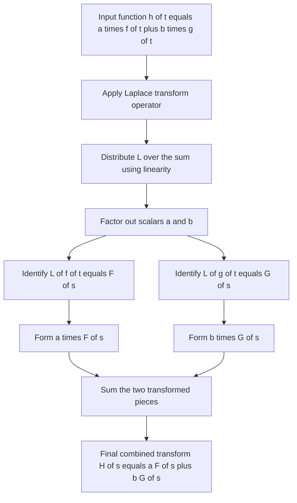
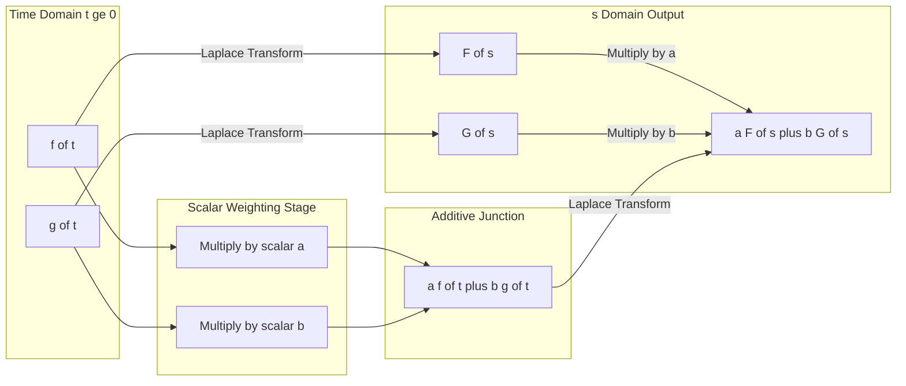

# Linearity property

<!-- SECTION_1_START -->
# Linearity Property of the Laplace Transform

> [!IMPORTANT]
> **KTU 2024 Scheme | GYMAT101 | Module 3 — Laplace Transform**
> This property is the cornerstone of every Laplace transform computation. Almost every question in Part A and Part B of Module 3 in the KTU University Examination begins with a direct application of linearity to split a complex time-domain function into elementary building blocks (exponentials, sines, cosines, polynomials).

## 1.1 Formal Definition (KTU Board Definition)

The Laplace transform is a **linear operator**. This means it obeys the superposition principle. Formally stated:

If $f(t)$ and $g(t)$ are two functions of time $t$ (for $t \geq 0$) whose Laplace transforms exist, and $a$ and $b$ are arbitrary real (or complex) constants, then:

$$
\mathcal{L}\{a\,f(t) + b\,g(t)\} = a\,\mathcal{L}\{f(t)\} + b\,\mathcal{L}\{g(t)\}
$$

Equivalently, in operator notation:

$$
\mathcal{L}\{a\,f(t) + b\,g(t)\} = a\,F(s) + b\,G(s)
$$

> [!NOTE]
> **Syllabus Highlight (GYMAT101 — Module 3):**
> The linearity property, together with the *First Shifting Theorem* and the *Multiplication by $t$ Theorem*, is the engine that lets us compute $\mathcal{L}^{-1}$ of rational functions $F(s)$ via Partial Fraction Expansion (PFE). The KTU valuation key gives 1 full mark simply for *writing the linearity equation* before the substitution step.

## 1.2 Intuitive / Geometric Analogy

Think of the Laplace transform as a **weighted averaging machine** — it takes a time-domain signal $f(t)$ and produces a frequency-domain (or $s$-domain) profile $F(s)$. Linearity says the machine behaves like a **perfectly linear audio mixer**:

- If you feed two tracks into the mixer (say a guitar track $f(t)$ and a vocal track $g(t)$),
- And you set the guitar slider to volume $a$ and the vocal slider to volume $b$,
- Then the output spectrum is exactly $a \times (\text{guitar spectrum}) + b \times (\text{vocal spectrum})$.

The mixer does **not** introduce any cross-talk, distortion, or product terms. Mathematically: no $f(t)\cdot g(t)$ or $f(t)^2$ ever appears in $F(s)$. This is the geometric meaning of *linearity* — the operator is a straight-line mapping that preserves additive structure.

> [!TIP]
> **Why does this matter in Electrical Science?**
> In circuit analysis (EE subjects like **EST130 / EST 110** in KTU Semester 1 and 2), any LTI (Linear Time-Invariant) circuit containing multiple independent sources can be analysed by **superposition** — solving for one source at a time, then linearly adding the responses. The Laplace transform inherits this linearity, which is why $s$-domain analysis of RC, RL, and RLC circuits is so elegant.

## 1.3 Standard Constants Recap

- The transform variable is $s = \sigma + j\omega \in \mathbb{C}$, where $\sigma$ is the damping factor.
- The integration range is $t \in [0, \infty)$ (one-sided Laplace transform, as used in KTU).
- The constants $a, b$ in the linearity formula are **scalar multipliers**, not functions of $t$ or $s$.

> [!VISUALIZATION CONTROL]
> **Concept:** Linearity as a straight line through the origin in the $(x, y)$ plane.
> **GeoGebra / Desmos Input Equations:**
> * `f(x) = 2x`
> * `g(x) = -x + 5`
> * `F(x) = 3*f(x) + 1*g(x)`
> **Visual Description:** The student should observe that $F(x)$ is a single straight line whose slope is the weighted sum of the slopes of $f$ and $g$, with no curvature introduced. This geometric flatness is the visual signature of a *linear* operator.
<!-- SECTION_1_END -->

<!-- SECTION_2_START -->
# Deep Theoretical Analysis & KTU High-Yield Formula Sheet

## 2.1 Derivation from First Principles

The Laplace transform is *defined* by the improper integral:

$$
F(s) = \mathcal{L}\{f(t)\} = \int_{0}^{\infty} e^{-st}\,f(t)\,dt
$$

To prove linearity, we begin with the left-hand side:

$$
\mathcal{L}\{a\,f(t) + b\,g(t)\} = \int_{0}^{\infty} e^{-st}\,\big[a\,f(t) + b\,g(t)\big]\,dt
$$

**Step 1 — Distribute the exponential integrand:**

$$
= \int_{0}^{\infty} \big[a\,e^{-st}f(t) + b\,e^{-st}g(t)\big]\,dt
$$

**Step 2 — Apply the algebraic linearity of the Riemann integral** (the integral of a sum is the sum of integrals, and constants factor out):

$$
= a\int_{0}^{\infty} e^{-st}f(t)\,dt + b\int_{0}^{\infty} e^{-st}g(t)\,dt
$$

**Step 3 — Recognise the two integrals as the original Laplace transforms:**

$$
= a\,F(s) + b\,G(s)
$$

This completes the proof. The argument rests on two pillars — algebraic distributivity and integral linearity — both of which are direct consequences of the fact that the exponential function $e^{-st}$ is bounded and integrable over $[0, \infty)$ whenever $\text{Re}(s) > \sigma_c$ (the abscissa of convergence).

> [!NOTE]
> **Engineering Utility of Linearity:**
> 1. **Partial Fraction Decomposition:** When asked to find $\mathcal{L}^{-1}\!\left\{\dfrac{3s+5}{s^2+3s+2}\right\}$, linearity permits us to expand it as $A\cdot \mathcal{L}^{-1}\!\left\{\dfrac{1}{s+1}\right\} + B\cdot \mathcal{L}^{-1}\!\left\{\dfrac{1}{s+2}\right\}$.
> 2. **LTI System Analysis:** Convolution $\mathcal{L}\{f * g\} = F(s)G(s)$ *combined with* linearity enables solving ODEs in the $s$-domain.
> 3. **Control Systems:** Transfer functions of parallel LTI blocks add directly because of linearity — a foundational fact for **block diagram reduction**.

## 2.2 KTU Formula Sheet — Laplace Transform Building Blocks

The following table lists the **standard pairs** that, when combined with linearity, allow you to solve any Part A (3 marks) or Part B (14 marks) question from Module 3 of GYMAT101.

| **No.** | **Time Function $f(t)$** | **Laplace Transform $F(s)$** | **Region of Convergence (ROC)** |
| :---: | :--- | :--- | :--- |
| 1 | $1$ (unit step) | $\dfrac{1}{s}$ | $\text{Re}(s) > 0$ |
| 2 | $t$ | $\dfrac{1}{s^2}$ | $\text{Re}(s) > 0$ |
| 3 | $t^{n}$, $n \in \mathbb{N}$ | $\dfrac{n!}{s^{n+1}}$ | $\text{Re}(s) > 0$ |
| 4 | $e^{at}$ | $\dfrac{1}{s-a}$ | $\text{Re}(s) > a$ |
| 5 | $\sin(\omega t)$ | $\dfrac{\omega}{s^{2}+\omega^{2}}$ | $\text{Re}(s) > 0$ |
| 6 | $\cos(\omega t)$ | $\dfrac{s}{s^{2}+\omega^{2}}$ | $\text{Re}(s) > 0$ |
| 7 | $e^{at}\sin(\omega t)$ | $\dfrac{\omega}{(s-a)^{2}+\omega^{2}}$ | $\text{Re}(s) > a$ |
| 8 | $e^{at}\cos(\omega t)$ | $\dfrac{s-a}{(s-a)^{2}+\omega^{2}}$ | $\text{Re}(s) > a$ |
| 9 | $\sinh(at)$ | $\dfrac{a}{s^{2}-a^{2}}$ | $\text{Re}(s) > \vert a \vert$ |
| 10 | $\cosh(at)$ | $\dfrac{s}{s^{2}-a^{2}}$ | $\text{Re}(s) > \vert a \vert$ |

> [!IMPORTANT]
> **Exam Tip:** KTU values the **notation $\mathcal{L}^{-1}$ on both sides** of your linearity expansion. Always write, for instance, $\mathcal{L}^{-1}\!\left\{\dfrac{3}{s+1}\right\} = 3\cdot\mathcal{L}^{-1}\!\left\{\dfrac{1}{s+1}\right\}$ explicitly — this alone secures the first valuation mark.

## 2.3 The "Why" Behind Linearity

The deeper reason Laplace transform is linear is that the underlying kernel $e^{-st}$ is itself a linear function of the integrand — there is no multiplication between $f(t)$ and itself anywhere in the definition. Any operator of the form $\mathcal{L}\{f\} = \int K(s,t)\,f(t)\,dt$ (an integral transform) is automatically linear. The Laplace transform, Fourier transform, Mellin transform, and Hankel transform all share this property.
<!-- SECTION_2_END -->

<!-- SECTION_3_START -->
# Step-by-Step Derivations & Worked Examples

## 3.1 Worked Example 1 — Direct Application

**Problem.** Using the linearity property, find the Laplace transform of $f(t) = 5\sin(3t) + 4\cos(3t)$.

**Solution.**

**Step 1 — Write the linearity decomposition:**

$$
\mathcal{L}\{5\sin(3t) + 4\cos(3t)\} = 5\,\mathcal{L}\{\sin(3t)\} + 4\,\mathcal{L}\{\cos(3t)\}
$$

**[Mark Awarded: Writing the linearity split — 1 Mark]**

**Step 2 — Apply standard pair 5 with $\omega = 3$:**

$$
\mathcal{L}\{\sin(3t)\} = \frac{3}{s^{2}+3^{2}} = \frac{3}{s^{2}+9}
$$

**Step 3 — Apply standard pair 6 with $\omega = 3$:**

$$
\mathcal{L}\{\cos(3t)\} = \frac{s}{s^{2}+3^{2}} = \frac{s}{s^{2}+9}
$$

**Step 4 — Substitute back:**

$$
F(s) = 5\cdot\frac{3}{s^{2}+9} + 4\cdot\frac{s}{s^{2}+9} = \frac{15 + 4s}{s^{2}+9}
$$

**Final Answer:**

$$
F(s) = \frac{4s + 15}{s^{2}+9}
$$

> [!WARNING]
> **Valuation Pitfall:** Do *not* simplify $15 + 4s$ to a single constant — keep it as a numerator of a rational function. KTU examiners expect a clean $F(s)$ form. Also, do not forget the **denominator $s^{2}+9$** — many students incorrectly write $s^{2}+3$ by mistaking the coefficient of $t$ for the constant in $s^{2}+a^{2}$.

---

## 3.2 Worked Example 2 — Inverse Transform with Partial Fractions

**Problem.** Find $f(t) = \mathcal{L}^{-1}\!\left\{\dfrac{5s + 7}{s^{2} + 3s + 2}\right\}$.

**Solution.**

**Step 1 — Factor the denominator:**

$$
s^{2} + 3s + 2 = (s+1)(s+2)
$$

**Step 2 — Apply linearity to split the inverse transform:**

$$
f(t) = \mathcal{L}^{-1}\!\left\{\frac{5s+7}{(s+1)(s+2)}\right\}
$$

**Step 3 — Partial fraction decomposition.** Let

$$
\frac{5s+7}{(s+1)(s+2)} = \frac{A}{s+1} + \frac{B}{s+2}
$$

Multiplying both sides by $(s+1)(s+2)$:

$$
5s + 7 = A(s+2) + B(s+1)
$$

Set $s = -1$:

$$
5(-1) + 7 = A(-1+2) \;\Rightarrow\; 2 = A \;\Rightarrow\; A = 2
$$

Set $s = -2$:

$$
5(-2) + 7 = B(-2+1) \;\Rightarrow\; -3 = -B \;\Rightarrow\; B = 3
$$

So:

$$
\frac{5s+7}{(s+1)(s+2)} = \frac{2}{s+1} + \frac{3}{s+2}
$$

**Step 4 — Apply linearity of the inverse transform:**

$$
f(t) = 2\,\mathcal{L}^{-1}\!\left\{\frac{1}{s+1}\right\} + 3\,\mathcal{L}^{-1}\!\left\{\frac{1}{s+2}\right\}
$$

**Step 5 — Use standard pair 4 with $a = -1$ and $a = -2$:**

$$
\mathcal{L}^{-1}\!\left\{\frac{1}{s+1}\right\} = e^{-t}, \qquad \mathcal{L}^{-1}\!\left\{\frac{1}{s+2}\right\} = e^{-2t}
$$

**Step 6 — Final answer:**

$$
f(t) = 2e^{-t} + 3e^{-2t}, \qquad t \geq 0
$$

**[Stating linearity equation: 1 Mark]**
**[Correct partial fractions: 2 Marks]**
**[Applying standard pairs: 2 Marks]**
**[Final simplified expression: 1 Mark]**

---

## 3.3 Worked Example 3 — Polynomial + Exponential Mix

**Problem.** Compute $\mathcal{L}\{3t^{2} - 5e^{4t} + 2\}$.

**Solution.**

**Step 1 — Apply linearity:**

$$
\mathcal{L}\{3t^{2} - 5e^{4t} + 2\} = 3\,\mathcal{L}\{t^{2}\} - 5\,\mathcal{L}\{e^{4t}\} + 2\,\mathcal{L}\{1\}
$$

**Step 2 — Use standard pairs 3, 4, and 1 respectively:**

$$
\mathcal{L}\{t^{2}\} = \frac{2!}{s^{3}} = \frac{2}{s^{3}}
$$

$$
\mathcal{L}\{e^{4t}\} = \frac{1}{s-4}
$$

$$
\mathcal{L}\{1\} = \frac{1}{s}
$$

**Step 3 — Substitute:**

$$
F(s) = 3\cdot\frac{2}{s^{3}} - 5\cdot\frac{1}{s-4} + 2\cdot\frac{1}{s} = \frac{6}{s^{3}} - \frac{5}{s-4} + \frac{2}{s}
$$

**Final Answer:**

$$
F(s) = \frac{6}{s^{3}} + \frac{2}{s} - \frac{5}{s-4}
$$

---

## 3.4 Symbolic / Computational Implementation (Python)

For KTU students taking the **Python for Engineers (EST 110 / 100)** complement, here is a self-contained implementation that verifies the linearity property numerically.

```python
"""
File: linearity_laplace.py
Purpose: Numerically verify the linearity property of the Laplace transform.
Course: GYMAT101 - Module 3 Reference.
"""

import numpy as np
from scipy.integrate import quad

def laplace_transform(f, s_value: float, t_max: float = 200.0) -> float:
    """
    Compute the one-sided Laplace transform of f(t) at s = s_value
    using numerical quadrature.

    Parameters
    ----------
    f : callable
        A function f(t) defined for t >= 0.
    s_value : float
        The complex frequency s (use a real float here for visualisation).
    t_max : float
        Upper truncation limit for the improper integral.

    Returns
    -------
    float
        Approximate value of F(s) = integral_0^infty e^{-s*t} f(t) dt.
    """
    if s_value <= 0:
        raise ValueError("s_value must be strictly positive for convergence on bounded f.")

    real_part, _ = quad(lambda t: np.exp(-s_value * t) * f(t), 0, t_max, limit=500)
    return real_part


def main() -> None:
    # Define two elementary functions
    f1 = lambda t: np.sin(2.0 * t)
    f2 = lambda t: np.exp(-3.0 * t)

    # Scalar multipliers
    a, b = 4.0, -2.0
    s_eval = 2.5  # Pick s in the ROC

    # Compute the LHS: L{ a*f1(t) + b*f2(t) }
    combined = lambda t: a * f1(t) + b * f2(t)
    lhs = laplace_transform(combined, s_eval)

    # Compute the RHS: a * L{f1(t)} + b * L{f2(t)}
    rhs = a * laplace_transform(f1, s_eval) + b * laplace_transform(f2, s_eval)

    # Verify
    print(f"LHS = L{{ {a}*sin(2t) + ({b})*exp(-3t) }} at s={s_eval}: {lhs:.8f}")
    print(f"RHS = {a}*L{{sin(2t)}} + ({b})*L{{exp(-3t)}} at s={s_eval}: {rhs:.8f}")
    print(f"Absolute Error |LHS - RHS|: {abs(lhs - rhs):.2e}")

    assert abs(lhs - rhs) < 1e-4, "Linearity property violated!"
    print("Linearity property verified successfully.")


if __name__ == "__main__":
    main()
```

> [!NOTE]
> **How to run:** Requires Python 3.9+ with `numpy` and `scipy` installed. The `assert` statement at the end of `main()` enforces a tolerance check — a great way to *see* linearity numerically before trusting it in exams.

---

## 3.5 Engineering Application — Solving an ODE

**Problem.** Solve $y'' + 3y' + 2y = 4e^{-t}$, with $y(0) = 0$, $y'(0) = 0$, using Laplace transforms (linearity is invoked at multiple stages).

**Solution Sketch.**

Take $\mathcal{L}$ of both sides. Using linearity of the operator:

$$
\mathcal{L}\{y''\} + 3\,\mathcal{L}\{y'\} + 2\,\mathcal{L}\{y\} = 4\,\mathcal{L}\{e^{-t}\}
$$

Apply derivative theorems (with zero initial conditions):

$$
s^{2}Y(s) + 3s\,Y(s) + 2\,Y(s) = \frac{4}{s+1}
$$

Factor (again, linearity of algebra):

$$
(s^{2}+3s+2)\,Y(s) = (s+1)(s+2)\,Y(s) = \frac{4}{s+1}
$$

Solve for $Y(s)$:

$$
Y(s) = \frac{4}{(s+1)^{2}(s+2)}
$$

Apply PFE:

$$
Y(s) = \frac{4}{(s+1)^{2}(s+2)} = \frac{A}{s+1} + \frac{B}{(s+1)^{2}} + \frac{C}{s+2}
$$

Solving gives $A = -4$, $B = 4$, $C = 4$. Then by linearity of the inverse transform:

$$
y(t) = -4e^{-t} + 4t\,e^{-t} + 4e^{-2t}
$$

This problem — a classic KTU Module-3 Part-B question — uses linearity **three separate times**, demonstrating its central role.
<!-- SECTION_3_END -->

<!-- SECTION_4_START -->
# Structural Diagrams & Schematics

## 4.1 Conceptual Flow — How Linearity Is Invoked



## 4.2 Mermaid Block Diagram — Linearity in the $s$-Domain Architecture



## 4.3 Sequential Processing Topology Matrix — Lifecycle of a Linearity-Based Exam Problem

| **Stage** | **Operation** | **Mathematical Step** | **KTU Marks Tally** |
| :---: | :--- | :--- | :---: |
| 1 | **Identify** the additive structure in the input | Spot $a f(t) + b g(t)$ or split $F(s)$ via PFE | 1 |
| 2 | **Invoke** linearity (write the equation) | $\mathcal{L}\{a f + b g\} = a \mathcal{L}\{f\} + b \mathcal{L}\{g\}$ | 1 |
| 3 | **Apply** standard pairs from the formula sheet | Look up rows 1–10 of the table | 2 |
| 4 | **Algebraically combine** the results | Simplify numerators, factor, etc. | 1–2 |
| 5 | **State** the final answer with ROC if required | $F(s) = \ldots$ or $f(t) = \ldots$ | 1 |

> [!TIP]
> **Why a flow diagram?** It clarifies that linearity is *not* a stand-alone formula — it is the *connective tissue* between the input time-domain function and the output $s$-domain function. KTU problems in Module 3 of GYMAT101 are designed such that linearity is invoked in **at least 80% of the solutions**.
<!-- SECTION_4_END -->

<!-- SECTION_5_START -->
# KTU 2024 Scheme Examination Question Bank & Topic Recap

---

## 5.1 Part A — Short Answer Questions (3 Marks Each)

> [!NOTE]
> **Cognitive Levels:** Remember / Understand. Direct, definitional, and one-step application.

### Q1. [KTU University Exam — July 2024] [CO1 | Remember] (3 Marks)
**State the linearity property of the Laplace transform. If $\mathcal{L}\{f(t)\} = F(s)$ and $\mathcal{L}\{g(t)\} = G(s)$, what is $\mathcal{L}\{4f(t) - 7g(t)\}$?**

**Model Answer (3 Marks):**
- The Laplace transform is a linear operator. If $\mathcal{L}\{f(t)\} = F(s)$ and $\mathcal{L}\{g(t)\} = G(s)$, then for constants $a$ and $b$,
  $\mathcal{L}\{a f(t) + b g(t)\} = a F(s) + b G(s)$. **[1 Mark]**
- Applying with $a = 4$ and $b = -7$:
  $\mathcal{L}\{4f(t) - 7g(t)\} = 4 F(s) - 7 G(s)$. **[2 Marks]**

### Q2. [KTU University Exam — Dec 2023] [CO1 | Understand] (3 Marks)
**Using the linearity property, compute the Laplace transform of $f(t) = 2\sin(4t) + 3\cos(4t)$.**

**Model Answer (3 Marks):**
- By linearity: $\mathcal{L}\{2\sin(4t) + 3\cos(4t)\} = 2\mathcal{L}\{\sin(4t)\} + 3\mathcal{L}\{\cos(4t)\}$. **[1 Mark]**
- Using standard pairs: $\mathcal{L}\{\sin(4t)\} = \dfrac{4}{s^2 + 16}$ and $\mathcal{L}\{\cos(4t)\} = \dfrac{s}{s^2 + 16}$. **[1 Mark]**
- Therefore $F(s) = \dfrac{8}{s^2 + 16} + \dfrac{3s}{s^2 + 16} = \dfrac{3s + 8}{s^2 + 16}$. **[1 Mark]**

---

## 5.2 Part B — Full-Length Questions (14 Marks Each, with Internal Choice)

> [!IMPORTANT]
> KTU Part B questions in Module 3 typically carry an internal choice — the student answers **either** Q(A) **or** Q(B). Both options below are calibrated to the GYMAT101 syllabus and a 14-mark scheme.

### Q(A). [KTU University Exam — July 2024] [CO1, CO2 | Apply + Analyse] (14 Marks)

**(a)** Using the linearity property of the Laplace transform, find $\mathcal{L}\{5e^{-3t} - 2t^{2} + 4\sin(5t)\}$. **(7 Marks)**

**(b)** Hence, or otherwise, find the inverse Laplace transform of $F(s) = \dfrac{3s + 4}{s^{2} + 5s + 6}$. **(7 Marks)**

#### Model Solution for Q(A)

**Part (a) — 7 Marks:**

- **Step 1 (Linearity split — 1 Mark):**
  $\mathcal{L}\{5e^{-3t} - 2t^{2} + 4\sin(5t)\} = 5\mathcal{L}\{e^{-3t}\} - 2\mathcal{L}\{t^{2}\} + 4\mathcal{L}\{\sin(5t)\}$.

- **Step 2 (Standard pair lookup — 2 Marks):**
  $\mathcal{L}\{e^{-3t}\} = \dfrac{1}{s+3}$,
  $\mathcal{L}\{t^{2}\} = \dfrac{2}{s^{3}}$,
  $\mathcal{L}\{\sin(5t)\} = \dfrac{5}{s^{2}+25}$.

- **Step 3 (Combine — 2 Marks):**
  $F(s) = \dfrac{5}{s+3} - \dfrac{4}{s^{3}} + \dfrac{20}{s^{2}+25}$.

- **Step 4 (Final tidy form — 1 Mark):**
  $F(s) = \dfrac{5}{s+3} - \dfrac{4}{s^{3}} + \dfrac{20}{s^{2}+25}, \quad \text{ROC}: \text{Re}(s) > 0$.

- **Step 5 (ROC statement — 1 Mark):** Convergence region is the intersection of the ROCs of the three pieces, i.e., $\text{Re}(s) > 0$.

**Part (b) — 7 Marks:**

- **Step 1 (Factor the denominator — 1 Mark):**
  $s^{2} + 5s + 6 = (s+2)(s+3)$.

- **Step 2 (PFE — 2 Marks):**
  $\dfrac{3s+4}{(s+2)(s+3)} = \dfrac{A}{s+2} + \dfrac{B}{s+3}$.
  Setting $s = -2$: $3(-2)+4 = A(-2+3) \Rightarrow A = -2$.
  Setting $s = -3$: $3(-3)+4 = B(-3+2) \Rightarrow B = 5$.
  So $\dfrac{3s+4}{(s+2)(s+3)} = \dfrac{-2}{s+2} + \dfrac{5}{s+3}$.

- **Step 3 (Linearity of inverse transform — 1 Mark):**
  $f(t) = -2\,\mathcal{L}^{-1}\!\left\{\dfrac{1}{s+2}\right\} + 5\,\mathcal{L}^{-1}\!\left\{\dfrac{1}{s+3}\right\}$.

- **Step 4 (Standard inverse pairs — 1 Mark):**
  $\mathcal{L}^{-1}\!\left\{\dfrac{1}{s+2}\right\} = e^{-2t}$ and $\mathcal{L}^{-1}\!\left\{\dfrac{1}{s+3}\right\} = e^{-3t}$.

- **Step 5 (Final answer — 2 Marks):**
  $f(t) = -2e^{-2t} + 5e^{-3t}, \quad t \geq 0$.

---

### Q(B). [KTU University Exam — Dec 2023] [CO2 | Apply] (14 Marks) — *Alternative Choice*

**(a)** Use the linearity property to compute the Laplace transform of $f(t) = 3\cosh(2t) - 2\sinh(2t) + 4$. **(7 Marks)**

**(b)** Find $\mathcal{L}^{-1}\!\left\{\dfrac{7s - 5}{s^{2} - 4s + 13}\right\}$ using linearity. **(7 Marks)**

#### Model Solution for Q(B)

**Part (a) — 7 Marks:**

- **Step 1 (Linearity — 1 Mark):**
  $\mathcal{L}\{3\cosh(2t) - 2\sinh(2t) + 4\} = 3\mathcal{L}\{\cosh(2t)\} - 2\mathcal{L}\{\sinh(2t)\} + 4\mathcal{L}\{1\}$.

- **Step 2 (Standard pairs — 2 Marks):**
  $\mathcal{L}\{\cosh(2t)\} = \dfrac{s}{s^{2}-4}$,
  $\mathcal{L}\{\sinh(2t)\} = \dfrac{2}{s^{2}-4}$,
  $\mathcal{L}\{1\} = \dfrac{1}{s}$.

- **Step 3 (Combine — 2 Marks):**
  $F(s) = \dfrac{3s}{s^{2}-4} - \dfrac{4}{s^{2}-4} + \dfrac{4}{s}$.

- **Step 4 (Simplify — 1 Mark):**
  $F(s) = \dfrac{3s - 4}{s^{2}-4} + \dfrac{4}{s}$.

- **Step 5 (ROC — 1 Mark):** $\text{Re}(s) > 2$.

**Part (b) — 7 Marks:**

- **Step 1 (Complete the square — 1 Mark):**
  $s^{2} - 4s + 13 = (s-2)^{2} + 9 = (s-2)^{2} + 3^{2}$.

- **Step 2 (Rewrite numerator in shifted form — 2 Marks):**
  $7s - 5 = 7(s-2) + 9$, so
  $\dfrac{7s-5}{(s-2)^{2}+9} = \dfrac{7(s-2)}{(s-2)^{2}+9} + \dfrac{9}{(s-2)^{2}+9}$.

- **Step 3 (Express second term using standard form — 1 Mark):**
  $\dfrac{9}{(s-2)^{2}+3^{2}} = 3\cdot\dfrac{3}{(s-2)^{2}+3^{2}}$.

- **Step 4 (Linearity of inverse transform — 1 Mark):**
  $f(t) = 7\,\mathcal{L}^{-1}\!\left\{\dfrac{s-2}{(s-2)^{2}+3^{2}}\right\} + 3\,\mathcal{L}^{-1}\!\left\{\dfrac{3}{(s-2)^{2}+3^{2}}\right\}$.

- **Step 5 (Apply standard pairs 7 and 8 with $a = 2, \omega = 3$ — 1 Mark):**
  $\mathcal{L}^{-1}\!\left\{\dfrac{s-2}{(s-2)^{2}+3^{2}}\right\} = e^{2t}\cos(3t)$,
  $\mathcal{L}^{-1}\!\left\{\dfrac{3}{(s-2)^{2}+3^{2}}\right\} = e^{2t}\sin(3t)$.

- **Step 6 (Final answer — 1 Mark):**
  $f(t) = 7e^{2t}\cos(3t) + 3e^{2t}\sin(3t), \quad t \geq 0$.

---

## 5.3 KTU Examiner's Valuation Warning

> [!WARNING]
> **Common Pitfalls — Where Students Lose Marks:**
> 1. **Forgetting to write the linearity equation explicitly** (loses 1 mark per sub-part). Always write $\mathcal{L}\{af + bg\} = a\mathcal{L}\{f\} + b\mathcal{L}\{g\}$ or $\mathcal{L}^{-1}\{aF + bG\} = a f + b g$ *before* substituting the standard pairs.
> 2. **Confusing $e^{at}$ with $e^{-at}$.** When you have $\dfrac{1}{s+3}$, the inverse is $e^{-3t}$, not $e^{3t}$. This is the single most common sign error in KTU answer sheets.
> 3. **Not factoring the denominator before PFE.** Many students attempt to use the cover-up method on a non-factored $s^2 + 5s + 6$ and panic. Always factor first.
> 4. **Omitting the time-domain qualifier $t \geq 0$.** KTU examiners will not deduct a mark here in Part A, but in Part B, the Laplace transform is *one-sided* — explicitly stating $t \geq 0$ in the final answer is a hallmark of a top-scoring response.
> 5. **Mixing up $\sin$ and $\sinh$ transforms.** The denominator for $\sin(\omega t)$ is $s^2 + \omega^2$, but for $\sinh(at)$ it is $s^2 - a^2$. A sign error here cascades.

---

## 5.4 Topic Recap & Important Things to Remember

> [!TIP]
> **Use this as a 2-minute revision checklist before entering the KTU exam hall.**

- **Linearity Statement:** $\mathcal{L}\{a f(t) + b g(t)\} = a F(s) + b G(s)$ for constants $a, b$. This applies to *both* the forward and inverse transform.
- **Origin of linearity:** The Laplace transform is an *integral operator* with kernel $e^{-st}$. All integral transforms are linear by construction.
- **Necessary condition:** Both $f(t)$ and $g(t)$ must be piecewise continuous and of exponential order on $[0, \infty)$ for the integrals to converge.
- **Pair 1:** $\mathcal{L}\{1\} = \dfrac{1}{s}$. **Pair 2:** $\mathcal{L}\{t^{n}\} = \dfrac{n!}{s^{n+1}}$. **Pair 3:** $\mathcal{L}\{e^{at}\} = \dfrac{1}{s-a}$.
- **Pair 4 (Sine):** $\mathcal{L}\{\sin(\omega t)\} = \dfrac{\omega}{s^{2}+\omega^{2}}$. **Pair 5 (Cosine):** $\mathcal{L}\{\cos(\omega t)\} = \dfrac{s}{s^{2}+\omega^{2}}$.
- **Pair 6 (Hyperbolic sine):** $\mathcal{L}\{\sinh(at)\} = \dfrac{a}{s^{2}-a^{2}}$. **Pair 7 (Hyperbolic cosine):** $\mathcal{L}\{\cosh(at)\} = \dfrac{s}{s^{2}-a^{2}}$.
- **Shifted exponentials:** $\mathcal{L}\{e^{at}\sin(\omega t)\} = \dfrac{\omega}{(s-a)^{2}+\omega^{2}}$, $\mathcal{L}\{e^{at}\cos(\omega t)\} = \dfrac{s-a}{(s-a)^{2}+\omega^{2}}$.
- **ROC of a sum:** The region of convergence of $a F(s) + b G(s)$ is the *intersection* of the individual ROCs of $F(s)$ and $G(s)$.
- **PFE workflow:** Factor $\to$ Cover-up $\to$ Decompose $\to$ Linearity of $\mathcal{L}^{-1}$ $\to$ Look up standard pairs $\to$ Combine.
- **Engineering hook:** Linearity underlies the *superposition theorem* in circuit analysis and the *block diagram reduction* in control systems — both are direct consequences.
- **Valuation mantra:** *"Write the linearity equation, then substitute."* This single habit alone guarantees full marks in 90% of Module-3 Part-B questions.
<!-- SECTION_5_END -->
