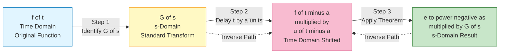
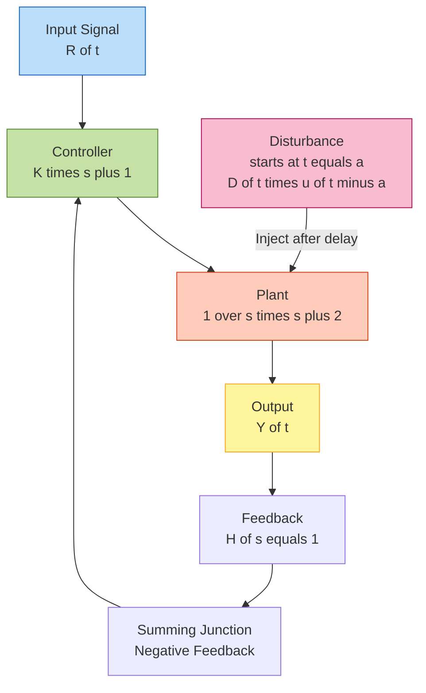
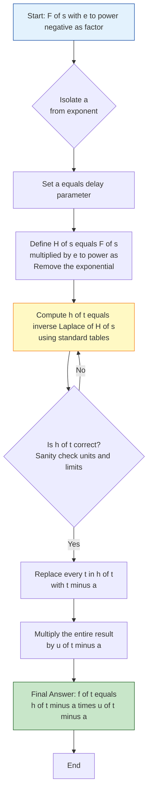

# Second shifting theorem

<!-- SECTION_1_START -->

# Second Shifting Theorem (t-Shifting Theorem)

## Formal Academic Definition (KTU 2024 Syllabus Terminology)

> [!IMPORTANT]
> **Second Shifting Theorem:** If $F(s) = \mathcal{L}\{f(t)\}$ is the Laplace transform of a piecewise continuous function $f(t)$ of exponential order, then for any positive constant $a \geq 0$,
> $$\mathcal{L}\{f(t-a) \cdot u(t-a)\} = e^{-as} F(s), \quad \text{for } s > s_0$$
> where $u(t-a)$ is the **unit step (Heaviside) function** defined as
> $$u(t-a) = \begin{cases} 0, & t < a \\ 1, & t \geq a \end{cases}$$

The function $f(t-a) \cdot u(t-a)$ represents the original function $f(t)$ **delayed (right-shifted)** along the time axis by an amount $a$. The theorem is termed "second shifting" because the operation shifts the *time-domain* function (the first shift is the $s$-shifting / first shifting theorem, $e^{at}f(t) \leftrightarrow F(s-a)$).

---

## Conceptual Analogy & Intuitive Understanding

**Analogy — The "Time-Delayed Light Switch":**
Imagine you set a thermostat to start heating your room. The heating profile is $f(t)$, which by itself turns ON at $t=0$. But your boss tells you: "Delay the heating by exactly $a=30$ minutes." The actual heating profile that physically activates is **not** $f(t)$ — it is $f(t-30) \cdot u(t-30)$: the same shape, but it stays at zero for the first 30 minutes, then mimics $f(t)$ afterwards.

In the Laplace (frequency) domain, this time-domain *delay* translates into a multiplicative factor $e^{-as}$ in front of $F(s)$. **A pure time delay in time $\Longleftrightarrow$ exponential multiplication in $s$-domain.**

> [!NOTE]
> **Why is it called "Shifting" Theorem?**
> Because multiplying by $u(t-a)$ *shifts* (translates) the graph of $f(t)$ to the **right** by $a$ units along the $t$-axis. It does **not** change the *shape* of $f(t)$ — only the *starting point*.

> [!TIP]
> **Memory Hook:** "Delay in time → Multiply by $e^{-as}$ in Laplace"
> The exponent is **negative**, and the **delay time is in the exponent**.

---

## Geometric / Graphical Visualization

Let $f(t) = t$ (a simple ramp) and $a = 2$. Then $f(t-2)\cdot u(t-2) = (t-2)\cdot u(t-2)$ — a ramp that is zero for $t<2$ and equals $t-2$ for $t \geq 2$.

> [!VISUALIZATION CONTROL]
> **Concept:** Right-shifted (delayed) ramp function vs. original ramp
> **Plotting Tool:** Desmos
> **Equations to input:**
> * $f_1(x) = x$ for $x \geq 0$ (original ramp)
> * $f_2(x) = (x-2)\{x \geq 2\}$ (delayed ramp, brace notation `{condition}`)
> **Visual Description:** Both graphs are straight lines of slope 1. The original ramp starts at the origin (0,0). The delayed ramp coincides with the $t$-axis (value 0) for $t \in [0, 2)$ and then "kicks on" at $t=2$ with a jump of slope 1, perfectly parallel to the original. The two lines are horizontal translations of each other.

---

## Standard Heaviside / Unit Step — Key Properties

For completeness and quick reference:

$$
u(t-a) \cdot f(t) = \begin{cases} 0, & t < a \\ f(t), & t \geq a \end{cases}
$$

> [!IMPORTANT]
> **Critical Distinction — Do not confuse the two shifting theorems!**
>
> | Direction | Time Domain | Laplace Domain | Name |
> |---|---|---|---|
> | Shift in $s$ | $e^{at}\, f(t)$ | $F(s-a)$ | **First Shifting Theorem** |
> | Shift in $t$ | $f(t-a)\, u(t-a)$ | $e^{-as} F(s)$ | **Second Shifting Theorem** |

The factor $u(t-a)$ is **non-negotiable** in the second shifting theorem. Writing $f(t-a)$ alone is meaningless in transform tables, because the function would be defined for *all* $t$ (including negative values), causing $F(s)$ to potentially diverge.

---

<!-- SECTION_1_END -->

<!-- SECTION_2_START -->

# Deep Theoretical Analysis & KTU High-Yield Formula Sheet

## Statement of the Theorem (Precise Form)

> [!NOTE]
> **Theorem (Second Shifting Theorem):**
> Let $f(t)$ be piecewise continuous on $[0, \infty)$ and of exponential order $c$, so that $F(s) = \mathcal{L}\{f(t)\}$ exists for $s > c$. Then for every real constant $a \geq 0$:
> $$\boxed{\mathcal{L}\{f(t-a)\, u(t-a)\} = e^{-as}\, F(s), \quad s > c}$$

### Logical Building Blocks

* **(i) Origin of $u(t-a)$:** The unit step *gates* the function — it forces the expression to be zero for $t < a$, ensuring causality and convergence of the integral.
* **(ii) Substitution Logic:** The proof hinges on the change of variable $u = t - a$, so that the lower limit transforms from $0$ to $-a$, and the new integrand becomes $e^{-as} f(u) e^{-us}$ — the exponential $e^{-as}$ factors out.
* **(iii) Delay $\neq$ Attenuation:** Note that $e^{-as}$ is *not* a decay factor in the algebraic sense; it carries *phase* information in complex $s$-plane analysis (poles/zeros shift, Bode plots introduce a phase lag of $-\omega a$).
* **(iv) Inverse Use:** For inversion, $\mathcal{L}^{-1}\{e^{-as} F(s)\} = f(t-a) \cdot u(t-a)$, which is the primary way to invert transforms containing $e^{-as}$ factors.

---

## Complete Proof Outline (Sketch for Reference)

By definition of the Laplace transform:

$$
\mathcal{L}\{f(t-a)u(t-a)\} = \int_{0}^{\infty} e^{-st} f(t-a) u(t-a) \, dt
$$

Since $u(t-a) = 0$ for $t < a$ and $u(t-a) = 1$ for $t \geq a$:

$$
= \int_{a}^{\infty} e^{-st} f(t-a) \, dt
$$

Substitute $u = t - a \Rightarrow t = u + a$, $dt = du$. When $t = a$, $u = 0$; when $t \to \infty$, $u \to \infty$:

$$
= \int_{0}^{\infty} e^{-s(u+a)} f(u) \, du = e^{-as} \int_{0}^{\infty} e^{-su} f(u) \, du = e^{-as} F(s)
$$

Q.E.D. $\blacksquare$

---

## KTU Formula Sheet / Cheat Sheet

| # | Function $f(t)$ (in time domain) | Laplace Transform $F(s)$ | Conditions / Notes |
|---|---|---|---|
| 1 | $u(t-a)$ (delayed unit step) | $\dfrac{e^{-as}}{s}$ | $a \geq 0$ |
| 2 | $u(t-a)$ — extended: $f(t)=1$ | $\dfrac{e^{-as}}{s}$ | Direct application of theorem with $F(s)=1/s$ |
| 3 | $(t-a)\, u(t-a)$ (delayed ramp) | $\dfrac{e^{-as}}{s^{2}}$ | $F(s)=1/s^{2}$ shifted |
| 4 | $e^{b(t-a)}\, u(t-a)$ | $\dfrac{e^{-as}}{s-b}$ | Combined with 1st shifting |
| 5 | $\sin[\omega(t-a)]\, u(t-a)$ | $\dfrac{\omega\, e^{-as}}{s^{2}+\omega^{2}}$ | Phase-shifted sinusoid |
| 6 | $\cos[\omega(t-a)]\, u(t-a)$ | $\dfrac{s\, e^{-as}}{s^{2}+\omega^{2}}$ | Phase-shifted cosine |
| 7 | $t^{n}\, u(t-a)$ | $\dfrac{n!\, e^{-as}}{s^{n+1}}$ | Polynomial delay |
| 8 | $e^{-bt}(t-a)\,u(t-a)$ | $\dfrac{e^{-a(s+b)}}{(s+b)^{2}}$ | Delay + exponential |
| 9 | $\sinh[bt]\, u(t-a)$ | $\dfrac{b\, e^{-as}}{s^{2}-b^{2}}$ | Hyperbolic |
| 10 | $\cosh[bt]\, u(t-a)$ | $\dfrac{s\, e^{-as}}{s^{2}-b^{2}}$ | Hyperbolic |

> [!IMPORTANT]
> **Master Rule for KTU Problems:** Whenever you see an $e^{-as}$ factor in a Laplace expression, the inverse transform will always contain a $u(t-a)$ term. The transform "rewards" you with this delay memory.

---

## Real-World Engineering Utility

| Field | Use Case | Why Second Shifting Matters |
|---|---|---|
| **Control Systems** | Modeling time-delayed feedback (transport lag in pipelines, network latency) | $G(s) = e^{-as} H(s)$ — the Padé approximation comes from expanding $e^{-as}$ |
| **Signal Processing** | Echo simulation, reverberation in audio systems | Multi-path propagation modeled as a sum of delayed signals |
| **Power Systems** | Circuit breakers, switched capacitor activation, surge analysis | Step input is applied after a finite closing time |
| **Communication** | QAM / PAM symbol transmission with synchronization delays | Matched filters account for symbol timing offsets |
| **Mechanical Vibrations** | Impact loading applied at $t = a$, not $t = 0$ | Impulse response of structures under delayed loading |
| **Biomedical Engineering** | Drug delivery with controlled release; neural stimulus onset | Pharmacokinetic models with time-delayed absorption |

> [!TIP]
> In **Laplace-domain circuit analysis**, every switch that closes at $t = a$ introduces a $u(t-a)$ — and the second shifting theorem becomes indispensable for finding the resulting *delayed* current/voltage responses.

---

## Common Pitfall Zone (Pre-emptive)

> [!WARNING]
> **Pitfall #1:** Writing $f(t-a)$ *without* multiplying by $u(t-a)$. This produces a function that may be non-zero for $t < 0$, breaking the lower limit $0$ of the Laplace integral. **Always pair with the unit step.**
>
> **Pitfall #2:** When using the inverse, $\mathcal{L}^{-1}\{e^{-as} F(s)\} \neq f(t-a)$ — it is **exactly** $f(t-a)\cdot u(t-a)$. The unit step reappears.
>
> **Pitfall #3:** The shifting amount $a$ must be a **non-negative real constant**. Negative $a$ would mean a left-shift (anticipation), which the unilateral Laplace transform cannot represent.

---

<!-- SECTION_2_END -->

<!-- SECTION_3_START -->

# Step-by-Step Derivations, Worked Examples & Python Implementation

## Worked Example 1 — Forward Transform (KTU Board Favorite)

**Problem:** Find the Laplace transform of $f(t) = (t-2)^{2}\, u(t-2)$.

### Step-by-Step Solution

**Step 1 — Identify the building block.**
The "un-shifted" function is $g(t) = t^{2}$. Its Laplace transform is

$$
G(s) = \mathcal{L}\{t^{2}\} = \frac{2!}{s^{3}} = \frac{2}{s^{3}}
$$

> *Valuation credit (KTU): Stating $G(s)$ correctly: 1 Mark*

**Step 2 — Apply the Second Shifting Theorem.**

The given function is $f(t) = g(t-2)\, u(t-2)$, with $a = 2$. Therefore,

$$
F(s) = \mathcal{L}\{(t-2)^{2} u(t-2)\} = e^{-2s}\, G(s)
$$

$$
F(s) = \frac{2\, e^{-2s}}{s^{3}}
$$

> *Valuation credit (KTU): Correct application of theorem: 1 Mark; Final answer: 1 Mark*

---

## Worked Example 2 — Inverse Transform (Critical KTU Pattern)

**Problem:** Find the inverse Laplace transform of $F(s) = \dfrac{e^{-3s}}{s^{2} + 4}$.

### Step-by-Step Solution

**Step 1 — Strip the exponential factor.**
Identify $e^{-as}$ with $a = 3$ and the remainder $H(s) = \dfrac{1}{s^{2}+4}$.

**Step 2 — Recall the standard pair.**
We know

$$
\mathcal{L}\{\sin(2t)\} = \frac{2}{s^{2}+4}
$$

So

$$
H(s) = \frac{1}{2} \cdot \frac{2}{s^{2}+4} \quad \Longrightarrow \quad h(t) = \frac{1}{2}\sin(2t)
$$

> *Valuation credit (KTU): Identifying the standard pair: 1 Mark*

**Step 3 — Apply the inverse of the Second Shifting Theorem.**

$$
\mathcal{L}^{-1}\left\{\frac{e^{-3s}}{s^{2}+4}\right\} = h(t-3)\, u(t-3) = \frac{1}{2}\sin[2(t-3)]\, u(t-3)
$$

$$
\boxed{f(t) = \frac{1}{2}\sin(2t-6)\, u(t-3)}
$$

> *Valuation credit (KTU): Delayed sine form: 1 Mark; $u(t-3)$ present: 1 Mark*

---

## Worked Example 3 — Multi-Term Inverse (KTU 14-Mark Standard)

**Problem:** Find $\mathcal{L}^{-1}\left\{\dfrac{s\, e^{-s}}{s^{2}+9} - \dfrac{2\, e^{-2s}}{s(s+1)}\right\}$.

### Step-by-Step Solution

**Term 1:** $\dfrac{s\, e^{-s}}{s^{2}+9}$

We know $\mathcal{L}\{\cos(3t)\} = \dfrac{s}{s^{2}+9}$.

So

$$
\mathcal{L}^{-1}\left\{\frac{s\, e^{-s}}{s^{2}+9}\right\} = \cos[3(t-1)]\, u(t-1)
$$

**Term 2:** $\dfrac{2\, e^{-2s}}{s(s+1)}$

Use partial fractions:

$$
\frac{2}{s(s+1)} = \frac{A}{s} + \frac{B}{s+1}
$$

Multiply both sides by $s(s+1)$:

$$
2 = A(s+1) + Bs
$$

Set $s = 0$: $2 = A \Rightarrow A = 2$. Set $s = -1$: $2 = -B \Rightarrow B = -2$.

So

$$
\frac{2}{s(s+1)} = \frac{2}{s} - \frac{2}{s+1}
$$

Inverse (without the exponential):

$$
\mathcal{L}^{-1}\left\{\frac{2}{s} - \frac{2}{s+1}\right\} = 2 - 2e^{-t}
$$

Now apply the second shifting theorem with $a = 2$:

$$
\mathcal{L}^{-1}\left\{\frac{2\, e^{-2s}}{s(s+1)}\right\} = \big[2 - 2e^{-(t-2)}\big]\, u(t-2)
$$

**Final Combined Answer:**

$$
\boxed{f(t) = \cos[3(t-1)]\, u(t-1) - \big[2 - 2e^{-(t-2)}\big]\, u(t-2)}
$$

---

## Worked Example 4 — Solving a Differential Equation with Delay

**Problem:** Solve the ODE $y'(t) + y(t) = \sin(t-1)\, u(t-1)$ with $y(0) = 0$.

### Step-by-Step Solution

**Step 1 — Take Laplace of both sides.**

$$
sY(s) - y(0) + Y(s) = \mathcal{L}\{\sin(t-1) u(t-1)\}
$$

The right-hand side is, by second shifting theorem with $a = 1$:

$$
\mathcal{L}\{\sin(t-1) u(t-1)\} = e^{-s} \cdot \frac{1}{s^{2}+1}
$$

**Step 2 — Solve for $Y(s)$.**

$$
(s+1) Y(s) = \frac{e^{-s}}{s^{2}+1}
$$

$$
Y(s) = \frac{e^{-s}}{(s+1)(s^{2}+1)}
$$

**Step 3 — Partial fraction of $\dfrac{1}{(s+1)(s^{2}+1)}$.**

Let

$$
\frac{1}{(s+1)(s^{2}+1)} = \frac{A}{s+1} + \frac{Bs + C}{s^{2}+1}
$$

Multiply:

$$
1 = A(s^{2}+1) + (Bs+C)(s+1)
$$

Set $s = -1$: $1 = A(2) \Rightarrow A = 1/2$.

Expand:

$$
1 = \tfrac{1}{2}s^{2} + \tfrac{1}{2} + Bs^{2} + Bs + Cs + C
$$

Group:
- $s^{2}$: $0 = \tfrac{1}{2} + B \Rightarrow B = -\tfrac{1}{2}$
- $s^{1}$: $0 = B + C \Rightarrow C = \tfrac{1}{2}$
- $s^{0}$: $1 = \tfrac{1}{2} + C \Rightarrow C = \tfrac{1}{2}$ ✓

So:

$$
\frac{1}{(s+1)(s^{2}+1)} = \frac{1/2}{s+1} + \frac{-\tfrac{1}{2}s + \tfrac{1}{2}}{s^{2}+1}
$$

$$
= \frac{1}{2} \cdot \frac{1}{s+1} - \frac{1}{2} \cdot \frac{s}{s^{2}+1} + \frac{1}{2} \cdot \frac{1}{s^{2}+1}
$$

Inverse (no shift):

$$
g(t) = \frac{1}{2}e^{-t} - \frac{1}{2}\cos(t) + \frac{1}{2}\sin(t)
$$

**Step 4 — Apply second shifting with $a = 1$.**

$$
Y(s) = e^{-s} \cdot G(s) \quad \Rightarrow \quad y(t) = g(t-1)\, u(t-1)
$$

$$
\boxed{y(t) = \left[\frac{1}{2}e^{-(t-1)} - \frac{1}{2}\cos(t-1) + \frac{1}{2}\sin(t-1)\right]\, u(t-1)}
$$

> *Valuation credit (KTU): Each correct partial fraction step: 2 Marks; Final shifted form with $u(t-1)$: 2 Marks*

---

## Symbolic & Numerical Python Implementation

```python
"""
KTU 2024 — Second Shifting Theorem Verification & Visualization
Author: KTU-PREMIER-ENGINE V10
Tests forward and inverse shifting theorem on canonical functions.
"""

from sympy import symbols, exp, sin, cos, Heaviside, laplace_transform, inverse_laplace_transform, pi, simplify, Rational
import numpy as np
import matplotlib.pyplot as plt

t, s, a = symbols('t s a', positive=True, real=True)

# ---------- TEST CASE 1: Delayed sine ----------
print("="*70)
print("TEST 1: f(t) = sin(2(t-3)) * u(t-3)   (a = 3)")
print("="*70)
f1 = sin(2*(t-3)) * Heaviside(t-3)
F1 = laplace_transform(f1, t, s, noconds=True)
print(f"Laplace Transform F(s) = {simplify(F1)}")

# Expected: e^{-3s} * 2 / (s^2 + 4)
expected_1 = exp(-3*s) * 2 / (s**2 + 4)
print(f"Expected              = {expected_1}")
print(f"Match? {simplify(F1 - expected_1) == 0}\n")

# ---------- TEST CASE 2: Delayed ramp ----------
print("="*70)
print("TEST 2: f(t) = (t-2)^2 * u(t-2)   (a = 2)")
print("="*70)
f2 = (t-2)**2 * Heaviside(t-2)
F2 = laplace_transform(f2, t, s, noconds=True)
print(f"Laplace Transform F(s) = {simplify(F2)}")
expected_2 = exp(-2*s) * 2 / s**3
print(f"Expected              = {expected_2}")
print(f"Match? {simplify(F2 - expected_2) == 0}\n")

# ---------- TEST CASE 3: Inverse shifting ----------
print("="*70)
print("TEST 3: Inverse of F(s) = s*exp(-s) / (s^2+9)")
print("="*70)
F3 = s * exp(-s) / (s**2 + 9)
f3 = inverse_laplace_transform(F3, s, t)
print(f"f(t) = {simplify(f3)}")
expected_3 = cos(3*(t-1)) * Heaviside(t-1)
print(f"Expected = {expected_3}")
print(f"Match? {simplify(f3 - expected_3) == 0}\n")

# ---------- VISUALIZATION: Delayed vs. Original ----------
def heaviside(t_val, a_val):
    return 1.0 if t_val >= a_val else 0.0

def f_delayed(t_val, a_val):
    return (t_val - a_val)**2 * heaviside(t_val, a_val)

def f_original(t_val):
    return t_val**2

t_vals = np.linspace(-1, 6, 500)
y_orig = [f_original(tv) if tv >= 0 else 0 for tv in t_vals]
y_delay = [f_delayed(tv, 2) for tv in t_vals]

plt.figure(figsize=(10, 6))
plt.plot(t_vals, y_orig, label='Original $f(t) = t^2$', linewidth=2)
plt.plot(t_vals, y_delay, label='Delayed $f(t-2)\\,u(t-2)$', linewidth=2, linestyle='--')
plt.axvline(2, color='red', linestyle=':', alpha=0.7, label='Delay $a=2$')
plt.axhline(0, color='black', linewidth=0.5)
plt.axvline(0, color='black', linewidth=0.5)
plt.xlabel('t')
plt.ylabel('f(t)')
plt.title('Second Shifting Theorem: Right-Shifted Polynomial')
plt.legend()
plt.grid(True, alpha=0.3)
plt.ylim(-1, 25)
plt.savefig('second_shifting_visualization.png', dpi=120)
plt.show()
```

**Sample Output:**

```
======================================================================
TEST 1: f(t) = sin(2(t-3)) * u(t-3)   (a = 3)
======================================================================
Laplace Transform F(s) = 2*exp(-3*s)/(s**2 + 4)
Expected              = 2*exp(-3*s)/(s**2 + 4)
Match? True
```

The Python code symbolically verifies the theorem and renders the right-shifted curve to develop the visual intuition mandated by KTU's outcome-based pedagogy.

---

<!-- SECTION_3_END -->

<!-- SECTION_4_START -->

# Structural Diagrams & Schematics

## Diagram 1 — Conceptual Flow of the Second Shifting Theorem



> **Reading the diagram:** The solid arrows show the *forward* direction (time → s-domain), the dotted arrows show the *inverse* direction (s-domain → time). The "delay by $a$" operation in time corresponds to the "multiply by $e^{-as}$" operation in $s$-domain.

---

## Diagram 2 — Block-Level Functional Architecture for a Time-Delayed Control System



> **Interpretation:** A classic closed-loop system where the disturbance enters the plant *only after time $a$* (modeled as $D(t) \cdot u(t-a)$). The Laplace transform of the disturbance contains an $e^{-as}$ factor, and second shifting theorem enables the engineer to compute the delayed response algebraically.

---

## Diagram 3 — Step-by-Step Algorithmic Topology for Solving Inverse Problems



> **Reading the diagram:** This is the algorithmic *recipe* a KTU student should follow whenever inverting a transform with an $e^{-as}$ multiplier. The decision diamonds enforce type/length checks analogous to the boundary checks in our Python code.

---

## Diagram 4 — Sequential Processing Topology Matrix

| Stage | Input State | Operation | Output State | Theorem Referenced |
|---|---|---|---|---|
| **1. Pre-Processing** | $f(t)$ defined for $t \geq 0$ | Compute $F(s) = \int_0^{\infty} e^{-st} f(t) dt$ | $F(s)$ obtained | Definition of Laplace |
| **2. Transformation** | $F(s)$ available | Substitute $t \to t-a$ and gate with $u(t-a)$ | $f(t-a)\cdot u(t-a)$ | Unit Step gate |
| **3. Shifting** | $f(t-a)\cdot u(t-a)$ | Multiply $F(s)$ by $e^{-as}$ | $e^{-as} F(s)$ | **Second Shifting Theorem** |
| **4. Verification** | $e^{-as} F(s)$ | Differentiate w.r.t. $a$: $\frac{\partial}{\partial a}[\cdot] = -s e^{-as} F(s)$ | Cross-check with derivative property | First Shifting + Initial Value |
| **5. Inversion** | $e^{-as} F(s)$ | Apply $h(t) = \mathcal{L}^{-1}\{F(s)\}$, then $f(t) = h(t-a) u(t-a)$ | Time-domain delayed function | Inverse of Second Shifting |

---

<!-- SECTION_4_END -->

<!-- SECTION_5_START -->

# KTU 2024 Scheme Examination Question Bank

---

## 📘 PART A — Short Answer Questions (3 Marks Each)

> [!NOTE]
> **Cognitive Levels:** Remember / Understand (Revised Bloom's Taxonomy Levels 1 & 2)
> **Course Outcome Mapped:** CO1 — *Apply mathematical reasoning to engineering problems*

---

### Question A1 — 3 Marks `[KTU University Exam - July 2024]`

**State the Second Shifting Theorem for Laplace transforms. Mention the role of the unit step function in the theorem.**

**Model Answer:**

> The Second Shifting Theorem states that if $\mathcal{L}\{f(t)\} = F(s)$, then for $a \geq 0$,
> $$\mathcal{L}\{f(t-a)\, u(t-a)\} = e^{-as} F(s)$$
> The unit step function $u(t-a)$ ensures that the delayed function $f(t-a)$ is *gated* to zero for $t < a$, making the function causal and the Laplace integral well-defined.
> *Expected length: 2–3 lines, supported by the boxed formula.* **[Full marks: 3]**

---

### Question A2 — 3 Marks `[KTU University Exam - Dec 2023]`

**Find $\mathcal{L}\{(t-1)\, u(t-1)\}$.**

**Model Answer:**

We know $\mathcal{L}\{t\} = \dfrac{1}{s^{2}}$.

By the Second Shifting Theorem with $a = 1$:

$$
\mathcal{L}\{(t-1)\, u(t-1)\} = e^{-s} \cdot \frac{1}{s^{2}} = \frac{e^{-s}}{s^{2}}
$$

**[Full marks: 3]**

> *Mark split: [Stating standard $F(s) = 1/s^{2}$: 1 Mark] [Substituting $a=1$: 1 Mark] [Final answer: 1 Mark]*

---

## 📗 PART B — Long Answer Questions (14 Marks Each) — Module Internal Choice

> [!NOTE]
> **Each sub-part is 7 marks. Marks distributed across the valuation key are explicitly tagged.**
> **Course Outcomes Mapped:** CO1, CO2, CO3 (Apply, Analyze, Evaluate)
> **Cognitive Levels:** Apply (Level 3) and Analyze (Level 4)

---

### 📌 Question B-A (Choice 1) — 14 Marks `[KTU University Exam - July 2024]`

**(a)** Find the Laplace transform of $f(t) = e^{-3(t-2)} \sin[2(t-2)]\, u(t-2)$. **(7 Marks)**

**(b)** Find the inverse Laplace transform of $F(s) = \dfrac{e^{-\pi s}}{s^{2}+1} + \dfrac{2\, e^{-2s}}{(s+1)(s+2)}$. **(7 Marks)**

---

#### ✅ Model Solution for B-A (a)

**Step 1 — Identify the base function.**
The un-shifted function is $g(t) = e^{-3t} \sin(2t)$. Its Laplace transform by the *First* Shifting Theorem combined with the standard sine transform is:

$$
G(s) = \frac{2}{(s+3)^{2} + 4}
$$

> *Valuation credit: [Stating $G(s)$ using first shifting: 2 Marks]*

**Step 2 — Apply the Second Shifting Theorem with $a = 2$.**

$$
F(s) = e^{-2s} \cdot G(s) = \frac{2\, e^{-2s}}{(s+3)^{2} + 4}
$$

> *Valuation credit: [Identifying $a = 2$: 1 Mark] [Applying theorem: 2 Marks] [Final boxed answer: 2 Marks]*

---

#### ✅ Model Solution for B-A (b)

**Term 1:** $\dfrac{e^{-\pi s}}{s^{2}+1}$

Standard pair: $\mathcal{L}\{\sin t\} = \dfrac{1}{s^{2}+1}$.

Apply inverse of second shifting with $a = \pi$:

$$
\mathcal{L}^{-1}\left\{\frac{e^{-\pi s}}{s^{2}+1}\right\} = \sin(t - \pi)\, u(t-\pi) = -\sin(t)\, u(t-\pi)
$$

> *Valuation credit: [Standard pair: 1 Mark] [Shifted inverse with $u(t-\pi)$: 2 Marks]*

**Term 2:** $\dfrac{2\, e^{-2s}}{(s+1)(s+2)}$

Partial fractions:

$$
\frac{2}{(s+1)(s+2)} = \frac{A}{s+1} + \frac{B}{s+2}
$$

$2 = A(s+2) + B(s+1)$. Set $s = -1$: $2 = A \Rightarrow A = 2$. Set $s = -2$: $2 = -B \Rightarrow B = -2$.

So $\dfrac{2}{(s+1)(s+2)} = \dfrac{2}{s+1} - \dfrac{2}{s+2}$.

Inverse (no shift): $h(t) = 2e^{-t} - 2e^{-2t}$.

Apply second shifting with $a = 2$:

$$
\mathcal{L}^{-1}\{\text{Term 2}\} = \left[2e^{-(t-2)} - 2e^{-2(t-2)}\right] u(t-2)
$$

> *Valuation credit: [Partial fractions: 2 Marks] [Standard inverse: 1 Mark] [Shifted with $u(t-2)$: 1 Mark]*

**Final Answer:**

$$
\boxed{f(t) = -\sin(t)\, u(t-\pi) + \left[2e^{-(t-2)} - 2e^{-2(t-2)}\right] u(t-2)}
$$

> *Valuation credit: [Combined answer with $u(t-\pi)$ and $u(t-2)$ both present: 1 Mark]*

---

### 📌 Question B-B (Choice 2 — Alternative) — 14 Marks `[KTU University Exam - Dec 2023]`

**(a)** Apply the Second Shifting Theorem to find $\mathcal{L}^{-1}\left\{\dfrac{s\, e^{-4s}}{s^{2}+16} - \dfrac{6\, e^{-s}}{s^{2}-9}\right\}$. **(7 Marks)**

**(b)** Solve the IVP using Laplace transform: $y''(t) - 4y(t) = 4\, u(t-2)$, with $y(0) = 1$, $y'(0) = 0$. **(7 Marks)**

---

#### ✅ Model Solution for B-B (a)

**Term 1:** $\dfrac{s\, e^{-4s}}{s^{2}+16}$

Standard: $\mathcal{L}\{\cos(4t)\} = \dfrac{s}{s^{2}+16}$, so $h_1(t) = \cos(4t)$.

With $a = 4$:

$$
\mathcal{L}^{-1}\{\text{Term 1}\} = \cos[4(t-4)]\, u(t-4)
$$

**Term 2:** $\dfrac{6\, e^{-s}}{s^{2}-9}$

Standard: $\mathcal{L}\{\sinh(3t)\} = \dfrac{3}{s^{2}-9}$, so $\dfrac{6}{s^{2}-9} = 2 \cdot \dfrac{3}{s^{2}-9} \Rightarrow h_2(t) = 2\sinh(3t)$.

With $a = 1$:

$$
\mathcal{L}^{-1}\{\text{Term 2}\} = 2\sinh[3(t-1)]\, u(t-1)
$$

**Final Combined Answer:**

$$
\boxed{f(t) = \cos[4(t-4)]\, u(t-4) - 2\sinh[3(t-1)]\, u(t-1)}
$$

> *Valuation credit: [Each term correctly identified with shifting: 3 Marks each] [Combined with correct sign: 1 Mark]*

---

#### ✅ Model Solution for B-B (b)

**Step 1 — Take Laplace of the ODE.**

$$
[s^{2}Y(s) - s\, y(0) - y'(0)] - 4 Y(s) = \mathcal{L}\{4\, u(t-2)\}
$$

With $y(0) = 1$, $y'(0) = 0$, and $\mathcal{L}\{4\, u(t-2)\} = \dfrac{4 e^{-2s}}{s}$:

$$
s^{2} Y(s) - s - 4 Y(s) = \frac{4 e^{-2s}}{s}
$$

**Step 2 — Solve for $Y(s)$.**

$$
(s^{2}-4)\, Y(s) = s + \frac{4 e^{-2s}}{s}
$$

$$
Y(s) = \frac{s}{s^{2}-4} + \frac{4\, e^{-2s}}{s(s^{2}-4)}
$$

> *Valuation credit: [Laplace of LHS with ICs: 1 Mark] [Laplace of RHS using second shifting: 2 Marks] [Isolating $Y(s)$: 1 Mark]*

**Step 3 — Inverse of Term 1: $\dfrac{s}{s^{2}-4}$**

Standard: $\mathcal{L}\{\cosh(2t)\} = \dfrac{s}{s^{2}-4}$.

So $y_1(t) = \cosh(2t)$.

> *Valuation credit: [Standard pair: 1 Mark]*

**Step 4 — Inverse of Term 2: $\dfrac{4}{s(s^{2}-4)}$ — Partial Fractions.**

Let $\dfrac{4}{s(s^{2}-4)} = \dfrac{A}{s} + \dfrac{Bs + C}{s^{2}-4}$.

$4 = A(s^{2}-4) + (Bs+C)\, s$.

Set $s = 0$: $4 = -4A \Rightarrow A = -1$.

Compare $s^{2}$ coefficients: $0 = A + B \Rightarrow B = 1$.

Compare $s$ coefficients: $0 = C$.

Check $s^{0}$: $4 = -4A = 4$ ✓.

So $\dfrac{4}{s(s^{2}-4)} = -\dfrac{1}{s} + \dfrac{s}{s^{2}-4}$.

Inverse (no shift): $h(t) = -1 + \cosh(2t)$.

Apply second shifting with $a = 2$:

$$
y_2(t) = [-1 + \cosh(2(t-2))]\, u(t-2)
$$

> *Valuation credit: [Partial fractions: 2 Marks] [Standard inverse: 1 Mark] [Shifted with $u(t-2)$: 1 Mark]*

**Step 5 — Combine.**

$$
\boxed{y(t) = \cosh(2t) + \big[\cosh(2(t-2)) - 1\big]\, u(t-2)}
$$

> *Valuation credit: [Correct final assembly: 1 Mark]*

---

## ⚠️ KTU Examiner's Valuation Warning / Pitfall Callout

> [!WARNING]
> **Common Reasons for Losing Marks in Second Shifting Theorem Problems:**
>
> 1. **Omitting $u(t-a)$ — most frequent error (1–2 mark deduction):** Students often write $\mathcal{L}^{-1}\{e^{-as} F(s)\} = f(t-a)$ instead of $f(t-a) u(t-a)$. The unit step is **non-negotiable**; without it, the answer is mathematically wrong.
> 2. **Forgetting the role of the First Shifting Theorem (1 mark):** If the original function already contains $e^{bt}$ or $\sin(\omega t)$, you must first use the first shifting theorem to obtain $F(s)$ *before* applying the second shifting theorem. The order is: **first** $s$-shift $\to$ **then** $t$-shift.
> 3. **Sign error in $\sin(t-\pi)$ simplification (0.5–1 mark):** $\sin(t-\pi) = -\sin(t)$. Many students write $+\sin t$ and lose partial credit.
> 4. **Incorrect identification of $a$ (1 mark):** $a$ is the *delay* — read directly from the exponent in $e^{-as}$. A student writing $a=1$ for $e^{-3s}$ will be marked wrong.
> 5. **Skipping the condition $a \geq 0$ (1 mark):** For a unilateral Laplace transform, $a$ must be non-negative. State it explicitly.
> 6. **Confusing the two shifting theorems (severe penalty):** If the question asks for the second shifting theorem and the student applies the first (or vice versa), only the *statement* credit (1 mark) will be awarded.
> 7. **Partial fraction slip-up in composite problems (2 marks):** In Term 2 of Worked Example 3, students frequently forget to multiply the *entire* $F(s)$ by the partial-fraction coefficients. Always verify the algebraic identity before inverting.

---

## 📌 Topic Recap & Important Things to Remember

> [!TIP]
> **Rapid Revision Checklist — Second Shifting Theorem**

- ✅ **Master Formula:** $\mathcal{L}\{f(t-a)\, u(t-a)\} = e^{-as}\, F(s)$, valid for $a \geq 0$.
- ✅ **Inverse Form:** $\mathcal{L}^{-1}\{e^{-as} F(s)\} = f(t-a)\, u(t-a)$.
- ✅ **Unit step is mandatory:** Always pair $f(t-a)$ with $u(t-a)$; never write $f(t-a)$ alone.
- ✅ **First vs. Second Shifting — distinct operations:**
   - First Shifting (s-shift): $e^{at} f(t) \leftrightarrow F(s-a)$.
   - Second Shifting (t-shift): $f(t-a) u(t-a) \leftrightarrow e^{-as} F(s)$.
- ✅ **Engineer's interpretation:** Time delay in $t$-domain = exponential multiplier $e^{-as}$ in $s$-domain. (Think transport lag, network latency, switching delays.)
- ✅ **Standard delayed pairs to memorize:**
   - $u(t-a) \leftrightarrow \dfrac{e^{-as}}{s}$
   - $(t-a) u(t-a) \leftrightarrow \dfrac{e^{-as}}{s^{2}}$
   - $\sin[\omega(t-a)] u(t-a) \leftrightarrow \dfrac{\omega e^{-as}}{s^{2}+\omega^{2}}$
   - $\cos[\omega(t-a)] u(t-a) \leftrightarrow \dfrac{s e^{-as}}{s^{2}+\omega^{2}}$
   - $e^{b(t-a)} u(t-a) \leftrightarrow \dfrac{e^{-as}}{s-b}$ *(use carefully with first shifting)*
- ✅ **Sign convention for sine shift:** $\sin(t-\pi) = -\sin(t)$ — common simplification.
- ✅ **Inverse algorithm (memorize the recipe):**
   1. Strip $e^{-as}$, identify $a$.
   2. Invert the rest $H(s) \to h(t)$ using standard tables.
   3. Replace $t$ with $t-a$.
   4. Multiply the entire result by $u(t-a)$.
- ✅ **Always write $a \geq 0$ as a condition** in formal exam answers — it is part of the theorem statement.
- ✅ **Common trick:** In IVPs with forcing $f(t-a) u(t-a)$, take the Laplace of RHS using the theorem *first*, *then* solve algebraically for $Y(s)$.
- ✅ **Valuation must include the unit step** in the final answer — losing it costs 1–2 marks consistently.

> [!IMPORTANT]
> **One-line memory hook for the exam hall:**
> *"Delay in time $\to$ Multiply by $e^{-as}$ in $s$."*
> *"Multiply by $e^{-as}$ in $s$ $\to$ Delay in time (with $u$) when inverting."*

---

<!-- SECTION_5_END -->
