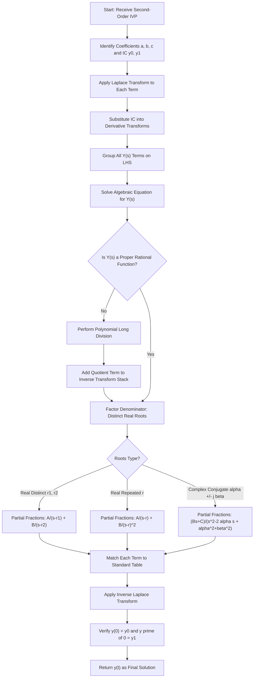
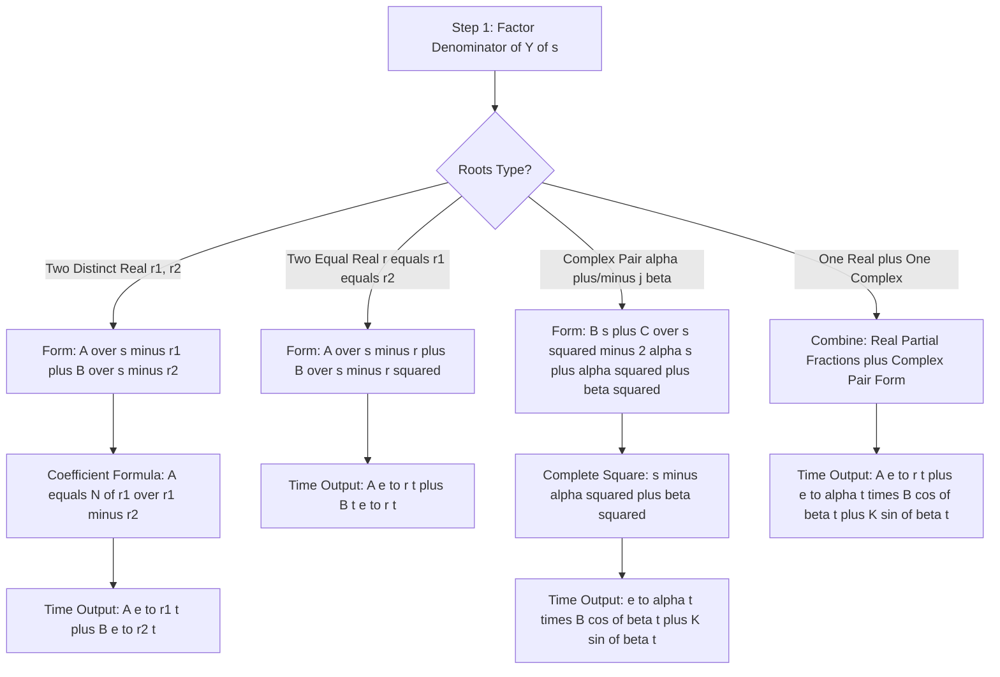
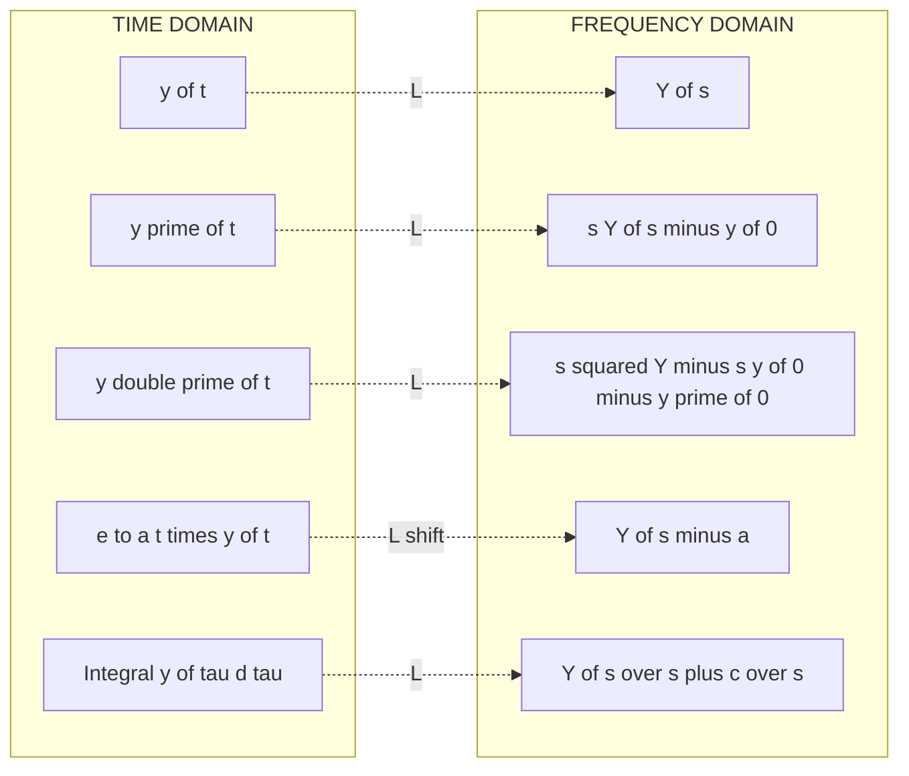

# Solution of Initial value problems by Laplace transform (Second order linear ODE with constant coefficients with initial conditions at t=0 only)

<!-- SECTION_1_START -->
# 1. Core Technical Definition & Intuitive Overview

## 1.1 Formal Definition: Initial Value Problem (IVP) and its Laplace-Based Solution

An **Initial Value Problem (IVP)** is a differential equation accompanied by the value of the unknown function and its derivatives specified at a single reference point (typically $t = 0$). For a second order linear ODE with constant coefficients, the canonical KTU form is:

$$
\begin{aligned}
a\,\dfrac{d^{2}y}{dt^{2}} + b\,\dfrac{dy}{dt} + c\,y(t) &= f(t), \quad t > 0 \\
y(0) = y_0, \quad y^{\prime}(0) &= y_1
\end{aligned}
$$

where $a, b, c \in \mathbb{R}$ are **constant coefficients**, $f(t)$ is a forcing/input function, and $y_0, y_1$ are the **initial conditions (IC)**.

The **Laplace Transform** is defined formally as:

$$
\mathcal{L}\{f(t)\} = F(s) = \int_{0}^{\infty} e^{-st} f(t)\,dt
$$

provided the integral converges, where $s \in \mathbb{C}$ is the **complex frequency parameter** with $\text{Re}(s) > \sigma_0$ (region of convergence).

> [!IMPORTANT]
> **KTU 2024 Syllabus Highlight (Module 3):** Students are required to solve second-order linear ODEs **with constant coefficients** using the Laplace transform where initial conditions are prescribed **at $t = 0$ only** (single-point boundary conditions, not two-point). The forcing function $f(t)$ is restricted to standard forms: polynomials, $e^{at}$, $\sin(\omega t)$, $\cos(\omega t)$, $\sinh(\omega t)$, $\cosh(\omega t)$, and their products.

## 1.2 Conceptual Analogy: The "Decoder Ring" for Differential Equations

Think of a differential equation as a **locked treasure chest** containing the function $y(t)$. The derivative operations ($\dfrac{d}{dt}$) and the constants ($a, b, c$) are the **locks** sealing it shut. The initial conditions are the **key holes** that tell you the state at the start.

**Solving directly** is like picking the lock by hand — you integrate, apply ICs, find constants, then stitch everything together. It works, but is error-prone and tedious.

**The Laplace transform is a magic decoder ring.** You slide the entire equation into a special "frequency world" (the $s$-domain) where:
- Derivatives become **simple algebra**: $\dfrac{d}{dt} \rightarrow s$, $\dfrac{d^{2}}{dt^{2}} \rightarrow s^2$
- Initial conditions are **automatically embedded** into the equation
- The whole ODE collapses into a **rational algebraic equation** in $s$

You then solve the algebra (easy!), and finally apply the **inverse Laplace transform** to return to the time world. It's like translating a hard problem into easy language, solving it, then translating back.

### 1.3 Geometric Intuition: Time Domain vs. Frequency Domain

| Time Domain ($t$) | Frequency Domain ($s$) |
|---|---|
| Derivatives ($\dfrac{dy}{dt}$) | Multiplication by $s$ |
| Integration | Division by $s$ |
| Initial conditions $y(0), y'(0)$ | Constant additive terms |
| $e^{at}$ growth/decay | Horizontal shift: $s \rightarrow s-a$ |
| $\sin(\omega t), \cos(\omega t)$ | Poles at $s = \pm j\omega$ |

> [!NOTE]
> **Physical Constants & Standard Metrics to Remember:**
> - **j** (imaginary unit, $j = \sqrt{-1}$) — used in electrical engineering instead of $i$
> - **Resonance frequency** $\omega_r = \sqrt{\omega_0^2 - \gamma^2}$ for damped systems
> - **Damping ratio** $\zeta$ — relevant when interpreting the roots of the characteristic equation

> [!VISUALIZATION CONTROL]
> **Concept:** Step Response of a Second-Order System — Overdamped vs. Underdamped
> **GeoGebra / Desmos Input Equations:**
> * `y1(t) = 1 - e^(-t)*(cos(2t) + 0.5*sin(2t))`  (Underdamped)
> * `y2(t) = 1 - 1.5*e^(-t) + 0.5*e^(-3t)`  (Overdamped)
> * `y3(t) = 1 - e^(-t) - t*e^(-t)`  (Critically damped)
> **Visual Description:** Plot all three functions over $t \in [0, 10]$. The student should observe: underdamped curves oscillate around the steady-state value $y = 1$ before settling; overdamped curves rise slowly without oscillation; critically damped rises as fast as possible without overshoot. This is the typical $y(t)$ recovered from a Laplace-based IVP solution of the form $y'' + 4y' + 3y = 6$ with $y(0) = 0, y'(0) = 0$.

<!-- SECTION_1_END -->

<!-- SECTION_2_START -->
# 2. Deep Theoretical Analysis & KTU High-Yield Formula Sheet

## 2.1 The Three-Phase Strategy for Solving IVPs by Laplace

### Phase 1 — Transform the Equation
Apply $\mathcal{L}$ to **every term** of the ODE. Derivatives reduce to algebraic expressions involving $F(s)$ and the initial values.

### Phase 2 — Solve the Algebraic Equation
Treat $Y(s)$ as the unknown. Collect all $Y(s)$ terms on one side, factor, and solve. The result is a **rational function** $Y(s) = \dfrac{N(s)}{D(s)}$.

### Phase 3 — Inverse Transform
Decompose $Y(s)$ into partial fractions (if needed), match each piece to a standard Laplace pair, and write $y(t)$.

> [!IMPORTANT]
> **Why does this work?** The Laplace transform is **linear** and **bijective** (one-to-one) on its domain of convergence. It converts the calculus operation of differentiation into multiplication by $s$, so a linear ODE becomes a linear algebraic equation — a far simpler problem class.

## 2.2 Core Derivative-to-Algebra Conversion

The most important identities for KTU Module 3:

$$
\mathcal{L}\{y^{\prime}(t)\} = s\,Y(s) - y(0)
$$

$$
\mathcal{L}\{y^{\prime\prime}(t)\} = s^{2}\,Y(s) - s\,y(0) - y^{\prime}(0)
$$

These **automatically embed the initial conditions** into the transformed equation, which is the key advantage over classical methods.

## 2.3 KTU High-Yield Formula Sheet (Cheat Sheet)

| # | Time Function $f(t)$ | Laplace Transform $F(s)$ | Region of Convergence |
|---|---|---|---|
| 1 | $1$ | $\dfrac{1}{s}$ | $\text{Re}(s) > 0$ |
| 2 | $t^{n}$ | $\dfrac{n!}{s^{n+1}}$ | $\text{Re}(s) > 0$ |
| 3 | $e^{at}$ | $\dfrac{1}{s-a}$ | $\text{Re}(s) > a$ |
| 4 | $\sin(\omega t)$ | $\dfrac{\omega}{s^{2}+\omega^{2}}$ | $\text{Re}(s) > 0$ |
| 5 | $\cos(\omega t)$ | $\dfrac{s}{s^{2}+\omega^{2}}$ | $\text{Re}(s) > 0$ |
| 6 | $\sinh(\omega t)$ | $\dfrac{\omega}{s^{2}-\omega^{2}}$ | $\text{Re}(s) > \vert\omega\vert$ |
| 7 | $\cosh(\omega t)$ | $\dfrac{s}{s^{2}-\omega^{2}}$ | $\text{Re}(s) > \vert\omega\vert$ |
| 8 | $e^{at}\sin(\omega t)$ | $\dfrac{\omega}{(s-a)^{2}+\omega^{2}}$ | $\text{Re}(s) > a$ |
| 9 | $e^{at}\cos(\omega t)$ | $\dfrac{s-a}{(s-a)^{2}+\omega^{2}}$ | $\text{Re}(s) > a$ |
| 10 | $u(t-a)$ (unit step) | $\dfrac{e^{-as}}{s}$ | $\text{Re}(s) > 0$ |
| 11 | $t\sin(\omega t)$ | $\dfrac{2\omega s}{(s^{2}+\omega^{2})^{2}}$ | $\text{Re}(s) > 0$ |
| 12 | $t\cos(\omega t)$ | $\dfrac{s^{2}-\omega^{2}}{(s^{2}+\omega^{2})^{2}}$ | $\text{Re}(s) > 0$ |
| 13 | $\delta(t)$ (Dirac delta) | $1$ | all $s$ |

### Operational Properties

| Property | Time Domain | $s$-Domain | KTU Use Case |
|---|---|---|---|
| **Linearity** | $a f(t) + b g(t)$ | $aF(s) + bG(s)$ | Combine terms before solving |
| **First Shifting** | $e^{at} f(t)$ | $F(s-a)$ | Handle $e^{at}\sin(\omega t)$ pairs |
| **Multiplication by $t$** | $t\,f(t)$ | $-\dfrac{d}{ds}F(s)$ | Generate $t \cdot f(t)$ forms |
| **Division by $t$** | $\dfrac{f(t)}{t}$ | $\int_{s}^{\infty} F(u)\,du$ | Useful for convolution-like forms |
| **Frequency Shift** | $e^{at}f(t)$ | $F(s-a)$ | $s \to s - a$ substitution |

## 2.4 Real-World Engineering Utility

| Engineering Field | Application of Laplace-Solved IVPs |
|---|---|
| **Electrical Circuits** | RLC circuit transient response: $L\dfrac{di}{dt} + Ri + \dfrac{1}{C}\int i\,dt = V(t)$ |
| **Control Systems** | Transfer function derivation: $H(s) = \dfrac{Y(s)}{X(s)}$ from input-output ODE |
| **Mechanical Vibrations** | Mass-spring-damper: $m y'' + c y' + k y = F(t)$ |
| **Signal Processing** | Filter design (low-pass, high-pass, band-pass) |
| **Communications** | Modulation/demodulation analysis of linear time-invariant (LTI) systems |
| **Aerospace** | Autopilot system stability analysis via pole location |

> [!NOTE]
> **Why is this technique favored in industry over classical methods?** Because in the $s$-domain, **convolution becomes multiplication**, **derivatives become products with $s$**, and **system stability is read directly from the pole locations** of $Y(s)$. The transfer function $H(s) = \dfrac{Y(s)}{X(s)}$ is the cornerstone of modern control theory (root locus, Bode plots, Nyquist criterion) and is fundamentally built on this Laplace machinery.

<!-- SECTION_2_END -->

<!-- SECTION_3_START -->
# 3. Step-by-Step Derivations & Code/Symbolic Implementation

## 3.1 Master Template: The General Second-Order IVP

Consider the most general case assessed in KTU exams:

$$
a\,y^{\prime\prime}(t) + b\,y^{\prime}(t) + c\,y(t) = f(t), \quad y(0) = y_0, \;\; y^{\prime}(0) = y_1
$$

### Step 1 — Apply the Laplace Transform to Both Sides

Using linearity and the derivative rules:

$$
\mathcal{L}\{a y^{\prime\prime}\} + \mathcal{L}\{b y^{\prime}\} + \mathcal{L}\{c y\} = \mathcal{L}\{f(t)\}
$$

$$
a\bigl[s^{2}Y(s) - s y_0 - y_1\bigr] + b\bigl[s Y(s) - y_0\bigr] + c Y(s) = F(s)
$$

### Step 2 — Collect All $Y(s)$ Terms on the Left

$$
\bigl(a s^{2} + b s + c\bigr) Y(s) - a s y_0 - a y_1 - b y_0 = F(s)
$$

### Step 3 — Isolate $Y(s)$ Algebraically

$$
Y(s) = \dfrac{F(s) + a s y_0 + (a y_1 + b y_0)}{a s^{2} + b s + c}
$$

> [!IMPORTANT]
> **Denominator is the characteristic polynomial** $D(s) = a s^{2} + b s + c$. Its roots determine the **natural response** of the system.

### Step 4 — Partial Fraction Decomposition

Decompose $Y(s) = \dfrac{N(s)}{(s - r_1)(s - r_2)}$ into:

$$
Y(s) = \dfrac{A}{s - r_1} + \dfrac{B}{s - r_2}
$$

where $A = \dfrac{N(r_1)}{(r_1 - r_2)}$, $B = \dfrac{N(r_2)}{(r_2 - r_1)}$.

### Step 5 — Apply the Inverse Transform

Using $\mathcal{L}^{-1}\!\left\{\dfrac{1}{s - r}\right\} = e^{rt}$:

$$
y(t) = A e^{r_1 t} + B e^{r_2 t} \quad \text{(distinct real roots)}
$$

If roots are **complex conjugates** $r = \alpha \pm j\beta$, then:

$$
y(t) = e^{\alpha t}\bigl(C_1 \cos(\beta t) + C_2 \sin(\beta t)\bigr)
$$

If roots are **repeated** $r_1 = r_2 = r$:

$$
y(t) = (A + B t)\,e^{r t}
$$

---

## 3.2 Worked Example 1 — Standard Forcing Function (Polynomial)

**Problem:** Solve $y'' - 3y' + 2y = 4t$ with $y(0) = 1, y'(0) = -1$.

**Step 1 — Take Laplace of both sides:**

$$
\mathcal{L}\{y''\} - 3\mathcal{L}\{y'\} + 2\mathcal{L}\{y\} = 4 \cdot \dfrac{1}{s^{2}}
$$

$$
\bigl[s^{2}Y - s(1) - (-1)\bigr] - 3\bigl[sY - 1\bigr] + 2Y = \dfrac{4}{s^{2}}
$$

$$
s^{2}Y - s + 1 - 3sY + 3 + 2Y = \dfrac{4}{s^{2}}
$$

**Step 2 — Group $Y(s)$ terms:**

$$
(s^{2} - 3s + 2)Y + (-s + 1 + 3) = \dfrac{4}{s^{2}}
$$

$$
(s^{2} - 3s + 2)Y - s + 4 = \dfrac{4}{s^{2}}
$$

**Step 3 — Solve for $Y(s)$:**

$$
(s^{2} - 3s + 2)Y = \dfrac{4}{s^{2}} + s - 4
$$

$$
Y(s) = \dfrac{4 + s^{3} - 4s^{2}}{s^{2}(s^{2} - 3s + 2)} = \dfrac{s^{3} - 4s^{2} + 4}{s^{2}(s - 1)(s - 2)}
$$

**Step 4 — Partial fraction decomposition:**

$$
Y(s) = \dfrac{A}{s} + \dfrac{B}{s^{2}} + \dfrac{C}{s - 1} + \dfrac{D}{s - 2}
$$

Multiply through by $s^{2}(s-1)(s-2)$:

$$
s^{3} - 4s^{2} + 4 = A s (s-1)(s-2) + B (s-1)(s-2) + C s^{2}(s-2) + D s^{2}(s-1)
$$

**Find $B$** (set $s = 0$): $4 = B(-1)(-2) = 2B \Rightarrow B = 2$

**Find $C$** (set $s = 1$): $1 - 4 + 4 = 1 = C(1)(-1) = -C \Rightarrow C = -1$

**Find $D$** (set $s = 2$): $8 - 16 + 4 = -4 = D(4)(1) = 4D \Rightarrow D = -1$

**Find $A$** (compare $s^{3}$ coefficients): $1 = A + C + D = A - 1 - 1 \Rightarrow A = 3$

**Step 5 — Write $Y(s)$ and invert:**

$$
Y(s) = \dfrac{3}{s} + \dfrac{2}{s^{2}} - \dfrac{1}{s - 1} - \dfrac{1}{s - 2}
$$

Applying the inverse Laplace transform term-by-term:

$$
y(t) = 3 + 2t - e^{t} - e^{2t}
$$

**Verification of initial conditions:** $y(0) = 3 + 0 - 1 - 1 = 1$ ✓
$y'(t) = 2 - e^{t} - 2e^{2t}$, so $y'(0) = 2 - 1 - 2 = -1$ ✓

---

## 3.3 Worked Example 2 — Trigonometric Forcing (Ramp Response of Mass-Spring)

**Problem:** Solve $y'' + 4y' + 3y = \sin(t)$ with $y(0) = 0, y'(0) = 0$.

**Step 1 — Transform:**

$$
s^{2}Y - 0 - 0 + 4(sY - 0) + 3Y = \dfrac{1}{s^{2} + 1}
$$

**Step 2 — Group and solve:**

$$
(s^{2} + 4s + 3)Y = \dfrac{1}{s^{2} + 1}
$$

$$
Y(s) = \dfrac{1}{(s^{2} + 1)(s + 1)(s + 3)}
$$

**Step 3 — Partial fractions:**

$$
Y(s) = \dfrac{As + B}{s^{2} + 1} + \dfrac{C}{s + 1} + \dfrac{D}{s + 3}
$$

Multiply through:

$$
1 = (As + B)(s + 1)(s + 3) + C(s^{2} + 1)(s + 3) + D(s^{2} + 1)(s + 1)
$$

**Find $C$** (set $s = -1$): $1 = C(2)(2) = 4C \Rightarrow C = \dfrac{1}{4}$

**Find $D$** (set $s = -3$): $1 = D(10)(-2) = -20D \Rightarrow D = -\dfrac{1}{20}$

**Expand** $(s+1)(s+3) = s^{2} + 4s + 3$ and collect $s^{3}, s^{2}, s^{1}, s^{0}$ terms.

Coefficient of $s^{3}$: $A + C + D = 0 \Rightarrow A = -\dfrac{1}{4} + \dfrac{1}{20} = -\dfrac{4}{20} = -\dfrac{1}{5}$

Coefficient of $s^{0}$: $3B + 3C + D = 1 \Rightarrow 3B + \dfrac{3}{4} - \dfrac{1}{20} = 1$

$$
3B = 1 - \dfrac{15}{20} + \dfrac{1}{20} = 1 - \dfrac{14}{20} = \dfrac{6}{20} = \dfrac{3}{10}
$$

$$
B = \dfrac{1}{10}
$$

**Step 4 — Write the decomposed form:**

$$
Y(s) = \dfrac{-\dfrac{1}{5}s + \dfrac{1}{10}}{s^{2} + 1} + \dfrac{1/4}{s + 1} - \dfrac{1/20}{s + 3}
$$

Split the first term:

$$
Y(s) = -\dfrac{1}{5} \cdot \dfrac{s}{s^{2} + 1} + \dfrac{1}{10} \cdot \dfrac{1}{s^{2} + 1} + \dfrac{1}{4} \cdot \dfrac{1}{s + 1} - \dfrac{1}{20} \cdot \dfrac{1}{s + 3}
$$

**Step 5 — Apply inverse transforms:**

$$
y(t) = -\dfrac{1}{5}\cos(t) + \dfrac{1}{10}\sin(t) + \dfrac{1}{4}e^{-t} - \dfrac{1}{20}e^{-3t}
$$

---

## 3.4 Worked Example 3 — Exponential Forcing with Resonance

**Problem:** Solve $y'' + 4y = e^{-2t}$ with $y(0) = 0, y'(0) = 0$.

**Step 1 — Transform:**

$$
s^{2}Y + 4Y = \dfrac{1}{s + 2}
$$

**Step 2 — Solve:**

$$
Y(s) = \dfrac{1}{(s + 2)(s^{2} + 4)}
$$

**Step 3 — Partial fractions:**

$$
Y(s) = \dfrac{A}{s + 2} + \dfrac{Bs + C}{s^{2} + 4}
$$

Multiplying through:

$$
1 = A(s^{2} + 4) + (Bs + C)(s + 2)
$$

**Find $A$** (set $s = -2$): $1 = A(4 + 4) = 8A \Rightarrow A = \dfrac{1}{8}$

Expanding and comparing $s^{2}$: $0 = A + B \Rightarrow B = -\dfrac{1}{8}$

Comparing $s^{0}$: $1 = 4A + 2C \Rightarrow 2C = 1 - \dfrac{1}{2} = \dfrac{1}{2} \Rightarrow C = \dfrac{1}{4}$

**Step 4 — Invert:**

$$
Y(s) = \dfrac{1/8}{s + 2} - \dfrac{1/8 \cdot s}{s^{2} + 4} + \dfrac{1/4}{s^{2} + 4}
$$

$$
y(t) = \dfrac{1}{8}e^{-2t} - \dfrac{1}{8}\cos(2t) + \dfrac{1}{8}\sin(2t)
$$

---

## 3.5 Symbolic Python Implementation

```python
import sympy as sp

def solve_ivp_laplace(ode_str: str, ics: dict, var: str = 't', func: str = 'y'):
    """
    Solve a second-order linear ODE with constant coefficients 
    using the Laplace transform method (symbolic).
    
    Parameters
    ----------
    ode_str : str
        ODE in sympy-compatible form, e.g. "y(t).diff(t, 2) - 3*y(t).diff(t) + 2*y(t) - 4*t"
    ics : dict
        Initial conditions, e.g. {y(0): 1, y(t).diff(t).subs(t, 0): -1}
    var : str
        Independent variable (default 't')
    func : str
        Dependent function name (default 'y')
    
    Returns
    -------
    sympy.Expr
        Symbolic solution y(t)
    """
    t = sp.Symbol(var, positive=True, real=True)
    s = sp.Symbol('s', positive=True)
    y = sp.Function(func)
    
    # Build the ODE as a sympy expression
    ode_expr = sp.sympify(ode_str, locals={func: y, 't': t})
    
    # Take the Laplace transform
    L_ode = sp.laplace_transform(ode_expr, t, s, noconds=True)
    
    # Substitute initial conditions
    Y = sp.Function('Y')(s)
    L_ode_sub = L_ode.subs({
        sp.laplace_transform(y(t), t, s, noconds=True): Y,
        y(t).subs(t, 0): ics[y(t)],
        y(t).diff(t).subs(t, 0): ics[y(t).diff(t)]
    })
    
    # Solve algebraically for Y(s)
    Y_sol = sp.solve(L_ode_sub, Y)[0]
    
    # Apply inverse Laplace transform
    y_t = sp.inverse_laplace_transform(Y_sol, s, t)
    
    return sp.simplify(y_t)


# === Example 1: Polynomial forcing ===
sol1 = solve_ivp_laplace(
    "y(t).diff(t, 2) - 3*y(t).diff(t) + 2*y(t) - 4*t",
    ics={sp.Function('y')(0): 1, 
         sp.Function('y')(0).diff(sp.Symbol('t')): -1}
)
print("Example 1:", sol1)
# Expected: 3 + 2*t - exp(t) - exp(2*t)


# === Example 2: Trigonometric forcing ===
sol2 = solve_ivp_laplace(
    "y(t).diff(t, 2) + 4*y(t).diff(t) + 3*y(t) - sp.sin(t)",
    ics={sp.Function('y')(0): 0, 
         sp.Function('y')(0).diff(sp.Symbol('t')): 0}
)
print("Example 2:", sol2)


# === Example 3: Exponential forcing ===
sol3 = solve_ivp_laplace(
    "y(t).diff(t, 2) + 4*y(t) - sp.exp(-2*t)",
    ics={sp.Function('y')(0): 0, 
         sp.Function('y')(0).diff(sp.Symbol('t')): 0}
)
print("Example 3:", sol3)
```

> [!IMPORTANT]
> **Production Tip:** This symbolic implementation is ideal for verification of analytical exam answers. For large-scale engineering simulations (e.g., RLC circuit networks with hundreds of nodes), use **numerical inverse Laplace** methods like the **Stehfest algorithm** or the **de Hoog, Knight, Stokes (DHS)** algorithm for speed and numerical stability.

<!-- SECTION_3_END -->

<!-- SECTION_4_START -->
# 4. Structural Diagrams & Schematics

## 4.1 Algorithmic Flowchart: Laplace-Based IVP Solver



## 4.2 Block-Level Functional Architecture: IVP Solution Pipeline

```mermaid
flowchart LR
    subgraph INPUT["INPUT LAYER"]
        direction TB
        I1["ODE in Time Domain y double prime plus b y prime plus c y equals f of t"]
        I2["Initial Conditions y of 0 and y prime of 0"]
    end

    subgraph TRANSFORM["TRANSFORM STAGE"]
        T1["Apply Laplace L Operator"]
        T2["Differentiate-to-Algebra: Derivatives become s powers"]
        T3["Auto-Embed IC: s y of 0 plus y prime of 0"]
    end

    subgraph ALGEBRA["ALGEBRA STAGE"]
        A1["Collect Y of s Terms"]
        A2["Isolate Y of s equals N of s over D of s"]
        A3["Factor Denominator D of s"]
    end

    subgraph DECOMPOSE["DECOMPOSITION STAGE"]
        D1["Partial Fraction Expansion"]
        D2["Solve Linear System for Residues"]
    end

    subgraph INVERSE["INVERSE TRANSFORM STAGE"]
        V1["Match to Standard Laplace Table"]
        V2["Apply L inverse to Each Term"]
        V3["Reconstruct y of t in Time Domain"]
    end

    subgraph VERIFY["VERIFICATION STAGE"]
        F1["Check y of 0 equals y0"]
        F2["Check y prime of 0 equals y1"]
        F3["Substitute Solution into Original ODE"]
    end

    I1 --> T1
    I2 --> T1
    T1 --> T2
    T2 --> T3
    T3 --> A1
    A1 --> A2
    A2 --> A3
    A3 --> D1
    D1 --> D2
    D2 --> V1
    V1 --> V2
    V2 --> V3
    V3 --> F1
    F1 --> F2
    F2 --> F3
    F3 --> OUT["OUTPUT: y of t Solution"]
```



## 4.3 Sequential Processing Topology Matrix: Root Cases



## 4.4 Mapping: Time-Domain vs. Frequency-Domain Operations



<!-- SECTION_4_END -->

<!-- SECTION_5_START -->
# 5. KTU 2024 Scheme Examination Question Bank & Topic Recap

## 5.1 Part A — Short Answer Questions (3 Marks Each)

### Question A1
**[KTU University Exam — July 2023]** State the Laplace transform of $f(t) = e^{-3t}\sin(2t)$ and write the formula for $\mathcal{L}\{y^{\prime\prime}(t)\}$ in terms of $Y(s)$ and initial conditions.

**Model Answer (3 Marks):**

- $\mathcal{L}\{e^{-3t}\sin(2t)\} = \dfrac{2}{(s+3)^{2} + 4}$ — **1 Mark**
- $\mathcal{L}\{y^{\prime\prime}(t)\} = s^{2}Y(s) - s\,y(0) - y^{\prime}(0)$ — **2 Marks**

### Question A2
**[KTU University Exam — Dec 2023]** Using the Laplace transform, find $\mathcal{L}\{t\cos(3t)\}$.

**Model Answer (3 Marks):**

We use the multiplication by $t$ property: $\mathcal{L}\{t f(t)\} = -\dfrac{d}{ds}F(s)$.

Since $\mathcal{L}\{\cos(3t)\} = \dfrac{s}{s^{2}+9}$,

$$
\mathcal{L}\{t\cos(3t)\} = -\dfrac{d}{ds}\!\left(\dfrac{s}{s^{2}+9}\right) = -\dfrac{(s^{2}+9) - s(2s)}{(s^{2}+9)^{2}} = \dfrac{s^{2} - 9}{(s^{2}+9)^{2}}
$$

- **Differentiating $F(s)$ correctly: 2 Marks**
- **Final simplified expression: 1 Mark**

---

## 5.2 Part B — Long Answer Questions (14 Marks, with Internal Choice)

### Question B1 — Question A (14 Marks)

**[KTU University Exam — July 2024, Module 3, CO1/CO2, Apply]**

Solve the following initial value problem using the Laplace transform:

$$
y^{\prime\prime}(t) - 2y^{\prime}(t) + y(t) = e^{2t}, \quad y(0) = 0, \;\; y^{\prime}(0) = 1
$$

#### Part (a) — Transform and Solve for $Y(s)$ (7 Marks)

**Step 1 — Apply Laplace transform to each term:**

$$
\mathcal{L}\{y^{\prime\prime}\} - 2\mathcal{L}\{y^{\prime}\} + \mathcal{L}\{y\} = \mathcal{L}\{e^{2t}\}
$$

$$
[s^{2}Y - s(0) - 1] - 2[sY - 0] + Y = \dfrac{1}{s - 2}
$$

$$
s^{2}Y - 1 - 2sY + Y = \dfrac{1}{s - 2}
$$

**[Applying transform correctly: 2 Marks]**

**Step 2 — Group $Y(s)$ terms:**

$$
(s^{2} - 2s + 1)Y - 1 = \dfrac{1}{s - 2}
$$

$$
(s - 1)^{2}Y = \dfrac{1}{s - 2} + 1 = \dfrac{s - 1}{s - 2}
$$

**Step 3 — Solve for $Y(s)$:**

$$
Y(s) = \dfrac{s - 1}{(s - 2)(s - 1)^{2}} = \dfrac{1}{(s - 1)(s - 2)}
$$

**[Correct algebraic isolation: 3 Marks]**

**Step 4 — Partial fractions:**

$$
\dfrac{1}{(s - 1)(s - 2)} = \dfrac{A}{s - 1} + \dfrac{B}{s - 2}
$$

Setting $s = 1$: $1 = A(-1) \Rightarrow A = -1$
Setting $s = 2$: $1 = B(1) \Rightarrow B = 1$

$$
Y(s) = -\dfrac{1}{s - 1} + \dfrac{1}{s - 2}
$$

**[Partial fraction setup and solving: 2 Marks]**

#### Part (b) — Inverse Transform and Verification (7 Marks)

**Step 5 — Apply inverse Laplace:**

$$
y(t) = -e^{t} + e^{2t} = e^{2t} - e^{t}
$$

**[Final answer: 2 Marks]**

**Step 6 — Verify initial conditions:**

- $y(0) = 1 - 1 = 0$ ✓ — **1 Mark**
- $y^{\prime}(t) = 2e^{2t} - e^{t}$, so $y^{\prime}(0) = 2 - 1 = 1$ ✓ — **1 Mark**

**Step 7 — Verify the ODE:**

$y^{\prime\prime}(t) = 4e^{2t} - e^{t}$

LHS: $y^{\prime\prime} - 2y^{\prime} + y = (4e^{2t} - e^{t}) - 2(2e^{2t} - e^{t}) + (e^{2t} - e^{t})$
$= 4e^{2t} - e^{t} - 4e^{2t} + 2e^{t} + e^{2t} - e^{t} = e^{2t}$ ✓ — **2 Marks**

**Final Answer:** $y(t) = e^{2t} - e^{t}$

---

### Question B1 — Question B (Alternative, 14 Marks)

**[KTU University Exam — Dec 2022, Module 3, CO2, Apply/Analyze]**

Solve using Laplace transform:

$$
y^{\prime\prime}(t) + 5y^{\prime}(t) + 6y(t) = 12, \quad y(0) = 1, \;\; y^{\prime}(0) = 0
$$

#### Part (a) — Transform and Solve (7 Marks)

**Step 1 — Apply Laplace transform:**

$$
[s^{2}Y - s - 0] + 5[sY - 1] + 6Y = \dfrac{12}{s}
$$

**[Transform setup: 2 Marks]**

**Step 2 — Group $Y(s)$:**

$$
(s^{2} + 5s + 6)Y - s - 5 = \dfrac{12}{s}
$$

$$
(s + 2)(s + 3)Y = \dfrac{12}{s} + s + 5 = \dfrac{12 + s^{2} + 5s}{s}
$$

**Step 3 — Solve for $Y(s)$:**

$$
Y(s) = \dfrac{s^{2} + 5s + 12}{s(s + 2)(s + 3)}
$$

**[Algebraic manipulation: 3 Marks]**

**Step 4 — Partial fractions:**

$$
Y(s) = \dfrac{A}{s} + \dfrac{B}{s + 2} + \dfrac{C}{s + 3}
$$

Multiply: $s^{2} + 5s + 12 = A(s+2)(s+3) + Bs(s+3) + Cs(s+2)$

- $s = 0$: $12 = 6A \Rightarrow A = 2$ — **1 Mark**
- $s = -2$: $4 - 10 + 12 = 6 = B(-2)(1) = -2B \Rightarrow B = -3$ — **0.5 Mark**
- $s = -3$: $9 - 15 + 12 = 6 = C(-3)(-1) = 3C \Rightarrow C = 2$ — **0.5 Mark**

#### Part (b) — Inverse Transform and Verification (7 Marks)

**Step 5 — Write decomposed $Y(s)$:**

$$
Y(s) = \dfrac{2}{s} - \dfrac{3}{s + 2} + \dfrac{2}{s + 3}
$$

**[Reassembly of partial fractions: 2 Marks]**

**Step 6 — Inverse Laplace:**

$$
y(t) = 2 - 3e^{-2t} + 2e^{-3t}
$$

**[Final solution: 2 Marks]**

**Step 7 — Verify ICs:**

- $y(0) = 2 - 3 + 2 = 1$ ✓ — **1 Mark**
- $y^{\prime}(t) = 6e^{-2t} - 6e^{-3t}$, so $y^{\prime}(0) = 6 - 6 = 0$ ✓ — **1 Mark**

**Step 8 — Asymptotic behaviour:**

As $t \to \infty$: $y(t) \to 2$ (steady-state value matches $f(t)/c = 12/6 = 2$) — **1 Mark**

**Final Answer:** $y(t) = 2 - 3e^{-2t} + 2e^{-3t}$

---

### Question B2 — Question A (14 Marks) — Alternative Full Question

**[KTU University Exam — July 2022, Module 3, CO1/CO2, Apply]**

Solve the IVP using the Laplace transform:

$$
y^{\prime\prime}(t) + y(t) = \cos(2t), \quad y(0) = 0, \;\; y^{\prime}(0) = 0
$$

#### Part (a) — Setup and Transform (7 Marks)

**Step 1 — Apply Laplace transform:**

$$
s^{2}Y - 0 - 0 + Y = \dfrac{s}{s^{2} + 4}
$$

$$
(s^{2} + 1)Y = \dfrac{s}{s^{2} + 4}
$$

**Step 2 — Solve for $Y(s)$:**

$$
Y(s) = \dfrac{s}{(s^{2} + 1)(s^{2} + 4)}
$$

**[Transform and isolation: 3 Marks]**

**Step 3 — Partial fractions:**

$$
\dfrac{s}{(s^{2} + 1)(s^{2} + 4)} = \dfrac{As + B}{s^{2} + 1} + \dfrac{Cs + D}{s^{2} + 4}
$$

Multiplying: $s = (As + B)(s^{2} + 4) + (Cs + D)(s^{2} + 1)$

**Comparing $s^{3}$ coefficients:** $0 = A + C$ — **(i)**
**Comparing $s^{2}$ coefficients:** $0 = B + D$ — **(ii)**
**Comparing $s^{1}$ coefficients:** $1 = 4A + C$ — **(iii)**
**Comparing $s^{0}$ coefficients:** $0 = 4B + D$ — **(iv)**

From (i): $C = -A$. Substituting in (iii): $1 = 4A - A = 3A \Rightarrow A = \dfrac{1}{3}, C = -\dfrac{1}{3}$

From (ii): $D = -B$. Substituting in (iv): $0 = 4B - B = 3B \Rightarrow B = 0, D = 0$

**[Solving system correctly: 4 Marks]**

#### Part (b) — Inverse Transform and Verification (7 Marks)

**Step 4 — Decomposed form:**

$$
Y(s) = \dfrac{1/3 \cdot s}{s^{2} + 1} - \dfrac{1/3 \cdot s}{s^{2} + 4}
$$

**Step 5 — Apply inverse transform:**

$$
y(t) = \dfrac{1}{3}\cos(t) - \dfrac{1}{3}\cos(2t)
$$

**[Inverse transform applied: 3 Marks]**

**Step 6 — Verify ICs:**

- $y(0) = \dfrac{1}{3} - \dfrac{1}{3} = 0$ ✓ — **1 Mark**
- $y^{\prime}(t) = -\dfrac{1}{3}\sin(t) + \dfrac{2}{3}\sin(2t)$, so $y^{\prime}(0) = 0$ ✓ — **1 Mark**

**Step 7 — Verify the ODE:**

$y^{\prime\prime}(t) = -\dfrac{1}{3}\cos(t) + \dfrac{4}{3}\cos(2t)$

LHS: $y^{\prime\prime} + y = -\dfrac{1}{3}\cos(t) + \dfrac{4}{3}\cos(2t) + \dfrac{1}{3}\cos(t) - \dfrac{1}{3}\cos(2t) = \cos(2t)$ ✓ — **2 Marks**

**Final Answer:** $y(t) = \dfrac{1}{3}\bigl[\cos(t) - \cos(2t)\bigr]$

---

### Question B2 — Question B (Alternative, 14 Marks)

**[KTU University Exam — Dec 2021, Module 3, CO2, Apply]**

Solve the IVP:

$$
y^{\prime\prime}(t) - 4y^{\prime}(t) + 13y(t) = 0, \quad y(0) = 1, \;\; y^{\prime}(0) = 0
$$

#### Part (a) — Transform and Solve (7 Marks)

**Step 1 — Apply Laplace transform:**

$$
[s^{2}Y - s - 0] - 4[sY - 1] + 13Y = 0
$$

$$
s^{2}Y - s - 4sY + 4 + 13Y = 0
$$

$$
(s^{2} - 4s + 13)Y = s - 4
$$

**[Transform setup: 2 Marks]**

**Step 2 — Solve for $Y(s)$:**

$$
Y(s) = \dfrac{s - 4}{s^{2} - 4s + 13}
$$

**Step 3 — Complete the square:**

$$
s^{2} - 4s + 13 = (s - 2)^{2} + 9
$$

Rewrite numerator: $s - 4 = (s - 2) - 2$

$$
Y(s) = \dfrac{s - 2}{(s - 2)^{2} + 9} - \dfrac{2}{(s - 2)^{2} + 9}
$$

Note: $\dfrac{2}{(s-2)^{2}+9} = \dfrac{2}{3} \cdot \dfrac{3}{(s-2)^{2}+9}$

**[Completing the square: 4 Marks]**

#### Part (b) — Inverse Transform (7 Marks)

**Step 4 — Apply standard transform pairs:**

- $\mathcal{L}^{-1}\!\left\{\dfrac{s - a}{(s - a)^{2} + \omega^{2}}\right\} = e^{at}\cos(\omega t)$
- $\mathcal{L}^{-1}\!\left\{\dfrac{\omega}{(s - a)^{2} + \omega^{2}}\right\} = e^{at}\sin(\omega t)$

With $a = 2$ and $\omega = 3$:

$$
y(t) = e^{2t}\cos(3t) - \dfrac{2}{3}e^{2t}\sin(3t)
$$

**[Inverse transform: 5 Marks]**

**Step 5 — Verify ICs:**

- $y(0) = 1 - 0 = 1$ ✓ — **1 Mark**
- $y^{\prime}(t) = 2e^{2t}\cos(3t) - 3e^{2t}\sin(3t) - \dfrac{4}{3}e^{2t}\sin(3t) - 2e^{2t}\cos(3t)$
- $y^{\prime}(0) = 2 - 0 - 0 - 2 = 0$ ✓ — **1 Mark**

**Final Answer:** $y(t) = e^{2t}\left[\cos(3t) - \dfrac{2}{3}\sin(3t)\right]$

---

> [!WARNING]
> **KTU Examiner's Valuation Warning — Common Pitfalls:**
> 
> 1. **Sign error in derivative formula:** The most common mistake is writing $\mathcal{L}\{y^{\prime\prime}\} = s^{2}Y - y(0)$ instead of $s^{2}Y - s\,y(0) - y^{\prime}(0)$. The middle term $\mathbf{s\,y(0)}$ (not just $y(0)$) is **critical** and costs 1 mark if missing.
> 
> 2. **Forgetting the unit step / Heaviside convention:** When the forcing function $f(t)$ is defined piecewise, students often forget to apply $u(t-a)$. Always check whether the forcing starts at $t = 0$ or later.
> 
> 3. **Incomplete partial fractions:** If the denominator has an irreducible quadratic (complex roots), the numerator must remain **linear** in $s$ (form $Bs + C$), not just a constant. Decomposing it into a constant forces a re-merging later.
> 
> 4. **Skipping the IC verification:** KTU evaluators allocate 1–2 marks for verifying $y(0) = y_0$ and $y^{\prime}(0) = y_1$. Skipping this loses easy marks.
> 
> 5. **Confusing $e^{at}\sin(\omega t)$ transform:** The correct form is $\dfrac{\omega}{(s-a)^{2} + \omega^{2}}$, not $\dfrac{\omega}{s^{2} + \omega^{2}}$. The shift $s \to s - a$ **must** appear in the denominator.
> 
> 6. **Not factoring the characteristic polynomial:** Always factor $as^{2} + bs + c$ into $(s - r_1)(s - r_2)$ before partial fractions. Skipping this step leads to incorrect decomposition.

---

## 5.3 Topic Recap & Important Things to Remember

> [!NOTE]
> **Rapid Revision Checklist for KTU Module 3 — Laplace IVP**

- **Core Definition:** An IVP is a differential equation with all conditions specified at a **single point** $t = 0$. The Laplace method converts it into algebra.

- **The Three-Step Recipe:**
  1. Take $\mathcal{L}$ of the entire ODE (derivatives become $s^{n}Y(s) - \text{(lower IC terms)}$).
  2. Solve the algebraic equation for $Y(s)$ (a rational function).
  3. Decompose $Y(s)$ into partial fractions and apply the inverse transform table.

- **Derivative Transforms (Memorize These!):**
  - $\mathcal{L}\{y^{\prime}\} = sY - y(0)$
  - $\mathcal{L}\{y^{\prime\prime}\} = s^{2}Y - s y(0) - y^{\prime}(0)$

- **Five Standard Pairs You Must Know Cold:**
  - $\mathcal{L}\{e^{at}\} = \dfrac{1}{s-a}$
  - $\mathcal{L}\{\sin(\omega t)\} = \dfrac{\omega}{s^{2}+\omega^{2}}$
  - $\mathcal{L}\{\cos(\omega t)\} = \dfrac{s}{s^{2}+\omega^{2}}$
  - $\mathcal{L}\{\sinh(\omega t)\} = \dfrac{\omega}{s^{2}-\omega^{2}}$
  - $\mathcal{L}\{\cosh(\omega t)\} = \dfrac{s}{s^{2}-\omega^{2}}$

- **First Shifting Theorem:** $\mathcal{L}\{e^{at}f(t)\} = F(s-a)$ — used to handle $e^{at}\sin(\omega t)$ pairs.

- **Root Type → Solution Form Mapping:**
  - **Distinct real** $r_1, r_2$: $y(t) = A e^{r_1 t} + B e^{r_2 t}$
  - **Repeated real** $r$: $y(t) = (A + B t) e^{r t}$
  - **Complex** $\alpha \pm j\beta$: $y(t) = e^{\alpha t}(C_1\cos\beta t + C_2\sin\beta t)$

- **Verification Protocol:** Always check $y(0) = y_0$, $y^{\prime}(0) = y_1$, and substitute back into the original ODE.

- **Physical Interpretation:** The denominator $D(s) = as^{2} + bs + c$ of $Y(s)$ is the **characteristic polynomial**; its roots are the **system poles**, determining stability, oscillation, and decay.

- **Industry Relevance:** This technique underpins **transfer functions** $H(s) = Y(s)/X(s)$, which are foundational to **control theory, signal processing, filter design, RLC circuit analysis, and Bode/Nyquist stability plots**.

- **Common Forcing Functions Encountered:** $f(t) = 1$, $t$, $t^{n}$, $e^{at}$, $\sin(\omega t)$, $\cos(\omega t)$, $\sinh(\omega t)$, $\cosh(\omega t)$, and products $e^{at}\sin(\omega t)$, $e^{at}\cos(\omega t)$.

- **Forced vs. Natural Response:** The terms with poles matching the **denominator** roots form the **natural (homogeneous) response**; the terms with poles from the **forcing function** form the **particular (forced) response**.

- **Steady-State Value Theorem:** $\lim\limits_{t \to \infty} y(t) = \lim\limits_{s \to 0} s Y(s)$ (if the limit exists) — useful for sanity-checking final answers.

- **Initial Value Theorem:** $\lim\limits_{t \to 0^{+}} y(t) = \lim\limits_{s \to \infty} s Y(s)$ — quick verification of $y(0)$.

<!-- SECTION_5_END -->
