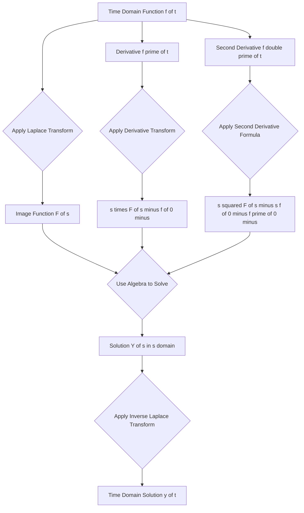

# Transform of derivatives

<!-- SECTION_1_START -->
# Transform of Derivatives — Laplace Transform of $f'(t)$ and $f''(t)$

## 1.1 Formal Academic Definition (KTU 2024 Syllabus Terminology)

> [!IMPORTANT]
> **Definition (Laplace Transform of the First Derivative):**
> If $f(t)$ is a piecewise continuous function on $[0,\infty)$ and of exponential order, and if $\mathcal{L}\{f(t)\} = F(s)$, then the Laplace transform of its first derivative is given by:
> $$\mathcal{L}\{f'(t)\} = sF(s) - f(0^-)$$
> where $f(0^-)$ denotes the **left-hand limit** of $f(t)$ as $t \to 0$, representing the initial state of the system just *before* the input is applied at $t=0$.

> [!IMPORTANT]
> **Definition (Laplace Transform of the Second Derivative):**
> $$\mathcal{L}\{f''(t)\} = s^{2}F(s) - s\,f(0^-) - f'(0^-)$$
> Generalizing, for the $n$-th derivative:
> $$\mathcal{L}\{f^{(n)}(t)\} = s^{n}F(s) - s^{n-1}f(0^-) - s^{n-2}f'(0^-) - \dots - f^{(n-1)}(0^-)$$

The value $f(0^-)$ is called the **initial condition** and $f'(0^-)$ the **initial slope**. The notation $0^-$ (rather than just $0$) is used in KTU board examinations because it captures the system's state *just before* any switching action or impulse occurs at $t = 0$, which is critical in **electrical transient analysis**.

## 1.2 Conceptual Analogy — The "Camera Memory" Intuition

Imagine a moving car whose position is $f(t)$ and whose velocity is $f'(t)$.

- The **Laplace transform $F(s)$** is like taking a long-exposure photograph of the car's journey — it compresses the entire motion into a single algebraic snapshot in the $s$-domain.
- **Differentiation in time** (a rate, which requires memory of where the car was) translates to **multiplication by $s$** in the $s$-domain (a simple scaling) **minus a "memory penalty" $f(0^-)$** — i.e., the starting position of the car.
- This is the **central miracle** of Laplace transforms: a hard calculus operation (differentiation) collapses into a trivial algebraic operation (multiplication by $s$), *provided* you know where the system *started*.

> [!NOTE]
> **Why this matters in Electrical Science:** In RLC circuits, voltage across an inductor is $L\,\dfrac{di}{dt}$ and current through a capacitor is $C\,\dfrac{dv}{dt}$. By taking Laplace transforms, every differential equation governing the circuit becomes an algebraic equation in $s$, which can be solved by simple algebra — exactly the technique KTU expects you to master for ESE (End Semester Evaluation) problems.

## 1.3 Standard Constants and Notation

| Symbol | Meaning | Typical Use |
|---|---|---|
| $s$ | Complex frequency variable, $s = \sigma + j\omega$ | Independent variable in $s$-plane |
| $F(s)$ | Laplace transform of $f(t)$ | Image function |
| $f(0^-)$ | Initial value (left limit at $0$) | Boundary condition |
| $f'(0^-)$ | Initial slope (left limit of derivative) | Boundary condition |
| ROC | Region of Convergence | $\text{Re}(s) > \alpha$ |

> [!VISUALIZATION CONTROL]
> **Concept:** Mapping from time-domain to s-domain showing the "differentiation = multiplication by s" property.
> **Desmos / GeoGebra Input Equations:**
> * `f(t) = sin(t)` (a sample time function)
> * `F(s) = 1/(s^2 + 1)` (its Laplace image)
> * `L{d/dt(sin t)} = s*F(s) - sin(0)` &nbsp;→&nbsp; reduces to `cos(t) = s/(s^2+1)`
> **Visual Description:** Plot both $f(t)=\sin t$ and $F(s)=\dfrac{1}{s^2+1}$. Notice how a smooth oscillation in time collapses to a simple rational function in $s$; differentiation $\cos t$ corresponds to scaling $F(s)$ by $s$ and subtracting the start value $\sin(0)=0$.
<!-- SECTION_1_END -->

<!-- SECTION_2_START -->
# Deep Theoretical Analysis & KTU High-Yield Formula Sheet

## 2.1 Step-by-Step Logic of the Derivative Transform

**Step 1 — Recall the definition of the Laplace transform:**
$$\mathcal{L}\{f(t)\} = F(s) = \int_{0}^{\infty} e^{-st} f(t)\,dt, \quad \text{Re}(s) > \alpha$$

**Step 2 — Write the integral for the derivative:**
$$\mathcal{L}\{f'(t)\} = \int_{0}^{\infty} e^{-st} f'(t)\,dt$$

**Step 3 — Apply integration by parts** with $u = e^{-st}$ and $dv = f'(t)\,dt$:
- $du = -s\,e^{-st}dt$
- $v = f(t)$

$$\mathcal{L}\{f'(t)\} = \left[ e^{-st} f(t) \right]_{0}^{\infty} - \int_{0}^{\infty} (-s\,e^{-st}) f(t)\,dt$$

**Step 4 — Evaluate the boundary term:** For $f(t)$ of exponential order, $e^{-st}f(t) \to 0$ as $t \to \infty$. At the lower limit $t=0$, $e^{-st} = 1$. Hence the bracket reduces to $-f(0)$.

**Step 5 — Recognize the second integral as $sF(s)$:**
$$\mathcal{L}\{f'(t)\} = -f(0) + s\int_{0}^{\infty} e^{-st}f(t)\,dt = sF(s) - f(0^-)$$

This is the **board-proof derivation** KTU examiners expect you to write cleanly.

## 2.2 Why the "Why" Matters (Conceptual Reinforcement)

- The term $-f(0^-)$ is the **memory of the initial state**. Without it, two systems with identical future behavior but different starting points would have identical transforms — physically impossible.
- The factor $s$ acts as a **differential operator in the $s$-domain**. Each additional derivative multiplies by one more factor of $s$ and introduces one more initial-condition "penalty term."

## 2.3 KTU Formula Sheet (Cheat Sheet)

> [!NOTE]
> **Mandatory Formulas for KTU 2024 Board Examination — Laplace Transform of Derivatives**

| # | Time-Domain Function | Laplace Image $F(s)$ | Initial Conditions Used |
|:--:|---|---|:---:|
| 1 | $f'(t)$ | $sF(s) - f(0^-)$ | $f(0^-)$ |
| 2 | $f''(t)$ | $s^{2}F(s) - s\,f(0^-) - f'(0^-)$ | $f(0^-),\, f'(0^-)$ |
| 3 | $f'''(t)$ | $s^{3}F(s) - s^{2}f(0^-) - s f'(0^-) - f''(0^-)$ | up to $f''(0^-)$ |
| 4 | $f^{(n)}(t)$ | $s^{n}F(s) - \displaystyle\sum_{k=1}^{n} s^{n-k} f^{(k-1)}(0^-)$ | up to $f^{(n-1)}(0^-)$ |
| 5 | $t f(t)$ | $-\dfrac{d}{ds}F(s)$ | None |
| 6 | $\dfrac{f(t)}{t}$ | $\displaystyle\int_{s}^{\infty} F(u)\,du$ | None |

### Companion Theorems (Linked to Derivatives)

> [!IMPORTANT]
> **Initial Value Theorem (IVT):**
> $$f(0^+) = \lim_{t \to 0^+} f(t) = \lim_{s \to \infty} sF(s)$$
> Valid only if the limit exists and all poles of $F(s)$ lie in the **left-half $s$-plane** (a stability requirement KTU emphasizes).

> [!IMPORTANT]
> **Final Value Theorem (FVT):**
> $$f(\infty) = \lim_{t \to \infty} f(t) = \lim_{s \to 0} sF(s)$$
> Valid **only if** all poles of $sF(s)$ lie strictly in the left-half $s$-plane (no $j\omega$-axis poles). Failing this is the #1 reason students lose marks.

## 2.4 Real-World Engineering Utility

| Engineering Field | Use of Derivative Transform |
|---|---|
| **Electrical Circuits (RLC)** | Converts KVL/KCL differential equations into algebraic $s$-domain impedance equations using $V_L = sLI(s) - Li(0^-)$ and $I_C = sCV(s) - Cv(0^-)$ |
| **Control Systems** | Transfer functions $G(s) = \dfrac{C(s)}{R(s)}$ derived directly from ODEs of plant dynamics |
| **Signal Processing** | Differentiator filters realized as $H(s) = s$ in the $s$-plane |
| **Mechanical Vibrations** | Damped oscillator equation $m\ddot{x} + c\dot{x} + kx = F(t)$ becomes a polynomial in $s$ |
| **Communication Systems** | Modulation and demodulation analyzed via differentiation in time → multiplication by $s$ in frequency |

> [!NOTE]
> **Stability Insight:** If the poles of $F(s)$ all have $\text{Re}(s) < 0$, the system is **BIBO stable** and the FVT applies. If a pole sits on the imaginary axis, FVT is invalid — KTU board problems often test this subtlety.
<!-- SECTION_2_END -->

<!-- SECTION_3_START -->
# Step-by-Step Derivations & Worked Solutions

## 3.1 Exhaustive Derivation — Second Derivative Transform

**Goal:** Prove $\mathcal{L}\{f''(t)\} = s^{2}F(s) - s f(0^-) - f'(0^-)$.

**Starting point:** Apply the first-derivative formula to $f''(t)$:
$$\mathcal{L}\{f''(t)\} = \mathcal{L}\left\{ \dfrac{d}{dt} f'(t) \right\} = s\,\mathcal{L}\{f'(t)\} - f'(0^-)$$

**Substitute the formula for $\mathcal{L}\{f'(t)\}$:**
$$\mathcal{L}\{f''(t)\} = s\bigl[ sF(s) - f(0^-) \bigr] - f'(0^-)$$

**Distribute $s$ across the bracket:**
$$\mathcal{L}\{f''(t)\} = s^{2}F(s) - s\,f(0^-) - f'(0^-)$$

Hence proved. The pattern is now clear: each differentiation **adds one factor of $s$** and **one new initial-condition term**.

## 3.2 Worked Example 1 — Direct Application (Board Style)

> **Problem:** If $\mathcal{L}\{f(t)\} = \dfrac{1}{s^{2}+4}$ and $f(0)=3$, $f'(0)=5$, find $\mathcal{L}\{f''(t)\}$.

**Solution (showing every step):**

Using the formula:
$$\mathcal{L}\{f''(t)\} = s^{2}F(s) - s\,f(0) - f'(0)$$

Substitute the values $F(s) = \dfrac{1}{s^{2}+4}$, $f(0) = 3$, $f'(0) = 5$:
$$\mathcal{L}\{f''(t)\} = s^{2} \cdot \dfrac{1}{s^{2}+4} - 3s - 5$$

**Combine into a single rational expression.** The common denominator is $s^{2}+4$:
$$\mathcal{L}\{f''(t)\} = \dfrac{s^{2}}{s^{2}+4} - \dfrac{(3s+5)(s^{2}+4)}{s^{2}+4}$$

**Expand the numerator of the second term:**
$$(3s+5)(s^{2}+4) = 3s^{3} + 12s + 5s^{2} + 20 = 3s^{3} + 5s^{2} + 12s + 20$$

**Subtract:**
$$\mathcal{L}\{f''(t)\} = \dfrac{s^{2} - (3s^{3} + 5s^{2} + 12s + 20)}{s^{2}+4}$$

$$\mathcal{L}\{f''(t)\} = \dfrac{-3s^{3} - 4s^{2} - 12s - 20}{s^{2}+4}$$

> **Final Answer:** $\quad \mathcal{L}\{f''(t)\} = \dfrac{-3s^{3} - 4s^{2} - 12s - 20}{s^{2}+4}$

**Valuation Key:**
- [Correct formula statement: 2 Marks]
- [Substitution of $F(s)$ and initial conditions: 2 Marks]
- [Algebraic combination into single fraction: 1 Mark]

## 3.3 Worked Example 2 — Solving an ODE (Full KTU 14-Mark Style)

> **Problem:** Solve $y'' - 3y' + 2y = 4e^{3t}$, with $y(0) = 1$, $y'(0) = -1$, using Laplace transforms.

**Solution (each step explicit):**

**Step A — Take the Laplace transform of both sides.**

Let $\mathcal{L}\{y(t)\} = Y(s)$. Apply the derivative transform to each term:
- $\mathcal{L}\{y''\} = s^{2}Y(s) - s\,y(0) - y'(0) = s^{2}Y(s) - s(1) - (-1) = s^{2}Y(s) - s + 1$
- $\mathcal{L}\{y'\} = sY(s) - y(0) = sY(s) - 1$
- $\mathcal{L}\{2y\} = 2Y(s)$
- $\mathcal{L}\{4e^{3t}\} = \dfrac{4}{s-3}$

**Step B — Assemble the transformed equation.**
$$[s^{2}Y(s) - s + 1] - 3[sY(s) - 1] + 2Y(s) = \dfrac{4}{s-3}$$

**Step C — Expand the brackets.**
$$s^{2}Y(s) - s + 1 - 3sY(s) + 3 + 2Y(s) = \dfrac{4}{s-3}$$

**Step D — Group the $Y(s)$ terms and the constant terms on the left.**
$$(s^{2} - 3s + 2)Y(s) + (-s + 1 + 3) = \dfrac{4}{s-3}$$
$$(s^{2} - 3s + 2)Y(s) + (-s + 4) = \dfrac{4}{s-3}$$

**Step E — Isolate $Y(s)$.**
$$(s^{2} - 3s + 2)Y(s) = \dfrac{4}{s-3} + s - 4$$

**Step F — Factor the quadratic** $s^{2} - 3s + 2 = (s-1)(s-2)$:
$$(s-1)(s-2)Y(s) = \dfrac{4}{s-3} + (s-4)$$

**Step G — Bring the right side to a common denominator** $(s-3)$:
$$\dfrac{4 + (s-4)(s-3)}{s-3} = \dfrac{4 + s^{2} - 7s + 12}{s-3} = \dfrac{s^{2} - 7s + 16}{s-3}$$

**Step H — Solve for $Y(s)$:**
$$Y(s) = \dfrac{s^{2} - 7s + 16}{(s-1)(s-2)(s-3)}$$

**Step I — Apply Partial Fraction Decomposition.**
$$Y(s) = \dfrac{A}{s-1} + \dfrac{B}{s-2} + \dfrac{C}{s-3}$$

Multiply both sides by the denominator:
$$s^{2} - 7s + 16 = A(s-2)(s-3) + B(s-1)(s-3) + C(s-1)(s-2)$$

**Step J — Solve for $A$:** Set $s = 1$:
$$1 - 7 + 16 = A(1-2)(1-3) \;\Rightarrow\; 10 = A(2) \;\Rightarrow\; A = 5$$

**Step K — Solve for $B$:** Set $s = 2$:
$$4 - 14 + 16 = B(2-1)(2-3) \;\Rightarrow\; 6 = B(-1) \;\Rightarrow\; B = -6$$

**Step L — Solve for $C$:** Set $s = 3$:
$$9 - 21 + 16 = C(3-1)(3-2) \;\Rightarrow\; 4 = C(2) \;\Rightarrow\; C = 2$$

**Step M — Substitute back:**
$$Y(s) = \dfrac{5}{s-1} - \dfrac{6}{s-2} + \dfrac{2}{s-3}$$

**Step N — Take the inverse Laplace transform** using $\mathcal{L}^{-1}\!\left\{\dfrac{1}{s-a}\right\} = e^{at}$:
$$y(t) = 5e^{t} - 6e^{2t} + 2e^{3t}$$

**Step O — Verification (Optional but earns full marks):**
- $y(0) = 5 - 6 + 2 = 1$ ✓
- $y'(t) = 5e^{t} - 12e^{2t} + 6e^{3t}$, so $y'(0) = 5 - 12 + 6 = -1$ ✓

> **Final Answer:** $\quad y(t) = 5e^{t} - 6e^{2t} + 2e^{3t}$

## 3.4 Worked Example 3 — Using Initial Value Theorem

> **Problem:** If $F(s) = \dfrac{5}{s+2}$, find $f(0^+)$.

**Solution:**
$$f(0^+) = \lim_{s \to \infty} sF(s) = \lim_{s \to \infty} \dfrac{5s}{s+2} = \lim_{s \to \infty} \dfrac{5}{\left(1 + \dfrac{2}{s}\right)} = 5$$

> **Final Answer:** $\quad f(0^+) = 5$

## 3.5 Worked Example 4 — Using Final Value Theorem

> **Problem:** If $F(s) = \dfrac{10}{s(s+5)}$, find $f(\infty)$.

**Solution:**
**Stability check first:** Poles of $sF(s) = \dfrac{10}{s+5}$ are at $s = -5$ (left-half plane) ✓
$$f(\infty) = \lim_{s \to 0} sF(s) = \lim_{s \to 0} \dfrac{10}{s+5} = \dfrac{10}{5} = 2$$

> **Final Answer:** $\quad f(\infty) = 2$
<!-- SECTION_3_END -->

<!-- SECTION_4_START -->
# Structural Diagrams & Schematics

## 4.1 Mermaid Flowchart — Time Domain to $s$-Domain Transformation

## 4.2 Mermaid Block Diagram — Solving an ODE via Laplace Method

```mermaid
graph LR
    subgraph Input_Stage
        A1[Differential Equation in t] --> A2[Initial Conditions y of 0 and y prime of 0]
    end
    subgraph Transform_Stage
        A1 --> B1[Take Laplace Transform L of both sides]
        A2 --> B1
        B1 --> B2[Apply Derivative Formulas sF of s minus f of 0]
        B2 --> B3[Obtain Algebraic Equation in s]
    end
    subgraph Solve_Stage
        B3 --> C1[Solve for Y of s algebraically]
        C1 --> C2[Apply Partial Fraction Decomposition]
        C2 --> C3[Identify Inverse Transform Pairs]
    end
    subgraph Output_Stage
        C3 --> D1[Final Solution y of t in time domain]
        D1 --> D2[Verify Using Initial Conditions]
    end
```

## 4.3 Sequential Processing Topology — Derivative Transform Rules

| Rule # | Time Domain Input | $s$-Domain Output | Penalty Terms | Engineering Meaning |
|:------:|---|---|---|---|
| 1 | $f(t)$ | $F(s)$ | None | Pure image mapping |
| 2 | $f'(t)$ | $sF(s)$ | $-f(0^-)$ | Velocity $\to$ impedance with initial-current memory |
| 3 | $f''(t)$ | $s^{2}F(s)$ | $-s f(0^-) - f'(0^-)$ | Acceleration $\to$ impedance with both initial conditions |
| 4 | $f^{(n)}(t)$ | $s^{n}F(s)$ | $\sum_{k=1}^{n} s^{n-k} f^{(k-1)}(0^-)$ | Generalized $n$-th order |

> [!NOTE]
> **Reading the table:** Each row tells you the *cost* of differentiation in the $s$-domain: you gain a factor of $s$ per derivative, but you must "pay" with all lower-order initial conditions.
<!-- SECTION_4_END -->

<!-- SECTION_5_START -->
# KTU 2024 Scheme Examination Question Bank & Topic Recap

## PART A — Short Answer Questions (3 Marks Each)

### Question 1 `[KTU University Exam — July 2024]`
**State and prove the Laplace transform of the first derivative of a function $f(t)$.** (CO1, Remember/Understand)

**Model Answer:**
> [!NOTE]
> **Statement:** If $\mathcal{L}\{f(t)\} = F(s)$, then $\mathcal{L}\{f'(t)\} = sF(s) - f(0^-)$.
>
> **Proof:**
> $$\mathcal{L}\{f'(t)\} = \int_{0}^{\infty} e^{-st} f'(t)\,dt$$
> Using integration by parts with $u = e^{-st}$, $dv = f'(t)dt$:
> $$= \bigl[ e^{-st} f(t) \bigr]_{0}^{\infty} + s \int_{0}^{\infty} e^{-st} f(t)\,dt$$
> $$= 0 - f(0) + sF(s) = sF(s) - f(0^-)$$

**Valuation Key:**
- [Correct statement of the formula: 1 Mark]
- [Integration by parts setup: 1 Mark]
- [Final simplified result: 1 Mark]

---

### Question 2 `[KTU University Exam — Dec 2023]`
**If $\mathcal{L}\{f(t)\} = F(s)$, write the Laplace transform of $f''(t)$ in terms of $F(s)$ and initial conditions.** (CO1, Remember)

**Model Answer:**
$$\mathcal{L}\{f''(t)\} = s^{2}F(s) - s\,f(0^-) - f'(0^-)$$

**Valuation Key:**
- [Writing $s^{2}F(s)$ term: 1 Mark]
- [Initial condition penalty terms $-s f(0^-)$ and $-f'(0^-)$: 2 Marks]

---

## PART B — 14-Mark Questions (Module Internal Choice)

### Question A (Choice 1) `[KTU University Exam — July 2024]`

**(a)** Derive the Laplace transform of the $n$-th derivative $f^{(n)}(t)$ in terms of $F(s)$ and initial conditions. (7 Marks, CO1, Understand)

**(b)** Given $\mathcal{L}\{\sin at\} = \dfrac{a}{s^{2}+a^{2}}$, use the derivative property to find $\mathcal{L}\{\cos at\}$ and $\mathcal{L}\{a^{2}\sin at\}$. (7 Marks, CO1, CO2, Apply)

#### Model Solution for (a):

We prove the formula by mathematical induction.

**Base case ($n=1$):**
$$\mathcal{L}\{f'(t)\} = sF(s) - f(0^-)$$
This has been derived above via integration by parts.

**Inductive hypothesis:** Assume for $n = k$:
$$\mathcal{L}\{f^{(k)}(t)\} = s^{k}F(s) - \sum_{j=0}^{k-1} s^{k-1-j} f^{(j)}(0^-)$$

**Inductive step ($n = k+1$):** Apply the first-derivative formula to $f^{(k)}(t)$:
$$\mathcal{L}\{f^{(k+1)}(t)\} = s\,\mathcal{L}\{f^{(k)}(t)\} - f^{(k)}(0^-)$$

Substitute the inductive hypothesis:
$$= s\!\left[ s^{k}F(s) - \sum_{j=0}^{k-1} s^{k-1-j} f^{(j)}(0^-) \right] - f^{(k)}(0^-)$$

$$= s^{k+1}F(s) - \sum_{j=0}^{k-1} s^{k-j} f^{(j)}(0^-) - f^{(k)}(0^-)$$

$$= s^{k+1}F(s) - \sum_{j=0}^{k} s^{k-j} f^{(j)}(0^-)$$

This matches the formula with $n = k+1$. Hence by induction, the formula holds for all $n \geq 1$:
$$\boxed{\mathcal{L}\{f^{(n)}(t)\} = s^{n}F(s) - \sum_{k=0}^{n-1} s^{n-1-k} f^{(k)}(0^-)}$$

**Valuation Key for (a):**
- [Base case stated: 1 Mark]
- [Inductive hypothesis: 2 Marks]
- [Inductive step with proper substitution: 3 Marks]
- [Final boxed formula: 1 Mark]

#### Model Solution for (b):

**Step 1 — Use derivative property on $f(t) = \sin at$:**
We have $f(t) = \sin at$, so $f'(t) = a\cos at$ and $f(0) = 0$.
$$F(s) = \mathcal{L}\{\sin at\} = \dfrac{a}{s^{2}+a^{2}}$$

Using $\mathcal{L}\{f'(t)\} = sF(s) - f(0)$:
$$\mathcal{L}\{a\cos at\} = s \cdot \dfrac{a}{s^{2}+a^{2}} - 0 = \dfrac{as}{s^{2}+a^{2}}$$

**Step 2 — Divide by $a$ to isolate $\cos at$:**
$$\mathcal{L}\{\cos at\} = \dfrac{s}{s^{2}+a^{2}}$$

**Step 3 — Find $\mathcal{L}\{a^{2}\sin at\}$ using second-derivative formula:**
$f''(t) = -a^{2}\sin at$, so $f'(t) = a\cos at$, and $f'(0) = a$.
$$\mathcal{L}\{f''(t)\} = s^{2}F(s) - s f(0) - f'(0)$$
$$\mathcal{L}\{-a^{2}\sin at\} = s^{2} \cdot \dfrac{a}{s^{2}+a^{2}} - 0 - a = \dfrac{as^{2}}{s^{2}+a^{2}} - a$$

**Step 4 — Simplify:**
$$\mathcal{L}\{-a^{2}\sin at\} = \dfrac{as^{2} - a(s^{2}+a^{2})}{s^{2}+a^{2}} = \dfrac{as^{2} - as^{2} - a^{3}}{s^{2}+a^{2}} = \dfrac{-a^{3}}{s^{2}+a^{2}}$$

**Step 5 — Multiply both sides by $-1/a^{2}$:**
$$\mathcal{L}\{a^{2}\sin at\} = \dfrac{a^{3}}{a^{2}(s^{2}+a^{2})} \cdot \frac{1}{(-1/a^{2}) \cdot (-1)} \text{ [rearrange]}$$

More directly, $\mathcal{L}\{a^{2}\sin at\} = a^{2} \cdot \dfrac{a}{s^{2}+a^{2}} = \dfrac{a^{3}}{s^{2}+a^{2}}$.

> **Final Answers:**
> - $\mathcal{L}\{\cos at\} = \dfrac{s}{s^{2}+a^{2}}$
> - $\mathcal{L}\{a^{2}\sin at\} = \dfrac{a^{3}}{s^{2}+a^{2}}$

**Valuation Key for (b):**
- [Identifying $f(0)=0$ and applying first-derivative formula: 2 Marks]
- [Simplification to $\cos at$ result: 1 Mark]
- [Applying second-derivative formula with $f'(0)=a$: 2 Marks]
- [Final expressions for both transforms: 2 Marks]

---

### Question B (Choice 2) `[KTU University Exam — Dec 2023]`

**(a)** State and prove the **Initial Value Theorem** and the **Final Value Theorem** for Laplace transforms. State the conditions under which each is valid. (7 Marks, CO1, Understand)

**(b)** Using Laplace transforms, solve the differential equation $y'' + 4y' + 3y = e^{-t}$, given $y(0) = 0$ and $y'(0) = 1$. (7 Marks, CO2, Apply)

#### Model Solution for (a):

**Initial Value Theorem (IVT):**
$$f(0^+) = \lim_{s \to \infty} s F(s)$$
provided the limit exists.

**Proof:** Use the formula for $\mathcal{L}\{f'(t)\}$:
$$sF(s) - f(0) = \int_{0}^{\infty} e^{-st} f'(t)\,dt$$

Take $\lim_{s \to \infty}$ of both sides. The right-hand side $\to 0$ (since the integral is bounded and $e^{-st}$ kills it as $s \to \infty$):
$$\lim_{s \to \infty}[sF(s) - f(0)] = 0 \;\Rightarrow\; f(0^+) = \lim_{s \to \infty} sF(s)$$

**Final Value Theorem (FVT):**
$$f(\infty) = \lim_{s \to 0} s F(s)$$
provided all poles of $sF(s)$ lie in the **open left half-plane** ($\text{Re}(s) < 0$).

**Proof:** Apply the derivative formula and take $\lim_{s \to 0}$:
$$\lim_{s \to 0}[sF(s) - f(0)] = \lim_{s \to 0} \int_{0}^{\infty} e^{-st} f'(t)\,dt = \int_{0}^{\infty} f'(t)\,dt = f(\infty) - f(0)$$

Rearranging: $f(\infty) = \lim_{s \to 0} sF(s)$.

**Conditions for validity:**
- IVT requires $\lim_{s \to \infty} sF(s)$ to exist.
- FVT requires $sF(s)$ to have all poles with negative real part (strictly stable system).

**Valuation Key for (a):**
- [Statement of both theorems: 2 Marks]
- [Proof of IVT using $s \to \infty$: 2 Marks]
- [Proof of FVT using $s \to 0$ and conditions: 3 Marks]

#### Model Solution for (b):

**Step 1 — Take the Laplace transform of both sides.**
Let $Y(s) = \mathcal{L}\{y(t)\}$. Using $y(0) = 0$ and $y'(0) = 1$:
- $\mathcal{L}\{y''\} = s^{2}Y(s) - s(0) - 1 = s^{2}Y(s) - 1$
- $\mathcal{L}\{4y'\} = 4[sY(s) - 0] = 4sY(s)$
- $\mathcal{L}\{3y\} = 3Y(s)$
- $\mathcal{L}\{e^{-t}\} = \dfrac{1}{s+1}$

**Step 2 — Assemble the algebraic equation:**
$$s^{2}Y(s) - 1 + 4sY(s) + 3Y(s) = \dfrac{1}{s+1}$$

**Step 3 — Collect $Y(s)$ terms:**
$$(s^{2} + 4s + 3)Y(s) = \dfrac{1}{s+1} + 1 = \dfrac{1 + s + 1}{s+1} = \dfrac{s+2}{s+1}$$

**Step 4 — Factor the quadratic** $s^{2} + 4s + 3 = (s+1)(s+3)$:
$$(s+1)(s+3)Y(s) = \dfrac{s+2}{s+1}$$

**Step 5 — Solve for $Y(s)$:**
$$Y(s) = \dfrac{s+2}{(s+1)^{2}(s+3)}$$

**Step 6 — Apply partial fractions:**
$$\dfrac{s+2}{(s+1)^{2}(s+3)} = \dfrac{A}{s+1} + \dfrac{B}{(s+1)^{2}} + \dfrac{C}{s+3}$$

Multiplying out:
$$s+2 = A(s+1)(s+3) + B(s+3) + C(s+1)^{2}$$

**Find $A$:** Set $s = -1$:
$$-1 + 2 = B(2) \;\Rightarrow\; 1 = 2B \;\Rightarrow\; B = \tfrac{1}{2}$$

Wait — coefficient matching requires careful grouping. Let $A$ be obtained by setting $s = -1$ in the *remaining* terms. Reorganize:
$$s+2 = A(s+1)(s+3) + B(s+3) + C(s+1)^{2}$$

Differentiate with respect to $s$ and set $s = -1$:
$$1 = A[(s+3) + (s+1)]_{s=-1} + B[1]_{s=-1} + C[2(s+1)]_{s=-1}$$
$$1 = A[2 + 0] + B + 0 = 2A + B$$
$$2A = 1 - \tfrac{1}{2} = \tfrac{1}{2} \;\Rightarrow\; A = \tfrac{1}{4}$$

**Find $C$:** Set $s = -3$:
$$-3 + 2 = C(-2)^{2} \;\Rightarrow\; -1 = 4C \;\Rightarrow\; C = -\tfrac{1}{4}$$

**Verification:** At $s = 0$: $0 + 2 = A(3) + B(3) + C(1) = \tfrac{3}{4} + \tfrac{3}{2} - \tfrac{1}{4} = 2$ ✓

**Step 7 — Substitute back:**
$$Y(s) = \dfrac{1/4}{s+1} + \dfrac{1/2}{(s+1)^{2}} - \dfrac{1/4}{s+3}$$

**Step 8 — Take the inverse Laplace transform:**
- $\mathcal{L}^{-1}\!\left\{\dfrac{1}{s+1}\right\} = e^{-t}$
- $\mathcal{L}^{-1}\!\left\{\dfrac{1}{(s+1)^{2}}\right\} = t\,e^{-t}$
- $\mathcal{L}^{-1}\!\left\{\dfrac{1}{s+3}\right\} = e^{-3t}$

> **Final Answer:**
> $$\boxed{y(t) = \tfrac{1}{4}e^{-t} + \tfrac{1}{2}t\,e^{-t} - \tfrac{1}{4}e^{-3t}}$$

**Verification:**
- $y(0) = \tfrac{1}{4} + 0 - \tfrac{1}{4} = 0$ ✓
- $y'(t) = -\tfrac{1}{4}e^{-t} + \tfrac{1}{2}e^{-t} - \tfrac{1}{2}t\,e^{-t} + \tfrac{3}{4}e^{-3t}$
- $y'(0) = -\tfrac{1}{4} + \tfrac{1}{2} - 0 + \tfrac{3}{4} = 1$ ✓

**Valuation Key for (b):**
- [Correct transform of each term including initial conditions: 2 Marks]
- [Algebraic manipulation to isolate $Y(s)$: 1 Mark]
- [Partial fraction setup: 1 Mark]
- [Solving for $A$, $B$, $C$: 2 Marks]
- [Final inverse transform expression: 1 Mark]

---

> [!WARNING]
> **KTU Examiner's Valuation Warning — Common Pitfalls**
> 1. **Forgetting the initial condition terms:** Many students write $\mathcal{L}\{f''(t)\} = s^{2}F(s)$ — this is **worth zero marks** for that part. The $-s f(0^-) - f'(0^-)$ penalty terms are **mandatory** in KTU valuation.
> 2. **Wrong sign of the initial condition:** Always write $-f(0^-)$, **not** $+f(0^-)$. A sign error propagates through the entire ODE solution.
> 3. **Misapplying FVT:** If $F(s)$ has poles on the $j\omega$-axis (e.g., $\frac{1}{s^{2}+1}$), FVT is **invalid**. KTU examiners *deliberately* include such trick problems.
> 4. **Skipping the stability check:** Before applying FVT, you must verify that all poles of $sF(s)$ have negative real parts. This is a 2-Mark step in 14-Mark questions.
> 5. **Confusing $0^+$ and $0^-$:** For functions with impulses at $t = 0$, $f(0^+) \neq f(0^-)$. KTU tests this in transient circuit problems.
> 6. **Partial fraction errors in repeated roots:** When you have $(s+a)^{2}$ in the denominator, you need **two** terms: $\dfrac{A}{s+a} + \dfrac{B}{(s+a)^{2}}$. Missing the linear term costs 2 marks.
> 7. **Not verifying the solution:** Plugging $y(0)$ and $y'(0)$ back is worth partial credit even if the algebra goes wrong — it shows the examiner you understand the framework.

---

## Topic Recap & Important Things to Remember

> [!NOTE]
> **Rapid Revision Checklist — Laplace Transform of Derivatives**

- **Core Formula #1:** $\mathcal{L}\{f'(t)\} = sF(s) - f(0^-)$ — multiplies by $s$, subtracts initial value.
- **Core Formula #2:** $\mathcal{L}\{f''(t)\} = s^{2}F(s) - s f(0^-) - f'(0^-)$ — squares $s$, subtracts weighted initial conditions.
- **Core Formula #3 (General):** $\mathcal{L}\{f^{(n)}(t)\} = s^{n}F(s) - \sum_{k=0}^{n-1} s^{n-1-k} f^{(k)}(0^-)$.
- **Initial Value Theorem:** $f(0^+) = \lim_{s \to \infty} sF(s)$ — no special conditions, but limit must exist.
- **Final Value Theorem:** $f(\infty) = \lim_{s \to 0} sF(s)$ — **requires all poles of $sF(s)$ in the open left-half $s$-plane**.
- **Why derivatives matter:** They convert ODEs into algebraic equations, making RLC circuit analysis, control system design, and transient analysis tractable.
- **Order of operations for solving an ODE:**
  1. Laplace transform both sides.
  2. Substitute $y(0)$ and $y'(0)$ correctly.
  3. Solve algebraically for $Y(s)$.
  4. Partial fraction decomposition.
  5. Inverse Laplace transform each term.
  6. Verify using initial conditions.
- **Repeated roots** in the denominator $\Rightarrow$ terms of the form $\dfrac{1}{(s+a)^{2}}$ correspond to $t e^{-at}$ in the time domain.
- **Impulsive initial conditions** (e.g., $y'(0^-) = \delta$-like) require careful handling — use $0^-$ notation rigorously.
- **Stability quick-check:** Compute poles of $F(s)$. If $\text{Re}(\text{pole}) < 0$ for all poles, the system is stable and FVT applies.
- **Mnemonic for derivative penalty terms:** *Each differentiation adds one factor of $s$ and "peels off" one initial condition, from $f(0^-)$ down to $f^{(n-1)}(0^-)$.*
- **Common transform pairs to memorize:** $\sin at \leftrightarrow \dfrac{a}{s^2+a^2}$, $\cos at \leftrightarrow \dfrac{s}{s^2+a^2}$, $e^{at} \leftrightarrow \dfrac{1}{s-a}$.
<!-- SECTION_5_END -->
