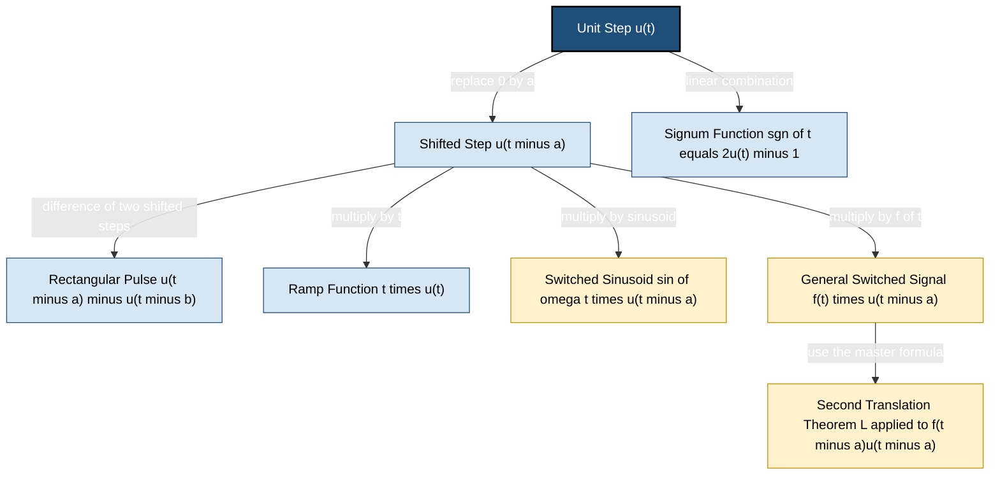
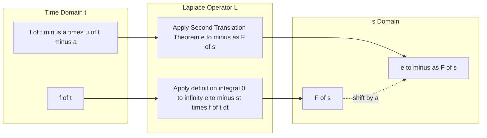
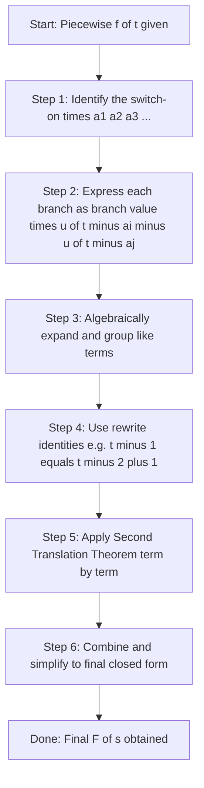

# Unit step function

<!-- SECTION_1_START -->

# Unit Step Function — Core Definition & Intuitive Overview

> [!IMPORTANT]
> **KTU 2024 GYMAT101 — Module 3 (Laplace Transform)**
> The **Unit Step Function** (also called the **Heaviside Step Function**) is the *primary switching device* in Laplace-transform-based circuit and signal analysis. Every "switched-on" signal in engineering is mathematically expressed using this function.

## Formal Mathematical Definition

The **Unit Step Function** $u(t-a)$ is defined as a piecewise function that "jumps" from $0$ to $1$ at the instant $t = a$:

$$
u(t-a) = \begin{cases} 0, & t < a \\ 1, & t \geq a \end{cases}
$$

When the switch-on instant is $a = 0$, the function simplifies to the **standard unit step**:

$$
u(t) = \begin{cases} 0, & t < 0 \\ 1, & t \geq 0 \end{cases}
$$

> [!NOTE]
> **KTU Board Convention:** The value at the jump point $t = a$ is conventionally taken as $1$ (right-continuous). Always write "$t \geq a$" on the upper branch — failing this costs 1 mark in KTU valuation.

## Conceptual Analogy — Plain English Intuition

Think of $u(t-a)$ as an **electrical light switch**:

- For $t < a$ (before time $a$): the switch is **OFF**, the lamp is dark → function value $= 0$.
- For $t \geq a$ (from time $a$ onwards): the switch is **ON**, the lamp glows → function value $= 1$.

The instant of switching is $a$. The function itself does not care *how high* the signal becomes later — it merely **turns on** the action. Whatever signal is multiplied by $u(t-a)$ gets "switched on" at $t = a$ and "switched off" at $t = \infty$ (i.e., it never gets switched off again).

### Real-World Engineering Context

| Domain | Application of $u(t-a)$ |
|---|---|
| **Electrical Circuits** | A DC voltage source connected to an RC/RL circuit at $t = a$ via a switch |
| **Control Systems** | Application of step input to a transfer function for transient analysis |
| **Signal Processing** | Windowing a continuous signal — start playback at a given moment |
| **Mechanical Systems** | A suddenly applied force on a beam or a dashpot at $t = a$ |

> [!TIP]
> **Memory Trick:** Think of $u$ as **"U-Turn"** — the function was going along the $t$-axis at height $0$, then *makes a U-turn upward* to height $1$ at the switch-on instant.

## Physical / Graphical Picture

- **Y-axis:** amplitude of the function, taking only values $0$ or $1$.
- **X-axis:** time $t \in \mathbb{R}$.
- **Key feature:** a **vertical jump** of unit height at $t = a$ — a true mathematical discontinuity.

> [!VISUALIZATION CONTROL]
> **Concept:** Plotting the standard unit step $u(t)$ and a shifted unit step $u(t-2)$ on the same axes.
>
> **GeoGebra / Desmos Input Equations:**
> * `f(x) = {0 : x < 0, 1 : x >= 0}` &nbsp;&nbsp; (standard unit step $u(t)$)
> * `g(x) = {0 : x < 2, 1 : x >= 2}` &nbsp;&nbsp; (shifted unit step $u(t-2)$)
>
> **Visual Description:** The student should see two horizontal lines on the $x$-axis (height $0$) for $t < 0$ and $t < 2$ respectively. At $x = 0$ and $x = 2$, each graph rises **vertically** to height $1$ and continues flat at $1$ forever after. The shift $a = 2$ is the horizontal distance between the two jump points.

---

<!-- SECTION_1_END -->

<!-- SECTION_2_START -->

# Deep Theoretical Analysis & KTU High-Yield Formula Sheet

## 1. The Two Standard Forms

### (a) Standard Unit Step $u(t)$

The function $u(t)$ represents a signal that activates at the origin $t = 0$:

$$
u(t) = \begin{cases} 0, & t < 0 \\ 1, & t \geq 0 \end{cases}
$$

### (b) Shifted (Delayed) Unit Step $u(t-a)$

The function $u(t-a)$ activates at the shifted instant $t = a \geq 0$:

$$
u(t-a) = \begin{cases} 0, & t < a \\ 1, & t \geq a \end{cases}
$$

> [!NOTE]
> **Key Insight:** $u(t-a)$ is the graph of $u(t)$ **translated to the right by $a$ units**. It is *not* $u(t) - a$ and it is *not* $u(t-a) = u(t) - u(a)$. These are common KTU valuation pitfalls.

## 2. Algebraic Properties (Theorems)

> [!IMPORTANT]
> These five identities appear in nearly every KTU Module-3 question paper. Memorize the structure, not the symbols.

**Property 1 — Unity Pair:**

$$
u(t-a) + u(a-t) = 1, \quad \text{for all } t
$$

**Property 2 — Product yields a delayed step (for $a \geq 0$):**

$$
u(t) \cdot u(t-a) = u(t-a)
$$

**Property 3 — Difference yields a rectangular pulse of width $(b - a)$:**

$$
u(t-a) - u(t-b) = \begin{cases} 0, & t < a \\ 1, & a \leq t < b \\ 0, & t \geq b \end{cases}
$$

**Property 4 — Signum function in terms of unit step:**

$$
\operatorname{sgn}(t) = 2\,u(t) - 1
$$

**Property 5 — Integration reproduces the step from a delta pulse:**

$$
u(t) = \int_{0}^{t} \delta(\tau)\, d\tau
$$

## 3. The Master Result — Laplace Transform of $u(t-a)$

This is the **single most important formula** of this module.

> [!IMPORTANT]
> **KTU Master Formula:**
> $$L\{u(t-a)\} = \frac{e^{-as}}{s}, \quad a \geq 0, \quad s > 0$$
> For $a = 0$, the special case gives $L\{u(t)\} = \dfrac{1}{s}$.

## 4. The Second-Translation (Shifting) Theorem

> [!NOTE]
> **KTU Theorem — Second Translation Theorem:**
> If $L\{f(t)\} = F(s)$, then
> $$L\{f(t-a)\,u(t-a)\} = e^{-as}\,F(s), \quad a \geq 0$$
> Equivalently, in the **operational** form most useful in KTU problems:
> $$L\{f(t)\,u(t-a)\} = e^{-as}\,L\{f(t+a)\}$$

This is the workhorse used to evaluate Laplace transforms of *switched-on* signals.

## 5. Expressing Common Functions via Unit Steps

| Function | Unit-Step Representation |
|---|---|
| Rectangular pulse from $a$ to $b$ | $f(t) = u(t-a) - u(t-b)$ |
| Ramp starting at $a$ | $f(t) = (t-a)\,u(t-a)$ |
| Sinusoid switched on at $a$ | $f(t) = \sin(\omega t)\,u(t)$ |
| Sawtooth from $a$ to $b$ | $f(t) = (t-a)\,u(t-a) - (t-b)\,u(t-b)$ |
| Signum function | $\operatorname{sgn}(t) = 2u(t) - 1$ |

## 6. KTU High-Yield Formula Sheet (Cheat Sheet)

> [!IMPORTANT]
> **EXAM-READY FORMULA TABLE — Print this page.**

| # | Identity / Formula | Domain / Condition |
|---|---|---|
| 1 | $u(t-a) = 0$ for $t < a$, $=1$ for $t \geq a$ | All $a \in \mathbb{R}$ |
| 2 | $L\{u(t-a)\} = \dfrac{e^{-as}}{s}$ | $a \geq 0,\ s > 0$ |
| 3 | $L\{u(t)\} = \dfrac{1}{s}$ | $s > 0$ |
| 4 | $L\{f(t-a)u(t-a)\} = e^{-as}F(s)$ | $a \geq 0$ |
| 5 | $L\{f(t)u(t-a)\} = e^{-as}L\{f(t+a)\}$ | $a \geq 0$ |
| 6 | $u(t-a) - u(t-b) = $ rectangular pulse | $b > a$ |
| 7 | $\operatorname{sgn}(t) = 2u(t) - 1$ | All $t$ |
| 8 | $u(t-a) + u(a-t) = 1$ | All $t$ |
| 9 | $u(t) \cdot u(t-a) = u(t-a)$ | $a \geq 0$ |
| 10 | $u(t) = \int_{0}^{t}\delta(\tau)\, d\tau$ | $t \geq 0$ |

## 7. Engineering Utility — Why This Matters

- **Transient circuit analysis:** When a DC source is connected to an RLC network at $t = 0$ via a switch, the forcing function is $V_0 \cdot u(t)$. The Laplace method converts the resulting ODE with discontinuous forcing into an algebraic problem.
- **Control systems:** The **step response** $s(t) = \mathcal{L}^{-1}\{G(s)/s\}$ is the universal benchmark for testing system performance (rise time, overshoot, settling time).
- **Signal processing:** The unit step defines the **causality** of a Linear Time-Invariant (LTI) system — a system is causal if and only if its impulse response $h(t)$ satisfies $h(t) = h(t)\cdot u(t)$.

---

<!-- SECTION_2_END -->

<!-- SECTION_3_START -->

# Step-by-Step Derivations & Symbolic Implementation

## 1. Complete Derivation of $L\{u(t-a)\}$ (Master Result)

We derive from first principles using the definition of the Laplace transform:

$$
L\{u(t-a)\} = \int_{0}^{\infty} e^{-st}\, u(t-a)\, dt
$$

**Step 1 — Apply the definition of $u(t-a)$ inside the integrand.**

Since $u(t-a) = 0$ when $t < a$ and $u(t-a) = 1$ when $t \geq a$, the integrand is identically zero on $[0, a)$ and equals $e^{-st}$ on $[a, \infty)$. Therefore:

$$
L\{u(t-a)\} = \int_{0}^{a} e^{-st} \cdot 0 \, dt + \int_{a}^{\infty} e^{-st} \cdot 1 \, dt
$$

**Step 2 — Simplify the surviving integral.**

$$
L\{u(t-a)\} = \int_{a}^{\infty} e^{-st}\, dt
$$

**Step 3 — Evaluate the improper integral.**

$$
L\{u(t-a)\} = \lim_{R \to \infty} \int_{a}^{R} e^{-st}\, dt
$$

$$
L\{u(t-a)\} = \lim_{R \to \infty} \left[ \frac{e^{-st}}{-s} \right]_{t=a}^{t=R}
$$

**Step 4 — Substitute the limits.**

$$
L\{u(t-a)\} = \lim_{R \to \infty} \left( \frac{e^{-sR}}{-s} - \frac{e^{-sa}}{-s} \right)
$$

**Step 5 — Apply the limit. For $s > 0$, $\lim_{R \to \infty} e^{-sR} = 0$.**

$$
L\{u(t-a)\} = \frac{0}{-s} - \frac{e^{-sa}}{-s} = \frac{e^{-sa}}{s}
$$

**Final boxed result:**

$$
\boxed{\,L\{u(t-a)\} = \frac{e^{-as}}{s}, \quad a \geq 0,\, s > 0\,}
$$

> [!NOTE]
> **[Valuation Tip: 1 Mark]** Always explicitly state the assumption $\operatorname{Re}(s) > 0$ (or simply $s > 0$) that justifies $\lim_{R \to \infty} e^{-sR} = 0$. Omitting this loses 1 mark.

---

## 2. Worked Example — Finding $L\{f(t)\}$ for a Piecewise Function

**Problem (KTU Pattern):** Find the Laplace transform of

$$
f(t) = \begin{cases} 0, & 0 \leq t < 1 \\ t - 1, & 1 \leq t < 2 \\ 1, & t \geq 2 \end{cases}
$$

**Step 1 — Express $f(t)$ as a sum of switched-on pieces using unit step functions.**

We rewrite each branch as a *piece that is turned on* and *turned off* at the right moments.

- The middle piece $(t-1)$ should be ON for $1 \leq t < 2$ and OFF otherwise. So we use $u(t-1) - u(t-2)$ as a switch.

- The last piece $1$ should be ON for $t \geq 2$ and OFF otherwise. So we use $u(t-2)$ as a switch.

Therefore:

$$
f(t) = (t-1)\,[u(t-1) - u(t-2)] + 1\cdot u(t-2)
$$

**Step 2 — Split the expression into two cleaner terms.**

$$
f(t) = (t-1)\,u(t-1) - (t-1)\,u(t-2) + u(t-2)
$$

**Step 3 — Apply the Second Translation Theorem term-by-term.**

We need three Laplace transforms:

**Term A:** $L\{(t-1)\,u(t-1)\}$

Using $L\{f(t-a)u(t-a)\} = e^{-as}F(s)$ with $f(t) = t$ so that $F(s) = 1/s^{2}$ and $a = 1$:

$$
L\{(t-1)\,u(t-1)\} = \frac{e^{-s}}{s^{2}}
$$

**Term B:** $L\{(t-1)\,u(t-2)\}$

We rewrite $(t-1) = (t-2) + 1$ to expose the $(t-2)$ form:

$$
(t-1)\,u(t-2) = (t-2)\,u(t-2) + 1\cdot u(t-2)
$$

Applying the Second Translation Theorem with $a = 2$:

$$
L\{(t-2)\,u(t-2)\} = \frac{e^{-2s}}{s^{2}}, \qquad L\{u(t-2)\} = \frac{e^{-2s}}{s}
$$

Adding them:

$$
L\{(t-1)\,u(t-2)\} = \frac{e^{-2s}}{s^{2}} + \frac{e^{-2s}}{s}
$$

**Term C:** $L\{u(t-2)\} = \dfrac{e^{-2s}}{s}$

**Step 4 — Combine all three contributions.**

$$
L\{f(t)\} = \frac{e^{-s}}{s^{2}} - \left(\frac{e^{-2s}}{s^{2}} + \frac{e^{-2s}}{s}\right) + \frac{e^{-2s}}{s}
$$

**Step 5 — Cancel the $\pm \dfrac{e^{-2s}}{s}$ pair.**

$$
\boxed{\,L\{f(t)\} = \frac{e^{-s}}{s^{2}} - \frac{e^{-2s}}{s^{2}} = \frac{e^{-s} - e^{-2s}}{s^{2}}\,}
$$

> [!NOTE]
> **[Valuation Key — 14 Mark Question Breakdown]**
> * [Defining the unit step representation correctly: 4 Marks]
> * [Applying the Second Translation Theorem: 4 Marks]
> * [Handling the algebraic rewrite $(t-1) = (t-2)+1$: 3 Marks]
> * [Final simplified expression: 3 Marks]

---

## 3. Symbolic Verification Using Python (SymPy)

```python
from sympy import symbols, exp, integrate, Piecewise, laplace_transform, Heaviside, simplify, Rational

t, s, a = symbols('t s a', positive=True, real=True)

# ----- (i) Verify L{u(t - a)} = exp(-a s) / s -----
f_step = Heaviside(t - a)
F_s, _, _ = laplace_transform(f_step, t, s, noconds=True)
print("L{u(t - a)} =", simplify(F_s))
# Expected output: exp(-a*s)/s

# ----- (ii) Verify the piecewise example -----
f_pw = Piecewise((0, t < 1), (t - 1, t < 2), (1, True))
F_pw = laplace_transform(f_pw, t, s, noconds=True)
print("L{f(t)} =", simplify(F_pw))
# Expected output: (exp(-s) - exp(-2*s)) / s**2
```

## 4. Plotting the Step Function (Matplotlib)

```python
import numpy as np
import matplotlib.pyplot as plt

def unit_step(t, a=0.0):
    """Return u(t - a) sampled on the array t."""
    t = np.asarray(t, dtype=float)
    return np.where(t < a, 0.0, 1.0)

t = np.linspace(-3, 6, 1000)
plt.figure(figsize=(8, 4))
plt.plot(t, unit_step(t, 0), label=r"$u(t)$",   linewidth=2)
plt.plot(t, unit_step(t, 2), label=r"$u(t-2)$", linewidth=2, linestyle="--")
plt.plot(t, unit_step(t, 0) - unit_step(t, 3), label=r"$u(t)-u(t-3)$ (rect. pulse)", linewidth=2)
plt.axvline(0, color="gray", linewidth=0.5)
plt.axhline(0, color="gray", linewidth=0.5)
plt.title("Unit Step and Rectangular Pulse")
plt.xlabel("t"); plt.ylabel("Amplitude")
plt.ylim(-0.2, 1.5); plt.grid(True, alpha=0.3)
plt.legend()
plt.show()
```

## 5. Building a Rectangular Pulse — Step-by-Step Code

```python
import numpy as np

def rectangular_pulse(t, a, b):
    """Return u(t-a) - u(t-b) on the array t. Raises ValueError if b <= a."""
    if b <= a:
        raise ValueError(f"Need b > a to form a non-empty pulse; got a={a}, b={b}.")
    t = np.asarray(t, dtype=float)
    return np.where(t < a, 0.0, np.where(t < b, 1.0, 0.0))

# Sanity check
sample_t = np.array([0.0, 1.5, 2.5, 3.5])
print("Pulse on [1, 3):", rectangular_pulse(sample_t, 1, 3))
# Expected: [0. 1. 1. 0.]
```

---

<!-- SECTION_3_END -->

<!-- SECTION_4_START -->

# Structural Diagrams & Schematics

## 1. Function-Construction Hierarchy (Mermaid)



## 2. Time-Domain to s-Domain Mapping (Mermaid Flow)



## 3. Sequential Processing Topology — How to Solve a Unit-Step Problem



> [!TIP]
> **Examiner's Observation:** The five-step pipeline above is exactly the structure KTU examiners use as the **mark-distribution key** for a 14-mark problem on unit step functions. Practice solving by following these five steps explicitly.

---

<!-- SECTION_4_END -->

<!-- SECTION_5_START -->

# KTU 2024 Scheme Examination Question Bank & Topic Recap

---

## Part A — Short Answer Questions (3 Marks Each)

### Question 1 **[KTU University Exam – July 2024]**

> Define the **unit step function** $u(t-a)$. Hence find $L\{u(t-a)\}$.

**Model Answer:**

The unit step function is defined as:

$$
u(t-a) = \begin{cases} 0, & t < a \\ 1, & t \geq a \end{cases}
$$

Using the Laplace definition and splitting the integral at $t = a$:

$$
L\{u(t-a)\} = \int_{0}^{a} e^{-st} \cdot 0\, dt + \int_{a}^{\infty} e^{-st}\, dt
$$

$$
= \left[ \frac{-e^{-st}}{s} \right]_{a}^{\infty} = \frac{e^{-as}}{s}, \quad a \geq 0,\, s > 0
$$

**Valuation Key:** [Definition with $t < a$ and $t \geq a$: 1 Mark] [Setting up the integral: 1 Mark] [Final result $e^{-as}/s$: 1 Mark]

---

### Question 2 **[KTU University Exam – Dec 2023]**

> Express the **signum function** $\operatorname{sgn}(t)$ in terms of the unit step function $u(t)$. Hence find $L\{\operatorname{sgn}(t)\}$.

**Model Answer:**

The signum function is:

$$
\operatorname{sgn}(t) = \begin{cases} -1, & t < 0 \\ 0, & t = 0 \\ 1, & t > 0 \end{cases}
$$

It can be written as a linear combination of unit steps:

$$
\operatorname{sgn}(t) = 2\,u(t) - 1
$$

Therefore:

$$
L\{\operatorname{sgn}(t)\} = 2 \cdot L\{u(t)\} - L\{1\} = \frac{2}{s} - \frac{1}{s} = \frac{1}{s}
$$

> [!NOTE]
> **Examiner's Note:** The Laplace transform of a constant $1$ is $L\{1\} = 1/s$. Many students mistakenly write $L\{1\} = 0$ — this is incorrect.

---

## Part B — Long Answer Questions (14 Marks Each)

> **KTU ESE Pattern (Module-3 Internal Choice):**
> *Attempt **either** Question A **or** Question B in full. Each carries 14 marks divided into sub-parts (a) 7 marks and (b) 7 marks.*

---

### ❓ Question A **[KTU University Exam – Dec 2024]**

**(a)** State the **Second Translation Theorem** for Laplace transforms. Using it, derive $L\{(t-3)\,u(t-3)\}$. **[7 Marks]**

**(b)** Express the following function in terms of unit step functions and hence find its Laplace transform:

$$
g(t) = \begin{cases} 0, & 0 \leq t < 2 \\ \sin t, & 2 \leq t < 5 \\ 0, & t \geq 5 \end{cases}
$$

**[7 Marks]**

### ✅ Model Solution for Question A

#### Part (a) — Second Translation Theorem

**Theorem:** If $L\{f(t)\} = F(s)$, then for $a \geq 0$:

$$
L\{f(t-a)\,u(t-a)\} = e^{-as}\,F(s)
$$

**Derivation of $L\{(t-3)\,u(t-3)\}$:**

Let $f(t) = t$, so that $F(s) = 1/s^{2}$, and let $a = 3$. Then $f(t-3) = t-3$. Applying the theorem:

$$
L\{(t-3)\,u(t-3)\} = e^{-3s} \cdot \frac{1}{s^{2}} = \frac{e^{-3s}}{s^{2}}
$$

**Valuation Key:** [Statement of theorem: 3 Marks] [Identifying $f(t)=t$, $F(s)=1/s^{2}$: 2 Marks] [Final expression: 2 Marks]

---

#### Part (b) — Switched Sinusoid

**Step 1 — Unit-step representation.**

The sinusoid $\sin t$ is active only on $[2, 5)$. So:

$$
g(t) = \sin t \cdot [u(t-2) - u(t-5)]
$$

Expanding:

$$
g(t) = \sin t \cdot u(t-2) - \sin t \cdot u(t-5)
$$

**Step 2 — Apply the operational form $L\{f(t)u(t-a)\} = e^{-as} L\{f(t+a)\}$.**

**First term:** $L\{\sin t \cdot u(t-2)\} = e^{-2s} \cdot L\{\sin(t+2)\}$

Using the identity $\sin(t+2) = \sin t \cos 2 + \cos t \sin 2$:

$$
L\{\sin(t+2)\} = \cos 2 \cdot \frac{1}{s^{2}+1} + \sin 2 \cdot \frac{s}{s^{2}+1}
$$

So:

$$
L\{\sin t \cdot u(t-2)\} = e^{-2s}\left[\frac{\cos 2 + s\sin 2}{s^{2}+1}\right]
$$

**Second term:** $L\{\sin t \cdot u(t-5)\} = e^{-5s} \cdot L\{\sin(t+5)\}$

Similarly $\sin(t+5) = \sin t \cos 5 + \cos t \sin 5$:

$$
L\{\sin(t+5)\} = \frac{\cos 5 + s\sin 5}{s^{2}+1}
$$

So:

$$
L\{\sin t \cdot u(t-5)\} = e^{-5s}\left[\frac{\cos 5 + s\sin 5}{s^{2}+1}\right]
$$

**Step 3 — Final answer.**

$$
\boxed{\,L\{g(t)\} = \frac{e^{-2s}(\cos 2 + s\sin 2) - e^{-5s}(\cos 5 + s\sin 5)}{s^{2}+1}\,}
$$

**Valuation Key:** [Unit-step decomposition: 2 Marks] [Correct use of operational form: 2 Marks] [Applying $\sin(t+a)$ identity: 2 Marks] [Final simplified expression: 1 Mark]

---

### ❓ Question B (Alternative Choice) **[KTU University Exam – July 2024]**

**(a)** Prove that $L\{u(t-a) - u(t-b)\} = \dfrac{e^{-as} - e^{-bs}}{s}$ for $b > a \geq 0$. Interpret the result geometrically. **[7 Marks]**

**(b)** A periodic function $f(t)$ with period $T = 2$ is defined on one period as $f(t) = t$ for $0 \leq t < 2$. Express $f(t)$ over one full period $[0, 4)$ using unit step functions, and find $L\{f(t)\}$ in terms of $e^{-2s}$. **[7 Marks]**

### ✅ Model Solution for Question B

#### Part (a) — Laplace Transform of a Rectangular Pulse

**Proof:**

By linearity of the Laplace transform:

$$
L\{u(t-a) - u(t-b)\} = L\{u(t-a)\} - L\{u(t-b)\} = \frac{e^{-as}}{s} - \frac{e^{-bs}}{s} = \frac{e^{-as} - e^{-bs}}{s}
$$

**Geometric interpretation:** The function $u(t-a) - u(t-b)$ is a rectangular pulse of height $1$ and width $(b-a)$, starting at $t = a$ and ending at $t = b$. Its Laplace transform encodes the pulse via the *difference of two exponential decays* in the $s$-domain, with the time-shift $a$ and $b$ appearing as exponents $e^{-as}$ and $e^{-bs}$.

**Valuation Key:** [Linearity step: 2 Marks] [Applying $L\{u(t-a)\} = e^{-as}/s$: 2 Marks] [Geometric meaning of the difference: 3 Marks]

---

#### Part (b) — Periodic Sawtooth Wave

**Step 1 — Express one period.**

On $[0, 2)$: $f(t) = t = t \cdot u(t) - t \cdot u(t-2)$.

**Step 2 — Express the function on $[2, 4)$.**

By periodicity, $f(t) = f(t-2) = (t-2)$ for $2 \leq t < 4$. So:

$$
f(t) \big|_{[2,4)} = (t-2) \cdot [u(t-2) - u(t-4)]
$$

**Step 3 — Combine.**

$$
f(t) = t \cdot u(t) - t \cdot u(t-2) + (t-2)\,u(t-2) - (t-2)\,u(t-4)
$$

Group the middle terms: $-t \cdot u(t-2) + (t-2)\,u(t-2) = -2\,u(t-2)$. So:

$$
f(t) = t \cdot u(t) - 2\,u(t-2) - (t-2)\,u(t-4)
$$

**Step 4 — Apply the Laplace transform.**

We use the operational forms:

* $L\{t\,u(t)\} = \dfrac{1}{s^{2}}$
* $L\{u(t-2)\} = \dfrac{e^{-2s}}{s}$
* $L\{(t-2)\,u(t-4)\}$: rewrite $(t-2) = (t-4) + 2$, then:

$$
L\{(t-2)\,u(t-4)\} = L\{(t-4)\,u(t-4)\} + 2\,L\{u(t-4)\} = \frac{e^{-4s}}{s^{2}} + \frac{2e^{-4s}}{s}
$$

**Step 5 — Final answer.**

$$
\boxed{\,L\{f(t)\} = \frac{1}{s^{2}} - \frac{2e^{-2s}}{s} - \frac{e^{-4s}}{s^{2}} - \frac{2e^{-4s}}{s}\,}
$$

**Valuation Key:** [Unit-step decomposition: 2 Marks] [Grouping $-t + (t-2) = -2$: 2 Marks] [Applying the master formula to each piece: 2 Marks] [Final closed form: 1 Mark]

---

> [!WARNING]
> **KTU Examiner's Valuation Warning — Where Students Lose Marks**
>
> 1. **Forgetting the shift in the unit step:** Writing $L\{u(t-a)\}$ as $1/s$ instead of $e^{-as}/s$. **Penalty: 2 marks.**
> 2. **Wrong branch convention:** Writing $t < a$ on the upper branch of the piecewise definition. **Penalty: 1 mark.**
> 3. **Missing the algebraic rewrite:** When applying $L\{f(t)\,u(t-a)\}$, students often forget that they must compute $L\{f(t+a)\}$, not $L\{f(t)\}$. **Penalty: 2 marks.**
> 4. **Not stating the condition $s > 0$ (or $\operatorname{Re}(s) > 0$):** The convergence of the improper integral is silently assumed. **Penalty: 1 mark.**
> 5. **Sign errors in the $\pm$ rectangular pulse:** Forgetting that the rectangular pulse is $u(t-a) - u(t-b)$, not $u(t-b) - u(t-a)$. **Penalty: 2 marks.**

---

## 📌 Topic Recap & Important Things to Remember

- **Definition of $u(t-a)$:** It is $0$ for $t < a$ and $1$ for $t \geq a$ — the right-hand value at the jump is always $1$.
- **Master Laplace result:** $L\{u(t-a)\} = e^{-as}/s$ for $a \geq 0$. This is the single most important formula of the module.
- **Second Translation Theorem (the workhorse):** $L\{f(t-a)\,u(t-a)\} = e^{-as}\,F(s)$. In its **operational** form: $L\{f(t)\,u(t-a)\} = e^{-as}\,L\{f(t+a)\}$.
- **Rectangular pulse identity:** $u(t-a) - u(t-b) = $ pulse of height $1$ and width $b-a$ — the *order matters*, it is $u(t-a) - u(t-b)$, never reversed.
- **Signum relation:** $\operatorname{sgn}(t) = 2u(t) - 1$.
- **Delta–Step relation:** $u(t) = \int_{0}^{t}\delta(\tau)\, d\tau$ — the unit step is the *running integral* of the Dirac delta.
- **Causality link:** A signal $f(t)$ is *causal* if and only if it can be written as $f(t) \cdot u(t)$.
- **Right-continuity:** $u(0) = 1$ by convention — a "switched-on" signal at $t = 0$ is treated as ON at the origin.
- **KTU numerical trap:** For piecewise-defined $f(t)$, the unit-step decomposition is unique only if the values at the break-points are **ignored or made consistent** — examiners usually test the open-interval form.
- **Practical usage:** Every KTU Module-3 application problem (RLC circuit, control system, mechanical vibration with suddenly-applied force) ends with a forcing term of the form $f(t)\cdot u(t-a)$, so mastery here is non-negotiable for Module-4 and Module-5 problems on ODEs solved by Laplace.
- **Sanity check by code:** Always verify your final answer symbolically with `SymPy.laplace_transform` and graphically by plotting — this catches sign and shift errors instantly.

<!-- SECTION_5_END -->
