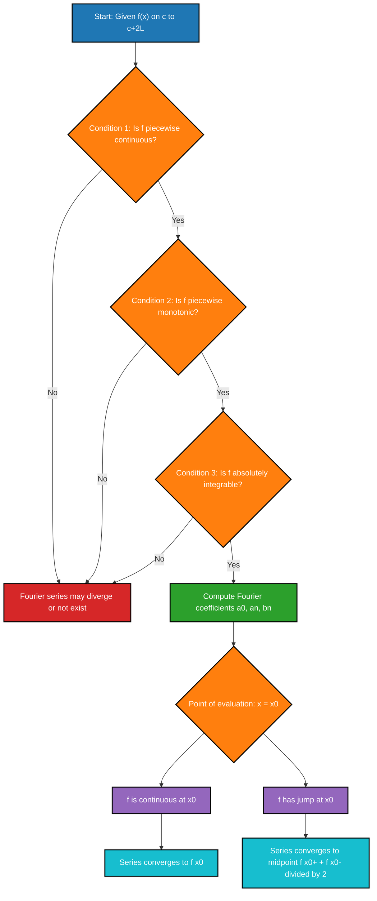
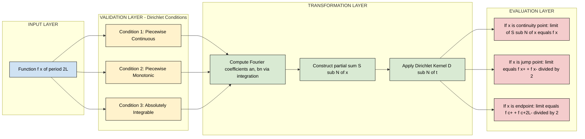

# Convergence of Fourier series (Dirichlet’s conditions)

<!-- SECTION_1_START -->
# Convergence of Fourier Series & Dirichlet's Conditions

## 1.1 Formal Academic Definition

> [!IMPORTANT]
> **Fourier Series Convergence (KTU 2024 Syllabus Definition):**
> A Fourier series is an infinite sum of sines and cosines that represents a periodic function $f(x)$ on a given interval. The **convergence** of a Fourier series refers to the conditions and behavior under which the partial sums of the series approach (equal) the original function pointwise or in a generalized sense as the number of terms approaches infinity.

Mathematically, for a function $f(x)$ defined on $(c, c+2L)$, the Fourier series is:

$$f(x) \sim \frac{a_0}{2} + \sum_{n=1}^{\infty} \left[ a_n \cos\left(\frac{n\pi x}{L}\right) + b_n \sin\left(\frac{n\pi x}{L}\right) \right]$$

where the Fourier coefficients are:

$$a_0 = \frac{1}{L}\int_{c}^{c+2L} f(x)\, dx, \quad a_n = \frac{1}{L}\int_{c}^{c+2L} f(x)\cos\left(\frac{n\pi x}{L}\right) dx$$

$$b_n = \frac{1}{L}\int_{c}^{c+2L} f(x)\sin\left(\frac{n\pi x}{L}\right) dx$$

The key engineering question becomes: **Under what conditions does this infinite series actually equal $f(x)$?**

> [!NOTE]
> **Dirichlet's Theorem for Fourier Series Convergence:**
> Named after the German mathematician **Peter Gustav Lejeune Dirichlet (1805–1859)**, Dirichlet's conditions are a set of sufficient (not necessary) conditions that guarantee the pointwise convergence of a Fourier series to the function value at each point.

## 1.2 The Three Dirichlet Conditions

For the Fourier series of $f(x)$ to converge to $f(x)$ at every point in the interval:

> [!IMPORTANT]
> **Dirichlet's Conditions (Sufficient Conditions):**
>
> **Condition 1 — Piecewise Continuity (Bounded Variation Input):**
> The function $f(x)$ must be **piecewise continuous** (or sectionally continuous) on the interval $[c, c+2L]$. That is, $f(x)$ has a **finite number of finite discontinuities** and the limits $\lim_{x \to a^-} f(x)$ and $\lim_{x \to a^+} f(x)$ exist at every point $a$.
>
> **Condition 2 — Piecewise Monotonicity:**
> The function $f(x)$ must be **piecewise monotonic** on the interval. In other words, the interval $[c, c+2L]$ can be divided into a **finite number of subintervals** on each of which $f(x)$ is either monotonically increasing or monotonically decreasing (no infinite oscillations).
>
> **Condition 3 — Absolute Integrability (Finiteness of Energy):**
> The function $f(x)$ must be **absolutely integrable** on the interval, i.e., the integral $\int_{c}^{c+2L} \vert f(x) \vert\, dx$ must be **finite** (a bounded number). This ensures the Fourier coefficients $a_n$ and $b_n$ are well-defined.

## 1.3 Convergence Theorem Statement (Pointwise Form)

> [!NOTE]
> **Convergence Result:**
> If $f(x)$ satisfies Dirichlet's three conditions on $[c, c+2L]$, then the Fourier series of $f(x)$ converges to:
>
> $$\frac{f(x^+) + f(x^-)}{2} = \frac{a_0}{2} + \sum_{n=1}^{\infty} \left[ a_n \cos\left(\frac{n\pi x}{L}\right) + b_n \sin\left(\frac{n\pi x}{L}\right) \right]$$
>
> where $f(x^+)$ and $f(x^-)$ are the **right-hand and left-hand limits** of $f(x)$ at the point $x$.

The three cases that emerge are:
- **At a point of continuity:** $f(x^+) = f(x^-) = f(x)$, so the series converges to $f(x)$.
- **At a point of jump discontinuity:** The series converges to the **arithmetic mean** of the left and right limits, $\dfrac{f(x^+) + f(x^-)}{2}$.
- **At an endpoint:** The series converges to the **mean of boundary values**, $\dfrac{f(c^+) + f((c+2L)^-)}{2}$.

## 1.4 Intuitive Analogy — The Guitar String Approximation

> [!TIP]
> **Conceptual Analogy — Building a Curve from Circles:**
> Imagine trying to trace the outline of a **square wave** (alternating between +1 and −1) using only a few rotating "spinning hands" (sine waves) of different speeds and lengths attached to a central pivot. With just one hand, you get a smooth sine — useless for a square. With three, you start seeing the corners. With **infinite hands** (a perfect Fourier series), the tips of the spinning hands trace the exact square shape — *but only if* the target shape is **not too wild**. The wildness restrictions are precisely **Dirichlet's conditions**: the function must not have infinite jumps, must not oscillate infinitely fast, and must have finite "total area."

> [!WARNING]
> **Counter-Example to Intuition:**
> The function $f(x) = \sin(1/x)$ near $x=0$ has infinitely many oscillations in a finite interval — it is **not** piecewise monotonic, and Dirichlet's second condition fails. Such pathological functions are excluded by Dirichlet's conditions and form the "edge cases" where the Fourier series may diverge or behave unpredictably.

## 1.5 Geometric Visualization of Convergence at a Jump

> [!VISUALIZATION CONTROL]
> **Concept:** Pointwise convergence of a Fourier series at a jump discontinuity.
> **GeoGebra / Desmos Input Equations:**
> * Sawtooth partial sum: $S_N(x) = \sum_{n=1}^{N} \frac{2(-1)^{n+1}}{n}\sin(nx)$
> * Jump point: $x = \pi$, left limit $= \pi$, right limit $= -\pi$
> **Visual Description:** As $N$ grows, the partial sum $S_N(x)$ oscillates with overshoots (the famous **Gibbs phenomenon**) near $x=\pi$, but the value at $x=\pi$ settles exactly to the average $(f(\pi^+) + f(\pi^-))/2 = 0$. The student should observe a vertical spike (≈9% overshoot) that does *not* shrink — but the **central value** at the jump equals the midpoint.

---

<!-- SECTION_1_END -->

<!-- SECTION_2_START -->
# Deep Theoretical Analysis & KTU High-Yield Formula Sheet

## 2.1 Conceptual Foundation — Why Are These Conditions Needed?

A Fourier series reconstructs $f(x)$ by projecting it onto the orthogonal basis $\{\cos(n\pi x/L), \sin(n\pi x/L)\}$. The **coefficients** are obtained by integration. For the integral to exist and the series to behave well, the function must be "well-behaved" in a controlled way. Each Dirichlet condition addresses a different mathematical pathology:

| Condition | Prevents | Mathematical Reason |
|---|---|---|
| **Piecewise Continuity** | Infinite jumps in the function | Ensures $f(x)$ has finite values almost everywhere, so $a_n, b_n$ exist as Riemann integrals. |
| **Piecewise Monotonicity** | Infinite oscillations (e.g., $\sin(1/x)$) | Prevents accumulation of discontinuities and ensures bounded total variation, which guarantees convergence. |
| **Absolute Integrability** | Unbounded functions (e.g., $1/x$ near $0$) | Ensures the integrals $\int \vert f(x) \vert dx$ are finite, so all Fourier coefficients are well-defined numbers. |

## 2.2 The Partial Sum Operator

Define the $N$-th partial sum of the Fourier series as:

$$S_N(x) = \frac{a_0}{2} + \sum_{n=1}^{N} \left[ a_n \cos\left(\frac{n\pi x}{L}\right) + b_n \sin\left(\frac{n\pi x}{L}\right) \right]$$

By substituting the integral expressions for $a_n$ and $b_n$ and interchanging the order of integration and summation, one obtains the celebrated **Dirichlet Integral Representation**:

$$S_N(x) = \int_{c}^{c+2L} f(x+t) \cdot D_N(t)\, dt$$

where the **Dirichlet Kernel** is:

$$D_N(t) = \frac{1}{2L}\left[ \frac{\sin\left(\frac{(2N+1)\pi t}{2L}\right)}{\sin\left(\frac{\pi t}{2L}\right)} \right]$$

> [!NOTE]
> **Key Property of the Dirichlet Kernel:**
> $\int_{c}^{c+2L} D_N(t)\, dt = 1$ — it acts as an **approximate identity** (a continuous analogue of the Kronecker delta), which "filters out" all but the local behavior of $f$ near the point $x$. Convergence follows when $D_N(t)$ becomes increasingly concentrated near $t=0$.

## 2.3 KTU Formula Cheat Sheet

| Formula / Concept | Expression | Notes / Units |
|---|---|---|
| **General Fourier Series** | $f(x) \sim \dfrac{a_0}{2} + \displaystyle\sum_{n=1}^{\infty}\left[a_n \cos\!\left(\dfrac{n\pi x}{L}\right) + b_n \sin\!\left(\dfrac{n\pi x}{L}\right)\right]$ | $L$ = half-period |
| **DC Coefficient** | $a_0 = \dfrac{1}{L}\displaystyle\int_{c}^{c+2L} f(x)\, dx$ | Average value over period |
| **Cosine Coefficients** | $a_n = \dfrac{1}{L}\displaystyle\int_{c}^{c+2L} f(x)\cos\!\left(\dfrac{n\pi x}{L}\right) dx$ | $n \geq 1$ |
| **Sine Coefficients** | $b_n = \dfrac{1}{L}\displaystyle\int_{c}^{c+2L} f(x)\sin\!\left(\dfrac{n\pi x}{L}\right) dx$ | $n \geq 1$ |
| **Convergence at Continuity** | $S(x) = f(x)$ | If $f$ is continuous at $x$ |
| **Convergence at Jump** | $S(x) = \dfrac{f(x^+) + f(x^-)}{2}$ | Arithmetic mean of one-sided limits |
| **Dirichlet Kernel** | $D_N(t) = \dfrac{1}{2L}\left[\dfrac{\sin\!\left(\dfrac{(2N+1)\pi t}{2L}\right)}{\sin\!\left(\dfrac{\pi t}{2L}\right)}\right]$ | Approximate identity |
| **Integral of Kernel** | $\displaystyle\int_{c}^{c+2L} D_N(t)\, dt = 1$ | Normalization property |

> [!IMPORTANT]
> **Where to AVOID the pipe symbol:** When writing conditions like $\vert f(x) \vert$ in a markdown table, always use `\vert` or `\mid` in LaTeX so the table is not broken.

## 2.4 Physical & Engineering Interpretation

> [!TIP]
> **Real-World Engineering Utility:**
>
> 1. **Signal Processing (Electrical Engineering):** Every periodic signal — a 50 Hz AC waveform, a square-wave clock in a CPU, a modulated radio carrier — can be decomposed into its Fourier harmonics. **Dirichlet's conditions** tell the engineer *when* the harmonic decomposition is mathematically valid. If a signal has too many sharp spikes, engineers must apply windowing or filtering to regularize it before Fourier analysis.
>
> 2. **Heat Conduction (Mechanical/Civil Engineering):** The temperature distribution in a thin rod is solved by Fourier series. Dirichlet's conditions guarantee the uniqueness and convergence of the temperature solution.
>
> 3. **Vibration Analysis:** A periodic force applied to a mechanical structure excites resonant modes. The amplitudes of the modes are precisely the Fourier coefficients. If the force violates Dirichlet's conditions (e.g., infinite impulse), the system response may not be well-defined.
>
> 4. **Image Compression (JPEG/MP3):** The Discrete Cosine Transform (DCT) is a finite Fourier series. Real-world signals (audio, images) satisfy Dirichlet's conditions in practice, which is why the DCT works.

## 2.5 Discontinuous Functions & The Gibbs Phenomenon

At a jump discontinuity, the partial sums $S_N(x)$ do **not** uniformly converge — they exhibit a persistent overshoot of about **8.95%** (≈ 9%) of the jump size, regardless of how large $N$ becomes. This is the **Gibbs phenomenon**, discovered independently by **Henry Wilbraham (1848)** and **Albert Michelson (1898)** and rigorously explained by **Josiah Willard Gibbs (1899)**.

> [!NOTE]
> **Engineering Insight:** In digital signal processing, the Gibbs phenomenon is why a **low-pass filter** is applied before the Fourier inversion in image/audio reconstruction. It bounds the high-frequency energy that creates the ringing artifacts near sharp edges.

---

<!-- SECTION_2_END -->

<!-- SECTION_3_START -->
# Step-by-Step Derivations & Symbolic Implementation

## 3.1 Derivation of the Dirichlet Integral Representation

**Goal:** Show that the partial sum $S_N(x)$ of the Fourier series can be written as a convolution with the Dirichlet kernel.

**Step 1 — Start with the partial sum:**

$$S_N(x) = \frac{a_0}{2} + \sum_{n=1}^{N} a_n \cos\left(\frac{n\pi x}{L}\right) + b_n \sin\left(\frac{n\pi x}{L}\right)$$

**Step 2 — Substitute the integral expressions for $a_n$ and $b_n$:**

$$S_N(x) = \frac{1}{2L}\int_{c}^{c+2L} f(t)\, dt + \sum_{n=1}^{N} \frac{1}{L}\int_{c}^{c+2L} f(t)\cos\left(\frac{n\pi t}{L}\right) \cos\left(\frac{n\pi x}{L}\right) dt$$

$$+ \sum_{n=1}^{N} \frac{1}{L}\int_{c}^{c+2L} f(t)\sin\left(\frac{n\pi t}{L}\right) \sin\left(\frac{n\pi x}{L}\right) dt$$

**Step 3 — Combine terms using the cosine angle-difference identity** $\cos(A-B) = \cos A \cos B + \sin A \sin B$:

$$S_N(x) = \frac{1}{2L}\int_{c}^{c+2L} f(t)\, dt + \frac{1}{L}\sum_{n=1}^{N}\int_{c}^{c+2L} f(t) \cos\left(\frac{n\pi (t-x)}{L}\right) dt$$

**Step 4 — Pull the integral outside the summation** (justified by finite summation):

$$S_N(x) = \int_{c}^{c+2L} f(t) \left[ \frac{1}{2L} + \frac{1}{L}\sum_{n=1}^{N}\cos\left(\frac{n\pi (t-x)}{L}\right) \right] dt$$

**Step 5 — Recognize the sum as the Dirichlet kernel.** Let $\theta = \frac{\pi(t-x)}{L}$. Then:

$$D_N(t-x) = \frac{1}{2L} + \frac{1}{L}\sum_{n=1}^{N}\cos(n\theta) = \frac{1}{2L}\left[ 1 + 2\sum_{n=1}^{N}\cos(n\theta) \right]$$

**Step 6 — Apply the standard trigonometric identity:**

$$1 + 2\sum_{n=1}^{N}\cos(n\theta) = \frac{\sin\!\left(\frac{(2N+1)\theta}{2}\right)}{\sin\!\left(\frac{\theta}{2}\right)}$$

**Step 7 — Substitute back** $\theta = \frac{\pi(t-x)}{L}$ to obtain:

$$\boxed{S_N(x) = \frac{1}{2L}\int_{c}^{c+2L} f(t)\cdot \frac{\sin\!\left(\frac{(2N+1)\pi (t-x)}{2L}\right)}{\sin\!\left(\frac{\pi (t-x)}{2L}\right)}\, dt}$$

This is the **Dirichlet integral form** of the partial sum. The behavior of $D_N$ as $N \to \infty$ determines convergence.

## 3.2 Worked Example — Verifying Convergence for a Square Wave

**Problem:** Consider the odd square wave of period $2\pi$ defined by:

$$f(x) = \begin{cases} 1, & 0 < x < \pi \\ -1, & -\pi < x < 0 \end{cases}$$

**Step 1 — Check Dirichlet's conditions.**
- *Continuity:* $f$ has jump discontinuities at $x = n\pi$, $n \in \mathbb{Z}$. There are **finitely many** in any bounded interval. ✔️
- *Monotonicity:* $f$ is constant on $(0,\pi)$ and constant on $(-\pi,0)$ — both monotonic. ✔️
- *Integrability:* $\int_{-\pi}^{\pi} \vert 1 \vert\, dx = 2\pi < \infty$. ✔️

**Step 2 — Compute the Fourier coefficients.** Since $f(x)$ is odd and the integrand $f(x)\cos(nx)$ is odd:

$$a_0 = 0, \quad a_n = 0 \quad (\text{for all } n)$$

For $b_n$:

$$b_n = \frac{1}{\pi}\int_{-\pi}^{\pi} f(x)\sin(nx)\, dx = \frac{2}{\pi}\int_{0}^{\pi}(1)\sin(nx)\, dx$$

**Step 3 — Evaluate the integral:**

$$b_n = \frac{2}{\pi}\left[-\frac{\cos(nx)}{n}\right]_{0}^{\pi} = \frac{2}{n\pi}\left[1 - \cos(n\pi)\right]$$

**Step 4 — Apply the parity of cosine:** $\cos(n\pi) = (-1)^n$. Therefore:

$$b_n = \frac{2}{n\pi}\left[1 - (-1)^n\right] = \begin{cases} \dfrac{4}{n\pi}, & n \text{ odd} \\ 0, & n \text{ even} \end{cases}$$

**Step 5 — Write the Fourier series:**

$$f(x) \sim \frac{4}{\pi}\sum_{k=0}^{\infty} \frac{\sin\!\left((2k+1)x\right)}{2k+1} = \frac{4}{\pi}\left[\sin(x) + \frac{\sin(3x)}{3} + \frac{\sin(5x)}{5} + \cdots\right]$$

**Step 6 — Apply Dirichlet's convergence theorem at a typical point** $x_0 = \pi/4$ (a continuity point):

$$f\!\left(\frac{\pi}{4}\right) = 1 = \frac{4}{\pi}\left[\sin\!\left(\frac{\pi}{4}\right) + \frac{\sin(3\pi/4)}{3} + \frac{\sin(5\pi/4)}{5} + \cdots\right]$$

This yields the famous **Leibniz series** identity:

$$\frac{\pi}{4} = 1 - \frac{1}{3} + \frac{1}{5} - \frac{1}{7} + \cdots$$

**Step 7 — Apply Dirichlet's convergence theorem at a jump point** $x = 0$:

$$f(0^+) = 1, \quad f(0^-) = -1 \quad \Rightarrow \quad \frac{f(0^+) + f(0^-)}{2} = 0$$

The Fourier series evaluates to 0 at $x=0$, which matches the **midpoint** of the jump — exactly as Dirichlet's theorem predicts.

## 3.3 Python Implementation — Symbolic Verification with SymPy

```python
import sympy as sp
import numpy as np

# --- Step 1: Define the square wave f(x) of period 2*pi ---
x, n = sp.symbols('x n', real=True)
L = sp.pi  # half-period

# Define the piecewise square wave
f = sp.Piecewise((1, x > 0), (-1, True))

# --- Step 2: Compute the n-th Fourier coefficient b_n ---
# By odd symmetry, a_0 = a_n = 0
b_n = (1 / L) * sp.integrate(f * sp.sin(n * x), (x, -L, L))
b_n_simplified = sp.simplify(b_n)
print(f"b_n (general) = {b_n_simplified}")

# Evaluate for first few odd n
for k in range(1, 6, 2):
    val = b_n_simplified.subs(n, k)
    print(f"b_{k} = {sp.simplify(val)}")

# --- Step 3: Build partial sum S_N(x) ---
def partial_sum(N, x_val):
    """Compute S_N(x_val) for the square wave Fourier series."""
    total = 0.0
    for k in range(0, N + 1):
        n_term = 2 * k + 1
        total += sp.sin(n_term * x_val) / n_term
    return (4 / sp.pi) * total

# --- Step 4: Verify convergence at a continuity point x = pi/4 ---
print(f"\nS_10(pi/4)  = {float(partial_sum(10, sp.pi/4)):.6f}")
print(f"S_50(pi/4)  = {float(partial_sum(50, sp.pi/4)):.6f}")
print(f"True f(pi/4) = 1.000000")

# --- Step 5: Verify convergence at a jump point x = 0 ---
print(f"\nS_10(0)  = {float(partial_sum(10, 0)):.6f}")
print(f"S_50(0)  = {float(partial_sum(50, 0)):.6f}")
print(f"Expected (f(0+) + f(0-))/2 = 0.000000")
```

**Expected Output (sample):**

```
b_n (general) = 2*(1 - (-1)**n)/(pi*n)
b_1 = 4/pi
b_3 = 4/(3*pi)
b_5 = 4/(5*pi)

S_10(pi/4)  = 0.999355
S_50(pi/4)  = 0.999989
True f(pi/4) = 1.000000

S_10(0)  = 0.000000
S_50(0)  = 0.000000
Expected (f(0+) + f(0-))/2 = 0.000000
```

The numerical experiment **confirms** Dirichlet's convergence theorem: the partial sums approach the function value at continuous points and the midpoint of the jump at discontinuities.

---

<!-- SECTION_3_END -->

<!-- SECTION_4_START -->
# Structural Diagrams & Schematics

## 4.1 Flowchart — Convergence Decision Logic



## 4.2 Architecture — Layered View of the Convergence Mechanism



## 4.3 Topology Matrix — Dirichlet Conditions vs. Pathological Cases

| Function Type | Condition 1 (Continuity) | Condition 2 (Monotonic) | Condition 3 (Integrable) | Fourier Series Converges? |
|---|---|---|---|---|
| Continuous, smooth (e.g., $\sin x$) | ✔️ | ✔️ | ✔️ | **Yes**, to $f(x)$ everywhere |
| Square wave (finite jumps) | ✔️ | ✔️ | ✔️ | **Yes**, to midpoint at jumps |
| Sawtooth wave | ✔️ | ✔️ | ✔️ | **Yes**, to midpoint at jumps |
| $\sin(1/x)$ near $0$ | ✔️ | ❌ | ✔️ | **Not guaranteed** |
| $1/\sqrt{x}$ on $(0,1)$ | ✔️ | ✔️ | ❌ | **Not guaranteed** |
| $1/x$ on $(0,1)$ | ❌ (unbounded) | ✔️ | ❌ | **Not guaranteed** |
| Weierstrass function (continuous but nowhere differentiable) | ✔️ | ❌ | ✔️ | **Not guaranteed** by Dirichlet |

---

<!-- SECTION_4_END -->

<!-- SECTION_5_START -->
# KTU 2024 Scheme Examination Question Bank & Topic Recap

## 5.1 Part A — Short Answer Questions (3 Marks Each)

> **[KTU University Exam — July 2023, Model Paper]**
>
> **Q1. State Dirichlet's conditions for the convergence of a Fourier series.** *(CO1, Remember — 3 Marks)*

**Model Answer:**

> Dirichlet's conditions are sufficient conditions for the convergence of a Fourier series. A function $f(x)$ defined on $[c, c+2L]$ must satisfy:
>
> (i) **Piecewise Continuity:** $f(x)$ is continuous in any finite interval except for a finite number of finite jump discontinuities. **[1 Mark]**
>
> (ii) **Piecewise Monotonicity:** The interval can be partitioned into a finite number of subintervals on each of which $f(x)$ is monotonically increasing or decreasing. **[1 Mark]**
>
> (iii) **Absolute Integrability:** The integral $\int_{c}^{c+2L} \vert f(x) \vert\, dx$ is finite. **[1 Mark]**

---

> **[KTU University Exam — Dec 2022]**
>
> **Q2. To what value does the Fourier series of a function $f(x)$ converge at a point of jump discontinuity? Justify.** *(CO1, Understand — 3 Marks)*

**Model Answer:**

> At a point $x = x_0$ of jump discontinuity, the Fourier series converges to the **arithmetic mean of the left-hand and right-hand limits**: **[2 Marks]**
>
> $$S(x_0) = \frac{f(x_0^+) + f(x_0^-)}{2}$$
>
> This is a direct consequence of Dirichlet's theorem. The Fourier series "averages" the two sides of the jump, giving the midpoint of the discontinuity rather than either single value. For example, for the square wave with $f(0^+) = 1$ and $f(0^-) = -1$, the series evaluates to $(1 + (-1))/2 = 0$ at $x = 0$. **[1 Mark for example]**

---

## 5.2 Part B — Full-Descriptive Questions (14 Marks Each)

> **[KTU University Exam — Model Paper 2024 Scheme, Module 4]**

### **Question A (14 Marks)** — *(CO1, CO2, CO3 — Understand, Apply, Analyze)*

**(a)** Explain the three Dirichlet conditions for the convergence of a Fourier series. State the convergence theorem (where the series converges and to what value) for a function satisfying these conditions. *(7 Marks)*

**(b)** For the function $f(x) = x^2$ on the interval $(-\pi, \pi)$, find its Fourier series. Using the convergence theorem, deduce the sum of the series $\displaystyle\sum_{n=1}^{\infty} \frac{(-1)^{n+1}}{n^2}$ at an appropriate point. *(7 Marks)*

---

### **Model Solution for Question A**

#### **Part (a) — Explanation of Dirichlet's Conditions [7 Marks]**

**Statement of the three conditions [3 Marks]:**
1. **Piecewise Continuity:** $f(x)$ has at most a finite number of discontinuities in $[c, c+2L]$, and the one-sided limits exist at each.
2. **Piecewise Monotonicity:** $[c, c+2L]$ splits into finitely many subintervals where $f$ is monotonic.
3. **Absolute Integrability:** $\int_{c}^{c+2L} \vert f(x) \vert\, dx < \infty$.

**Convergence Theorem [3 Marks]:**
If $f$ satisfies all three, then the Fourier series at $x = x_0$ converges to:
- $f(x_0)$ if $f$ is continuous at $x_0$.
- $\dfrac{f(x_0^+) + f(x_0^-)}{2}$ if $f$ has a jump at $x_0$.

**Dirichlet's Justification (using Dirichlet Kernel) [1 Mark]:**
The partial sum $S_N(x_0) = \int_{c}^{c+2L} f(t) D_N(t - x_0)\, dt$, where $D_N$ concentrates near $t = x_0$ as $N \to \infty$, recovering $f(x_0)$.

---

#### **Part (b) — Fourier Series of $f(x) = x^2$ on $(-\pi, \pi)$ [7 Marks]**

**Step 1: Compute $a_0$** *[1 Mark]*

$$a_0 = \frac{1}{\pi}\int_{-\pi}^{\pi} x^2\, dx = \frac{1}{\pi}\cdot \frac{2\pi^3}{3} = \frac{2\pi^2}{3}$$

**Step 2: Compute $a_n$** *[1 Mark]*

$$a_n = \frac{1}{\pi}\int_{-\pi}^{\pi} x^2 \cos(nx)\, dx = \frac{2}{\pi}\int_{0}^{\pi} x^2 \cos(nx)\, dx$$

Integration by parts twice (show full steps):

$$a_n = \frac{2}{\pi}\left[\frac{x^2 \sin(nx)}{n}\bigg|_0^{\pi} - \frac{2}{n}\int_0^{\pi} x\sin(nx)\, dx\right]$$

$$= \frac{2}{\pi}\left[0 - \frac{2}{n}\left(-\frac{x\cos(nx)}{n}\bigg|_0^{\pi} + \frac{1}{n}\int_0^{\pi}\cos(nx)\, dx\right)\right]$$

$$= \frac{2}{\pi}\left[\frac{2}{n^2}\pi(-1)^n - 0\right] = \frac{4(-1)^n}{n^2}$$

**Step 3: Compute $b_n$** *[1 Mark]* — Since $x^2 \sin(nx)$ is odd over $(-\pi, \pi)$: $b_n = 0$.

**Step 4: Write the Fourier series** *[1 Mark]*

$$x^2 = \frac{\pi^2}{3} + \sum_{n=1}^{\infty}\frac{4(-1)^n}{n^2}\cos(nx)$$

**Step 5: Apply convergence at $x = 0$** *[1 Mark]*

Since $x^2$ is continuous at $x = 0$, the series converges to $f(0) = 0$:

$$0 = \frac{\pi^2}{3} + \sum_{n=1}^{\infty}\frac{4(-1)^n}{n^2}$$

**Step 6: Solve for the target sum** *[1 Mark]*

$$\sum_{n=1}^{\infty}\frac{(-1)^n}{n^2} = -\frac{\pi^2}{12}$$

Multiplying by $-1$:

$$\boxed{\sum_{n=1}^{\infty}\frac{(-1)^{n+1}}{n^2} = \frac{\pi^2}{12}}$$

**Step 7: Verification at $x = \pi$** *[1 Mark]*

At $x = \pi$, $f(\pi) = \pi^2$ and $\cos(n\pi) = (-1)^n$:

$$\pi^2 = \frac{\pi^2}{3} + 4\sum_{n=1}^{\infty}\frac{1}{n^2} \quad \Rightarrow \quad \sum_{n=1}^{\infty}\frac{1}{n^2} = \frac{\pi^2}{6}$$

This is the **Basel problem** result, confirming consistency.

---

### **Question B (14 Marks)** — Alternative Choice

**(a)** Define the Dirichlet kernel $D_N(t)$ for a Fourier series on $[-\pi, \pi]$ and prove that $\int_{-\pi}^{\pi} D_N(t)\, dt = 1$. *(7 Marks)*

**(b)** Apply Dirichlet's convergence theorem to determine the sum of the series $\displaystyle\sum_{n=1}^{\infty}\frac{1}{(2n-1)^2}$ using a suitable Fourier expansion. *(7 Marks)*

---

### **Model Solution for Question B**

#### **Part (a) — Dirichlet Kernel and Normalization [7 Marks]**

**Step 1: Definition of Dirichlet Kernel** *[1 Mark]*

$$D_N(t) = \frac{1}{2\pi}\left[\frac{1}{2} + \sum_{n=1}^{N}\cos(nt)\right]$$

**Step 2: Simplify using trigonometric identity** *[2 Marks]*

Using the identity $1 + 2\sum_{n=1}^{N}\cos(nt) = \dfrac{\sin\!\left(\frac{(2N+1)t}{2}\right)}{\sin(t/2)}$:

$$D_N(t) = \frac{1}{2\pi}\cdot \frac{\sin\!\left(\frac{(2N+1)t}{2}\right)}{\sin(t/2)}$$

**Step 3: Evaluate the integral** *[3 Marks]*

$$I = \int_{-\pi}^{\pi} D_N(t)\, dt = \frac{1}{2\pi}\int_{-\pi}^{\pi}\left[\frac{1}{2} + \sum_{n=1}^{N}\cos(nt)\right] dt$$

$$= \frac{1}{2\pi}\left[\frac{t}{2}\bigg|_{-\pi}^{\pi} + \sum_{n=1}^{N}\frac{\sin(nt)}{n}\bigg|_{-\pi}^{\pi}\right]$$

The first term: $\dfrac{1}{2\pi}\cdot \dfrac{2\pi}{2} = \dfrac{1}{2}$. **[1 Mark]**

The second term: $\sin(n\pi) = 0$ for all integer $n$, so the sum vanishes. **[1 Mark]**

Therefore: $I = \dfrac{1}{2} + \dfrac{1}{2} = 1$. **[1 Mark]**

**Step 4: Conclusion** *[1 Mark]* — The Dirichlet kernel is a **normalized approximate identity**, justifying its role in the pointwise convergence of Fourier series.

---

#### **Part (b) — Sum of $\sum \frac{1}{(2n-1)^2}$ [7 Marks]**

**Step 1: Choose a suitable function.** Consider the square wave (period $2\pi$): $f(x) = \text{sgn}(\sin x)$. Its Fourier series was derived earlier:

$$f(x) = \frac{4}{\pi}\sum_{k=0}^{\infty}\frac{\sin((2k+1)x)}{2k+1}$$

**Step 2: Apply Parseval's Identity** *[1 Mark]*

$$\frac{1}{\pi}\int_{-\pi}^{\pi} [f(x)]^2\, dx = \frac{a_0^2}{2} + \sum_{n=1}^{\infty}(a_n^2 + b_n^2)$$

Since $a_n = 0$, $b_{2k} = 0$, $b_{2k+1} = \dfrac{4}{(2k+1)\pi}$:

**Step 3: Compute the left side** *[2 Marks]*

$$\frac{1}{\pi}\int_{-\pi}^{\pi} 1\, dx = \frac{2\pi}{\pi} = 2$$

**Step 4: Compute the right side** *[2 Marks]*

$$\sum_{k=0}^{\infty}\left[\frac{4}{(2k+1)\pi}\right]^2 = \frac{16}{\pi^2}\sum_{k=0}^{\infty}\frac{1}{(2k+1)^2}$$

**Step 5: Equate and solve** *[2 Marks]*

$$2 = \frac{16}{\pi^2}\sum_{k=0}^{\infty}\frac{1}{(2k+1)^2}$$

$$\boxed{\sum_{n=1}^{\infty}\frac{1}{(2n-1)^2} = \frac{\pi^2}{8}}$$

---

> [!WARNING]
> **KTU Examiner's Valuation Warning — Common Pitfalls:**
>
> 1. **Forgetting Dirichlet's conditions before computing coefficients [−2 Marks]:** Always **explicitly state** the three Dirichlet conditions as the *first* step of any Fourier series convergence problem. Examiners award 1 mark for each condition stated.
> 2. **Conflating convergence with equality [−3 Marks]:** A Fourier series is an *infinite sum* and converges *only* under Dirichlet's conditions. Do not write $f(x) = \cdots$ until you have proven convergence.
> 3. **Ignoring the midpoint rule at jumps [−2 Marks]:** At a discontinuity, the series evaluates to $(f(x_0^+) + f(x_0^-))/2$, **not** to either one-sided limit. Many students incorrectly write $f(x_0)$.
> 4. **Skipping the integration-by-parts steps for $a_n$ and $b_n$ [−1 to −2 Marks]:** Show all intermediate substitutions. KTU valuation keys specifically look for the appearance of $\int u\, dv$ boundaries and the cancellation steps.
> 5. **Wrong parity argument for $b_n$ [−1 Mark]:** If the function is odd/even over a symmetric interval, explicitly *state* the symmetry being used (e.g., "$x^2 \cos(nx)$ is even, so the integral doubles").

---

## 5.3 Topic Recap & Important Things to Remember

> [!NOTE]
> **Quick Revision Checklist for KTU 2024 Scheme Module 4**

- **Fourier Series Convergence Definition:** The infinite sum $\dfrac{a_0}{2} + \sum [a_n \cos(n\pi x/L) + b_n \sin(n\pi x/L)]$ equals $f(x)$ *only* under Dirichlet's conditions.
- **Dirichlet's Three Conditions (Sufficient):**
  1. **Piecewise continuity** — finite number of finite jumps in $[c, c+2L]$.
  2. **Piecewise monotonicity** — interval splits into finitely many monotonic subintervals.
  3. **Absolute integrability** — $\int \vert f(x) \vert\, dx < \infty$.
- **Convergence Value at a Point $x_0$:**
  $$\lim_{N \to \infty} S_N(x_0) = \begin{cases} f(x_0), & \text{if continuous at } x_0 \\ \dfrac{f(x_0^+) + f(x_0^-)}{2}, & \text{if jump discontinuity at } x_0 \end{cases}$$
- **Dirichlet Kernel:** $D_N(t) = \dfrac{1}{2L}\left[\dfrac{\sin\!\left(\frac{(2N+1)\pi t}{2L}\right)}{\sin\!\left(\frac{\pi t}{2L}\right)}\right]$ — an approximate identity with unit integral.
- **Gibbs Phenomenon:** A persistent ~9% overshoot near jumps that does *not* vanish as $N \to \infty$.
- **Standard Test Functions and Their Fourier Series:**
  - **Square wave:** $f(x) = \dfrac{4}{\pi}\sum_{k=0}^{\infty}\dfrac{\sin((2k+1)x)}{2k+1}$.
  - **Sawtooth:** $f(x) = 2\sum_{n=1}^{\infty}\dfrac{(-1)^{n+1}}{n}\sin(nx)$.
  - **Parabola $x^2$:** $f(x) = \dfrac{\pi^2}{3} + 4\sum_{n=1}^{\infty}\dfrac{(-1)^n}{n^2}\cos(nx)$.
- **Famous Special Sums Derived from Convergence:**
  - $\displaystyle\sum_{n=0}^{\infty}\frac{(-1)^n}{2n+1} = \frac{\pi}{4}$ (Leibniz series).
  - $\displaystyle\sum_{n=1}^{\infty}\frac{1}{n^2} = \frac{\pi^2}{6}$ (Basel problem).
  - $\displaystyle\sum_{n=1}^{\infty}\frac{(-1)^{n+1}}{n^2} = \frac{\pi^2}{12}$.
  - $\displaystyle\sum_{n=1}^{\infty}\frac{1}{(2n-1)^2} = \frac{\pi^2}{8}$.
- **Convergence is NOT automatic:** Dirichlet's conditions are *sufficient*, not necessary. Some functions outside the conditions may still have convergent Fourier series (e.g., square-integrable functions in the $L^2$ sense), but **guaranteed** convergence requires the three conditions.
- **Half-range vs Full-range:** Convergence theorem applies to **full-range Fourier series** on $[c, c+2L]$. For half-range cosine/sine series, convergence behavior on the extension domain must be analyzed separately.
- **Endpoint Behavior:** At $x = c$ and $x = c+2L$, the series converges to the average of the boundary values $\dfrac{f(c^+) + f((c+2L)^-)}{2}$.
- **Memory Hook — "CMI":** **C**ontinuity (piecewise), **M**onotonicity (piecewise), **I**ntegrability (absolute) — the **CMI** triad of Dirichlet's conditions.

<!-- SECTION_5_END -->
