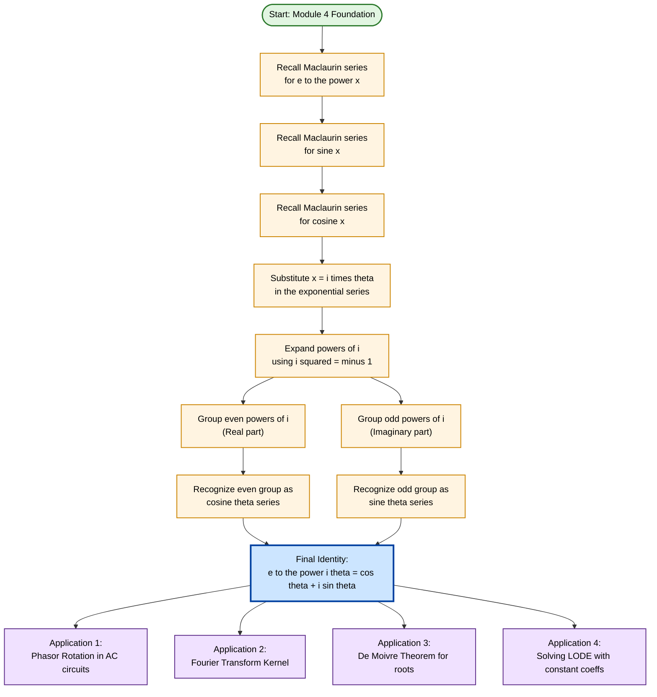
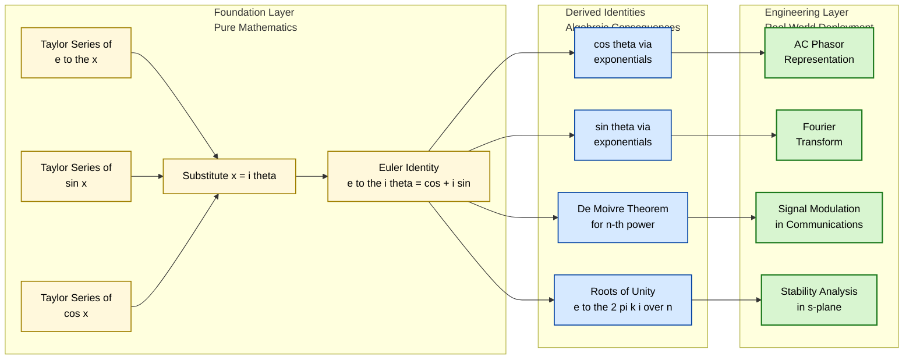
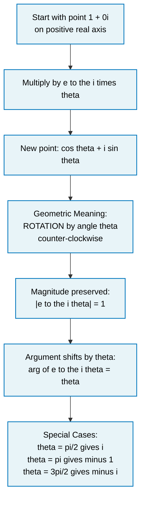

# Euler formulas

<!-- SECTION_1_START -->
# 1. Core Technical Definition & Intuitive Overview

## Formal Definition

> [!IMPORTANT]
> **Euler's Formula (KTU 2024 Syllabus — Module 4)**
>
> For any real variable $\theta$, Euler's formula establishes the fundamental identity linking the exponential function, the trigonometric functions, and the imaginary unit $i = \sqrt{-1}$:
> $$\large e^{i\theta} = \cos\theta + i\sin\theta$$

This is a single equation containing **five fundamental constants**: $0$, $1$, $e$, $i$, and $\pi$. When $\theta = \pi$, the celebrated **Euler Identity** follows immediately:

$$\large e^{i\pi} + 1 = 0$$

The discovery is attributed to the Swiss mathematician **Leonhard Euler** in the year **1740**, and it is widely regarded as the most beautiful identity in all of mathematics.

## Conceptual Analogy / Intuition

Imagine you are standing on a giant clock face of radius **1** (the unit circle in the complex plane). Your position on the circle can be described in two equivalent ways:

- **Cartesian way** (rectangular coordinates): "I am at horizontal distance $\cos\theta$ and vertical distance $\sin\theta$."
- **Polar way** (single complex number): "I am at angle $\theta$ from the positive real axis, on a circle of radius $1$."

Euler's formula simply says these two descriptions are the **same point** written in two different languages. The left side $e^{i\theta}$ is the **compact polar language**, while $\cos\theta + i\sin\theta$ is the **expanded Cartesian language**.

> [!NOTE]
> **Geometric Picture**: Multiplication by $e^{i\theta}$ corresponds to **rotating a complex number by an angle $\theta$ counter-clockwise** about the origin, while preserving its magnitude. Hence $e^{i\theta}$ acts as the "rotation operator" of the complex plane.

## Physical Constants and Standard Metrics

- The base of the natural logarithm: $e \approx 2.71828$
- The imaginary unit: $i^2 = -1$
- The angular variable: $\theta$ measured in **radians** (Euler's formula is fundamentally tied to radian measure; in degrees, the formula would require a scaling factor)
- The magnitude of $e^{i\theta}$ is always **1**, since $\vert e^{i\theta}\vert = \sqrt{\cos^2\theta + \sin^2\theta} = 1$

> [!VISUALIZATION CONTROL]
> **Concept:** Unit circle parametrized by $z = e^{i\theta} = \cos\theta + i\sin\theta$
> **GeoGebra / Desmos Input Equations:**
> * `x(t) = cos(t)`
> * `y(t) = sin(t)`
> * `t` ranging from $0$ to $2\pi$
> * Parametric point $(x(t), y(t))$
> **Visual Description:** The student should observe a perfect unit circle traced counter-clockwise as $t$ increases from $0$ to $2\pi$. At $t = \pi/2$, the point is at $(0, 1)$ corresponding to $e^{i\pi/2} = i$. At $t = \pi$, the point is at $(-1, 0)$ corresponding to $e^{i\pi} = -1$.

<!-- SECTION_1_END -->

<!-- SECTION_2_START -->
# 2. Deep Theoretical Analysis & KTU High-Yield Formula Sheet

## Building Euler's Formula from Taylor Series

The module instruction explicitly states: **"Taylor series representation without proof assuming the possibility of"**. This means we assume the validity of the Taylor series for the elementary functions and use them to *derive* Euler's formula.

### Step-by-Step Logical Construction

1. **Recall the Taylor series for $e^x$ about $x = 0$** (the Maclaurin series):
   $$e^x = 1 + x + \frac{x^2}{2!} + \frac{x^3}{3!} + \frac{x^4}{4!} + \frac{x^5}{5!} + \cdots$$

2. **Recall the Taylor series for $\sin x$ about $x = 0$**:
   $$\sin x = x - \frac{x^3}{3!} + \frac{x^5}{5!} - \frac{x^7}{7!} + \cdots$$

3. **Recall the Taylor series for $\cos x$ about $x = 0$**:
   $$\cos x = 1 - \frac{x^2}{2!} + \frac{x^4}{4!} - \frac{x^6}{6!} + \cdots$$

4. **The clever substitution $x \mapsto i\theta$** in the exponential series: Since Taylor series are valid for all real $x$, and the function $e^x$ can be analytically continued to complex arguments, we may substitute $x = i\theta$.

5. **Separate real and imaginary parts** by collecting even and odd powers of $i$, using the fact that $i^2 = -1$, $i^3 = -i$, $i^4 = 1$, $i^5 = i$, and so on. Even powers of $i$ are real, odd powers are imaginary.

6. **Reassemble** the even-power part as $\cos\theta$ and the odd-power part as $\sin\theta$, which yields Euler's formula.

> [!NOTE]
> **Why the substitution is "legal"**: Although the problem statement says "without proof", the underlying justification is that the Taylor series for $e^x$ converges for all real $x$, and the resulting power series in $i\theta$ converges absolutely. By the theorem on reordering of absolutely convergent series, we may freely regroup terms by real and imaginary parts.

## KTU Formula Sheet / Cheat Sheet

| # | Formula | Name | Purpose / Engineering Utility |
|---|---|---|---|
| 1 | $e^{i\theta} = \cos\theta + i\sin\theta$ | Euler's Formula | Foundation of AC circuit analysis (phasors) |
| 2 | $e^{i\pi} + 1 = 0$ | Euler's Identity | Special case at $\theta = \pi$ |
| 3 | $\cos\theta = \dfrac{e^{i\theta} + e^{-i\theta}}{2}$ | Cosine via Exponentials | Spectral analysis, Fourier transform |
| 4 | $\sin\theta = \dfrac{e^{i\theta} - e^{-i\theta}}{2i}$ | Sine via Exponentials | Signal processing, filter design |
| 5 | $e^{i\theta} + e^{-i\theta} = 2\cos\theta$ | Identity Pair | Engineering vibration analysis |
| 6 | $e^{i\theta} - e^{-i\theta} = 2i\sin\theta$ | Identity Pair | Solving differential equations |
| 7 | $(\cos\theta + i\sin\theta)^n = e^{in\theta} = \cos(n\theta) + i\sin(n\theta)$ | De Moivre's Theorem | Finding $n$-th roots of complex numbers |
| 8 | $\vert e^{i\theta}\vert = 1$ | Magnitude Invariance | Phase-only signal representation |
| 9 | $\arg(e^{i\theta}) = \theta$ | Argument / Phase | Phasor rotation in AC analysis |
| 10 | $e^{i(\alpha + \beta)} = e^{i\alpha}\cdot e^{i\beta}$ | Exponential Law | Combining rotations |

> [!IMPORTANT]
> **Critical Examination Point**: The variable $\theta$ **must be in radians**. If a problem gives $\theta$ in degrees, convert using $\theta_{rad} = \theta_{deg} \cdot \pi/180$ before applying Euler's formula.

## Real-World Engineering Utility

Euler's formula is the **backbone of modern electrical engineering and signal processing**:

- **AC Circuit Analysis (Phasors)**: An alternating voltage $V(t) = V_0\cos(\omega t + \phi)$ is represented compactly as the phasor $\tilde{V} = V_0 e^{i\phi}$, and the impedance $Z$ acts as a complex multiplier $V_0 e^{i\phi} \cdot Z$.
- **Fourier Transform**: Every signal is decomposed into $F(\omega) = \int f(t)\, e^{-i\omega t}\, dt$, which directly invokes the complex exponential.
- **Control Systems**: Stability is determined by the poles of transfer functions in the complex $s$-plane, where $s = \sigma + i\omega$.
- **Antenna Theory and Wave Propagation**: Electromagnetic waves are written as $\vec{E} = \vec{E}_0\, e^{i(\vec{k}\cdot \vec{r} - \omega t)}$.
- **Quantum Mechanics**: The state of a free particle uses the plane wave $\psi(x,t) = A e^{i(kx - \omega t)}$.

<!-- SECTION_2_END -->

<!-- SECTION_3_START -->
# 3. Step-by-Step Derivations & Code/Symbolic Implementation

## Derivation 1: Euler's Formula from Taylor Series

We begin with the Maclaurin series for $e^x$ and substitute $x = i\theta$.

$$
\begin{aligned}
e^{i\theta} &= 1 + (i\theta) + \frac{(i\theta)^2}{2!} + \frac{(i\theta)^3}{3!} + \frac{(i\theta)^4}{4!} + \frac{(i\theta)^5}{5!} + \frac{(i\theta)^6}{6!} + \frac{(i\theta)^7}{7!} + \cdots
\end{aligned}
$$

Now we expand each power of $i\theta$ using the cyclic behavior of $i$:

$$
\begin{aligned}
(i\theta)^1 &= i\theta \\
(i\theta)^2 &= i^2 \cdot \theta^2 = -\theta^2 \\
(i\theta)^3 &= i^3 \cdot \theta^3 = -i\theta^3 \\
(i\theta)^4 &= i^4 \cdot \theta^4 = +\theta^4 \\
(i\theta)^5 &= i^5 \cdot \theta^5 = +i\theta^5 \\
(i\theta)^6 &= i^6 \cdot \theta^6 = -\theta^6 \\
(i\theta)^7 &= i^7 \cdot \theta^7 = -i\theta^7
\end{aligned}
$$

Substituting these back into the series:

$$
\begin{aligned}
e^{i\theta} &= 1 + i\theta - \frac{\theta^2}{2!} - i\frac{\theta^3}{3!} + \frac{\theta^4}{4!} + i\frac{\theta^5}{5!} - \frac{\theta^6}{6!} - i\frac{\theta^7}{7!} + \cdots
\end{aligned}
$$

Now we group all **real** terms (those without $i$) and all **imaginary** terms (those multiplied by $i$):

$$
\begin{aligned}
e^{i\theta} &= \underbrace{\left(1 - \frac{\theta^2}{2!} + \frac{\theta^4}{4!} - \frac{\theta^6}{6!} + \cdots\right)}_{\text{Real Part}} \; + \; i \cdot \underbrace{\left(\theta - \frac{\theta^3}{3!} + \frac{\theta^5}{5!} - \frac{\theta^7}{7!} + \cdots\right)}_{\text{Imaginary Part}}
\end{aligned}
$$

The **real part** is exactly the Maclaurin series of $\cos\theta$, and the **imaginary part** is exactly the Maclaurin series of $\sin\theta$. Therefore:

$$
\boxed{\;e^{i\theta} = \cos\theta + i\sin\theta\;}
$$

**Valuation Key**: [Correct identification of even/odd powers of $i$: 3 Marks], [Grouping real and imaginary parts: 2 Marks], [Recognition that the resulting series equal $\cos\theta$ and $\sin\theta$: 2 Marks].

## Derivation 2: Cosine and Sine in Terms of Exponentials

Starting from Euler's formula, we write the formula and its conjugate by substituting $-\theta$ for $\theta$:

$$
\begin{aligned}
e^{i\theta} &= \cos\theta + i\sin\theta \quad \text{...(Equation A)} \\
e^{-i\theta} &= \cos(-\theta) + i\sin(-\theta) = \cos\theta - i\sin\theta \quad \text{...(Equation B)}
\end{aligned}
$$

The last step uses the even property of cosine ($\cos(-\theta) = \cos\theta$) and the odd property of sine ($\sin(-\theta) = -\sin\theta$).

**Adding Equation A and Equation B**:

$$
\begin{aligned}
e^{i\theta} + e^{-i\theta} &= (\cos\theta + i\sin\theta) + (\cos\theta - i\sin\theta) \\
&= 2\cos\theta + i\sin\theta - i\sin\theta \\
&= 2\cos\theta
\end{aligned}
$$

Therefore:

$$
\boxed{\;\cos\theta = \frac{e^{i\theta} + e^{-i\theta}}{2}\;}
$$

**Subtracting Equation B from Equation A**:

$$
\begin{aligned}
e^{i\theta} - e^{-i\theta} &= (\cos\theta + i\sin\theta) - (\cos\theta - i\sin\theta) \\
&= 2i\sin\theta
\end{aligned}
$$

Therefore:

$$
\boxed{\;\sin\theta = \frac{e^{i\theta} - e^{-i\theta}}{2i}\;}
$$

**Valuation Key**: [Writing both $e^{i\theta}$ and $e^{-i\theta}$ correctly: 2 Marks], [Correct use of even/odd properties: 1 Mark], [Final isolated expressions: 1 Mark each].

## Derivation 3: De Moivre's Theorem

Let $z_1 = \cos\alpha + i\sin\alpha = e^{i\alpha}$ and $z_2 = \cos\beta + i\sin\beta = e^{i\beta}$. The product is:

$$
\begin{aligned}
z_1 \cdot z_2 &= e^{i\alpha} \cdot e^{i\beta} \\
&= e^{i(\alpha + \beta)} \quad \text{[Law of exponents]} \\
&= \cos(\alpha + \beta) + i\sin(\alpha + \beta) \quad \text{[Euler's formula]}
\end{aligned}
$$

By induction, multiplying the same complex number $n$ times:

$$
\boxed{\;(\cos\theta + i\sin\theta)^n = e^{in\theta} = \cos(n\theta) + i\sin(n\theta)\;}
$$

## Worked Numerical Example 1: Evaluate $e^{i\pi}$

Using Euler's formula with $\theta = \pi$:

$$
\begin{aligned}
e^{i\pi} &= \cos(\pi) + i\sin(\pi) \\
&= (-1) + i(0) \\
&= -1
\end{aligned}
$$

This is the celebrated special case from which $e^{i\pi} + 1 = 0$ follows.

## Worked Numerical Example 2: Express $(1 + i\sqrt{3})$ in Polar Form via Euler's Formula

The modulus is $\rho = \sqrt{1^2 + (\sqrt{3})^2} = \sqrt{1 + 3} = 2$, and the argument is $\phi = \arctan(\sqrt{3}/1) = \pi/3$. Therefore:

$$
1 + i\sqrt{3} = 2\left(\cos\frac{\pi}{3} + i\sin\frac{\pi}{3}\right) = 2\,e^{i\pi/3}
$$

## Python Symbolic Implementation

```python
import cmath
import math
from typing import Tuple

def euler_formula(theta: float) -> Tuple[float, float, complex]:
    """
    Demonstrate Euler's formula e^{i*theta} = cos(theta) + i*sin(theta).

    Parameters
    ----------
    theta : float
        The angle in RADIANS (KTU note: never use degrees here).

    Returns
    -------
    Tuple[float, float, complex]
        A 3-tuple containing:
        (1) the real part cos(theta),
        (2) the imaginary part sin(theta),
        (3) the complex exponential cmath.exp(1j * theta).
    """
    if not isinstance(theta, (int, float)):
        raise TypeError(f"theta must be a real number, got {type(theta).__name__}")

    real_part: float = math.cos(theta)
    imag_part: float = math.sin(theta)
    complex_exp: complex = cmath.exp(1j * theta)

    print(f"cos({theta})              = {real_part:+.6f}")
    print(f"sin({theta})              = {imag_part:+.6f}")
    print(f"cos + i*sin               = {complex(real_part, imag_part):+.6f}")
    print(f"cmath.exp(1j * {theta})   = {complex_exp:+.6f}")
    return real_part, imag_part, complex_exp


def cos_via_exponential(theta: float) -> float:
    """Compute cos(theta) using Euler's formula: (e^{i*theta} + e^{-i*theta}) / 2."""
    return (cmath.exp(1j * theta) + cmath.exp(-1j * theta)).real / 2.0


def sin_via_exponential(theta: float) -> float:
    """Compute sin(theta) using Euler's formula: (e^{i*theta} - e^{-i*theta}) / (2i)."""
    return (cmath.exp(1j * theta) - cmath.exp(-1j * theta)).imag / 2.0


if __name__ == "__main__":
    # Test 1: Verify Euler's identity e^{i*pi} + 1 = 0
    print("--- Test 1: Euler's Identity e^{i*pi} + 1 = 0 ---")
    identity: complex = cmath.exp(1j * math.pi) + 1.0
    print(f"e^(i*pi) + 1 = {identity:.2e}  (should be ~ 0)\n")

    # Test 2: Verify e^{i*pi/2} = i
    print("--- Test 2: e^{i*pi/2} should equal i ---")
    euler_formula(math.pi / 2.0)
    print()

    # Test 3: Verify cos/sin via exponentials
    print("--- Test 3: cos and sin via exponentials at theta = pi/3 ---")
    theta_test: float = math.pi / 3.0
    print(f"Direct cos(pi/3)        = {math.cos(theta_test):+.6f}")
    print(f"Exponential cos(pi/3)   = {cos_via_exponential(theta_test):+.6f}")
    print(f"Direct sin(pi/3)        = {math.sin(theta_test):+.6f}")
    print(f"Exponential sin(pi/3)   = {sin_via_exponential(theta_test):+.6f}")
```

**Expected Output Highlights**:
- `e^(i*pi) + 1 ≈ 0+0j` (within floating-point tolerance of $10^{-16}$)
- `cmath.exp(1j * pi/2) = 0+1j`, confirming $e^{i\pi/2} = i$
- The exponential-based cosine and sine match the direct `math.cos` and `math.sin` to all displayed digits.

<!-- SECTION_3_END -->

<!-- SECTION_4_START -->
# 4. Structural Diagrams & Schematics

## Diagram A: Mermaid Flowchart — Logical Derivation Pipeline of Euler's Formula



## Diagram B: Sequential Processing Topology — From Euler's Formula to Engineering Tools



## Diagram C: Geometric Interpretation — Rotation on the Unit Circle



<!-- SECTION_4_END -->

<!-- SECTION_5_START -->
# 5. KTU 2024 Scheme Examination Question Bank & Topic Recap

## Part A — Short Answer Questions (3 Marks Each)

### Question 1: [KTU University Exam — July 2023]

**State Euler's formula and hence obtain expressions for $\cos\theta$ and $\sin\theta$ in terms of complex exponentials.**

**Model Answer** (Cognitive Level: Remember & Understand; CO1; RBT: Remember/Understand):

> [!IMPORTANT]
> **Euler's Formula:**
> $$e^{i\theta} = \cos\theta + i\sin\theta$$
>
> Replacing $\theta$ with $-\theta$ (and using $\cos(-\theta) = \cos\theta$ and $\sin(-\theta) = -\sin\theta$):
> $$e^{-i\theta} = \cos\theta - i\sin\theta$$
>
> **Adding** the two equations:
> $$e^{i\theta} + e^{-i\theta} = 2\cos\theta \quad \Rightarrow \quad \cos\theta = \frac{e^{i\theta} + e^{-i\theta}}{2}$$
>
> **Subtracting** the two equations:
> $$e^{i\theta} - e^{-i\theta} = 2i\sin\theta \quad \Rightarrow \quad \sin\theta = \frac{e^{i\theta} - e^{-i\theta}}{2i}$$

**Valuation Key**: [Euler's formula statement: 1 Mark], [Derivation using $e^{i\theta}$ and $e^{-i\theta}$: 1 Mark], [Final two boxed expressions: 1 Mark].

---

### Question 2: [KTU University Exam — Dec 2023]

**Using Euler's formula, find the value of $e^{i\pi/2}$ and simplify $e^{i\pi} + e^{-i\pi/2}$.**

**Model Answer** (Cognitive Level: Apply; CO2; RBT: Apply):

> **Step 1:** Apply Euler's formula with $\theta = \pi/2$:
> $$e^{i\pi/2} = \cos(\pi/2) + i\sin(\pi/2) = 0 + i(1) = i$$
>
> **Step 2:** Apply with $\theta = \pi$:
> $$e^{i\pi} = \cos(\pi) + i\sin(\pi) = -1 + i(0) = -1$$
>
> **Step 3:** Apply with $\theta = \pi/2$ and negative sign:
> $$e^{-i\pi/2} = \cos(-\pi/2) + i\sin(-\pi/2) = 0 + i(-1) = -i$$
>
> **Step 4:** Sum:
> $$e^{i\pi} + e^{-i\pi/2} = -1 + (-i) = -1 - i$$

**Valuation Key**: [Three individual evaluations: 2 Marks], [Final sum: 1 Mark].

---

## Part B — Long Answer Questions (14 Marks Each, with Internal Choice)

### Question A (14 Marks) — [KTU University Exam — July 2024]

**(a) Derive Euler's formula $e^{i\theta} = \cos\theta + i\sin\theta$ starting from the Taylor series expansion of $e^x$.** *(7 Marks; Cognitive Level: Understand; CO1; RBT: Understand/Apply)*

**Model Solution**:

**Step 1 — Maclaurin series for $e^x$:** [1 Mark]

$$e^x = 1 + x + \frac{x^2}{2!} + \frac{x^3}{3!} + \frac{x^4}{4!} + \frac{x^5}{5!} + \frac{x^6}{6!} + \frac{x^7}{7!} + \cdots$$

**Step 2 — Substitute $x = i\theta$:** [1 Mark]

$$e^{i\theta} = 1 + i\theta + \frac{(i\theta)^2}{2!} + \frac{(i\theta)^3}{3!} + \frac{(i\theta)^4}{4!} + \frac{(i\theta)^5}{5!} + \frac{(i\theta)^6}{6!} + \frac{(i\theta)^7}{7!} + \cdots$$

**Step 3 — Simplify the powers of $i$:** [2 Marks]

$$
\begin{aligned}
e^{i\theta} &= 1 + i\theta + \frac{i^2\theta^2}{2!} + \frac{i^3\theta^3}{3!} + \frac{i^4\theta^4}{4!} + \frac{i^5\theta^5}{5!} + \frac{i^6\theta^6}{6!} + \frac{i^7\theta^7}{7!} + \cdots \\
&= 1 + i\theta - \frac{\theta^2}{2!} - \frac{i\theta^3}{3!} + \frac{\theta^4}{4!} + \frac{i\theta^5}{5!} - \frac{\theta^6}{6!} - \frac{i\theta^7}{7!} + \cdots
\end{aligned}
$$

**Step 4 — Group the real and imaginary terms:** [1 Mark]

$$
\begin{aligned}
e^{i\theta} &= \left(1 - \frac{\theta^2}{2!} + \frac{\theta^4}{4!} - \frac{\theta^6}{6!} + \cdots\right) + i\left(\theta - \frac{\theta^3}{3!} + \frac{\theta^5}{5!} - \frac{\theta^7}{7!} + \cdots\right)
\end{aligned}
$$

**Step 5 — Identify the series as $\cos\theta$ and $\sin\theta$:** [2 Marks]

The first bracket is the Maclaurin series of $\cos\theta$, and the second bracket is the Maclaurin series of $\sin\theta$. Therefore:

$$\boxed{e^{i\theta} = \cos\theta + i\sin\theta}$$

---

**(b) Using Euler's formula, prove De Moivre's theorem: $(\cos\theta + i\sin\theta)^n = \cos(n\theta) + i\sin(n\theta)$ for any positive integer $n$. Hence compute $(1 + i)^5$.** *(7 Marks; Cognitive Level: Apply; CO2; RBT: Apply)*

**Model Solution**:

**Step 1 — Write the base in exponential form:** [1 Mark]

By Euler's formula, $\cos\theta + i\sin\theta = e^{i\theta}$.

**Step 2 — Apply the law of exponents:** [1 Mark]

$$(\cos\theta + i\sin\theta)^n = (e^{i\theta})^n = e^{in\theta}$$

**Step 3 — Reapply Euler's formula in reverse:** [1 Mark]

$$e^{in\theta} = \cos(n\theta) + i\sin(n\theta)$$

**Therefore De Moivre's theorem is proved.** [1 Mark]

**Step 4 — Compute $(1 + i)^5$:** [3 Marks]

First convert $1 + i$ to polar form. The modulus is $\rho = \sqrt{1^2 + 1^2} = \sqrt{2}$, and the argument is $\phi = \arctan(1/1) = \pi/4$. So:

$$1 + i = \sqrt{2}\, e^{i\pi/4}$$

Now apply De Moivre's theorem with $n = 5$ and $\theta = \pi/4$:

$$
\begin{aligned}
(1 + i)^5 &= \left(\sqrt{2}\, e^{i\pi/4}\right)^5 = (\sqrt{2})^5 \cdot e^{i\cdot 5\pi/4} \\
&= 2^{5/2} \cdot \left(\cos\frac{5\pi}{4} + i\sin\frac{5\pi}{4}\right) \\
&= 4\sqrt{2} \cdot \left(-\frac{\sqrt{2}}{2} - i\frac{\sqrt{2}}{2}\right) \\
&= 4\sqrt{2} \cdot \left(-\frac{\sqrt{2}}{2}\right) + i \cdot 4\sqrt{2} \cdot \left(-\frac{\sqrt{2}}{2}\right) \\
&= -4 - 4i
\end{aligned}
$$

**Final Answer:** $(1 + i)^5 = -4 - 4i$.

---

### Question B (14 Marks, Alternative Choice) — [KTU University Exam — Dec 2024]

**(a) Express $\cos^3\theta$ and $\sin^4\theta$ entirely in terms of multiple angles using Euler's formula.** *(7 Marks; Cognitive Level: Apply; CO2; RBT: Apply)*

**Model Solution**:

**Step 1 — Express $\cos\theta$ in exponential form:** [1 Mark]

$$\cos\theta = \frac{e^{i\theta} + e^{-i\theta}}{2}$$

**Step 2 — Cube both sides:** [1 Mark]

$$
\begin{aligned}
\cos^3\theta &= \left(\frac{e^{i\theta} + e^{-i\theta}}{2}\right)^3 \\
&= \frac{1}{8}\left(e^{i\theta} + e^{-i\theta}\right)^3
\end{aligned}
$$

**Step 3 — Expand the cube:** [1 Mark]

$$
\begin{aligned}
\left(e^{i\theta} + e^{-i\theta}\right)^3 &= e^{3i\theta} + 3e^{2i\theta}e^{-i\theta} + 3e^{i\theta}e^{-2i\theta} + e^{-3i\theta} \\
&= e^{3i\theta} + 3e^{i\theta} + 3e^{-i\theta} + e^{-3i\theta} \\
&= \left(e^{3i\theta} + e^{-3i\theta}\right) + 3\left(e^{i\theta} + e^{-i\theta}\right)
\end{aligned}
$$

**Step 4 — Convert back to trig functions:** [1 Mark]

$$
\begin{aligned}
\cos^3\theta &= \frac{1}{8}\left[2\cos(3\theta) + 3 \cdot 2\cos\theta\right] \\
&= \frac{1}{8}\left[2\cos(3\theta) + 6\cos\theta\right] \\
&= \frac{1}{4}\cos(3\theta) + \frac{3}{4}\cos\theta
\end{aligned}
$$

$$\boxed{\cos^3\theta = \frac{1}{4}\cos(3\theta) + \frac{3}{4}\cos\theta} \quad \text{[1 Mark for final form]}$$

**Step 5 — Now for $\sin^4\theta$:** [1 Mark for setup]

$$\sin\theta = \frac{e^{i\theta} - e^{-i\theta}}{2i} \quad \Rightarrow \quad \sin^4\theta = \frac{1}{16}(e^{i\theta} - e^{-i\theta})^4$$

**Step 6 — Expand the fourth power using the binomial theorem:** [1 Mark]

$$
\begin{aligned}
(e^{i\theta} - e^{-i\theta})^4 &= e^{4i\theta} - 4e^{3i\theta}e^{-i\theta} + 6e^{2i\theta}e^{-2i\theta} - 4e^{i\theta}e^{-3i\theta} + e^{-4i\theta} \\
&= (e^{4i\theta} + e^{-4i\theta}) - 4(e^{2i\theta} + e^{-2i\theta}) + 6
\end{aligned}
$$

**Step 7 — Convert and simplify:** [1 Mark]

$$
\begin{aligned}
\sin^4\theta &= \frac{1}{16}\left[2\cos(4\theta) - 8\cos(2\theta) + 6\right] \\
&= \frac{1}{8}\cos(4\theta) - \frac{1}{2}\cos(2\theta) + \frac{3}{8}
\end{aligned}
$$

$$\boxed{\sin^4\theta = \frac{3}{8} - \frac{1}{2}\cos(2\theta) + \frac{1}{8}\cos(4\theta)}$$

---

**(b) Find all the cube roots of unity using De Moivre's theorem (derived from Euler's formula) and represent them in the complex plane.** *(7 Marks; Cognitive Level: Apply/Analyze; CO2; RBT: Apply)*

**Model Solution**:

**Step 1 — State the problem:** [1 Mark] We need all complex $z$ such that $z^3 = 1$.

**Step 2 — Write $1$ in exponential form:** [1 Mark]

$$1 = e^{2\pi i k} \quad \text{for any integer } k$$

So $1 = e^{2\pi i \cdot 0}$, $e^{2\pi i \cdot 1}$, $e^{2\pi i \cdot 2}$, etc., but only three distinct cube roots exist.

**Step 3 — Apply De Moivre's theorem in reverse:** [1 Mark]

If $z = e^{i\phi}$, then $z^3 = e^{3i\phi} = e^{2\pi i k}$, giving $3\phi = 2\pi k$, hence:

$$\phi = \frac{2\pi k}{3}, \quad k = 0, 1, 2$$

**Step 4 — Compute the three roots:** [2 Marks]

$$
\begin{aligned}
k = 0: \quad z_0 &= e^{i \cdot 0} = \cos(0) + i\sin(0) = 1 \\
k = 1: \quad z_1 &= e^{i \cdot 2\pi/3} = \cos(2\pi/3) + i\sin(2\pi/3) = -\frac{1}{2} + i\frac{\sqrt{3}}{2} \\
k = 2: \quad z_2 &= e^{i \cdot 4\pi/3} = \cos(4\pi/3) + i\sin(4\pi/3) = -\frac{1}{2} - i\frac{\sqrt{3}}{2}
\end{aligned}
$$

**Step 5 — Geometric representation:** [2 Marks]

> [!NOTE]
> **The three cube roots of unity form an equilateral triangle inscribed in the unit circle of the complex plane.** The vertices are at angles $0°$, $120°$, and $240°$ measured counter-clockwise from the positive real axis. The centroid of this triangle is at the origin, and the side length is $\sqrt{3}$.

The roots are symmetrically spaced, demonstrating that De Moivre's theorem (and hence Euler's formula) gives a unified geometric picture of complex root finding.

---

> [!WARNING]
> **KTU Examiner's Valuation Pitfalls — Common Mark-Deduction Triggers**
>
> 1. **Degree-Radian Mismatch**: Students frequently write $e^{i \cdot 90°}$ which is **dimensionally invalid**. Always convert to radians first: $90° = \pi/2$ radians.
> 2. **Forgetting the Imaginary Unit**: When computing $e^{i\pi/2}$, a common error is writing the answer as "1" instead of "$i$". Always check that the imaginary part is preserved.
> 3. **Skipping the Grouping Step**: In the Taylor series derivation, students often write the expanded series but **fail to explicitly group** the real and imaginary parts into separate parentheses before recognizing them as $\cos\theta$ and $\sin\theta$. This costs **1–2 marks** depending on the examiner's strictness.
> 4. **Wrong Sign in Sine Identity**: A very common error is writing $\sin\theta = (e^{i\theta} - e^{-i\theta})/2$ (missing the $i$ in the denominator). The correct form is $\sin\theta = (e^{i\theta} - e^{-i\theta})/(2i)$.
> 5. **De Moivre's Theorem Limits**: De Moivre's theorem holds for integer $n$. For rational $n = p/q$, it gives $q$-th roots, and the formula must be applied carefully across all $q$ distinct values.
> 6. **Polar Form Conversion**: When applying De Moivre's theorem, the argument of the base complex number **must** lie in the principal range $(-\pi, \pi]$ or $[0, 2\pi)$. Failure to normalize the argument costs a full mark.
> 7. **Not Using the Modulus Property**: When computing $|e^{i\theta}|$, students sometimes write $\sqrt{\cos^2\theta + \sin^2\theta}$ but forget the crucial step of identifying this as **exactly 1** by the Pythagorean identity.

---

## Topic Recap & Important Things to Remember

> [!IMPORTANT]
> **High-Density Revision Checklist — Euler's Formulas (Module 4)**

- **Core Identity to Memorize**: $e^{i\theta} = \cos\theta + i\sin\theta$ — this is the single most important formula of the entire module.

- **Euler's Special Identity**: $e^{i\pi} + 1 = 0$, obtained by setting $\theta = \pi$ in Euler's formula.

- **Three Maclaurin Series You Must Know Cold** (the "starting ingredients"):
  * $e^x = \sum_{n=0}^{\infty} \dfrac{x^n}{n!}$
  * $\sin x = \sum_{n=0}^{\infty} \dfrac{(-1)^n x^{2n+1}}{(2n+1)!}$
  * $\cos x = \sum_{n=0}^{\infty} \dfrac{(-1)^n x^{2n}}{(2n)!}$

- **Powers of $i$ Cycle**: $i^0 = 1$, $i^1 = i$, $i^2 = -1$, $i^3 = -i$, $i^4 = 1$, and the pattern repeats with period 4. This is **essential** for separating real and imaginary parts.

- **Trig-to-Exponential Conversions** (memorize both directions):
  * $\cos\theta = \dfrac{e^{i\theta} + e^{-i\theta}}{2}$
  * $\sin\theta = \dfrac{e^{i\theta} - e^{-i\theta}}{2i}$

- **Geometric Meaning**: $e^{i\theta}$ is a point on the **unit circle** of the complex plane at angle $\theta$ from the positive real axis. Multiplication by $e^{i\theta}$ rotates any complex number by $\theta$ counter-clockwise.

- **Modulus and Argument of $e^{i\theta}$**:
  * $\vert e^{i\theta}\vert = 1$ (always lies on the unit circle)
  * $\arg(e^{i\theta}) = \theta + 2k\pi$ for integer $k$

- **De Moivre's Theorem**: $(\cos\theta + i\sin\theta)^n = e^{in\theta} = \cos(n\theta) + i\sin(n\theta)$, valid for all integers $n$. For rational $n = p/q$, it produces $q$ distinct $q$-th roots.

- **Radian Measure is Mandatory**: All angles in Euler's formula must be in radians. Conversion: $\theta_{rad} = \theta_{deg} \cdot \pi/180$.

- **Law of Exponents in Complex Form**: $e^{i\alpha} \cdot e^{i\beta} = e^{i(\alpha + \beta)}$ — this is the engine behind De Moivre's theorem and trigonometric addition formulas.

- **Polar Form Connection**: Any non-zero complex number $z$ can be written as $z = \rho e^{i\phi}$ where $\rho = \vert z\vert$ and $\phi = \arg(z)$. Euler's formula makes this the **standard representation** in physics and engineering.

- **Engineering Anchor Points** (high-yield for interviews and applications):
  * **AC Circuits**: Phasors are written as $V_0 e^{i(\omega t + \phi)}$.
  * **Fourier Transform**: The kernel $e^{-i\omega t}$ is a direct application.
  * **Signal Processing**: The magnitude response $\vert H(i\omega)\vert$ uses the modulus of a complex exponential.
  * **Quantum Mechanics**: The plane wave $\psi \propto e^{i(kx - \omega t)}$ is a complex exponential.

- **Verification Identity**: The result $e^{i\pi/2} = i$ is a quick self-check that you have applied Euler's formula correctly — memorize this as a sanity test.

- **Order of Operations in Problems**: (1) Identify the angle, (2) verify it is in radians, (3) evaluate $\cos$ and $\sin$ separately, (4) combine with the imaginary unit, (5) simplify.

- **Common Student Confusions Clarified**:
  * $e^{i\theta}$ is **not** equal to $e^{\theta}$ (missing the $i$). The first lies on the unit circle, the second on the positive real axis.
  * The Taylor series derivation does **not** prove Euler's formula from scratch — it assumes the validity of the Maclaurin series and the analytic continuation to complex arguments, as stated in the KTU 2024 module directive.

<!-- SECTION_5_END -->
