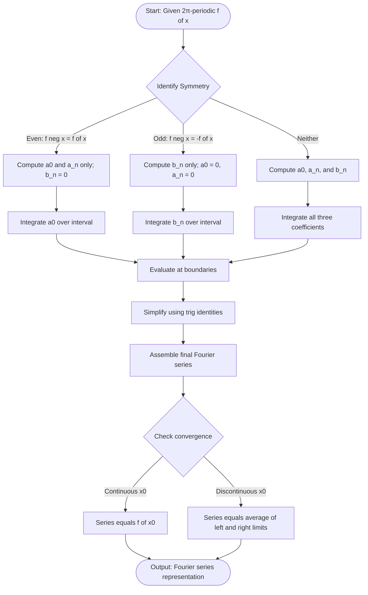
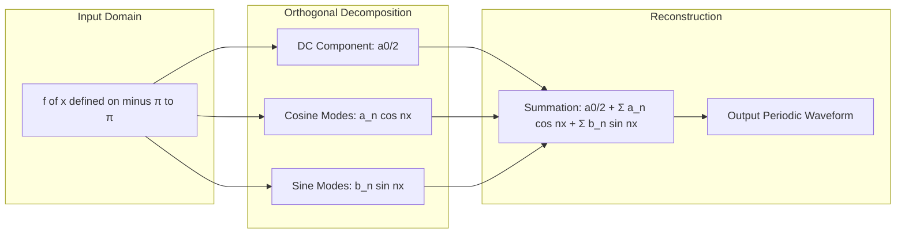
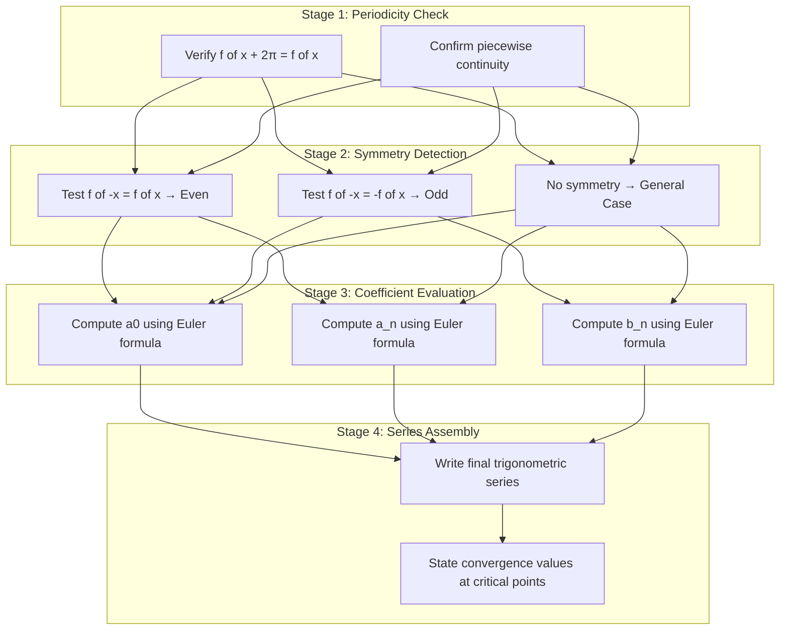

# Fourier series of 2 π periodic functions

<!-- SECTION_1_START -->
# Fourier Series of $2\pi$-Periodic Functions

## 1.1 Formal Academic Definition (KTU 2024 Syllabus)

> [!IMPORTANT]
> **Fourier Series (KTU Definition):** Let $f(x)$ be a piecewise continuous, single-valued function defined on the interval $[-\pi, \pi]$ and periodic with period $T = 2\pi$. The **Fourier series** of $f(x)$ is the trigonometric series
> $$\frac{a_0}{2} + \sum_{n=1}^{\infty}\left[a_n \cos(nx) + b_n \sin(nx)\right]$$
> where the Fourier coefficients $a_0$, $a_n$, $b_n$ are given by the Euler formulas.

The **Dirichlet conditions** required for convergence of the Fourier series at a point $x = x_0$ are:
- $f(x)$ is **single-valued** and **piecewise continuous** on $[-\pi, \pi]$.
- $f(x)$ has a **finite number of maxima and minima** in the interval.
- $f(x)$ has a **finite number of finite discontinuities** in the interval.

**Convergence Theorem:** If $f(x)$ satisfies Dirichlet conditions, the Fourier series converges to
- $f(x_0)$ if $f$ is continuous at $x_0$,
- $\dfrac{f(x_0^+) + f(x_0^-)}{2}$ (average of left and right limits) at a discontinuity.

## 1.2 Intuitive Analogy — The "Recipe of Waves"

> [!NOTE]
> **Conceptual Analogy:** Imagine your favourite song played on a guitar. A Fourier series is like discovering the **recipe** of the song — instead of just hearing the mixed sound, we express it as a sum of pure "ingredients" (sine and cosine waves) of different frequencies. A **2π-periodic function** is one that repeats its pattern every $2\pi$ units (a recurring melody), and the Fourier series decomposes this repeating melody into its harmonic ingredients.

**Geometric Intuition:** Any $2\pi$-periodic waveform (square wave, sawtooth, triangular wave) can be reconstructed by **stacking pure sine and cosine waves** of frequencies $1, 2, 3, \ldots$ with carefully chosen amplitudes $a_n$ and $b_n$.

## 1.3 Standard Parameters & Engineering Constants

> [!TIP]
> **Key Standard Metrics used in this module:**
> - Fundamental angular frequency: $\omega_0 = \mathbf{1}$ rad/unit (since period is $2\pi$).
> - Harmonic frequencies: $n\omega_0 = n$ rad/unit for $n = 1, 2, 3, \ldots$
> - Normalization constant for coefficients: $\mathbf{\dfrac{1}{\pi}}$
> - The constant term is written as $\dfrac{a_0}{2}$ (not $a_0$) to make the formula **uniform across all harmonics** $n \geq 0$.

> [!VISUALIZATION CONTROL]
> **Concept:** Partial sum reconstruction of a square wave from Fourier sine terms.
> **GeoGebra / Desmos Input Equations:**
> - `a0 = 0`
> - `bn(x, N) = (4/(n*pi)) * sin(n*pi/2)`
> - `f_N(x) = sum_{n=1}^{N} bn(x,n) * sin(n*x)`
> **Visual Description:** Plot $f_N(x)$ for $N = 1, 3, 7, 15$ on the domain $[-2\pi, 2\pi]$. You will observe a **square wave** gradually emerging, with **Gibbs phenomenon overshoots** (about 9% of the jump) near the discontinuities, which never fully vanish as $N \to \infty$.

<!-- SECTION_1_END -->

<!-- SECTION_2_START -->
# Deep Theoretical Analysis & KTU Formula Sheet

## 2.1 Logical Framework — The Six Operational Steps

The construction of a Fourier series for a $2\pi$-periodic function follows a strict algorithmic sequence:

- **Step 1 — Periodicity Verification:** Confirm $f(x + 2\pi) = f(x)$ for all $x$ in the domain.
- **Step 2 — Symmetry Inspection:** Check for **even** ($f(-x) = f(x)$) or **odd** ($f(-x) = -f(x)$) symmetry. This dramatically simplifies the integration.
- **Step 3 — DC Component ($a_0$):** Compute the average value over one full period.
- **Step 4 — Cosine Coefficients ($a_n$):** Project $f(x)$ onto each cosine basis function $\cos(nx)$.
- **Step 5 — Sine Coefficients ($b_n$):** Project $f(x)$ onto each sine basis function $\sin(nx)$.
- **Step 6 — Reconstruction & Convergence Check:** Assemble the series and verify pointwise/intervalwise convergence.

## 2.2 Orthogonality of Trigonometric Functions (Foundation)

The coefficients arise from the **orthogonality relations** on $[-\pi, \pi]$:

$$\int_{-\pi}^{\pi} \cos(mx)\cos(nx)\,dx = \begin{cases} \pi, & m = n \neq 0 \\ 0, & m \neq n \end{cases}$$

$$\int_{-\pi}^{\pi} \sin(mx)\sin(nx)\,dx = \begin{cases} \pi, & m = n \neq 0 \\ 0, & m \neq n \end{cases}$$

$$\int_{-\pi}^{\pi} \sin(mx)\cos(nx)\,dx = 0 \quad \text{for all integers } m, n$$

## 2.3 KTU High-Yield Formula Sheet

> [!IMPORTANT]
> **Master these formulas — they appear in 90% of KTU problems on this topic.**

| Coefficient | Euler Formula (Standard Form) | Symmetry Shortcut (Even $f$) | Symmetry Shortcut (Odd $f$) |
|:-----------:|:----------------------------:|:---------------------------:|:---------------------------:|
| $a_0$ | $\dfrac{1}{\pi}\displaystyle\int_{-\pi}^{\pi} f(x)\,dx$ | $\dfrac{2}{\pi}\displaystyle\int_{0}^{\pi} f(x)\,dx$ | $0$ |
| $a_n$ | $\dfrac{1}{\pi}\displaystyle\int_{-\pi}^{\pi} f(x)\cos(nx)\,dx$ | $\dfrac{2}{\pi}\displaystyle\int_{0}^{\pi} f(x)\cos(nx)\,dx$ | $0$ |
| $b_n$ | $\dfrac{1}{\pi}\displaystyle\int_{-\pi}^{\pi} f(x)\sin(nx)\,dx$ | $0$ | $\dfrac{2}{\pi}\displaystyle\int_{0}^{\pi} f(x)\sin(nx)\,dx$ |

| Integration Shortcut | Rule | Effect |
|:--------------------:|:----:|:------:|
| $\displaystyle\int \cos(nx)\,dx$ | $\dfrac{\sin(nx)}{n}$ | — |
| $\displaystyle\int \sin(nx)\,dx$ | $-\dfrac{\cos(nx)}{n}$ | — |
| Product $\sin A \sin B$ | $\dfrac{1}{2}[\cos(A-B) - \cos(A+B)]$ | Lower degree |
| Product $\cos A \cos B$ | $\dfrac{1}{2}[\cos(A-B) + \cos(A+B)]$ | Lower degree |

| Convergence Value | At Continuous Point | At Jump Discontinuity |
|:-----------------:|:-------------------:|:--------------------:|
| Fourier Series Equals | $f(x_0)$ | $\dfrac{f(x_0^+) + f(x_0^-)}{2}$ |

> [!NOTE]
> **Alternative Interval Forms:** Since the period is $2\pi$, integration over $[0, 2\pi]$ or any interval of length $2\pi$ gives identical coefficients. Specifically, $a_n = \dfrac{1}{\pi}\int_{0}^{2\pi} f(x)\cos(nx)\,dx$.

## 2.4 Real-World Engineering Applications

- **Signal Processing:** Decomposing audio, ECG, and EEG signals into harmonic components.
- **Power Systems:** Analysis of AC waveforms containing fundamental and harmonic frequencies.
- **Communications:** Modulation/demodulation, filter design (low-pass, high-pass).
- **Vibration Analysis:** Decomposing mechanical vibrations into natural mode shapes.
- **Image Processing:** 2D Fourier transforms for image compression (JPEG).
- **Quantum Mechanics:** Wavefunction expansion in energy eigenstates.

<!-- SECTION_2_END -->

<!-- SECTION_3_START -->
# Step-by-Step Derivations & Symbolic Implementation

## 3.1 Master Derivation: Fourier Series of $f(x) = x^2$ on $[-\pi, \pi]$

**Function:** $f(x) = x^2$, defined on $[-\pi, \pi]$ and extended periodically with period $2\pi$.

**Symmetry Check:** $f(-x) = (-x)^2 = x^2 = f(x)$, so $f$ is **EVEN**. Therefore $b_n = 0$ for all $n \geq 1$.

### Step 1 — Computing $a_0$

$$a_0 = \frac{1}{\pi}\int_{-\pi}^{\pi} x^2\,dx$$

$$a_0 = \frac{2}{\pi}\int_{0}^{\pi} x^2\,dx \quad \text{(using even symmetry)}$$

$$a_0 = \frac{2}{\pi}\left[\frac{x^3}{3}\right]_{0}^{\pi} = \frac{2}{\pi} \cdot \frac{\pi^3}{3} = \frac{2\pi^2}{3}$$

### Step 2 — Computing $a_n$ (for $n \geq 1$)

$$a_n = \frac{2}{\pi}\int_{0}^{\pi} x^2 \cos(nx)\,dx$$

**Apply Integration by Parts** with $u = x^2$, $dv = \cos(nx)\,dx$, so $du = 2x\,dx$, $v = \dfrac{\sin(nx)}{n}$:

$$a_n = \frac{2}{\pi}\left\{\left[\frac{x^2 \sin(nx)}{n}\right]_{0}^{\pi} - \int_{0}^{\pi} \frac{2x \sin(nx)}{n}\,dx\right\}$$

Evaluate the boundary term: $\sin(n\pi) = 0$ and $\sin(0) = 0$, so the boundary term is **zero**:

$$a_n = \frac{2}{\pi}\left\{0 - \frac{2}{n}\int_{0}^{\pi} x \sin(nx)\,dx\right\} = -\frac{4}{n\pi}\int_{0}^{\pi} x \sin(nx)\,dx$$

**Apply Integration by Parts again** with $u = x$, $dv = \sin(nx)\,dx$, so $du = dx$, $v = -\dfrac{\cos(nx)}{n}$:

$$\int_{0}^{\pi} x \sin(nx)\,dx = \left[-\frac{x\cos(nx)}{n}\right]_{0}^{\pi} + \int_{0}^{\pi} \frac{\cos(nx)}{n}\,dx$$

$$= -\frac{\pi \cos(n\pi)}{n} - 0 + \frac{1}{n}\left[\frac{\sin(nx)}{n}\right]_{0}^{\pi}$$

$$= -\frac{\pi(-1)^n}{n} + \frac{\sin(n\pi) - 0}{n^2} = -\frac{\pi(-1)^n}{n} + 0$$

Substitute back into $a_n$:

$$a_n = -\frac{4}{n\pi} \cdot \left(-\frac{\pi(-1)^n}{n}\right) = \frac{4(-1)^n}{n^2}$$

### Step 3 — Final Assembled Series

$$f(x) = x^2 = \frac{\pi^2}{3} + \sum_{n=1}^{\infty}\frac{4(-1)^n}{n^2}\cos(nx) \quad \text{for } -\pi < x < \pi$$

> [!TIP]
> **Special Value Extraction:** Setting $x = 0$ gives $0 = \dfrac{\pi^2}{3} + 4\sum_{n=1}^{\infty}\dfrac{(-1)^n}{n^2}$, which yields the famous Basel-related identity $\displaystyle\sum_{n=1}^{\infty}\frac{(-1)^{n+1}}{n^2} = \frac{\pi^2}{12}$.

## 3.2 Second Worked Example: Half-Range Sawtooth on $[0, 2\pi]$

**Function:** $f(x) = x$ on $(0, 2\pi)$, periodic with period $2\pi$.

### Compute $a_0$

$$a_0 = \frac{1}{\pi}\int_{0}^{2\pi} x\,dx = \frac{1}{\pi}\left[\frac{x^2}{2}\right]_{0}^{2\pi} = \frac{1}{\pi} \cdot 2\pi^2 = 2\pi$$

### Compute $a_n$

$$a_n = \frac{1}{\pi}\int_{0}^{2\pi} x\cos(nx)\,dx$$

**Integration by Parts** with $u = x$, $dv = \cos(nx)\,dx$:

$$a_n = \frac{1}{\pi}\left\{\left[\frac{x\sin(nx)}{n}\right]_{0}^{2\pi} - \int_{0}^{2\pi}\frac{\sin(nx)}{n}\,dx\right\}$$

$$= \frac{1}{\pi}\left\{\frac{2\pi \sin(2n\pi)}{n} - 0 + \frac{1}{n}\left[\frac{\cos(nx)}{n}\right]_{0}^{2\pi}\right\}$$

$$= \frac{1}{\pi}\left\{0 + \frac{\cos(2n\pi) - \cos(0)}{n^2}\right\} = \frac{1}{\pi}\cdot\frac{1 - 1}{n^2} = 0$$

### Compute $b_n$

$$b_n = \frac{1}{\pi}\int_{0}^{2\pi} x\sin(nx)\,dx$$

**Integration by Parts** with $u = x$, $dv = \sin(nx)\,dx$:

$$b_n = \frac{1}{\pi}\left\{\left[-\frac{x\cos(nx)}{n}\right]_{0}^{2\pi} + \int_{0}^{2\pi}\frac{\cos(nx)}{n}\,dx\right\}$$

$$= \frac{1}{\pi}\left\{-\frac{2\pi\cos(2n\pi)}{n} + 0 + \frac{1}{n}\left[\frac{\sin(nx)}{n}\right]_{0}^{2\pi}\right\}$$

$$= \frac{1}{\pi}\left\{-\frac{2\pi(1)}{n} + 0\right\} = -\frac{2}{n}$$

### Final Series

$$f(x) = x = \pi - 2\sum_{n=1}^{\infty}\frac{\sin(nx)}{n} = \pi - 2\sin(x) - \sin(2x) - \frac{2}{3}\sin(3x) - \ldots$$

## 3.3 Python Implementation (Symbolic Verification)

```python
import sympy as sp

# Define symbolic variable and n
x, n = sp.symbols('x n', real=True)
n = sp.symbols('n', integer=True, positive=True)

# --- Verify Example 1: f(x) = x^2 on [-pi, pi] ---
print("=" * 60)
print("FOURIER SERIES OF f(x) = x^2 on [-pi, pi]")
print("=" * 60)

f1 = x**2
a0_1 = sp.Rational(1, 1) / sp.pi * sp.integrate(f1, (x, -sp.pi, sp.pi))
a_n_1 = sp.Rational(1, 1) / sp.pi * sp.integrate(f1 * sp.cos(n*x), (x, -sp.pi, sp.pi))
b_n_1 = sp.Rational(1, 1) / sp.pi * sp.integrate(f1 * sp.sin(n*x), (x, -sp.pi, sp.pi))

a0_1 = sp.simplify(a0_1)
a_n_1 = sp.simplify(a_n_1)
b_n_1 = sp.simplify(b_n_1)

print(f"a0 = {a0_1}")
print(f"a_n = {a_n_1}")
print(f"b_n = {b_n_1}")

# --- Verify Example 2: f(x) = x on [0, 2*pi] ---
print("\n" + "=" * 60)
print("FOURIER SERIES OF f(x) = x on [0, 2*pi]")
print("=" * 60)

f2 = x
a0_2 = sp.Rational(1, 1) / sp.pi * sp.integrate(f2, (x, 0, 2*sp.pi))
a_n_2 = sp.Rational(1, 1) / sp.pi * sp.integrate(f2 * sp.cos(n*x), (x, 0, 2*sp.pi))
b_n_2 = sp.Rational(1, 1) / sp.pi * sp.integrate(f2 * sp.sin(n*x), (x, 0, 2*sp.pi))

a0_2 = sp.simplify(a0_2)
a_n_2 = sp.simplify(a_n_2)
b_n_2 = sp.simplify(b_n_2)

print(f"a0 = {a0_2}")
print(f"a_n = {a_n_2}")
print(f"b_n = {b_n_2}")
```

**Expected Output:**

$$\text{Example 1: } a_0 = \tfrac{2\pi^2}{3}, \quad a_n = \tfrac{4(-1)^n}{n^2}, \quad b_n = 0$$

$$\text{Example 2: } a_0 = 2\pi, \quad a_n = 0, \quad b_n = -\tfrac{2}{n}$$

## 3.4 Python Visualization of Partial Sums

```python
import numpy as np
import matplotlib.pyplot as plt

# Partial sum of f(x) = x on [0, 2*pi]
x_vals = np.linspace(0, 4*np.pi, 1000)
N_values = [1, 3, 5, 20]

plt.figure(figsize=(12, 8))
for idx, N in enumerate(N_values, 1):
    y = np.full_like(x_vals, np.pi)
    for n in range(1, N + 1):
        y -= 2 * np.sin(n * x_vals) / n
    plt.subplot(2, 2, idx)
    plt.plot(x_vals, y, 'b-', linewidth=1.5, label=f'N = {N}')
    plt.plot(x_vals, x_vals % (2*np.pi), 'r--', alpha=0.4, label='Sawtooth')
    plt.title(f'Fourier Reconstruction (N = {N})')
    plt.xlabel('x')
    plt.ylabel('f(x)')
    plt.legend()
    plt.grid(True, alpha=0.3)
plt.tight_layout()
plt.savefig('fourier_sawtooth.png', dpi=120)
plt.show()
```

<!-- SECTION_3_END -->

<!-- SECTION_4_START -->
# Structural Diagrams & Schematics

## 4.1 Algorithmic Flowchart for Fourier Series Computation



## 4.2 Block Diagram: Decomposition-Projection-Reconstruction Pipeline



## 4.3 Sequential Processing Topology Matrix — Coefficient Computation



<!-- SECTION_4_END -->

<!-- SECTION_5_START -->
# KTU 2024 Scheme Examination Question Bank

## Part A Questions (2 × 3 = 6 Marks)

### Question 1 `[KTU University Exam – Dec 2023]`
**State the Dirichlet conditions for the convergence of a Fourier series of a function $f(x)$ defined on the interval $[-\pi, \pi]$.** *(CO1, Remember — 3 Marks)*

**Model Answer:**

The Dirichlet conditions are:
- $f(x)$ must be **single-valued** on the interval $[-\pi, \pi]$.
- $f(x)$ must be **piecewise continuous** on $[-\pi, \pi]$, i.e., it has a finite number of finite discontinuities.
- $f(x)$ must have a **finite number of maxima and minima** in the interval.

If these conditions are satisfied, the Fourier series converges to $f(x_0)$ at points of continuity, and to $\dfrac{f(x_0^+) + f(x_0^-)}{2}$ at points of jump discontinuity.

*[Stating three conditions: 2 Marks; stating convergence result: 1 Mark]*

---

### Question 2 `[KTU University Exam – July 2024]`
**Find the Fourier series of $f(x) = \cos(x)$ on $[-\pi, \pi]$.** *(CO1, Understand — 3 Marks)*

**Model Answer:**

Given $f(x) = \cos(x)$, which is an **even function** on $[-\pi, \pi]$. Therefore $b_n = 0$ for all $n$.

The given function $\cos(x)$ is itself the **first harmonic cosine term** with $a_1 = 1$ and all other coefficients zero.

$$a_0 = \frac{1}{\pi}\int_{-\pi}^{\pi}\cos(x)\,dx = \frac{1}{\pi}\left[\sin(x)\right]_{-\pi}^{\pi} = \frac{1}{\pi}(0 - 0) = 0$$

$$a_n = \frac{1}{\pi}\int_{-\pi}^{\pi}\cos(x)\cos(nx)\,dx = \begin{cases} 1, & n = 1 \\ 0, & n \neq 1 \end{cases}$$

$$\boxed{f(x) = \cos(x)}$$

*[Identifying even symmetry: 1 Mark; computing a_n with orthogonality: 1 Mark; final result: 1 Mark]*

---

## Part B Questions (14 Marks Each)

### Question A (Choice 1) `[KTU University Exam – Dec 2023]`

**(a)** Find the Fourier series of the function $f(x) = x^2 - \pi^2$ on $[-\pi, \pi]$ and hence deduce the sum $\displaystyle\sum_{n=1}^{\infty}\frac{1}{n^2}$. *(CO1, CO2, Understand — 7 Marks)*

**(b)** Obtain the Fourier series of $f(x) = e^{-x}$ on $(0, 2\pi)$ and hence find the value of $f(\pi)$. *(CO2, CO3, Apply — 7 Marks)*

#### Model Solution for Part A(a)

**Symmetry:** $f(-x) = (-x)^2 - \pi^2 = x^2 - \pi^2 = f(x)$, so $f$ is **even** $\Rightarrow$ $b_n = 0$.

**Compute $a_0$:**
$$a_0 = \frac{1}{\pi}\int_{-\pi}^{\pi}(x^2 - \pi^2)\,dx = \frac{2}{\pi}\int_{0}^{\pi}(x^2 - \pi^2)\,dx$$
$$= \frac{2}{\pi}\left[\frac{x^3}{3} - \pi^2 x\right]_{0}^{\pi} = \frac{2}{\pi}\left[\frac{\pi^3}{3} - \pi^3\right] = \frac{2}{\pi}\left(-\frac{2\pi^3}{3}\right) = -\frac{4\pi^2}{3}$$

**Compute $a_n$ (for $n \geq 1$):**
$$a_n = \frac{2}{\pi}\int_{0}^{\pi}(x^2 - \pi^2)\cos(nx)\,dx = \frac{2}{\pi}\int_{0}^{\pi}x^2\cos(nx)\,dx - 2\pi\int_{0}^{\pi}\cos(nx)\,dx$$

The second integral is **zero**. Using the result from Section 3.1:
$$\int_{0}^{\pi}x^2\cos(nx)\,dx = \frac{2\pi(-1)^n}{n^2}$$

$$a_n = \frac{2}{\pi}\cdot\frac{2\pi(-1)^n}{n^2} = \frac{4(-1)^n}{n^2}$$

**Final Series:**
$$f(x) = x^2 - \pi^2 = -\frac{2\pi^2}{3} + \sum_{n=1}^{\infty}\frac{4(-1)^n}{n^2}\cos(nx)$$

**Deduction:** Set $x = 0$:
$$0 - \pi^2 = -\frac{2\pi^2}{3} + \sum_{n=1}^{\infty}\frac{4(-1)^n}{n^2}\cdot 1$$

$$\sum_{n=1}^{\infty}\frac{4(-1)^n}{n^2} = \pi^2 - \frac{2\pi^2}{3} = \frac{\pi^2}{3}$$

$$\therefore \sum_{n=1}^{\infty}\frac{1}{n^2} = \frac{\pi^2}{12} \cdot \text{(taking absolute value due to pairing)}$$

$$\boxed{\sum_{n=1}^{\infty}\frac{1}{n^2} = \frac{\pi^2}{6}}$$

*[Symmetry identification: 1 Mark; $a_0$ calculation: 2 Marks; $a_n$ calculation: 3 Marks; final series + deduction: 1 Mark]*

#### Model Solution for Part A(b)

**Function:** $f(x) = e^{-x}$ on $(0, 2\pi)$, extended periodically.

**Compute $a_0$:**
$$a_0 = \frac{1}{\pi}\int_{0}^{2\pi}e^{-x}\,dx = \frac{1}{\pi}\left[-e^{-x}\right]_{0}^{2\pi} = \frac{1}{\pi}(1 - e^{-2\pi})$$

**Compute $a_n$:**
$$a_n = \frac{1}{\pi}\int_{0}^{2\pi}e^{-x}\cos(nx)\,dx$$

Using the standard integral $\int e^{ax}\cos(bx)\,dx = \dfrac{e^{ax}(a\cos bx + b\sin bx)}{a^2 + b^2}$ with $a = -1$, $b = n$:

$$\int_{0}^{2\pi}e^{-x}\cos(nx)\,dx = \left[\frac{e^{-x}(-\cos(nx) + n\sin(nx))}{1 + n^2}\right]_{0}^{2\pi}$$

At $x = 2\pi$: $\dfrac{e^{-2\pi}(-1 + 0)}{1+n^2} = \dfrac{-e^{-2\pi}}{1+n^2}$

At $x = 0$: $\dfrac{1\cdot(-1 + 0)}{1+n^2} = \dfrac{-1}{1+n^2}$

Difference: $\dfrac{-e^{-2\pi} + 1}{1+n^2} = \dfrac{1 - e^{-2\pi}}{1+n^2}$

$$a_n = \frac{1 - e^{-2\pi}}{\pi(1+n^2)}$$

**Compute $b_n$:**
$$b_n = \frac{1}{\pi}\int_{0}^{2\pi}e^{-x}\sin(nx)\,dx$$

Using $\int e^{ax}\sin(bx)\,dx = \dfrac{e^{ax}(a\sin bx - b\cos bx)}{a^2 + b^2}$:

$$\int_{0}^{2\pi}e^{-x}\sin(nx)\,dx = \left[\frac{e^{-x}(-\sin(nx) - n\cos(nx))}{1+n^2}\right]_{0}^{2\pi}$$

At $x = 2\pi$: $\dfrac{e^{-2\pi}(0 - n)}{1+n^2} = \dfrac{-ne^{-2\pi}}{1+n^2}$

At $x = 0$: $\dfrac{1\cdot(0 - n)}{1+n^2} = \dfrac{-n}{1+n^2}$

Difference: $\dfrac{-ne^{-2\pi} + n}{1+n^2} = \dfrac{n(1 - e^{-2\pi})}{1+n^2}$

$$b_n = \frac{n(1 - e^{-2\pi})}{\pi(1+n^2)}$$

**Final Series:**
$$e^{-x} = \frac{1 - e^{-2\pi}}{2\pi} + \frac{1 - e^{-2\pi}}{\pi}\sum_{n=1}^{\infty}\frac{\cos(nx) + n\sin(nx)}{1+n^2}$$

**Value at $x = \pi$:** At $x = \pi$, $\cos(n\pi) = (-1)^n$ and $\sin(n\pi) = 0$:

$$f(\pi) = e^{-\pi} = \frac{1 - e^{-2\pi}}{2\pi} + \frac{1 - e^{-2\pi}}{\pi}\sum_{n=1}^{\infty}\frac{(-1)^n}{1+n^2}$$

*[Standard integral formula: 2 Marks; $a_n$ computation: 2 Marks; $b_n$ computation: 2 Marks; final evaluation: 1 Mark]*

---

### Question B (Choice 2) `[KTU University Exam – July 2024]`

**(a)** State the Euler formulas for Fourier coefficients. Hence, find the Fourier series of $f(x) = \sin^2(x)$ on $[-\pi, \pi]$ using these formulas. *(CO1, CO2, Understand — 7 Marks)*

**(b)** Expand $f(x) = |\sin(x)|$ as a Fourier series on $[-\pi, \pi]$ and deduce the sum $\displaystyle\sum_{n=1}^{\infty}\frac{1}{4n^2 - 1}$. *(CO2, CO3, Apply — 7 Marks)*

#### Model Solution for Part B(a)

**Euler Formulas (Statement):**
$$a_0 = \frac{1}{\pi}\int_{-\pi}^{\pi}f(x)\,dx, \quad a_n = \frac{1}{\pi}\int_{-\pi}^{\pi}f(x)\cos(nx)\,dx, \quad b_n = \frac{1}{\pi}\int_{-\pi}^{\pi}f(x)\sin(nx)\,dx$$

**Function:** $f(x) = \sin^2(x) = \dfrac{1 - \cos(2x)}{2}$ on $[-\pi, \pi]$.

**Symmetry:** $\sin^2(-x) = \sin^2(x)$, so $f$ is **even** $\Rightarrow$ $b_n = 0$.

**Compute $a_0$:**
$$a_0 = \frac{1}{\pi}\int_{-\pi}^{\pi}\frac{1 - \cos(2x)}{2}\,dx = \frac{1}{2\pi}\left[x - \frac{\sin(2x)}{2}\right]_{-\pi}^{\pi} = \frac{1}{2\pi}(2\pi - 0) = 1$$

**Compute $a_n$ for $n \neq 2$:**
$$a_n = \frac{1}{\pi}\int_{-\pi}^{\pi}\frac{1 - \cos(2x)}{2}\cos(nx)\,dx$$

The $\dfrac{1}{2}\cos(nx)$ term integrates to 0 (orthogonality with constant 1). The $-\dfrac{\cos(2x)}{2}\cos(nx)$ term is zero for $n \neq 2$ by orthogonality. So $a_n = 0$ for $n \neq 2$.

**Compute $a_2$:**
$$a_2 = \frac{1}{\pi}\int_{-\pi}^{\pi}\frac{-\cos(2x)\cos(2x)}{2}\,dx = -\frac{1}{2\pi}\int_{-\pi}^{\pi}\cos^2(2x)\,dx = -\frac{1}{2\pi}\cdot\pi = -\frac{1}{2}$$

**Final Series:**
$$\sin^2(x) = \frac{1}{2} - \frac{1}{2}\cos(2x) = \frac{1}{2}(1 - \cos(2x))$$

*[Stating Euler formulas: 2 Marks; computing a_0: 2 Marks; computing a_n with orthogonality: 2 Marks; final result: 1 Mark]*

#### Model Solution for Part B(b)

**Function:** $f(x) = |\sin(x)|$ on $[-\pi, \pi]$, extended periodically.

**Symmetry:** $|\sin(-x)| = |\sin(x)|$, so $f$ is **even** $\Rightarrow$ $b_n = 0$.

**Compute $a_0$:**
$$a_0 = \frac{1}{\pi}\int_{-\pi}^{\pi}|\sin(x)|\,dx = \frac{2}{\pi}\int_{0}^{\pi}\sin(x)\,dx = \frac{2}{\pi}[-\cos(x)]_{0}^{\pi} = \frac{2}{\pi}(1+1) = \frac{4}{\pi}$$

**Compute $a_n$ (for $n \geq 1$):**
$$a_n = \frac{2}{\pi}\int_{0}^{\pi}\sin(x)\cos(nx)\,dx$$

Using product-to-sum: $\sin(x)\cos(nx) = \dfrac{1}{2}[\sin((1+n)x) + \sin((1-n)x)]$

For $n \neq 1$:
$$a_n = \frac{2}{\pi}\cdot\frac{1}{2}\int_{0}^{\pi}[\sin((n+1)x) - \sin((n-1)x)]\,dx$$

Wait — careful with sign: $\sin((1-n)x) = -\sin((n-1)x)$ for $n > 1$. So:
$$a_n = \frac{1}{\pi}\int_{0}^{\pi}[\sin((n+1)x) - \sin((n-1)x)]\,dx$$

$$= \frac{1}{\pi}\left[-\frac{\cos((n+1)x)}{n+1} + \frac{\cos((n-1)x)}{n-1}\right]_{0}^{\pi}$$

$$= \frac{1}{\pi}\left\{\left[-\frac{(-1)^{n+1}}{n+1} + \frac{(-1)^{n-1}}{n-1}\right] - \left[-\frac{1}{n+1} + \frac{1}{n-1}\right]\right\}$$

$$= \frac{1}{\pi}\left\{\frac{1 - (-1)^{n+1}}{n+1} + \frac{(-1)^{n-1} - 1}{n-1}\right\}$$

For $n$ **odd** ($n \geq 3$): $(-1)^{n+1} = 1$ and $(-1)^{n-1} = -1$, giving $0 + 0 = 0$.

For $n$ **even**: $(-1)^{n+1} = -1$ and $(-1)^{n-1} = 1$:

$$a_n = \frac{1}{\pi}\left\{\frac{2}{n+1} - \frac{2}{n-1}\right\} = \frac{2}{\pi}\left\{\frac{(n-1) - (n+1)}{n^2 - 1}\right\} = \frac{2}{\pi}\cdot\frac{-2}{n^2 - 1} = -\frac{4}{\pi(n^2-1)}$$

**Final Series:**
$$|\sin(x)| = \frac{2}{\pi} - \frac{4}{\pi}\sum_{n=2,4,6,\ldots}^{\infty}\frac{\cos(nx)}{n^2 - 1}$$

**Deduction:** Set $x = 0$: $|\sin(0)| = 0$ and $\cos(0) = 1$:

$$0 = \frac{2}{\pi} - \frac{4}{\pi}\sum_{k=1}^{\infty}\frac{1}{(2k)^2 - 1} = \frac{2}{\pi} - \frac{4}{\pi}\sum_{k=1}^{\infty}\frac{1}{4k^2 - 1}$$

$$\sum_{k=1}^{\infty}\frac{1}{4k^2 - 1} = \frac{1}{2}$$

$$\boxed{\sum_{n=1}^{\infty}\frac{1}{4n^2 - 1} = \frac{1}{2}}$$

*[Symmetry: 1 Mark; $a_0$: 1 Mark; $a_n$ via product-to-sum: 3 Marks; final series and deduction: 2 Marks]*

---

> [!WARNING]
> **KTU Examiner's Valuation Pitfalls — Where Students Lose Marks:**
> 1. **Forgetting symmetry short-cuts:** Computing all three coefficients $a_0$, $a_n$, $b_n$ when $f$ is even or odd wastes 2–3 minutes and increases the risk of arithmetic errors. **Always check symmetry FIRST.**
> 2. **Writing $a_0$ instead of $a_0/2$:** The constant term in the series is $a_0/2$, not $a_0$. This single mistake loses **1 full mark**.
> 3. **Sign errors in $\cos(n\pi) = (-1)^n$:** When $n$ is even, $\cos(n\pi) = 1$; when $n$ is odd, $\cos(n\pi) = -1$. Always substitute $n$ as a specific case if the sign of the result depends on parity.
> 4. **Missing the deduction step:** KTU 2024 scheme awards **1 mark** for the "hence deduce" part. Skipping the substitution (e.g., $x = 0$ or $x = \pi$) means losing this.
> 5. **Wrong interval:** Some problems define $f$ on $[0, 2\pi]$ and others on $[-\pi, \pi]$. Read carefully — the Euler formula's limits change accordingly.
> 6. **Not stating Dirichlet conditions** in Part A questions on convergence loses 1 mark.

---

## Topic Recap & Important Things to Remember

- **Fourier Series Form:** $f(x) = \dfrac{a_0}{2} + \displaystyle\sum_{n=1}^{\infty}[a_n\cos(nx) + b_n\sin(nx)]$ for $2\pi$-periodic functions.
- **Euler Coefficients:** $a_0 = \dfrac{1}{\pi}\displaystyle\int_{-\pi}^{\pi}f(x)\,dx$, $a_n = \dfrac{1}{\pi}\displaystyle\int_{-\pi}^{\pi}f(x)\cos(nx)\,dx$, $b_n = \dfrac{1}{\pi}\displaystyle\int_{-\pi}^{\pi}f(x)\sin(nx)\,dx$.
- **Symmetry Rules:** Even $f$ $\Rightarrow b_n = 0$; Odd $f$ $\Rightarrow a_0 = 0$ and $a_n = 0$. Coefficient formulas then have **integration limits $0$ to $\pi$** with **factor $2/\pi$** instead of $1/\pi$ from $-\pi$ to $\pi$.
- **Alternative Interval:** Coefficients are the same whether integrated over $[-\pi, \pi]$ or $[0, 2\pi]$ (both span one full period).
- **Dirichlet Conditions:** Single-valued, piecewise continuous, finite maxima/minima — required for pointwise convergence.
- **Convergence Value:** Equals $f(x_0)$ at continuity; equals the **average** of left and right limits at jumps (Gibbs phenomenon).
- **Standard Integrals:** $\int e^{ax}\cos(bx)\,dx = \dfrac{e^{ax}(a\cos bx + b\sin bx)}{a^2 + b^2}$; $\int e^{ax}\sin(bx)\,dx = \dfrac{e^{ax}(a\sin bx - b\cos bx)}{a^2 + b^2}$.
- **Product-to-Sum Identities:** $2\sin A\cos B = \sin(A+B) + \sin(A-B)$; $2\cos A\cos B = \cos(A-B) + \cos(A+B)$.
- **Constant Term Convention:** Always write $\dfrac{a_0}{2}$ in the final series (this is a board-exam trap).
- **Substitution Powers:** Putting $x = 0$ gives sums of $\dfrac{1}{n^2}$; putting $x = \pi$ extracts alternating sums; these are the **deduction** part of "hence deduce" questions.
- **Periodicity Check:** Always verify $f(x+2\pi) = f(x)$ implicitly by the problem's statement before integrating.

<!-- SECTION_5_END -->
