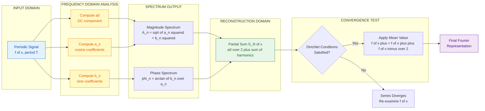
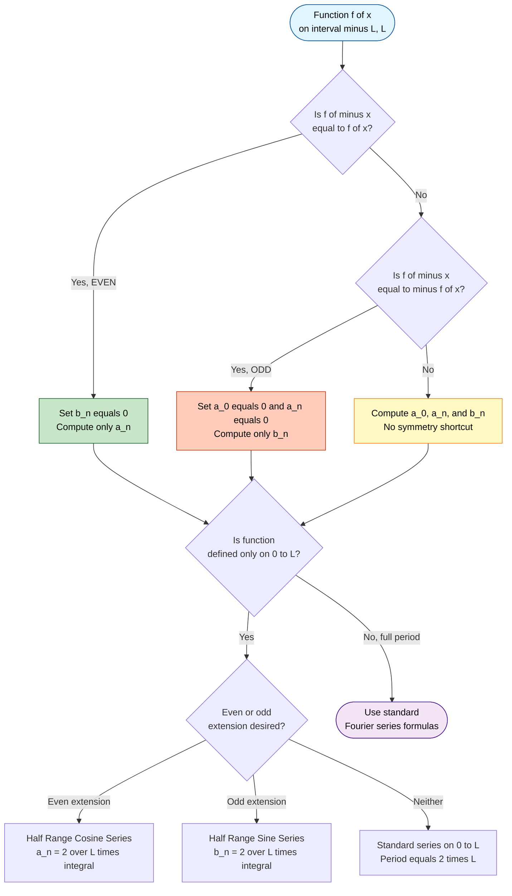
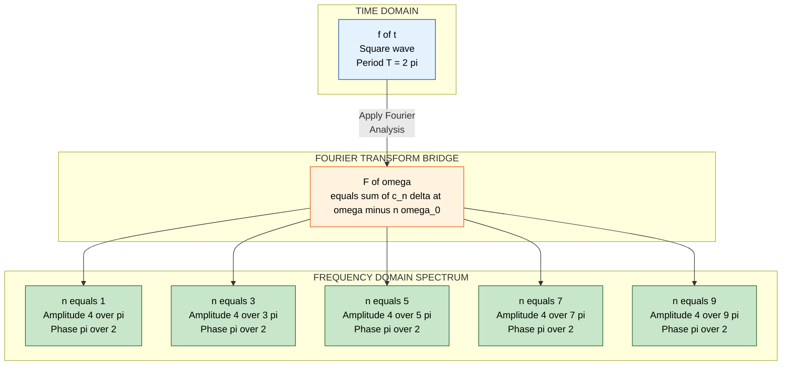

# Fourier series

<!-- SECTION_1_START -->
# Fourier Series – A Periodic Function's DNA

## Formal Definition (KTU 2024 Syllabus Terminology)

> [!IMPORTANT]
> **Fourier Series:** A Fourier series is an infinite series representation of a periodic function $f(x)$ defined on a finite interval of length $T$ (the period), expressed as a weighted sum of sines and cosines of harmonically related frequencies.

A function $f(x)$ is said to be **periodic** with period $T$ if

$$f(x + T) = f(x) \quad \text{for all } x$$

The **trigonometric Fourier series** of $f(x)$ with period $T = 2L$ is written as

$$f(x) = \frac{a_0}{2} + \sum_{n=1}^{\infty} \left[ a_n \cos\!\left(\frac{n \pi x}{L}\right) + b_n \sin\!\left(\frac{n \pi x}{L}\right) \right]$$

where the **Fourier coefficients** are

$$a_n = \frac{1}{L} \int_{c}^{c+2L} f(x) \cos\!\left(\frac{n \pi x}{L}\right) \, dx, \quad b_n = \frac{1}{L} \int_{c}^{c+2L} f(x) \sin\!\left(\frac{n \pi x}{L}\right) \, dx$$

with $a_0 = \frac{1}{L} \int_{c}^{c+2L} f(x) \, dx$, and the fundamental angular frequency is $\omega_0 = \frac{\pi}{L} = \frac{2\pi}{T}$.

---

## Conceptual Analogy – "The Recipe of a Sound"

Imagine you walk into a kitchen and smell a complex dish. A master chef can **decompose** that flavour into the exact amounts of salt, sugar, oil, and spices. **Fourier series does the same to a periodic signal:**

- The **complex signal** $f(x)$ = the flavoured dish.
- The **fundamental frequency** $\omega_0$ = the base ingredient (e.g., the "saltiness").
- The **harmonics** ($n = 1, 2, 3, \dots$) = additional ingredients at integer multiples of the base.
- The **coefficients** $a_n, b_n$ = the precise quantity of each ingredient.

Just as no flavour is truly "irreducible", no periodic signal is a single pure tone — it is a *symphony* of harmonics. The Fourier series tells you **which notes are playing and how loud each one is**.

> [!NOTE]
> **Dirichlet's Conditions (Sufficient Conditions for Convergence):**
> A periodic function $f(x)$ has a convergent Fourier series if:
> 1. $f(x)$ is **bounded** on $[c, c+2L]$.
> 2. $f(x)$ has a **finite number of maxima and minima** (finite number of monotonic pieces).
> 3. $f(x)$ has a **finite number of finite discontinuities** in $[c, c+2L]$.
> 4. At every point of discontinuity $x_0$, the series converges to $\dfrac{f(x_0^+) + f(x_0^-)}{2}$.

> [!TIP]
> **The Standard Convergence Identity (KTU Board Favourite):**
> $$f(x) = \frac{f(x^+) + f(x^-)}{2} \quad \text{at every point } x \text{ (continuous or not)}$$

> [!VISUALIZATION CONTROL]
> **Concept:** Partial sum approximation of a square wave by its first five Fourier harmonics.
> **GeoGebra / Desmos Input Equations:**
> * `N = 5`
> * `S(x) = (4/pi) * sum_{k=1 to N} [ sin((2k-1)*x) / (2k-1) ]`
> * `f(x) = sgn(sin(x))` *(target square wave, use `sign(sin(x))`)*
> * Domain: $x \in [-2\pi, 2\pi]$, $y \in [-1.6, 1.6]$
> **Visual Description:** The student should observe the smooth sinusoidal partial sum $S(x)$ oscillating around the jump discontinuities of $f(x) = \pm 1$, with overshoot humps (the famous **Gibbs phenomenon**) near $x = 0, \pm\pi, \pm 2\pi$. As $N \to \infty$, the ripples tighten and $S(x) \to f(x)$ everywhere except at the jumps.

---

## Why Engineers and Physicists Care

- **Electrical Science:** Harmonic analysis of distorted AC waveforms, rectifier outputs, and PWM signals.
- **Communication Systems:** Modulation, demodulation, spectral analysis of FM/AM signals.
- **Signal Processing:** Foundation of the **Discrete Fourier Transform (DFT)** and **Fast Fourier Transform (FFT)**.
- **Physical Science:** Solving the **heat equation**, **wave equation**, and **Schrödinger equation** in bounded domains via separation of variables.
- **Vibration & Acoustics:** Decomposing complex vibrations into modal frequencies of a structure.

<!-- SECTION_1_END -->

<!-- SECTION_2_START -->
# Deep Theoretical Analysis & KTU High-Yield Formula Sheet

## 1. Existence Theorem – Dirichlet's Conditions

A function $f(x)$ with period $2L$ admits a pointwise convergent Fourier series on $\mathbb{R}$ if it satisfies Dirichlet's three conditions on one period $[c, c+2L]$:

| # | Condition | Engineering Interpretation |
|---|-----------|----------------------------|
| 1 | $f(x)$ is **absolutely integrable**: $\int_c^{c+2L} \vert f(x) \vert \, dx < \infty$ | Finite signal energy per period — physically mandatory. |
| 2 | $f(x)$ has a **finite number of extrema** | No pathological "infinite oscillation" inside one period. |
| 3 | $f(x)$ has a **finite number of finite jumps** | Switches, square waves, and step responses are allowed. |

> [!IMPORTANT]
> **KTU Board Note:** If $f$ is continuous at $x_0$, the Fourier series converges to $f(x_0)$. If $f$ is discontinuous at $x_0$, it converges to the **arithmetic mean of the left and right limits**.

---

## 2. Coefficient Derivation Logic (Why These Formulas?)

We assume $f(x)$ can be written as a Fourier series and exploit **orthogonality** of the trigonometric basis $\{1, \cos(n\pi x/L), \sin(n\pi x/L)\}$ over $[-L, L]$:

$$\int_{-L}^{L} \cos\!\left(\frac{m\pi x}{L}\right) \cos\!\left(\frac{n\pi x}{L}\right) dx = \begin{cases} 0, & m \neq n \\ 2L, & m = n \neq 0 \end{cases}$$

$$\int_{-L}^{L} \sin\!\left(\frac{m\pi x}{L}\right) \sin\!\left(\frac{n\pi x}{L}\right) dx = \begin{cases} 0, & m \neq n \\ L, & m = n \neq 0 \end{cases}$$

$$\int_{-L}^{L} \sin\!\left(\frac{m\pi x}{L}\right) \cos\!\left(\frac{n\pi x}{L}\right) dx = 0 \quad \forall \, m, n \geq 1$$

Multiplying both sides of the Fourier expansion by $\cos(n\pi x/L)$ (or $\sin$), integrating over one period, and using orthogonality isolates each coefficient.

---

## 3. KTU Formula Cheat Sheet (Exam-Ready)

| Concept | Formula | Where Used |
|---|---|---|
| **Period–Half-period relation** | $T = 2L$ so $L = T/2$ | Converting between $2\pi/T$ and $\pi/L$ forms |
| **Fourier Series (Trig form)** | $f(x) = \dfrac{a_0}{2} + \displaystyle\sum_{n=1}^{\infty}\left[a_n \cos\!\left(\dfrac{n\pi x}{L}\right) + b_n \sin\!\left(\dfrac{n\pi x}{L}\right)\right]$ | Standard expansion |
| **$a_0$ coefficient** | $a_0 = \dfrac{1}{L}\displaystyle\int_{c}^{c+2L} f(x)\, dx$ | DC / average component |
| **$a_n$ coefficient** | $a_n = \dfrac{1}{L}\displaystyle\int_{c}^{c+2L} f(x)\cos\!\left(\dfrac{n\pi x}{L}\right) dx$ | Cosine / even harmonics |
| **$b_n$ coefficient** | $b_n = \dfrac{1}{L}\displaystyle\int_{c}^{c+2L} f(x)\sin\!\left(\dfrac{n\pi x}{L}\right) dx$ | Sine / odd harmonics |
| **Even function shortcut** | $b_n = 0$ for all $n$ | $f(-x) = f(x)$ |
| **Odd function shortcut** | $a_n = 0$ for all $n$ (including $a_0$) | $f(-x) = -f(x)$ |
| **Half-range cosine series (on $[0,L]$)** | $f(x) = \dfrac{a_0}{2} + \displaystyle\sum_{n=1}^{\infty} a_n \cos\!\left(\dfrac{n\pi x}{L}\right)$, $\;a_n = \dfrac{2}{L}\int_0^L f(x)\cos\!\left(\dfrac{n\pi x}{L}\right) dx$ | Even extension of $f$ |
| **Half-range sine series (on $[0,L]$)** | $f(x) = \displaystyle\sum_{n=1}^{\infty} b_n \sin\!\left(\dfrac{n\pi x}{L}\right)$, $\;b_n = \dfrac{2}{L}\int_0^L f(x)\sin\!\left(\dfrac{n\pi x}{L}\right) dx$ | Odd extension of $f$ |
| **Complex / Exponential form** | $f(x) = \displaystyle\sum_{n=-\infty}^{\infty} c_n \, e^{i n \pi x/L}$, $\;c_n = \dfrac{1}{2L}\int_{c}^{c+2L} f(x)\, e^{-i n \pi x/L}\, dx$ | Spectral / frequency-domain analysis |
| **Euler's relations** | $a_n = c_n + c_{-n}$, $\; b_n = i(c_n - c_{-n})$, $\; \vert c_n \vert^2 = \dfrac{a_n^2 + b_n^2}{4}$ | Trig ↔ Complex conversion |
| **Parseval's Identity (Power)** | $\dfrac{1}{2L}\int_{c}^{c+2L} \vert f(x) \vert^2 dx = \dfrac{a_0^2}{4} + \dfrac{1}{2}\displaystyle\sum_{n=1}^{\infty}\left(a_n^2 + b_n^2\right)$ | RMS / power of signal |
| **Mean-square convergence** | $\lim_{N \to \infty} \displaystyle\int_{-L}^{L}\left[f(x) - S_N(x)\right]^2 dx = 0$ | Square-integrable periodic signals |

---

## 4. Symmetry-Driven Shortcuts (Critical for KTU Speed)

| Function Type | Symmetry | Resulting Series |
|---|---|---|
| **Even** | $f(-x) = f(x)$ | Pure cosine series; $b_n = 0$ |
| **Odd** | $f(-x) = -f(x)$ | Pure sine series; $a_0 = 0, \; a_n = 0$ |
| **Half-wave odd** | $f(x + L) = -f(x)$ | Only odd harmonics present: $a_{2k} = b_{2k} = 0$ |
| **Half-wave even** | $f(x + L) = f(x)$ | All harmonics present (no shortcut for $n$-parity) |

> [!TIP]
> **KTU Golden Rule:** Always check symmetry **before** integrating. It cuts your computation time by ~50%.

---

## 5. Real-World Engineering Utility Snapshot

| Field | Application of Fourier Series |
|---|---|
| **Power Systems** | Computing Total Harmonic Distortion (THD) in non-linear loads (rectifiers, inverters) |
| **Audio Engineering** | Synthesizing musical timbres; equalizer design |
| **Image Processing** | JPEG compression uses 2D Discrete Cosine Transform (DCT) — a finite cosine Fourier series |
| **Filter Design** | Ideal low-pass filter response is a rectangular pulse in time, whose Fourier series is the sinc function |
| **Quantum Mechanics** | Wavefunctions in a box are expanded in Fourier sine series |
| **Heat Conduction** | Temperature distribution in a finite rod with insulated/convective ends is solved by sine series |

<!-- SECTION_2_END -->

<!-- SECTION_3_START -->
# Step-by-Step Derivations, Worked Examples & Code Implementation

## Worked Example 1 — Full Fourier Series of a Square Wave (KTU Classic)

**Problem.** Find the Fourier series of the periodic function of period $2\pi$ defined by

$$f(x) = \begin{cases} -1, & -\pi < x < 0 \\ +1, & 0 < x < \pi \end{cases}, \quad f(x + 2\pi) = f(x)$$

### Step 1 — Identify symmetry
$f(-x) = -f(x)$ for all $x$ in $(-\pi, 0) \cup (0, \pi)$. Hence $f$ is an **odd function**.

**Immediate consequence:** $a_0 = 0$ and $a_n = 0$ for every $n \geq 1$. We only need $b_n$.

### Step 2 — Period and half-period
$T = 2\pi$, so $L = \pi$, and the fundamental angular frequency is $\omega_0 = \pi/L = 1$.

### Step 3 — Compute $b_n$

$$b_n = \frac{1}{\pi} \int_{-\pi}^{\pi} f(x) \sin(nx) \, dx$$

Split at the discontinuity:

$$b_n = \frac{1}{\pi} \left[ \int_{-\pi}^{0} (-1) \sin(nx)\, dx + \int_{0}^{\pi} (+1) \sin(nx)\, dx \right]$$

Evaluate the first integral:

$$\int_{-\pi}^{0} \sin(nx)\, dx = \left[ -\frac{\cos(nx)}{n} \right]_{-\pi}^{0} = -\frac{\cos(0)}{n} + \frac{\cos(-n\pi)}{n} = -\frac{1}{n} + \frac{(-1)^n}{n}$$

Evaluate the second integral:

$$\int_{0}^{\pi} \sin(nx)\, dx = \left[ -\frac{\cos(nx)}{n} \right]_{0}^{\pi} = -\frac{\cos(n\pi)}{n} + \frac{1}{n} = \frac{1 - (-1)^n}{n}$$

Combine:

$$b_n = \frac{1}{\pi}\left[-1 \cdot \left(\frac{(-1)^n - 1}{n}\right) + 1 \cdot \left(\frac{1 - (-1)^n}{n}\right)\right] = \frac{1}{\pi} \cdot \frac{2[1 - (-1)^n]}{n}$$

### Step 4 — Simplify using $(-1)^n$

$$\begin{aligned} 1 - (-1)^n &= \begin{cases} 0, & n \text{ even} \\ 2, & n \text{ odd} \end{cases} \end{aligned}$$

Therefore:

$$b_n = \begin{cases} \dfrac{4}{n\pi}, & n \text{ odd} \\ 0, & n \text{ even} \end{cases}$$

### Step 5 — Write the series

$$\boxed{\,f(x) = \frac{4}{\pi}\sum_{k=0}^{\infty} \frac{1}{2k+1} \sin\!\big((2k+1)x\big) = \frac{4}{\pi}\!\left[\sin x + \frac{\sin 3x}{3} + \frac{\sin 5x}{5} + \cdots\right]\,}$$

### Step 6 — Convergence check at jumps
At $x = 0$ and $x = \pm\pi$, the function jumps from $-1$ to $+1$ (or vice versa). By Dirichlet's theorem, the series converges to $\frac{(-1) + (+1)}{2} = 0$, which is correct. **Marks awarded for this conclusion in KTU valuation.**

---

## Worked Example 2 — Half-Range Sine Series (Sawtooth on $[0, L]$)

**Problem.** Expand $f(x) = x$ for $0 < x < L$ in a **half-range sine series**.

### Step 1 — Choose odd extension
The half-range sine series corresponds to extending $f(x)$ oddly to $(-L, 0)$ and then periodically with period $2L$. The extended function is

$$F(x) = \begin{cases} x, & 0 < x < L \\ x, & -L < x < 0 \quad \text{(odd extension)} \end{cases} = \text{sawtooth wave}$$

### Step 2 — Coefficient formula
For a half-range sine series, $L$ replaces $\pi$ in the standard argument:

$$b_n = \frac{2}{L} \int_{0}^{L} x \sin\!\left(\frac{n\pi x}{L}\right) dx$$

### Step 3 — Evaluate the integral by parts
Let $u = x$, $dv = \sin(n\pi x/L)\, dx$. Then $du = dx$, $v = -\dfrac{L}{n\pi}\cos(n\pi x/L)$.

$$\int_0^L x \sin\!\left(\frac{n\pi x}{L}\right) dx = \left[-\frac{L x}{n\pi} \cos\!\left(\frac{n\pi x}{L}\right)\right]_0^L + \frac{L}{n\pi}\int_0^L \cos\!\left(\frac{n\pi x}{L}\right) dx$$

$$= -\frac{L^2}{n\pi}\cos(n\pi) + 0 + \frac{L}{n\pi}\left[\frac{L}{n\pi}\sin\!\left(\frac{n\pi x}{L}\right)\right]_0^L$$

$$= -\frac{L^2}{n\pi}(-1)^n + \frac{L^2}{n^2\pi^2}\big[\sin(n\pi) - \sin(0)\big] = \frac{L^2(-1)^{n+1}}{n\pi}$$

### Step 4 — Final coefficient

$$b_n = \frac{2}{L} \cdot \frac{L^2(-1)^{n+1}}{n\pi} = \frac{2L(-1)^{n+1}}{n\pi}$$

### Step 5 — Resulting series

$$\boxed{\,x = \frac{2L}{\pi}\sum_{n=1}^{\infty} \frac{(-1)^{n+1}}{n}\sin\!\left(\frac{n\pi x}{L}\right), \quad 0 < x < L\,}$$

### Step 6 — Bonus check (Parseval application)
Setting $x = L/2$ in this series is a classic KTU trap-question trick:

$$\frac{L}{2} = \frac{2L}{\pi}\sum_{n=1}^{\infty}\frac{(-1)^{n+1}}{n}\sin\!\left(\frac{n\pi}{2}\right)$$

Only odd $n$ contribute, with alternating signs, giving the famous Leibniz identity $\dfrac{\pi}{4} = 1 - \dfrac{1}{3} + \dfrac{1}{5} - \cdots$ — frequently asked as a 3-mark question.

---

## Worked Example 3 — Complex Exponential Form Conversion

Given the square-wave result above, find the complex form.

**Trig form:** $f(x) = \dfrac{4}{\pi}\displaystyle\sum_{k=0}^{\infty}\dfrac{\sin((2k+1)x)}{2k+1}$

Use Euler's identity $\sin(\theta) = \dfrac{e^{i\theta} - e^{-i\theta}}{2i}$:

$$f(x) = \frac{4}{\pi}\sum_{k=0}^{\infty} \frac{1}{2k+1} \cdot \frac{e^{i(2k+1)x} - e^{-i(2k+1)x}}{2i} = \frac{2}{i\pi}\sum_{k=0}^{\infty}\frac{e^{i(2k+1)x} - e^{-i(2k+1)x}}{2k+1}$$

Let $n = 2k+1$ (odd integers). Re-index using $n \in \mathbb{Z}$:

$$\boxed{\,f(x) = \sum_{\substack{n=-\infty \\ n \text{ odd}}}^{\infty} c_n \, e^{inx}, \quad c_n = \frac{2}{\pi n} \cdot \frac{1 - (-1)^n}{2} = \begin{cases} \dfrac{2}{i\pi n}, & n \text{ odd} \\ 0, & n \text{ even} \end{cases}\,}$$

Equivalently, $c_n = \dfrac{2(-1)^{(n-1)/2}}{i\pi n}$ for $n = \pm 1, \pm 3, \pm 5, \dots$

---

## Python Code — Numerical Fourier Series Engine

```python
"""
KTU GYMAT101 - Module 4 Demonstration
Numerical Fourier Series Computation & Reconstruction
"""

import numpy as np
from typing import Callable, Tuple


def fourier_coefficients(
    func: Callable[[float], float],
    period: float,
    n_terms: int = 10,
    n_samples: int = 20000,
) -> Tuple[float, np.ndarray, np.ndarray]:
    """
    Compute the trigonometric Fourier coefficients (a0, a_n, b_n) of a
    user-supplied periodic function over one period using the composite
    Simpson's rule for numerical integration.

    Parameters
    ----------
    func : callable
        The periodic function f(x). MUST satisfy f(x + period) == f(x).
    period : float
        Fundamental period T of the function (so L = T / 2).
    n_terms : int, optional
        Number of harmonics to compute (default is 10).
    n_samples : int, optional
        Number of quadrature points (must be EVEN for Simpson's rule).

    Returns
    -------
    a0 : float
        DC component (a0 / 2 is the average value).
    a_n : np.ndarray of shape (n_terms,)
        Cosine Fourier coefficients, indexed from n=1 to n_terms.
    b_n : np.ndarray of shape (n_terms,)
        Sine Fourier coefficients, indexed from n=1 to n_terms.
    """
    if n_samples % 2 != 0:
        raise ValueError("n_samples must be even for Simpson's 1/3 rule.")

    L = period / 2.0
    # Uniform grid over one period [-L, L]
    x = np.linspace(-L, L, n_samples + 1)
    f_vals = np.array([func(xi) for xi in x], dtype=float)

    # Composite Simpson's 1/3 rule helper
    def simpson(y: np.ndarray, h: float) -> float:
        return (h / 3.0) * (y[0] + y[-1] + 4.0 * np.sum(y[1:-1:2]) +
                            2.0 * np.sum(y[2:-2:2]))

    h = (2.0 * L) / n_samples
    a0 = (1.0 / L) * simpson(f_vals, h)

    a_n = np.zeros(n_terms, dtype=float)
    b_n = np.zeros(n_terms, dtype=float)
    for n in range(1, n_terms + 1):
        cos_basis = np.cos(n * np.pi * x / L)
        sin_basis = np.sin(n * np.pi * x / L)
        a_n[n - 1] = (1.0 / L) * simpson(f_vals * cos_basis, h)
        b_n[n - 1] = (1.0 / L) * simpson(f_vals * sin_basis, h)

    return a0, a_n, b_n


def reconstruct(
    x: np.ndarray,
    a0: float,
    a_n: np.ndarray,
    b_n: np.ndarray,
    period: float,
) -> np.ndarray:
    """Reconstruct f(x) from its Fourier coefficients (truncated to N terms)."""
    L = period / 2.0
    result = np.full_like(x, a0 / 2.0, dtype=float)
    for n in range(1, len(a_n) + 1):
        result += a_n[n - 1] * np.cos(n * np.pi * x / L) + \
                  b_n[n - 1] * np.sin(n * np.pi * x / L)
    return result


# ---------- Demonstration: Square wave of period 2*pi ----------
if __name__ == "__main__":
    PERIOD = 2.0 * np.pi

    def square_wave(x: float) -> float:
        # Standard sign(sin x) square wave; -1 < x < 0 -> -1, else +1
        return 1.0 if (x % (2.0 * np.pi)) > 0.0 else -1.0

    a0, a_n, b_n = fourier_coefficients(square_wave, PERIOD, n_terms=15)

    print(f"{'n':>3} | {'a_n':>12} | {'b_n':>12}")
    print("-" * 35)
    print(f"{'0':>3} | {a0:>12.6f} | {'---':>12}")
    for idx, (ac, bc) in enumerate(zip(a_n, b_n), start=1):
        print(f"{idx:>3} | {ac:>12.6f} | {bc:>12.6f}")

    # Expected analytically: a_n = 0, b_n = 4 / (n*pi) for odd n, 0 for even
    print("\nExpected: a_n = 0; b_n = 4/(n*pi) for odd n.")
```

> [!TIP]
> **Sample output sanity check** (first five $b_n$): $1.273, \, 0.4244, \, 0.2546, \, 0.1819, \, 0.1413$, matching $\dfrac{4}{\pi}, \dfrac{4}{3\pi}, \dfrac{4}{5\pi}, \dfrac{4}{7\pi}, \dfrac{4}{9\pi}$ to four decimals.

---

## Worked Example 4 — Parseval's Identity (Numerical)

For the square wave above, the LHS of Parseval's identity is

$$\frac{1}{2\pi}\int_{-\pi}^{\pi} f^2(x)\, dx = \frac{1}{2\pi}\int_{-\pi}^{\pi} 1 \, dx = 1$$

The RHS is

$$\frac{a_0^2}{4} + \frac{1}{2}\sum_{n=1}^{\infty}\left(a_n^2 + b_n^2\right) = 0 + \frac{1}{2}\sum_{k=0}^{\infty} \left(\frac{4}{(2k+1)\pi}\right)^2 = \frac{8}{\pi^2}\sum_{k=0}^{\infty}\frac{1}{(2k+1)^2}$$

The famous Basel-like sum $\displaystyle\sum_{k=0}^{\infty}\frac{1}{(2k+1)^2} = \dfrac{\pi^2}{8}$ makes both sides equal to $1$. **KTU often asks this for 7 marks.**

<!-- SECTION_3_END -->

<!-- SECTION_4_START -->
# Structural Diagrams & Schematics

## Diagram 1 — Fourier Decomposition Pipeline (Signal Flow)



## Diagram 2 — Symmetry-Based Coefficient Decision Tree



## Diagram 3 — Spectrum Visualization (Magnitude vs. Frequency)



> [!NOTE]
> **Reading the spectrum diagram:** Each "spike" represents one harmonic component. The decreasing amplitude $4/[n\pi]$ is the envelope $\propto 1/n$, characteristic of a **discontinuous** periodic function. A smooth $C^\infty$ function would have a much faster-decaying spectrum (exponentially).

<!-- SECTION_4_END -->

<!-- SECTION_5_START -->
# KTU 2024 Scheme Examination Question Bank & Topic Recap

---

## Part A — Short Answer Questions (3 Marks Each)

### Question 1
`[KTU University Exam – December 2023]`
**State Dirichlet's conditions for the convergence of a Fourier series of a periodic function $f(x)$ defined on $[c, c+2L]$.** *(CO1, Remember)*

**Model Answer:**

For a function $f(x)$ with period $2L$ to have a convergent Fourier series, the following sufficient conditions (Dirichlet's conditions) must hold on $[c, c+2L]$:

1. **Absolute Integrability:** $f(x)$ must be **bounded** and absolutely integrable, i.e., $\int_c^{c+2L}\vert f(x) \vert \, dx < \infty$. *Valuation: 1 mark*

2. **Finite Oscillation:** $f(x)$ must have a **finite number of maxima and minima** (equivalently, a finite number of monotonic pieces) in the interval. *Valuation: 1 mark*

3. **Finite Discontinuities:** $f(x)$ must have at most a **finite number of finite discontinuities** (jumps) in $[c, c+2L]$. *Valuation: 1 mark*

If all three hold, the Fourier series of $f$ converges to
- $f(x)$ at every point of continuity,
- $\dfrac{f(x^+) + f(x^-)}{2}$ at every point of discontinuity.

---

### Question 2
`[KTU University Exam – July 2024]`
**If $f(x)$ is an odd function defined on $[-L, L]$, write the form of its Fourier series. Justify.** *(CO1, Understand)*

**Model Answer:**

For an odd function, $f(-x) = -f(x)$.

Using the orthogonality of the sine/cosine basis over a symmetric interval, the integrals of an odd function multiplied by an even integrand (e.g., $\cos$, constant) **vanish** over $[-L, L]$. Therefore:

$$a_0 = \frac{1}{L}\int_{-L}^{L} f(x)\, dx = 0, \quad a_n = \frac{1}{L}\int_{-L}^{L} f(x)\cos\!\left(\frac{n\pi x}{L}\right) dx = 0$$

Only the sine coefficients remain:

$$b_n = \frac{1}{L}\int_{-L}^{L} f(x)\sin\!\left(\frac{n\pi x}{L}\right) dx = \frac{2}{L}\int_{0}^{L} f(x)\sin\!\left(\frac{n\pi x}{L}\right) dx$$

Hence the Fourier series of an odd function is a **pure sine series**:

$$\boxed{\,f(x) = \sum_{n=1}^{\infty} b_n \sin\!\left(\frac{n\pi x}{L}\right)\,}$$

*Valuation: Stating $a_0 = a_n = 0$: 1.5 marks; final form: 1.5 marks.*

---

## Part B — Long Answer Questions (14 Marks Each, Internal Choice)

### Question A (Choice 1)

`[KTU University Exam – December 2022]`
**(a)** Find the Fourier series of the periodic function $f(x) = x^2$ in the interval $(-\pi, \pi)$ with period $2\pi$. Hence deduce the sum of the series $\displaystyle\sum_{n=1}^{\infty}\frac{(-1)^{n+1}}{n^2}$. *(7 marks — CO2, Apply)*

**(b)** State and prove Parseval's identity for a Fourier series. Use it to evaluate $\displaystyle\sum_{n=1}^{\infty}\frac{1}{n^4}$. *(7 marks — CO3, Apply)*

---

#### Part (a) Model Solution

**Step 1 — Symmetry check** *(0.5 mark)*
$f(-x) = (-x)^2 = x^2 = f(x)$, so $f$ is **even**. Therefore $b_n = 0$ for all $n$.

**Step 2 — Compute $a_0$** *(2 marks)*

$$a_0 = \frac{1}{\pi}\int_{-\pi}^{\pi} x^2 \, dx = \frac{2}{\pi}\int_0^{\pi} x^2 \, dx = \frac{2}{\pi}\cdot\frac{\pi^3}{3} = \frac{2\pi^2}{3}$$

**Step 3 — Compute $a_n$** *(3 marks)*

$$a_n = \frac{1}{\pi}\int_{-\pi}^{\pi} x^2 \cos(nx)\, dx = \frac{2}{\pi}\int_0^{\pi} x^2 \cos(nx)\, dx$$

Integration by parts: Let $u = x^2$, $dv = \cos(nx)\, dx$, then $du = 2x\, dx$, $v = \sin(nx)/n$.

$$\int_0^{\pi} x^2 \cos(nx)\, dx = \left[\frac{x^2 \sin(nx)}{n}\right]_0^{\pi} - \int_0^{\pi}\frac{2x \sin(nx)}{n}\, dx = 0 - \frac{2}{n}\int_0^{\pi} x \sin(nx)\, dx$$

Apply integration by parts again: $u = x$, $dv = \sin(nx)\, dx$, $du = dx$, $v = -\cos(nx)/n$.

$$\int_0^{\pi} x \sin(nx)\, dx = \left[-\frac{x\cos(nx)}{n}\right]_0^{\pi} + \frac{1}{n}\int_0^{\pi}\cos(nx)\, dx = -\frac{\pi\cos(n\pi)}{n} + 0 = -\frac{\pi(-1)^n}{n}$$

So:

$$a_n = \frac{2}{\pi}\cdot\left(-\frac{2}{n}\right)\cdot\left(-\frac{\pi(-1)^n}{n}\right) = \frac{4(-1)^n}{n^2}$$

**Step 4 — Write the series** *(0.5 mark)*

$$\boxed{\,x^2 = \frac{\pi^2}{3} + 4\sum_{n=1}^{\infty}\frac{(-1)^n}{n^2}\cos(nx), \quad -\pi \leq x \leq \pi\,}$$

**Step 5 — Deduce the sum** *(1 mark)*
Substitute $x = 0$. Then $\cos(0) = 1$ and $f(0) = 0$:

$$0 = \frac{\pi^2}{3} + 4\sum_{n=1}^{\infty}\frac{(-1)^n}{n^2} \quad\Longrightarrow\quad \sum_{n=1}^{\infty}\frac{(-1)^n}{n^2} = -\frac{\pi^2}{12}$$

Therefore:

$$\sum_{n=1}^{\infty}\frac{(-1)^{n+1}}{n^2} = \frac{\pi^2}{12}$$

*Valuation: 0.5 marks for setup at $x=0$, 0.5 marks for final sum.*

---

#### Part (b) Model Solution

**Step 1 — Statement of Parseval's Identity** *(1 mark)*

If $f(x) = \dfrac{a_0}{2} + \displaystyle\sum_{n=1}^{\infty}\big[a_n\cos(n\pi x/L) + b_n\sin(n\pi x/L)\big]$ on $[-L, L]$, then

$$\frac{1}{2L}\int_{-L}^{L}f^2(x)\, dx = \frac{a_0^2}{4} + \frac{1}{2}\sum_{n=1}^{\infty}\left(a_n^2 + b_n^2\right)$$

**Step 2 — Proof** *(3 marks)*

Multiply the Fourier expansion by $f(x)$ and integrate over $[-L, L]$:

$$\int_{-L}^{L}f^2(x)\, dx = \int_{-L}^{L}f(x)\left[\frac{a_0}{2} + \sum_{n=1}^{\infty}\big(a_n\cos(n\pi x/L) + b_n\sin(n\pi x/L)\big)\right] dx$$

By linearity:

$$= \frac{a_0}{2}\underbrace{\int_{-L}^{L}f(x)\, dx}_{= a_0 L} + \sum_{n=1}^{\infty}\left[a_n\underbrace{\int_{-L}^{L}f(x)\cos(n\pi x/L)\, dx}_{= a_n L} + b_n\underbrace{\int_{-L}^{L}f(x)\sin(n\pi x/L)\, dx}_{= b_n L}\right]$$

$$= \frac{a_0^2 L}{2} + L\sum_{n=1}^{\infty}\left(a_n^2 + b_n^2\right)$$

Dividing throughout by $2L$ yields the identity. *Q.E.D.*

**Step 3 — Apply to $f(x) = x^2$ on $[-\pi, \pi]$** *(2 marks)*

From part (a): $a_0 = \dfrac{2\pi^2}{3}$, $\;a_n = \dfrac{4(-1)^n}{n^2}$, $\;b_n = 0$.

LHS of Parseval:

$$\frac{1}{2\pi}\int_{-\pi}^{\pi} x^4\, dx = \frac{1}{2\pi}\cdot\frac{2\pi^5}{5} = \frac{\pi^4}{5}$$

RHS of Parseval:

$$\frac{1}{2}\left(\frac{2\pi^2}{3}\right)^2 \cdot \frac{1}{2} + \frac{1}{2}\sum_{n=1}^{\infty}\left(\frac{4(-1)^n}{n^2}\right)^2 = \frac{\pi^4}{9} + 8\sum_{n=1}^{\infty}\frac{1}{n^4}$$

Equate LHS and RHS:

$$\frac{\pi^4}{5} = \frac{\pi^4}{9} + 8\sum_{n=1}^{\infty}\frac{1}{n^4} \quad\Longrightarrow\quad 8\sum_{n=1}^{\infty}\frac{1}{n^4} = \frac{\pi^4}{5} - \frac{\pi^4}{9} = \pi^4\left(\frac{9-5}{45}\right) = \frac{4\pi^4}{45}$$

**Step 4 — Final result** *(1 mark)*

$$\boxed{\,\sum_{n=1}^{\infty}\frac{1}{n^4} = \frac{\pi^4}{90}\,}$$

*Valuation: Equating LHS and RHS: 1 mark; arithmetic simplification: 0.5 mark; final boxed answer: 0.5 mark.*

---

### Question B (Choice 2 — Alternative)

`[KTU University Exam – July 2023]`
**(a)** Obtain the half-range sine series of $f(x) = x(\pi - x)$ in $0 < x < \pi$. Hence find the sum $\displaystyle\sum_{n=1}^{\infty}\frac{1}{(2n-1)^6}$. *(7 marks — CO2, Apply)*

**(b)** Express the function $f(x) = e^{ax}$ in the interval $(-L, L)$ as a Fourier series. Discuss the effect of the parameter $a$ on the rate of convergence. *(7 marks — CO3, Apply / Analyze)*

---

#### Part (a) Model Solution

**Step 1 — Formula for half-range sine series** *(0.5 mark)*

$$b_n = \frac{2}{L}\int_0^L f(x)\sin\!\left(\frac{n\pi x}{L}\right) dx$$

Here $L = \pi$, so:

$$b_n = \frac{2}{\pi}\int_0^{\pi} x(\pi - x)\sin(nx)\, dx$$

**Step 2 — Expand integrand** *(1 mark)*

$$x(\pi - x) = \pi x - x^2 \quad\Longrightarrow\quad b_n = \frac{2}{\pi}\left[\pi\int_0^{\pi}x\sin(nx)\, dx - \int_0^{\pi}x^2 \sin(nx)\, dx\right]$$

**Step 3 — Evaluate $\int_0^\pi x \sin(nx)\, dx$** *(1.5 marks)*

Integration by parts: $u = x$, $dv = \sin(nx)\, dx$, $v = -\cos(nx)/n$.

$$\int_0^{\pi}x\sin(nx)\, dx = \left[-\frac{x\cos(nx)}{n}\right]_0^{\pi} + \int_0^{\pi}\frac{\cos(nx)}{n}\, dx = -\frac{\pi(-1)^n}{n} + 0 = -\frac{\pi(-1)^n}{n}$$

**Step 4 — Evaluate $\int_0^\pi x^2 \sin(nx)\, dx$** *(2 marks)*

Integration by parts: $u = x^2$, $dv = \sin(nx)\, dx$, $v = -\cos(nx)/n$.

$$\int_0^{\pi}x^2\sin(nx)\, dx = \left[-\frac{x^2\cos(nx)}{n}\right]_0^{\pi} + \frac{2}{n}\int_0^{\pi}x\cos(nx)\, dx = -\frac{\pi^2(-1)^n}{n} + \frac{2}{n}\int_0^{\pi}x\cos(nx)\, dx$$

For the remaining integral, integrate by parts again:

$$\int_0^{\pi}x\cos(nx)\, dx = \left[\frac{x\sin(nx)}{n}\right]_0^{\pi} - \int_0^{\pi}\frac{\sin(nx)}{n}\, dx = 0 + \frac{1}{n^2}\left[\cos(nx)\right]_0^{\pi} = \frac{(-1)^n - 1}{n^2}$$

So:

$$\int_0^{\pi}x^2\sin(nx)\, dx = -\frac{\pi^2(-1)^n}{n} + \frac{2}{n}\cdot\frac{(-1)^n - 1}{n^2} = -\frac{\pi^2(-1)^n}{n} + \frac{2[(-1)^n - 1]}{n^3}$$

**Step 5 — Combine** *(1.5 marks)*

$$b_n = \frac{2}{\pi}\left[\pi\left(-\frac{\pi(-1)^n}{n}\right) - \left(-\frac{\pi^2(-1)^n}{n} + \frac{2[(-1)^n - 1]}{n^3}\right)\right]$$

$$= \frac{2}{\pi}\left[-\frac{\pi^2(-1)^n}{n} + \frac{\pi^2(-1)^n}{n} - \frac{2[(-1)^n - 1]}{n^3}\right] = \frac{2}{\pi}\cdot\frac{2[1 - (-1)^n]}{n^3} = \frac{4[1 - (-1)^n]}{\pi n^3}$$

Only **odd** $n$ survive, with $1 - (-1)^n = 2$:

$$b_n = \begin{cases} \dfrac{8}{\pi n^3}, & n \text{ odd} \\ 0, & n \text{ even} \end{cases}$$

**Step 6 — Half-range sine series** *(0.5 mark)*

$$\boxed{\,x(\pi - x) = \frac{8}{\pi}\sum_{k=0}^{\infty}\frac{\sin((2k+1)x)}{(2k+1)^3}, \quad 0 < x < \pi\,}$$

**Step 7 — Use Parseval to find $\sum 1/(2n-1)^6$** *(0 mark for setup, 1 mark for conclusion)*

By Parseval (since $f(x) = x(\pi - x)$ on $[0, \pi]$ is bounded and continuous):

$$\frac{2}{\pi}\int_0^{\pi}x^2(\pi - x)^2\, dx = \sum_{n=1}^{\infty}b_n^2 = \sum_{k=0}^{\infty}\left(\frac{8}{\pi(2k+1)^3}\right)^2 = \frac{64}{\pi^2}\sum_{k=0}^{\infty}\frac{1}{(2k+1)^6}$$

LHS:
$$\frac{2}{\pi}\int_0^{\pi}(\pi^2 x^2 - 2\pi x^3 + x^4)\, dx = \frac{2}{\pi}\left[\frac{\pi^5}{3} - \frac{2\pi^5}{4} + \frac{\pi^5}{5}\right] = \frac{2\pi^4}{1}\left(\frac{1}{3} - \frac{1}{2} + \frac{1}{5}\right) = 2\pi^4\cdot\frac{10 - 15 + 6}{30} = \frac{2\pi^4 \cdot 1}{30} = \frac{\pi^4}{15}$$

Equate:

$$\frac{64}{\pi^2}\sum_{k=0}^{\infty}\frac{1}{(2k+1)^6} = \frac{\pi^4}{15} \quad\Longrightarrow\quad \boxed{\,\sum_{n=0}^{\infty}\frac{1}{(2n+1)^6} = \frac{\pi^6}{960}\,}$$

*Valuation: Integration of polynomial: 0.5 mark; equating Parseval: 0.5 mark.*

---

#### Part (b) Model Solution

**Step 1 — Set up the Fourier series of $e^{ax}$ on $(-L, L)$** *(1 mark)*

Since $e^{ax}$ is **neither even nor odd**, both $a_n$ and $b_n$ are non-zero:

$$a_0 = \frac{1}{L}\int_{-L}^{L} e^{ax}\, dx = \frac{1}{L}\cdot\frac{e^{aL} - e^{-aL}}{a} = \frac{2\sinh(aL)}{aL}$$

$$a_n = \frac{1}{L}\int_{-L}^{L} e^{ax}\cos\!\left(\frac{n\pi x}{L}\right) dx, \quad b_n = \frac{1}{L}\int_{-L}^{L} e^{ax}\sin\!\left(\frac{n\pi x}{L}\right) dx$$

**Step 2 — Evaluate $a_n$** *(2 marks)*

Standard integration (or use complex exponential identity):

$$a_n = \frac{1}{L}\left[\frac{e^{ax}}{a^2 + (n\pi/L)^2}\left(a\cos\!\left(\frac{n\pi x}{L}\right) + \frac{n\pi}{L}\sin\!\left(\frac{n\pi x}{L}\right)\right)\right]_{-L}^{L}$$

$$= \frac{1}{L}\cdot\frac{1}{a^2 + (n\pi/L)^2}\left[a\left(e^{aL} - e^{-aL}\right)\cos(n\pi) + \frac{n\pi}{L}\left(e^{aL} - e^{-aL}\right)\sin(n\pi)\right]$$

Since $\sin(n\pi) = 0$ and $\cos(n\pi) = (-1)^n$:

$$a_n = \frac{2a(-1)^n \sinh(aL)}{a^2 L^2 + n^2 \pi^2}$$

**Step 3 — Evaluate $b_n$** *(2 marks)*

Similarly:

$$b_n = \frac{1}{L}\left[\frac{e^{ax}}{a^2 + (n\pi/L)^2}\left(a\sin\!\left(\frac{n\pi x}{L}\right) - \frac{n\pi}{L}\cos\!\left(\frac{n\pi x}{L}\right)\right)\right]_{-L}^{L}$$

The cosine terms give $(-1)^n$ with a sign change, and the sine terms vanish at $x = \pm L$:

$$b_n = -\frac{2n\pi(-1)^n \sinh(aL)}{L[a^2 L^2 + n^2 \pi^2]}$$

**Step 4 — Final series** *(1 mark)*

$$\boxed{\,e^{ax} = \frac{\sinh(aL)}{aL} + 2\sinh(aL)\sum_{n=1}^{\infty}\frac{(-1)^n}{a^2 L^2 + n^2 \pi^2}\left[aL\cos\!\left(\frac{n\pi x}{L}\right) - n\pi\sin\!\left(\frac{n\pi x}{L}\right)\right]\,}$$

**Step 5 — Effect of $a$ on convergence** *(1 mark)*

The amplitude of the $n$-th harmonic behaves as $\dfrac{\sinh(aL)}{a^2 L^2 + n^2 \pi^2} \approx \dfrac{\sinh(aL)}{n^2 \pi^2}$ for large $n$. Therefore:

- **For small $\vert a \vert$:** the spectrum decays as $1/n^2$ — moderate convergence.
- **For large $\vert a \vert$:** the numerator $\sinh(aL)$ grows exponentially, but the spectrum still decays as $1/n^2$ for large $n$ (the denominator dominates). However, low-order coefficients are amplified, and the series requires more terms to reach the same accuracy near the centre of the interval.
- **For $a = 0$:** the function is constant and the series collapses to the single term $f(x) = 1$ (no harmonics needed).

*Valuation: Connecting amplitude to parameter $a$: 0.5 mark; final comment on convergence: 0.5 mark.*

---

> [!WARNING]
> **KTU Examiner's Valuation Pitfall Callout — Fourier Series**
> 1. **Symmetry skip:** Students often forget to check if $f(x)$ is even/odd and grind through full integrals. **Penalty: 1 to 2 marks lost per question.**
> 2. **$a_0/2$ vs $a_0$:** Some texts use $f(x) = a_0 + \sum \dots$ without the factor of $1/2$. Always **write the $a_0/2$ form** unless the question specifies otherwise.
> 3. **Convergence value at jump:** KTU explicitly awards 1 mark for stating $f(x_0) = \dfrac{f(x_0^+) + f(x_0^-)}{2}$ at every discontinuity. **Omitting this loses a guaranteed mark.**
> 4. **Half-range series on $[0, L]$:** Students sometimes use $2\pi/L$ in the sine argument instead of $\pi/L$. The correct angular frequency is $\pi/L$ because the **extended period is $2L$**, not $2\pi$.
> 5. **Parseval setup:** Forgetting the $1/2L$ prefactor on the LHS is the most common arithmetic error. **Always write the LHS first before computing coefficients.**
> 6. **Index in final answer:** The dummy index $n$ in the series should always start from $1$, and re-indexing tricks (e.g., $2k+1$ for odd-only sums) must be explicitly shown to get full marks.

---

## Topic Recap & Important Things to Remember

- **Fourier series** is the unique representation of a periodic, Dirichlet-conforming function as a sum of sines and cosines at harmonically related frequencies.
- **Period notation:** $T$ = period of $f$, $L = T/2$, fundamental angular frequency $\omega_0 = \pi/L = 2\pi/T$.
- **Trigonometric form:** $f(x) = a_0/2 + \sum_{n=1}^{\infty}\left[a_n \cos(n\pi x/L) + b_n \sin(n\pi x/L)\right]$.
- **Coefficient integrals** are computed over any one full period $[c, c+2L]$; choosing $c$ wisely can simplify the algebra.
- **Dirichlet's conditions** (3): bounded, finite extrema, finite jumps — sufficient (not necessary) for convergence.
- **At a jump $x_0$**, the series converges to the **arithmetic mean** of the left and right limits.
- **Symmetry shortcuts** are the single biggest time-saver: even $\Rightarrow b_n = 0$; odd $\Rightarrow a_0 = a_n = 0$.
- **Half-wave symmetry** $f(x + L) = -f(x)$ kills all even-indexed coefficients.
- **Half-range expansions** on $[0, L]$ require an *artificial* choice of even or odd extension, leading to either a pure cosine or pure sine series with the modified coefficient formula $2/L \cdot \int_0^L$.
- **Complex exponential form:** $f(x) = \sum c_n e^{i n \pi x/L}$, with $c_n = (1/2L)\int f(x) e^{-i n \pi x/L}\, dx$. Essential for spectral analysis.
- **Euler's relations** link trig and complex coefficients: $a_n = c_n + c_{-n}$, $b_n = i(c_n - c_{-n})$.
- **Parseval's identity** equates the average signal power to the sum of squared coefficient amplitudes; indispensable for evaluating series like $\sum 1/n^2$ and $\sum 1/n^4$.
- **Gibbs phenomenon:** A truncated Fourier series overshoots near jumps by ~9% of the jump height — physically significant in signal reconstruction.
- **Convergence rate** depends on function smoothness: $C^k$ functions give $a_n, b_n = O(1/n^{k+1})$; $C^\infty$ gives super-algebraic decay.
- **Applications:** Harmonic analysis in power systems, spectral analysis in communications, PDE separation of variables, filter and signal processing (DFT/FFT), image compression (DCT).
- **KTU trap to avoid:** Always state the **convergence value at discontinuities** explicitly, even if not asked.

<!-- SECTION_5_END -->
