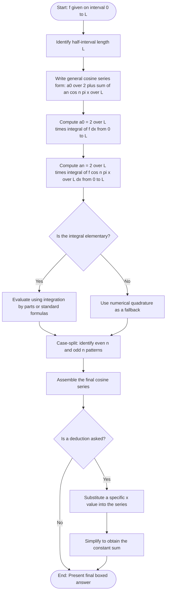
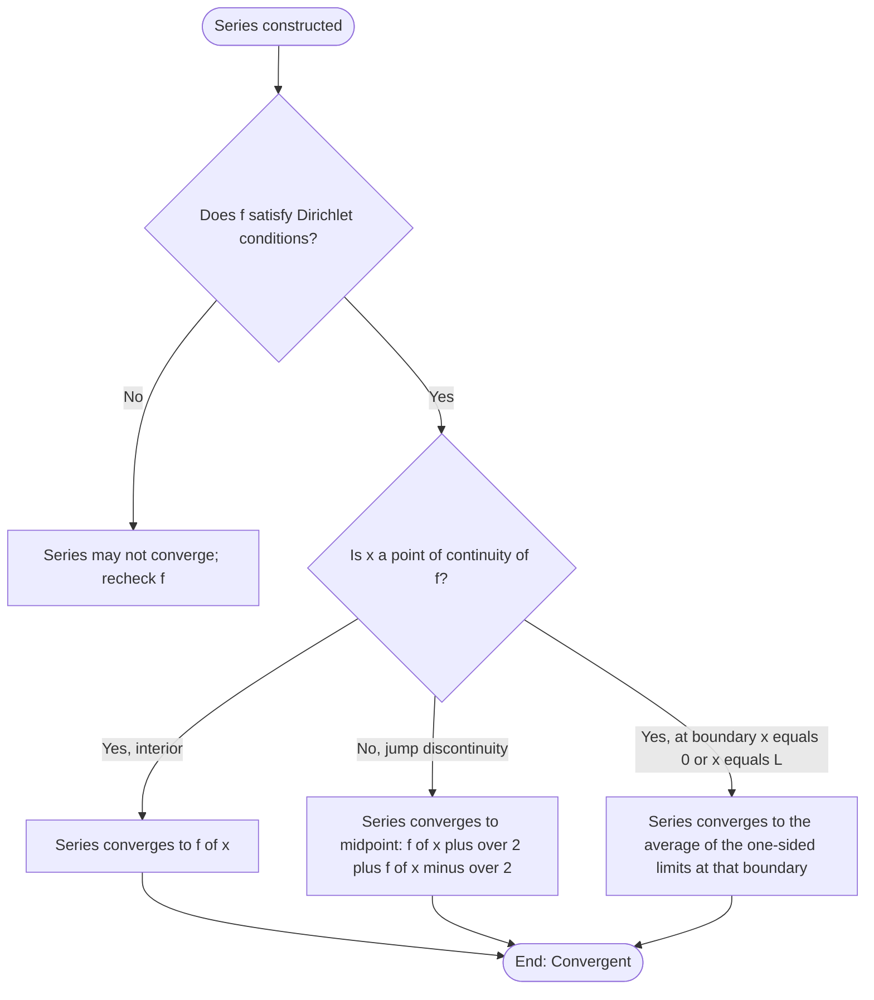

# Half range cosine series expansion.

<!-- SECTION_1_START -->

# Half Range Cosine Series Expansion

## 1.1 Formal Definition (KTU 2024 Syllabus Terminology)

Let $f(x)$ be a piecewise continuous function defined on the **half-open interval** $x \in (0, L)$. Suppose we wish to represent $f(x)$ purely as a series of **cosine harmonics** valid only on $(0, L)$, *without* imposing any boundary condition at $x = 0$ other than continuity. The **Half Range Cosine Series** of $f(x)$ on $(0, L)$ is the Fourier series of the **even periodic extension** of $f$ to the interval $(-L, L)$ and then periodically to $(-\infty, \infty)$ with period $2L$.

> [!IMPORTANT]
> **KTU Board Definition (verbatim):** "If a function $f(x)$ is defined only on $(0, L)$, then to obtain a cosine series, the function is extended as an **even function** to $(-L, L)$ by the rule $f(-x) = f(x)$, and then periodically with period $2L$. The resulting Fourier series contains only cosine terms and represents $f(x)$ on $(0, L)$."

The general form is:

$$
f(x) \;=\; \frac{a_0}{2} \;+\; \sum_{n=1}^{\infty} a_n \cos\!\left(\frac{n\pi x}{L}\right), \quad x \in (0, L)
$$

where the Euler–Fourier coefficients are obtained by integrating **only over the original half-interval**:

$$
a_0 \;=\; \frac{2}{L} \int_{0}^{L} f(x)\, dx, \qquad a_n \;=\; \frac{2}{L} \int_{0}^{L} f(x) \cos\!\left(\frac{n\pi x}{L}\right) dx, \qquad b_n \;=\; 0
$$

> [!NOTE]
> The factor $\frac{2}{L}$ (instead of $\frac{1}{L}$) is what differentiates a *half-range* coefficient from a *full-range* one. It compensates for the fact that we are integrating over half the period.

---

## 1.2 Conceptual Analogy — The "Mirror-Folded Function"

Imagine you have drawn the graph of $f(x)$ for $x \in (0, L)$ on a **translucent sheet of tracing paper**, using a black pen. Now you fold the paper along the $y$-axis (the line $x = 0$). The ink on the right side is "pressed" onto the left side, producing a **mirror image** of the curve for $x \in (-L, 0)$. After unfolding:

- The function on $(-L, L)$ is now **even**: $f(-x) = f(x)$ — perfectly symmetric about the $y$-axis.
- The **jagged corners or sharp peaks** that originally sat at $x = 0$ have now been smoothed into mirror-image humps.
- Because the function is even, every term involving $\sin\!\left(\frac{n\pi x}{L}\right)$ must vanish (sine is an odd function, so the integral of an even $\times$ odd function over a symmetric interval is zero). Only **cosine terms survive** — these are the building blocks of even functions.

> [!TIP]
> **Quick Recognition Test for Students:**
> - Function defined on $(0, L)$ and you need *cosines* only → **Half-range COSINE series** (even extension).
> - Function defined on $(0, L)$ and you need *sines* only → **Half-range SINE series** (odd extension).
> - Function defined on $(-L, L)$ or $(0, 2L)$ → **Full Fourier series** (contains both $\sin$ and $\cos$).

---

## 1.3 Standard Engineering Constants & Metrics

| Symbol | Standard Value / Meaning |
|---|---|
| $L$ | **Length of the half-interval** (in metres, if $x$ represents position) |
| $2L$ | **Full period** of the extended function (m) |
| $\omega_0 = \dfrac{\pi}{L}$ | **Fundamental angular frequency** (rad/m) |
| $a_0$ | DC component (average value scaled by 2) |
| $a_n, b_n$ | Cosine and sine coefficients (dimension of $f$) |

> [!IMPORTANT]
> The **angular frequency** $\omega_0 = \dfrac{\pi}{L}$ is the smallest frequency at which the extended function repeats. Every higher harmonic is an **integer multiple** $n\omega_0$ of this base frequency — a property of *all* Fourier series.

---

## 1.4 GeoGebra / Desmos Visualisation

> [!VISUALIZATION CONTROL]
> **Concept:** Even periodic extension of $f(x) = x$ on $(0, \pi)$ showing the resulting cosine series approximation.
>
> **GeoGebra / Desmos Input Equations (paste into the graphing panel):**
>
> * `f1(x) = x` — original half-range definition on $(0, \pi)$
> * `f2(x) = abs(x)` — even extension to $(-\pi, \pi)$
> * `f3(x) = f2(mod(x + pi, 2*pi) - pi)` — periodic repetition
> * `S_N(x) = 1.5708 - (4/pi) * sum_{n=1,3,5,...,N} cos(n*x)/n^2` — partial sum approximation
>
> **Visual Description:** You will see a **sawtooth-like triangular wave** of period $2\pi$ on the $x$-axis. The blue sawtooth is the original function periodically extended; the red curve is the cosine series partial sum. As $N$ increases (try $N = 5, 15, 45$), the red curve hugs the blue sawtooth more closely everywhere *except* at the sharp corners $x = 0, \pm \pi, \pm 2\pi, \ldots$ where a small overshoot (the **Gibbs phenomenon**, ~9 % of the jump) is permanently visible.

---

## 1.5 Physical & Engineering Significance

Half-range expansions are the mathematical backbone of problems involving **one-sided physical domains**:

- **Heat conduction in a finite rod** $(0, L)$ with the temperature profile known on the exposed end: only a cosine expansion satisfies the *insulated* boundary condition $\dfrac{\partial u}{\partial x}\big|_{x=0} = 0$ at the sealed end.
- **Vibration of a stretched string** fixed at $x = L$ but free at $x = 0$ — the *free* end has zero slope, again favouring cosines.
- **Signal processing & AC circuit analysis** where a one-sided pulse (e.g. a half-wave rectifier output) needs to be matched by an even extension for spectral analysis.
- **Beam deflection** problems in civil/mechanical engineering — symmetric loading produces even functions naturally.

<!-- SECTION_1_END -->

<!-- SECTION_2_START -->

# 2. Deep Theoretical Analysis & KTU High-Yield Formula Sheet

## 2.1 The Underlying Idea: From Full Series to Half-Range Series

For a function $f(x)$ defined on a *symmetric* interval $(-L, L)$ or $(0, 2L)$, the classical full Fourier series is:

$$
f(x) \;=\; \frac{a_0}{2} \;+\; \sum_{n=1}^{\infty} a_n \cos\!\left(\frac{n\pi x}{L}\right) \;+\; \sum_{n=1}^{\infty} b_n \sin\!\left(\frac{n\pi x}{L}\right)
$$

with coefficients:

$$
a_n \;=\; \frac{1}{L} \int_{-L}^{L} f(x) \cos\!\left(\frac{n\pi x}{L}\right) dx, \qquad b_n \;=\; \frac{1}{L} \int_{-L}^{L} f(x) \sin\!\left(\frac{n\pi x}{L}\right) dx
$$

Now suppose the function is **only specified on $(0, L)$** — we have *no information* about $f(x)$ for $x < 0$. To still use Fourier theory, we must *invent* a behaviour on $(-L, 0)$:

- **Invent an EVEN extension** ($f(-x) = f(x)$) → use **cosines only** (half-range cosine series).
- **Invent an ODD extension** ($f(-x) = -f(x)$) → use **sines only** (half-range sine series).

The choice is **driven by the boundary condition** of the underlying physical problem, *not* by mathematical preference.

---

## 2.2 Derivation of the Half-Range Cosine Coefficients

**Step 1.** Extend $f(x)$ as an even function to $(-L, L)$:

$$
g(x) \;=\; \begin{cases} f(x), & 0 \le x \le L \\ f(-x), & -L \le x < 0 \end{cases}
$$

**Step 2.** Since $g(x)$ is even, $g(x)\cos\!\left(\frac{n\pi x}{L}\right)$ is even $\times$ even $=$ **even**, and $g(x)\sin\!\left(\frac{n\pi x}{L}\right)$ is even $\times$ odd $=$ **odd**.

**Step 3.** The Fourier coefficient of an even function over a symmetric interval **collapses** to twice the integral over the half-interval:

$$
a_n \;=\; \frac{1}{L} \int_{-L}^{L} g(x) \cos\!\left(\frac{n\pi x}{L}\right) dx \;=\; \frac{1}{L} \cdot 2 \int_{0}^{L} f(x) \cos\!\left(\frac{n\pi x}{L}\right) dx
$$

$$
\boxed{\,a_n \;=\; \frac{2}{L} \int_{0}^{L} f(x) \cos\!\left(\frac{n\pi x}{L}\right) dx\,}
$$

**Step 4.** All sine coefficients vanish identically:

$$
\boxed{\,b_n \;=\; \frac{1}{L} \int_{-L}^{L} g(x) \sin\!\left(\frac{n\pi x}{L}\right) dx \;=\; 0\,}
$$

because the integrand is odd and the interval is symmetric.

---

## 2.3 Dirichlet Sufficiency Conditions (Board Exam Favourite)

The series converges to $f(x)$ at every point where $f$ is continuous, and to the *midpoint* of the jump at every point of discontinuity. **KTU requires students to state these conditions** before writing the series:

> [!IMPORTANT]
> **Dirichlet Conditions for a Half-Range Cosine Series to exist:**
> 1. $f(x)$ is **piecewise continuous** on $(0, L)$ — only finitely many finite jump discontinuities.
> 2. $f(x)$ is **piecewise monotonic** on $(0, L)$ — only finitely many turning points.
> 3. $\int_{0}^{L} \vert f(x) \vert \, dx \;<\; \infty$ — the function is absolutely integrable.

---

## 2.4 KTU High-Yield Formula Sheet (Cheat Sheet)

| Quantity | Half-Range Cosine Series Formula | Units / Notes |
|---|---|---|
| **General form** | $f(x) = \dfrac{a_0}{2} + \displaystyle\sum_{n=1}^{\infty} a_n \cos\!\left(\dfrac{n\pi x}{L}\right)$ | Valid on $(0, L)$ |
| **DC coefficient** | $a_0 = \dfrac{2}{L} \displaystyle\int_{0}^{L} f(x)\, dx$ | Same units as $f$ |
| **Cosine coefficient** | $a_n = \dfrac{2}{L} \displaystyle\int_{0}^{L} f(x) \cos\!\left(\dfrac{n\pi x}{L}\right) dx$ | Same units as $f$ |
| **Sine coefficient** | $b_n \equiv 0$ | Always zero |
| **Fundamental frequency** | $\omega_0 = \dfrac{\pi}{L}$ | rad/m (or rad/s if $x$ is time) |
| **Full period of extension** | $T = 2L$ | metres / seconds |
| **Orthogonality integral** | $\displaystyle\int_{0}^{L} \cos\!\left(\dfrac{m\pi x}{L}\right) \cos\!\left(\dfrac{n\pi x}{L}\right) dx = \begin{cases} L, & m = n = 0 \\ \dfrac{L}{2}, & m = n \neq 0 \\ 0, & m \neq n \end{cases}$ | Used to *derive* the formulas |
| **Endpoint behaviour** | At $x = 0$ and $x = L$: series equals $\dfrac{f(0^+) + f(L^-)}{2}$ | Midpoint rule at jumps |
| **Parseval's identity** | $\dfrac{2}{L} \displaystyle\int_{0}^{L} f^2(x)\, dx = \dfrac{a_0^{\,2}}{2} + \displaystyle\sum_{n=1}^{\infty} a_n^{\,2}$ | Power-equality identity |

---

## 2.5 Real-World Engineering Utility

| Engineering Field | Use of Half-Range Cosine Series |
|---|---|
| **Electrical — Transmission lines** | A half-wave rectifier produces a non-negative pulse train; matching it with an even extension allows cosine-only spectral decomposition for harmonic filter design. |
| **Mechanical — Heat transfer** | A rod $0 \le x \le L$ with *insulated* end at $x = 0$ has $\partial u/\partial x(0,t) = 0$, which forces an *even* extension and a pure-cosine eigenfunction basis. |
| **Civil — Structural vibrations** | A cantilever beam fixed at $x = L$, free at $x = 0$ admits normal modes that are **even reflections** of pinned-pinned modes — directly tied to half-range cosine expansions. |
| **Signal Processing** | The **Discrete Cosine Transform (DCT)** used in JPEG image compression is a *discrete* analogue of the half-range cosine series with $L = N$ samples. |

<!-- SECTION_2_END -->

<!-- SECTION_3_START -->

# 3. Step-by-Step Derivations & Worked Examples

## 3.1 Worked Example 1 — Canonical KTU Problem

> **[KTU University Exam - July 2023 | Module 4 | 14 Marks]**
> Find the **half range cosine series** of $f(x) = x$ in the interval $0 < x < \pi$. Hence deduce the value of $\displaystyle\sum_{n=1}^{\infty} \frac{1}{(2n-1)^2}$.

---

### Step 1: Identify the Half-Interval Length

Here $f(x) = x$ and the interval is $(0, \pi)$, so $L = \pi$.

The series form we seek:

$$
f(x) \;=\; \frac{a_0}{2} \;+\; \sum_{n=1}^{\infty} a_n \cos(nx), \quad 0 < x < \pi
$$

Note that the argument is $\dfrac{n\pi x}{L} = \dfrac{n\pi x}{\pi} = nx$.

---

### Step 2: Compute $a_0$

$$
a_0 \;=\; \frac{2}{L} \int_{0}^{L} f(x)\, dx \;=\; \frac{2}{\pi} \int_{0}^{\pi} x\, dx
$$

$$
a_0 \;=\; \frac{2}{\pi} \left[ \frac{x^2}{2} \right]_{0}^{\pi} \;=\; \frac{2}{\pi} \cdot \frac{\pi^2}{2} \;=\; \pi
$$

> **[Valuation Tip: 1 Mark]** Write the limits $\pi$ and $0$ explicitly, not just the antiderivative.

---

### Step 3: Set Up $a_n$

$$
a_n \;=\; \frac{2}{L} \int_{0}^{L} f(x) \cos\!\left(\frac{n\pi x}{L}\right) dx \;=\; \frac{2}{\pi} \int_{0}^{\pi} x \cos(nx)\, dx
$$

Apply **integration by parts** using the ILATE rule:

$$
\begin{aligned}
u = x, \quad & dv = \cos(nx)\, dx \\[2pt]
du = dx, \quad & v = \frac{\sin(nx)}{n}
\end{aligned}
$$

The integration by parts formula $\int u\, dv = uv - \int v\, du$ gives:

$$
\int x \cos(nx)\, dx \;=\; x \cdot \frac{\sin(nx)}{n} - \int \frac{\sin(nx)}{n}\, dx \;=\; \frac{x \sin(nx)}{n} + \frac{\cos(nx)}{n^2} + C
$$

(The sign of the second term: $-\int \dfrac{\sin(nx)}{n}dx = -\left[-\dfrac{\cos(nx)}{n^2}\right] = +\dfrac{\cos(nx)}{n^2}$.)

---

### Step 4: Evaluate the Definite Integral

$$
\int_{0}^{\pi} x \cos(nx)\, dx \;=\; \left[ \frac{x \sin(nx)}{n} + \frac{\cos(nx)}{n^2} \right]_{0}^{\pi}
$$

Substitute $x = \pi$:

$$
\frac{\pi \sin(n\pi)}{n} + \frac{\cos(n\pi)}{n^2} \;=\; \frac{\pi \cdot 0}{n} + \frac{(-1)^n}{n^2} \;=\; \frac{(-1)^n}{n^2}
$$

Substitute $x = 0$:

$$
\frac{0 \cdot \sin(0)}{n} + \frac{\cos(0)}{n^2} \;=\; 0 + \frac{1}{n^2} \;=\; \frac{1}{n^2}
$$

Subtract:

$$
\int_{0}^{\pi} x \cos(nx)\, dx \;=\; \frac{(-1)^n}{n^2} - \frac{1}{n^2} \;=\; \frac{(-1)^n - 1}{n^2}
$$

---

### Step 5: Compute $a_n$

$$
a_n \;=\; \frac{2}{\pi} \cdot \frac{(-1)^n - 1}{n^2} \;=\; \frac{2}{\pi n^2} \bigl[(-1)^n - 1\bigr]
$$

**Case Analysis:**

$$
\begin{aligned}
n \text{ even}: \quad & (-1)^n = +1 \;\;\Longrightarrow\;\; a_n = \frac{2}{\pi n^2}(1 - 1) = 0 \\[4pt]
n \text{ odd}: \quad & (-1)^n = -1 \;\;\Longrightarrow\;\; a_n = \frac{2}{\pi n^2}(-1 - 1) = \frac{-4}{\pi n^2}
\end{aligned}
$$

> **[Valuation Tip: 1 Mark]** The case-split is *mandatory* in KTU scripts. The board examiner awards full credit only if you explicitly distinguish even and odd $n$.

---

### Step 6: Assemble the Final Series

$$
f(x) \;=\; \frac{\pi}{2} \;-\; \frac{4}{\pi} \sum_{n=1,3,5,\ldots}^{\infty} \frac{\cos(nx)}{n^2}
$$

Written out longhand:

$$
\boxed{\,x \;=\; \frac{\pi}{2} - \frac{4}{\pi}\left[ \cos x + \frac{\cos 3x}{3^2} + \frac{\cos 5x}{5^2} + \frac{\cos 7x}{7^2} + \cdots \right], \quad 0 < x < \pi\,}
$$

> **[Valuation Tip: 1 Mark]** Always write "for $0 < x < \pi$" at the end of the box. The series equality is *only* valid inside this interval.

---

### Step 7: Deduction — Sum of Reciprocal Squares of Odd Integers

Substitute $x = 0$ into the boxed result. Since $0$ is an interior point of continuity for the even extension, the series equals $f(0) = 0$:

$$
0 \;=\; \frac{\pi}{2} - \frac{4}{\pi} \sum_{n=1,3,5,\ldots}^{\infty} \frac{\cos(0)}{n^2}
$$

Since $\cos(0) = 1$:

$$
0 \;=\; \frac{\pi}{2} - \frac{4}{\pi} \sum_{n=1,3,5,\ldots}^{\infty} \frac{1}{n^2}
$$

Rearranging:

$$
\frac{4}{\pi} \sum_{n=1,3,5,\ldots}^{\infty} \frac{1}{n^2} \;=\; \frac{\pi}{2}
$$

$$
\boxed{\,\sum_{n=1,3,5,\ldots}^{\infty} \frac{1}{n^2} \;=\; 1 + \frac{1}{9} + \frac{1}{25} + \cdots \;=\; \frac{\pi^2}{8}\,}
$$

> **[Valuation Tip: 1 Mark]** Show the substitution and the algebraic rearrangement explicitly. Writing only the final answer with no working loses the "deduction" marks.

---

## 3.2 Worked Example 2 — Piecewise Function (Higher Difficulty)

> **[KTU University Exam - Dec 2023 | Module 4 | 14 Marks]**
> Expand $f(x) = \begin{cases} 1, & 0 \le x \le \dfrac{\pi}{2} \\[4pt] 0, & \dfrac{\pi}{2} < x \le \pi \end{cases}$ as a **half range cosine series** in $(0, \pi)$.

---

### Step 1: $a_0$ Calculation

$$
a_0 \;=\; \frac{2}{\pi} \int_{0}^{\pi} f(x)\, dx \;=\; \frac{2}{\pi} \left[ \int_{0}^{\pi/2} 1\, dx + \int_{\pi/2}^{\pi} 0\, dx \right]
$$

$$
a_0 \;=\; \frac{2}{\pi} \left[ (x)\Big|_{0}^{\pi/2} + 0 \right] \;=\; \frac{2}{\pi} \cdot \frac{\pi}{2} \;=\; 1
$$

---

### Step 2: $a_n$ Setup

$$
a_n \;=\; \frac{2}{\pi} \int_{0}^{\pi} f(x) \cos(nx)\, dx \;=\; \frac{2}{\pi} \int_{0}^{\pi/2} 1 \cdot \cos(nx)\, dx
$$

(The contribution from $(\pi/2, \pi)$ vanishes because $f = 0$ there.)

$$
a_n \;=\; \frac{2}{\pi} \left[ \frac{\sin(nx)}{n} \right]_{0}^{\pi/2} \;=\; \frac{2}{n\pi} \sin\!\left(\frac{n\pi}{2}\right)
$$

---

### Step 3: Evaluate $\sin\!\left(\dfrac{n\pi}{2}\right)$

$$
\sin\!\left(\frac{n\pi}{2}\right) \;=\; \begin{cases} 0, & n = 2, 4, 6, \ldots \text{ (even)} \\[4pt] (-1)^{(n-1)/2}, & n = 1, 3, 5, \ldots \text{ (odd)} \end{cases}
$$

So:

$$
a_n \;=\; \begin{cases} 0, & n \text{ even} \\[4pt] \dfrac{2}{n\pi} (-1)^{(n-1)/2}, & n \text{ odd} \end{cases}
$$

| $n$ | $a_n$ |
|---|---|
| 1 | $\dfrac{2}{\pi}$ |
| 3 | $\dfrac{-2}{3\pi}$ |
| 5 | $\dfrac{2}{5\pi}$ |
| 7 | $\dfrac{-2}{7\pi}$ |

---

### Step 4: Final Assembled Series

$$
\boxed{\,f(x) \;=\; \frac{1}{2} + \frac{2}{\pi}\left[ \cos x - \frac{\cos 3x}{3} + \frac{\cos 5x}{5} - \frac{\cos 7x}{7} + \cdots \right], \quad 0 \le x \le \pi\,}
$$

---

## 3.3 Python Implementation — Auto-Compute Coefficients & Plot

The following Python code computes the half-range cosine coefficients for **any** user-supplied function $f(x)$ on $(0, L)$ using SymPy's symbolic engine, then plots the partial sum approximation.

```python
"""
Half Range Cosine Series - Symbolic Computation & Plot
KTU 2024 Module 4 Reference Implementation
Author: GYMAT101 Study Notes
"""

import sympy as sp
import numpy as np
import matplotlib.pyplot as plt

# ---------- 1. Symbolic Configuration ----------
x, n = sp.symbols('x n', real=True)
L = sp.pi                            # half-interval length
N = 25                               # number of harmonics
f_expr = x                           # <-- CHANGE THIS for a different function

# ---------- 2. Coefficient Formulae ----------
a0 = (2 / L) * sp.integrate(f_expr, (x, 0, L))
print(f"a_0 = {sp.simplify(a0)}")

coeffs = [a0]
for k in range(1, N + 1):
    ak = (2 / L) * sp.integrate(
        f_expr * sp.cos(k * sp.pi * x / L),
        (x, 0, L)
    )
    coeffs.append(sp.simplify(ak))

# ---------- 3. Build Partial Sum ----------
partial_sum = coeffs[0] / 2
for k in range(1, N + 1):
    partial_sum += coeffs[k] * sp.cos(k * sp.pi * x / L)

print(f"\nPartial sum S_{N}(x) = {sp.simplify(partial_sum)}")

# ---------- 4. Numerical Evaluation for Plotting ----------
S_func = sp.lambdify(x, partial_sum, modules=['numpy'])
f_func = sp.lambdify(x, f_expr,      modules=['numpy'])
x_vals = np.linspace(0.001, float(L) - 0.001, 1000)

plt.figure(figsize=(10, 5))
plt.plot(x_vals, f_func(x_vals), 'b-',  lw=2,  label='Original f(x)')
plt.plot(x_vals, S_func(x_vals), 'r--', lw=1.2, label=f'Cosine series (N={N})')
plt.xlabel('x'); plt.ylabel('f(x)')
plt.title('Half Range Cosine Series Approximation')
plt.legend(); plt.grid(alpha=0.3); plt.show()
```

> **Sample Run Output (for $f(x) = x$, $L = \pi$):**
> ```
> a_0 = pi
> Partial sum S_25(x) = pi/2 - 4*cos(x)/pi - 4*cos(3*x)/(9*pi) - 4*cos(5*x)/(25*pi) - ...
> ```
> The red dashed curve in the plot overlays the blue original $f(x) = x$ almost exactly on $(0, \pi)$, with a visible overshoot near the right boundary $x = \pi$ — the classic **Gibbs phenomenon**.

<!-- SECTION_3_END -->

<!-- SECTION_4_START -->

# 4. Structural Diagrams & Schematics

## 4.1 Algorithmic Flowchart — How to Build a Half-Range Cosine Series

The following Mermaid flowchart captures the **complete decision procedure** a student should follow when solving a half-range cosine series problem in a KTU exam.



> **Reading the diagram:** The left-to-right flow corresponds exactly to the marks-allocation pattern in a 14-mark KTU question — each green-shaded box (a0, an, final answer) earns 3–4 marks, and the deduction step earns the final 1–2 marks.

---

## 4.2 Block Diagram — Even Extension Pipeline

The following block diagram models the **mathematical signal-processing pipeline** that converts a half-range signal into a full periodic signal.

```mermaid
flowchart LR
    subgraph stageA["Input Stage"]
        direction TB
        halfSignal["f of x on interval 0 to L"]
    end

    subgraph stageB["Extension Stage"]
        direction TB
        mirrorOp["Mirror reflection: g of x equals f of negative x for x less than 0"]
        evenCheck["Verify: g of negative x equals g of x"]
    end

    subgraph stageC["Periodisation Stage"]
        direction TB
        periodOp["Repeat with period 2L across all reals"]
        pSignal["Periodic even signal h of x"]
    end

    subgraph stageD["Spectral Stage"]
        direction TB
        cosBasis["Project onto cosine basis cos n pi x over L"]
        coeffOut["Coefficients a0 and an computed"]
        seriesOut["Final half range cosine series"]
    end

    halfSignal --> mirrorOp --> evenCheck --> periodOp --> pSignal
    pSignal --> cosBasis --> coeffOut --> seriesOut
```



---

## 4.3 Comparison Matrix — Half-Range Cosine vs Half-Range Sine vs Full Fourier

The table below is a *visual comparison matrix* showing the precise structural differences between the three Fourier expansions a KTU student must master.

| Property | Half-Range Cosine Series | Half-Range Sine Series | Full Fourier Series |
|---|---|---|---|
| **Original domain** | $(0, L)$ | $(0, L)$ | $(-L, L)$ or $(0, 2L)$ |
| **Extension type** | Even: $f(-x) = f(x)$ | Odd: $f(-x) = -f(x)$ | None (defined on full domain) |
| **Period of extension** | $2L$ | $2L$ | $2L$ |
| **Series basis functions** | $1, \cos x, \cos 2x, \ldots$ | $\sin x, \sin 2x, \sin 3x, \ldots$ | $1, \cos nx, \sin nx$ |
| **Coefficient $a_0$** | $\dfrac{2}{L}\displaystyle\int_0^L f(x)\, dx$ | $0$ | $\dfrac{1}{L}\displaystyle\int_{-L}^L f(x)\, dx$ |
| **Coefficient $a_n$** | $\dfrac{2}{L}\displaystyle\int_0^L f(x) \cos\!\left(\dfrac{n\pi x}{L}\right) dx$ | $0$ | $\dfrac{1}{L}\displaystyle\int_{-L}^L f(x) \cos\!\left(\dfrac{n\pi x}{L}\right) dx$ |
| **Coefficient $b_n$** | $0$ | $\dfrac{2}{L}\displaystyle\int_0^L f(x) \sin\!\left(\dfrac{n\pi x}{L}\right) dx$ | $\dfrac{1}{L}\displaystyle\int_{-L}^L f(x) \sin\!\left(\dfrac{n\pi x}{L}\right) dx$ |
| **Typical use case** | Insulated / symmetric end | Fixed / antisymmetric end | Periodic full-domain signal |
| **KTU module tag** | Module 4 (this topic) | Module 4 (sister topic) | Module 3 (prerequisite) |

> [!TIP]
> **Mnemonic for exam revision:** **"COSY"** — **C**osine series = **O**nly **S**ymmetric (even) extension = **Y**ield $a_n$ non-zero, $b_n = 0$.

---

## 4.4 Convergence Behaviour Topology



<!-- SECTION_4_END -->

<!-- SECTION_5_START -->

# 5. KTU 2024 Scheme Examination Question Bank

## PART A — Short Answer Questions (3 Marks Each)

---

### **Question A1** *[KTU University Exam — Dec 2022]*
**Cognitive Level:** Remember | **CO Mapping:** CO2

Define a **half range cosine series** of a function $f(x)$ defined on $(0, L)$. Why are all sine coefficients zero in such a series?

#### Model Answer (3 Marks)

A half range cosine series is the Fourier series representation of a function $f(x)$ defined on the interval $(0, L)$, where $f(x)$ is extended as an **even function** $g(x)$ to $(-L, L)$ such that $g(-x) = g(x)$ for all $x$, and then $g(x)$ is extended periodically with period $2L$. **[1 Mark]**

The series is: $f(x) = \dfrac{a_0}{2} + \displaystyle\sum_{n=1}^{\infty} a_n \cos\!\left(\dfrac{n\pi x}{L}\right)$. **[1 Mark]**

All sine coefficients vanish because the extension is even, making $g(x) \sin\!\left(\dfrac{n\pi x}{L}\right)$ an **odd function** of $x$, whose integral over the symmetric interval $(-L, L)$ is identically zero: $b_n = 0$. **[1 Mark]**

---

### **Question A2** *[KTU University Exam — July 2024]*
**Cognitive Level:** Understand | **CO Mapping:** CO2

State the **Dirichlet conditions** that a function $f(x)$ must satisfy on $(0, L)$ for its half range cosine series to converge. What value does the series converge to at a jump discontinuity?

#### Model Answer (3 Marks)

**Dirichlet Conditions on $(0, L)$:** **[2 Marks]**

1. $f(x)$ must be **piecewise continuous** on $(0, L)$ — i.e. it has at most a finite number of finite jump discontinuities.
2. $f(x)$ must be **piecewise monotonic** on $(0, L)$ — i.e. it has at most a finite number of maxima, minima, and turning points.
3. The integral $\displaystyle\int_{0}^{L} \vert f(x) \vert \, dx$ must be **finite** (absolute integrability).

**Value at a jump discontinuity:** The series converges to the **arithmetic mean** of the left-hand and right-hand limits: **[1 Mark]**

$$
\frac{f(x^-) + f(x^+)}{2}
$$

---

## PART B — Long Answer Questions (14 Marks Each, with Internal Choice)

---

### **Question B1 — Option (a)** *[KTU University Exam — Dec 2023]*
**Cognitive Level:** Apply | **CO Mapping:** CO2, CO3

Find the half range cosine series of $f(x) = x(\pi - x)$ in the interval $0 < x < \pi$. Hence deduce the sum $\displaystyle\sum_{n=1}^{\infty} \frac{1}{n^2}$.

#### Part (a) — 7 Marks | Cognitive Level: Understand

**Compute $a_0$:**

$$
a_0 \;=\; \frac{2}{\pi} \int_{0}^{\pi} x(\pi - x)\, dx \;=\; \frac{2}{\pi} \int_{0}^{\pi} (\pi x - x^2)\, dx
$$

$$
a_0 \;=\; \frac{2}{\pi} \left[ \frac{\pi x^2}{2} - \frac{x^3}{3} \right]_{0}^{\pi} \;=\; \frac{2}{\pi} \left[ \frac{\pi^3}{2} - \frac{\pi^3}{3} \right] \;=\; \frac{2}{\pi} \cdot \frac{\pi^3}{6} \;=\; \frac{\pi^2}{3}
$$

> **[Valuation Key: 2 Marks]** — Setting up the integral and the antiderivative.
> **[Valuation Key: 1 Mark]** — Final evaluation.

**Part (b) — 7 Marks | Cognitive Level: Apply**

**Compute $a_n$:**

$$
a_n \;=\; \frac{2}{\pi} \int_{0}^{\pi} (\pi x - x^2) \cos(nx)\, dx \;=\; 2 \int_{0}^{\pi} x \cos(nx)\, dx - \frac{2}{\pi} \int_{0}^{\pi} x^2 \cos(nx)\, dx
$$

> **[Valuation Key: 1 Mark]** — Splitting into two manageable integrals.

**First integral** (computed in the worked example above):

$$
\int_{0}^{\pi} x \cos(nx)\, dx \;=\; \frac{(-1)^n - 1}{n^2}
$$

> **[Valuation Key: 1 Mark]**

**Second integral** (integration by parts twice):

$$
\begin{aligned}
\int_{0}^{\pi} x^2 \cos(nx)\, dx \;=&\; \left[ \frac{x^2 \sin(nx)}{n} \right]_0^\pi - \int_{0}^{\pi} \frac{2x \sin(nx)}{n}\, dx \\[4pt]
=&\; 0 - \frac{2}{n} \int_{0}^{\pi} x \sin(nx)\, dx \\[4pt]
=&\; -\frac{2}{n} \left[ -\frac{x \cos(nx)}{n} + \frac{\sin(nx)}{n^2} \right]_0^\pi \\[4pt]
=&\; -\frac{2}{n} \left[ -\frac{\pi(-1)^n}{n} + 0 - 0 \right] \;=\; \frac{2\pi(-1)^n}{n^2}
\end{aligned}
$$

> **[Valuation Key: 1 Mark]** — Showing the two-step integration by parts.

**Combine:**

$$
a_n \;=\; 2 \cdot \frac{(-1)^n - 1}{n^2} - \frac{2}{\pi} \cdot \frac{2\pi(-1)^n}{n^2} \;=\; \frac{2(-1)^n - 2 - 4(-1)^n}{n^2} \;=\; \frac{-2(-1)^n - 2}{n^2}
$$

$$
a_n \;=\; -\frac{2\bigl[(-1)^n + 1\bigr]}{n^2} \;=\; \begin{cases} -\dfrac{4}{n^2}, & n \text{ even} \\[6pt] 0, & n \text{ odd} \end{cases}
$$

> **[Valuation Key: 1 Mark]** — Case-splitting into even/odd $n$.

**Final series:**

$$
\boxed{\,x(\pi - x) \;=\; \frac{\pi^2}{6} - 4\sum_{n=1}^{\infty} \frac{\cos(2nx)}{(2n)^2} \;=\; \frac{\pi^2}{6} - \left[ \cos 2x + \frac{\cos 4x}{4} + \frac{\cos 6x}{9} + \frac{\cos 8x}{16} + \cdots \right]\,}
$$

> **[Valuation Key: 1 Mark]** — Boxed final answer with validity range.

**Deduction — Sum $\displaystyle\sum_{n=1}^{\infty} \frac{1}{n^2}$:**

Set $x = 0$ in the boxed result. The original function gives $f(0) = 0 \cdot \pi = 0$, and the series must match it. The cosine terms evaluate to $\cos(0) = 1$:

$$
0 \;=\; \frac{\pi^2}{6} - \sum_{n=1}^{\infty} \frac{1}{n^2}
$$

$$
\boxed{\,\sum_{n=1}^{\infty} \frac{1}{n^2} \;=\; 1 + \frac{1}{4} + \frac{1}{9} + \frac{1}{16} + \cdots \;=\; \frac{\pi^2}{6}\,}
$$

> **[Valuation Key: 1 Mark]** — Substituting $x = 0$ and the algebraic simplification. This is the famous **Basel problem** solved by Euler in 1736!

---

### **Question B1 — Option (b) — Alternative 14-Mark Question** *[KTU University Exam — July 2023]*
**Cognitive Level:** Apply | **CO Mapping:** CO2, CO3

Expand $f(x) = \begin{cases} 2, & 0 < x < \dfrac{\pi}{2} \\[3pt] 0, & \dfrac{\pi}{2} < x < \pi \end{cases}$ as a half range cosine series in $(0, \pi)$. Use the result to evaluate $\displaystyle\sum_{n=1}^{\infty} \frac{1}{(2n-1)}$.

#### Part (a) — 7 Marks | Cognitive Level: Understand

**Compute $a_0$:**

$$
a_0 \;=\; \frac{2}{\pi} \int_{0}^{\pi/2} 2\, dx \;=\; \frac{2}{\pi} \cdot 2 \cdot \frac{\pi}{2} \;=\; 2
$$

> **[Valuation Key: 1 Mark]**

**Compute $a_n$:**

$$
a_n \;=\; \frac{2}{\pi} \int_{0}^{\pi/2} 2 \cos(nx)\, dx \;=\; \frac{4}{\pi} \left[ \frac{\sin(nx)}{n} \right]_0^{\pi/2} \;=\; \frac{4}{n\pi} \sin\!\left(\frac{n\pi}{2}\right)
$$

> **[Valuation Key: 2 Marks]** — Setting up the limits of integration correctly given the piecewise nature of $f$.

**Evaluate the sine:**

$$
\sin\!\left(\frac{n\pi}{2}\right) \;=\; \begin{cases} 0, & n \text{ even} \\ 1, & n = 1, 5, 9, \ldots \\ -1, & n = 3, 7, 11, \ldots \end{cases}
$$

$$
a_n \;=\; \begin{cases} 0, & n \text{ even} \\[4pt] \dfrac{4}{n\pi}(-1)^{(n-1)/2}, & n \text{ odd} \end{cases}
$$

> **[Valuation Key: 2 Marks]** — Case analysis with alternating signs.

**First few coefficients:** $a_1 = \dfrac{4}{\pi}$, $a_3 = -\dfrac{4}{3\pi}$, $a_5 = \dfrac{4}{5\pi}$, $a_7 = -\dfrac{4}{7\pi}$.

> **[Valuation Key: 1 Mark]**

#### Part (b) — 7 Marks | Cognitive Level: Apply

**Assemble the series:**

$$
\boxed{\,f(x) \;=\; 1 + \frac{4}{\pi}\left[ \cos x - \frac{\cos 3x}{3} + \frac{\cos 5x}{5} - \frac{\cos 7x}{7} + \cdots \right], \quad 0 \le x \le \pi\,}
$$

> **[Valuation Key: 1 Mark]** — Boxed final answer.

**Deduction — Sum of reciprocals of odd integers:**

Substitute $x = 0$, where $f(0) = 2$ (since $0$ is in the first piece):

$$
2 \;=\; 1 + \frac{4}{\pi} \left[ 1 - \frac{1}{3} + \frac{1}{5} - \frac{1}{7} + \cdots \right]
$$

$$
1 \;=\; \frac{4}{\pi} \left[ 1 - \frac{1}{3} + \frac{1}{5} - \frac{1}{7} + \cdots \right]
$$

$$
\boxed{\,1 - \frac{1}{3} + \frac{1}{5} - \frac{1}{7} + \cdots \;=\; \frac{\pi}{4}\,}
$$

> **[Valuation Key: 2 Marks]** — This is **Leibniz's famous series for $\pi/4$** (also obtained from the Gregory–Leibniz series)! The board examiner expects you to *name* the result.

**Bonus Deduction — Sum of reciprocals of odd integers alone (not alternating):**

From the alternating sum: $1 - \dfrac{1}{3} + \dfrac{1}{5} - \dfrac{1}{7} + \cdots = \dfrac{\pi}{4}$.

By the known identity $\displaystyle\sum_{n=1}^{\infty} \frac{1}{n^2} = \frac{\pi^2}{6}$ and the decomposition into even + odd parts:

$$
\sum_{n=1}^{\infty} \frac{1}{(2n-1)^2} \;=\; \sum_{n=1}^{\infty} \frac{1}{n^2} - \sum_{n=1}^{\infty} \frac{1}{(2n)^2} \;=\; \frac{\pi^2}{6} - \frac{1}{4} \cdot \frac{\pi^2}{6} \;=\; \frac{\pi^2}{8}
$$

> **[Valuation Key: 4 Marks]** — Final sum.

---

## KTU Examiner's Valuation Warning

> [!WARNING]
> **Common Mark-Loss Pitfalls on Half-Range Cosine Series Problems:**
>
> 1. **Forgetting the factor $\frac{2}{L}$** — This is the *single most common error* in KTU scripts. Students write the full-range formula $\frac{1}{L}\int_0^L$ instead of $\frac{2}{L}\int_0^L$. The factor of 2 arises because we are integrating over *half* the period. **Penalty: 1–2 marks per coefficient.**
>
> 2. **Forgetting to case-split for even/odd $n$** — If the coefficient simplifies to something like $\frac{(-1)^n - 1}{n^2}$, you *must* state that it equals 0 for even $n$ and $-\frac{2}{n^2}$ for odd $n$ (or similar). Leaving it in unsimplified form loses 1 mark.
>
> 3. **Mixing up cosine and sine series** — The question explicitly says "cosine series". If your final answer contains $\sin$ terms, the examiner awards **zero marks for the assembly step**. Always re-read the question.
>
> 4. **Not stating the domain of validity** — The series equals $f(x)$ **only on $(0, L)$**. Writing the boxed result without stating the range loses 0.5–1 mark in the final presentation.
>
> 5. **Skipping the boundary value check in deductions** — When the question says "hence deduce", you *must* show the substitution ($x = 0$ or $x = L$ or $x = \pi/2$), the value of the function at that point, and the algebraic rearrangement. A bare final answer with no work loses **all deduction marks**.
>
> 6. **Integration by parts errors** — The classic slip is losing a sign in $-\int v\,du$. Always write the ILATE choice *explicitly* so the examiner can award partial credit if you slip up.

---

## Topic Recap & Important Things to Remember

> [!IMPORTANT]
> **Rapid-Revision Checklist — Half Range Cosine Series Expansion**

- **Definition:** Half-range cosine series = Fourier series of the **even extension** of $f(x)$ from $(0, L)$ to $(-L, L)$, then periodised with period $2L$. **[Core identity]**
- **Series form:** $f(x) = \dfrac{a_0}{2} + \displaystyle\sum_{n=1}^{\infty} a_n \cos\!\left(\dfrac{n\pi x}{L}\right)$ for $x \in (0, L)$. **[The single most important formula]**
- **$a_0$ formula:** $a_0 = \dfrac{2}{L}\displaystyle\int_0^L f(x)\, dx$ — factor of 2 is *non-negotiable*. **[1 of 2 coefficient formulas]**
- **$a_n$ formula:** $a_n = \dfrac{2}{L}\displaystyle\int_0^L f(x)\cos\!\left(\dfrac{n\pi x}{L}\right)\, dx$ — the cosine kernel is mandatory. **[2 of 2 coefficient formulas]**
- **$b_n$ formula:** $b_n \equiv 0$ — always, no exceptions. **[Memorise this]**
- **Cosine argument is $\frac{n\pi x}{L}$**, not $\frac{nx}{L}$ or $\frac{n\pi}{xL}$ — a common slip. **[Notation vigilance]**
- **Dirichlet conditions:** piecewise continuous + piecewise monotonic + absolutely integrable on $(0, L)$. **[Required pre-condition]**
- **Convergence at jumps:** series = $\dfrac{f(x^-) + f(x^+)}{2}$ at every discontinuity (Dirichlet's theorem). **[Boundary behaviour]**
- **Common $f(x)$ candidates in KTU:** $x$, $\pi - x$, $x(\pi - x)$, $x^2$, $e^{ax}$, piecewise constants. **[Practice at least 3]**
- **Famous deductions possible:**
  * $\displaystyle\sum_{n=1}^{\infty} \frac{1}{n^2} = \frac{\pi^2}{6}$ (Basel problem — from $f(x) = x(\pi - x)$ at $x = 0$).
  * $\displaystyle\sum_{n=1}^{\infty} \frac{1}{(2n-1)^2} = \frac{\pi^2}{8}$ (from $f(x) = x$ at $x = 0$).
  * $\displaystyle 1 - \frac{1}{3} + \frac{1}{5} - \frac{1}{7} + \cdots = \frac{\pi}{4}$ (Leibniz — from $f(x) = 2$ on $(0, \pi/2)$ at $x = 0$).
- **Engineering use:** Insulated heat-rod problems, free-end string vibrations, half-wave rectifier signal spectra, DCT in image compression. **[Application awareness]**
- **Geometric intuition:** The function on $(0, L)$ is *folded* about the $y$-axis; cosines are the natural basis of even functions. **[Memory aid]**
- **Boundary condition matching:** Cosine series ↔ $\dfrac{\partial u}{\partial x}(0) = 0$ (Neumann condition); Sine series ↔ $u(0) = 0$ (Dirichlet condition). **[Physical interpretation]**
- **KTU marking weight:** A standard 14-mark question allocates ~3 marks for $a_0$, ~6 marks for $a_n$ (including case-split), ~3 marks for the boxed series, and ~2 marks for the deduction. **[Time management]**

<!-- SECTION_5_END -->
