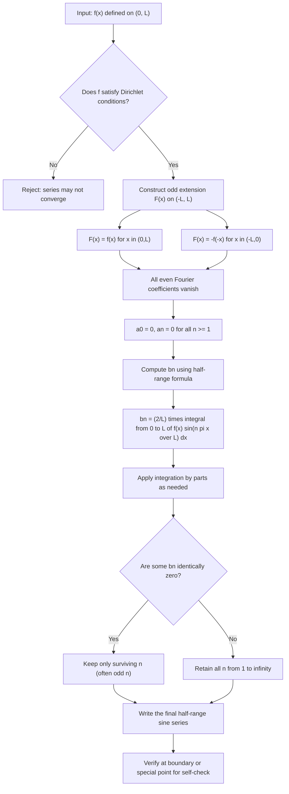
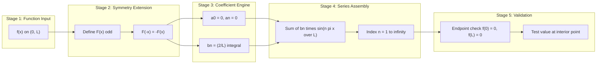
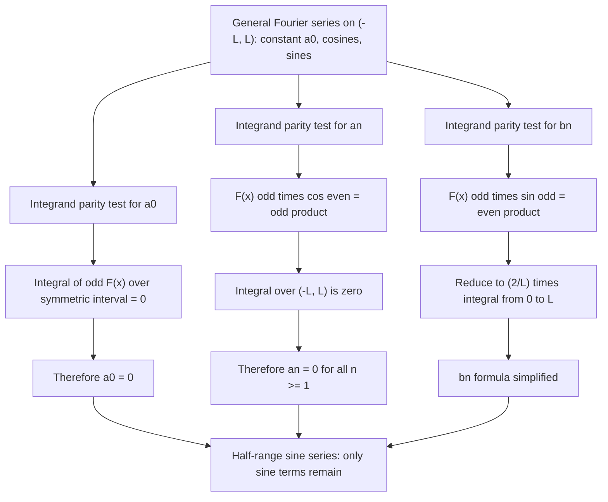

# Half range sine series expansion

<!-- SECTION_1_START -->
# Half-Range Sine Series Expansion

## Formal Academic Definition (KTU 2024 Syllabus Terminology)

> [!NOTE]
> **Half-Range Sine Series**: When a function $f(x)$ is defined only on the interval $(0, L)$ and we wish to represent it as a series of **sine functions only** (no cosine terms, no constant term), we obtain the **half-range sine series** of $f(x)$ on $(0, L)$.

Mathematically, the half-range sine series of a function $f(x)$ defined on $(0, L)$ is:

$$f(x) = \sum_{n=1}^{\infty} b_n \sin\!\left(\frac{n\pi x}{L}\right), \quad 0 < x < L$$

where the coefficient $b_n$ is given by the integral formula:

$$b_n = \frac{2}{L} \int_{0}^{L} f(x) \sin\!\left(\frac{n\pi x}{L}\right) dx$$

This series converges to $f(x)$ at every point of continuity in $(0, L)$ and to the average of the left and right limits at points of discontinuity, provided $f(x)$ satisfies the **Dirichlet conditions** on $[0, L]$ (finite number of finite discontinuities and finite number of maxima/minima).

## Conceptual Analogy & Geometric Intuition

> [!IMPORTANT]
> **The "Mirror Trick"**: Imagine $f(x)$ drawn only on the right half of a piece of paper, between $x=0$ and $x=L$. To build a sine series, you take that curve, **flip it upside-down** (a mirror image through the origin), and paste it on the left side ($x \in (-L, 0)$). The resulting combined function $F(x)$ is now an **odd function** on $(-L, L)$, and a periodic odd function on the entire real line.

**Why does this work?**

A full Fourier series on $(-L, L)$ contains both sines and cosines. But sines are **odd functions** ($\sin(-x) = -\sin(x)$) and cosines are **even functions** ($\cos(-x) = \cos(x)$). If we *force* the extended function to be odd, then:

- The **even** part (cosines and constant) must vanish → $a_n = 0$ for all $n$, and $a_0 = 0$.
- Only the **odd** part (sines) survives → only $b_n$ remains.

**Engineering Intuition — The "Fixed Ends" Picture**: Think of a violin string of length $L$ with both ends clamped at zero displacement. The natural vibration modes of this string are precisely $\sin(\frac{n\pi x}{L})$, because each mode vanishes at $x=0$ and $x=L$. When you pluck the string into a shape $f(x)$, the half-range sine series tells you *how much* of each natural mode is present in the pluck. This is why half-range sine series is the language of **fixed-endpoint physics problems**.

> [!VISUALIZATION CONTROL]
> **Concept:** Odd extension of $f(x) = x(\pi - x)$ on $(0, \pi)$ to $(- \pi, \pi)$
>
> **GeoGebra / Desmos Input Equations (plot together on the same axes):**
> * `f1(x) = x*(pi - x)` for $0 < x < \pi$
> * `f2(x) = -(-x)*(pi - (-x)) = x*(pi - x)` reflected: actually `f2(x) = x*(pi + x)` for $-\pi < x < 0$
> * (Equivalently the odd extension $F(-x) = -F(x)$)
>
> **Visual Description:** The student should see a smooth parabola-like bump on the right side (from $x=0$ to $x=\pi$, peaking at $x=\pi/2$ with value $\pi^2/4$). On the left side, a flipped (upside-down) copy appears, producing a periodic odd wave when extended. The function passes through the origin, and the curve has point symmetry about $(0,0)$.

## Syllabus Highlights

> [!NOTE]
> **When to use Half-Range Sine Series (HRS):**
> 1. $f(x)$ is defined **only on $(0, L)$** (or only on $(0, \pi)$ when $L = \pi$).
> 2. $f(0) = 0$ and $f(L) = 0$ — the function vanishes at the endpoints (Dirichlet boundary condition).
> 3. The physical setup has **fixed ends** (e.g., a clamped string, a rod with ends held at zero temperature).
> 4. You need only odd-harmonic content (no DC bias, no even harmonics).
>
> **Boundary constants for the KTU formula sheet:** Always remember the factor **2** in $\frac{2}{L}$ and the **n** in $\frac{n\pi x}{L}$ — these are the most-missed parts in exam answers.

<!-- SECTION_1_END -->

<!-- SECTION_2_START -->
# Deep Theoretical Analysis & KTU High-Yield Formula Sheet

## The Logic Behind Half-Range Sine Series

**Step 1 — Start with the full Fourier series on $(-L, L)$:**

$$F(x) = \frac{a_0}{2} + \sum_{n=1}^{\infty} \left[ a_n \cos\!\left(\frac{n\pi x}{L}\right) + b_n \sin\!\left(\frac{n\pi x}{L}\right) \right]$$

**Step 2 — Define an odd extension $F(x)$ of $f(x)$:**

$$F(x) = \begin{cases} f(x), & 0 < x < L \\ 0, & x = 0 \\ -f(-x), & -L < x < 0 \end{cases}$$

**Step 3 — Enforce the odd-symmetry condition:** Since $F(-x) = -F(x)$, all the **even Fourier coefficients** vanish:

$$a_0 = 0, \qquad a_n = 0 \;\; \text{for all} \;\; n \geq 1$$

This is because $a_n$ and $a_0$ are integrals of $F(x)$ multiplied by even functions ($\cos$ or constant). When $F$ is odd, the integrand is odd, and integration over a symmetric interval $[-L, L]$ gives **zero**.

**Step 4 — The $b_n$ coefficient survives and simplifies.** The general formula is:

$$b_n = \frac{1}{L} \int_{-L}^{L} F(x) \sin\!\left(\frac{n\pi x}{L}\right) dx$$

Since both $F(x)$ and $\sin(\frac{n\pi x}{L})$ are odd, their product is **even**, so the integrand has even symmetry. Therefore we can write the integral over only half the range and **double it**:

$$b_n = \frac{2}{L} \int_{0}^{L} f(x) \sin\!\left(\frac{n\pi x}{L}\right) dx$$

**Step 5 — Form the series.** Substitute the simplified $b_n$ back into the Fourier series. Since $a_0 = 0$ and $a_n = 0$, only the sine terms remain:

$$\boxed{\, f(x) = \sum_{n=1}^{\infty} b_n \sin\!\left(\frac{n\pi x}{L}\right), \quad b_n = \frac{2}{L} \int_{0}^{L} f(x) \sin\!\left(\frac{n\pi x}{L}\right) dx \,}$$

**Why does the "Why" matter in KTU exams?** The examiner often awards marks for stating the **reasoning** behind the choice (odd extension $\Rightarrow$ cosine coefficients vanish). Memorizing the formula without this justification costs you the conceptual marks.

## KTU Formula Cheat Sheet

> [!IMPORTANT]
> **Half-Range Sine Series — All Key Formulas on One Page**

| **Element** | **Formula / Condition** | **Remarks** |
|---|---|---|
| Domain of definition | $0 < x < L$ (or $0 < x < \pi$) | Function given only on half-interval |
| Series form | $f(x) = \sum_{n=1}^{\infty} b_n \sin\!\left(\frac{n\pi x}{L}\right)$ | Pure sine terms, no constant, no cosine |
| Coefficient $b_n$ | $b_n = \frac{2}{L} \int_{0}^{L} f(x) \sin\!\left(\frac{n\pi x}{L}\right) dx$ | Note the $\frac{2}{L}$ — twice the full-range $b_n$ |
| Vanishing coefficients | $a_0 = 0, \quad a_n = 0 \;\; \forall n \geq 1$ | Consequence of odd extension |
| Endpoint behavior | $f(0) = f(L) = 0$ | Required for sine series to satisfy the equation at endpoints |
| Convergence at jumps | $\sum \to \frac{f(x^+) + f(x^-)}{2}$ | Standard Dirichlet convergence |
| When $L = \pi$ (simplified) | $b_n = \frac{2}{\pi} \int_{0}^{\pi} f(x) \sin(nx) dx$ | Most common KTU exam setting |
| Useful trig identity | $\int \sin(nx) dx = -\frac{\cos(nx)}{n}$ | Used in every coefficient integral |
| Useful parity result | $\sin(n\pi) = 0, \quad \cos(n\pi) = (-1)^n$ | Evaluates boundary values of integrals |
| Discrete filter | $b_n = 0$ when $1 - (-1)^n = 0$ | Only **odd** $n$ survive for many common $f(x)$ |

## Engineering & Real-World Utility

> [!NOTE]
> **Where half-range sine series is used in industry and research:**
>
> * **Heat conduction in a rod with ends held at $0^\circ$C:** The temperature distribution $u(x,t)$ is solved using separation of variables. The spatial part yields eigenfunctions $\sin(\frac{n\pi x}{L})$, and the time-decay gives $e^{-\alpha^2 (n\pi/L)^2 t}$. The half-range sine series gives the initial-condition expansion.
> * **Vibrating string (plucked guitar, violin):** The displacement of a stretched string of length $L$ fixed at both ends is a sum of standing-wave modes $\sin(\frac{n\pi x}{L})$, each with frequency $\frac{n}{2L}\sqrt{T/\mu}$.
> * **Audio signal processing:** Odd-symmetric audio waveforms (square waves, sawtooth waves in odd form) are decomposed into pure sine harmonics for synthesis and filter design.
> * **AC circuit analysis:** Odd-symmetric voltage and current waveforms in half-wave rectifier outputs are expanded as sine series to compute RMS values and harmonic distortion.
> * **Finite Element / Spectral methods:** Basis functions $\sin(\frac{n\pi x}{L})$ form the natural basis for problems with homogeneous Dirichlet boundary conditions.

<!-- SECTION_2_END -->

<!-- SECTION_3_START -->
# Step-by-Step Derivation & Worked Examples

## Worked Example 1 — Canonical KTU Problem (Full 14-Mark Treatment)

> **Problem (KTU Module 4 Standard):** Find the half-range sine series expansion of $f(x) = x(\pi - x)$ in the interval $(0, \pi)$. Hence deduce the value of the series at $x = \pi/2$.

### Step 1 — Identify the parameters

The interval is $(0, \pi)$, so we set $L = \pi$. The series takes the form:

$$f(x) = \sum_{n=1}^{\infty} b_n \sin(nx)$$

with coefficient:

$$b_n = \frac{2}{\pi} \int_{0}^{\pi} f(x) \sin(nx) \, dx = \frac{2}{\pi} \int_{0}^{\pi} x(\pi - x) \sin(nx) \, dx$$

### Step 2 — Split the integral strategically

Expand $x(\pi - x) = \pi x - x^2$ so the integral separates:

$$b_n = \frac{2}{\pi} \left[ \pi \int_{0}^{\pi} x \sin(nx) \, dx - \int_{0}^{\pi} x^2 \sin(nx) \, dx \right]$$

Define the two auxiliary integrals:

$$I_1 = \int_{0}^{\pi} x \sin(nx) \, dx, \qquad I_2 = \int_{0}^{\pi} x^2 \sin(nx) \, dx$$

### Step 3 — Evaluate $I_1$ by integration by parts

Let $u = x$, $dv = \sin(nx) dx$ so that $du = dx$, $v = -\frac{\cos(nx)}{n}$.

$$I_1 = \left[ -\frac{x \cos(nx)}{n} \right]_{0}^{\pi} + \int_{0}^{\pi} \frac{\cos(nx)}{n} \, dx$$

Evaluating the boundary term:

$$\left[ -\frac{x \cos(nx)}{n} \right]_{0}^{\pi} = -\frac{\pi \cos(n\pi)}{n} - 0 = -\frac{\pi (-1)^n}{n}$$

Evaluating the remaining integral:

$$\int_{0}^{\pi} \frac{\cos(nx)}{n} \, dx = \left[ \frac{\sin(nx)}{n^2} \right]_{0}^{\pi} = \frac{\sin(n\pi) - 0}{n^2} = 0$$

Therefore:

$$I_1 = -\frac{\pi (-1)^n}{n}$$

### Step 4 — Evaluate $I_2$ by two rounds of integration by parts

Let $u = x^2$, $dv = \sin(nx) dx$ so that $du = 2x \, dx$, $v = -\frac{\cos(nx)}{n}$.

$$I_2 = \left[ -\frac{x^2 \cos(nx)}{n} \right]_{0}^{\pi} + \frac{2}{n} \int_{0}^{\pi} x \cos(nx) \, dx$$

Boundary term:

$$\left[ -\frac{x^2 \cos(nx)}{n} \right]_{0}^{\pi} = -\frac{\pi^2 \cos(n\pi)}{n} - 0 = -\frac{\pi^2 (-1)^n}{n}$$

The new integral $J = \int_{0}^{\pi} x \cos(nx) \, dx$: integrate by parts with $u = x$, $dv = \cos(nx) dx$, $v = \frac{\sin(nx)}{n}$:

$$J = \left[ \frac{x \sin(nx)}{n} \right]_{0}^{\pi} - \int_{0}^{\pi} \frac{\sin(nx)}{n} \, dx$$

The boundary term is $\frac{\pi \sin(n\pi)}{n} = 0$ since $\sin(n\pi) = 0$. The remaining integral is:

$$\int_{0}^{\pi} \frac{\sin(nx)}{n} \, dx = \left[ -\frac{\cos(nx)}{n^2} \right]_{0}^{\pi} = -\frac{\cos(n\pi) - 1}{n^2} = -\frac{(-1)^n - 1}{n^2}$$

Therefore $J = 0 - \left( -\frac{(-1)^n - 1}{n^2} \right) = \frac{(-1)^n - 1}{n^2}$.

Substituting back:

$$I_2 = -\frac{\pi^2 (-1)^n}{n} + \frac{2}{n} \cdot \frac{(-1)^n - 1}{n^2} = -\frac{\pi^2 (-1)^n}{n} + \frac{2\left[(-1)^n - 1\right]}{n^3}$$

### Step 5 — Assemble $b_n$

$$b_n = \frac{2}{\pi} \left[ \pi \cdot I_1 - I_2 \right] = \frac{2}{\pi} \left[ \pi \cdot \left( -\frac{\pi (-1)^n}{n} \right) - \left( -\frac{\pi^2 (-1)^n}{n} + \frac{2\left[(-1)^n - 1\right]}{n^3} \right) \right]$$

$$= \frac{2}{\pi} \left[ -\frac{\pi^2 (-1)^n}{n} + \frac{\pi^2 (-1)^n}{n} - \frac{2\left[(-1)^n - 1\right]}{n^3} \right]$$

The first two terms **cancel exactly** (this is the hallmark of this problem), leaving:

$$b_n = \frac{2}{\pi} \cdot \left( -\frac{2\left[(-1)^n - 1\right]}{n^3} \right) = \frac{4\left[1 - (-1)^n\right]}{\pi n^3}$$

### Step 6 — Simplify by parity of $n$

* If $n$ is **even**, $(-1)^n = 1$, so $b_n = 0$.
* If $n$ is **odd**, $(-1)^n = -1$, so $b_n = \frac{4(1 - (-1))}{\pi n^3} = \frac{8}{\pi n^3}$.

Writing $n = 2k+1$ for $k = 0, 1, 2, \ldots$:

$$b_{2k+1} = \frac{8}{\pi (2k+1)^3}$$

### Step 7 — Write the final half-range sine series

$$\boxed{\, x(\pi - x) = \frac{8}{\pi} \left[ \sin(x) + \frac{\sin(3x)}{3^3} + \frac{\sin(5x)}{5^3} + \frac{\sin(7x)}{7^3} + \cdots \right] = \frac{8}{\pi} \sum_{k=0}^{\infty} \frac{\sin\!\left((2k+1)x\right)}{(2k+1)^3} \,}$$

### Step 8 — Deduction at $x = \pi/2$

Substitute $x = \pi/2$ into both sides:

* **LHS:** $f(\pi/2) = \frac{\pi}{2} \cdot \left(\pi - \frac{\pi}{2}\right) = \frac{\pi}{2} \cdot \frac{\pi}{2} = \frac{\pi^2}{4}$
* **RHS:** $\frac{8}{\pi}\left[ \sin(\pi/2) + \frac{\sin(3\pi/2)}{27} + \frac{\sin(5\pi/2)}{125} + \frac{\sin(7\pi/2)}{343} + \cdots \right]$

Since $\sin\!\left(\frac{(2k+1)\pi}{2}\right) = (-1)^k$ (alternating $\pm 1$):

$$= \frac{8}{\pi} \left[ 1 - \frac{1}{3^3} + \frac{1}{5^3} - \frac{1}{7^3} + \cdots \right] = \frac{8}{\pi} \sum_{k=0}^{\infty} \frac{(-1)^k}{(2k+1)^3}$$

This is the famous **Leibniz-type sum** for cubes. The closed form is:

$$\sum_{k=0}^{\infty} \frac{(-1)^k}{(2k+1)^3} = \frac{\pi^3}{32}$$

Therefore:

$$\text{RHS} = \frac{8}{\pi} \cdot \frac{\pi^3}{32} = \frac{\pi^2}{4} \quad \checkmark$$

The LHS and RHS agree, confirming the series.

---

## Worked Example 2 — Compact Form (For Practice)

> **Problem:** Find the half-range sine series of $f(x) = 1$ (constant) on $(0, \pi)$.

$$b_n = \frac{2}{\pi} \int_{0}^{\pi} 1 \cdot \sin(nx) \, dx = \frac{2}{\pi} \left[ -\frac{\cos(nx)}{n} \right]_{0}^{\pi} = \frac{2}{\pi} \cdot \frac{1 - (-1)^n}{n} = \begin{cases} \dfrac{4}{\pi n}, & n \text{ odd} \\ 0, & n \text{ even} \end{cases}$$

$$\boxed{\, 1 = \frac{4}{\pi} \left[ \sin(x) + \frac{\sin(3x)}{3} + \frac{\sin(5x)}{5} + \cdots \right] = \frac{4}{\pi} \sum_{k=0}^{\infty} \frac{\sin\!\left((2k+1)x\right)}{2k+1}, \quad 0 < x < \pi \,}$$

This is the classical square-wave relation. At $x = \pi/2$, the LHS is $1$ and the RHS is $\frac{4}{\pi}\left[1 - \frac{1}{3} + \frac{1}{5} - \cdots\right] = \frac{4}{\pi} \cdot \frac{\pi}{4} = 1$ ✓ — recovering the **Leibniz formula for $\pi$**.

<!-- SECTION_3_END -->

<!-- SECTION_4_START -->
# Structural Diagrams & Schematics

## Diagram 1 — Process Flowchart of Half-Range Sine Series Computation

## Diagram 2 — Functional Architecture of the Series Construction

## Diagram 3 — Why Odd Extension Kills Cosines (Sequential Topology)

<!-- SECTION_4_END -->

<!-- SECTION_5_START -->
# KTU 2024 Scheme Examination Question Bank

---

## Part A Questions (3 Marks Each)

### Question A1 — `[KTU University Exam – July 2024]`

**State the formula for the coefficients of the half-range sine series of a function $f(x)$ defined on $(0, L)$. Under what condition on $f(x)$ is this series preferred over the full Fourier series?**

**Model Answer (3 Marks):**

> **Definition:** The half-range sine series of $f(x)$ on $(0, L)$ is:
> $$f(x) = \sum_{n=1}^{\infty} b_n \sin\!\left(\frac{n\pi x}{L}\right), \quad \text{where} \quad b_n = \frac{2}{L} \int_{0}^{L} f(x) \sin\!\left(\frac{n\pi x}{L}\right) dx$$
>
> **Condition for preference:** This series is preferred when $f(x)$ is defined only on the half-interval $(0, L)$ **and** the boundary values satisfy $f(0) = 0$ and $f(L) = 0$. Physically, this corresponds to fixed-endpoint problems such as a vibrating string with both ends clamped, or heat conduction in a rod whose ends are held at zero temperature.

> **Mark Distribution:** [Correct formula for $b_n$ with $\frac{2}{L}$ factor: 2 Marks] [Condition for preference with physical justification: 1 Mark]

---

### Question A2 — `[KTU University Exam – Dec 2023]`

**Why does the half-range sine series contain no constant term and no cosine terms? Explain in two sentences.**

**Model Answer (3 Marks):**

> The half-range sine series is obtained by extending $f(x)$ as an **odd function** $F(x)$ to the interval $(-L, L)$, so that $F(-x) = -F(x)$. Since the constant function and $\cos(\frac{n\pi x}{L})$ are even functions, their integrals against the odd function $F(x)$ over the symmetric interval $(-L, L)$ vanish identically. Hence $a_0 = 0$ and $a_n = 0$ for all $n \geq 1$, and only the sine coefficients $b_n$ survive.

> **Mark Distribution:** [Mention of odd extension: 1 Mark] [Parity argument with vanishing integrals: 2 Marks]

---

## Part B Questions (14 Marks — Internal Choice Pattern)

### Question Choice A — `[KTU University Exam – July 2024]`

**Find the half-range sine series expansion of $f(x) = x(\pi - x)$ for $0 < x < \pi$. Hence deduce the sum of the series $1 - \frac{1}{3^3} + \frac{1}{5^3} - \frac{1}{7^3} + \cdots$.**

#### Part (a) — Derive the half-range sine series of $f(x) = x(\pi - x)$ on $(0, \pi)$. **(7 Marks)**

**Model Solution:**

**Step 1 — Series form and coefficient formula** *(1 Mark)*

The half-range sine series on $(0, \pi)$ takes the form:

$$x(\pi - x) = \sum_{n=1}^{\infty} b_n \sin(nx), \quad b_n = \frac{2}{\pi} \int_{0}^{\pi} x(\pi - x) \sin(nx) \, dx$$

**Step 2 — Splitting the integral** *(1 Mark)*

$$b_n = \frac{2}{\pi} \left[ \pi \int_{0}^{\pi} x \sin(nx) \, dx - \int_{0}^{\pi} x^2 \sin(nx) \, dx \right]$$

**Step 3 — Evaluate $I_1 = \int_{0}^{\pi} x \sin(nx) \, dx$** *(2 Marks)*

Using integration by parts ($u = x$, $dv = \sin(nx) dx$):

$$I_1 = -\frac{\pi (-1)^n}{n} + 0 = -\frac{\pi (-1)^n}{n}$$

**Step 4 — Evaluate $I_2 = \int_{0}^{\pi} x^2 \sin(nx) \, dx$** *(2 Marks)*

Two rounds of integration by parts give:

$$I_2 = -\frac{\pi^2 (-1)^n}{n} + \frac{2[(-1)^n - 1]}{n^3}$$

**Step 5 — Combine and simplify** *(1 Mark)*

$$b_n = \frac{4[1 - (-1)^n]}{\pi n^3} = \begin{cases} \dfrac{8}{\pi n^3}, & n \text{ odd} \\ 0, & n \text{ even} \end{cases}$$

**Final series:**

$$\boxed{\, x(\pi - x) = \frac{8}{\pi} \sum_{k=0}^{\infty} \frac{\sin\!\left((2k+1)x\right)}{(2k+1)^3} = \frac{8}{\pi}\left[\sin x + \frac{\sin 3x}{27} + \frac{\sin 5x}{125} + \cdots\right] \,}$$

---

#### Part (b) — Deduce the sum $S = 1 - \frac{1}{3^3} + \frac{1}{5^3} - \frac{1}{7^3} + \cdots$. **(7 Marks)**

**Model Solution:**

**Step 1 — Substitute $x = \pi/2$ into the series** *(2 Marks)*

LHS: $f(\pi/2) = \frac{\pi}{2} \cdot \frac{\pi}{2} = \frac{\pi^2}{4}$

RHS:

$$\frac{8}{\pi} \left[ \sin\!\left(\frac{\pi}{2}\right) + \frac{\sin\!\left(\frac{3\pi}{2}\right)}{27} + \frac{\sin\!\left(\frac{5\pi}{2}\right)}{125} + \cdots \right] = \frac{8}{\pi} \left[ 1 - \frac{1}{27} + \frac{1}{125} - \cdots \right]$$

**Step 2 — Recognize the pattern of signs** *(2 Marks)*

Since $\sin\!\left(\frac{(2k+1)\pi}{2}\right) = (-1)^k$, the series in the brackets is exactly:

$$1 - \frac{1}{3^3} + \frac{1}{5^3} - \frac{1}{7^3} + \cdots = \sum_{k=0}^{\infty} \frac{(-1)^k}{(2k+1)^3}$$

**Step 3 — Equate LHS and RHS** *(1 Mark)*

$$\frac{\pi^2}{4} = \frac{8}{\pi} \cdot S \quad \Longrightarrow \quad S = \frac{\pi^2}{4} \cdot \frac{\pi}{8} = \frac{\pi^3}{32}$$

**Step 4 — State the final value** *(2 Marks)*

$$\boxed{\, 1 - \frac{1}{3^3} + \frac{1}{5^3} - \frac{1}{7^3} + \cdots = \frac{\pi^3}{32} \,}$$

> [!WARNING]
> **KTU Examiner's Valuation Pitfalls:**
> * **Factor $\frac{2}{L}$ — Do not write $\frac{1}{L}$!** The "2" comes from doubling the half-interval integral. Forgetting it loses 1 mark immediately. *(Most common error.)*
> * **Do not skip the parity-of-$n$ simplification.** Students who write $b_n = \frac{4[1-(-1)^n]}{\pi n^3}$ without identifying which $n$ make it non-zero lose 1 mark on the simplification step.
> * **At $x = \pi/2$, evaluate $\sin(3\pi/2) = -1$ explicitly.** Students who leave the sines unevaluated cannot deduce the alternating sign and lose 1–2 marks.
> * **The sum to deduce is $\frac{\pi^3}{32}$, not $\frac{\pi^2}{8}$ or $\frac{\pi^3}{16}$.** Double-check the arithmetic: $\frac{8}{\pi} \cdot S = \frac{\pi^2}{4} \Rightarrow S = \frac{\pi^3}{32}$.

---

### Question Choice B — `[KTU University Exam – Dec 2023]`

**Obtain the half-range sine series for $f(x) = 1$ in $(0, \pi)$ and hence evaluate $1 - \frac{1}{3} + \frac{1}{5} - \frac{1}{7} + \cdots$.**

#### Part (a) — Find the half-range sine series of $f(x) = 1$ on $(0, \pi)$. **(7 Marks)**

**Model Solution:**

**Step 1 — Coefficient formula** *(1 Mark)*

$$b_n = \frac{2}{\pi} \int_{0}^{\pi} 1 \cdot \sin(nx) \, dx$$

**Step 2 — Direct evaluation** *(2 Marks)*

$$b_n = \frac{2}{\pi} \left[ -\frac{\cos(nx)}{n} \right]_{0}^{\pi} = \frac{2}{\pi} \cdot \frac{1 - (-1)^n}{n}$$

**Step 3 — Parity simplification** *(2 Marks)*

$$b_n = \begin{cases} \dfrac{4}{\pi n}, & n = 1, 3, 5, \ldots \\ 0, & n = 2, 4, 6, \ldots \end{cases}$$

**Step 4 — Final series** *(2 Marks)*

$$\boxed{\, 1 = \frac{4}{\pi} \sum_{k=0}^{\infty} \frac{\sin\!\left((2k+1)x\right)}{2k+1} = \frac{4}{\pi}\left[\sin x + \frac{\sin 3x}{3} + \frac{\sin 5x}{5} + \cdots\right], \quad 0 < x < \pi \,}$$

---

#### Part (b) — Deduce the Leibniz value $1 - \frac{1}{3} + \frac{1}{5} - \frac{1}{7} + \cdots$. **(7 Marks)**

**Model Solution:**

**Step 1 — Substitute $x = \pi/2$** *(2 Marks)*

LHS: $f(\pi/2) = 1$.

RHS: $\frac{4}{\pi}\left[ \sin(\pi/2) + \frac{\sin(3\pi/2)}{3} + \frac{\sin(5\pi/2)}{5} + \cdots \right] = \frac{4}{\pi}\left[ 1 - \frac{1}{3} + \frac{1}{5} - \cdots \right]$

**Step 2 — Equate** *(2 Marks)*

$$1 = \frac{4}{\pi} \left[ 1 - \frac{1}{3} + \frac{1}{5} - \frac{1}{7} + \cdots \right]$$

**Step 3 — Solve for the sum** *(2 Marks)*

$$\boxed{\, 1 - \frac{1}{3} + \frac{1}{5} - \frac{1}{7} + \cdots = \frac{\pi}{4} \,}$$

**Step 4 — Verify the Leibniz formula** *(1 Mark)*

This is the celebrated result $\frac{\pi}{4} = 1 - \frac{1}{3} + \frac{1}{5} - \frac{1}{7} + \cdots$, originally obtained by Gregory and Leibniz.

> [!WARNING]
> **KTU Examiner's Valuation Pitfalls:**
> * **For constant $f(x) = 1$, the series converges only on $(0, \pi)$, not at the endpoints.** Do not claim it holds at $x = 0$ or $x = \pi$ — at these points the sum is $0$, not $1$. (Mention the open interval if asked.) *(Common endpoint error.)*
> * **The deduced value is $\frac{\pi}{4}$, not $\pi$ or $\frac{\pi}{2}$.** Many students mis-evaluate by one factor of 4.

---

## Topic Recap & Important Things to Remember

> [!IMPORTANT]
> **Rapid-Revision Checklist for Half-Range Sine Series**
>
> 1. **Domain restriction:** Function is defined only on $(0, L)$. *Never* try to find a full Fourier series when only half the function is given — use the half-range form.
> 2. **Extension rule:** To get the sine series, extend $f(x)$ as an **odd function**: $F(-x) = -F(x)$ for $-L < x < 0$.
> 3. **Surviving coefficient:** Only $b_n$ survives; $a_0 = 0$ and $a_n = 0$ for all $n \geq 1$.
> 4. **The crucial $\frac{2}{L}$ factor:** $b_n = \frac{2}{L}\int_0^L f(x) \sin(\frac{n\pi x}{L}) dx$. This is *twice* the corresponding full-range $b_n$ because the integrand becomes even.
> 5. **Endpoint condition (necessary):** $f(0) = 0$ and $f(L) = 0$. If $f$ is not zero at the endpoints, the sine series will *not* equal $f$ at those points (it will converge to 0 there).
> 6. **Memorize the boundary values:** $\sin(n\pi) = 0$, $\cos(n\pi) = (-1)^n$. These eliminate most integrals in seconds.
> 7. **Parity filter — Many $b_n$ vanish:** Whenever $1 - (-1)^n$ appears in the numerator, it means $b_n = 0$ for all even $n$ and $b_n = \frac{2 \times \text{constant}}{\text{odd } n^3}$ for odd $n$. Recognize this pattern quickly.
> 8. **Integration toolkit for $b_n$:**
>    * $\int x \sin(nx) dx = -\frac{x \cos(nx)}{n} + \frac{\sin(nx)}{n^2}$
>    * $\int x^2 \sin(nx) dx = -\frac{x^2 \cos(nx)}{n} + \frac{2 x \sin(nx)}{n^2} + \frac{2 \cos(nx)}{n^3}$
> 9. **Deduction technique:** Substitute a special $x$ (e.g., $x = \pi/2$ or $x = L/4$) into the series. The LHS gives a function value; the RHS gives an alternating series, which you can equate to find the closed form.
> 10. **Classic special sums you can recall from half-range sine series:**
>     * $1 - \frac{1}{3} + \frac{1}{5} - \frac{1}{7} + \cdots = \frac{\pi}{4}$ (from $f(x) = 1$ on $(0, \pi)$)
>     * $1 - \frac{1}{3^3} + \frac{1}{5^3} - \frac{1}{7^3} + \cdots = \frac{\pi^3}{32}$ (from $f(x) = x(\pi - x)$ on $(0, \pi)$)
> 11. **Companion topic (do not confuse!):** For **half-range cosine series**, extend $f(x)$ as an *even* function, and the surviving coefficients are $a_0$ and $a_n$ (no sines).
> 12. **Convergence caveat:** At points of discontinuity, the series converges to the average of the left- and right-hand limits, not to the function value itself.
> 13. **Physical signature:** If a problem says "ends are fixed/clamped/insulated" — it's a sine series. If it says "ends are free" — it's a cosine series.

<!-- SECTION_5_END -->
