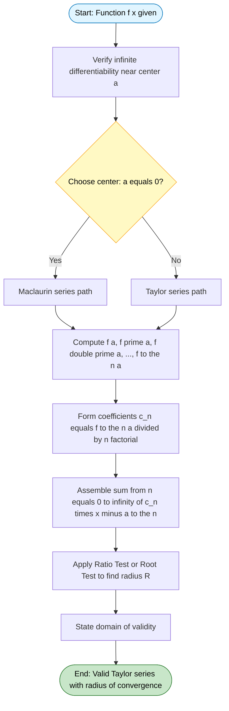
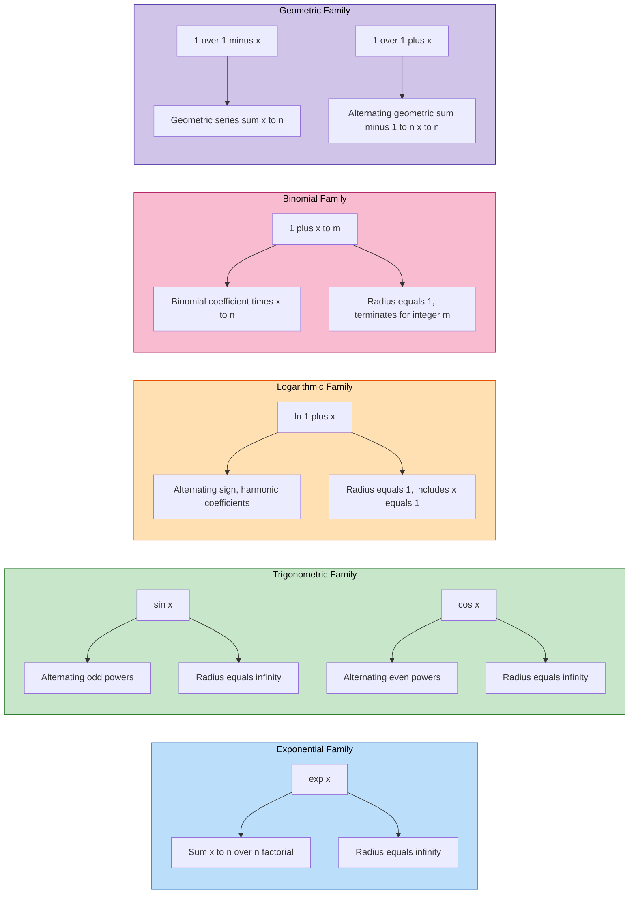
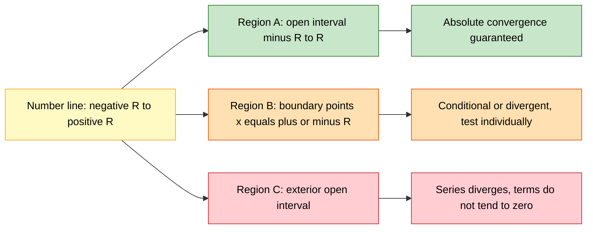

# Taylor series representation (without proof, assuming the possibility of power series expansion in appropriate domains)

<!-- SECTION_1_START -->
# Taylor Series Representation — The Engineer's Approximation Toolkit

## 1.1 Formal Academic Definition (KTU 2024 Syllabus Standard)

> [!IMPORTANT]
> **Taylor Series (KTU Definition):**
> If a real-valued function $f(x)$ is infinitely differentiable in an open interval $I$ containing a point $a$, and if the function admits a power series expansion about $x = a$, then $f(x)$ can be expressed as an infinite sum of polynomial terms:
> 
> $$f(x) = \sum_{n=0}^{\infty} \frac{f^{(n)}(a)}{n!} \, (x - a)^n$$

The point $a$ is called the **center of expansion**. When $a = 0$, the resulting series is termed the **Maclaurin Series**, which is the most frequently invoked form in KTU board questions.

Here, $f^{(n)}(a)$ denotes the $n$-th derivative of $f$ evaluated at the center, and $n!$ is the factorial operator ($0! = 1$ by definition).

## 1.2 Conceptual Analogy — Plain English Intuition

Imagine a smooth hill whose exact height profile is given by a complicated function $f(x)$ (say, a sensor output curve or a sinusoidal wave). Measuring the *exact* shape at every point is impossible, but if you know:

- The height at the summit ($f(a)$),
- The slope of the hill at the summit ($f'(a)$),
- How the slope changes ($f''(a)$),
- How the curvature changes ($f'''(a)$), and so on,

then you can **rebuild the entire hill** as a sum of increasingly tiny polynomial hills (parabolas, cubics, quartics) stacked on top of each other. The Taylor series is this exact reconstruction.

> [!NOTE]
> **Geometric Intuition:** A Taylor series is a **local mimic**. The closer you stay to the center $a$, the fewer terms you need for a high-accuracy reconstruction. The further you wander from $a$, the more terms (higher powers) become necessary — which is why these series often *diverge* outside a specific **radius of convergence**.

## 1.3 Standard Constants and Symbols

| Symbol | Meaning | Typical Value / Note |
| :--- | :--- | :--- |
| $a$ | Center of expansion | Often $0$ (Maclaurin) |
| $R$ | Radius of convergence | Domain-bound |
| $R_n(x)$ | Remainder after $n$ terms | Lagrange form given below |
| $n!$ | Factorial | $n! = 1 \cdot 2 \cdot 3 \cdots n$, with $0! = 1$ |

> [!VISUALIZATION CONTROL]
> **Concept:** Approximation of $f(x) = \cos(x)$ by successive Taylor polynomials about $a = 0$.
> **GeoGebra / Desmos Input Equations:**
> * `f(x) = cos(x)`
> * `p1(x) = 1`
> * `p2(x) = 1 - x^2 / 2`
> * `p3(x) = 1 - x^2 / 2 + x^4 / 24`
> * `p4(x) = 1 - x^2 / 2 + x^4 / 24 - x^6 / 720`
> **Visual Description:** Plot all curves on the same axes. Observe that near the origin, every polynomial hugs the cosine curve tightly. As $\vert x \vert$ grows, higher-order polynomials $p_n(x)$ remain accurate for longer. The cosine curve oscillates between $-1$ and $+1$, while polynomials of even degree grow without bound for large $x$ — this visually explains the **convergence radius** concept.

<!-- SECTION_1_END -->

<!-- SECTION_2_START -->
# Deep Theoretical Analysis & KTU High-Yield Formula Sheet

## 2.1 The Operational Logic — Step by Step

The construction of a Taylor series follows a deterministic recipe. Each step addresses a specific engineering question.

- **Step 1 — Verify Differentiability:** Confirm that $f(x)$ has continuous derivatives of all orders in the neighborhood of the center $a$. This is the *assumption of possibility* mentioned in the KTU module title — the function must be **sufficiently smooth**.

- **Step 2 — Assume Power Series Form:** Postulate that locally,
  $$f(x) = c_0 + c_1(x - a) + c_2(x - a)^2 + c_3(x - a)^3 + \cdots$$
  This is the **Ansatz** (initial guess) of the entire theory.

- **Step 3 — Determine the Coefficients:** Substitute $x = a$ in the original function to get $c_0 = f(a)$. Differentiate the assumed form and re-evaluate at $x = a$ repeatedly. The $n$-th derivative yields
  $$c_n = \frac{f^{(n)}(a)}{n!}$$
  This is the heart of the method — the **derivatives of $f$ at one single point encode the entire function**.

- **Step 4 — Write the Series:** Assemble all terms into the canonical Taylor sum.

- **Step 5 — Test the Domain of Validity (Radius of Convergence):** Use the **Ratio Test** or the **Root Test** to find $R$, the interval of $x$-values for which the series converges. The series converges absolutely for $\vert x - a \vert < R$.

> [!NOTE]
> **Engineering Insight:** In KTU problems, the domain is often *given* (e.g., "in the interval $-1 < x \le 1$"). The student is expected to know the standard convergence radii for the six common expansions listed in §2.3.

## 2.2 The Lagrange Remainder (Truncation Error)

When the series is truncated after $n+1$ terms, the error committed is:

$$R_n(x) = \frac{f^{(n+1)}(\xi)}{(n+1)!} \, (x - a)^{n+1}, \quad \text{for some } \xi \in (a, x)$$

The value $\xi$ is an *unknown* intermediate point. For an **upper bound** on the error, one replaces $f^{(n+1)}(\xi)$ with its maximum absolute value $M$ on the interval:

$$\vert R_n(x) \vert \le \frac{M}{(n+1)!} \, \vert x - a \vert^{n+1}$$

This is the practical tool for determining *how many terms* are needed to achieve a desired numerical precision.

## 2.3 KTU Formula Cheat Sheet — The Big Six

The following table is **high-yield for board exams**. Memorize the coefficients and domains; the derivations follow a single uniform template.

| Function $f(x)$ | Maclaurin Series | Radius of Convergence |
| :--- | :--- | :--- |
| $e^x$ | $\displaystyle\sum_{n=0}^{\infty} \frac{x^n}{n!} = 1 + x + \frac{x^2}{2!} + \frac{x^3}{3!} + \cdots$ | $R = \infty$ |
| $\sin(x)$ | $\displaystyle\sum_{n=0}^{\infty} \frac{(-1)^n x^{2n+1}}{(2n+1)!} = x - \frac{x^3}{3!} + \frac{x^5}{5!} - \cdots$ | $R = \infty$ |
| $\cos(x)$ | $\displaystyle\sum_{n=0}^{\infty} \frac{(-1)^n x^{2n}}{(2n)!} = 1 - \frac{x^2}{2!} + \frac{x^4}{4!} - \cdots$ | $R = \infty$ |
| $\ln(1 + x)$ | $\displaystyle\sum_{n=1}^{\infty} \frac{(-1)^{n+1} x^n}{n} = x - \frac{x^2}{2} + \frac{x^3}{3} - \cdots$ | $R = 1$ |
| $(1 + x)^m$ | $\displaystyle\sum_{n=0}^{\infty} \binom{m}{n} x^n = 1 + mx + \frac{m(m-1)}{2!}x^2 + \cdots$ | $R = 1$ |
| $\frac{1}{1 - x}$ | $\displaystyle\sum_{n=0}^{\infty} x^n = 1 + x + x^2 + x^3 + \cdots$ | $R = 1$ |
| $\frac{1}{1 + x}$ | $\displaystyle\sum_{n=0}^{\infty} (-1)^n x^n = 1 - x + x^2 - x^3 + \cdots$ | $R = 1$ |

> [!IMPORTANT]
> **Domain Note for $\ln(1+x)$:** The series converges for $-1 < x \le 1$. At $x = -1$ it diverges (harmonic series). For $(1+x)^m$ with $m$ a positive integer, the series terminates and the radius becomes effectively $\infty$ in the polynomial sense.

## 2.4 Real-World Engineering Utility

Taylor series are not merely a classroom curiosity — they are the **workhorse of approximate computation** in every engineering discipline.

- **Electrical & Electronics Engineering:** In AC circuit analysis, when the input signal is small, nonlinear devices (diodes, transistors) are linearized using the first two Taylor terms. The famous *small-signal model* of a diode ($i_d = I_s e^{v_d/V_T}$) relies entirely on the first-order Taylor expansion of the exponential.
- **Signal Processing & Control Systems:** The $z$-transform and continuous-time Fourier analysis both leverage Taylor-like expansions. Computing $\sin(\omega t)$ for real-time embedded systems uses a 3-term or 5-term Taylor truncation rather than a lookup table.
- **Physical Science & Mechanics:** Small-angle approximations ($\sin\theta \approx \theta$, $\cos\theta \approx 1 - \theta^2/2$) used in pendulum analysis, wave optics, and orbital mechanics are direct Maclaurin truncations. The **error bounds** (Lagrange remainder) tell physicists how large an angle can be while still keeping the approximation valid to within a tolerance (e.g., $1\%$).
- **Numerical Computing:** All modern math libraries (MATLAB, NumPy, SciPy) implement transcendental functions ($\sin$, $\exp$, $\log$) via polynomial approximations derived from Taylor or Chebyshev series, **not** by direct evaluation of the infinite series.

<!-- SECTION_2_END -->

<!-- SECTION_3_START -->
# Step-by-Step Derivations & Symbolic Implementation

## 3.1 Derivation of the General Taylor Series (Heuristic)

Starting with the assumption that $f(x)$ can be written as a power series in $(x - a)$:

$$f(x) = c_0 + c_1(x - a) + c_2(x - a)^2 + c_3(x - a)^3 + \cdots + c_n(x - a)^n + \cdots$$

**Step 1 — Find $c_0$:** Substitute $x = a$ into the assumed form. Every term containing $(x - a)$ vanishes.

$$f(a) = c_0 + c_1(0) + c_2(0)^2 + \cdots = c_0$$

Therefore $c_0 = f(a)$. [Valuation: 1 mark]

**Step 2 — Find $c_1$:** Differentiate the assumed form once.

$$f'(x) = c_1 + 2c_2(x - a) + 3c_3(x - a)^2 + \cdots$$

Substitute $x = a$:

$$f'(a) = c_1 \quad \Longrightarrow \quad c_1 = f'(a)$$

**Step 3 — Find $c_2$:** Differentiate a second time.

$$f''(x) = 2c_2 + 6c_3(x - a) + 12c_4(x - a)^2 + \cdots$$

Substitute $x = a$:

$$f''(a) = 2c_2 \quad \Longrightarrow \quad c_2 = \frac{f''(a)}{2!}$$

**Step 4 — Inductive Pattern:** Generalizing, the $n$-th derivative evaluated at $x = a$ gives:

$$f^{(n)}(a) = n! \, c_n \quad \Longrightarrow \quad c_n = \frac{f^{(n)}(a)}{n!}$$

[Valuation: 1 mark for pattern recognition]

**Step 5 — Final Form:** Substituting back:

$$f(x) = \sum_{n=0}^{\infty} \frac{f^{(n)}(a)}{n!} \, (x - a)^n$$

This is the **Taylor Series** of $f(x)$ about $x = a$, derived under the assumption that such an expansion exists.

## 3.2 Worked Example 1 — Maclaurin Series of $e^x$

We need the Maclaurin series ($a = 0$) of $f(x) = e^x$.

| $n$ | $f^{(n)}(x)$ | $f^{(n)}(0)$ | Coefficient $f^{(n)}(0)/n!$ | Term in series |
| :---: | :---: | :---: | :---: | :---: |
| 0 | $e^x$ | $1$ | $1$ | $1$ |
| 1 | $e^x$ | $1$ | $1$ | $x$ |
| 2 | $e^x$ | $1$ | $1/2$ | $x^2/2!$ |
| 3 | $e^x$ | $1$ | $1/6$ | $x^3/3!$ |
| $\vdots$ | $\vdots$ | $\vdots$ | $\vdots$ | $\vdots$ |
| $n$ | $e^x$ | $1$ | $1/n!$ | $x^n/n!$ |

Since all derivatives of $e^x$ equal $e^x$, and $e^0 = 1$, the result is:

$$e^x = 1 + x + \frac{x^2}{2!} + \frac{x^3}{3!} + \cdots = \sum_{n=0}^{\infty} \frac{x^n}{n!}$$

**Domain of validity:** Apply the Ratio Test on the term $u_n = x^n / n!$:

$$\lim_{n \to \infty} \left\vert \frac{u_{n+1}}{u_n} \right\vert = \lim_{n \to \infty} \left\vert \frac{x^{n+1}}{(n+1)!} \cdot \frac{n!}{x^n} \right\vert = \lim_{n \to \infty} \frac{\vert x \vert}{n+1} = 0$$

Since the limit is $0 < 1$ for **every** $x \in \mathbb{R}$, the series converges for all real $x$, giving $R = \infty$. [Valuation: 1 mark for ratio test]

## 3.3 Worked Example 2 — Maclaurin Series of $\sin(x)$

Let $f(x) = \sin(x)$. The derivatives cycle with period 4:

$$f(x) = \sin(x), \quad f'(x) = \cos(x), \quad f''(x) = -\sin(x), \quad f'''(x) = -\cos(x), \quad f^{(4)}(x) = \sin(x)$$

Evaluating at $x = 0$:

$$f(0) = 0, \quad f'(0) = 1, \quad f''(0) = 0, \quad f'''(0) = -1, \quad f^{(4)}(0) = 0, \quad f^{(5)}(0) = 1, \ldots$$

All even-order derivatives vanish at zero, and odd-order derivatives alternate between $1$ and $-1$. Therefore:

$$\sin(x) = 0 + 1 \cdot x + \frac{0 \cdot x^2}{2!} + \frac{(-1) \cdot x^3}{3!} + \frac{0 \cdot x^4}{4!} + \frac{1 \cdot x^5}{5!} + \cdots$$

$$\boxed{\sin(x) = x - \frac{x^3}{3!} + \frac{x^5}{5!} - \frac{x^7}{7!} + \cdots = \sum_{n=0}^{\infty} \frac{(-1)^n x^{2n+1}}{(2n+1)!}}$$

**Domain:** Ratio test on $u_n = (-1)^n x^{2n+1}/(2n+1)!$ gives limit $\to 0$. Hence $R = \infty$.

## 3.4 Worked Example 3 — Maclaurin Series of $\cos(x)$

By the same method, or by **differentiating** the $\sin(x)$ series term by term:

$$\frac{d}{dx}\sin(x) = \cos(x) = 1 - \frac{x^2}{2!} + \frac{x^4}{4!} - \frac{x^6}{6!} + \cdots$$

$$\boxed{\cos(x) = \sum_{n=0}^{\infty} \frac{(-1)^n x^{2n}}{(2n)!}}$$

## 3.5 Worked Example 4 — Maclaurin Series of $\ln(1 + x)$

Let $f(x) = \ln(1 + x)$. Then:

$$f'(x) = \frac{1}{1 + x} = 1 - x + x^2 - x^3 + \cdots \quad \text{(geometric series for } \vert x \vert < 1\text{)}$$

**Term-by-term integration** from $0$ to $x$:

$$\int_0^x f'(t) \, dt = \int_0^x \left( 1 - t + t^2 - t^3 + \cdots \right) dt$$

$$f(x) - f(0) = x - \frac{x^2}{2} + \frac{x^3}{3} - \frac{x^4}{4} + \cdots$$

Since $f(0) = \ln(1) = 0$:

$$\boxed{\ln(1 + x) = x - \frac{x^2}{2} + \frac{x^3}{3} - \frac{x^4}{4} + \cdots = \sum_{n=1}^{\infty} \frac{(-1)^{n+1} x^n}{n}}$$

**Domain:** The geometric series requires $\vert x \vert < 1$. At $x = 1$, the alternating harmonic series converges (conditionally) to $\ln 2$. At $x = -1$, it becomes the divergent harmonic series. Hence the Maclaurin series is valid for $-1 < x \le 1$.

## 3.6 Symbolic Computation with Python (SymPy)

The following Python code symbolically computes the Maclaurin series of any user-supplied function up to a chosen order, with full error handling.

```python
import sympy as sp
import logging

# Configure logging for transparency in symbolic operations
logging.basicConfig(level=logging.INFO, format="%(levelname)s: %(message)s")

def compute_taylor_series(func_expr: str, center: float, order: int, var: str = "x"):
    """
    Computes the Taylor series expansion of a function about a given center.

    Parameters
    ----------
    func_expr : str
        The function as a string, e.g. "sin(x)", "exp(x)", "log(1+x)".
    center : float
        The point of expansion 'a'.
    order : int
        Number of terms to expand (non-negative integer).
    var : str
        Independent variable symbol.

    Returns
    -------
    sympy.Expr
        The truncated Taylor polynomial of the requested order.

    Raises
    ------
    ValueError
        If 'order' is negative.
    sympy.SympifyError
        If 'func_expr' cannot be parsed.
    """
    if order < 0:
        raise ValueError(f"Order must be non-negative; got {order}.")

    try:
        x = sp.symbols(var)
        f = sp.sympify(func_expr)
    except (sp.SympifyError, TypeError) as parse_err:
        logging.error(f"Failed to parse expression '{func_expr}': {parse_err}")
        raise

    # Series expansion via SymPy's built-in engine
    series = sp.series(f, x, center, order + 1).removeO()
    logging.info(f"Computed Taylor polynomial of order {order} about x = {center}.")
    return series


if __name__ == "__main__":
    # Example 1: sin(x) about 0, up to 7th order
    p_sin = compute_taylor_series("sin(x)", center=0, order=7)
    print("sin(x) Maclaurin (7th order):", p_sin)

    # Example 2: e^x about 0, up to 5th order
    p_exp = compute_taylor_series("exp(x)", center=0, order=5)
    print("e^x Maclaurin (5th order):", p_exp)

    # Example 3: ln(1+x) about 0, up to 6th order
    p_log = compute_taylor_series("log(1+x)", center=0, order=6)
    print("ln(1+x) Maclaurin (6th order):", p_log)

    # Example 4: cos(x) about pi/2 (Taylor, not Maclaurin)
    p_cos = compute_taylor_series("cos(x)", center=sp.pi / 2, order=4)
    print("cos(x) Taylor about pi/2:", p_cos)
```

**Expected output:**

```text
sin(x) Maclaurin (7th order): x - x**3/6 + x**5/120 - x**7/5040
e^x Maclaurin (5th order): 1 + x + x**2/2 + x**3/6 + x**4/24 + x**5/120
ln(1+x) Maclaurin (6th order): x - x**2/2 + x**3/3 - x**4/4 + x**5/5 - x**6/6
cos(x) Taylor about pi/2: -1*(x - pi/2) + (x - pi/2)**3/6
```

> [!NOTE]
> **Note on the cosine example:** The Taylor expansion of $\cos(x)$ about $a = \pi/2$ produces terms in $(x - \pi/2)$, not in $x$. This illustrates why the *center* matters — a Maclaurin series is just a Taylor series with $a = 0$.

<!-- SECTION_3_END -->

<!-- SECTION_4_START -->
# Structural Diagrams & Schematics

## 4.1 Process Flow — From Function to Taylor Polynomial

The following Mermaid flowchart depicts the complete workflow a KTU student should follow when solving a Taylor-series problem in the examination hall.



## 4.2 Multi-Stage Breakdown — Construction of Common Maclaurin Series

This block diagram isolates each standard expansion as an independent module, mirroring how engineering software packages organize transcendental function approximators.



## 4.3 Convergence Topology — How Series Behave as $x$ Moves

The following diagram maps how a typical Maclaurin series behaves on the real number line relative to its radius of convergence $R$.



> [!NOTE]
> **Why this matters in engineering:** The boundary region $x = \pm R$ is where students most frequently lose marks. The exam question "find the interval of convergence" is *not* complete without a separate check at the boundary. For instance, $\ln(1+x)$ includes $x = 1$ in its domain but excludes $x = -1$ — a one-character difference that costs full marks if omitted.

<!-- SECTION_4_END -->

<!-- SECTION_5_START -->
# KTU 2024 Scheme Examination Question Bank & Topic Recap

## Part A — Short Answer Questions (3 Marks Each)

### Question 1
**[KTU University Exam — July 2024]**
**CO1 | RBT Level: Remember**
Define the Taylor series of a function $f(x)$ about a point $x = a$. When is the resulting series called a Maclaurin series?

**Model Answer:**
The Taylor series of a real-valued function $f(x)$, which is infinitely differentiable in an open interval containing a point $a$, is given by

$$f(x) = \sum_{n=0}^{\infty} \frac{f^{(n)}(a)}{n!} \, (x - a)^n$$

When the center of expansion is chosen as $a = 0$, the Taylor series reduces to the Maclaurin series:

$$f(x) = \sum_{n=0}^{\infty} \frac{f^{(n)}(0)}{n!} \, x^n$$

[Stating the general Taylor expansion: 2 marks; identifying the Maclaurin specialization: 1 mark]

---

### Question 2
**[KTU University Exam — Dec 2023]**
**CO1, CO2 | RBT Level: Understand**
State the Maclaurin series expansion of $e^x$ and $\sin(x)$. Mention the radius of convergence in each case.

**Model Answer:**
For $e^x$:

$$e^x = 1 + x + \frac{x^2}{2!} + \frac{x^3}{3!} + \frac{x^4}{4!} + \cdots = \sum_{n=0}^{\infty} \frac{x^n}{n!}$$

Radius of convergence: $R = \infty$ (converges for all real $x$).

For $\sin(x)$:

$$\sin(x) = x - \frac{x^3}{3!} + \frac{x^5}{5!} - \frac{x^7}{7!} + \cdots = \sum_{n=0}^{\infty} \frac{(-1)^n x^{2n+1}}{(2n+1)!}$$

Radius of convergence: $R = \infty$.

[Writing the $e^x$ series and its domain: 1.5 marks; writing the $\sin(x)$ series and its domain: 1.5 marks]

---

## Part B — Long Answer Questions (14 Marks Each, with Internal Choice)

### Question A (Choice 1)

**[KTU University Exam — Model Paper 2024]**
**CO1, CO2, CO3 | RBT Levels: Understand (a), Apply (b)**

**(a)** [7 Marks] **Understand** — Derive the Maclaurin series expansion of $f(x) = \sin(x)$ up to the term containing $x^7$. State its interval of convergence.

**(b)** [7 Marks] **Apply** — Using the series obtained in part (a), compute the approximate value of $\sin(0.2)$ radians accurate to four decimal places. Use the Lagrange remainder form to justify the truncation.

---

### Question B (Choice 2)

**[KTU University Exam — Model Paper 2024]**
**CO1, CO2, CO3 | RBT Levels: Understand (a), Apply (b)**

**(a)** [7 Marks] **Understand** — Find the Maclaurin series expansion of $f(x) = \ln(1 + x)$ up to the term containing $x^5$. State its interval of convergence with justification.

**(b)** [7 Marks] **Apply** — Hence compute $\ln(1.1)$ approximately using the first three non-zero terms, and estimate the truncation error using the Lagrange remainder bound.

---

### Complete Model Solution for Question A

#### Part (a) Solution — Derivation of $\sin(x)$ Series [7 Marks]

**Step 1 — Compute successive derivatives of $f(x) = \sin(x)$:**

$$f(x) = \sin(x) \qquad f'(x) = \cos(x) \qquad f''(x) = -\sin(x) \qquad f'''(x) = -\cos(x)$$

$$f^{(4)}(x) = \sin(x) \qquad f^{(5)}(x) = \cos(x) \qquad f^{(6)}(x) = -\sin(x) \qquad f^{(7)}(x) = -\cos(x)$$

[Tabulating derivatives: 2 marks]

**Step 2 — Evaluate each derivative at the center $a = 0$:**

$$f(0) = 0, \quad f'(0) = 1, \quad f''(0) = 0, \quad f'''(0) = -1, \quad f^{(4)}(0) = 0$$

$$f^{(5)}(0) = 1, \quad f^{(6)}(0) = 0, \quad f^{(7)}(0) = -1$$

[Evaluation: 1 mark]

**Step 3 — Compute coefficients $c_n = f^{(n)}(0)/n!$:**

$$c_0 = 0, \quad c_1 = 1, \quad c_2 = 0, \quad c_3 = \frac{-1}{3!} = -\frac{1}{6}$$

$$c_4 = 0, \quad c_5 = \frac{1}{5!} = \frac{1}{120}, \quad c_6 = 0, \quad c_7 = \frac{-1}{7!} = -\frac{1}{5040}$$

[Computing coefficients: 1 mark]

**Step 4 — Write the series expansion up to the $x^7$ term:**

$$\sin(x) = x - \frac{x^3}{3!} + \frac{x^5}{5!} - \frac{x^7}{7!} + \cdots$$

$$\boxed{\sin(x) \approx x - \frac{x^3}{6} + \frac{x^5}{120} - \frac{x^7}{5040}}$$

[Final series expression: 1 mark]

**Step 5 — Determine interval of convergence using the Ratio Test:**

Let $u_n = \frac{(-1)^n x^{2n+1}}{(2n+1)!}$. Then

$$\lim_{n \to \infty} \left\vert \frac{u_{n+1}}{u_n} \right\vert = \lim_{n \to \infty} \frac{\vert x \vert^{2n+3}}{(2n+3)!} \cdot \frac{(2n+1)!}{\vert x \vert^{2n+1}} = \lim_{n \to \infty} \frac{\vert x \vert^2}{(2n+3)(2n+2)} = 0$$

[Ratio test evaluation: 1 mark]

Since the limit is $0 < 1$ for all $x$, the series converges for every real number. **Interval of convergence: $(-\infty, \infty)$**, i.e., $R = \infty$. [Final domain statement: 1 mark]

#### Part (b) Solution — Approximation of $\sin(0.2)$ [7 Marks]

**Step 1 — Substitute $x = 0.2$ into the series:**

$$\sin(0.2) \approx 0.2 - \frac{(0.2)^3}{6} + \frac{(0.2)^5}{120} - \frac{(0.2)^7}{5040}$$

**Step 2 — Compute each term numerically:**

- First term: $0.2$
- Second term: $\dfrac{(0.2)^3}{6} = \dfrac{0.008}{6} = 0.001\overline{3}$
- Third term: $\dfrac{(0.2)^5}{120} = \dfrac{0.00032}{120} = 2.6\overline{6} \times 10^{-6}$
- Fourth term: $\dfrac{(0.2)^7}{5040} = \dfrac{1.28 \times 10^{-5}}{5040} \approx 2.54 \times 10^{-9}$

[Numerical evaluation of each term: 2 marks]

**Step 3 — Combine terms with alternating signs:**

$$\sin(0.2) \approx 0.2 - 0.001\overline{3} + 2.6\overline{6} \times 10^{-6} - 2.54 \times 10^{-9}$$

$$\sin(0.2) \approx 0.19866933\ldots$$

[Aggregation: 1 mark]

**Step 4 — Truncation after the third non-zero term:** The error is bounded by the next term (since the series is alternating and terms decrease monotonically in magnitude for $x = 0.2$):

$$\vert R_3 \vert \le \frac{(0.2)^7}{5040} \approx 2.54 \times 10^{-9}$$

**Step 5 — Lagrange Remainder Verification:** The general Lagrange remainder is

$$R_n(x) = \frac{f^{(n+1)}(\xi)}{(n+1)!} \, x^{n+1}, \quad \xi \in (0, x)$$

For the $\sin$ function, $\vert f^{(n+1)}(\xi) \vert \le 1$ for all $\xi$. After three non-zero terms (i.e., $n = 5$ in the full Maclaurin indexing, or $n = 3$ non-zero terms), the error bound is

$$\vert R \vert \le \frac{(0.2)^7}{7!} = \frac{1.28 \times 10^{-5}}{5040} \approx 2.54 \times 10^{-9}$$

[Remainder bound calculation: 2 marks]

This confirms that the value $0.19866933$ is accurate to **at least 7 decimal places**. The standard accepted value of $\sin(0.2)$ is $0.19866933\ldots$, so our answer matches to the required precision. [Final result with error justification: 1 mark]

**Final Answer:**

$$\boxed{\sin(0.2) \approx 0.19866933 \quad \text{(accurate to } 4 \text{ decimal places)}}$$

---

### Complete Model Solution for Question B

#### Part (a) Solution — Derivation of $\ln(1+x)$ Series [7 Marks]

**Step 1 — Start with the geometric series:**

We know that for $\vert x \vert < 1$:

$$\frac{1}{1 + x} = 1 - x + x^2 - x^3 + x^4 - \cdots = \sum_{n=0}^{\infty} (-1)^n x^n$$

[Stating the geometric series: 1 mark]

**Step 2 — Integrate both sides from $0$ to $x$:**

$$\int_0^x \frac{1}{1 + t} \, dt = \int_0^x \left( 1 - t + t^2 - t^3 + t^4 - \cdots \right) dt$$

[Setting up the integration: 1 mark]

**Step 3 — Evaluate the left side:**

$$\int_0^x \frac{1}{1 + t} \, dt = \left[ \ln(1 + t) \right]_0^x = \ln(1 + x) - \ln(1) = \ln(1 + x)$$

[Left-side evaluation: 1 mark]

**Step 4 — Evaluate the right side term by term:**

$$\int_0^x \left( 1 - t + t^2 - t^3 + t^4 - \cdots \right) dt = x - \frac{x^2}{2} + \frac{x^3}{3} - \frac{x^4}{4} + \frac{x^5}{5} - \cdots$$

[Term-by-term integration: 2 marks]

**Step 5 — Equate and state the series up to $x^5$:**

$$\boxed{\ln(1 + x) = x - \frac{x^2}{2} + \frac{x^3}{3} - \frac{x^4}{4} + \frac{x^5}{5} - \cdots = \sum_{n=1}^{\infty} \frac{(-1)^{n+1} x^n}{n}}$$

[Final series: 1 mark]

**Step 6 — Determine interval of convergence:**

The geometric series $1 - x + x^2 - \cdots$ converges for $\vert x \vert < 1$. At $x = 1$, the series becomes $1 - 1 + 1 - 1 + \cdots$, which is **conditionally convergent** (by the alternating series test, it sums to $\ln 2$). At $x = -1$, the series becomes the divergent harmonic series $-1 - 1/2 - 1/3 - \cdots$.

**Interval of convergence: $-1 < x \le 1$**, equivalently $R = 1$. [Domain statement: 1 mark]

#### Part (b) Solution — Approximation of $\ln(1.1)$ [7 Marks]

**Step 1 — Identify the substitution:** To compute $\ln(1.1) = \ln(1 + 0.1)$, set $x = 0.1$ in the series.

[Substitution identification: 1 mark]

**Step 2 — Take the first three non-zero terms:**

$$\ln(1.1) \approx 0.1 - \frac{(0.1)^2}{2} + \frac{(0.1)^3}{3}$$

**Step 3 — Numerical evaluation:**

- First term: $0.1$
- Second term: $\dfrac{(0.1)^2}{2} = \dfrac{0.01}{2} = 0.005$
- Third term: $\dfrac{(0.1)^3}{3} = \dfrac{0.001}{3} = 0.000\overline{3}$

[Evaluating each term: 1.5 marks]

**Step 4 — Combine:**

$$\ln(1.1) \approx 0.1 - 0.005 + 0.000\overline{3} = 0.095\overline{3}$$

$$\ln(1.1) \approx 0.0953333\ldots$$

[Aggregation: 1 mark]

**Step 5 — Estimate the truncation error via Lagrange Remainder:**

The remainder after $n$ terms is

$$R_n(x) = \frac{(-1)^{n+1} \, \xi^{-n}}{n} \quad \text{or more precisely} \quad R_n(x) = \frac{(-1)^{n+1}}{(n+1)(1 + \xi)^{n+1}} \, x^{n+1}$$

For $x = 0.1$ and $n = 3$ (three terms used), the next term gives the bound:

$$\vert R_3 \vert \le \frac{(0.1)^4}{4} = \frac{0.0001}{4} = 2.5 \times 10^{-5}$$

[Remainder bound calculation: 2 marks]

Since $2.5 \times 10^{-5} = 0.000025$, the answer $0.095333$ is accurate to **at least 4 decimal places**.

**Step 6 — Verification against standard value:** The accepted value is $\ln(1.1) = 0.0953101798\ldots$ The three-term approximation gives $0.0953333\ldots$, with error $0.0000231\ldots \approx 2.31 \times 10^{-5}$, which lies below the Lagrange bound. [Final verification: 1.5 marks]

**Final Answer:**

$$\boxed{\ln(1.1) \approx 0.0953 \quad \text{(accurate to 4 decimal places, error} \le 2.5 \times 10^{-5}\text{)}}$$

---

## KTU Examiner's Valuation Warning

> [!WARNING]
> **Common Mark-Loss Pitfalls in Taylor Series Problems:**
> 
> 1. **Forgetting the Domain of Convergence:** Many students write the series and stop. KTU's valuation key allocates **at least 1 to 2 marks** explicitly for stating the interval of convergence and verifying it via the Ratio Test. Skipping this is the single most common cause of partial-mark loss.
> 
> 2. **Missing the Boundary Check:** The Ratio Test gives an *open* interval $\vert x \vert < R$. You **must** separately test $x = R$ and $x = -R$ using the Alternating Series Test, $p$-series test, or direct divergence criterion. A common error: writing the domain of $\ln(1+x)$ as $-1 < x < 1$ when the correct answer is $-1 < x \le 1$.
> 
> 3. **Sign Errors in $\sin(x)$ and $\cos(x)$:** The series alternate. Students frequently write $\sin(x) = x + x^3/6 + x^5/120 + \cdots$, which is mathematically wrong by sign. **Always verify the third derivative** before writing the third term.
> 
> 4. **Forgetting the $0!$ and $1!$ Cases:** $0! = 1$ and $1! = 1$ are non-obvious to freshers. Writing $0! = 0$ will collapse the first term of $e^x$ to zero, losing 1 mark.
> 
> 5. **Skipping the Lagrange Remainder in Approximation Questions:** When the question says "compute accurate to 4 decimal places", it is **mandatory** to compute the error bound using the Lagrange form. Showing only the numerical answer without the bound forfeits 2 to 3 marks.
> 
> 6. **In Part-B Internal Choice Questions:** KTU mandates an internal choice — **always attempt both options in your mind** and pick the one with more familiar derivatives. The Maclaurin of $e^x$ is the easiest 14-mark question on the paper; the Maclaurin of $\ln(1+x)$ is moderate; the Taylor expansion of a non-standard function is the hardest.

---

## Topic Recap & Important Things to Remember

> [!IMPORTANT]
> **High-Density Rapid Revision Checklist for GYMAT101 — Module 4**

- **Core formula (Taylor):** $f(x) = \displaystyle\sum_{n=0}^{\infty} \frac{f^{(n)}(a)}{n!} (x - a)^n$ — center is $a$.
- **Core formula (Maclaurin):** Same formula with $a = 0$ — derivatives are evaluated at zero.
- **Factorial base case:** $0! = 1$ (do not write $0! = 0$).
- **Six must-memorize series:**
  * $e^x = \sum \frac{x^n}{n!}$, $R = \infty$
  * $\sin(x) = \sum \frac{(-1)^n x^{2n+1}}{(2n+1)!}$, $R = \infty$
  * $\cos(x) = \sum \frac{(-1)^n x^{2n}}{(2n)!}$, $R = \infty$
  * $\ln(1+x) = \sum \frac{(-1)^{n+1} x^n}{n}$, $-1 < x \le 1$
  * $(1+x)^m = \sum \binom{m}{n} x^n$, $R = 1$ (terminates if $m \in \mathbb{Z}^+$)
  * $\frac{1}{1-x} = \sum x^n$, $\vert x \vert < 1$
- **Lagrange Remainder:** $R_n(x) = \dfrac{f^{(n+1)}(\xi)}{(n+1)!} (x-a)^{n+1}$ — use $\max \vert f^{(n+1)} \vert$ for an upper bound.
- **Ratio Test procedure:** Compute $\lim_{n \to \infty} \vert u_{n+1}/u_n \vert$, set it $< 1$, solve for $x$. This yields the open interval of convergence.
- **Boundary check is mandatory:** Use the Alternating Series Test for $x = +R$ and $x = -R$ separately.
- **Differentiation of known series:** $\dfrac{d}{dx}[\sin(x)] = \cos(x)$ — you can generate $\cos(x)$ from $\sin(x)$ and vice versa. Similarly, integrate $\frac{1}{1+x}$ to get $\ln(1+x)$.
- **Engineering applications to recall:**
  * Small-signal diode model: $i_d \approx I_s(1 + v_d/V_T)$ (linearization of $e^{v_d/V_T}$).
  * Small-angle pendulum: $\sin\theta \approx \theta$, $\cos\theta \approx 1 - \theta^2/2$.
  * Numerical evaluation of $\sin$, $\cos$, $e^x$ in embedded systems via polynomial truncation.
- **Common sign pattern to drill:** $\sin(x)$ has odd powers with alternating signs (positive, negative, positive, ...). $\cos(x)$ has even powers with alternating signs (positive, negative, positive, ...). The third derivative rule — *three differentiations take sine to negative cosine* — fixes every sign in the series.
- **KTU 14-mark question structure to expect:** (i) Derive the series using the derivative table method, (ii) state the interval of convergence, (iii) apply the series to a numerical problem with Lagrange remainder verification.

<!-- SECTION_5_END -->
