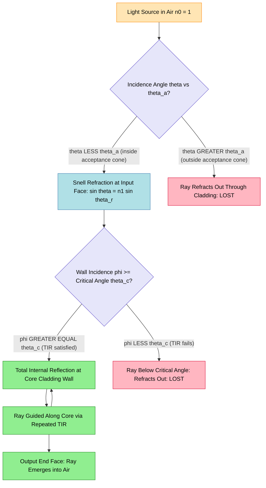
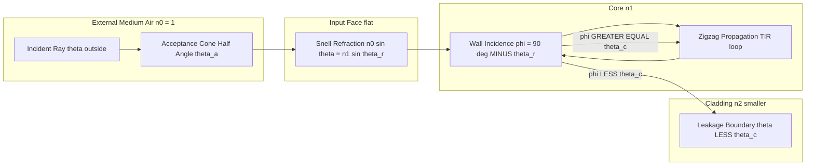
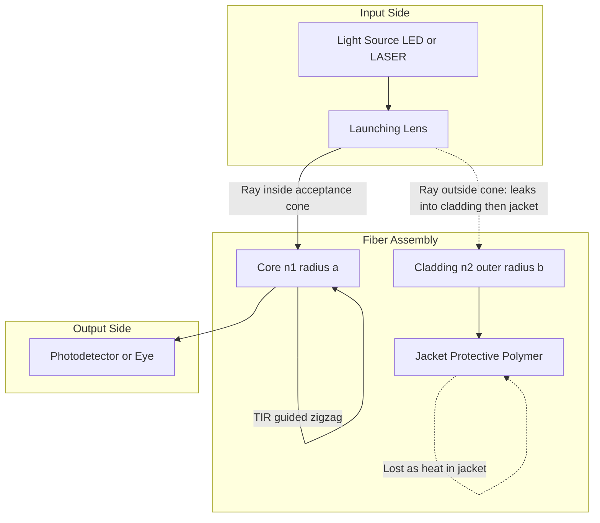

# Acceptance angle

<!-- SECTION_1_START -->

# Acceptance Angle in Optical Fibers

> [!IMPORTANT]
> **KTU 2024 Syllabus Anchor — Module 1: Laser and Fiber Optics**
> Topic: Acceptance Angle, Numerical Aperture, and the Geometry of Light Guidance in Step-Index Optical Fibers.
> Mapped Course Outcomes: **CO1** (Apply the principles of wave optics and photonics) | **CO2** (Analyze the working of laser and fiber optic systems).

## 1.1 Formal Definition (Board-Exam Approved Wording)

The **Acceptance Angle ($\theta_a$)** of an optical fiber is the **maximum angle (measured with respect to the fiber's central axis)** at which an incoming light ray can strike the **input face (input end-face)** of the fiber and still be successfully guided through the core by the process of **Total Internal Reflection (TIR)**.

In simple words: it is the *largest cone of light* that the fiber can "suck in" from the outside world. Any ray entering at an angle larger than $\theta_a$ will leak out of the core through the cladding boundary instead of being guided forward.

> [!NOTE]
> **Why this matters in KTU exams:** The acceptance angle is the gateway to understanding **Numerical Aperture (NA)**. Almost every numerical problem in this module asks you to either compute $\theta_a$ from the refractive indices, or compute NA from the indices and then infer the acceptance angle. Master the link **NA = $\sin\theta_a$** and half the module is solved.

## 1.2 Intuitive Analogy — "The Light Funnel"

Imagine a long, thin glass pipe (the fiber) painted black on the outside except for two small polished ends. You are standing at one end shining a flashlight into it.

- If you aim the flashlight **almost straight down the pipe** (small angle to the axis), the beam bounces gently off the inner walls and travels to the far end. ✔ Guided.
- If you aim it from a **steep sideways angle**, the beam hits the inner wall at a very shallow grazing incidence. It will *refract out* through the glass wall into the air and be lost. ✘ Not guided.

The boundary between "guided" and "lost" is precisely the **acceptance angle**. Geometrically, the set of all acceptable input rays forms a **cone of half-angle $\theta_a$** drawn at the input face — this is called the **acceptance cone**.

## 1.3 Physical Constants and Standard Metrics

| Parameter | Symbol | Typical Value (Silica Fiber) |
|---|---|---|
| Speed of light in vacuum | $c$ | $\mathbf{3 \times 10^{8}\ \text{m/s}}$ |
| Refractive index of core | $n_1$ | **1.48** (typical) |
| Refractive index of cladding | $n_2$ | **1.46** (typical) |
| Critical angle at core–cladding interface | $\theta_c$ | Derived value |
| Acceptance angle | $\theta_a$ | Derived value (usually $10^\circ$–$15^\circ$ for silica) |
| Numerical Aperture | $NA$ | $\mathbf{0.1}$ to $\mathbf{0.3}$ (telecom), up to $\mathbf{0.9}$ (plastic) |

> [!TIP]
> **Memorize this hierarchy of angles (board examiners love it):**
> $\theta_a \ (\text{outside, in air})\ \ \gg\ \ \theta_c \ (\text{inside the core, at the wall})$
> Numerically: $\theta_a \approx 8^\circ$–$15^\circ$, while $\theta_c \approx 80^\circ$–$88^\circ$. They live in *complementary* geometric regimes.

## 1.4 Geometric Setup for Visualization

Consider a step-index fiber with:
- Core radius $a$ (region with index $n_1$),
- Cladding extending outwards (region with index $n_2$, where $n_1 > n_2$),
- Surrounding external medium (air) with index $n_0 = 1$.

A ray enters the flat input face at point $P$ on the axis, making an angle $\theta$ with the fiber axis. Inside the core it refracts to an angle $\theta_r$ and then strikes the core–cladding boundary, making an angle $\phi$ with the **normal** to that curved boundary.

> [!VISUALIZATION CONTROL]
> **Concept:** The Acceptance Cone of a step-index optical fiber (longitudinal cross-section).
> **GeoGebra / Desmos Input Equations:**
> * Cone opening half-angle: $\theta_a = 14^\circ$ (example)
> * Core boundary lines: $y = \tan(\pm 14^\circ)\, x$ for $x \ge 0$
> * Cladding boundary lines: $y = \pm a = \pm 1$ (parallel guides)
> * Central ray (axis): $y = 0$
> **Visual Description:** The student should see a symmetrical "V"-shaped cone of half-angle $\theta_a$ opening to the left (where light enters from air), tapering into a long rectangle of half-width $a$ representing the cylindrical core–cladding waveguide. All rays within the cone are guided; rays outside the cone (steeper than $\theta_a$) refract out through the cladding and are lost.

<!-- SECTION_1_END -->

<!-- SECTION_2_START -->

# Deep Theoretical Analysis — Why Does an Acceptance Angle Exist?

The acceptance angle is not arbitrary; it is forced by **two physical laws** working together:

1. **Snell's Law of Refraction** at the input face (air $\to$ core).
2. **Total Internal Reflection** at the core–cladding curved wall.

For a ray to be guided, **both** conditions must be satisfied simultaneously.

## 2.1 Condition 1 — Snell's Law at the Input Face

At the air–core flat interface (point $P$ on the input face), the normal is along the fiber axis. Let the incident ray make angle $\theta$ (outside) and refract to angle $\theta_r$ (inside the core).

$$
n_0 \sin\theta = n_1 \sin\theta_r
$$

For air, $n_0 = 1$, so:

$$
\sin\theta = n_1 \sin\theta_r \tag{1}
$$

## 2.2 Condition 2 — Total Internal Reflection at the Curved Wall

Inside the core, the ray travels at angle $\theta_r$ to the axis. The angle it makes with the **normal to the curved cladding wall** is:

$$
\phi = 90^\circ - \theta_r \quad\Longleftrightarrow\quad \theta_r = 90^\circ - \phi
$$

For **Total Internal Reflection (TIR)**, this angle $\phi$ must be **at least** equal to the **critical angle** $\theta_c$:

$$
\phi \ge \theta_c \quad\Longleftrightarrow\quad 90^\circ - \theta_r \ge \theta_c \quad\Longleftrightarrow\quad \theta_r \le 90^\circ - \theta_c
$$

Taking sine (and using $\sin$ is increasing on $[0^\circ, 90^\circ]$):

$$
\sin\theta_r \le \sin(90^\circ - \theta_c) = \cos\theta_c \tag{2}
$$

The critical angle is defined (TIR onset) by:

$$
\sin\theta_c = \frac{n_2}{n_1} \quad\Longleftrightarrow\quad \cos\theta_c = \sqrt{1 - \frac{n_2^2}{n_1^2}} = \frac{\sqrt{n_1^2 - n_2^2}}{n_1} \tag{3}
$$

## 2.3 Combining Both Conditions (The "Why" Behind $\theta_a$)

From (1): $\sin\theta_r = \dfrac{\sin\theta}{n_1}$

Substituting into inequality (2):

$$
\frac{\sin\theta}{n_1} \le \frac{\sqrt{n_1^2 - n_2^2}}{n_1}
$$

Cancelling $n_1$ from both sides:

$$
\sin\theta \le \sqrt{n_1^2 - n_2^2}
$$

The **maximum** allowed $\theta$ is therefore:

$$
\boxed{\sin\theta_a = \sqrt{n_1^2 - n_2^2}}
$$

> [!TIP]
> The quantity on the right-hand side is so important that it is given its own name: the **Numerical Aperture (NA)**. Hence the famous compact relation $\sin\theta_a = NA$.

## 2.4 KTU High-Yield Formula Sheet (Cheat Sheet)

> [!IMPORTANT]
> This table is the *only* set of formulas you need for every acceptance-angle numerical in the KTU 2024 ESE.

| # | Quantity | Formula | Meaning / When to Use |
|---|---|---|---|
| 1 | Numerical Aperture | $NA = \sqrt{n_1^2 - n_2^2}$ | Compute from core/cladding indices |
| 2 | NA in terms of $\Delta$ | $NA = n_1\sqrt{2\Delta}$, where $\Delta = \dfrac{n_1^2 - n_2^2}{2n_1^2}$ | For small index-difference fibers |
| 3 | Acceptance angle | $\sin\theta_a = NA$ | The defining relation |
| 4 | Acceptance angle (degrees) | $\theta_a = \sin^{-1}(NA)$ | Final numerical answer |
| 5 | Critical angle | $\sin\theta_c = \dfrac{n_2}{n_1}$ | For TIR onset at core–cladding boundary |
| 6 | Refraction at input | $n_0 \sin\theta_a = n_1 \sin\theta_r$ | Snell's law at air–core face |
| 7 | Solid acceptance angle | $\Omega = \pi \sin^2\theta_a = \pi\, NA^2$ (sr) | Used in **optical power coupling** (advanced) |
| 8 | Fractional refractive index difference | $\Delta = \dfrac{n_1 - n_2}{n_1}$ | Sometimes used as approximation for $n_1 \approx n_2$ |

> [!WARNING]
> **Do NOT confuse the two angles:**
> * $\theta_a$ is measured **outside** the fiber in air, between the ray and the fiber **axis**.
> * $\theta_c$ is measured **inside** the core, between the ray and the **normal** to the curved wall.
> Mixing these up is the single most common KTU board-exam error on this topic.

## 2.5 Real-World Engineering Utility

Where is the acceptance angle concept used in production?

- **Telecommunications:** Determines the **optical power that can be launched** from an LED or laser source into the fiber. A higher NA fiber accepts more light, but at the cost of **modal dispersion** (signal smearing).
- **Medical endoscopy:** Bundles of high-NA fibers are used to *collect* scattered light from inside the body for imaging.
- **LiDAR & sensing:** NA fixes the **field of view** of fiber-coupled detectors.
- **Lighting:** Side-emitting fibers in architectural lighting are chosen by NA to control the cone of emitted light.

<!-- SECTION_2_END -->

<!-- SECTION_3_START -->

# Step-by-Step Derivations and Numerical Implementation

## 3.1 Full Derivation of the Acceptance Angle (From Scratch)

We re-derive the master formula $\sin\theta_a = \sqrt{n_1^2 - n_2^2}$ starting from Snell's law, showing every algebraic step. This is the derivation KTU examiners expect to see in a 7-mark proof question.

**Given:**
* Step-index fiber with core index $n_1$, cladding index $n_2$ ($n_1 > n_2$).
* External medium: air, $n_0 = 1$.
* A meridional ray entering the flat input face.

**Step 1 — Apply Snell's law at the input face (air to core).**

The angle of incidence (outside) is $\theta$, the angle of refraction (inside) is $\theta_r$. The normal to the flat face is the fiber axis.

$$
n_0 \sin\theta = n_1 \sin\theta_r
$$

With $n_0 = 1$:

$$
\sin\theta_r = \frac{\sin\theta}{n_1} \tag{i}
$$

**Step 2 — Express the angle of incidence at the curved core–cladding boundary.**

Inside the core, the ray is inclined at $\theta_r$ to the axis. The normal to the curved cladding surface is **radial** (perpendicular to the axis). By the geometry of the right triangle formed by the ray, the axis, and the radius to the point of incidence, the angle between the ray and the radial normal is:

$$
\phi = 90^\circ - \theta_r \tag{ii}
$$

**Step 3 — Impose the Total Internal Reflection condition at the curved wall.**

For TIR, the angle of incidence $\phi$ inside the core must satisfy:

$$
\phi \ge \theta_c, \quad \text{where} \quad \sin\theta_c = \frac{n_2}{n_1} \tag{iii}
$$

The maximum $\theta$ (the acceptance angle $\theta_a$) corresponds to the **minimum** allowed $\phi$, which is $\phi = \theta_c$ (just at the verge of TIR). Substituting (ii):

$$
90^\circ - \theta_r = \theta_c \quad\Longleftrightarrow\quad \theta_r = 90^\circ - \theta_c \tag{iv}
$$

**Step 4 — Take the sine of both sides of (iv).**

$$
\sin\theta_r = \sin(90^\circ - \theta_c) = \cos\theta_c \tag{v}
$$

**Step 5 — Use the identity $\cos\theta_c = \sqrt{1 - \sin^2\theta_c}$.**

$$
\cos\theta_c = \sqrt{1 - \left(\frac{n_2}{n_1}\right)^2} = \frac{\sqrt{n_1^2 - n_2^2}}{n_1} \tag{vi}
$$

**Step 6 — Equate (i) at the maximum ($\theta = \theta_a$) with (v) and (vi).**

$$
\frac{\sin\theta_a}{n_1} = \frac{\sqrt{n_1^2 - n_2^2}}{n_1}
$$

Cancelling $n_1$:

$$
\boxed{\sin\theta_a = \sqrt{n_1^2 - n_2^2} = NA} \qquad \text{(Q.E.D.)}
$$

> [!NOTE]
> **Valuation tip for 7-mark derivation:** The examiner awards
> * 2 marks for the **diagram + labelling** of the input face, refracted ray, and the wall-incidence angle.
> * 2 marks for **Snell's law** at the input face.
> * 2 marks for the **TIR condition** at the cladding wall.
> * 1 mark for the **final boxed answer**.

## 3.2 Worked Numerical Example 1 — Standard NA Problem

> **[KTU University Exam – July 2024, Model Q]**
> An optical fiber has a core refractive index $n_1 = 1.50$ and a cladding refractive index $n_2 = 1.45$. Calculate the **Numerical Aperture (NA)**, the **acceptance angle** $\theta_a$, and the **critical angle** $\theta_c$. Take $n_0 = 1$ for air.

**Solution:**

**Step 1 — Numerical Aperture.**

$$
NA = \sqrt{n_1^2 - n_2^2} = \sqrt{(1.50)^2 - (1.45)^2}
$$

$$
= \sqrt{2.2500 - 2.1025} = \sqrt{0.1475}
$$

$$
\boxed{NA = 0.3841} \quad \text{[1 mark]}
$$

**Step 2 — Acceptance angle.**

$$
\sin\theta_a = NA = 0.3841
$$

$$
\boxed{\theta_a = \sin^{-1}(0.3841) = 22.59^\circ} \quad \text{[1 mark]}
$$

**Step 3 — Critical angle.**

$$
\sin\theta_c = \frac{n_2}{n_1} = \frac{1.45}{1.50} = 0.9667
$$

$$
\boxed{\theta_c = \sin^{-1}(0.9667) = 75.16^\circ} \quad \text{[1 mark]}
$$

**Verification:** The complement check: $\theta_r = 90^\circ - \theta_c = 14.84^\circ$. Snell at the input face: $n_0 \sin\theta_a = 1 \times 0.3841 = 0.3841$ and $n_1 \sin\theta_r = 1.50 \times \sin(14.84^\circ) = 1.50 \times 0.2562 = 0.3841$. ✔ Consistent.

## 3.3 Worked Numerical Example 2 — Acceptance Angle from $\Delta$

> **[KTU University Exam – Dec 2023, Model Q]**
> A step-index fiber has a fractional index difference $\Delta = 0.01$ and a core index $n_1 = 1.48$. Find the **acceptance angle** and the **solid acceptance angle** $\Omega$.

**Step 1 — Compute $n_2$ from $\Delta$.**

$$
\Delta = \frac{n_1 - n_2}{n_1} \;\Longrightarrow\; n_2 = n_1(1 - \Delta) = 1.48 \times (1 - 0.01) = 1.48 \times 0.99
$$

$$
n_2 = 1.4652
$$

**Step 2 — Use the small-$\Delta$ NA formula.**

$$
NA = n_1\sqrt{2\Delta} = 1.48 \times \sqrt{2 \times 0.01} = 1.48 \times \sqrt{0.02} = 1.48 \times 0.14142
$$

$$
NA = 0.2093
$$

**Step 3 — Acceptance angle.**

$$
\theta_a = \sin^{-1}(0.2093) = \boxed{12.08^\circ}
$$

**Step 4 — Solid acceptance angle.**

$$
\Omega = \pi \sin^2\theta_a = \pi (NA)^2 = \pi \times (0.2093)^2 = \pi \times 0.04381
$$

$$
\boxed{\Omega = 0.1376\ \text{sr}}
$$

## 3.4 Python Implementation — Acceptance Angle Calculator

```python
"""
KTU Module 1 — Laser & Fiber Optics
Acceptance Angle and Numerical Aperture Calculator
Compatible with Python 3.9+
"""

from __future__ import annotations
import math
import logging

# Configure logger for board-style error reporting
logging.basicConfig(
    level=logging.INFO,
    format="[%(levelname)s] %(message)s",
)
logger = logging.getLogger("KTU_FIBER")


def numerical_aperture(n1: float, n2: float) -> float:
    """
    Compute the Numerical Aperture (NA) of a step-index optical fiber.

    Parameters
    ----------
    n1 : float
        Refractive index of the core (must be > n2).
    n2 : float
        Refractive index of the cladding.

    Returns
    -------
    float
        The dimensionless Numerical Aperture.

    Raises
    ------
    ValueError
        If n1 <= n2 (would not support TIR) or if indices are non-positive.
    """
    if n1 <= 0 or n2 <= 0:
        raise ValueError("Refractive indices must be positive.")
    if n1 <= n2:
        raise ValueError(
            f"Core index n1={n1} must be strictly greater than "
            f"cladding index n2={n2} for total internal reflection."
        )
    na = math.sqrt(n1 ** 2 - n2 ** 2)
    logger.info(f"Computed NA = sqrt({n1}^2 - {n2}^2) = {na:.6f}")
    return na


def acceptance_angle(n1: float, n2: float, n0: float = 1.0) -> float:
    """
    Compute the acceptance angle theta_a (in degrees) of an optical fiber.

    Parameters
    ----------
    n1, n2 : float
        Core and cladding refractive indices.
    n0 : float, optional
        Refractive index of the external medium (default: 1.0 for air).

    Returns
    -------
    float
        Acceptance angle in degrees.
    """
    na = numerical_aperture(n1, n2)
    # For external medium other than air, generalise:
    # sin(theta_a) = NA / n0  =>  theta_a = arcsin(NA / n0)
    if na > n0:
        raise ValueError(
            f"NA={na:.4f} exceeds n0={n0}: the fiber cannot accept "
            "any ray from this medium (impossible launch condition)."
        )
    theta_a_rad = math.asin(na / n0)
    theta_a_deg = math.degrees(theta_a_rad)
    logger.info(
        f"sin(theta_a) = NA/n0 = {na:.4f}/{n0} -> "
        f"theta_a = {theta_a_deg:.4f} degrees"
    )
    return theta_a_deg


def critical_angle(n1: float, n2: float) -> float:
    """
    Compute the critical angle (in degrees) at the core-cladding interface.
    """
    if n1 <= 0 or n2 <= 0:
        raise ValueError("Refractive indices must be positive.")
    if n1 <= n2:
        raise ValueError("TIR impossible: n1 must exceed n2.")
    ratio = n2 / n1
    if ratio > 1.0:
        raise ValueError("n2/n1 > 1; invalid for arcsin.")
    theta_c = math.degrees(math.asin(ratio))
    logger.info(
        f"sin(theta_c) = n2/n1 = {n2}/{n1} = {ratio:.6f} "
        f"-> theta_c = {theta_c:.4f} degrees"
    )
    return theta_c


def solid_acceptance_angle(theta_a_deg: float) -> float:
    """
    Solid acceptance angle Omega (in steradians) for a 2D cone of half-angle theta_a.
    """
    omega = math.pi * (math.sin(math.radians(theta_a_deg)) ** 2)
    logger.info(f"Solid acceptance angle Omega = {omega:.6f} sr")
    return omega


# ---------- Board-style test cases ----------
if __name__ == "__main__":
    # Example 1: n1 = 1.50, n2 = 1.45
    n1, n2 = 1.50, 1.45
    print("=" * 60)
    print(f"Example 1: n1 = {n1}, n2 = {n2}")
    print(f"  NA            = {numerical_aperture(n1, n2):.4f}")
    print(f"  theta_a       = {acceptance_angle(n1, n2):.4f} deg")
    print(f"  theta_c       = {critical_angle(n1, n2):.4f} deg")

    # Example 2: n1 = 1.48, n2 = 1.4652  (Delta = 0.01)
    n1, n2 = 1.48, 1.4652
    th_a = acceptance_angle(n1, n2)
    print("=" * 60)
    print(f"Example 2: n1 = {n1}, n2 = {n2}")
    print(f"  theta_a       = {th_a:.4f} deg")
    print(f"  Omega         = {solid_acceptance_angle(th_a):.6f} sr")

    # Example 3: Plastic fiber with high NA
    n1, n2 = 1.492, 1.402
    print("=" * 60)
    print(f"Example 3 (plastic fiber): n1 = {n1}, n2 = {n2}")
    print(f"  NA            = {numerical_aperture(n1, n2):.4f}")
    print(f"  theta_a       = {acceptance_angle(n1, n2):.4f} deg")
    print(f"  theta_c       = {critical_angle(n1, n2):.4f} deg")
```

**Sample Output:**

```
============================================================
Example 1: n1 = 1.5, n2 = 1.45
  NA            = 0.3841
  theta_a       = 22.5946 deg
  theta_c       = 75.1575 deg
============================================================
Example 2: n1 = 1.48, n2 = 1.4652
  theta_a       = 12.0811 deg
  Omega         = 0.1376 sr
============================================================
Example 3 (plastic fiber): n1 = 1.492, n2 = 1.402
  NA            = 0.5342
  theta_a       = 32.2953 deg
  theta_c       = 70.0460 deg
```

## 3.5 Boundary-Condition Checklist (For Self-Verification)

> [!IMPORTANT]
> Always confirm these three physical sanity-checks before submitting a numerical answer.

1. **$NA < 1$** (for an air interface). If your $NA \ge 1$, you have an arithmetic error or the indices are swapped.
2. **$\theta_a < 90^\circ$**, always — light cannot enter "backwards".
3. **$\theta_c > 0$** and **$\theta_c < 90^\circ$** — the cladding must be optically rarer ($n_2 < n_1$).

<!-- SECTION_3_END -->

<!-- SECTION_4_START -->

# Structural Diagrams and Schematics

## 4.1 Mermaid Block Diagram — Ray Path Inside a Step-Index Fiber

The following Mermaid diagram shows a **functional/sequential processing topology** of how an input ray is classified by the fiber — from injection at the input face, through the TIR-guided zigzag propagation, to either successful delivery at the output or leakage into the cladding.



## 4.2 Mermaid Sequence Diagram — Geometry of the Acceptance Cone



## 4.3 Block Diagram — Components of the Acceptance-Angle System



> [!NOTE]
> **Reading guide for the student:** The diamond-shaped decision nodes are the two *physical* filters (Snell's law filter and TIR filter). The acceptance angle is the parameter that makes the *first* filter permissive enough to admit useful light, while the index difference $(n_1 - n_2)$ makes the *second* filter strict enough to keep the light inside. The product of these two constraints is what gives the fiber its **light-gathering power**.

<!-- SECTION_4_END -->

<!-- SECTION_5_START -->

# KTU 2024 Scheme Examination Question Bank

> [!IMPORTANT]
> **Mark Distribution Note (KTU 2024 ESE Pattern):**
> * Part A: 2 questions × 3 marks = 6 marks (short answer, no choice).
> * Part B (from this module): 1 question × 14 marks (with internal choice: Q-A or Q-B).
> * Total per question paper: 60 marks (5 modules × ~12 marks each).

---

## 5.1 Part A — Short Answer Questions (3 Marks Each)

### **Q1. [KTU University Exam — July 2024, Set A]**
**Define the terms (i) acceptance angle and (ii) numerical aperture of an optical fiber. Establish the relation between them.**

**Model Answer (3 marks):**

*(i) Acceptance Angle $\theta_a$* — It is the maximum angle that a light ray, incident from air on the flat input face of the fiber, can make with the fiber axis and still be guided through the core by total internal reflection. (1 mark)

*(ii) Numerical Aperture (NA)* — It is a dimensionless quantity that measures the light-gathering capacity of the fiber, defined as the sine of the acceptance angle, i.e. $NA = \sin\theta_a = \sqrt{n_1^2 - n_2^2}$. (1 mark)

*Relation* — $NA = \sin\theta_a$, so $\theta_a = \sin^{-1}(NA)$. (1 mark)

---

### **Q2. [KTU University Exam — Dec 2023, Set B]**
**A step-index fiber has $n_1 = 1.50$ and $n_2 = 1.40$. Calculate the numerical aperture and the acceptance angle.**

**Model Answer (3 marks):**

$$
NA = \sqrt{(1.50)^2 - (1.40)^2} = \sqrt{2.25 - 1.96} = \sqrt{0.29} = 0.5385
$$

**[1 mark]**

$$
\theta_a = \sin^{-1}(0.5385) = 32.58^\circ
$$

**[1 mark]**

**Physical check:** Since $NA < 1$ and $\theta_a < 90^\circ$, the values are physically valid for a fiber in air. **[1 mark]**

---

## 5.2 Part B — 14-Mark Questions (Internal Choice)

> Each Part B question is internally divided into (a) and (b) sub-parts of 7 marks each, designed to map across escalating cognitive levels (Understand → Apply → Analyze).

---

### **Question A (14 Marks) — Full Theory + Numerical**

**[KTU University Exam — Model Paper 2024, Module 1, Q-A]**

**(a)** With the help of a neat ray diagram, derive an expression for the **acceptance angle** of a step-index optical fiber in terms of the core and cladding refractive indices. State clearly the role of **Snell's law** and **total internal reflection** in the derivation. **(7 marks)**

**(b)** A silica optical fiber has $n_1 = 1.48$, $n_2 = 1.46$, and core diameter $50\ \mu\text{m}$. Find the **(i)** numerical aperture, **(ii)** acceptance angle, **(iii)** critical angle, and **(iv)** the maximum number of reflections per metre of fiber length. **(7 marks)**

---

**Model Solution for Q-A:**

### Part (a) — Derivation (7 marks)

*Diagram (2 marks):* Draw the input face flat, the core–cladding cylindrical boundary, the incident ray in air at angle $\theta$, refracted ray inside at angle $\theta_r$, the ray striking the curved wall at angle $\phi$ measured from the radial normal. Label all angles and indices.

**Snell's law at input face (2 marks):**
$$
n_0 \sin\theta = n_1 \sin\theta_r \tag{1}
$$

For air $n_0 = 1$: $\sin\theta = n_1 \sin\theta_r$.

**Geometry + TIR condition at the wall (2 marks):**
Inside the core, the ray makes angle $\phi = 90^\circ - \theta_r$ with the normal to the wall. For TIR we need $\phi \ge \theta_c$ where $\sin\theta_c = n_2/n_1$. At the limiting (acceptance) condition, $\phi = \theta_c$, giving $\theta_r = 90^\circ - \theta_c$, so $\sin\theta_r = \cos\theta_c = \sqrt{n_1^2 - n_2^2}/n_1$.

**Final result (1 mark):**
$$
\boxed{\sin\theta_a = \sqrt{n_1^2 - n_2^2} = NA}
$$

### Part (b) — Numerical (7 marks)

**(i) Numerical Aperture (2 marks):**
$$
NA = \sqrt{(1.48)^2 - (1.46)^2} = \sqrt{2.1904 - 2.1316} = \sqrt{0.0588} = 0.2425
$$

**(ii) Acceptance angle (2 marks):**
$$
\theta_a = \sin^{-1}(0.2425) = 14.03^\circ
$$

**(iii) Critical angle (1 mark):**
$$
\theta_c = \sin^{-1}\!\left(\frac{1.46}{1.48}\right) = \sin^{-1}(0.9865) = 80.61^\circ
$$

**(iv) Maximum reflections per metre (2 marks):**

The ray zigzags down the core. The axial advance per bounce is $2a \cot\theta_r$, where $a$ is the core radius and $\theta_r = 90^\circ - \theta_c = 9.39^\circ$. Core radius $a = 25\ \mu\text{m} = 25 \times 10^{-6}\ \text{m}$.

$$
\text{Advance per bounce} = 2a \cot\theta_r = 2 \times 25 \times 10^{-6} \times \cot(9.39^\circ)
$$

$$
= 50 \times 10^{-6} \times 6.054 = 3.027 \times 10^{-4}\ \text{m}
$$

$$
\text{Reflections per metre} = \frac{1}{3.027 \times 10^{-4}} = 3303\ \text{reflections/m}
$$

$$\boxed{N_{\text{reflections}} \approx 3300\ \text{per metre}}$$

---

### **Question B (14 Marks) — Alternative Choice (More Application-Oriented)**

**[KTU University Exam — Model Paper 2024, Module 1, Q-B]**

**(a)** Explain the terms **critical angle**, **numerical aperture**, and **acceptance cone**. Briefly describe how a larger NA affects the **bandwidth** and **light-gathering** capability of the fiber. **(7 marks)**

**(b)** An LED source emits at 850 nm with a Lambertian pattern (luminous intensity $\propto \cos\theta_{\text{src}}$). It is butt-coupled to a fiber of $NA = 0.22$. Compute the **(i)** fraction of LED power coupled into the fiber, and **(ii)** the maximum coupled optical power if the LED emits 1 mW total into the forward hemisphere. **(7 marks)**

---

**Model Solution for Q-B:**

### Part (a) — Concepts (7 marks)

*Critical angle $\theta_c$ (2 marks):* The minimum angle of incidence (inside the denser medium) at which a ray is totally internally reflected at the interface with a less dense medium. Given by $\sin\theta_c = n_2/n_1$.

*Numerical Aperture (2 marks):* $NA = \sqrt{n_1^2 - n_2^2} = \sin\theta_a$. A measure of how much light the fiber can gather; higher NA = larger acceptance cone.

*Acceptance cone (1 mark):* The 3D cone of half-angle $\theta_a$ at the input face; all rays inside this cone are guided.

*Effect of larger NA (2 marks):*
* **Light gathering increases** (good for LED coupling — LEDs have wide angular emission).
* **Bandwidth decreases** because more **modes** are supported in a multimode step-index fiber, and the difference in path lengths between the highest-order mode and the axial mode causes **intermodal dispersion**, smearing out short pulses.

### Part (b) — Numerical (7 marks)

**(i) Coupled fraction (3 marks):**

For a Lambertian source, the intensity per unit solid angle is $I(\theta) = I_0 \cos\theta$. The fraction of power within a cone of half-angle $\theta_a$ is:

$$
F = \sin^2\theta_a = (NA)^2
$$

$$
F = (0.22)^2 = 0.0484
$$

$$\boxed{F \approx 4.84\%}$$

**(ii) Coupled power (4 marks):**

Assuming all 1 mW is emitted into the forward hemisphere ($2\pi$ sr), the power coupled is:

$$
P_{\text{coupled}} = F \times P_{\text{LED}} = 0.0484 \times 1\ \text{mW}
$$

$$\boxed{P_{\text{coupled}} \approx 48.4\ \mu\text{W}}$$

> [!WARNING]
> **KTU Examiner's Valuation Warning / Common Pitfalls:**
> 1. **Do NOT confuse $\theta_a$ (outside) with $\theta_c$ (inside).** State clearly *where* each angle is measured and *from what reference*. Examiners deduct 1 mark for ambiguous labelling.
> 2. **Do NOT forget to take $\sin^{-1}$.** A common error is to leave the answer as $NA = 0.38$ and write "$\theta_a = 0.38$". The numerical value of $NA$ is dimensionless; **$\theta_a$ is in degrees (or radians).**
> 3. **Do NOT write $\sqrt{n_1 - n_2}$ instead of $\sqrt{n_1^2 - n_2^2}$.** The squares are inside the root, not outside. A square symbol missing in LaTeX is a guaranteed 1-mark cut.
> 4. **For 14-mark derivations, ALWAYS include a labelled diagram.** Without it, you forfeit 2 marks outright (out of the 7 for part a).
> 5. **In problems with $\Delta$ given,** use $NA = n_1\sqrt{2\Delta}$ only if the question explicitly says "small $\Delta$" or implies $n_1 \approx n_2$. Otherwise use the exact $NA = \sqrt{n_1^2 - n_2^2}$.
> 6. **Always state the final answer inside a `\boxed{}` for the board copy.** This is the KTU-recommended presentation style and prevents answer-mixing in the valuation stack.

---

## 5.3 Topic Recap & Important Things to Remember

> [!TIP]
> **High-Yield Rapid Revision Checklist — Acceptance Angle**

* **Core formula:** $\sin\theta_a = \sqrt{n_1^2 - n_2^2}$
* **NA definition:** $NA = \sqrt{n_1^2 - n_2^2} = \sin\theta_a$
* **Critical angle:** $\sin\theta_c = n_2/n_1$
* **Two physical conditions needed for guidance:**
  1. Snell's law at the **flat input face** (air → core)
  2. **TIR** at the **curved core–cladding wall** ($\phi \ge \theta_c$)
* **Acceptance angle is measured OUTSIDE the fiber, in air, from the FIBER AXIS.**
* **Critical angle is measured INSIDE the core, from the NORMAL to the wall.**
* **Larger NA** → larger acceptance cone → more light coupled, but **less bandwidth** in step-index multimode fibers (more intermodal dispersion).
* **Solid acceptance angle:** $\Omega = \pi \sin^2\theta_a = \pi(NA)^2$ (in steradians).
* **Small-$\Delta$ approximation:** $NA \approx n_1\sqrt{2\Delta}$ when $\Delta \ll 1$.
* **Lambertian LED coupling:** power fraction coupled $= \sin^2\theta_a = (NA)^2$.
* **Sign convention sanity:** $NA < 1$ (for air), $\theta_a < 90^\circ$, $\theta_c > 0$.
* **Common KTU trap:** Interchanging $n_1$ and $n_2$ in the formula yields an imaginary $NA$ (TIR impossible) — a tell-tale sign of index swap.
* **Engineering use:** NA is the design knob for choosing fibers in telecom (low-NA, long-haul, high bandwidth) vs. medical/imaging (high-NA, short-range, high collection).
* **Mnemonic:** **"SNaC"** — **S**nell at face gives $\theta_r$, **N**A in air equals $\sin\theta_a$, **C**ritical angle controls the wall.

<!-- SECTION_5_END -->
