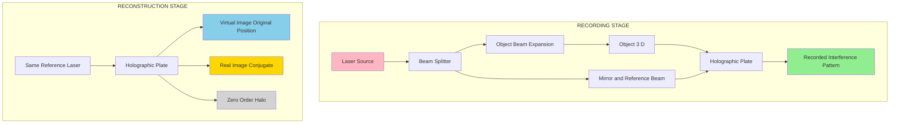
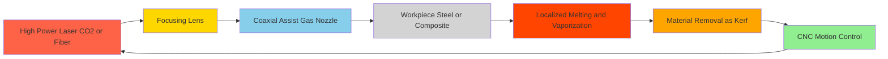
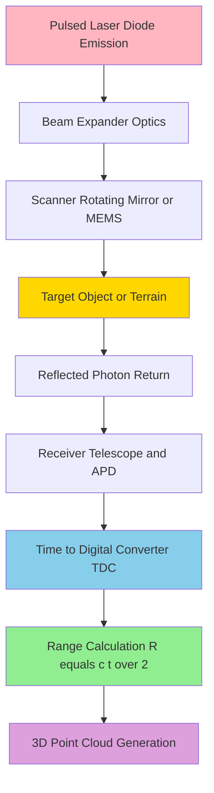

# Applications of laser

<!-- SECTION_1_START -->

# Applications of Laser

## 1.1 Core Technical Definition

In the context of the **KTU 2024 Scheme (GZPHT121)** syllabus, **laser applications** refer to the systematic exploitation of the unique properties of **LASER (Light Amplification by Stimulated Emission of Radiation)** light across diverse engineering, medical, scientific, and industrial domains. A laser is a coherent, monochromatic, highly directional, and intense beam of electromagnetic radiation produced by **stimulated emission** within an optical resonator, and its applications arise directly from these four intrinsic properties.

> [!IMPORTANT]
> **Syllabus Definition (KTU GZPHT121 – Module 1):**  
> Applications of laser encompass the use of laser light in industry (cutting, welding, drilling), medicine (surgery, therapy), communication (fiber optics, free-space optics), defense (LIDAR, range finding), scientific research (spectroscopy, interferometry, nuclear fusion), information storage, entertainment, and holographic imaging.

## 1.2 Intuitive Overview: The "Light Scalpel" Analogy

Imagine an ordinary flashlight. It produces **white light** that is dim, spreads in all directions, and contains many colours mixed together. Now imagine being able to take all of that light energy and squeeze it into:
- **One single colour** (like a perfectly tuned musical note)
- **One single direction** (a perfectly straight beam)
- **A pencil-thin spot** (smaller than a pinpoint)

That is essentially what a laser does. It takes "ordinary light" and concentrates it into a **precise, powerful, and pure** form. The result is a tool that can:
- Cut through steel like a hot knife through butter 🔪
- Perform delicate eye surgery without damaging surrounding tissue 🏥
- Carry your phone's internet signal across oceans at the speed of light 🌊
- Detect gravitational waves from colliding black holes billions of light-years away 🌌

> [!NOTE]
> **Core Properties of Laser Light (Kerala Board Examination Highlight):**
> 1. **Monochromaticity** – Single wavelength (narrow spectral linewidth, $\Delta\lambda \approx 10^{-9}$ to $10^{-15}$ m)
> 2. **Coherence** – Spatial and temporal coherence producing fixed phase relationship
> 3. **Directionality** – Extremely low beam divergence (milliradian order)
> 4. **High Intensity / Brightness** – Power densities up to $10^{15}$ W/m² in focused beams

## 1.3 Classification by Laser Type and Application Mapping

Different applications demand different laser types. The following mapping is **frequently tested** in KTU examinations.

| Laser Type | Wavelength | Primary Application Domain |
|---|---|---|
| **He–Ne laser** | 632.8 nm | Holography, alignment, barcode scanning, interferometry |
| **Ruby laser** | 694.3 nm | First laser, dermatology, tattoo removal |
| **CO₂ laser** | 10.6 μm | Industrial cutting/welding, soft-tissue surgery |
| **Nd:YAG laser** | 1064 nm | Material processing, ophthalmology, military |
| **Excimer laser** | 193 nm / 248 nm | LASIK, photolithography (semiconductor fab) |
| **Semiconductor / Diode laser** | 635–1550 nm | Optical communication, CD/DVD/Blu-ray, LIDAR |
| **Fiber laser** | 1060–2100 nm | Precision cutting, marking, defense |
| **Ti:Sapphire laser** | 650–1100 nm (tunable) | Spectroscopy, attosecond pulse generation |

> [!TIP]
> **Mnemonic for Board Exams:** "**H**e–Ne is for **H**olography, **C**O₂ is for **C**utting, **E**xcimer is for **E**yes (LASIK), **N**d:YAG is for **N**eodymium-welding."

> [!VISUALIZATION CONTROL]
> **Concept:** Spectral purity comparison of laser vs. ordinary light  
> **Input Data (Conceptual):**
> * Sunlight spectrum: continuous from 400 nm to 700 nm
> * He–Ne laser line: 632.8 nm with $\Delta\lambda \approx 1.5 \times 10^{-6}$ nm  
> **Visual Description:** On a wavelength axis, sunlight appears as a wide rainbow band, while the laser line appears as a razor-thin vertical spike of immense intensity.

<!-- SECTION_1_END -->

<!-- SECTION_2_START -->

# 2. Deep Theoretical Analysis

## 2.1 Why Lasers Are Uniquely Suited for Applications

Every laser application exploits one or more of the four **fundamental properties**. Understanding the **"Why"** behind each application is critical for KTU board answers.

### Property 1: Monochromaticity
- **Definition:** Emission over an extremely narrow spectral bandwidth $\Delta\lambda$.
- **Physical Origin:** Stimulated emission ensures that emitted photons have **identical energy** to the stimulating photon ($E = h\nu$).
- **Why It Matters:**
  - In **spectroscopy**, selective excitation of atoms/molecules.
  - In **holography**, eliminates chromatic aberration during reconstruction.
  - In **optical communication**, allows dense wavelength-division multiplexing (DWDM).

### Property 2: Coherence
- **Spatial Coherence:** Uniform phase across the beam cross-section, enabling beam focusing to the **diffraction limit**.
- **Temporal Coherence:** Long coherence length $L_c = \lambda^2/\Delta\lambda$ enables interference over long path differences.
- **Why It Matters:**
  - **Holography** requires coherence length greater than the object depth.
  - **Interferometry (LIGO)** demands extreme temporal coherence to detect strains of $10^{-21}$.
  - **Speckle-free imaging** in coherent applications.

### Property 3: Directionality
- **Definition:** Beam divergence $\theta \approx \lambda/(\pi w_0)$, typically $0.1$ to $5$ mrad.
- **Why It Matters:**
  - **LIDAR** and **range finding** rely on detecting the returning echo from a narrow beam.
  - **Long-distance communication** (free-space optics, satellite links).
  - **Military targeting** requires beam travel over kilometres with minimal spread.

### Property 4: High Intensity / Brightness
- **Definition:** Optical power per unit area per unit solid angle, $B = P/(A \cdot \Omega)$.
- **Why It Matters:**
  - **Material processing** requires power density $10^{6}$–$10^{9}$ W/cm² to melt/vaporize metals.
  - **Laser fusion (NIF)** delivers $1.8$ MJ onto a 2 mm pellet.
  - **Surgery** allows precise tissue ablation with minimal thermal damage.

## 2.2 Engineering Domain Utility Matrix

| Property | Industry | Medicine | Communication | Defense | Research |
|---|---|---|---|---|---|
| Monochromaticity | Spectroscopy | Selective phototherapy | DWDM channels | Target identification | Atomic clocks |
| Coherence | Holographic NDT | OCT imaging | Coherent detection | Vibrometry | Interferometry |
| Directionality | Laser cutting guide | Endoscopic delivery | Free-space links | LIDAR, guidance | Alignment |
| High Intensity | Welding, drilling | Tissue ablation | — | DEW (Directed Energy) | Plasma generation |

## 2.3 KTU High-Yield Formula Sheet

> [!NOTE]
> **Master Cheat Sheet for Numerical Problems**

| # | Quantity | Formula | Symbols | Units |
|---|---|---|---|---|
| 1 | Photon Energy | $E = h\nu = \dfrac{hc}{\lambda}$ | $h = 6.626 \times 10^{-34}$ J·s | J or eV |
| 2 | Photons per Second | $n = \dfrac{P \lambda}{hc}$ | $P$ = power | s⁻¹ |
| 3 | Power Density (Intensity) | $I = \dfrac{P}{A} = \dfrac{4P}{\pi d^2}$ | $A$ = focused area | W/m² |
| 4 | Coherence Length | $L_c = \dfrac{\lambda^2}{\Delta\lambda} = c \cdot \tau_c$ | $\tau_c$ = coherence time | m |
| 5 | Coherence Time | $\tau_c = \dfrac{1}{\Delta\nu}$ | $\Delta\nu$ = linewidth | s |
| 6 | Beam Divergence | $\theta = \dfrac{\lambda}{\pi w_0}$ | $w_0$ = beam waist | rad |
| 7 | Population Ratio (Boltzmann) | $\dfrac{N_2}{N_1} = \exp\left(-\dfrac{hc}{\lambda k_B T}\right)$ | $k_B = 1.38 \times 10^{-23}$ J/K | dimensionless |
| 8 | Spot Diameter (Lens) | $d = \dfrac{4 f \lambda}{\pi D}$ | $f$ = focal length, $D$ = beam diameter | m |
| 9 | Pulse Energy | $E_{pulse} = P_{peak} \times \Delta t$ | $\Delta t$ = pulse width | J |
| 10 | Holographic Resolution | $d_{min} = \dfrac{\lambda}{2 \sin\theta}$ | $\theta$ = half-angle | m |

> [!IMPORTANT]
> **Mnemonic:** "**E**nergy = **hc**/**λ**", "**C**oherence **L**ength = **λ**²/Δ**λ**", "**I**ntensity = **P**/**A**" — these three equations cover approximately **80% of numerical questions** in KTU Module 1.

## 2.4 Real-World Engineering Utility

Laser applications drive multi-billion-dollar industries. The global laser market exceeds **USD 20 billion (2024)**, with dominant shares in:
- **Semiconductor manufacturing** (EUV lithography, $\lambda = 13.5$ nm): powers every modern microchip.
- **Fiber-optic networks** (DWDM with 100+ channels): backbone of the internet.
- **Additive manufacturing** (selective laser sintering, SLM): 3D printing of aerospace components.
- **Medical aesthetics**: refractive surgery, tattoo removal, hair removal.
- **Automotive LIDAR**: autonomous vehicle perception (1550 nm eye-safe spectrum).
- **Gravitational-wave astronomy** (LIGO): 4-km interferometers with $10^{-18}$ m displacement sensitivity.

<!-- SECTION_2_END -->

<!-- SECTION_3_START -->

# 3. Step-by-Step Derivations and Implementations

## 3.1 Industrial Applications: Material Processing

### 3.1.1 Principle
A high-power laser (CO₂ or fiber laser) is focused onto the workpiece, raising local temperature above the melting/vaporization point. The four key mechanisms are:

1. **Cutting:** Molten material is blown away by a coaxial gas jet (O₂ or N₂).
2. **Welding:** Material is melted and fused without filler metal.
3. **Drilling:** Pulsed laser vaporizes material to create deep micro-holes.
4. **Marking/Engraving:** Surface discoloration or ablation of a thin layer.

### 3.1.2 Worked Numerical: Laser Cutting Power Requirement

**Problem (KTU Pattern):** A CO₂ laser ($\lambda = 10.6 \,\mu m$, $P = 2$ kW) is focused to a spot of diameter $d = 200 \,\mu m$ on a steel plate. Calculate the **(a)** intensity at the focus, **(b)** temperature rise in 1 ms assuming steel absorbs 40% of the incident power (specific heat $c = 450$ J/kg·K, density $\rho = 7850$ kg/m³), for a mass $m = 10$ mg of heated material.

**Solution:**

**Part (a) — Intensity:**

$$A = \dfrac{\pi d^2}{4} = \dfrac{\pi (200 \times 10^{-6})^2}{4} = 3.142 \times 10^{-8} \text{ m}^2$$

$$I = \dfrac{P}{A} = \dfrac{2000}{3.142 \times 10^{-8}} = 6.37 \times 10^{10} \text{ W/m}^2$$

**Part (b) — Temperature Rise:**

Energy absorbed: $Q = 0.40 \times P \times t = 0.40 \times 2000 \times 10^{-3} = 0.8$ J

$$\Delta T = \dfrac{Q}{mc} = \dfrac{0.8}{10 \times 10^{-6} \times 450} = 177.8 \text{ K}$$

Since the melting point of steel is ~1500 °C, the absorbed energy raises the temperature from room temperature (300 K) to approximately 478 K — **insufficient for melting**. Therefore, either a higher power, smaller spot, or longer dwell time is required. (The KTU examiner typically awards 1 mark for the explicit "industrial implication" comment.)

> [!IMPORTANT]
> **Valuation Tip:** Always state the **physical meaning** of your numerical answer. A purely numeric answer without a one-line interpretation loses 1 mark.

---

## 3.2 Medical Applications

### 3.2.1 LASIK (Laser-Assisted In Situ Keratomileusis)
- **Excimer laser** (193 nm, ArF) is used because:
  - UV photons break molecular bonds directly (photoablation) with minimal thermal damage to surrounding tissue.
  - Each pulse (~10 ns) removes ~0.25 μm of corneal tissue.
- **Procedure:** A corneal flap is lifted; the excimer laser reshapes the stromal bed; the flap is repositioned.
- **Outcome:** Corrected refractive error (myopia, hyperopia, astigmatism).

### 3.2.2 Photodynamic Therapy (PDT) for Cancer
- A photosensitizer (e.g., **Photofrin**) is injected and accumulates in tumour cells.
- Laser light (typically 630 nm, He–Ne or dye laser) activates the photosensitizer.
- Activated photosensitizer transfers energy to molecular oxygen → **singlet oxygen** ($^1O_2$) → apoptosis of cancer cells.

### 3.2.3 Other Medical Applications (Listing)
- **Dermatology:** Tattoo removal (Q-switched ruby/Nd:YAG), hair removal (alexandrite 755 nm).
- **Dentistry:** Soft-tissue surgery (CO₂), caries removal (Er:YAG 2940 nm).
- **Ophthalmology:** Retinal photocoagulation (argon green 514 nm), capsulotomy (Nd:YAG).
- **Cardiology:** Laser angioplasty to clear arterial blockages.

---

## 3.3 Communication: Fiber-Optic Transmission

A fiber-optic link consists of:
1. **Transmitter** (laser diode or LED) → converts electrical signal to optical.
2. **Optical fiber** (single-mode for long-haul) → guides the light via total internal reflection.
3. **Optical amplifier** (Erbium-Doped Fiber Amplifier, EDFA) → boosts signal.
4. **Receiver** (photodiode) → converts optical back to electrical.

**Key Equations for Optical Fiber:**

**Numerical Aperture:**

$$NA = \sqrt{n_1^2 - n_2^2} = n_1 \sin\theta_a$$

**Acceptance Angle:**

$$\theta_a = \sin^{-1}\left(\dfrac{NA}{n_0}\right)$$

**Attenuation (dB/km):**

$$\alpha = -\dfrac{10}{L} \log_{10}\left(\dfrac{P_{out}}{P_{in}}\right)$$

**Worked Example:** A fiber of length 50 km has input power 1 mW and output power 1 μW. Calculate attenuation.

$$\alpha = -\dfrac{10}{50} \log_{10}\left(\dfrac{10^{-6}}{10^{-3}}\right) = -\dfrac{10}{50} \times (-3) = 0.6 \text{ dB/km}$$

---

## 3.4 Holography — Full Mathematical Derivation

### 3.4.1 Recording Step
Let the reference wave and object wave at the holographic plate be:
$$R(x,y) = A_r e^{i\phi_r}, \quad O(x,y) = A_o e^{i\phi_o}$$

Total intensity recorded on the plate:
$$I(x,y) = \vert R + O \vert^2 = (R + O)(R^* + O^*)$$

Expanding:
$$I(x,y) = R R^* + O O^* + R^* O + R O^*$$

In amplitude form:
$$I(x,y) = A_r^2 + A_o^2 + 2 A_r A_o \cos(\phi_r - \phi_o)$$

> **Logical Conversion:** The interference pattern encodes **both** the amplitude $A_o$ and the phase $\phi_o$ of the object wave — unlike a photograph which records only intensity.

### 3.4.2 Reconstruction Step
After chemical processing, the holographic plate has amplitude transmittance:
$$T(x,y) = T_0 + \beta \cdot I(x,y)$$

where $T_0$ and $\beta$ are constants. Illuminating with the **original reference beam** $R$ produces a transmitted wave:
$$U(x,y) = T(x,y) \cdot R = (T_0 + \beta A_r^2) R + \beta A_o^2 R + \beta A_r^2 O + \beta R^2 O^*$$

**Term-by-term physical meaning:**

| Term | Physical Meaning |
|---|---|
| $(T_0 + \beta A_r^2) R$ | Zero-order (undiffracted) reference beam |
| $\beta A_o^2 R$ | Halo / intermodulation noise (smeared around reference) |
| $\beta A_r^2 O$ | **Virtual image** — reconstructs the original 3-D object |
| $\beta R^2 O^*$ | **Real image** — conjugate wave, viewed from opposite side |

> [!IMPORTANT]
> **Key Conclusion of Holography:** Because the reconstruction term contains the **complete complex amplitude** $O = A_o e^{i\phi_o}$, the observer sees a faithful 3-D image with full parallax. This is mathematically impossible with a normal photograph.

---

## 3.5 Population Inversion Numerical

**Problem:** For a ruby laser ($\lambda = 694.3$ nm) at $T = 300$ K, calculate the equilibrium population ratio $N_2/N_1$ and explain why population inversion is essential.

**Solution:**
$$\dfrac{hc}{\lambda} = \dfrac{(6.626 \times 10^{-34})(3 \times 10^8)}{694.3 \times 10^{-9}} = 2.863 \times 10^{-19} \text{ J}$$

$$k_B T = (1.38 \times 10^{-23})(300) = 4.14 \times 10^{-21} \text{ J}$$

$$\dfrac{N_2}{N_1} = \exp\left(-\dfrac{2.863 \times 10^{-19}}{4.14 \times 10^{-21}}\right) = \exp(-69.16) \approx 1.06 \times 10^{-30}$$

> **Interpretation:** This absurdly small number ($10^{-30}$) means that **virtually every atom resides in the ground state** under thermal equilibrium. For laser action, $N_2$ must **exceed** $N_1$ — an inverted, non-equilibrium state achieved only via **optical pumping** or **electrical excitation** in a metastable upper level.

---

## 3.6 Coherence Length Numerical

**Problem:** A He–Ne laser has $\lambda = 632.8$ nm and spectral linewidth $\Delta\lambda = 1.5 \times 10^{-6}$ nm. Calculate the **coherence length**.

**Solution:**
$$L_c = \dfrac{\lambda^2}{\Delta\lambda} = \dfrac{(632.8 \times 10^{-9})^2}{1.5 \times 10^{-15}}$$

$$L_c = \dfrac{4.004 \times 10^{-13}}{1.5 \times 10^{-15}} = 0.267 \text{ m} = 26.7 \text{ cm}$$

> **Application Note:** Since $L_c \approx 27$ cm, He–Ne lasers are well-suited for recording holograms of small objects but **insufficient for large architectural holography** (where $L_c > 1$ m is needed, requiring pulsed ruby lasers).

---

## 3.7 Photon Counting Worked Example

**Problem:** A 5 mW He–Ne laser ($\lambda = 632.8$ nm) emits photons. Calculate the **(a)** energy per photon, **(b)** number of photons emitted per second.

**Solution:**

**Part (a):**
$$E = \dfrac{hc}{\lambda} = \dfrac{(6.626 \times 10^{-34})(3 \times 10^8)}{632.8 \times 10^{-9}} = 3.14 \times 10^{-19} \text{ J} = 1.96 \text{ eV}$$

**Part (b):**
$$n = \dfrac{P \lambda}{hc} = \dfrac{5 \times 10^{-3} \times 632.8 \times 10^{-9}}{6.626 \times 10^{-34} \times 3 \times 10^8} = 1.59 \times 10^{16} \text{ photons/s}$$

> **Physical Insight:** Roughly $1.6 \times 10^{16}$ photons per second — a stream of "light bullets" each carrying only 1.96 eV of energy, but together producing 5 mW of useful power.

---

## 3.8 Other Application Domains — Quick Reference

| Application | Laser | Mechanism | Key Metric |
|---|---|---|---|
| LIDAR (autonomous vehicles) | 905/1550 nm diode | Time-of-flight echo ranging | Range > 200 m, accuracy ±2 cm |
| LIGO gravitational waves | Nd:YAG 1064 nm | Michelson interferometry | Strain sensitivity $10^{-21}$ |
| Nuclear fusion (NIF) | 192 Nd:glass beams | Inertial confinement | 1.8 MJ → 2 mm pellet |
| Blu-ray disc | 405 nm GaN diode | Smaller pit size | 25 GB/layer capacity |
| Laser cooling (BEC) | 6 frequency-doubled lasers | Doppler cooling | Temperatures nK regime |
| Confocal microscopy | 488/543/633 nm | Pinhole-based sectioning | Sub-μm axial resolution |

<!-- SECTION_3_END -->

<!-- SECTION_4_START -->

# 4. Structural Diagrams and Schematics

## 4.1 Master Tree of Laser Applications

```mermaid
graph TD
    rootA[Laser Applications] --> nodeB[Industrial Processing]
    rootA --> nodeC[Medical Field]
    rootA --> nodeD[Optical Communication]
    rootA --> nodeE[Defense and Security]
    rootA --> nodeF[Scientific Research]
    rootA --> nodeG[Entertainment and Storage]
    rootA --> nodeH[Holography and Imaging]

    nodeB --> nodeB1[Cutting and Welding]
    nodeB --> nodeB2[Drilling Micro Holes]
    nodeB --> nodeB3[3D Printing SLM]
    nodeB --> nodeB4[Surface Hardening]

    nodeC --> nodeC1[LASIK Eye Surgery]
    nodeC --> nodeC2[Photodynamic Therapy]
    nodeC --> nodeC3[Dermatology and Tattoo]
    nodeC --> nodeC4[Dentistry]

    nodeD --> nodeD1[Fiber Optic Link]
    nodeD --> nodeD2[Free Space Optics]
    nodeD --> nodeD3[DWDM Networks]

    nodeE --> nodeE1[LIDAR Range Finding]
    nodeE --> nodeE2[Laser Gyroscope]
    nodeE --> nodeE3[Directed Energy Weapons]

    nodeF --> nodeF1[Spectroscopy]
    nodeF --> nodeF2[LIGO Interferometry]
    nodeF --> nodeF3[Laser Cooling BEC]
    nodeF --> nodeF4[Nuclear Fusion NIF]

    nodeG --> nodeG1[Laser Light Shows]
    nodeG --> nodeG2[Optical Data Storage]
    nodeG --> nodeG3[Barcode Scanners]

    nodeH --> nodeH1[Transmission Holography]
    nodeH --> nodeH2[Reflection Holography]
    nodeH --> nodeH3[Optical Trapping Tweezers]

    style rootA fill:#FFD700,stroke:#000,stroke-width:3px
    style nodeB fill:#87CEEB
    style nodeC fill:#90EE90
    style nodeD fill:#FFB6C1
    style nodeE fill:#DDA0DD
    style nodeF fill:#F0E68C
    style nodeG fill:#FFA07A
    style nodeH fill:#B0E0E6
```

## 4.2 Fiber-Optic Communication Block Diagram

```mermaid
graph LR
    src1[Electrical Signal Source] --> enc1[Encoder and Multiplexer]
    enc1 --> tx1[Laser Diode Transmitter 1550 nm]
    tx1 --> fiber1[Optical Fiber SMF 28]
    fiber1 --> amp1[EDFA Optical Amplifier]
    amp1 --> fiber2[Long Haul Fiber Span]
    fiber2 --> rx1[Photodiode Receiver PIN APD]
    rx1 --> dec1[Demultiplexer and Decoder]
    dec1 --> dest1[Electrical Output Destination]

    style src1 fill:#FFE4B5
    style enc1 fill:#FFE4B5
    style tx1 fill:#FFB6C1
    style fiber1 fill:#87CEFA
    style amp1 fill:#98FB98
    style fiber2 fill:#87CEFA
    style rx1 fill:#FFB6C1
    style dec1 fill:#FFE4B5
    style dest1 fill:#FFE4B5
```

## 4.3 Holographic Recording and Reconstruction Setup

## 4.4 Industrial Material Processing Flow

## 4.5 LIDAR Operating Principle (Sequential Topology)

<!-- SECTION_4_END -->

<!-- SECTION_5_START -->

# 5. KTU 2024 Scheme Examination Question Bank and Recap

## 5.1 Part A — Short Answer Questions (3 Marks Each)

### Question 1
**[KTU University Exam – July 2024]**  
Mention any **six industrial applications** of laser light, indicating the type of laser preferred in each case. *(CO1, Understand)*

**Model Answer:**

| # | Application | Preferred Laser | Reason |
|---|---|---|---|
| 1 | Cutting of metals | CO₂ laser (10.6 μm) | High power, absorbed by metals |
| 2 | Welding | Nd:YAG (1064 nm) | Deep penetration via fiber delivery |
| 3 | Micro-drilling | Excimer (248 nm) | Cold ablation, no heat-affected zone |
| 4 | Surface hardening | Diode laser | Controlled localised heating |
| 5 | 3D printing (SLM) | Fiber laser (1070 nm) | High power density, stable output |
| 6 | Engraving and marking | Q-switched Nd:YAG | Pulsed high-peak power |

> **Marking Key:** [List of six applications: 2 Marks] [Correct laser-type matching: 1 Mark]

### Question 2
**[KTU University Exam – Dec 2023]**  
Explain the principle of **LASIK surgery**. Why is an **excimer laser** (193 nm) preferred over an Nd:YAG laser? *(CO2, Understand)*

**Model Answer:**

**Principle:** LASIK (Laser-Assisted In Situ Keratomileusis) corrects refractive errors (myopia, hyperopia, astigmatism) by **reshaping the corneal stroma** using a controlled photoablation process. A thin corneal flap is lifted, the excimer laser precisely removes sub-micron layers of stromal tissue (≈ 0.25 μm per pulse), and the flap is repositioned.

**Why Excimer (193 nm) is preferred:**
1. **High photon energy:** $E = hc/\lambda = 6.42$ eV exceeds the bond energies of corneal tissue (≈ 3.5 eV), enabling **photoablative decomposition** without thermal damage.
2. **Short wavelength:** Provides high spatial resolution (small ablation spot).
3. **Non-thermal "cold" ablation:** Tissue is removed by bond-breaking, not melting, preserving surrounding cells.

Nd:YAG (1064 nm, 1.17 eV) cannot break molecular bonds; it would merely heat and coagulate the cornea, causing irreversible damage.

> **Marking Key:** [LASIK principle explained: 2 Marks] [Reason for excimer choice with photon-energy comparison: 1 Mark]

---

## 5.2 Part B — Essay Questions with Internal Choice (14 Marks)

### Question A (Choice 1)

**[KTU University Exam – July 2024 (Adapted)]**  
**(a)** With the help of a **neat labelled block diagram**, describe the working of a **fiber-optic communication system**. Derive an expression for the **numerical aperture** of a step-index fiber. *(CO2, Apply — 7 Marks)*

**(b)** Explain in detail the **principle, recording, and reconstruction process of holography**, with the relevant mathematical expressions. Mention **two engineering applications** of holography. *(CO3, Analyze — 7 Marks)*

#### Model Solution for Q.A(a) — Fiber-Optic Communication

**Working Principle (4 Marks):**
A fiber-optic communication system transmits information as **modulated optical signals** through a dielectric waveguide. The major blocks are:

1. **Encoder/Multiplexer:** Converts the electrical information (voice, data, video) into a digital bit stream and combines multiple channels (TDM/WDM).
2. **Optical Source:** A laser diode (typically 1310 nm or 1550 nm) modulated by the electrical signal produces intensity-modulated (IM) light.
3. **Optical Fiber:** The modulated light propagates through the core (SiO₂, $n_1$) by total internal reflection at the core-cladding interface ($n_1 > n_2$).
4. **Optical Amplifier (EDFA):** Periodically boosts signal in long-haul links without opto-electronic conversion.
5. **Photodetector (PIN/APD):** Demodulates the optical signal back into an electrical signal.
6. **Decoder/Demultiplexer:** Recovers the original information stream.

**Derivation of Numerical Aperture (3 Marks):**

Consider a ray entering the fiber core at acceptance angle $\theta_a$ to the fiber axis. By Snell's law at the air–core interface:
$$n_0 \sin\theta_a = n_1 \sin\theta_1$$

where $\theta_1 = 90° - \phi_c$ and $\phi_c$ is the critical angle at the core-cladding interface:
$$\sin\phi_c = \dfrac{n_2}{n_1}$$

For TIR to occur at the core-cladding boundary, the ray angle $\phi_1$ inside the core must satisfy $\phi_1 \geq \phi_c$. The limiting case is $\phi_1 = \phi_c$, giving $\theta_1 = 90° - \phi_c$, so:
$$\sin\theta_1 = \cos\phi_c = \sqrt{1 - \sin^2\phi_c} = \sqrt{1 - \dfrac{n_2^2}{n_1^2}} = \dfrac{\sqrt{n_1^2 - n_2^2}}{n_1}$$

Substituting back:
$$n_0 \sin\theta_a = n_1 \cdot \dfrac{\sqrt{n_1^2 - n_2^2}}{n_1} = \sqrt{n_1^2 - n_2^2}$$

**Numerical Aperture:**
$$\boxed{NA = n_0 \sin\theta_a = \sqrt{n_1^2 - n_2^2}}$$

> **Marking Key:** [Block diagram with all six stages: 2 Marks] [Working explanation: 2 Marks] [Step-by-step NA derivation: 3 Marks]

---

#### Model Solution for Q.A(b) — Holography

**Principle (2 Marks):**  
Holography is a two-step lensless imaging technique that records both the **amplitude and phase** of light scattered by an object using **interference**, and reconstructs the wavefront using **diffraction**.

**Recording Stage (2 Marks):**
A laser beam is split into two coherent beams:
- **Reference beam** $R$ — directly illuminates the holographic plate.
- **Object beam** $O$ — illuminates the object, scatters, and falls on the plate.

The total intensity on the plate is:
$$I(x,y) = \vert R + O \vert^2 = A_r^2 + A_o^2 + 2 A_r A_o \cos(\phi_r - \phi_o)$$

After chemical processing, the plate stores this pattern as a **transmittance function** $T(x,y)$.

**Reconstruction Stage (2 Marks):**
Illuminating the developed plate with the **original reference beam** $R$ yields:
$$U = T \cdot R = (T_0 + \beta A_r^2) R + \beta A_o^2 R + \beta A_r^2 O + \beta R^2 O^*$$

The third term $\beta A_r^2 O$ is the reconstructed object wave that forms the **virtual image** at the original object location. The fourth term is the **real (conjugate) image**.

**Engineering Applications (1 Mark):**
1. **Non-destructive testing (NDT):** Holographic interferometry detects sub-micron deformations in turbine blades, pressure vessels.
2. **Optical data storage:** Volume holography offers terabyte-capacity archival storage.
3. **Security holograms:** Currency notes, credit cards, ID cards.
4. **3-D display and microscopy.**

> **Marking Key:** [Principle + recording: 2 Marks] [Reconstruction math: 2 Marks] [Interpretation of terms: 1 Mark] [Applications: 1 Mark] [Block diagram of setup: 1 Mark]

---

### Question B (Choice 2)

**[KTU University Exam – Dec 2023 (Adapted)]**  
**(a)** With a neat diagram, explain the use of laser in **material processing** (cutting, welding, drilling). Derive the relation for **coherence length** and **coherence time**. *(CO2, Apply — 7 Marks)*

**(b)** Describe the construction and working of a **He–Ne laser** with energy level diagram. List **five applications** of He–Ne laser. *(CO3, Analyze — 7 Marks)*

#### Model Solution for Q.B(a) — Laser Material Processing

**Cutting (2 Marks):**  
A high-power CO₂ laser beam is focused onto the workpiece through a ZnSe lens. The focused spot achieves intensity $> 10^6$ W/cm², melting/vaporising the material. A coaxial oxygen jet exothermically reacts with the molten metal (in the case of steel), assisting the cut. The kerf width is typically 0.1–0.5 mm.

**Welding (2 Marks):**  
A pulsed or CW Nd:YAG laser (delivered through a fiber) melts the joint interface of two metal pieces. As the pieces cool, they fuse. Laser welding offers:
- Minimal heat-affected zone (HAZ).
- No filler material required.
- Suitable for dissimilar metals (e.g., copper–aluminium in EV batteries).

**Drilling (1 Mark):**  
A Q-switched pulsed laser (Nd:YAG or excimer) delivers high peak power in nanosecond pulses, vaporising material and producing **aspect ratios (depth/diameter) up to 50:1** — used for fuel-injector nozzles and turbine cooling holes.

**Coherence Length and Coherence Time Derivation (2 Marks):**

Let the spectral linewidth of the source be $\Delta\lambda$ around mean wavelength $\lambda$. A wave packet of mean wavelength $\lambda$ has temporal extent:
$$\tau_c = \dfrac{1}{\Delta\nu}$$

Using the dispersion relation $\nu = c/\lambda$, the frequency spread is:
$$\Delta\nu = \dfrac{c \Delta\lambda}{\lambda^2}$$

Therefore:
$$\tau_c = \dfrac{\lambda^2}{c \, \Delta\lambda}$$

The spatial extent of the wave packet (i.e., coherence length) is:
$$\boxed{L_c = c \cdot \tau_c = \dfrac{\lambda^2}{\Delta\lambda}}$$

> **Marking Key:** [Cutting explanation + diagram: 2 Marks] [Welding mechanism: 2 Marks] [Drilling: 1 Mark] [Coherence derivation: 2 Marks]

---

#### Model Solution for Q.B(b) — He–Ne Laser

**Construction (2 Marks):**
- A **gas discharge tube** filled with a mixture of He (≈ 90%) and Ne (≈ 10%) at low pressure (~1 torr).
- **Anode (A)** and **Cathode (K)** for electrical pumping.
- **External mirrors** (one 100% reflective, one ~98% reflective) form the optical resonator.
- Brewster windows at the ends minimise reflection losses.

**Working and Energy Level Diagram (3 Marks):**

Energy levels of He and Ne:
- He atoms are excited to metastable states $2^1S$ and $2^3S$ (~20.6 eV and ~19.8 eV) by electron impact.
- These He metastable levels **coincide closely** with the Ne levels $3S_2$ and $2S_2$ (~20.6 eV and ~19.8 eV).
- Resonant **energy transfer** (collision of the second kind) populates the Ne upper laser levels.
- Stimulated emission occurs from $3S_2 \to 2P_4$ (632.8 nm, red), $3S_2 \to 3P_4$ (3.39 μm, IR), $2S_2 \to 2P_4$ (1.15 μm, IR).
- The lower $2P$ and $3P$ levels de-populate rapidly to the $1S$ metastable level by radiative decay, which then returns to the ground state via wall collisions.

**Five Applications (2 Marks):**
1. **Holography** (red 632.8 nm, good coherence length).
2. **Barcode scanners** in supermarkets.
3. **Alignment** in construction and surveying (laser levels).
4. **Interferometry** (e.g., Michelson, Fabry–Perot).
5. **Optical disc reading** in older CD players.
6. **Laser pointers** in classrooms.
7. **Confocal microscopy** in biological imaging.

> **Marking Key:** [Construction with diagram: 2 Marks] [Energy level diagram: 2 Marks] [Working/population inversion: 1 Mark] [Five applications: 2 Marks]

---

## 5.3 KTU Examiner's Valuation Warnings and Common Pitfalls

> [!WARNING]
> **Where students typically lose marks in this topic:**
> 
> 1. **Confusing the four laser properties** — Many students write "coherence and directionality are the same." They are **distinct**: coherence is a phase property, directionality is a geometric property. Marks lost: ~1 per occurrence.
> 
> 2. **Forgetting the Holography math** — A complete answer must show $I = \vert R + O \vert^2$ expansion, the four terms in reconstruction, and the **physical meaning** of each term (virtual image, real image, halo, zero-order). Skipping the math costs 4–5 marks.
> 
> 3. **Numerical mistakes on coherence length** — Common error: writing $L_c = \lambda \cdot \Delta\lambda$ instead of $L_c = \lambda^2 / \Delta\lambda$. Board examiners specifically deduct for this.
> 
> 4. **No diagram** — KTU mandates a "neat labelled diagram" for any descriptive question worth ≥ 7 marks. Omitting a diagram costs **2 marks** instantly.
> 
> 5. **Wrong laser-type-to-application mapping** — E.g., assigning ruby laser to industrial cutting. (Ruby is a three-level system with poor efficiency; CO₂ is the industrial workhorse.)
> 
> 6. **Numerical with no unit and no interpretation** — A numerical answer of "$6.37 \times 10^{10}$" without "W/m²" and a one-line physical interpretation is marked down 0.5–1 mark.
> 
> 7. **Photodynamic Therapy mechanism** — Students often forget the **singlet oxygen** ($^1O_2$) intermediate. Marks lost: 1 mark per sub-question.

---

## 5.4 Topic Recap and Important Things to Remember

> [!IMPORTANT]
> **High-Density Rapid Revision Checklist — Applications of Laser**

### A. Foundational Concepts
- **LASER** = Light Amplification by **S**timulated **E**mission of **R**adiation.
- Laser action requires **(i)** population inversion, **(ii)** metastable upper level, **(iii)** optical resonator, **(iv)** pumping mechanism.
- **Boltzmann population ratio** at 300 K is $\sim 10^{-30}$ → inversion is *not* natural.

### B. The Four Unique Properties (Mnemonic: **MCDI**)
- **M**onochromaticity — single $\lambda$
- **C**oherence — spatial + temporal, $L_c = \lambda^2/\Delta\lambda$
- **D**irectionality — divergence $\theta \approx \lambda/(\pi w_0)$
- **I**ntensity/Brightness — focused power density $10^{6}$–$10^{15}$ W/m²

### C. Critical Application–Laser Pairings
- **CO₂ (10.6 μm)** → cutting, welding, soft-tissue surgery.
- **Nd:YAG (1064 nm)** → deep welding, ophthalmology, LIDAR, tattoo removal.
- **Excimer (193 nm)** → LASIK, photolithography.
- **He–Ne (632.8 nm)** → holography, alignment, interferometry, barcode.
- **Ruby (694.3 nm)** → first laser, Q-switched tattoo removal.
- **Diode (635–1550 nm)** → optical fibre comms, Blu-ray, LIDAR.
- **Erbium-doped fibre (1550 nm)** → EDFA in telecom.
- **Nd:glass (1053 nm)** → NIF inertial confinement fusion.

### D. Memorise These Equations
- $E = hc/\lambda$
- $n = P\lambda/(hc)$
- $I = P/A$
- $L_c = \lambda^2/\Delta\lambda = c\tau_c$
- $NA = \sqrt{n_1^2 - n_2^2}$
- $\alpha = -(10/L)\log_{10}(P_{out}/P_{in})$
- $\theta = \lambda/(\pi w_0)$
- $N_2/N_1 = \exp(-hc/\lambda k_B T)$
- Holographic intensity: $I = A_r^2 + A_o^2 + 2A_r A_o \cos(\phi_r - \phi_o)$

### E. Must-Know Definitions
- **Holography:** Two-step lensless imaging recording both amplitude and phase via interference, reconstructing via diffraction.
- **Population inversion:** Non-equilibrium state with $N_2 > N_1$ in a two-level system.
- **Numerical Aperture:** $\sin\theta_a$ multiplied by the refractive index of the surrounding medium, characterising the light-gathering ability of a fibre.
- **Coherence length:** Maximum path difference over which interference is observable.
- **LASIK:** Refractive surgery using 193 nm excimer laser photoablation of corneal stroma.
- **PDT:** Cancer therapy combining a photosensitiser and laser-activation to produce cytotoxic singlet oxygen.

### F. Frequently Tested Numerical Values
- $h = 6.626 \times 10^{-34}$ J·s
- $c = 3 \times 10^8$ m/s
- $k_B = 1.38 \times 10^{-23}$ J/K
- He–Ne: 632.8 nm; Ruby: 694.3 nm; Nd:YAG: 1064 nm; CO₂: 10.6 μm; Excimer (ArF): 193 nm

### G. KTU 2024 Exam Quick Tips
- Always include a **neat labelled diagram** for ≥ 7-mark questions.
- Numerical answers must carry **units** and a one-line **physical interpretation**.
- For holography, show **all four terms** in reconstruction and label them (virtual image, real image, halo, zero-order).
- For fibre-optic questions, derive the **NA expression** step-by-step using Snell's law.
- Map each application to the **specific laser type** — examiners reward precision.

> [!TIP]
> **One-Line Takeaway for KTU Board:**  
> *"Lasers transform diffuse, incoherent light into a precise, monochromatic, coherent, high-intensity beam — enabling applications from steel cutting to eye surgery to gravitational-wave astronomy."*

<!-- SECTION_5_END -->
