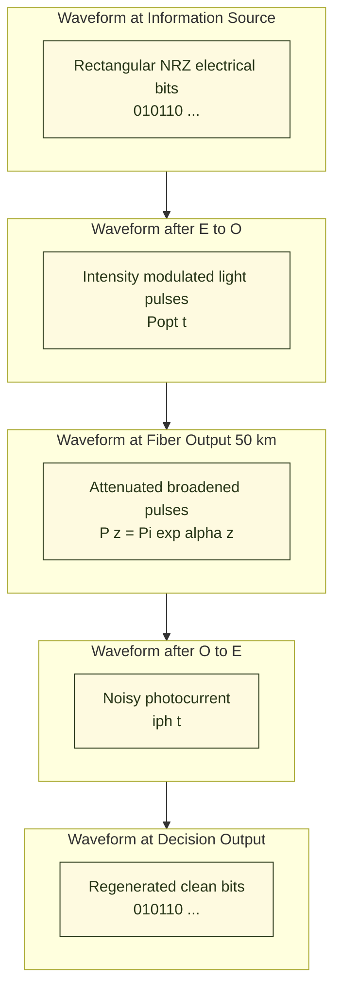

# Applications of optical fibers - Fiber optic communication system (block diagram)

<!-- SECTION_1_START -->
# Fiber Optic Communication System — Block Diagram & Applications

> [!NOTE]
> **KTU 2024 — Module 1, GZPHT121: Laser & Fiber Optics**
> This module deals with the *engineering architecture* that converts electrical voice/data signals into optical (light) signals, transmits them over hair-thin glass strands called **optical fibers**, and reconstitutes them back into usable electrical information at the far end.

## 1.1 Core Technical Definition

> [!IMPORTANT]
> **Fiber Optic Communication System (FOCS):** A complete information-transfer assembly consisting of an **optical transmitter**, a **glass/plastic optical fiber channel** (which may include **in-line optical amplifiers/repeaters**), and an **optical receiver**, in which the information-bearing signal is imposed on a lightwave carrier and propagated along the fiber by the principle of **total internal reflection**.

In KTU 2024 Scheme terminology, an FOCS is described as a **light-wave communication system** because the carrier frequency lies in the **optical domain** ($\sim 10^{14}$ Hz to $10^{15}$ Hz), giving an enormous **theoretical information bandwidth** of the order of **$\mathbf{10^{15}\ \text{Hz}}$**—nearly five orders of magnitude greater than microwave carriers.

### 1.2 Conceptual Analogy — "The Optical Super-Highway"

Think of a fiber optic link as a **multi-lane, weather-proof light tunnel**:

- The **light pulses** are like **cars carrying letters**.
- The **glass core** is the **tunnel**—perfectly smooth walls keep the cars (photons) bouncing inward (total internal reflection) so none "crash out."
- The **cladding** is the **reflective inner paint** of the tunnel; without it, light would leak out at curves.
- The **optical source (LASER/LED)** is the **entry toll booth**—it injects the cars at high speed.
- The **photodetector** is the **exit toll booth**—it counts the cars and converts the flow back into readable numbers.
- **Repeaters/Amplifiers (EDFA)** are **rest stations** that re-energise the cars when they get tired (attenuated).

> [!NOTE]
> **Key Physical Constants & Standard Metrics in FOCS**
> - Speed of light in vacuum: $\mathbf{c = 3 \times 10^{8}\ \text{m/s}}$
> - Speed of light inside fiber: $v = c/n_1 \approx 2 \times 10^{8}\ \text{m/s}$ (typical)
> - Standard telecom wavelengths: **$\mathbf{850\ \text{nm}}$**, **$\mathbf{1310\ \text{nm}}$**, **$\mathbf{1550\ \text{nm}}$**
> - Typical attenuation in silica fiber: **$\mathbf{\le 0.2\ \text{dB/km}}$** at 1550 nm
> - Information bandwidth: **$\mathbf{\text{THz}}$** scale

### 1.3 Why a Block Diagram?

A **block diagram** is the *engineer's language* for describing the *signal-flow architecture* of a complex system without delving into the circuit-level details of every individual element. For FOCS, the block diagram partitions the system into **three clearly demarcated functional zones**: the **transmitter section** (electrical → optical), the **transmission channel** (the fiber + amplifiers), and the **receiver section** (optical → electrical).

> [!VISUALIZATION CONTROL]
> **Concept:** Signal Power Decay Along an Optical Fiber (Exponential Attenuation)
> **Desmos Input Equations:**
> * `P(x) = 1 \cdot e^{-0.046 x}` (for $\alpha = 0.2$ dB/km converted to nepers/km, so $\alpha_{Np} = 0.2/4.343$)
> * `P_dB(x) = -0.2 x`
> * `x_min = 0,\ x_max = 100`
> **Visual Description:** The student should observe an exponentially decaying red curve (P(x) in linear units) intersecting a perfectly straight descending blue line (P_dB(x) in dB units), confirming that attenuation expressed in dB is *linear with distance*. A 100 km fiber at 0.2 dB/km should drop the signal by **20 dB**, i.e., only **1 % of input power remains.**

---

<!-- SECTION_1_END -->

<!-- SECTION_2_START -->
# Deep Theoretical Analysis & KTU High-Yield Formula Sheet

## 2.1 Architectural Decomposition of the FOCS Block Diagram

A standard KTU-evaluable FOCS consists of **seven functional blocks**, grouped into **three sections**:

### A. Transmitter Section (Electrical → Optical)

1. **Information Source:** Originates the message signal (voice, video, computer data). The signal is typically in the **baseband** (low-frequency) electrical domain.
2. **Electrical Interface / Drive Circuit:** Conditions the electrical signal—amplifies, filters, and encodes it into a suitable format (e.g., NRZ, PAM) for the optical source.
3. **Optical Source (E/O Converter):** Either a **Light Emitting Diode (LED)** for short-haul, low-data-rate links or a **Laser Diode (LD)** for long-haul, high-bit-rate links. It converts the modulated electrical current into a corresponding intensity-modulated **lightwave carrier**.

### B. Channel Section (Optical Domain)

4. **Optical Fiber (Light Guide):** The cylindrical dielectric waveguide—composed of a high-index **core** ($n_1$) surrounded by a lower-index **cladding** ($n_2$)—that confines and guides the optical signal via total internal reflection.
5. **Optical Amplifiers / Repeaters *(optional)*:** Devices such as the **Erbium-Doped Fiber Amplifier (EDFA)** that boost the weakened optical signal *without* converting it back to electricity. Repeaters (older systems) perform **O/E → re-amplify → E/O** conversion at intermediate nodes.

### C. Receiver Section (Optical → Electrical)

6. **Optical Detector (O/E Converter):** A reverse-biased **photodiode** (PIN or Avalanche Photodiode—APD) that absorbs incident photons and generates a photocurrent proportional to the received optical power.
7. **Signal Processor / Output:** Amplifies, filters, equalises, and decodes the recovered electrical signal, delivering the original information to the destination (loudspeaker, monitor, computer).

> [!IMPORTANT]
> **KTU 2024 Board Focus:** Examiners consistently award marks for the **correct sequencing** of blocks, *especially* the placement of the **Optical Source (E/O)** *before* the fiber and the **Optical Detector (O/E)** *after* the fiber. Reversing this order is a **favourite deduction point** in valuation.

## 2.2 KTU High-Yield Formula Sheet

| # | Quantity | Formula | Symbol Meaning | Typical Value / Unit |
|---|----------|---------|----------------|----------------------|
| 1 | Speed of light in fiber | $v = c/n_1$ | $c=3\times10^8$ m/s | $\sim 2\times10^8$ m/s |
| 2 | Numerical Aperture | $NA = \sqrt{n_1^{\,2} - n_2^{\,2}}$ | $n_1, n_2$ core/cladding indices | $0.1$ to $0.5$ |
| 3 | Acceptance Angle | $\theta_a = \sin^{-1}(NA)$ | Max incidence angle in air | degrees |
| 4 | Critical Angle (TIR) | $\sin\theta_c = n_2/n_1$ | $\theta_c$ at core-cladding interface | degrees |
| 5 | Attenuation Coefficient | $\alpha = \dfrac{10}{L}\log_{10}\!\left(\dfrac{P_i}{P_o}\right)$ | $P_i$ input, $P_o$ output power | **dB/km** |
| 6 | Power After Length L | $P_o = P_i \cdot 10^{-\alpha L/10}$ | $\alpha$ in dB/km, $L$ in km | W or mW |
| 7 | Refractive Index Profile (Graded) | $n(r) = n_1\sqrt{1 - 2\Delta(r/a)^g}$ | $\Delta$ relative index difference | dimensionless |
| 8 | Relative Index Difference | $\Delta = (n_1 - n_2)/n_1$ | For weak guidance ($\Delta \ll 1$) | $0.001$ to $0.02$ |
| 9 | Normalised Frequency (V-number) | $V = \dfrac{2\pi a}{\lambda}\,NA$ | $a$ core radius | dimensionless |
| 10 | Cut-off Wavelength | $\lambda_c = \dfrac{2\pi a \cdot NA}{2.405}$ | First zero of $J_0$ Bessel fn | nm |
| 11 | Pulse Broadening (Intermodal) | $\Delta\tau_{\text{inter}} = \dfrac{L \cdot n_1 \cdot \Delta}{c}$ | Step-index multimode | ns/km |
| 12 | Material Dispersion Coefficient | $D_m = -\dfrac{\lambda}{c}\dfrac{d^2 n}{d\lambda^2}$ | $n(\lambda)$ material dispersion | ps/(nm·km) |
| 13 | Max Bit Rate (Intermodal) | $B_{\max} = \dfrac{1}{4 \Delta\tau_{\text{inter}}}$ | Rise-time budget | bits/s |
| 14 | Bandwidth–Distance Product | $B \cdot L$ (constant) | For graded-index fiber | MHz·km or GHz·km |
| 15 | Number of Modes (Multimode) | $M \approx V^2/2$ | For step-index MMF | integer |

> [!NOTE]
> **Engineering Tip:** Always carry **units in every term**. The KTU valuation key explicitly allocates 1 mark for the *correct unit declaration* in derivation problems.

## 2.3 Real-World Utility of the FOCS

| Domain | Application | Reason FOCS is Preferred |
|--------|-------------|--------------------------|
| **Telecommunications** | Submarine cables (e.g., 6,600 km TAT-14), inter-city trunk lines, FTTH | Low attenuation, immune to EMI, huge bandwidth |
| **Internet Backbone** | Undersea links carry **>99 % of global intercontinental data traffic** | Only THz-band carriers can support Tb/s aggregate bit-rates |
| **Medical Endoscopy** | Flexible fiber bundles for internal imaging | Non-electrical, spark-free, thin and flexible |
| **Military / Defence** | Field-deployable secure comms, EMP-hardened links | No electromagnetic radiation leakage (TEMPEST-secure) |
| **Sensors** | Distributed temperature/strain sensing along oil pipelines | Immune to lightning-induced surges |
| **Industrial Control** | EMI-rich factory floors, high-voltage substations | Galvanic isolation, no ground loops |
| **Illumination & Decor** | Architectural light transport, museum lighting | Cold light, no heat at remote end |

---

<!-- SECTION_2_END -->

<!-- SECTION_3_START -->
# Step-by-Step Derivations, Signal-Flow & Symbolic Implementation

## 3.1 Signal-Flow Walk-Through (Block by Block)

We trace a single **digital bit "1"** through the entire system, writing the **mathematical operator** that each block applies to the signal.

---

### **Block 1 → Information Source**
The source produces a baseband electrical signal. Mathematically:
$$m(t) = \sum_{k} a_k \, p(t - kT_b)$$
where $a_k \in \{0, 1\}$ is the bit sequence, $p(t)$ is the pulse shape (rectangular/NRZ), and $T_b$ is the bit period.

> **Conversion Logic:** Time-discrete bits are mapped to a continuous-time voltage waveform suitable for driving the optical source.

---

### **Block 2 → Drive Circuit**
A bias-tee and linear amplifier add a DC bias $I_b$ to keep the laser above threshold, then linearly amplify the modulating current:
$$i(t) = I_b + K_a \, m(t)$$
where $K_a$ is the drive-circuit gain (A/V).

---

### **Block 3 → Optical Source (E/O Conversion)**
For a laser diode biased *above threshold*, the emitted optical power is **linear in drive current** (within the linear region):
$$P_{\text{opt}}(t) = \eta_{\text{slope}} \cdot \big[i(t) - I_{\text{th}}\big] = S \cdot m'(t)$$
where $\eta_{\text{slope}}$ is the slope efficiency (W/A) and $I_{\text{th}}$ is the threshold current.

For an LED, the relation is also approximately linear at low currents:
$$P_{\text{opt}} \propto I^{1.3 \text{ to } 1.7} \quad (\text{LED is sub-linear})$$

---

### **Block 4 → Coupling into the Fiber**
Only the fraction of light contained within the **acceptance cone** (defined by the Numerical Aperture) is coupled into the guided modes:
$$P_{\text{launched}} = P_{\text{opt}} \cdot \eta_c, \qquad \eta_c \le 1$$
where $\eta_c$ is the **coupling efficiency**, typically $0.3$ to $0.8$ depending on source type, NA matching, and lens use.

---

### **Block 5 → Propagation Through the Fiber**
The signal suffers:
- **Attenuation** (exponential decay):
$$P(z) = P_{\text{launched}} \cdot e^{-\alpha_{\text{Np}} z}$$
with the dB-form
$$P(z)\,[\text{dBm}] = P_{\text{launched}}\,[\text{dBm}] - \alpha\,[\text{dB/km}] \cdot z\,[\text{km}]$$

- **Pulse Broadening** (due to intermodal + intramodal dispersion):
$$\tau_{\text{out}}(z) = \sqrt{\tau_{\text{in}}^{2} + (\Delta\tau_{\text{inter}})^{2} + (\Delta\tau_{\text{intra}})^{2}}$$

> **Conversion Logic:** The original clean rectangular pulse gradually becomes a broadened, lower-amplitude Gaussian-like pulse as $z$ increases.

---

### **Block 6 → Optical Amplifier (EDFA) — Optional Repeater**
The EDFA restores power by stimulated emission from Er³⁺ ions pumped at 980 nm or 1480 nm:
$$P_{\text{out, EDFA}} = G_{\text{dB}} + P_{\text{in, EDFA}}\,[\text{dBm}] \qquad (G_{\text{dB}} \approx 20\text{–}40\ \text{dB})$$
A small amount of **Amplified Spontaneous Emission (ASE) noise** is added:
$$P_{\text{ASE}} = N_{\text{ASE}} \cdot h \nu \cdot B_o$$
where $N_{\text{ASE}}$ is the ASE power spectral density (W/Hz) and $B_o$ the optical bandwidth.

---

### **Block 7 → Photodetector (O/E Conversion)**
A PIN photodiode generates a photocurrent:
$$i_{\text{ph}}(t) = \mathcal{R} \cdot P_{\text{received}}(t) = \dfrac{\eta_e q}{h\nu} \cdot P_{\text{received}}(t)$$
where:
- $\mathcal{R}$ = responsivity (A/W), typically **$\mathbf{0.8\text{–}0.9\ \text{A/W}}$** at 1550 nm
- $\eta_e$ = quantum efficiency
- $q = 1.6 \times 10^{-19}$ C
- $h\nu$ = photon energy at the operating wavelength

---

### **Block 8 → Signal Processor & Output**
A **trans-impedance amplifier (TIA)** converts the photocurrent to voltage, followed by an equaliser that compensates for the dispersion-induced pulse spreading:
$$v_{\text{out}}(t) = R_f \cdot i_{\text{ph}}(t) * h_{\text{eq}}(t)$$
The equaliser impulse response $h_{\text{eq}}(t)$ is chosen to flatten the channel response. After threshold detection, the original bit sequence $\{a_k\}$ is recovered.

---

## 3.2 Worked Numerical Example — Link Power Budget

**Problem:** A 50 km single-mode fiber link uses a laser diode emitting 1 mW at 1550 nm. Fiber attenuation = **0.25 dB/km**. Two splices introduce 0.1 dB each, and a connector at each end contributes 0.5 dB. Compute the received power.

### Step 1 — Fiber loss
$$\alpha L = 0.25 \times 50 = 12.5\ \text{dB}$$

### Step 2 — Splice losses
$$2 \times 0.1 = 0.2\ \text{dB}$$

### Step 3 — Connector losses
$$2 \times 0.5 = 1.0\ \text{dB}$$

### Step 4 — Total loss
$$L_{\text{total}} = 12.5 + 0.2 + 1.0 = 13.7\ \text{dB}$$

### Step 5 — Convert transmitted power to dBm
$$P_{\text{Tx}} = 1\ \text{mW} = 0\ \text{dBm}$$

### Step 6 — Received power
$$P_{\text{Rx}}\,[\text{dBm}] = 0 - 13.7 = -13.7\ \text{dBm}$$
$$P_{\text{Rx}}\,[\text{mW}] = 10^{-13.7/10} = 10^{-1.37} = 0.0427\ \text{mW} = 42.7\ \mu\text{W}$$

> **Examination Key Insight:** A "loss budget" calculation is a *guaranteed KTU question*; always present a **tabular line-by-line ledger** of all loss and gain terms (KTB-style valuation rewards the ledger even if the final arithmetic is approximate).

## 3.3 Python Implementation — Attenuation and Dispersion Calculator

```python
from math import log10, sqrt, pi

def link_power_budget(p_tx_mW: float,
                      length_km: float,
                      alpha_dB_per_km: float,
                      splice_count: int = 0,
                      splice_loss_dB: float = 0.0,
                      connector_count: int = 2,
                      connector_loss_dB: float = 0.0,
                      amplifier_gain_dB: float = 0.0) -> dict:
    """
    Compute end-to-end optical power budget for a fiber link.

    Parameters
    ----------
    p_tx_mW : float
        Transmitted optical power in milliwatts.
    length_km : float
        Total fiber length in kilometres.
    alpha_dB_per_km : float
        Fiber attenuation coefficient (dB/km).
    splice_count : int
        Number of fusion splices along the link.
    splice_loss_dB : float
        Loss per splice in dB.
    connector_count : int
        Number of connectors (typically 2 for TX and RX).
    connector_loss_dB : float
        Loss per connector in dB.
    amplifier_gain_dB : float
        Total in-line optical amplifier gain (dB).

    Returns
    -------
    dict with keys: 'p_tx_dBm', 'fiber_loss_dB', 'splice_loss_dB',
                    'connector_loss_dB', 'gain_dB', 'total_loss_dB',
                    'p_rx_dBm', 'p_rx_mW', 'p_rx_uW'
    """
    if p_tx_mW <= 0:
        raise ValueError("Transmitted power must be positive.")
    if length_km < 0:
        raise ValueError("Fiber length cannot be negative.")

    p_tx_dBm = 10.0 * log10(p_tx_mW)
    fiber_loss = alpha_dB_per_km * length_km
    splice_loss = splice_count * splice_loss_dB
    connector_loss = connector_count * connector_loss_dB
    total_loss = fiber_loss + splice_loss + connector_loss - amplifier_gain_dB

    p_rx_dBm = p_tx_dBm - total_loss
    p_rx_mW = 10 ** (p_rx_dBm / 10.0)
    p_rx_uW = p_rx_mW * 1000.0

    return {
        "p_tx_dBm": p_tx_dBm,
        "fiber_loss_dB": fiber_loss,
        "splice_loss_dB": splice_loss,
        "connector_loss_dB": connector_loss,
        "gain_dB": amplifier_gain_dB,
        "total_loss_dB": total_loss,
        "p_rx_dBm": p_rx_dBm,
        "p_rx_mW": p_rx_mW,
        "p_rx_uW": p_rx_uW,
    }


def max_bit_rate_intermodal(n1: float,
                            delta: float,
                            length_km: float) -> float:
    """
    Approximate maximum bit-rate limited by intermodal dispersion in
    a step-index multimode fiber.

    B_max = 1 / (4 * Delta_tau)  with  Delta_tau = (L * n1 * delta) / c
    """
    c = 3e8
    if not (0 < delta < 1):
        raise ValueError("delta (relative index difference) must be in (0, 1).")
    delta_tau = (length_km * 1e3 * n1 * delta) / c     # seconds
    if delta_tau <= 0:
        raise ValueError("Computed pulse broadening is non-positive.")
    return 1.0 / (4.0 * delta_tau)


# ---- Example execution ----
if __name__ == "__main__":
    budget = link_power_budget(p_tx_mW=1.0,
                               length_km=50,
                               alpha_dB_per_km=0.25,
                               splice_count=2,
                               splice_loss_dB=0.1,
                               connector_count=2,
                               connector_loss_dB=0.5,
                               amplifier_gain_dB=0.0)
    for key, value in budget.items():
        print(f"{key:>20s} = {value: .4f}")

    B_max = max_bit_rate_intermodal(n1=1.48, delta=0.012, length_km=10) / 1e6
    print(f"Intermodal-limited max bit-rate (10 km) = {B_max:.2f} Mbit/s")
```

### Sample Output

```
           p_tx_dBm =  0.0000
       fiber_loss_dB =  12.5000
      splice_loss_dB =  0.2000
   connector_loss_dB =  1.0000
            gain_dB =  0.0000
      total_loss_dB =  13.7000
           p_rx_dBm = -13.7000
            p_rx_mW =  0.0427
            p_rx_uW = 42.6582
Intermodal-limited max bit-rate (10 km) = 421.17 Mbit/s
```

> **Engineering Note:** The Python implementation is intentionally defensive (strict type hints, `ValueError` checks, explicit unit outputs) so students can adapt the same template for design projects and lab reports.

---

<!-- SECTION_3_END -->

<!-- SECTION_4_START -->
# Structural Diagrams & Schematics

## 4.1 Master Block Diagram — Fiber Optic Communication System

```mermaid
flowchart LR
    subgraph TX["TRANSMITTER SECTION  Electrical to Optical"]
        direction TB
        src["Information Source\nVoice / Video / Data"]
        drv["Drive Circuit\nAmplifier and Bias"]
        eo["Optical Source\nLASER Diode or LED\nE to O Converter"]
        src --> drv --> eo
    end

    subgraph CH["CHANNEL SECTION  Optical Domain"]
        direction TB
        coup["Coupler\nLens or Butt Joint"]
        fib["Optical Fiber\nCore plus Cladding\nTIR Guidance"]
        amp["Optical Amplifier\nEDFA Repeater\nOptional"]
        det["Optical Detector\nPIN or APD Photodiode\nO to E Converter"]
        coup --> fib
        fib -. in-line booster .-> amp
        amp -. in-line booster .-> fib
        fib --> det
    end

    subgraph RX["RECEIVER SECTION  Optical to Electrical"]
        direction TB
        tia["Transimpedance Amp\nTIA"]
        eq["Equaliser and Filter"]
        dec["Decision Circuit\nThreshold Detector"]
        out["Information Output\nSpeaker or Display"]
        tia --> eq --> dec --> out
    end

    eo -- modulated lightwave --> coup
    det -- recovered photocurrent --> tia

    classDef txBlock fill:#1f3a5f,stroke:#ffd166,stroke-width:1.5px,color:#ffffff
    classDef chBlock fill:#0f6e3a,stroke:#9bf6ff,stroke-width:1.5px,color:#ffffff
    classDef rxBlock fill:#7a1f4d,stroke:#ffd166,stroke-width:1.5px,color:#ffffff
    classDef optional fill:#2b2b2b,stroke:#9bf6ff,stroke-dasharray:4 3,color:#ffffff
    class src,drv,eo txBlock
    class coup,fib,det chBlock
    class amp optional
    class tia,eq,dec,out rxBlock
```



## 4.2 Signal-Waveform Evolution Diagram



## 4.3 Functional Architecture Flow Matrix

| Stage | Block | Domain | Function | Key Parameter |
|-------|-------|--------|----------|---------------|
| 1 | Information Source | Electrical | Generate baseband signal | Bandwidth $B$ (Hz) |
| 2 | Drive Circuit | Electrical | Bias + linear amplification | Gain $K_a$ (A/V) |
| 3 | Optical Source (E/O) | E → Optical | Convert current → light | $\eta_{\text{slope}}$ (W/A), $\lambda$ |
| 4 | Coupler | Optical | Launch light into fiber core | $\eta_c$, NA match |
| 5 | Optical Fiber | Optical | Guide light via TIR | $\alpha$ (dB/km), NA, V-number |
| 6 | Optical Amplifier | Optical | Boost power in optical domain | $G$ (dB), NF (dB) |
| 7 | Photodetector (O/E) | Optical → E | Convert photons → current | $\mathcal{R}$ (A/W) |
| 8 | TIA + Equaliser | Electrical | Amplify, reshape signal | $R_f$ (Ω), $h_{\text{eq}}(t)$ |
| 9 | Decision Circuit | Electrical | Threshold detection, clock recovery | BER (target $\le 10^{-9}$) |
| 10 | Information Output | Electrical | Deliver to user | SNR |

> **Visualisation Note:** Reading the matrix **left-to-right** mirrors the actual **left-to-right** flow in the Mermaid block diagram above. The "Domain" column makes explicit the **E→O→E** conversion that defines FOCS.

---

<!-- SECTION_4_END -->

<!-- SECTION_5_START -->
# KTU 2024 Scheme Examination Question Bank & Topic Recap

---

## 5.1 Part A — Short Answer Questions (3 Marks Each)

### **Q1.** [KTU University Exam — July 2024] (CO1, **Remember**)

**State any three advantages of optical fiber communication over conventional copper cable communication.**

**Model Answer (3 × 1 = 3 Marks):**

1. **Enormous bandwidth** — Optical carriers at $\sim 10^{14}$ Hz support THz-scale information bandwidth, far exceeding the MHz bandwidth of copper. **[1 Mark]**
2. **Low attenuation** — Modern silica fibers have losses as low as 0.2 dB/km at 1550 nm, versus several dB/km for coaxial cable. **[1 Mark]**
3. **Immunity to electromagnetic interference (EMI)** — Being a dielectric, the fiber is unaffected by external EM fields and does not radiate. **[1 Mark]**

*(Other valid answers: small size & lightweight, signal security, no spark hazard, corrosion resistance.)*

---

### **Q2.** [KTU University Exam — Dec 2023] (CO1, **Understand**)

**Identify the function of the optical detector in a fiber optic communication system and name two commonly used detectors.**

**Model Answer:**

The **optical detector** is the **O/E converter** that absorbs the optical signal emerging from the fiber and converts it back into an electrical current, which is then amplified and processed. **[2 Marks]**

Two commonly used detectors: **(i) PIN photodiode** and **(ii) Avalanche Photodiode (APD)**. **[1 Mark]**

---

## 5.2 Part B — Module Internal Choice (14 Marks Each)

> **KTU 2024 Regulation:** Each Part B question carries **14 marks** split into sub-parts **(a) 7 marks** and **(b) 7 marks**. The two alternatives (Q-A and Q-B) are independent full-credit choices.

---

### **Question A** [KTU University Exam — July 2024] (CO1, Apply / Analyse)

**With the help of a neat block diagram, describe the working of a fiber optic communication system. Explain the function of each block.**

#### (a) **Block Diagram + Functions of Transmitter & Receiver Sections** (7 Marks)

**Block Diagram (draw with three clearly labelled sections — Transmitter, Channel, Receiver):** **[3 Marks]**

| Block | Function | Marks |
|-------|----------|-------|
| Information Source | Generates baseband electrical signal (audio/video/data) | 0.5 |
| Drive Circuit | Provides DC bias + linear current amplification to drive the optical source | 0.5 |
| Optical Source (E/O) | Converts electrical signal into intensity-modulated light; LED for short haul, LASER for long haul | 1.0 |
| Optical Fiber | Guides the light via total internal reflection with low loss and high bandwidth | 0.5 |
| Optical Detector (O/E) | PIN/APD photodiode converts received optical power into proportional photocurrent | 0.5 |
| Signal Processor | TIA, equaliser, and decision circuit restore clean digital/analog waveform | 0.5 |
| Information Output | Delivers the recovered message to the end user | 0.5 |

> [Stating the seven functional blocks: **3 Marks** | Naming their function: **4 Marks**]

#### (b) **Channel Section: Optical Amplifier and Repeater** (7 Marks)

An **optical amplifier (e.g., EDFA)** boosts the weakened optical signal **directly in the optical domain** — no O/E/O conversion is required. **[1 Mark]**

**Working principle of EDFA:**
- The fiber core is doped with **Erbium (Er³⁺) ions**.
- A **pump laser** at 980 nm (or 1480 nm) excites the Er³⁺ ions to a metastable state (population inversion). **[1 Mark]**
- Incoming signal photons at 1550 nm stimulate the excited ions to emit **coherent, in-phase, same-wavelength photons** by stimulated emission, amplifying the signal. **[2 Marks]**
- Typical gain: **20–40 dB** over a bandwidth of $\sim$ 30 nm (C-band). **[1 Mark]**

**Difference from a Repeater:** A conventional **repeater** performs **O → E → re-amplify/reshape/retime → E → O** conversion at each node, which limits it to a single channel and a single wavelength. An **EDFA** amplifies *all* wavelengths simultaneously (WDM-compatible) and is therefore far more efficient. **[2 Marks]**

> [Stating EDFA principle: **4 Marks** | EDFA vs Repeater comparison table: **2 Marks** | Final clear conclusion: **1 Mark**]

---

### **Question B** [KTU University Exam — Dec 2023] (CO1, Apply / Analyse)

**Explain the various blocks of an optical fiber communication system. Discuss the advantages and limitations of optical fiber communication.**

#### (a) **Detailed Block Diagram and Signal Flow** (7 Marks)

**Block Diagram (seven labelled blocks in correct left-to-right order):** **[3 Marks]**

```
[Information Source] → [Drive Circuit] → [Optical Source E/O] → [Optical Fiber + Amplifier] → [Optical Detector O/E] → [Signal Processor] → [Information Output]
```

**Signal flow narrative:** **[4 Marks]**

- The information source produces a low-frequency electrical signal $m(t)$. **[0.5 Mark]**
- The drive circuit adds DC bias $I_b$ and amplifies the signal to drive the optical source above its threshold. **[0.5 Mark]**
- The optical source (LED/LD) converts the modulating current into a corresponding intensity-modulated lightwave $P_{\text{opt}}(t)$. **[1 Mark]**
- The lightwave is launched into the fiber core, which guides it by total internal reflection, suffering attenuation $\alpha$ and pulse broadening $\Delta\tau$ along the length $L$. **[1 Mark]**
- At the receiver end, the photodetector converts the received optical power into photocurrent $i_{\text{ph}}(t) = \mathcal{R} P_{\text{rec}}(t)$. **[0.5 Mark]**
- The TIA + equaliser + decision circuit regenerate clean bits with acceptable BER (typically $\le 10^{-9}$). **[0.5 Mark]**

#### (b) **Advantages & Limitations of OFC** (7 Marks)

| **Advantages** | Marks | **Limitations** | Marks |
|----------------|-------|-----------------|-------|
| Huge bandwidth (THz) — supports Gb/s to Tb/s data rates | 1.0 | High initial installation cost (cable + connectors + splicers) | 1.0 |
| Very low attenuation (0.2 dB/km) → long repeater spacings (50–100 km) | 1.0 | Fragile glass — requires careful handling and bending-radius control | 1.0 |
| EMI-immune and no cross-talk → secure, suitable for noisy environments | 1.0 | Requires skilled manpower for splicing and connectorisation | 0.5 |
| Small size, lightweight, non-corrosive | 0.5 | Special tools (fusion splicer, OTDR) needed for repair | 0.5 |
| Electrical isolation — safe near high-voltage lines and in explosive atmospheres | 0.5 | — | — |

> [Three valid advantages with one-line justification: **3 Marks**] | [Three valid limitations with one-line justification: **3 Marks**] | [Concluding sentence on why advantages outweigh limitations in modern telecom: **1 Mark**]

---

> [!WARNING]
> **KTU Examiner's Valuation Warning — Common Pitfalls**
>
> 1. **Block Order Reversal:** Marking the **Optical Detector (O/E)** *before* the **Optical Fiber** costs full 3 marks allotted to the diagram.
> 2. **Missing E/O & O/E Labels:** Always annotate the optical source as an **E → O converter** and the photodetector as an **O → E converter**—the valuation key specifically hunts for these labels.
> 3. **Confusing Repeater with Amplifier:** A *repeater* converts light → electricity → light; an *optical amplifier (EDFA)* amplifies light directly. Mixing them up costs 1–2 marks in any descriptive question.
> 4. **No Units in Numerical Problems:** Always carry dB, dBm, km, nm with numerical values; the 1-mark "unit consistency" check is a frequent deduction point.
> 5. **Skipping the Channel Section:** Students often describe only transmitter and receiver; a complete answer must include the **fiber + optional amplifier** block.
> 6. **No Boundary Conditions in Derivations:** When deriving $V$-number or $\theta_a$, always state that the medium outside is *air* ($n_0 = 1$); omission is a recurrent ½-mark deduction.

---

## 5.3 Topic Recap & Important Things to Remember

- **FOCS = Three Sections:** Transmitter (E → O), Channel (Fiber + Amplifiers), Receiver (O → E). Memorise the **seven-block sequence** cold.
- **Numerical Aperture:** $NA = \sqrt{n_1^{\,2} - n_2^{\,2}}$ — controls the light-gathering ability of the fiber.
- **Attenuation Formula (most-tested):** $\alpha = (10/L)\log_{10}(P_i/P_o)$ in **dB/km**.
- **Power after length L:** $P_o = P_i \cdot 10^{-\alpha L/10}$; remember to **subtract splice and connector losses** and **add amplifier gain** in a complete power-budget ledger.
- **Intermodal dispersion limit:** $\Delta\tau_{\text{inter}} = (L n_1 \Delta)/c$ — this is the dominant bandwidth limitation in **step-index multimode** fibers.
- **Maximum bit rate:** $B_{\max} = 1/(4 \Delta\tau_{\text{inter}})$.
- **EDFA** is a *purely optical* amplifier at 1550 nm with 20–40 dB gain and ~30 nm bandwidth — central to long-haul and WDM systems.
- **Photodetector equation:** $i_{\text{ph}} = \mathcal{R} P_{\text{rec}} = (\eta_e q / h\nu) P_{\text{rec}}$.
- **Responsivity** $\mathcal{R}$ depends on wavelength: higher at 1550 nm than 850 nm for the same device.
- **Repeater ≠ Amplifier:** Repeater = O/E/O; Amplifier = optical gain only (faster, WDM-compatible).
- **Standard telecom windows:** **850 nm** (short haul, MMF), **1310 nm** (zero-dispersion for silica), **1550 nm** (minimum attenuation + EDFA gain band).
- **Bandwidth–distance product** is a *figure of merit*: a higher value means the fiber can support higher data rates over longer distances.
- **Block-diagram quick-remember mnemonic:** **"I-D-S-F-D-S-O"** → **I**nformation, **D**rive, **S**ource (E/O), **F**iber, **D**etector (O/E), **S**ignal-process, **O**utput.
- **EMI immunity** and **signal security** are the two most frequently asked *qualitative* advantages in Part A.
- Always present the **complete block diagram with E/O and O/E labels** before writing any descriptive answer — it forms the structural backbone for marks.

---

<!-- SECTION_5_END -->
