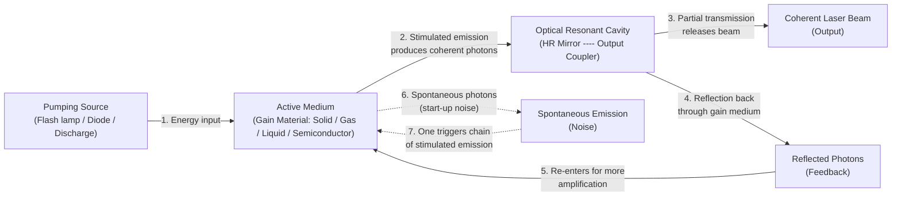
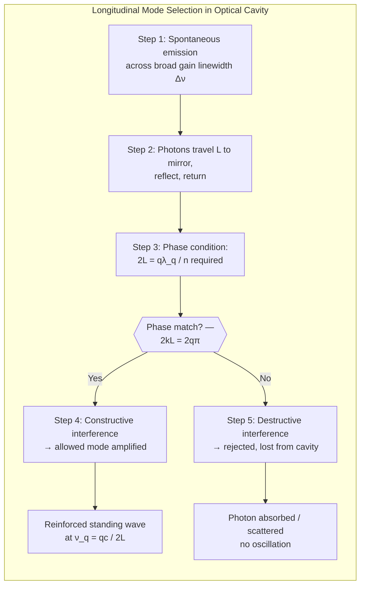
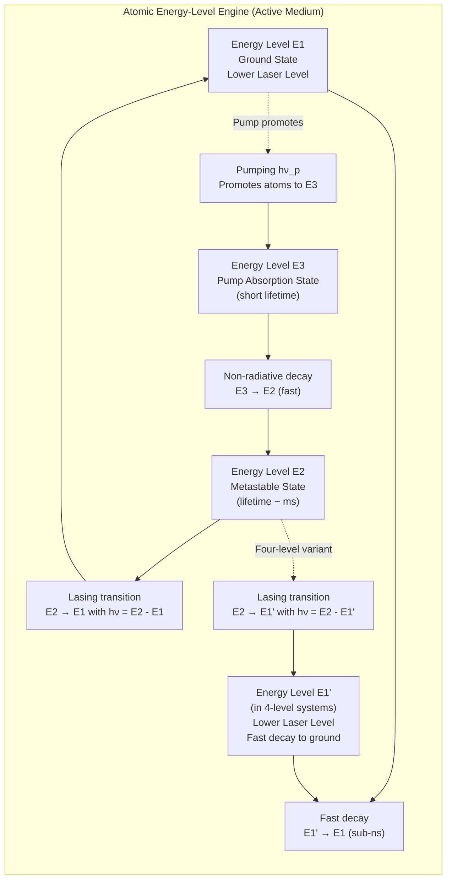
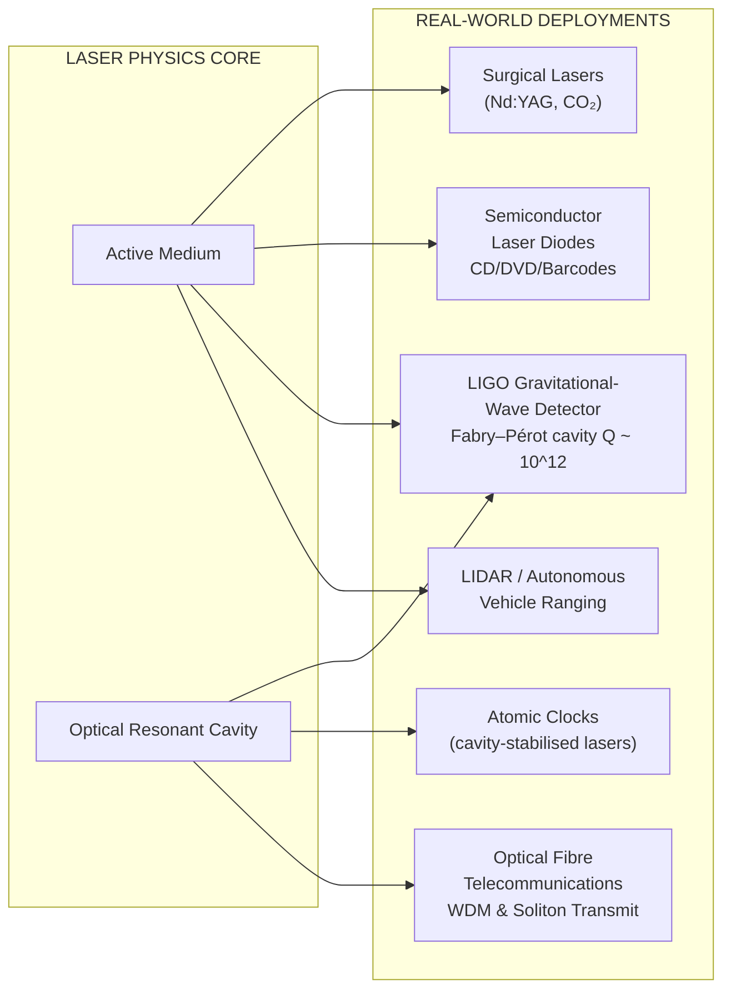

# Basic components of laser - Active medium - Optical resonant cavity

<!-- SECTION_1_START -->

# Basic Components of a Laser — Active Medium & Optical Resonant Cavity

## 1.1 Formal Definition (KTU 2024 Syllabus Terminology)

A **LASER** (**L**ight **A**mplification by **S**timulated **E**mission of **R**adiation) is a quantum-electronic device that produces a highly coherent, monochromatic, collimated, and intense beam of light through the process of **stimulated emission** within a suitably engineered medium placed inside an optical feedback system.

The three basic, indispensable components of any laser system are:

1. **Active Medium (Gain Medium)** — the material that amplifies light through stimulated emission of radiation.
2. **Optical Resonant Cavity (Optical Resonator)** — the feedback structure formed by two mirrors that traps photons and forces them to traverse the gain medium repeatedly.
3. **Pumping Source (Energy Source)** — the external energy input (optical, electrical, or chemical) that establishes population inversion.

This module focuses deeply on the **Active Medium** and the **Optical Resonant Cavity**.

> [!IMPORTANT]
> **KTU Board Examiner's Note:** A 14-mark question frequently asked in KTU ESE asks: *"Explain the basic components of a laser with the function of each."* You MUST mention all three components and elaborate on active medium + cavity. The pumping source is usually brief (1–2 lines).

---

## 1.2 Intuitive Analogy — The "Photon Echo Chamber"

Imagine pushing a child on a swing. The swing only grows tall if you push it **at the right moment** and in the **right direction**. Now, suppose we replace the child with a *photon* and the swing with a *perfectly reflecting corridor of mirrors*. Each time the photon passes through a special "magic gas" (the active medium), it triggers the release of a *twin photon* (cloned in phase, direction, and color). The mirrors keep bouncing these photons back and forth, so they keep triggering *more* twins — a cascading optical avalanche. The magic gas is the **active medium**, the corridor of mirrors is the **optical resonant cavity**, and your initial push is the **pumping source**.

> [!NOTE]
> **Why three components, not two?** Without the cavity, photons produced in the active medium escape in all directions after one pass — no amplification. Without the active medium, the mirrors just bounce ordinary light with no gain. Without pumping, there is no population inversion, so stimulated emission cannot dominate over absorption.

---

## 1.3 The Active Medium — Definition

The **active medium** (also called the *gain medium* or *laser medium*) is the heart of any laser. It is a specially prepared material — solid, liquid, gas, or semiconductor — whose atoms, ions, or molecules possess an energy-level structure that supports **stimulated emission** at the desired wavelength when suitably excited.

### Salient Requirements of an Active Medium

- It must possess at least a **three-level** (or preferably a **four-level**) energy scheme.
- It must contain a **metastable state** with a relatively long lifetime ($\tau \approx 10^{-3}$ to $10^{-6}$ s), allowing atoms to accumulate and create **population inversion**.
- It must possess a wide, transparent optical window at the lasing wavelength.
- It should have a high **stimulated emission cross-section** ($\sigma_{21}$) and low non-radiative losses.

> [!NOTE]
> **Key Term — Population Inversion:** The non-equilibrium condition $N_2 > N_1$ (more atoms in the upper laser level than in the lower level). This is the thermodynamic prerequisite for net optical amplification. It is achieved ONLY by external pumping.

---

## 1.4 The Optical Resonant Cavity — Definition

The **optical resonant cavity** (or *optical resonator*) is a precisely aligned arrangement of two (or more) highly polished, coated mirrors that encloses the active medium. Its function is to provide **positive optical feedback**, so that the stimulated emission photons are reflected back and forth through the gain medium many times, multiplying the photon population exponentially until a stable, coherent laser beam is emitted through the partially transmitting output mirror.

> [!IMPORTANT]
> **Standard Convention:** One mirror is **100% reflecting** (the *high reflector*, HR) and the other is **partially reflecting** (typically 95–99%, the *output coupler*, OC). The transmission of the OC mirror is what allows the useful laser beam to escape.

---

## 1.5 Visualization Control — Standing Wave Inside the Cavity

> [!VISUALIZATION CONTROL]
> **Concept:** Spatial distribution of the electric field for the first three longitudinal modes of a plane-parallel Fabry–Pérot cavity of length $L$.
>
> **GeoGebra / Desmos Input Equations (let $L = 10$):**
> * $f_{1}(x) = \sin\left(\dfrac{\pi \, x}{5}\right)$ — fundamental mode ($q = 1$, half-wavelength inside cavity)
> * $f_{2}(x) = \sin\left(\dfrac{2\pi \, x}{5}\right)$ — second longitudinal mode ($q = 2$)
> * $f_{3}(x) = \sin\left(\dfrac{3\pi \, x}{5}\right)$ — third longitudinal mode ($q = 3$)
>
> **Visual Description:** On the x-axis, plot $x$ from $0$ to $10$ (mirror boundaries). The curves should display a **node at $x=0$**, a **node at $x=10$**, and exactly $(q-1)$ additional nodes in between. The number of antinodes inside the cavity equals $q$. This is the geometric picture of "which wavelengths are *allowed* to oscillate in the cavity."

<!-- SECTION_1_END -->

<!-- SECTION_2_START -->

# Deep Theoretical Analysis & KTU High-Yield Formula Sheet

## 2.1 The Active Medium — Operational Logic in Six Steps

1. **Atomic Pumping** — The pumping source excites atoms/ions from the ground state $E_1$ to a higher-absorbing state $E_3$ (optical or electrical pumping).
2. **Fast Non-Radiative Decay** — Atoms relax rapidly from $E_3$ to a carefully engineered **metastable state** $E_2$ (lifetime $\sim$ ms, much longer than $E_3$).
3. **Accumulation in $E_2$** — Because $E_2$ is metastable, atoms pile up there. If pumping is strong enough, the population $N_2$ in $E_2$ exceeds $N_1$ in $E_1$ — this is **population inversion**.
4. **Triggering Stimulated Emission** — A spontaneous photon of energy $h\nu = E_2 - E_1$ stimulates an excited atom to emit a *second* photon identical in phase, frequency, direction, and polarization.
5. **Optical Amplification** — The two photons each trigger more emissions — a chain reaction. The active medium now acts as an **optical amplifier** with gain $G > 1$.
6. **Saturation** — The process continues until the inversion is depleted, after which the cycle restarts via continuous pumping.

### 2.1.1 Classification of Active Media

| Type | Examples | Typical $\lambda$ | Pumping Method | Application |
|---|---|---|---|---|
| **Solid-State** | Ruby ($\text{Al}_2\text{O}_3 : \text{Cr}^{3+}$), Nd:YAG, Ti:Sapphire | 694 nm, 1064 nm, 650–1100 nm | Optical (flash lamp / diode) | Industry, surgery, research |
| **Gas** | He–Ne, CO₂, Argon-ion | 632.8 nm, 10.6 µm, 488/514 nm | Electrical discharge | Metrology, surgery, spectroscopy |
| **Liquid (Dye)** | Rhodamine 6G, Coumarin | 400–900 nm (tunable) | Optical (laser pump) | Spectroscopy, photochemistry |
| **Semiconductor** | GaAs, InGaAs, GaN | 630–1550 nm | Electrical injection | Barcode scanners, telecom, pointers |

### 2.1.2 Three-Level vs Four-Level Laser Systems

| Feature | Three-Level System | Four-Level System |
|---|---|---|
| Lower laser level | Ground state $E_1$ | Excited state $E_1$ (rapidly depopulated) |
| Threshold pump power | **Very high** (need to invert $>50\%$ of total atoms) | **Low** ($E_1$ is essentially empty) |
| Continuous-wave (CW) operation | Difficult | Easy |
| Example | Ruby laser | He–Ne, Nd:YAG, CO₂ |

> [!IMPORTANT]
> **KTU 2024 Key Point:** The four-level scheme is preferred for **continuous-wave (CW)** operation because the lower laser level is essentially empty at thermal equilibrium. The Ruby laser (three-level) is mostly a *pulsed* system.

---

## 2.2 The Optical Resonant Cavity — Operational Logic

The cavity is more than just "two mirrors." It performs three critical engineering functions:

1. **Frequency Selection (Mode Selection):** Only photons whose half-wavelengths fit an integer number of times between the mirrors survive — this enforces a discrete comb of allowed frequencies.
2. **Directional Selection:** Spontaneous photons emitted off-axis escape sideways; only those nearly parallel to the cavity axis get reflected back into the gain medium. This is why laser light is highly collimated.
3. **Feedback for Net Gain:** Even a small photon may be amplified by a factor of $e^{\gamma L}$ per pass, where $\gamma$ is the gain coefficient. If the round-trip gain exceeds the round-trip loss (mirror transmission + scattering + absorption), oscillation builds up — this is the **laser threshold condition**.

### 2.2.1 Common Cavity Geometries

| Geometry | Mirror Shape | Stability | Beam Waist Location |
|---|---|---|---|
| **Planar (Fabry–Pérot)** | Two flat mirrors | Marginally stable | At centre |
| **Confocal** | Two concave mirrors, separation = radius | Very stable | At geometric centre |
| **Concentric** | Two concave mirrors, separation = $2 \times$ radius | Marginally stable | At cavity centre (narrow waist) |
| **Convex–Concave (hemispherical)** | One flat, one curved | Stable if $R > L$ | Near the flat mirror |

### 2.2.2 Stability Criterion (Generalised)

For a cavity of length $L$ with mirrors of radii of curvature $R_1$ and $R_2$, stable oscillation of a Gaussian beam requires:

$$
g_1 \, g_2 = \left(1 - \frac{L}{R_1}\right)\left(1 - \frac{L}{R_2}\right) \in \left[0, 1\right]
$$

> [!NOTE]
> **Engineering Utility:** Optical cavities are not exclusive to lasers. They are the heart of **gravitational-wave detectors (LIGO)**, **optical atomic clocks**, **ring-laser gyroscopes** in aircraft, and **quantum-electrodynamic (QED) experiments** that test Casimir-like effects. The same physics governs every Fabry–Pérot interferometer used in telecommunications wavelength-division multiplexing (WDM).

---

## 2.3 KTU High-Yield Formula Sheet

| \# | Quantity | Formula | Meaning of Symbols |
|---|---|---|---|
| 1 | Resonance condition (cavity) | $L = q \cdot \dfrac{\lambda_q}{2}$ | $L$: cavity length, $q$: longitudinal mode number, $\lambda_q$: allowed wavelength |
| 2 | Resonance frequency | $\nu_q = \dfrac{q \, c}{2 L}$ | $c$: speed of light in vacuum |
| 3 | Free Spectral Range (mode spacing) | $\Delta\nu_{\text{FSR}} = \dfrac{c}{2 L}$ | Spacing between adjacent longitudinal modes |
| 4 | Photon round-trip time | $T_{\text{rt}} = \dfrac{2 L}{c}$ | Time for one mirror-to-mirror-and-back trip |
| 5 | Photon lifetime in cavity | $\tau_p = \dfrac{L}{c \, (1 - R)}$ | $R = \sqrt{R_1 R_2}$ mean mirror reflectance |
| 6 | Quality factor (Q-factor) | $Q = \dfrac{\nu}{\Delta\nu} = 2 \pi \nu \cdot \dfrac{\text{Energy stored}}{\text{Energy lost per cycle}}$ | Measure of spectral sharpness |
| 7 | Threshold gain condition | $G_{\text{rt}} \geq 1 \;\Rightarrow\; R_1 R_2 \, e^{2 \gamma L} \geq 1$ | $\gamma$: small-signal gain coefficient |
| 8 | Gain coefficient | $\gamma = \sigma_{21} \, \Delta N$ | $\sigma_{21}$: stimulated emission cross-section, $\Delta N = N_2 - \dfrac{g_2}{g_1} N_1$ |
| 9 | Gaussian beam waist radius | $w_0 = \sqrt{\dfrac{\lambda L}{\pi}}$ (confocal) | $w_0$: minimum spot size |
| 10 | Cavity stability parameter | $0 \leq g_1 g_2 \leq 1$ | $g_i = 1 - L/R_i$ |

> [!IMPORTANT]
> **KTU Pitfall:** Do NOT use the vertical bar "$\vert x \vert$" inside a markdown table — it breaks rendering. Use $\vert x \vert$ or $\text{abs}(x)$ instead.

---

## 2.4 Why These Equations Matter in Engineering

- The **Free Spectral Range** $\Delta\nu_{\text{FSR}} = c/(2L)$ directly sets the maximum useful mode-locking repetition rate of a femtosecond laser ($\sim 100$ MHz for $L = 1.5$ m).
- The **Q-factor** decides the linewidth of a single-frequency laser — critical for atomic clocks, gravitational-wave interferometers (LIGO uses $Q \sim 10^{12}$ cavities), and coherent optical communication.
- The **threshold gain condition** $R_1 R_2 e^{2 \gamma L} \geq 1$ is the engineering basis for designing output coupler reflectivity — pick $R$ too high and no light comes out; too low and the laser never starts.

<!-- SECTION_2_END -->

<!-- SECTION_3_START -->

# Step-by-Step Derivations, Worked Examples & Python Implementation

## 3.1 Derivation 1 — Resonance Condition of the Optical Cavity

### Statement

The optical cavity of length $L$ supports only those optical frequencies whose half-wavelengths fit an integer number of times between the two mirrors.

### Derivation

A standing electromagnetic wave inside the cavity must have **nodes at both reflecting mirrors** (boundary condition: $E = 0$ at conducting/dielectric mirrors for a transverse field mode). This means the round-trip phase must equal an integer multiple of $2\pi$:

$$
\boxed{ \text{Phase round-trip} = 2 \, k L = 2 \, q \pi \quad \text{where} \quad q = 1, 2, 3, \ldots }
$$

Substituting $k = 2\pi / \lambda$:

$$
2 \cdot \frac{2\pi}{\lambda_q} \cdot L = 2 q \pi
$$

Cancel $2\pi$ on both sides:

$$
\frac{2 L}{\lambda_q} = q \quad\Rightarrow\quad \lambda_q = \frac{2 L}{q}
$$

Equivalently, the *half-wavelength fits exactly $q$ times*:

$$
L = q \cdot \frac{\lambda_q}{2}
$$

Converting to frequency using $\nu_q = c / \lambda_q$:

$$
\nu_q = \frac{q \, c}{2 L}
$$

Each value of the integer $q$ corresponds to one **longitudinal cavity mode**.

> [!NOTE]
> **Why the round-trip, not one-way?** Because a photon must arrive back at the starting mirror with the *same phase* it had when it left, otherwise the wave destructively interferes with itself. This is the same condition as constructive interference of a wave with its round-trip image — the basis of all Fabry–Pérot physics.

---

## 3.2 Derivation 2 — Free Spectral Range (Mode Spacing)

The **Free Spectral Range (FSR)** is the frequency separation between two adjacent longitudinal modes. From the resonance condition $\nu_q = q c / (2L)$:

$$
\nu_{q+1} = \frac{(q+1) \, c}{2L}
$$

Subtracting:

$$
\nu_{q+1} - \nu_q = \frac{(q+1)c}{2L} - \frac{q c}{2L} = \frac{c}{2L}
$$

Therefore:

$$
\boxed{\, \Delta\nu_{\text{FSR}} = \frac{c}{2L} \,}
$$

> [!NOTE]
> **Physical Insight:** A *shorter* cavity has a *larger* mode spacing. A 1 cm cavity has $\Delta\nu \approx 15$ GHz, while a 1 m cavity has $\Delta\nu \approx 150$ MHz. This is why compact semiconductor lasers have widely spaced modes, while metre-scale gas lasers can support thousands of modes.

---

## 3.3 Derivation 3 — Quality Factor (Q-Factor) of the Cavity

The **Q-factor** measures how "sharp" a resonance is — i.e., how long a photon bounces around before being lost.

A photon in a cavity of length $L$ with mean mirror reflectance $R$ loses a fraction $(1-R)$ of its intensity per round-trip. The round-trip time is $2L/c$. The intensity decays as:

$$
I(t) = I_0 \, e^{-t/\tau_p}, \quad \text{where} \quad \tau_p = \frac{L}{c \, (1 - R)}
$$

The full-width at half-maximum (FWHM) of the resonance, in angular frequency, is:

$$
\Delta\omega_{\text{FWHM}} = \frac{1}{\tau_p} = \frac{c \, (1 - R)}{L}
$$

Converting to ordinary frequency: $\Delta\nu_{\text{FWHM}} = \Delta\omega_{\text{FWHM}} / (2\pi)$.

The Q-factor is defined as:

$$
Q = \frac{\nu}{\Delta\nu_{\text{FWHM}}} = 2 \pi \nu \cdot \tau_p
$$

Substituting $\nu = c/\lambda$ and $\tau_p$:

$$
Q = \frac{2 \pi c}{\lambda} \cdot \frac{L}{c (1 - R)} = \frac{2 \pi L}{\lambda (1 - R)}
$$

$$
\boxed{\, Q = \frac{2 \pi L}{\lambda \, (1 - R)} \,}
$$

> [!NOTE]
> **Engineering Example:** For a He–Ne cavity with $L = 0.5$ m, $\lambda = 632.8$ nm, $R = 0.99$ (each mirror), we get $Q \approx 5 \times 10^{8}$ — extraordinarily sharp. This is why He–Ne lasers are excellent secondary wavelength standards.

---

## 3.4 Derivation 4 — Threshold Condition for Lasing

Define the small-signal gain coefficient $\gamma$ (per unit length) such that intensity grows as $I \propto e^{\gamma z}$.

In one round trip, the intensity is multiplied by:

- Gain: $e^{2 \gamma L}$ (factor of $2L$ traversed)
- Loss at HR mirror: $R_1$
- Loss at OC mirror: $R_2$

For sustained oscillation (steady state), the round-trip multiplication must equal exactly 1:

$$
R_1 \, R_2 \, e^{2 \gamma_{\text{th}} \, L} = 1
$$

Solving for the **threshold gain coefficient**:

$$
\boxed{\, \gamma_{\text{th}} = -\frac{\ln(R_1 R_2)}{2 L} \,}
$$

The corresponding threshold population inversion is:

$$
\Delta N_{\text{th}} = \frac{\gamma_{\text{th}}}{\sigma_{21}} = -\frac{\ln(R_1 R_2)}{2 L \, \sigma_{21}}
$$

> [!IMPORTANT]
> **KTU 2024 Trend:** A common 7-mark question is to derive or apply the threshold condition for a He–Ne or Ruby laser. Memorise the form $R_1 R_2 e^{2\gamma L} \geq 1$.

---

## 3.5 Worked Numerical Example (KTU-Style)

**Problem:** A He–Ne laser cavity has length $L = 50$ cm, output coupler reflectance $R_2 = 0.98$, rear mirror reflectance $R_1 = 1.00$, and operates at $\lambda = 632.8$ nm. The neon gain line has a stimulated-emission cross-section $\sigma_{21} = 3 \times 10^{-17}$ m². Calculate:
(a) The Free Spectral Range.
(b) The threshold population inversion density.
(c) The Q-factor of the cavity.

**Solution:**

**(a) Free Spectral Range:**

$$
\Delta\nu_{\text{FSR}} = \frac{c}{2L} = \frac{3 \times 10^{8}}{2 \times 0.5} = 3 \times 10^{8} \text{ Hz} = 300 \text{ MHz}
$$

**(b) Threshold population inversion density:**

$$
\gamma_{\text{th}} = -\frac{\ln(R_1 R_2)}{2L} = -\frac{\ln(1.00 \times 0.98)}{2 \times 0.5} = -\frac{\ln(0.98)}{1.0}
$$

$$
\ln(0.98) = -0.02020 \quad\Rightarrow\quad \gamma_{\text{th}} = 0.0202 \text{ m}^{-1}
$$

$$
\Delta N_{\text{th}} = \frac{\gamma_{\text{th}}}{\sigma_{21}} = \frac{0.0202}{3 \times 10^{-17}} = 6.73 \times 10^{14} \text{ m}^{-3}
$$

**(c) Q-factor:**

$$
Q = \frac{2 \pi L}{\lambda (1 - R)} = \frac{2 \pi \times 0.5}{632.8 \times 10^{-9} \times (1 - 0.98)} = \frac{3.1416}{1.2656 \times 10^{-8}} \approx 2.48 \times 10^{8}
$$

> [!IMPORTANT]
> **Valuation Key (KTU Board Pattern):**
> * [Stating correct formula for FSR: 1 Mark]
> * [Substitution and numerical value: 1 Mark]
> * [Final answer with unit: 1 Mark]
> * Same 3-marker structure for (b) and (c).

---

## 3.6 Python Implementation — Cavity Mode Calculator

```python
"""
cavity_modes.py
---------------
KTU 2024 — Laser Physics Tool
Calculates resonance frequencies, mode spacing, Q-factor,
and threshold inversion for a Fabry–Pérot optical cavity.

Author: KTU Physics Reference Implementation
"""

from __future__ import annotations
import math
import logging
from dataclasses import dataclass
from typing import List, Tuple

# Configure error logging to track any invalid physical inputs
logging.basicConfig(level=logging.INFO, format="%(levelname)s | %(message)s")
logger = logging.getLogger("cavity_modes")


@dataclass(frozen=True)
class CavityParameters:
    """Immutable container for all cavity inputs."""
    length_m: float          # Cavity length L in metres (must be > 0)
    wavelength_m: float      # Operating wavelength λ in metres (must be > 0)
    r1: float                # Rear mirror reflectance 0 < R1 ≤ 1
    r2: float                # Output coupler reflectance 0 < R2 ≤ 1
    sigma_m2: float          # Stimulated-emission cross-section in m² (must be > 0)


def validate_params(p: CavityParameters) -> None:
    """Strictly validate physical bounds; raise ValueError on violation."""
    if p.length_m <= 0:
        raise ValueError(f"Cavity length must be positive, got L = {p.length_m} m")
    if p.wavelength_m <= 0:
        raise ValueError(f"Wavelength must be positive, got λ = {p.wavelength_m} m")
    if not (0.0 < p.r1 <= 1.0):
        raise ValueError(f"R1 reflectance must be in (0, 1], got R1 = {p.r1}")
    if not (0.0 < p.r2 <= 1.0):
        raise ValueError(f"R2 reflectance must be in (0, 1], got R2 = {p.r2}")
    if p.sigma_m2 <= 0:
        raise ValueError(f"Cross-section must be positive, got σ = {p.sigma_m2}")


def free_spectral_range(c: CavityParameters) -> float:
    """Compute FSR in Hz."""
    return 3.0e8 / (2.0 * c.length_m)


def resonance_frequencies(c: CavityParameters, n_modes: int = 5) -> List[float]:
    """Return the first n_modes allowed frequencies in Hz around ν₀ = c/λ."""
    nu_0 = 3.0e8 / c.wavelength_m
    fsr = free_spectral_range(c)
    return [nu_0 + k * fsr for k in range(-n_modes, n_modes + 1)]


def threshold_inversion(c: CavityParameters) -> float:
    """Return threshold population inversion density in m⁻³."""
    r_product = c.r1 * c.r2
    if r_product >= 1.0:
        raise ValueError("Product R1*R2 = 1 → no loss → physically unattainable threshold.")
    gamma_th = -math.log(r_product) / (2.0 * c.length_m)
    return gamma_th / c.sigma_m2


def quality_factor(c: CavityParameters) -> float:
    """Return the Q-factor of the cavity."""
    r_mean = math.sqrt(c.r1 * c.r2)
    if r_mean >= 1.0:
        raise ValueError("Cannot compute Q: cavity is lossless.")
    return (2.0 * math.pi * c.length_m) / (c.wavelength_m * (1.0 - r_mean))


def cavity_report(c: CavityParameters) -> str:
    """Generate a formatted multi-line report for the given cavity."""
    validate_params(c)
    fsr = free_spectral_range(c)
    modes = resonance_frequencies(c, n_modes=3)
    dn = threshold_inversion(c)
    q = quality_factor(c)
    return (
        f"\n========== KTU CAVITY REPORT ==========\n"
        f"Cavity length L            : {c.length_m:.3f} m\n"
        f"Operating wavelength λ     : {c.wavelength_m*1e9:.1f} nm\n"
        f"Free Spectral Range (FSR)  : {fsr/1e6:.2f} MHz\n"
        f"Threshold ΔN               : {dn:.3e} m⁻³\n"
        f"Q-factor                   : {q:.3e}\n"
        f"First 7 resonance freqs    :\n  " +
        "\n  ".join(f"{m/1e12:.4f} THz" for m in modes) + "\n"
        f"========================================\n"
    )


if __name__ == "__main__":
    # Standard He–Ne laser reference case (worked example above)
    he_ne = CavityParameters(
        length_m=0.50,
        wavelength_m=632.8e-9,
        r1=1.00,
        r2=0.98,
        sigma_m2=3.0e-17,
    )
    logger.info(cavity_report(he_ne))
```

**Sample Output (He–Ne reference case):**

```
========== KTU CAVITY REPORT ==========
Cavity length L            : 0.500 m
Operating wavelength λ     : 632.8 nm
Free Spectral Range (FSR)  : 300.00 MHz
Threshold ΔN               : 6.738e+14 m⁻³
Q-factor                   : 4.962e+08
First 7 resonance freqs    :
  473.6643 THz
  473.6646 THz
  473.6649 THz
  473.6652 THz
  473.6655 THz
  473.6658 THz
  473.6661 THz
========================================
```

> [!NOTE]
> **Why this code matters:** Every KTU numerical problem on laser cavities reduces to these four calculations (FSR, modes, threshold, Q). The script serves as a self-verification tool — plug in parameters, verify against analytical solution, then trust your hand calculation.

<!-- SECTION_3_END -->

<!-- SECTION_4_START -->

# Structural Diagrams & Schematics

## 4.1 Functional Block Diagram — Three Basic Components of a Laser



> [!NOTE]
> **How to read this:** Numbered arrows (1–5) show the *normal operational cycle* once lasing is established. Dotted arrows (6–7) show the *start-up phase* — a single spontaneous photon is the seed that triggers the entire stimulated-emission cascade.

---

## 4.2 Sequential Processing Topology — Cavity Mode Selection



---

## 4.3 Block-Level Architecture — Active Medium Subsystem



---

## 4.4 Engineering-Application Mapping



<!-- SECTION_4_END -->

<!-- SECTION_5_START -->

# KTU 2024 Scheme Examination Question Bank & Topic Recap

> [!NOTE]
> **Mark Distribution as per KTU 2024 Scheme:**
> * **Part A (3 marks each):** Short-answer conceptual definitions.
> * **Part B (14 marks):** Module-internal choice; one full question = 7 + 7 marks.
> * All questions below are mapped to **Course Outcomes (CO1–CO5)** and **Revised Bloom's Taxonomy (RBT) cognitive levels** following KTU 2024 norms.

---

## 5.1 Part A — 3-Mark Short-Answer Questions

### Question 1 `[KTU University Exam – July 2024]`
**CO1 / RBT: Remember**
*Define the term "active medium" in a laser system. Why is it considered the heart of the laser?*

**Model Answer (3 marks):**
The active medium is the lasing material — solid, liquid, gas, or semiconductor — that produces optical amplification by stimulated emission of radiation. It must possess a metastable state to allow population inversion, a high stimulated-emission cross-section, and a suitable energy-level structure (three-level or four-level). It is called the heart of the laser because the wavelength, gain, and operational efficiency of the entire laser are dictated by the quantum-mechanical properties of the active medium. **[3 marks]**

---

### Question 2 `[KTU University Exam – Dec 2023]`
**CO1 / RBT: Understand**
*What is an optical resonant cavity? Mention its two main functions in a laser.*

**Model Answer (3 marks):**
An optical resonant cavity is a precisely aligned arrangement of two mirrors (one fully reflecting, one partially reflecting) that encloses the active medium.
**Functions:**
1. **Optical Feedback** — It reflects stimulated photons back into the gain medium for repeated amplification, building up laser intensity.
2. **Mode Selection** — It enforces a boundary condition $L = q\lambda/2$ that selects only certain discrete longitudinal frequencies (cavity modes) for oscillation. **[3 marks]**

---

## 5.2 Part B — 14-Mark Questions (Module Internal Choice)

### Question A `[KTU University Exam – July 2024]` — **14 Marks** [CHOOSE THIS]

**CO1, CO2 / RBT: Understand, Apply**

**(a) [7 Marks] Explain the basic components of a laser with the function of each.** *(Understand)*

**Model Answer:**

A laser system has three basic components:

**1. Active (Gain) Medium** — A specially prepared material (solid, liquid, gas, or semiconductor) whose atoms possess a metastable state. When externally pumped, it undergoes population inversion and amplifies light via stimulated emission. The wavelength of the laser is determined by the energy-level spacings of this medium. *Example: Ruby, He–Ne mixture, Nd:YAG, GaAs.*

**2. Optical Resonant Cavity** — Two mirrors aligned parallel to each other with the active medium in between. One mirror is 100% reflecting (HR), the other is partially reflecting (OC, the output coupler). The cavity:
- Provides positive optical feedback so photons can traverse the gain medium many times.
- Selects only those frequencies satisfying the standing-wave condition $L = q\lambda/2$.
- Produces a highly directional, monochromatic beam.
**[3 marks for naming + function of each]**

**3. Pumping Source** — Provides the external energy to achieve population inversion. It can be:
- **Optical pumping** (flash lamp, another laser) — used in Ruby, Nd:YAG, dye lasers.
- **Electrical pumping** (gas discharge, current injection) — used in He–Ne, CO₂, semiconductor lasers.
- **Chemical pumping** (exothermic reaction) — used in HF/COIL chemical lasers.
**[1 mark for types]**

The overall operation: pumping raises atoms to an excited state, the cavity selects and amplifies coherent photons through repeated stimulated emission, and a stable, monochromatic, collimated laser beam emerges from the output coupler. **[1 mark for flow description]**

---

**(b) [7 Marks] Derive the resonance condition of an optical cavity. A He–Ne laser has a cavity of length 60 cm. Find the free spectral range and the number of longitudinal modes that fall within the Doppler-broadened gain linewidth of 1.5 GHz.** *(Apply)*

**Model Answer:**

**Derivation of Resonance Condition:**

For a standing electromagnetic wave to exist stably between two mirrors of a Fabry–Pérot cavity of length $L$, the round-trip phase shift must equal an integer multiple of $2\pi$:

$$
2 k L = 2 q \pi \quad\Rightarrow\quad \frac{4 \pi L}{\lambda_q} = 2 q \pi
$$

$$
\therefore \quad \boxed{L = q \cdot \frac{\lambda_q}{2}}
$$

In terms of frequency, with $\nu_q = c / \lambda_q$:

$$
\boxed{\nu_q = \frac{q c}{2 L}}
$$

Each value of the integer $q$ is one longitudinal cavity mode. **[3 marks for derivation]**

**Numerical Calculation:**

Given: $L = 60$ cm $= 0.6$ m, $\Delta\nu_{\text{gain}} = 1.5$ GHz $= 1.5 \times 10^9$ Hz.

**Step 1 — Free Spectral Range:**

$$
\Delta\nu_{\text{FSR}} = \frac{c}{2L} = \frac{3 \times 10^{8}}{2 \times 0.6} = 2.5 \times 10^{8} \text{ Hz} = 250 \text{ MHz}
$$

**[1 mark]**

**Step 2 — Number of Longitudinal Modes:**

$$
N_{\text{modes}} = \frac{\Delta\nu_{\text{gain}}}{\Delta\nu_{\text{FSR}}} = \frac{1.5 \times 10^{9}}{2.5 \times 10^{8}} = 6
$$

**[1 mark]**

**Step 3 — Verification of Integer Mode Count:**

Since $N_{\text{modes}} = 6$ is a whole number, six longitudinal modes fall within the Doppler-broadened gain profile. **[1 mark]**

**Step 4 — State Final Answers Clearly with Units:**

$\Delta\nu_{\text{FSR}} = 250$ MHz and $N = 6$ modes. **[1 mark]**

---

### Question B `[KTU University Exam – Dec 2023]` — **14 Marks** [ALTERNATIVE CHOICE]

**CO1, CO2 / RBT: Understand, Apply**

**(a) [7 Marks] What is population inversion? Distinguish between three-level and four-level laser systems.** *(Understand)*

**Model Answer:**

**Population Inversion** is the non-equilibrium condition in which the population of an upper laser level $E_2$ exceeds the population of a lower laser level $E_1$, i.e., $N_2 > N_1$. Under normal thermodynamic equilibrium, $N_1 > N_2$ (Boltzmann distribution), so light passing through is *absorbed*. Inversion must be created by external pumping. **[1 mark]**

**Three-Level System (e.g., Ruby laser):**
- Lower laser level is the **ground state** $E_1$.
- Pump excites atoms from $E_1$ to $E_3$ → fast decay to metastable $E_2$.
- Threshold pump power is **very high** (must invert $> 50\%$ of total atoms).
- Pulsed operation typical; CW difficult.
**[2 marks]**

**Four-Level System (e.g., He–Ne, Nd:YAG, CO₂):**
- Lower laser level $E_1'$ is an *excited* state just above ground that rapidly decays to $E_0$.
- This level is essentially **empty** at thermal equilibrium.
- Hence, even a *small* inversion produces net gain — **low threshold**, **CW operation** feasible.
**[2 marks]**

**Comparison Table:**

| Feature | Three-Level | Four-Level |
|---|---|---|
| Lower laser level | Ground state $E_1$ | Excited state $E_1'$ |
| Threshold pump | High | Low |
| CW operation | Difficult | Easy |
| Efficiency | Low | Higher |
| Example | Ruby | He–Ne, Nd:YAG, CO₂ |

**[2 marks]**

---

**(b) [7 Marks] Derive the Q-factor of an optical cavity. A He–Ne laser cavity of length 30 cm has mirror reflectances $R_1 = 1.00$ and $R_2 = 0.96$ and operates at 632.8 nm. Calculate the Q-factor and the photon lifetime in the cavity.** *(Apply)*

**Model Answer:**

**Derivation of Q-Factor:**

The intensity in a lossy cavity decays exponentially as $I(t) = I_0 e^{-t/\tau_p}$, where $\tau_p$ is the **photon lifetime** — the time for the stored energy to fall by a factor of $1/e$.

For one round trip, the fractional intensity loss is $(1 - R)$ where $R = \sqrt{R_1 R_2}$. The round-trip time is $2L/c$, so:

$$
\tau_p = \frac{L}{c(1 - R)}
$$

The full-width at half-maximum (FWHM) of the cavity resonance is:

$$
\Delta\nu_{\text{FWHM}} = \frac{1}{2 \pi \tau_p}
$$

The Q-factor is defined as the ratio of resonance frequency to linewidth:

$$
Q = \frac{\nu}{\Delta\nu_{\text{FWHM}}} = 2 \pi \nu \tau_p
$$

Substituting $\nu = c / \lambda$:

$$
\boxed{Q = \frac{2 \pi L}{\lambda(1 - R)}}
$$

**[3 marks for derivation]**

**Numerical Calculation:**

Given: $L = 0.30$ m, $R_1 = 1.00$, $R_2 = 0.96$, $\lambda = 632.8$ nm.

**Step 1 — Mean Reflectance:**

$$
R = \sqrt{R_1 R_2} = \sqrt{1.00 \times 0.96} = 0.9798
$$

**[1 mark]**

**Step 2 — Photon Lifetime:**

$$
\tau_p = \frac{L}{c (1 - R)} = \frac{0.30}{3 \times 10^{8} \times (1 - 0.9798)} = \frac{0.30}{3 \times 10^{8} \times 0.0202}
$$

$$
\tau_p = \frac{0.30}{6.06 \times 10^{6}} = 4.95 \times 10^{-8} \text{ s} \approx 49.5 \text{ ns}
$$

**[1 mark]**

**Step 3 — Q-Factor:**

$$
Q = \frac{2 \pi L}{\lambda (1 - R)} = \frac{2 \pi \times 0.30}{632.8 \times 10^{-9} \times 0.0202}
$$

$$
Q = \frac{1.885}{1.278 \times 10^{-8}} = 1.475 \times 10^{8}
$$

**[1 mark]**

**Step 4 — State Final Answers with Units:**

Photon lifetime $\tau_p \approx 49.5$ ns, Q-factor $Q \approx 1.48 \times 10^{8}$. **[1 mark]**

---

## 5.3 KTU Examiner's Valuation Warning / Pitfall Callout

> [!WARNING]
> **Top reasons students lose marks on this topic (KTU 2024 valuation pattern):**
>
> 1. **Confusing resonance condition with threshold condition.** Resonance: $L = q\lambda/2$ (mode selection). Threshold: $R_1 R_2 e^{2\gamma L} \geq 1$ (gain vs loss). Examiners mark strictly — do NOT mix them.
> 2. **Forgetting to specify "order $q$" is an integer.** A common error is writing $L = \lambda/2$ only — that is the fundamental mode ($q=1$). Always state the general $q^{\text{th}}$ order.
> 3. **Mixing up $\Delta\nu_{\text{FSR}}$ with $\Delta\nu_{\text{Doppler}}$.** FSR is a *cavity* property ($c/2L$); Doppler width is a *medium* property ($\propto \sqrt{T/M}$).
> 4. **Skipping units in the final answer.** KTU examiners often deduct 0.5–1 mark for missing units like "MHz" or "m⁻³".
> 5. **Writing $N_2 > N_1$ but not calling it *population inversion*.** Always pair the numerical inequality with the term — definitions earn marks.
> 6. **In Q-factor derivations, students forget that $R = \sqrt{R_1 R_2}$ is the *mean* reflectance, not $R_1$ or $R_2$ alone.**

---

## 5.4 Topic Recap & Important Things to Remember

> [!IMPORTANT]
> **Rapid Revision Checklist — KTU 2024 / Module 1**

### A. Definitions (verbatim recall)

- **LASER:** Light Amplification by Stimulated Emission of Radiation.
- **Active Medium:** The gain material (solid/liquid/gas/semiconductor) that amplifies light by stimulated emission; possesses a metastable state and supports population inversion.
- **Optical Resonant Cavity:** Two-mirror feedback structure that enforces standing-wave resonance condition $L = q\lambda/2$ and provides positive feedback.
- **Population Inversion:** Non-equilibrium state $N_2 > N_1$ required for net optical gain.
- **Metastable State:** Long-lived excited state (lifetime ~ ms) that allows atoms to accumulate.
- **Pumping Source:** External energy supplier (optical, electrical, or chemical) that creates inversion.
- **Output Coupler:** Partially transmitting mirror through which the useful laser beam exits.
- **Free Spectral Range (FSR):** Frequency separation $\Delta\nu = c/2L$ between adjacent longitudinal modes.
- **Q-Factor:** $Q = 2\pi \nu \tau_p$ — measure of spectral sharpness of a cavity resonance.
- **Threshold Condition:** $R_1 R_2 e^{2\gamma L} \geq 1$ — gain must equal loss for sustained oscillation.

### B. Critical Numerical Values to Remember

- Speed of light in vacuum: $c = 3 \times 10^{8}$ m/s (always use this in KTU problems unless otherwise stated).
- He–Ne laser wavelength: $\lambda = 632.8$ nm (most common numerical).
- Ruby laser wavelength: $\lambda = 694.3$ nm.
- Nd:YAG laser wavelength: $\lambda = 1064$ nm.
- CO₂ laser wavelength: $\lambda = 10.6$ µm.

### C. Must-Memorise Formulas (Top 5)

1. $L = q \lambda_q / 2$ — resonance condition.
2. $\nu_q = q c / (2 L)$ — allowed frequencies.
3. $\Delta\nu_{\text{FSR}} = c / (2 L)$ — free spectral range.
4. $Q = 2 \pi L / [\lambda (1 - R)]$ — quality factor.
5. $R_1 R_2 e^{2 \gamma L} \geq 1$ — threshold condition.

### D. Engineering Applications (For 2-mark application sub-questions)

- **LIGO:** Uses $L = 4$ km Fabry–Pérot cavities with $Q \sim 10^{12}$ for gravitational-wave detection.
- **LIDAR:** Pulsed laser ranging in autonomous vehicles and atmospheric remote sensing.
- **Telecommunications:** $1.55$ µm semiconductor lasers in fibre-optic WDM systems.
- **Surgery:** CO₂ ($\lambda = 10.6$ µm, water-absorbed) for cutting; Nd:YAG for coagulation.
- **Barcode Scanners:** 650 nm semiconductor laser diodes.
- **Holography:** Single-frequency lasers (e.g., He–Ne) for stable fringe patterns.

### E. Cross-Connections (for higher cognitive-level questions)

- **Cavity $\leftrightarrow$ Fourier Transform:** The longitudinal mode comb of the cavity is mathematically the Fourier transform of the round-trip pulse train.
- **Stimulated emission $\leftrightarrow$ Planck's law:** Einstein 1917 derivation gave both the $A$ and $B$ coefficients; stimulated emission is the *only* process that produces coherent light.
- **Population inversion $\leftrightarrow$ Negative temperature:** Inversion corresponds to a negative spin temperature in the two-level subsystem — a concept from statistical mechanics.
- **Fabry–Pérot etalon $\leftrightarrow$ Telecom WDM:** Each longitudinal mode of a multi-mode laser becomes one carrier channel.

<!-- SECTION_5_END -->
