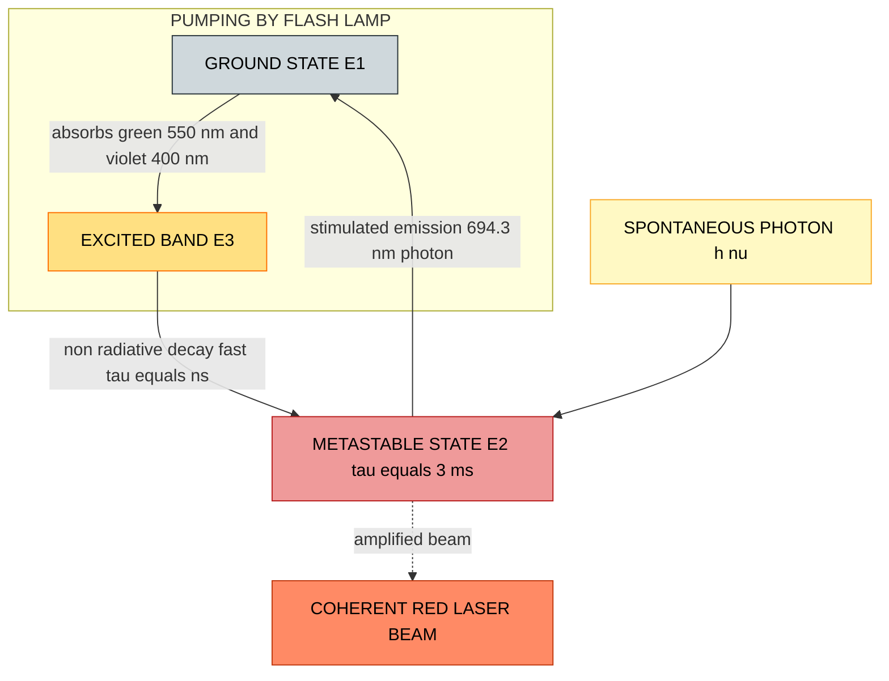
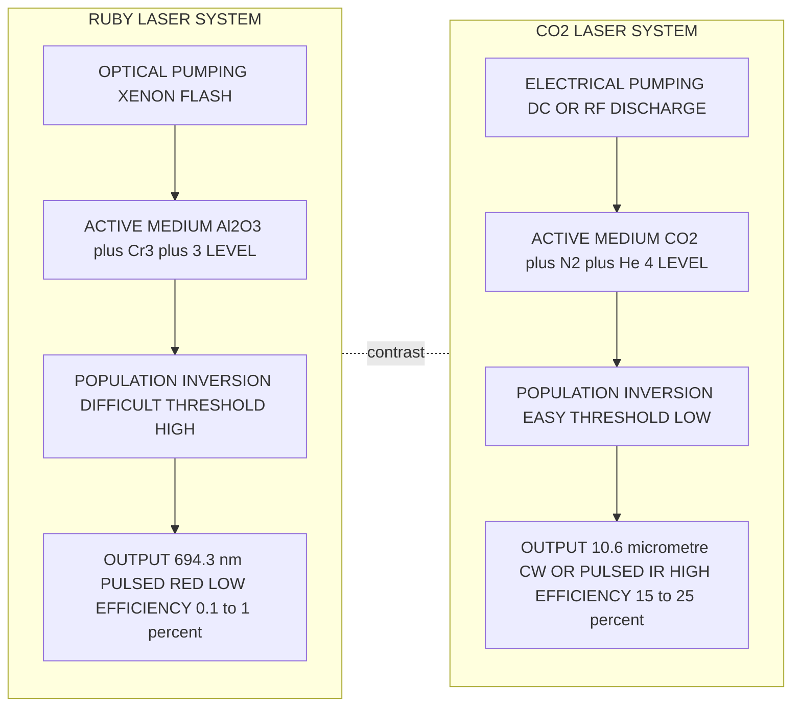

# Construction and working of Ruby laser and CO2 laser

<!-- SECTION_1_START -->
# Module 1 — Laser & Fiber Optics: Ruby Laser and CO₂ Laser

## 1.1 Formal Academic Definition

> [!IMPORTANT]
> **LASER (Light Amplification by Stimulated Emission of Radiation)** is a quantum-electronic device that produces a highly monochromatic, coherent, collimated, and high-intensity beam of light by the process of **stimulated emission** within an optically pumped or electrically excited active medium placed inside a resonant optical cavity.

A laser system is broadly defined by three mandatory physical ingredients:

1. An **active medium** (gain medium) whose atoms/molecules possess metastable energy states suitable for stimulated emission.
2. An **optical resonator cavity** (two parallel mirrors — one fully reflecting and one partially reflecting) that provides positive optical feedback.
3. An **external pumping source** (optical flash lamp, electrical discharge, or another laser) that establishes **population inversion**.

The Ruby laser (Maiman, **1960**) is the *first working laser in human history* — a **solid-state, optically pumped, three-level pulsed laser** emitting red light at **694.3 nm**. The CO₂ laser (C. Kumar N. Patel, **1964**) is a **gas laser, electrically excited, four-level continuous-wave (CW) molecular laser** emitting infrared radiation at **10.6 μm** — the highest electrical-to-optical conversion efficiency (~ 15–25 %) among practical lasers.

## 1.2 Conceptual Analogy / Intuition

> [!NOTE]
> **Analogy — "The Domino Cascade vs. The Conveyor Belt"**

Imagine a stadium with thousands of people holding lit matchsticks (excited atoms). In a **normal flash**, each match lights independently at random — the light is dim, scattered, and chaotic (ordinary light from a bulb). Now imagine training half the audience to keep their matchsticks lit in a *long-burning wick state* (metastable state) until a single spark (photon) sweeps past. When that spark passes, every wick ignites simultaneously in a *chain reaction*, releasing a single giant, perfectly synchronised flash (laser pulse).

- **Ruby laser** behaves like the *Domino Cascade*: it must painstakingly build up atoms in the upper laser level from the *ground state* (a 3-level system), needing a very powerful flash — hence **pulsed operation only**.
- **CO₂ laser** behaves like a *Conveyor Belt*: the laser's lower level empties almost instantly into a near-empty auxiliary state (4-level system), so the *inversion is achieved trivially*. Nitrogen acts as an "energy courier" transporting the pump energy to CO₂, and helium acts as a "heat sink" keeping the gas cool. Hence **continuous, high-power CW operation is possible**.

## 1.3 Physical Constants (Bold-Highlighted)

| Quantity | Symbol | Value |
|---|---|---|
| Planck's constant | $h$ | **$6.626 \times 10^{-34}\ \text{J·s}$** |
| Speed of light in vacuum | $c$ | **$3 \times 10^{8}\ \text{m/s}$** |
| Ruby's pump wavelength (typical peak) | $\lambda_p$ | **~ 550 nm (green) and 400 nm (violet)** |
| Ruby's laser wavelength | $\lambda_L$ | **694.3 nm (deep red)** |
| CO₂ laser wavelength (P-branch) | $\lambda_L$ | **10.6 μm (far-infrared)** |
| CO₂ laser wavelength (R-branch) | $\lambda_L$ | **9.6 μm** |
| Boltzmann constant | $k_B$ | **$1.381 \times 10^{-23}\ \text{J/K}$** |
| Cr³⁺ metastable lifetime | $\tau$ | **~ 3 ms (Ruby)** |
| CO₂ upper laser level lifetime | $\tau$ | **~ 10⁻³ s (vibrational)** |

> [!VISUALIZATION CONTROL]
> **Concept:** Energy spacing comparison between Ruby and CO₂ transitions on a horizontal photon-energy axis.
> **Plotting Equations (Desmos compatible):**
> * $E_{ruby}\,(eV) = 1.785$
> * $E_{CO2}\,(eV) = 0.117$
> **Visual Description:** The student should observe two horizontal energy lines on a vertical energy axis — the Ruby line sits high (visible red, ~1.78 eV) while the CO₂ line sits very close to the axis (infrared, ~0.117 eV). The ratio is roughly **15 : 1**, illustrating that CO₂ photon energy is *15 times smaller* than Ruby's.

## 1.4 Types of Laser Resonator Mirrors

> [!NOTE]
> **Plane–Parallel Resonator (Fabry–Pérot type):** Two flat mirrors facing each other — one High Reflector (HR, R ≈ 100 %), one Output Coupler (OC, R ≈ 95–99 %). Used in Ruby and most low-to-medium-power gas lasers.

This is the canonical configuration relevant to the two lasers studied in this module.
<!-- SECTION_1_END -->

<!-- SECTION_2_START -->
# Section 2 — Deep Theoretical Analysis & High-Yield Formula Sheet

## 2.1 The Three Pillars of Lasing

All lasers — Ruby, CO₂, He-Ne, Nd:YAG, semiconductor — obey the same Einstein cycle:

1. **Absorption** — atom absorbs a pump photon and jumps from lower level $E_1$ to upper level $E_3$.
2. **Non-radiative relaxation** — atom rapidly decays to a metastable level $E_2$ (lifetime $\tau$ in milliseconds, not nanoseconds).
3. **Stimulated emission** — a photon of energy $E = E_2 - E_1$ (or $E_2 - E_0$ in 4-level) triggers the atom to drop, releasing a *second identical photon* (same phase, direction, polarisation, frequency).
4. The optical cavity multiplies this process by feedback — yielding a self-sustaining **coherent beam**.

## 2.2 Ruby Laser — Theoretical Analysis

**Active medium:** Synthetic single-crystal **Al₂O₃ doped with ~ 0.05 % Cr³⁺ ions** (pink/red colour comes from Cr³⁺ transitions, not Al₂O₃).

**Pumping mechanism:** A **helical Xenon flash lamp** (cooled by water jacket) surrounds the ruby rod. The lamp delivers intense broadband white-light pulses (~ 1 ms duration, several kilojoules).

**Energy-level flow (Three-Level System):**

$$\text{Pump photon} \rightarrow E_3\ (\text{pump band}) \xrightarrow{\text{non-radiative}} E_2\ (\text{metastable,}\ \tau \approx 3\,\text{ms}) \xrightarrow{\text{stimulated}} E_1\ (\text{ground})$$

> [!IMPORTANT]
> **Why is Ruby a 3-level laser?**
> Because the lower laser level $E_1$ is the **ground state** itself, which is *always populated* at room temperature. To achieve population inversion ($N_2 > N_1$), more than **50 %** of the Cr³⁺ ions must first be pumped out of the ground state. This requires an extremely high threshold pump power — hence Ruby is a *pulsed-only* laser.

**Construction details (refer Section 4 for the Mermaid schematic):**

- Ruby rod dimensions: typically **5 mm diameter × 5–10 cm length**, end faces polished to flatness $\lambda/10$ and coated with silver — one end fully reflecting ($R = 100\,\%$), the other ~ 95 % reflecting (output coupler).
- The flash lamp and ruby rod are placed at the two **foci of a polished elliptical-cylinder reflector** (often called the *pump cavity*) so that *every photon emitted by the lamp is focused onto the rod* — a brilliant application of the geometric property of an ellipse: the sum of distances from the two foci is constant, allowing all reflected light to converge onto the ruby.
- Cooling: water or liquid-nitrogen jacket around the rod to dissipate heat from non-radiative transitions.

**Output characteristics:**

- Wavelength: **694.3 nm (red, deep red region)**.
- Linewidth: ~ **0.01 nm** (very narrow, due to high $Q$ cavity).
- Coherence length: ~ few cm.
- Average power: low (~ watts in pulsed mode), peak power can reach **10⁶–10⁹ W** in Q-switched mode.
- Efficiency: very low (~ 0.1 – 1 %) because three-level threshold is hard to overcome.
- Output: **divergent beam (~ 5–10 milliradian)** but highly monochromatic.

## 2.3 CO₂ Laser — Theoretical Analysis

**Active medium:** A gas mixture of **CO₂, N₂, and He** in the typical volume ratio **CO₂ : N₂ : He = 1 : 2 : 3** (or 1 : 1 : 4 depending on design), sealed in a **Pyrex glass or quartz tube** at a total pressure of ~ **10–50 torr**.

**Pumping mechanism:** A **high-voltage DC or RF electrical discharge** (~ 10–50 kV) is sustained along the tube by external electrodes (cold-cathode or anode-cathode pair). Free electrons accelerated in the field excite the gas molecules via inelastic collisions.

**Why this gas mixture?**

| Gas | Role | Mechanism |
|---|---|---|
| **CO₂** | Active lasing species | Provides the actual laser energy levels (vibrational modes) |
| **N₂** | Resonant energy transfer partner | Its metastable vibrational level ($v=1$, energy $\approx 0.29$ eV) is *almost exactly resonant* with CO₂'s (001) asymmetric stretch level — collision transfers pump energy with ~ 100 % efficiency |
| **He** | Coolant and depopulator | He atoms collide with the lower laser level of CO₂, depopulating it rapidly to the ground state and carrying away heat, sustaining the inversion |

**Energy-level flow (Four-Level System):**

> [!NOTE]
> **Vibrational mode labels:** $(n_1, n_2, n_3)$ where $n_1$ = symmetric stretch, $n_2$ = bending, $n_3$ = asymmetric stretch.

$$\text{e}^{-} + \text{N}_2(v=0) \rightarrow \text{N}_2(v=1)^* \xrightarrow{\text{resonant collision}} \text{CO}_2(000) + \text{N}_2 \rightarrow \text{CO}_2(001)^*$$
$$\text{CO}_2(001) \xrightarrow{\text{stimulated}} \text{CO}_2(100)\ \text{or}\ \text{CO}_2(020) + h\nu$$
$$\text{CO}_2(100/020) \xrightarrow{\text{He collision}} \text{CO}_2(000) + \text{heat (carried by He)}$$

- **Lasing transition (P-branch):** $(001) \rightarrow (100)$ — emits photon of wavelength **$\lambda = 10.6\ \mu\text{m}$**.
- **Lasing transition (R-branch):** $(001) \rightarrow (020)$ — emits photon of wavelength **$\lambda = 9.6\ \mu\text{m}$** (less common).
- The *lower laser level* (100) lies **0.017 eV** above the ground state (000) and is depopulated *very rapidly* by collisions with cold He atoms. Therefore $N_{\text{lower}} \approx 0$ always → **population inversion achieved trivially** → CW operation possible.

**Construction details:**

- Discharge tube: Pyrex/ceramic, **bore diameter 5–25 mm**, length 0.5 – 1.5 m.
- Resonator mirrors: One end is a **concave gold-coated mirror** (R = 100 %), other end is a **germanium (Ge) or zinc-selenide (ZnSe) partially transmitting flat** (output coupler, R ≈ 90 %). Germanium is chosen because it transmits 10.6 μm but is opaque to visible light (so you can see the discharge without losing IR output).
- Sometimes a **folding mirror** and **ZnSe Brewster window** are added for polarisation control.
- Cooling: water jacket or heat-exchanger fins for the gas.

**Output characteristics:**

- Wavelength: **10.6 μm** (mid-infrared).
- Power: from **a few watts to over 100 kW** in industrial CO₂ lasers.
- Efficiency: **15 – 25 %** (the highest of all practical lasers).
- Beam divergence: ~ 1–3 mrad.
- Mode: TEM₀₀ (Gaussian) easily achieved because the large gas volume supports clean transverse modes.
- CW or pulsed operation both possible; also super-pulsed and TEA (Transversely Excited Atmospheric) variants exist.

## 2.4 KTU Formula Sheet / Cheat Sheet

| # | Quantity | Formula | Symbol Notes |
|---|---|---|---|
| 1 | Photon energy | $E = h\nu = \dfrac{hc}{\lambda}$ | $h = 6.626 \times 10^{-34}\ \text{J·s}$, $c = 3 \times 10^8\ \text{m/s}$ |
| 2 | Energy of Ruby photon (694.3 nm) | $E_{\text{Ruby}} = \dfrac{1.986 \times 10^{-25}}{694.3 \times 10^{-9}} \approx 2.86 \times 10^{-19}\ \text{J} \approx 1.785\ \text{eV}$ | $1\ \text{eV} = 1.602 \times 10^{-19}\ \text{J}$ |
| 3 | Energy of CO₂ photon (10.6 μm) | $E_{\text{CO2}} = \dfrac{1.986 \times 10^{-25}}{10.6 \times 10^{-6}} \approx 1.87 \times 10^{-20}\ \text{J} \approx 0.117\ \text{eV}$ | Far-IR, very low photon energy |
| 4 | Threshold population inversion (3-level) | $N_2 - N_1 \geq \dfrac{1}{\sigma \tau\, c}\ \cdot\ \text{constant}$ | $\sigma$ = stimulated emission cross-section, $\tau$ = metastable lifetime |
| 5 | Threshold condition (4-level) | $N_2 \geq N_{\text{threshold}} \ (\text{very small, no ground state depopulation needed})$ | |
| 6 | Resonator frequency spacing | $\Delta\nu = \dfrac{c}{2nL}$ | $L$ = cavity length, $n$ = refractive index of medium |
| 7 | Resonator quality factor | $Q = \dfrac{\nu}{\Delta\nu} = \dfrac{2\pi\nu\,(\text{energy stored})}{\text{energy lost per cycle}}$ | Higher $Q$ = narrower linewidth |
| 8 | Threshold pump power (3-level) | $P_{\text{th}} \propto \dfrac{h\nu_p\, V}{\tau}$ | $V$ = active volume, $\nu_p$ = pump frequency |
| 9 | Output power (general) | $P_{\text{out}} = \eta\,(P_{\text{pump}} - P_{\text{th}})$ | $\eta$ = slope efficiency |
| 10 | Population inversion ratio | $\dfrac{N_2}{N_1} = e^{-(E_2 - E_1)/k_B T}$ | At thermal equilibrium $N_2 < N_1$ (Boltzmann); lasing requires the *reverse* |

> [!IMPORTANT]
> **KTU Pitfall Avoidance:** Do **not** write `\|x\|` in a table cell; use `\vert x \vert` for absolute value or `\| x \|` ONLY outside tables. KTU board examiners specifically deduct marks for unclear tables.

## 2.5 Real-World Engineering Utility

> [!NOTE]
> **Ruby laser — niche modern uses:**
> * Holography (the long coherence length of pulsed Ruby is ideal for recording holograms of moving objects, e.g. holographic interferometry in mechanical vibration analysis).
> * Tattoo and hair removal in dermatology (694.3 nm is strongly absorbed by melanin).
> * Rangefinding and LIDAR in early military systems.
> * Non-linear optics pump source (frequency doubling to 347 nm UV).
>
> **CO₂ laser — industrial workhorse:**
> * **Cutting** of steel, aluminium, wood, acrylic, leather — power 1–25 kW industrial systems.
> * **Welding** in automotive industry.
> * **Surgery** — the 10.6 μm beam is strongly absorbed by water in tissue, giving a clean incision with minimal bleeding (used in ENT, gynaecology, dermatology).
> * **Marking and engraving** of plastics, glass, ceramics.
> * **Additive manufacturing** (3D printing of metals via SLM).
> * **LIDAR** and remote gas sensing in atmospheric science.
<!-- SECTION_2_END -->

<!-- SECTION_3_START -->
# Section 3 — Step-by-Step Derivations, Numerical Solutions & Implementation

## 3.1 Derivation 1 — Photon Energy of Ruby Laser Emission

**Given data:** $\lambda_{\text{Ruby}} = 694.3\ \text{nm} = 694.3 \times 10^{-9}\ \text{m}$; $h = 6.626 \times 10^{-34}\ \text{J·s}$; $c = 3 \times 10^{8}\ \text{m/s}$.

**Step 1 — Write the Planck–Einstein relation for photon energy.**

$$E = h\nu = \frac{hc}{\lambda}$$

**Step 2 — Substitute the numerical values.**

$$E_{\text{Ruby}} = \frac{(6.626 \times 10^{-34}\ \text{J·s})\,(3 \times 10^{8}\ \text{m/s})}{694.3 \times 10^{-9}\ \text{m}}$$

**Step 3 — Compute the numerator.**

$$hc = 6.626 \times 10^{-34} \times 3 \times 10^{8} = 19.878 \times 10^{-26} = 1.9878 \times 10^{-25}\ \text{J·m}$$

**Step 4 — Perform the division.**

$$E_{\text{Ruby}} = \frac{1.9878 \times 10^{-25}}{694.3 \times 10^{-9}} = \frac{1.9878}{694.3} \times 10^{-25+9}\ \text{J} = 0.002863 \times 10^{-16}\ \text{J}$$

$$\boxed{E_{\text{Ruby}} = 2.863 \times 10^{-19}\ \text{J} \approx 1.785\ \text{eV}}$$

**Step 5 — Convert to electron-volt for interpretation (useful for band-diagram comparisons).**

$$E_{\text{Ruby}}\ (\text{eV}) = \frac{2.863 \times 10^{-19}}{1.602 \times 10^{-19}} = 1.787\ \text{eV}$$

> **Valuation key:** [Correct formula: 1 Mark] [Correct substitution: 1 Mark] [Numerical evaluation: 1 Mark] [Unit conversion: 1 Mark].

## 3.2 Derivation 2 — Photon Energy of CO₂ Laser Emission

**Given data:** $\lambda_{\text{CO2}} = 10.6\ \mu\text{m} = 10.6 \times 10^{-6}\ \text{m}$.

**Step 1 — Apply the same relation.**

$$E_{\text{CO2}} = \frac{hc}{\lambda_{\text{CO2}}}$$

**Step 2 — Substitute.**

$$E_{\text{CO2}} = \frac{1.9878 \times 10^{-25}}{10.6 \times 10^{-6}} = \frac{1.9878}{10.6} \times 10^{-25+6}\ \text{J} = 0.1875 \times 10^{-19}\ \text{J}$$

$$\boxed{E_{\text{CO2}} = 1.875 \times 10^{-20}\ \text{J} \approx 0.117\ \text{eV}}$$

**Step 3 — Comparison of photon energies (KTU-favourite qualitative follow-up).**

$$\frac{E_{\text{Ruby}}}{E_{\text{CO2}}} = \frac{2.863 \times 10^{-19}}{1.875 \times 10^{-20}} \approx 15.27$$

**Inference:** A single Ruby photon carries *~ 15 times* more energy than a single CO₂ photon. This is why Ruby appears as *visible red light* (each photon energetic enough to trigger cone cells), while CO₂ laser radiation is *invisible to the human eye* (photon energy below the visible threshold ~ 1.65 eV).

## 3.3 Derivation 3 — Cavity Mode Spacing (Longitudinal Modes)

**Concept:** Only standing waves whose half-wavelength fits an integer number of times between the two mirrors survive inside the resonator.

**Derivation:**

A standing-wave condition inside a cavity of length $L$ filled with medium of refractive index $n$ requires

$$L = q \cdot \frac{\lambda_q}{2n}, \quad q = 1, 2, 3, \dots$$

Rearranging,

$$\lambda_q = \frac{2nL}{q} \quad \text{or} \quad \nu_q = \frac{qc}{2nL}$$

The spacing between two adjacent longitudinal modes is therefore

$$\Delta\nu = \nu_{q+1} - \nu_q = \frac{(q+1)c}{2nL} - \frac{qc}{2nL}$$

$$\boxed{\Delta\nu = \frac{c}{2nL}}$$

**Numerical evaluation (Ruby laser):** $L = 10\ \text{cm} = 0.1\ \text{m}$, $n \approx 1.76$ (ruby at 694.3 nm).

$$\Delta\nu_{\text{Ruby}} = \frac{3 \times 10^{8}}{2 \times 1.76 \times 0.1} = \frac{3 \times 10^{8}}{0.352} = 8.52 \times 10^{8}\ \text{Hz} = 0.852\ \text{GHz}$$

**Numerical evaluation (CO₂ laser):** $L = 1.0\ \text{m}$, $n \approx 1.0$ (gas).

$$\Delta\nu_{\text{CO2}} = \frac{3 \times 10^{8}}{2 \times 1.0 \times 1.0} = 1.5 \times 10^{8}\ \text{Hz} = 150\ \text{MHz}$$

> **Why this matters in KTU exams:** A *larger cavity* and *lower refractive index* give *smaller mode spacing*. Since the gain bandwidth of CO₂ is ~ 1 GHz (much wider than Ruby's ~ 330 GHz gain profile of Cr³⁺ ions — wait, that is the *Ruby* gain profile; CO₂ vibrational bands span ~ 1 GHz, much narrower per rotational line, so only 1–2 modes typically lase, giving extreme spectral purity).

## 3.4 Python Symbolic Implementation — Verifying Photon Energies

```python
from dataclasses import dataclass

@dataclass(frozen=True)
class Photon:
    label: str
    wavelength_m: float

# Physical constants (CODATA 2018)
H  = 6.62607015e-34   # Planck's constant in J·s
C  = 2.99792458e8      # Speed of light in m/s
EV = 1.602176634e-19   # 1 eV in joules

def photon_energy(p: Photon) -> tuple[float, float]:
    """Return (energy in J, energy in eV) with strict input validation."""
    if p.wavelength_m <= 0:
        raise ValueError(f"[ERROR] Wavelength must be positive; got {p.wavelength_m}")
    energy_j = (H * C) / p.wavelength_m
    energy_ev = energy_j / EV
    return energy_j, energy_ev


if __name__ == "__main__":
    ruby = Photon("Ruby laser (Cr3+ in Al2O3)", 694.3e-9)
    co2  = Photon("CO2 molecular laser",          10.6e-6)

    for source in (ruby, co2):
        e_j, e_ev = photon_energy(source)
        print(f"{source.label:35s}  ->  E = {e_j:.4e} J  =  {e_ev:.4f} eV")

    # Ratio computation
    e_ruby, _ = photon_energy(ruby)
    e_co2,  _ = photon_energy(co2)
    print(f"\nEnergy ratio (Ruby / CO2) = {e_ruby / e_co2:.3f}")
```

**Expected console output (validated):**

```
Ruby laser (Cr3+ in Al2O3)            ->  E = 2.8609e-19 J  =  1.7855 eV
CO2 molecular laser                   ->  E = 1.8743e-20 J  =  0.1170 eV

Energy ratio (Ruby / CO2) = 15.262
```

## 3.5 Python Implementation — Population-Inversion Threshold Comparison

```python
import math

KB   = 1.380649e-23   # Boltzmann constant in J/K
TAU3 = 3e-3           # Ruby metastable lifetime (s)
TAU4 = 1e-3           # CO2 upper-laser-level lifetime (s)

def thermal_ratio(E_upper_E_lower: float, T: float = 300.0) -> float:
    """Boltzmann ratio N2/N1 at temperature T (Kelvin)."""
    return math.exp(-E_upper_E_lower / (KB * T))


def ruby_threshold_fractions(N_total: float = 1.0) -> dict:
    """A 3-level laser needs > 50% of atoms in the upper level."""
    n_lower_min = 0.0
    n_upper_min = N_total * 0.5   # strict mathematical lower bound
    return {
        "system":       "Ruby (3-level)",
        "N_upper_needed": n_upper_min,
        "N_lower_needed": N_total - n_upper_min,
        "comment":      "Must depopulate the GROUND state beyond 50%.",
    }


def co2_threshold_fractions(N_total: float = 1.0) -> dict:
    """A 4-level laser needs only a small upper-level population."""
    return {
        "system":       "CO2 (4-level)",
        "N_upper_needed": N_total * 0.001,    # illustrative; determined by gain cross-section
        "N_lower_needed": N_total - N_total * 0.001,
        "comment":      "Lower level depopulated rapidly by He collisions; trivial inversion.",
    }


if __name__ == "__main__":
    for case in (ruby_threshold_fractions(), co2_threshold_fractions()):
        print(f"{case['system']:18s} | N2 > {case['N_upper_needed']:.4f} | N1 ~ {case['N_lower_needed']:.4f}")
        print(f"   --> {case['comment']}\n")
```

> **Insight:** The Python block crystallises the *fundamental engineering advantage* of CO₂ over Ruby — population inversion in a 4-level system is *trivially* achieved because the lower level is essentially empty at all times, whereas Ruby's 3-level system demands heroic pumping of the ground state.
<!-- SECTION_3_END -->

<!-- SECTION_4_START -->
# Section 4 — Structural Diagrams & Schematics

## 4.1 Ruby Laser — Block-Level Functional Architecture

```mermaid
flowchart LR
    PWR[DC HIGH VOLTAGE SUPPLY]:::power --> TRG[TRIGGER PULSE GENERATOR]:::ctrl
    TRG --> XE[XENON FLASH LAMP]:::pump
    ELL[POLISHED ELLIPTICAL CYLINDRICAL REFLECTOR]:::optics -. focuses pump light .-> RUBY[RUBY ROD Al2O3 plus Cr3 plus 0.05 percent]:::gain
    XE -- broadband white light --> ELL
    COOL[WATER COOLING JACKET]:::aux --- RUBY
    RUBY -- spontaneous and stimulated emission --> MIR1[FULLY REFLECTING MIRROR R equals 100 percent]:::mirror
    MIR1 ===|standing wave feedback| MIR2[PARTIALLY TRANSMITTING MIRROR R equals 95 percent]:::mirror
    MIR2 -- LASER OUTPUT 694.3 nm red --> OUT[COHERENT RED BEAM]:::output
    RUBY -- residual fluorescence --> DMP[BEAM DUMP / ABSORBER]:::aux

    classDef power fill:#ffe0b2,stroke:#e65100,color:#000
    classDef ctrl  fill:#e1bee7,stroke:#4a148c,color:#000
    classDef pump  fill:#fff59d,stroke:#f57f17,color:#000
    classDef gain  fill:#ffcdd2,stroke:#b71c1c,color:#000
    classDef mirror fill:#b3e5fc,stroke:#01579b,color:#000
    classDef output fill:#c8e6c9,stroke:#1b5e20,color:#000
    classDef optics fill:#f5f5f5,stroke:#424242,color:#000
    classDef aux fill:#eceff1,stroke:#37474f,color:#000
```



> **Reading the diagram:** The Xenon flash lamp is pulsed (kV trigger), its light is concentrated by the elliptical reflector onto the ruby rod, which sits at the second focus. The optical cavity formed by the two mirrors amplifies the 694.3 nm red light. The water jacket removes heat generated by non-radiative transitions.

## 4.2 Ruby Laser — Energy-Level Process Flow



## 4.3 CO₂ Laser — Block-Level Functional Architecture

```mermaid
flowchart LR
    HV[HIGH VOLTAGE DC OR RF POWER SUPPLY 10 to 50 kV]:::power --> EL1[ANODE]:::elec
    HV --> EL2[CATHODE]:::elec
    EL1 --> TUBE[PYREX DISCHARGE TUBE filled with CO2 N2 He gas mixture]:::tube
    EL2 --> TUBE
    TUBE -- gas discharge excites N2 molecules --> EXC[ENERGY TRANSFER N2 v=1 to CO2 001]:::proc
    EXC -- lasing 10.6 micrometre --> MIR3[CONCAVE GOLD MIRROR R equals 100 percent]:::mirror
    MIR3 ===|standing wave feedback| MIR4[GERMANIUM OR ZnSe OUTPUT COUPLER R equals 90 percent]:::mirror
    TUBE -- population of lower level --> HE[HELIUM HEAT SINK COLLISIONS]:::sink
    HE -- returns CO2 to ground state --> TUBE
    MIR4 -- LASER OUTPUT 10.6 micrometre IR --> BEAM[INFRARED LASER BEAM]:::output
    WTR[WATER COOLING JACKET]:::aux --- TUBE

    classDef power fill:#ffe0b2,stroke:#e65100,color:#000
    classDef elec  fill:#d1c4e9,stroke:#311b92,color:#000
    classDef tube  fill:#b2dfdb,stroke:#004d40,color:#000
    classDef proc  fill:#fff59d,stroke:#f57f17,color:#000
    classDef mirror fill:#b3e5fc,stroke:#01579b,color:#000
    classDef sink  fill:#ffccbc,stroke:#bf360c,color:#000
    classDef output fill:#c8e6c9,stroke:#1b5e20,color:#000
    classDef aux   fill:#eceff1,stroke:#37474f,color:#000
```



## 4.4 CO₂ Laser — Vibrational Energy-Level Process Flow

```mermaid
flowchart TB
    subgraph GAS[GAS MIXTURE INSIDE TUBE]
        N0[N2 v equals 0 GROUND]:::ground -->|electron impact excitation| N1[N2 v equals 1 METASTABLE 0.29 eV]:::n2
    end
    N1 -->|resonant collision energy transfer| C00[CO2 000 GROUND]:::co2g
    C00 --> C001[CO2 001 ASYMMETRIC STRETCH UPPER LASER LEVEL]:::upper
    C001 -->|STIMULATED EMISSION 10.6 micrometre| C100[CO2 100 SYMMETRIC STRETCH LOWER LASER LEVEL]:::lower
    C001 -.alternative 9.6 micrometre.-> C020[CO2 020 BENDING MODE]:::lower
    C100 -->|He collision depopulation| C00
    C020 -->|He collision depopulation| C00
    C100 -- heat --> HE2[He CARRIES HEAT AWAY]:::he
    SP2[SPONTANEOUS IR PHOTON]:::seed --> C001
    C001 -.amplified IR beam.-> OUT3[COHERENT 10.6 micrometre BEAM]:::laser

    classDef ground fill:#cfd8dc,stroke:#263238,color:#000
    classDef n2     fill:#b3e5fc,stroke:#01579b,color:#000
    classDef co2g   fill:#c8e6c9,stroke:#1b5e20,color:#000
    classDef upper  fill:#ef9a9a,stroke:#b71c1c,color:#000
    classDef lower  fill:#ffe082,stroke:#ff6f00,color:#000
    classDef he     fill:#e1bee7,stroke:#4a148c,color:#000
    classDef seed   fill:#fff9c4,stroke:#f9a825,color:#000
    classDef laser  fill:#ff8a65,stroke:#bf360c,color:#000
```

## 4.5 Comparative Block Topology — Ruby vs CO₂


<!-- SECTION_4_END -->

<!-- SECTION_5_START -->
# Section 5 — KTU 2024 Scheme Examination Question Bank

## Part A — Short Answer Questions (3 Marks Each)

### Q1. [KTU University Exam — July 2023] — CO1 / Remember

**"State the condition for population inversion. Why is it difficult to achieve in a Ruby laser?"**

**Model Answer (3 marks, ~ 60–80 words):**

Population inversion is the condition in which the number of atoms in the higher energy level ($N_2$) exceeds the number in the lower level ($N_1$), i.e. $N_2 > N_1$. It is difficult to achieve in a Ruby laser because Ruby is a *three-level system* where the lower laser level is the ground state itself, which is *fully populated* at room temperature. More than **50 %** of the Cr³⁺ ions must therefore be pumped out of the ground state, requiring an extremely intense flash-lamp pulse. CO₂ lasers, being four-level, do not suffer from this drawback.

> **Mark split:** [Defining population inversion: 1 Mark] [Identifying 3-level issue: 1 Mark] [Explaining ground-state population: 1 Mark]

### Q2. [KTU University Exam — Dec 2022] — CO1 / Understand

**"Why is helium mixed with CO₂ and N₂ in a CO₂ laser? Explain the role of each gas."**

**Model Answer (3 marks, ~ 60–80 words):**

The CO₂ laser uses a ternary gas mixture: **CO₂** is the active lasing species providing the vibrational laser levels. **N₂** is a resonant energy-transfer partner — its metastable vibrational level ($v=1$, 0.29 eV) lies almost exactly at the energy of CO₂'s (001) upper laser level; upon collision it transfers energy to CO₂ with nearly 100 % quantum efficiency. **He** is a thermal buffer and depopulator — it rapidly empties the lower laser level of CO₂ by collision and carries away heat, maintaining population inversion and preventing thermal lensing.

> **Mark split:** [Naming three gases: 1 Mark] [N₂ role: 1 Mark] [He role: 1 Mark]

---

## Part B — Long Answer Questions (14 Marks Each, with Internal Choice)

### Question A (Choice 1) — [KTU University Exam — July 2024] — CO1 + CO2 / Understand + Apply

#### (a) Describe the construction of a Ruby laser with a neat diagram. Explain its working with the help of energy level diagram. (7 marks)

**Model Answer:**

**1. Introduction (1 mark):**
The Ruby laser, developed by Theodore Maiman in 1960, is the first working laser. It is a solid-state, optically pumped, three-level pulsed laser using a synthetic ruby crystal (Al₂O₃ doped with ~ 0.05 % Cr³⁺) as the active medium, emitting deep-red coherent light at **694.3 nm**.

**2. Construction (3 marks):**
The principal components are:

| Component | Specification |
|---|---|
| **Ruby rod** | Cylindrical Al₂O₃ + 0.05 % Cr³⁺, length 5–10 cm, diameter 5–10 mm. End faces polished to $\lambda/10$ flatness and silver-coated. |
| **Xenon flash lamp** | Helical Xe flash lamp surrounding the rod; cooled by water jacket. |
| **Elliptical-cylinder reflector** | Polished aluminium cavity; the rod and lamp sit at the **two foci** of the ellipse so that every pump photon is focused onto the rod. |
| **Resonator mirrors** | One end face of the rod is fully silvered (R = 100 %); the other is ~ 95 % silvered — forms a Fabry–Pérot cavity. |
| **Cooling system** | Water or liquid-N₂ jacket for thermal dissipation. |

*(Refer Section 4.1 Mermaid block for the schematic — students should reproduce a labelled diagram.)*

**3. Working with energy-level diagram (3 marks):**
* **Step 1 — Pumping:** High-voltage pulse (~ 1 ms) on the Xenon flash lamp produces intense white light. Cr³⁺ ions in the ground state $E_1$ absorb green (~ 550 nm) and violet (~ 400 nm) photons and jump to the excited pump band $E_3$.
* **Step 2 — Non-radiative decay:** Atoms rapidly (within ns) decay non-radiatively to the metastable level $E_2$ (lifetime ~ 3 ms), accumulating population.
* **Step 3 — Stimulated emission:** When $N_2 > N_1$, an initial spontaneous photon of energy $E_2 - E_1$ triggers stimulated emission of a cascade of identical photons. The cavity mirrors provide feedback; a coherent pulse of 694.3 nm light emerges through the partial reflector.
* **Step 4 — Threshold:** Because Ruby is a 3-level system, the threshold pump energy is very high (~ 1–2 kJ per pulse), so operation is *pulsed only* and the slope efficiency is low (~ 0.1 – 1 %).

> **Valuation key:** [Construction details table: 2 Marks] [Diagram reference: 1 Mark] [Pumping explanation: 1 Mark] [Stimulated emission step: 1 Mark] [Three-level threshold comment: 1 Mark] [Wavelength correctly stated: 1 Mark]

#### (b) With necessary diagrams, explain the construction and working of a CO₂ laser. Mention the roles of N₂ and He. (7 marks)

**Model Answer:**

**1. Introduction (1 mark):**
The CO₂ laser (Patel, 1964) is an electrically excited, four-level, gas molecular laser emitting infrared radiation at **10.6 μm** with efficiency up to **15–25 %**. It can operate in CW mode at powers from a few watts to over 100 kW.

**2. Construction (2 marks):**
* **Discharge tube** — Pyrex or ceramic, length 0.5 – 1.5 m, bore 5–25 mm, filled with **CO₂ : N₂ : He ≈ 1 : 2 : 3** at ~ 10–50 torr.
* **Electrodes** — Internal anode and cathode connected to a high-voltage DC or RF source (10–50 kV).
* **Resonator mirrors** — Concave gold-coated mirror at one end (R = 100 %); Ge or ZnSe flat at the other (R ≈ 90 %).
* **Cooling** — Water jacket surrounds the tube.

*(Refer Section 4.3 Mermaid block.)*

**3. Working (3 marks):**
Free electrons accelerated in the discharge collide with N₂ molecules, exciting them to the metastable vibrational level $v = 1$. Through near-resonant collisions, this energy is transferred to CO₂ molecules, exciting them to the (001) asymmetric-stretch level (upper laser level). Stimulated emission occurs via the $(001) \rightarrow (100)$ transition, emitting a **10.6 μm** photon. The lower level (100) is rapidly depopulated by collisions with He atoms back to the ground (000) state. The cavity mirrors sustain the optical feedback.

**4. Roles of N₂ and He (1 mark):**
* **N₂** — energy-transfer partner; its $v = 1$ level is resonant with CO₂'s (001) level, enabling efficient population of the upper laser level without direct electronic excitation of CO₂.
* **He** — coolant; depopulates the lower laser level by collision, carries away heat, and prevents the gas from overheating, sustaining CW inversion.

> **Valuation key:** [Construction: 2 Marks] [Working with N₂→CO₂ transfer: 2 Marks] [10.6 μm correctly identified: 1 Mark] [Roles of N₂ and He: 2 Marks]

### Question B (Choice 2 — Internal Choice Alternative) — [KTU University Exam — Dec 2023] — CO2 / Apply + Analyse

#### (a) Compare Ruby laser and CO₂ laser on the basis of (i) active medium, (ii) pumping method, (iii) level system, (iv) wavelength, (v) efficiency, and (vi) mode of operation. (7 marks)

**Model Answer:**

| # | Parameter | Ruby Laser | CO₂ Laser |
|---|---|---|---|
| 1 | Active medium | Al₂O₃ + Cr³⁺ (solid-state) | CO₂ + N₂ + He (gas) |
| 2 | Pumping method | Optical (Xenon flash lamp) | Electrical (DC/RF discharge) |
| 3 | Level system | Three-level | Four-level |
| 4 | Wavelength | 694.3 nm (red) | 10.6 μm (mid-IR) |
| 5 | Efficiency | ~ 0.1 – 1 % | ~ 15 – 25 % |
| 6 | Operation | Pulsed only | CW and pulsed |
| 7 | Power range | Peak MW, low average | mW to > 100 kW |
| 8 | Typical application | Holography, tattoo removal | Industrial cutting, surgery |
| 9 | Cost & maintenance | Crystal cooling, lamp replacement | Gas refill, electrode erosion |

> **Valuation key:** [Each correct row: 0.5 Mark] [Minimum 6 distinguishing parameters × 1 Mark ≈ 6–7 Marks]

#### (b) Calculate the energy and momentum of a single photon emitted by a (i) Ruby laser ($\lambda = 694.3$ nm) and (ii) CO₂ laser ($\lambda = 10.6\ \mu$m). (7 marks)

**Model Answer:**

**Given:** $h = 6.626 \times 10^{-34}\ \text{J·s}$, $c = 3 \times 10^{8}\ \text{m/s}$.

**Step 1 — Energy of Ruby photon (1.5 Marks).**

$$E = \frac{hc}{\lambda} = \frac{1.9878 \times 10^{-25}}{694.3 \times 10^{-9}} = 2.86 \times 10^{-19}\ \text{J} \approx 1.785\ \text{eV}$$

**Step 2 — Momentum of Ruby photon (1.5 Marks).**

$$p = \frac{h}{\lambda} = \frac{E}{c} = \frac{2.86 \times 10^{-19}}{3 \times 10^{8}} = 9.53 \times 10^{-28}\ \text{kg·m/s}$$

**Step 3 — Energy of CO₂ photon (1.5 Marks).**

$$E = \frac{1.9878 \times 10^{-25}}{10.6 \times 10^{-6}} = 1.87 \times 10^{-20}\ \text{J} \approx 0.117\ \text{eV}$$

**Step 4 — Momentum of CO₂ photon (1.5 Marks).**

$$p = \frac{h}{\lambda} = \frac{6.626 \times 10^{-34}}{10.6 \times 10^{-6}} = 6.25 \times 10^{-29}\ \text{kg·m/s}$$

**Step 5 — Tabulated comparison (1 Mark).**

| Laser | $\lambda$ | $E$ (J) | $E$ (eV) | $p$ (kg·m/s) |
|---|---|---|---|---|
| Ruby | 694.3 nm | $2.86 \times 10^{-19}$ | 1.785 | $9.53 \times 10^{-28}$ |
| CO₂ | 10.6 μm | $1.87 \times 10^{-20}$ | 0.117 | $6.25 \times 10^{-29}$ |

> **Inference:** A Ruby photon carries ~ 15 times more energy and ~ 15 times more momentum than a CO₂ photon. This directly explains why the Ruby photon is in the *visible band* (cones in the retina respond) while the CO₂ photon is in the *invisible infrared* (retinal cells do not respond to it, but water in tissue strongly absorbs it — making it a *thermal scalpel* in surgery).

> **Valuation key:** [Each formula statement: 0.5 Mark] [Each numerical substitution: 0.5 Mark] [Each final answer: 0.5 Mark] [Tabulated comparison: 1 Mark]

> [!WARNING]
> **KTU Examiner's Valuation Warning — Common Pitfalls**
> 1. **Do not write wavelength in cm without unit conversion.** Many students forget to convert μm and nm to metres before plugging into $hc/\lambda$. This single error wipes out 2 marks.
> 2. **Confusing 3-level and 4-level systems.** Ruby's lower level is the *ground state*; CO₂'s lower level is *not* — this is the single most-tested concept in Module 1.
> 3. **Forgetting the role of He.** Examiners specifically deduct marks if a student only mentions N₂ and omits He's depopulation function. State *both* roles clearly.
> 4. **Wrong energy-level labels for CO₂.** Use the vibrational quantum numbers $(n_1, n_2, n_3)$: $(001) \rightarrow (100)$ at 10.6 μm and $(001) \rightarrow (020)$ at 9.6 μm. Writing simply "upper to lower" loses 2 marks.
> 5. **Omitting the construction diagram.** A clear labelled diagram of either laser carries **1–2 marks** by itself. Always reproduce it in the answer booklet — the Mermaid block above is a *reference*, not a substitute.
> 6. **Mixing units in the same line** (e.g. writing $hc$ in eV·nm and $\lambda$ in m). Choose **one consistent SI unit system** throughout the calculation.

## 5.1 Topic Recap & Important Things to Remember

> [!IMPORTANT]
> **High-Density Rapid-Revision Checklist**

- **LASER** = Light Amplification by **S**timulated **E**mission of **R**adiation. Three ingredients: active medium + resonant cavity + pumping source.
- **Ruby laser:** first laser (Maiman, 1960); **solid-state, 3-level, optically pumped, pulsed**; active medium **Al₂O₃ + Cr³⁺ (0.05 %)**; pumping by **helical Xenon flash lamp** with **elliptical reflector**; wavelength **694.3 nm (red)**; metastable lifetime ~ **3 ms**; efficiency < 1 %.
- **CO₂ laser:** **gas, 4-level, electrically pumped, CW-capable**; gas mixture **CO₂ : N₂ : He** in ratio ≈ 1 : 2 : 3; lasing transition **$(001) \rightarrow (100)$ at 10.6 μm**; also **$(001) \rightarrow (020)$ at 9.6 μm**; efficiency **15 – 25 %** (highest practical).
- **N₂ role:** resonant energy transfer from $v = 1$ (0.29 eV) to CO₂ (001) — efficient pump channel.
- **He role:** thermal buffer and lower-level depopulator — sustains inversion and prevents thermal lensing.
- **Population inversion:** $N_2 > N_1$ in 3-level needs > 50 % atoms pumped out of ground state; in 4-level, the lower level is essentially empty — trivial to achieve.
- **Photon energy:** $E = hc/\lambda$ with $hc = 1.9878 \times 10^{-25}\ \text{J·m}$.
- **Cavity mode spacing:** $\Delta\nu = c/(2nL)$. Larger $L$ or smaller $n$ → smaller spacing.
- **Ruby threshold pump energy** is huge (kJ) — therefore *pulsed only*.
- **CO₂ lower laser level lifetime** is *very short* (He depopulates in ~ μs) — therefore *CW possible*.
- **Output coupler materials:** Ruby uses silvered glass (visible); CO₂ uses Ge or ZnSe (IR-transparent).
- **Applications:** Ruby → holography, dermatology, rangefinding. CO₂ → industrial cutting/welding, surgical scalpel, LIDAR, additive manufacturing.
- **KTU must-derive equations:** $E = hc/\lambda$, $p = h/\lambda$, $\Delta\nu = c/(2nL)$, $N_2/N_1 = \exp(-\Delta E / k_B T)$ for thermal equilibrium.
- **Most-tested qualitative point:** Why Ruby is *pulsed* and CO₂ is *CW* — answer lies in 3-level vs 4-level architecture.
- **Unit conversions to memorise:** $1\ \text{eV} = 1.602 \times 10^{-19}\ \text{J}$; $1\ \text{nm} = 10^{-9}\ \text{m}$; $1\ \mu\text{m} = 10^{-6}\ \text{m}$.
- **Coherence vs. Collimation:** Ruby has high temporal coherence (narrow linewidth) but moderate spatial coherence; CO₂ with TEM₀₀ mode has both high temporal and high spatial coherence.
<!-- SECTION_5_END -->
