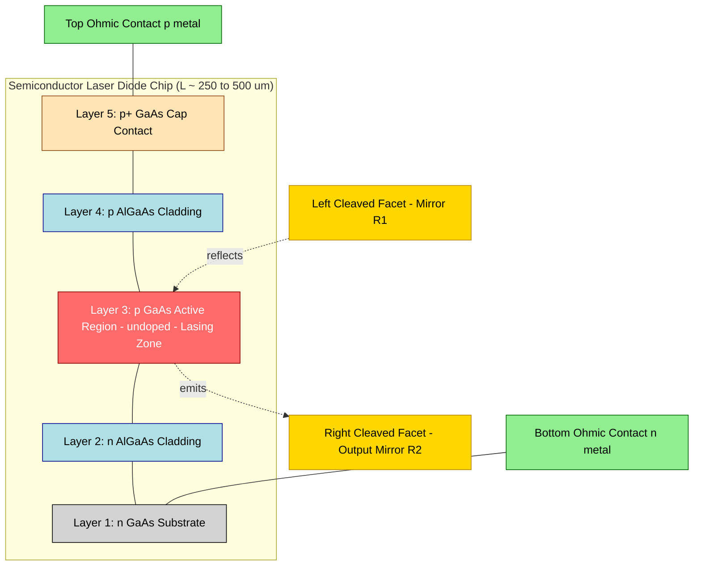
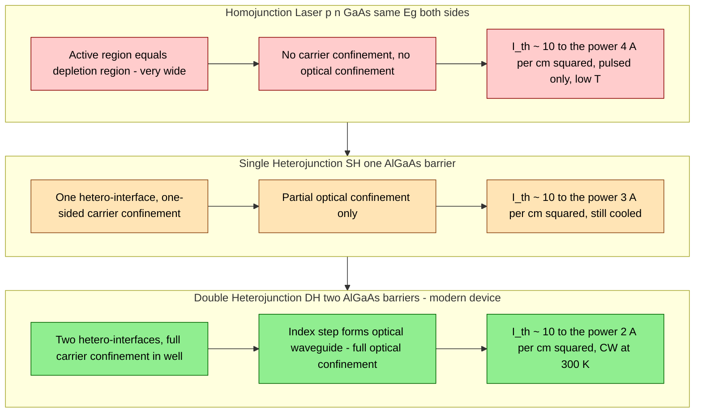

# Construction and working Semiconductor laser (qualitative)

<!-- SECTION_1_START -->
# Semiconductor Laser — Construction and Working (Qualitative)

## 1.1 Formal KTU Syllabus Definition

A **Semiconductor Laser** (also called a **Laser Diode (LD)** or **Injection Laser**) is a compact, electrically pumped solid-state laser in which the active lasing medium is a forward-biased **p–n junction** of a direct bandgap semiconductor (commonly **Gallium Arsenide (GaAs)**). When a sufficiently large forward current (greater than the **threshold current $I_{th}$**) is injected, a non-equilibrium condition of **population inversion** is established in the thin **depletion (active) region** at the junction. The subsequent **stimulated recombination** of conduction-band electrons with valence-band holes produces **coherent, monochromatic, and highly directional** light that emerges from the cleaved end-facets of the crystal, which act as a **Fabry–Péot optical resonator**.

> [!IMPORTANT]
> **KTU 2024 Highlight — GZPHT121 / Module 1**
> The treatment is **qualitative only**: the student is expected to describe construction (p–n junction, cleaved facets, ohmic contacts) and working (forward bias → carrier injection → recombination → stimulated emission → optical feedback) **without** deriving rate equations or solving for threshold conditions analytically.

> [!NOTE]
> **Key Distinction to Remember**
> * **LED** → spontaneous emission only, no threshold, incoherent.
> * **Semiconductor (Injection) Laser** → stimulated emission dominates above $I_{th}$, coherent, narrow linewidth, requires optical feedback cavity.

## 1.2 Conceptual Analogy — The "Water Slide" Picture

Imagine a steep **water slide** between two elevated tanks:

* Tank A (high) is filled with **electrons** in the conduction band of the n-side.
* Tank B (low) is filled with **holes** in the valence band of the p-side.
* The narrow **gap between the tanks** is the **depletion / active region** of the p–n junction.

When you **pump water** (the forward current) down the slide, droplets (carriers) reach the bottom in a coordinated, avalanche-like manner — this is **stimulated recombination**, releasing photons. Without pumping, water drips randomly (spontaneous emission = LED). The two **mirrored ends of the slide** (cleaved facets) reflect the released photons back and forth, triggering a *chain reaction* of identical, in-step drops — this is the **lasing action**.

## 1.3 Why a *Direct* Bandgap Semiconductor?

> [!IMPORTANT]
> For efficient **radiative recombination** (photon emission rather than heat/phonon emission), the semiconductor **must** have a **direct bandgap** — meaning the minimum of the conduction band and maximum of the valence band occur at the **same $k$-value (crystal momentum)** in the E–k diagram. This allows electron–hole recombination without needing a third particle (phonon) to conserve momentum, giving high **quantum efficiency**.
> **Examples:** GaAs ($E_g \approx 1.42$ eV, $\lambda \approx 870$ nm), InP, GaInP, AlGaAs.

Common direct-bandgap materials used in laser diodes:

| Material | Bandgap $E_g$ (eV) | Emission Wavelength $\lambda$ (nm) | Spectral Region |
|---|---|---|---|
| AlGaAs | 1.42 – 2.16 | 570 – 870 | Visible to near-IR |
| GaAs | 1.42 | 870 | Near-IR |
| InGaAsP | 0.73 – 1.35 | 920 – 1650 | Near-IR to telecom |
| InP | 1.35 | 920 | Near-IR |

> [!VISUALIZATION CONTROL]
> **Concept:** Direct vs. Indirect Bandgap Transition on the E–k diagram
> **GeoGebra / Desmos Input Equations:**
> * Conduction band: $E_c(k) = 1.42 + 0.5 \cdot k^2$ (arbitrary units, parabolic)
> * Valence band: $E_v(k) = -0.1 \cdot k^2$
> * Vertical transition at $k = 0$ showing photon emission $h\nu = E_g$
> **Visual Description:** On the horizontal $k$-axis (crystal momentum) and vertical $E$-axis (energy), the conduction band minimum and valence band maximum are aligned vertically at the **same $k$** → photon transition is direct, vertical, and highly probable.

<!-- SECTION_1_END -->

<!-- SECTION_2_START -->
# Deep Theoretical Analysis & KTU High-Yield Formula Sheet

## 2.1 Operational Concept — Broken Down Step by Step

The complete lasing cycle in a semiconductor laser can be broken into **six sequential, coupled processes**:

1. **Electrical Pumping (Injection)**
   * A **forward bias** voltage $V \geq E_g / e$ is applied across the heavily doped p–n junction.
   * Holes are injected from the p-side and electrons from the n-side into the **active (depletion) region**.

2. **Carrier Accumulation in the Active Region**
   * The thin active region (typical width $d \approx 0.1$–$1\ \mu m$ in double-heterojunction devices) confines injected carriers.
   * At sufficiently high injection, the electron quasi-Fermi level in the conduction band ($E_{Fc}$) lies **above** the conduction band edge, and the hole quasi-Fermi level in the valence band ($E_{Fv}$) lies **below** the valence band edge.

3. **Population Inversion (Bernard–Duraffourg Condition)**
   * The lasing condition requires:
   $$E_{Fc} - E_{Fv} > E_g$$
   * Equivalently, the **separation between quasi-Fermi levels must exceed the bandgap energy**.

4. **Stimulated Recombination → Photon Emission**
   * An incoming photon of energy $h\nu \geq E_g$ triggers an electron in $E_c$ to recombine with a hole in $E_v$, emitting a **second photon identical in phase, frequency, direction, and polarization** (coherent clone).

5. **Optical Amplification (Gain)**
   * The photon density grows exponentially along the cavity as $I(z) = I_0 \exp(gz)$, where $g$ is the **gain coefficient** (cm$^{-1}$).
   * Gain $g$ becomes positive only when $n_{inj} > n_{th}$ (injected carrier density exceeds threshold).

6. **Optical Feedback and Lasing Threshold**
   * The two **cleaved (or polished and coated) end-facets** of the crystal form a **Fabry–Péot resonator** of cavity length $L$.
   * Reflectivity $R \approx 0.32$ for the natural GaAs–air interface ($n \approx 3.6$); one facet may be HR-coated ($R \approx 0.95$–$0.99$) and the other AR-coated ($R \approx 0.05$–$0.30$) for output coupling.
   * Lasing begins when gain equals total losses (output + absorption + scattering):
   $$g_{th} = \alpha + \frac{1}{2L} \ln\!\left(\frac{1}{R_1 R_2}\right)$$
   * The corresponding drive current is the **threshold current $I_{th}$**.

## 2.2 KTU Formula Cheat Sheet

> [!NOTE]
> Memorise the symbols, units, and physical meaning. The **bold rows** are the most frequently asked in KTU exams.

| Symbol | Quantity | Expression / Meaning | Typical Value / Unit |
|---|---|---|---|
| $E_g$ | Bandgap energy | Energy gap between $E_c$ and $E_v$ | $0.7$ – $2.5$ eV |
| $h\nu$ | Photon energy | $h\nu \geq E_g$ for absorption | eV or J |
| $\lambda$ | Emission wavelength | $\lambda = \dfrac{hc}{E_g} = \dfrac{1.24\ \mu m \cdot eV}{E_g\,(eV)}$ | nm or $\mu m$ |
| $E_{Fc}, E_{Fv}$ | Quasi-Fermi levels | In conduction & valence bands under injection | eV |
| $I_{th}$ | Threshold current | Minimum forward current for lasing | mA to A |
| $J_{th}$ | Threshold current density | $J_{th} = I_{th} / A$ | A/cm$^2$ |
| $n_{th}$ | Threshold carrier density | Carrier density at $I = I_{th}$ | cm$^{-3}$ |
| $g_{th}$ | Threshold gain | $g_{th} = \alpha + \dfrac{1}{2L}\ln\!\left(\dfrac{1}{R_1 R_2}\right)$ | cm$^{-1}$ |
| $\eta_d$ | External differential quantum efficiency | $\eta_d = \dfrac{\Delta P_{out} / h\nu}{\Delta I / e}$ | dimensionless |
| $\eta_i$ | Internal quantum efficiency | Fraction of injected carriers that recombine radiatively | $\leq 1$ |
| $\Delta \nu$ | Linewidth | Very narrow ($\sim 1$ – $100$ MHz) | Hz |
| $R$ | Facet reflectivity | GaAs–air $\approx 0.32$ | dimensionless |
| $L$ | Cavity length | Active medium length | $\mu$m to mm |
| $\alpha$ | Internal loss coefficient | Free-carrier absorption, scattering | cm$^{-1}$ |

## 2.3 Real-World Engineering Utility

Semiconductor lasers are the **workhorses of modern photonics** because of their small size, high efficiency, direct electrical pumping, and ability to be modulated at GHz speeds. Key deployment domains:

* **Optical fiber communication** (1310 nm and 1550 nm InGaAsP lasers for long-haul telecom) — the backbone of the internet.
* **Optical data storage** — CD (780 nm GaAlAs), DVD (650 nm), Blu-ray (405 nm GaN) pickups.
* **Bar-code scanners, LIDAR, laser pointers** (typically 635–670 nm red diodes).
* **Pumping source for solid-state lasers** (e.g., 808 nm diodes pump Nd:YAG).
* **Medical surgery and dermatology** (specific absorption in tissue chromophores).
* **3-D sensing, autonomous vehicles, quantum cryptography**.

> [!IMPORTANT]
> The **double-heterojunction (DH) laser** by Zhores Alferov and Herbert Kroemer (Nobel Prize 2000) reduced $I_{th}$ from hundreds of mA (homojunction) to **tens of mA**, enabling room-temperature continuous-wave (CW) operation — a pivotal milestone in photonics history.

<!-- SECTION_2_END -->

<!-- SECTION_3_START -->
# Step-by-Step Construction, Working & Symbolic Implementation

## 3.1 Physical Construction of a Semiconductor Laser (Layer-by-Layer)

A standard **Double-Heterojunction (DH) GaAs/AlGaAs laser diode** consists of the following layers grown by **epitaxy** (MBE or MOCVD) on a GaAs substrate:

> [!NOTE]
> **Reading order is from the bottom (substrate) to the top (contact layer).** The active region is sandwiched in the middle.

| Layer # | Layer Name | Material | Doping | Typical Thickness | Function |
|---|---|---|---|---|---|
| 1 | Substrate | n-GaAs | $n \approx 10^{18}$ cm$^{-3}$ | $\sim 100\ \mu m$ | Mechanical support, bottom ohmic contact |
| 2 | Buffer / n-cladding | n-Al$_{x}$Ga$_{1-x}$As ($x \approx 0.3$–$0.4$) | n-type | $1$ – $5\ \mu m$ | Higher $E_g$, lower $n$ → **optical confinement** by total internal reflection |
| 3 | **Active region** | undoped (or lightly p-doped) GaAs | intrinsic (i) | $0.1$ – $0.3\ \mu m$ | **Where lasing happens** — recombination + stimulated emission |
| 4 | p-cladding | p-Al$_{x}$Ga$_{1-x}$As ($x \approx 0.3$–$0.4$) | p-type | $1$ – $2\ \mu m$ | Symmetric to n-cladding; higher $E_g$ → carrier confinement |
| 5 | Cap / contact | p$^{+}$-GaAs | very heavy p-type | $0.5\ \mu m$ | Low-resistance top ohmic contact |
| — | **End facets** | Cleaved crystal faces | — | — | Form the **Fabry–Péot cavity** mirrors ($R \approx 0.32$ each, or HR/AR coated) |
| — | **Side walls** | Saw-cut or etched | — | — | Suppress lateral modes; define stripe width $w \approx 5$ – $200\ \mu m$ |

The whole chip is typically only **250 – $500\ \mu m$ long**, **$100$ – $300\ \mu m$ wide**, and **$\sim 100\ \mu m$ thick** — a millimeter-scale device.

## 3.2 Working Principle — Step-by-Step Qualitative Walkthrough

### Stage 1: Equilibrium (Zero Bias)
At thermal equilibrium, the Fermi level $E_F$ is **constant** across the junction. The bands are bent near the junction, and a **depletion region** with a built-in potential $V_{bi} \approx E_g/e$ exists.

### Stage 2: Forward Bias Application
A forward bias $V_f$ (typically $1.2$ – $2.0$ V for GaAs) is applied, with the **p-side positive and n-side negative**. This:

* Reduces the band bending at the junction.
* Lowers the depletion width.
* Allows electrons to be injected from n into p and holes from p into n, **all converging in the active region**.

### Stage 3: Carrier Population Inversion
* At low current, the device behaves as an **LED** — random spontaneous emission.
* As $I$ increases, the carrier density in the active region rises.
* When $I \geq I_{th}$:
  $$E_{Fc} - E_{Fv} > E_g$$
  Population inversion is achieved.

### Stage 4: Photon Generation and Stimulated Emission
* Spontaneously emitted photons (or any stray photon) of energy $h\nu \approx E_g$ travel through the active region.
* They **stimulate** electron–hole recombinations, each producing an **identical** photon (same phase, direction, polarization, frequency).
* Photon flux grows exponentially with distance.

### Stage 5: Optical Feedback (Fabry–Péot Resonance)
* Photons reaching the cleaved facets are partially reflected back into the cavity.
* Standing-wave modes form satisfying:
$$m \lambda = 2 n L, \quad m = 1, 2, 3, \dots$$
where $n$ is the refractive index of the active medium (e.g., $n_{GaAs} \approx 3.6$).
* Only modes for which $g > $ total losses survive — these are the **longitudinal lasing modes**.

### Stage 6: Coherent Output
* A fraction of the intra-cavity photon flux escapes through the partially transmitting output facet.
* Output is **coherent, monochromatic, polarized** (TE-polarized, $\vec{E} \perp$ to junction plane), and emerges as a **narrow, highly divergent elliptical beam** (typical divergence $\theta_{\parallel} \approx 10°$, $\theta_{\perp} \approx 30°$ – $40°$).

## 3.3 Construction Evolution — Homojunction → Heterojunction

> [!IMPORTANT]
> The evolution from homojunction to heterojunction is the **core qualitative content** for KTU Module 1. Understand the **why** of each layer addition.

### (a) Homojunction Laser (p–n GaAs)
* Single material (GaAs) used for both sides.
* Active region is the depletion region itself — **wide** ($\sim 1\ \mu m$).
* Problem 1: **Poor carrier confinement** — carriers diffuse out of the active region → requires very high $I_{th}$ ($\sim 10^4$ A/cm$^2$).
* Problem 2: **No optical confinement** — emitted light spreads laterally and vertically, reducing gain.
* Consequence: only operates in **pulsed mode at low temperatures (77 K)**.

### (b) Single Heterojunction (SH) Laser
* Adds **one hetero-interface** between the active region and either p- or n-cladding.
* Provides a **potential barrier** for carriers → better confinement on one side.
* $I_{th}$ reduced to $\sim 10^3$ A/cm$^2$ — still needs cooling.

### (c) Double Heterojunction (DH) Laser — The Modern Workhorse
* Adds **two hetero-interfaces** (sandwich: n-AlGaAs / i-GaAs / p-AlGaAs).
* Provides **simultaneous**:
  1. **Carrier confinement** — discontinuities in $E_c$ and $E_v$ form potential wells in the active layer.
  2. **Optical confinement** — higher $E_g$ AlGaAs has **lower refractive index** → forms an **optical waveguide** (light is totally internally reflected back into the GaAs active layer).
* $I_{th}$ drops to $\sim 10^2$ A/cm$^2$ → **room-temperature CW operation** possible.

A schematic band-edge profile under forward bias is shown below:

$$
\begin{aligned}
E_c &\text{ (conduction band edge)}: \text{ step-down at both hetero-interfaces, narrow well of width } d \\
E_v &\text{ (valence band edge)}: \text{ step-up at both hetero-interfaces, narrow well} \\
E_{Fc} &\text{ lies above } E_c \text{ in the active region (electron population inversion)} \\
E_{Fv} &\text{ lies below } E_v \text{ in the active region (hole population inversion)} \\
E_{Fc} - E_{Fv} &> E_g \text{ in the well } \Rightarrow \text{ gain exists only in the active layer}
\end{aligned}
$$

## 3.4 Symbolic Python Model — Conceptual Carrier–Photon Rate Picture

The following Python code symbolically captures the **qualitative** operating regimes of a semiconductor laser (LED, gain, threshold, lasing). It is for conceptual understanding, not for KTU exam write-up, but illustrates the underlying physics.

```python
"""
Symbolic / conceptual model of a semiconductor laser's P–I (light vs current) curve.
Captures: spontaneous regime, threshold, stimulated-emission dominated regime.
"""

from dataclasses import dataclass
import math


@dataclass
class LaserParams:
    threshold_current_mA: float   # I_th
    slope_efficiency_W_per_A: float  # eta_d * (h nu / e), output slope above threshold
    spontaneous_efficiency: float   # small fraction of I that yields spontaneous photons below I_th


def output_power_mW(params: LaserParams, current_mA: float) -> float:
    """
    Piecewise model:
      * Below threshold: small, sub-linear spontaneous emission (LED-like).
      * At/above threshold: linear, stimulated-emission dominated output.
    """
    if current_mA <= 0.0:
        return 0.0
    if current_mA < params.threshold_current_mA:
        # Gentle spontaneous tail; not strictly linear.
        return params.spontaneous_efficiency * current_mA
    # Above threshold: kink in the P–I curve, then linear
    excess = current_mA - params.threshold_current_mA
    return params.slope_efficiency_W_per_A * excess * 1000.0  # mW


def bandgap_to_wavelength_nm(Eg_eV: float) -> float:
    """lambda (nm) = 1240 / Eg (eV)."""
    if Eg_eV <= 0.0:
        raise ValueError("Bandgap must be positive.")
    return 1240.0 / Eg_eV


def bernard_duraffourg_check(E_Fc_eV: float, E_Fv_eV: float, Eg_eV: float) -> bool:
    """Population inversion condition: E_Fc - E_Fv > Eg."""
    return (E_Fc_eV - E_Fv_eV) > Eg_eV


if __name__ == "__main__":
    # Example: GaAs laser at 300 K
    Eg = 1.42                 # eV
    lam = bandgap_to_wavelength_nm(Eg)
    print(f"GaAs emission wavelength ≈ {lam:.1f} nm")

    # Quasi-Fermi level separation under high injection
    inversion_ok = bernard_duraffourg_check(E_Fc_eV=1.55, E_Fv_eV=0.05, Eg_eV=Eg)
    print(f"Population inversion achieved? {inversion_ok}")

    # P–I curve
    ld = LaserParams(threshold_current_mA=50.0,
                     slope_efficiency_W_per_A=0.4,
                     spontaneous_efficiency=0.02)
    for I in (10, 30, 49, 50, 60, 80, 120, 200):
        print(f"I = {I:4d} mA  ->  P_out = {output_power_mW(ld, I):7.3f} mW")
```

**Expected qualitative output (P–I curve):**

* Below $I_{th}$ ($\sim 50$ mA): very small, slowly rising spontaneous power.
* At $I = I_{th}$: a clear **kink** in the curve.
* Above $I_{th}$: steep linear increase — this is the **lasing regime**.

## 3.5 Numerical Worked Example — Wavelength from Bandgap

> [!NOTE]
> This is a **typical 3-mark KTU calculation** that may accompany a qualitative question.

**Problem:** A GaAs semiconductor laser has a bandgap $E_g = 1.42$ eV. Find the wavelength of the emitted laser light.

**Solution (write in exam as):**

$$
\begin{aligned}
E_g &= h\nu = \frac{hc}{\lambda} \\
\lambda &= \frac{hc}{E_g} \\
hc &= (6.626 \times 10^{-34}\ \text{J·s})(3 \times 10^8\ \text{m/s}) = 1.9878 \times 10^{-25}\ \text{J·m} \\
\lambda &= \frac{1.9878 \times 10^{-25}\ \text{J·m}}{1.42\ \text{eV} \times 1.602 \times 10^{-19}\ \text{J/eV}} \\
\lambda &= \frac{1.9878 \times 10^{-25}}{2.2748 \times 10^{-19}} \\
\lambda &= 8.738 \times 10^{-7}\ \text{m} \\
\lambda &\approx 874\ \text{nm}
\end{aligned}
$$

**Quick formula:**

$$\boxed{\lambda\ (\mu m) = \frac{1.24}{E_g\ (\text{eV})}}$$

Substituting: $\lambda = 1.24 / 1.42 = 0.873\ \mu m = 873$ nm. ✓

<!-- SECTION_3_END -->

<!-- SECTION_4_START -->
# Structural Diagrams & Schematics (Mermaid)

## 4.1 Block Diagram — Construction of a Double-Heterojunction Semiconductor Laser

> [!NOTE]
> The diagram below is a **block-level functional architecture** representing the layered construction (top-down). It is rendered natively in Mermaid and is safe across all renderers.



## 4.2 Sequential Process Flow — Working of the Semiconductor Laser

```mermaid
flowchart LR
    S1["Step 1: Forward Bias Applied Vf greater than Eg per e"]:::s1
    S2["Step 2: Electron and Hole Injection into Active Region"]:::s2
    S3["Step 3: Carrier Density exceeds Threshold nth"]:::s3
    S4["Step 4: Population Inversion Bernard Duraffourg EFc minus EFv greater than Eg"]:::s4
    S5["Step 5: Spontaneous Photon Triggers Stimulated Emission in Active Layer"]:::s5
    S6["Step 6: Photon Avalanche Exponential Gain g per cm"]:::s6
    S7["Step 7: Optical Feedback between Cleaved Facets Fabry Perot Modes"]:::s7
    S8["Step 8: Coherent Monochromatic Output Beam emerges from Output Facet"]:::s8

    S1 --> S2 --> S3 --> S4 --> S5 --> S6 --> S7 --> S8

    classDef s1 fill:#f9d5e5,stroke:#8b008b,color:#000
    classDef s2 fill:#ee82ee,stroke:#4b0082,color:#000
    classDef s3 fill:#dda0dd,stroke:#8b008b,color:#000
    classDef s4 fill:#ffb6c1,stroke:#8b0000,color:#000
    classDef s5 fill:#ffa07a,stroke:#8b4513,color:#000
    classDef s6 fill:#ffd700,stroke:#b8860b,color:#000
    classDef s7 fill:#98fb98,stroke:#006400,color:#000
    classDef s8 fill:#87ceeb,stroke:#00008b,color:#fff
```



## 4.3 Functional Architecture — Comparison: LED vs. Semiconductor Laser

```mermaid
flowchart TB
    subgraph LED["Light Emitting Diode LED"]
        L1["Forward Bias Injected Carriers"]:::leds1
        L2["Spontaneous Recombination only"]:::leds2
        L3["No Threshold - No Cavity"]:::leds3
        L4["Output: Incoherent, Broadband - typical 30 to 100 nm FWHM"]:::leds4
        L1 --> L2 --> L3 --> L4
    end

    subgraph LD["Semiconductor Laser Diode LD"]
        D1["Forward Bias greater than I_th"]:::lds1
        D2["Population Inversion in Active Region"]:::lds2
        D3["Stimulated Emission dominates"]:::lds3
        D4["Fabry Perot Cavity Optical Feedback"]:::lds4
        D5["Output: Coherent, Narrow Linewidth - less than 1 nm"]:::lds5
        D1 --> D2 --> D3 --> D4 --> D5
    end

    classDef leds1 fill:#ffe4b5,stroke:#8b4513,color:#000
    classDef leds2 fill:#ffdab9,stroke:#8b4513,color:#000
    classDef leds3 fill:#ffdead,stroke:#8b4513,color:#000
    classDef leds4 fill:#ffeac4,stroke:#8b4513,color:#000
    classDef lds1 fill:#ff6b6b,stroke:#8b0000,color:#fff
    classDef lds2 fill:#ff7f7f,stroke:#8b0000,color:#fff
    classDef lds3 fill:#ff8c8c,stroke:#8b0000,color:#fff
    classDef lds4 fill:#ff9999,stroke:#8b0000,color:#fff
    classDef lds5 fill:#ff4040,stroke:#8b0000,color:#fff
```



## 4.4 Subgraph — Homojunction vs. Single Heterojunction vs. Double Heterojunction (Evolution)



<!-- SECTION_4_END -->

<!-- SECTION_5_START -->
# KTU 2024 Scheme Examination Question Bank & Topic Recap

## 5.1 Part A — Short Answer Questions (3 Marks Each)

### Q1. [KTU University Exam – July 2023] — *Remember / Understand*
**(3 Marks)** Why is **Gallium Arsenide (GaAs)** preferred over **Silicon (Si)** for fabricating semiconductor lasers? Mention the role of the **direct bandgap**.

**Model Answer (Board-Standard Key):**

* Silicon is an **indirect bandgap** semiconductor — the minimum of the conduction band and the maximum of the valence band occur at *different* crystal-momentum values ($k$-vectors).
* Therefore, electron–hole recombination in Si requires the simultaneous participation of a **phonon** to conserve momentum, making **radiative recombination inefficient** (most energy is released as heat).
* GaAs is a **direct bandgap** material — both band extrema lie at the **same $k$**. Recombination can proceed via a **direct radiative transition** that emits a photon of energy $E_g$.
* Hence, GaAs is a far more efficient light emitter, making it the standard active medium for semiconductor (injection) lasers.
> [Mentioning 'direct bandgap': 2 Marks] [Stating why indirect Si is inefficient: 1 Mark]

### Q2. [KTU University Exam – Dec 2022] — *Understand*
**(3 Marks)** List **any three** advantages of **Double Heterojunction (DH) semiconductor lasers** over **homojunction** lasers.

**Model Answer:**

1. **Better carrier confinement:** the two AlGaAs layers form potential-energy barriers on both sides of the thin GaAs active region, preventing injected electrons and holes from diffusing away.
2. **Optical confinement (waveguiding):** the lower refractive index of AlGaAs ($n \approx 3.4$) compared to GaAs ($n \approx 3.6$) creates an index-step optical waveguide that traps the emitted light in the active layer.
3. **Drastically reduced threshold current:** $I_{th}$ drops from $\sim 10^4$ A/cm$^2$ (homojunction) to $\sim 10^2$ A/cm$^2$, enabling **continuous-wave (CW) operation at room temperature** (300 K).
> [Each advantage: 1 Mark]

---

## 5.2 Part B — Long Answer Questions (14 Marks, Internal Choice)

### **Question A (14 Marks)** [KTU University Exam – July 2024] — *Understand + Apply*

**(a) [7 Marks] — Understand**
Describe with a neat **layered diagram** the construction of a **Double-Heterojunction (DH) semiconductor laser**. Explain the role of each layer.

**(b) [7 Marks] — Apply**
Explain qualitatively the **working** of a semiconductor laser under forward bias. State and explain the **Bernard–Duraffourg condition** for population inversion.

#### Model Solution

**(a) Construction (7 Marks)**

A Double-Heterojunction (DH) laser is a layered semiconductor device typically grown on an **n-GaAs substrate**. The layers from bottom to top are:

| Layer | Material | Doping | Function |
|---|---|---|---|
| Substrate | n-GaAs | n-type | Mechanical support, bottom ohmic contact |
| n-cladding | n-AlGaAs | n-type | Higher $E_g$, lower $n$ → optical + carrier barrier |
| **Active region** | undoped GaAs | intrinsic | Lasing medium (recombination zone) |
| p-cladding | p-AlGaAs | p-type | Symmetric barrier to confine carriers and light |
| Cap | p$^{+}$-GaAs | heavy p-type | Low-resistance top ohmic contact |

> [Naming all 5 layers correctly: 3 Marks]
> [Explaining role of substrate, claddings, active region: 3 Marks]
> [Diagrammatic representation: 1 Mark]

The two end-facets are **cleaved** (or polished and coated) and act as the **Fabry–Péot cavity mirrors** of reflectivity $R \approx 0.32$ each. One facet is often HR-coated (high reflectivity) and the other AR-coated (anti-reflection) for output coupling.

**(b) Working & Population Inversion (7 Marks)**

**Working (5 Marks):**

1. A forward bias voltage $V_f \geq E_g/e$ is applied to the heavily doped p–n junction.
2. Electrons from the n-side and holes from the p-side are injected into the thin GaAs active region.
3. At low current, recombination is **spontaneous** (LED-like).
4. As current increases past a critical **threshold current $I_{th}$**, the injected carrier density in the active region is high enough to produce **population inversion**.
5. Spontaneously emitted photons stimulate further identical photon emissions, producing an **avalanche of coherent photons**.
6. The cleaved end-facets provide **optical feedback**, sustaining stimulated emission and producing a coherent, monochromatic, polarized output beam that emerges from the output facet.

> [Stating forward bias and carrier injection: 2 Marks]
> [Describing threshold, stimulated emission, optical feedback: 2 Marks]
> [Stating coherent output: 1 Mark]

**Bernard–Duraffourg Condition (2 Marks):**

Population inversion in a semiconductor is achieved **only** when the energy separation between the electron quasi-Fermi level $E_{Fc}$ (in the conduction band) and the hole quasi-Fermi level $E_{Fv}$ (in the valence band), measured *within the active region*, exceeds the bandgap energy:

$$E_{Fc} - E_{Fv} > E_g$$

This ensures that the probability of finding an electron in the conduction band is greater than finding one in the valence band at energy $h\nu \approx E_g$, fulfilling the necessary condition for **optical gain** (and hence stimulated emission to dominate over absorption).

> [Writing the inequality: 1 Mark] [Physical explanation: 1 Mark]

---

### **Question B (14 Marks)** [KTU University Exam – Dec 2023] — *Understand + Apply*

**(a) [7 Marks] — Understand**
Differentiate between **spontaneous emission** and **stimulated emission** processes. Explain why **stimulated emission is essential** for laser action.

**(b) [7 Marks] — Apply**
With a **schematic energy-band diagram** under forward bias, explain how a semiconductor laser achieves **population inversion** in its active region. Why is an **optical resonator** required for lasing?

#### Model Solution

**(a) Spontaneous vs. Stimulated Emission (7 Marks)**

| Feature | Spontaneous Emission | Stimulated Emission |
|---|---|---|
| Trigger | None — random, independent of external field | Requires an incoming photon of $h\nu = E_2 - E_1$ |
| Direction of emitted photon | Random in all directions | **Identical** to the incident photon |
| Phase | Random, incoherent | **Coherent** with the incident photon |
| Polarization | Random | **Same** as the incident photon |
| Rate | Proportional to $N_2$ (population of upper level) | Proportional to $N_2 \times \rho(\nu)$ (photon density) |
| Output nature | Incoherent, broadband | **Coherent, monochromatic** |

* **Einstein's relation:** $B_{12} = B_{21}$ (the probabilities of absorption and stimulated emission are equal for the same pair of levels).
* For **lasing**, stimulated emission must *dominate* spontaneous emission. This requires **population inversion** ($N_2 > N_1$), so that more atoms are in the upper energy level than the lower, and a **resonant cavity** to build up the photon density $\rho(\nu)$.

> [Tabulated comparison: 3 Marks]
> [Explaining why stimulated emission produces coherent light: 2 Marks]
> [Stating necessity of population inversion + cavity: 2 Marks]

**(b) Energy-Band Diagram & Optical Resonator (7 Marks)**

**Energy-Band Diagram under forward bias (4 Marks):**

* In a forward-biased DH laser, the quasi-Fermi level $E_{Fc}$ in the n-side conduction band lies *above* the conduction band edge $E_c$ of the active GaAs region.
* Similarly, $E_{Fv}$ in the p-side valence band lies *below* the valence band edge $E_v$ of the active region.
* Within the thin active layer (GaAs), electrons and holes are confined by the surrounding AlGaAs potential barriers — carrier densities reach very high values, satisfying $E_{Fc} - E_{Fv} > E_g$ (Bernard–Duraffourg condition).
* The band-edge profile looks like a **narrow potential well** with quasi-Fermi levels *straddling* the active-layer bandgap — this is the **population-inverted region**.

> [Drawing/sketching band diagram with band edges: 2 Marks]
> [Showing $E_{Fc}$ above $E_c$ and $E_{Fv}$ below $E_v$ in the well: 1 Mark]
> [Stating Bernard–Duraffourg condition: 1 Mark]

**Why an Optical Resonator is Required (3 Marks):**

1. **To provide positive feedback:** A single stimulated emission event produces only one extra photon. For lasing, the photon flux must build up — the two parallel mirrors reflect photons back and forth through the gain medium, allowing each pass to add more stimulated emission.
2. **To define the mode structure:** Only photons whose wavelength satisfies $m\lambda = 2nL$ constructively interfere and survive (Fabry–Péot modes). This produces the **narrow spectral linewidth** characteristic of laser light.
3. **To overcome losses:** The output coupling (transmission through the partial mirror) and internal absorption are continuously replenished by gain. Lasing begins when round-trip gain = round-trip loss — this defines the **threshold condition**.

> [Stating feedback role: 1 Mark] [Mode selection: 1 Mark] [Threshold gain = loss: 1 Mark]

---

## 5.3 KTU Examiner's Valuation Warning / Pitfall Callout

> [!WARNING]
> **Common Mark-Deduction Pitfalls in KTU Valuation:**
> 1. **Confusing LED and Laser Diode:** Writing that "semiconductor laser is just an LED" — the examiner expects explicit mention of **threshold current, stimulated emission, optical cavity, and coherence**. Missing all four = **−3 to −4 marks** out of 7.
> 2. **Forgetting "direct bandgap":** Just saying "GaAs is used" without explaining *why* (direct bandgap → efficient radiative recombination) loses marks on the construction question.
> 3. **Skipping the role of heterojunctions:** Many students list the layers but fail to explain **why** AlGaAs claddings are used (carrier + optical confinement). Always tie each layer to its function.
> 4. **Mixing up quasi-Fermi levels:** $E_{Fc}$ lies in/near the conduction band, $E_{Fv}$ in/near the valence band. Reversing them is an immediate error.
> 5. **Bernard–Duraffourg condition written as $E_{Fc} > E_g$:** The correct statement is $E_{Fc} - E_{Fv} > E_g$. Use both quasi-Fermi levels explicitly.
> 6. **No diagram:** Part B questions on construction/working **must** include a sketch (layered structure or band diagram) — absence of a diagram typically costs **1–2 marks** even if the text answer is correct.
> 7. **Mentioning "population inversion" without qualifying "in the active region":** In a semiconductor, inversion is **spatially localised** in the active layer, not throughout the device. Mention the active region explicitly.

## 5.4 Topic Recap & Important Things to Remember

> [!IMPORTANT]
> **High-Density Rapid-Revision Checklist**

* **Definition:** A semiconductor (injection) laser is a forward-biased, heavily doped **p–n junction** of a **direct bandgap** material that emits **coherent, monochromatic, polarized** light by **stimulated emission** above a **threshold current $I_{th}$**.
* **Active medium:** Typically **GaAs** ($E_g = 1.42$ eV → $\lambda \approx 870$ nm), or InGaAsP / GaInP / AlGaAs for other wavelengths. **Si is unsuitable** (indirect bandgap).
* **Emission wavelength:** $\lambda\ (\mu m) = 1.24 / E_g\ (\text{eV})$.
* **Two essential conditions for lasing:**
  1. **Population inversion** in the active region: $E_{Fc} - E_{Fv} > E_g$ (Bernard–Duraffourg).
  2. **Optical feedback** via a Fabry–Péot cavity (cleaved facets, $R \approx 0.32$ each).
* **Threshold condition:** $g_{th} = \alpha + \dfrac{1}{2L}\ln\!\left(\dfrac{1}{R_1 R_2}\right)$.
* **Construction layers (DH laser, bottom to top):**
  n-GaAs substrate → n-AlGaAs cladding → **undoped GaAs active region** → p-AlGaAs cladding → p$^{+}$-GaAs cap contact.
* **Role of AlGaAs claddings:**
  * **Carrier confinement** — higher $E_g$ creates potential barriers for both electrons and holes.
  * **Optical confinement** — lower refractive index forms a waveguide that traps emitted photons in the active layer.
* **Evolution:** Homojunction (no confinement, very high $I_{th}$) → Single Hetro (one-sided confinement) → **Double Heterojunction (full confinement, CW at 300 K, $I_{th} \sim 10^2$ A/cm$^2$)**.
* **Working cycle (6 steps):** Forward bias → carrier injection → population inversion in active region → spontaneous photon triggers stimulated emission → photon avalanche via feedback between facets → coherent output.
* **Differences from LED:** Threshold current required; stimulated emission dominates; Fabry–Péot cavity present; output is **coherent** and **narrow linewidth** ($\Delta\lambda < 1$ nm).
* **Output characteristics:** TE-polarized, elliptical beam (divergence $\sim 10°$ to $40°$), high modulation bandwidth (GHz range), high wall-plug efficiency ($\sim 30$ – $60\%$).
* **Key applications:** Optical fiber communication (1310 / 1550 nm), optical storage (Blu-ray 405 nm), bar-code scanners, LIDAR, pumping solid-state lasers, medical surgery, 3-D sensing.
* **Historical milestone:** Zhores Alferov & Herbert Kroemer received the **2000 Nobel Prize in Physics** for developing the double-heterojunction semiconductor laser.

<!-- SECTION_5_END -->
