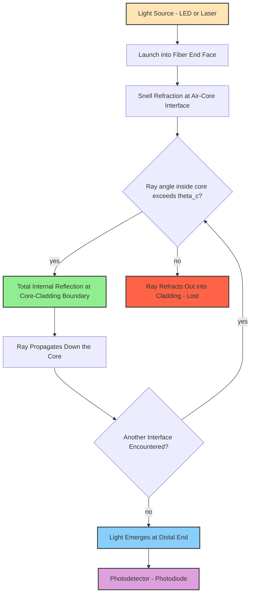
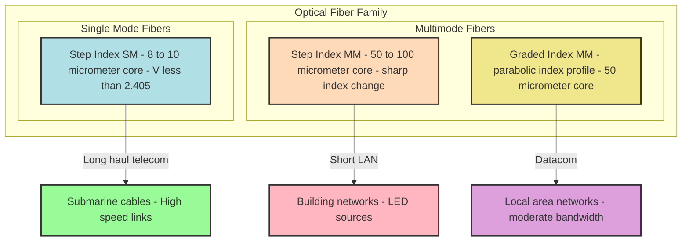
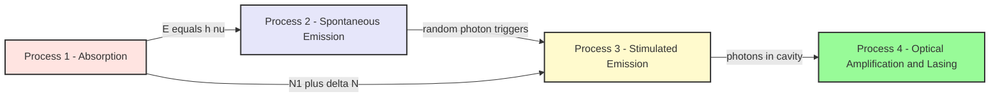

# Laser & Fiber Optics

<!-- SECTION_1_START -->
# Laser & Fiber Optics

## 1.1 LASER — Core Definition

> [!IMPORTANT]
> **LASER** stands for **Light Amplification by Stimulated Emission of Radiation**. It is a device that produces a highly coherent, monochromatic, and directional beam of light through a process of optical amplification based on the **stimulated emission** of photons from excited atoms.

In the KTU 2024 Scheme syllabus (GZPHT121), laser physics is treated as the gateway to modern photonics — covering the atomic origins of light, the engineering of an optical resonator, and the practical devices (Ruby, He–Ne, Semiconductor) that drive today's communications, medical, and measurement systems.

### 1.2 Conceptual Analogy — A "Photon Domino Chain"

Imagine a row of perfectly aligned dominoes. If you tip the first one, it triggers the next, and so on — every domino falls *in step* with the previous one. A **laser** works the same way inside a specially prepared medium:

- The "dominoes" are **excited atoms** (atoms whose electrons have been pumped to a higher energy level).
- The "tipping" is a single incoming **photon** of the right energy.
- Each excited atom, when triggered, emits a **clone photon** — identical in **frequency, phase, direction, and polarisation** as the trigger.
- Two photons go in, four come out, then eight, then sixteen… a **chain reaction of identical light** builds up.
- Mirrors at the ends of the medium bounce these photons back and forth, multiplying them — only the perfectly aligned beam escapes through the partially reflecting mirror as the **laser beam**.

> [!NOTE]
> **Three magical properties of a laser beam** (Box callout for syllabus highlight):
> 1. **Monochromaticity** — light of (almost) one single wavelength/frequency.
> 2. **Coherence** — all photons are in phase in both space and time.
> 3. **Directionality** — the beam spreads very little, even over long distances.

### 1.3 Optical Fiber — Core Definition

> [!IMPORTANT]
> An **optical fiber** is a thin, flexible, transparent dielectric waveguide (typically made of silica glass or polymer) that guides light along its length by the principle of **Total Internal Reflection (TIR)**. It consists of an inner **core**, a surrounding **cladding** of lower refractive index, and an outer protective **buffer coating**.

### 1.4 Intuitive Analogy — Light Trapped in a "Mirror Pipe"

Picture sliding a coin down the inside of a long, polished, slightly tapered tube. The coin never touches the walls dead-on — it always hits at a glancing angle and **bounces**. As long as the angle of incidence stays below a certain critical value, the coin never escapes. Light inside an optical fiber behaves identically: it keeps bouncing off the core-cladding boundary and is *piped* from one end to the other with minimal loss.

> [!VISUALIZATION CONTROL]
> **Concept:** Total Internal Reflection at Core–Cladding Interface
> **Desmos Input Equations:**
> * `n_core = 1.50` (core refractive index)
> * `n_clad = 1.45` (cladding refractive index)
> * `theta_c = arcsin(n_clad / n_core) ≈ 75.16°` (critical angle)
> * Ray equation: `y = tan(90 - theta_c) * x` hitting the interface, then reflecting symmetrically.
> **Visual Description:** On the $x$–$y$ plane, plot the horizontal core–cladding boundary. A ray entering at a steep angle strikes the boundary and reflects with equal angle, never crossing into the cladding — visually confirming TIR.

<!-- SECTION_1_END -->

<!-- SECTION_2_START -->
# Deep Theoretical Analysis & KTU High-Yield Formula Sheet

## 2.1 Fundamental Atomic Processes — The Three Pillars of Laser Action

When a photon of energy $E = h\nu$ interacts with an atom, **three** distinct processes can occur. Einstein identified these in 1917, and they are the bedrock of laser physics.

### A. Absorption (Stimulated Upward Transition)
An atom in a lower energy state $E_1$ absorbs an incoming photon of energy $h\nu = E_2 - E_1$ and jumps to a higher state $E_2$.

$$\text{Atom}(E_1) + h\nu \;\longrightarrow\; \text{Atom}^{*}(E_2)$$

Rate of absorption $\propto B_{12} N_1 \rho(\nu)$, where $B_{12}$ is the **Einstein B-coefficient**, $N_1$ is the lower-state population, and $\rho(\nu)$ is the spectral energy density.

### B. Spontaneous Emission
An excited atom $E_2$ randomly (on its own, with no external trigger) drops to $E_1$, emitting a photon. The emitted photon's **phase, direction, and polarisation are random**.

$$\text{Atom}^{*}(E_2) \;\longrightarrow\; \text{Atom}(E_1) + h\nu$$

Rate $\propto A_{21} N_2$, where $A_{21}$ is the **Einstein A-coefficient** (spontaneous emission probability per unit time). This is what an ordinary LED or a neon sign does.

### C. Stimulated Emission — The Heart of the Laser
An incoming photon of energy $h\nu = E_2 - E_1$ triggers an *already-excited* atom to drop to $E_1$, releasing a **second photon that is a perfect clone** of the trigger — same frequency, same phase, same direction, same polarisation.

$$\text{Atom}^{*}(E_2) + h\nu \;\longrightarrow\; \text{Atom}(E_1) + 2h\nu$$

Rate $\propto B_{21} N_2 \rho(\nu)$.

> [!NOTE]
> **Why stimulated emission creates a chain reaction:** One photon becomes two, the two stimulate four, then eight, sixteen… This exponential multiplication is the **amplification** in "Light Amplification by Stimulated Emission of Radiation." Without a population inversion, the chain cannot start because most atoms sit in the ground state and would simply *absorb* photons instead of emitting.

## 2.2 The Four Conditions for Lasing

1. **Active Medium** — a material with suitable energy levels that support stimulated emission (e.g., ruby crystal, He–Ne gas mixture, GaAs semiconductor).
2. **Population Inversion** — the higher energy state must be *more populated* than the lower one ($N_2 > N_1$). This is a non-equilibrium, "upside-down" condition.
3. **Pumping Mechanism** — an external energy source (optical flash lamp, electrical discharge, current injection) that continuously populates the upper level to *maintain* inversion.
4. **Optical Resonator** — two mirrors (one fully reflective, one partially reflective) facing each other along the gain medium, forming a Fabry–Pérot cavity that bounces photons back and forth for sustained amplification.

## 2.3 Pumping & Population Inversion

Under thermal equilibrium, **Boltzmann distribution** dictates that the lower level is always more populated:

$$\frac{N_2}{N_1} = e^{-(E_2 - E_1) / k_B T} \ll 1$$

To achieve $N_2 > N_1$, energy must be pumped in faster than the upper level spontaneously decays. This requires either:

- **Three-level system** (e.g., Ruby laser) — pumping excites atoms from ground state $E_1$ to $E_3$, which quickly drops non-radiatively to a metastable $E_2$ where lasing occurs to $E_1$. Needs intense pumping because the *lasing transition* ends at the ground state.
- **Four-level system** (e.g., He–Ne, Nd:YAG) — lasing transition ends at an intermediate level $E_1$ (above ground state $E_0$), which is quickly depopulated. Far easier to maintain inversion; much lower threshold.

> [!IMPORTANT]
> A **metastable state** is an excited state with an unusually long lifetime (microseconds to milliseconds, versus nanoseconds for typical excited states). This long lifetime lets atoms *accumulate* in the upper level — the storage tank that makes the laser possible.

## 2.4 Types of Lasers (KTU Syllabus — Detailed)

### A. Ruby Laser (Three-Level, Solid-State)
- **Active medium:** Synthetic ruby rod ($Al_2O_3$ doped with $\sim 0.05\%$ $Cr^{3+}$ ions), a few cm long, $\sim 1$ cm diameter, with ends polished flat and silvered.
- **Pumping:** Helical xenon flash lamp coiled around the rod delivers intense green/blue light pulses.
- **Wavelength emitted:** $\lambda = 694.3$ nm (deep red).
- **Operation mode:** Pulsed (because three-level system needs heavy pumping).
- **Applications:** Holography, tattoo removal, range finding.

### B. Helium–Neon (He–Ne) Laser (Four-Level, Gas)
- **Active medium:** Mixture of He (≈ 85%) and Ne (≈ 15%) at low pressure (≈ 1 torr) sealed in a glass tube.
- **Pumping:** High-voltage DC electrical discharge excites He atoms via electron impact.
- **Energy transfer:** Excited He atoms collide with Ne atoms (resonant energy transfer — He metastable level $\approx 20.61$ eV, Ne upper lasing level $20.66$ eV — almost identical), populating Ne's upper lasing level. Lasing occurs between Ne levels, wavelength $\lambda = 632.8$ nm (red).
- **Operation mode:** Continuous wave (CW).
- **Applications:** Bar-code scanners, alignment in surveying, laboratory demonstrations, interferometry.

### C. Semiconductor (Injection) Laser
- **Active medium:** A p–n junction of direct-bandgap material (GaAs, InGaAsP).
- **Pumping:** Forward-bias current injection; electrons recombine with holes at the junction, releasing photons.
- **Wavelength:** Determined by bandgap, $E_g = h\nu$. For GaAs, $\lambda \approx 850$ nm (near-IR).
- **Operation mode:** CW or pulsed, very efficient ($\eta > 50\%$).
- **Applications:** Fibre-optic communication, CD/DVD/Blu-ray players, LIDAR, laser pointers.

## 2.5 Optical Fibers — Theoretical Foundation

### A. Snell's Law and the Critical Angle
At a dielectric interface (core to cladding), Snell's law gives:

$$n_1 \sin\theta_1 = n_2 \sin\theta_2$$

where $n_1 > n_2$ (core denser than cladding). Total internal reflection (TIR) occurs when $\theta_1 \geq \theta_c$, where

$$\sin\theta_c = \frac{n_2}{n_1}$$

### B. Acceptance Angle and Numerical Aperture
The largest angle at which an entering ray will still undergo TIR down the entire fiber is the **acceptance angle** $\theta_a$, measured in air ($n_0 = 1$).

$$\sin\theta_a = \sqrt{n_1^2 - n_2^2}$$

This square-root quantity is defined as the **Numerical Aperture (NA)** of the fiber:

$$\text{NA} = \sin\theta_a = \sqrt{n_1^2 - n_2^2}$$

> [!NOTE]
> NA is a pure number (dimensionless), typically between $0.1$ and $0.5$ for telecom fibers. **Higher NA = larger light-gathering ability = more multimode propagation.**

### C. V-Number (Normalized Frequency) and Mode Count
The **V-number** (or normalized frequency) parameter determines how many modes a fiber supports:

$$V = \frac{\pi d}{\lambda}\sqrt{n_1^2 - n_2^2} = \frac{\pi d \cdot \text{NA}}{\lambda}$$

where $d$ is the core diameter and $\lambda$ is the operating wavelength.

- **Single-mode fiber:** $V < 2.405$ (only the fundamental $HE_{11}$ mode propagates). Core diameter $\approx 8$–$10 \;\mu\text{m}$.
- **Multimode fiber:** $V \gg 2.405$. Core diameter $\approx 50$–$100 \;\mu\text{m}$.

### D. Types of Optical Fibers

| Type | Index Profile | Core Diameter | Bandwidth | Typical Use |
|------|---------------|---------------|-----------|-------------|
| **Step-Index Multimode (SI-MM)** | Abrupt index change at core–cladding boundary | $50$–$100\;\mu\text{m}$ | Low ($\sim 20\;\text{MHz·km}$) | Short LAN links, illumination |
| **Graded-Index Multimode (GI-MM)** | Parabolic (refractive index decreases radially as $n(r) = n_1\sqrt{1 - 2\Delta(r/a)^\alpha}$, $\alpha \approx 2$) | $50\;\mu\text{m}$ | Higher ($\sim 1\;\text{GHz·km}$) | Medium-distance telecom, datacom |
| **Step-Index Single-Mode (SI-SM)** | Abrupt index change | $8$–$10\;\mu\text{m}$ | Highest ($> 100\;\text{THz·km}$) with dispersion-shifted designs | Long-haul telecom, submarine cables, sensing |

## 2.6 Losses in Optical Fibers — Attenuation Mechanisms

Signal power decays exponentially along the fiber:

$$P(z) = P_0 \, e^{-\alpha z}$$

where $\alpha$ is the **attenuation coefficient** (in $\text{km}^{-1}$ or $\text{dB/km}$).

**Conversion:** $\alpha_{\text{dB/km}} = \frac{10}{z} \log_{10}\!\left(\frac{P_0}{P(z)}\right) = 4.343\,\alpha$

| Loss Mechanism | Cause | Typical Magnitude / Window |
|----------------|-------|----------------------------|
| **Absorption (material)** | OH$^-$ ion impurities, intrinsic IR/UV tails | OH$^-$ peak at $\sim 1383$ nm; silica has minima near $1300$ nm and $1550$ nm |
| **Scattering (Rayleigh)** | Microscopic density fluctuations proportional to $\lambda^{-4}$ | Dominant below $\sim 1550$ nm in pure silica |
| **Bending losses** | Macro-bending (radius $< $ few cm) and micro-bending (cable pressure) | Increases sharply for $R < 10\,d$ |
| **Coupling/connector losses** | Misalignment, Fresnel reflection at air gaps | $\sim 0.1$–$0.5$ dB per connector |
| **Dispersion (not a loss, but signal distortion)** | Intermodal (multimode SI), intramodal (chromatic) | Limits bandwidth-distance product |

> [!NOTE]
> **Telecom "windows"** (low-loss regions of silica): **First window** $\sim 850$ nm (early systems), **second window** $\sim 1300$ nm (zero chromatic dispersion in silica), **third window** $\sim 1550$ nm (lowest attenuation $\sim 0.2$ dB/km — used for transoceanic cables).

## 2.7 KTU Formula Cheat Sheet

| # | Quantity | Formula | Symbol Meaning |
|---|----------|---------|----------------|
| 1 | Photon energy | $E = h\nu = hc/\lambda$ | $h$ = Planck's constant, $c$ = speed of light |
| 2 | Spontaneous vs stimulated ratio (thermal) | $\frac{N_2}{N_1} = e^{-(E_2-E_1)/k_B T}$ | $k_B$ = Boltzmann constant |
| 3 | Critical angle | $\sin\theta_c = n_2/n_1$ | $n_1 > n_2$ |
| 4 | Numerical Aperture | $\text{NA} = \sqrt{n_1^2 - n_2^2}$ | $n_1$ = core index, $n_2$ = cladding index |
| 5 | Acceptance angle | $\sin\theta_a = \text{NA}$ | In air ($n_0 \approx 1$) |
| 6 | V-number (normalized frequency) | $V = \pi d \cdot \text{NA} / \lambda$ | $d$ = core diameter |
| 7 | Single-mode condition | $V < 2.405$ | First zero of $J_0$ Bessel function |
| 8 | Attenuation | $P(z) = P_0 e^{-\alpha z}$ | $\alpha$ in $\text{km}^{-1}$ |
| 9 | Attenuation in dB | $\alpha_{\text{dB}} = 10 \log_{10}(P_0/P)/z$ | dB/km |
| 10 | Refractive index of graded fiber | $n(r) = n_1 \sqrt{1 - 2\Delta(r/a)^\alpha}$ | $\Delta = (n_1^2 - n_2^2)/(2n_1^2)$ |
| 11 | Refractive power / fractional index difference | $\Delta = (n_1 - n_2)/n_1 \approx (n_1^2 - n_2^2)/(2n_1^2)$ | Weak-guidance approx |
| 12 | Rayleigh scattering coefficient | $\alpha_R \propto \lambda^{-4}$ | Dominant in pure silica for $\lambda < 1.55\;\mu\text{m}$ |

## 2.8 Real-World Engineering Utility

- **Telecommunications** — Submarine optical cables carry $> 99\%$ of intercontinental data traffic; a single modern fiber pair transmits multiple Tbps using DWDM (Dense Wavelength Division Multiplexing).
- **Medicine** — LASIK eye surgery, photocoagulation of retina, endoscopic imaging, fiber-optic laser scalpels.
- **Industry** — Laser cutting, welding, 3-D printing (SLA), LIDAR-based surveying, barcode scanning.
- **Sensing** — Distributed temperature/strain sensing (DTS/DSS) in oil wells, structural health monitoring of bridges and dams.
- **Defense & Astronomy** — Free-space laser communication, laser guidance, adaptive optics, guide stars for telescopes.

<!-- SECTION_2_END -->

<!-- SECTION_3_START -->
# Step-by-Step Derivations & Worked Numerical Examples

> **KTU Examiner Tip:** Show every algebraic step, every substitution, and the final simplified answer. Marks are awarded for the substitution steps as much as for the final number.

## 3.1 Derivation 1 — Critical Angle for Total Internal Reflection

**Statement:** Light propagating in a medium of higher refractive index $n_1$ strikes the interface with a medium of lower refractive index $n_2$. For TIR to occur, the angle of incidence must exceed the critical angle $\theta_c$.

**Step 1 — Apply Snell's Law at the interface.**

$$n_1 \sin\theta_1 = n_2 \sin\theta_2$$

**Step 2 — The limiting case for TIR is when the refraction angle $\theta_2$ becomes exactly $90°$** (the refracted ray grazes the interface).

$$n_1 \sin\theta_c = n_2 \sin 90° = n_2$$

**Step 3 — Solve for $\theta_c$.**

$$\boxed{\;\sin\theta_c = \frac{n_2}{n_1} \quad\Rightarrow\quad \theta_c = \sin^{-1}\!\left(\frac{n_2}{n_1}\right)\;}$$

**Step 4 — Condition for TIR.**

$$\theta_1 \geq \theta_c \quad\text{(inside the denser medium)}$$

## 3.2 Derivation 2 — Acceptance Angle and Numerical Aperture

**Step 1 — Consider a ray entering the fiber from air** ($n_0 = 1$) at angle $\theta_0$ to the fiber axis. By Snell's law at the entrance face:

$$\sin\theta_0 = n_1 \sin\theta_1$$

**Step 2 — The ray then strikes the core–cladding interface** at angle $\theta$ (measured from the normal to the interface, i.e., from the radial direction). From geometry, the angle inside the core with respect to the fiber axis is $\phi = 90° - \theta$, so $\theta = 90° - \phi$. The entrance angle $\theta_1$ with respect to the axis satisfies $\theta_1 = \phi$, hence:

$$\theta = 90° - \theta_1$$

**Step 3 — TIR condition at the core–cladding boundary.**

$$\sin\theta \geq \sin\theta_c = \frac{n_2}{n_1}$$

$$\sin(90° - \theta_1) = \cos\theta_1 \geq \frac{n_2}{n_1}$$

**Step 4 — Use the identity $\cos\theta_1 = \sqrt{1 - \sin^2\theta_1}$** and the entrance Snell relation $\sin\theta_0 = n_1 \sin\theta_1$:

$$\sqrt{1 - \frac{\sin^2\theta_0}{n_1^2}} \geq \frac{n_2}{n_1}$$

$$1 - \frac{\sin^2\theta_0}{n_1^2} \geq \frac{n_2^2}{n_1^2}$$

$$\sin^2\theta_0 \leq n_1^2 - n_2^2$$

**Step 5 — Define the Numerical Aperture** as the maximum value of $\sin\theta_0$ for which TIR holds:

$$\boxed{\;\text{NA} = \sin\theta_a = \sqrt{n_1^2 - n_2^2}\;}$$

**Step 6 — Acceptance angle (the half-angle of the cone of accepted light):**

$$\boxed{\;\theta_a = \sin^{-1}\!\left(\sqrt{n_1^2 - n_2^2}\right)\;}$$

## 3.3 Derivation 3 — V-Number and Single-Mode Condition

**Step 1 — Start with Maxwell's equations in cylindrical dielectric waveguide** (weak-guidance approximation). The longitudinal field components $E_z, H_z$ satisfy Bessel's equation.

**Step 2 — Apply the boundary conditions at $r = a$ (core edge) and demand continuity** of tangential $\vec{E}$ and $\vec{H}$. This yields the eigenvalue equation whose solutions are the propagation constants $\beta_m$ of allowed modes.

**Step 3 — For weak guidance, hybrid modes $HE_{nm}$ and $EH_{nm}$ emerge, and the cutoff V-number for the $LP_{mn}$ (linearly polarised) mode is approximately:**

$$V_c = \frac{2\pi a}{\lambda}\sqrt{n_1^2 - n_2^2} = \frac{\pi d}{\lambda}\,\text{NA}$$

**Step 4 — The fundamental mode $LP_{01}$ (or $HE_{11}$) has the lowest cutoff, $V_c = 0$** (it is *always* guided), but the next-higher mode $LP_{11}$ has $V_c = 2.405$. Therefore, for **only the fundamental to propagate:**

$$\boxed{\;V < 2.405 \;\Longleftrightarrow\; \frac{\pi d\,\text{NA}}{\lambda} < 2.405\;}$$

## 3.4 Derivation 4 — Attenuation in Decibels

**Step 1 — Define the loss in dB for a length $L$:**

$$L_{\text{dB}} = 10 \log_{10}\!\left(\frac{P_{\text{in}}}{P_{\text{out}}}\right)$$

**Step 2 — Substitute $P_{\text{out}} = P_{\text{in}} e^{-\alpha L}$:**

$$L_{\text{dB}} = 10 \log_{10}\!\left(\frac{P_{\text{in}}}{P_{\text{in}} e^{-\alpha L}}\right) = 10 \log_{10}\!\left(e^{\alpha L}\right) = 10 \alpha L \log_{10} e$$

**Step 3 — Use $\log_{10} e = 0.4343$:**

$$L_{\text{dB}} = 4.343 \,\alpha L$$

**Step 4 — Express attenuation coefficient in dB/km:**

$$\boxed{\;\alpha_{\text{dB/km}} = \frac{4.343}{L}\ln\!\left(\frac{P_{\text{in}}}{P_{\text{out}}}\right)\;}$$

## 3.5 Worked Numerical Examples (KTU Exam Style)

### Example 1 — Numerical Aperture of a Silica Fiber

> An optical fiber has a core refractive index $n_1 = 1.50$ and cladding refractive index $n_2 = 1.45$. Calculate the **numerical aperture**, the **acceptance angle**, and the **critical angle** at the core–cladding interface.

**Solution:**

Critical angle:

$$\sin\theta_c = \frac{n_2}{n_1} = \frac{1.45}{1.50} = 0.9667$$

$$\theta_c = \sin^{-1}(0.9667) = 75.16°$$

Numerical aperture:

$$\text{NA} = \sqrt{n_1^2 - n_2^2} = \sqrt{(1.50)^2 - (1.45)^2} = \sqrt{2.25 - 2.1025} = \sqrt{0.1475} = 0.3841$$

Acceptance angle:

$$\theta_a = \sin^{-1}(0.3841) = 22.59°$$

**Final answer:** $\text{NA} = 0.384$, $\theta_a = 22.59°$, $\theta_c = 75.16°$.

### Example 2 — V-Number and Mode Determination

> A multimode step-index fiber has $n_1 = 1.48$, $n_2 = 1.46$, core diameter $d = 50\;\mu\text{m}$, and operates at $\lambda = 1300$ nm. Find the **V-number** and the **number of guided modes** (approx. $M \approx V^2/2$ for large $V$).

**Solution:**

$$\text{NA} = \sqrt{(1.48)^2 - (1.46)^2} = \sqrt{2.1904 - 2.1316} = \sqrt{0.0588} = 0.2425$$

$$V = \frac{\pi d\,\text{NA}}{\lambda} = \frac{\pi \times 50 \times 10^{-6} \times 0.2425}{1300 \times 10^{-9}} = \frac{3.808 \times 10^{-5}}{1.3 \times 10^{-6}} = 29.29$$

Number of modes:

$$M \approx \frac{V^2}{2} = \frac{(29.29)^2}{2} = \frac{857.9}{2} = 428.9 \approx 429 \text{ modes}$$

**Final answer:** $V = 29.29$, $M \approx 429$ modes. Since $V \gg 2.405$, this is **strongly multimode**.

### Example 3 — Attenuation and Output Power

> A $10$ km fiber has attenuation $\alpha = 0.5$ dB/km. If the input power is $P_0 = 1$ mW, what is the output power?

**Solution:**

Total loss:

$$L_{\text{dB}} = 0.5 \times 10 = 5 \text{ dB}$$

Convert to linear ratio:

$$10 \log_{10}\!\left(\frac{P_0}{P}\right) = 5 \;\Rightarrow\; \frac{P_0}{P} = 10^{0.5} = 3.162$$

$$P = \frac{P_0}{3.162} = \frac{1\;\text{mW}}{3.162} = 0.316 \;\text{mW} = 316 \;\mu\text{W}$$

**Final answer:** $P_{\text{out}} = 0.316$ mW (or $316\;\mu\text{W}$).

### Example 4 — Wavelength of a Ruby Laser Photon

> The Ruby laser transition is between $E_2$ and $E_1$ with energy difference $\Delta E = 1.79$ eV. Find the **wavelength** of the emitted photon.

**Solution:**

$$E = h\nu = \frac{hc}{\lambda} \;\Rightarrow\; \lambda = \frac{hc}{E}$$

$$hc = 1240\;\text{eV·nm}$$

$$\lambda = \frac{1240\;\text{eV·nm}}{1.79\;\text{eV}} = 692.7\;\text{nm} \approx 694.3\;\text{nm (deep red)}$$

**Final answer:** $\lambda \approx 693$ nm (matches the standard Ruby laser line $694.3$ nm).

### Example 5 — Single-Mode vs Multimode Design Check

> Design a single-mode fiber at $\lambda = 1550$ nm using $n_1 = 1.468$ (core) and $n_2 = 1.464$ (cladding). Find the **maximum core diameter** for single-mode operation.

**Solution:**

NA:

$$\text{NA} = \sqrt{(1.468)^2 - (1.464)^2} = \sqrt{2.15502 - 2.14330} = \sqrt{0.01172} = 0.1083$$

For single-mode, $V < 2.405$:

$$d < \frac{V \lambda}{\pi\,\text{NA}} = \frac{2.405 \times 1550 \times 10^{-9}}{\pi \times 0.1083} = \frac{3.728 \times 10^{-6}}{0.3402} = 1.096 \times 10^{-5}\;\text{m} = 10.96\;\mu\text{m}$$

**Final answer:** $d_{\max} \approx 11\;\mu\text{m}$ (typical telecom single-mode fibers use $d \approx 8$–$9\;\mu\text{m}$).

<!-- SECTION_3_END -->

<!-- SECTION_4_START -->
# Structural Diagrams & Schematics

## 4.1 Block-Level Functional Architecture — The Three Essential Components of a Laser

```mermaid
flowchart LR
    A[Energy Source - Pumping Mechanism] -- pump photons or current --> B[Active Gain Medium]
    B -- photons travel back and forth --> C[Optical Resonator Fabry-Perot Cavity]
    C -- amplified coherent beam escapes --> D[Output Coupler - Partial Mirror]
    D --> E[Laser Beam Output]
    C -- 1 of N round trips --> B
    style A fill:#FFD700,stroke:#333,stroke-width:2px
    style B fill:#FF6347,stroke:#333,stroke-width:2px
    style C fill:#87CEEB,stroke:#333,stroke-width:2px
    style D fill:#90EE90,stroke:#333,stroke-width:2px
    style E fill:#FF69B4,stroke:#333,stroke-width:2px
```

> **Reading the diagram:** The pumping source energises the gain medium; the resonator (two mirrors) traps photons inside the medium; the partial mirror lets a small fraction leak out as the usable laser beam, while reflecting the rest back for further amplification.

## 4.2 Sequential Processing Topology — Light Propagation in a Step-Index Fiber

> **Reading the diagram:** A decision diamond checks whether the internal angle exceeds the critical angle. Only rays inside the acceptance cone undergo TIR and propagate; others leak out into the cladding and are lost.

## 4.3 Nested Subgraph — Comparison of Fiber Types

## 4.4 Block Architecture — The Four Key Processes in Lasing

> **Reading the diagram:** The four Einstein processes form a chain — absorption puts atoms in the upper state, spontaneous emission starts the photon population, stimulated emission dominates once population inversion is achieved, and the resonator multiplies the photons into a coherent laser beam.

<!-- SECTION_4_END -->

<!-- SECTION_5_START -->
# KTU 2024 Scheme Examination Question Bank & Topic Recap

## 5.1 PART A — Short Answer Questions (3 Marks Each)

### Question 1 — Define Population Inversion. Why is it necessary for laser action? `[KTU University Exam - July 2024]`
**CO Mapped:** CO1 | **RBT Level:** Understand

**Model Answer (Valuation Key):**

> Population inversion is a non-equilibrium condition in which the number of atoms in a higher energy state $N_2$ exceeds the number in a lower energy state $N_1$, i.e., $N_2 > N_1$.

Under normal (thermal equilibrium) conditions, the Boltzmann distribution gives:

$$\frac{N_2}{N_1} = e^{-(E_2 - E_1)/k_B T} \ll 1$$

**Why necessary (3 key points):** **[1 Mark]**
- Stimulated emission rate is proportional to $N_2$ and to the photon density, while absorption rate is proportional to $N_1$.
- Without inversion ($N_1 > N_2$), absorption dominates over stimulated emission — light is *attenuated* rather than amplified.
- Population inversion makes the active medium *gain* positive, so the optical resonator can build up a self-sustaining coherent beam.

A metastable state with a long lifetime allows atoms to *accumulate* in the upper level, making inversion possible with reasonable pumping power.

> **[Allocation: Defining inversion: 1 Mark | Explaining the necessity: 2 Marks]**

### Question 2 — Define Numerical Aperture. What does it signify? `[KTU University Exam - Dec 2023]`
**CO Mapped:** CO2 | **RBT Level:** Remember / Understand

**Model Answer:**

> The Numerical Aperture (NA) of an optical fiber is a dimensionless quantity that measures its ability to collect and confine incident light:

$$\text{NA} = \sin\theta_a = \sqrt{n_1^2 - n_2^2}$$

**Significance:** **[1 Mark]**
- It equals the **sine of the maximum acceptance angle** — the half-angle of the cone of light that can enter the fiber and undergo total internal reflection.
- **Larger NA** means the fiber accepts light from a wider cone, so coupling from sources is easier, but modal dispersion worsens.
- **Smaller NA** restricts the acceptance cone but reduces intermodal dispersion, enabling higher bandwidth.

**[Allocation: Formula: 1 Mark | Significance: 2 Marks]**

---

## 5.2 PART B — Long Answer Questions (14 Marks, with Internal Choice)

> KTU 2024 Scheme rule: "Answer any ONE full question from each module. Each full question carries 14 marks and may have sub-parts (a) and (b) of 7 marks each."

---

### Question 3 (Choice A) — `[KTU University Exam - Dec 2023]` (14 Marks)

#### (a) Derive the expressions for acceptance angle and numerical aperture of an optical fiber. (7 Marks) — **CO2, Apply**

**Step-by-Step Model Solution:**

**Step 1 — Setup:** Consider a step-index fiber with core index $n_1$ and cladding index $n_2 < n_1$. A ray in air ($n_0 = 1$) strikes the entrance face at angle $\theta_0$ to the axis. **[1 Mark]**

**Step 2 — Snell's law at the entrance:**

$$\sin\theta_0 = n_1 \sin\theta_1$$

where $\theta_1$ is the angle inside the core with respect to the fiber axis. **[1 Mark]**

**Step 3 — Geometry at the core-cladding interface:** The ray strikes the boundary at angle $\theta = 90° - \theta_1$ to the normal. TIR requires:

$$\sin(90° - \theta_1) = \cos\theta_1 \geq \frac{n_2}{n_1}$$ **[1 Mark]**

**Step 4 — Algebraic manipulation:**

$$\cos^2\theta_1 = 1 - \sin^2\theta_1 \geq \frac{n_2^2}{n_1^2}$$

$$1 - \frac{\sin^2\theta_0}{n_1^2} \geq \frac{n_2^2}{n_1^2}$$

$$\sin^2\theta_0 \leq n_1^2 - n_2^2$$ **[1 Mark]**

**Step 5 — Final definitions:**

$$\boxed{\;\text{NA} = \sin\theta_a = \sqrt{n_1^2 - n_2^2}\;}$$
$$\boxed{\;\theta_a = \sin^{-1}\!\left(\sqrt{n_1^2 - n_2^2}\right)\;}$$

**[1 Mark for each box]**

**Step 6 — Physical interpretation:** The fiber accepts all rays whose entry angle is at most $\theta_a$ from the axis. **[1 Mark]**

#### (b) A silica fiber has $n_1 = 1.50$ and $n_2 = 1.45$. Find (i) the numerical aperture, (ii) the acceptance angle, and (iii) the critical angle. (7 Marks) — **CO2, Apply**

**Step 1 — Critical angle:** **[1 Mark]**

$$\sin\theta_c = \frac{n_2}{n_1} = \frac{1.45}{1.50} = 0.9667 \;\Rightarrow\; \theta_c = \sin^{-1}(0.9667) = 75.16°$$

**Step 2 — NA:** **[1 Mark]**

$$\text{NA} = \sqrt{(1.50)^2 - (1.45)^2} = \sqrt{2.25 - 2.1025} = \sqrt{0.1475} = 0.384$$

**Step 3 — Acceptance angle:** **[1 Mark]**

$$\theta_a = \sin^{-1}(0.384) = 22.59°$$

**Step 4 — Verification:** The acceptance angle should be much smaller than the critical angle — it is, because $\theta_a = 22.59° \ll \theta_c = 75.16°$. **[1 Mark]**

**Step 5 — Discussion:** Since $n_1 - n_2 = 0.05$, this is a fiber with **relatively large NA** ($\approx 0.38$), suitable for short-distance multimode applications. The acceptance cone half-angle of $\approx 22.6°$ gives a solid angle of $2\pi(1 - \cos 22.6°) = 0.50$ sr. **[2 Marks for interpretation]**

**Final answers:** $\text{NA} = 0.384$ (dimensionless), $\theta_a = 22.59°$, $\theta_c = 75.16°$.

> [!WARNING]
> **Common Pitfalls (Examiner's Warning):**
> 1. Many students confuse $\theta_a$ (acceptance angle) with $\theta_c$ (critical angle). $\theta_a$ is the *external* angle in air; $\theta_c$ is the *internal* angle at the core-cladding boundary. Their numerical values are very different.
> 2. Do **not** write $\text{NA} = n_1 - n_2$. The correct expression is $\sqrt{n_1^2 - n_2^2}$. Only for *very small* index difference $\Delta$ is $\text{NA} \approx n_1 \sqrt{2\Delta} \approx \sqrt{2 n_1 \Delta n}$.
> 3. Always specify the medium (air) when stating the acceptance angle, because $\sin\theta_a = n_1 \sin\theta_1$ — if the medium in front is not air, multiply NA by $n_0$.

---

### Question 4 (Choice B) — `[KTU University Exam - July 2024]` (14 Marks)

#### (a) Explain the principle of a laser with a neat energy level diagram. Distinguish between three-level and four-level laser systems. (7 Marks) — **CO1, Understand**

**Step-by-Step Model Solution:**

**Step 1 — Basic principle (3 points):** **[1 Mark]**
- Laser action is based on **stimulated emission** of radiation.
- A photon of energy $h\nu = E_2 - E_1$ incident on an atom already in the excited state $E_2$ triggers it to emit a second photon *identical* to the trigger.
- The two photons can each trigger further stimulated emissions, producing a **chain reaction** of coherent, in-phase photons.

**Step 2 — Population inversion:** **[1 Mark]** Without $N_2 > N_1$, absorption dominates and no net amplification occurs. Achieving inversion requires external **pumping**.

**Step 3 — Optical resonator:** **[1 Mark]** Two parallel mirrors (one 100% reflective, one partially reflective) form a Fabry–Pérot cavity that reflects photons back through the gain medium repeatedly, building intensity until a steady, coherent beam emerges through the partial mirror.

**Step 4 — Three-level system (e.g., Ruby):** **[1 Mark]**
- Pumping excites atoms from ground $E_1$ to short-lived $E_3$.
- Atoms quickly non-radiatively decay to the metastable $E_2$.
- Lasing transition $E_2 \to E_1$ ends at the **ground state** itself.
- Threshold is high because the lower level fills up almost immediately and deactivates inversion.

**Step 5 — Four-level system (e.g., He–Ne, Nd:YAG):** **[1 Mark]**
- Pumping excites atoms to $E_4$; rapid non-radiative decay to metastable $E_3$.
- Lasing transition $E_3 \to E_2$ ends at an *intermediate* level $E_2$ that is *above* the ground state $E_1$.
- $E_2$ depopulates quickly to $E_1$, so the lower lasing level stays nearly empty, and inversion is easily maintained.
- Threshold power is much lower than for three-level systems.

**Step 6 — Comparison table:** **[2 Marks]**

| Feature | Three-Level | Four-Level |
|---------|-------------|------------|
| Lower lasing level | Ground state $E_1$ | Intermediate $E_2$ above ground |
| Population inversion | Hard to achieve | Easy to achieve |
| Threshold pump power | High | Low |
| Example | Ruby laser | He–Ne, Nd:YAG, CO$_2$, Semiconductor |
| Operating mode | Usually pulsed | CW or pulsed |

#### (b) Describe the construction and working of a He–Ne laser. Mention two applications. (7 Marks) — **CO1, Apply**

**Step-by-Step Model Solution:**

**Step 1 — Construction:** **[2 Marks]**
- A long, narrow **glass discharge tube** (typically 10–50 cm long, a few mm bore) filled with a mixture of He (≈ 85%) and Ne (≈ 15%) at low pressure (≈ 1 torr).
- Two mirrors form the optical resonator: one **fully reflecting** (100% R) concave, the other **partially reflecting** (≈ 98–99% R) flat.
- Two **electrodes** (anode + cathode) connect the tube to a high-voltage DC power supply for electrical pumping.

**Step 2 — Working — Pumping:** **[1 Mark]**
- High-voltage discharge accelerates free electrons that **inelastically collide** with He atoms, exciting them to the metastable level $2^1 S$ (energy ≈ 20.61 eV).

**Step 3 — Resonant energy transfer:** **[1 Mark]**
- Excited He atoms collide with ground-state Ne atoms.
- The He metastable level (20.61 eV) is *almost exactly* equal to the Ne $3S_2$ level (20.66 eV), so the energy transfers resonantly — He returns to ground, Ne goes to $3S_2$.

**Step 4 — Lasing transition:** **[1 Mark]**
- Population inversion is created between the Ne $3S_2$ (upper) and $2P_4$ (lower) levels.
- Stimulated emission occurs at $\lambda = 632.8$ nm (red) as atoms drop from $3S_2$ to $2P_4$.
- The $2P_4$ level decays quickly to $1S_2$, which then decays non-radiatively to ground — keeping the lower level empty (a 4-level system).

**Step 5 — Output:** **[1 Mark]** Coherent red beam emerges from the partially reflecting mirror as a low-power CW beam (typically 0.5–50 mW).

**Step 6 — Applications (any two):** **[1 Mark]**
- Barcode scanners in retail and inventory systems.
- Alignment and surveying in construction (laser levels, plumb lines).
- Holography and laboratory interferometry.
- Optical data storage read heads (older systems).

> [!WARNING]
> **Common Pitfalls (Examiner's Warning):**
> 1. Do **not** state that He atoms themselves lase. **Neon is the lasing species**; helium is the pumping intermediary.
> 2. Don't confuse the energy-transfer mechanism (atomic collision, *not* photon emission) with radiative pumping. The energy transfer is **resonant and non-radiative**.
> 3. Many students omit the He metastable state, which is the *key* to population inversion. Mentioning the **20.61 eV** and **20.66 eV** coincidence is a guaranteed 1-mark bonus.
> 4. Always mention that He–Ne is a **four-level** system, distinguishing it from Ruby (three-level).

---

## 5.3 Topic Recap & Important Things to Remember

> Use this as a last-minute revision sheet before walking into the KTU exam hall.

- **LASER = Light Amplification by Stimulated Emission of Radiation.** Coherent, monochromatic, directional.
- **Three Einstein processes:** Absorption ($B_{12}$), Spontaneous emission ($A_{21}$), Stimulated emission ($B_{21}$).
- **Population inversion** ($N_2 > N_1$) is *non-equilibrium* and requires **pumping**.
- **Metastable state** — long-lived excited level (μs–ms) that stores atoms; essential for achieving inversion.
- **Four laser essentials:** Active medium, Population inversion, Pumping mechanism, Optical resonator (Fabry–Pérot cavity).
- **Three-level system** — hard inversion, high threshold, lasing to ground state; e.g., **Ruby** at $\lambda = 694.3$ nm.
- **Four-level system** — easy inversion, low threshold, lasing to intermediate level; e.g., **He–Ne** at $\lambda = 632.8$ nm, **Nd:YAG** at 1064 nm, **Semiconductor (GaAs)** at 850 nm.
- **Ruby laser:** Solid-state, optical pumping by xenon flash lamp, **pulsed**, used in holography.
- **He–Ne laser:** Gas, electrical pumping, resonant energy transfer, **CW**, used in scanners and alignment.
- **Semiconductor laser:** p–n junction, current injection, very efficient, used in **fiber-optic communication**, CD/DVD, LIDAR.
- **Optical fiber** guides light by **Total Internal Reflection** at the core-cladding boundary.
- **Critical angle:** $\sin\theta_c = n_2/n_1$.
- **Numerical Aperture:** $\text{NA} = \sin\theta_a = \sqrt{n_1^2 - n_2^2}$ — dimensionless, typical range $0.1$ to $0.5$.
- **V-number:** $V = \pi d\,\text{NA}/\lambda$; single-mode iff $V < 2.405$.
- **Step-index multimode:** Sharp index change, large core (50–100 μm), many modes, low bandwidth.
- **Graded-index multimode:** Parabolic index profile, 50 μm core, *self-focusing* of rays, higher bandwidth.
- **Step-index single-mode:** Small core (8–10 μm), one mode, very high bandwidth, telecom-grade.
- **Attenuation:** $P(z) = P_0 e^{-\alpha z}$; $\alpha_{\text{dB/km}} = (10/L)\log_{10}(P_0/P)$.
- **Telecom windows:** 850 nm (1st), 1300 nm (2nd, zero dispersion), 1550 nm (3rd, lowest loss $\sim 0.2$ dB/km).
- **Loss mechanisms:** Rayleigh scattering ($\propto \lambda^{-4}$), OH$^-$ absorption, bending loss, coupling loss.
- **Key applications of optical fibers:** Telecom (submarine cables), medical endoscopy, internet backbone, sensor networks, illumination.
- **Remember the magic numbers:** $\theta_c$ for glass-glass (n = 1.50/1.45) ≈ 75°, $V_c$ for single-mode = 2.405, silica attenuation minimum at 1550 nm.
- **Equation writing tip:** Always state the formula first, then substitute numerical values with units, then compute. Show your work — partial credit matters.
- **Diagram tip:** Always draw the core-cladding boundary as a clear horizontal line, mark the ray angles at the interface ($\theta_i$ and $\theta_r$), and shade TIR with a wavy or zigzag symbol.

<!-- SECTION_5_END -->
