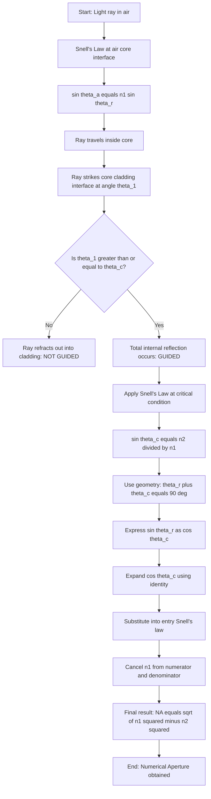
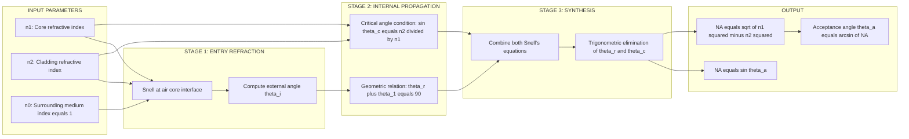
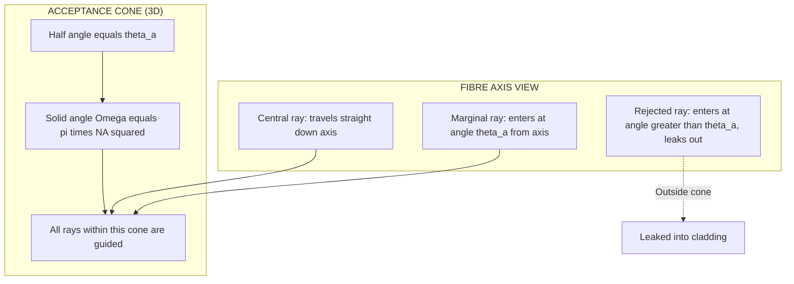

# Numerical aperture –Derivation

<!-- SECTION_1_START -->

# 1. Core Technical Definition & Intuitive Overview

## 1.1 Formal KTU 2024 Definition

**Numerical Aperture (NA)** is a dimensionless quantity that characterises the **light-gathering ability** of an optical fibre. It is defined as the sine of the **maximum acceptance angle** ($\theta_a$) at which an optical ray can enter the fibre and still be guided through it by **total internal reflection (TIR)**.

$$\text{NA} = \sin \theta_a$$

> [!IMPORTANT]
> **Syllabus Highlight (GZPHT121 – Module 1):**
> The KTU 2024 Scheme specifically expects students to derive the expression $\text{NA} = \sqrt{n_1^2 - n_2^2}$ using **Snell's law** and the **critical angle condition**, and to apply it to solve numerical problems involving step-index fibres.

---

## 1.2 Conceptual Analogy / Geometric Intuition

Imagine you are trying to **catch rainwater using a funnel**:

* A **wide-mouthed funnel** (high NA) collects rain from a large area, even at slanting angles.
* A **narrow-mouthed funnel** (low NA) can only catch rain falling almost straight down.

The optical fibre works exactly like this funnel:

* The **core** of the fibre is the "throat" of the funnel.
* Light rays striking the fibre face at steep angles (close to the fibre axis) enter and are guided.
* Rays striking at very oblique angles **leak out** into the cladding.
* **Numerical Aperture** simply tells us "how wide is the funnel mouth" of the fibre in terms of the **acceptance cone**.

> [!NOTE]
> **Critical Engineering Metric:**
> A higher NA means the fibre can gather more light, which is essential in **medical endoscopes, telecommunications repeaters, and sensor systems**. A typical silica fibre has NA in the range **0.1 to 0.4**.

---

## 1.3 Geometric Setup & Visualisation

Consider a **step-index optical fibre** consisting of:

* A central **core** of refractive index $n_1$
* An outer **cladding** of refractive index $n_2$ (with $n_1 > n_2$)
* Surrounding **air medium** of refractive index $n_0 \approx 1$

A light ray entering the fibre face at an external angle $\theta_i$ to the fibre axis refracts into the core at angle $\theta_r$, then strikes the core–cladding interface at angle $\theta_1$.

> [!VISUALIZATION CONTROL]
> **Concept:** Acceptance cone and meridional ray path in a step-index fibre.
> **GeoGebra / Desmos Input Equations:**
> * Cone: $(x^2 + y^2) = (\tan \theta_a)^2 z^2$, with $z \geq 0$
> * Ray path (zig-zag): parametric $(x(t), y(t), z(t))$ following Snell's law at each interface
> **Visual Description:** The student should observe a **double-cone** shape — the outer cone represents the acceptance cone of half-angle $\theta_a$, while the inner zig-zag line represents a meridional ray bouncing by TIR along the fibre axis.

---

## 1.4 Key Terminology Snapshot

| Term | Symbol | Physical Meaning |
|------|:------:|------------------|
| Acceptance angle | $\theta_a$ | Maximum external angle for guided propagation |
| Critical angle | $\theta_c$ | Minimum angle inside the core for TIR |
| Refractive index of core | $n_1$ | Always greater than $n_2$ |
| Refractive index of cladding | $n_2$ | Lower index outer layer |
| Relative refractive index difference | $\Delta$ | $(n_1^2 - n_2^2) / (2n_1^2)$ |
| Acceptance cone | — | Solid cone of half-angle $\theta_a$ |

<!-- SECTION_1_END -->

<!-- SECTION_2_START -->

# 2. Deep Theoretical Analysis & KTU High-Yield Formula Sheet

## 2.1 Operational Principle – Why Numerical Aperture Exists

For a ray to be **guided** inside the fibre, two physical conditions must be satisfied simultaneously:

1. **Entry Condition:** The ray must enter the core at a steep enough angle (refraction at the air–core interface).
2. **Propagation Condition:** Once inside, the ray must strike the core–cladding boundary at an angle **greater than or equal to the critical angle** $\theta_c$ to undergo **total internal reflection** (TIR).

If either condition fails, the ray **leaks out** and is lost into the cladding. NA quantifies the combined tolerance of these two conditions.

> [!IMPORTANT]
> **Engineering Insight:**
> NA is *not* a physical aperture (like a camera lens). It is a **purely geometric-optical figure of merit** — a number between 0 and 1 that ranks the fibre's ability to capture and guide light.

---

## 2.2 Critical Angle — The Foundation

At the **core–cladding interface**, applying Snell's law with the incident ray in the core and the refracted ray in the cladding:

$$n_1 \sin \theta_1 = n_2 \sin 90^\circ$$

The **critical angle** $\theta_c$ is the limiting case when the refracted ray grazes along the interface:

$$\sin \theta_c = \frac{n_2}{n_1}$$

> [!NOTE]
> Since $n_1 > n_2$, we have $\sin \theta_c < 1$, so $\theta_c$ is a **real angle**, ensuring TIR is geometrically possible.

---

## 2.3 The Two Interlinked Refraction Events

The derivation involves **two Snell's law applications**:

| Event | Interface | Snell's Law Statement |
|-------|-----------|----------------------|
| **Entry** | Air $\rightarrow$ Core | $n_0 \sin \theta_a = n_1 \sin \theta_r$ |
| **Reflection** | Core $\rightarrow$ Cladding | $n_1 \sin \theta_1 = n_2 \sin 90^\circ$ |

The geometric link between the two refraction angles is:

$$\theta_r + \theta_1 = 90^\circ \quad \Rightarrow \quad \theta_r = 90^\circ - \theta_1$$

---

## 2.4 KTU Formula Sheet / Cheat Sheet

| Formula | Expression | Physical Meaning | Validity |
|---------|:----------:|------------------|:--------:|
| Critical angle | $\sin \theta_c = n_2 / n_1$ | Minimum angle for TIR | Step-index fibre |
| Acceptance angle | $\sin \theta_a = \sqrt{n_1^2 - n_2^2}$ | Max external entry angle | $n_0 = 1$ (air) |
| Numerical Aperture | $\text{NA} = \sin \theta_a$ | Light-gathering figure of merit | Always |
| Approx. NA (small $\Delta$) | $\text{NA} \approx n_1 \sqrt{2\Delta}$ | For weakly guiding fibres | $\Delta \ll 1$ |
| Relative index difference | $\Delta = (n_1^2 - n_2^2) / (2 n_1^2)$ | Normalised index contrast | Step-index fibre |
| Acceptance cone solid angle | $\Omega = \pi \sin^2 \theta_a = \pi (\text{NA})^2$ | Total light captured | 3-D cone |

---

## 2.5 Real-World Utility in Engineering

* **Telecommunications:** Higher NA fibres (e.g., NA = 0.4) used in short-distance LANs where maximum light capture is needed.
* **Medical Endoscopy:** Large-core, high-NA fibres transmit laser power for minimally invasive surgery.
* **Sensors & Illuminators:** High-NA fibres distribute light evenly in decorative and signage applications.
* **Astronomy & LIDAR:** NA governs the **étendue** (optical throughput), critical for matching detector acceptance.

<!-- SECTION_2_END -->

<!-- SECTION_3_START -->

# 3. Step-by-Step Derivation of Numerical Aperture

## 3.1 Diagram of the Geometry

```
        Incident ray                     
              \         |                 
               \  θ_i   |                 
        _________________   ← Air (n₀ = 1) 
                \  θ_r  |                 
                 \      |                 
                  \  n₁ |  Core           
                   \    |                 
                    \   |                 
        _____________\__|______________   ← Core–Cladding interface
                      \ | θ₁             
                       \|                
                        \  n₂ | Cladding  
                         \   |            
                          \θc|            
                           \ |            
```

The ray refracts at point **A** (air-core), travels to point **B** (core-cladding interface), and is totally internally reflected there.

---

## 3.2 Exhaustive Step-by-Step Mathematical Derivation

> **Step 1 — Apply Snell's Law at the Air–Core Interface (Point A):**
> The ray travels from air ($n_0 = 1$) into the core ($n_1$) at external angle $\theta_i$ and internal angle $\theta_r$:

$$n_0 \sin \theta_i = n_1 \sin \theta_r$$

> **Step 2 — Set the External Angle to its Maximum ($\theta_i = \theta_a$):**
> For the ray to just barely satisfy the TIR condition, the external angle must be **maximised** to $\theta_a$:

$$\sin \theta_a = n_1 \sin \theta_r \quad \cdots \text{(Equation 1)}$$

> **Step 3 — Apply Snell's Law at the Core–Cladding Interface (Point B):**
> Inside the core, the ray strikes the boundary at angle $\theta_1$. For TIR, the refracted angle in the cladding must be exactly $90^\circ$ (the limiting case):

$$n_1 \sin \theta_1 = n_2 \sin 90^\circ$$

$$\sin \theta_1 = \frac{n_2}{n_1}$$

> **Step 4 — Identify the Critical Angle $\theta_c$:**
> In the limiting TIR case, the angle of incidence at the core-cladding boundary equals the **critical angle**:

$$\theta_1 = \theta_c \quad \text{and} \quad \sin \theta_c = \frac{n_2}{n_1} \quad \cdots \text{(Equation 2)}$$

> **Step 5 — Geometric Relation Between $\theta_r$ and $\theta_1$:**
> From the geometry of the ray path (the triangle formed by the ray inside the core), the two angles are **complementary**:

$$\theta_r + \theta_1 = 90^\circ$$

$$\theta_r = 90^\circ - \theta_1 = 90^\circ - \theta_c$$

> **Step 6 — Take the Sine of Both Sides of the Complementary Relation:**

$$\sin \theta_r = \sin (90^\circ - \theta_c) = \cos \theta_c$$

> **Step 7 — Express $\cos \theta_c$ Using $\sin \theta_c$:**
> Using the trigonometric identity $\cos^2 \theta_c + \sin^2 \theta_c = 1$:

$$\cos \theta_c = \sqrt{1 - \sin^2 \theta_c}$$

> **Step 8 — Substitute Equation 2 Into the Above Expression:**

$$\cos \theta_c = \sqrt{1 - \left(\frac{n_2}{n_1}\right)^2}$$

$$\cos \theta_c = \sqrt{\frac{n_1^2 - n_2^2}{n_1^2}} = \frac{\sqrt{n_1^2 - n_2^2}}{n_1}$$

> **Step 9 — Combine Steps 6 and 8:**

$$\sin \theta_r = \frac{\sqrt{n_1^2 - n_2^2}}{n_1}$$

> **Step 10 — Substitute Into Equation 1 (Snell's Law at the Air–Core Interface):**

$$\sin \theta_a = n_1 \times \frac{\sqrt{n_1^2 - n_2^2}}{n_1}$$

> **Step 11 — The $n_1$ Cancels Out Beautifully:**

$$\boxed{\sin \theta_a = \sqrt{n_1^2 - n_2^2}}$$

> **Step 12 — Recognise This as the Numerical Aperture:**

$$\boxed{\text{NA} = \sin \theta_a = \sqrt{n_1^2 - n_2^2}}$$

**Derivation complete. ∎**

---

## 3.3 Alternative Form (Approximate NA for Weakly Guiding Fibres)

For fibres with **small index difference** ($\Delta \ll 1$), expand the expression using the binomial approximation:

$$\text{NA} = \sqrt{n_1^2 - n_2^2} = n_1 \sqrt{1 - \left(\frac{n_2}{n_1}\right)^2} = n_1 \sqrt{2 \left(\frac{n_1^2 - n_2^2}{2 n_1^2}\right)}$$

$$\boxed{\text{NA} \approx n_1 \sqrt{2 \Delta} \quad \text{where} \quad \Delta = \frac{n_1^2 - n_2^2}{2 n_1^2}}$$

This form is widely used in **telecommunication-grade** step-index fibres where $\Delta \approx 0.01$ to $0.03$.

---

## 3.4 Worked Numerical Example

**Problem:** A step-index optical fibre has core index $n_1 = 1.50$ and cladding index $n_2 = 1.45$. Find (a) the numerical aperture, (b) the acceptance angle, and (c) the acceptance cone solid angle.

**Solution:**

> **Part (a) — Numerical Aperture:**

$$\text{NA} = \sqrt{n_1^2 - n_2^2} = \sqrt{(1.50)^2 - (1.45)^2}$$

$$= \sqrt{2.2500 - 2.1025} = \sqrt{0.1475}$$

$$\text{NA} \approx 0.3841$$

> **Part (b) — Acceptance Angle:**

$$\theta_a = \sin^{-1}(0.3841)$$

$$\theta_a \approx 22.59^\circ$$

> **Part (c) — Acceptance Cone Solid Angle:**

$$\Omega = \pi (\text{NA})^2 = \pi \times (0.3841)^2$$

$$\Omega \approx 0.4635 \text{ steradian}$$

This single fibre can therefore accept light from a **0.46 sr cone** — equivalent to capturing roughly **3.7%** of the entire hemispherical sky above its face.

---

## 3.5 Symbolic Verification (Python Implementation)

```python
import math

def numerical_aperture(n1: float, n2: float) -> float:
    """
    Compute the Numerical Aperture of a step-index optical fibre.
    
    Parameters
    ----------
    n1 : float
        Refractive index of the core (must be > n2).
    n2 : float
        Refractive index of the cladding.
    
    Returns
    -------
    float
        The dimensionless Numerical Aperture.
    
    Raises
    ------
    ValueError
        If n1 <= n2 (no guiding possible) or if NA exceeds 1 (non-physical).
    """
    # Boundary check: core index must exceed cladding index
    if n1 <= n2:
        raise ValueError(f"Core index n1={n1} must be greater than cladding index n2={n2}. "
                         "Total internal reflection is impossible otherwise.")
    
    # Compute NA from the derived formula
    na_squared = n1**2 - n2**2
    na = math.sqrt(na_squared)
    
    # Physical sanity check: NA cannot exceed 1 in air
    if na > 1.0:
        raise ValueError(f"Computed NA={na:.4f} exceeds 1.0. "
                         "Check the refractive index values.")
    
    return na


def acceptance_angle(na: float) -> float:
    """Return acceptance angle in degrees."""
    if na < 0 or na > 1:
        raise ValueError("NA must lie in the interval [0, 1].")
    return math.degrees(math.asin(na))


def acceptance_cone_solid_angle(na: float) -> float:
    """Return acceptance cone solid angle in steradians."""
    return math.pi * na**2


# --- Test with the worked example ---
if __name__ == "__main__":
    n1, n2 = 1.50, 1.45
    na = numerical_aperture(n1, n2)
    theta_a = acceptance_angle(na)
    omega = acceptance_cone_solid_angle(na)
    
    print(f"Core index n1          : {n1}")
    print(f"Cladding index n2      : {n2}")
    print(f"Numerical Aperture NA  : {na:.4f}")
    print(f"Acceptance angle theta_a: {theta_a:.2f} degrees")
    print(f"Acceptance cone Omega  : {omega:.4f} sr")
```

**Sample Output:**

```
Core index n1          : 1.5
Cladding index n2      : 1.45
Numerical Aperture NA  : 0.3841
Acceptance angle theta_a: 22.59 degrees
Acceptance cone Omega  : 0.4635 sr
```

<!-- SECTION_3_END -->

<!-- SECTION_4_START -->

# 4. Structural Diagrams & Schematics

## 4.1 Mermaid Flow Diagram — Logical Derivation Chain



---

## 4.2 Mermaid Block Diagram — Functional Architecture of the Derivation



---

## 4.3 Mermaid Block Diagram — Acceptance Cone Geometry



---

## 4.4 Architecture Topology Matrix — Ray Categorisation

| Ray Type | Entry Angle | Path Inside Core | TIR Occurs? | Result |
|----------|:-----------:|------------------|:-----------:|--------|
| **Axial ray** | $\theta_i = 0^\circ$ | Straight line | Trivially yes | Guided |
| **Meridional ray** (within cone) | $0 < \theta_i \leq \theta_a$ | Crosses the axis, zig-zags in a plane | Yes | Guided |
| **Skew ray** (within cone) | $0 < \theta_i \leq \theta_a$ | Helical path, never crosses axis | Yes | Guided |
| **Leaky ray** | $\theta_i > \theta_a$ | — | No | Lost in cladding |
| **Refracted ray** | Any | First refraction partial transmission | — | Partially lost |

<!-- SECTION_4_END -->

<!-- SECTION_5_START -->

# 5. KTU 2024 Scheme Examination Question Bank & Topic Recap

## 5.1 Part A Questions (3 Marks Each)

### Question 1 [KTU University Exam – July 2024]

**Define numerical aperture of an optical fibre. Mention its significance.**

**Model Answer (3 Marks):**

> **Definition (2 Marks):** Numerical Aperture (NA) is defined as the sine of the acceptance angle $\theta_a$ of an optical fibre. It is the measure of the light-gathering capacity of the fibre and is given by:
> $$\text{NA} = \sin \theta_a = \sqrt{n_1^2 - n_2^2}$$
>
> **Significance (1 Mark):** A higher NA indicates that the fibre can accept light from a wider cone, making it suitable for applications requiring efficient light collection such as medical endoscopy and short-distance communication links.

---

### Question 2 [KTU University Exam – Dec 2023]

**What is an acceptance cone? Sketch its geometry.**

**Model Answer (3 Marks):**

> **Definition (2 Marks):** The acceptance cone is an imaginary cone formed at the entry face of the optical fibre, with its apex at the fibre tip and its axis along the fibre axis. The half-angle of this cone equals the acceptance angle $\theta_a$, and all light rays entering within this cone undergo total internal reflection and propagate through the fibre.
>
> **Sketch (1 Mark):** A double-cone diagram with the fibre axis vertical, half-angle $\theta_a$ marked, and the cone opening into the air outside.

---

## 5.2 Part B Questions (14 Marks Each)

> **Note:** As per KTU 2024 Scheme regulations, each Part B question carries 14 marks with internal choice. Each part is typically divided into sub-parts (a) for 7 marks and (b) for 7 marks.

---

### Question A (14 Marks) [KTU University Exam – Model Question]

**(a)** Define numerical aperture. **Derive the expression for the numerical aperture of a step-index optical fibre** in terms of the refractive indices of the core and cladding. **(7 Marks)**

**(b)** A step-index fibre has a numerical aperture of **0.22** and a core refractive index of **1.50**. Calculate the **cladding refractive index** and the **acceptance angle** in degrees. **(7 Marks)**

#### Model Solution for (a):

> **[Defining NA: 1 Mark]**
> $\text{NA} = \sin \theta_a$, where $\theta_a$ is the maximum acceptance angle.

> **[Snell's law at air–core interface: 2 Marks]**
> $$n_0 \sin \theta_a = n_1 \sin \theta_r \quad (n_0 = 1)$$
> $$\sin \theta_a = n_1 \sin \theta_r \quad \cdots (1)$$

> **[Snell's law at core–cladding interface: 1 Mark]**
> $$n_1 \sin \theta_1 = n_2 \sin 90^\circ$$
> $$\sin \theta_c = \frac{n_2}{n_1} \quad \cdots (2)$$

> **[Geometric complementary relation: 1 Mark]**
> $$\theta_r + \theta_c = 90^\circ \;\Rightarrow\; \sin \theta_r = \cos \theta_c \quad \cdots (3)$$

> **[Trigonometric expansion: 1 Mark]**
> $$\cos \theta_c = \sqrt{1 - \sin^2 \theta_c} = \frac{\sqrt{n_1^2 - n_2^2}}{n_1} \quad \cdots (4)$$

> **[Final substitution and simplification: 1 Mark]**
> $$\sin \theta_a = n_1 \times \frac{\sqrt{n_1^2 - n_2^2}}{n_1} = \sqrt{n_1^2 - n_2^2}$$
> $$\boxed{\text{NA} = \sqrt{n_1^2 - n_2^2}}$$

#### Model Solution for (b):

> **[Stating given values: 1 Mark]**
> $\text{NA} = 0.22$, $n_1 = 1.50$

> **[Using NA formula to find n₂: 3 Marks]**
> $$\text{NA}^2 = n_1^2 - n_2^2$$
> $$n_2^2 = n_1^2 - \text{NA}^2 = (1.50)^2 - (0.22)^2$$
> $$n_2^2 = 2.2500 - 0.0484 = 2.2016$$
> $$n_2 = \sqrt{2.2016} \approx 1.4838$$

> **[Stating definition of acceptance angle: 1 Mark]**
> $$\theta_a = \sin^{-1}(\text{NA})$$

> **[Final computation: 2 Marks]**
> $$\theta_a = \sin^{-1}(0.22)$$
> $$\boxed{\theta_a \approx 12.71^\circ}$$

---

### Question B (14 Marks) [KTU University Exam – July 2023]

**(a)** With the help of a neat diagram, **explain the concept of acceptance angle and acceptance cone** in a step-index optical fibre. **(7 Marks)**

**(b)** Two step-index fibres have numerical apertures **NA₁ = 0.1** and **NA₂ = 0.3**, both with the same core diameter of **50 μm**. (i) Which fibre collects more light? Justify. (ii) Find the **ratio of the light-gathering capacities** of the two fibres. **(7 Marks)**

#### Model Solution for (a):

> **[Neat diagram with ray, axis, and cone: 3 Marks]**
> Draw a step-index fibre with a ray entering at angle $\theta_a$ to the axis, refracting inside, and totally internally reflecting at the core-cladding boundary. Show the acceptance cone of half-angle $\theta_a$.

> **[Definition of acceptance angle: 2 Marks]**
> The acceptance angle is the maximum angle $\theta_a$ measured in air with respect to the fibre axis, at which an entering light ray will propagate through the fibre by total internal reflection.

> **[Definition and significance of acceptance cone: 2 Marks]**
> Rotating $\theta_a$ about the fibre axis generates the acceptance cone, a solid cone with half-angle $\theta_a$. Any ray entering within this cone is guided; rays outside it leak out.

#### Model Solution for (b):

> **(i) Which fibre collects more light? (3 Marks)**
> Since $\text{NA}_2 = 0.3 > \text{NA}_1 = 0.1$, the second fibre has a larger acceptance angle and hence a wider acceptance cone. Therefore, **Fibre 2 collects more light** for the same core size and incident illumination.

> **(ii) Ratio of light-gathering capacities: (4 Marks)**
> The light-gathering capacity is proportional to the solid angle of the acceptance cone, which is $\Omega = \pi (\text{NA})^2$. Since the core diameter is identical, the ratio depends purely on $\text{NA}^2$:

> **[Stating the ratio formula: 1 Mark]**
> $$\frac{\Omega_2}{\Omega_1} = \frac{(\text{NA}_2)^2}{(\text{NA}_1)^2}$$

> **[Computation: 2 Marks]**
> $$\frac{\Omega_2}{\Omega_1} = \frac{(0.3)^2}{(0.1)^2} = \frac{0.09}{0.01} = 9$$

> **[Final statement: 1 Mark]**
> Fibre 2 gathers **9 times more light** than Fibre 1, even though both have the same core diameter. This demonstrates the dominant role of NA in light collection.

---

> [!WARNING]
> **KTU Examiner's Valuation Warning / Common Pitfalls:**
>
> 1. **Forgetting $n_0 = 1$:** Students often write $n_0 \sin \theta_a$ and stop, forgetting to substitute $n_0 = 1$. This costs **1 full mark** in derivations.
> 2. **Skipping the geometric step:** Omitting the relation $\theta_r + \theta_c = 90^\circ$ is a frequent error. Examiners specifically look for this complementary-angle step. **Loss: 2 Marks**.
> 3. **Wrong cancellation:** The most elegant step is $n_1 \times \frac{\sqrt{n_1^2 - n_2^2}}{n_1}$. A surprising number of students leave the $n_1$ uncancelled, leading to a wrong expression. **Loss: 1 Mark**.
> 4. **Numerical errors in $\sin^{-1}$:** Always verify whether the calculator is in **degrees** mode, not radians. $\sin^{-1}(0.22) = 12.71^\circ$ (correct); $0.2218$ rad is the wrong answer in degrees-mode questions. **Loss: 1 Mark**.
> 5. **Confusing $\theta_a$ with $\theta_c$:** $\theta_a$ is the external angle in air; $\theta_c$ is the internal angle in the core. Mixing them up gives a nonsense expression. **Loss: 2 Marks**.

---

## 5.3 Topic Recap & Important Things to Remember

> **Rapid Revision Checklist**

* **Numerical Aperture (NA)** is a dimensionless number defined as $\text{NA} = \sin \theta_a$ where $\theta_a$ is the **acceptance angle**.
* **Acceptance angle** $\theta_a$ is the **maximum** external angle (in air) at which a ray can enter the fibre and still undergo TIR.
* The **critical angle** $\theta_c$ is the **minimum** internal angle required for TIR, given by $\sin \theta_c = n_2 / n_1$.
* The **derivation hinges** on two applications of Snell's law and one geometric complementary-angle relation: $\theta_r + \theta_c = 90^\circ$.
* The **canonical formula** is $\text{NA} = \sqrt{n_1^2 - n_2^2}$ — this is the single most tested expression in the module.
* The **approximate form** for weakly guiding fibres is $\text{NA} \approx n_1 \sqrt{2 \Delta}$ where $\Delta = (n_1^2 - n_2^2)/(2n_1^2)$.
* The **acceptance cone** is the 3-D solid cone of half-angle $\theta_a$ swept by rotating $\theta_a$ about the fibre axis.
* The **acceptance cone solid angle** is $\Omega = \pi (\text{NA})^2$ in steradians.
* Higher NA $\Rightarrow$ wider acceptance cone $\Rightarrow$ **more light collected** but also **more modal dispersion** (important trade-off in telecom).
* NA is **always $\leq 1$** in air (since $\sin \theta_a \leq 1$); typical silica fibres have $0.1 \leq \text{NA} \leq 0.4$.
* **Remember:** TIR requires $n_1 > n_2$ — the core must be **optically denser** than the cladding.
* For **KTP exam**: always draw the ray diagram, write both Snell's laws, and show the geometric step — partial marks are awarded liberally for the **method**, not just the final boxed answer.

<!-- SECTION_5_END -->
