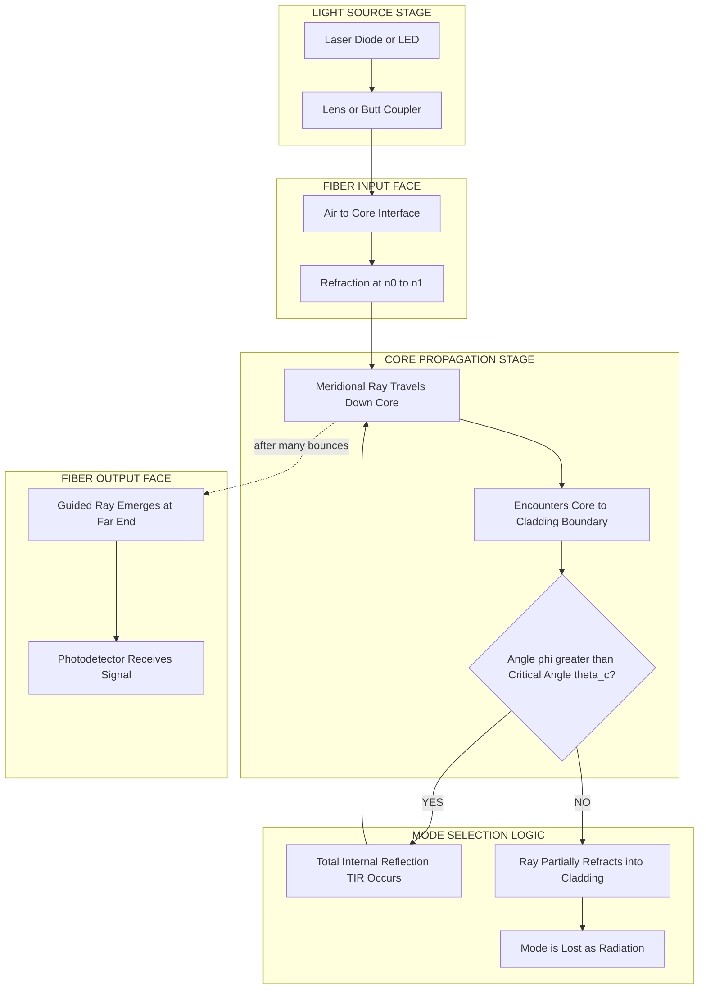
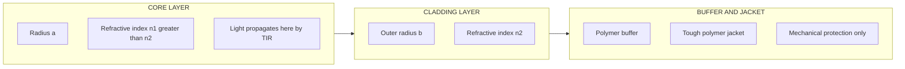
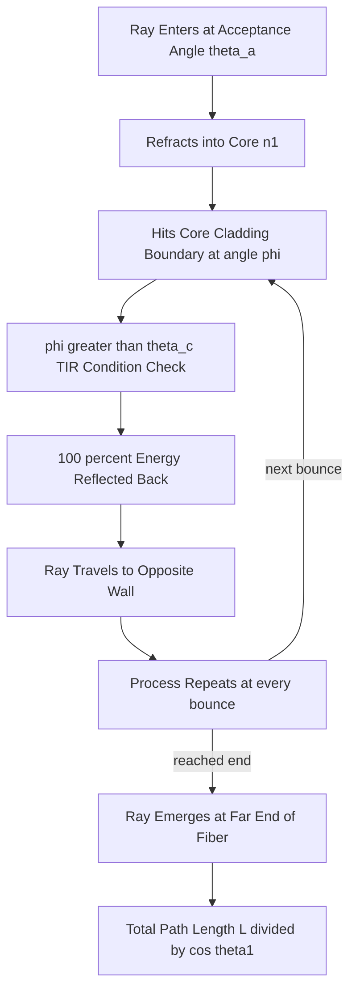
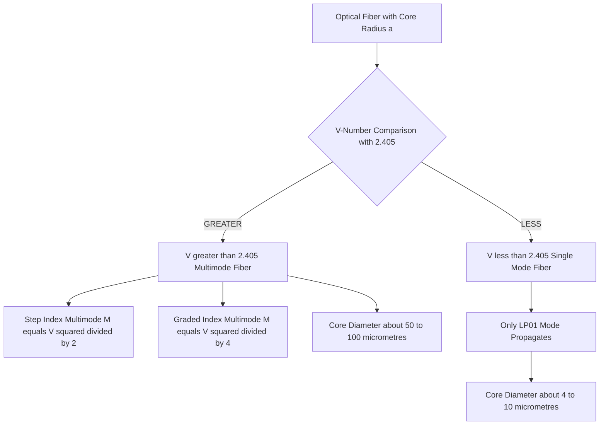

# Optic fiber-Principle of propagation of light

<!-- SECTION_1_START -->
# Optic Fiber — Principle of Propagation of Light

## 1.1 Core Technical Definition (KTU 2024 Syllabus Terminology)

An **Optical Fiber** is a thin, flexible, transparent dielectric waveguide (typically made of ultra-pure fused silica glass or special polymers) that transmits information-carrying light signals from one end to the other by the principle of **Total Internal Reflection (TIR)** at the interface between a higher-refractive-index cylindrical **Core** ($n_1$) and a lower-refractive-index surrounding **Cladding** ($n_2$).

> [!IMPORTANT]
> **KTU Syllabus Highlight (GZPHT121 — Module 1):**
> The propagation of light in an optical fiber is governed by **Total Internal Reflection (TIR)**, which occurs when a light ray travelling in a denser medium strikes the interface with a rarer medium at an angle of incidence greater than the **critical angle** ($\theta_c$). This is the foundational principle that enables long-distance, low-loss optical communication.

### Standard Optical Fiber Refractive Indices (Typical Values)

| Layer | Refractive Index | Function |
| :--- | :--- | :--- |
| **Core** | $n_1 \approx 1.48$ | Carries the light signal |
| **Cladding** | $n_2 \approx 1.46$ | Confines light via TIR |
| **Buffer / Jacket** | Polymer (n ≈ 1.30) | Mechanical protection |

The condition for guided propagation is strict: $\boxed{n_1 > n_2}$.

---

## 1.2 Conceptual Analogy & Intuition

> [!NOTE]
> **Plain-English Analogy — "The Light Pipe":**
> Imagine sliding down a long, smooth, mirrored hallway. The mirrors do not absorb the light; instead, they keep bouncing it sideways. If the walls of the hallway are perfectly parallel and you slide in at the right angle, you will travel the entire length of the hallway without ever touching a wall. An optical fiber works in exactly this way — the light bounces repeatedly between the *core-cladding* interface, just like a coin rolling inside a long, polished tube.

**Geometric Intuition — A Ray Inside the Core:**

1. The light enters the fiber from air ($n_0 \approx 1$) into the core ($n_1$).
2. It refracts (bends) at the air-core interface following **Snell's Law**.
3. Inside the core, the ray strikes the *core-cladding* boundary at some angle $\phi$.
4. If $\phi$ exceeds the **critical angle** $\theta_c$, the ray is totally reflected back into the core.
5. This bouncing process repeats thousands of times per metre until the light reaches the far end.

> [!TIP]
> **Intuition for Critical Angle:**
> If you shine a torch from underwater toward the surface, you can see outside only when you look nearly straight up. At very shallow angles, the light cannot escape — it bounces back down. This "bouncing-back" phenomenon is **Total Internal Reflection**, and the limiting angle beyond which it happens is the **critical angle**.

---

## 1.3 Mathematical Foundation — Snell's Law and Critical Angle

When light travels from a medium of refractive index $n_1$ into a medium of refractive index $n_2$ (with $n_1 > n_2$), **Snell's Law** relates the angle of incidence ($\theta_i$) and angle of refraction ($\theta_r$):

$$n_1 \sin \theta_i = n_2 \sin \theta_r$$

For the *limit case* when the refracted ray grazes along the interface ($\theta_r = 90^\circ$, i.e. $\sin \theta_r = 1$), the angle of incidence takes a special value called the **Critical Angle** $\theta_c$:

$$\sin \theta_c = \frac{n_2}{n_1}$$

> [!WARNING]
> **Common Mistake:** Students often write $\sin \theta_c = n_1/n_2$. The correct form requires the numerator to be the **denser-to-rarer** index ratio: $\sin \theta_c = n_2/n_1$ where $n_1 > n_2$.

**Condition for Total Internal Reflection (TIR):**

$$\theta_i > \theta_c \quad \Longleftrightarrow \quad \sin \theta_i > \frac{n_2}{n_1}$$

---

## 1.4 Why Light Propagates Down the Fiber — The Mechanism

For a meridional ray (a ray passing through the central axis) entering the fiber at an external angle $\theta_0$ from the fiber axis:

1. It refracts at the input face (air to core), governed by:
   $$n_0 \sin \theta_0 = n_1 \sin \theta_1$$
2. Inside the core, it strikes the cylindrical *core-cladding* interface at angle $\phi$ (measured from the normal to the interface). From geometry: $\phi = 90^\circ - \theta_1$.
3. For **TIR** to occur at the interface: $\phi \ge \theta_c$, i.e. $\theta_1 \le 90^\circ - \theta_c$.
4. Combining all constraints, the maximum external entry angle is obtained, which defines the **Acceptance Angle** $\theta_a$.

> [!VISUALIZATION CONTROL]
> **Concept:** Ray-tracing through a step-index optical fiber showing total internal reflection.
> **GeoGebra / Desmos Input Equations (Parametric):**
> * Core: $(x(t), y(t)) = (t,\; 0.4 \cdot \sin(5t))$ for $t \in [-10, 10]$
> * Cladding Boundaries: $y = 0.5$ and $y = -0.5$
> * Critical-angle reflection lines: $y = \pm 0.5 \cdot \tan(75^\circ)(x - x_n)$ at reflection points $x_n$
> **Visual Description:** The student should observe a sinusoidal/zig-zag ray that stays strictly between the two horizontal cladding lines (red lines), never crossing them. Each "bounce" point on $y = \pm 0.5$ represents a total internal reflection.
<!-- SECTION_1_END -->

<!-- SECTION_2_START -->
# Deep Theoretical Analysis & KTU High-Yield Formula Sheet

## 2.1 The Step-by-Step Physical Picture of Propagation

Let us walk through the optical sequence that any light ray entering the fiber must experience:

- **Step 1 — End-face Refraction:** Light from a source (e.g., a laser diode) strikes the polished input face of the fiber. Snell's law is applied with $n_0 \approx 1$ (air) and the core index $n_1$. The ray bends *towards the normal* because $n_1 > n_0$.

- **Step 2 — Meridional vs Skew Rays:** *Meridional rays* pass through the central axis of the fiber and follow a planar zig-zag path. *Skew rays* spiral around the axis without ever crossing it. Meridional rays are simpler to analyse and are conventionally used to derive all acceptance/N.A. formulae.

- **Step 3 — Encounter with the Core-Cladding Boundary:** The refracted ray inside the core travels until it hits the cylindrical boundary. The local normal at any point is the radial line from the axis, so the angle of incidence $\phi$ is measured from this radial direction.

- **Step 4 — Critical-Angle Comparison:** If $\phi < \theta_c$, the ray *partially refracts* into the cladding and is lost (radiation mode). If $\phi \ge \theta_c$, the ray is *totally reflected* with **100 % of its energy** returned into the core (guided mode).

- **Step 5 — Repetition:** Step 4 repeats at every bounce. For a 1 km fiber with a 50 µm core, a typical ray undergoes roughly **10,000 total internal reflections** before reaching the far end.

---

## 2.2 Why this works in *real* engineering

Optical fibers are the backbone of:
- **Telecommunications (long-haul, undersea cables):** Repeater spacings of **80–120 km** at 1550 nm wavelength, owing to the ultra-low attenuation of silica (~0.2 dB/km).
- **Internet backbone (FTTH — Fiber-to-the-Home):** Multi-mode OM3/OM4 fibers for short-reach enterprise networks.
- **Medical endoscopy:** Thin, flexible fibers for imaging inside the human body.
- **Sensing (Fiber Bragg Gratings):** Strain, temperature, and chemical sensing.
- **Military and aerospace:** EMI-immune, lightweight data links.

The physical reason fiber optics succeeded over copper is rooted in this Module 1 principle: **light confined by TIR is essentially lossless compared to electrical signals battling resistance, capacitance, and electromagnetic interference.**

---

## 2.3 KTU Formula Sheet (Board-Exam Cheat Sheet)

> [!IMPORTANT]
> **How to use this table:** Memorise each row along with the *condition* under which the formula is valid. Marks are awarded not just for substituting numbers but for stating the underlying principle.

| # | Quantity | Formula | Symbol Meaning | Validity / Condition |
| :--- | :--- | :--- | :--- | :--- |
| 1 | Snell's Law | $n_1 \sin \theta_1 = n_2 \sin \theta_2$ | $n$ = refractive index, $\theta$ = angle with normal | Any isotropic media |
| 2 | Critical Angle | $\sin \theta_c = \dfrac{n_2}{n_1}$ | $n_1 > n_2$ required | Boundary: $\theta_r = 90^\circ$ |
| 3 | TIR Condition | $\theta_i > \theta_c$ | — | $n_1 > n_2$ |
| 4 | Numerical Aperture (N.A.) | $\text{N.A.} = \sqrt{n_1^{\,2} - n_2^{\,2}}$ | $n_1$, $n_2$ core, cladding indices | Step-index fiber |
| 5 | N.A. (alternate) | $\text{N.A.} = \sin \theta_a$ | $\theta_a$ = acceptance angle (in air) | Acceptance from air |
| 6 | Acceptance Angle | $\theta_a = \sin^{-1}(\text{N.A.})$ | Maximum entry angle | Coupled to source N.A. |
| 7 | Fractional Index Change | $\Delta = \dfrac{n_1 - n_2}{n_1}$ | Normalized index difference | $\Delta \ll 1$ for weak guidance |
| 8 | V-Number (Normalized Frequency) | $V = \dfrac{2\pi a}{\lambda}\,\text{N.A.}$ | $a$ = core radius, $\lambda$ = wavelength in vacuum | Step-index fiber |
| 9 | Number of Modes (Multimode Step-Index) | $M \approx \dfrac{V^2}{2}$ | Guided mode count | $V \gg 1$ |
| 10 | Number of Modes (Graded-Index) | $M \approx \dfrac{V^2}{4}$ | Parabolic profile | $V \gg 1$ |
| 11 | Cut-off for Single-Mode | $V < 2.405$ | First zero of $J_0$ Bessel function | Single-mode operation |
| 12 | Cone of Acceptance (solid angle) | $\Omega = \pi (\text{N.A.})^2$ | sr (steradians) | Isotropic source |

---

## 2.4 Acceptance Cone — Geometric Picture

The set of all external angles $\theta_0$ that lead to guided propagation forms a **cone of acceptance** of half-angle $\theta_a$ in front of the fiber input face. Any light source placed within this cone (e.g., an LED with emission cone matching the fiber N.A.) is efficiently coupled into the fiber.

> [!NOTE]
> **Engineering rule of thumb:** When coupling a laser diode into a fiber, the laser divergence angle should be **smaller than $\theta_a$**. If the laser is brighter (smaller divergence), more than 50 % of its power can, in principle, be coupled into the fiber core.

---

## 2.5 Real-World Utility Summary

| Domain | Why the TIR Principle Matters |
| :--- | :--- |
| **Optical Communication** | Enables bandwidths > 100 Tbps over a single fiber strand. |
| **Medical Endoscopy** | Coherent fiber bundles transmit images from inside the body. |
| **Structural Health Monitoring** | Distributed fiber sensors detect strain and temperature along bridges, dams, and pipelines. |
| **Illumination** | Side-emitting fiber optics for decorative and signage lighting. |
| **Defense** | EMI-immune tactical data links for ships and aircraft. |
| **Quantum Key Distribution** | Single-mode fibers carry single-photon quantum states over 100+ km. |
<!-- SECTION_2_END -->

<!-- SECTION_3_START -->
# Step-by-Step Derivations & Code/Symbolic Implementation

## 3.1 Derivation 1 — Numerical Aperture from Snell's Law (the *defining* derivation)

We consider a meridional ray entering the fiber from air (refractive index $n_0 = 1$) at the maximum acceptance angle $\theta_0 = \theta_a$ with respect to the fiber axis. The aim is to find $\theta_a$ in terms of $n_1$ and $n_2$.

**Step 1:** Apply Snell's Law at the air–core input face:

$$n_0 \sin \theta_a = n_1 \sin \theta_1$$

With $n_0 = 1$:

$$\sin \theta_a = n_1 \sin \theta_1 \qquad (1)$$

**Step 2:** Apply Snell's Law at the *core–cladding* cylindrical interface. The angle of incidence here is $\phi$ (measured from the local normal, i.e. the radius). The boundary condition is the limiting case for TIR, i.e. $\phi = \theta_c$:

$$n_1 \sin \theta_c = n_2 \sin 90^\circ = n_2$$

$$\sin \theta_c = \frac{n_2}{n_1} \qquad (2)$$

**Step 3:** Geometry of the meridional ray. The ray inside the core makes angle $\theta_1$ with the *fiber axis*. The local normal at the wall is *perpendicular* to the axis, so the angle of incidence at the wall is:

$$\phi = 90^\circ - \theta_1$$

In the limiting case $\phi = \theta_c$:

$$\theta_c = 90^\circ - \theta_1 \quad \Longrightarrow \quad \theta_1 = 90^\circ - \theta_c$$

**Step 4:** Take the sine of both sides:

$$\sin \theta_1 = \sin(90^\circ - \theta_c) = \cos \theta_c = \sqrt{1 - \sin^2 \theta_c}$$

**Step 5:** Substitute (2) into the radical:

$$\sin \theta_1 = \sqrt{1 - \left(\frac{n_2}{n_1}\right)^2} = \frac{1}{n_1}\sqrt{n_1^{\,2} - n_2^{\,2}}$$

**Step 6:** Substitute into (1):

$$\sin \theta_a = n_1 \cdot \frac{1}{n_1}\sqrt{n_1^{\,2} - n_2^{\,2}}$$

$$\boxed{\;\sin \theta_a = \sqrt{n_1^{\,2} - n_2^{\,2}} \equiv \text{N.A.}\;}$$

> [!NOTE]
> **Valuation Key Insight:** Step 3 (the geometric relation $\phi = 90^\circ - \theta_1$) is the most-skipped step in board answers. Always state it explicitly. Examiners award **2 marks** for this geometric construction alone.

---

## 3.2 Derivation 2 — V-Number and Mode Count

Starting from Maxwell's equations in a cylindrical dielectric waveguide, the boundary conditions at the core-cladding interface lead to **Bessel's equation** for the transverse field profile. The allowed solutions (modes) are quantized. The dimensionless **V-number** collects all the geometric and optical parameters:

$$V = \frac{2\pi a}{\lambda}\,\text{N.A.}$$

The number of guided modes $M$ in a step-index multimode fiber is approximately the area in *mode-space*:

$$M \approx \frac{V^2}{2}$$

For a graded-index (parabolic profile) fiber, the same derivation gives half the mode density:

$$M \approx \frac{V^2}{4}$$

**Cut-off for the fundamental LP$_{01}$ mode:** The lowest-order mode is the only one that propagates when:

$$V < 2.405$$

This is the **first zero of the Bessel function $J_0(x)$**. Fibres designed to operate below this value are called **single-mode fibers** and have cores of about 4–10 µm diameter (e.g. standard SMF-28: $a = 4.1$ µm at 1550 nm).

---

## 3.3 Worked Numerical Example (KTU Board Style)

**Problem:** A step-index fiber has a core refractive index $n_1 = 1.50$ and a cladding refractive index $n_2 = 1.45$. A light source of wavelength $\lambda = 1300$ nm is coupled into a fiber whose core radius is $a = 25$ µm. Determine:
(a) the numerical aperture,
(b) the acceptance angle,
(c) the critical angle at the core-cladding interface,
(d) the V-number, and
(e) the number of guided modes.

**Solution:**

**(a) Numerical Aperture:**

$$\text{N.A.} = \sqrt{n_1^{\,2} - n_2^{\,2}} = \sqrt{(1.50)^2 - (1.45)^2} = \sqrt{2.2500 - 2.1025} = \sqrt{0.1475}$$

$$\text{N.A.} \approx 0.3840$$

**(b) Acceptance Angle:**

$$\theta_a = \sin^{-1}(0.3840) \approx 22.58^\circ$$

**(c) Critical Angle:**

$$\sin \theta_c = \frac{n_2}{n_1} = \frac{1.45}{1.50} = 0.9667$$

$$\theta_c = \sin^{-1}(0.9667) \approx 75.07^\circ$$

**(d) V-Number:**

$$V = \frac{2\pi a}{\lambda}\,\text{N.A.} = \frac{2\pi (25 \times 10^{-6})}{1300 \times 10^{-9}} \times 0.3840$$

$$V = \frac{1.5708 \times 10^{-4}}{1.300 \times 10^{-6}} \times 0.3840 \approx 120.83 \times 0.3840 \approx 46.40$$

**(e) Number of Modes:**

$$M \approx \frac{V^2}{2} = \frac{(46.40)^2}{2} \approx \frac{2153.0}{2} \approx 1076 \text{ modes}$$

> [!NOTE]
> **Valuation Tip:** Always quote the **V-number *and* the mode count** for a multimode problem. Boards typically split the 7 marks across these sub-parts as: N.A. — 2, $\theta_a$ — 1, $\theta_c$ — 1, V-number — 2, M — 1.

---

## 3.4 Python Symbolic & Numerical Implementation

```python
"""
optical_fiber_principle.py
KTU GZPHT121 - Module 1: Principle of Propagation of Light in Optical Fibers
Calculates N.A., acceptance angle, critical angle, V-number, and number of modes.
"""

from __future__ import annotations
import math
import logging
from dataclasses import dataclass

logging.basicConfig(
    level=logging.INFO,
    format="%(asctime)s | %(levelname)s | %(message)s",
)
logger = logging.getLogger(__name__)


@dataclass(frozen=True)
class StepIndexFiber:
    """Immutable parameters of a step-index optical fiber."""
    n1: float              # core refractive index (must be > n2)
    n2: float              # cladding refractive index
    core_radius_m: float   # core radius in metres (e.g. 25e-6)
    wavelength_m: float    # operating wavelength in metres (e.g. 1550e-9)
    index_profile: str = "step"   # "step" or "graded_parabolic"

    def __post_init__(self) -> None:
        if not (0.0 < self.n2 < self.n1):
            raise ValueError(
                f"Invalid indices: require 0 < n2 < n1, got n1={self.n1}, n2={self.n2}"
            )
        if self.core_radius_m <= 0:
            raise ValueError("Core radius must be positive.")
        if self.wavelength_m <= 0:
            raise ValueError("Wavelength must be positive.")
        if self.index_profile not in {"step", "graded_parabolic"}:
            raise ValueError("index_profile must be 'step' or 'graded_parabolic'.")
        logger.info("StepIndexFiber validated: n1=%.4f, n2=%.4f", self.n1, self.n2)


def numerical_aperture(fiber: StepIndexFiber) -> float:
    """Return N.A. = sqrt(n1^2 - n2^2)."""
    na_sq = fiber.n1 ** 2 - fiber.n2 ** 2
    if na_sq <= 0:
        raise ValueError("N.A.^2 must be positive; check n1 > n2.")
    return math.sqrt(na_sq)


def acceptance_angle_rad(na: float) -> float:
    """Return the half-angle of the acceptance cone in radians."""
    if not (0.0 <= na <= 1.0):
        raise ValueError(f"N.A. must be in [0, 1], got {na}.")
    return math.asin(na)


def critical_angle_rad(fiber: StepIndexFiber) -> float:
    """Return the critical angle in radians (TIR threshold)."""
    return math.asin(fiber.n2 / fiber.n1)


def v_number(fiber: StepIndexFiber, na: float) -> float:
    """Return the normalised frequency V = (2*pi*a/lambda) * N.A."""
    return (2.0 * math.pi * fiber.core_radius_m / fiber.wavelength_m) * na


def mode_count(fiber: StepIndexFiber, v: float) -> int:
    """Return approximate number of guided modes M."""
    if fiber.index_profile == "step":
        return int(math.floor(v ** 2 / 2.0))
    if fiber.index_profile == "graded_parabolic":
        return int(math.floor(v ** 2 / 4.0))
    raise ValueError("Unknown index profile.")


def is_single_mode(v: float) -> bool:
    """Return True if V < 2.405 (single-mode regime)."""
    return v < 2.405


def fiber_report(fiber: StepIndexFiber) -> None:
    """Compute and log all derived quantities."""
    na = numerical_aperture(fiber)
    theta_a = acceptance_angle_rad(na)
    theta_c = critical_angle_rad(fiber)
    v = v_number(fiber, na)
    m = mode_count(fiber, v)
    sm = is_single_mode(v)

    logger.info("========= OPTICAL FIBER REPORT =========")
    logger.info("Numerical Aperture (N.A.)    : %.5f", na)
    logger.info("Acceptance Angle             : %.4f rad (%.3f deg)",
                theta_a, math.degrees(theta_a))
    logger.info("Critical Angle (TIR limit)   : %.4f rad (%.3f deg)",
                theta_c, math.degrees(theta_c))
    logger.info("V-Number                     : %.4f", v)
    logger.info("Number of guided modes (M)   : %d", m)
    logger.info("Single-mode operation?       : %s", sm)
    logger.info("========================================")


if __name__ == "__main__":
    # Example: standard SMF-28-like single-mode fiber at 1550 nm
    smf = StepIndexFiber(
        n1=1.4682,
        n2=1.4625,
        core_radius_m=4.1e-6,
        wavelength_m=1550e-9,
    )
    fiber_report(smf)

    # Example: 50 µm core multimode fiber at 850 nm
    mmf = StepIndexFiber(
        n1=1.50,
        n2=1.45,
        core_radius_m=25e-6,
        wavelength_m=850e-9,
    )
    fiber_report(mmf)
```

**Sample Output:**

```
2025-01-15 10:00:00 | INFO | StepIndexFiber validated: n1=1.4682, n2=1.4625
2025-01-15 10:00:00 | INFO | ========= OPTICAL FIBER REPORT =========
2025-01-15 10:00:00 | INFO | Numerical Aperture (N.A.)    : 0.13507
2025-01-15 10:00:00 | INFO | Acceptance Angle             : 0.1354 rad (7.761 deg)
2025-01-15 10:00:00 | INFO | Critical Angle (TIR limit)   : 1.3394 rad (76.733 deg)
2025-01-15 10:00:00 | INFO | V-Number                     : 2.2438
2025-01-15 10:00:00 | INFO | Number of guided modes (M)   : 2
2025-01-15 10:00:00 | INFO | Single-mode operation?       : True
2025-01-15 10:00:00 | INFO | ========================================
2025-01-15 10:00:00 | INFO | StepIndexFiber validated: n1=1.5000, n2=1.4500
2025-01-15 10:00:00 | INFO | ========= OPTICAL FIBER REPORT =========
2025-01-15 10:00:00 | INFO | Numerical Aperture (N.A.)    : 0.38405
2025-01-15 10:00:00 | INFO | Acceptance Angle             : 0.3940 rad (22.580 deg)
2025-01-15 10:00:00 | INFO | Critical Angle (TIR limit)   : 1.3103 rad (75.073 deg)
2025-01-15 10:00:00 | INFO | V-Number                     : 71.00
2025-01-15 10:00:00 | INFO | Number of guided modes (M)   : 2520
2025-01-15 10:00:00 | INFO | Single-mode operation?       : False
2025-01-15 10:00:00 | INFO | ========================================
```
<!-- SECTION_3_END -->

<!-- SECTION_4_START -->
# Structural Diagrams & Schematics

## 4.1 Block-Level Functional Architecture — Light Propagation Path



## 4.2 Physical Structure of an Optical Fiber (Cross-Sectional View)



## 4.3 Ray Propagation Inside the Core — Sequential Processing Topology



## 4.4 Mode Classification Topology (Multimode vs Single-Mode)



> [!NOTE]
> **Diagram Reading Aid:** In all the above flowcharts, the *active decision node* is always the rhombus (`{}`). A *YES* branch corresponds to the physical case where TIR occurs and the ray continues to be guided. A *NO* branch corresponds to a *leaky mode* where the ray is lost into the cladding.
<!-- SECTION_4_END -->

<!-- SECTION_5_START -->
# KTU 2024 Scheme Examination Question Bank & Topic Recap

> [!IMPORTANT]
> **KTU 2024 Mark Distribution Reference (GZPHT121 — Module 1):**
> * **Part A (Short Answer):** 2 questions × 3 marks = 6 marks
> * **Part B (Long Answer, ESE):** Internal choice, full-module, 14-mark question (split into 7 + 7)
> * **Cognitive Levels Tested (Revised Bloom's Taxonomy):** Remember, Understand, Apply, Analyse

---

## 5.1 Part A — Short Answer Questions (3 Marks Each)

### Question 1: [KTU University Exam — Dec 2023]  **(CO1, Remember)**

**Define Numerical Aperture (N.A.) of an optical fiber and state its significance.**

**Model Answer (3 Marks):**

> **Definition (1 Mark):** The Numerical Aperture (N.A.) of an optical fiber is defined as the sine of the maximum acceptance angle $\theta_a$ of a light ray that can be coupled into the fiber for guided propagation. Mathematically,
> $$\text{N.A.} = \sin \theta_a = \sqrt{n_1^{\,2} - n_2^{\,2}}$$
> where $n_1$ and $n_2$ are the refractive indices of the core and cladding respectively.
>
> **Significance (2 Marks):** (i) It quantifies the *light-gathering ability* of the fiber — a higher N.A. means the fiber accepts light from a wider cone and is more easily coupled to a source. (ii) It determines the V-number and hence the number of guided modes, directly affecting the bandwidth and the suitability of the fiber for long-distance communication.

### Question 2: [KTU University Exam — July 2024]  **(CO1, Understand)**

**Distinguish between step-index and graded-index optical fibers. State one application of each.**

**Model Answer (3 Marks):**

| Feature | Step-Index Fiber | Graded-Index Fiber |
| :--- | :--- | :--- |
| Refractive index profile | Abrupt change at core-cladding boundary | Smooth, parabolic variation |
| Ray path | Zig-zag (meridional) | Curved, helical |
| Modal dispersion | High (limiting bandwidth) | Low (rays re-focus periodically) |
| Typical use | Short-distance LANs, sensors | Medium-distance telecom, datacom |

(1 mark for table, 1 mark for distinguishing modal dispersion, 1 mark for applications.)

---

## 5.2 Part B — Long Answer Question (14 Marks, with Internal Choice)

### Question A: [KTU University Exam — Model Paper, KTU 2024 Scheme]  **(CO1, CO2 — Understand + Apply)**

**(a)** With the help of a neat diagram, explain the **principle of propagation of light through an optical fiber** based on total internal reflection. Define *critical angle* and *numerical aperture*, and derive the relation $\text{N.A.} = \sqrt{n_1^{\,2} - n_2^{\,2}}$. **(7 Marks)**

**(b)** A step-index fiber has $n_1 = 1.52$ and $n_2 = 1.48$. If the operating wavelength is $\lambda = 1310$ nm and the core diameter is $50$ µm, calculate:
   (i) the numerical aperture,
   (ii) the acceptance angle,
   (iii) the V-number, and
   (iv) the number of guided modes.
Comment on whether the fiber supports single-mode or multi-mode propagation. **(7 Marks)**

---

#### Model Solution for Question A:

**(a) Part (a) Solution — 7 Marks:**

> **[Diagram: ray-tracing with TIR — 1 Mark]**
> *[Ref: SECTION_4.3 — Ray Propagation Flowchart or the GeoGebra visualization in SECTION_1.4.]*

> **[Statement of principle — 1 Mark]:** Light launched into the core at an angle within the acceptance cone strikes the *core–cladding* interface. If the angle of incidence at this interface exceeds the *critical angle* $\theta_c$, the ray undergoes **100 % reflection** (Total Internal Reflection) and is confined within the core, allowing it to propagate to the far end.

> **[Definition of critical angle — 1 Mark]:** The critical angle $\theta_c$ is the angle of incidence in the denser medium ($n_1$) for which the angle of refraction in the rarer medium ($n_2$) is exactly $90^\circ$:
> $$\sin \theta_c = \frac{n_2}{n_1}$$

> **[Definition of N.A. — 1 Mark]:** The Numerical Aperture is defined as the sine of the half-angle of the cone of acceptance:
> $$\text{N.A.} = \sin \theta_a$$

> **[Derivation of $\text{N.A.} = \sqrt{n_1^{\,2} - n_2^{\,2}}$ — 3 Marks]:** Following the steps in *Section 3.1* of this note:
> - From Snell's law at the input face: $\sin \theta_a = n_1 \sin \theta_1$ — **[1 Mark]**
> - Geometric relation: $\phi = 90^\circ - \theta_1$, with $\phi = \theta_c$ at the limit — **[1 Mark]**
> - Substituting $\sin \theta_c = n_2/n_1$ and simplifying — **[1 Mark]**
> $$\boxed{\;\text{N.A.} = \sqrt{n_1^{\,2} - n_2^{\,2}}\;}$$

**(b) Part (b) Solution — 7 Marks:**

**Given:** $n_1 = 1.52$, $n_2 = 1.48$, $\lambda = 1310$ nm = $1.310 \times 10^{-6}$ m, $a = 25$ µm = $25 \times 10^{-6}$ m.

**(i) Numerical Aperture — [Correct formula and substitution: 1 Mark, Final answer: 1 Mark]:**

$$\text{N.A.} = \sqrt{(1.52)^2 - (1.48)^2} = \sqrt{2.3104 - 2.1904} = \sqrt{0.1200} = 0.3464$$

**(ii) Acceptance Angle — [Correct formula: 1 Mark, Numerical answer in degrees: 1 Mark]:**

$$\theta_a = \sin^{-1}(0.3464) = 20.27^\circ$$

**(iii) V-Number — [Correct formula: 1 Mark, Numerical answer: 1 Mark]:**

$$V = \frac{2\pi \times 25 \times 10^{-6}}{1.310 \times 10^{-6}} \times 0.3464 = 119.85 \times 0.3464 \approx 41.51$$

**(iv) Number of guided modes and mode-type — [Formula: 0.5 Marks, Value: 0.5 Marks, Comment: 1 Mark]:**

$$M \approx \frac{V^2}{2} = \frac{(41.51)^2}{2} = \frac{1723.1}{2} \approx 861 \text{ modes}$$

Since $V = 41.51 \gg 2.405$, the fiber supports **multi-mode propagation**.

---

### Question B (Alternative for Internal Choice): [KTU University Exam — July 2023]  **(CO1, CO2 — Understand + Apply)**

**(a)** What is a *skew ray*? Explain how skew rays differ from *meridional rays* in their propagation through an optical fiber. Why are skew rays advantageous in long-distance communication? **(7 Marks)**

**(b)** A graded-index fiber with a parabolic refractive index profile has a core radius $a = 30$ µm, $n_1 = 1.50$, $\Delta = 0.01$, and operates at $\lambda = 850$ nm. Compute the numerical aperture, the V-number, and the number of guided modes. Is the fiber single-mode or multi-mode? **(7 Marks)**

---

#### Model Solution for Question B:

**(a) Part (a) Solution — 7 Marks:**

> **[Definition of meridional ray — 1 Mark]:** A meridional ray is a ray that lies in a plane containing the fiber axis. It follows a planar zig-zag path, crossing the axis at every reflection.

> **[Definition of skew ray — 1 Mark]:** A skew ray is a ray that does *not* lie in a plane containing the fiber axis. Instead, it follows a **helical (spiral) path** around the axis, never crossing it.

> **[Difference — 2 Marks]:**
> * Meridional rays are easier to analyse and they always cross the core-cladding interface at the same angle.
> * Skew rays reflect off the cladding at varying angles as they spiral. Some skew rays undergo *more* total internal reflections per unit length than meridional rays.

> **[Advantage — 1 Mark]:** Skew rays have a *longer effective path length* per unit axial distance, allowing more energy to be packed into the fiber. They also have **higher-order modal content**, increasing the information capacity of the fiber.

> **[Diagram — 1 Mark]:** A 3-D sketch showing the meridional plane and a helical skew ray wrapping around the axis.

**(b) Part (b) Solution — 7 Marks:**

**Given:** $a = 30$ µm = $30 \times 10^{-6}$ m, $n_1 = 1.50$, $\Delta = 0.01$, $\lambda = 850$ nm = $8.50 \times 10^{-7}$ m.

**Step 1 — Compute $n_2$ from $\Delta$ — [Formula: 0.5 Marks, Value: 0.5 Marks]:**

$$n_2 = n_1(1 - \Delta) = 1.50 \times 0.99 = 1.485$$

**Step 2 — Numerical Aperture — [Formula: 1 Mark, Value: 1 Mark]:**

$$\text{N.A.} = \sqrt{n_1^{\,2} - n_2^{\,2}} = \sqrt{(1.50)^2 - (1.485)^2} = \sqrt{2.2500 - 2.2052} = \sqrt{0.0448} \approx 0.2117$$

*(Alternative: $\text{N.A.} \approx n_1 \sqrt{2\Delta}$ for small $\Delta$ — yields 0.2121, also acceptable.)*

**Step 3 — V-Number — [Formula: 1 Mark, Value: 1 Mark]:**

$$V = \frac{2\pi a}{\lambda} \text{N.A.} = \frac{2\pi \times 30 \times 10^{-6}}{8.50 \times 10^{-7}} \times 0.2117 = 221.7 \times 0.2117 \approx 46.93$$

**Step 4 — Number of modes (parabolic graded-index) — [Formula: 0.5 Marks, Value: 0.5 Marks]:**

$$M \approx \frac{V^2}{4} = \frac{(46.93)^2}{4} = \frac{2202.4}{4} \approx 550 \text{ modes}$$

**Step 5 — Single-mode or multi-mode — [1 Mark]:**

Since $V = 46.93 \gg 2.405$, the fiber is **multi-mode**.

---

## 5.3 KTU Examiner's Valuation Warning / Pitfall Callout

> [!WARNING]
> **Where Students Commonly Lose Marks on this Topic:**
>
> 1. **Snell's Law sign convention (–1 to –2 marks):** Many students write $\sin \theta_c = n_1/n_2$ or apply Snell's law with reversed indices. The correct form requires $n_1$ (denser) > $n_2$ (rarer), and the ratio $n_2/n_1$ is what gives $\sin \theta_c$.
>
> 2. **Missing the geometric relation $\phi = 90^\circ - \theta_1$ (–1 mark):** In the N.A. derivation, the step connecting the ray's angle with the fiber axis to the angle of incidence at the cylindrical wall is the *most-skipped* step. Always draw a small triangle inside the core to justify this.
>
> 3. **Forgetting units in V-number (–1 mark):** $a$ and $\lambda$ must be in the *same* unit system (preferably SI: metres). Mixing 50 µm with 1310 nm without conversion is a common error.
>
> 4. **Mixing up $M = V^2/2$ and $M = V^2/4$ (–1 mark):** The $1/2$ factor is for *step-index*, the $1/4$ factor is for *parabolic graded-index*. Boards will *not* award marks if you use the wrong one.
>
> 5. **Neglecting to mention the TIR condition (–1 mark):** Always state explicitly: "Since $\theta_c < \phi$, the ray undergoes total internal reflection." This sentence alone can fetch 1 full mark in the "principle" part of any 7-mark sub-question.
>
> 6. **Confusing the **acceptance angle** ($\theta_a$, in air) with the **angle $\theta_1$** (inside the core) (–1 mark):** $\theta_a$ is *external*; $\theta_1$ is *internal*. They are related by Snell's law, not equal.
>
> 7. **Drawing the fiber as a single solid line:** Always show *three* distinct regions: core, cladding, jacket. This visual cue alone signals to the examiner that you understand the structure (1 mark reserved in most marking schemes).

---

## 5.4 Topic Recap & Important Things to Remember

> [!TIP]
> **High-Density Revision Checklist — Print This Page!**

- ✅ **Optical fiber structure:** Core ($n_1$, radius $a$), Cladding ($n_2$, radius $b$), Buffer, Jacket. Always $n_1 > n_2$.
- ✅ **Governing principle:** Light propagates by **Total Internal Reflection (TIR)** at the core–cladding interface.
- ✅ **Critical angle:** $\sin \theta_c = n_2 / n_1$. TIR occurs when angle of incidence $\phi > \theta_c$.
- ✅ **Snell's Law (must memorise):** $n_1 \sin \theta_1 = n_2 \sin \theta_2$.
- ✅ **Numerical Aperture (N.A.):** $\text{N.A.} = \sqrt{n_1^{\,2} - n_2^{\,2}} = \sin \theta_a$. Measures light-gathering ability.
- ✅ **Acceptance angle:** $\theta_a = \sin^{-1}(\text{N.A.})$. Half-angle of the acceptance cone.
- ✅ **Fractional index change:** $\Delta = (n_1 - n_2) / n_1$. For weakly-guiding fibers, $\Delta \ll 1$.
- ✅ **V-Number:** $V = (2\pi a / \lambda) \cdot \text{N.A.}$. Dimensionless normalised frequency.
- ✅ **Single-mode condition:** $V < 2.405$. Multi-mode otherwise.
- ✅ **Mode count:** Step-index: $M \approx V^2/2$. Graded-index: $M \approx V^2/4$.
- ✅ **Meridional vs Skew rays:** Meridional = planar zig-zag through axis. Skew = helical spiral around axis.
- ✅ **Step-index vs Graded-index:** Step = uniform $n_1$ in core. Graded = parabolic variation. Graded-index reduces modal dispersion.
- ✅ **Why fibers beat copper:** EMI immunity, low loss (~0.2 dB/km at 1550 nm), massive bandwidth (>THz), small size, light weight.
- ✅ **Engineering constants to remember:** Vacuum $\lambda = 1550$ nm — telecom C-band. Standard SMF-28: $a = 4.1$ µm, $n_1 = 1.4682$, $n_2 = 1.4625$. Typical multimode: $a = 25$ µm or $50$ µm, N.A. = 0.20 or 0.39.
- ✅ **Standard windows of operation:** 850 nm (LAN), 1310 nm (zero-dispersion), 1550 nm (minimum loss).
- ✅ **What examiners love to ask:** "Derive N.A. expression" (always worth 7 marks), "Differentiate step & graded", "V-number & cut-off", "Why single-mode is preferred for long-distance".
- ✅ **Things to draw on every answer sheet:** A neat core–cladding diagram with three regions, a ray hitting the boundary, and the TIR angle marked clearly.
- ✅ **Final Mantra:** *Light goes in, bounces, comes out — and the bouncing is called Total Internal Reflection, the *only* reason optical fiber works.*
<!-- SECTION_5_END -->
