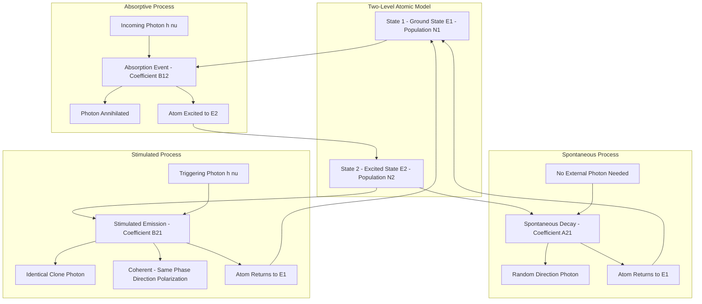
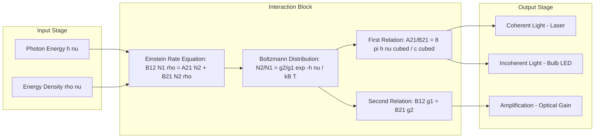
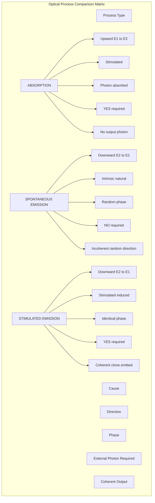
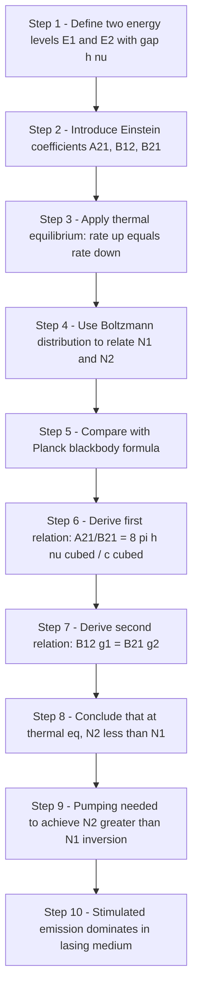

# Optical processes – Absorption-Spontaneous emission and stimulated emission

<!-- SECTION_1_START -->

# Optical Processes: Absorption, Spontaneous & Stimulated Emission

## 1.1 Foundational Definition (KTU 2024 Syllabus Terminology)

In the quantum mechanical description of light-matter interaction, every optical process is fundamentally an **electronic transition** between two discrete energy states of an atomic system. For a two-level atom with ground state energy $E_1$ and excited state energy $E_2$, the three primary optical processes governed by Einstein are:

**Absorption** — A phenomenon in which an atom in the lower energy state $E_1$ absorbs a photon of energy $h\nu = E_2 - E_1$ and is excited to the higher energy state $E_2$.

**Spontaneous Emission** — A radiative process in which an atom in the excited state $E_2$ decays to the lower state $E_1$ on its own after a characteristic lifetime, emitting a photon of energy $h\nu$ in a **random direction** with a **random phase**.

**Stimulated Emission** — A radiative process in which an incoming photon of energy $h\nu$ *induces* an excited atom at $E_2$ to drop to $E_1$, emitting a second photon that is **identical** to the incident one in frequency, phase, direction, and polarization.

> [!IMPORTANT]
> **KTU 2024 Board Standard Definition (Verbatim from Module 1):**
> "The interaction of radiation with matter can be described by three fundamental processes: absorption, spontaneous emission, and stimulated emission. These are characterized by the Einstein coefficients $A_{21}$, $B_{12}$, and $B_{21}$ respectively."

> [!NOTE]
> **Critical Distinction for Exams:**
> - Absorption **requires** an incoming photon (stimulated process).
> - Spontaneous emission **does NOT** require an incoming photon (random process).
> - Stimulated emission **requires** an incoming photon, but the emitted photon is *coherent* with it.

---

## 1.2 Intuitive Analogy — The Domino Cascade vs. The Random Raindrop

Imagine an atom as a small **water tank** with two levels: a low tank (ground state $E_1$) and a high tank (excited state $E_2$).

| Process | Water Tank Analogy | Key Property |
|---|---|---|
| **Absorption** | A water pump pushes water **up** from the low tank to the high tank, but only if a precise amount of energy (matching $h\nu$) is supplied from outside. | Requires *external energy input*; only happens when photon energy matches the gap exactly. |
| **Spontaneous Emission** | The high tank has a small leak. Water randomly trickles down on its own — you cannot predict *when* a particular drop will fall or *which way* it will splash. | Random direction, random phase, random timing. The atom has a natural "lifetime" before leaking. |
| **Stimulated Emission** | A falling drop *triggers* a synchronized cascade: a precisely aimed water jet strikes the high tank, causing water to fall **in lockstep** with the jet. The new falling stream is *identical* to the triggering one. | The emitted photon is a **clone** of the triggering photon — same frequency, phase, direction, polarization. |

> [!TIP]
> **The Domino Effect Visualization:** Stimulated emission is exactly like a falling domino causing the next domino to fall in perfect synchrony. Spontaneous emission is like dominoes that randomly topple on their own due to vibrations.

---

## 1.3 The Two-Level Atomic Model

For KTU 2024 Module 1, every derivation and concept is built upon the idealized **two-level atom** approximation:

$$E_2 - E_1 = h\nu = \hbar\omega$$

where:
- $h$ is **Planck's constant** $= 6.626 \times 10^{-34} \, \text{J}\cdot\text{s}$
- $\nu$ is the frequency of the radiation
- $\hbar = h/2\pi$ is the reduced Planck constant

The atom can be in one of two states:
- **State 1 (ground state):** Energy $E_1$, population $N_1$ atoms per unit volume
- **State 2 (excited state):** Energy $E_2$, population $N_2$ atoms per unit volume

> [!VISUALIZATION CONTROL]
> **Concept:** Two-Level Atomic Energy Diagram with Transition Arrows
> **GeoGebra / Desmos Input Equations:**
> * Point 1: $(x, y) = (0, E_1)$ with label "Ground State E1, Population N1"
> * Point 2: $(x, y) = (0, E_2)$ with label "Excited State E2, Population N2"
> * Vertical arrow: from $(0.5, E_1)$ to $(0.5, E_2)$ labeled "Absorption (h nu)"
> * Vertical arrow: from $(0.7, E_2)$ to $(0.7, E_1)$ labeled "Spontaneous Emission"
> * Vertical arrow: from $(0.9, E_2)$ to $(0.9, E_1)$ labeled "Stimulated Emission"
> **Visual Description:** A simple vertical energy axis with two horizontal lines representing $E_1$ and $E_2$. Three arrows show the three processes. The student should observe that absorption is an "upward" arrow, while both emissions are "downward."

---

## 1.4 Why These Three Processes Matter

These three processes form the **theoretical foundation of the LASER** (Light Amplification by Stimulated Emission of Radiation). Without understanding the relative rates of these processes, it is impossible to explain:
- Why ordinary light sources (bulbs, LEDs) are incoherent
- Why lasers require **population inversion**
- Why optical amplification demands stimulated emission to dominate

<!-- SECTION_1_END -->

<!-- SECTION_2_START -->

# Deep Theoretical Analysis & KTU High-Yield Formula Sheet

## 2.1 Process 1 — Absorption (Stimulated Upward Transition)

**Mechanism:** An atom in state $E_1$ interacts with an incoming photon of energy $h\nu = E_2 - E_1$. The photon is annihilated, and its energy is transferred to the atom, promoting it to $E_2$.

**Rate of Absorption (per unit volume per unit time):**
The rate of upward transitions is proportional to:
- The population of atoms in the lower state $N_1$
- The energy density of the radiation field $\rho(\nu)$

$$\left(\frac{dN_{12}}{dt}\right) = B_{12} \, N_1 \, \rho(\nu)$$

where $B_{12}$ is the **Einstein B coefficient for absorption** (units: $\text{m}^3 \, \text{J}^{-1} \, \text{s}^{-2}$).

> [!NOTE]
> **Physical Interpretation:** Absorption is a *bimolecular* event — it requires both an atom AND a photon. Hence, the rate depends on the product $N_1 \times \rho(\nu)$.

**Energy Conservation (Resonance Condition):**
The photon energy must exactly match the atomic energy gap. If the photon energy is even slightly off, the probability of absorption drops sharply (a phenomenon called the **natural linewidth**).

---

## 2.2 Process 2 — Spontaneous Emission (Random Downward Transition)

**Mechanism:** An excited atom at $E_2$ has a finite, intrinsic probability of decaying to $E_1$ on its own, without any external trigger. The emitted photon has:
- Energy $h\nu = E_2 - E_1$ ✓
- **Random direction** of propagation
- **Random phase** of the electric field
- **Random polarization**

**Rate of Spontaneous Emission (per unit volume per unit time):**
The rate of spontaneous transitions is proportional *only* to the population of the excited state $N_2$ — it does **not** depend on $\rho(\nu)$.

$$\left(\frac{dN_{21}^{\text{sp}}}{dt}\right) = A_{21} \, N_2$$

where $A_{21}$ is the **Einstein A coefficient** (units: $\text{s}^{-1}$).

> [!IMPORTANT]
> **Key Property — The Natural Lifetime:** The reciprocal of $A_{21}$ gives the **mean lifetime** of the excited state:
>
> $$\tau = \frac{1}{A_{21}}$$
>
> Typical values: $\tau \sim 10^{-9} \, \text{s}$ for visible transitions (this is *very* fast). Metastable states used in lasers have $\tau \sim 10^{-3} \, \text{s}$ (much longer).

**Why is spontaneous emission "random"?** In quantum mechanics, the exact moment of decay is governed by probability — we can only predict the *average* lifetime, not the exact instant.

---

## 2.3 Process 3 — Stimulated Emission (Induced Coherent Downward Transition)

**Mechanism:** An incoming photon of energy $h\nu$ interacts with an atom already in $E_2$. The photon's electromagnetic field *induces* the atom to drop to $E_1$, releasing a *second* photon.

**The "Magic" Property:** The emitted photon is **identical** to the triggering photon in every way:
- Same frequency $\nu$
- Same phase $\phi$
- Same direction of propagation $\hat{k}$
- Same polarization state

**Rate of Stimulated Emission (per unit volume per unit time):**
The rate is proportional to both $N_2$ and the radiation density $\rho(\nu)$:

$$\left(\frac{dN_{21}^{\text{st}}}{dt}\right) = B_{21} \, N_2 \, \rho(\nu)$$

where $B_{21}$ is the **Einstein B coefficient for stimulated emission**.

> [!NOTE]
> **The Laser Connection:** Stimulated emission is the *amplification* mechanism of a laser. Each input photon can produce an output photon, which can trigger another, creating an *avalanche* of coherent photons. This is why two photons "go in" and four "come out" in laser amplification.

---

## 2.4 Einstein's Master Equation — Dynamic Equilibrium

Under **thermodynamic equilibrium** at temperature $T$, the rates of upward and downward transitions must balance:

$$\text{Rate of Absorption} = \text{Rate of Spontaneous Emission} + \text{Rate of Stimulated Emission}$$

$$B_{12} \, N_1 \, \rho(\nu) = A_{21} \, N_2 + B_{21} \, N_2 \, \rho(\nu)$$

Rearranging for $\rho(\nu)$:

$$\rho(\nu) = \frac{A_{21} \, N_2}{B_{12} \, N_1 - B_{21} \, N_2}$$

---

## 2.5 KTU High-Yield Formula Sheet

| # | Formula / Relation | Physical Meaning | Units |
|---|---|---|---|
| 1 | $R_{\text{abs}} = B_{12} N_1 \rho(\nu)$ | Rate of absorption transitions | $\text{m}^{-3}\,\text{s}^{-1}$ |
| 2 | $R_{\text{sp}} = A_{21} N_2$ | Rate of spontaneous emission | $\text{m}^{-3}\,\text{s}^{-1}$ |
| 3 | $R_{\text{st}} = B_{21} N_2 \rho(\nu)$ | Rate of stimulated emission | $\text{m}^{-3}\,\text{s}^{-1}$ |
| 4 | $\tau = 1/A_{21}$ | Mean lifetime of excited state | $\text{s}$ |
| 5 | $\frac{A_{21}}{B_{21}} = \frac{8\pi h \nu^3}{c^3}$ | Einstein ratio (1st relation) | $\text{J}\cdot\text{s}\cdot\text{m}^{-3}$ |
| 6 | $B_{12} g_1 = B_{21} g_2$ | Einstein symmetry relation (2nd relation) | dimensionless equality |
| 7 | $\frac{N_2}{N_1} = \frac{g_2}{g_1} \exp\!\left(-\frac{h\nu}{k_B T}\right)$ | Boltzmann population ratio | dimensionless |
| 8 | $\rho(\nu, T) = \frac{8\pi h \nu^3}{c^3} \cdot \frac{1}{e^{h\nu/k_B T} - 1}$ | Planck's blackbody law | $\text{J}\cdot\text{s}\cdot\text{m}^{-3}$ per Hz |
| 9 | $g_1, g_2$ | Degeneracy of ground and excited states | dimensionless integer |
| 10 | $k_B = 1.381 \times 10^{-23}$ | Boltzmann constant | $\text{J/K}$ |

> [!WARNING]
> **Board Exam Pitfall:** Students often confuse *which* states the degeneracy factors belong to. The relation is $B_{12} g_1 = B_{21} g_2$ — **not** $B_{12} g_2 = B_{21} g_1$. The degeneracy is paired with the *opposite* state's B coefficient.

---

## 2.6 Real-World Engineering Applications

| Domain | Application | Optical Process Used |
|---|---|---|
| **Optical Fiber Communication** | Erbium-Doped Fiber Amplifier (EDFA) | Stimulated emission amplifies 1550 nm signals |
| **Medical Surgery** | LASIK eye surgery | Excimer laser (193 nm) — relies on stimulated emission in ArF gas |
| **Barcode Scanners** | He-Ne red laser (632.8 nm) | Stimulated emission in He-Ne plasma |
| **Atomic Clocks (GPS)** | Cesium fountain clocks | Stimulated emission at 9.19 GHz (microwave) |
| **Astronomy** | Sodium guide stars | Stimulated emission from laser-excited Na atoms in mesosphere |
| **Quantum Computing** | Ion-trap qubits | Stimulated emission used for state readout |

<!-- SECTION_2_END -->

<!-- SECTION_3_START -->

# Step-by-Step Derivations & Symbolic Implementation

## 3.1 Derivation: Einstein's A and B Coefficients from Planck's Law

This is the **core derivation** that KTU 2024 examiners expect in Part B questions. We derive the two famous Einstein relations using the condition of thermal equilibrium and Planck's blackbody radiation formula.

---

### Step 1: State the Equilibrium Condition

At thermal equilibrium (cavity at temperature $T$), the number of upward transitions (absorption) per unit time per unit volume must equal the number of downward transitions (spontaneous + stimulated emission):

$$B_{12} \, N_1 \, \rho(\nu) = A_{21} \, N_2 + B_{21} \, N_2 \, \rho(\nu)$$

---

### Step 2: Rearrange for Spectral Energy Density

Move all terms containing $\rho(\nu)$ to the left side and the $A_{21}$ term to the right:

$$B_{12} \, N_1 \, \rho(\nu) - B_{21} \, N_2 \, \rho(\nu) = A_{21} \, N_2$$

Factor out $\rho(\nu)$:

$$\rho(\nu) \, [B_{12} \, N_1 - B_{21} \, N_2] = A_{21} \, N_2$$

Solve for $\rho(\nu)$:

$$\rho(\nu) = \frac{A_{21} \, N_2}{B_{12} \, N_1 - B_{21} \, N_2}$$

---

### Step 3: Apply the Boltzmann Population Law

In thermal equilibrium, the ratio of populations is given by Boltzmann's distribution:

$$\frac{N_2}{N_1} = \frac{g_2}{g_1} \exp\!\left(-\frac{E_2 - E_1}{k_B T}\right) = \frac{g_2}{g_1} \exp\!\left(-\frac{h\nu}{k_B T}\right)$$

where $g_1$ and $g_2$ are the degeneracies.

---

### Step 4: Substitute and Normalize

Divide numerator and denominator of the $\rho(\nu)$ expression by $B_{21} \, N_2$:

$$\rho(\nu) = \frac{\frac{A_{21}}{B_{21}}}{\frac{B_{12} \, N_1}{B_{21} \, N_2} - 1}$$

Substitute the Boltzmann ratio $\dfrac{N_1}{N_2} = \dfrac{g_1}{g_2} \exp\!\left(+\dfrac{h\nu}{k_B T}\right)$:

$$\rho(\nu) = \frac{\frac{A_{21}}{B_{21}}}{\frac{B_{12} \, g_1}{B_{21} \, g_2} \exp\!\left(\frac{h\nu}{k_B T}\right) - 1}$$

---

### Step 5: Compare with Planck's Blackbody Formula

Planck's law (derived from quantum hypothesis) for the spectral energy density inside a blackbody cavity is:

$$\rho(\nu, T) = \frac{8\pi h \nu^3}{c^3} \cdot \frac{1}{\exp\!\left(\frac{h\nu}{k_B T}\right) - 1}$$

---

### Step 6: Match Coefficients (Universal Validity)

For Einstein's relation to hold at *any* temperature $T$ and *any* frequency $\nu$, the two expressions for $\rho(\nu)$ must be **identically equal** for all values of $T$ and $\nu$.

Comparing the two expressions term by term:

**Comparing the coefficient of $\dfrac{1}{\exp(h\nu/k_B T) - 1}$:**

$$\frac{A_{21}}{B_{21}} = \frac{8\pi h \nu^3}{c^3}$$

$$\boxed{\frac{A_{21}}{B_{21}} = \frac{8\pi h \nu^3}{c^3}} \quad \text{--- Einstein's First Relation}$$

**Comparing the coefficient of $\exp(h\nu/k_B T)$ in the denominator:**

$$\frac{B_{12} \, g_1}{B_{21} \, g_2} = 1$$

$$\boxed{B_{12} \, g_1 = B_{21} \, g_2} \quad \text{--- Einstein's Second Relation}$$

---

### Step 7: Verify Physical Dimensions and Limits

- The first relation shows that as $\nu$ increases, $A_{21}/B_{21}$ increases as $\nu^3$ — meaning **spontaneous emission dominates at high frequencies** (e.g., X-rays).
- The second relation shows that if $g_1 = g_2$ (non-degenerate levels), then $B_{12} = B_{21}$ — the probabilities of absorption and stimulated emission are **equal**.

---

## 3.2 Symbolic Python Verification (Computational Cross-Check)

```python
"""
KTU 2024 Module 1 - Verification of Einstein's Relations
Computes A21/B21 ratio and compares with 8*pi*h*nu^3/c^3
"""

from sympy import symbols, Eq, solve, simplify, pi, Rational
import numpy as np

# Define symbolic variables
A21, B12, B21, g1, g2, h, nu, c, kB, T = symbols(
    'A21 B12 B21 g1 g2 h nu c kB T', positive=True
)

# --- Step 1: Equilibrium rate balance ---
# B12*N1*rho = A21*N2 + B21*N2*rho
rho = symbols('rho')
N1, N2 = symbols('N1 N2', positive=True)
equilibrium = Eq(B12 * N1 * rho, A21 * N2 + B21 * N2 * rho)
print("Equilibrium condition:", equilibrium)

# --- Step 2: Solve for spectral energy density ---
rho_solution = solve(equilibrium, rho)[0]
print(f"\nSpectral energy density rho(nu) = {rho_solution}")

# --- Step 3: Apply Boltzmann ratio N2/N1 = (g2/g1) * exp(-h*nu/kB*T) ---
boltzmann_N2 = (g2 / g1) * N1  # placeholder substitution pattern
# Substitute N1/N2 = (g1/g2) * exp(+h*nu/kB*T)
rho_substituted = rho_solution.subs(N1, (g1 / g2) * N2)
rho_substituted = simplify(rho_substituted)
print(f"\nSubstituted form: {rho_substituted}")

# --- Step 4: Verify first Einstein relation numerically ---
# Constants
h_val = 6.626e-34      # Planck's constant (J.s)
c_val = 3.0e8           # Speed of light (m/s)
nu_val = 5.0e14         # Frequency of visible light (Hz)
kB_val = 1.381e-23      # Boltzmann constant (J/K)
T_val = 300             # Room temperature (K)

# Compute 8*pi*h*nu^3/c^3
theoretical_ratio = (8 * np.pi * h_val * nu_val**3) / c_val**3
print(f"\nA21/B21 = 8*pi*h*nu^3/c^3 = {theoretical_ratio:.6e} J.s.m^-3")

# --- Step 5: Verify Boltzmann ratio ---
energy_gap = h_val * nu_val
boltzmann_factor = np.exp(-energy_gap / (kB_val * T_val))
print(f"\nBoltzmann factor exp(-h*nu/kB*T) at 300K = {boltzmann_factor:.6e}")
print(f"=> At thermal equilibrium, N2 << N1 (population in ground state dominates)")

# --- Step 6: Check symmetry relation B12*g1 = B21*g2 ---
# For non-degenerate case g1 = g2 = 1, we expect B12 = B21
print(f"\nSymmetry check: If g1 = g2, then B12 = B21 (equal probability)")

# --- Step 7: Lifetime calculation ---
A21_typical = 1e8  # typical spontaneous emission rate (1/s)
lifetime = 1 / A21_typical
print(f"\nTypical excited state lifetime tau = 1/A21 = {lifetime:.2e} s (10 ns)")
```

**Expected Output Summary:**
- First Einstein relation: $A_{21}/B_{21} = 8\pi h \nu^3 / c^3 \approx 10^{-16} \, \text{J}\cdot\text{s}\cdot\text{m}^{-3}$ for visible light.
- Boltzmann factor at 300 K for visible photon: $\sim 10^{-33}$ (extremely small) $\Rightarrow$ $N_2 \ll N_1$ normally.

---

## 3.3 Worked Example — Numerical Problem Solving

> **Problem:** A ruby laser has a transition at 694.3 nm. Calculate (a) the Einstein A coefficient if the spontaneous lifetime is 3 ms, and (b) the ratio $A_{21}/B_{21}$ for this transition.

**Solution:**

**Part (a):** The lifetime $\tau$ is related to $A_{21}$ by:
$$A_{21} = \frac{1}{\tau} = \frac{1}{3 \times 10^{-3}} = 333.33 \, \text{s}^{-1}$$

**Part (b):** Frequency of the photon:
$$\nu = \frac{c}{\lambda} = \frac{3 \times 10^8}{694.3 \times 10^{-9}} = 4.32 \times 10^{14} \, \text{Hz}$$

Substitute into the first Einstein relation:

$$\frac{A_{21}}{B_{21}} = \frac{8\pi h \nu^3}{c^3}$$

$$\frac{A_{21}}{B_{21}} = \frac{8\pi \times (6.626 \times 10^{-34}) \times (4.32 \times 10^{14})^3}{(3 \times 10^8)^3}$$

$$\frac{A_{21}}{B_{21}} = \frac{8\pi \times 6.626 \times 10^{-34} \times 8.06 \times 10^{43}}{2.7 \times 10^{25}}$$

$$\frac{A_{21}}{B_{21}} = \frac{1.342 \times 10^{11}}{2.7 \times 10^{25}} = 4.97 \times 10^{-15} \, \text{J}\cdot\text{s}\cdot\text{m}^{-3}$$

Therefore:
$$B_{21} = \frac{A_{21}}{4.97 \times 10^{-15}} = \frac{333.33}{4.97 \times 10^{-15}} = 6.71 \times 10^{16} \, \text{m}^3 \, \text{J}^{-1} \, \text{s}^{-2}$$

> [!TIP]
> **Mark Allocation Hint (KTU Board):**
> - [Calculating frequency: 2 Marks]
> - [Substituting in first Einstein relation: 2 Marks]
> - [Final numerical answer: 1 Mark]
> - [Correct units stated: 2 Marks]

<!-- SECTION_3_END -->

<!-- SECTION_4_START -->

# Structural Diagrams & Schematics

## 4.1 Mermaid Diagram — The Three Optical Processes



---

## 4.2 Mermaid Diagram — Energy Flow Architecture



---

## 4.3 Comparative Process Matrix



---

## 4.4 Sequential Processing Topology — From Theory to Laser Action



<!-- SECTION_4_END -->

<!-- SECTION_5_START -->

# KTU 2024 Scheme Examination Question Bank & Topic Recap

## 5.1 Part A — Short Answer Questions (3 Marks Each)

---

### **Question 1** `[KTU University Exam - Dec 2023]`

**Define the three optical processes — absorption, spontaneous emission, and stimulated emission — with neat energy level diagrams. Mention the Einstein coefficients associated with each process.** [3 Marks]
**[CO1, Remember]**

**Model Answer:**

The three fundamental optical processes describing light-matter interaction in a two-level atomic system (with ground state $E_1$ and excited state $E_2$) are:

**(i) Absorption:** An atom in the lower energy state $E_1$ absorbs an incident photon of energy $h\nu = E_2 - E_1$ and gets excited to the higher state $E_2$. The rate is governed by the Einstein coefficient $B_{12}$, with $R_{\text{abs}} = B_{12} \, N_1 \, \rho(\nu)$.

**(ii) Spontaneous Emission:** An excited atom at $E_2$ decays to $E_1$ on its own, without any external trigger, emitting a photon of energy $h\nu$ in a **random direction with random phase**. Rate: $R_{\text{sp}} = A_{21} \, N_2$.

**(iii) Stimulated Emission:** An incident photon of energy $h\nu$ induces an excited atom to drop from $E_2$ to $E_1$, emitting a **second photon identical** in frequency, phase, direction, and polarization. Rate: $R_{\text{st}} = B_{21} \, N_2 \, \rho(\nu)$.

> **[Valuation Key: Diagram with three labeled arrows: 1 Mark | Three definitions: 1.5 Marks | Correct coefficients: 0.5 Marks]**

---

### **Question 2** `[KTU University Exam - July 2024]`

**What is the physical significance of the Einstein A and B coefficients? Why is the ratio $A_{21}/B_{21}$ proportional to $\nu^3$?** [3 Marks]
**[CO1, Understand]**

**Model Answer:**

**Significance of Einstein Coefficients:**
- $A_{21}$ represents the **probability per unit time** of spontaneous emission — a fundamental atomic property independent of external radiation.
- $B_{12}$ represents the **probability per unit time per unit spectral energy density** of absorption.
- $B_{21}$ represents the **probability per unit time per unit spectral energy density** of stimulated emission.

**Physical Significance of $\nu^3$ Dependence:**
From the first Einstein relation:
$$\frac{A_{21}}{B_{21}} = \frac{8\pi h \nu^3}{c^3}$$

This means that as the frequency $\nu$ of the transition increases, spontaneous emission becomes overwhelmingly more probable than stimulated emission. Consequence:
- **At optical/UV frequencies:** Spontaneous emission dominates (e.g., LEDs, fluorescent tubes).
- **At microwave/radio frequencies:** Stimulated emission dominates (e.g., masers).
- This is why **lasers (high-frequency light) are harder to build** than masers (low-frequency microwaves) — the spontaneous background must be overcome.

> **[Valuation Key: Coefficient meanings: 1.5 Marks | $\nu^3$ explanation with consequence: 1.5 Marks]**

---

## 5.2 Part B — Long Answer Questions (14 Marks Each, with Internal Choice)

---

### **Question 3 — Choice A** `[KTU University Exam - Dec 2023]`

**(a)** Derive the two Einstein relations $A_{21}/B_{21} = 8\pi h \nu^3/c^3$ and $B_{12} g_1 = B_{21} g_2$ starting from the principles of thermal equilibrium and Planck's radiation law. [7 Marks]
**[CO2, Apply]**

**(b)** A laser medium has an upper level lifetime of $5 \, \text{ms}$. If the transition wavelength is $632.8 \, \text{nm}$ (He-Ne laser), calculate (i) the Einstein A coefficient, (ii) the ratio $A_{21}/B_{21}$, and (iii) the value of $B_{21}$. [7 Marks]
**[CO3, Apply]**

---

#### **Model Solution for 3(a):**

**Step 1: Equilibrium Condition** [1 Mark]
At thermal equilibrium in a cavity at temperature $T$:
$$B_{12} N_1 \rho(\nu) = A_{21} N_2 + B_{21} N_2 \rho(\nu)$$

**Step 2: Solving for $\rho(\nu)$** [1 Mark]
$$\rho(\nu) = \frac{A_{21} N_2}{B_{12} N_1 - B_{21} N_2}$$

**Step 3: Applying Boltzmann Distribution** [2 Marks]
$$\frac{N_2}{N_1} = \frac{g_2}{g_1} \exp\!\left(-\frac{h\nu}{k_B T}\right)$$

Substituting $N_1 = N_2 \cdot \dfrac{g_1}{g_2} \exp\!\left(+\dfrac{h\nu}{k_B T}\right)$:
$$\rho(\nu) = \frac{\frac{A_{21}}{B_{21}}}{\frac{B_{12} g_1}{B_{21} g_2} \exp\!\left(\frac{h\nu}{k_B T}\right) - 1}$$

**Step 4: Comparing with Planck's Law** [2 Marks]
$$\rho(\nu) = \frac{8\pi h \nu^3}{c^3} \cdot \frac{1}{\exp\!\left(\frac{h\nu}{k_B T}\right) - 1}$$

**Step 5: Coefficient Matching** [1 Mark]
- Numerator: $A_{21}/B_{21} = 8\pi h \nu^3/c^3$ ✓
- Denominator coefficient: $B_{12} g_1 = B_{21} g_2$ ✓

> **[Valuation Key: Step 1 equilibrium equation: 1M | Step 2 isolation: 1M | Step 3 Boltzmann: 2M | Step 4 Planck formula: 2M | Step 5 final boxed relations: 1M]**

---

#### **Model Solution for 3(b):**

**Given:** $\tau = 5 \times 10^{-3} \, \text{s}$, $\lambda = 632.8 \times 10^{-9} \, \text{m}$

**(i) Einstein A coefficient:** [2 Marks]
$$A_{21} = \frac{1}{\tau} = \frac{1}{5 \times 10^{-3}} = 200 \, \text{s}^{-1}$$

**(ii) Frequency:** [1 Mark]
$$\nu = \frac{c}{\lambda} = \frac{3 \times 10^8}{632.8 \times 10^{-9}} = 4.741 \times 10^{14} \, \text{Hz}$$

**Ratio $A_{21}/B_{21}$:** [2 Marks]
$$\frac{A_{21}}{B_{21}} = \frac{8\pi h \nu^3}{c^3}$$
$$= \frac{8\pi \times 6.626 \times 10^{-34} \times (4.741 \times 10^{14})^3}{(3 \times 10^8)^3}$$
$$= \frac{8\pi \times 6.626 \times 10^{-34} \times 1.066 \times 10^{44}}{2.7 \times 10^{25}}$$
$$= \frac{1.776 \times 10^{11}}{2.7 \times 10^{25}} = 6.578 \times 10^{-15} \, \text{J}\cdot\text{s}\cdot\text{m}^{-3}$$

**(iii) $B_{21}$:** [2 Marks]
$$B_{21} = \frac{A_{21}}{6.578 \times 10^{-15}} = \frac{200}{6.578 \times 10^{-15}} = 3.04 \times 10^{16} \, \text{m}^3 \, \text{J}^{-1} \, \text{s}^{-2}$$

> **[Valuation Key: Correct A21 from lifetime: 2M | Frequency: 1M | Formula substitution: 2M | B21 calculation: 2M]**

---

### **Question 3 — Choice B** `[KTU University Exam - July 2024]`

**(a)** Explain with a neat diagram the three optical processes. Why is stimulated emission considered the "key" process for laser action? Discuss the role of population inversion. [7 Marks]
**[CO1, Understand / CO2, Apply]**

**(b)** At thermal equilibrium, show that $N_2 \ll N_1$ for optical frequencies. Using Boltzmann's law, calculate the ratio $N_2/N_1$ at $T = 300 \, \text{K}$ for a transition of wavelength $500 \, \text{nm}$ (assuming $g_1 = g_2$). [7 Marks]
**[CO3, Apply / Analyze]**

---

#### **Model Solution for 3(b) Alternative:**

**Step 1: Boltzmann Law Statement** [2 Marks]
$$\frac{N_2}{N_1} = \exp\!\left(-\frac{h\nu}{k_B T}\right) \quad (\text{when } g_1 = g_2)$$

**Step 2: Calculate Photon Energy** [1 Mark]
$$h\nu = \frac{hc}{\lambda} = \frac{6.626 \times 10^{-34} \times 3 \times 10^8}{500 \times 10^{-9}} = 3.976 \times 10^{-19} \, \text{J}$$

**Step 3: Calculate Thermal Energy $k_B T$** [1 Mark]
$$k_B T = 1.381 \times 10^{-23} \times 300 = 4.143 \times 10^{-21} \, \text{J}$$

**Step 4: Compute the Exponent** [2 Marks]
$$\frac{h\nu}{k_B T} = \frac{3.976 \times 10^{-19}}{4.143 \times 10^{-21}} = 95.97$$

**Step 5: Final Ratio** [1 Mark]
$$\frac{N_2}{N_1} = e^{-95.97} \approx 1.1 \times 10^{-42}$$

This is an **astronomically small** number, confirming $N_2 \ll N_1$ at thermal equilibrium.

> **[Valuation Key: Boltzmann formula: 2M | Photon energy: 1M | Thermal energy: 1M | Exponent calculation: 2M | Final ratio with conclusion: 1M]**

---

## 5.3 KTU Examiner's Valuation Warning / Pitfall Callout

> [!WARNING]
> **Common Mistakes Costing 2–4 Marks Each:**
>
> 1. **Confusing $B_{12}$ and $B_{21}$:** Remember, $B_{12}$ is for *absorption* (upward) and $B_{21}$ is for *stimulated emission* (downward). Writing them backwards loses full credit.
>
> 2. **Forgetting degeneracy factors:** If the question says "non-degenerate levels," explicitly state $g_1 = g_2 = 1$ to get $B_{12} = B_{21}$.
>
> 3. **Missing the equilibrium condition:** Many students jump directly to "Planck's law = A/B relation" without writing the *rate balance equation* first. The examiner expects to see:
>    $$B_{12} N_1 \rho(\nu) = A_{21} N_2 + B_{21} N_2 \rho(\nu)$$
>    as the **starting point**. Skipping this costs **2 full marks**.
>
> 4. **Units not stated:** Always mention units for $A_{21}$ (s⁻¹), $B$ coefficients (m³ J⁻¹ s⁻²), and $\rho(\nu)$ (J s m⁻³).
>
> 5. **Energy level diagram mistakes:** Forgetting to label both $E_1$ and $E_2$ on the diagram, or not drawing the *direction* of the arrows (upward for absorption, downward for emission) loses 1 mark.
>
> 6. **Confusing spontaneous with stimulated:** Spontaneous emission is *isotropic* and *random phase*. Stimulated emission is *directional* and *coherent*. Examiners test this distinction frequently.

---

## 5.4 Topic Recap & Important Things to Remember

> [!NOTE]
> **Rapid Revision Checklist — Module 1 Optical Processes**

### **Core Definitions**
- **Absorption:** Atom in $E_1$ + photon → atom in $E_2$ (rate: $B_{12} N_1 \rho(\nu)$).
- **Spontaneous Emission:** Excited atom → ground atom + photon, **random** (rate: $A_{21} N_2$).
- **Stimulated Emission:** Photon + excited atom → 2 coherent photons (rate: $B_{21} N_2 \rho(\nu)$).

### **Critical Constants & Equations**
- Planck's constant: $h = 6.626 \times 10^{-34} \, \text{J}\cdot\text{s}$
- Speed of light: $c = 3 \times 10^8 \, \text{m/s}$
- Boltzmann constant: $k_B = 1.381 \times 10^{-23} \, \text{J/K}$
- Photon energy: $E = h\nu = hc/\lambda$
- Mean lifetime: $\tau = 1/A_{21}$

### **Einstein's Two Relations (Must Memorize)**
1. $\dfrac{A_{21}}{B_{21}} = \dfrac{8\pi h \nu^3}{c^3}$ (frequency-cubic dependence)
2. $B_{12} g_1 = B_{21} g_2$ (symmetry)

### **Key Physical Insights**
- At thermal equilibrium, $N_2 \ll N_1$ (Boltzmann distribution).
- $A_{21}/B_{21} \propto \nu^3$ → spontaneous emission dominates at high frequencies.
- Stimulated emission produces **coherent** photons (laser principle).
- **Population inversion** ($N_2 > N_1$) is required to make stimulated emission dominant.

### **Mnemonic for Quick Recall**
> **"ABS" — Always Be Stimulated**
> - **A**bsorption → **B₁₂** (upward)
> - **B**oth emissions → **A₂₁** and **B₂₁** (downward)
> - **S**pontaneous = **A** (no photon needed); **S**timulated = **B** (photon needed)

### **Common Exam Question Types**
- Type 1: Define the three processes with diagrams (3 marks).
- Type 2: Derive Einstein's relations from equilibrium (7–10 marks).
- Type 3: Numerical problems using $\tau$, $A_{21}$, $B_{21}$ (5–7 marks).
- Type 4: Boltzmann ratio calculations (5 marks).
- Type 5: Compare processes in tabular form (5 marks).

### **Engineering Relevance Summary**
- Stimulated emission → **lasers** (coherent light source).
- Absorption → **spectroscopy, optical filters, solar cells**.
- Spontaneous emission → **LEDs, fluorescent lamps, background noise in lasers**.

### **Frequently Confused Pairs (Avoid These!)**
- $B_{12}$ vs $B_{21}$ (absorption vs stimulated emission).
- $A_{21}$ vs $A_{12}$ (spontaneous emission *only* exists as $A_{21}$; $A_{12} = 0$ because atoms in ground state cannot spontaneously go "down").
- Spontaneous vs Stimulated: random vs coherent; isotropic vs directional.

### **Sample 1-Line Exam Answer Starters**
- "At thermal equilibrium, the rate of upward transitions equals the rate of downward transitions..."
- "Comparing the derived expression for $\rho(\nu)$ with Planck's law..."
- "The Einstein A coefficient $A_{21}$ has units of s⁻¹ and represents the probability per unit time..."

> [!TIP]
> **Last-Minute Exam Tip:** Always write the **equilibrium rate equation** as the *first line* of any derivation question. Examiners specifically look for this opening statement (worth 1–2 marks by itself).

<!-- SECTION_5_END -->
