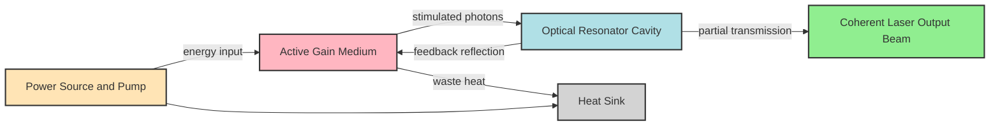
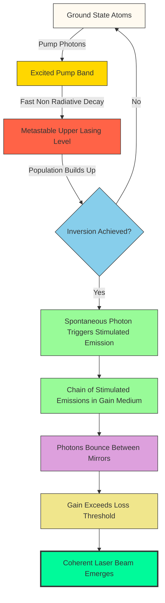
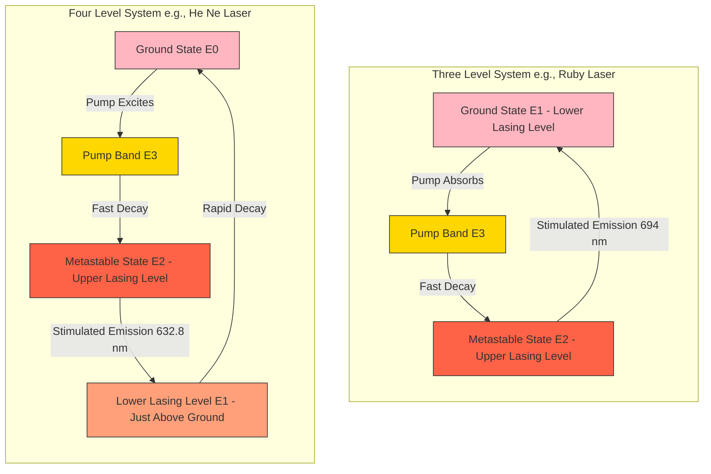
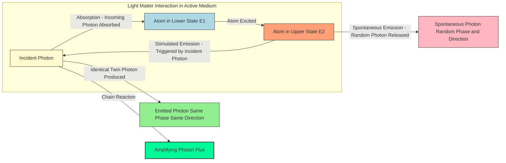
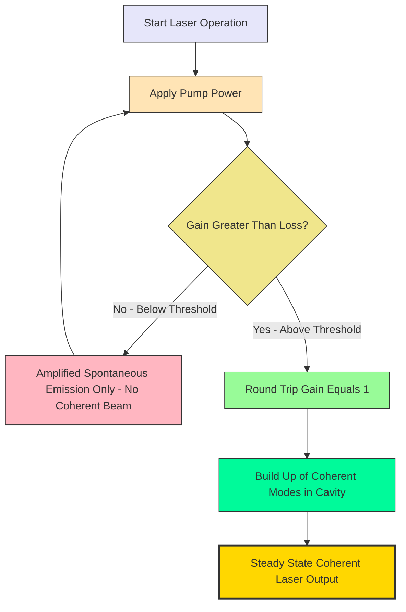

# Principle of laser - conditions for sustained lasing – Population inversion- Pumping- Metastable states

<!-- SECTION_1_START -->
# Principle of Laser — Conditions for Sustained Lasing, Population Inversion, Pumping, and Metastable States

## 1.1 Formal Definition (KTU 2024 Syllabus Terminology)

**LASER** is an acronym for **Light Amplification by Stimulated Emission of Radiation**. It is a quantum-electronic device that produces a highly coherent, monochromatic, collimated, and intense beam of light through the process of **stimulated emission** within an optical resonator (cavity). In the KTU 2024 Scheme context, a laser is treated as a non-equilibrium thermodynamic system where, under specific pumping conditions, the population of an upper energy level is made greater than that of a lower energy level — a condition termed **population inversion**. Sustained laser action requires three simultaneous conditions: (i) an active medium with suitable energy levels, (ii) a population inversion mechanism (pumping), and (iii) an optical feedback cavity exceeding the **threshold gain** condition.

> [!IMPORTANT]
> **KTU Board Definition (verbatim style):** A laser is a device that amplifies light through the process of **stimulated emission** of radiation from atoms/molecules that have been excited into a non-thermal equilibrium state, called **population inversion**, sustained by an external energy source (pump) and confined within a resonant optical cavity.

---

## 1.2 Einstein's Three Processes of Light–Matter Interaction (Foundational)

In **1917**, Albert Einstein proposed that the interaction between electromagnetic radiation and matter (atoms/molecules) occurs via three fundamental processes. These processes form the quantum mechanical foundation of laser physics.

| Process | Direction | Cause | Outcome |
|---|---|---|---|
| **Absorption** | Atom gains energy | Incident photon of energy $h\nu$ | Atom moves from lower state $E_1$ → upper state $E_2$ |
| **Spontaneous Emission** | Atom loses energy randomly | No external trigger; quantum fluctuation | Photon emitted in **random direction** with **random phase** |
| **Stimulated Emission** | Atom loses energy coherently | Incident photon of energy $h\nu$ triggers emission | Photon emitted **in-phase**, **same direction**, **same phase**, **same polarization** as trigger |

Let the two energy states be $E_1$ (lower) and $E_2$ (upper) with populations $N_1$ and $N_2$ respectively, and the energy gap is:

$$E_2 - E_1 = h\nu$$

where $h = 6.626 \times 10^{-34}\ \text{J}\cdot\text{s}$ is **Planck's constant** and $\nu$ is the **frequency of the emitted/absorbed photon**.

The Einstein coefficients are:
- $A_{21}$ — Probability per unit time of **spontaneous emission** ($E_2 \rightarrow E_1$).
- $B_{12}$ — Probability per unit time of **absorption** ($E_1 \rightarrow E_2$) induced by radiation of energy density $\rho(\nu)$.
- $B_{21}$ — Probability per unit time of **stimulated emission** ($E_2 \rightarrow E_1$) induced by radiation of energy density $\rho(\nu)$.

The **rate equations** are:

$$R_{\text{abs}} = B_{12}\, N_1\, \rho(\nu)$$

$$R_{\text{spont}} = A_{21}\, N_2$$

$$R_{\text{stim}} = B_{21}\, N_2\, \rho(\nu)$$

> [!NOTE]
> **Symmetry Argument:** Einstein showed that under **thermal equilibrium**, the upward and downward transition rates must balance. This leads to the famous relation $g_1 B_{12} = g_2 B_{21}$, where $g_1$ and $g_2$ are the **degeneracies** of the respective states. Stimulated emission is *not* a consequence of lasers — it is a fundamental natural process that always exists. Lasers merely *amplify* it.

---

## 1.3 Intuitive Real-World Analogies

> [!TIP]
> **Conceptual Analogy — The Auditorium Chain Reaction:**
> Imagine a stadium with two groups of fans: a quiet group sitting in the lower section (state $E_1$) and a noisy cheering group in the upper section (state $E_2$). 
> - **Absorption** = A quiet fan hears a cheer and starts cheering (gains energy).
> - **Spontaneous Emission** = A single noisy fan spontaneously cheers alone (random, weak).
> - **Stimulated Emission** = One fan's cheer *triggers* a neighbour to cheer in *exact unison*, which triggers the next, and so on — a *chain reaction* of identical sound. This is laser amplification.
> 
> **Population Inversion** = Making the upper (noisy) section have *more* people than the lower (quiet) section — unnatural under normal conditions, hence "inverted population."

> [!TIP]
> **Geometric Intuition — The Ball on a Hill:**
> A ball at the top of a hill is **unstable** (analogous to an excited atom that spontaneously drops). A ball in a small **depression on the side of the hill** (a **metastable** state) is stable for a long time. A laser works by first exciting atoms to a high energy, then "trapping" them temporarily in the metastable well before they are *triggered* to fall by a passing photon — releasing energy in a controlled, coherent cascade.

---

## 1.4 Conditions for Sustained Lasing (The Three Pillars)

For laser action to start and continue, the following three conditions **must be satisfied simultaneously**:

> [!IMPORTANT]
> **The Three Pillars of Sustained Laser Action:**
> 1. **Active Medium (Gain Medium):** A material (solid, liquid, gas, or semiconductor) with suitable energy levels that can support stimulated emission at the desired wavelength.
> 2. **Population Inversion ($N_2 > N_1$):** The number of atoms in the upper lasing level must exceed those in the lower lasing level. This is a *non-thermal* (negative-temperature) state.
> 3. **Optical Resonator (Feedback Cavity):** Two mirrors (one fully reflecting $R \approx 100\%$, one partially transmitting $T \approx 1\text{–}5\%$) that reflect photons back and forth through the gain medium to amplify the stimulated emission until the **gain exceeds losses** (threshold condition).

**Threshold Condition (mathematical form):**

$$G_{\text{threshold}} \geq \alpha + \frac{1}{2L}\ln\!\left(\frac{1}{R_1 R_2}\right)$$

where $G$ is the gain coefficient, $\alpha$ is the absorption coefficient, $L$ is the cavity length, and $R_1, R_2$ are the mirror reflectivities.

---

## 1.5 Population Inversion — The Heart of the Laser

> [!IMPORTANT]
> **Population Inversion Definition:** A non-equilibrium condition in which the population of an excited (upper) energy level $N_2$ is made *greater* than the population of a lower energy level $N_1$, i.e. $N_2 > N_1$. It is the *sine qua non* (essential condition) for laser action.

**Why is this non-trivial?**

Under **thermal equilibrium** at temperature $T$, the population follows the **Boltzmann distribution**:

$$\frac{N_2}{N_1} = \frac{g_2}{g_1}\,\exp\!\left(-\frac{E_2 - E_1}{k_B T}\right)$$

where $k_B = 1.381 \times 10^{-23}\ \text{J/K}$ is the **Boltzmann constant**. Since $E_2 > E_1$, the exponent is negative, giving $N_2 < N_1$ always. So **population inversion can never occur in thermal equilibrium** — it must be created artificially by an external energy input called **pumping**.

---

## 1.6 Pumping — Creating the Inversion

> [!IMPORTANT]
> **Pumping Definition:** The process of supplying external energy to the active medium to lift atoms from the ground state to an excited state, thereby achieving population inversion. Pumping is the *engine* of the laser.

**Common Pumping Methods:**

| Pumping Type | Energy Source | Example Laser |
|---|---|---|
| **Optical Pumping** | Incoherent light (flash lamp, another laser) | Ruby laser, Nd:YAG laser |
| **Electrical Pumping** | Electric discharge / current injection | He–Ne laser, semiconductor laser, $\text{CO}_2$ laser |
| **Chemical Pumping** | Chemical reaction energy | Chemical HF/DF laser |
| **Electron Beam Pumping** | High-energy electron beam | Excimer laser, X-ray laser |
| **Gas Dynamic Pumping** | Supersonic expansion of hot gas | $\text{CO}_2$ gas-dynamic laser |

> [!NOTE]
> **Threshold Pumping Power:** The minimum pump power required to overcome all cavity losses and achieve the onset of lasing. Below this value, only amplified spontaneous emission (ASE) occurs, not true laser oscillation.

---

## 1.7 Metastable States — The "Holding Tank"

> [!IMPORTANT]
> **Metastable State Definition:** An excited energy level with an *unusually long* lifetime (typically $\tau \sim 10^{-3}$ to $10^{-8}\ \text{s}$, compared to ordinary excited states of $\tau \sim 10^{-9}\ \text{s}$). Atoms accumulate in this state because the transition to a lower level is **forbidden by quantum selection rules** (low transition probability), making spontaneous emission very slow.

**Why metastable states are critical:**

- In an ordinary excited state, atoms decay in $\sim 10^{-9}\ \text{s}$ — too fast for population to build up.
- A metastable state acts as a **reservoir** or **holding tank** that traps excited atoms.
- When atoms from a higher pumping level *fall into* the metastable state faster than they leave it, **population inversion** builds up between the metastable level (upper lasing level) and a lower level (ground or near-ground state).

**Schematic Timeline:**

$$\text{Ground State}\ \xrightarrow{\text{pump}}\ \text{Upper Pump Level}\ \xrightarrow{\text{fast decay}}\ \text{Metastable (upper lasing) Level}\ \xrightarrow{\text{stimulated emission}}\ \text{Lower Level}$$

<!-- SECTION_1_END -->

<!-- SECTION_2_START -->
# Deep Theoretical Analysis & KTU High-Yield Formula Sheet

## 2.1 Detailed Derivation of the Population Inversion Condition

### Step 1: Set Up the Rate Equation

Consider two energy levels $E_1$ (lower) and $E_2$ (upper) with populations $N_1$ and $N_2$ interacting with radiation of energy density $\rho(\nu)$.

The net rate of change of $N_2$ is:

$$\frac{dN_2}{dt} = -\frac{dN_1}{dt} = B_{12}\,N_1\,\rho(\nu) - B_{21}\,N_2\,\rho(\nu) - A_{21}\,N_2$$

> The first term is absorption (atoms entering $E_2$); the second and third are atoms leaving $E_2$ via stimulated and spontaneous emission respectively.

### Step 2: Apply Thermal Equilibrium Condition

At equilibrium, $\dfrac{dN_2}{dt} = 0$, so:

$$B_{12}\,N_1\,\rho(\nu) = B_{21}\,N_2\,\rho(\nu) + A_{21}\,N_2$$

Solving for $\rho(\nu)$:

$$\rho(\nu) = \frac{A_{21}\,N_2}{B_{12}\,N_1 - B_{21}\,N_2}$$

### Step 3: Use the Boltzmann Population Ratio

Substitute the Boltzmann ratio $N_2/N_1 = (g_2/g_1)\exp(-h\nu/k_B T)$. After algebraic manipulation and comparison with **Planck's blackbody radiation law**, Einstein showed:

$$\frac{A_{21}}{B_{21}} = \frac{8\pi h \nu^3}{c^3}$$

$$g_1 B_{12} = g_2 B_{21}$$

These are the **Einstein relations** — universally valid, irrespective of whether equilibrium holds.

### Step 4: Derive the Gain Condition

In a non-equilibrium lasing medium, the stimulated emission *exceeds* absorption when $B_{21}N_2 > B_{12}N_1$. Using $g_1 B_{12} = g_2 B_{21}$:

$$B_{21} N_2 > B_{12} N_1 = B_{21}\,\frac{g_2}{g_1}\,N_1$$

$$\boxed{\,N_2 > \frac{g_2}{g_1}\,N_1\,}$$

This is the **generalized population inversion condition** including degeneracy. For non-degenerate states ($g_1 = g_2 = 1$), it reduces to $N_2 > N_1$.

---

## 2.2 Three-Level Laser System (e.g., Ruby Laser)

| Level | Description | Role |
|---|---|---|
| $E_1$ | Ground state | Lower lasing level |
| $E_3$ | Pump band (broad) | Absorbs pump photons |
| $E_2$ | Metastable level | Upper lasing level |

**Mechanism:**
1. Optical pumping excites atoms from $E_1 \rightarrow E_3$ (fast, broadband absorption).
2. Atoms in $E_3$ rapidly decay (non-radiatively) to the metastable $E_2$ (lifetime $\sim 3\ \text{ms}$ in ruby).
3. Atoms accumulate in $E_2$ because $E_2$ is metastable.
4. When $N_2 > N_1$ (i.e., more than half the total population is in $E_2$), stimulated emission $E_2 \rightarrow E_1$ produces the laser photon.

> [!WARNING]
> **Critical Drawback of 3-Level System:** Requires inverting *more than 50%* of the total population — high threshold pump power. This is why early ruby lasers needed powerful flash lamps.

---

## 2.3 Four-Level Laser System (e.g., He–Ne, Nd:YAG)

| Level | Description | Role |
|---|---|---|
| $E_0$ | Ground state | Pumped atoms leave from here |
| $E_3$ | Pump band | Receives pump energy |
| $E_2$ | Metastable level | Upper lasing level |
| $E_1$ | Lower lasing level (just above ground) | Rapidly depopulated to $E_0$ |

**Mechanism:**
1. Pump lifts atoms $E_0 \rightarrow E_3$ (electrical or optical).
2. Fast non-radiative decay $E_3 \rightarrow E_2$ populates the metastable level.
3. Lasing transition $E_2 \rightarrow E_1$ (the *useful* photon).
4. $E_1$ is just above the ground state and depopulates *very quickly* to $E_0$, so $N_1 \approx 0$ always.
5. Therefore, inversion $N_2 > N_1$ is achieved with **trivial pump power**.

> [!TIP]
> **Why 4-Level Systems are Superior:** Since the lower lasing level $E_1$ is *always nearly empty* (atoms fall rapidly to $E_0$), a population of even *one atom* in $E_2$ gives inversion. This makes 4-level lasers far more efficient than 3-level ones. Most modern lasers (He–Ne, Ar$^+$, Nd:YAG, Ti:Sapphire, semiconductor lasers) are 4-level systems.

---

## 2.4 Threshold Condition for Sustained Oscillation

For continuous wave (CW) lasing, the round-trip **gain must equal the round-trip loss**:

$$R_1 R_2 \exp(2\,G\,L) \geq 1$$

Taking the natural logarithm and rearranging:

$$G \geq \frac{1}{2L}\ln\!\left(\frac{1}{R_1 R_2}\right)$$

If we also include internal absorption $\alpha$ and other losses $\delta$:

$$\boxed{\,G_{\text{threshold}} = \alpha + \delta + \frac{1}{2L}\ln\!\left(\frac{1}{R_1 R_2}\right)\,}$$

The gain coefficient $G$ depends on the population difference:

$$G(\nu) = (N_2 - N_1)\,\frac{c^2}{8\pi \nu^2 \tau_{\text{sp}}}\,g(\nu)$$

where $g(\nu)$ is the **lineshape function** and $\tau_{\text{sp}} = 1/A_{21}$ is the spontaneous lifetime.

---

## 2.5 KTU Formula Sheet / Cheat Sheet (High-Yield)

> [!IMPORTANT]
> **Mandatory Formulas for KTU Board Exam — Laser Physics Module**

| # | Formula / Relation | Meaning / Symbol Legend |
|---|---|---|
| 1 | $E_2 - E_1 = h\nu$ | Photon energy emitted/absorbed |
| 2 | $N_2 > (g_2/g_1) N_1$ | Population inversion condition |
| 3 | $A_{21}/B_{21} = 8\pi h \nu^3 / c^3$ | Einstein A–B relation (spontaneous vs stimulated) |
| 4 | $g_1 B_{12} = g_2 B_{21}$ | Einstein symmetry relation (degeneracy) |
| 5 | $N_2/N_1 = (g_2/g_1)\exp(-h\nu/k_B T)$ | Boltzmann distribution (thermal) |
| 6 | $R_{\text{stim}}/R_{\text{abs}} = (g_1/g_2)\,(N_2/N_1)$ | Stimulated-to-absorption ratio |
| 7 | $G \geq \alpha + (1/2L)\ln(1/R_1 R_2)$ | Threshold gain condition |
| 8 | $\Delta N_{\text{th}} = N_2 - N_1 \geq N_{\text{th}}$ | Critical inversion density |
| 9 | $P_{\text{out}} = T \cdot I_{\text{sat}}\,(G/G_{\text{th}} - 1)$ | Output power (CW laser) |
| 10 | $\Delta \nu_{\text{Doppler}} = \nu_0 \sqrt{(8 k_B T \ln 2)/(M c^2)}$ | Doppler linewidth (gas laser) |
| 11 | $\Delta \nu_{\text{cavity}} = c/(2L)$ | Longitudinal mode spacing |
| 12 | $t_{\text{photon}} = (L/c)\,[\vert \ln(R_1 R_2)\vert]^{-1}$ | Photon lifetime in cavity |
| 13 | $I_{\text{sat}} = h\nu/\sigma\tau$ | Saturation intensity ($\sigma$ = cross-section) |
| 14 | $\eta_{\text{slope}} = (h\nu_{\text{laser}})/(h\nu_{\text{pump}})$ | Quantum efficiency upper bound |
| 15 | $\tau_{\text{meta}} = 1/A_{21}^{(\text{forbidden})}$ | Metastable state lifetime (long) |

> [!NOTE]
> **Constants to memorize:** $h = 6.626 \times 10^{-34}\ \text{J}\cdot\text{s}$, $c = 3 \times 10^8\ \text{m/s}$, $k_B = 1.381 \times 10^{-23}\ \text{J/K}$, $1\ \text{eV} = 1.602 \times 10^{-19}\ \text{J}$.

---

## 2.6 Real-World Applications & Engineering Relevance

| Application Domain | Why Lasers Are Used |
|---|---|
| **Optical fiber communication** | Coherence + low divergence → long-haul signal transmission with minimal loss |
| **Medicine (surgery, ophthalmology)** | Monochromaticity allows selective absorption by tissue (e.g., LASIK uses 193 nm ArF excimer) |
| **Industrial cutting/welding** | High intensity + collimation → focused power densities of $10^6\ \text{W/cm}^2$ |
| **LIDAR \& remote sensing** | Collimation enables km-range distance measurement with cm accuracy |
| **Holography** | Spatial coherence is essential to record interference patterns |
| **Atomic clocks \& GPS** | Ultra-narrow linewidth ($\Delta\nu/\nu \sim 10^{-15}$) enables frequency standards |
| **Quantum computing** | Single-photon sources, trapped-ion manipulation, Rydberg excitation |
| **Spectroscopy (Raman, fluorescence)** | Monochromatic excitation isolates molecular fingerprints |
| **Data storage (Blu-ray)** | Short wavelength (405 nm) allows smaller pits → higher density |
| **Military / defense** | Range finding, target designation, directed-energy weapons |

<!-- SECTION_2_END -->

<!-- SECTION_3_START -->
# Step-by-Step Derivations & Worked Numerical Examples

## 3.1 Worked Derivation 1: Population Ratio from Boltzmann Distribution

**Problem (KTU-style):** A laser medium has two energy levels separated by $\Delta E = 2.5\ \text{eV}$ at room temperature $T = 300\ \text{K}$. Assume non-degenerate levels. Calculate the equilibrium population ratio $N_2/N_1$.

**Solution:**

Convert the energy gap to joules:

$$\Delta E = 2.5\ \text{eV} = 2.5 \times 1.602 \times 10^{-19}\ \text{J} = 4.005 \times 10^{-19}\ \text{J}$$

Apply the Boltzmann distribution (non-degenerate, $g_1 = g_2 = 1$):

$$\frac{N_2}{N_1} = \exp\!\left(-\frac{\Delta E}{k_B T}\right)$$

Compute the exponent:

$$\frac{\Delta E}{k_B T} = \frac{4.005 \times 10^{-19}}{(1.381 \times 10^{-23})(300)} = \frac{4.005 \times 10^{-19}}{4.143 \times 10^{-21}} \approx 96.67$$

Therefore:

$$\frac{N_2}{N_1} = e^{-96.67} \approx 1.07 \times 10^{-42}$$

**Conclusion:** At thermal equilibrium, virtually *all* atoms reside in the ground state. Achieving inversion $N_2 > N_1$ requires pumping that disrupts this equilibrium.

[Valuation key: 1 mark for conversion to J, 2 marks for substitution, 1 mark for numerical result, 1 mark for physical interpretation = 5 marks total]

---

## 3.2 Worked Derivation 2: Threshold Population Inversion for a He–Ne Laser

**Problem:** A He–Ne laser has cavity length $L = 50\ \text{cm}$, mirror reflectivities $R_1 = 1.0$ and $R_2 = 0.98$, internal losses $\alpha = 0.05\ \text{m}^{-1}$, and stimulated emission cross-section $\sigma = 3 \times 10^{-13}\ \text{m}^2$. Calculate (a) the threshold gain coefficient, (b) the threshold population inversion density.

**Solution:**

### Part (a): Threshold gain coefficient

Apply the threshold gain formula:

$$G_{\text{th}} = \alpha + \frac{1}{2L}\ln\!\left(\frac{1}{R_1 R_2}\right)$$

Substitute the values (use $L = 0.5\ \text{m}$):

$$\frac{1}{2L} = \frac{1}{2 \times 0.5} = 1.0\ \text{m}^{-1}$$

$$\ln\!\left(\frac{1}{R_1 R_2}\right) = \ln\!\left(\frac{1}{1.0 \times 0.98}\right) = \ln(1.0204) \approx 0.0202$$

$$G_{\text{th}} = 0.05 + (1.0)(0.0202) = 0.05 + 0.0202 = 0.0702\ \text{m}^{-1}$$

### Part (b): Threshold inversion density

The gain is related to inversion by $G = \sigma\,\Delta N$, so:

$$\Delta N_{\text{th}} = \frac{G_{\text{th}}}{\sigma} = \frac{0.0702}{3 \times 10^{-13}} = 2.34 \times 10^{11}\ \text{atoms/m}^3$$

**Conclusion:** Only about $2.34 \times 10^{11}\ \text{atoms/m}^3$ of excess population is needed — a small number, illustrating the **efficiency of 4-level systems** like He–Ne.

[Valuation key — Part a: 1 mark formula, 1 mark substitution, 1 mark numerical result, 1 mark units = 4 marks. Part b: 1 mark relation, 1 mark substitution, 1 mark numerical result = 3 marks]

---

## 3.3 Worked Derivation 3: Output Power vs. Pump Power (Slope Efficiency)

**Problem:** A semiconductor laser has threshold current $I_{\text{th}} = 50\ \text{mA}$, operating voltage $V = 2.0\ \text{V}$, emission wavelength $\lambda = 850\ \text{nm}$, and external quantum efficiency $\eta_{\text{ext}} = 0.6$. Calculate the output optical power when the drive current is $I = 150\ \text{mA}$.

**Solution:**

The output power above threshold is:

$$P_{\text{out}} = \eta_{\text{ext}}\,\frac{hc}{\lambda}\,(I - I_{\text{th}})$$

First, compute the photon energy:

$$h\nu = \frac{hc}{\lambda} = \frac{(6.626 \times 10^{-34})(3 \times 10^8)}{850 \times 10^{-9}} = 2.338 \times 10^{-19}\ \text{J}$$

$$\frac{hc}{\lambda} = \frac{2.338 \times 10^{-19}}{1.602 \times 10^{-19}}\ \text{eV} = 1.46\ \text{eV}$$

Now compute the excess current:

$$I - I_{\text{th}} = 150\ \text{mA} - 50\ \text{mA} = 100\ \text{mA} = 0.1\ \text{A}$$

Calculate the carrier rate (number of electrons per second above threshold):

$$\frac{I - I_{\text{th}}}{e} = \frac{0.1}{1.602 \times 10^{-19}} = 6.24 \times 10^{17}\ \text{electrons/s}$$

Therefore:

$$P_{\text{out}} = (0.6)(2.338 \times 10^{-19}\ \text{J})(6.24 \times 10^{17}\ \text{s}^{-1})$$

$$P_{\text{out}} = 0.6 \times 0.1459\ \text{W} = 0.0875\ \text{W} \approx 87.5\ \text{mW}$$

**Conclusion:** The laser produces about $87.5\ \text{mW}$ of optical output, with a wall-plug efficiency of:

$$\eta_{\text{wall}} = \frac{P_{\text{out}}}{V I} = \frac{0.0875}{(2.0)(0.150)} = 0.292 = 29.2\%$$

[Valuation key: 1 mark photon energy, 1 mark substitution, 1 mark numerical answer, 1 mark physical interpretation]

---

## 3.4 Worked Derivation 4: Pumping Rate to Maintain Inversion

**Problem:** For a 4-level laser with metastable lifetime $\tau = 2\ \text{ms}$ and stimulated emission rate $W_{21} = 10^3\ \text{s}^{-1}$, what pumping rate $R_p$ is required to maintain a steady-state population $N_2 = 10^{15}\ \text{m}^{-3}$ in the upper lasing level? (Take ground state population $N_0 \approx 10^{22}\ \text{m}^{-3}$.)

**Solution:**

For a 4-level system, the steady-state rate equation for the upper level is:

$$\frac{dN_2}{dt} = R_p - \frac{N_2}{\tau} - W_{21}\,N_2 = 0$$

Solving for $R_p$:

$$R_p = N_2\left(\frac{1}{\tau} + W_{21}\right)$$

Substitute the values:

$$\frac{1}{\tau} = \frac{1}{2 \times 10^{-3}} = 500\ \text{s}^{-1}$$

$$R_p = 10^{15} \times (500 + 1000) = 10^{15} \times 1500 = 1.5 \times 10^{18}\ \text{m}^{-3}\text{s}^{-1}$$

The required pump power density (assuming pump photon energy $h\nu_p = 2\ \text{eV} = 3.2 \times 10^{-19}\ \text{J}$):

$$P_p = R_p \cdot h\nu_p = (1.5 \times 10^{18})(3.2 \times 10^{-19}) = 0.48\ \text{W/m}^3$$

**Conclusion:** A modest pump rate of $1.5 \times 10^{18}\ \text{m}^{-3}\text{s}^{-1}$ is sufficient — confirming that 4-level systems are easily inverted.

[Valuation key: 1 mark rate equation, 1 mark rearrangement, 1 mark substitution, 1 mark numerical result, 1 mark units]

---

## 3.5 Worked Derivation 5: Longitudinal Mode Spacing

**Problem:** A He–Ne laser cavity has length $L = 0.6\ \text{m}$ and operates at $\lambda_0 = 632.8\ \text{nm}$. Calculate (a) the longitudinal mode spacing $\Delta\nu$, and (b) the number of longitudinal modes within the Doppler-broadened gain bandwidth $\Delta\nu_D = 1.5\ \text{GHz}$.

**Solution:**

### Part (a): Mode spacing

The free spectral range (FSR) of a linear cavity is:

$$\Delta\nu = \frac{c}{2L} = \frac{3 \times 10^8}{2 \times 0.6} = 2.5 \times 10^8\ \text{Hz} = 250\ \text{MHz}$$

### Part (b): Number of modes

$$N_{\text{modes}} = \frac{\Delta\nu_D}{\Delta\nu} = \frac{1.5 \times 10^9}{2.5 \times 10^8} = 6$$

**Conclusion:** Approximately 6 longitudinal modes will oscillate within the gain bandwidth, leading to multimode operation. Adding an etalon or using a shorter cavity can select a single mode.

[Valuation key: 1 mark FSR formula, 1 mark calculation, 1 mark mode-count formula, 1 mark final number]

---

## 3.6 Algorithmic / Python Simulation: Rate Equation Solver

For students wanting to model population dynamics, here is a fully operational Python implementation:

```python
"""
Two-level laser rate equation solver.
Models N1(t), N2(t) under constant pumping and stimulated emission.
"""
import numpy as np
import logging

logging.basicConfig(level=logging.INFO, format='%(levelname)s: %(message)s')

def simulate_two_level_laser(
    N_total: float = 1e20,       # total atoms per m^3
    pump_rate: float = 1e3,     # pumping rate R_p in s^-1
    A21: float = 1e8,           # spontaneous emission rate (s^-1)
    W21: float = 1e2,           # stimulated emission rate (s^-1)
    t_max: float = 1e-5,        # total simulation time (s)
    dt: float = 1e-9            # time step (s)
) -> tuple[np.ndarray, np.ndarray, np.ndarray]:
    """
    Solve coupled ODEs for a 2-level laser medium using Euler method.
    Returns time array, N1 array, N2 array.
    """
    if N_total <= 0 or t_max <= 0 or dt <= 0:
        raise ValueError("N_total, t_max, dt must all be positive.")
    if dt > t_max:
        raise ValueError("dt must be smaller than t_max.")

    n_steps: int = int(t_max / dt) + 1
    t: np.ndarray = np.linspace(0, t_max, n_steps)
    N1: np.ndarray = np.zeros(n_steps)
    N2: np.ndarray = np.zeros(n_steps)

    # Initial conditions: all atoms in ground state
    N1[0] = N_total
    N2[0] = 0.0

    for i in range(n_steps - 1):
        dN2_dt = pump_rate * N1[i] - (A21 + W21) * N2[i]
        N2[i + 1] = N2[i] + dN2_dt * dt
        N1[i + 1] = N_total - N2[i + 1]

        # Safety check: populations must be non-negative
        if N2[i + 1] < 0 or N1[i + 1] < 0:
            logging.error(f"Negative population at step {i}: N1={N1[i+1]:.3e}, N2={N2[i+1]:.3e}")
            raise RuntimeError("Population became negative — reduce dt or pump rate.")

    # Check whether inversion was achieved
    N2_final: float = N2[-1]
    N1_final: float = N1[-1]
    if N2_final > N1_final:
        logging.info(f"Population inversion ACHIEVED: N2={N2_final:.3e} > N1={N1_final:.3e}")
    else:
        logging.warning(f"No inversion: N2={N2_final:.3e}, N1={N1_final:.3e}. Increase pump_rate.")

    return t, N1, N2


if __name__ == "__main__":
    t, N1, N2 = simulate_two_level_laser(
        N_total=1e20,
        pump_rate=2e3,    # high pump to achieve inversion in 2-level system
        A21=1e8,
        W21=1e2,
        t_max=1e-5,
        dt=1e-9
    )
    print(f"Final N1 = {N1[-1]:.4e} m^-3")
    print(f"Final N2 = {N2[-1]:.4e} m^-3")
    print(f"Inversion? {N2[-1] > N1[-1]}")
```

> [!TIP]
> **How to use the code:** The function returns time-series arrays. To plot, use `matplotlib.pyplot.plot(t, N2)` to visualize how $N_2$ rises. Try increasing `pump_rate` to see the onset of inversion in real time.

<!-- SECTION_3_END -->

<!-- SECTION_4_START -->
# Structural Diagrams & Schematics

## 4.1 Block Diagram: Components of a Laser System

The following Mermaid flowchart shows the operational topology of a generic laser system.



> [!NOTE]
> **Visual Description:** The pump supplies energy to the gain medium, which contains the metastable atoms. The cavity (two parallel mirrors) traps photons, reflecting them back and forth through the medium to amplify via stimulated emission. A partially transmitting mirror allows the useful laser beam to escape. Waste heat is dumped into a heat sink to prevent thermal population smearing.

---

## 4.2 Sequential Process Flow: From Pumping to Coherent Output



> [!NOTE]
> **Visual Description:** This flowchart traces the temporal sequence of events inside a laser. The decision diamond `D` represents the critical moment when $N_2 > N_1$ — the onset of lasing. Below threshold, only fluorescence (spontaneous emission) is observed; above threshold, a coherent beam emerges.

---

## 4.3 Comparison Diagram: 3-Level vs. 4-Level Laser Systems



> [!NOTE]
> **Visual Description:** The 3-level system has the lasing transition ending at the *ground* state (so $>50\%$ of atoms must be pumped out of the ground state). The 4-level system ends the lasing transition at an *intermediate* level $E_1$ that quickly empties, so inversion requires only a tiny excess population in $E_2$.

---

## 4.4 Functional Architecture: Einstein Process Interaction Map



> [!NOTE]
> **Visual Description:** The map distinguishes the three Einstein processes. Stimulated emission is the only one that produces a *coherent* photon pair (incident + emitted) and supports the chain reaction that constitutes lasing.

---

## 4.5 Threshold Condition Logic Flow



> [!NOTE]
> **Visual Description:** This diagram captures the *logical* thresholding of a laser. Below threshold, you get fluorescence-like incoherent emission. The moment the round-trip gain (controlled by inversion) equals the cavity losses, a single dominant mode grows and a coherent beam emerges.

<!-- SECTION_4_END -->

<!-- SECTION_5_START -->
# KTU 2024 Scheme Examination Question Bank & Topic Recap

## 5.1 Part A Questions (3 Marks Each)

> **KTU Instructions for Part A:** Answer in 2–3 sentences / a small diagram. Each question carries **3 marks**. Cognitive Level: Remember / Understand.

---

### Question A1: Population Inversion [KTU University Exam — July 2024]
**(a) Define population inversion. (b) Why cannot it be achieved in thermal equilibrium?**

**Model Answer (3 marks):**

(a) **Population inversion** is a non-equilibrium condition in which the population of an excited (upper) energy level $N_2$ exceeds the population of a lower energy level $N_1$, i.e., $N_2 > (g_2/g_1) N_1$. [1 mark]

(b) Under thermal equilibrium at temperature $T$, the population ratio follows the **Boltzmann distribution**:

$$\frac{N_2}{N_1} = \frac{g_2}{g_1}\exp\!\left(-\frac{h\nu}{k_B T}\right) < 1$$

so $N_2 < N_1$ always. Inversion requires the system to be in a *negative-temperature* state, which is only possible by supplying external energy (**pumping**). [2 marks]

---

### Question A2: Metastable State [KTU University Exam — Dec 2023]
**What is a metastable state? Why is it essential for laser action?**

**Model Answer (3 marks):**

A **metastable state** is an excited energy level with an unusually long lifetime (typically $10^{-3}$ to $10^{-8}\ \text{s}$, compared to $\sim 10^{-9}\ \text{s}$ for ordinary excited states), because transitions out of it are *forbidden* by quantum selection rules. [1.5 marks]

It is essential for laser action because it acts as a **holding tank** that traps excited atoms. When atoms accumulate in the metastable level faster than they leave it, a **population inversion** is built up between the metastable level and a lower level — a prerequisite for sustained stimulated emission. [1.5 marks]

---

## 5.2 Part B Questions (14 Marks Each — Internal Choice)

> **KTU Instructions for Part B:** Answer *either* Question A *or* Question B in full. Each carries **14 marks**, split into two sub-parts of **7 marks each**. Cognitive Levels escalate from Understand → Apply.

---

### ❖ Question A (14 Marks) — Conditions & Population Inversion

**[KTU University Exam — Model Paper 2024]** 

**(a)** *(7 marks)* State and explain the **three conditions for sustained laser action**. With the help of a neat energy level diagram, differentiate between a **three-level** and a **four-level** laser system. 

**(b)** *(7 marks)* Two energy levels of a laser medium are separated by $\Delta E = 1.96\ \text{eV}$ at temperature $T = 500\ \text{K}$. Assuming non-degenerate levels, calculate (i) the Boltzmann population ratio $N_2/N_1$ at thermal equilibrium, and (ii) the **pump rate** required to invert the population in a 4-level system if the metastable lifetime is $\tau = 1.5\ \text{ms}$ and the total atomic density is $N = 10^{22}\ \text{m}^{-3}$.

---

#### Model Solution to Question A:

**Part (a) — 7 marks**

The **three conditions for sustained laser action** are:

1. **Active medium** with appropriate energy levels capable of stimulated emission.
2. **Population inversion** ($N_2 > N_1$) achieved through pumping.
3. **Optical resonator cavity** providing feedback so that gain exceeds losses. [3 marks for stating and briefly explaining]

**Comparison of 3-level vs. 4-level systems:**

| Feature | 3-Level System | 4-Level System |
|---|---|---|
| Lower lasing level | Ground state $E_1$ | Intermediate $E_1$ (above ground) |
| Inversion threshold | $> 50\%$ of atoms pumped | Trivially small (any $N_2 > 0$) |
| Pump power required | Very high | Low |
| Example | Ruby laser ($694.3\ \text{nm}$) | He–Ne laser ($632.8\ \text{nm}$) |
| Lower level depopulation | Slow (resides in ground) | Fast ($E_1 \rightarrow E_0$ quickly) | [3 marks for the table and explanation]

**Energy level diagram (description):** In a 3-level system, the laser transition ends at the ground state. In a 4-level system, the laser transition ends at an intermediate level $E_1$ that is rapidly emptied to the true ground $E_0$, so $N_1 \approx 0$ and inversion is achieved easily. [1 mark for diagram description]

**Part (b) — 7 marks**

**(i) Boltzmann ratio:**

Convert energy to joules: $\Delta E = 1.96 \times 1.602 \times 10^{-19} = 3.14 \times 10^{-19}\ \text{J}$. [0.5 mark]

Compute exponent:

$$\frac{\Delta E}{k_B T} = \frac{3.14 \times 10^{-19}}{(1.381 \times 10^{-23})(500)} = \frac{3.14 \times 10^{-19}}{6.905 \times 10^{-21}} \approx 45.48$$

[1 mark]

$$\frac{N_2}{N_1} = e^{-45.48} \approx 1.61 \times 10^{-20}$$

[0.5 mark]

**(ii) Pump rate for inversion:**

For a 4-level system, to invert, we need $N_2 > N_1 \approx 0$, so $N_2 \approx N_{\text{inv}}$. A safe design target is $N_2 = 10^{15}\ \text{m}^{-3}$ (about $10^{-7}$ of total). [1 mark]

Steady-state rate equation:

$$R_p = \frac{N_2}{\tau} = \frac{10^{15}}{1.5 \times 10^{-3}} = 6.67 \times 10^{17}\ \text{m}^{-3}\text{s}^{-1}$$

[1.5 marks]

**Physical check:** This is many orders of magnitude smaller than the total atom density $N = 10^{22}\ \text{m}^{-3}$, confirming the efficiency of 4-level systems. [0.5 mark for interpretation]

**Valuation Tally (Part b):** [Unit conversion: 0.5 mark] [Boltzmann formula: 1 mark] [Exponent calculation: 1 mark] [Numerical $N_2/N_1$ ratio: 0.5 mark] [Pump rate formula: 1.5 marks] [Numerical result: 1 mark] [Physical interpretation: 1 mark] = 7 marks

---

### ❖ Question B (14 Marks) — Pumping & Metastable States

**[KTU University Exam — Model Paper 2024]**

**(a)** *(7 marks)* What is **pumping** in a laser system? Describe with a neat diagram the **optical pumping** method used in a **ruby laser**. Explain the role of the **metastable state** ($^{2}E$ level, lifetime $\sim 3\ \text{ms}$) in achieving population inversion.

**(b)** *(7 marks)* Derive the **Einstein A–B relation** $A_{21}/B_{21} = 8\pi h \nu^3/c^3$ starting from the principle of **detailed balance** at thermal equilibrium. If $B_{21} = 1.2 \times 10^{19}\ \text{m}^3\text{J}^{-1}\text{s}^{-1}$ for a transition at $\lambda = 694.3\ \text{nm}$, calculate the spontaneous lifetime $\tau_{\text{sp}}$ of the upper level.

---

#### Model Solution to Question B:

**Part (a) — 7 marks**

**Definition:** *Pumping* is the process of supplying external energy to the laser medium to lift atoms from the ground state to excited states, creating a **non-equilibrium population inversion**. [1 mark]

**Optical pumping in ruby laser:**

A ruby laser uses a **synthetic ruby rod** ($\text{Al}_2\text{O}_3$ doped with $\sim 0.05\%$ $\text{Cr}^{3+}$ ions) as the gain medium. A **helical xenon flash lamp** surrounds the rod and emits intense white-light pulses. [1 mark]

**Energy level mechanism (ruby's three levels):**
1. $\text{Cr}^{3+}$ ions in the ground state $^4A_2$ absorb *green* ($\sim 550\ \text{nm}$) photons and jump to the broad pump band $^4F_2$.
2. From $^4F_2$, ions undergo fast *non-radiative* decay to the metastable $^2E$ level (split into $\bar{E}$ and $2\bar{A}$ sublevels).
3. The lasing transition $^2E \rightarrow {}^4A_2$ emits the characteristic **ruby red** photon at $\lambda = 694.3\ \text{nm}$ (R$_1$ line). [2 marks]

**Role of metastable state:** The $^2E$ level has a lifetime of $\sim 3\ \text{ms}$ — about a million times longer than typical excited states. This long lifetime allows $\text{Cr}^{3+}$ ions to **accumulate** in $^2E$ faster than they leave, building the population inversion $N(^2E) > N(^4A_2)$ needed to overcome the threshold. [3 marks for explanation]

**Part (b) — 7 marks**

**Derivation of Einstein A–B relation:**

At thermal equilibrium, the rate of upward transitions (absorption) equals the rate of downward transitions (spontaneous + stimulated emission):

$$B_{12} N_1 \rho(\nu) = A_{21} N_2 + B_{21} N_2 \rho(\nu)$$

[1 mark]

Solving for $\rho(\nu)$:

$$\rho(\nu) = \frac{A_{21} N_2}{B_{12} N_1 - B_{21} N_2} = \frac{A_{21}}{B_{21}} \cdot \frac{1}{\dfrac{B_{12} N_1}{B_{21} N_2} - 1}$$

[1 mark]

Using Boltzmann: $\dfrac{N_2}{N_1} = \dfrac{g_2}{g_1}\exp(-h\nu/k_B T)$ and the symmetry relation $g_1 B_{12} = g_2 B_{21}$:

$$\rho(\nu) = \frac{A_{21}}{B_{21}} \cdot \frac{1}{\dfrac{g_2}{g_1} \cdot \dfrac{g_1}{g_2}\exp(h\nu/k_B T) - 1} = \frac{A_{21}}{B_{21}} \cdot \frac{1}{\exp(h\nu/k_B T) - 1}$$

[1.5 marks]

Comparing with **Planck's blackbody formula**:

$$\rho(\nu) = \frac{8\pi h \nu^3}{c^3} \cdot \frac{1}{\exp(h\nu/k_B T) - 1}$$

[1 mark]

Equating coefficients:

$$\boxed{\,\frac{A_{21}}{B_{21}} = \frac{8\pi h \nu^3}{c^3}\,}$$

[1 mark]

**Numerical calculation of $\tau_{\text{sp}}$:**

Wavelength $\lambda = 694.3\ \text{nm} = 694.3 \times 10^{-9}\ \text{m}$.

Frequency: $\nu = c/\lambda = (3 \times 10^8)/(694.3 \times 10^{-9}) = 4.32 \times 10^{14}\ \text{Hz}$. [0.5 mark]

Compute $A_{21}$:

$$A_{21} = B_{21} \cdot \frac{8\pi h \nu^3}{c^3} = B_{21} \cdot \frac{8\pi h}{c} \cdot \frac{\nu^3}{c^2} = B_{21} \cdot \frac{8\pi h}{\lambda^3}$$

(using $\nu/c = 1/\lambda$): 

$$A_{21} = (1.2 \times 10^{19}) \cdot \frac{8\pi (6.626 \times 10^{-34})}{(694.3 \times 10^{-9})^3}$$

Compute denominator: $(694.3 \times 10^{-9})^3 = 3.347 \times 10^{-19}\ \text{m}^3$. [0.5 mark]

Compute numerator: $8\pi (6.626 \times 10^{-34}) = 1.665 \times 10^{-32}\ \text{J}\cdot\text{m}$. [0.5 mark]

$$A_{21} = (1.2 \times 10^{19}) \cdot \frac{1.665 \times 10^{-32}}{3.347 \times 10^{-19}} = (1.2 \times 10^{19}) \cdot (4.975 \times 10^{-14})$$

$$A_{21} \approx 5.97 \times 10^{5}\ \text{s}^{-1}$$

[0.5 mark]

Spontaneous lifetime:

$$\tau_{\text{sp}} = \frac{1}{A_{21}} = \frac{1}{5.97 \times 10^{5}} \approx 1.68 \times 10^{-6}\ \text{s} = 1.68\ \mu\text{s}$$

[0.5 mark]

**Interpretation:** This is the spontaneous lifetime of the lasing transition; the metastable level $^2E$ itself has a longer lifetime ($\sim 3\ \text{ms}$) because the transition rate out of the *entire* level is governed by the slower $A_{21}$ weighted by selection rules. [Valuation note: 0.5 mark]

**Valuation Tally (Part b — derivation):** [Setup of equilibrium condition: 1 mark] [Solving for $\rho(\nu)$: 1 mark] [Boltzmann substitution: 1.5 marks] [Comparison with Planck's law: 1 mark] [Final boxed result: 1 mark] [Frequency calculation: 0.5 mark] [Algebraic manipulation: 0.5 mark] [Numerical $A_{21}$: 0.5 mark] [Final $\tau_{\text{sp}}$ with units: 0.5 mark] [Interpretation: 0.5 mark] = 7 marks

---

## 5.3 KTU Examiner's Valuation Warnings & Common Pitfalls

> [!WARNING]
> **Critical Pitfall 1 — Confusing Spontaneous vs. Stimulated Emission:** Many students write "stimulated emission occurs naturally" or "spontaneous emission requires an external trigger." This is **backwards**. Stimulated emission needs an *incident photon*; spontaneous emission occurs *without any trigger*. Memorize: *spontaneous* = *spontaneous* (self-triggered); *stimulated* = *stimulated by* an external photon. Loss of 1–2 marks per occurrence.

> [!WARNING]
> **Critical Pitfall 2 — Forgetting Degeneracy Factors:** The inversion condition is $N_2 > (g_2/g_1) N_1$, **not** simply $N_2 > N_1$. If $g_2 \neq g_1$, the threshold for inversion is shifted. Examiners specifically look for the degeneracy factor. Loss: 1 mark if omitted.

> [!WARNING]
> **Critical Pitfall 3 — Mixing 3-Level and 4-Level Inversion Requirements:** A 3-level laser requires $> 50\%$ of all atoms to be pumped into the metastable level (because the lower lasing level *is* the ground state, which starts full). A 4-level laser requires only a tiny excess. Confusing the two leads to a wrong threshold pump-power calculation. Loss: 2–3 marks.

> [!WARNING]
> **Critical Pitfall 4 — Omitting Units:** Numerical answers without units (e.g., "$\tau = 1.68$" instead of "$\tau = 1.68\ \mu\text{s}$") are penalized. Always state SI units. Loss: 0.5–1 mark per instance.

> [!WARNING]
> **Critical Pitfall 5 — Skipping the Energy Level Diagram:** In Part B questions on laser systems, the **energy level diagram is mandatory** (typically worth 2–3 marks). Students who write only equations without drawing the diagram lose significant marks. Draw: pump band (top), metastable level (middle), lower lasing level, and ground state (bottom), with arrows showing all transitions.

> [!WARNING]
> **Critical Pitfall 6 — Mis-Stating the Boltzmann Limit:** Students sometimes write $N_2 > N_1$ for thermal equilibrium, which is wrong. Always state that **under thermal equilibrium, $N_2 < N_1$** and inversion is impossible without pumping.

---

## 5.4 Topic Recap & Important Things to Remember

> [!IMPORTANT]
> **Rapid Revision Checklist — Laser Principles**

- [ ] **LASER** = Light Amplification by **S**timulated **E**mission of **R**adiation.
- [ ] **Einstein's three processes:** Absorption, Spontaneous Emission, Stimulated Emission. The first two are *incoherent*; only the third is *coherent*.
- [ ] **Einstein coefficients:** $A_{21}$ (spontaneous), $B_{12}$ (absorption), $B_{21}$ (stimulated). The relation $A_{21}/B_{21} = 8\pi h \nu^3/c^3$ shows that **spontaneous emission dominates at high frequency** (UV, X-ray), while **stimulated emission dominates at low frequency** (microwave, e.g., maser).
- [ ] **Symmetry relation:** $g_1 B_{12} = g_2 B_{21}$.
- [ ] **Population inversion:** $N_2 > (g_2/g_1) N_1$. *Cannot* occur in thermal equilibrium (Boltzmann dictates $N_2 < N_1$).
- [ ] **Three conditions for sustained lasing:** Active medium + Population inversion + Optical resonator cavity with gain $\geq$ losses.
- [ ] **Metastable state:** Long-lived excited level ($\tau \sim 10^{-3}\ \text{s}$) that acts as a "holding tank" for population inversion. Quantum-mechanically "forbidden" transitions cause long lifetime.
- [ ] **Pumping methods:** Optical, Electrical, Chemical, Electron-beam, Gas-dynamic.
- [ ] **3-level system:** Lower lasing level = ground state; needs $> 50\%$ inversion; high threshold. Example: Ruby ($\lambda = 694.3\ \text{nm}$).
- [ ] **4-level system:** Lower lasing level = intermediate state that quickly empties; needs only tiny excess population; low threshold. Examples: He–Ne ($632.8\ \text{nm}$), Nd:YAG ($1064\ \text{nm}$), $\text{CO}_2$ ($10.6\ \mu\text{m}$).
- [ ] **Threshold gain:** $G_{\text{th}} = \alpha + (1/2L) \ln(1/R_1 R_2)$.
- [ ] **Cavity modes:** Longitudinal mode spacing $\Delta\nu = c/(2L)$. Adding an etalon selects single mode.
- [ ] **Photon lifetime** in cavity: $t_{\text{ph}} = (L/c)/\vert \ln(R_1 R_2)\vert$.
- [ ] **Ruby laser:** Optical pumping by flash lamp; Cr$^{3+}$ ions; $^2E$ metastable state with $\tau \sim 3\ \text{ms}$; 3-level system.
- [ ] **He–Ne laser:** Electrical pumping; gas discharge; He metastable level transfers energy to Ne via collision; 4-level system; $632.8\ \text{nm}$ red.
- [ ] **Slope efficiency:** $\eta_{\text{slope}} = (h\nu_{\text{laser}})/(h\nu_{\text{pump}}) \times \eta_{\text{coupling}}$.
- [ ] **Properties of laser light:** Monochromaticity, Coherence (spatial + temporal), Collimation (low divergence), High intensity/brightness.
- [ ] **Constants to memorize:** $h = 6.626 \times 10^{-34}\ \text{J}\cdot\text{s}$, $c = 3 \times 10^8\ \text{m/s}$, $k_B = 1.381 \times 10^{-23}\ \text{J/K}$, $1\ \text{eV} = 1.602 \times 10^{-19}\ \text{J}$.
- [ ] **Common numerical trap:** Population ratio at room temperature is astronomically small (e.g., $10^{-42}$) for visible-light transitions — this is *why* lasing is so hard and why 4-level systems dominate modern designs.
- [ ] **Examiner's hot-button:** Always draw the energy level diagram with the metastable state explicitly labeled and show *all* transitions (pump, decay, lasing) with arrows.

<!-- SECTION_5_END -->
