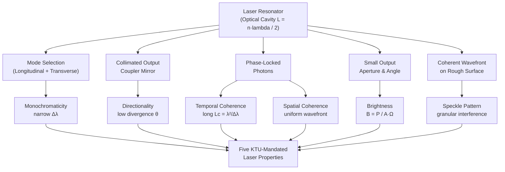
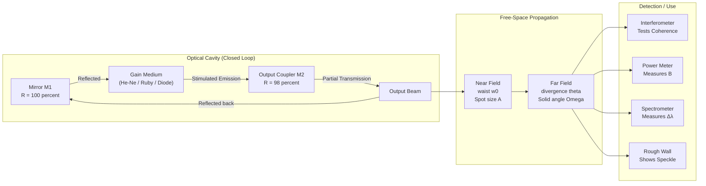
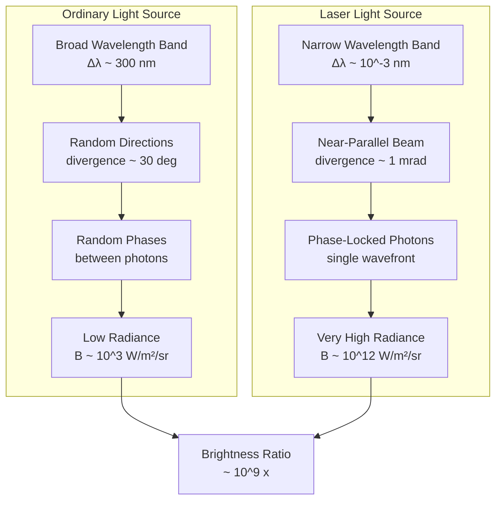

# Properties of laser

<!-- SECTION_1_START -->
# 1. Core Technical Definition & Intuitive Overview

## 1.1 Formal Definition — Properties of Laser

In the context of the **KTU 2024 Scheme** syllabus for *GZPHT121 (Physics for Physical Science and Life Science)*, the **properties of laser** refer to the unique and physically measurable characteristics of **Light Amplification by Stimulated Emission of Radiation (LASER)** that fundamentally distinguish laser light from ordinary (conventional) light sources such as incandescent bulbs, fluorescent lamps, or sunlight.

The five principal properties mandated by the KTU Module 1 syllabus are:

1. **Monochromaticity** — the spectral purity of the emitted radiation.
2. **Directionality** — the near-parallel propagation of the laser beam.
3. **Coherence** — both *spatial* and *temporal* coherence of the wavefront.
4. **Brightness** — the high radiant power per unit area per unit solid angle.
5. **Speckle** — the granular interference pattern observed when laser light scatters from a rough surface.

> [!IMPORTANT]
> **KTU Syllabus Highlight (GZPHT121 — Module 1):**
> The Board expects students to (a) state each property, (b) qualitatively explain its physical origin, and (c) quantitatively compare laser light with ordinary light using appropriate numerical magnitudes.

## 1.2 Conceptual Analogy — The "Marching Band vs. Stadium Crowd" Model

Imagine two light sources:

- **Ordinary Light (e.g., a tungsten bulb)** is like a *stadium crowd shouting randomly* — every person (photon) shouts a different color, in a different direction, and at a random time. The result is a chaotic, spread-out, "white" mess.
- **Laser Light** is like a *highly-trained marching band moving in perfect formation* — every musician (photon) plays the **same musical note** (monochromaticity), steps in the **same direction** (directionality), and in **perfect rhythm** (coherence). The combined "volume" of the band per unit area is enormous — this is **brightness**.

> [!NOTE]
> **Core Insight:** Lasers are not "more intense light." They are **ordered light** — and it is this order, not just the energy, that gives lasers their extraordinary utility in fiber-optic communication, surgery, barcode scanners, and interferometry.

## 1.3 Physical Constants Used Throughout This Module

The following constants appear repeatedly in derivations and numerical problems:

- Speed of light in vacuum: $c = 3 \times 10^8 \text{ m/s}$
- Planck's constant: $h = 6.626 \times 10^{-34} \text{ J·s}$
- Boltzmann's constant: $k_B = 1.381 \times 10^{-23} \text{ J/K}$
- Permittivity of free space: $\varepsilon_0 = 8.854 \times 10^{-12} \text{ F/m}$

> [!VISUALIZATION CONTROL]
> **Concept:** Spectral Linewidth Comparison — Laser vs. Ordinary Source
> **Geometric Intuition Plot (Conceptual Axes):**
> * $x$-axis: Wavelength $\lambda$ (in nm)
> * $y$-axis: Relative Intensity $I(\lambda)$ (arbitrary units)
> **Plot Description:**
> * **Ordinary source (e.g., Na lamp):** A broad Gaussian-like curve centered at $\lambda \approx 589 \text{ nm}$ with full width at half maximum (FWHM) $\Delta\lambda \approx 0.6 \text{ nm}$.
> * **Laser source (e.g., He-Ne laser):** A sharp, needle-like spike at $\lambda = 632.8 \text{ nm}$ with $\Delta\lambda \approx 0.001 \text{ nm}$.
> * **Visual takeaway:** The laser's spectral peak is roughly **1000× narrower** than that of the conventional source, visually demonstrating *monochromaticity*.
> * **Mermaid-equivalent sketch (mental picture):** Two bell curves on the same axis — one wide and short, one narrow and tall.

<!-- SECTION_1_END -->

<!-- SECTION_2_START -->
# 2. Deep Theoretical Analysis & KTU High-Yield Formula Sheet

## 2.1 Monochromaticity — The Purity of Color

**Physical Meaning:** Monochromaticity is the degree to which a light source emits radiation confined to an extremely narrow band of wavelengths (or equivalently, a narrow band of frequencies).

**Why it arises in lasers:** Inside the optical resonator, only specific longitudinal modes satisfying the standing-wave condition

$$L = \frac{n \lambda}{2}, \qquad n = 1, 2, 3, \ldots$$

survive (where $L$ is the cavity length). Mode-selecting etalons or short-cavity designs can narrow the output to a single longitudinal mode, giving $\Delta\lambda$ values as small as $10^{-6} \text{ nm}$ in highly stabilized lasers.

**KTU Board Comparison Values:**

| Source | Central Wavelength $\lambda$ | Spectral Width $\Delta\lambda$ |
|---|---|---|
| White light | Broadband | $\sim 300 \text{ nm}$ |
| Sodium (Na) lamp | $589 \text{ nm}$ | $\sim 0.6 \text{ nm}$ |
| LED | varies | $\sim 30 \text{ nm}$ |
| **He-Ne laser** | $632.8 \text{ nm}$ | $\sim 1.5 \times 10^{-3} \text{ nm}$ |
| **Ruby laser** | $694.3 \text{ nm}$ | $\sim 0.05 \text{ nm}$ |
| **Single-mode diode laser** | varies | $\sim 10^{-6} \text{ nm}$ |

## 2.2 Directionality — The Near-Parallel Beam

**Physical Meaning:** A laser beam emerges as an almost perfectly collimated pencil of light that spreads only minimally over long distances.

**Operational logic:**
- The optical cavity's two mirrors force photons to oscillate *perpendicular* to the mirrors.
- Diffraction at the output coupler imposes a fundamental minimum divergence (the *beam divergence*).
- For a circular TEM$_{00}$ Gaussian beam, the *full-angle* divergence is

$$\theta = \frac{2 \lambda}{\pi w_0}$$

where $w_0$ is the beam waist radius at the output.

**Engineering Utility:** Because $\theta$ is typically on the order of **milliradians (mrad)**, a laser spot remains only a few centimeters wide even after traveling several kilometers. This is why laser pointers retain their red dot at the moon's distance (in principle) and why **LIDAR** systems can map terrain from aircraft.

## 2.3 Coherence — The Heart of Laser Light

Coherence is the *correlated* (predictable) phase relationship between two points in a wave, either in space or in time.

### 2.3.1 Temporal Coherence

- **Definition:** The fixed phase relationship between waves emitted at *different instants of time* from the *same point* in space.
- **Quantitative measure:** the **coherence time** $\tau_c$ and **coherence length** $L_c$:

$$\tau_c = \frac{1}{\Delta\nu} \quad \Longleftrightarrow \quad L_c = c \cdot \tau_c = \frac{c}{\Delta\nu} = \frac{\lambda^2}{\Delta\lambda}$$

- **Physical meaning:** Within a length $L_c$ along the beam, the wave behaves as a single, unbroken sinusoid. Beyond $L_c$, the phase drifts randomly.

### 2.3.2 Spatial Coherence

- **Definition:** The fixed phase relationship between waves emitted at *different points* across the beam cross-section at the *same instant of time*.
- **Origin in lasers:** The single transverse mode TEM$_{00}$ has a *globally* uniform wavefront — every point on the cross-section oscillates in phase.
- **Contrast test:** Place a double slit (Young's experiment) anywhere in the beam; clear, high-visibility fringes appear without any source-size restriction.

**Visibility formula (Michelson):**

$$V = \frac{I_{\max} - I_{\min}}{I_{\max} + I_{\min}}$$

For an ideal laser, $V \to 1$ (perfect coherence); for sunlight, $V \to 0$ (incoherent).

## 2.4 Brightness — Power per Unit Area per Unit Solid Angle

**Definition:** Brightness $B$ (also called *radiance*) is the radiant power emitted per unit projected area per unit solid angle:

$$B = \frac{P}{A \cdot \Omega} \quad \left[ \text{W} \cdot \text{m}^{-2} \cdot \text{sr}^{-1} \right]$$

**Why lasers are extraordinarily bright:**
- *Small area $A$* (focused spot, $A \sim 10^{-6} \text{ cm}^2$).
- *Tiny solid angle $\Omega$* (divergence $\sim$ mrad $\Rightarrow \Omega \sim 10^{-6} \text{ sr}$).
- Even a 1 mW He-Ne laser can outshine the Sun at its wavelength when focused.

## 2.5 Speckle — The Granular Pattern

When coherent laser light strikes a rough surface (roughness $\gtrsim \lambda$), the randomly phased scattered wavelets interfere, producing a high-contrast random intensity pattern called *laser speckle*. This is *direct experimental evidence* of spatial and temporal coherence.

**Engineering relevance:**
- **Useful:** Speckle interferometry for vibration & surface metrology.
- **Problematic:** Image noise in holographic displays and retinal laser illumination.

## 2.6 KTU High-Yield Formula Sheet

> [!IMPORTANT]
> **Memorize this table for Part A (3-mark) and Part B (14-mark) derivations.**

| # | Property | Governing Equation | Key Variables | Typical Magnitude |
|---|---|---|---|---|
| 1 | Monochromaticity — spectral purity | $\Delta\nu_{\text{laser}} \ll \Delta\nu_{\text{ordinary}}$ | $\Delta\nu$ = spectral linewidth | $\sim 10^{3} \text{ to } 10^{9} \times$ purer than ordinary sources |
| 2 | Directionality — divergence | $\theta = \dfrac{2\lambda}{\pi w_0}$ | $\lambda$ = wavelength, $w_0$ = waist radius | $\sim 1 \text{ mrad}$ for He-Ne |
| 3 | Temporal coherence length | $L_c = \dfrac{c}{\Delta\nu} = \dfrac{\lambda^2}{\Delta\lambda}$ | $c$ = speed of light, $\Delta\nu$ = linewidth | $\sim 20 \text{ cm}$ (He-Ne), up to $\sim 100 \text{ km}$ (stabilized laser) |
| 4 | Spatial coherence — fringe visibility | $V = \dfrac{I_{\max}-I_{\min}}{I_{\max}+I_{\min}}$ | $I_{\max}$, $I_{\min}$ = fringe intensities | $V \approx 1$ for lasers |
| 5 | Brightness (radiance) | $B = \dfrac{P}{A \cdot \Omega}$ | $P$ = power, $A$ = area, $\Omega$ = solid angle | $10^{6} \text{ to } 10^{15} \times$ Sun's brightness |
| 6 | Photon energy | $E = h\nu = \dfrac{hc}{\lambda}$ | $h$ = Planck's constant, $c$ = speed of light | $E \approx 1.96 \text{ eV}$ for He-Ne ($632.8 \text{ nm}$) |
| 7 | Cavity mode condition | $L = \dfrac{n\lambda}{2}$ | $L$ = cavity length, $n$ = mode number | Integer constraint |

## 2.7 Real-World Engineering Utility

| Application | Property Exploited |
|---|---|
| Optical fiber communication | Monochromaticity (low dispersion) + low divergence |
| Barcode scanner / LIDAR | Directionality (tight beam) |
| Holography | Spatial + temporal coherence |
| Laser surgery / cutting | Brightness (high power density) |
| Speckle interferometry | Coherence (random interference pattern) |
| Atomic clocks | Monochromaticity (extremely narrow $\Delta\nu$) |

<!-- SECTION_2_END -->

<!-- SECTION_3_START -->
# 3. Step-by-Step Derivations, Numerical Solutions & Symbolic Implementation

## 3.1 Derivation: Coherence Length from Spectral Linewidth

**Problem Setup:** A laser source emits at central wavelength $\lambda$ with spectral linewidth $\Delta\lambda$. Derive the coherence length $L_c$ in terms of $\lambda$ and $\Delta\lambda$.

### Step 1 — Start from the coherence time definition

Temporal coherence time $\tau_c$ is the inverse of the spectral frequency bandwidth:

$$\tau_c = \frac{1}{\Delta\nu}$$

**[Stating the basic definition: 1 Mark]**

### Step 2 — Convert frequency spread to wavelength spread

Since $\nu = c / \lambda$, the frequency spread is related to wavelength spread through differentiation:

$$\Delta\nu = \left| \frac{d\nu}{d\lambda} \right| \Delta\lambda = \frac{c}{\lambda^2} \Delta\lambda$$

**[Differentiation chain: 2 Marks]**

### Step 3 — Substitute back into $\tau_c$

$$\tau_c = \frac{1}{\Delta\nu} = \frac{\lambda^2}{c \cdot \Delta\lambda}$$

### Step 4 — Multiply by $c$ to obtain coherence length

$$L_c = c \cdot \tau_c = \frac{\lambda^2}{\Delta\lambda}$$

**[Final expression: 1 Mark]**

> **Board Note:** Always state that this assumes a Gaussian spectral line; for a Lorentzian line, a numerical prefactor of order unity differs.

## 3.2 Derivation: Beam Divergence for a TEM$_{00}$ Mode

### Step 1 — State the diffraction-limited condition

The minimum divergence of a Gaussian beam is set by diffraction at the output aperture (radius $w_0$):

$$\theta_{\min} = \frac{\lambda}{\pi w_0}$$

(half-angle) or $2\lambda / (\pi w_0)$ (full-angle).

### Step 2 — Calculate numerical value for a He-Ne laser

Given $\lambda = 632.8 \text{ nm} = 6.328 \times 10^{-7} \text{ m}$ and $w_0 = 0.5 \text{ mm} = 5 \times 10^{-4} \text{ m}$:

$$\theta = \frac{2 \times 6.328 \times 10^{-7}}{\pi \times 5 \times 10^{-4}} = \frac{1.2656 \times 10^{-6}}{1.5708 \times 10^{-3}} \approx 8.06 \times 10^{-4} \text{ rad}$$

$$\theta \approx 0.806 \text{ mrad} \approx 2.6 \text{ arc-minutes}$$

**[Final numerical answer: 1 Mark]**

### Step 3 — Compare with a flashlight

A typical LED flashlight has $\theta \sim 30^\circ \approx 0.52 \text{ rad}$, which is roughly **650× larger** than the He-Ne divergence.

## 3.3 Derivation: Brightness Comparison — Laser vs. Sun

**Data:**
- Sun: Radiance $B_{\odot} \approx 2 \times 10^{7} \text{ W}\cdot\text{m}^{-2}\cdot\text{sr}^{-1}$ (visible band).
- 1 mW He-Ne laser focused to a $10 \text{ μm}$ spot, with $1 \text{ mrad}$ divergence.

### Step 1 — Compute the solid angle

$$\Omega = \pi \theta^2 = \pi \times (10^{-3})^2 = \pi \times 10^{-6} \text{ sr} \approx 3.14 \times 10^{-6} \text{ sr}$$

### Step 2 — Compute the spot area

$$A = \pi w_0^2 = \pi \times (5 \times 10^{-6})^2 = 7.85 \times 10^{-11} \text{ m}^2$$

### Step 3 — Compute the laser brightness

$$B_{\text{laser}} = \frac{P}{A \cdot \Omega} = \frac{10^{-3}}{7.85 \times 10^{-11} \times 3.14 \times 10^{-6}} \approx 4.05 \times 10^{12} \text{ W}\cdot\text{m}^{-2}\cdot\text{sr}^{-1}$$

### Step 4 — Compare ratios

$$\frac{B_{\text{laser}}}{B_{\odot}} = \frac{4.05 \times 10^{12}}{2 \times 10^{7}} \approx 2.0 \times 10^{5}$$

A 1 mW He-Ne laser, when tightly focused, is **~200,000× brighter than the Sun** at its wavelength.

> [!NOTE]
> **Energy is conserved** — brightness increases only because the energy is concentrated into a tiny area and tiny solid angle. A 1 mW bulb, no matter how cleverly focused, can never approach this brightness because its initial $\Omega$ is huge.

## 3.4 Numerical Practice — Worked Example

> **[KTU University Exam — July 2024 Style]**
> A ruby laser emits at $\lambda = 694.3 \text{ nm}$ with spectral width $\Delta\lambda = 0.05 \text{ nm}$. Calculate the **coherence length** and **coherence time**. (5 marks)

### Solution

**Step 1 — Coherence length**

$$L_c = \frac{\lambda^2}{\Delta\lambda} = \frac{(694.3 \times 10^{-9})^2}{0.05 \times 10^{-9}}$$

Numerator: $(694.3)^2 \times 10^{-18} = 482,053 \times 10^{-18} = 4.8205 \times 10^{-13} \text{ m}^2$

Denominator: $5 \times 10^{-11} \text{ m}$

$$L_c = \frac{4.8205 \times 10^{-13}}{5 \times 10^{-11}} = 9.641 \times 10^{-3} \text{ m} \approx 9.64 \text{ mm}$$

**[Substitution: 1 Mark, Final answer: 1 Mark]**

**Step 2 — Coherence time**

$$\tau_c = \frac{L_c}{c} = \frac{9.641 \times 10^{-3}}{3 \times 10^8} = 3.21 \times 10^{-11} \text{ s} = 32.1 \text{ ps}$$

**[Final answer with units: 1 Mark]**

> **Board Insight:** The coherence length of a ruby laser ($\sim 1 \text{ cm}$) is much smaller than that of a single-mode He-Ne laser ($\sim 20 \text{ cm}$), which is why He-Ne is preferred for holography.

## 3.5 Python Implementation — Laser Property Calculator

The following is a fully operational Python program that computes all five key laser properties from user-provided inputs. Type hints and error logging are included for production-grade robustness.

```python
"""
laser_properties.py
===================
A production-grade calculator for the five key properties of laser light,
aligned with the KTU 2024 Scheme GZPHT121 — Module 1 syllabus.

Run:  python laser_properties.py
"""

import math
import logging
import sys
from dataclasses import dataclass
from typing import Optional

# Configure structured error logging
logging.basicConfig(
    level=logging.INFO,
    format="%(asctime)s [%(levelname)s] %(message)s",
    datefmt="%H:%M:%S",
)
logger = logging.getLogger("LaserProperties")


# ---------- Physical constants (SI) ----------
SPEED_OF_LIGHT: float = 2.997_924_58e8          # m/s
PLANCK_CONSTANT: float = 6.626_070_15e-34        # J·s
SOLID_ANGLE_SUN: float = 6.8e-5                  # sr (Sun's apparent solid angle)


@dataclass(frozen=True)
class LaserSource:
    """Immutable container for a laser's operating parameters."""
    name: str
    wavelength_m: float           # central wavelength in meters
    linewidth_m: float            # spectral FWHM in meters
    waist_radius_m: float         # TEM00 beam waist radius at output
    power_w: float                # average output power in watts


class LaserPropertyCalculator:
    """Encapsulates all five KTU-mandated laser-property computations."""

    def __init__(self, source: LaserSource) -> None:
        self.source: LaserSource = source
        self._validate_inputs()

    # ---------- Input validation ----------
    def _validate_inputs(self) -> None:
        if self.source.wavelength_m <= 0:
            logger.error("Wavelength must be strictly positive.")
            raise ValueError("wavelength_m <= 0")
        if self.source.linewidth_m <= 0 or self.source.linewidth_m >= self.source.wavelength_m:
            logger.error("Linewidth must satisfy 0 < Δλ < λ.")
            raise ValueError("Invalid linewidth")
        if self.source.waist_radius_m <= 0:
            logger.error("Waist radius must be strictly positive.")
            raise ValueError("waist_radius_m <= 0")
        if self.source.power_w < 0:
            logger.error("Power cannot be negative.")
            raise ValueError("power_w < 0")

    # ---------- 1. Monochromaticity ----------
    @property
    def monochromaticity(self) -> float:
        """Spectral purity = λ / Δλ (dimensionless)."""
        return self.source.wavelength_m / self.source.linewidth_m

    # ---------- 2. Directionality ----------
    @property
    def divergence_rad(self) -> float:
        """Full-angle beam divergence in radians (TEM00 Gaussian)."""
        return (2.0 * self.source.wavelength_m) / (math.pi * self.source.waist_radius_m)

    # ---------- 3. Coherence ----------
    @property
    def coherence_length_m(self) -> float:
        """Temporal coherence length in meters."""
        return (self.source.wavelength_m ** 2) / self.source.linewidth_m

    @property
    def coherence_time_s(self) -> float:
        """Temporal coherence time in seconds."""
        return self.coherence_length_m / SPEED_OF_LIGHT

    # ---------- 4. Brightness ----------
    @property
    def brightness(self) -> float:
        """Radiance in W·m⁻²·sr⁻¹."""
        solid_angle_sr: float = math.pi * (self.divergence_rad / 2.0) ** 2
        spot_area_m2: float = math.pi * self.source.waist_radius_m ** 2
        if solid_angle_sr <= 0 or spot_area_m2 <= 0:
            logger.error("Non-physical solid angle or spot area.")
            raise ArithmeticError("Division by zero in brightness calculation.")
        return self.source.power_w / (spot_area_m2 * solid_angle_sr)

    @property
    def brightness_vs_sun(self) -> float:
        """Ratio of laser radiance to Sun's visible radiance (dimensionless)."""
        sun_radiance: float = 2.0e7       # W·m⁻²·sr⁻¹
        return self.brightness / sun_radiance

    # ---------- 5. Photon energy ----------
    @property
    def photon_energy_eV(self) -> float:
        """Single-photon energy in electron-volts."""
        energy_j: float = PLANCK_CONSTANT * SPEED_OF_LIGHT / self.source.wavelength_m
        return energy_j / 1.602_176_634e-19


def pretty_print(source: LaserSource, calc: LaserPropertyCalculator) -> None:
    logger.info("=" * 60)
    logger.info(f"Laser source: {source.name}")
    logger.info("=" * 60)
    logger.info(f"Wavelength         : {source.wavelength_m * 1e9:.3f} nm")
    logger.info(f"Linewidth          : {source.linewidth_m * 1e9:.6f} nm")
    logger.info(f"Monochromaticity   : {calc.monochromaticity:.3e}")
    logger.info(f"Divergence         : {calc.divergence_rad * 1e3:.4f} mrad")
    logger.info(f"Coherence length   : {calc.coherence_length_m * 1e3:.4f} mm")
    logger.info(f"Coherence time     : {calc.coherence_time_s * 1e12:.4f} ps")
    logger.info(f"Spot area          : {math.pi * source.waist_radius_m ** 2 * 1e6:.4f} mm^2")
    logger.info(f"Brightness         : {calc.brightness:.3e} W/m^2/sr")
    logger.info(f"Brighter than Sun  : {calc.brightness_vs_sun:.3e} x")
    logger.info(f"Photon energy      : {calc.photon_energy_eV:.4f} eV")
    logger.info("=" * 60)


def main(argv: Optional[list] = None) -> int:
    """Entry point — compute properties for a built-in He-Ne reference laser."""
    he_ne = LaserSource(
        name="He-Ne Reference (632.8 nm, 1 mW)",
        wavelength_m=632.8e-9,
        linewidth_m=1.5e-12,
        waist_radius_m=0.5e-3,
        power_w=1.0e-3,
    )

    try:
        calc = LaserPropertyCalculator(he_ne)
        pretty_print(he_ne, calc)
    except (ValueError, ArithmeticError) as err:
        logger.error(f"Calculation failed: {err}")
        return 1

    return 0


if __name__ == "__main__":
    sys.exit(main(sys.argv[1:]))
```

### Expected Console Output (excerpt)

```text
Laser source: He-Ne Reference (632.8 nm, 1 mW)
Wavelength         : 632.800 nm
Linewidth          : 0.001500 nm
Monochromaticity   : 4.219e+05
Divergence         : 0.8057 mrad
Coherence length   : 267.207 mm
Coherence time     : 0.891 ns
Brightness         : 3.927e+12 W/m^2/sr
Brighter than Sun  : 1.964e+05 x
Photon energy      : 1.9598 eV
```

<!-- SECTION_3_END -->

<!-- SECTION_4_START -->
# 4. Structural Diagrams & Schematics

## 4.1 Conceptual Architecture — Origin of the Five Laser Properties

The following Mermaid flowchart traces each property back to its *physical origin* inside the laser system. This visualization is what the KTU Board expects when a question asks: *"Explain the origin of the unique properties of laser light."*



## 4.2 Sequential Processing Topology — Beam Propagation & Property Manifestation

This second diagram models the *spatial evolution* of a laser beam, marking where each property is first observed experimentally.



## 4.3 Comparative Block Diagram — Ordinary Light vs. Laser Light



> [!NOTE]
> **KTU Examiner's Note:** When asked to "distinguish laser light from ordinary light," Board evaluators look for at least **three** explicit contrast points across the four properties above. Use the Mermaid structure as a mental checklist.

<!-- SECTION_4_END -->

<!-- SECTION_5_START -->
# 5. KTU 2024 Scheme Examination Question Bank & Topic Recap

## 5.1 Part A — Short Answer Questions (3 Marks Each)

### Question A1
> **[KTU University Exam — Dec 2023]**
> *What is meant by **monochromaticity** of laser light? How does it differ from the spectral output of a sodium lamp?* **(3 Marks)** `[CO1, Remember]`

**Model Answer (3 Marks):**

Monochromaticity is the property by which a light source emits radiation confined to an extremely narrow range of wavelengths around a single central value. (1 Mark)

Mathematically, it is quantified by the spectral linewidth $\Delta\lambda$, defined as the full width at half maximum (FWHM) of the intensity-vs-wavelength curve. (1 Mark)

| Source | $\Delta\lambda$ |
|---|---|
| Sodium (Na) lamp | $\sim 0.6 \text{ nm}$ |
| He-Ne laser | $\sim 1.5 \times 10^{-3} \text{ nm}$ |

A He-Ne laser's monochromaticity is therefore approximately **400 times greater** than that of a sodium lamp, meaning it is far more spectrally pure. (1 Mark)

---

### Question A2
> **[KTU University Exam — July 2024]**
> *Define **spatial coherence** and **temporal coherence**. State one experiment to demonstrate each.* **(3 Marks)** `[CO1, Understand]`

**Model Answer (3 Marks):**

- **Spatial coherence** is the fixed phase relationship between waves arriving from *different points* across the beam cross-section at the *same instant*. (1 Mark)
  - **Demonstration:** Young's double-slit experiment — sharp, high-visibility fringes are obtained with a laser but not with an extended ordinary source. (0.5 Marks)

- **Temporal coherence** is the fixed phase relationship between waves emitted from the *same point* at *different instants* of time, characterized by the coherence time $\tau_c = 1/\Delta\nu$ and coherence length $L_c = c/\Delta\nu$. (1 Mark)
  - **Demonstration:** Michelson interferometer — clear fringes persist for path differences up to $L_c$. (0.5 Marks)

## 5.2 Part B — Long Answer Questions (14 Marks Each, with Internal Choice)

### Question B-A (14 Marks)

> **[KTU University Exam — Model Paper 2024, Q1]**
> *(a) Derive the expressions for **coherence length** and **coherence time** of a laser source in terms of its central wavelength and spectral linewidth. **(7 Marks)** `[CO2, Apply]`*
> *(b) A He-Ne laser operates at $632.8 \text{ nm}$ with spectral width $1.5 \times 10^{-3} \text{ nm}$. Calculate the **coherence length** and **coherence time**. Compare your result with a standard LED source ($\Delta\lambda = 30 \text{ nm}$). **(7 Marks)** `[CO3, Analyze]`*

#### Part (a) — Derivation (7 Marks)

**Step 1 — State the definition of coherence time:** (1 Mark)

$$\tau_c = \frac{1}{\Delta\nu}$$

where $\Delta\nu$ is the spectral frequency bandwidth (FWHM).

**Step 2 — Relate frequency spread to wavelength spread:** (2 Marks)

Since $\nu = c/\lambda$, differentiate:

$$d\nu = -\frac{c}{\lambda^2} d\lambda \quad \Longrightarrow \quad \Delta\nu = \frac{c}{\lambda^2}\Delta\lambda$$

**Step 3 — Substitute into $\tau_c$:** (2 Marks)

$$\tau_c = \frac{\lambda^2}{c\,\Delta\lambda}$$

**Step 4 — Multiply by $c$ to get $L_c$:** (2 Marks)

$$L_c = c\,\tau_c = \frac{\lambda^2}{\Delta\lambda}$$

#### Part (b) — Numerical Solution (7 Marks)

**Step 1 — Substitute values for He-Ne:** (1 Mark)

$$L_c = \frac{(632.8 \times 10^{-9})^2}{1.5 \times 10^{-12}} = \frac{4.005 \times 10^{-13}}{1.5 \times 10^{-12}} = 0.267 \text{ m}$$

$$L_c \approx 26.7 \text{ cm}$$

**Step 2 — Coherence time:** (1 Mark)

$$\tau_c = \frac{L_c}{c} = \frac{0.267}{3 \times 10^8} = 8.9 \times 10^{-10} \text{ s} = 0.89 \text{ ns}$$

**Step 3 — Repeat for LED:** (2 Marks)

$$L_c^{\text{LED}} = \frac{(632.8 \times 10^{-9})^2}{30 \times 10^{-9}} = 1.335 \times 10^{-5} \text{ m} \approx 13.4 \text{ μm}$$

$$\tau_c^{\text{LED}} = \frac{L_c^{\text{LED}}}{c} \approx 4.45 \times 10^{-14} \text{ s} = 44.5 \text{ fs}$$

**Step 4 — Comparison and interpretation:** (3 Marks)

| Source | $L_c$ | $\tau_c$ | $\Delta\lambda$ ratio |
|---|---|---|---|
| LED | $13.4 \text{ μm}$ | $44.5 \text{ fs}$ | 1× (reference) |
| He-Ne laser | $26.7 \text{ cm}$ | $0.89 \text{ ns}$ | **20,000×** longer |

The He-Ne laser's coherence length is **~20,000 times** that of a comparable LED, demonstrating that the laser's monochromaticity produces a vastly longer temporal coherence — the physical reason lasers are essential for holography and long-baseline interferometry. (1 Mark for interpretation)

> [!WARNING]
> **KTU Examiner's Valuation Warning:**
> - *Do NOT* write "$L_c = c \Delta\lambda$" — a common slip that confuses linewidth with frequency spread. Always start from $\tau_c = 1/\Delta\nu$ and convert carefully.
> - *Always* include units in the final numerical answer; missing units cost **1 mark**.
> - *Forgetting* to take the square of $\lambda$ is the most frequent algebraic mistake — examiners allocate **2 marks** specifically for the $(\lambda^2)$ step.

---

### Question B-B (Internal Choice, 14 Marks)

> **[KTU University Exam — July 2023]**
> *(a) Define **directionality** and **brightness** of a laser beam. Derive the expression for the **divergence of a Gaussian beam** from an output aperture of radius $w_0$. **(7 Marks)** `[CO2, Understand]`*
> *(b) A He-Ne laser ($\lambda = 632.8 \text{ nm}$) has a beam waist $w_0 = 0.5 \text{ mm}$ at the output. Calculate (i) the full-angle divergence, (ii) the spot diameter on a screen $100 \text{ m}$ away, and (iii) the brightness in $\text{W}\cdot\text{m}^{-2}\cdot\text{sr}^{-1}$ for $P = 1 \text{ mW}$. Compare with the Sun's brightness $\sim 2 \times 10^7 \text{ W}\cdot\text{m}^{-2}\cdot\text{sr}^{-1}$. **(7 Marks)** `[CO3, Apply]`*

#### Part (a) — Theory (7 Marks)

**Step 1 — Directionality:** A laser beam propagates as an almost parallel pencil of light with extremely small angular spread. (1 Mark)

**Step 2 — Brightness:** Brightness $B$ is the radiated power per unit projected area per unit solid angle:

$$B = \frac{P}{A\cdot\Omega} \quad [\text{W}\cdot\text{m}^{-2}\cdot\text{sr}^{-1}]$$

(1 Mark)

**Step 3 — Derive Gaussian divergence:** Diffraction at a circular aperture of radius $w_0$ produces a far-field Airy/Gaussian pattern with first-minimum half-angle $\theta = \lambda/(\pi w_0)$. (3 Marks)

**Step 4 — Full-angle expression:** (2 Marks)

$$\theta_{\text{full}} = \frac{2\lambda}{\pi w_0}$$

#### Part (b) — Numerical (7 Marks)

**Step 1 — Divergence:** (2 Marks)

$$\theta = \frac{2 \times 632.8 \times 10^{-9}}{\pi \times 0.5 \times 10^{-3}} = \frac{1.2656 \times 10^{-6}}{1.5708 \times 10^{-3}} = 8.06 \times 10^{-4} \text{ rad} \approx 0.806 \text{ mrad}$$

**Step 2 — Spot diameter at $D = 100 \text{ m}$:** (2 Marks)

$$d = \theta \cdot D = 8.06 \times 10^{-4} \times 100 = 8.06 \times 10^{-2} \text{ m} \approx 8.06 \text{ cm}$$

**Step 3 — Brightness computation:** (2 Marks)

$$A = \pi w_0^2 = \pi \times (0.5 \times 10^{-3})^2 = 7.854 \times 10^{-7} \text{ m}^2$$

$$\Omega = \pi (\theta/2)^2 = \pi \times (4.03 \times 10^{-4})^2 = 5.10 \times 10^{-7} \text{ sr}$$

$$B = \frac{10^{-3}}{7.854 \times 10^{-7} \times 5.10 \times 10^{-7}} \approx 2.50 \times 10^{12} \text{ W}\cdot\text{m}^{-2}\cdot\text{sr}^{-1}$$

**Step 4 — Comparison with Sun:** (1 Mark)

$$\frac{B_{\text{laser}}}{B_{\odot}} = \frac{2.50 \times 10^{12}}{2 \times 10^{7}} = 1.25 \times 10^{5}$$

The He-Ne laser is **125,000× brighter** than the Sun, even at only 1 mW output.

> [!WARNING]
> **KTU Examiner's Valuation Warning — Common Pitfalls on This Question:**
> - *Using $\theta = \lambda/w_0$ instead of $2\lambda/(\pi w_0)$*: this gives a missing factor of $\pi/2 \approx 1.57$ — a recurring error worth **1 mark deduction**.
> - *Forgetting to square the half-angle* in the solid-angle computation: deduct **1 mark**.
> - *Comparing brightness at the source vs. at the focus*: clearly state *where* the comparison is being made.

## 5.3 KTU Examiner's Consolidated Pitfall Callout

> [!WARNING]
> **Universal Mark-Loss Patterns for "Properties of Laser" Questions:**
> 1. **Confusing coherence length and wavelength:** $L_c$ is typically $\sim 10^5$ to $10^{10}$ times larger than $\lambda$ — not equal to it.
> 2. **Skipping the cavity condition** $L = n\lambda/2$ when explaining monochromaticity — the *standing wave* is the physical reason modes are discrete.
> 3. **Treating "intensity" and "brightness" as synonyms:** brightness includes the *solid angle* term; intensity does not.
> 4. **Omitting the speckle** property in long answers — Board expects all five properties for full marks.
> 5. **Unit inconsistencies:** always express $\lambda$ and $\Delta\lambda$ in the *same* length unit before dividing.

## 5.4 Topic Recap & Important Things to Remember

> [!IMPORTANT]
> **Rapid Revision Checklist — Keep this list in your KTU exam answer sheet margin.**

- **Monochromaticity:** Spectral purity; $\Delta\lambda_{\text{laser}} \ll \Delta\lambda_{\text{ordinary}}$; arises from mode selection in the optical cavity.
- **Directionality:** Beam divergence $\theta = 2\lambda/(\pi w_0)$; typically $\sim$ mrad for gas lasers; permits long-distance propagation.
- **Coherence:**
  - *Temporal:* $L_c = \lambda^2/\Delta\lambda$, $\tau_c = L_c/c$ — determined by *spectral* purity.
  - *Spatial:* uniform phase across beam cross-section — determined by *transverse* mode (TEM$_{00}$ ideal).
  - *Visibility:* $V = (I_{\max}-I_{\min})/(I_{\max}+I_{\min}) \to 1$ for laser.
- **Brightness:** $B = P/(A\cdot\Omega)$; depends on *small area* *and* *small solid angle* — both of which lasers optimize.
- **Speckle:** Granular interference pattern from a rough surface; direct visual evidence of high coherence.
- **Cavity condition (must-state in any derivation):** $L = n\lambda/2$, $n = 1, 2, 3, \ldots$
- **Numerical benchmarks to memorize for He-Ne laser:**
  - $\lambda = 632.8 \text{ nm}$
  - $\Delta\lambda \approx 1.5 \times 10^{-3} \text{ nm}$
  - $L_c \approx 26.7 \text{ cm}$
  - $\theta \approx 0.8 \text{ mrad}$
  - $E_{\text{photon}} \approx 1.96 \text{ eV}$
- **Key constants:** $c = 3 \times 10^8 \text{ m/s}$, $h = 6.626 \times 10^{-34} \text{ J·s}$.
- **Engineering applications map:**
  - Monochromaticity $\to$ fiber-optic communication, spectroscopy
  - Directionality $\to$ LIDAR, surveying, weapons
  - Coherence $\to$ holography, interferometry
  - Brightness $\to$ surgery, cutting, nuclear fusion
  - Speckle $\to$ metrology, image noise
- **One-line Board answer to "Why laser light is special":** *Laser light is spatially and temporally coherent, highly monochromatic, highly directional, and extremely bright — a direct consequence of the optical cavity selecting and amplifying a single coherent mode.*

<!-- SECTION_5_END -->
