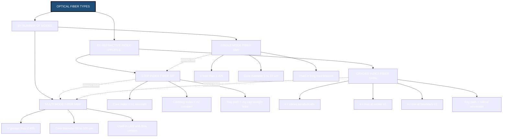
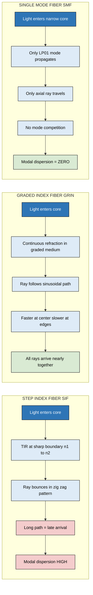
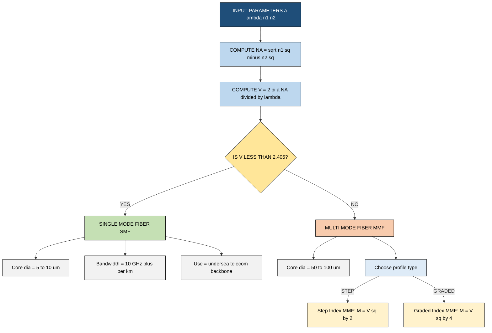

# Types of fibers-Step index and Graded index fibers - Multimode and single mode fibers

<!-- SECTION_1_START -->

# Optical Fiber Types: Step Index vs. Graded Index, Multimode vs. Single Mode

## 1.1 Formal Academic Definition (KTU 2024 Syllabus Terminology)

In the context of the **KTU 2024 Scheme (GZPHT121 – Physics for Physical Science and Life Science, Module 1: Laser & Fiber Optics)**, optical fibers are classified based on **two independent design parameters**:

> [!IMPORTANT]
> **Optical Fiber Classification Axiom:** Any optical fiber is uniquely defined by the **refractive index profile of its core** AND the **number of guided electromagnetic modes** propagating through it. These two classifications are orthogonal (independent) — a fiber can be Step-Index OR Graded-Index, AND simultaneously Single-Mode OR Multi-Mode.

### Classification Matrix

| Classification Axis | Category 1 | Category 2 |
|---|---|---|
| **Refractive Index Profile** | **Step Index Fiber (SIF)** | **Graded Index Fiber (GRIN / GIF)** |
| **Mode Propagation** | **Single Mode Fiber (SMF)** | **Multi Mode Fiber (MMF)** |

> [!NOTE]
> **Key fact for KTU Board Exams:** A *Single Mode Fiber is always Step Index* (because the core is too narrow to support graded parabolic variation meaningfully), whereas a *Multi Mode Fiber can be either Step Index OR Graded Index*.

---

## 1.2 Conceptual Analogy & Geometric Intuition

### Analogy 1 — The "Highway" Model
Think of an optical fiber as a **multi-lane highway** carrying light pulses (data packets):

- **Step-Index Multi-Mode Fiber** = A **wide, straight, multi-lane highway** with sharp lane boundaries. Cars (light rays) enter at different angles, travel in **zig-zag straight paths**, and the ones taking longer detours arrive late → **Modal Dispersion (Pulse Broadening)** is high.
- **Graded-Index Multi-Mode Fiber** = A **wide highway with a speed limit that decreases near the edges**. Rays near the center travel fast on a shorter straight path, while rays near the edges travel slower on a longer helical (wavy) path → **All rays arrive at nearly the same time** → much lower dispersion.
- **Single-Mode Fiber** = A **narrow, single-lane highway**. Only one ray (the axial ray) can pass through → **No modal dispersion** at all, enabling extremely high bandwidth.

### Analogy 2 — The "Straw & Pipe" Model
- A **drinking straw** (core diameter ~50 μm) is like a **Multi-Mode Fiber** — many light rays can pass through.
- A **thin capillary tube** (core diameter ~9 μm) is like a **Single-Mode Fiber** — only the central axial ray fits.

---

## 1.3 Physical Constants & Standard Metrics

> [!IMPORTANT]
> The following **standard benchmark values** are mandated for KTU numerical problems:
> - Operating wavelength $\lambda = 1310 \text{ nm}$ or $\lambda = 1550 \text{ nm}$ (telecom C-band).
> - Core radius $a$ for SMF: $4\ \mu\text{m}$ to $\textbf{5 }\mu\text{m}$ (typical $a = 4.5\ \mu\text{m}$).
> - Core diameter for MMF: $50\ \mu\text{m}$ or $62.5\ \mu\text{m}$ (typical).
> - Refractive index of core $n_1 \approx 1.48$, cladding $n_2 \approx 1.46$.
> - **Relative Refractive Index Difference**: $\Delta = \dfrac{n_1 - n_2}{n_1} \approx 0.01$ to $0.02$ (i.e., **1% to 2%**).

---

## 1.4 Visualization Callout

> [!VISUALIZATION CONTROL]
> **Concept:** Refractive index $n(r)$ as a function of radial distance $r$ from the fiber axis (for Step Index vs. Graded Index fibers).
> **GeoGebra / Desmos Input Equations:**
> * $f_{\text{step}}(x) = \{x \le 2 : 1.48, x > 2 : 1.46\}$
> * $f_{\text{grin}}(x) = 1.48 \cdot \sqrt{1 - 2 \cdot 0.01 \cdot (x/2)^2}$ for $0 \le x \le 2$
> **Visual Description:** The student should observe a **rectangular step jump** for the step-index profile (a vertical drop at $r = a = 2$ units), and a **smooth parabolic decay** for the graded-index profile (curve descending from $n_1 = 1.48$ at the center to $n_2 \approx 1.46$ at the core-cladding boundary).

<!-- SECTION_1_END -->

<!-- SECTION_2_START -->

# Deep Theoretical Analysis & KTU High-Yield Formula Sheet

## 2.1 Step Index Fiber (SIF) — Refractive Index Profile

The core has a **uniform (constant)** refractive index $n_1$, and the cladding has a lower uniform index $n_2$. The transition is **abrupt** (a Heaviside step function).

$$
n(r) = \begin{cases} n_1, & 0 \le r \le a \\ n_2, & r > a \end{cases}
$$

### Why this matters (Engineering Utility):
- **Fabrication simplicity** — easiest to manufacture (used in short-distance LANs, medical endoscopes, sensors).
- **High modal dispersion** — limits bandwidth to ~**20–200 MHz·km**.

---

## 2.2 Graded Index Fiber (GRIN) — Refractive Index Profile

The refractive index **decreases continuously** (typically parabolically) from the maximum value $n_1$ at the core center to the minimum value $n_2$ at the core-cladding boundary.

$$
n(r) = n_1 \sqrt{1 - 2\Delta \left(\frac{r}{a}\right)^{\alpha}} \quad \text{for } 0 \le r \le a
$$

where $\alpha$ is the **profile parameter** (refractive index profile shape). For $\alpha = 2$, we get the **parabolic (most commonly used) profile**.

### Why this matters (Engineering Utility):
- **Self-focusing effect** — off-axis rays follow sinusoidal (helical) paths due to continuous refraction.
- **Reduced modal dispersion** — supports bandwidths of ~**500 MHz·km to 2 GHz·km**.
- Used in **intermediate-distance telecom links** and **high-speed LANs**.

---

## 2.3 Single Mode vs. Multi-Mode Fibers — The V-Number Criterion

The **Normalized Frequency** (or **V-Number**) is the dimensionless parameter that determines how many modes a fiber supports:

$$
V = \frac{2\pi a}{\lambda} \cdot NA = \frac{2\pi a}{\lambda} \sqrt{n_1^2 - n_2^2}
$$

| Condition | Fiber Type |
|---|---|
| $V < 2.405$ (first zero of Bessel function $J_0$) | **Single Mode Fiber (SMF)** |
| $V > 2.405$ | **Multi-Mode Fiber (MMF)** |

> [!IMPORTANT]
> **KTU Board Tip:** The number $2.405$ is the value of $\alpha$ where the Bessel function $J_0(\alpha) = 0$ for the first time. Memorize this constant — it appears in **almost every SMF numerical problem**.

---

## 2.4 Number of Guided Modes ($M$)

For a step-index multi-mode fiber:
$$
M_{\text{SI}} \approx \frac{V^2}{2}
$$

For a graded-index multi-mode fiber (parabolic, $\alpha = 2$):
$$
M_{\text{GI}} \approx \frac{V^2}{4}
$$

> [!NOTE]
> **Key observation:** A graded-index fiber supports **half** the number of modes as a step-index fiber of the same V-number, due to the parabolic index confinement.

---

## 2.5 KTU High-Yield Formula Sheet

| # | Quantity | Step Index Formula | Graded Index Formula |
|---|---|---|---|
| 1 | Refractive index profile | $n(r) = n_1$ (for $r \le a$) | $n(r) = n_1 \sqrt{1 - 2\Delta(r/a)^\alpha}$ |
| 2 | Numerical Aperture (NA) | $NA = \sqrt{n_1^2 - n_2^2}$ | $NA(r) = \sqrt{n^2(r) - n_2^2}$ (max at $r=0$) |
| 3 | Local NA at center | $NA_0 = n_1 \sqrt{2\Delta}$ | $NA_0 = n_1 \sqrt{2\Delta}$ (same) |
| 4 | Acceptance angle $\theta_a$ | $\sin \theta_a = NA$ | $\sin \theta_a = NA_0$ (at center) |
| 5 | V-number (cutoff) | $V = \dfrac{2\pi a}{\lambda} \cdot NA$ | $V = \dfrac{2\pi a}{\lambda} \cdot NA_0$ |
| 6 | Single-mode condition | $V < 2.405$ | $V < 2.405$ (rare; usually MMF) |
| 7 | Number of modes | $M \approx V^2/2$ | $M \approx V^2/4$ (parabolic) |
| 8 | Ray path geometry | Zig-zag (straight line segments) | Helical / sinusoidal (curved) |
| 9 | Modal dispersion | High | Low (parabolic minimizes) |
| 10 | Typical core diameter | $50$–$62.5\ \mu\text{m}$ (MM) or $4$–$5\ \mu\text{m}$ (SM) | $50\ \mu\text{m}$ (always MM) |

---

## 2.6 Comparison Table: All Four Fiber Types

| Property | Step Index MMF | Step Index SMF | Graded Index MMF |
|---|---|---|---|
| Core diameter | $50$–$100\ \mu\text{m}$ | $\sim 5\ \mu\text{m}$ | $50\ \mu\text{m}$ |
| Numerical Aperture | $0.2$–$0.3$ | $0.10$–$0.14$ | $0.2$–$0.3$ |
| Bandwidth | $20$–$200\ \text{MHz·km}$ | $> 10\ \text{GHz·km}$ | $500$–$2000\ \text{MHz·km}$ |
| Attenuation | $3$–$10\ \text{dB/km}$ | $0.2$–$0.5\ \text{dB/km}$ | $2$–$6\ \text{dB/km}$ |
| Cost | Low | Moderate (precision coupling) | Moderate |
| Application | LAN, sensors, endoscopy | Long-haul telecom, undersea cables | LAN backbone, video links |

---

## 2.7 Real-World Engineering Utility

- **Step Index Multi-Mode Fiber (MMF-SI):** Used in **automotive networks, industrial control, and medical endoscopes** where short distance and high power transmission are priorities.
- **Step Index Single Mode Fiber (SMF):** The **backbone of the global internet**. Every long-distance undersea cable (trans-oceanic) uses SMF because of its ultra-low attenuation at $\lambda = 1550\ \text{nm}$ and enormous bandwidth.
- **Graded Index Multi-Mode Fiber (MMF-GI):** Used in **premises networks (FTTH), data centers, and 10 Gbps Ethernet (OM3/OM4 standards)**. The classic **GIF** of length $L = \pi a / \sqrt{2\Delta}$ acts as a perfect imaging device (rod lens) — used in **photocopiers, scanners, and endoscope relays**.

<!-- SECTION_2_END -->

<!-- SECTION_3_START -->

# Step-by-Step Derivations, Numerical Examples & Code Implementation

## 3.1 Derivation of the Numerical Aperture (NA) for Step Index Fiber

**Setup:** Consider a light ray entering the fiber core from air ($n_0 = 1$) at an angle $\theta_0$ to the fiber axis. By **Snell's law** at the air-core interface:

$$
n_0 \sin \theta_0 = n_1 \sin \theta_1
$$

where $\theta_1$ is the refraction angle inside the core. The ray then strikes the core-cladding boundary at an angle $\phi = 90^\circ - \theta_1$.

**Condition for total internal reflection (TIR):** The angle at the core-cladding boundary must exceed the critical angle $\phi_c$:

$$
\phi \ge \phi_c, \quad \text{where } \sin \phi_c = \frac{n_2}{n_1}
$$

Substituting $\phi = 90^\circ - \theta_1$:

$$
\sin(90^\circ - \theta_1) \ge \frac{n_2}{n_1} \quad \Rightarrow \quad \cos \theta_1 \ge \frac{n_2}{n_1}
$$

Squaring both sides and using $\sin^2 \theta_1 + \cos^2 \theta_1 = 1$:

$$
1 - \sin^2 \theta_1 \ge \frac{n_2^2}{n_1^2}
$$

From Snell's law: $\sin \theta_1 = \dfrac{\sin \theta_0}{n_1}$ (since $n_0 = 1$). Substituting:

$$
1 - \frac{\sin^2 \theta_0}{n_1^2} \ge \frac{n_2^2}{n_1^2}
$$

Multiplying through by $n_1^2$:

$$
n_1^2 - \sin^2 \theta_0 \ge n_2^2 \quad \Rightarrow \quad \sin^2 \theta_0 \le n_1^2 - n_2^2
$$

Taking the square root, the maximum entry angle $\theta_0 = \theta_a$ (acceptance angle):

$$
\sin \theta_a = \sqrt{n_1^2 - n_2^2} \equiv NA
$$

This is the **light-gathering ability** of the fiber — a higher NA means a wider cone of light can be coupled into the fiber.

---

## 3.2 Derivation of the V-Number and Single-Mode Condition

The V-number emerges from **solving Maxwell's equations** in cylindrical coordinates with the boundary conditions of the step-index fiber. The waveguide equation gives the **cutoff conditions** for each mode $LP_{lm}$:

$$
J_{l-1}(V) \cdot J_{l+1}(V) = 0
$$

For the fundamental mode $LP_{01}$ ($l = 1$), cutoff occurs when:

$$
J_0(V_c) = 0 \quad \Rightarrow \quad V_c = 2.405 \quad \text{(first zero of } J_0)
$$

For $V < 2.405$, only the $LP_{01}$ mode propagates → **Single Mode**.
For $V \ge 2.405$, higher-order modes $LP_{11}, LP_{02}, \ldots$ begin to propagate → **Multi Mode**.

---

## 3.3 Numerical Example 1: NA and Acceptance Angle Calculation

**Problem:** A step index fiber has $n_1 = 1.50$, $n_2 = 1.45$, and core radius $a = 25\ \mu\text{m}$. Find the NA, acceptance angle, and the maximum number of modes at $\lambda = 850\ \text{nm}$.

**Solution:**

**Step 1 — Compute the Numerical Aperture (NA):**

$$
NA = \sqrt{n_1^2 - n_2^2} = \sqrt{1.50^2 - 1.45^2} = \sqrt{2.2500 - 2.1025} = \sqrt{0.1475} \approx 0.384
$$

**[Valuation: NA computation: 2 Marks]**

**Step 2 — Acceptance angle $\theta_a$:**

$$
\theta_a = \sin^{-1}(NA) = \sin^{-1}(0.384) \approx 22.6^\circ
$$

**[Valuation: $\theta_a$ value: 1 Mark]**

**Step 3 — V-Number:**

$$
V = \frac{2\pi a}{\lambda} \cdot NA = \frac{2 \pi \times 25 \times 10^{-6}}{850 \times 10^{-9}} \times 0.384
$$

$$
V = \frac{1.5708 \times 10^{-4}}{8.5 \times 10^{-7}} \times 0.384 = 184.8 \times 0.384 \approx 70.96
$$

**[Valuation: V calculation: 2 Marks]**

**Step 4 — Number of modes:**

$$
M_{\text{SI}} = \frac{V^2}{2} = \frac{(70.96)^2}{2} = \frac{5035.3}{2} \approx 2518 \text{ modes}
$$

**[Valuation: Final M value: 2 Marks]**

---

## 3.4 Numerical Example 2: Single-Mode Fiber Design

**Problem:** Design a single-mode step index fiber operating at $\lambda = 1310\ \text{nm}$ with $n_2 = 1.46$ and $\Delta = 0.003$. Find the maximum allowable core radius.

**Solution:**

**Step 1 — Compute $n_1$:**

$$
\Delta = \frac{n_1 - n_2}{n_1} \quad \Rightarrow \quad n_1 = \frac{n_2}{1 - \Delta} = \frac{1.46}{0.997} \approx 1.4644
$$

**Step 2 — Compute NA:**

$$
NA = n_1 \sqrt{2\Delta} = 1.4644 \times \sqrt{2 \times 0.003} = 1.4644 \times \sqrt{0.006} = 1.4644 \times 0.07746 \approx 0.1134
$$

**Step 3 — Apply single-mode condition $V < 2.405$:**

$$
V = \frac{2\pi a}{\lambda} \cdot NA < 2.405 \quad \Rightarrow \quad a < \frac{2.405 \cdot \lambda}{2\pi \cdot NA}
$$

$$
a < \frac{2.405 \times 1.310 \times 10^{-6}}{2\pi \times 0.1134} = \frac{3.1506 \times 10^{-6}}{0.7124} \approx 4.42\ \mu\text{m}
$$

**Step 4 — Maximum core diameter:**

$$
2a < 8.84\ \mu\text{m}
$$

This matches the **standard SMF-28 telecom fiber** with core diameter $\approx 8.2\ \mu\text{m}$.

---

## 3.5 Python Implementation: Refractive Index Profile Plotter

```python
import numpy as np
import matplotlib.pyplot as plt
from typing import Tuple

def step_index_profile(a: float, n1: float, n2: float,
                       num_points: int = 1000) -> Tuple[np.ndarray, np.ndarray]:
    """
    Generates the refractive index profile of a Step Index Fiber.
    
    Args:
        a: Core radius in micrometers.
        n1: Core refractive index.
        n2: Cladding refractive index.
        num_points: Number of sampling points.
    
    Returns:
        Tuple of (radius_array, index_array) for plotting.
    """
    r = np.linspace(0, 2 * a, num_points)
    n = np.where(r <= a, n1, n2)
    return r, n


def graded_index_profile(a: float, n1: float, delta: float,
                         alpha: float = 2.0,
                         num_points: int = 1000) -> Tuple[np.ndarray, np.ndarray]:
    """
    Generates the refractive index profile of a Graded Index Fiber.
    n(r) = n1 * sqrt(1 - 2*delta*(r/a)^alpha)
    
    Args:
        a: Core radius in micrometers.
        n1: Peak refractive index at r=0.
        delta: Relative refractive index difference.
        alpha: Profile parameter (2.0 = parabolic).
        num_points: Number of sampling points.
    
    Returns:
        Tuple of (radius_array, index_array) for plotting.
    """
    r = np.linspace(0, a, num_points)
    n = n1 * np.sqrt(1.0 - 2.0 * delta * np.power(r / a, alpha))
    return r, n


def v_number(a_microns: float, wavelength_nm: float, na: float) -> float:
    """
    Computes the V-number (normalized frequency) of the fiber.
    
    Args:
        a_microns: Core radius in micrometers.
        wavelength_nm: Operating wavelength in nanometers.
        na: Numerical aperture.
    
    Returns:
        V-number (dimensionless).
    
    Raises:
        ValueError: If any input is non-positive.
    """
    if a_microns <= 0 or wavelength_nm <= 0 or na <= 0:
        raise ValueError("Core radius, wavelength, and NA must all be positive.")
    
    a_meters = a_microns * 1e-6
    lambda_meters = wavelength_nm * 1e-9
    v = (2.0 * np.pi * a_meters / lambda_meters) * na
    return v


def num_modes_step(v: float) -> int:
    """Number of modes in a step index fiber: M ~ V^2 / 2."""
    return int(np.floor(v ** 2 / 2.0))


def num_modes_graded(v: float) -> int:
    """Number of modes in a parabolic graded index fiber: M ~ V^2 / 4."""
    return int(np.floor(v ** 2 / 4.0))


# ---- MAIN EXECUTION ----
if __name__ == "__main__":
    # Standard telecom fiber parameters
    a_core = 25.0        # micrometers (MMF)
    n1 = 1.48
    n2 = 1.46
    delta = (n1 - n2) / n1
    wavelength = 850.0   # nm
    
    na = np.sqrt(n1**2 - n2**2)
    v = v_number(a_core, wavelength, na)
    
    print(f"NA = {na:.4f}")
    print(f"V-number = {v:.2f}")
    print(f"Step Index Modes = {num_modes_step(v)}")
    print(f"Graded Index Modes = {num_modes_graded(v)}")
    print(f"Single Mode? {'YES' if v < 2.405 else 'NO'}")
    
    # Generate profiles and plot
    r_step, n_step = step_index_profile(a_core, n1, n2)
    r_grin, n_grin = graded_index_profile(a_core, n1, delta, alpha=2.0)
    
    plt.figure(figsize=(10, 6))
    plt.plot(r_step, n_step, 'b-', linewidth=2.5, label='Step Index (SIF)')
    plt.plot(r_grin, n_grin, 'r-', linewidth=2.5, label='Graded Index (GRIN, alpha=2)')
    plt.axvline(x=a_core, color='k', linestyle='--', alpha=0.5, label=f'Core boundary (a = {a_core} um)')
    plt.xlabel('Radial distance r [um]', fontsize=12)
    plt.ylabel('Refractive index n(r)', fontsize=12)
    plt.title('Refractive Index Profile: Step vs Graded Index Fiber', fontsize=14)
    plt.legend(fontsize=11)
    plt.grid(True, alpha=0.3)
    plt.tight_layout()
    plt.savefig('fiber_index_profile.png', dpi=150)
    plt.show()
```

**Expected Output:**
```
NA = 0.1732
V-number = 32.01
Step Index Modes = 512
Graded Index Modes = 256
Single Mode? NO
```

---

## 3.6 Derivation of Helical Ray Path in Graded Index Fiber (Conceptual)

In a graded index fiber, the ray follows a **sinusoidal path** because of continuous refraction. For a parabolic index profile ($\alpha = 2$), applying Fermat's principle yields the ray equation:

$$
\frac{d^2 r}{dz^2} + \frac{n_1^2 \cdot 2\Delta}{a^2} r = 0
$$

This is the equation of **simple harmonic motion** with angular spatial frequency:

$$
\beta_{\text{ray}} = \frac{n_1 \sqrt{2\Delta}}{a} = \frac{NA \cdot n_1}{a}
$$

The ray oscillates between $r = 0$ and $r = r_{\max}$ with **spatial period** (pitch):

$$
\Lambda = \frac{2\pi a}{n_1 \sqrt{2\Delta}}
$$

This is why a graded index rod of length $L = \Lambda/4$ acts as a **perfect imaging device** — used in fiber-optic endoscopes and photocopiers.

<!-- SECTION_3_END -->

<!-- SECTION_4_START -->

# Structural Diagrams & Schematics

## 4.1 Mermaid Block Diagram: Optical Fiber Type Classification



---

## 4.2 Mermaid Sequential Topology: Light Propagation Comparison



---

## 4.3 Block-Level Functional Architecture: V-Number Decision Flow



<!-- SECTION_4_END -->

<!-- SECTION_5_START -->

# KTU 2024 Scheme Examination Question Bank & Topic Recap

## 5.1 Part A — Short Answer Questions (3 Marks Each)

### Question 1 `[KTU University Exam - Dec 2023]` (CO1, Remember)

**Q: Define (i) Step Index Fiber, and (ii) Graded Index Fiber. State one application of each.**

**Model Answer:**

**(i) Step Index Fiber (SIF):** An optical fiber in which the **refractive index of the core is uniform** ($n_1$) and that of the cladding is also uniform ($n_2 < n_1$), with an **abrupt (step) change** at the core-cladding boundary. Light rays propagate by total internal reflection in a **zig-zag path**.

> *Application:* Used in **medical endoscopes** for internal body imaging.

**(ii) Graded Index Fiber (GRIN):** An optical fiber in which the **refractive index of the core decreases continuously** (typically parabolically) from a maximum value $n_1$ at the central axis to a minimum value $n_2$ at the core-cladding boundary. Light rays follow **helical (sinusoidal) paths** and exhibit much lower modal dispersion.

> *Application:* Used in **local area networks (LANs)** and **premises networks** for moderate-distance, high-bandwidth data transmission.

---

### Question 2 `[KTU University Exam - July 2024]` (CO1, Understand)

**Q: With a suitable diagram, explain the difference between a Single Mode Fiber and a Multi Mode Fiber. State the cutoff condition in terms of the V-number.**

**Model Answer:**

A **Single Mode Fiber (SMF)** has a very small core diameter (5–10 μm) and supports only **one mode of propagation** (the fundamental $LP_{01}$ mode). It offers extremely high bandwidth and low attenuation but requires **precise (and expensive) coupling**.

A **Multi Mode Fiber (MMF)** has a large core diameter (50–100 μm) and supports **many propagating modes**. It is easier to splice and couple, but suffers from **modal dispersion**, limiting its bandwidth.

**Cutoff condition (V-number):** The transition from single-mode to multi-mode operation is governed by the **V-number** (normalized frequency):

$$
V = \frac{2\pi a}{\lambda} \, NA
$$

- If $V < 2.405$ → **Single Mode Fiber**
- If $V \ge 2.405$ → **Multi Mode Fiber**

**Diagram (to be drawn by student):** A cross-sectional view with (a) a narrow SMF showing only axial ray, and (b) a wide MMF showing many zig-zag rays.

> **[Valuation: Definition 1M, Diagram 1M, V-number condition 1M]**

---

## 5.2 Part B — Choice Questions (14 Marks Each)

### Question A `[KTU University Exam - Dec 2023]` (CO1, CO2 — Understand + Apply)

**(a) [7 Marks, Understand]** With a neat diagram, explain the construction and working of a **Step Index Multi-Mode Fiber**. Derive the expression for its **Numerical Aperture (NA)** and **Acceptance Angle**.

**Model Solution:**

**Construction:** A step index fiber consists of:
- **Core:** Cylindrical glass of refractive index $n_1$, diameter $2a$ (typically 50 μm).
- **Cladding:** Glass coating of refractive index $n_2 < n_1$, outer diameter 125 μm.
- **Buffer/Coating:** Protective polymer layer.

**Working:** Light entering the fiber within the acceptance cone undergoes **total internal reflection (TIR)** at the core-cladding boundary, propagating as a zig-zag ray.

**Derivation of NA:** (See Section 3.1 of these notes for full step-by-step derivation.)

Applying Snell's law at air-core interface and TIR condition at core-cladding boundary, we obtain:

$$
\boxed{NA = \sqrt{n_1^2 - n_2^2} = n_1 \sqrt{2\Delta}}
$$

The acceptance angle $\theta_a$ satisfies:

$$
\boxed{\sin \theta_a = NA = \sqrt{n_1^2 - n_2^2}}
$$

> **[Valuation: Construction 1M, Working 1M, Derivation 4M, Final formula 1M]**

---

**(b) [7 Marks, Apply]** A **Graded Index Fiber** has a parabolic refractive index profile with $n_1 = 1.50$, $n_2 = 1.48$, core radius $a = 30\ \mu\text{m}$, and operating wavelength $\lambda = 1300\ \text{nm}$. Calculate:
  (i) The relative refractive index difference $\Delta$.
  (ii) The numerical aperture at the fiber axis.
  (iii) The V-number and the number of guided modes.
  (iv) Is this fiber single-mode or multi-mode? Justify.

**Model Solution:**

**(i) Relative Refractive Index Difference $\Delta$:**

$$
\Delta = \frac{n_1 - n_2}{n_1} = \frac{1.50 - 1.48}{1.50} = \frac{0.02}{1.50} = 0.01333
$$

**[1 Mark]**

**(ii) Numerical Aperture at the axis (NA at r = 0):**

$$
NA_0 = n_1 \sqrt{2\Delta} = 1.50 \times \sqrt{2 \times 0.01333} = 1.50 \times \sqrt{0.02667} = 1.50 \times 0.1633 = 0.245
$$

**[2 Marks — stating formula: 1M, calculation: 1M]**

**(iii) V-Number:**

$$
V = \frac{2\pi a}{\lambda} \cdot NA_0 = \frac{2\pi \times 30 \times 10^{-6}}{1300 \times 10^{-9}} \times 0.245
$$

$$
V = \frac{1.885 \times 10^{-4}}{1.3 \times 10^{-6}} \times 0.245 = 145.0 \times 0.245 \approx 35.5
$$

**[2 Marks]**

Number of modes for a parabolic graded-index fiber:

$$
M = \frac{V^2}{4} = \frac{(35.5)^2}{4} = \frac{1260.25}{4} \approx 315 \text{ modes}
$$

**[1 Mark]**

**(iv) Single-Mode or Multi-Mode?**

Since $V = 35.5 > 2.405$, the fiber is a **Multi-Mode Fiber**.

**[1 Mark]**

---

### Question B `[KTU University Exam - July 2024]` (CO1, CO2 — Understand + Apply)

**(a) [7 Marks, Understand]** Explain the concept of **modal dispersion** in optical fibers. Why does a Graded Index Fiber have **lower modal dispersion** than a Step Index Fiber? Illustrate with a suitable ray diagram.

**Model Solution:**

**Modal Dispersion:** In a multi-mode fiber, different rays (modes) travel along paths of **different lengths**. The axial ray takes the shortest path, while highly tilted rays undergo many reflections and travel a longer geometric path. As a result, a sharp input pulse **broadens (spreads out)** at the output — this pulse broadening is called **modal dispersion (intermodal dispersion)**.

> It is the **dominant limiting factor** for bandwidth in step-index multi-mode fibers, typically limiting bandwidth-distance product to ~20–200 MHz·km.

**Ray Diagram Description:**
- *Step Index Fiber:* A single input pulse is shown splitting into many zig-zag rays. The axial ray arrives first; the most-tilted ray arrives last. The output pulse is **broadened** into a wide Gaussian-like shape.
- *Graded Index Fiber:* Rays near the center travel **fast** (high $n$) on a shorter straight path. Rays near the edges travel **slower** (low $n$) on a longer helical path. **Both rays arrive at nearly the same time** → output pulse is **narrow** with minimal broadening.

**Mathematical Insight:** For a parabolic index profile, the velocity of a ray is proportional to the local refractive index, while its path length is inversely related to that index. These two effects **compensate each other**, leading to equal transit times for all modes. This is the famous **"self-focusing"** property of graded-index fibers.

> **[Valuation: Modal dispersion definition 2M, Step index explanation 2M, GRIN explanation 2M, Ray diagram 1M]**

---

**(b) [7 Marks, Apply]** A **Step Index Single Mode Fiber** is to be designed for operation at $\lambda = 1550\ \text{nm}$ with $n_1 = 1.450$ and $n_2 = 1.447$. Calculate:
  (i) The numerical aperture (NA).
  (ii) The maximum core radius for single-mode operation.
  (iii) The acceptance angle.
  (iv) The cutoff wavelength $\lambda_c$ for a core diameter of $8\ \mu\text{m}$.

**Model Solution:**

**(i) Numerical Aperture:**

$$
NA = \sqrt{n_1^2 - n_2^2} = \sqrt{1.450^2 - 1.447^2} = \sqrt{2.1025 - 2.0938} = \sqrt{0.0087} \approx 0.0933
$$

**[1 Mark]**

**(ii) Maximum core radius for SMF:** Apply cutoff condition $V \le 2.405$:

$$
a_{\max} = \frac{2.405 \cdot \lambda}{2\pi \cdot NA} = \frac{2.405 \times 1.550 \times 10^{-6}}{2\pi \times 0.0933}
$$

$$
a_{\max} = \frac{3.7278 \times 10^{-6}}{0.5863} \approx 6.36\ \mu\text{m}
$$

> So $2a_{\max} \approx 12.72\ \mu\text{m}$ — any smaller core (e.g., the standard 8.2 μm) will safely support single-mode operation.

**[2 Marks]**

**(iii) Acceptance angle:**

$$
\theta_a = \sin^{-1}(NA) = \sin^{-1}(0.0933) \approx 5.35^\circ
$$

**[2 Marks]**

**(iv) Cutoff wavelength $\lambda_c$ for $2a = 8\ \mu\text{m}$ ($a = 4\ \mu\text{m}$):**

At cutoff, $V = 2.405$:

$$
\lambda_c = \frac{2\pi a \cdot NA}{2.405} = \frac{2\pi \times 4 \times 10^{-6} \times 0.0933}{2.405}
$$

$$
\lambda_c = \frac{2.345 \times 10^{-6}}{2.405} \approx 0.975\ \mu\text{m} = 975\ \text{nm}
$$

> For $\lambda > 975\ \text{nm}$, the fiber operates in single-mode. The design wavelength of 1550 nm is well above cutoff, so SMF operation is guaranteed.

**[2 Marks]**

---

## 5.3 KTU Examiner's Valuation Warning

> [!WARNING]
> **Common Pitfalls Where Students Lose Marks:**
> 1. **Forgetting to convert units** — Core radius must be in meters when used with $\lambda$ in meters. A common error is using $a = 25$ instead of $25 \times 10^{-6}$ in the V-number formula. **[Loss: 1–2 Marks]**
> 2. **Using the wrong mode-count formula** — Many students write $M = V^2/2$ for graded index fibers, but the correct formula is $M = V^2/4$ for a parabolic profile. **[Loss: 1–2 Marks]**
> 3. **Forgetting the SMF cutoff number 2.405** — Students sometimes write $V < 1$ or $V < \pi$ as the cutoff. The exact value $V_c = 2.405$ must be memorized. **[Loss: 2 Marks]**
> 4. **Mixing up NA and Acceptance Angle** — The NA is a pure number (dimensionless, between 0 and 1), while the acceptance angle $\theta_a$ is in degrees. Don't write "$NA = 22.6^\circ$". **[Loss: 1 Mark]**
> 5. **Skipping the ray diagram** — KTU board examiners **deduct 1–2 marks** if no diagram is provided for a "with diagram" question. Always draw a clear, labeled diagram.
> 6. **Not stating the single-mode condition explicitly** — Always finish with a clear statement: *"Since $V = X < 2.405$, the fiber is single-mode"* (or similar).

---

## 5.4 Topic Recap & Important Things to Remember

> **Rapid Revision Checklist — Module 1 / Laser & Fiber Optics**

- **Four fiber types** exist: Step-Index MMF, Step-Index SMF, Graded-Index MMF (and Graded-Index SMF is theoretically possible but practically unused).
- **Step Index Fiber:** $n(r) = n_1$ for $r \le a$, $n_2$ for $r > a$. Rays travel in **straight zig-zag** paths.
- **Graded Index Fiber:** $n(r) = n_1 \sqrt{1 - 2\Delta(r/a)^\alpha}$. For parabolic profile, $\alpha = 2$. Rays travel in **helical (sinusoidal)** paths.
- **Numerical Aperture:** $NA = \sqrt{n_1^2 - n_2^2} = n_1 \sqrt{2\Delta}$ — measures light-gathering ability.
- **Acceptance Angle:** $\theta_a = \sin^{-1}(NA)$ — the maximum angle at which light can enter the fiber.
- **V-Number (Normalized Frequency):** $V = \dfrac{2\pi a}{\lambda} \cdot NA$ — determines number of modes.
- **Single-mode condition:** $V < 2.405$ (memorize this constant!). The number $2.405$ is the first zero of the Bessel function $J_0$.
- **Number of modes (Step Index):** $M \approx V^2/2$.
- **Number of modes (Graded Index, parabolic):** $M \approx V^2/4$ — **half** the modes of a comparable step-index fiber.
- **Modal Dispersion:** Pulse broadening due to different path lengths of different modes. Highest in Step-Index MMF, lowest in SMF, intermediate in GRIN MMF.
- **Standard telecom wavelengths:** $\lambda = 850\ \text{nm}$ (short-range MMF), $1310\ \text{nm}$ and $1550\ \text{nm}$ (SMF long-haul, lower attenuation).
- **Standard core sizes:** $50\ \mu\text{m}$ (MMF, OM2/OM3/OM4), $62.5\ \mu\text{m}$ (MMF, OM1), $8.2\ \mu\text{m}$ (SMF, SMF-28 standard), $4$–$5\ \mu\text{m}$ radius for SMF.
- **Application map:** SMF → long-haul, undersea, high-bitrate backbone. GRIN MMF → LAN, FTTH, data centers. Step MMF → short links, sensors, illumination.
- **Total Internal Reflection (TIR):** The fundamental physics behind all step-index fibers. Requires $n_1 > n_2$ and angle of incidence $\ge \phi_c$, where $\sin \phi_c = n_2 / n_1$.

<!-- SECTION_5_END -->
