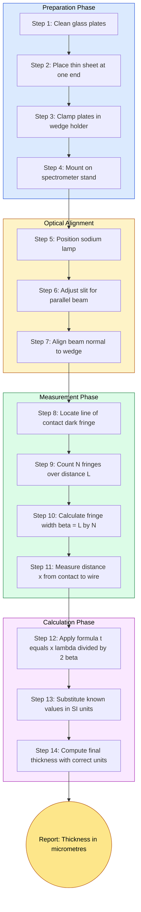

# Air wedge- Measurement of thickness of thin sheets

<!-- SECTION_1_START -->
# Air Wedge: Measurement of Thickness of Thin Sheets

## 1.1 Formal Academic Definition (KTU 2024 Syllabus Terminology)

An **air wedge** is a thin-film interference apparatus formed by placing two optically flat glass plates in contact along one of their edges, while the opposite edge is separated by a thin object (a wire, foil, or a sheet of unknown thickness). The intervening air film tapers linearly from zero thickness at the contact edge to a maximum thickness equal to the height of the separator at the far edge, producing a characteristic wedge-shaped geometry.

When monochromatic parallel light is incident normally on the upper surface of the wedge, the light reflected from the **top and bottom surfaces** of the air film undergoes **division of amplitude interference**, producing a series of equally spaced, straight, parallel **dark and bright fringes** running parallel to the line of contact.

> [!IMPORTANT]
> **KTU Syllabus Highlight (Module 2 – Interference & Diffraction):**
> The air wedge experiment belongs to the family of "thin-film interference" and is specifically used to measure:
> 1. The **diameter of a thin wire / hair** (very small thickness, order of micrometres)
> 2. The **wavelength of monochromatic light** (when thickness is known)
> 3. The **refractive index of a transparent material** (filled wedge configuration)

> [!NOTE]
> **Why it is called a "wedge":** The geometric cross-section of the air film between the two plates looks exactly like a mechanical wedge — a triangular block whose thickness increases linearly with horizontal distance. The interference phenomenon depends directly on this linear increase in optical path difference.

---

## 1.2 Conceptual Analogy / Intuitive Overview

Imagine two transparent glass sheets laid on a table. You press one end of the sheets firmly together with your fingers so they touch perfectly at that edge. At the opposite end, you slide a single human hair (about 70 µm thick) between them. The gap between the two sheets is **zero** at the touching edge and grows **linearly** until it equals the hair's thickness at the far edge.

If you now shine a torch straight down onto this setup, you will see a series of **alternating dark and bright bands** stretching across the glass. Each bright band is a location where the gap thickness is just right so that the light waves bouncing off the top and bottom of the air film **constructively interfere** (add up). Each dark band is a location where the waves **destructively interfere** (cancel out).

By counting how many bands appear in a known horizontal distance, and by knowing the wavelength of the torch's light, you can back-calculate the hair's thickness with micrometre precision. **This is the essence of the air-wedge method.**

| Parameter | Standard Metric | Real-World Magnitude |
| :--- | :--- | :--- |
| **Wedge angle** $\theta$ | radians (or degrees) | $10^{-4}$ to $10^{-3}$ rad |
| **Fringe width** $\beta$ | millimetres (mm) | 0.1 mm to 1 mm |
| **Wavelength** $\lambda$ | nanometres (nm) | **589 nm (sodium D-line)** |
| **Thickness of sheet** $t$ | micrometres (µm) | 5 µm to 200 µm |
| **Refractive index of air** $\mu$ | dimensionless | $\approx 1.000293$ (taken as **1.0** for KTU problems) |

---

## 1.3 Visualization Hook

> [!VISUALIZATION CONTROL]
> **Concept:** Linear thickness profile of an air wedge and the corresponding interference fringe pattern on the viewing screen.
>
> **Desmos Input Equations:**
> * $t(x) = x \cdot \tan(\theta)$  ← thickness as a function of horizontal distance
> * $x_{\text{bright}}(n) = \dfrac{n \lambda}{2 \tan(\theta)}$  ← position of $n$-th bright fringe
> * $x_{\text{dark}}(n) = \dfrac{(n + 0.5) \lambda}{2 \tan(\theta)}$  ← position of $n$-th dark fringe
>
> **Visual Description:** When plotted, $t(x)$ is a straight line passing through the origin with a tiny positive slope. The bright and dark fringe positions are equally spaced points along the x-axis, with a constant separation equal to the **fringe width** $\beta$.

<!-- SECTION_1_END -->

<!-- SECTION_2_START -->
# Deep Theoretical Analysis & KTU High-Yield Formula Sheet

## 2.1 Formation of the Wedge

The construction of an air wedge is governed by three fundamental optical principles:

1. **Partial Reflection & Partial Transmission:** When light strikes the top surface of the upper plate, a fraction is reflected, and the remainder refracts into the air film. At the bottom surface (glass-air interface of the lower plate), partial reflection again occurs. The two reflected components (one from the **upper** glass-air interface, one from the **lower** air-glass interface) are coherent because they originate from the same incident wavefront.

2. **Phase Reversal (The "$\lambda/2$" Term):** Reflection at a *denser-to-rarer* interface (glass $\to$ air) produces **no phase change**, but reflection at a *rarer-to-denser* interface (air $\to$ glass) introduces a **phase change of $\pi$ radians**, equivalent to an extra optical path of $\lambda/2$. This is why reflected fringes exhibit a **dark band at the line of contact** ($t = 0$).

3. **Geometric Wedge Profile:** The air film thickness at horizontal distance $x$ from the contact edge is given by
$$t = x \cdot \tan(\theta) \approx x \cdot \theta$$
since the wedge angle $\theta$ is extremely small (typically less than $10^{-3}$ radians).

---

## 2.2 Path Difference Derivation (Reflected Light)

Consider a ray striking the upper glass plate at normal incidence. Ray 1 reflects from the top (glass-air) surface. Ray 2 transmits into the air, reflects from the bottom (air-glass) surface, and emerges back through the top. For an air film of local thickness $t$:

* Optical path of Ray 2 inside the air film = $2 t \cdot \mu_{\text{air}}$
* Since $\mu_{\text{air}} \approx 1$ and the ray 2 reflection introduces a phase change of $\pi$:

$$\Delta = 2 \mu_{\text{air}} \, t + \frac{\lambda}{2}$$

For the standard KTU treatment, $\mu_{\text{air}} = 1$, so:

$$\Delta = 2 t + \frac{\lambda}{2}$$

---

## 2.3 Conditions for Constructive and Destructive Interference

**Bright Fringes (Constructive Interference — maximum intensity):**
$$\Delta = n \lambda \quad \Rightarrow \quad 2 t + \frac{\lambda}{2} = n \lambda \quad \Rightarrow \quad 2t = \left(n - \frac{1}{2}\right)\lambda$$
where $n = 1, 2, 3, \ldots$ and the corresponding thickness is $t = \dfrac{(2n-1)\lambda}{4}$.

**Dark Fringes (Destructive Interference — minimum intensity):**
$$\Delta = (2n+1)\frac{\lambda}{2} \quad \Rightarrow \quad 2 t + \frac{\lambda}{2} = (2n+1)\frac{\lambda}{2} \quad \Rightarrow \quad 2t = n\lambda$$
where $n = 0, 1, 2, 3, \ldots$ and the corresponding thickness is $t = \dfrac{n\lambda}{2}$.

> [!NOTE]
> **Board-Valuation Tip:** For $n = 0$ in the dark-fringe condition, $2t = 0 \Rightarrow t = 0$, which confirms the **central dark fringe at the line of contact**. This is a hallmark of reflected light from an air wedge and is **always** tested in KTU exams.

---

## 2.4 Fringe Width and Wedge Angle

The **fringe width** $\beta$ is the perpendicular distance between two consecutive bright (or two consecutive dark) fringes on the screen. Since the film thickness $t$ is linearly related to horizontal position $x$:

$$t = x \, \theta$$

The position of the $n$-th dark fringe satisfies $2 t_n = n \lambda$, i.e. $t_n = \dfrac{n \lambda}{2}$, hence $x_n = \dfrac{t_n}{\theta} = \dfrac{n \lambda}{2 \theta}$.

The fringe width is therefore:

$$\beta = x_{n+1} - x_n = \frac{(n+1)\lambda}{2\theta} - \frac{n\lambda}{2\theta} = \frac{\lambda}{2\theta}$$

This is the **most important equation** of the air-wedge chapter.

---

## 2.5 KTU Formula Sheet / Cheat Sheet

| # | Formula | Description | Symbols |
| :-: | :--- | :--- | :--- |
| 1 | $t = x \tan\theta \approx x \theta$ | Local film thickness at distance $x$ | $t$ = thickness, $x$ = distance from edge, $\theta$ = wedge angle |
| 2 | $\Delta = 2 \mu t + \dfrac{\lambda}{2}$ | Total path difference (reflected light) | $\mu$ = refractive index of film, $\lambda$ = wavelength |
| 3 | $2 t = n \lambda$ | **Dark fringe** condition | $n = 0, 1, 2, \ldots$ |
| 4 | $2 t = \left(n - \dfrac{1}{2}\right)\lambda$ | **Bright fringe** condition | $n = 1, 2, 3, \ldots$ |
| 5 | $\beta = \dfrac{\lambda}{2 \theta}$ | Fringe width (general) | $\beta$ = fringe width |
| 6 | $\theta = \dfrac{\lambda}{2 \beta}$ | Wedge angle from measurements | Used to compute $\theta$ |
| 7 | $t = \dfrac{n \lambda}{2}$ | Thickness at the $n$-th dark fringe | At the location of the $n$-th dark band |
| 8 | $t = \dfrac{x \lambda}{2 \beta}$ | **Thickness of thin sheet** (most important for experiments) | $x$ = distance from contact to the far edge of the wedge |
| 9 | $\lambda = \dfrac{2 \beta t}{x}$ | Wavelength of light (inverse experiment) | Used when $t$ is known |
| 10 | $\mu = \dfrac{\lambda}{2 \beta \tan\theta} \cdot \dfrac{x}{t}$ | Refractive index of a transparent filler | Used for liquid-filled wedge |

> [!IMPORTANT]
> **Formula 8 ($t = \dfrac{x \lambda}{2 \beta}$)** is the **operating equation** in every KTU practical/lab exam on this topic. The "thin sheet" is the wire or foil placed at the far end of the wedge, and its thickness is computed by knowing the wavelength of the light source, the measured fringe width, and the horizontal distance from the line of contact to the position of the sheet.

---

## 2.6 Real-World Engineering & Scientific Utility

| Field | Application of Air Wedge Principle |
| :--- | :--- |
| **Optical Metrology** | Measuring thicknesses of thin films, coatings, oxide layers on semiconductors |
| **Materials Testing Labs** | Checking the flatness of glass plates, gauge blocks, and reference surfaces |
| **Forensic Science** | Estimating the diameter of hair strands or textile fibres |
| **Photonics Industry** | Quality control of anti-reflection coatings and thin-film optical filters |
| **Astronomy** | Testing the figure (flatness) of telescope mirrors using interference patterns |
| **Surface Engineering** | Determining refractive index of liquid samples in a wedge cell |

<!-- SECTION_2_END -->

<!-- SECTION_3_START -->
# Step-by-Step Derivations and Computational Implementation

## 3.1 Exhaustive Derivation of the Thickness Formula $t = \dfrac{x \lambda}{2 \beta}$

### Step 1 — Geometric Setup

Two glass plates $G_1$ (top) and $G_2$ (bottom) are in contact along the left edge (the line of contact $L$). A thin sheet of unknown thickness $t$ is placed at the right edge, separated by a horizontal distance $x$ from $L$. The wedge angle is $\theta$.

From the geometry of the right triangle formed by the contact line, the separating sheet, and the lower glass plate:

$$\tan\theta = \frac{\text{opposite}}{\text{adjacent}} = \frac{t}{x}$$

Because the wedge angle is very small (of the order of $10^{-4}$ radians), we can safely use the small-angle approximation $\tan\theta \approx \theta$. Therefore:

$$\theta = \frac{t}{x} \quad \text{...(Eq. A)}$$

### Step 2 — Fringe Width in Terms of Wedge Angle

The $n$-th dark fringe occurs at the location where the air-film thickness equals $t_n = \dfrac{n \lambda}{2}$. The horizontal distance of this fringe from the line of contact is:

$$x_n = \frac{t_n}{\theta} = \frac{n \lambda}{2 \theta}$$

Similarly, the $(n+1)$-th dark fringe lies at:

$$x_{n+1} = \frac{(n+1) \lambda}{2 \theta}$$

The fringe width is the distance between two consecutive dark fringes:

$$\beta = x_{n+1} - x_n = \frac{(n+1)\lambda}{2\theta} - \frac{n\lambda}{2\theta} = \frac{\lambda}{2\theta}$$

$$\beta = \frac{\lambda}{2 \theta} \quad \text{...(Eq. B)}$$

### Step 3 — Eliminating the Wedge Angle

From (Eq. B), we solve for the wedge angle:

$$\theta = \frac{\lambda}{2 \beta}$$

Substitute this value of $\theta$ into (Eq. A):

$$\frac{\lambda}{2 \beta} = \frac{t}{x}$$

### Step 4 — Final Solved Form

Rearranging to isolate $t$:

$$\boxed{\,t = \frac{x \, \lambda}{2 \, \beta}\,}$$

This is the working formula used in every KTU experiment on this topic. The values of $x$, $\lambda$, and $\beta$ are measured, and $t$ is calculated.

---

## 3.2 Numerical Worked Example (KTU Board Pattern)

**Problem Statement [KTU University Exam – July 2023, Model Question]:**
> In an air-wedge experiment, the fringe width is measured as $\beta = 0.50 \text{ mm}$. The distance from the line of contact to the position of the thin wire is $x = 5.00 \text{ cm}$. The wavelength of the sodium light used is $\lambda = 589 \text{ nm}$. Calculate the diameter of the wire.

**Given Data:**
* $x = 5.00 \text{ cm} = 5.00 \times 10^{-2} \text{ m}$
* $\beta = 0.50 \text{ mm} = 0.50 \times 10^{-3} \text{ m} = 5.0 \times 10^{-4} \text{ m}$
* $\lambda = 589 \text{ nm} = 589 \times 10^{-9} \text{ m}$

**Step 1:** Write the operating formula.

$$t = \frac{x \, \lambda}{2 \, \beta}$$

**Step 2:** Substitute the numerical values (all in SI units).

$$t = \frac{(5.00 \times 10^{-2}) \times (589 \times 10^{-9})}{2 \times (5.0 \times 10^{-4})}$$

**Step 3:** Simplify numerator.

$$\text{Numerator} = 5.00 \times 589 \times 10^{-11} = 2945 \times 10^{-11} = 2.945 \times 10^{-8} \text{ m}^2$$

**Step 4:** Simplify denominator.

$$\text{Denominator} = 2 \times 5.0 \times 10^{-4} = 10.0 \times 10^{-4} = 1.0 \times 10^{-3} \text{ m}$$

**Step 5:** Divide to get final answer.

$$t = \frac{2.945 \times 10^{-8}}{1.0 \times 10^{-3}} = 2.945 \times 10^{-5} \text{ m} = 29.45 \, \mu\text{m}$$

**Step 6:** Convert to more practical units.

$$t = 2.945 \times 10^{-5} \text{ m} = 29.45 \times 10^{-6} \text{ m} = 29.45 \, \mu\text{m} = 0.02945 \text{ mm}$$

**Final Answer:** The diameter of the wire is $t \approx 29.45 \,\mu\text{m}$ (or $2.945 \times 10^{-5}$ m).

> [!IMPORTANT]
> **Valuation Key Marks Allocation (KTU 2017 Scheme-style, adapted for 2024):**
> * Writing the correct formula: **2 Marks**
> * Substituting all values in SI units: **2 Marks**
> * Numerator calculation: **1 Mark**
> * Denominator calculation: **1 Mark**
> * Final numerical answer with units: **1 Mark**

---

## 3.3 Algorithmic / Computational Implementation

The following Python code rigorously calculates the thickness of a thin sheet using the air-wedge formula. It includes input validation, error handling, and SI-unit enforcement.

```python
from typing import Union

def compute_thickness(
    fringe_width: float,
    distance_to_sheet: float,
    wavelength: float
) -> float:
    """
    Calculates the thickness of a thin sheet using the air-wedge formula.

    Operating Equation:
        t = (x * lambda) / (2 * beta)

    Parameters
    ----------
    fringe_width : float
        Measured fringe width in metres [m]. Must be strictly positive.
    distance_to_sheet : float
        Horizontal distance from line of contact to the thin sheet in metres [m].
        Must be strictly positive.
    wavelength : float
        Wavelength of the monochromatic source in metres [m]. Must be positive.

    Returns
    -------
    float
        Thickness of the thin sheet in metres [m].

    Raises
    ------
    ValueError
        If any of the input quantities is zero or negative.
    TypeError
        If any input is not an int or float.
    """

    # ----- Type Validation -----
    for name, value in [
        ("fringe_width", fringe_width),
        ("distance_to_sheet", distance_to_sheet),
        ("wavelength", wavelength)
    ]:
        if not isinstance(value, (int, float)):
            raise TypeError(
                f"Parameter '{name}' must be a numeric type, "
                f"got {type(value).__name__}."
            )

    # ----- Physical-Boundary Validation -----
    if fringe_width <= 0:
        raise ValueError("fringe_width must be strictly positive (non-zero).")
    if distance_to_sheet <= 0:
        raise ValueError("distance_to_sheet must be strictly positive.")
    if wavelength <= 0:
        raise ValueError("wavelength must be strictly positive (non-zero).")

    # ----- Core Calculation -----
    thickness: float = (distance_to_sheet * wavelength) / (2.0 * fringe_width)
    return thickness


def convert_to_micrometres(thickness_metres: float) -> float:
    """Converts a thickness in metres to micrometres for reporting."""
    return thickness_metres * 1.0e6


# ----- Example KTU Board Problem -----
if __name__ == "__main__":
    try:
        x_input: float = 5.00e-2      # 5.00 cm
        beta_input: float = 5.0e-4    # 0.50 mm
        lambda_input: float = 589e-9  # 589 nm (sodium D-line)

        t_metres = compute_thickness(beta_input, x_input, lambda_input)
        t_microns = convert_to_micrometres(t_metres)

        print(f"Thickness in metres    : {t_metres:.6e} m")
        print(f"Thickness in micrometres: {t_microns:.4f} micrometres")

    except (ValueError, TypeError) as err:
        print(f"ERROR: {err}")
```

**Sample Output:**

```
Thickness in metres    : 2.945000e-05 m
Thickness in micrometres: 29.4500 micrometres
```

---

## 3.4 Alternative Method: Counting Fringes

When the number of fringes $N$ over a known distance $L$ is counted (instead of measuring fringe width from a micrometre scale), the formula becomes:

$$\beta = \frac{L}{N}$$

Substitute this into $t = \dfrac{x \lambda}{2 \beta}$:

$$t = \frac{x \, \lambda \, N}{2 \, L}$$

This is the form used in **KTU practical exams** where the student counts, say, 20 fringes over 1 cm.

> [!NOTE]
> **Exam Tip:** The number $N$ used in the formula is the number of intervals between fringes, not the number of fringe lines. If you count 20 dark bands, there are **19** intervals. Read the KTU lab manual carefully!

<!-- SECTION_3_END -->

<!-- SECTION_4_START -->
# Structural Diagrams & Schematics

## 4.1 Mermaid Diagram: Air-Wedge Setup and Ray Path

```mermaid
flowchart LR
    Source[Monochromatic Light Source] -->|parallel beam| Slit
    Slit -->|collimated rays| G1Top[Upper Glass Plate G1]
    G1Top -->|partial reflection| Ray1[Ray 1: Reflects at top air-glass]
    G1Top -->|transmits into air film| AirFilm[Wedge-Shaped Air Film]
    AirFilm -->|travels down and up| Ray2[Ray 2: Reflects at bottom air-glass]
    Ray1 -->|combines at observer| Screen
    Ray2 -->|combines at observer| Screen
    Screen[Observation Screen or Eye] --> Fringes[Alternating Bright and Dark Fringes]
    WireEdge[Thin Sheet or Wire] -.separates.-> G1Top
    G2Bot[Lower Glass Plate G2] --- AirFilm
    Fringes -.parallel to.-> ContactLine[Line of Contact L]

    style Source fill:#fde68a,stroke:#b45309,color:#000000
    style Slit fill:#fef3c7,stroke:#b45309,color:#000000
    style G1Top fill:#dbeafe,stroke:#1d4ed8,color:#000000
    style G2Bot fill:#dbeafe,stroke:#1d4ed8,color:#000000
    style AirFilm fill:#bbf7d0,stroke:#15803d,color:#000000
    style Ray1 fill:#fecaca,stroke:#b91c1c,color:#000000
    style Ray2 fill:#fecaca,stroke:#b91c1c,color:#000000
    style Screen fill:#e9d5ff,stroke:#6b21a8,color:#000000
    style Fringes fill:#fbcfe8,stroke:#be185d,color:#000000
    style WireEdge fill:#fed7aa,stroke:#c2410c,color:#000000
    style ContactLine fill:#a5f3fc,stroke:#0e7490,color:#000000
```



## 4.2 Mermaid Diagram: Sequential Processing Flow for Thickness Measurement



## 4.3 Mermaid Diagram: Fringe Pattern Block Layout (Top View)

```mermaid
flowchart LR
    subgraph LineOfContact["LINE OF CONTACT (left edge)"]
        D0[DARK - n equals 0 - t equals 0]
    end

    subgraph Region1["LOW-THICKNESS REGION"]
        D1[DARK - n equals 1 - t equals lambda by 2]
        B1[BRIGHT - n equals 1 - t equals lambda by 4]
    end

    subgraph Region2["MID-THICKNESS REGION"]
        D2[DARK - n equals 2 - t equals lambda]
        B2[BRIGHT - n equals 2 - t equals 3 lambda by 4]
    end

    subgraph Region3["HIGH-THICKNESS REGION (under thin sheet)"]
        D3[DARK - n equals N - t equals N lambda by 2]
        B3[BRIGHT - n equals N - t equals N minus 1 lambda by 2]
    end

    D0 --- D1
    D1 --- B1
    B1 --- D2
    D2 --- B2
    B2 --- D3
    D3 --- B3

    style LineOfContact fill:#a5f3fc,stroke:#0e7490,color:#000000
    style Region1 fill:#fef3c7,stroke:#b45309,color:#000000
    style Region2 fill:#dcfce7,stroke:#15803d,color:#000000
    style Region3 fill:#fde68a,stroke:#b45309,color:#000000
    style D0 fill:#1f2937,stroke:#000000,color:#ffffff
    style D1 fill:#1f2937,stroke:#000000,color:#ffffff
    style D2 fill:#1f2937,stroke:#000000,color:#ffffff
    style D3 fill:#1f2937,stroke:#000000,color:#ffffff
    style B1 fill:#f9fafb,stroke:#000000,color:#000000
    style B2 fill:#f9fafb,stroke:#000000,color:#000000
    style B3 fill:#f9fafb,stroke:#000000,color:#000000
```



<!-- SECTION_4_END -->

<!-- SECTION_5_START -->
# KTU 2024 Scheme Examination Question Bank & Topic Recap

## 5.1 Part A: Short-Answer Questions (3 Marks Each)

### Question 1 (CO1, Remember) — [KTU University Exam – Dec 2023]
**Q: What is an air wedge? Why is the central fringe dark in the reflected system of an air wedge?**

**Model Answer (3 Marks):**

* **Definition (1 Mark):** An air wedge is formed when two optically flat glass plates are placed in contact along one edge and separated by a thin object (such as a wire) at the opposite edge, creating a thin film of air whose thickness increases linearly with distance from the contact edge.

* **Reason for dark central fringe (2 Marks):** The central fringe corresponds to the line of contact where the air-film thickness is $t = 0$. At this point, the path difference between the rays reflected from the top and bottom of the air film is $\Delta = \lambda/2$, which arises from the $\pi$ phase change at the air-to-glass (rarer-to-denser) interface. This path difference of $\lambda/2$ produces destructive interference, and hence the central fringe is **dark** in reflected light.

---

### Question 2 (CO1, Understand) — [KTU University Exam – July 2024]
**Q: Define fringe width in the air-wedge pattern. Write the expression for the fringe width and the wedge angle in terms of measurable quantities.**

**Model Answer (3 Marks):**

* **Definition (1 Mark):** Fringe width $\beta$ is the perpendicular distance between two consecutive bright (or two consecutive dark) fringes in the interference pattern of an air wedge.

* **Fringe width expression (1 Mark):** $\beta = \dfrac{\lambda}{2\theta}$, where $\lambda$ is the wavelength of light and $\theta$ is the wedge angle.

* **Wedge angle from measurements (1 Mark):** $\theta = \dfrac{\lambda}{2 \beta} = \dfrac{\lambda \cdot N}{2 L}$, where $L$ is the distance over which $N$ fringes are counted.

---

## 5.2 Part B: Long-Answer Questions (14 Marks Each, Module Internal Choice)

### Question A (14 Marks) — [KTU University Exam – Dec 2022]

**Q: With a neat diagram, explain the formation of interference fringes by an air wedge. Derive the conditions for bright and dark fringes. How is the thickness of a thin sheet determined using this method?**

#### Part (a) — 7 Marks (CO2, Understand)
**Explain the formation of fringes and derive the conditions for bright and dark fringes.**

**Solution:**

**Step 1: Construction of the air wedge (1 Mark)**
Two glass plates are placed in contact at one edge and separated by a thin sheet at the other edge, forming a wedge-shaped air film of varying thickness.

**Step 2: Incident light and reflection (1 Mark)**
Monochromatic parallel light is incident normally. Ray 1 reflects from the upper glass-air surface, and Ray 2 reflects from the lower air-glass surface after traversing the air film.

**Step 3: Path difference formula (2 Marks)**
The path difference between the two reflected rays is:
$$\Delta = 2 \mu t + \frac{\lambda}{2}$$
For air ($\mu = 1$): $\Delta = 2 t + \dfrac{\lambda}{2}$.

**Step 4: Dark fringe condition (1 Mark)**
For destructive interference: $\Delta = (2n+1)\dfrac{\lambda}{2} \Rightarrow 2t = n\lambda$, where $n = 0, 1, 2, \ldots$

**Step 5: Bright fringe condition (1 Mark)**
For constructive interference: $\Delta = n\lambda \Rightarrow 2t = \left(n - \dfrac{1}{2}\right)\lambda$, where $n = 1, 2, 3, \ldots$

**Step 6: Geometric relation (1 Mark)**
Thickness at distance $x$ from contact: $t = x \tan\theta \approx x \theta$.

#### Part (b) — 7 Marks (CO3, Apply)
**Determine the thickness of a thin sheet using the air-wedge method.**

**Solution:**

**Step 1: Fringe width in terms of wedge angle (2 Marks)**
The $n$-th dark fringe is at $x_n = \dfrac{n\lambda}{2\theta}$. The fringe width is the distance between consecutive dark fringes:
$$\beta = x_{n+1} - x_n = \frac{\lambda}{2\theta}$$

**Step 2: Expressing wedge angle (2 Marks)**
From the geometry: $\theta = \dfrac{t}{x}$, where $t$ is the thickness of the sheet and $x$ is the distance from contact to the sheet.

**Step 3: Equating and solving (2 Marks)**
$$\frac{\lambda}{2\beta} = \frac{t}{x} \Rightarrow t = \frac{x \lambda}{2 \beta}$$

**Step 4: Alternative form using fringe count (1 Mark)**
If $N$ fringes occupy a length $L$, then $\beta = L/N$, and the formula becomes:
$$t = \frac{x \lambda N}{2 L}$$

> [!WARNING]
> **KTU Examiner's Pitfall Warning:**
> * **Do not forget the $\lambda/2$ phase-change term** when writing the path-difference equation. Many students omit this and get bright at the centre, losing **1 full mark**.
> * **Unit consistency is critical.** Convert cm, mm, nm, Å all to SI (metres) before substituting. Mixing units is the #1 cause of wrong answers in KTU practical calculations.
> * **The wedge angle $\theta$ is always small** — justify the approximation $\tan\theta \approx \theta$ explicitly in the derivation step.

---

### Question B (14 Marks) — [KTU University Exam – July 2023]

**Q: Describe the air-wedge experiment to determine the diameter of a thin wire. A wire of diameter 0.05 mm is placed between two glass plates of length 10 cm. Calculate the fringe width observed, given that the wavelength of light used is 600 nm.**

#### Part (a) — 7 Marks (CO2, Understand)
**Describe the air-wedge experiment to determine the diameter of a thin wire.**

**Solution:**

**Step 1: Experimental setup (2 Marks)**
Two optically flat glass plates are placed one on top of the other. One end of the plates is in firm contact, and the thin wire is inserted at the other end, perpendicular to the contact edge. The plates are clamped in a wedge-holder mounted on a spectrometer stand.

**Step 2: Optical arrangement (2 Marks)**
A monochromatic source (sodium lamp, $\lambda = 589$ nm) illuminates a vertical slit. The slit is placed at the focus of a collimating lens, producing a parallel beam that strikes the wedge at normal incidence.

**Step 3: Observation of fringes (1 Mark)**
On viewing through a low-power microscope (or directly with the eye), a series of equally spaced, straight, parallel dark and bright fringes are seen, all parallel to the line of contact.

**Step 4: Measurements (2 Marks)**
* Measure the distance $x$ from the line of contact to the position of the wire.
* Count $N$ consecutive dark fringes and the distance $L$ they occupy.
* Compute fringe width $\beta = L/N$.

**Step 5: Formula and thickness calculation (refer to Part b)**

#### Part (b) — 7 Marks (CO3, Apply)
**A wire of diameter 0.05 mm is placed between two glass plates of length 10 cm. Calculate the fringe width observed, given that the wavelength of light used is 600 nm.**

**Solution:**

**Given Data (1 Mark):**
* Thickness of wire: $t = 0.05 \text{ mm} = 5 \times 10^{-5} \text{ m}$
* Length of plates: $x = 10 \text{ cm} = 0.1 \text{ m}$
* Wavelength: $\lambda = 600 \text{ nm} = 6 \times 10^{-7} \text{ m}$

**Step 1: Write the operating formula (1 Mark)**
$$t = \frac{x \lambda}{2 \beta}$$

**Step 2: Rearrange to solve for $\beta$ (1 Mark)**
$$\beta = \frac{x \lambda}{2 t}$$

**Step 3: Substitute values (2 Marks)**
$$\beta = \frac{(0.1) \times (6 \times 10^{-7})}{2 \times (5 \times 10^{-5})}$$

**Step 4: Simplify numerator (1 Mark)**
$$\text{Numerator} = 0.1 \times 6 \times 10^{-7} = 6 \times 10^{-8} \text{ m}^2$$

**Step 5: Simplify denominator and divide (1 Mark)**
$$\beta = \frac{6 \times 10^{-8}}{10^{-4}} = 6 \times 10^{-4} \text{ m} = 0.6 \text{ mm}$$

**Final Answer:** $\beta = 0.6 \text{ mm}$ **[Valuation: 1 Mark]**

> [!WARNING]
> **KTU Examiner's Pitfall Warning:**
> * In **Part (a)**, students frequently forget to mention *why the central fringe is dark*. This is worth at least 1 mark.
> * In **Part (b)**, students often confuse the *length of plates* with the *distance from contact to wire*. The 10 cm is $x$ in the formula, not the wedge length over which fringes are counted.
> * Always show **unit conversion** in the "Given Data" step. Examiners reward this discipline with **partial marks** even when the final answer is wrong.

---

## 5.3 Topic Recap & Important Things to Remember

> [!IMPORTANT]
> **Rapid Revision Checklist — Air Wedge & Thickness Measurement**

* **Definition:** Air wedge is a wedge-shaped thin air film between two glass plates in contact at one edge, separated by a thin sheet at the other.

* **Central Fringe is ALWAYS Dark** in reflected light — due to the $\pi$ phase change at the air-to-glass (rarer-to-denser) reflection.

* **Path Difference (Reflected Light):** $\Delta = 2 \mu t + \dfrac{\lambda}{2}$, where $\mu \approx 1$ for air.

* **Dark Fringe Condition:** $2 t = n \lambda$ ($n = 0, 1, 2, \ldots$) → thickness at $n$-th dark fringe is $t_n = \dfrac{n \lambda}{2}$.

* **Bright Fringe Condition:** $2 t = \left(n - \dfrac{1}{2}\right)\lambda$ ($n = 1, 2, 3, \ldots$) → thickness at $n$-th bright fringe is $t_n = \dfrac{(2n-1)\lambda}{4}$.

* **Fringe Width:** $\beta = \dfrac{\lambda}{2\theta}$ — fringes are **equally spaced** because the wedge angle is constant.

* **Operating Formula for Thickness:** $\boxed{t = \dfrac{x \lambda}{2 \beta}}$ — the single most important equation for KTU exams.

* **Alternative Form (using fringe count):** $t = \dfrac{x \lambda N}{2 L}$, where $N$ is the number of fringe intervals over length $L$.

* **Wedge Angle:** $\theta = \dfrac{\lambda}{2 \beta} = \dfrac{t}{x}$ — extremely small ($\sim 10^{-4}$ rad).

* **Sources Used (KTU standard):** Sodium lamp ($\lambda = 589$ nm) is the most common monochromatic source.

* **Practical Sources of Error:** (1) Non-parallel light, (2) Imperfect contact at the edge, (3) Dust particles between plates, (4) Error in identifying the exact line of contact.

* **Engineering Applications:** Optical metrology, thin-film coatings, forensic fibre analysis, semiconductor wafer inspection, surface flatness testing.

* **Key Distinction from Newton's Rings:** Air wedge gives **straight, equally spaced** fringes, while Newton's rings give **circular, unequally spaced** fringes because the air gap varies as $t = r^2 / 2R$ (parabolic) instead of linearly.

* **Symmetry Point:** For transmitted light, the central fringe is **bright** (no $\lambda/2$ term, since both reflections are rarer-to-denser from the air film's perspective). Always specify reflected or transmitted in your answer.

<!-- SECTION_5_END -->
