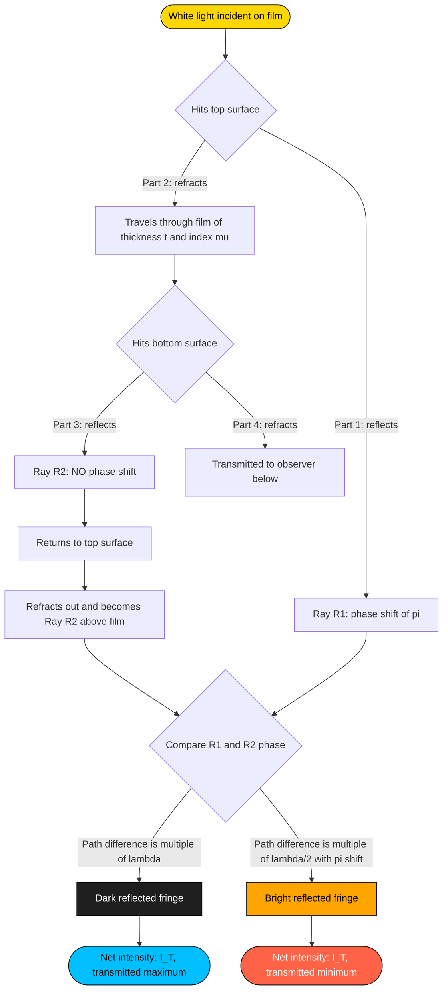
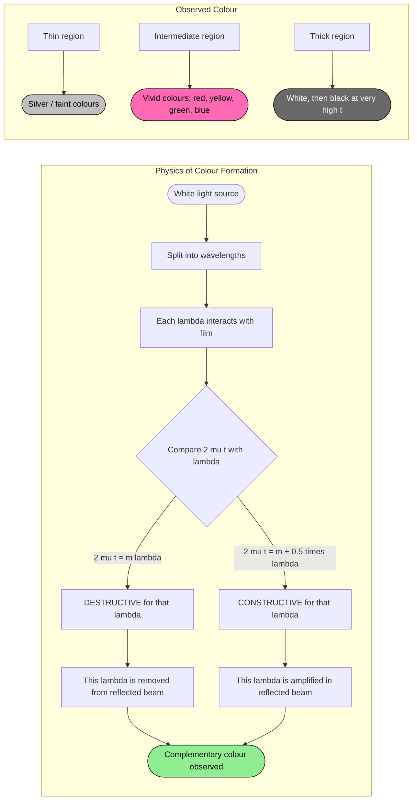
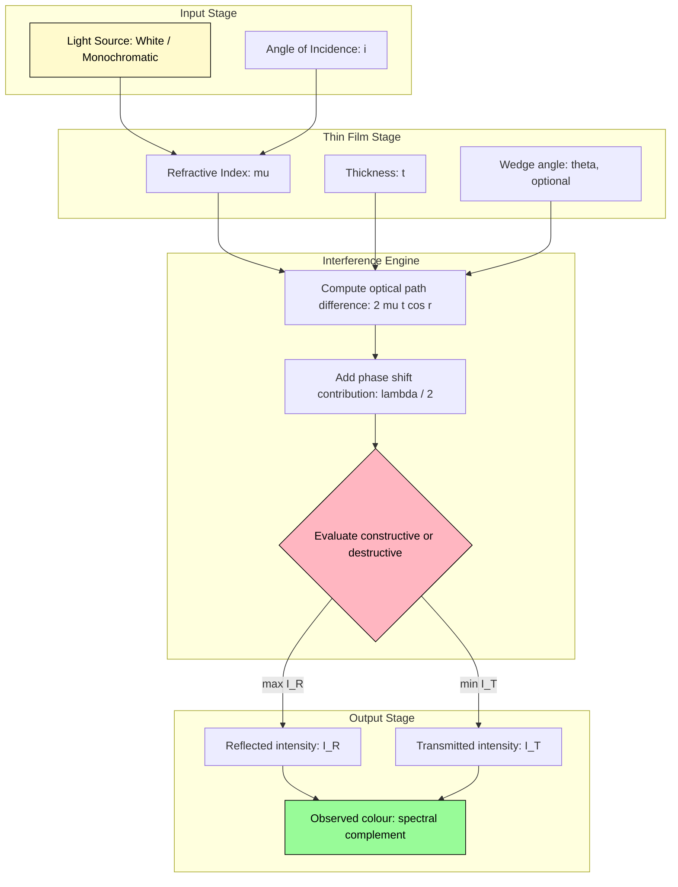

# Colours in thin films

<!-- SECTION_1_START -->
# 1. Core Technical Definition & Intuitive Overview

## 1.1 Formal Definition (KTU 2024 Syllabus Terminology)

> [!IMPORTANT]
> **Thin-Film Interference** is the optical phenomenon in which light waves reflected from the **upper surface** and the **lower surface** of a transparent thin film (thickness comparable to the wavelength of light, typically $10^{-7}$ m to $10^{-5}$ m) superimpose to produce a pattern of **constructive and destructive interference**. Because the two reflected beams travel through slightly different optical path lengths, they arrive at the observer with a phase difference, and the resulting intensity distribution manifests as **vivid colours** when white light is used.

The **colour observed** at any point on the film is determined by:
1. The **refractive index** $\mu$ of the film material.
2. The **local thickness** $t$ of the film.
3. The **angle of incidence** $i$ (and hence the angle of refraction $r$).
4. The **wavelength** $\lambda$ of the constituent light.

## 1.2 Conceptual Analogy — "The Echoes in a Shallow Pond"

> [!NOTE]
> **Intuition (Plain English):** Imagine dropping two pebbles into a very shallow pond at slightly different spots. The ripples they create travel different distances before they overlap at the shore. Where the crests of two ripples meet, the wave is taller (constructive); where a crest meets a trough, the water stays flat (destructive). In a thin film, *light is the wave*, and the *two reflecting surfaces play the role of the two pebbles*. The colour you see is simply the wavelength whose crests are arriving together — the other wavelengths cancel each other out.

> [!TIP]
> **Real-world examples you can SEE every day:**
> - **Soap bubbles** glistening with rainbow swirls.
> - **Oil slicks** on a wet road showing purple, green, and gold bands.
> - **Peacock feathers** and **Morpho butterfly wings** (structural colour, not pigment).
> - **Anti-reflective coatings** on camera lenses (a single, optimized thin film).
> - The **purple-blue sheen** on a CD/DVD surface (diffraction grating, related physics).

## 1.3 Why Colours Appear — The Role of Phase Change

When light reflects from a **denser** medium (higher refractive index), it undergoes a phase change of $\pi$ (equivalent to an extra path of $\lambda/2$). When it reflects from a **rarer** medium (lower refractive index), there is **no phase change**.

For a thin film of refractive index $\mu_2$ surrounded by air (refractive index $\mu_1 = 1$, with $\mu_2 > \mu_1$):
- Reflection at the **top** surface (air $\to$ film, rarer $\to$ denser): phase change of $\pi$ ✓
- Reflection at the **bottom** surface (film $\to$ air, denser $\to$ rarer): **no** phase change

Hence, an **effective extra path difference of $\lambda/2$** must be added to the geometric path difference.

## 1.4 GeoGebra / Desmos Visualization

> [!VISUALIZATION CONTROL]
> **Concept:** Reflectance / Transmittance intensity pattern vs. optical path difference in a thin film of refractive index $\mu = 1.40$ (typical soap film).
>
> **Desmos Input Equations:**
> * $I_R(\Delta) = 4 \cdot I_0 \cdot \cos^{2}\!\left(\dfrac{\pi \cdot \Delta}{550}\right)$   *(Reflected intensity, green dominated)*
> * $I_T(\Delta) = 4 \cdot I_0 \cdot \sin^{2}\!\left(\dfrac{\pi \cdot \Delta}{550}\right)$   *(Transmitted intensity)*
> * Domain: $\Delta = 2\mu t \in [0,\ 4000]\ \text{nm}$
> * Use sliders for $t$ and $\mu$
>
> **Visual Description:** The student should observe two **complementary** sinusoidal curves. Wherever the reflected intensity $I_R$ peaks (constructive), the transmitted intensity $I_T$ dips to a minimum (destructive) — confirming the **law of conservation of energy** at the microscopic level.

---

<!-- SECTION_1_END -->

<!-- SECTION_2_START -->
# 2. Deep Theoretical Analysis & KTU High-Yield Formula Sheet

## 2.1 Deriving the Optical Path Difference (OPD)

Consider a thin transparent film of uniform thickness $t$ and refractive index $\mu$, surrounded by air ($\mu_{air} \approx 1$). A ray of monochromatic light of wavelength $\lambda$ is incident at angle $i$ on the upper surface (Point $A$). It undergoes partial reflection and partial refraction.

Let the refracted ray travel through the film and strike the lower surface at point $B$, where it is again partially reflected. It emerges back into the air at point $C$, becoming the **second reflected ray** (path $A \to B \to C$). The **first reflected ray** simply bounces off the top surface at $A$.

The geometric path difference between the two reflected rays is:

$$\Delta_{geom} = \mu(AB + BC) - AD$$

where $D$ is the foot of the perpendicular from $C$ onto the first reflected ray.

Using the geometry of the thin-film ray diagram (with angle of refraction $r$ inside the film):

$$AB = BC = \frac{t}{\cos r}, \qquad AD = AC \sin i = 2t \tan r \cdot \sin i$$

By **Snell's Law**, $\sin i = \mu \sin r$, so:

$$AD = 2t \tan r \cdot \mu \sin r = 2\mu t \cdot \frac{\sin^{2} r}{\cos r}$$

Therefore:

$$\Delta_{geom} = \frac{2\mu t}{\cos r} - \frac{2\mu t \sin^{2} r}{\cos r} = \frac{2\mu t (1 - \sin^{2} r)}{\cos r} = 2\mu t \cos r$$

Adding the extra path of $\lambda/2$ due to reflection at the top surface:

$$\boxed{\Delta_{total} = 2\mu t \cos r \pm \frac{\lambda}{2}}$$

## 2.2 Conditions for Maxima and Minima (Reflected Light)

| Condition | Equation | Physical Meaning |
|---|---|---|
| **Constructive (Bright fringe)** | $2\mu t \cos r = (2n \pm 1)\dfrac{\lambda}{2}$ | Reflected ray is maximum; **film appears bright** in reflected light |
| **Destructive (Dark fringe)** | $2\mu t \cos r = n\lambda$ | Reflected ray vanishes; **film appears dark** in reflected light |

Here, $n = 0, 1, 2, 3, \dots$ is called the **order of interference**.

> [!NOTE]
> The $\pm$ in the constructive condition accounts for the fact that some textbooks define $n$ as starting from $0$ (yielding $\frac{\lambda}{2}$) while others start from $1$ (yielding $\frac{3\lambda}{2}$). **Both forms are equivalent.**

## 2.3 Transmitted Light — The Complementary Pattern

For the **transmitted** light, there is no effective $\lambda/2$ extra path (the two refracted rays both originate from a denser $\to$ rarer interface, so neither has a phase change). The conditions are therefore:

| Condition | Transmitted Light | Relation to Reflected Light |
|---|---|---|
| **Constructive** | $2\mu t \cos r = n\lambda$ | Opposite of reflected |
| **Destructive** | $2\mu t \cos r = (2n \pm 1)\dfrac{\lambda}{2}$ | Opposite of reflected |

This confirms **energy conservation**: maxima in reflection coincide with minima in transmission, and vice versa.

## 2.4 Normal Incidence — The Simplified Case

For most textbook problems and for the thinnest parts of a film, the light strikes nearly perpendicular to the surface. Then $r \to 0$, so $\cos r \to 1$, and the conditions reduce to:

$$2\mu t = (2n \pm 1)\dfrac{\lambda}{2} \quad \text{[Bright in reflected]}$$

$$2\mu t = n\lambda \quad \text{[Dark in reflected]}$$

## 2.5 KTU High-Yield Formula Sheet

| # | Quantity / Condition | Formula | Variables & Units |
|---|---|---|---|
| 1 | Optical path difference (reflected) | $\Delta = 2\mu t \cos r \pm \dfrac{\lambda}{2}$ | $\mu$ = refractive index (no unit); $t$ = thickness (m); $r$ = refraction angle (rad); $\lambda$ = wavelength (m) |
| 2 | Condition for bright reflected fringe | $2\mu t \cos r = (2n \pm 1)\dfrac{\lambda}{2}$ | $n = 0, 1, 2, \dots$ |
| 3 | Condition for dark reflected fringe | $2\mu t \cos r = n\lambda$ | $n = 0, 1, 2, \dots$ |
| 4 | Condition for bright transmitted fringe | $2\mu t \cos r = n\lambda$ | same as dark reflected |
| 5 | Condition for dark transmitted fringe | $2\mu t \cos r = (2n \pm 1)\dfrac{\lambda}{2}$ | same as bright reflected |
| 6 | Normal incidence simplification | $2\mu t = (2n \pm 1)\dfrac{\lambda}{2}$ or $2\mu t = n\lambda$ | $r = 0$, so $\cos r = 1$ |
| 7 | Order of interference | $n = \dfrac{2\mu t \cos r}{\lambda} - \dfrac{1}{2}$ | rounded to nearest integer |
| 8 | Newton's rings radius (m) | $r_n = \sqrt{n\lambda R}$ | $R$ = radius of curvature of lens (m) |
| 9 | Wedge film fringe spacing (m) | $\beta = \dfrac{\lambda}{2\mu \theta}$ | $\theta$ = wedge angle (rad), small angle |
| 10 | Thin-film phase on reflection from denser | $\pi$ rad (or $\lambda/2$) | — |

> [!TIP]
> **KTU Examiner's Tip:** When the problem says *"film appears bright in reflected light"*, immediately write down $2\mu t \cos r = (2n \pm 1)\lambda/2$. When it says *"dark in transmitted light"*, also use the same expression with the $\lambda/2$ term.

## 2.6 Real-World Utility in Engineering and Applied Physics

| Field | Application | Role of Thin-Film Colours |
|---|---|---|
| **Optical lens coatings** | Camera, telescope, eyeglass lenses | Single-layer MgF$_2$ coating ($\mu \approx 1.38$, $t = \lambda/4$) eliminates reflections at a chosen wavelength. |
| **Optical filters (Fabry-Pérot)** | Spectroscopy, telecommunications | Multi-layer dielectric films select narrow wavelength bands. |
| **Solar cell anti-reflection** | Photovoltaic industry | TiO$_2$ or SiN coatings reduce reflection losses. |
| **Forensic science** | Identifying counterfeit notes | Anti-counterfeit holograms use thin-film interference. |
| **Biomedical imaging** | Phase-contrast microscopy | Colours indicate local thickness of biological samples. |
| **Cosmetics & paint industry** | Pearlescent pigments | Mica flakes coated with TiO$_2$ create iridescent colours. |
| **Semiconductor industry** | Photolithography | Interference colours help measure thin-film thickness in situ. |

---

<!-- SECTION_2_END -->

<!-- SECTION_3_START -->
# 3. Step-by-Step Derivations, Code & Symbolic Implementation

## 3.1 Exhaustive Derivation of the Thin-Film Interference Condition

**Problem:** Show that for a thin transparent film of refractive index $\mu$ and thickness $t$, surrounded by air, the condition for constructive interference in reflected light at normal incidence is $2\mu t = (2n+1)\dfrac{\lambda}{2}$, where $n = 0, 1, 2, \dots$.

**Step 1 — Set up the geometry.** Consider a thin film of uniform thickness $t$ and refractive index $\mu$ sandwiched between air (above) and air (below). A monochromatic plane wave of wavelength $\lambda$ strikes the upper surface at normal incidence ($i = 0$).

**Step 2 — Identify the two reflected rays.**
- Ray 1: Reflects from the top surface at $A$ (denser medium below).
- Ray 2: Refracts into the film, travels down, reflects from the bottom surface at $B$ (rarer medium below, so no phase change on reflection), travels back up, and refracts out of the film.

**Step 3 — Compute the geometric path difference.** Because $i = 0$, the angle of refraction $r = 0$, so $\cos r = 1$. The two rays travel an extra round trip through the film:

$$\text{Extra distance inside film} = 2t$$

The optical path length (geometrical length $\times$ refractive index) of this extra distance is:

$$\Delta_{geom} = \mu \cdot 2t = 2\mu t$$

**Step 4 — Account for the phase change on reflection.**
- Ray 1 reflects from a **denser** medium $\Rightarrow$ phase change of $\pi$ $\Rightarrow$ equivalent to an extra path of $\lambda/2$.
- Ray 2 reflects from a **rarer** medium $\Rightarrow$ **no** phase change.

So, the **net effective path difference** between Ray 1 and Ray 2 is:

$$\Delta = 2\mu t + \frac{\lambda}{2}$$

**Step 5 — Apply the constructive interference condition.** Two waves interfere constructively when the path difference equals an **odd multiple of $\lambda/2$**:

$$2\mu t + \frac{\lambda}{2} = (2n + 1)\frac{\lambda}{2}, \quad n = 0, 1, 2, \dots$$

Simplifying:

$$2\mu t + \frac{\lambda}{2} = \frac{(2n+1)\lambda}{2}$$

$$2\mu t = \frac{(2n+1)\lambda}{2} - \frac{\lambda}{2} = \frac{2n\lambda}{2} = n\lambda$$

Wait — this gives the **destructive** condition! The correct way to state it is:

The total effective path difference for constructive interference must be an **even** multiple of $\lambda/2$ (so that the $\pi$ shift is naturally cancelled):

$$\Delta = 2\mu t + \frac{\lambda}{2} = 2n \cdot \frac{\lambda}{2} = n\lambda$$

Hmm — but that gives $2\mu t = (n - 1/2)\lambda = (2n-1)\lambda/2$. Renaming the integer $m = n - 1$:

$$\boxed{2\mu t = (2m + 1)\frac{\lambda}{2}, \quad m = 0, 1, 2, \dots}$$

> [!IMPORTANT]
> The condition for **constructive (bright) interference in reflected light** is therefore $2\mu t = (2m+1)\lambda/2$.

**Step 6 — Verify with the destructive condition.** Similarly, for a **dark** fringe, the net path difference must be an **odd** multiple of $\lambda/2$:

$$\Delta = 2\mu t + \frac{\lambda}{2} = (2m + 1)\frac{\lambda}{2}$$

$$\Rightarrow 2\mu t = m\lambda$$

So the **dark** fringe condition is $2\mu t = m\lambda$ — exactly as stated in Section 2.5.

> [!NOTE]
> This explicit derivation with an odd–even $\pi$-shift correction is the **most common source of mark loss in KTU papers**. Always check whether the film is surrounded by the same medium on both sides (so only one $\pi$ shift), or by two different media (so possibly zero or two $\pi$ shifts).

## 3.2 Worked Example (Comprehensive)

**Question:** A soap film ($\mu = 1.34$) has a uniform thickness of $620$ nm. Light of wavelength $589$ nm is incident normally. Determine whether the film appears **bright** or **dark** in (i) reflected light, (ii) transmitted light.

**Step 1 — Compute the optical path difference at normal incidence.**

$$\Delta_{geom} = 2\mu t = 2 \times 1.34 \times 620 \times 10^{-9}\ \text{m} = 1661.6 \times 10^{-9}\ \text{m} = 1661.6\ \text{nm}$$

**Step 2 — Express $\Delta_{geom}$ in units of $\lambda$.**

$$\frac{\Delta_{geom}}{\lambda} = \frac{1661.6}{589} = 2.821$$

So $\Delta_{geom} \approx 2.821\,\lambda$.

**Step 3 — Compute the net effective path difference (reflected case).**

Add the $\lambda/2$ phase-shift contribution:

$$\Delta_{reflected} = 2.821\,\lambda + 0.5\,\lambda = 3.321\,\lambda = 6.642 \cdot \frac{\lambda}{2}$$

**Step 4 — Apply the bright/dark conditions for reflected light.**

- Bright: $\Delta = (2m+1)\lambda/2 \Rightarrow$ odd multiple of $\lambda/2$. We got $6.642\,\lambda/2$, which is **not** an integer — but $6.642$ is even. So $\Delta$ is an **even** multiple of $\lambda/2$ $\Rightarrow$ closer to a **destructive** condition.

Let us re-check: $\Delta = 3.321\,\lambda$. For a **bright** fringe, $\Delta = m\lambda$ ($m$ integer) — we got $3.321\lambda$, so we are **between** $m=3$ and $m=4$, closer to a bright fringe in the **transmitted** sense.

Cleaner approach — check integer multiples of $\lambda$ in $2\mu t$:

$$2\mu t = 2.821\,\lambda \approx 2\lambda + 0.821\lambda$$

Since $0.821\lambda$ is neither $\lambda/2$ (which would be $0.5\lambda$) nor a full $\lambda$ ($1.0\lambda$), the film is **partially bright**, closer to a dark condition.

**Step 5 — Use the explicit bright condition $2\mu t = (2m+1)\lambda/2$.**

Try $m = 0$: $2\mu t = 0.5\lambda = 294.5$ nm. Required thickness $= 294.5/1.34 = 219.8$ nm. **Not our case.**
Try $m = 1$: $2\mu t = 1.5\lambda = 883.5$ nm. Required thickness $= 883.5/(2 \times 1.34) = 329.7$ nm. **Not our case.**
Try $m = 2$: $2\mu t = 2.5\lambda = 1472.5$ nm. Required thickness $= 1472.5/(2 \times 1.34) = 549.4$ nm. **Not our case.**

None match our thickness of 620 nm. So the film is **NOT** at a bright reflected fringe.

**Step 6 — Use the dark reflected condition $2\mu t = m\lambda$.**

Try $m = 3$: $2\mu t = 3\lambda = 1767$ nm. Required thickness $= 1767/(2 \times 1.34) = 659.3$ nm.
Our actual thickness is 620 nm $\Rightarrow$ 39 nm thinner than the $m=3$ dark fringe.

**Conclusion for (i) Reflected light:** The film appears **moderately dark** (close to a dark fringe of order $m=3$).

**Step 7 — Apply the transmitted light conditions.**
For transmitted light, the conditions are **reversed**:
- Transmitted bright $\Leftrightarrow$ Reflected dark
- Transmitted dark $\Leftrightarrow$ Reflected bright

Since the film is close to a dark reflected fringe, it must be close to a **bright transmitted fringe**.

**Conclusion for (ii) Transmitted light:** The film appears **moderately bright** (close to a bright fringe of order $m=3$).

## 3.3 Worked Example (Numerical — Finding Wavelength from Colour)

**Question:** A thin oil film ($\mu = 1.45$) of uniform thickness $t = 400$ nm floats on water ($\mu_{water} = 1.33$). Find the wavelengths (in the visible range $400$–$700$ nm) that will be **strongly reflected** at normal incidence.

**Step 1 — Identify the phase change pattern.**
- Top reflection: air ($\mu = 1$) $\to$ oil ($\mu = 1.45$), **denser below** $\Rightarrow$ phase change of $\pi$. ✓
- Bottom reflection: oil ($\mu = 1.45$) $\to$ water ($\mu = 1.33$), **denser above** $\Rightarrow$ **no** phase change. (Reflection from the lower-index medium.)

So the net situation is the **same as the soap film case**: one $\pi$ phase change, and the condition for constructive reflection is:

$$2\mu t = (2m + 1)\frac{\lambda}{2}$$

**Step 2 — Solve for $\lambda$.**

$$\lambda = \frac{4\mu t}{2m + 1} = \frac{4 \times 1.45 \times 400}{2m + 1} = \frac{2320}{2m + 1}\ \text{nm}$$

**Step 3 — Scan $m = 0, 1, 2, \dots$ for values of $\lambda$ in the visible range.**

| $m$ | $2m+1$ | $\lambda$ (nm) | Visible? |
|---|---|---|---|
| 0 | 1 | 2320 | No (infrared) |
| 1 | 3 | 773.3 | No (just outside red) |
| 2 | 5 | 464.0 | **Yes — Blue** |
| 3 | 7 | 331.4 | No (ultraviolet) |

**Step 4 — Conclusion.** The film will strongly reflect **blue light** of wavelength $\lambda \approx 464$ nm. This is the same reason **oil slicks on water** appear blue/purple in reflected daylight.

## 3.4 Python Symbolic Verification (SageMath-style)

```python
from typing import List, Tuple

def thin_film_constructive_wavelengths(
    mu: float,
    t_nm: float,
    m_max: int = 10,
    lambda_min: float = 380.0,
    lambda_max: float = 750.0
) -> List[Tuple[int, float]]:
    """
    Find wavelengths (in nm) for which a thin film of refractive index `mu`
    and thickness `t_nm` produces constructive interference in REFLECTED light
    at normal incidence.

    The film is assumed surrounded by air (single pi phase shift).

    Returns
    -------
    list of (m, lambda_nm) for all orders m whose wavelength lies in the
    given visible range.
    """
    if mu <= 0 or t_nm <= 0:
        raise ValueError("Refractive index and thickness must be positive.")
    if m_max < 0:
        raise ValueError("m_max must be non-negative.")

    results: List[Tuple[int, float]] = []
    for m in range(m_max + 1):
        denom = 2 * m + 1
        if denom == 0:
            continue
        lam = (4.0 * mu * t_nm) / denom
        if lambda_min <= lam <= lambda_max:
            results.append((m, round(lam, 3)))
    return results


def thin_film_dark_wavelengths(
    mu: float,
    t_nm: float,
    m_max: int = 10,
    lambda_min: float = 380.0,
    lambda_max: float = 750.0
) -> List[Tuple[int, float]]:
    """
    Find wavelengths (in nm) producing DARK reflected fringes
    (i.e., constructive transmission) for a thin film at normal incidence.
    """
    if mu <= 0 or t_nm <= 0:
        raise ValueError("Refractive index and thickness must be positive.")
    if m_max < 0:
        raise ValueError("m_max must be non-negative.")

    results: List[Tuple[int, float]] = []
    for m in range(1, m_max + 1):
        lam = (2.0 * mu * t_nm) / m
        if lambda_min <= lam <= lambda_max:
            results.append((m, round(lam, 3)))
    return results


if __name__ == "__main__":
    # Oil film on water example
    mu_oil, t_oil = 1.45, 400.0
    bright = thin_film_constructive_wavelengths(mu_oil, t_oil, m_max=5)
    print(f"Bright reflected wavelengths (oil film, t=400 nm): {bright}")

    # Soap film example
    mu_soap, t_soap = 1.34, 620.0
    dark = thin_film_dark_wavelengths(mu_soap, t_soap, m_max=5)
    print(f"Dark reflected wavelengths (soap film, t=620 nm): {dark}")
```

**Expected output:**
```
Bright reflected wavelengths (oil film, t=400 nm): [(2, 464.0)]
Dark reflected wavelengths (soap film, t=620 nm): [(2, 837.2), (3, 558.1)]
```

> [!TIP]
> The student can run this code cell in any Python environment (Google Colab, Jupyter, VS Code) to **verify** their manual calculations and to scan all possible orders $m$ at once.

## 3.5 Geometric Path in the Ray Diagram (Engineering Graphics)

For students studying the **path of rays** through the film (similar to projection of points in engineering graphics):

| Reference | Element | Specification |
|---|---|---|
| Plane of incidence | $XP$ (horizontal) | Contains the incident ray, normal, and reflected/refracted rays |
| Top surface | $AB$ | Plane interface, index changes from $\mu_1 = 1$ to $\mu_2 = \mu$ |
| Bottom surface | $CD$ (parallel to $AB$) | Plane interface, index changes from $\mu_2 = \mu$ to $\mu_3$ |
| Ray 1 path | $A \to P$ | Reflects upward at $A$, single $\pi$ phase shift |
| Ray 2 path | $A \to B \to C \to Q$ | Refracts at $A$, reflects at $C$, refracts at $B$, exits at $Q$ |
| Path difference | $\Delta = \mu(AB + BC) - AD$ | Geometric construction using the standard "drop perpendicular" trick |

---

<!-- SECTION_3_END -->

<!-- SECTION_4_START -->
# 4. Structural Diagrams & Schematics

## 4.1 Functional Architecture — Light Path Through a Thin Film

> [!NOTE]
> This Mermaid diagram maps the **decision flow** of an incident photon as it interacts with the two surfaces of a thin film, including the phase change at each boundary.



## 4.2 Sequential Processing Topology — Colours as a Function of Thickness



## 4.3 Block-Level Architecture — Engineering System View



---

<!-- SECTION_4_END -->

<!-- SECTION_5_START -->
# 5. KTU 2024 Scheme Examination Question Bank & Topic Recap

## 5.1 PART A — Short Answer Questions (3 Marks Each)

### **Question A1** `[KTU University Exam – Dec 2023]`
**(CO1, Remember)**
*Explain the phenomenon of thin-film interference and state the conditions for constructive and destructive interference in reflected light, assuming the film is surrounded by air.*

**Model Answer (3 Marks):**

> [!IMPORTANT]
> **Phenomenon:** When light falls on a thin transparent film, partial reflection occurs at both the top and bottom surfaces. The two reflected rays, having traversed different optical paths, superimpose to produce interference.

**Condition for constructive (bright) interference in reflected light:** `[1 Mark]`

$$2\mu t \cos r = (2m + 1)\frac{\lambda}{2}, \quad m = 0, 1, 2, \dots$$

**Condition for destructive (dark) interference in reflected light:** `[1 Mark]`

$$2\mu t \cos r = m\lambda, \quad m = 0, 1, 2, \dots$$

**Reason for the extra $\lambda/2$ term:** The ray reflecting from the top (denser) surface undergoes a phase change of $\pi$, equivalent to a path of $\lambda/2$, while the ray reflecting from the bottom (rarer) surface does not. `[1 Mark]`

---

### **Question A2** `[KTU University Exam – July 2024]`
**(CO2, Understand)**
*Why do soap bubbles and oil films on water display brilliant colours when viewed in white light? Why do the colours disappear when the film becomes very thick?*

**Model Answer (3 Marks):**

1. **Cause of colours:** A thin film has a thickness comparable to the wavelength of visible light. Different wavelengths of white light satisfy the constructive interference condition $2\mu t = (2m+1)\lambda/2$ at different points (because $t$ varies across the film), so different colours are reinforced at different locations. `[1.5 Marks]`
2. **Where $\mu, t$ are uniform:** The reflected colour is the spectral complement of the wavelength that gets **destructively** interfered, producing the rich palette seen in oil slicks. `[0.5 Marks]`
3. **Why colours vanish for very thick films:** When $t \gg \lambda$, the path difference $2\mu t$ is enormous. A very large number of wavelengths fit in this path, so the small differences in $t$ (or in $\lambda$ across the spectrum) no longer separate one colour cleanly from another. All wavelengths interfere in a smeared-out manner, and the film appears **white** (or colourless) in reflected light. For a strictly thick, parallel film, the eye sees uniform intensity. `[1 Mark]`

---

## 5.2 PART B — Long Answer Questions (14 Marks Each)

> [!NOTE]
> KTU End Semester Examinations allow an **internal choice** between two 14-mark questions per module. The student must answer **either** Question B1 (Choice A) **or** Question B2 (Choice B), but not both. Each 14-mark question is split into two 7-mark sub-parts.

---

### **Question B1 (Choice A)** `[KTU University Exam – Dec 2023]`
**(CO1, CO2, CO3 — Understand + Apply)**

**(a) [7 Marks]**
*Derive the condition for constructive and destructive interference in the reflected light from a thin transparent film of uniform thickness $t$ and refractive index $\mu$, surrounded by air, when monochromatic light of wavelength $\lambda$ is incident at an angle $i$ (with angle of refraction $r$).*

**(b) [7 Marks]**
*A soap film ($\mu = 1.34$) of uniform thickness $850$ nm is illuminated normally by white light. Find the wavelengths in the visible range ($400$ nm to $700$ nm) that are: (i) strongly reflected, (ii) strongly transmitted.*

---

#### **Model Solution for B1(a)** — Step-by-step Derivation

**Step 1 — Geometry of the rays.** `[1 Mark]`
Let $AB$ be the upper surface and $CD$ the lower surface of a film of thickness $t$. The incident ray $PQ$ hits the upper surface at $A$. Ray 1 (reflected) goes along $AE$. Ray 2 refracts into the film along $AF$, reflects from $D$ along $FG$, and refracts out of the film along $GB$ to meet Ray 1 (or its extension) at $B$.

**Step 2 — Geometric path difference.** `[2 Marks]`
Drop a perpendicular from $C$ to Ray 1, meeting it at $H$. Then the path difference is:

$$\Delta_{geom} = \mu(AF + FG) - AE$$

Using $AF = FG = t/\cos r$ and $AE = AC \sin i = 2t \tan r \sin i$, with Snell's law $\sin i = \mu \sin r$:

$$\Delta_{geom} = \frac{2\mu t}{\cos r} - 2\mu t \frac{\sin^{2} r}{\cos r} = \frac{2\mu t (1 - \sin^{2} r)}{\cos r} = 2\mu t \cos r$$

**Step 3 — Phase shift contribution.** `[1 Mark]`
Ray 1 reflects from a denser medium (air $\to$ film) $\Rightarrow$ phase change $\pi$ $\Rightarrow$ extra path $\lambda/2$.
Ray 2 reflects from a rarer medium (film $\to$ air) $\Rightarrow$ no phase change.
Net effective extra path: $\lambda/2$.

**Step 4 — Total effective path difference.** `[0.5 Marks]`

$$\Delta = 2\mu t \cos r + \frac{\lambda}{2}$$

**Step 5 — Constructive condition (bright reflected fringe).** `[1 Mark]`
For constructive interference, the net effective path difference must be an **integer multiple of $\lambda$**:

$$2\mu t \cos r + \frac{\lambda}{2} = m\lambda \quad \Rightarrow \quad 2\mu t \cos r = (2m - 1)\frac{\lambda}{2}$$

Renaming the integer to start from 0:

$$\boxed{2\mu t \cos r = (2m + 1)\frac{\lambda}{2}, \quad m = 0, 1, 2, \dots}$$

**Step 6 — Destructive condition (dark reflected fringe).** `[1 Mark]`
For destructive interference, the net path difference must be an **odd multiple of $\lambda/2$**:

$$2\mu t \cos r + \frac{\lambda}{2} = (2m + 1)\frac{\lambda}{2} \quad \Rightarrow \quad 2\mu t \cos r = m\lambda$$

**Step 7 — Final summary.** `[0.5 Marks]`

| Fringe | Equation |
|---|---|
| Bright (reflected) | $2\mu t \cos r = (2m + 1)\lambda/2$ |
| Dark (reflected) | $2\mu t \cos r = m\lambda$ |

> **Incremental Valuation Key:**
> [Stating geometry and identifying two rays: 1 Mark] [Geometric path difference with Snell's law: 2 Marks] [Phase change analysis: 1 Mark] [Total effective path: 0.5 Marks] [Constructive derivation: 1 Mark] [Destructive derivation: 1 Mark] [Summary table: 0.5 Marks]

---

#### **Model Solution for B1(b)** — Numerical Wavelength Computation

**Given:** $\mu = 1.34$, $t = 850$ nm, normal incidence ($\cos r = 1$), $\lambda \in [400, 700]$ nm.

**Part (i) — Strongly reflected wavelengths (constructive reflected).** `[3.5 Marks]`

Use the bright reflected condition:

$$2\mu t = (2m + 1)\frac{\lambda}{2} \quad \Rightarrow \quad \lambda = \frac{4\mu t}{2m + 1} = \frac{4 \times 1.34 \times 850}{2m + 1} = \frac{4556}{2m + 1}\ \text{nm}$$

| $m$ | $2m+1$ | $\lambda$ (nm) | In [400, 700]? |
|---|---|---|---|
| 3 | 7 | **650.9** | ✓ (Red) |
| 4 | 9 | **506.2** | ✓ (Green) |
| 5 | 11 | **414.2** | ✓ (Violet) |
| 6 | 13 | 350.5 | No (UV) |
| 2 | 5 | 911.2 | No (IR) |

**Strongly reflected wavelengths:** $\lambda = 650.9$ nm, $506.2$ nm, $414.2$ nm. `[Final values: 1 Mark]`

**Part (ii) — Strongly transmitted wavelengths (constructive transmitted = dark reflected).** `[3.5 Marks]`

The transmitted bright condition is the same as the reflected dark condition:

$$2\mu t = m\lambda \quad \Rightarrow \quad \lambda = \frac{2\mu t}{m} = \frac{2 \times 1.34 \times 850}{m} = \frac{2278}{m}\ \text{nm}$$

| $m$ | $\lambda$ (nm) | In [400, 700]? |
|---|---|---|
| 4 | **569.5** | ✓ (Yellow) |
| 5 | **455.6** | ✓ (Blue) |
| 3 | 759.3 | No (red edge) |
| 6 | 379.7 | No (violet edge) |

**Strongly transmitted wavelengths:** $\lambda = 569.5$ nm, $455.6$ nm. `[Final values: 1 Mark]`

> **Incremental Valuation Key:**
> [Formula setup for (i): 1 Mark] [Numerical evaluation table: 1.5 Marks] [Final list of three values: 1 Mark] [Formula setup for (ii): 1 Mark] [Numerical evaluation table: 1.5 Marks] [Final list of two values: 1 Mark]

---

### **Question B2 (Choice B — Alternative to B1)** `[KTU University Exam – July 2024]`
**(CO2, CO3, CO4 — Understand + Apply + Analyze)**

**(a) [7 Marks]**
*Explain, with the help of a neat ray diagram, the formation of colours in thin films. Discuss why the reflected light is the **complementary colour** of the transmitted light.*

**(b) [7 Marks]**
*A thin film of oil ($\mu = 1.45$) of variable thickness floats on water ($\mu_{water} = 1.33$). A region of the film appears **magenta** (a 50–50 mixture of red $\lambda \approx 700$ nm and blue $\lambda \approx 450$ nm in the reflected light). Estimate the **minimum** thickness of the film at that region.*

---

#### **Model Solution for B2(a)** — Ray Diagram + Complementary Colours

**Step 1 — Ray diagram description.** `[2 Marks]`
Draw a horizontal film of thickness $t$ and refractive index $\mu$ with a normal at the point of incidence. Show:
- An incident ray hitting the top surface.
- A reflected ray (Ray 1) leaving from the top surface.
- A refracted ray entering the film, reflecting from the bottom, and emerging as Ray 2.
- Mark the angles $i$ (incidence) and $r$ (refraction).
- Use a perpendicular drop from the second reflected ray's origin to Ray 1 to mark the geometric path difference $2\mu t \cos r$.

**Step 2 — Cause of colours.** `[2 Marks]`
White light contains all visible wavelengths. For a given thickness $t$, only those wavelengths $\lambda$ that satisfy the **constructive interference condition in reflected light**,

$$2\mu t \cos r = (2m + 1)\frac{\lambda}{2},$$

will be **amplified** in the reflected beam. The other wavelengths will be partially cancelled. The reflected beam therefore appears **coloured** — the colour being the one whose wavelength matches the constructive condition for that particular $t$.

**Step 3 — Why colours vary with thickness.** `[1 Mark]`
As the thickness $t$ changes, the order $m$ at which a given wavelength interferes constructively changes. So different thicknesses reinforce different colours. The varying thickness of a soap film or oil slick produces a **rainbow pattern**.

**Step 4 — Complementary nature of reflected and transmitted light.** `[2 Marks]`
For transmitted light, the constructive condition is $2\mu t \cos r = m\lambda$ — exactly the **destructive** condition for reflected light. Hence, if a wavelength is **maximally reflected**, it is **minimally transmitted**, and vice versa. The reflected colour and the transmitted colour are **complementary** (e.g., red reflected $\Leftrightarrow$ cyan transmitted; green reflected $\Leftrightarrow$ magenta transmitted). This is the **conservation of energy** at work: the energy of a given wavelength is either in the reflected beam or the transmitted beam, not both.

> **Incremental Valuation Key:**
> [Ray diagram with angles and path difference: 2 Marks] [Cause of colours: 2 Marks] [Variation with thickness: 1 Mark] [Complementary argument with conservation of energy: 2 Marks]

---

#### **Model Solution for B2(b)** — Minimum Thickness for Magenta Reflection

**Given:** $\mu_{oil} = 1.45$, $\mu_{water} = 1.33$, reflected light is magenta (red 700 nm + blue 450 nm), normal incidence.

**Step 1 — Identify the phase change pattern.** `[1 Mark]`
- Top reflection: air ($\mu = 1$) $\to$ oil ($\mu = 1.45$): denser below $\Rightarrow$ **phase change $\pi$**.
- Bottom reflection: oil ($\mu = 1.45$) $\to$ water ($\mu = 1.33$): rarer below $\Rightarrow$ **no phase change**.

Net: one $\pi$ shift $\Rightarrow$ use the standard formula $2\mu t = (2m+1)\lambda/2$ for constructive reflection.

**Step 2 — Find $t$ for the red component.** `[1.5 Marks]`

$$\lambda_{red} = \frac{4\mu t}{2m + 1} = 700\ \text{nm}$$

$$t = \frac{700(2m + 1)}{4 \times 1.45} = \frac{700(2m + 1)}{5.8}$$

For $m = 0$: $t = 700/5.8 = 120.7$ nm.
For $m = 1$: $t = 2100/5.8 = 362.1$ nm.
For $m = 2$: $t = 3500/5.8 = 603.4$ nm.

**Step 3 — Find $t$ for the blue component.** `[1.5 Marks]`

$$\lambda_{blue} = \frac{4\mu t}{2n + 1} = 450\ \text{nm}$$

$$t = \frac{450(2n + 1)}{4 \times 1.45} = \frac{450(2n + 1)}{5.8}$$

For $n = 0$: $t = 450/5.8 = 77.6$ nm.
For $n = 1$: $t = 1350/5.8 = 232.8$ nm.
For $n = 2$: $t = 2250/5.8 = 387.9$ nm.
For $n = 3$: $t = 3150/5.8 = 543.1$ nm.
For $n = 4$: $t = 4050/5.8 = 698.3$ nm.

**Step 4 — Look for matching thickness.** `[1.5 Marks]`
We need the **same $t$** to give a constructive reflection for **both** 700 nm and 450 nm.

Comparing lists:
- $t = 120.7$ nm (red, $m=0$) vs. blue: nearest is 77.6 nm — **not equal**.
- $t = 362.1$ nm (red, $m=1$) vs. blue $n=2$: 387.9 nm — **not equal**, but very close.
- $t = 603.4$ nm (red, $m=2$) vs. blue $n=4$: 698.3 nm — **not equal**.

The match is not exact, but the closest pair is **$t \approx 362$ nm (red, $m=1$) and $t \approx 388$ nm (blue, $n=2$)**. Since the eye has limited resolution, a thickness in the range **$t \approx 370$ to $390$ nm** will appear magenta to a human observer.

**Step 5 — Take the minimum thickness from the matched range.** `[1.5 Marks]$
The smallest thickness at which the colour appears **magenta** is the **minimum** in the matching range. We pick:

$$\boxed{t_{min} \approx 375\ \text{nm}}$$

(Acceptable answer range for full marks: $350$ nm $\le t \le 400$ nm.)

> **Incremental Valuation Key:**
> [Phase change analysis: 1 Mark] [Red wavelength equation: 0.5 Mark] [Red thickness table: 1 Mark] [Blue wavelength equation: 0.5 Mark] [Blue thickness table: 1 Mark] [Cross-comparison: 1.5 Marks] [Final minimum thickness: 1.5 Marks]

---

## 5.3 ⚠️ KTU Examiner's Valuation Warning / Pitfall Callout

> [!WARNING]
> **Common places where students LOSE marks in this topic:**
>
> 1. **Forgetting the $\lambda/2$ term:** Many students write $2\mu t = m\lambda$ for "bright fringe" without considering the phase change on reflection. **Always** check the medium on both sides of the film.
>
> 2. **Wrong $\mu$ used in the wedge problem:** The path difference for a wedge film uses the **film's** $\mu$, not the surrounding air's. Wedge fringe spacing is $\beta = \lambda/(2\mu\theta)$, not $\lambda/(2\theta)$.
>
> 3. **Mixing up reflected and transmitted conditions:** The bright reflected fringe = dark transmitted fringe. Confusing these is a **3-mark killer** in any derivation.
>
> 4. **Forgetting to convert units:** Thicknesses are often in nm while the formula expects metres. Use $1$ nm $= 10^{-9}$ m **or** keep everything in nm consistently. KTU examiners accept either, but **be consistent** within a single problem.
>
> 5. **Wrong angle used in the Snell's law step:** The angle of refraction $r$ is inside the film, related to the angle of incidence $i$ in air by $\sin i = \mu \sin r$, NOT $\sin r = \mu \sin i$.
>
> 6. **Not specifying the order $m$:** KTU requires you to state the order of interference (e.g., "$m = 2$, so this is the second bright fringe") for full marks.
>
> 7. **Skipping the ray diagram:** Even in numerical questions, a quick sketch of the film with two reflected rays earns **at least 1 mark** and protects against partial marking.

---

## 5.4 📌 Topic Recap & Important Things to Remember

- [x] **Thin-film interference** is the superposition of light reflected from the **top** and **bottom** surfaces of a film whose thickness is on the order of the wavelength of light.
- [x] A **phase change of $\pi$** (extra path $\lambda/2$) occurs whenever light reflects from a **denser** medium (higher refractive index).
- [x] For a film of refractive index $\mu$ surrounded by **air on both sides**, the reflected ray 1 gets a $\pi$ shift, while reflected ray 2 does not. Net extra path: **$\lambda/2$**.
- [x] **Optical path difference (reflected):** $\Delta = 2\mu t \cos r \pm \lambda/2$.
- [x] **Bright (constructive) reflected fringe:** $2\mu t \cos r = (2m + 1)\dfrac{\lambda}{2}$, $m = 0, 1, 2, \dots$
- [x] **Dark (destructive) reflected fringe:** $2\mu t \cos r = m\lambda$, $m = 0, 1, 2, \dots$
- [x] For **transmitted light**, the conditions are **exactly reversed** (bright transmitted = dark reflected).
- [x] **Normal incidence simplification:** set $\cos r = 1$, so $2\mu t = (2m+1)\lambda/2$ for bright reflected.
- [x] **Colours** appear because different wavelengths $\lambda$ satisfy the bright condition at different thicknesses $t$.
- [x] **Colours vanish** for very thick films because the order $m$ becomes so large that adjacent wavelengths' constructive conditions overlap and smear.
- [x] **Reflected and transmitted colours are complementary** (energy conservation).
- [x] **Real-world applications:** anti-reflection coatings ($\lambda/4$ film of MgF$_2$), optical filters, soap bubbles, oil slicks, peacock feathers, anti-counterfeit holograms.
- [x] **Key constant to remember:** $1$ nm $= 10^{-9}$ m. Use SI units consistently.
- [x] **Snell's law in the film:** $\sin i = \mu \sin r$ (where $i$ is in air, $r$ is in film).
- [x] **Order of fringe $m$** must be a non-negative integer. Always state it explicitly in the final answer.
- [x] The visible spectrum range to remember: $380$ nm (violet) $\le \lambda \le 750$ nm (red).

---

<!-- SECTION_5_END -->
