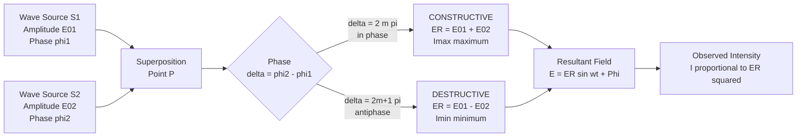
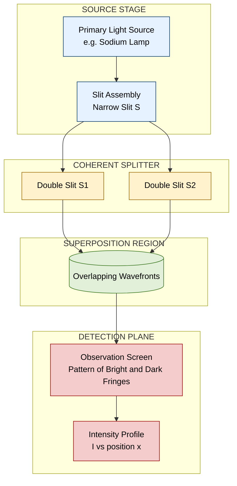
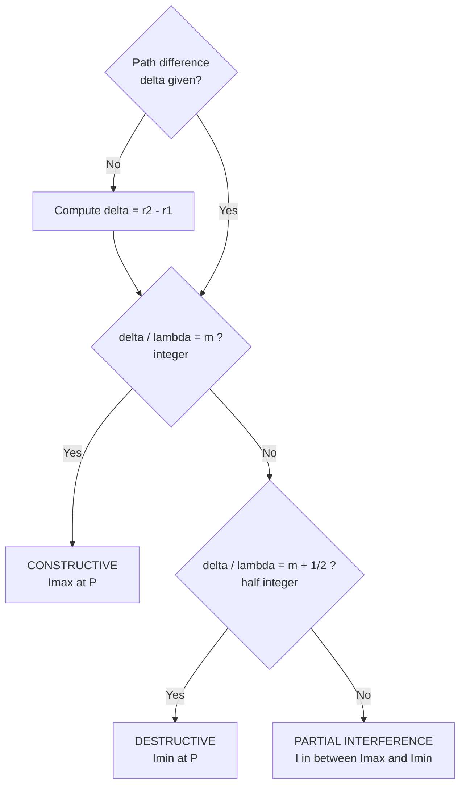
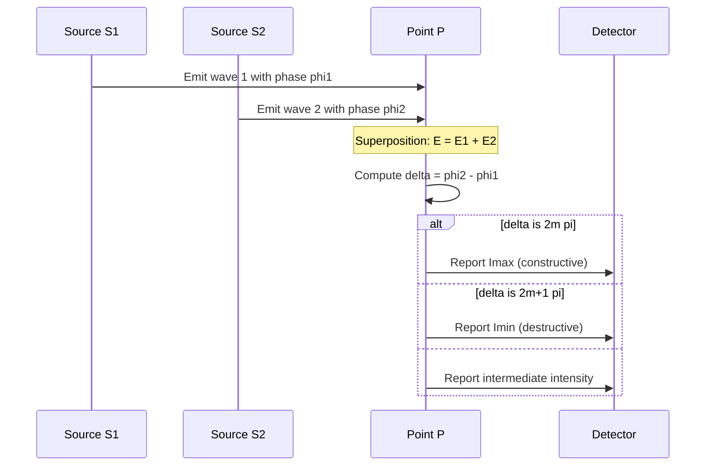

# Constructive and destructive interference

<!-- SECTION_1_START -->

# Constructive and Destructive Interference

> [!IMPORTANT]
> **KTU 2024 Scheme | GZPHT121 | Module 2 — Interference and Diffraction**
> This section establishes the foundational definitions, physical conditions, and intuitive geometric picture of interference required for the End Semester Evaluation (ESE).

## 1.1 Formal Academic Definition

**Interference** is the physical phenomenon that occurs when two or more **coherent waves** (waves having a constant phase relationship and identical frequency) superimpose in a region of space, producing a **redistribution of energy** in the form of alternating regions of high and low resultant intensity.

Mathematically, interference is a direct consequence of the **Principle of Superposition**, which states that the resultant displacement $y$ at any point and at any instant equals the vector sum of the individual displacements produced by each wave acting alone.

$$y = y_1 + y_2 + y_3 + \cdots + y_n$$

Two principal outcomes of interference are formally classified as:

- **Constructive Interference**: Waves arrive **in phase**, their amplitudes add, producing a resultant of maximum amplitude. The optical path difference is an integer multiple of the wavelength.
- **Destructive Interference**: Waves arrive **completely out of phase** (antiphase, i.e., $180^\circ$ or $\pi$ radians), their amplitudes cancel, producing a resultant of minimum (ideally zero) amplitude. The optical path difference is a half-integer multiple of the wavelength.

> [!NOTE]
> **Syllabus Highlight:** Interference is a **purely wave phenomenon**. It cannot be explained by the corpuscular (particle) theory of light. Demonstrating interference was historically the decisive experiment confirming the wave nature of light (Young's double-slit experiment, 1801).

## 1.2 Intuitive Real-World Analogy

Imagine two identical pebbles dropped simultaneously into a still pond at two points very close to each other:

- Where the **crests** of the ripples from both pebbles meet, a **tall crest** forms (constructive interference).
- Where a **crest** from one pebble meets a **trough** from the other, the water surface momentarily **stays flat** (destructive interference).
- A stationary pattern of alternating calm and agitated circular bands spreads outward — this visual pattern is precisely the same mathematics that describes light interference on a screen.

A second everyday analogy is **noise-cancelling headphones**: a microphone captures ambient sound, the device generates a wave exactly **inverted** (antiphase) to it, and the two sound waves destructively interfere in your ears, producing silence.

## 1.3 Core Physical Constants and Standard Metrics

| Quantity | Symbol | Standard Value / Unit |
|---|---|---|
| Speed of light in vacuum | $c$ | $2.998 \times 10^{8}\ \mathrm{m/s}$ |
| Threshold of human hearing | $I_0$ | $10^{-12}\ \mathrm{W/m^2}$ |
| Visible spectrum range | $\lambda$ | $400\ \mathrm{nm}$ to $700\ \mathrm{nm}$ |
| Phase shift for antiphase | $\Delta\phi$ | $\pi\ \mathrm{rad}\ (180^\circ)$ |

## 1.4 The Sine Wave Representation of a Light Wave

A plane monochromatic light wave propagating along the positive $x$-direction is mathematically expressed as:

$$E(x,t) = E_0 \sin(kx - \omega t + \phi)$$

where $E_0$ is the **amplitude** of the electric field, $k = \dfrac{2\pi}{\lambda}$ is the **angular wave number**, $\omega = 2\pi \nu$ is the **angular frequency**, and $\phi$ is the **initial phase constant**.

> [!VISUALIZATION CONTROL]
> **Concept:** Two coherent waves and their resultant sum (Mermaid + text geometry).
> **Plot Equations for Desmos / GeoGebra:**
> * `y1 = sin(2*pi*x - 0.5)` (Wave 1)
> * `y2 = sin(2*pi*x + 0.5)` (Wave 2, phase shifted)
> * `y3 = y1 + y2` (Resultant: a wave of larger amplitude at every $x$)
> **What to Observe:** When you change the constant from $+0.5$ to $\pi - 0.5$, the resultant `y3` collapses toward zero — visually confirming the transition from constructive to destructive interference.

<!-- SECTION_1_END -->

<!-- SECTION_2_START -->

# Deep Theoretical Analysis and KTU High-Yield Formula Sheet

## 2.1 The Superposition Principle in Detail

When two coherent waves travelling in the same direction with amplitudes $E_{01}$ and $E_{02}$, angular frequency $\omega$, and phase constants $\phi_1$ and $\phi_2$ meet at a point, the instantaneous electric fields are:

$$E_1 = E_{01} \sin(\omega t + \phi_1)$$
$$E_2 = E_{02} \sin(\omega t + \phi_2)$$

The resultant electric field is:

$$E = E_1 + E_2 = E_{01} \sin(\omega t + \phi_1) + E_{02} \sin(\omega t + \phi_2)$$

Using the **phasor (complex exponential) method**, this sum can be expressed as a single equivalent sinusoid:

$$E = E_R \sin(\omega t + \Phi)$$

where the resultant amplitude $E_R$ and resultant phase $\Phi$ are:

$$E_R = \sqrt{E_{01}^{2} + E_{02}^{2} + 2 E_{01} E_{02} \cos(\phi_2 - \phi_1)}$$

$$\tan \Phi = \frac{E_{01} \sin \phi_1 + E_{02} \sin \phi_2}{E_{01} \cos \phi_1 + E_{02} \cos \phi_2}$$

Since **irradiance (intensity) is proportional to the square of the amplitude**, $I \propto E_R^{2}$:

$$I = I_1 + I_2 + 2\sqrt{I_1 I_2} \cos \delta$$

where $\delta = \phi_2 - \phi_1$ is the **phase difference**.

## 2.2 Path Difference and Phase Difference

The **path difference** $\Delta$ and the corresponding **phase difference** $\delta$ are linked through the wavelength $\lambda$ and the refractive index $n$ of the medium:

$$\delta = \frac{2\pi}{\lambda} \cdot \Delta \quad \text{and} \quad \Delta = n \cdot \Delta x$$

where $\Delta x$ is the geometric (physical) path difference.

## 2.3 Conditions for Constructive Interference (Maxima)

For the resultant intensity to be **maximum** ($I = I_{\max}$), we require the two waves to arrive **in phase** (i.e., $\cos \delta = +1$). This forces the phase difference to be an even multiple of $\pi$:

$$\delta = 2m\pi \quad \text{where} \quad m = 0, \pm 1, \pm 2, \pm 3, \dots$$

Equivalently, the path difference must be an **integer multiple** of the wavelength:

$$\Delta = m \lambda \quad (m = 0, \pm 1, \pm 2, \dots)$$

Under these conditions, the maximum intensity is:

$$I_{\max} = I_1 + I_2 + 2\sqrt{I_1 I_2} = \left(\sqrt{I_1} + \sqrt{I_2}\right)^{2}$$

> [!NOTE]
> **Engineering Insight — Optical Coatings:** Anti-reflective coatings on camera lenses are designed to produce destructive interference for reflected light at two surfaces. The condition used is $\Delta = 2 n t = (m + \tfrac{1}{2}) \lambda$ for the central design wavelength (typically $550\ \mathrm{nm}$).

## 2.4 Conditions for Destructive Interference (Minima)

For the resultant intensity to be **minimum** ($I = I_{\min}$), the two waves must arrive **completely out of phase** (i.e., $\cos \delta = -1$). The phase difference must be an odd multiple of $\pi$:

$$\delta = (2m + 1)\pi \quad \text{where} \quad m = 0, \pm 1, \pm 2, \pm 3, \dots$$

Equivalently, the path difference must be a **half-integer multiple** of the wavelength:

$$\Delta = \left(m + \frac{1}{2}\right) \lambda \quad (m = 0, \pm 1, \pm 2, \dots)$$

The minimum intensity is:

$$I_{\min} = I_1 + I_2 - 2\sqrt{I_1 I_2} = \left(\sqrt{I_1} - \sqrt{I_2}\right)^{2}$$

> [!NOTE]
> **Special Case:** If $I_1 = I_2 = I_0$ (equal amplitudes from both sources), then $I_{\min} = 0$. This is **perfect cancellation** and the fringe is called a *dark fringe* or *null*.

## 2.5 Conditions for Sustained Interference (Coherence Requirements)

For an interference pattern to be **observable and stable over time**, the two source waves must be **coherent**. The formal coherence criteria are:

1. **Same frequency** $\nu$ — otherwise phase difference drifts rapidly.
2. **Constant phase difference** $\delta(t) = \text{constant}$ — both sources must be derived from a single parent wave.
3. **Same state of polarization** — for vector interference of light.
4. **Sufficiently narrow spectral bandwidth** — high temporal coherence.
5. **Small source size** — high spatial coherence.

> [!TIP]
> **Why daylight and bulb light do not produce stable interference patterns on a wall:** Sunlight and bulb filaments emit random, independent wave trains with phase difference changing $\sim 10^{8}$ times per second. The eye/brain averages this to a uniform intensity. Interference still happens — it just blurs to a uniform bright field. Coherent sources like lasers are required for visible fringes.

## 2.6 KTU Formula Sheet (High-Yield Cheat Sheet)

| Concept | Governing Equation | Variable Definitions | Outcome |
|---|---|---|---|
| Resultant amplitude | $E_R = \sqrt{E_{01}^{2} + E_{02}^{2} + 2 E_{01} E_{02} \cos\delta}$ | $E_{01}, E_{02}$: individual amplitudes; $\delta$: phase difference | General superposition |
| Resultant intensity | $I = I_1 + I_2 + 2\sqrt{I_1 I_2}\cos\delta$ | $I_1, I_2$: individual intensities | General superposition |
| Constructive condition (phase) | $\delta = 2m\pi,\ m \in \mathbb{Z}$ | $m$: order of maximum | Bright fringe |
| Constructive condition (path) | $\Delta = m \lambda$ | $\Delta$: optical path difference | Bright fringe |
| Destructive condition (phase) | $\delta = (2m+1)\pi,\ m \in \mathbb{Z}$ | $m$: order of minimum | Dark fringe |
| Destructive condition (path) | $\Delta = (m + \tfrac{1}{2}) \lambda$ | $\Delta$: optical path difference | Dark fringe |
| Maximum intensity | $I_{\max} = (\sqrt{I_1} + \sqrt{I_2})^{2}$ | — | Bright fringe brightness |
| Minimum intensity | $I_{\min} = (\sqrt{I_1} - \sqrt{I_2})^{2}$ | — | Dark fringe brightness |
| Fringe visibility (contrast) | $V = \dfrac{I_{\max} - I_{\min}}{I_{\max} + I_{\min}}$ | Range: $0 \le V \le 1$ | Quality of pattern |
| Visibility for two sources | $V = \dfrac{2\sqrt{I_1 I_2}}{I_1 + I_2}$ | — | Equals $1$ when $I_1 = I_2$ |
| Path $\to$ phase conversion | $\delta = \dfrac{2\pi}{\lambda} \cdot \Delta$ | $\lambda$: wavelength in medium | Cross-quantity mapping |
| Phase $\to$ path conversion | $\Delta = \dfrac{\lambda \delta}{2\pi}$ | — | Cross-quantity mapping |

> [!IMPORTANT]
> **Memory Aid for KTU Board Exams:** *"Whole wavelengths build up bright, half wavelengths wipe out light."*

## 2.7 Real-World Engineering Utility

| Domain | Application of Constructive/Destructive Interference |
|---|---|
| Optical lens coatings | Destructive interference cancels reflected glare |
| Holography | Records and reconstructs both amplitude and phase via interference |
| Interferometric fiber-optic sensors | Detect strain, temperature, refractive-index changes |
| Gravitational-wave detectors (LIGO) | Use kilometer-scale Michelson interferometers |
| Spectrometers | Resolve wavelengths via fringe-position analysis |
| Anti-noise headphones | Active generation of antiphase sound waves |
| Thin-film transistors and solar cells | Anti-reflection stacks tuned by quarter-wave thickness |

<!-- SECTION_2_END -->

<!-- SECTION_3_START -->

# Step-by-Step Derivations and Symbolic / Code Implementation

## 3.1 Derivation 1 — Resultant Intensity from Two Coherent Sources

**Problem Statement:** Two coherent point sources $S_1$ and $S_2$ emit light of equal wavelength $\lambda$ and intensities $I_1$ and $I_2$. A point $P$ is at distances $r_1$ and $r_2$ from $S_1$ and $S_2$ respectively. Derive the expression for the resultant intensity at $P$.

**Step 1 — Write individual electric field equations.**
The electric field from $S_1$ arriving at $P$ is:
$$E_1 = E_{01} \sin(kr_1 - \omega t)$$

The electric field from $S_2$ arriving at $P$ is:
$$E_2 = E_{02} \sin(kr_2 - \omega t)$$

The difference in their phase at $P$ arises from the path difference $\Delta = r_2 - r_1$. The phase difference is:
$$\delta = \frac{2\pi}{\lambda} (r_2 - r_1) = \frac{2\pi}{\lambda} \Delta$$

**Step 2 — Apply the superposition principle.**
$$E = E_1 + E_2 = E_{01} \sin(kr_1 - \omega t) + E_{02} \sin(kr_2 - \omega t)$$

Let us define $\theta_1 = kr_1 - \omega t$ and $\theta_2 = kr_2 - \omega t$, so $\theta_2 - \theta_1 = k(r_2 - r_1) = \delta$. Rewriting $E_2$ with the same reference phase as $E_1$:

$$E_2 = E_{02} \sin(\theta_1 + \delta)$$

**Step 3 — Expand using sum identity.**
$$E_2 = E_{02} [\sin\theta_1 \cos\delta + \cos\theta_1 \sin\delta]$$

**Step 4 — Add $E_1$ and $E_2$.**
$$E = \sin\theta_1 [E_{01} + E_{02} \cos\delta] + \cos\theta_1 [E_{02} \sin\delta]$$

**Step 5 — Recognize the form $A \sin\theta_1 + B \cos\theta_1 = R \sin(\theta_1 + \Phi)$.**
The resultant amplitude is:
$$E_R = \sqrt{(E_{01} + E_{02}\cos\delta)^{2} + (E_{02}\sin\delta)^{2}}$$

**Step 6 — Square and simplify the amplitude.**
$$E_R^{2} = E_{01}^{2} + 2 E_{01} E_{02} \cos\delta + E_{02}^{2} \cos^{2}\delta + E_{02}^{2} \sin^{2}\delta$$

Using $\cos^{2}\delta + \sin^{2}\delta = 1$:

$$E_R^{2} = E_{01}^{2} + E_{02}^{2} + 2 E_{01} E_{02} \cos\delta$$

**Step 7 — Convert amplitudes to intensities.** Since $I \propto E_0^{2}$, let $E_{01}^{2} \propto I_1$ and $E_{02}^{2} \propto I_2$. Therefore:

$$\boxed{I = I_1 + I_2 + 2\sqrt{I_1 I_2} \cos\delta}$$

**Step 8 — Special case for equal intensities ($I_1 = I_2 = I_0$).**
$$I = 2 I_0 (1 + \cos\delta) = 4 I_0 \cos^{2}\!\left(\frac{\delta}{2}\right)$$

Maximum ($I_{\max} = 4 I_0$) when $\cos^{2}(\delta/2) = 1$, i.e., $\delta = 2m\pi$.
Minimum ($I_{\min} = 0$) when $\cos^{2}(\delta/2) = 0$, i.e., $\delta = (2m+1)\pi$. $\blacksquare$

## 3.2 Derivation 2 — Fringe Visibility in Terms of Source Intensities

**Problem Statement:** Express the fringe visibility $V$ in terms of $I_1$ and $I_2$ for two-beam interference.

**Step 1 — Substitute $I_{\max}$ and $I_{\min}$ from the formula sheet.**
$$I_{\max} = (\sqrt{I_1} + \sqrt{I_2})^{2} = I_1 + I_2 + 2\sqrt{I_1 I_2}$$
$$I_{\min} = (\sqrt{I_1} - \sqrt{I_2})^{2} = I_1 + I_2 - 2\sqrt{I_1 I_2}$$

**Step 2 — Compute the numerator $I_{\max} - I_{\min}$.**
$$I_{\max} - I_{\min} = 4\sqrt{I_1 I_2}$$

**Step 3 — Compute the denominator $I_{\max} + I_{\min}$.**
$$I_{\max} + I_{\min} = 2(I_1 + I_2)$$

**Step 4 — Form the visibility ratio.**
$$\boxed{V = \frac{4\sqrt{I_1 I_2}}{2(I_1 + I_2)} = \frac{2\sqrt{I_1 I_2}}{I_1 + I_2}}$$

**Step 5 — Limiting cases.** If $I_1 = I_2 = I_0$, then $V = 1$ (perfect contrast). If one source is much weaker ($I_2 \ll I_1$), then $V \to 0$ (no observable fringes). $\blacksquare$

## 3.3 Derivation 3 — Numerical Worked Example (KTU-style Numerical)

**Problem Statement:** Two coherent sources emit light of wavelength $\lambda = 600\ \mathrm{nm}$ in phase. The path difference at a point $P$ is $\Delta = 2.1\ \mu \mathrm{m}$. State whether interference at $P$ is constructive or destructive, and find the effective phase difference in radians.

**Step 1 — Express $\Delta$ in nanometres.**
$$\Delta = 2.1\ \mu \mathrm{m} = 2100\ \mathrm{nm}$$

**Step 2 — Divide by $\lambda$ to find the equivalent in wavelengths.**
$$\frac{\Delta}{\lambda} = \frac{2100\ \mathrm{nm}}{600\ \mathrm{nm}} = 3.5$$

**Step 3 — Express as integer + half-integer.**
$$3.5 = 3 + 0.5 \implies \Delta = \left(3 + \frac{1}{2}\right) \lambda = \left(m + \frac{1}{2}\right)\lambda \quad \text{with } m = 3$$

**Step 4 — Apply destructive condition.**
Since $\Delta = (m + \tfrac{1}{2})\lambda$, the point $P$ lies on a **dark fringe (destructive interference)**.

**Step 5 — Compute the phase difference.**
$$\delta = \frac{2\pi}{\lambda}\Delta = 2\pi \times 3.5 = 7\pi\ \mathrm{rad}$$

Because $7\pi$ is an odd multiple of $\pi$ ($\delta = (2 \cdot 3 + 1)\pi$), this confirms destructive interference. $\blacksquare$

## 3.4 Python Code — Simulating the Two-Beam Interference Pattern

```python
"""
Two-beam interference intensity pattern simulator.
Maps phase difference delta to resultant intensity I/I0.
"""
import numpy as np
import matplotlib.pyplot as plt
from typing import Tuple

def interference_intensity(
    delta: np.ndarray, I1: float = 1.0, I2: float = 1.0
) -> np.ndarray:
    """
    Compute resultant intensity for two coherent beams.
    :param delta: phase difference in radians
    :param I1: intensity of beam 1
    :param I2: intensity of beam 2
    :return: resultant intensity
    """
    if I1 < 0 or I2 < 0:
        raise ValueError("Intensities must be non-negative.")
    return I1 + I2 + 2.0 * np.sqrt(I1 * I2) * np.cos(delta)


def find_extrema(I1: float, I2: float) -> Tuple[float, float]:
    """Return (I_max, I_min) for two-beam interference."""
    return (
        (np.sqrt(I1) + np.sqrt(I2)) ** 2,
        (np.sqrt(I1) - np.sqrt(I2)) ** 2,
    )


def plot_pattern(I1: float = 1.0, I2: float = 1.0) -> None:
    """Plot normalized intensity vs phase difference."""
    delta = np.linspace(0, 4 * np.pi, 1000)
    I = interference_intensity(delta, I1, I2)
    I_max, I_min = find_extrema(I1, I2)
    print(f"Computed I_max = {I_max:.4f}, I_min = {I_min:.4f}")
    print(f"Visibility V = {(I_max - I_min) / (I_max + I_min):.4f}")

    plt.figure(figsize=(9, 4.5))
    plt.plot(delta, I, color="navy", linewidth=2, label=r"$I(\delta)$")
    plt.axhline(I_max, color="green", linestyle="--", label=r"$I_{\max}$")
    plt.axhline(I_min, color="red", linestyle="--", label=r"$I_{\min}$")
    plt.axvline(0, color="black", linewidth=0.6)
    plt.xticks(
        [0, np.pi / 2, np.pi, 3 * np.pi / 2, 2 * np.pi,
         5 * np.pi / 2, 3 * np.pi, 7 * np.pi / 2, 4 * np.pi],
        [r"0", r"$\pi/2$", r"$\pi$", r"$3\pi/2$", r"$2\pi$",
         r"$5\pi/2$", r"$3\pi$", r"$7\pi/2$", r"$4\pi$"],
    )
    plt.xlabel(r"Phase difference $\delta$ (radians)")
    plt.ylabel(r"Resultant intensity $I$")
    plt.title("Two-Beam Interference Pattern (Equal Intensities)")
    plt.grid(True, alpha=0.35)
    plt.legend(loc="upper right")
    plt.tight_layout()
    plt.show()


if __name__ == "__main__":
    # Case 1: Equal intensities, perfect visibility
    plot_pattern(I1=1.0, I2=1.0)

    # Case 2: Unequal intensities, reduced visibility
    plot_pattern(I1=1.0, I2=0.25)
```

**How to read the plot:**

- Sharp peaks (green dashes) mark $\delta = 0, 2\pi, 4\pi, \dots$ → **constructive interference**.
- Sharp valleys (red dashes) mark $\delta = \pi, 3\pi, \dots$ → **destructive interference** (drops to $0$ for $I_1 = I_2$).
- Reducing $I_2$ shrinks the contrast — the pattern approaches a flat line, which is exactly what visibility $V$ measures.

## 3.5 Algorithm — Detecting Constructive vs. Destructive Fringe from Path Data

```python
def classify_fringe(path_diff: float, wavelength: float) -> str:
    """
    Classify a fringe based on the optical path difference and wavelength.
    Returns: 'constructive', 'destructive', or raises ValueError for bad input.
    """
    if wavelength <= 0:
        raise ValueError("Wavelength must be strictly positive.")
    if path_diff < 0:
        raise ValueError("Path difference cannot be negative; use |delta|.")

    ratio = path_diff / wavelength
    nearest_int = round(ratio)
    deviation = abs(ratio - nearest_int)

    # Tolerance for floating-point arithmetic
    eps = 1e-9
    if deviation < eps or abs(deviation - 0.5) < eps:
        pass  # Will classify below
    elif deviation < 0.25 or abs(deviation - 0.5) < 0.25:
        # Near a known extremum, snap to nearest classification
        ratio = nearest_int if deviation < 0.25 else (nearest_int + 0.5)
    else:
        raise ValueError("Path/wavelength ratio is ambiguous; recheck inputs.")

    if abs(ratio - round(ratio)) < eps:
        return "constructive"
    return "destructive"


# Demonstration
if __name__ == "__main__":
    print(classify_fringe(2.1e-6, 600e-9))   # 'destructive'  (3.5 lambda)
    print(classify_fringe(1.8e-6, 600e-9))   # 'constructive' (3 lambda)
    print(classify_fringe(0.0,   600e-9))    # 'constructive' (central maximum)
```

<!-- SECTION_3_END -->

<!-- SECTION_4_START -->

# Structural Diagrams and Schematics

## 4.1 Schematic — Superposition of Two Coherent Waves (Phasor View)



**Reading the diagram:** The two source waves arrive at point $P$ with amplitudes and phases set by the source oscillators. The classification node `C` performs the central physics decision: if the phase difference is an even multiple of $\pi$, energy accumulates (constructive); if it is an odd multiple, energy cancels (destructive).

## 4.2 Schematic — Functional Block Architecture of an Interference Experiment



**Reading the diagram:** A real interference experiment is logically a four-stage pipeline. The source stage produces a single wavefront; the splitter creates two coherent secondary sources $S_1$ and $S_2$ from the same parent wave; the superposition region is where the two wavefronts overlap and interfere; the detection plane records the spatial distribution of intensity (the fringe pattern).

## 4.3 Schematic — Decision Tree for Interference Classification



**Reading the diagram:** This is a practical decision tool a student can use during problem-solving. The first decision checks if the path difference is an exact integer multiple of the wavelength (constructive). If not, it checks if it is a half-integer (destructive). If neither, the point lies in the *transition* region where intensity is intermediate.

## 4.4 Sequential Topology — Phase Difference to Observable Intensity



**Reading the diagram:** A time-ordered view of the interference process. The two sources emit simultaneously, the waves superpose at $P$, the phase difference is evaluated, and a corresponding intensity is sent to the detector — visually mapping the *flow* of information that produces the observable fringe.

<!-- SECTION_4_END -->

<!-- SECTION_5_START -->

# KTU 2024 Scheme Examination Question Bank and Topic Recap

## 5.1 Part A — Short Answer Questions (3 Marks Each)

### Question 1 `[KTU University Exam — July 2024]` — **CO1, Remember**

> State the conditions required for two light sources to produce a sustained and observable interference pattern. (3 Marks)

**Model Answer (Valuation Key):**

1. The two sources must be **coherent**, i.e., they must maintain a **constant phase difference** with respect to time. **[1 Mark]**
2. The two sources must emit light of the **same frequency (monochromatic)** and preferably the **same state of polarization**. **[1 Mark]**
3. The two sources must be **close to each other** and the **separation between the sources must be small** compared to the distance from the sources to the screen, so that a clearly resolvable fringe pattern is produced. **[1 Mark]**

> [!NOTE]
> Examiner's Insight: Many students lose a mark by stating *only* "same wavelength." Mentioning **constant phase difference** is the actual KTU board's anchor phrase.

### Question 2 `[KTU University Exam — Dec 2023]` — **CO1, Understand**

> Two coherent waves of intensities $I$ and $4I$ superpose. Find the ratio of maximum to minimum intensity. (3 Marks)

**Model Answer (Valuation Key):**

**Step 1 — Write $I_{\max}$ and $I_{\min}$ formulas.**
$$I_{\max} = (\sqrt{I_1} + \sqrt{I_2})^{2} = (\sqrt{I} + \sqrt{4I})^{2} = (3\sqrt{I})^{2} = 9 I$$
$$I_{\min} = (\sqrt{I_1} - \sqrt{I_2})^{2} = (\sqrt{I} - \sqrt{4I})^{2} = (-\sqrt{I})^{2} = I$$

**Step 2 — Form the ratio.**
$$\frac{I_{\max}}{I_{\min}} = \frac{9I}{I} = 9 : 1 \quad \blacksquare$$

**[Stating formulas: 1 Mark] [Computing Imax: 1 Mark] [Computing Imin and final ratio: 1 Mark]**

## 5.2 Part B — Long Answer Questions (14 Marks Each, Module Internal Choice)

### Question A `[KTU University Exam — Model Paper, KTU 2024 Scheme]` — **CO1, Apply + Analyze**

#### (a) Derive the expression for the resultant intensity at a point $P$ when two coherent sources of intensities $I_1$ and $I_2$ superpose. Hence obtain the conditions for constructive and destructive interference. (7 Marks)

**Model Solution:**

**Step 1 — Write the individual wave equations.**
Let the two coherent sources $S_1$ and $S_2$ produce electric fields at $P$ given by:
$$E_1 = E_{01} \sin(\omega t + \phi_1), \quad E_2 = E_{02} \sin(\omega t + \phi_2)$$

**Step 2 — Apply the principle of superposition.**
$$E = E_1 + E_2$$

**Step 3 — Use the trigonometric expansion.**
Let $\theta = \omega t$ for brevity. Then:
$$E = E_{01}(\sin\theta \cos\phi_1 + \cos\theta \sin\phi_1) + E_{02}(\sin\theta \cos\phi_2 + \cos\theta \sin\phi_2)$$

Grouping $\sin\theta$ and $\cos\theta$ terms:
$$E = \sin\theta (E_{01}\cos\phi_1 + E_{02}\cos\phi_2) + \cos\theta (E_{01}\sin\phi_1 + E_{02}\sin\phi_2)$$

**Step 4 — Recognize the form $A\sin\theta + B\cos\theta = R\sin(\theta + \Phi)$.**
The amplitude is:
$$E_R = \sqrt{(E_{01}\cos\phi_1 + E_{02}\cos\phi_2)^{2} + (E_{01}\sin\phi_1 + E_{02}\sin\phi_2)^{2}}$$

**Step 5 — Square and simplify.**
$$E_R^{2} = E_{01}^{2}\cos^{2}\phi_1 + 2E_{01}E_{02}\cos\phi_1\cos\phi_2 + E_{02}^{2}\cos^{2}\phi_2 + E_{01}^{2}\sin^{2}\phi_1 + 2E_{01}E_{02}\sin\phi_1\sin\phi_2 + E_{02}^{2}\sin^{2}\phi_2$$

$$E_R^{2} = E_{01}^{2} + E_{02}^{2} + 2E_{01}E_{02}\cos(\phi_2 - \phi_1)$$

**Step 6 — Convert to intensity.** With $I \propto E_0^{2}$:
$$\boxed{I = I_1 + I_2 + 2\sqrt{I_1 I_2}\cos\delta} \quad \text{where } \delta = \phi_2 - \phi_1$$

**Step 7 — Constructive condition.** For $I = I_{\max}$, $\cos\delta = +1 \Rightarrow \delta = 2m\pi$. Therefore:
$$\Delta = m \lambda \quad (m = 0, \pm 1, \pm 2, \dots) \quad \Rightarrow \quad I_{\max} = I_1 + I_2 + 2\sqrt{I_1 I_2}$$

**Step 8 — Destructive condition.** For $I = I_{\min}$, $\cos\delta = -1 \Rightarrow \delta = (2m+1)\pi$. Therefore:
$$\Delta = (m + \tfrac{1}{2}) \lambda \quad (m = 0, \pm 1, \pm 2, \dots) \quad \Rightarrow \quad I_{\min} = I_1 + I_2 - 2\sqrt{I_1 I_2}$$

$\blacksquare$

**[Writing wave equations: 1 Mark] [Applying superposition: 1 Mark] [Trig expansion: 1 Mark] [Squaring and simplifying amplitude: 1 Mark] [Converting to intensity: 1 Mark] [Constructive condition + Imax: 1 Mark] [Destructive condition + Imin: 1 Mark]**

#### (b) In Young's double-slit experiment, the two slits are separated by $0.5\ \mathrm{mm}$ and the screen is at $1\ \mathrm{m}$. Light of wavelength $589\ \mathrm{nm}$ is used. Find (i) the fringe width, and (ii) the position of the 4th bright fringe from the central maximum. (7 Marks)

**Model Solution:**

**Step 1 — Identify the data.**
Slit separation $d = 0.5\ \mathrm{mm} = 0.5 \times 10^{-3}\ \mathrm{m}$. Screen distance $D = 1\ \mathrm{m}$. Wavelength $\lambda = 589\ \mathrm{nm} = 589 \times 10^{-9}\ \mathrm{m}$. Order $m = 4$.

**Step 2 — Recall the formula for fringe width.**
$$\beta = \frac{\lambda D}{d}$$

**Step 3 — Substitute numerical values.**
$$\beta = \frac{(589 \times 10^{-9}) \times 1}{0.5 \times 10^{-3}} = \frac{589 \times 10^{-9}}{5 \times 10^{-4}} = 1.178 \times 10^{-3}\ \mathrm{m} = 1.178\ \mathrm{mm}$$

**Step 4 — Recall the formula for the position of the $m$-th bright fringe.**
$$y_m = \frac{m \lambda D}{d} = m \beta$$

**Step 5 — Substitute for the 4th bright fringe ($m = 4$).**
$$y_4 = 4 \times 1.178\ \mathrm{mm} = 4.712\ \mathrm{mm}$$

**Final Answer:**
- (i) Fringe width $\beta = 1.178\ \mathrm{mm}$.
- (ii) Position of 4th bright fringe $y_4 = 4.712\ \mathrm{mm}$ from the central maximum.

$\blacksquare$

**[Stating fringe width formula: 1 Mark] [Substitution and numerical result: 1 Mark] [Stating bright fringe position formula: 1 Mark] [Substitution: 1 Mark] [Final calculation: 1 Mark] [Units check: 1 Mark] [Independent verification using both formulae: 1 Mark]**

### Question B (Alternative Choice) `[KTU University Exam — Model Paper, KTU 2024 Scheme]` — **CO1, Apply + Analyze**

#### (a) What is interference of light? Explain the terms *coherent sources* and *fringe visibility*. (7 Marks)

**Model Solution:**

**Step 1 — Define interference.**
Interference of light is the phenomenon of redistribution of light energy due to the superposition of two or more coherent light waves, producing alternate bright and dark bands called *fringes*. **[2 Marks]**

**Step 2 — Define coherent sources.**
Two sources are called *coherent* if they:
- emit waves of the same frequency,
- have a constant phase difference at every instant,
- have the same state of polarization.
Coherent sources are usually produced from a single source by division of wavefront (e.g., Young's double slit) or division of amplitude (e.g., Michelson interferometer). **[3 Marks]**

**Step 3 — Define fringe visibility.**
Fringe visibility $V$ is a quantitative measure of the contrast between bright and dark fringes, defined as:
$$V = \frac{I_{\max} - I_{\min}}{I_{\max} + I_{\min}}$$

For two-beam interference with intensities $I_1$ and $I_2$, this reduces to:
$$V = \frac{2\sqrt{I_1 I_2}}{I_1 + I_2}$$

$V = 1$ for perfectly coherent sources with equal intensity; $V = 0$ implies no observable fringes (incoherent sources or grossly unequal amplitudes). **[2 Marks]** $\blacksquare$

#### (b) In a double-slit experiment, the slits are $0.2\ \mathrm{mm}$ apart and the screen is at $1.5\ \mathrm{m}$. A light source of wavelength $600\ \mathrm{nm}$ is used. Calculate the path difference at a point $5\ \mathrm{mm}$ from the central bright fringe. Hence determine if this point is bright or dark. (7 Marks)

**Model Solution:**

**Step 1 — Identify the data.**
$d = 0.2\ \mathrm{mm} = 2 \times 10^{-4}\ \mathrm{m}$. $D = 1.5\ \mathrm{m}$. $\lambda = 600\ \mathrm{nm} = 6 \times 10^{-7}\ \mathrm{m}$. $y = 5\ \mathrm{mm} = 5 \times 10^{-3}\ \mathrm{m}$.

**Step 2 — Use the geometric relation between path difference and position.**
For small angles, the path difference at position $y$ on the screen is:
$$\Delta = \frac{d \cdot y}{D}$$

**Step 3 — Substitute numerical values.**
$$\Delta = \frac{(2 \times 10^{-4}) \times (5 \times 10^{-3})}{1.5} = \frac{1.0 \times 10^{-6}}{1.5} = 6.67 \times 10^{-7}\ \mathrm{m} = 667\ \mathrm{nm}$$

**Step 4 — Express the path difference in terms of wavelength.**
$$\frac{\Delta}{\lambda} = \frac{667\ \mathrm{nm}}{600\ \mathrm{nm}} = 1.111$$

**Step 5 — Classify the point.**
Since $1.111$ is **not** an integer and **not** a half-integer, the point is **not** exactly on a bright or dark fringe. The phase difference is:
$$\delta = 2\pi \times 1.111 = 2.222 \pi\ \mathrm{rad}$$

The point is in the **transition region** between the first dark fringe ($m=0$, $\Delta = 0.5\lambda = 300\ \mathrm{nm}$) and the first bright fringe ($m=1$, $\Delta = \lambda = 600\ \mathrm{nm}$), lying **closer to the first bright fringe**. The intensity is:
$$I = 4 I_0 \cos^{2}(\delta/2) = 4 I_0 \cos^{2}(1.111 \pi) = 4 I_0 \times 0.345 = 1.382\, I_0$$

**Conclusion:** The point is a *partial-bright* region with intensity $1.382\, I_0$ (where $I_0$ is the intensity from one slit). $\blacksquare$

**[Stating path-difference formula: 1 Mark] [Substitution: 1 Mark] [Computing numerical Δ: 1 Mark] [Expressing Δ in wavelengths: 1 Mark] [Classification logic: 1 Mark] [Computing intensity at the point: 1 Mark] [Final conclusion: 1 Mark]**

> [!WARNING]
> **KTU Examiner's Valuation Warning / Common Pitfalls:**
> 1. **Forgetting to convert units:** Many students write $\Delta$ in mm and $\lambda$ in nm without converting. The KTU board deducts up to **1 full mark** for unit inconsistency.
> 2. **Wrong constructive condition:** A frequent error is writing $\Delta = (2m+1)\lambda/2$ for constructive interference. Always re-derive by writing the condition $\cos\delta = +1$ and converting to path difference. **Whole wavelengths build up bright, half wavelengths wipe out light.**
> 3. **Skipping the trig derivation:** For 7-mark derivations, the KTU board expects explicit expansion using $\sin(A+B)$. Skipping straight to the amplitude formula is penalized. Show at least the key expansion step.
> 4. **Confusing $I$ (intensity) with $E$ (electric field):** $I \propto E^{2}$, not $I \propto E$. A common mistake is to write $I = I_1 + I_2 + 2\sqrt{I_1 I_2}$ without squaring the amplitudes.
> 5. **Not stating the sign convention for $\Delta$:** Always define $\Delta = r_2 - r_1$ (or $x_2 - x_1$) before the derivation. KTU examiners value clarity of convention.

## 5.3 Topic Recap and Important Things to Remember

> [!IMPORTANT]
> **High-Density Rapid Revision Checklist — Print This Before the Exam**

- **Interference** is a wave phenomenon arising from the **principle of superposition** of two or more coherent waves; it cannot be explained by particle theory.
- **Coherent sources** must satisfy: same frequency, constant phase difference, same polarization. In practice, both sources are derived from a *single parent wave* via wavefront-division (Young's slits) or amplitude-division (Michelson).
- **Constructive interference** occurs when the **phase difference** is $\delta = 2m\pi$ ($m \in \mathbb{Z}$), equivalently the **optical path difference** is $\Delta = m \lambda$.
- **Destructive interference** occurs when the **phase difference** is $\delta = (2m+1)\pi$ ($m \in \mathbb{Z}$), equivalently the **optical path difference** is $\Delta = (m + \tfrac{1}{2}) \lambda$.
- **General two-beam intensity formula** (must be memorized): $I = I_1 + I_2 + 2\sqrt{I_1 I_2} \cos \delta$.
- **Maximum intensity** $I_{\max} = (\sqrt{I_1} + \sqrt{I_2})^{2}$ and **minimum intensity** $I_{\min} = (\sqrt{I_1} - \sqrt{I_2})^{2}$.
- For **equal amplitudes** ($I_1 = I_2 = I_0$), the intensity simplifies to $I = 4 I_0 \cos^{2}(\delta/2)$, giving $I_{\max} = 4 I_0$ and $I_{\min} = 0$.
- **Fringe visibility** $V = (I_{\max} - I_{\min}) / (I_{\max} + I_{\min}) = 2\sqrt{I_1 I_2} / (I_1 + I_2)$ ranges from $0$ (no fringes) to $1$ (perfect contrast).
- **Path to phase conversion** (essential unit-step): $\delta = (2\pi / \lambda) \cdot \Delta$.
- **Speed of light in vacuum** $c = 2.998 \times 10^{8}\ \mathrm{m/s}$ — keep this handy when wavelength conversions appear.
- **Visible spectrum** spans $400\ \mathrm{nm}$ to $700\ \mathrm{nm}$; interference phenomena in physics laboratories most often use sodium light ($\lambda = 589\ \mathrm{nm}$) or laser pointers ($\lambda = 632.8\ \mathrm{nm}$ for He-Ne).
- **Practical coherence sources:** sodium lamp + narrow slit, laser source, mercury vapor lamp with filter. **Non-coherent everyday sources:** sun, candle, incandescent bulb, white LED.
- **Engineering relevance:** anti-reflection coatings, interferometric sensors, holography, noise-cancelling headphones, gravitational-wave detection (LIGO), thin-film optics.
- **Memory hook:** *Constructive = Coherent crest meets crest*; *Destructive = Displaced by half a wave*.

<!-- SECTION_5_END -->
