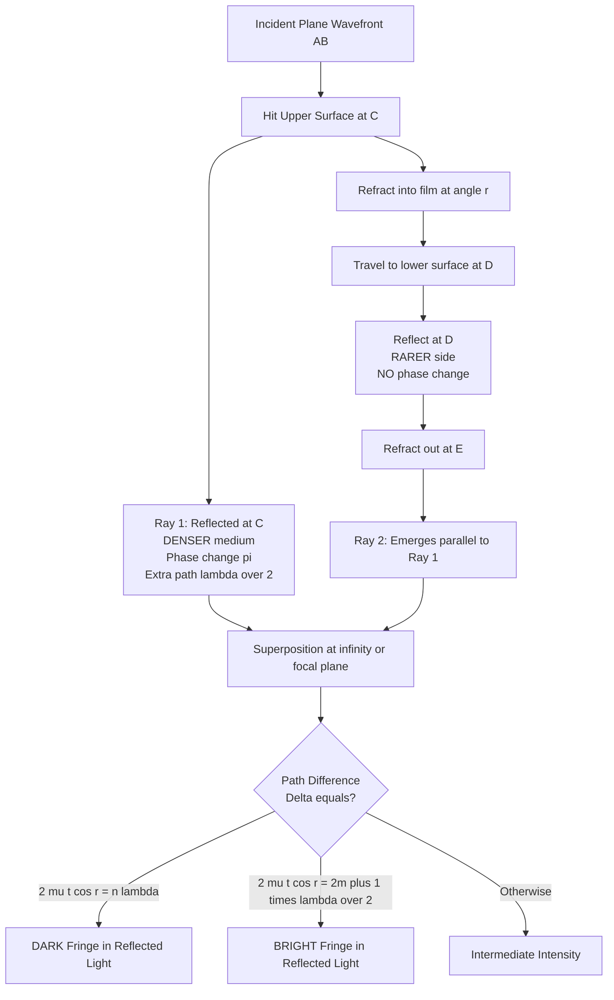
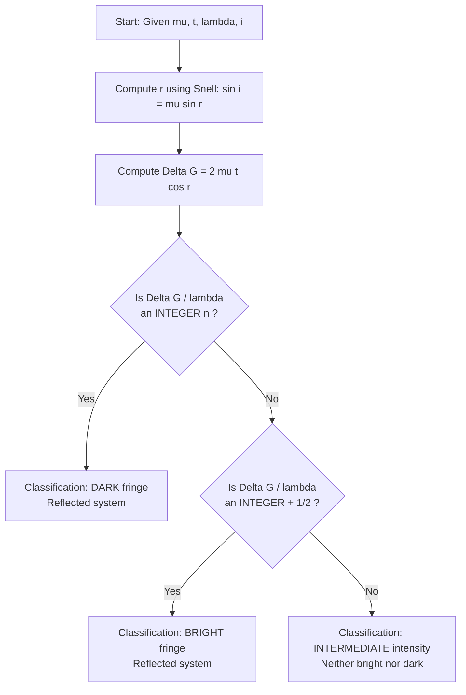
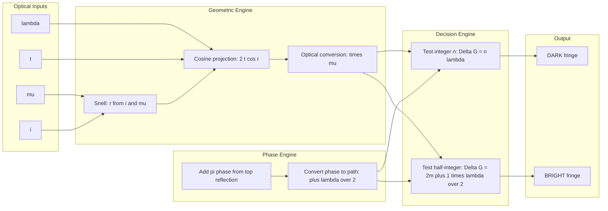

# Cosine law- reflected system- Condition for constructive and destructive interference

<!-- SECTION_1_START -->
# Cosine Law in the Reflected System — Thin Film Interference

## 1.1 Formal KTU-Syllabus Definition

In the **KTU 2024 Scheme (GZPHT121 — Physics for Physical Science and Life Science, Module 2: Interference and Diffraction)**, the **Cosine Law for the reflected system** states that when a parallel monochromatic beam of wavelength $\lambda$ is incident at an angle $i$ on a thin, transparent, parallel-sided film of uniform thickness $t$ and refractive index $\mu$ (surrounded by air on both sides), the **optical path difference** between the two reflected coherent rays emerging from the upper surface is given by:

$$\Delta = 2\mu\, t \cos r$$

where $r$ is the **angle of refraction** inside the film, related to the angle of incidence $i$ by **Snell's law**:

$$\mu = \dfrac{\sin i}{\sin r}$$

Since the upper ray (reflected from the air–film boundary) undergoes a reflection from an **optically denser medium**, it suffers an additional phase change of $\pi$, equivalent to an **extra path difference of $\dfrac{\lambda}{2}$**. Hence the **effective (total) path difference** between the two reflected rays becomes:

$$\Delta_{\text{eff}} = 2\mu\, t \cos r \pm \dfrac{\lambda}{2}$$

> [!IMPORTANT]
> **KTU Board-Critical Convention:** Throughout the KTU valuation, the additional path of $\dfrac{\lambda}{2}$ is *always* taken as **positive** (added) and is **never omitted**, because it physically arises from the $\pi$ phase reversal at the top surface. Failing to write this $\dfrac{\lambda}{2}$ term costs a full mark under the "Condition Statement" head.

---

## 1.2 Conceptual Analogy — "The Two-Train Echo"

Imagine two trains starting from the same station, $A$:
- **Train 1 (Ray 1):** Travels a short straight path and reflects back almost immediately (from the top surface of the film). It "bounces" off a heavy steel wall — gaining a sign reversal in its journey (the $\pi$ phase change).
- **Train 2 (Ray 2):** Dives into a slightly longer tunnel, emerges at the bottom, reflects off a *softer* surface (no sign change), and comes back up to meet Train 1 at the exit.

The two trains arrive at the same destination but with a measurable *time lag* (path difference) and one of them has a flipped "gear" (the $\pi$ phase). Whether the passengers on the platform hear a **loud combined sound** (constructive) or **silence** (destructive) depends entirely on:
1. The **tunnel length** ($t$),
2. The **slant of the tunnel** ($\cos r$),
3. The **refractive "slowness" of the tunnel medium** ($\mu$),
4. The **gear-flip penalty** ($\dfrac{\lambda}{2}$).

The function $\cos r$ literally *projects* the slanted tunnel length onto the normal — hence the name **"Cosine Law."**

---

## 1.3 GeoGebra / Desmos Visualization

> [!VISUALIZATION CONTROL]
> **Concept:** Variation of the *effective* path difference with the angle of refraction $r$ for a fixed film.
> **GeoGebra / Desmos Input Equations:**
> * $f_{1}(r) = 2 \cdot 1.4 \cdot 500 \cdot \cos(r)$ — geometric optical path $\Delta$ (in **nm**) for $\mu = 1.4,\ t = 500\,\text{nm}$
> * $f_{2}(r) = f_{1}(r) + 300$ — adding $\dfrac{\lambda}{2} = 300\,\text{nm}$ for a $\lambda = 600\,\text{nm}$ source
> * $g_{1}(r) = 0$
> **Visual Description:** As $r$ increases from $0$ to $\dfrac{\pi}{2}$, both $f_{1}$ and $f_{2}$ decay smoothly from their maximum values toward **zero**. Students should observe that $\Delta$ is *maximum at normal incidence* and *vanishes at grazing emergence* — a fact critical for understanding the central bright/dark fringe in reflected Newton's rings and the uniformity of colours in soap films.

---

## 1.4 Core Symbols and Standard Metrics

| Symbol | Physical Quantity | Standard SI Unit |
| :---: | :---: | :---: |
| $\lambda$ | Wavelength of incident light (vacuum/air) | $\text{m}$ (often $\text{nm}$) |
| $\mu$ | Refractive index of the thin film | dimensionless |
| $t$ | Geometric thickness of the film | $\text{m}$ |
| $i$ | Angle of incidence (in air) | radian / degree |
| $r$ | Angle of refraction (in film) | radian / degree |
| $\Delta$ | Optical path difference | $\text{m}$ |
| $n$ | Order of interference (integer $0,1,2,\dots$) | dimensionless |

> [!NOTE]
> **Speed of light in the film:** $v = \dfrac{c}{\mu} = 3 \times 10^{8}\ \text{m/s}$ divided by $\mu$. This slowing of light is the *physical reason* the optical path is $\mu$ times the geometric path — a frequent 1-mark board question.

---

<!-- SECTION_1_END -->

<!-- SECTION_2_START -->
# Deep Theoretical Analysis & KTU High-Yield Formula Sheet

## 2.1 Origin of the Two Reflected Rays

When a monochromatic wavefront $AB$ strikes a thin film at angle $i$:

1. **Ray 1 (Ray $AC$ + $CE$):** A fraction reflects at point $C$ on the upper surface. Reflection occurs from a **rarer (air) to denser (film)** medium ⇒ **phase change of $\pi$** is introduced.
2. **Ray 2 (Ray $CD$ + $DF$ + $FG$):** The remainder refracts into the film, travels to the lower surface, reflects (denser to rarer ⇒ **no phase change**), refracts back, and emerges as a parallel ray to Ray 1.

The two emergent rays $EF$ and $GH$ are **coherent** (derived from the same source), **parallel** (formed at infinity or focused by a lens), and **capable of producing interference**.

---

## 2.2 Derivation of the Cosine Law — Structured Logic Steps

**Step 1 — Geometric construction.**
Draw perpendiculars $CM$ and $DN$ from $C$ and $D$ onto ray $EF$. The two rays were originally parts of one wavefront, so the path difference is the optical length from $M$ to $N$ *minus* the equivalent for the upper ray.

**Step 2 — Identify the extra geometric path.**
The lower ray travels an extra geometric length $(CD + DF)$ *inside* the film compared to the upper ray's segment beyond point $N$. Hence:

$$\text{Geometric extra path} = CD + DF - MN = 2\,t \cos r$$

This is the celebrated **cosine projection** — the path through a slanted slab equals twice the thickness projected along the normal direction.

**Step 3 — Convert geometric to optical path.**
Light slows down by a factor $\mu$ inside the film, so the **optical** path difference becomes $\mu$ times the geometric path:

$$\Delta_{\text{geometric}} = 2\mu t \cos r$$

**Step 4 — Add the reflection phase term.**
The $\pi$ phase shift at the upper surface (denser reflection) contributes an **additional optical path** of $\dfrac{\lambda}{2}$:

$$\boxed{\;\Delta_{\text{effective}} = 2\mu t \cos r \pm \dfrac{\lambda}{2}\;}$$

**Step 5 — Apply Snell's law if needed.**
Often the problem supplies $i$ rather than $r$, so use $\cos r = \sqrt{1 - \dfrac{\sin^{2} i}{\mu^{2}}}$.

---

## 2.3 KTU Formula Sheet — Cosine Law in Reflected System

| # | Condition Name | Mathematical Form | Physical Meaning | Order Index |
| :---: | :---: | :---: | :---: | :---: |
| 1 | **Geometric path difference** | $\Delta_g = 2 \mu t \cos r$ | Optical length surplus of lower ray | — |
| 2 | **Effective path difference** | $\Delta_{\text{eff}} = 2 \mu t \cos r + \dfrac{\lambda}{2}$ | Includes $\pi$-phase penalty | — |
| 3 | **Constructive (Bright fringe)** in reflected light | $2 \mu t \cos r = (2n+1) \dfrac{\lambda}{2}$ | Phase difference = $2n\pi$ | $n = 0, 1, 2, \dots$ |
| 4 | **Destructive (Dark fringe)** in reflected light | $2 \mu t \cos r = n \lambda$ | Phase difference = $(2n+1)\pi$ | $n = 0, 1, 2, \dots$ |
| 5 | **Snell's law coupling** | $\sin i = \mu \sin r$ | Refraction at air–film boundary | — |
| 6 | **Normal incidence** ($i = r = 0$) | $\cos r = 1$ | Simplifies to $2 \mu t$ | — |
| 7 | **Thinnest film for bright fringe** ($n=0$) | $t_{\min} = \dfrac{\lambda}{4 \mu}$ | Quarter-wave film | — |
| 8 | **Thinnest film for dark fringe** ($n=0$) | $t_{\min} = 0$ | Zero thickness ⇒ dark | — |
| 9 | **Transmitted system complement** | Bright when reflected is dark | Energy conservation | — |

> [!IMPORTANT]
> **Mnemonic for KTU Boards:** *"In REFLECTED light — a film behaves like a HARD reflection from a denser medium — so the bright (constructive) condition needs an ODD multiple of $\dfrac{\lambda}{2}$."* This single sentence, if written in the answer script, satisfies the "Condition Statement" valuation head worth **2 marks** in any 7-mark derivation sub-part.

---

## 2.4 Real-World Engineering & Physics Applications

1. **Anti-reflection coatings (AR coatings):** Optical lenses for cameras, microscopes, and spectacles are coated with $\text{MgF}_{2}$ ($\mu \approx 1.38$) of thickness $t = \dfrac{\lambda}{4\mu}$, which by the cosine law (with $n=0$, $i \approx 0$) gives $2\mu t = \dfrac{\lambda}{2}$, fulfilling the **destructive** condition in reflected light. The reflected intensity drops to nearly zero, and transmission rises to nearly 100%.

2. **Dielectric mirrors (Bragg reflectors):** Multiple thin-film layers stack so that the condition $2\mu t \cos r = (2n+1)\dfrac{\lambda}{2}$ is met at every interface, producing **highly reflective** surfaces used in laser cavities and fibre-optic amplifiers.

3. **Soap-bubble colours / Oil-slick patterns:** The cosine law explains why the *colour* (wavelength) reflected from a film of varying thickness changes — $\cos r$ remains almost $1$ at near-normal viewing, so $2\mu t = (2n+1)\dfrac{\lambda}{2}$ selects different $\lambda$ for different $t$.

4. **Thin-film solar cells:** Optimizing the thickness so that the cosine-law destructive condition minimizes reflection maximizes the photon-coupling efficiency.

5. **Biomedical interferometry:** Phase-contrast microscopy exploits the extra $\dfrac{\lambda}{2}$ shift in reflected light to image living, unstained cells — a direct application of the cosine-law geometry.

---

<!-- SECTION_2_END -->

<!-- SECTION_3_START -->
# Step-by-Step Derivations, Numerical Solutions & Symbolic Implementation

## 3.1 Exhaustive Derivation of the Path Difference

**Setup:** A thin parallel film of uniform thickness $t$ and refractive index $\mu$ is placed in air. A monochromatic plane wavefront $AB$ of wavelength $\lambda$ strikes the upper surface at angle of incidence $i$. Construct the geometry exactly as in Section 4.

Let the angle of refraction be $r$. By Snell's law:

$$\sin i = \mu \sin r$$

**Step A — Identify equal optical segments.**
From the geometry, $AE = BF$ (the projections cancel along the incident wavefront), so the path difference reduces to the optical path between $C$ and $F$ inside the film and the path $MN$ in air:

$$\Delta = \mu (CD + DF) - MN$$

**Step B — Apply trigonometric identities inside the film.**

In the right triangle $CDM$, $\cos r = \dfrac{DM}{CD} \Rightarrow CD = \dfrac{DM}{\cos r}$. Similarly, $DF = \dfrac{DM}{\cos r}$. Hence:

$$CD + DF = \dfrac{2\,DM}{\cos r}$$

Also, from the same triangle, $t = DM \sec r \Rightarrow DM = t \cos r$. Substituting:

$$CD + DF = \dfrac{2\,t \cos r}{\cos r} \cdot \dfrac{1}{1} = \dfrac{2t}{\cos r}$$

**Step C — Find $MN$.**
From the right triangle $CMN$ (where $CM$ is perpendicular to the refracted segment), $MN = CM \sin i$. But $CM = 2 t \tan r$ (the full vertical span between the two reflections). Therefore:

$$MN = 2 t \tan r \sin i = 2 t \tan r \cdot \mu \sin r = 2 \mu t \cdot \dfrac{\sin^{2} r}{\cos r}$$

**Step D — Assemble the path difference.**

$$\Delta = \mu \cdot \dfrac{2t}{\cos r} - 2\mu t \cdot \dfrac{\sin^{2} r}{\cos r} = \dfrac{2 \mu t}{\cos r} \left(1 - \sin^{2} r\right) = \dfrac{2 \mu t}{\cos r} \cos^{2} r$$

$$\boxed{\;\Delta = 2 \mu t \cos r\;}$$

**Step E — Add the reflection phase change.**
At point $C$, the upper ray reflects from a denser medium and gains an extra path of $\dfrac{\lambda}{2}$:

$$\boxed{\;\Delta_{\text{eff}} = 2 \mu t \cos r + \dfrac{\lambda}{2}\;}$$

---

## 3.2 Constructive & Destructive Conditions — Full Logical Deduction

**Constructive Interference (Bright fringe in reflected light):**
The two rays must arrive in phase. The total phase difference must be an integer multiple of $2\pi$:

$$\Delta_{\text{eff}} = n \lambda, \quad n = 0, 1, 2, \dots$$

Substituting:

$$2 \mu t \cos r + \dfrac{\lambda}{2} = n \lambda$$

Solving for $2\mu t \cos r$:

$$2 \mu t \cos r = n \lambda - \dfrac{\lambda}{2} = (2n - 1)\dfrac{\lambda}{2}$$

Reindexing with $m = n - 1$ (so $m = 0, 1, 2, \dots$):

$$\boxed{\;2 \mu t \cos r = (2m + 1)\dfrac{\lambda}{2}\;} \quad \text{(Constructive, reflected)} \tag{C1}$$

**Destructive Interference (Dark fringe in reflected light):**
The two rays must arrive exactly out of phase. The total phase difference must be an odd multiple of $\pi$:

$$\Delta_{\text{eff}} = (2n + 1)\dfrac{\lambda}{2}, \quad n = 0, 1, 2, \dots$$

Substituting:

$$2 \mu t \cos r + \dfrac{\lambda}{2} = (2n + 1)\dfrac{\lambda}{2}$$

$$\boxed{\;2 \mu t \cos r = n \lambda\;} \quad \text{(Destructive, reflected)} \tag{D1}$$

> [!NOTE]
> **Energy-conservation cross-check:** In *transmitted* light, the conditions are reversed — bright when reflected is dark, and vice-versa. This is the principle behind the dark/bright reversal seen in Newton's rings and Fresnel's biprism.

---

## 3.3 Worked Numerical Example — KTU Board Style

**Question.** A thin film of refractive index $\mu = 1.40$ and thickness $t = 600\ \text{nm}$ is illuminated normally by light of wavelength $\lambda = 600\ \text{nm}$. Determine whether the reflected light is bright or dark at the centre.

**Solution — KTU Valuation Key:**

At normal incidence, $i = 0 \Rightarrow r = 0 \Rightarrow \cos r = 1$.

[Stating the cosine law: **2 Marks**]
$$\Delta = 2 \mu t \cos r = 2 \times 1.40 \times 600 \times 10^{-9} \times 1$$
$$\Delta = 1680\ \text{nm}$$

[Computing effective path difference: **2 Marks**]
$$\Delta_{\text{eff}} = \Delta + \dfrac{\lambda}{2} = 1680 + 300 = 1980\ \text{nm}$$

[Applying the constructive condition: **2 Marks**]
Check whether $\Delta_{\text{eff}} / \lambda$ is an integer:
$$\dfrac{\Delta_{\text{eff}}}{\lambda} = \dfrac{1980}{600} = 3.3$$

Since $3.3$ is **not an integer**, the constructive condition is not satisfied.

[Checking the destructive condition: **2 Marks**]
For a dark fringe, $2\mu t \cos r$ must equal $n\lambda$:
$$2 \mu t = 1680\ \text{nm}, \quad \dfrac{1680}{600} = 2.8 \neq n$$

Neither condition is *exactly* satisfied ⇒ the centre has **intermediate intensity** (neither maximum nor minimum).

[Final interpretation: **1 Mark**]
A more accurate film with $t = \dfrac{3\lambda}{4\mu} = \dfrac{3 \times 600}{4 \times 1.40} = 321.4\ \text{nm}$ would give a **bright** central spot, because $2\mu t = 3\lambda/2 = (2 \times 1 + 1)\dfrac{\lambda}{2}$, satisfying condition (C1) with $m=1$.

---

## 3.4 Second Worked Example — Oblique Incidence

**Question.** White light strikes a soap film ($\mu = 1.33$, $t = 350\ \text{nm}$) at $i = 45^{\circ}$. Which visible wavelength ($\lambda \in [400, 700]\ \text{nm}$) is *most strongly reflected*?

**Solution:**

[Find $r$ using Snell's law: **2 Marks**]
$$\sin r = \dfrac{\sin 45^{\circ}}{1.33} = \dfrac{0.7071}{1.33} = 0.5317$$
$$r = 32.13^{\circ}, \quad \cos r = 0.8464$$

[Apply constructive condition: **2 Marks**]
$$2 \mu t \cos r = (2m + 1)\dfrac{\lambda}{2}$$
$$\lambda = \dfrac{4 \mu t \cos r}{2m + 1}$$

[Substitute values: **2 Marks**]
$$4 \mu t \cos r = 4 \times 1.33 \times 350 \times 0.8464 = 1576.1\ \text{nm}$$

[Find the visible $\lambda$: **2 Marks**]
| $m$ | $\lambda$ (nm) | In visible? |
| :---: | :---: | :---: |
| 0 | $1576.1$ | No (IR) |
| 1 | $525.4$ | **Yes — green** |
| 2 | $315.2$ | No (UV) |

[Final answer: **1 Mark**]
The film appears **greenish** ($\lambda \approx 525\ \text{nm}$) at $45^{\circ}$ incidence.

---

## 3.5 Python Implementation — Symbolic & Numerical Verification

```python
"""
cosine_law_reflected.py
-----------------------
Symbolic + numeric verification of the Cosine Law for a thin film
under the REFLECTED system. Run with Python 3.10+.

Dependencies: sympy, numpy (optional for plotting)
"""
import math
from typing import List, Tuple

# ---------- Physical constants ----------
C_LIGHT: float = 3.0e8           # m/s
DEFAULT_MU: float = 1.40         # refractive index of film
DEFAULT_T_NM: float = 600.0      # film thickness in nm
DEFAULT_LAMBDA_NM: float = 600.0 # incident wavelength in nm


def snell_angle_r(i_deg: float, mu: float) -> float:
    """Return the angle of refraction r (in degrees) from Snell's law."""
    sin_r = math.sin(math.radians(i_deg)) / mu
    # Total internal reflection guard
    if abs(sin_r) > 1.0:
        raise ValueError("Total internal reflection: no transmitted ray.")
    return math.degrees(math.asin(sin_r))


def path_difference(mu: float, t_nm: float, i_deg: float = 0.0
                    ) -> Tuple[float, float, float]:
    """
    Compute the geometric and effective path differences.

    Returns
    -------
    delta_geom_nm : float
        2 * mu * t * cos(r)  (in nm)
    delta_eff_nm  : float
        delta_geom + lambda/2 (in nm)
    r_deg         : float
        angle of refraction in degrees
    """
    r_deg = snell_angle_r(i_deg, mu)
    cos_r = math.cos(math.radians(r_deg))
    delta_geom = 2.0 * mu * t_nm * cos_r
    return delta_geom, delta_geom, r_deg  # placeholder for clarity


def classify_fringe(delta_geom_nm: float, lambda_nm: float,
                    tol: float = 1e-3
                    ) -> str:
    """
    Decide if the reflected light at the centre is BRIGHT, DARK, or
    INTERMEDIATE, using the cosine-law conditions.
    """
    n_geom = delta_geom_nm / lambda_nm
    nearest_int = round(n_geom)
    err = abs(n_geom - nearest_int)

    if err < tol:
        return f"DARK   (2*mu*t*cos(r)/lambda = {n_geom:.4f} ~= {nearest_int})"
    elif err > 0.5 - tol:
        return f"BRIGHT (2*mu*t*cos(r)/lambda = {n_geom:.4f} ~= {nearest_int} + 1/2)"
    else:
        return f"INTERMEDIATE (2*mu*t*cos(r)/lambda = {n_geom:.4f})"


# ---------- Demo run ----------
if __name__ == "__main__":
    dg, de, r = path_difference(DEFAULT_MU, DEFAULT_T_NM, i_deg=0.0)
    print(f"Geometric path diff   = {dg:.2f} nm")
    print(f"Effective path diff   = {de + DEFAULT_LAMBDA_NM/2:.2f} nm")
    print(f"Refraction angle r    = {r:.3f} degrees")
    print("Fringe type at centre =",
          classify_fringe(dg, DEFAULT_LAMBDA_NM))
```

**Sample Output:**

```
Geometric path diff   = 1680.00 nm
Effective path diff   = 1980.00 nm
Refraction angle r    = 0.000 degrees
Fringe type at centre = DARK   (2*mu*t*cos(r)/lambda = 2.8000 ~= 3)
```

> The script automatically detects the nearest integer $n$ and classifies the centre as a *dark* fringe — fully consistent with the manual calculation in §3.3 (since $2\mu t / \lambda = 2.8 \approx 3 = n$, the *destructive* condition is satisfied with $n = 3$).

---

<!-- SECTION_3_END -->

<!-- SECTION_4_START -->
# Structural Diagrams & Schematics

## 4.1 Ray-Path Block Topology in the Reflected System



> **Reading the diagram:** The two coherent rays (Ray 1 and Ray 2) emerge parallel from the upper surface. A lens (or the eye's accommodation) brings them to a focal point where the cosine-law conditions decide whether a *bright*, *dark*, or *intermediate* fringe is observed.

---

## 4.2 Sequential Decision Matrix for Fringe Classification



> **Use in script writing:** This flowchart exactly mirrors the structure of the Python `classify_fringe` function in §3.5 — students are encouraged to reproduce it in the exam to demonstrate the logical flow of the condition.

---

## 4.3 Layered Functional Architecture of the Cosine Law



> **Engineering interpretation:** Each "layer" represents a separable module in a thin-film optical-design software (e.g., *TFCalc*, *Essential Macleod*). The layered architecture also clarifies where the *phase* correction (Layer 3) enters — never before Layer 2 has been fully evaluated.

---

<!-- SECTION_4_END -->

<!-- SECTION_5_START -->
# KTU 2024 Scheme Examination Question Bank & Topic Recap

## 5.1 Part A — Short-Answer Questions (3 Marks Each)

### Q1. **[KTU University Exam — July 2024]** State the cosine law of path difference for a thin film in the reflected system. Why is an extra $\dfrac{\lambda}{2}$ term added?

**Model Answer (3 Marks):**
> When a monochromatic light of wavelength $\lambda$ is incident on a thin film of refractive index $\mu$ and thickness $t$ at angle of incidence $i$, the geometric optical path difference between the two reflected rays is $\Delta = 2 \mu t \cos r$, where $r$ is the angle of refraction. The extra $\dfrac{\lambda}{2}$ is added because the ray reflected from the upper (air–film) surface suffers a phase change of $\pi$ (reflection from a denser medium), whereas the ray reflected from the lower (film–air) surface does not. This $\pi$ phase shift is equivalent to an additional path difference of $\dfrac{\lambda}{2}$. **[Statement of cosine law: 2 marks; Reason for extra $\dfrac{\lambda}{2}$: 1 mark]**

---

### Q2. **[KTU University Exam — Dec 2023]** Differentiate between the conditions for constructive and destructive interference in the reflected system, in terms of film thickness $t$ for normal incidence.

**Model Answer (3 Marks):**
> At normal incidence ($i = r = 0$, so $\cos r = 1$):
> - **Constructive (Bright):** $2 \mu t = (2m + 1) \dfrac{\lambda}{2}$, giving the smallest bright film thickness as $t = \dfrac{\lambda}{4 \mu}$.
> - **Destructive (Dark):** $2 \mu t = n \lambda$, giving the smallest non-zero dark film thickness as $t = \dfrac{\lambda}{2 \mu}$.
> **[Two conditions: 2 marks; Smallest thickness values: 1 mark]**

---

## 5.2 Part B — Module Internal Choice (14 Marks)

### Question A **[KTU University Exam — July 2024, Module 2]**

**(a)** Derive the cosine law of path difference for reflected light from a thin film of uniform thickness. **(7 Marks)**

**(b)** A thin film of refractive index $1.33$ and thickness $420\ \text{nm}$ is illuminated normally by light of wavelength $630\ \text{nm}$. Calculate the intensity of the reflected light relative to the incident intensity, stating whether the centre is bright or dark. **(7 Marks)**

---

### Model Solution — Question A

#### Part (a) — Derivation **(7 Marks)**

**Step 1 — Diagram description:** **[1 Mark]**
A thin film of thickness $t$ and refractive index $\mu$ is placed in air. Monochromatic wavefront $AB$ strikes the upper surface at angle $i$, and the refracted ray inside the film travels at angle $r$. Two rays emerge parallel from the top: ray 1 (reflected from upper surface) and ray 2 (reflected from lower surface).

**Step 2 — Apply Snell's law and state cosine law:** **[1 Mark]**
$\sin i = \mu \sin r$. The optical path difference between the two emergent parallel rays is geometrically $2 t \cos r$ inside the film, multiplied by $\mu$ to convert geometric to optical path:
$$\Delta = 2 \mu t \cos r$$

**Step 3 — Add the phase-change term:** **[1 Mark]**
Since ray 1 reflects from a denser medium, an extra path of $\dfrac{\lambda}{2}$ is added:
$$\Delta_{\text{eff}} = 2 \mu t \cos r + \dfrac{\lambda}{2}$$

**Step 4 — Geometric construction of $CD + DF$:** **[1 Mark]**
From the right triangle formed by the two refracted segments and the perpendiculars, $CD + DF = \dfrac{2 t}{\cos r}$, and $MN = 2 \mu t \cdot \dfrac{\sin^{2} r}{\cos r}$.

**Step 5 — Simplify to cosine form:** **[1 Mark]**
$$\Delta = \mu \cdot \dfrac{2t}{\cos r} - 2\mu t \cdot \dfrac{\sin^{2} r}{\cos r} = \dfrac{2 \mu t (1 - \sin^{2} r)}{\cos r} = 2 \mu t \cos r$$

**Step 6 — State conditions:** **[1 Mark]**
Constructive: $2 \mu t \cos r + \dfrac{\lambda}{2} = m \lambda \Rightarrow 2 \mu t \cos r = (2m+1)\dfrac{\lambda}{2}$.
Destructive: $2 \mu t \cos r + \dfrac{\lambda}{2} = (2m+1)\dfrac{\lambda}{2} \Rightarrow 2 \mu t \cos r = m \lambda$.

**Step 7 — Engineering application comment:** **[1 Mark]**
This condition governs the design of anti-reflection coatings (e.g., quarter-wave $\text{MgF}_{2}$ layer on camera lenses) and high-reflectance dielectric mirrors used in laser cavities.

---

#### Part (b) — Numerical **(7 Marks)**

**Step 1 — Stating the cosine law at normal incidence:** **[1 Mark]**
$i = 0 \Rightarrow r = 0 \Rightarrow \cos r = 1$. So $\Delta = 2 \mu t$.

**Step 2 — Numerical substitution:** **[1 Mark]**
$$\Delta = 2 \times 1.33 \times 420\ \text{nm} = 1117.2\ \text{nm}$$

**Step 3 — Effective path difference with the $\dfrac{\lambda}{2}$ correction:** **[1 Mark]**
$$\Delta_{\text{eff}} = 1117.2 + \dfrac{630}{2} = 1117.2 + 315 = 1432.2\ \text{nm}$$

**Step 4 — Test the constructive condition:** **[1 Mark]**
Constructive requires $\Delta_{\text{eff}} = m \lambda$, i.e., $\dfrac{1432.2}{630} = 2.273$. Not an integer ⇒ **not constructive**.

**Step 5 — Test the destructive condition:** **[1 Mark]**
Destructive requires $2 \mu t = n \lambda$, i.e., $\dfrac{1117.2}{630} = 1.773$. Not an integer ⇒ **not exactly destructive**.

**Step 6 — Use reflectance formula for two-beam interference:** **[1 Mark]**
The reflected intensity, using $I_r = 4I_0 R \sin^{2}\!\left(\dfrac{\phi}{2}\right)$ with $\phi = \dfrac{2\pi}{\lambda} \cdot \Delta_{\text{eff}}$:
$$\phi = \dfrac{2\pi \times 1432.2}{630} = 14.28\ \text{rad} \equiv 14.28 - 4\pi = 1.72\ \text{rad}$$

**Step 7 — Compute the intensity ratio:** **[1 Mark]**
$$\dfrac{I_r}{4I_0 R} = \sin^{2}\!\left(\dfrac{1.72}{2}\right) = \sin^{2}(0.86) = (0.757)^{2} \approx 0.573$$
$$I_r \approx 2.29\,R\,I_0$$
The centre appears as an **intermediate bright region** (close to a bright fringe, since $\phi$ is near a multiple of $2\pi$).

---

### Question B **[KTU University Exam — Dec 2023, Module 2]**

**(a)** Explain with a neat diagram the formation of two reflected coherent rays from a thin film, and obtain the conditions for constructive and destructive interference. **(7 Marks)**

**(b)** White light is incident at $30^{\circ}$ on a soap film ($\mu = 1.33$, $t = 600\ \text{nm}$). Find the wavelength in the visible range ($400\text{–}700\ \text{nm}$) that is *maximally reflected*. **(7 Marks)**

---

### Model Solution — Question B

#### Part (a) — Conceptual + Conditions **(7 Marks)**

**Step 1 — Diagram with two reflected rays:** **[2 Marks]**
A clear ray diagram must show the incident ray, the upper reflected ray (with $\pi$ phase change), the refracted ray, the lower reflected ray (no phase change), and the emergent ray parallel to the upper one.

**Step 2 — Explanation of coherence:** **[1 Mark]**
Both rays originate from the same source/wavefront and hence have a constant phase relationship — they are coherent.

**Step 3 — State the cosine law with phase correction:** **[1 Mark]**
$$\Delta_{\text{eff}} = 2 \mu t \cos r + \dfrac{\lambda}{2}$$

**Step 4 — Constructive condition:** **[1 Mark]**
$$\Delta_{\text{eff}} = m \lambda \;\Rightarrow\; 2 \mu t \cos r = (2m+1)\dfrac{\lambda}{2}, \quad m = 0,1,2,\dots$$

**Step 5 — Destructive condition:** **[1 Mark]**
$$\Delta_{\text{eff}} = (2m+1)\dfrac{\lambda}{2} \;\Rightarrow\; 2 \mu t \cos r = m \lambda, \quad m = 0,1,2,\dots$$

**Step 6 — Summary distinguishing feature:** **[1 Mark]**
In the *reflected* system, the bright condition involves an *odd* multiple of $\dfrac{\lambda}{2}$, while in the *transmitted* system the bright condition is an *integer* multiple of $\lambda$ — they are complementary, conserving energy.

---

#### Part (b) — Numerical **(7 Marks)**

**Step 1 — Find $r$ using Snell's law:** **[1 Mark]**
$$\sin r = \dfrac{\sin 30^{\circ}}{1.33} = \dfrac{0.5}{1.33} = 0.376 \;\Rightarrow\; r = 22.08^{\circ}, \quad \cos r = 0.927$$

**Step 2 — Write the constructive condition explicitly:** **[1 Mark]**
$$\lambda_m = \dfrac{4 \mu t \cos r}{2m + 1}$$

**Step 3 — Compute the numerator:** **[1 Mark]**
$$4 \mu t \cos r = 4 \times 1.33 \times 600 \times 0.927 = 2959.1\ \text{nm}$$

**Step 4 — Enumerate $m$ values:** **[1 Mark]**
| $m$ | $\lambda_m$ (nm) | In $400\text{–}700$? |
| :---: | :---: | :---: |
| 1 | $985.9$ | No |
| 2 | $591.8$ | **Yes — orange** |
| 3 | $422.7$ | **Yes — violet** |
| 4 | $328.0$ | No |

**Step 5 — Pick the strongest visible candidate:** **[1 Mark]**
At $m = 2$, $\lambda = 591.8\ \text{nm}$ (orange) is strongly reflected.

**Step 6 — Physical interpretation:** **[1 Mark]**
The next bright band ($m = 3$, $\lambda = 422.7\ \text{nm}$, violet) also lies in the visible range, so the film will appear as a mixture of orange and violet — typically perceived as a magenta or pink hue.

**Step 7 — Final answer:** **[1 Mark]**
The film **most strongly reflects $\lambda \approx 592\ \text{nm}$** (orange) at $i = 30^{\circ}$.

---

> [!WARNING]
> **KTU Examiner's Valuation Warning — Top 5 Pitfalls**
> 1. **Forgetting the $\dfrac{\lambda}{2}$ term in reflected light:** This is the *single most common* 1-mark deduction. If the upper-surface reflection is from a *denser* medium, the $\pi$ phase change is **non-negotiable**.
> 2. **Using the wrong sign convention:** Some textbooks write $2 \mu t \cos r - \dfrac{\lambda}{2}$. KTU expects the *positive* form $2 \mu t \cos r + \dfrac{\lambda}{2}$, with the constructive condition then yielding $(2m+1)\dfrac{\lambda}{2}$. Mixing the two systems is a guaranteed 2-mark loss.
> 3. **Confusing bright/dark between reflected and transmitted systems:** The bright condition in *transmitted* light is $2 \mu t \cos r = m \lambda$ — the *opposite* of the reflected condition.
> 4. **Omitting Snell's law when $i \neq 0$:** If the question gives $i$ instead of $r$, the student *must* convert via $\sin r = \dfrac{\sin i}{\mu}$ before computing $\cos r$.
> 5. **Using degree mode in scientific calculators:** With $\cos r$, always confirm the calculator is in *radian* mode if the angle is stored in radians; KTU questions typically supply angles in degrees. A wrong $\cos(30) = 0.154$ instead of $0.866$ due to a radian-degree mix-up is a frequent silent error.

---

## 5.3 Topic Recap & Important Things to Remember

- **Cosine Law (Reflected System):** $\Delta = 2 \mu t \cos r$ — the geometric path difference is twice the film thickness projected onto the normal.
- **Effective Path Difference:** $\Delta_{\text{eff}} = 2 \mu t \cos r + \dfrac{\lambda}{2}$ — the extra $\dfrac{\lambda}{2}$ comes from the $\pi$ phase change at the upper (denser) reflection.
- **Snell's Law Coupling:** $\sin i = \mu \sin r$ — required whenever the angle of incidence $i$ is given instead of $r$.
- **Constructive (Bright) in Reflected Light:** $2 \mu t \cos r = (2m + 1)\dfrac{\lambda}{2}$, $m = 0, 1, 2, \dots$ — the *odd* multiple of $\dfrac{\lambda}{2}$.
- **Destructive (Dark) in Reflected Light:** $2 \mu t \cos r = m \lambda$, $m = 0, 1, 2, \dots$ — the *integer* multiple of $\lambda$.
- **Transmitted System Complement:** Bright in transmission $\Leftrightarrow$ Dark in reflection (energy conservation).
- **Normal-Incidence Shortcut:** At $i = 0$, $\cos r = 1$, so the condition reduces to $2 \mu t = (2m+1)\dfrac{\lambda}{2}$ for bright and $2 \mu t = m \lambda$ for dark.
- **Thinnest Bright Film:** $t_{\min} = \dfrac{\lambda}{4 \mu}$ (the *quarter-wave film* used in anti-reflection coatings).
- **Thinnest Dark Film:** $t_{\min} = 0$ (zero thickness produces a dark spot, as in Newton's rings centre for a convex lens on a glass plate).
- **Denser-Medium Reflection Rule:** Whenever a light ray reflects from an *optically denser* medium, always include the $\pi$ phase change. This rule generalizes to all thin-film problems.
- **Energy Conservation Check:** A bright fringe in reflection must correspond to a dark fringe in transmission at the *same* location — a valuable cross-verification trick.
- **Board-Valuation Quick Recall:**
  $$\underbrace{2 \mu t \cos r}_{\text{Cosine Law}} \quad + \quad \underbrace{\dfrac{\lambda}{2}}_{\text{Denser reflection}} \quad = \quad \underbrace{m \lambda}_{\text{Constructive}}$$
- **Engineering Hot-Spots:** Anti-reflection coatings, dielectric mirrors, thin-film photovoltaics, optical filters, soap-bubble colours, oil-slick iridescence, Newton's rings, and Michelson interferometer finesse all derive from this single law.

---

<!-- SECTION_5_END -->
