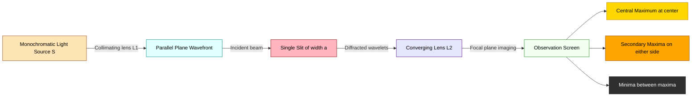
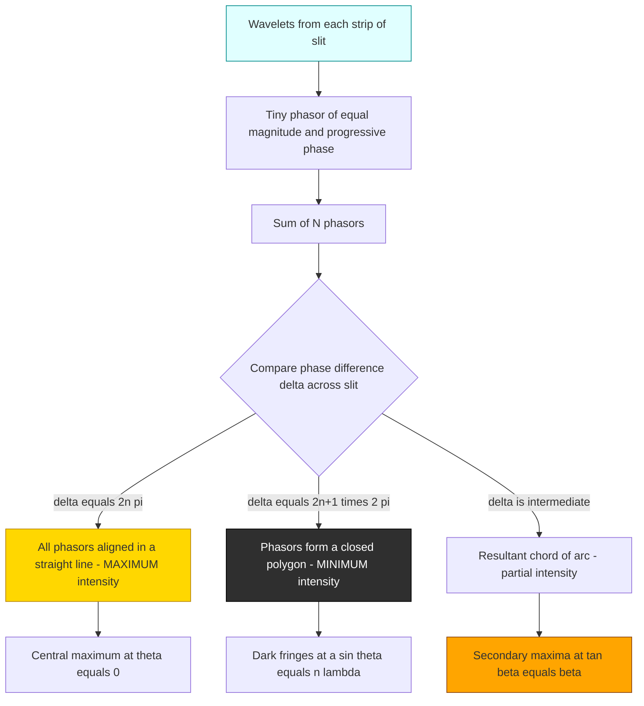
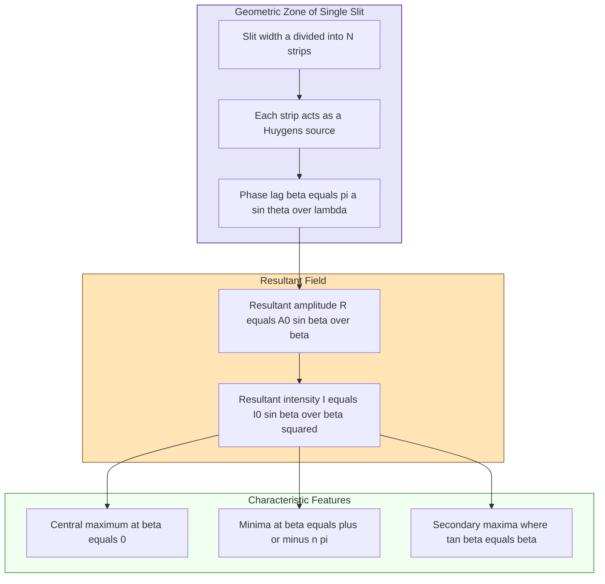
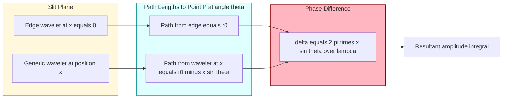

# Diffraction due to a single slit

<!-- SECTION_1_START -->

# Diffraction Due to a Single Slit

## 1.1 Formal Definition (KTU 2024 Syllabus Terminology)

**Single-slit diffraction** is the phenomenon of bending of light waves around the sharp edges of a narrow aperture (slit) of width $a$ comparable to the wavelength $\lambda$ of the incident light, resulting in a characteristic intensity pattern on a distant screen consisting of a bright central maximum flanked by alternating dark and bright secondary fringes of rapidly decreasing intensity.

> [!IMPORTANT]
> **KTU Syllabus Highlight — Module 2: Interference and Diffraction**
> Fraunhofer diffraction at a single slit forms the foundation for understanding **resolving power of optical instruments** (Rayleigh's criterion), **diffraction gratings**, and the **limits of optical microscopy**. KTU examiners expect you to know the intensity distribution law and the linear / angular positions of minima rigorously.

The two classical regimes of diffraction are:

| Regime | Description | Wavefront Geometry | Setup |
|---|---|---|---|
| **Fresnel Diffraction** | Source and screen at finite distance from obstacle | Spherical / Cylindrical | Converging spherical wavefronts |
| **Fraunhofer Diffraction** | Source and screen effectively at infinity | Plane wavefronts | Parallel light — achieved using two convex lenses |

> [!NOTE]
> **Key Assumptions for Fraunhofer Single-Slit Analysis**
> 1. Incident light is **monochromatic** of wavelength $\lambda$ with intensity $I_0$.
> 2. The slit width $a$ is much greater than $\lambda$ (typically $a \approx 50\lambda$ to $500\lambda$) but small enough that diffraction is observable.
> 3. The slit is illuminated by a **plane wavefront** (parallel beam).
> 4. The pattern is observed on a screen placed at the focal plane of a converging lens (or at infinity).

## 1.2 Intuitive Analogy — The "Doorway" Picture

Imagine you are speaking through a **half-open door** of width $a$ in a corridor. If your voice wavelength $\lambda$ is *much smaller* than the door width, sound travels in nearly straight lines and a person standing in the corridor hears you only when directly in line. But if the door is made very narrow (comparable to your voice wavelength), the sound **spreads out in all directions**, and a listener standing well to the side can still hear you clearly. The narrow door has caused the sound wave to **bend around its edges** — this is diffraction.

In optics, when light of wavelength $\lambda$ passes through a slit of width $a \sim \lambda$, each point across the slit acts as a **secondary source** of spherical wavelets (Huygens' principle). These wavelets **interfere** with one another:

- **Constructive interference** → bright fringes
- **Destructive interference** → dark fringes

The result is a bright **central maximum** (where all wavelets arrive in phase) surrounded by progressively fainter **secondary maxima** separated by **minima**.

> [!TIP]
> **Quick Intuition for the Central Maximum**
> At the center of the screen (straight-through direction), all wavelets from every point inside the slit travel equal path lengths. They arrive **in phase** and reinforce to give the maximum possible intensity $I_0$. This is why the central fringe is brightest and widest.

## 1.3 Standard Constants & Notation

| Symbol | Quantity | Standard Value / Unit |
|---|---|---|
| $\lambda$ | Wavelength of light | $4000 \,\text{Å} \le \lambda \le 7000 \,\text{Å}$ (visible) |
| $a$ | Slit width | typically $10^{-5}\,\text{m}$ to $10^{-4}\,\text{m}$ |
| $\theta$ | Angle of diffraction from central axis | radians (or degrees) |
| $D$ | Distance from slit to screen | metres (m) |
| $f$ | Focal length of converging lens (if used) | metres (m) |
| $I_0$ | Maximum intensity at $\theta = 0$ | $\text{W/m}^2$ |

> [!VISUALIZATION CONTROL]
> **Concept:** Fraunhofer Single-Slit Intensity Distribution $I(\beta) = I_0 \left(\dfrac{\sin \beta}{\beta}\right)^{2}$ where $\beta = \dfrac{\pi a \sin \theta}{\lambda}$
>
> **Desmos Input Equations:**
> * $I\_ratio(\beta) = (\sin(\beta)/\beta)\^{2}$
> * $I\_ratio(\beta) = 0$  *(horizontal axis — minima)*
>
> **Visual Description:** A tall central peak at $\beta = 0$ reaching the value $1.0$, surrounded by symmetrically placed smaller peaks of rapidly decreasing height. The function crosses zero at $\beta = \pm\pi, \pm 2\pi, \pm 3\pi, \dots$. Plot the domain $\beta \in [-10\pi,\, 10\pi]$ to clearly see the **central maximum** and at least three **secondary maxima** on each side.

<!-- SECTION_1_END -->

<!-- SECTION_2_START -->

# Deep Theoretical Analysis — Single-Slit Fraunhofer Diffraction

## 2.1 Conceptual Framework (Huygens–Fresnel Treatment)

According to **Huygens' principle**, every point on the illuminated slit acts as a source of secondary wavelets. According to **Fresnel's extension**, the wavelets mutually interfere. We divide the slit of width $a$ into $N$ infinitesimally thin strips of width $\delta x = a/N$. Each strip radiates a wavelet of equal amplitude $A_0/N$ but with a phase that depends on its position across the slit.

**Step-by-step logic:**

1. The wavelet from the strip at position $x$ travels an extra path $x \sin\theta$ relative to the wavelet from the edge.
2. The corresponding **phase difference** for a strip at $x$ is $\delta(x) = \dfrac{2\pi}{\lambda}\,x\sin\theta$.
3. Each wavelet contributes a phasor of magnitude $A_0/N$ and phase $\delta(x)$.
4. The **resultant phasor amplitude** is the vector sum (integral) over all such phasors.

> [!IMPORTANT]
> **Why is the central maximum twice as wide as the secondary maxima?**
> The central maximum extends from the **first minimum on the left** to the **first minimum on the right** — i.e., over a total angular range of $\Delta\theta_{\text{central}} = 2\theta_1$ where $\theta_1$ is the angular position of the first minimum. Every other secondary maximum lies *between two consecutive minima*, occupying only $\Delta\theta_{\text{secondary}} = \theta_{n+1} - \theta_n \approx \theta_1$. Hence the central maximum is **exactly twice as wide** as any secondary maximum.

## 2.2 KTU High-Yield Formula Sheet

| # | Quantity | Mathematical Expression | Condition / Notes |
|---|---|---|---|
| 1 | Path difference between extreme wavelets | $\Delta = a \sin\theta$ | $a$ = slit width |
| 2 | Phase difference between extreme wavelets | $\delta = \dfrac{2\pi a \sin\theta}{\lambda}$ | Radians |
| 3 | Auxiliary variable (half-phase) | $\beta = \dfrac{\pi a \sin\theta}{\lambda}$ | $\delta = 2\beta$ |
| 4 | Resultant amplitude | $R = A_0 \left(\dfrac{\sin\beta}{\beta}\right)$ | $A_0$ is the amplitude at $\theta = 0$ |
| 5 | Resultant intensity | $I = I_0 \left(\dfrac{\sin\beta}{\beta}\right)^{2}$ | The diffraction equation |
| 6 | Condition for **minima** (dark fringes) | $a\sin\theta = n\lambda,\;\; n = \pm 1, \pm 2, \pm 3, \dots$ | All $n \ne 0$ |
| 7 | Condition for **secondary maxima** | $\tan\beta = \beta$ | Transcendental; solved numerically |
| 8 | Approximate positions of secondary maxima | $a\sin\theta \approx (n + \tfrac{1}{2})\lambda,\;\; n = 1, 2, 3, \dots$ | Valid for small $n$ |
| 9 | Angular half-width of central maximum | $\theta_1 = \dfrac{\lambda}{a}$ | $n = 1$ minimum position |
| 10 | Total angular width of central maximum | $\Delta\theta = \dfrac{2\lambda}{a}$ | Between first minima |
| 11 | Linear half-width on screen (no lens) | $y_1 = \dfrac{D\lambda}{a}$ | $D$ = slit–screen distance |
| 12 | Linear width of central maximum on screen | $W = \dfrac{2D\lambda}{a}$ | Direct geometric projection |
| 13 | Linear width using a lens of focal length $f$ | $W = \dfrac{2f\lambda}{a}$ | Slit at focal plane of lens |
| 14 | Intensities of secondary maxima | $I_1 : I_2 : I_3 \approx 1 : \tfrac{1}{22} : \tfrac{1}{62}$ | Rapidly decreasing |

> [!WARNING]
> **Common Mistake — Do Not Confuse!**
> The minima condition $a\sin\theta = n\lambda$ is **NOT** a condition for *constructive* interference of the edges — it is a condition for **complete destructive interference** of *all* wavelets, achieved because the slit can be paired into $n$ equal half-period zones whose contributions cancel pairwise. (See derivation in Section 3.)

## 2.3 Engineering & Physics Utility

| Domain | Application |
|---|---|
| **Telescopes & Microscopes** | Single-slit diffraction sets the **Rayleigh resolving limit**: $\theta_{\min} = 1.22 \lambda / D$ for circular apertures. |
| **Spectroscopy** | Slit width in a spectrometer must be small enough for the diffraction pattern not to blur spectral lines. |
| **Optical Communication** | Mode size in single-mode optical fibres is governed by diffraction of the input slit / aperture. |
| **Semiconductor Lithography** | Minimum feature size that can be printed is set by diffraction at the photomask slit. |
| **Antenna Theory** | The single-slit intensity pattern is mathematically identical to the radiation pattern of a uniformly illuminated linear antenna array. |

<!-- SECTION_2_END -->

<!-- SECTION_3_START -->

# Step-by-Step Derivations

## 3.1 Derivation of the Intensity Distribution $I = I_0 \left(\dfrac{\sin\beta}{\beta}\right)^{2}$

### Setting up the geometry

Consider a slit of width $a$ illuminated by a plane wavefront of monochromatic light of wavelength $\lambda$. The pattern is observed in a direction making angle $\theta$ with the central axis (the normal to the slit).

Divide the slit into $N$ equal strips, each of width $\delta x = a/N$. The wavelet from the **first strip** (at the edge, $x = 0$) sets the reference phase. The wavelet from the **$k$-th strip** at position $x_k = k\,\delta x$ travels an additional path

$$
\Delta_k = x_k \sin\theta = k\,\delta x\,\sin\theta
$$

with a corresponding phase lag

$$
\phi_k = \frac{2\pi}{\lambda}\,k\,\delta x\,\sin\theta
$$

### Phasor summation

Let $A$ be the amplitude contributed by a single strip at $\theta = 0$. The total amplitude at angle $\theta$ is the phasor sum:

$$
R(\theta) = A \sum_{k=0}^{N-1} e^{-i\phi_k}
$$

Substituting $\phi_k$ and letting $N \to \infty$ (so the summation becomes an integral over $x \in [0, a]$):

$$
R(\theta) = A \int_{0}^{a} e^{-i\,\frac{2\pi}{\lambda}\,x\sin\theta} \, \frac{dx}{a} \cdot a
$$

This gives:

$$
R(\theta) = A \int_{0}^{a} \cos\!\left(\frac{2\pi x \sin\theta}{\lambda}\right) dx - i A \int_{0}^{a} \sin\!\left(\frac{2\pi x \sin\theta}{\lambda}\right) dx
$$

### Evaluating the integral

Introducing the substitution $\beta = \dfrac{\pi a \sin\theta}{\lambda}$ so that $\dfrac{2\pi x \sin\theta}{\lambda} = \dfrac{2\beta x}{a}$:

$$
R(\theta) = A \left[ \frac{\sin(2\beta x / a)}{2\beta / a} \right]_{0}^{a} \cdot \frac{1}{1} - i A \left[ \frac{-\cos(2\beta x/a)}{2\beta/a} \right]_{0}^{a}
$$

Computing each part:

- The cosine (real) part: $A \cdot \dfrac{a}{2\beta}\bigl[\sin(2\beta) - 0\bigr] = A a \cdot \dfrac{\sin(2\beta)}{2\beta}$
- The sine (imaginary) part: $-iA \cdot \dfrac{a}{2\beta}\bigl[1 - \cos(2\beta)\bigr]$

Using the trigonometric identity $1 - \cos(2\beta) = 2\sin^{2}\beta$ and $\sin(2\beta) = 2\sin\beta\cos\beta$:

$$
R(\theta) = A a \cdot \frac{\sin\beta\cos\beta}{\beta} - iA a \cdot \frac{\sin^{2}\beta}{\beta}
$$

The **magnitude** (using $|z|^{2} = (\text{Re}\,z)^{2} + (\text{Im}\,z)^{2}$) simplifies to:

$$
|R(\theta)| = A a \cdot \frac{\sin\beta}{\beta}
$$

Since intensity is proportional to the square of the amplitude, and at $\theta = 0$ we have $\beta \to 0$ so $\sin\beta/\beta \to 1$ giving $R(0) = Aa$:

$$
\boxed{\,I(\theta) = I_0 \left(\frac{\sin\beta}{\beta}\right)^{2} \quad \text{where} \quad \beta = \frac{\pi a \sin\theta}{\lambda}\,}
$$

This is the celebrated **single-slit intensity distribution**.

## 3.2 Derivation of the Minima Condition $a \sin\theta = n\lambda$

The intensity vanishes whenever $\sin\beta = 0$ but $\beta \ne 0$. The function $\sin\beta = 0$ at $\beta = 0, \pm\pi, \pm 2\pi, \pm 3\pi, \dots$

The case $\beta = 0$ gives the **central maximum** ($I = I_0$). For minima:

$$
\beta = n\pi,\quad n = \pm 1, \pm 2, \pm 3, \dots
$$

Substituting back $\beta = \dfrac{\pi a \sin\theta}{\lambda}$:

$$
\frac{\pi a \sin\theta}{\lambda} = n\pi
$$

$$
\boxed{\,a\sin\theta = n\lambda,\quad n = \pm 1, \pm 2, \pm 3, \dots\,}
$$

**Physical interpretation (half-period zones):** The slit can be partitioned into $n$ equal "half-period zones", each of width $a/n$. The wavelets from the first two adjacent zones differ in phase by $\pi$ and therefore cancel. Pairing all $n$ zones pairwise, the resultant intensity is **zero**.

## 3.3 Derivation of the Linear Width of the Central Maximum

The first minimum on either side of the central axis occurs at $n = 1$:

$$
a \sin\theta_1 = \lambda \;\;\Longrightarrow\;\; \sin\theta_1 = \frac{\lambda}{a}
$$

For small angles, $\sin\theta_1 \approx \theta_1$, so the **angular half-width** is

$$
\theta_1 \approx \frac{\lambda}{a} \quad \text{(radians)}
$$

The total **angular width** of the central maximum is $2\theta_1$:

$$
\Delta\theta_{\text{central}} = \frac{2\lambda}{a}
$$

If a screen is placed at distance $D$ (no lens used), the linear position of the first minimum is $y_1 = D \tan\theta_1 \approx D\theta_1$:

$$
y_1 = \frac{D\lambda}{a}
$$

The **linear width** of the central maximum is therefore:

$$
\boxed{\,W_{\text{central}} = 2y_1 = \frac{2D\lambda}{a}\,}
$$

If a converging lens of focal length $f$ is used (slit at the front focal plane), the screen is at the back focal plane and $D \to f$:

$$
\boxed{\,W_{\text{central}} = \frac{2f\lambda}{a}\,}
$$

## 3.4 Worked Numerical Examples

### Example 1 — Finding the slit width

> **Problem:** In a single-slit Fraunhofer diffraction setup, light of wavelength $6000\,\text{Å}$ is used. The first minimum is observed at an angle of $30'$ (arc minutes) from the central axis. Find the slit width.

**Solution:**

For the first minimum ($n=1$): $\;a\sin\theta_1 = \lambda$

Convert the angle to radians: $\theta_1 = 30' = \dfrac{30}{60}^{\circ} = 0.5^{\circ} = 0.5 \times \dfrac{\pi}{180} = 8.727 \times 10^{-3}\,\text{rad}$

Since the angle is small, $\sin\theta_1 \approx \theta_1$:

$$
a = \frac{\lambda}{\sin\theta_1} = \frac{6.0 \times 10^{-7}\,\text{m}}{8.727 \times 10^{-3}} = 6.875 \times 10^{-5}\,\text{m}
$$

$$
\boxed{\,a \approx 0.069\,\text{mm}\,}
$$

### Example 2 — Width of central maximum on a screen

> **Problem:** A slit of width $0.2\,\text{mm}$ is illuminated by light of wavelength $5000\,\text{Å}$. Find the linear width of the central maximum on a screen placed $2\,\text{m}$ away.

**Solution:**

Using $W = \dfrac{2D\lambda}{a}$:

$$
W = \frac{2 \times 2\,\text{m} \times 5.0 \times 10^{-7}\,\text{m}}{2.0 \times 10^{-4}\,\text{m}} = 1.0 \times 10^{-2}\,\text{m}
$$

$$
\boxed{\,W = 1.0\,\text{cm}\,}
$$

### Example 3 — Wavelength from minimum positions

> **Problem:** In a single-slit diffraction experiment, the distance between the first and second minima on one side of the central maximum is $3.0\,\text{mm}$. The screen is $1.5\,\text{m}$ from the slit and the slit width is $0.3\,\text{mm}$. Find the wavelength of light used.

**Solution:**

Positions of minima: $y_n = \dfrac{nD\lambda}{a}$

Distance between first and second minima:

$$
\Delta y = y_2 - y_1 = \frac{2D\lambda}{a} - \frac{D\lambda}{a} = \frac{D\lambda}{a}
$$

Solving for $\lambda$:

$$
\lambda = \frac{a \cdot \Delta y}{D} = \frac{3.0 \times 10^{-4}\,\text{m} \times 3.0 \times 10^{-3}\,\text{m}}{1.5\,\text{m}} = 6.0 \times 10^{-7}\,\text{m}
$$

$$
\boxed{\,\lambda = 6000\,\text{Å}\,}
$$

## 3.5 Python Implementation (Type-Hinted)

```python
import numpy as np
import matplotlib.pyplot as plt
from typing import Tuple

def single_slit_intensity(
    beta: np.ndarray,
    I0: float = 1.0
) -> np.ndarray:
    """
    Compute the normalized single-slit Fraunhofer intensity pattern.
    
    Parameters
    ----------
    beta : np.ndarray
        Phase variable beta = (pi * a * sin(theta)) / lambda
    I0 : float, optional
        Peak (central) intensity, default 1.0
    
    Returns
    -------
    np.ndarray
        Intensity I(beta) = I0 * (sin(beta)/beta)^2, with safe handling at beta=0.
    """
    # Guard against division by zero at beta=0
    with np.errstate(divide='ignore', invalid='ignore'):
        intensity = I0 * np.where(
            beta == 0.0,
            1.0,                          # limit as beta -> 0 is 1
            (np.sin(beta) / beta) ** 2    # standard diffraction formula
        )
    return intensity


def find_minima(a: float, lam: float, max_order: int = 5) -> Tuple[np.ndarray, np.ndarray]:
    """
    Compute angular and linear positions of diffraction minima.
    
    Parameters
    ----------
    a : float
        Slit width (metres)
    lam : float
        Wavelength (metres)
    max_order : int
        Maximum diffraction order n to compute
    
    Returns
    -------
    (theta, beta) : tuple of np.ndarray
        theta in radians, beta in radians
    """
    orders = np.arange(1, max_order + 1)
    # Minima condition: a sin(theta) = n * lam  =>  sin(theta) = n*lam/a
    sin_theta = orders * lam / a
    # Clamp for physical validity (sin_theta must be <= 1)
    if np.any(sin_theta > 1.0):
        raise ValueError("Order too high: sin(theta) > 1.0. Reduce max_order.")
    theta = np.arcsin(sin_theta)
    beta = orders * np.pi
    return theta, beta


# --- Demonstration ---
if __name__ == "__main__":
    a = 0.1e-3              # slit width = 0.1 mm
    lam = 6000e-10          # wavelength = 6000 Angstrom
    D = 2.0                 # screen distance = 2 m

    # Plot intensity vs angle
    theta = np.linspace(-0.05, 0.05, 10000)        # in radians
    beta = (np.pi * a * np.sin(theta)) / lam
    I = single_slit_intensity(beta)

    plt.figure(figsize=(9, 5))
    plt.plot(np.degrees(theta), I, color='navy', linewidth=1.6)
    plt.xlabel("Angle theta (degrees)")
    plt.ylabel("Normalized intensity I / I0")
    plt.title("Fraunhofer Single-Slit Diffraction Pattern")
    plt.grid(True, linestyle='--', alpha=0.6)
    plt.ylim(-0.05, 1.1)
    plt.show()

    # Print minimum positions
    theta_min, _ = find_minima(a, lam, max_order=4)
    print("Angular positions of minima (degrees):")
    for n, t in enumerate(theta_min, start=1):
        print(f"  n = {n}: theta = {np.degrees(t):.4f} deg,  "
              f"y_n on screen = {D*np.tan(t)*1e3:.3f} mm")
```

<!-- SECTION_3_END -->

<!-- SECTION_4_START -->

# Structural Diagrams & Schematics

## 4.1 Experimental Setup — Schematic Flow



## 4.2 Phasor Addition — From Arc to Resultant



## 4.3 Intensity Profile Decomposition



## 4.4 Wavelet Path-Difference Geometry (Block Topology)



<!-- SECTION_4_END -->

<!-- SECTION_5_START -->

# KTU 2024 Scheme Examination Question Bank

## Part A — Short Answer Questions (3 Marks Each)

### Question 1: `[KTU University Exam — July 2023]`
**State the conditions for diffraction of light. How does it differ from interference? (CO1, Remember)**

**Model Answer (Valuation Key):**

**Conditions for diffraction:**
1. The size of the obstacle or aperture must be **comparable to the wavelength** of light ($\lambda$).
2. The source of light must be **monochromatic and coherent**.
3. The wavefront must be effectively **infinite in extent** relative to the aperture.

**Differences from interference:**

| Feature | Interference | Diffraction |
|---|---|---|
| Origin | Superposition of wavelets from **two separate coherent sources** | Superposition of wavelets from **different parts of the same wavefront** |
| Fringe width | Generally **uniform** across the pattern | Fringes are **non-uniform** (central max widest) |
| Intensity | Nearly equal maxima | Central max dominant; secondary max rapidly fades |
| Path difference | Finite, well-defined | Continuous distribution |

> **[Stating the three conditions: 2 Marks. Tabular comparison: 1 Mark]**

---

### Question 2: `[KTU University Exam — Dec 2023]`
**Why is the central maximum in a single-slit diffraction pattern twice as wide as the secondary maxima? (CO2, Understand)**

**Model Answer (Valuation Key):**

The central maximum is bounded by the **first minima** on either side, located at $\sin\theta = \pm\lambda/a$. Its total angular width is therefore:

$$
\Delta\theta_{\text{central}} = 2\theta_1 = \frac{2\lambda}{a}
$$

Each **secondary maximum** lies between two consecutive minima, i.e., between $n$-th and $(n+1)$-th minima. Its angular width is:

$$
\Delta\theta_{\text{secondary}} = \theta_{n+1} - \theta_n \approx \frac{(n+1)\lambda}{a} - \frac{n\lambda}{a} = \frac{\lambda}{a}
$$

Therefore:

$$
\boxed{\,\frac{\Delta\theta_{\text{central}}}{\Delta\theta_{\text{secondary}}} = 2\,}
$$

The central maximum is **exactly twice as wide** as any secondary maximum.

> **[Identifying boundary minima of central max: 1 Mark. Width calculation: 1 Mark. Final ratio: 1 Mark]**

---

## Part B — Long Answer Questions (14 Marks Each, Internal Choice)

### Question A `[KTU University Exam — Model Paper 2024, CO2, Apply / Analyze]`

**(a)** Derive the expression for the intensity distribution in the Fraunhofer diffraction pattern due to a single slit of width $a$ illuminated by monochromatic light of wavelength $\lambda$. **(7 marks)**

**(b)** In a single-slit diffraction experiment using light of wavelength $5890\,\text{Å}$, the first minimum is observed at an angle of $0.50^{\circ}$. Calculate **(i)** the slit width, and **(ii)** the angular position of the second secondary maximum. **(7 marks)**

---

#### Model Solution to (a)

**Step 1 — Geometry:** Consider a slit of width $a$ divided into $N$ equal strips of width $\delta x = a/N$. Each strip sends out a Huygens wavelet. **[1 Mark]**

**Step 2 — Path difference:** The wavelet from the strip at $x_k$ travels an extra path $x_k \sin\theta$ compared to the wavelet from $x = 0$, so its phase lag is $\phi_k = \dfrac{2\pi x_k \sin\theta}{\lambda}$. **[1 Mark]**

**Step 3 — Phasor sum:** Each wavelet contributes a phasor of equal magnitude $A_0/N$. The total amplitude at angle $\theta$ is:

$$
R(\theta) = A_0 \sum_{k=0}^{N-1} e^{-i\phi_k}
$$

Passing to the continuum ($N \to \infty$):

$$
R(\theta) = A_0 \int_{0}^{1} e^{-i\,\frac{2\pi a \sin\theta}{\lambda}\,u}\,du
$$

where $u = x/a$. **[2 Marks]**

**Step 4 — Evaluation:** Define $\beta = \dfrac{\pi a \sin\theta}{\lambda}$. Then:

$$
R(\theta) = A_0 \left[\frac{e^{-i 2\beta u}}{-i 2\beta}\right]_{0}^{1} = A_0 \cdot \frac{e^{-i 2\beta} - 1}{-i 2\beta}
$$

Multiplying numerator and denominator by $e^{i\beta}$ and using $e^{i\beta} - e^{-i\beta} = 2i\sin\beta$:

$$
R(\theta) = A_0 \cdot \frac{\sin\beta}{\beta}
$$

**Step 5 — Intensity:** Since $I \propto \vert R \vert^{2}$ and $I_0 = A_0^{2}$ at $\theta = 0$:

$$
\boxed{\,I(\theta) = I_0 \left(\frac{\sin\beta}{\beta}\right)^{2}\,}
$$

**[Final expression: 1 Mark]** **[Physical meaning of $\beta$ and units: 1 Mark]**

---

#### Model Solution to (b)

**Given:** $\lambda = 5890\,\text{Å} = 5.89 \times 10^{-7}\,\text{m}$, $\theta_1 = 0.50^{\circ}$ (first minimum)

**(i) Slit width:** For $n = 1$ minimum, $a\sin\theta_1 = \lambda$:

$$
a = \frac{\lambda}{\sin\theta_1} = \frac{5.89 \times 10^{-7}}{\sin 0.50^{\circ}}
$$

$$
\sin 0.50^{\circ} = 8.7266 \times 10^{-3}
$$

$$
a = \frac{5.89 \times 10^{-7}}{8.7266 \times 10^{-3}} = 6.75 \times 10^{-5}\,\text{m} \;\;\Longrightarrow\;\; \boxed{a = 0.0675\,\text{mm}}
$$

**[Substitution: 1 Mark. Numerical value: 1 Mark]**

**(ii) Second secondary maximum position:**

The secondary maxima occur where $\tan\beta = \beta$ (excluding $\beta = 0$). The first secondary max is at $\beta_1 \approx 4.493$, second at $\beta_2 \approx 7.725$ (these are roots of $\tan\beta = \beta$ in $(n\pi,\, (n+1)\pi)$). **[1 Mark]**

Using $\beta = \dfrac{\pi a \sin\theta}{\lambda}$ and the slit width $a$ just found:

$$
\sin\theta_2 = \frac{\beta_2 \lambda}{\pi a} = \frac{7.725 \times 5.89 \times 10^{-7}}{\pi \times 6.75 \times 10^{-5}}
$$

$$
\sin\theta_2 = \frac{4.550 \times 10^{-6}}{2.120 \times 10^{-4}} = 0.02147
$$

$$
\theta_2 = \arcsin(0.02147) = 1.230^{\circ}
$$

$$
\boxed{\,\theta_2 \approx 1.23^{\circ}\,}
$$

**[Equation for $\beta_2$: 1 Mark. Computation: 1 Mark. Final angle: 1 Mark]**

---

### Question B `[KTU University Exam — Model Paper 2024, CO2, Apply / Analyze]`

**(a)** Explain the Fraunhofer diffraction pattern due to a single slit with a neat sketch. Discuss the position of minima, secondary maxima, and width of the central maximum. **(7 marks)**

**(b)** The width of a slit is $0.10\,\text{mm}$. Light of wavelength $6000\,\text{Å}$ passes through it and the diffraction pattern is observed on a screen $2.0\,\text{m}$ away. Calculate: **(i)** the angular width of the central maximum, **(ii)** the linear width of the central maximum, and **(iii)** the distance of the second minimum from the central maximum. **(7 marks)**

---

#### Model Solution to (a)

**Sketch and description:** A single slit of width $a$ is illuminated by parallel monochromatic light. According to Huygens' principle, every point in the slit aperture acts as a source of secondary wavelets. These wavelets interfere in the focal plane of a converging lens (or at infinity). **[1 Mark]**

**The pattern consists of:**

- A **central bright maximum** at $\theta = 0$ where all wavelets arrive in phase.
- A series of **dark minima** at angles $\sin\theta_n = n\lambda/a$, for $n = \pm 1, \pm 2, \pm 3, \dots$
- **Secondary maxima** of rapidly decreasing intensity between consecutive minima, at angles satisfying $\tan\beta = \beta$.
- The intensity at the $n$-th secondary maximum is given by $I_n = I_0 \left(\dfrac{\sin\beta_n}{\beta_n}\right)^{2}$, with $I_1/I_0 \approx 0.0472$, $I_2/I_0 \approx 0.0165$, $I_3/I_0 \approx 0.0083$. **[2 Marks]**

**Width of central maximum:** The first minima are at $\theta = \pm\lambda/a$, so:

$$
\text{Angular width} = \frac{2\lambda}{a} \quad ; \quad \text{Linear width} = \frac{2D\lambda}{a}
$$

**Sketch features (mental image):**
- $X$-axis: $\sin\theta$ or angle $\theta$
- $Y$-axis: relative intensity $I/I_0$
- Tall central peak at $\theta = 0$
- Symmetric small humps on either side
- Zero intensity at $\theta = \pm\lambda/a, \pm 2\lambda/a, \dots$ **[1 Mark]**

**Physical insight (half-period zones):** The slit can be partitioned into $n$ half-period zones for the $n$-th minimum. Adjacent zones cancel pairwise. **[1 Mark]**

**Comparison with secondary maxima width:** Each secondary max is half as wide as the central max. **[1 Mark]**

**Conclusion:** The diffraction pattern is a manifestation of the wave nature of light, with a clear mathematical description in the form $I(\beta) = I_0(\sin\beta/\beta)^2$. **[1 Mark]**

---

#### Model Solution to (b)

**Given:** $a = 0.10\,\text{mm} = 1.0 \times 10^{-4}\,\text{m}$, $\lambda = 6000\,\text{Å} = 6.0 \times 10^{-7}\,\text{m}$, $D = 2.0\,\text{m}$.

**(i) Angular width of central maximum:**

$$
\Delta\theta = \frac{2\lambda}{a} = \frac{2 \times 6.0 \times 10^{-7}}{1.0 \times 10^{-4}} = 1.2 \times 10^{-2}\,\text{rad}
$$

$$
\boxed{\,\Delta\theta \approx 1.2 \times 10^{-2}\,\text{rad} \approx 0.69^{\circ}\,}
$$

**[Formula: 1 Mark. Substitution: 1 Mark. Final: 1 Mark]**

**(ii) Linear width of central maximum on screen:**

$$
W = \frac{2D\lambda}{a} = \frac{2 \times 2.0 \times 6.0 \times 10^{-7}}{1.0 \times 10^{-4}}
$$

$$
W = 2.4 \times 10^{-2}\,\text{m} = 2.4\,\text{cm}
$$

$$
\boxed{\,W = 2.4\,\text{cm}\,}
$$

**[Formula: 1 Mark. Final: 1 Mark]**

**(iii) Distance of the second minimum from the central maximum:**

For $n = 2$: $a\sin\theta_2 = 2\lambda$

$$
y_2 = \frac{2D\lambda}{a} = \frac{2 \times 2.0 \times 6.0 \times 10^{-7}}{1.0 \times 10^{-4}} = 2.4 \times 10^{-2}\,\text{m}
$$

$$
\boxed{\,y_2 = 2.4\,\text{cm}\,}
$$

> **Note:** This is the same as the *linear width* in (ii) because the second minimum is the *farthest* boundary of the central maximum.

**[Formula: 1 Mark. Numerical value: 1 Mark]**

---

> [!WARNING]
> **KTU Examiner's Valuation Pitfalls — Where Students Commonly Lose Marks**
>
> 1. **Mixing up interference and diffraction formulas.** In single-slit diffraction, the condition $a\sin\theta = n\lambda$ is for **minima** (dark fringes), not maxima. Writing $a\sin\theta = n\lambda$ for bright fringes is a fatal error and will fetch **zero** for that sub-part.
> 2. **Forgetting the small-angle approximation.** When $D$ is large or $\lambda/a$ is small, the relation $y_n = D\tan\theta_n$ can be approximated as $y_n \approx D\sin\theta_n \approx D\theta_n$. Failing to mention this approximation explicitly costs **0.5–1 mark**.
> 3. **Not converting units.** Wavelengths are usually given in Å or nm, distances in mm or m. Always convert to SI units (metres) before substituting.
> 4. **Skipping the $n = 0$ central maximum explanation.** The condition $a\sin\theta = n\lambda$ with $n = 0$ gives $\theta = 0$, i.e., the *central* maximum. Students often overlook this and miss the **1-mark** concept of why the central max is brightest.
> 5. **Incorrectly using $I_0$ for all maxima.** Only the central maximum has intensity $I_0$. Secondary maxima have intensities $I_0/22$, $I_0/62$, $I_0/122$, etc.
> 6. **Forgetting to draw a sketch.** In 7-mark derivation questions, KTU examiners award up to **1 mark** for a neat labelled sketch. Always include a rough intensity-vs-angle graph.
> 7. **Confusing angular and linear widths.** Angular width $\Delta\theta = 2\lambda/a$ is in *radians*; linear width $W = 2D\lambda/a$ is in *metres* on the screen. Many students interchange them.

---

## Topic Recap & Important Things to Remember

> [!TIP]
> **High-Yield Rapid Revision Checklist — Single-Slit Fraunhofer Diffraction**

- **Core Phenomenon:** Bending of light around the edges of a slit of width $a \sim \lambda$, leading to a characteristic intensity pattern.
- **Setup:** Monochromatic plane wave → Slit → Converging lens → Screen at focal plane (Fraunhofer).
- **Key Variable:** $\beta = \dfrac{\pi a \sin\theta}{\lambda}$ — half the phase difference between edge wavelets.
- **Master Intensity Equation:** $\;I = I_0\!\left(\dfrac{\sin\beta}{\beta}\right)^{2}\;$ — most tested formula.
- **Minima Condition:** $a\sin\theta = n\lambda,\;\; n = \pm 1, \pm 2, \pm 3, \dots$ — *not* for bright fringes.
- **Central Maximum Condition:** $n = 0$ (special case of the minima formula).
- **Secondary Maxima:** Transcendental condition $\tan\beta = \beta$; first three roots $\beta \approx 4.493,\, 7.725,\, 10.904$.
- **Intensity Ratios of Secondary Maxima:** $I_1 : I_2 : I_3 : \dots \approx 1 : 0.0453 : 0.0161 : 0.0078$.
- **Angular Half-Width of Central Max:** $\theta_1 = \lambda/a$ (radians, small-angle).
- **Angular Width of Central Max:** $\Delta\theta = 2\lambda/a$.
- **Linear Half-Width on Screen:** $y_1 = D\lambda/a$.
- **Linear Width of Central Max (no lens):** $W = 2D\lambda/a$.
- **Linear Width of Central Max (with lens):** $W = 2f\lambda/a$.
- **Central Max is 2× Wider** than any secondary max — frequently asked.
- **Rayleigh's Criterion (related):** $\theta_{\min} = 1.22 \lambda/D$ for a *circular* aperture (not single slit).
- **Wider slit ⇒ narrower central max** and vice versa — inverse relationship.
- **Longer wavelength ⇒ broader pattern** — proportional relationship.
- **Solved Example Patterns to Practise:**
  1. Slit width from first-minimum angle.
  2. Wavelength from minimum positions.
  3. Linear width on screen.
  4. Resolving two points using single-slit diffraction.
- **Valuation Strategy:** Always start a 7-mark derivation with a **labelled diagram** (1 mark), state the assumptions (1 mark), write the phasor/integral form (1 mark), evaluate it (2 marks), obtain the final $I(\beta)$ expression (1 mark), and discuss physical meaning (1 mark).

<!-- SECTION_5_END -->
