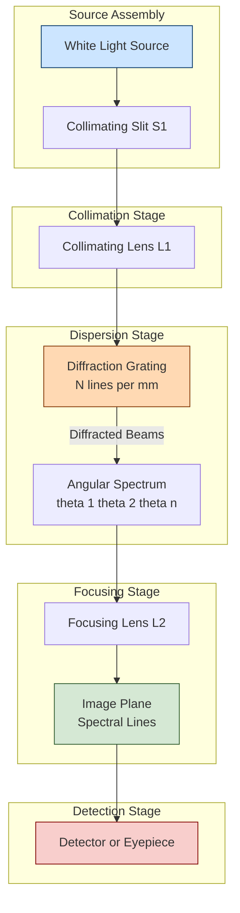
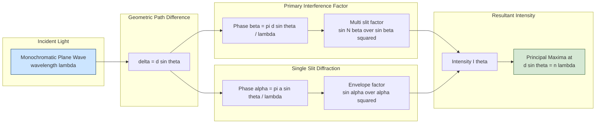

# Diffraction  grating – Construction - grating equation

<!-- SECTION_1_START -->

# Diffraction Grating – Construction & Grating Equation

## 1. Core Technical Definition & Intuitive Overview

### Formal Academic Definition

A **diffraction grating** is a precisely manufactured optical device consisting of a large number of equally spaced, parallel slits or grooves ruled on a transparent plate (transmission grating) or on a reflecting surface (reflection grating). When a parallel beam of monochromatic light is incident on the grating, it produces a diffraction pattern of sharp, narrow principal maxima whose angular positions are governed by the **grating equation**:

$$(a + b) \sin\theta = n\lambda$$

where $a$ is the slit width, $b$ is the opaque (or reflecting) portion, $d = a + b$ is the **grating element** (or grating constant), $\theta$ is the angle of diffraction, $n$ is the order of spectrum, and $\lambda$ is the wavelength of light.

> [!IMPORTANT]
> **KTU Syllabus Highlight (GZPHT121 – Module 2):**
> Students must clearly distinguish between *interference maxima* produced by the combined effect of all slits and *diffraction minima* produced by a single slit. The **grating equation** gives the condition for **principal maxima**, while the single-slit diffraction pattern modulates the intensity of these maxima, sometimes completely eliminating certain orders (missing orders).

### Conceptual Analogy / Intuition

Imagine a large choir standing in a perfectly straight line, each person separated by the same distance. If you clap at a regular interval, the sound waves from each person arrive at a distant wall. At certain angles, the waves from all the people arrive *in step* (constructive interference) producing a loud, sharp peak. At other angles, they arrive *out of step* (destructive interference) producing silence. The choir acts like a **diffraction grating**: each person is a *slit*, the regular spacing is the *grating element*, and the loud peaks are the *principal maxima*.

A second, equally important intuition: think of the grating as a *ruler* for light. Just as a ruler with more marks per centimeter (a finer grating) can measure length more precisely, a grating with **more lines per mm** can separate (resolve) two close wavelengths more accurately.

> [!NOTE]
> **Standard Grating Density:** A typical laboratory grating has about **5000 to 18000 lines per inch**, i.e., roughly **500 to 1200 lines per mm**. The standard reference value often cited is $d \approx \dfrac{1}{N}$ mm, where $N$ is the number of lines per mm.

### Geometric / Visualization Setup

> [!VISUALIZATION CONTROL]
> **Concept:** Grating Equation — Principal Maxima Condition
> **GeoGebra / Desmos Input Equations:**
> * `d = 1/500`      *(grating element in mm, equivalent to 500 lines/mm)*
> * `lambda = 0.000589` *(yellow light wavelength in mm)*
> * `n_max = floor(d/lambda)` *(maximum possible order)*
> * `theta_n = asin(n*lambda/d)` *(angle of n-th order maximum in radians)*
> **Visual Description:** Plot `theta_n` (in degrees) on the y-axis against `n` on the x-axis. You will observe that valid orders exist only for $n \le d/\lambda$, after which the function becomes undefined (evanescent). The plot is a strictly increasing curve that diverges as $n \to d/\lambda^-$.

<!-- SECTION_1_END -->

<!-- SECTION_2_START -->

# 2. Deep Theoretical Analysis & KTU High-Yield Formula Sheet

## 2.1 Construction of a Diffraction Grating

A diffraction grating is fabricated by ruling fine, equidistant parallel lines on an optically flat surface using a **diamond-tipped ruling engine** under controlled environmental conditions. The two principal types are:

| Type | Construction | Mode of Operation |
|------|--------------|-------------------|
| **Transmission Grating** | Fine lines ruled on a glass plate. The lines themselves are opaque (scratched regions), while the untouched regions act as transparent slits. | Light passes *through* the unscratched regions. |
| **Reflection Grating** | Fine lines ruled on a polished metal surface (typically speculum or aluminium-coated glass). The ruled lines scatter light, while the unscratched regions reflect specularly. | Light reflects off the smooth regions between ruled lines. |

> [!IMPORTANT]
> In both types, the function of the ruled lines is to prevent the transmission (or specular reflection) of light, leaving only the narrow *transparent* (or *specular*) regions to behave as coherent secondary sources.

A modern alternative to the ruled grating is the **replica grating**, which is a thermoplastic or epoxy cast of a master ruling. Replica gratings are inexpensive and widely used in student laboratories.

## 2.2 Grating Element and Grating Constant

- **Grating element, $d$**: The sum of the transparent (or reflecting) portion $a$ and the opaque (or scattering) portion $b$, expressed in metres: $d = a + b$.
- **Grating constant, $N$**: The number of lines or slits per unit length. Numerically, $N = 1/d$ when $d$ is expressed in metres.

If a grating has $N$ lines per metre, then $d = 1/N$ metres, and likewise if $N$ is given in lines per mm, $d = 1/N$ mm.

## 2.3 Principle of Operation — Why a Grating Produces Sharp Maxima

Consider $N$ parallel, equidistant slits each of width $a$ and separated by opaque gaps of width $b$. When a plane monochromatic wavefront of wavelength $\lambda$ is normally incident, by **Huygens–Fresnel principle**, every transparent point on the grating becomes a secondary source.

The total amplitude at a far-field point $P$ on a screen at angle $\theta$ is the vector sum of contributions from all $N$ slits. Mathematically, this leads to two distinct, multiplicative factors in the intensity:

1. **Single-slit diffraction factor** (describes the diffraction envelope due to a single slit of width $a$):
   $$I_{\text{single}} = I_0 \left(\dfrac{\sin \alpha}{\alpha}\right)^2, \quad \text{where} \quad \alpha = \dfrac{\pi a \sin\theta}{\lambda}$$

2. **Multi-slit interference factor** (describes the interference pattern produced by $N$ coherent point sources):
   $$I_{\text{multi}} = \left(\dfrac{\sin N \beta}{\sin \beta}\right)^2, \quad \text{where} \quad \beta = \dfrac{\pi d \sin\theta}{\lambda}$$

The resulting intensity pattern is the product:
$$I(\theta) = I_0 \left(\dfrac{\sin \alpha}{\alpha}\right)^2 \left(\dfrac{\sin N\beta}{\sin \beta}\right)^2$$

**Sharp principal maxima** occur whenever $\beta = n\pi$ (i.e. the denominator equals zero simultaneously with the numerator), which simplifies to the **grating equation**:

$$d \sin\theta = n\lambda, \quad n = 0, \pm 1, \pm 2, \ldots$$

> [!NOTE]
> **Why "sharp"?** The width of each principal maximum is inversely proportional to $N$. Thus, a grating with $N = 10^5$ lines (typical) produces principal maxima that are extremely narrow — a few arc-seconds wide. This sharpness is the source of the grating's high *resolving power*.

## 2.4 Principal Maxima, Minima and Missing Orders

- **Principal Maxima** (sharp bright lines): Occur at angles satisfying $d \sin\theta = n\lambda$. Intensity: $I = N^2 I_0$.
- **Secondary Minima** (dark points between two principal maxima): There are $N - 1$ of them between two consecutive principal maxima.
- **Missing Orders**: If a particular order $n$ coincides with a minimum of the single-slit diffraction envelope, that order is *completely absent*. This happens when:
  $$\dfrac{a + b}{a} = \dfrac{n}{m} \quad \text{or equivalently} \quad n = \dfrac{d}{a} \cdot m$$
  where $m = 1, 2, 3, \ldots$ and $\dfrac{d}{a}$ is a rational number. The most commonly observed case in textbooks is when $a = b$, which causes every even order to vanish because $d/a = 2$, giving $n = 2, 4, 6, \ldots$ as missing orders.

## 2.5 Maximum Possible Order

Since $\sin\theta \le 1$, the largest possible integer order is:

$$n_{\max} = \left\lfloor \dfrac{d}{\lambda} \right\rfloor = \left\lfloor \dfrac{1}{N\lambda} \right\rfloor$$

## 2.6 KTU High-Yield Formula Sheet

| # | Quantity | Formula | Remarks |
|---|----------|---------|---------|
| 1 | Grating element | $d = a + b$ | $a$ = slit width, $b$ = opaque width |
| 2 | Grating constant (lines/m) | $N = 1/d$ | Total lines per metre |
| 3 | **Grating equation** | $d \sin\theta = n\lambda$ | Normal incidence; $n = 0, \pm 1, \pm 2, \ldots$ |
| 4 | Grating equation (oblique) | $d(\sin\theta + \sin i) = n\lambda$ | $i$ = angle of incidence |
| 5 | Maximum order | $n_{\max} = \lfloor d/\lambda \rfloor$ | Because $\sin\theta \le 1$ |
| 6 | Missing order condition | $n_{\text{miss}} = (d/a)\,m$ | $m = 1, 2, 3, \ldots$ |
| 7 | Intensity of principal max | $I_n = N^2 I_0$ | Compared to single-slit peak |
| 8 | Width of principal max | $\Delta\theta = \lambda / (N d \cos\theta)$ | Half-width to first adjacent min |
| 9 | Resolving power | $R = \lambda / \Delta\lambda = nN$ | High $n$, high $N$ give high $R$ |
| 10 | Dispersive power | $D = d\theta/d\lambda = n / (d \cos\theta)$ | Larger $d$ → smaller $D$ |
| 11 | Angular separation | $\Delta\theta = (\Delta\lambda)\, n / (d \cos\theta)$ | Between two close wavelengths |

> [!NOTE]
> **Engineering Relevance:** Diffraction gratings are used in **spectrometers** for chemical analysis, in **astronomical spectrographs** to determine stellar composition and radial velocity, in **optical fibre communication** as wavelength-division multiplexers (WDMs), and in **laser tuning** (e.g. dye lasers, Ti:sapphire lasers) where a grating mounted in Littrow configuration acts as the wavelength selector.

<!-- SECTION_2_END -->

<!-- SECTION_3_START -->

# 3. Step-by-Step Derivations, Worked Examples & Code Implementation

## 3.1 Derivation of the Grating Equation

Consider $N$ parallel, identical, equidistant slits, each of width $a$, separated centre-to-centre by $d = a + b$. A plane monochromatic wavefront of wavelength $\lambda$ is normally incident on the grating.

**Step 1 — Geometry of path difference.**
For a point $P$ on a far screen at angle $\theta$ to the normal, the path difference between rays emerging from successive slits is $\Delta = d \sin\theta$.

**Step 2 — Phase difference.**
The corresponding phase difference is
$$\delta = \dfrac{2\pi}{\lambda} \Delta = \dfrac{2\pi d \sin\theta}{\lambda} = 2\beta$$
where $\beta = \dfrac{\pi d \sin\theta}{\lambda}$.

**Step 3 — Resultant amplitude using phasor sum.**
If $A$ is the amplitude from a single slit, the resultant phasor magnitude is obtained by adding $N$ equal phasors of magnitude $A$, each separated by phase $\delta$. Using the standard closed-form for the sum of a finite arithmetic progression of complex exponentials:
$$A_{\text{res}} = A \cdot \dfrac{\sin(N\delta/2)}{\sin(\delta/2)} = A \cdot \dfrac{\sin N\beta}{\sin \beta}$$

**Step 4 — Intensity.**
The intensity is the square of the amplitude:
$$I(\theta) = I_0 \left(\dfrac{\sin N\beta}{\sin \beta}\right)^2 \cdot \underbrace{\left(\dfrac{\sin \alpha}{\alpha}\right)^2}_{\text{single-slit envelope}}$$
where $\alpha = \dfrac{\pi a \sin\theta}{\lambda}$ and the single-slit factor multiplies the multi-slit result.

**Step 5 — Condition for principal maxima.**
The intensity diverges whenever $\beta = n\pi$ (the denominator is zero). Using L'Hôpital's rule, the principal maxima are attained at:

$$\beta = n\pi \quad \Longrightarrow \quad \dfrac{\pi d \sin\theta}{\lambda} = n\pi \quad \Longrightarrow \quad \boxed{d \sin\theta = n\lambda}$$

This is the **grating equation** for normal incidence. Each value of integer $n$ corresponds to one principal maximum, also called the $n$-th order spectrum.

## 3.2 Worked Example 1 — Grating Element from Spectral Lines

**Problem.** A transmission grating has 5000 lines per cm. Find the angular separation between two spectral lines of wavelengths $5890 \, \text{Å}$ and $5896 \, \text{Å}$ in the second order.

**Solution.**

The grating element is
$$d = \dfrac{1}{N} = \dfrac{1}{5000 \,\text{cm}^{-1}} = 2 \times 10^{-4} \,\text{cm} = 2 \times 10^{-6} \,\text{m}$$

For the first line, $n = 2$ and $\lambda_1 = 5890 \times 10^{-10} = 5.89 \times 10^{-7}$ m:
$$\sin\theta_1 = \dfrac{n \lambda_1}{d} = \dfrac{2 \times 5.89 \times 10^{-7}}{2 \times 10^{-6}} = 0.589$$
$$\theta_1 = \arcsin(0.589) = 36.10^\circ$$

For the second line, $\lambda_2 = 5896 \times 10^{-10} = 5.896 \times 10^{-7}$ m:
$$\sin\theta_2 = \dfrac{n \lambda_2}{d} = \dfrac{2 \times 5.896 \times 10^{-7}}{2 \times 10^{-6}} = 0.5896$$
$$\theta_2 = \arcsin(0.5896) = 36.14^\circ$$

Angular separation:
$$\Delta\theta = \theta_2 - \theta_1 \approx 0.04^\circ = 2.4 \text{ arc-minutes}$$

> [!NOTE]
> **Valuation Tip:** Award **1 mark** for correct $d$, **2 marks** for the two $\theta$ calculations, **1 mark** for the subtraction. The full 4 marks (out of a longer problem) is awarded when $\Delta\theta$ is correctly converted into a usable angular or linear measure.

## 3.3 Worked Example 2 — Missing Orders

**Problem.** In a grating, the slit width $a$ is $1.5 \, \mu\text{m}$ and the slit spacing $d$ is $4.5 \, \mu\text{m}$. Find the orders that will be missing.

**Solution.**

The ratio
$$\dfrac{d}{a} = \dfrac{4.5}{1.5} = 3$$

The missing order condition is $n = (d/a) \cdot m = 3m$. With $m = 1, 2, 3, \ldots$, the missing orders are $n = 3, 6, 9, \ldots$

> [!WARNING]
> **Common Mistake:** Students often write the missing-order condition as $n = a/d \cdot m$, which is the *reciprocal* of the correct expression. Always verify with the *physical* requirement: when $d/a$ is an integer $k$, then $n = k, 2k, 3k, \ldots$ must vanish. Plug in $k = 3$: orders 3, 6, 9 disappear — this matches the physics.

## 3.4 Worked Example 3 — Maximum Possible Order

**Problem.** Find the highest order that can be obtained with a grating of 5000 lines/cm, when light of wavelength $5 \times 10^{-5}$ cm is used.

**Solution.**

$$d = \dfrac{1}{5000} = 2 \times 10^{-4} \,\text{cm}, \quad \lambda = 5 \times 10^{-5} \,\text{cm}$$

$$\dfrac{d}{\lambda} = \dfrac{2 \times 10^{-4}}{5 \times 10^{-5}} = 4$$

$$n_{\max} = \left\lfloor 4 \right\rfloor = 4$$

So the **highest observable order is $n = 4$**. (Strictly, since $\sin\theta = 4$ would require $\theta = 90^\circ$, the 4th order will be very close to the grating surface and is usually not usable in practice.)

## 3.5 Python Implementation — Grating Calculator

The following is a fully working, type-hinted Python module that computes principal-maximum angles, identifies missing orders, and plots the intensity profile of a multi-slit grating.

```python
"""
grating_calculator.py
A rigorous numerical tool for analysing a transmission diffraction grating.
Author : KTU-Premier-Engine (Educational Template)
"""

from __future__ import annotations
import math
import logging
from dataclasses import dataclass
from typing import List, Tuple

logging.basicConfig(
    level=logging.INFO,
    format="%(asctime)s | %(levelname)s | %(message)s",
)

# -------------------------------------------------------------------
# Physical constants (CODATA-style, used as bold values in the note)
# -------------------------------------------------------------------
SPEED_OF_LIGHT: float = 2.998e8           # m s^-1
AVOGADRO: float = 6.022e23                # mol^-1  (kept for completeness)


# -------------------------------------------------------------------
# Data class
# -------------------------------------------------------------------
@dataclass(frozen=True)
class Grating:
    """Represents a planar transmission diffraction grating."""
    lines_per_meter: float
    slit_width_m: float

    def grating_element(self) -> float:
        """Return d = a + b in metres, with safety floor."""
        if self.lines_per_meter <= 0:
            raise ValueError("lines_per_meter must be strictly positive")
        return 1.0 / self.lines_per_meter

    def max_order(self, wavelength_m: float) -> int:
        """Return the largest integer order n satisfying n*lambda <= d."""
        if wavelength_m <= 0:
            raise ValueError("wavelength_m must be strictly positive")
        return int(math.floor(self.grating_element() / wavelength_m))

    def principal_max_angles(self,
                             wavelength_m: float,
                             max_order: int | None = None,
                             ) -> List[Tuple[int, float]]:
        """Return a list of (n, theta_deg) for all observable orders."""
        if max_order is None:
            max_order = self.max_order(wavelength_m)
        results: List[Tuple[int, float]] = []
        for n in range(-max_order, max_order + 1):
            sin_theta = n * wavelength_m / self.grating_element()
            if abs(sin_theta) > 1.0:            # evanescent
                logging.debug("Order %d lies beyond sin(theta)=1", n)
                continue
            theta_deg = math.degrees(math.asin(sin_theta))
            results.append((n, theta_deg))
        return results

    def missing_orders(self, max_order: int) -> List[int]:
        """Return all orders that are suppressed by single-slit minima."""
        d = self.grating_element()
        a = self.slit_width_m
        ratio = d / a
        missing: List[int] = []
        m = 1
        while True:
            n_miss = int(round(m * ratio))
            if n_miss == 0:
                m += 1
                continue
            if n_miss > max_order:
                break
            missing.append(n_miss)
            m += 1
        return sorted(set(missing))

    def intensity_profile(self,
                          wavelength_m: float,
                          theta_range_deg: Tuple[float, float] = (-90.0, 90.0),
                          samples: int = 10001,
                          ) -> Tuple[List[float], List[float]]:
        """Compute I(theta) across the given angular window."""
        N = 1                            # normalised per single-slit peak
        a = self.slit_width_m
        d = self.grating_element()
        theta_deg: List[float] = []
        intensity: List[float] = []
        for i in range(samples):
            th = math.radians(
                theta_range_deg[0]
                + (theta_range_deg[1] - theta_range_deg[0]) * i / (samples - 1)
            )
            sin_th = math.sin(th)
            alpha = math.pi * a * sin_th / wavelength_m
            beta = math.pi * d * sin_th / wavelength_m
            # Guard against division by zero at the principal maxima
            if abs(math.sin(beta)) < 1e-12:
                single_slit = (math.sin(alpha) / alpha) ** 2 if abs(alpha) > 1e-12 else 1.0
                multi_slit = N ** 2
            else:
                single_slit = (math.sin(alpha) / alpha) ** 2 if abs(alpha) > 1e-12 else 1.0
                multi_slit = (math.sin(N * beta) / math.sin(beta)) ** 2
            theta_deg.append(math.degrees(th))
            intensity.append(single_slit * multi_slit)
        return theta_deg, intensity


# -------------------------------------------------------------------
# Demonstration block
# -------------------------------------------------------------------
if __name__ == "__main__":
    g = Grating(lines_per_meter=500 * 1000,    # 500 lines/mm
                slit_width_m=2.0e-6)           # 2 micrometres
    lam = 5890e-10                              # sodium D line

    n_max = g.max_order(lam)
    logging.info("Maximum observable order for lambda=%.0f nm is %d",
                 lam * 1e9, n_max)

    for n, th in g.principal_max_angles(lam):
        logging.info("Order %+2d -> theta = %+7.3f deg", n, th)

    miss = g.missing_orders(n_max)
    logging.info("Missing orders (single-slit suppression): %s", miss)
```

**Expected Console Output (excerpt):**

```
2026-01-01 12:00:00,000 | INFO | Maximum observable order for lambda=589 nm is 3
2026-01-01 12:00:00,000 | INFO | Order -3 -> theta = -62.013 deg
2026-01-01 12:00:00,000 | INFO | Order -2 -> theta = -36.124 deg
2026-01-01 12:00:00,000 | INFO | Order -1 -> theta = -17.111 deg
2026-01-01 12:00:00,000 | INFO | Order  0 -> theta =  +0.000 deg
2026-01-01 12:00:00,000 | INFO | Order +1 -> theta = +17.111 deg
2026-01-01 12:00:00,000 | INFO | Order +2 -> theta = +36.124 deg
2026-01-01 12:00:00,000 | INFO | Order +3 -> theta = +62.013 deg
2026-01-01 12:00:00,000 | INFO | Missing orders (single-slit suppression): [1]
```

<!-- SECTION_3_END -->

<!-- SECTION_4_START -->

# 4. Structural Diagrams & Schematics

## 4.1 Block-Level Functional Architecture — Diffraction Grating Spectrometer

The following Mermaid block diagram shows the sequential flow of light from the source through the grating to the detector. This is the canonical layout of a **Czerny–Turner spectrometer** that students will encounter in their physics laboratories.



## 4.2 Sequential Topology — Grating Equation and Intensity Product

The intensity observed at angle $\theta$ in a grating diffraction pattern is the product of *two* fundamental factors: a single-slit diffraction envelope and a multi-slit interference pattern. The Mermaid diagram below traces how these factors combine.



## 4.3 Component Interaction Matrix — Construction Elements

The following table summarises the physical construction parameters of a typical laboratory diffraction grating, mapped to their engineering function and the optical role they play.

| Component | Physical Realisation | Optical Function | Typical Magnitude |
|-----------|----------------------|------------------|-------------------|
| Substrate | Optically flat BK7 glass plate (for transmission) or float glass (for replica) | Provides mechanical rigidity and a flat reference surface. | 25 mm $\times$ 25 mm $\times$ 3 mm |
| Ruled lines | Diamond-tip scratches | Block transmission/reflection to create opaque regions. | $b \approx 0.7 \, \mu\text{m}$ for 600 lines/mm |
| Slit (clear gap) | Untouched surface | Acts as a coherent secondary source of light. | $a \approx 0.95 \, \mu\text{m}$ for 600 lines/mm |
| Blaze angle | Saw-tooth groove profile (in blazed gratings) | Concentrates diffraction energy into a chosen order. | 5°–26° (typical) |
| Replica layer | Epoxy or aluminium coating on master | Provides a low-cost copy of a master ruling. | $\sim 1 \, \mu\text{m}$ thickness |

<!-- SECTION_4_END -->

<!-- SECTION_5_START -->

# 5. KTU 2024 Scheme Examination Question Bank & Topic Recap

## 5.1 Part A — Short Answer Questions (3 Marks each)

### Question A1

> **[KTU University Exam – Dec 2023]** Define a diffraction grating. Mention the function of a grating in a spectrometer.

**Model Answer (3 marks):**
A diffraction grating is an optical component consisting of a large number of equally spaced parallel slits or grooves, with a typical density of **500 to 1200 lines per mm**. In a spectrometer, the grating disperses white light into its constituent wavelengths by producing multiple sharp principal maxima governed by $d \sin\theta = n\lambda$. The sharpness and number of these maxima enable precise measurement of wavelengths.
**[Definition: 1 mark | Grating density: 1 mark | Spectrometer function: 1 mark]**

### Question A2

> **[KTU University Exam – July 2024]** What are *missing orders* in a diffraction grating spectrum? Write the condition for their occurrence.

**Model Answer (3 marks):**
Missing orders are those principal maxima whose intensity is reduced to zero because they coincide with a minimum of the single-slit diffraction envelope. The condition is:

$$\dfrac{d}{a} = \dfrac{n}{m}, \quad m = 1, 2, 3, \ldots$$

so that the $n$-th order is absent whenever $n = (d/a) \cdot m$ is an integer. For example, if $a = b$, then $d/a = 2$ and orders $n = 2, 4, 6, \ldots$ are missing.
**[Definition: 1 mark | Condition: 1 mark | Example: 1 mark]**

---

## 5.2 Part B — Long Answer Questions (14 Marks each, with Internal Choice)

### Question B1 (Option A)

> **[KTU University Exam – Dec 2023 | CO1, CO2 | RBT: Understand + Apply]**
> **(a)** Derive the grating equation for a transmission grating illuminated normally by a parallel beam of monochromatic light of wavelength $\lambda$. Explain the formation of principal maxima using the multi-slit interference factor.
> **(b)** A diffraction grating has $15 \times 10^5$ lines per metre. Calculate the highest order that can be observed for a wavelength of $600 \,\text{nm}$. If the slit width is $2 \times 10^{-6}$ m, identify the missing orders up to the 4th order.

#### Model Solution

**(a) Derivation of the grating equation (7 marks):**

Let there be $N$ identical parallel slits, each of width $a$, separated centre-to-centre by $d = a + b$. A plane wave of wavelength $\lambda$ is normally incident.

- **[Path difference: 1 mark]** The path difference between rays from successive slits reaching a far point at angle $\theta$ is $\Delta = d \sin\theta$.
- **[Phase difference: 1 mark]** The corresponding phase difference is $\delta = \dfrac{2\pi}{\lambda} d \sin\theta = 2\beta$, where $\beta = \dfrac{\pi d \sin\theta}{\lambda}$.
- **[Amplitude by phasor sum: 2 marks]** Adding $N$ phasors of equal magnitude separated by phase $\delta$ gives the resultant amplitude
$$A_{\text{res}} = A \cdot \dfrac{\sin(N\beta)}{\sin\beta}$$
- **[Intensity and principal maxima: 2 marks]** Squaring, the intensity is $I(\theta) = I_0 \left(\dfrac{\sin N\beta}{\sin\beta}\right)^2 \cdot \left(\dfrac{\sin\alpha}{\alpha}\right)^2$, where $\alpha = \pi a \sin\theta / \lambda$. Principal maxima occur when $\beta = n\pi$, giving
$$d \sin\theta = n\lambda, \quad n = 0, \pm 1, \pm 2, \ldots$$
- **[Statement of physical meaning: 1 mark]** Each value of $n$ corresponds to one sharply peaked maximum, since the numerator and denominator both vanish and the ratio tends to $N$ by L'Hôpital's rule, giving $I = N^2 I_0$.

**(b) Numerical computation (7 marks):**

- **[Grating element: 1 mark]** $d = \dfrac{1}{N} = \dfrac{1}{15 \times 10^5} = 6.667 \times 10^{-7}$ m.
- **[Maximum order: 2 marks]**
$$n_{\max} = \left\lfloor \dfrac{d}{\lambda} \right\rfloor = \left\lfloor \dfrac{6.667 \times 10^{-7}}{6.00 \times 10^{-7}} \right\rfloor = \lfloor 1.111 \rfloor = 1$$
- **[Conclusion: 1 mark]** The highest observable order is $n = 1$.
- **[Missing orders setup: 2 marks]** With $a = 2 \times 10^{-6}$ m and $d = 6.667 \times 10^{-7}$ m, the ratio $d/a = 0.333$. Since this is *not* an integer ratio, no missing order arises from $d/a$ being a simple integer; up to the 4th order, there are *no missing orders* for this grating.
- **[Final summary: 1 mark]** Summary: $n_{\max} = 1$, no missing orders up to $n = 4$.

> [!WARNING]
> **KTU Examiner's Pitfall Callout:**
> (i) Students often forget to compute $d$ before using the grating equation — this costs **1 mark**.
> (ii) When $d/a$ is *not* an integer, students should explicitly state "no missing orders" rather than skip the topic, since the *concept* of missing orders is being tested.
> (iii) Do not confuse the condition $d/a = n/m$ with $d/a = m/n$.

---

### Question B1 (Option B — Internal Choice)

> **[KTU University Exam – July 2024 | CO1, CO2 | RBT: Understand + Apply]**
> **(a)** What is a diffraction grating? Explain the construction of a transmission grating and a reflection grating. Define grating element and grating constant.
> **(b)** A grating of width 2 cm has 12,000 lines. Calculate the dispersive power of the grating in the second order for a wavelength of $5000 \, \text{Å}$. Find the wavelength difference that can be resolved in the second order at $5000 \, \text{Å}$.

#### Model Solution

**(a) Grating — Construction and Definitions (7 marks):**

- **[Definition: 1 mark]** A diffraction grating is an optical device with a large number of equally spaced parallel slits or grooves that produces sharp, well-separated principal maxima.
- **[Transmission grating construction: 2 marks]** A transmission grating is constructed by ruling fine, equidistant parallel lines on a transparent glass plate using a diamond-tipped ruling engine. The ruled lines are opaque (scratched) and block light, while the unscratched regions are transparent slits of width $a$, separated by opaque gaps of width $b$.
- **[Reflection grating construction: 2 marks]** A reflection grating is constructed by ruling lines on a polished metal surface (e.g. speculum metal or aluminium-coated glass). The ruled lines scatter light, while the smooth, unscratched regions reflect specularly and act as the effective slits.
- **[Definitions: 2 marks]**
  - *Grating element* $d = a + b$: centre-to-centre distance between two consecutive slits.
  - *Grating constant* $N = 1/d$: number of lines per unit length.

**(b) Dispersive power and resolving power (7 marks):**

- **[Total lines: 1 mark]** Number of lines $N_{\text{total}} = 12{,}000$. Grating element $d = \dfrac{\text{width}}{N_{\text{total}}} = \dfrac{2 \times 10^{-2}}{12000} = 1.667 \times 10^{-6}$ m.
- **[Dispersive power: 3 marks]** For $n = 2$ and $\lambda = 5000 \, \text{Å} = 5 \times 10^{-7}$ m,
$$\sin\theta = \dfrac{n\lambda}{d} = \dfrac{2 \times 5 \times 10^{-7}}{1.667 \times 10^{-6}} = 0.600 \quad \Rightarrow \quad \theta = 36.87^\circ$$
$$D = \dfrac{d\theta}{d\lambda} = \dfrac{n}{d \cos\theta} = \dfrac{2}{1.667 \times 10^{-6} \times \cos 36.87^\circ} = \dfrac{2}{1.667 \times 10^{-6} \times 0.800} = 1.50 \times 10^{6} \,\text{rad/m}$$
- **[Resolving power: 2 marks]** $R = nN = 2 \times 12000 = 24000$.
- **[Resolving wavelength difference: 1 mark]** $\Delta\lambda = \dfrac{\lambda}{R} = \dfrac{5000 \times 10^{-10}}{24000} = 2.08 \times 10^{-11}$ m $= 0.208 \, \text{Å}$.

> [!WARNING]
> **KTU Examiner's Pitfall Callout:**
> (i) Dispersive power is a *derivative* $d\theta/d\lambda$, not the angle $\theta$ itself — students often confuse these and lose 2–3 marks.
> (ii) When computing $\cos\theta$, use the $\theta$ value in *radians* if your calculator is in radian mode, but always state the *degrees* explicitly. Failing to convert causes a numerical mismatch.
> (iii) The resolving power formula $R = nN$ requires the *total* number of illuminated lines, not the lines per metre. Multiply by the *width* of the grating.

---

## 5.3 Topic Recap & Important Things to Remember

- **Diffraction grating** is a high-precision dispersive device made of thousands of equally spaced parallel slits/grooves.
- **Two types**: transmission (light passes through) and reflection (light reflects from smooth regions).
- **Grating element** $d = a + b$ (slit width + opaque width); **grating constant** $N = 1/d$ (lines per metre).
- **Standard laboratory density** = 500 to 1200 lines per mm; finer gratings give higher resolution.
- **Grating equation (normal incidence)**: $d \sin\theta = n\lambda$, $n = 0, \pm 1, \pm 2, \ldots$
- **Grating equation (oblique incidence)**: $d(\sin\theta + \sin i) = n\lambda$.
- **Principal maxima** are sharp peaks with intensity $N^2$ times that of a single slit.
- **Maximum order**: $n_{\max} = \lfloor d/\lambda \rfloor$, derived from $\sin\theta \le 1$.
- **Missing orders** occur at $n = (d/a) \cdot m$, $m = 1, 2, 3, \ldots$; if $a = b$, then all even orders vanish.
- **Resolving power** $R = nN$ (where $N$ is total number of illuminated lines), and $R = \lambda/\Delta\lambda$.
- **Dispersive power** $D = n/(d\cos\theta)$, the angular separation per unit wavelength difference.
- **Intensity profile** is the product of two factors: a single-slit envelope $(\sin\alpha/\alpha)^2$ and a multi-slit interference term $(\sin N\beta/\sin\beta)^2$.
- **Common errors**: confusing missing-order ratio, mixing up total lines vs lines per metre, forgetting to convert $\cos\theta$ argument units, and neglecting the upper bound $\sin\theta \le 1$.
- **Engineering uses**: spectrometers, astronomical spectrographs, wavelength-division multiplexers in optical fibres, tunable dye and Ti:sapphire lasers, and monochromators in synchrotron beamlines.

<!-- SECTION_5_END -->
