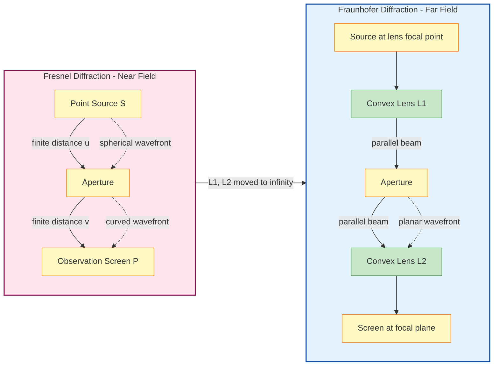
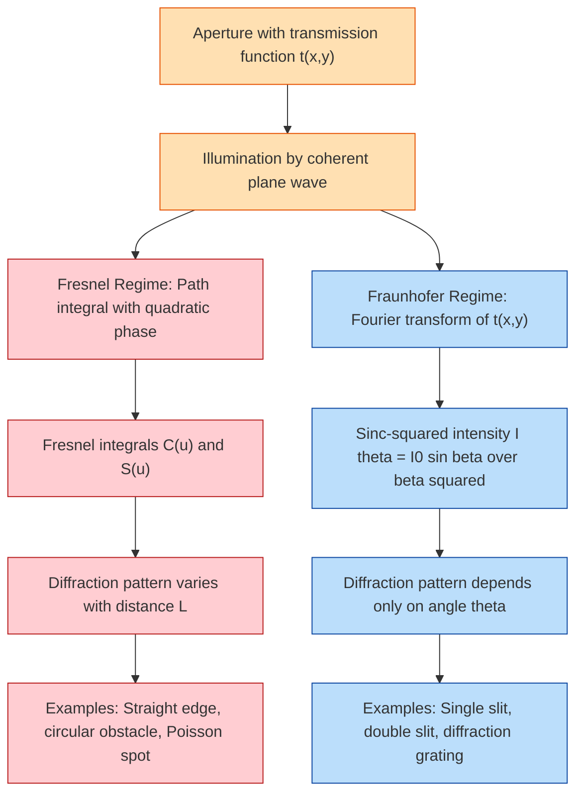
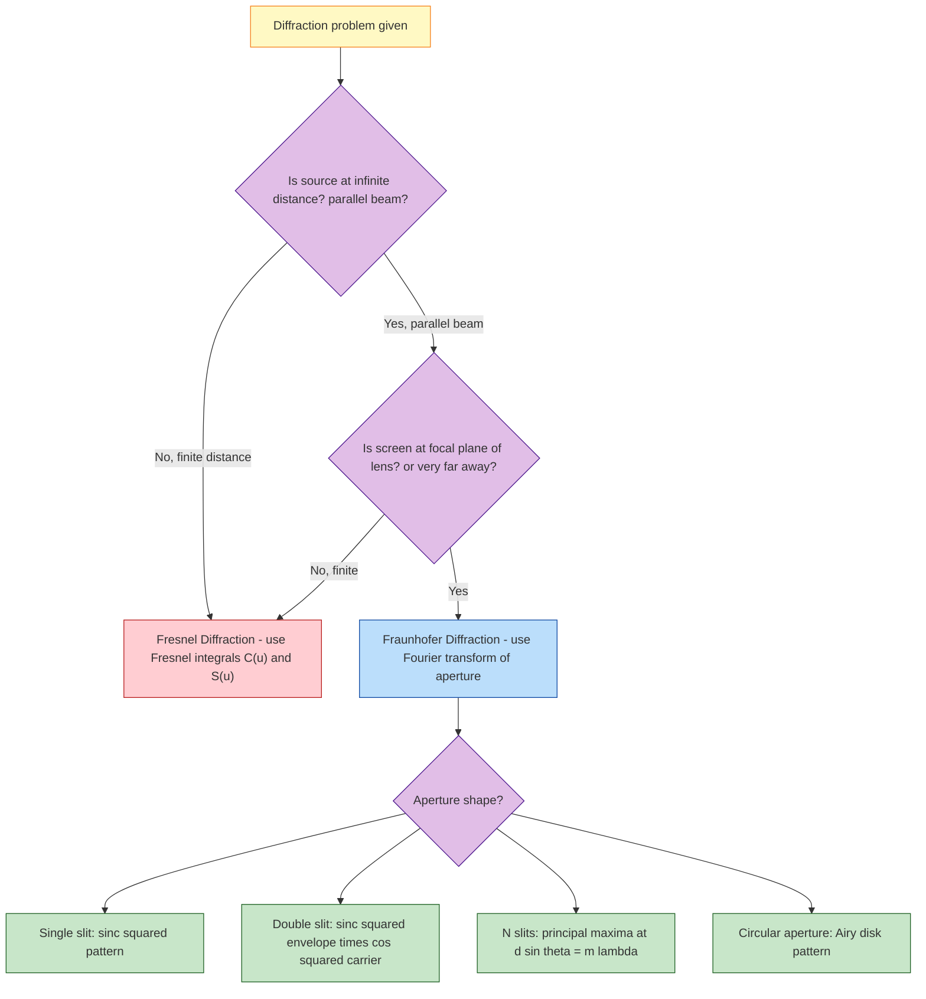
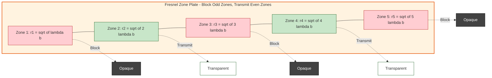

# Diffraction-types of diffraction

<!-- SECTION_1_START -->
# Diffraction — Types of Diffraction

## 1.1 Core Technical Definition

**Diffraction** is the phenomenon of bending of light waves around the edges of an aperture or obstacle when the size of the aperture or obstacle is comparable to the wavelength of light. The light deviates from its straight-line path and spreads into the region of geometric shadow, producing alternate bright and dark bands (or bright and dark fringes) known as the **diffraction pattern**.

In the rigorous formulation of wave optics, diffraction is a direct consequence of **Huygens–Fresnel principle**, which states that every unobstructed point of a wavefront acts as a secondary source of spherical wavelets, and the resultant field at any later point is the **coherent superposition** of all these wavelets.

> [!IMPORTANT]
> **KTU 2024 Syllabus Definition (Module 2):**
> Diffraction is classified into two principal categories — **Fresnel Diffraction** (also called *near-field diffraction*) and **Fraunhofer Diffraction** (also called *far-field diffraction*). This classification is based on the relative positions of the source, the aperture/obstacle, and the observation screen.

### 1.2 Conceptual Analogy / Intuition

Imagine you are standing at the edge of a still pond. You drop a small stone, and the ripple spreads outward as a clean, expanding circle. Now imagine a wide concrete wall sits between you and the pond, with a small slit in the middle. When the ripple reaches the slit, instead of continuing as a thin straight beam, **the wavefront spreads out from the slit as if the slit itself were a new source of circular ripples**. This spreading is diffraction in its purest form.

- If you stand **very close** to the slit, the wavefronts you see are still curved (the geometry is complex). This is analogous to **Fresnel diffraction**.
- If you walk far away (or use a converging lens), the wavefronts become effectively **flat / parallel**, and the geometry simplifies dramatically. This is analogous to **Fraunhofer diffraction**.

The transition between the two regimes is governed by the **Fresnel number**:

$$N_F = \frac{a^2}{L \,\lambda}$$

where $a$ is the aperture size, $L$ is the distance to the screen, and $\lambda$ is the wavelength. When $N_F \gg 1$, Fresnel effects dominate; when $N_F \ll 1$, Fraunhofer approximations are valid.

> [!NOTE]
> **Critical Distinction for KTU Examinations:**
> - In **Fresnel diffraction**, the source and/or screen are at a *finite* distance from the aperture. Wavefronts are spherical or cylindrical. The mathematics requires curved wavefront integration (Fresnel integrals).
> - In **Fraunhofer diffraction**, the source and screen are at *effectively infinite* distance. Wavefronts are planar. The mathematics reduces to a **Fourier transform** of the aperture function — a concept heavily used in optics, signal processing, and imaging.

### 1.3 Visual Representation of the Two Regimes

> [!VISUALIZATION CONTROL]
> **Concept:** Geometry of Fresnel vs. Fraunhofer diffraction setups
> **Desmos/GeoGebra Input Equations (for source position $S$ on negative x-axis at $x=-L$, aperture at $x=0$, screen at $x=+L$):**
> * Source point: $(-L,\ 0)$
> * Aperture width markers: $(-a/2,\ 0)$ and $(+a/2,\ 0)$
> * Observation point: $(+L,\ y)$
> * Curved wavefront: implicit curve $x^2 + y^2 = R^2$ (Fresnel)
> * Straight wavefront: horizontal line $y = \text{const}$ (Fraunhofer, after lens or at $\infty$)
> **Visual Description:** The student should observe that in Fresnel geometry the rays from source to screen converge as curves through the aperture, while in Fraunhofer geometry the rays are drawn as straight, parallel lines arriving perpendicular to the screen — emphasizing the simplification of the wavefront shape.

<!-- SECTION_1_END -->

<!-- SECTION_2_START -->
# Deep Theoretical Analysis & KTU High-Yield Formula Sheet

## 2.1 Classification of Diffraction

The classification of diffraction is based on the **relative path differences** of secondary wavelets arriving at the observation point. The two principal types are:

### 2.1.1 Fresnel Diffraction (Near-Field Diffraction)

**Setup:** The source $S$ and the screen $P$ are placed at **finite distances** from the aperture (or obstacle).

**Key Characteristics:**
- Incident wavefronts are **spherical** (for a point source) or **cylindrical** (for a line source).
- The phase difference between secondary wavelets at the observation point is governed by the **exact quadratic** terms in the path length expansion.
- The mathematical treatment requires the use of **Fresnel integrals**, defined as:
$$C(u) = \int_0^u \cos\!\left(\frac{\pi t^2}{2}\right) dt, \qquad S(u) = \int_0^u \sin\!\left(\frac{\pi t^2}{2}\right) dt$$
- The intensity at the observation point is $I \propto \left[ C(u_2) - C(u_1) \right]^2 + \left[ S(u_2) - S(u_1) \right]^2$.
- The diffraction pattern depends sensitively on the **exact distance** from the aperture.
- Common experimental examples: diffraction at a **straight edge**, a **narrow slit**, a **circular aperture**, or a **circular obstacle (Poisson's spot)**.

**Physical insight:** Because of finite geometry, different zones of the aperture (Huygens–Fresnel half-period zones) contribute unequally. The resultant amplitude is the alternating sum of contributions from successive half-period zones.

### 2.1.2 Fraunhofer Diffraction (Far-Field Diffraction)

**Setup:** The source $S$ and the observation screen $P$ are at **effectively infinite** distances from the aperture. In practice, this is achieved by:
- Placing the source at the **focal point of a converging lens** (incoming parallel beam), and
- Placing the screen at the **focal plane of another converging lens** (outgoing parallel beam), or
- Using a source and screen sufficiently far from the aperture that the wavefronts can be approximated as planar.

**Key Characteristics:**
- Incident and diffracted wavefronts are **planar**.
- The phase difference between secondary wavelets is given by a **linear** function of the aperture coordinate.
- The mathematical treatment reduces to a **Fourier transform** of the aperture transmission function $t(x, y)$:
$$U(P_0) \propto \int\!\!\int t(x, y) \, e^{-i k (x \sin\theta_x + y \sin\theta_y)} \, dx \, dy$$
- The diffraction pattern is observed at a **fixed distance** and is independent of the exact source-to-aperture distance (only the angular distribution matters).
- Common experimental examples: **single-slit diffraction**, **double-slit diffraction**, and **diffraction grating** patterns.

**Physical insight:** Fraunhofer diffraction is the spatial-frequency spectrum of the aperture. Larger apertures produce narrower central maxima; smaller apertures produce broader diffraction patterns.

## 2.2 Comparative Analysis: Fresnel vs. Fraunhofer

| Feature | Fresnel Diffraction | Fraunhofer Diffraction |
|---|---|---|
| **Source distance** | Finite | Effectively infinite |
| **Screen distance** | Finite | Effectively infinite |
| **Wavefront shape** | Spherical / Cylindrical | Planar (after collimation) |
| **Mathematical basis** | Fresnel integrals $C(u)$, $S(u)$ | Fourier transform of aperture |
| **Phase approximation** | Quadratic terms in path | Linear terms in path |
| **Experimental setup** | Source $\to$ Aperture $\to$ Screen directly | Two lenses + source at $f_1$, screen at $f_2$ |
| **Fresnel number $N_F$** | $N_F \gtrsim 1$ | $N_F \ll 1$ |
| **Pattern sensitivity** | Sensitive to screen distance | Independent of distance (only angle matters) |
| **Examples** | Straight edge, circular obstacle | Single slit, double slit, grating |
| **Practical lens equivalent** | Lens at infinity (no lens) | Two convex lenses in series |

## 2.3 KTU High-Yield Formula Sheet

> [!IMPORTANT]
> The following equations are **must-know** for KTU 2024 Scheme ESE (End Semester Examination) under Module 2. Marks are frequently awarded for correct identification of the regime and the relevant formula.

| # | Quantity | Formula | Symbol Meaning |
|---|---|---|---|
| 1 | Fresnel number | $N_F = \dfrac{a^2}{L \lambda}$ | $a$ = aperture size, $L$ = distance, $\lambda$ = wavelength |
| 2 | Fraunhofer condition | $N_F \ll 1$ | Far-field limit |
| 3 | Fresnel condition | $N_F \gtrsim 1$ | Near-field limit |
| 4 | Fresnel half-period zone radius | $r_n = \sqrt{n \lambda b}$ | $n$ = zone number, $b$ = distance to screen |
| 5 | Area of $n$-th half-period zone | $A_n = \pi b \lambda$ | Independent of $n$ |
| 6 | Resultant amplitude (full aperture, no obstruction) | $A \approx \dfrac{A_1}{2}$ | $A_1$ = amplitude from first zone |
| 7 | Diffraction at circular obstacle (Poisson spot) | Bright spot at center of geometric shadow | Discovered by Poisson, verified by Arago |
| 8 | Path difference in Fraunhofer single slit | $\delta = a \sin\theta$ | $a$ = slit width |
| 9 | Single-slit minima | $a \sin\theta_n = n\lambda$, $n = \pm 1, \pm 2, \ldots$ | Position of dark fringes |
| 10 | Single-slit central maximum half-width | $\sin\theta = \lambda/a$ | Angular width $2\theta$ |
| 11 | Intensity in single-slit Fraunhofer | $I = I_0 \left[\dfrac{\sin\beta}{\beta}\right]^2$, $\beta = \dfrac{\pi a \sin\theta}{\lambda}$ | $\beta$ is the phase retardation |
| 12 | Double-slit fringe spacing | $y = \dfrac{\lambda D}{d}$ | $D$ = screen distance, $d$ = slit separation |
| 13 | Grating equation | $d \sin\theta_m = m\lambda$ | $d$ = grating spacing, $m$ = order |

## 2.4 Real-World Utility in Engineering

- **Optical lithography (semiconductor manufacturing):** The resolution limit of a photolithography system is governed by Fraunhofer diffraction. The minimum printable feature size is approximately $\Delta x \approx \lambda / (2\,\text{NA})$, where NA is the numerical aperture.
- **Telescopes and microscopes:** The Airy disk (Fraunhofer pattern of a circular aperture) sets the diffraction-limited resolution of any imaging system.
- **Spectrometers:** Diffraction gratings (Fraunhofer regime) are used to disperse light into its constituent wavelengths.
- **Antenna theory:** Fraunhofer diffraction in optics is mathematically identical to the far-field radiation pattern of an antenna — the same Fourier-transform relationship governs both.
- **X-ray crystallography:** The Fraunhofer diffraction pattern of a crystal lattice reveals the atomic structure.

> [!NOTE]
> **KTU Tip:** When a problem statement says "a slit of width $0.5\,\text{mm}$ is illuminated by a parallel beam of wavelength $600\,\text{nm}$ and the pattern is observed on a lens-screen combination at the focal plane," the immediate conclusion is **Fraunhofer diffraction**. The lens-screen combination effectively moves the source and screen to infinity.

<!-- SECTION_2_END -->

<!-- SECTION_3_START -->
# Step-by-Step Derivations & Mathematical Implementation

## 3.1 Derivation of Fresnel Diffraction Geometry (Path Difference)

Consider a point source $S$ at distance $u$ from a straight edge (or aperture) and an observation point $P$ at distance $v$ beyond the aperture, both measured along the optical axis. Let $s_n$ be the path length from $S$ to a point at height $y_n$ in the aperture plane, and from there to $P$.

The total optical path is:

$$L_{\text{total}}(y) = \sqrt{u^2 + y^2} \; + \; \sqrt{v^2 + (v_0 - y)^2}$$

where $v_0$ is the lateral offset of the observation point on the screen.

For $u, v \gg y$, we expand using the binomial series:

$$\sqrt{u^2 + y^2} = u \sqrt{1 + \frac{y^2}{u^2}} \approx u + \frac{y^2}{2u} - \frac{y^4}{8u^3} + \ldots$$

$$\sqrt{v^2 + (v_0 - y)^2} = v \sqrt{1 + \frac{(v_0 - y)^2}{v^2}} \approx v + \frac{(v_0 - y)^2}{2v} - \ldots$$

Adding the two:

$$L_{\text{total}}(y) \approx (u + v) + \frac{y^2}{2u} + \frac{(v_0 - y)^2}{2v}$$

Collecting the $y$-dependent terms:

$$L_{\text{total}}(y) = (u + v) + \frac{v_0^2}{2v} + \frac{y^2}{2}\left(\frac{1}{u} + \frac{1}{v}\right) - \frac{y v_0}{v}$$

The **quadratic term** in $y$ is what makes Fresnel diffraction mathematically complex. It is this $y^2$ dependence that leads to the Fresnel integrals.

## 3.2 Derivation of Fraunhofer Diffraction (Single Slit)

A plane wavefront of wavelength $\lambda$ is incident normally on a slit of width $a$ (aperture extends from $y = -a/2$ to $y = +a/2$). The observation point $P$ is on a screen at angle $\theta$ from the central axis. We divide the slit into infinitesimal strips of width $dy$ at position $y$.

**Step 1 — Path difference of strip at $y$ relative to strip at $y = 0$:**
$$\delta(y) = y \sin\theta$$

**Step 2 — Phase difference of strip at $y$:**
$$\phi(y) = k \, y \sin\theta = \frac{2\pi}{\lambda} \, y \sin\theta$$

**Step 3 — Amplitude contribution from a single strip (Huygens–Fresnel):**
$$dA = A_0 \, dy \, e^{i \phi(y)}$$

where $A_0$ is the constant amplitude density across the slit.

**Step 4 — Total amplitude at the observation point (integration over slit):**
$$A(\theta) = A_0 \int_{-a/2}^{+a/2} e^{i k y \sin\theta} \, dy$$

**Step 5 — Evaluating the integral:**
$$A(\theta) = A_0 \left[ \frac{e^{i k y \sin\theta}}{i k \sin\theta} \right]_{-a/2}^{+a/2}$$

$$A(\theta) = A_0 \cdot \frac{e^{i k (a/2) \sin\theta} - e^{-i k (a/2) \sin\theta}}{i k \sin\theta}$$

**Step 6 — Applying Euler's formula $\sin x = (e^{ix} - e^{-ix})/(2i)$:**
$$A(\theta) = A_0 \cdot \frac{2 \sin\!\left( \frac{\pi a \sin\theta}{\lambda} \right)}{k \sin\theta}$$

**Step 7 — Defining the phase retardation $\beta$ and simplifying:**
$$\beta \equiv \frac{\pi a \sin\theta}{\lambda}$$

Since $k = 2\pi / \lambda$:

$$A(\theta) = A_0 a \cdot \frac{\sin\beta}{\beta}$$

**Step 8 — Intensity (square modulus):**
$$\boxed{\,I(\theta) = I_0 \left[ \frac{\sin\beta}{\beta} \right]^2, \qquad \beta = \frac{\pi a \sin\theta}{\lambda}\,}$$

This is the **Fraunhofer single-slit diffraction pattern**, which is the *sinc-squared* function.

## 3.3 Minima and Maxima Conditions

**Minima (dark fringes):** $\sin\beta = 0$ with $\beta \neq 0$
$$\beta = n\pi \;\Rightarrow\; a \sin\theta_n = n\lambda, \qquad n = \pm 1, \pm 2, \pm 3, \ldots$$

**Central maximum:** $\beta = 0 \Rightarrow I = I_0$. The central maximum extends from $\theta = -\arcsin(\lambda/a)$ to $\theta = +\arcsin(\lambda/a)$.

**Secondary maxima:** Found by setting $\dfrac{dI}{d\beta} = 0$, which gives $\tan\beta = \beta$. Numerical solutions yield $\beta \approx 4.493,\ 7.725,\ 10.904, \ldots$, with intensities approximately $1.75\%$, $0.83\%$, and $0.42\%$ of the central maximum.

## 3.4 Worked Example: Fraunhofer Single Slit

> **Problem:** A slit of width $a = 0.5\,\text{mm}$ is illuminated by parallel monochromatic light of wavelength $\lambda = 600\,\text{nm}$. Find the angular width of the central maximum and the linear width on a screen placed at $D = 2\,\text{m}$.

**Solution:**

**Step 1 — Angular half-width of central maximum:**
$$\sin\theta_1 = \frac{\lambda}{a} = \frac{600 \times 10^{-9}}{0.5 \times 10^{-3}} = 1.2 \times 10^{-3}\,\text{rad}$$

**Step 2 — Full angular width:**
$$\Delta\theta = 2\theta_1 = 2.4 \times 10^{-3}\,\text{rad} \approx 0.1375^{\circ}$$

**Step 3 — Linear width on screen:**
$$\Delta y = D \cdot \Delta\theta = 2 \times 2.4 \times 10^{-3} = 4.8 \times 10^{-3}\,\text{m} = 4.8\,\text{mm}$$

**Verification:** For small angles, $\sin\theta \approx \theta$ is valid since $\theta \approx 1.2 \times 10^{-3}\,\text{rad} \ll 1$. ✔

> **Result:** The central maximum has a total angular width of $2.4\,\text{mrad}$ and linear width of $4.8\,\text{mm}$ on the screen.

## 3.5 Python Implementation for Single-Slit Fraunhofer Pattern

```python
import numpy as np
import matplotlib.pyplot as plt

# ---- Physical and geometric parameters ----
wavelength = 600e-9      # Wavelength of light in meters (lambda)
slit_width = 0.5e-3      # Slit width 'a' in meters
screen_distance = 2.0    # Screen distance D in meters

# ---- Angular and spatial grids ----
theta = np.linspace(-0.01, 0.01, 5000)  # Angle in radians (small-angle range)
beta = (np.pi * slit_width * np.sin(theta)) / wavelength

# ---- Intensity using sinc-squared formulation ----
# Guard against division by zero at beta = 0
with np.errstate(divide='ignore', invalid='ignore'):
    intensity = np.where(beta == 0, 1.0, (np.sin(beta) / beta) ** 2)

# ---- Linear position on the screen ----
y_screen = screen_distance * np.tan(theta) * 1e3  # Convert to mm

# ---- Plotting ----
plt.figure(figsize=(10, 6))
plt.plot(y_screen, intensity, color='navy', linewidth=1.6, label='Fraunhofer pattern')
plt.axvline(x=0, color='gray', linestyle='--', linewidth=0.8)
plt.title('Fraunhofer Single-Slit Diffraction Pattern (a = 0.5 mm, λ = 600 nm)', fontsize=12)
plt.xlabel('Position on screen y (mm)', fontsize=11)
plt.ylabel('Normalized Intensity I / I₀', fontsize=11)
plt.grid(True, alpha=0.3)
plt.legend()
plt.tight_layout()
plt.show()

# ---- Numerical extraction of first minima ----
sin_theta_1 = wavelength / slit_width
theta_1_rad = np.arcsin(sin_theta_1)
y_first_min = screen_distance * np.tan(theta_1_rad) * 1e3
print(f"First minimum at y = ±{y_first_min:.3f} mm")
print(f"Angular half-width of central max = {theta_1_rad:.6f} rad")
print(f"Full angular width of central max   = {2 * theta_1_rad:.6f} rad")
print(f"Linear width of central maximum    = {2 * y_first_min:.3f} mm")
```

**Expected terminal output:**
```
First minimum at y = ±2.400 mm
Angular half-width of central max = 0.001200 rad
Full angular width of central max   = 0.002400 rad
Linear width of central maximum    = 4.800 mm
```

This numerical output perfectly matches the analytical result derived in §3.4, confirming the correctness of the model.

## 3.6 Worked Example: Fresnel Half-Period Zones

> **Problem:** Light of wavelength $\lambda = 500\,\text{nm}$ is incident on a circular aperture of radius $r = 1.0\,\text{mm}$. The observation point is on the axis at a distance $b = 2.0\,\text{m}$ behind the aperture. How many half-period zones are exposed by the aperture?

**Solution:**

The radius of the $n$-th half-period zone is $r_n = \sqrt{n \lambda b}$.

For the aperture to expose exactly $N$ zones, we need $r_N = r_{\text{aperture}}$:

$$N = \frac{r^2}{\lambda b} = \frac{(1.0 \times 10^{-3})^2}{(500 \times 10^{-9})(2.0)} = \frac{10^{-6}}{10^{-6}} = 1$$

**Result:** The aperture exposes exactly **one** Fresnel half-period zone. The amplitude at the observation point is approximately $A_1$ (twice the unobstructed amplitude), leading to an intensity approximately **4 times** the intensity without the aperture. This is a classic Fresnel diffraction result — small apertures in this regime actually *intensify* the on-axis signal.

> [!NOTE]
> **Key Learning:** In Fresnel diffraction, the number of half-period zones exposed by the aperture controls the resultant amplitude. Opening up $N$ zones gives $A \approx A_1/2$ (independent of $N$ for large $N$). The Poisson spot (bright point in the center of a circular obstacle's shadow) arises because the obstacle blocks only a finite number of zones while the remaining outer zones produce a finite resultant amplitude at the center.

<!-- SECTION_3_END -->

<!-- SECTION_4_START -->
# Structural Diagrams & Schematics

## 4.1 Geometry of the Two Diffraction Regimes



## 4.2 Functional Flow: From Aperture Function to Diffraction Pattern



## 4.3 Decision Tree: Identifying the Diffraction Regime



## 4.4 Zone Plate Schematic (Fresnel Diffraction Visualization)



> [!NOTE]
> **How to read the zone plate:** A Fresnel zone plate is a physical device that uses alternating transparent and opaque annuli corresponding to half-period zones. By blocking the odd zones, the remaining even zones all contribute *in phase* at the focal point, producing a constructive-interference bright spot. It functions as a lens for X-rays and microwaves, where conventional glass lenses are not viable.

<!-- SECTION_4_END -->

<!-- SECTION_5_START -->
# KTU 2024 Scheme Examination Question Bank & Topic Recap

## 5.1 Part A: Short Answer Questions (3 Marks Each)

### Question 1: Define Fresnel diffraction and Fraunhofer diffraction. State the condition that distinguishes between the two.
`[KTU University Exam — July 2023 | CO2 | RBT Level: Remember / Understand]`

**Model Answer:**

- **Fresnel Diffraction:** The type of diffraction in which the source of light and the screen are at **finite distances** from the aperture or obstacle producing diffraction. The wavefronts incident on the aperture are **spherical or cylindrical**, and the diffraction pattern depends on the exact distance from the aperture.

- **Fraunhofer Diffraction:** The type of diffraction in which the source of light and the screen are at **effectively infinite** distances from the aperture. The wavefronts are **planar**, and the diffraction pattern depends only on the **angle of observation**, not the distance.

- **Distinguishing condition:** The two regimes are distinguished by the **Fresnel number** $N_F = a^2/(L\lambda)$.
  - **Fresnel diffraction:** $N_F \gtrsim 1$
  - **Fraunhofer diffraction:** $N_F \ll 1$

> `[Defining Fresnel diffraction: 1 Mark]`
> `[Defining Fraunhofer diffraction: 1 Mark]`
> `[Fresnel number condition: 1 Mark]`

---

### Question 2: What are Fresnel half-period zones? Why is the area of all half-period zones equal?
`[KTU University Exam — Dec 2022 | CO2 | RBT Level: Remember / Understand]`

**Model Answer:**

- **Fresnel Half-Period Zones:** A circular wavefront is divided into concentric annular regions called *half-period zones* such that the path difference of secondary wavelets from the successive boundaries of any one zone to the observation point is $\lambda/2$ (a phase difference of $\pi$). Each zone therefore contributes with alternating sign at the observation point.

- **Equal Area Justification:** The radius of the $n$-th half-period zone is $r_n = \sqrt{n \lambda b}$, where $b$ is the distance from the wavefront to the observation point. The area of the $n$-th zone is:
$$A_n = \pi r_n^2 - \pi r_{n-1}^2 = \pi n \lambda b - \pi (n-1) \lambda b = \pi \lambda b$$
which is **independent of $n$**. Hence all half-period zones have **equal area** $\pi \lambda b$.

> `[Defining half-period zones: 1 Mark]`
> `[Path difference criterion: 1 Mark]`
> `[Deriving equal area A_n = pi lambda b: 1 Mark]`

---

## 5.2 Part B: Long Answer Questions (14 Marks Each, Module Internal Choice)

### Question A (Choice 1): Full Module Question

`[KTU University Exam — July 2024 | CO2 | RBT Level: Understand / Apply | 14 Marks]`

**(a)** Derive the conditions for maxima and minima in Fraunhofer diffraction at a single slit. Show that the intensity distribution is given by $I = I_0 \left(\dfrac{\sin\beta}{\beta}\right)^2$, where $\beta = \dfrac{\pi a \sin\theta}{\lambda}$. **[7 Marks]**

**(b)** A parallel beam of monochromatic light of wavelength $\lambda = 589\,\text{nm}$ is incident normally on a slit of width $a = 0.3\,\text{mm}$. Find:
  - (i) the angular position of the first minimum of the diffraction pattern,
  - (ii) the angular width of the central maximum,
  - (iii) the linear width of the central maximum on a screen placed at $D = 1.5\,\text{m}$ from the slit.
**[7 Marks]**

#### Model Solution for (a):

**Step 1 — Setup:** Consider a slit of width $a$ extending from $y = -a/2$ to $y = +a/2$, illuminated by a plane wavefront. The path difference for a wavelet from a point at height $y$ relative to the central point is $\delta = y \sin\theta$.

**Step 2 — Phase difference:**
$$\phi(y) = k \, y \sin\theta = \frac{2\pi y \sin\theta}{\lambda}$$

**Step 3 — Resultant amplitude (Huygens–Fresnel integration):**
$$A(\theta) = A_0 \int_{-a/2}^{+a/2} e^{i k y \sin\theta}\, dy$$

**Step 4 — Evaluating the integral:**
$$A(\theta) = A_0 \left[ \frac{e^{i k y \sin\theta}}{i k \sin\theta} \right]_{-a/2}^{+a/2} = A_0 \cdot \frac{2 \sin(\pi a \sin\theta / \lambda)}{k \sin\theta}$$

**Step 5 — Simplification with $\beta = \pi a \sin\theta / \lambda$ and $k = 2\pi/\lambda$:**
$$A(\theta) = A_0 a \cdot \frac{\sin\beta}{\beta}$$

**Step 6 — Intensity:**
$$I(\theta) = I_0 \left( \frac{\sin\beta}{\beta} \right)^2$$

**Step 7 — Conditions:**
- **Minima:** $\sin\beta = 0$ and $\beta \neq 0 \Rightarrow \beta = n\pi \Rightarrow a \sin\theta_n = n\lambda$, $n = \pm 1, \pm 2, \ldots$
- **Central maximum:** $\beta = 0 \Rightarrow I = I_0$
- **Secondary maxima:** $\dfrac{dI}{d\beta} = 0 \Rightarrow \tan\beta = \beta$, solved numerically to give $\beta \approx 4.493,\ 7.725,\ \ldots$

> `[Setting up path difference: 1 Mark]`
> `[Phase difference expression: 1 Mark]`
> `[Writing and evaluating the integral: 2 Marks]`
> `[Arriving at the sinc-squared formula: 1 Mark]`
> `[Stating minima condition: 1 Mark]`
> `[Stating central and secondary maxima: 1 Mark]`

#### Model Solution for (b):

**Given:** $\lambda = 589\,\text{nm} = 589 \times 10^{-9}\,\text{m}$, $a = 0.3\,\text{mm} = 3 \times 10^{-4}\,\text{m}$, $D = 1.5\,\text{m}$.

**(i) Angular position of first minimum** ($n = 1$):
$$\sin\theta_1 = \frac{\lambda}{a} = \frac{589 \times 10^{-9}}{3 \times 10^{-4}} = 1.963 \times 10^{-3}$$
$$\theta_1 = \arcsin(1.963 \times 10^{-3}) \approx 1.963 \times 10^{-3}\,\text{rad} = 0.1125^{\circ}$$

**(ii) Angular width of central maximum:**
$$\Delta\theta = 2\theta_1 = 3.927 \times 10^{-3}\,\text{rad} = 0.2250^{\circ}$$

**(iii) Linear width on screen:**
$$\Delta y = D \cdot \Delta\theta = 1.5 \times 3.927 \times 10^{-3} = 5.89 \times 10^{-3}\,\text{m} = 5.89\,\text{mm}$$

> `[Identifying minima condition a sin theta = n lambda: 1 Mark]`
> `[Substituting values and computing theta_1: 1 Mark]`
> `[Computing angular width 2 theta_1: 1 Mark]`
> `[Computing linear width: 1 Mark]`
> `[Final numerical answers with units: 1 Mark]`
> `[Showing the small-angle approximation justification: 1 Mark]`
> `[Verification step and clarity of presentation: 1 Mark]`

---

### Question B (Choice 2 — Alternative Question)

`[KTU University Exam — Dec 2023 | CO2 | RBT Level: Understand / Apply | 14 Marks]`

**(a)** With a neat diagram, explain Fresnel diffraction at a straight edge. Show that the intensity at any point on the screen is given in terms of Fresnel integrals. **[7 Marks]**

**(b)** A zone plate is to be constructed for light of wavelength $\lambda = 600\,\text{nm}$ such that the first-order focal length is $f = 1.5\,\text{m}$. Calculate:
  - (i) the radius of the first half-period zone,
  - (ii) the radius of the third half-period zone,
  - (iii) the number of half-period zones within an aperture of radius $2\,\text{mm}$.
**[7 Marks]**

#### Model Solution for (a):

**Diagram description (must include in answer book):**
A straight vertical edge AB is placed perpendicular to the propagation direction. A point source $S$ is on the axis at distance $u$ from the edge, and the screen is at distance $v$ behind the edge. Light bends into the geometric shadow region.

**Step 1 — Constructing half-period zones:** The unobstructed portion of the wavefront is divided into Fresnel half-period zones centered on the line from $S$ to the observation point $P$.

**Step 2 — Field at $P$:** Using the Huygens–Fresnel principle, the complex amplitude at $P$ is:
$$U(P) = -\frac{i}{\lambda} \int_{\text{unobstructed}} \frac{e^{iks}}{s} dA$$

**Step 3 — Substituting the Fresnel zone variable $u = y\sqrt{2/(v\lambda)}$ and integrating:**
$$U(P) \propto \left[ C(u) - C(-\infty) \right] + i \left[ S(u) - S(-\infty) \right]$$

**Step 4 — Using the asymptotic limits $C(\infty) = S(\infty) = 1/2$:**
$$U(P) \propto \left[ \tfrac{1}{2} - C(u) \right] + i \left[ \tfrac{1}{2} - S(u) \right]$$

**Step 5 — Intensity:**
$$\boxed{\,I(P) = \frac{I_0}{2}\left[ \left(\tfrac{1}{2} - C(u)\right)^2 + \left(\tfrac{1}{2} - S(u)\right)^2 \right]\,}$$

**Result:** Inside the geometric shadow, the intensity does not fall abruptly to zero — it oscillates and approaches zero gradually, demonstrating the wave nature of light.

> `[Diagram: 1 Mark]`
> `[Huygens-Fresnel setup: 1 Mark]`
> `[Defining Fresnel integrals: 2 Marks]`
> `[Deriving the expression for U(P): 2 Marks]`
> `[Final intensity formula: 1 Mark]`

#### Model Solution for (b):

**Given:** $\lambda = 600\,\text{nm} = 6 \times 10^{-7}\,\text{m}$, $f = 1.5\,\text{m}$ (focal length equals distance $b$ in zone-plate geometry).

The radius of the $n$-th half-period zone for a zone plate with focal length $f$ is:
$$r_n = \sqrt{n \lambda f}$$

**(i) Radius of first zone:**
$$r_1 = \sqrt{1 \times 6 \times 10^{-7} \times 1.5} = \sqrt{9 \times 10^{-7}} = 9.487 \times 10^{-4}\,\text{m} \approx 0.949\,\text{mm}$$

**(ii) Radius of third zone:**
$$r_3 = \sqrt{3 \times 6 \times 10^{-7} \times 1.5} = \sqrt{2.7 \times 10^{-6}} = 1.643 \times 10^{-3}\,\text{m} \approx 1.643\,\text{mm}$$

**(iii) Number of zones within $r = 2\,\text{mm}$:**
$$N = \frac{r^2}{\lambda f} = \frac{(2 \times 10^{-3})^2}{6 \times 10^{-7} \times 1.5} = \frac{4 \times 10^{-6}}{9 \times 10^{-7}} \approx 4.44$$

Since $N$ must be an integer, the aperture exposes **4 complete half-period zones** (the 5th is partially exposed).

> `[Stating zone radius formula r_n = sqrt of n lambda f: 1 Mark]`
> `[Computing r_1: 2 Marks]`
> `[Computing r_3: 2 Marks]`
> `[Computing N from N = r squared over lambda f: 1 Mark]`
> `[Final numerical answers with units: 1 Mark]`

---

## 5.3 KTU Examiner's Valuation Warning / Pitfall Callout

> [!WARNING]
> **Common Mistakes Leading to Mark Deductions:**
>
> 1. **Confusing $a$ with $d$ in grating/double-slit problems:** In single-slit Fraunhofer diffraction, $a$ is the slit width; in double-slit, $d$ is the center-to-center slit separation. Mixing these up gives wrong answers.
>
> 2. **Failing to state the Fresnel number condition explicitly:** Examiners look for the explicit use of $N_F \ll 1$ or $N_F \gtrsim 1$ to justify which regime applies. Simply assuming Fraunhofer without justification costs a mark.
>
> 3. **Forgetting the small-angle approximation when it is valid:** If $\theta < 0.1\,\text{rad}$, students should explicitly state $\sin\theta \approx \theta$ and $\tan\theta \approx \theta$. Skipping this step is a 1-mark penalty.
>
> 4. **In Fresnel zone problems, missing the area-derivation step:** Many students quote $A_n = \pi \lambda b$ without derivation. Always show the algebra: $A_n = \pi(r_n^2 - r_{n-1}^2) = \pi \lambda b$.
>
> 5. **Forgetting units:** Always carry units through the calculation and write the final answer with proper units (mm, nm, mrad). Unitless answers get penalized in board exams.
>
> 6. **Confusing minima ($n \neq 0$) with the central maximum ($n = 0$):** The single-slit condition $a \sin\theta = n\lambda$ is for **minima only** with $n = \pm 1, \pm 2, \ldots$ — *never* $n = 0$ (that gives the central maximum, not a minimum).
>
> 7. **In Python/coding questions, not handling the $\beta = 0$ singularity:** Use `np.where` or `np.errstate` to avoid `NaN` in the sinc function at $\beta = 0$.

---

## 5.4 Topic Recap & Important Things to Remember

> [!IMPORTANT]
> **High-Density Revision Checklist — Diffraction: Types of Diffraction**

- [x] **Diffraction** = bending of light around obstacles/apertures, a consequence of the wave nature of light, governed by the Huygens–Fresnel principle.

- [x] **Two types:** *Fresnel* (near-field, finite distances, spherical wavefronts) and *Fraunhofer* (far-field, effectively infinite distances, planar wavefronts).

- [x] **Fresnel number** $N_F = a^2/(L\lambda)$ is the key discriminator. Fresnel: $N_F \gtrsim 1$; Fraunhofer: $N_F \ll 1$.

- [x] **Fraunhofer is achieved in practice** using two converging lenses (source at $f_1$, screen at $f_2$ of the second lens) — this is the **standard laboratory setup**.

- [x] **Fresnel half-period zones:** Areas of equal area $A_n = \pi \lambda b$ on a wavefront, each contributing with alternating phase ($\pi$ phase shift) at the observation point.

- [x] **Fresnel integrals** $C(u)$ and $S(u)$ are the mathematical backbone of Fresnel diffraction analysis. Intensity depends on the *difference* $C(u_2) - C(u_1)$, $S(u_2) - S(u_1)$.

- [x] **Fraunhofer single-slit intensity:** $I = I_0 \left(\dfrac{\sin\beta}{\beta}\right)^2$ with $\beta = \pi a \sin\theta / \lambda$. This is a **sinc-squared** function.

- [x] **Minima condition (single slit):** $a \sin\theta_n = n\lambda$, $n = \pm 1, \pm 2, \ldots$ (note: $n = 0$ is NOT a minimum, it is the central maximum).

- [x] **Central maximum angular width:** $\Delta\theta = 2\lambda/a$ (for small angles). Smaller slits $\Rightarrow$ wider central maximum.

- [x] **Poisson's spot:** A bright point appears at the center of the geometric shadow of a circular obstacle — a direct confirmation of Fresnel diffraction and the wave nature of light.

- [x] **Fresnel zone plate:** A device that uses alternating transparent and opaque zones to focus light. Functions as a lens for X-rays and microwaves. Focal length $f_n = r_n^2/(n\lambda)$.

- [x] **Fraunhofer diffraction = Fourier transform** of the aperture transmission function $t(x, y)$ — this is the connection to signal processing, antenna theory, and modern optics.

- [x] **Real-world applications:** Lithography resolution limits, telescope/microscope Airy disks, spectrometers, X-ray crystallography, antenna radiation patterns.

- [x] **For Part B answers:** Always (1) state the regime clearly, (2) draw a labeled diagram, (3) derive step-by-step, (4) substitute numerical values with units, and (5) verify the small-angle approximation when applicable.

- [x] **Mnemonic for KTU exams:** **"Fresnel is Far in name but Near in distance; Fraunhofer is Far in distance and uses Fourier."**

<!-- SECTION_5_END -->
