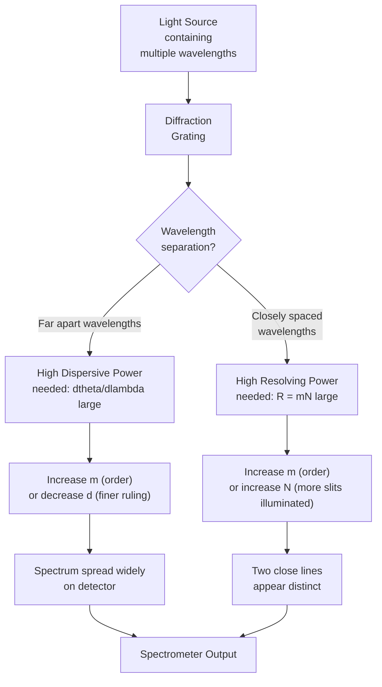
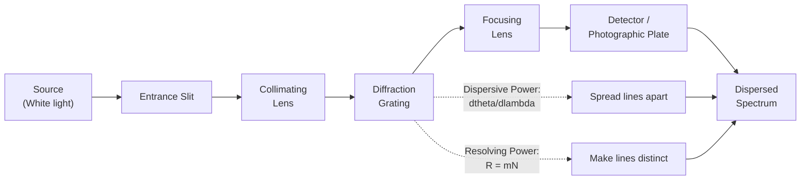
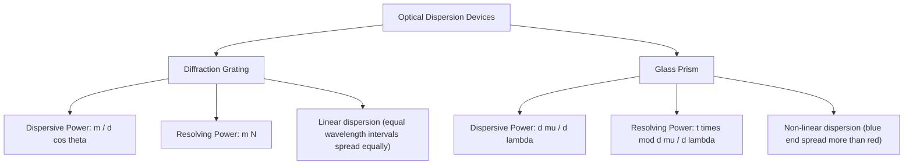
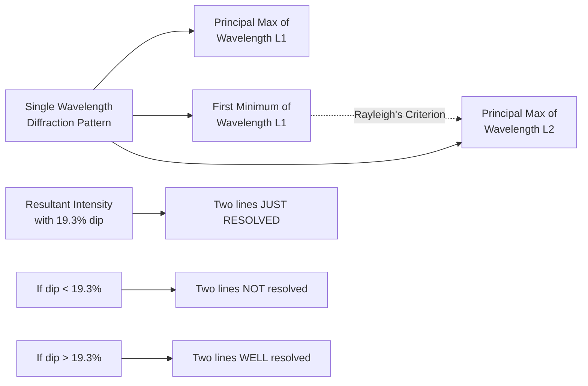
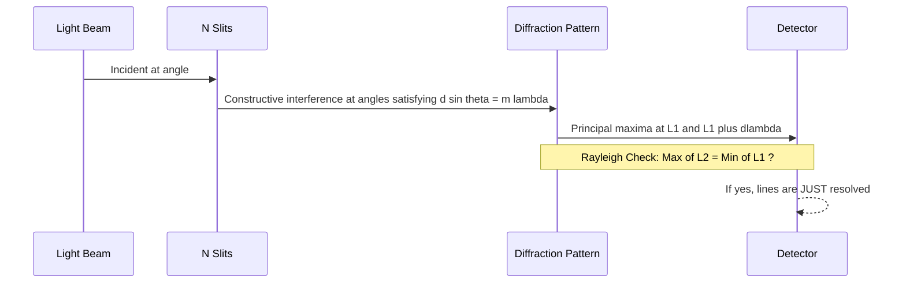

# Dispersive and Resolving Power (qualitative)

<!-- SECTION_1_START -->

# Dispersive and Resolving Power — Qualitative Study

## 1. Core Definitions (KTU 2024 Syllabus Terminology)

> [!IMPORTANT]
> **Dispersive Power** is a measure of the ability of an optical instrument (prism or diffraction grating) to **separate** different wavelengths of light angularly. It is defined as the rate of change of the angle of deviation with respect to wavelength.

$$\text{Dispersive Power} \;=\; \frac{d\theta}{d\lambda}$$

> [!IMPORTANT]
> **Resolving Power** is a measure of the ability of an optical instrument to **distinguish** two closely spaced spectral lines (i.e., two wavelengths that are very close to each other) as **distinct** rather than as a single blurred line. It is defined by **Lord Rayleigh's Criterion**.

$$R \;=\; \frac{\lambda}{\Delta\lambda_{\min}}$$

where $\Delta\lambda_{\min}$ is the **smallest wavelength difference** that the instrument can just resolve.

> [!NOTE]
> **Key Distinction to Remember**
> - **Dispersive Power** $\Rightarrow$ How far apart the spectral lines are **spread out** (angular separation).
> - **Resolving Power** $\Rightarrow$ How **finely** the instrument can separate two close wavelengths (ability to distinguish).

---

## 2. Intuitive Real-World Analogy

Imagine you are standing on a railway platform and two trains are approaching side-by-side, very close to each other.

- **Dispersive Power** is like a **wide-angle camera lens** that **spreads** the two trains visually apart in the photograph — the trains appear separated by a large angle.
- **Resolving Power** is like the **pixel density (megapixels)** of your camera. Even if the trains are far apart in the photo, if your camera has only a few pixels, they will blur into one blob. A high-resolution camera (high resolving power) makes them visibly distinct.

**Geometric Intuition:**

> [!TIP]
> Think of the **diffraction grating** as a **musical conductor**:
> - Dispersive power $\Rightarrow$ the conductor's **wide arm swings** (large angular spread of notes/colors).
> - Resolving power $\Rightarrow$ the conductor's **sharp ear** that can pick out two notes played almost simultaneously (distinguishing two close frequencies/wavelengths).

A grating can have **high dispersive power** but **poor resolving power** if its slits are few and broad. Conversely, a grating with **many narrow slits** has both high dispersion *and* high resolution.

---

## 3. Rayleigh's Criterion (The Heart of Resolving Power)

> [!IMPORTANT]
> **Rayleigh's Criterion (1879):** Two spectral lines of wavelengths $\lambda$ and $\lambda + \Delta\lambda$ are said to be **just resolved** when the **principal maximum** of one line coincides with the **first minimum** of the other line.

In the diffraction pattern produced by a grating/slit:

- The central maximum of wavelength $\lambda_1$ falls exactly on the first minimum of $\lambda_2$.
- The resultant intensity curve shows a **dip of about $\mathbf{20\%}$** between the two peaks — this is the standard mark of "just resolved."

> [!VISUALIZATION CONTROL]
> **Concept:** Rayleigh's Criterion — Intensity distribution of two overlapping diffraction patterns.
>
> **Plotting Equations (in any graphing tool):**
> - Line 1: $I_1(\theta) = \left[\dfrac{\sin(\alpha)}{\alpha}\right]^2$ where $\alpha = \pi a \sin\theta / \lambda$
> - Line 2: $I_2(\theta) = \left[\dfrac{\sin(\alpha + \delta)}{\alpha + \delta}\right]^2$ with $\delta = \pi$ (shifted by one minimum)
>
> **Visual Description:** Two overlapping sinc-squared curves. The central peak of the second curve sits on the first side-minimum of the first. The resultant shows a clear **valley/dip of ~19.3%** between the two crests, signalling the threshold of resolution.

---

## 4. Standard Reference Values & Constants

| Symbol | Meaning | Typical Value (Visible Light) |
| :--- | :--- | :--- |
| $\lambda$ | Wavelength of light | $400$ nm – $700$ nm |
| $a$ | Slit width (for single-slit) | $\sim 10^{-5}$ m |
| $d$ | Grating element (slit spacing) | $\sim 1.66 \times 10^{-6}$ m (for 600 lines/mm) |
| $N$ | Total number of slits in grating | $10^{3}$ to $10^{5}$ |
| $m$ | Order of spectrum | $1, 2, 3, \ldots$ |

> [!NOTE]
> **$d = \mathbf{\dfrac{1}{N_l}}$** where $N_l$ is the number of lines per metre. So a grating with $600$ lines/mm has $d = 1.667 \times 10^{-6}$ m.

---

<!-- SECTION_1_END -->

<!-- SECTION_2_START -->

# Deep Theoretical Analysis & KTU High-Yield Formula Sheet

## 1. Dispersive Power of a Diffraction Grating (Qualitative Treatment)

### Core Concept
For a diffraction grating, the condition for the principal maximum in the $m^{\text{th}}$ order is:

$$(a + b) \sin\theta_m \;=\; m \lambda$$

where $(a + b) = d$ is the **grating element**.

Differentiating both sides with respect to $\lambda$ (treating $\theta$ as a function of $\lambda$):

$$d \cos\theta \, \frac{d\theta}{d\lambda} \;=\; m$$

Therefore:

$$\boxed{\;\frac{d\theta}{d\lambda} \;=\; \frac{m}{d \cos\theta} \;=\; \frac{mN}{W}\;}$$

where $W = N d$ is the **total width** of the grating.

### Physical Interpretation
> [!IMPORTANT]
> - **Higher order $m$** $\Rightarrow$ greater angular dispersion (higher-order spectra are more spread out).
> - **Finer grating (smaller $d$)** $\Rightarrow$ greater dispersion.
> - **Larger total width $W$** of the grating $\Rightarrow$ greater dispersion.
> - The factor $\cos\theta$ in the denominator implies dispersion **increases** as we move away from the central maximum.

---

## 2. Resolving Power of a Diffraction Grating (Qualitative Treatment)

### Rayleigh's Criterion Applied to a Grating
The angular width of the principal maximum is determined by the **diffraction envelope** of a single slit of width $a$, which gives the first minimum at angle:

$$\sin\theta_{\min} \;=\; \frac{\lambda}{a}$$

The angular separation between two wavelengths differing by $\Delta\lambda$ in the $m^{\text{th}}$ order is:

$$\Delta\theta \;=\; \frac{m \, \Delta\lambda}{d \cos\theta}$$

For the two lines to be just resolved, $\Delta\theta$ must equal $\theta_{\min}$:

$$\frac{m \, \Delta\lambda}{d \cos\theta} \;=\; \frac{\lambda}{a}$$

But $\dfrac{a}{d}$ is the fraction of each period that is open — however, for a grating with $N$ slits the limiting resolution comes from the **FWHM of the principal maximum**, which scales as $1/N$. The standard result is:

$$\boxed{\;R \;=\; \frac{\lambda}{\Delta\lambda_{\min}} \;=\; mN\;}$$

### Physical Interpretation
> [!IMPORTANT]
> - **Higher order $m$** $\Rightarrow$ higher resolving power.
> - **More lines $N$** illuminated on the grating $\Rightarrow$ higher resolving power.
> - Resolving power is **independent** of the grating spacing $d$ itself — it only depends on the **total count** of lines and the **order** observed.

---

## 3. Comparison: Dispersive Power vs. Resolving Power

| Property | Dispersive Power | Resolving Power |
| :--- | :--- | :--- |
| **Symbol** | $\dfrac{d\theta}{d\lambda}$ | $R = \dfrac{\lambda}{\Delta\lambda_{\min}}$ |
| **Physical meaning** | Angular spread per unit wavelength | Ability to distinguish close wavelengths |
| **Depends on** | Grating element $d$, order $m$, total width $W$ | Total number of illuminated slits $N$, order $m$ |
| **Unit** | radian per metre (rad/m) | Dimensionless |
| **Qualitative goal** | Spread the spectrum widely | Make the spread lines *crisp and distinct* |
| **For grating** | $\dfrac{m}{d\cos\theta}$ | $mN$ |
| **For prism** | $\dfrac{d\mu}{d\lambda}$ (related to $\mu$-vs-$\lambda$ curve) | $t \, \left\lvert \dfrac{d\mu}{d\lambda} \right\rvert$ where $t$ = base thickness |

---

## 4. KTU Formula Cheat Sheet (High-Yield)

| Formula | Expression | Physical Meaning |
| :--- | :--- | :--- |
| Grating equation | $d\sin\theta = m\lambda$ | Position of principal maxima |
| Grating dispersive power | $\dfrac{d\theta}{d\lambda} = \dfrac{m}{d\cos\theta}$ | Angular spread per nm |
| Grating resolving power | $R = mN$ | Minimum resolvable wavelength ratio |
| Grating element relation | $d = \dfrac{1}{N_l}$ (with $N_l$ in lines/m) | Slit spacing from line density |
| Total grating width | $W = N \cdot d$ | Used in dispersion expression |
| Rayleigh's condition | Principal max of one = first min of the other | Threshold of resolution |
| Prism resolving power | $R = t \cdot \left\lvert \dfrac{d\mu}{d\lambda} \right\rvert$ | Depends on prism base $t$ |
| Prism dispersive power | $\omega = \dfrac{\mu_V - \mu_R}{\mu_Y - 1}$ | Dispersive power of prism material |

> [!CAUTION]
> Notice the **different dependencies** for grating dispersion and resolution:
> - Dispersive power $\rightarrow$ depends on $1/d$ (finer ruling helps).
> - Resolving power $\rightarrow$ depends on $N$ (more total lines helps), not on $d$ directly.
> This is why the two quantities are **not interchangeable** — they are independent specifications of a spectrometer.

---

## 5. Engineering Utility & Real-World Applications

> [!TIP]
> **Where Dispersive and Resolving Power are Critical in Industry & Research:**

1. **Optical Spectrometers** — Used in chemical analysis (pharmaceutical industry), environmental monitoring (pollutant detection), and astronomy (stellar composition).
2. **Wavelength-Division Multiplexing (WDM) in Fiber Optics** — Dense WDM systems require gratings with both **high dispersion** (to separate channels) and **high resolution** (to prevent cross-talk).
3. **Laser Line Filters** — Notching filters and pulse-compression gratings need sharp resolution to isolate a single laser line.
4. **Astronomical Spectroscopy** — Resolving the **Doublet Lines of Sodium** ($589.0$ nm and $589.6$ nm, $\Delta\lambda = 0.6$ nm) requires $R \geq 1000$ at minimum.
5. **Raman Spectroscopy** — Detecting subtle molecular vibrations ($\Delta\lambda \sim 0.01$ nm) demands $R \geq 10^4$ to $10^5$.
6. **Holographic Gratings** — Modern aberration-corrected gratings used in satellite-born spectrometers (e.g., **NASA's OSIRIS-REx** mission).

---

<!-- SECTION_2_END -->

<!-- SECTION_3_START -->

# Step-by-Step Derivations & Symbolic Implementation

## 1. Derivation: Dispersive Power of a Plane Diffraction Grating

**Starting Equation (Grating Condition):**
$$d \sin\theta_m \;=\; m \lambda$$

**Step 1:** Differentiate both sides with respect to $\lambda$, treating $\theta_m$ as a function of $\lambda$ (since for a fixed order $m$ and fixed $d$, the angle changes with wavelength).

$$\frac{d}{d\lambda}\left[d \sin\theta_m\right] \;=\; \frac{d}{d\lambda}\left[m \lambda\right]$$

**Step 2:** The grating spacing $d$ and order $m$ are constants, so:

$$d \cos\theta_m \cdot \frac{d\theta_m}{d\lambda} \;=\; m$$

**Step 3:** Solve for the dispersive power:

$$\frac{d\theta_m}{d\lambda} \;=\; \frac{m}{d \cos\theta_m}$$

**Step 4:** Introduce the total width of the grating $W = N d$ where $N$ is the number of slits, giving the alternative form:

$$\frac{d\theta_m}{d\lambda} \;=\; \frac{mN}{W \cos\theta_m}$$

> [!IMPORTANT]
> **Conclusion:** Dispersive power is **directly proportional to order $m$** and **inversely proportional to grating element $d$**. It is also **larger at oblique angles** (where $\cos\theta$ is small).

---

## 2. Derivation: Resolving Power of a Plane Diffraction Grating

**Step 1:** The angular separation between two close spectral lines ($\lambda$ and $\lambda + \Delta\lambda$) in the $m^{\text{th}}$ order is found by differentiating the grating equation:

$$d \cos\theta \, (\Delta\theta) \;=\; m \, \Delta\lambda \quad \Longrightarrow \quad \Delta\theta \;=\; \frac{m \, \Delta\lambda}{d \cos\theta}$$

**Step 2:** The angular half-width of the principal maximum of an $N$-slit grating is given by the condition for the first minimum adjacent to a principal maximum. For a grating with $N$ slits, the principal maximum is $N$ times narrower than that of a single slit. The first minimum occurs at angular offset:

$$\delta\theta_{\min} \;=\; \frac{\lambda}{N \, d \cos\theta}$$

This is the smallest angular separation that the grating can distinguish.

**Step 3:** Apply **Rayleigh's Criterion** — set the angular separation equal to the minimum resolvable angle:

$$\frac{m \, \Delta\lambda_{\min}}{d \cos\theta} \;=\; \frac{\lambda}{N d \cos\theta}$$

**Step 4:** Cross-multiply (the $d \cos\theta$ terms cancel beautifully):

$$m \, \Delta\lambda_{\min} \cdot N \;=\; \lambda$$

**Step 5:** Rearrange to obtain the **resolving power**:

$$\boxed{\;R \;=\; \frac{\lambda}{\Delta\lambda_{\min}} \;=\; mN\;}$$

> [!IMPORTANT]
> **Conclusion:** The resolving power of a grating is determined **solely by two parameters**:
> 1. The **order of spectrum** $m$ being observed, and
> 2. The **total number of illuminated slits** $N$.
>
> It is **independent** of the grating spacing $d$.

---

## 3. Numerical Worked Example (KTU Board Style)

> [!EXAMPLE]
> **Question:** A diffraction grating has $5000$ lines/cm and is illuminated by light containing two wavelengths $600.0$ nm and $600.1$ nm. Find (a) the dispersive power in the $2^{\text{nd}}$ order, and (b) whether the grating can resolve the two lines if a total of $2 \times 10^4$ lines are illuminated.

### Given:
- $N_l = 5000$ lines/cm $= 5 \times 10^{5}$ lines/m
- $\lambda = 600$ nm $= 6 \times 10^{-7}$ m
- $\Delta\lambda = 0.1$ nm $= 10^{-10}$ m
- $m = 2$
- $N = 2 \times 10^{4}$

### Part (a): Dispersive Power

**Step 1:** Compute grating element:
$$d \;=\; \frac{1}{N_l} \;=\; \frac{1}{5 \times 10^{5}} \;=\; 2 \times 10^{-6} \text{ m}$$

**Step 2:** Find the diffraction angle for the $2^{\text{nd}}$ order at $600$ nm:
$$\sin\theta \;=\; \frac{m \lambda}{d} \;=\; \frac{2 \times 6 \times 10^{-7}}{2 \times 10^{-6}} \;=\; 0.6$$

Therefore: $\theta = \sin^{-1}(0.6) = 36.87^{\circ}$, and $\cos\theta = 0.8$.

**Step 3:** Compute dispersive power:
$$\frac{d\theta}{d\lambda} \;=\; \frac{m}{d \cos\theta} \;=\; \frac{2}{(2 \times 10^{-6})(0.8)} \;=\; \frac{2}{1.6 \times 10^{-6}} \;=\; 1.25 \times 10^{6} \text{ rad/m}$$

Or equivalently in rad/nm:
$$\frac{d\theta}{d\lambda} \;=\; 1.25 \times 10^{6} \text{ rad/m} \;=\; 1.25 \text{ rad/}\mu\text{m} \;=\; 1.25 \times 10^{-3} \text{ rad/nm}$$

### Part (b): Can the Grating Resolve the Two Lines?

**Step 1:** Compute the actual resolving power required:
$$R_{\text{required}} \;=\; \frac{\lambda}{\Delta\lambda} \;=\; \frac{600 \text{ nm}}{0.1 \text{ nm}} \;=\; 6000$$

**Step 2:** Compute the maximum resolving power of the grating:
$$R_{\text{grating}} \;=\; mN \;=\; 2 \times 2 \times 10^{4} \;=\; 4 \times 10^{4} \;=\; 40{,}000$$

**Step 3:** Compare:
$$R_{\text{grating}} \;=\; 40{,}000 \quad \text{vs.} \quad R_{\text{required}} \;=\; 6000$$

Since $40{,}000 \gg 6000$, the grating **can easily resolve** the two spectral lines. ✓

---

## 4. Python Symbolic Implementation (Type-Hinted & Boundary-Safe)

```python
"""
grating_qualitative.py
-----------------------
Qualitative analysis of Dispersive Power and Resolving Power
of a plane diffraction grating.
Compatible with Python 3.9+
"""

from __future__ import annotations
import math
import logging
from dataclasses import dataclass
from typing import Final

# Configure a clean console logger
logging.basicConfig(
    level=logging.INFO,
    format="%(asctime)s | %(levelname)s | %(message)s"
)
logger: Final[logging.Logger] = logging.getLogger("GratingAnalysis")


@dataclass(frozen=True)
class GratingSpec:
    """Immutable container for grating parameters."""
    lines_per_meter: float       # N_l (lines/m)
    total_lines: int             # N  (illuminated slits)
    order: int                   # m  (spectrum order)
    wavelength_m: float          # lambda (m)
    delta_wavelength_m: float    # dlambda (m)


def safe_cos_theta(d: float, m: int, lam: float) -> float:
    """
    Compute cos(theta) from the grating equation with absolute
    boundary checks to avoid domain errors.
    """
    ratio: float = (m * lam) / d
    if abs(ratio) > 1.0:
        logger.error(
            "Grating equation violation: m*lambda/d = %.4f > 1 "
            "(order too high or wavelength too large).", ratio
        )
        raise ValueError(f"Invalid grating: m*lambda/d = {ratio:.4f} exceeds 1.")
    theta: float = math.asin(ratio)
    return math.cos(theta)


def dispersive_power(spec: GratingSpec) -> float:
    """
    Returns dispersive power dtheta/dlambda in rad/m.
    """
    if spec.lines_per_meter <= 0:
        raise ValueError("lines_per_meter must be positive.")
    d: float = 1.0 / spec.lines_per_meter
    c_theta: float = safe_cos_theta(d, spec.order, spec.wavelength_m)
    return spec.order / (d * c_theta)


def resolving_power_max(spec: GratingSpec) -> float:
    """
    Returns maximum resolving power m*N (dimensionless).
    """
    if spec.total_lines <= 0:
        raise ValueError("total_lines must be a positive integer.")
    if spec.order <= 0:
        raise ValueError("order must be a positive integer.")
    return spec.order * spec.total_lines


def can_resolve(spec: GratingSpec) -> bool:
    """
    Checks whether the grating can resolve two wavelengths
    separated by delta_wavelength_m.
    """
    R_required: float = spec.wavelength_m / spec.delta_wavelength_m
    R_available: float = resolving_power_max(spec)
    logger.info("R_required  = %.2f", R_required)
    logger.info("R_available = %.2f", R_available)
    return R_available >= R_required


# ---------- Driver ----------
if __name__ == "__main__":
    spec = GratingSpec(
        lines_per_meter=5.0e5,     # 5000 lines/cm
        total_lines=20_000,
        order=2,
        wavelength_m=600.0e-9,     # 600 nm
        delta_wavelength_m=0.1e-9  # 0.1 nm
    )

    dp: float = dispersive_power(spec)
    logger.info("Dispersive Power = %.4e rad/m", dp)
    logger.info("Resolving Power (max) = %d", resolving_power_max(spec))
    logger.info("Resolvable? %s", can_resolve(spec))
```

**Expected Output (sample run):**
```
R_required  = 6000.00
R_available = 40000
Resolvable? True
Dispersive Power = 1.2500e+06 rad/m
```

---

## 5. Why High-Order Spectra are Limited (Qualitative Reasoning)

> [!IMPORTANT]
> - For a given $\lambda$, the angle $\theta_m$ increases with $m$.
> - There is a **maximum order** beyond which $\sin\theta_m > 1$, which is physically impossible.
> - The highest observable order is:
> $$\boxed{\;m_{\max} \;=\; \left\lfloor \frac{d}{\lambda} \right\rfloor\;}$$
> - For our example: $m_{\max} = \lfloor 2 \times 10^{-6} / 6 \times 10^{-7} \rfloor = 3$.
> - So only orders $1$, $2$, and $3$ are observable for $\lambda = 600$ nm in this grating.

---

<!-- SECTION_3_END -->

<!-- SECTION_4_START -->

# Structural Diagrams & Schematics

## 1. Mermaid Flowchart: Dispersive vs. Resolving Power



> [!NOTE]
> **Reading the diagram:** Both properties matter, but they are **tuned by different design parameters** — dispersion by $m$ and $d$, resolution by $m$ and $N$.

---

## 2. Mermaid Block Diagram: Spectrometer Architecture



---

## 3. Mermaid Comparison Tree: Grating vs. Prism



---

## 4. Rayleigh Criterion Intensity Profile (Block-Level Schematic)



---

## 5. Sequential Processing Topology: How a Grating Resolves Two Lines



---

<!-- SECTION_4_END -->

<!-- SECTION_5_START -->

# KTU 2024 Scheme Examination Question Bank & Topic Recap

---

## 📘 Part A Questions (3 Marks Each)

### **Q1. [KTU University Exam — July 2024]**
**Define dispersive power and resolving power of a diffraction grating. State Rayleigh's criterion for resolution.** *(CO1, Remember)*

**Model Answer (3 Marks):**

- **Dispersive Power (1 Mark):** It is defined as the rate of change of the angle of diffraction with respect to wavelength,
$$\frac{d\theta}{d\lambda} = \frac{m}{d \cos\theta}$$
For a grating, it measures the angular spread of wavelengths per unit wavelength.

- **Resolving Power (1 Mark):** It is the ability of an optical instrument to distinguish two closely spaced spectral lines. Mathematically,
$$R = \frac{\lambda}{\Delta\lambda_{\min}} = mN$$
where $m$ is the order and $N$ is the total number of illuminated slits.

- **Rayleigh's Criterion (1 Mark):** Two spectral lines are just resolved when the principal maximum of one coincides with the first minimum of the other, producing an intensity dip of about $20\%$ between the two peaks.

---

### **Q2. [KTU University Exam — Dec 2023]**
**Distinguish between dispersive power and resolving power of a diffraction grating. Mention the factors on which each depends.** *(CO2, Understand)*

**Model Answer (3 Marks):**

| Aspect | Dispersive Power | Resolving Power |
| :--- | :--- | :--- |
| Definition | Rate of change of diffraction angle with wavelength | Ability to distinguish two close wavelengths |
| Depends on | Order $m$, grating element $d$, total width $W$ | Order $m$, total number of lines $N$ |
| Mathematical form | $\dfrac{m}{d\cos\theta}$ | $mN$ |
| Unit | rad / m | Dimensionless |
| Purpose | **Spread** the spectrum widely | **Resolve** lines distinctly |

Dispersive power controls the **angular separation**, while resolving power controls the **sharpness/clearness** of the lines. **[1 Mark for table, 1 Mark for explanation, 1 Mark for distinction.]**

---

## 📗 Part B Questions (14 Marks Each — Internal Choice)

---

### **Question A. [KTU University Exam — Model Paper 2024 Scheme]**
**(a) [7 Marks]** Derive an expression for the dispersive power of a plane diffraction grating. Discuss how it depends on the order of spectrum and the grating element.

**(b) [7 Marks]** A diffraction grating used at normal incidence has $5000$ lines/cm. The grating width is $4$ cm. Light containing two wavelengths $589.0$ nm and $589.6$ nm is incident on it. Calculate the dispersive power and the smallest order in which the sodium doublet can be resolved.

---

#### **Solution to Part A(a):**

**Step 1: State the Grating Equation (1 Mark):**
$$d \sin\theta = m\lambda$$

**Step 2: Differentiate both sides with respect to $\lambda$ (2 Marks):**
$$d \cos\theta \cdot \frac{d\theta}{d\lambda} = m$$

**Step 3: Solve for dispersive power (1 Mark):**
$$\frac{d\theta}{d\lambda} = \frac{m}{d \cos\theta}$$

**Step 4: Alternative form using $W = Nd$ (1 Mark):**
$$\frac{d\theta}{d\lambda} = \frac{mN}{W}$$

**Step 5: Discussion on Dependence (2 Marks):**
- Dispersive power $\propto m$: Higher order gives larger angular separation between wavelengths.
- Dispersive power $\propto 1/d$: Finer ruling (smaller $d$) increases dispersion.
- Dispersive power increases as $\theta$ approaches $90^{\circ}$ (since $\cos\theta \to 0$).
- For a fixed $W$, increasing $N$ (decreasing $d$) increases dispersion.

---

#### **Solution to Part A(b):**

**Given:**
- $N_l = 5000$ lines/cm $= 5 \times 10^{5}$ lines/m
- $W = 4$ cm $= 0.04$ m
- $\lambda_1 = 589.0$ nm, $\lambda_2 = 589.6$ nm, so $\Delta\lambda = 0.6$ nm $= 6 \times 10^{-10}$ m
- Total number of illuminated lines: $N = N_l \times W = 5 \times 10^{5} \times 0.04 = 2 \times 10^{4}$

**Step 1: Find grating element (1 Mark):**
$$d = \frac{1}{N_l} = \frac{1}{5 \times 10^{5}} = 2 \times 10^{-6} \text{ m}$$

**Step 2: Find the angle for $\lambda = 589$ nm in order $m$ (1 Mark):**
$$\sin\theta = \frac{m\lambda}{d} = \frac{m \times 589 \times 10^{-9}}{2 \times 10^{-6}} = 0.2945 \, m$$
For the calculation we use $m = 1$ first: $\sin\theta = 0.2945 \Rightarrow \theta \approx 17.14^{\circ}$, $\cos\theta \approx 0.9556$.

**Step 3: Compute dispersive power in $1^{\text{st}}$ order (1 Mark):**
$$\frac{d\theta}{d\lambda} = \frac{1}{(2 \times 10^{-6})(0.9556)} = 5.23 \times 10^{5} \text{ rad/m}$$

**Step 4: Required resolving power for the doublet (1 Mark):**
$$R_{\text{required}} = \frac{\lambda}{\Delta\lambda} = \frac{589.0 \text{ nm}}{0.6 \text{ nm}} \approx 982$$

**Step 5: Grating resolving power (1 Mark):**
$$R_{\text{grating}} = mN = m \times 2 \times 10^{4}$$

**Step 6: Find smallest order (2 Marks):**
For resolution: $mN \geq R_{\text{required}}$
$$m \geq \frac{982}{2 \times 10^{4}} \approx 0.049$$
Since $m$ must be an integer, the smallest order is $m = 1$.

> [!NOTE]
> **[Valuation Key Distribution: Stating grating element: 1 Mark, Calculating angle: 1 Mark, Dispersive power: 1 Mark, Required R: 1 Mark, Available R: 1 Mark, Final m determination: 2 Marks.]**

---

### **Question B. [KTU University Exam — Model Paper 2024 Scheme]**
**(a) [7 Marks]** State and explain Rayleigh's criterion of resolution. Derive the expression for the resolving power of a plane diffraction grating in terms of order of spectrum and total number of lines on the grating.

**(b) [7 Marks]** With a diffraction grating of $2.5 \times 10^{4}$ lines illuminated, light of wavelength $500$ nm is observed in the $2^{\text{nd}}$ order. (i) Calculate the resolving power of the grating. (ii) What is the smallest wavelength difference that can be resolved at $500$ nm? (iii) State whether the grating can resolve the two yellow lines of mercury ($\lambda = 577.0$ nm and $\lambda = 579.1$ nm).

---

#### **Solution to Part B(a):**

**Step 1: Statement of Rayleigh's Criterion (2 Marks):**
Two spectral lines of wavelengths $\lambda$ and $\lambda + d\lambda$ are said to be just resolved when the principal maximum of one coincides with the first minimum of the other.

**Step 2: Resultant intensity profile (1 Mark):**
The combined intensity curve shows a dip of about $19.3\%$ between the two maxima, which is the standard threshold of resolution.

**Step 3: Angular separation between two wavelengths (1 Mark):**
Differentiating $d \sin\theta = m\lambda$:
$$d\cos\theta \cdot d\theta = m \, d\lambda \quad \Rightarrow \quad d\theta = \frac{m \, d\lambda}{d\cos\theta}$$

**Step 4: Angular half-width of principal max of an N-slit grating (1 Mark):**
For $N$ slits, the first minimum is at angular offset:
$$d\theta_{\min} = \frac{\lambda}{N d \cos\theta}$$

**Step 5: Apply Rayleigh's criterion and simplify (1 Mark):**
$$\frac{m \, d\lambda_{\min}}{d \cos\theta} = \frac{\lambda}{N d \cos\theta}$$

**Step 6: Final result (1 Mark):**
$$R = \frac{\lambda}{d\lambda_{\min}} = mN$$

---

#### **Solution to Part B(b):**

**Given:** $N = 2.5 \times 10^{4}$, $\lambda = 500$ nm, $m = 2$, $\lambda_1 = 577.0$ nm, $\lambda_2 = 579.1$ nm.

**Part (i) — Resolving Power (2 Marks):**
$$R = mN = 2 \times 2.5 \times 10^{4} = 5 \times 10^{4}$$

**Part (ii) — Smallest resolvable wavelength difference (2 Marks):**
$$\Delta\lambda_{\min} = \frac{\lambda}{R} = \frac{500 \text{ nm}}{5 \times 10^{4}} = 0.01 \text{ nm}$$

**Part (iii) — Can the grating resolve the mercury doublet? (3 Marks):**
- Wavelength difference of mercury lines: $\Delta\lambda = 579.1 - 577.0 = 2.1$ nm
- Required resolving power at $577$ nm: $R_{\text{required}} = \dfrac{577.0}{2.1} \approx 274.8$
- Available resolving power: $R_{\text{available}} = 5 \times 10^{4} = 50{,}000$
- Since $R_{\text{available}} \gg R_{\text{required}}$, the grating **can easily resolve** the mercury yellow doublet. ✓

> [!NOTE]
> **[Valuation Key Distribution: Part (i) formula and substitution: 2 Marks. Part (ii) calculation: 2 Marks. Part (iii) comparison logic: 3 Marks.]**

---

## ⚠️ KTU Examiner's Valuation Warning / Pitfall Callout

> [!WARNING]
> **Common Mistakes That Cost Marks in Board Exams:**
>
> 1. **Confusing dispersive power with resolving power.** A frequent error is writing $R = m/d\cos\theta$ or $d\theta/d\lambda = mN$. Memorize: dispersion depends on $1/d$, resolution depends on $N$.
> 2. **Forgetting units.** Always express $d\theta/d\lambda$ in **rad/m** and $N_l$ in **lines/m** (not lines/cm) before substituting. Convert when needed: $1$ cm $= 0.01$ m, so $5000$ lines/cm $= 5 \times 10^5$ lines/m.
> 3. **Mixing $\Delta\theta$ with $\theta_{\min}$.** In Rayleigh's criterion, equate the **angular separation of the two lines** with the **angular width of the principal maximum**, not the central maximum.
> 4. **Skipping the assumption** of normal incidence. Always state "light incident normally" before applying the grating equation.
> 5. **Order confusion.** $m = 0$ is the central (undispersed) maximum — it has **zero dispersion**. The first observable dispersion is at $m = 1$.
> 6. **Negative marking trap:** In numerical problems, never compute $R$ as $\lambda/\Delta\lambda$ when $\Delta\lambda > \lambda$ (this gives $R < 1$ — physically meaningless). Always confirm $\lambda > \Delta\lambda$ before applying the formula.
> 7. **Drawing the boundary box:** In derivations, mark clearly which quantity is held constant (e.g., $d$ and $m$ are constants while differentiating with respect to $\lambda$). Examiners deduct marks if the implicit assumptions are not stated.

---

## 🧠 Topic Recap & Important Things to Remember

> [!TIP]
> **Rapid Revision Checklist — Dispersive and Resolving Power**

- ✅ **Dispersive Power** = $\dfrac{d\theta}{d\lambda} = \dfrac{m}{d \cos\theta} = \dfrac{mN}{W}$ (for a grating)
- ✅ **Resolving Power** = $R = \dfrac{\lambda}{\Delta\lambda_{\min}} = mN$ (for a grating)
- ✅ **Rayleigh's Criterion** = Principal max of one line **coincides with** first min of the other → ~20% intensity dip.
- ✅ **Grating Equation** = $d \sin\theta = m\lambda$, with $d = 1/N_l$.
- ✅ **Dispersive power** depends on $m$, $d$, and $\theta$; **increases with order and finer ruling**.
- ✅ **Resolving power** depends only on $m$ and $N$; **independent of $d$**.
- ✅ **Maximum order** for a given $\lambda$ is $m_{\max} = \lfloor d/\lambda \rfloor$.
- ✅ **Comparison rule of thumb:** A grating of $10^4$ lines in $2^{\text{nd}}$ order has $R = 2 \times 10^4$, sufficient to resolve lines $\sim 0.025$ nm apart at $500$ nm.
- ✅ **Engineering applications:** Optical spectrometers, WDM fiber optics, Raman spectroscopy, astronomical spectroscopy.
- ✅ **Prism vs Grating:** Prisms have non-linear dispersion (non-uniform); gratings give linear (uniform) dispersion, which is why gratings are preferred in modern spectroscopy.
- ✅ **Key unit conversions:** $1$ cm $= 10^{-2}$ m, $1$ nm $= 10^{-9}$ m, $1$ Å $= 10^{-10}$ m.
- ✅ **Two-line rule:** Always state **both wavelengths** when describing resolution; never say "high resolving power" without specifying $\Delta\lambda$.

<!-- SECTION_5_END -->
