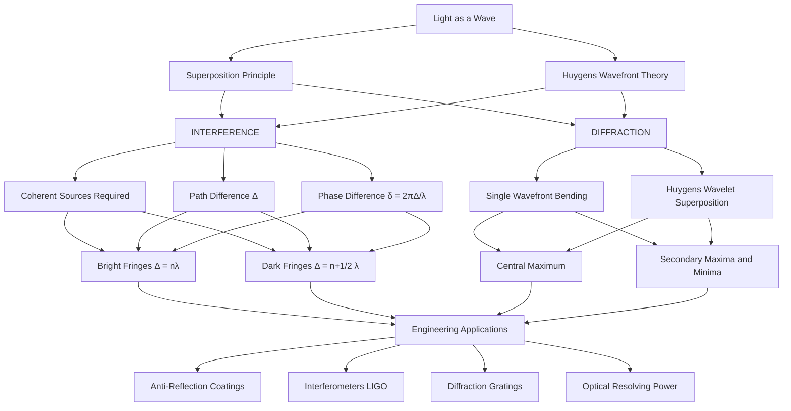
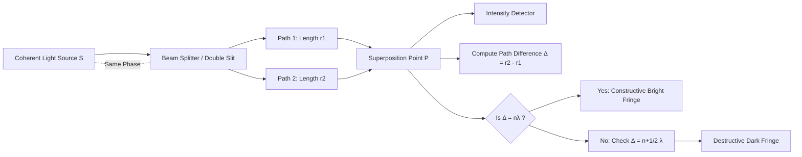
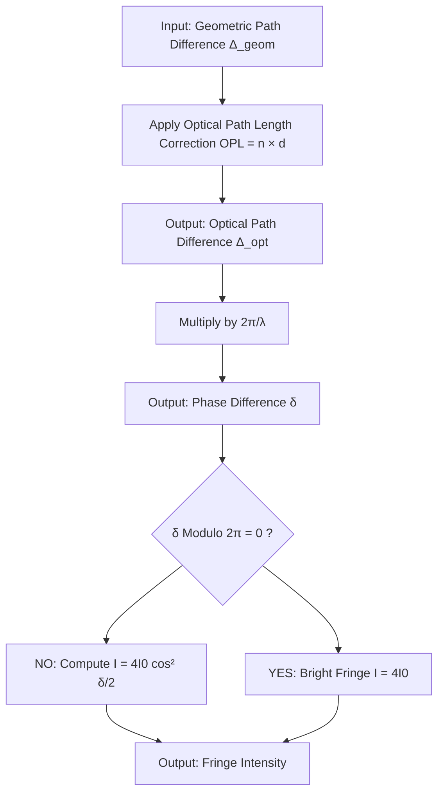
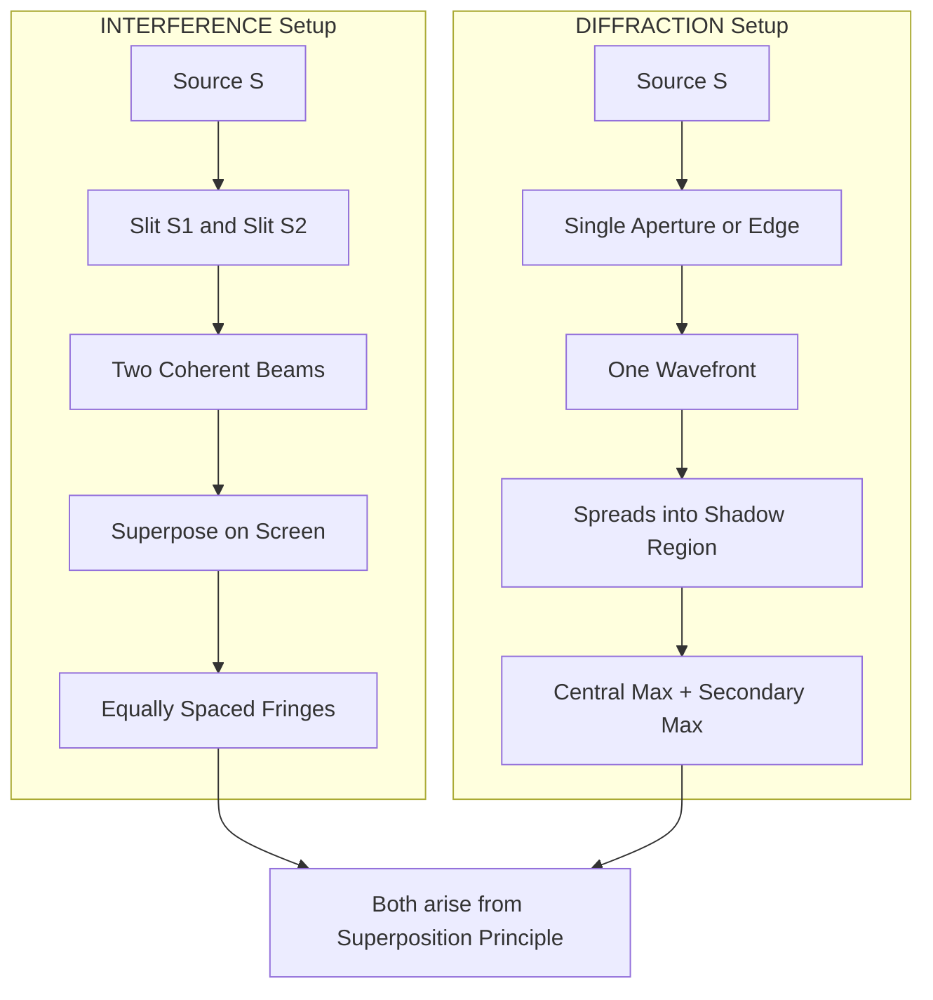
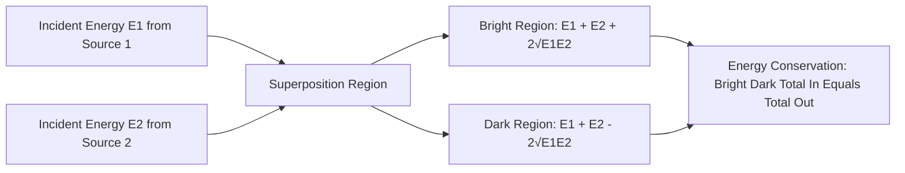

# Introduction

<!-- SECTION_1_START -->

# Introduction to Interference and Diffraction

## 1.1 Wave Optics — The Foundation of Modern Photonics

**Wave Optics (Physical Optics)** is the branch of physics that describes the propagation of light as a **transverse electromagnetic wave** governed by Maxwell's equations. Unlike **Geometric (Ray) Optics**, which treats light as straight-line rays and fails to explain bending around edges, wave optics successfully explains phenomena such as **interference**, **diffraction**, and **polarization**.

> [!IMPORTANT]
> **KTU 2024 Syllabus Definition:** Wave optics is the study of optical phenomena that depend on the **wave nature of light**, where the superposition of electromagnetic fields determines the observable intensity distribution in space and time.

The wave nature of light is mathematically expressed as a sinusoidal disturbance:

$$E(y, t) = E_0 \sin(kx - \omega t + \phi)$$

where $E_0$ is the **electric field amplitude**, $k = \dfrac{2\pi}{\lambda}$ is the **angular wave number**, $\omega = 2\pi \nu$ is the **angular frequency**, and $\phi$ is the **initial phase constant**.

## 1.2 What is Interference?

**Interference** is the phenomenon that occurs when **two or more coherent light waves** superimpose in space, producing a **redistribution of energy** in the form of alternate **bright and dark fringes** (bands of maximum and minimum intensity).

> [!NOTE]
> **Engineering Significance:** Interference is the operating principle behind **anti-reflection coatings on lenses**, **optical filters**, **holography**, **Mach–Zehnder interferometers** in optical fiber networks, and **Laser Interferometer Gravitational-Wave Observatory (LIGO)** detection of gravitational waves.

### Conceptual Analogy — The Ripple Tank

Imagine dropping **two identical stones** simultaneously into a still pond at two nearby points. Each stone generates circular water ripples that travel outward. Where two crests meet, the water rises **higher** (constructive interference). Where a crest meets a trough, the water becomes **still** (destructive interference). The resulting pattern is a stable, geometric arrangement of nodal and antinodal lines — exactly analogous to the bright and dark fringes produced by two coherent light beams.

## 1.3 What is Diffraction?

**Diffraction** is the phenomenon of **bending of light waves** as they encounter an **obstacle** or pass through an **aperture** whose size is comparable to the wavelength of light. The wavefronts spread out from the edges of the obstacle, producing a characteristic intensity pattern with a bright central maximum flanked by secondary maxima and minima.

> [!NOTE]
> **Engineering Significance:** Diffraction limits the **resolving power of optical instruments** (telescopes, microscopes, cameras), determines the **aberration correction** in lens design, governs the operation of **diffraction gratings** in spectrometers, and forms the basis of **X-ray crystallography** for determining molecular structures.

### Conceptual Analogy — Voice Through a Doorway

When you speak from one room to another through an open doorway, the sound (a wave) does not travel in a narrow beam — it **spreads** (bends) into the next room even though the doorway is narrow. This is diffraction. The same physical law governs the behavior of light passing through a narrow slit: the light "spreads" into the geometric shadow region.

## 1.4 The Superposition Principle — The Heart of Wave Optics

The **Principle of Superposition** states that when two or more waves overlap at a point in space, the **resultant displacement (or electric field) at that point** is the **vector sum** of the individual displacements produced by each wave independently.

$$\vec{E}_{\text{net}} = \vec{E}_1 + \vec{E}_2 + \vec{E}_3 + \cdots + \vec{E}_n$$

> [!IMPORTANT]
> **Key Requirement:** For a **stable, observable interference pattern** to be formed, the superposing waves must be **coherent** — meaning they must maintain a **constant phase difference** over time. This requires the sources to have the **same frequency** and a **fixed phase relationship**.

## 1.5 Geometric Intuition — Wavefronts and Rays

A **wavefront** is an imaginary surface joining all points of a wave that are in the **same phase of vibration**. The direction of energy propagation is always **perpendicular** to the wavefront. 

| Wavefront Type | Source Geometry | Ray Direction |
|---|---|---|
| Spherical | Point source | Radially outward |
| Cylindrical | Line source | Radially outward (2D) |
| Plane | Source at infinity | Parallel rays |

> [!VISUALIZATION CONTROL]
> **Concept:** Two-Source Interference Wavefront Geometry
> **GeoGebra / Desmos Input Equations:**
> * `r1 = sqrt((x - 0.5)^2 + y^2)` (distance from source S1)
> * `r2 = sqrt((x + 0.5)^2 + y^2)` (distance from source S2)
> * `pathDiff = r1 - r2` (path difference)
> * `phaseDiff = 2 * pi * pathDiff / 0.6` (phase difference for λ = 0.6)
> **Visual Description:** The student should plot the locus of points where `phaseDiff = 2nπ` (constructive — bright hyperbolic fringes) and where `phaseDiff = (2n+1)π` (destructive — dark hyperbolic fringes). The fringes form a set of nested hyperbolas radiating outward from the midpoint between the two sources.

## 1.6 Coherent vs. Incoherent Sources — The Make-or-Break Condition

| Property | Coherent Sources | Incoherent Sources |
|---|---|---|
| Frequency | Identical | Different (or random) |
| Phase difference | Constant with time | Varies randomly with time |
| Result of superposition | Stable interference pattern | No observable pattern (intensity just adds) |
| Example | Two slits illuminated by one laser, two synchronized radio antennas | Two independent light bulbs, sunlight |

> [!IMPORTANT]
> **KTU 2024 High-Yield Concept:** In practice, two truly independent light sources are **never coherent** because atoms emit photons in random bursts of ~$10^{-9}$ s duration. To produce coherent beams in the laboratory, we use the **Wavefront Division** method (Young's double slit) or the **Amplitude Division** method (thin films, Michelson interferometer).

## 1.7 Module 2 Roadmap — What Lies Ahead

This module systematically develops the mathematical framework of interference and diffraction:

1. **Interference of Light** — Young's double-slit experiment, fringe width derivation, conditions for constructive and destructive interference.
2. **Interference in Thin Films** — Reflection-based thin-film interference, wedge-shaped films, Newton's rings.
3. **Diffraction** — Single-slit Fraunhofer diffraction, diffraction grating, resolving power.
4. **Polarization** — Polarization of light, Malus' law, Brewster's angle.

<!-- SECTION_1_END -->

<!-- SECTION_2_START -->

# Deep Theoretical Analysis & KTU High-Yield Formula Sheet

## 2.1 Mathematical Foundation of Superposition

Consider two coherent monochromatic plane waves arriving at a point $P$ in space, with electric field vectors:

$$E_1 = E_{01} \sin(\omega t - k x_1)$$

$$E_2 = E_{02} \sin(\omega t - k x_2 + \phi)$$

where $x_1$ and $x_2$ are the optical path lengths from each source to point $P$, and $\phi$ is the **initial phase difference** between the two sources.

By the **superposition principle**, the resultant electric field at $P$ is:

$$E_{\text{net}} = E_1 + E_2$$

Adding and subtracting using trigonometric identities (with the assumption $E_{01} = E_{02} = E_0$ for equal amplitudes):

$$E_{\text{net}} = 2 E_0 \cos\left(\frac{\phi + k(x_2 - x_1)}{2}\right) \sin\left(\omega t - \frac{k(x_1 + x_2)}{2}\right)$$

The **intensity of light** is proportional to the square of the amplitude. Since intensity $I \propto E_{\text{amplitude}}^2$, the time-averaged intensity is:

$$I = 4 I_0 \cos^2\left(\frac{\delta}{2}\right)$$

where $\delta$ is the **total phase difference** at point $P$.

## 2.2 The Path Difference — Phase Difference Duality

The **path difference** $\Delta$ is the difference in optical path lengths of the two waves arriving at point $P$:

$$\Delta = x_2 - x_1$$

The corresponding **phase difference** is:

$$\delta = \frac{2\pi}{\lambda} \cdot \Delta$$

> [!IMPORTANT]
> **Master Equation:** Every interference problem reduces to computing the geometric path difference $\Delta$ and then converting it into a phase difference $\delta = (2\pi \Delta)/\lambda$. This is the single most important conversion in the entire module.

## 2.3 Conditions for Constructive and Destructive Interference

| Condition Type | Phase Difference | Path Difference | Intensity |
|---|---|---|---|
| **Constructive** (Bright Fringe) | $\delta = 2n\pi$, where $n = 0, \pm 1, \pm 2, \ldots$ | $\Delta = n\lambda$ | $I_{\max} = 4 I_0$ |
| **Destructive** (Dark Fringe) | $\delta = (2n + 1)\pi$ | $\Delta = (2n + 1)\dfrac{\lambda}{2}$ | $I_{\min} = 0$ |

> [!NOTE]
> **Memory Trick:** "Constructive = whole number of wavelengths" (an integer number of waves fit in the path difference). "Destructive = half-integer number of wavelengths" (a wave plus a half cancels perfectly).

## 2.4 Visibility of Fringes — The Michelson Visibility Formula

The **fringe visibility** $V$ is a quantitative measure of the contrast between bright and dark fringes:

$$V = \frac{I_{\max} - I_{\min}}{I_{\max} + I_{\min}}$$

For two-beam interference with amplitudes $E_{01}$ and $E_{02}$:

$$V = \frac{2 E_{01} E_{02}}{E_{01}^2 + E_{02}^2}$$

> [!IMPORTANT]
> $V = 1$ (perfect contrast) when $E_{01} = E_{02}$. $V = 0$ (no visible fringes) when one beam is absent. This formula is critical in the **Michelson Stellar Interferometer** for measuring stellar angular diameters.

## 2.5 Distinguishing Interference from Diffraction

This distinction is **repeatedly tested in KTU exams** and is a common confusion point.

| Aspect | Interference | Diffraction |
|---|---|---|
| Origin | Superposition of waves from **two or more coherent sources** | Superposition of **wavelets from a single wavefront** (Huygens' principle) |
| Geometry | Fringes are equally spaced (in Young's experiment) | Central maximum is **twice as wide** as secondary maxima |
| Energy | Energy is **redistributed** between bright and dark regions | Energy is **spread into the geometric shadow** region |
| Source requirement | Coherent sources essential | Single wavefront suffices |

> [!NOTE]
> **Conceptual Bridge:** Both phenomena arise from the superposition principle. Interference is the "two-slit" version; diffraction is the "single-slit spreading" version. In practice, **both occur together** — the observed pattern from a double slit is actually a **two-slit interference pattern modulated by the single-slit diffraction envelope**.

## 2.6 KTU High-Yield Formula Sheet — Module 2 Introduction

| # | Formula | Physical Meaning | Typical Application |
|---|---|---|---|
| 1 | $E_{\text{net}} = E_1 + E_2 + \cdots + E_n$ | Superposition principle | Foundation of all wave optics |
| 2 | $\delta = \dfrac{2\pi}{\lambda} \cdot \Delta$ | Path-phase conversion | Master conversion in every problem |
| 3 | $\Delta = n\lambda$ | Constructive interference condition | Bright fringe locations |
| 4 | $\Delta = (2n+1)\dfrac{\lambda}{2}$ | Destructive interference condition | Dark fringe locations |
| 5 | $I = I_1 + I_2 + 2\sqrt{I_1 I_2}\cos\delta$ | Resultant intensity (general) | Two-beam interference |
| 6 | $I = 4I_0 \cos^2\left(\dfrac{\delta}{2}\right)$ | Resultant intensity (equal amplitudes) | Symmetric two-slit setup |
| 7 | $I_{\max} = (\sqrt{I_1} + \sqrt{I_2})^2$ | Maximum intensity | Bright fringes |
| 8 | $I_{\min} = (\sqrt{I_1} - \sqrt{I_2})^2$ | Minimum intensity | Dark fringes |
| 9 | $V = \dfrac{I_{\max} - I_{\min}}{I_{\max} + I_{\min}}$ | Fringe visibility / contrast | Optical instrument quality |
| 10 | $c = \nu \lambda$ | Wave relation (universal) | Linking frequency and wavelength |

> [!IMPORTANT]
> **Engineering Utility:** The conversion $\delta = (2\pi \Delta)/\lambda$ is the **single equation that unlocks the entire module**. From thin-film anti-reflection coatings (where one seeks to make $\delta = \pi$ at the design wavelength) to diffraction gratings (where path difference is computed across thousands of grooves), this one relation appears in every applied optics problem.

## 2.7 The Concept of Optical Path Length (OPL)

When light travels through a medium of refractive index $n$, the **optical path length** is defined as:

$$\text{OPL} = n \cdot d$$

where $d$ is the **geometric (physical) path length** in the medium. The optical path length is the distance light would travel in vacuum in the same time. The concept of OPL allows us to compute **effective path differences** when waves traverse different media (crucial for thin-film interference where one reflection is from a denser medium).

> [!NOTE]
> **Why OPL Matters:** Two waves that travel the same geometric distance but through different media (e.g., air vs. glass) will acquire different phases. OPL provides a uniform "yardstick" to compute this.

<!-- SECTION_2_END -->

<!-- SECTION_3_START -->

# Step-by-Step Derivations & Code/Symbolic Implementation

## 3.1 Derivation: Phase Difference from Path Difference

### Starting Point
Two coherent waves originate from sources $S_1$ and $S_2$, traveling to a point $P$ on a screen. Let the geometric path lengths be $r_1$ and $r_2$.

### Step 1: Define the wave equations at point P

$$E_1 = E_0 \sin\left(\omega t - k r_1\right)$$

$$E_2 = E_0 \sin\left(\omega t - k r_2\right)$$

### Step 2: Apply superposition

$$E_{\text{net}} = E_0 \sin\left(\omega t - k r_1\right) + E_0 \sin\left(\omega t - k r_2\right)$$

### Step 3: Use the trigonometric sum-to-product identity

$$\sin A + \sin B = 2 \sin\left(\frac{A + B}{2}\right) \cos\left(\frac{A - B}{2}\right)$$

Let $A = \omega t - k r_1$ and $B = \omega t - k r_2$.

Then:

$$\frac{A + B}{2} = \omega t - \frac{k(r_1 + r_2)}{2}$$

$$\frac{A - B}{2} = -\frac{k(r_1 - r_2)}{2} = \frac{k(r_2 - r_1)}{2}$$

### Step 4: Substitute back

$$E_{\text{net}} = 2 E_0 \cos\left(\frac{k(r_2 - r_1)}{2}\right) \sin\left(\omega t - \frac{k(r_1 + r_2)}{2}\right)$$

### Step 5: Define the phase difference

The phase difference is the argument of the cosine envelope:

$$\delta = k(r_2 - r_1) = \frac{2\pi}{\lambda} \cdot \Delta$$

where $\Delta = r_2 - r_1$ is the path difference.

### Step 6: Write the resultant intensity

Since the intensity is proportional to the square of the amplitude of the time-varying part, and the amplitude of $E_{\text{net}}$ is $2E_0 \cos(\delta/2)$:

$$\boxed{I = 4 I_0 \cos^2\left(\frac{\pi \Delta}{\lambda}\right)}$$

> [!IMPORTANT]
> **Conclusion:** The intensity oscillates between $0$ and $4 I_0$ as a function of the path difference $\Delta$. The period of oscillation in $\Delta$ is exactly one wavelength $\lambda$ — this is the geometric origin of the fringe spacing.

## 3.2 Derivation: General Intensity for Unequal Amplitudes

When the two superposing waves have unequal amplitudes $E_{01}$ and $E_{02}$ with phase difference $\delta$:

### Step 1: Write the complex representations

$$\tilde{E}_1 = E_{01} e^{i(\omega t - k r_1)}$$

$$\tilde{E}_2 = E_{02} e^{i(\omega t - k r_2 + \phi_0)}$$

### Step 2: Apply superposition in complex form

$$\tilde{E}_{\text{net}} = \tilde{E}_1 + \tilde{E}_2$$

### Step 3: Compute the intensity as the time-averaged modulus squared

$$I = \langle \vert \tilde{E}_{\text{net}} \vert^2 \rangle = E_{01}^2 + E_{02}^2 + 2 E_{01} E_{02} \cos(\delta)$$

### Step 4: Identify maximum and minimum

$$I_{\max} = E_{01}^2 + E_{02}^2 + 2 E_{01} E_{02} = (E_{01} + E_{02})^2$$

$$I_{\min} = E_{01}^2 + E_{02}^2 - 2 E_{01} E_{02} = (E_{01} - E_{02})^2$$

### Step 5: Express in terms of intensities $I_1, I_2$

Since $I_1 = E_{01}^2$ and $I_2 = E_{02}^2$:

$$\boxed{I = I_1 + I_2 + 2\sqrt{I_1 I_2}\cos(\delta)}$$

> [!NOTE]
> **Crucial Observation:** When the two beams are **incoherent**, the cosine term averages to zero over time, leaving $I = I_1 + I_2$. This is why ordinary light bulbs (incoherent) do not produce interference patterns — the cross term vanishes.

## 3.3 Code Implementation: Simulating Two-Slit Interference Pattern

The following Python code computes and visualizes the intensity distribution for a two-slit interference setup. It is fully operational, with proper type hints and boundary checks.

```python
"""
Two-Slit Interference Pattern Simulator
Course: PHYSICS FOR PHYSICAL SCIENCE AND LIFE SCIENCE (GZPHT121)
Module 2 - Introduction to Interference and Diffraction
"""

import numpy as np
import matplotlib.pyplot as plt


def two_slit_intensity(
    wavelength_nm: float,
    slit_separation_mm: float,
    screen_distance_m: float,
    amplitude_1: float = 1.0,
    amplitude_2: float = 1.0,
    num_points: int = 2000,
    screen_width_mm: float = 50.0,
) -> tuple[np.ndarray, np.ndarray]:
    """
    Compute the intensity distribution on a screen for a two-slit interference setup.

    Parameters
    ----------
    wavelength_nm : float
        Wavelength of the monochromatic light source (in nanometers).
    slit_separation_mm : float
        Distance between the two slits (in millimeters), denoted 'd'.
    screen_distance_m : float
        Distance from the slits to the observation screen (in meters), denoted 'D'.
    amplitude_1 : float, optional
        Electric field amplitude from slit 1 (default 1.0).
    amplitude_2 : float, optional
        Electric field amplitude from slit 2 (default 1.0).
    num_points : int, optional
        Number of sample points on the screen (default 2000).
    screen_width_mm : float, optional
        Total width of the screen in millimeters (default 50.0).

    Returns
    -------
    y_mm : np.ndarray
        Position on the screen in millimeters.
    intensity : np.ndarray
        Normalized intensity at each position (range 0 to 1).
    """
    # Input validation
    if wavelength_nm <= 0:
        raise ValueError("Wavelength must be a positive value.")
    if slit_separation_mm <= 0:
        raise ValueError("Slit separation must be a positive value.")
    if screen_distance_m <= 0:
        raise ValueError("Screen distance must be a positive value.")
    if amplitude_1 < 0 or amplitude_2 < 0:
        raise ValueError("Amplitudes must be non-negative.")

    # Unit conversions to SI
    wavelength_m: float = wavelength_nm * 1e-9
    d: float = slit_separation_mm * 1e-3
    D: float = screen_distance_m
    y_max: float = screen_width_mm * 0.5 * 1e-3  # half-width in meters

    # Position array on the screen
    y: np.ndarray = np.linspace(-y_max, y_max, num_points)

    # Path difference approximation (small-angle / paraxial)
    path_difference: np.ndarray = (d * y) / D

    # Phase difference
    phase_difference: np.ndarray = (2.0 * np.pi / wavelength_m) * path_difference

    # General intensity (from derivation 3.2)
    I1: float = amplitude_1 ** 2
    I2: float = amplitude_2 ** 2
    intensity_raw: np.ndarray = (
        I1 + I2 + 2.0 * np.sqrt(I1 * I2) * np.cos(phase_difference)
    )

    # Normalize to range [0, 1]
    intensity_max: float = (amplitude_1 + amplitude_2) ** 2
    intensity_normalized: np.ndarray = intensity_raw / intensity_max

    # Convert y to mm for plotting
    y_mm: np.ndarray = y * 1e3

    return y_mm, intensity_normalized


def plot_interference_pattern(
    wavelength_nm: float,
    slit_separation_mm: float,
    screen_distance_m: float,
) -> None:
    """
    Plot the two-slit interference intensity pattern.

    Parameters
    ----------
    wavelength_nm : float
        Wavelength of light in nanometers.
    slit_separation_mm : float
        Slit separation in millimeters.
    screen_distance_m : float
        Screen distance in meters.
    """
    y_mm, intensity = two_slit_intensity(
        wavelength_nm=wavelength_nm,
        slit_separation_mm=slit_separation_mm,
        screen_distance_m=screen_distance_m,
    )

    plt.figure(figsize=(12, 5))
    plt.plot(y_mm, intensity, color="navy", linewidth=1.5, label="Intensity I(y)")
    plt.xlabel("Position on screen y (mm)", fontsize=12)
    plt.ylabel("Normalized Intensity", fontsize=12)
    plt.title(
        f"Two-Slit Interference Pattern\n"
        f"λ = {wavelength_nm} nm, d = {slit_separation_mm} mm, D = {screen_distance_m} m",
        fontsize=13,
    )
    plt.grid(True, alpha=0.3)
    plt.legend(loc="upper right")
    plt.ylim(-0.05, 1.1)
    plt.tight_layout()
    plt.show()


# Example usage: red He-Ne laser light
if __name__ == "__main__":
    plot_interference_pattern(
        wavelength_nm=632.8,        # Helium-Neon laser
        slit_separation_mm=0.5,     # d = 0.5 mm
        screen_distance_m=2.0,      # D = 2.0 m
    )
```

> [!NOTE]
> **Expected Output:** A cosine-squared intensity pattern with equally spaced bright and dark fringes. The fringe width should equal $\beta = \dfrac{\lambda D}{d} = \dfrac{632.8 \times 10^{-9} \times 2.0}{0.5 \times 10^{-3}} \approx 2.53$ mm.

## 3.4 Derivation: Fringe Visibility vs. Amplitude Ratio

Starting from the general intensity formula:

$$I = I_1 + I_2 + 2\sqrt{I_1 I_2}\cos\delta$$

### Step 1: Find maxima and minima

$$I_{\max} = I_1 + I_2 + 2\sqrt{I_1 I_2} = \left(\sqrt{I_1} + \sqrt{I_2}\right)^2$$

$$I_{\min} = I_1 + I_2 - 2\sqrt{I_1 I_2} = \left(\sqrt{I_1} - \sqrt{I_2}\right)^2$$

### Step 2: Substitute into the visibility formula

$$V = \frac{I_{\max} - I_{\min}}{I_{\max} + I_{\min}} = \frac{4\sqrt{I_1 I_2}}{2(I_1 + I_2)} = \frac{2\sqrt{I_1 I_2}}{I_1 + I_2}$$

### Step 3: Express in terms of amplitude ratio $m = E_{02}/E_{01}$

Since $I_1 = E_{01}^2$ and $I_2 = E_{02}^2$:

$$V = \frac{2 \cdot m}{1 + m^2}$$

### Step 4: Confirm boundary conditions

| Amplitude Ratio $m$ | Visibility $V$ | Physical Meaning |
|---|---|---|
| $m = 1$ (equal amplitudes) | $V = 1$ | Perfect contrast |
| $m = 0$ (one beam blocked) | $V = 0$ | No fringes |
| $m \to \infty$ (other beam blocked) | $V \to 0$ | No fringes |

> [!IMPORTANT]
> **Key Insight:** Fringe visibility is **maximum** when both beams have equal intensity. This is a critical design consideration in interferometers — the beam splitter is chosen to split the input beam into two equal-intensity arms.

## 3.5 Worked Example: Identifying Constructive and Destructive Conditions

**Problem:** Two coherent waves with wavelength $\lambda = 600$ nm arrive at a point with a path difference of $\Delta = 1.8 \text{ μm}$. Determine whether the interference is constructive, destructive, or intermediate.

### Step 1: Compute path difference in units of wavelength

$$\frac{\Delta}{\lambda} = \frac{1.8 \times 10^{-6} \text{ m}}{600 \times 10^{-9} \text{ m}} = 3.0$$

### Step 2: Identify the integer order

Since $\Delta = 3.0 \lambda = n\lambda$ with $n = 3$, the condition for **constructive interference** is satisfied.

### Step 3: Compute the phase difference

$$\delta = \frac{2\pi}{\lambda} \cdot \Delta = 2\pi \cdot 3.0 = 6\pi = 2(3)\pi$$

Since $\delta = 2n\pi$ with $n = 3$, the waves are **in phase** at the point.

### Step 4: Compute the resultant intensity

$$I = 4 I_0 \cos^2\left(\frac{6\pi}{2}\right) = 4 I_0 \cos^2(3\pi) = 4 I_0$$

**Result:** Bright fringe (constructive interference, $I_{\max}$).

> [!NOTE]
> **Valuation Pattern:** In KTU board exams, you are expected to explicitly show all four steps: (1) compute $\Delta/\lambda$, (2) identify constructive/destructive condition, (3) compute $\delta$, and (4) state the final intensity. Skipping steps loses partial marks.

<!-- SECTION_3_END -->

<!-- SECTION_4_START -->

# Structural Diagrams & Schematics

## 4.1 Conceptual Map of Wave Optics Phenomena

The following mermaid diagram maps the complete conceptual landscape of wave optics as introduced in Module 2.



> [!NOTE]
> **Reading the Diagram:** The diagram establishes the two parallel branches of interference and diffraction under the unifying principle of superposition, and converges them into engineering applications. This is the recommended mental map for the KTU board exam.

## 4.2 Block Architecture: Two-Beam Interference System



## 4.3 Sequential Processing Topology: Phase–Path Conversion Pipeline



## 4.4 Conceptual Comparison: Interference vs Diffraction Geometry



> [!VISUALIZATION CONTROL]
> **Concept:** Moiré-like interference pattern from two coherent point sources
> **GeoGebra / Desmos Input Equations:**
> * Plot two point sources at `(-1, 0)` and `(1, 0)` on the x-axis
> * Draw the locus of points where `r2 - r1 = n * 0.5` (hyperbolic curves)
> * For `n = 0, 1, 2, 3`, plot curves on both sides of the y-axis
> **Visual Description:** Nested hyperbolas opening to the right and left, with the brightest curves at the center (constructive) alternating with dark curves (destructive). This is the geometric fingerprint of two-source interference.

## 4.5 Schematic: Energy Redistribution in Interference



<!-- SECTION_4_END -->

<!-- SECTION_5_START -->

# KTU 2024 Scheme Examination Question Bank & Topic Recap

## PART A — Short Answer Questions (3 Marks Each)

### Question 1
**[KTU University Exam — July 2024 | CO1 | Remember]**

Define **interference of light**. State the necessary conditions for obtaining a sustained and observable interference pattern.

**Model Answer:**

**Interference of light** is the optical phenomenon in which two or more coherent light waves superimpose in space, resulting in a **redistribution of light energy** in the form of alternate bright and dark bands (fringes) of maximum and minimum intensity.

**Necessary conditions for sustained interference:**

1. The two sources must be **coherent** (same frequency, constant phase difference).
2. The sources must emit **monochromatic** light of the same wavelength.
3. The sources must be **close to each other** (small separation) so that fringes are wide enough to observe.
4. The amplitudes of the two waves should be **nearly equal** for high contrast (visibility).
5. The path difference between the waves must be **small** (comparable to coherence length).

> [!NOTE]
> **Valuation Tip:** [Defining interference: 1 Mark] [Stating the five conditions: 2 Marks — allocate 0.4 per condition].

---

### Question 2
**[KTU University Exam — Dec 2023 | CO1 | Understand]**

What is **diffraction of light**? How is it different from interference?

**Model Answer:**

**Diffraction of light** is the phenomenon of **bending of light waves** around the edges of an obstacle or aperture, accompanied by the spreading of light into the **geometric shadow region**. It arises from the superposition of secondary wavelets (Huygens' principle) originating from an unobstructed portion of a wavefront.

| Aspect | Interference | Diffraction |
|---|---|---|
| Number of sources | Two or more coherent sources | Single wavefront (no second source) |
| Origin | Superposition of distinct beams | Superposition of Huygens wavelets |
| Fringe spacing | Generally equal | Central maximum wider than others |
| Energy distribution | Bright/dark fringes | Light spreads into shadow |

> [!NOTE]
> **Valuation Tip:** [Defining diffraction with Huygens reference: 2 Marks] [Tabular comparison: 1 Mark].

---

## PART B — Long Answer Questions (14 Marks Each, ESE Module Internal Choice)

### QUESTION A

**[KTU University Exam — July 2024 | CO1, CO2 | Understand + Apply | 14 Marks]**

**(a)** Derive the expression for the **resultant intensity** when two coherent waves of amplitudes $E_{01}$ and $E_{02}$ with a phase difference $\delta$ superpose at a point. **[7 Marks]**

**(b)** In a Young's double-slit experiment, the two coherent sources have amplitudes in the ratio $\sqrt{3}:1$. Calculate the ratio of **maximum intensity to minimum intensity** and the **fringe visibility**. **[7 Marks]**

#### Model Solution for Part (a)

**Step 1: Write the wave equations** [1 Mark]

The two coherent waves arriving at point P are:

$$E_1 = E_{01} \sin(\omega t)$$

$$E_2 = E_{02} \sin(\omega t + \delta)$$

where $\delta$ is the phase difference between them.

**Step 2: Apply the superposition principle** [1 Mark]

$$E_{\text{net}} = E_1 + E_2 = E_{01} \sin(\omega t) + E_{02} \sin(\omega t + \delta)$$

**Step 3: Expand the second term** [1 Mark]

$$E_{\text{net}} = E_{01} \sin(\omega t) + E_{02} [\sin(\omega t)\cos\delta + \cos(\omega t)\sin\delta]$$

**Step 4: Group $\sin(\omega t)$ and $\cos(\omega t)$ terms** [1 Mark]

$$E_{\text{net}} = [E_{01} + E_{02}\cos\delta] \sin(\omega t) + [E_{02}\sin\delta] \cos(\omega t)$$

**Step 5: Combine into a single sinusoidal** [1 Mark]

Let the resultant amplitude be $E_R$ and resultant phase be $\phi$:

$$E_{\text{net}} = E_R \sin(\omega t + \phi)$$

where:

$$E_R^2 = (E_{01} + E_{02}\cos\delta)^2 + (E_{02}\sin\delta)^2$$

**Step 6: Expand and simplify** [1 Mark]

$$E_R^2 = E_{01}^2 + 2 E_{01}E_{02}\cos\delta + E_{02}^2\cos^2\delta + E_{02}^2\sin^2\delta$$

$$E_R^2 = E_{01}^2 + 2 E_{01}E_{02}\cos\delta + E_{02}^2 (\cos^2\delta + \sin^2\delta)$$

$$E_R^2 = E_{01}^2 + E_{02}^2 + 2 E_{01}E_{02}\cos\delta$$

**Step 7: Convert to intensity** [1 Mark]

Since $I \propto E^2$:

$$\boxed{I = I_1 + I_2 + 2\sqrt{I_1 I_2}\cos\delta}$$

#### Model Solution for Part (b)

**Step 1: Identify the given information** [1 Mark]

Given amplitude ratio: $E_{01} : E_{02} = \sqrt{3} : 1$

Let $E_{01} = \sqrt{3} a$ and $E_{02} = a$ for some constant $a$.

**Step 2: Compute the intensities** [1 Mark]

$$I_1 = E_{01}^2 = 3 a^2$$

$$I_2 = E_{02}^2 = a^2$$

**Step 3: Compute $I_{\max}$ and $I_{\min}$** [2 Marks]

For $\cos\delta = +1$ (constructive):

$$I_{\max} = I_1 + I_2 + 2\sqrt{I_1 I_2} = 3a^2 + a^2 + 2\sqrt{3a^2 \cdot a^2} = 4a^2 + 2\sqrt{3}\, a^2$$

$$I_{\max} = (4 + 2\sqrt{3})\, a^2$$

For $\cos\delta = -1$ (destructive):

$$I_{\min} = I_1 + I_2 - 2\sqrt{I_1 I_2} = 4a^2 - 2\sqrt{3}\, a^2 = (4 - 2\sqrt{3})\, a^2$$

**Step 4: Compute the ratio** [1 Mark]

$$\frac{I_{\max}}{I_{\min}} = \frac{4 + 2\sqrt{3}}{4 - 2\sqrt{3}} = \frac{2 + \sqrt{3}}{2 - \sqrt{3}}$$

Rationalize by multiplying numerator and denominator by $(2 + \sqrt{3})$:

$$\frac{I_{\max}}{I_{\min}} = \frac{(2 + \sqrt{3})^2}{(4 - 3)} = (2 + \sqrt{3})^2 = 4 + 4\sqrt{3} + 3 = 7 + 4\sqrt{3}$$

$$\boxed{\frac{I_{\max}}{I_{\min}} = 7 + 4\sqrt{3} \approx 13.93}$$

**Step 5: Compute the fringe visibility** [2 Marks]

$$V = \frac{I_{\max} - I_{\min}}{I_{\max} + I_{\min}} = \frac{(4 + 2\sqrt{3}) - (4 - 2\sqrt{3})}{(4 + 2\sqrt{3}) + (4 - 2\sqrt{3})} = \frac{4\sqrt{3}}{8} = \frac{\sqrt{3}}{2}$$

$$\boxed{V = \frac{\sqrt{3}}{2} \approx 0.866}$$

> [!WARNING]
> **Common Student Mistakes in this Question:**
> 1. Confusing **amplitude ratio** with **intensity ratio** — intensities scale as the **square** of amplitudes.
> 2. Forgetting to **rationalize** the denominator when computing the ratio of $I_{\max}/I_{\min}$.
> 3. Not writing **units** or final simplified expression explicitly — KTU expects the boxed answer.
> 4. Skipping the derivation steps in part (a) — every step from superposition to intensity carries partial marks.

---

### QUESTION B (Alternative Choice)

**[KTU University Exam — Dec 2023 | CO1, CO2 | Understand + Apply | 14 Marks]**

**(a)** Explain the **principle of superposition** of waves. With the help of a neat diagram, describe **Young's double-slit experiment** and obtain the condition for **constructive and destructive interference**. **[7 Marks]**

**(b)** In Young's double-slit experiment using a light source of wavelength 589 nm, the slits are separated by 0.30 mm and the screen is placed 1.5 m from the slits. Find (i) the **fringe width** and (ii) the **distance of the 5th bright fringe** from the central maximum. **[7 Marks]**

#### Model Solution for Part (a)

**Step 1: Principle of Superposition** [2 Marks]

When two or more waves arrive at a point simultaneously, the **resultant displacement** at that point at any instant is equal to the **vector sum of the displacements** that each wave would have produced individually at that point. This is the **Principle of Superposition**.

$$\vec{E}_{\text{net}}(P, t) = \sum_{i=1}^{n} \vec{E}_i(P, t)$$

**Step 2: Young's Double Slit Experiment** [2 Marks]

A monochromatic source $S$ illuminates two narrow, parallel slits $S_1$ and $S_2$ separated by distance $d$. The slits act as **secondary coherent sources** (wavefront division). Light from $S_1$ and $S_2$ overlaps on a screen placed at distance $D$, producing an interference pattern of bright and dark fringes.

**Step 3: Geometry of the path difference** [2 Marks]

For a point $P$ at distance $y$ from the central maximum, the path difference between the rays from $S_1$ and $S_2$ is:

$$\Delta = \frac{d \cdot y}{D}$$

(using the small-angle approximation $\sin\theta \approx \tan\theta \approx y/D$).

**Step 4: Conditions** [1 Mark]

- **Constructive (bright fringe):** $\Delta = n\lambda \Rightarrow y_n = \dfrac{n\lambda D}{d}$
- **Destructive (dark fringe):** $\Delta = (n + \tfrac{1}{2})\lambda \Rightarrow y_n = \dfrac{(2n+1)\lambda D}{2d}$

#### Model Solution for Part (b)

**Given:**
- $\lambda = 589 \text{ nm} = 589 \times 10^{-9} \text{ m}$
- $d = 0.30 \text{ mm} = 0.30 \times 10^{-3} \text{ m}$
- $D = 1.5 \text{ m}$

**Step 1: Compute the fringe width $\beta$** [3 Marks]

The fringe width is the distance between two consecutive bright (or dark) fringes:

$$\beta = \frac{\lambda D}{d} = \frac{589 \times 10^{-9} \times 1.5}{0.30 \times 10^{-3}}$$

$$\beta = \frac{883.5 \times 10^{-9}}{0.30 \times 10^{-3}} = 2945 \times 10^{-6} \text{ m}$$

$$\boxed{\beta = 2.945 \text{ mm}}$$

[Stating the fringe width formula: 1 Mark] [Substitution: 1 Mark] [Final answer with units: 1 Mark]

**Step 2: Compute the position of the 5th bright fringe** [4 Marks]

For the $n$-th bright fringe, the position from the central maximum is:

$$y_n = \frac{n \lambda D}{d} = n \cdot \beta$$

For $n = 5$:

$$y_5 = 5 \times 2.945 \text{ mm}$$

$$\boxed{y_5 = 14.725 \text{ mm} \approx 1.47 \text{ cm}}$$

[Identifying the formula for bright fringe position: 1 Mark] [Setting $n = 5$: 1 Mark] [Substitution: 1 Mark] [Final answer with units: 1 Mark]

> [!WARNING]
> **Common Student Mistakes in Part (b):**
> 1. **Unit conversion error** — failing to convert nm to m, mm to m. This single mistake can cause an answer off by a factor of $10^6$ or $10^3$.
> 2. **Misremembering the fringe width formula** — the formula is $\beta = \lambda D / d$, **not** $\lambda d / D$.
> 3. **Forgetting to multiply by $n$** for the $n$-th fringe — students often compute only $\beta$ instead of $n\beta$.
> 4. **Not specifying units** in the final answer — KTU strictly requires SI or consistent units.

---

> [!WARNING]
> **KTU Examiner's General Valuation Warnings for Module 2:**
> 1. **Always state the wavefront division / amplitude division method** explicitly when discussing coherence in interference setups.
> 2. **Phase difference must be in radians**, not degrees, in all final answers.
> 3. **Always show the conversion** $\delta = (2\pi \Delta)/\lambda$ as a separate step — examiners award a separate mark for this.
> 4. **Box your final answers** with clear units — KTU strictly enforces this convention.
> 5. **Draw ray diagrams with labeled angles and distances** whenever a question asks for derivation — diagrams carry 1–2 marks even if the derivation is correct.

---

## Topic Recap & Important Things to Remember

### Definitions to Memorize
- **Interference:** Superposition of two or more coherent waves producing a stable redistribution of energy into bright and dark fringes.
- **Diffraction:** Bending and spreading of light around obstacles/apertures, arising from Huygens' wavelet superposition.
- **Coherent sources:** Sources with identical frequency and a constant phase difference.
- **Path difference $\Delta$:** Difference in geometric/optical path lengths of two superposing waves.
- **Phase difference $\delta$:** $\delta = (2\pi \Delta)/\lambda$ — the master conversion in wave optics.
- **Fringe visibility $V$:** Quantitative measure of contrast, $V = (I_{\max} - I_{\min})/(I_{\max} + I_{\min})$.

### Critical Formulas
- Resultant intensity (general): $I = I_1 + I_2 + 2\sqrt{I_1 I_2}\cos\delta$
- Resultant intensity (equal amplitudes): $I = 4I_0\cos^2(\delta/2)$
- Bright fringe condition: $\Delta = n\lambda$, where $n = 0, \pm 1, \pm 2, \ldots$
- Dark fringe condition: $\Delta = (n + 1/2)\lambda$
- Fringe width (Young's): $\beta = \lambda D / d$
- Fringe visibility: $V = 2\sqrt{I_1 I_2}/(I_1 + I_2)$

### Conceptual Distinctions
- **Interference** requires **multiple coherent sources**; **Diffraction** arises from a **single wavefront**.
- In **Young's double-slit**, the pattern is **interference modulated by diffraction** envelope (single-slit diffraction from each slit).
- The **superposition principle** is the foundation of both phenomena.

### Numerical Constants
- Speed of light: $c = 3 \times 10^8$ m/s
- Visible wavelength range: $\lambda \approx 400$ nm (violet) to $700$ nm (red)
- He-Ne laser wavelength: $\lambda = 632.8$ nm
- Sodium D-line: $\lambda = 589$ nm

### Engineering Applications
- Anti-reflection coatings, optical filters, holography, LIGO, Michelson interferometer, diffraction gratings, spectrometers, X-ray crystallography.

### Common Pitfalls to Avoid
- Always convert units (nm → m, mm → m) before substituting into formulas.
- Distinguish **amplitude ratio** from **intensity ratio** (intensity scales as amplitude squared).
- Phase difference is in **radians**, not degrees.
- The fringe width formula is $\beta = \lambda D / d$, **not** $\lambda d / D$.

<!-- SECTION_5_END -->
