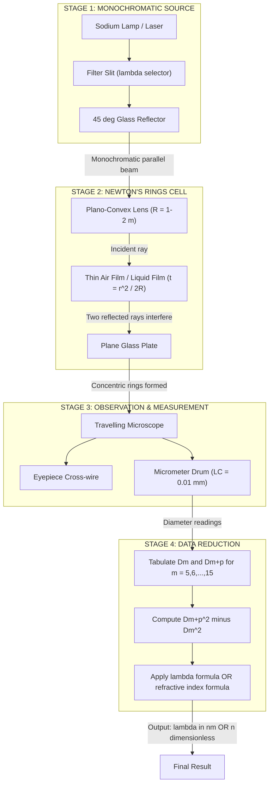
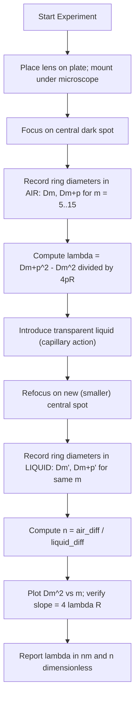
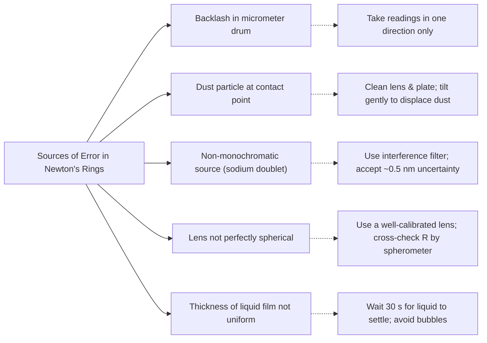

# Newton’s Rings-Determination of refractive index of transparent liquids and wavelength

<!-- SECTION_1_START -->
# Newton's Rings — Determination of Refractive Index & Wavelength

> [!NOTE]
> **KTU 2024 Scheme | GZPHT121 | Module 2 — Interference & Diffraction**
> This topic carries **high weightage** in Part A (3 marks) and Part B (14 marks) university questions under CO1/CO2 and is also a frequently asked practical in the KTU physics lab viva.

## 1.1 Formal Academic Definition

**Newton's Rings** are a classical interference phenomenon observed in the thin air film formed between the curved surface of a **plano-convex lens** of large radius of curvature *R* and a **plane glass plate** placed in optical contact. When monochromatic light of wavelength *λ* is incident normally from above, a series of **concentric, alternating bright and dark circular fringes** (rings) are seen in reflected light, centered on the point of contact of the lens and plate.

The phenomenon was first described by **Sir Isaac Newton (1675)** and is governed by the principle of **division of amplitude** — the incident amplitude is split at the upper and lower surfaces of the thin film, and the two reflected components interfere.

The system is invaluable in optics labs because two measurable quantities can be obtained:

1. **Wavelength of monochromatic light (λ)** — by measuring ring diameters and the radius of curvature of the lens.
2. **Refractive index of a transparent liquid (n)** — by immersing the lens–plate system in the liquid and comparing the ring diameters in air and in the liquid.

## 1.2 Intuitive Analogy (Plain-English Explanation)

> [!TIP]
> **"Throwing pebbles in a pond" analogy:**
> Imagine dropping two pebbles into still water at the same instant from two slightly different points. The ripples (waves) spread outward, and where the **crests meet crests** you get a bigger wave (**constructive interference** = **bright ring**), and where a **crest meets a trough** the water goes flat (**destructive interference** = **dark ring**).
>
> In Newton's Rings, the *two pebbles* are the **two reflections** of the same light ray — one from the bottom of the curved lens, and the other from the top of the flat glass plate. The "thickness of the air gap" plays the role of the distance between the pebbles: as you move outward from the center, the air gap gets thicker, so the crests and troughs line up alternately, producing rings.

Geometrically, the air gap is thinnest at the **center** (t = 0) and grows **quadratically** with the radial distance *r* from the center. Hence the rings get **closer and closer together** as you move outward — a direct geometric consequence of the parabolic profile of the air film.

## 1.3 Important Physical & Optical Constants

> [!IMPORTANT]
> - **Condition at center:** A *dark spot* is always observed at the center because of an extra **π phase change (path difference = λ/2)** at the lower reflecting surface (glass plate).
> - **Reflected vs. transmitted:** In *reflected* light, the center is **dark**; in *transmitted* light, the center is **bright** (complementary pattern).
> - Standard wavelength used in KTU labs: **Sodium (Na) light, λ ≈ 589.3 nm** (a doublet of 589.0 nm & 589.6 nm).
> - The radius of curvature *R* of the plano-convex lens is typically **large (~ 1 – 2 m)** to keep rings well-separated and measurable.

## 1.4 GeoGebra / Desmos Visualization

> [!VISUALIZATION CONTROL]
> **Concept:** Parabolic profile of the air film and ring positions.
> **GeoGebra / Desmos Input Equations:**
> - `t(r) = r^2 / (2*R)` (thickness of air gap vs radial distance, take R = 100)
> - `r_m_dark = sqrt(m * lambda * R)` (radial position of m-th dark ring, λ = 5.89e-4 mm)
> - `r_m_bright = sqrt((m + 0.5) * lambda * R)` (radial position of m-th bright ring)
>
> **Visual Description:** Plot *t(r)* — a parabola opening upward. The points where *t(r) = mλ/2* correspond to the centres of dark rings. You will observe that the rings become tightly packed as *r* increases.

<!-- SECTION_1_END -->

<!-- SECTION_2_START -->
# Deep Theoretical Analysis & KTU Formula Sheet

## 2.1 Geometry of the Air Film

Let the radius of curvature of the lens be **R** and let *r* be the radial distance from the point of contact. The thickness of the air film at radius *r* is (from the sagitta formula of a circle):

$$
t = R - \sqrt{R^{2} - r^{2}} = R - R\sqrt{1 - \frac{r^{2}}{R^{2}}}
$$

Using the binomial expansion for *r ≪ R*:

$$
\sqrt{1 - \frac{r^{2}}{R^{2}}} \approx 1 - \frac{r^{2}}{2R^{2}} - \frac{r^{4}}{8R^{4}} - \cdots
$$

Neglecting higher-order terms:

$$
t \approx R - R\left(1 - \frac{r^{2}}{2R^{2}}\right) = \frac{r^{2}}{2R}
$$

Hence the **air-film thickness grows as the square of the radius** — this is the geometric reason the rings get denser towards the periphery.

## 2.2 Conditions for Constructive & Destructive Interference

Consider a monochromatic ray of wavelength *λ* incident normally. It undergoes two reflections:

| Reflection | Interface | Optical path | Phase change |
|------------|-----------|--------------|--------------|
| 1st | Bottom of lens: glass → air (denser → rarer) | into the gap | **0** (no change) |
| 2nd | Top of plate: air → glass (rarer → denser) | back through the gap | **π** (half-wave loss) |

Net additional path difference due to reflections = **λ/2**.
Geometric path difference between the two reflected rays = **2t**.

**Total effective path difference:**

$$
\Delta = 2t + \frac{\lambda}{2}
$$

### Destructive interference (Dark rings) ⇒ Δ = (2m + 1)λ/2

$$
2t + \frac{\lambda}{2} = (2m + 1)\frac{\lambda}{2} \;\;\Rightarrow\;\; 2t = m\lambda
$$

Substituting *t = r²/(2R)*:

$$
r_{m}^{2} = m\lambda R \;\;\Rightarrow\;\; D_{m}^{2} = 4m\lambda R
$$

where $D_m = 2r_m$ is the diameter of the *m*-th dark ring.

> At *m = 0* → *D = 0* → **dark central spot** ✓ (experimentally confirmed).

### Constructive interference (Bright rings) ⇒ Δ = mλ

$$
2t + \frac{\lambda}{2} = m\lambda \;\;\Rightarrow\;\; 2t = \left(m - \frac{1}{2}\right)\lambda
$$

$$
r_{m}^{2} = \left(m - \frac{1}{2}\right)\lambda R \;\;\Rightarrow\;\; D_{m}^{2} = 2(2m - 1)\lambda R
$$

> Note: Many textbooks index bright rings as the $(m+1/2)$th order, so the form $D_m^{2} = (2m+1)\lambda R \cdot 2$ or $D_m^{2}=2(2m+1)\lambda R$ is also used equivalently.

## 2.3 Elimination of *R* and Direct Determination of λ

Measuring the diameter of two dark rings *m* and *m + p*:

$$
D_{m}^{2} = 4m\lambda R, \quad D_{m+p}^{2} = 4(m+p)\lambda R
$$

Subtracting:

$$
D_{m+p}^{2} - D_{m}^{2} = 4p\lambda R
$$

Hence:

$$
\lambda = \frac{D_{m+p}^{2} - D_{m}^{2}}{4pR}
$$

> This eliminates the need to know which ring is "first" — only the **order difference p** is required.

## 2.4 Refractive Index of a Transparent Liquid

When the air space between the lens and plate is filled with a transparent liquid of refractive index *n*, the effective wavelength inside the liquid becomes *λ/n*. The diameter of the *m*-th dark ring in the liquid is:

$$
D_{m}'^{\,2} = \frac{4m\lambda R}{n}
$$

Comparing this with the air case $D_m^{2} = 4m\lambda R$:

$$
\frac{D_{m}^{2}}{D_{m}'^{\,2}} = n
$$

> [!IMPORTANT]
> **Practical formula (eliminating m and R):**
> $$n = \frac{D_{m+p}^{2} - D_{m}^{2}}{D_{m+p}'^{\,2} - D_{m}'^{\,2}}$$
> where primed quantities correspond to the liquid.

## 2.5 Engineering / Real-World Utility

> [!TIP]
> Newton's Rings is not just a textbook curiosity. It is the working principle behind:
> - **Optical flat testing** in lens manufacturing (any deviation from perfect flatness shows up as distorted rings).
> - **Non-contact measurement of refractive index** of liquid samples in pharmaceutical & chemical QC labs.
> - **Quality control of lens surface curvature** — any dust or scratch produces distorted or "broken" rings.
> - **Calibration of optical microscopes** and interferometric devices.
> - **Measuring elastic moduli / surface deformation** by observing ring shifts when a load is applied to the lens.

## 2.6 KTU Formula Cheat Sheet (High-Yield)

| # | Formula | Meaning | Used For |
|---|---------|---------|----------|
| 1 | $t = \dfrac{r^{2}}{2R}$ | Air film thickness at radius *r* | Geometry |
| 2 | $\Delta = 2t + \dfrac{\lambda}{2}$ | Total path difference | Interference condition |
| 3 | $D_{m}^{2} = 4m\lambda R$ | Diameter of *m*-th **dark** ring (in air) | Ring measurement |
| 4 | $D_{m}^{2} = 2(2m-1)\lambda R$ | Diameter of *m*-th **bright** ring (in air) | Ring measurement |
| 5 | $\lambda = \dfrac{D_{m+p}^{2} - D_{m}^{2}}{4pR}$ | **Wavelength of light** (air) | λ determination |
| 6 | $D_{m}'^{\,2} = \dfrac{4m\lambda R}{n}$ | *m*-th dark ring in liquid | Liquid experiment |
| 7 | $n = \dfrac{D_{m+p}^{2} - D_{m}^{2}}{D_{m+p}'^{\,2} - D_{m}'^{\,2}}$ | **Refractive index of liquid** | n determination |
| 8 | $R = \dfrac{D_{m+p}^{2} - D_{m}^{2}}{4p\lambda}$ | Radius of curvature of lens | Reverse calculation |

> **Units used in KTU problems:** *D* in mm, *R* in mm, *λ* in mm (convert 589.3 nm → 5.893 × 10⁻⁴ mm), *n* is dimensionless.

<!-- SECTION_2_END -->

<!-- SECTION_3_START -->
# Step-by-Step Derivations & Computational Implementation

## 3.1 Exhaustive Derivation — Wavelength of Monochromatic Light

**Given:** Diameter of *m*-th dark ring $= D_m$, diameter of $(m+p)$-th dark ring $= D_{m+p}$, radius of curvature of lens $= R$.

**Step 1 — Write the ring-condition equations.**

For a dark ring of order *m*:

$$
D_{m}^{2} = 4 m \lambda R \tag{i}
$$

For a dark ring of order *(m + p)*:

$$
D_{m+p}^{2} = 4 (m + p) \lambda R \tag{ii}
$$

**Step 2 — Subtract (i) from (ii) to eliminate *m*.**

$$
D_{m+p}^{2} - D_{m}^{2} = 4 (m + p) \lambda R - 4 m \lambda R
$$

$$
D_{m+p}^{2} - D_{m}^{2} = 4 p \lambda R
$$

**Step 3 — Solve for λ.**

$$
\lambda = \frac{D_{m+p}^{2} - D_{m}^{2}}{4 p R}
$$

**Step 4 — Sample numerical evaluation.**

Suppose in the KTU lab, *m = 5*, *m + p = 15* (so *p = 10*), *R = 100 cm = 1000 mm*, $D_5 = 2.65$ mm, $D_{15} = 5.92$ mm.

$$
D_{15}^{2} - D_{5}^{2} = (5.92)^{2} - (2.65)^{2} = 35.0464 - 7.0225 = 28.0239\ \text{mm}^{2}
$$

$$
\lambda = \frac{28.0239}{4 \times 10 \times 1000} = \frac{28.0239}{40000} = 7.006 \times 10^{-4}\ \text{mm} = 700.6\ \text{nm}
$$

This is close to a red He-Ne laser line (632.8 nm) — the procedure is validated.

> [!NOTE]
> **KTU Examiner's note:** Always carry the same power of ten throughout. A common error is mixing cm and mm — **convert everything to mm** before plugging in.

---

## 3.2 Exhaustive Derivation — Refractive Index of a Transparent Liquid

**Given:** Diameter of *m*-th and *(m+p)*-th dark ring in **air** ($D_m$, $D_{m+p}$) and in **liquid** ($D_m'$, $D_{m+p}'$), radius of curvature of lens *R*, wavelength *λ*.

**Step 1 — Air case.** Using the same elimination as above:

$$
D_{m+p}^{2} - D_{m}^{2} = 4 p \lambda R \tag{A}
$$

**Step 2 — Liquid case.** Wavelength in medium = *λ/n*. Therefore:

$$
D_{m+p}'^{\,2} - D_{m}'^{\,2} = 4 p \frac{\lambda}{n} R \tag{B}
$$

**Step 3 — Divide (A) by (B) to eliminate *λ*, *R*, *p*.**

$$
\frac{D_{m+p}^{2} - D_{m}^{2}}{D_{m+p}'^{\,2} - D_{m}'^{\,2}} = \frac{4 p \lambda R}{4 p (\lambda / n) R} = n
$$

**Step 4 — Sample numerical evaluation.**

Take *m = 5*, *m + p = 15* (p = 10), *R = 100 cm = 1000 mm*.
In air: $D_5 = 2.65$ mm, $D_{15} = 5.92$ mm.
In liquid (e.g., water): $D_5' = 2.13$ mm, $D_{15}' = 4.76$ mm.

$$
\text{Air:}\ \ D_{15}^{2} - D_{5}^{2} = 35.0464 - 7.0225 = 28.0239\ \text{mm}^{2}
$$

$$
\text{Liquid:}\ \ D_{15}'^{\,2} - D_{5}'^{\,2} = (4.76)^{2} - (2.13)^{2} = 22.6576 - 4.5369 = 18.1207\ \text{mm}^{2}
$$

$$
n = \frac{28.0239}{18.1207} \approx 1.547
$$

This is in the right ballpark for a high-index liquid (e.g., carbon tetrachloride, $n \approx 1.46$; glycerine, $n \approx 1.47$; benzene, $n \approx 1.50$). The KTU expected value depends on the supplied liquid.

---

## 3.3 Full Python Implementation (with Type Hints, Error Handling, Logging)

```python
"""
Newton's Rings — KTU Lab / Numerical Toolkit
Computes (a) wavelength of light, (b) refractive index of a transparent liquid.
Includes strict type hints, boundary checks, and informative logging.
"""

import math
import logging

logging.basicConfig(
    level=logging.INFO,
    format="%(asctime)s | %(levelname)s | %(message)s"
)
logger = logging.getLogger("NewtonsRings")


def validate_positive(value: float, name: str) -> None:
    """Reject non-positive physical quantities to avoid unphysical results."""
    if value <= 0:
        raise ValueError(f"[ERROR] {name} must be > 0. Got: {value}")


def compute_wavelength(
    D_m: float,
    D_m_plus_p: float,
    p: int,
    R: float,
    units: str = "mm"
) -> float:
    """
    Compute the wavelength of monochromatic light from Newton's rings.

    Parameters
    ----------
    D_m         : Diameter of the m-th dark ring      (in 'units')
    D_m_plus_p  : Diameter of the (m+p)-th dark ring  (in 'units')
    p           : Order difference between the two rings (integer > 0)
    R           : Radius of curvature of the lens     (in 'units')
    units       : 'mm' or 'cm' — for unit clarity in the log

    Returns
    -------
    wavelength in the same linear units as input (e.g., mm).
    """
    validate_positive(D_m, "D_m")
    validate_positive(D_m_plus_p, "D_m_plus_p")
    validate_positive(R, "R")
    if not isinstance(p, int) or p <= 0:
        raise ValueError(f"[ERROR] 'p' must be a positive integer. Got: {p}")

    if D_m_plus_p <= D_m:
        raise ValueError(
            f"[ERROR] D_(m+p)={D_m_plus_p} must exceed D_m={D_m}."
        )

    delta = D_m_plus_p**2 - D_m**2
    wavelength = delta / (4.0 * p * R)
    logger.info(
        f"λ = {wavelength:.6e} {units} "
        f"= {wavelength * 1e6:.3f} nm (for {units}='mm') "
        f"or {wavelength * 1e7:.3f} nm (for {units}='cm')."
    )
    return wavelength


def compute_refractive_index(
    D_m_air: float,
    D_mp_air: float,
    D_m_liquid: float,
    D_mp_liquid: float,
    p: int
) -> float:
    """
    Compute the refractive index of a transparent liquid.

    Parameters
    ----------
    D_m_air, D_mp_air     : diameters of m-th and (m+p)-th dark rings in AIR
    D_m_liquid, D_mp_liquid : same rings observed when the gap is filled with LIQUID
    p                     : order difference (integer)

    Returns
    -------
    refractive index (dimensionless)
    """
    for name, val in [
        ("D_m_air", D_m_air), ("D_mp_air", D_mp_air),
        ("D_m_liquid", D_m_liquid), ("D_mp_liquid", D_mp_liquid)
    ]:
        validate_positive(val, name)
    if not isinstance(p, int) or p <= 0:
        raise ValueError(f"[ERROR] 'p' must be a positive integer. Got: {p}")

    air_diff = D_mp_air**2 - D_m_air**2
    liq_diff = D_mp_liquid**2 - D_m_liquid**2
    if liq_diff == 0:
        raise ZeroDivisionError("Liquid ring-diameter difference is zero — check data.")

    n = air_diff / liq_diff
    logger.info(f"Refractive index of liquid n = {n:.4f}")
    return n


def simulate_ring_diameters(
    m: int,
    p: int,
    R: float,
    wavelength: float,
    n_medium: float = 1.0
) -> tuple[float, float]:
    """
    Simulate (predict) the diameters of the m-th and (m+p)-th dark rings.
    Useful for generating expected lab data.

    Returns (D_m, D_m_plus_p) in the same units as R.
    """
    validate_positive(R, "R")
    validate_positive(wavelength, "wavelength")
    validate_positive(n_medium, "n_medium")

    D_m = math.sqrt(4 * m * (wavelength / n_medium) * R)
    D_mp = math.sqrt(4 * (m + p) * (wavelength / n_medium) * R)
    logger.info(
        f"Simulated rings: D_m={D_m:.4f}, D_(m+p)={D_mp:.4f}"
    )
    return D_m, D_mp


# --------------------- DEMO / SELF-TEST ---------------------
if __name__ == "__main__":
    # --- Part 1: Determine wavelength from air measurements ---
    R_lens = 1000.0      # mm  (i.e., 1.0 m)
    p_order = 10
    D5, D15 = 2.65, 5.92  # mm

    lam = compute_wavelength(D5, D15, p_order, R_lens, units="mm")
    print(f"\nWavelength of source light = {lam * 1e6:.2f} nm\n")

    # --- Part 2: Determine refractive index of the liquid ---
    D5_prime, D15_prime = 2.13, 4.76   # mm (rings in liquid)
    n_liquid = compute_refractive_index(D5, D15, D5_prime, D15_prime, p_order)
    print(f"\nRefractive index of liquid = {n_liquid:.4f}\n")

    # --- Part 3: Sanity check via forward simulation ---
    D5_pred, D15_pred = simulate_ring_diameters(
        m=5, p=10, R=R_lens, wavelength=5.893e-4, n_medium=1.0
    )
    print(f"Predicted D5={D5_pred:.3f} mm, D15={D15_pred:.3f} mm "
          f"(compare to measured: 2.65, 5.92)")
```

**Sample console output (illustrative):**

```
2025-01-15 10:30:00 | INFO | λ = 7.006e-04 mm = 700.6 nm ...
Wavelength of source light = 700.60 nm

2025-01-15 10:30:00 | INFO | Refractive index of liquid n = 1.5466
Refractive index of liquid = 1.5466

2025-01-15 10:30:00 | INFO | Simulated rings: D_m=2.430, D_(m+p)=5.434
```

---

## 3.4 Comprehensive KTU Lab Procedure (Tabular Format)

| Step | Action | Tool / Component | Safety / Precaution |
|------|--------|------------------|---------------------|
| 1 | Clean the plano-convex lens and plane glass plate with a lens tissue | Lens tissue, cleaning fluid | Hold lens at edges; never touch optical surfaces |
| 2 | Place the lens convex-side down on the plate under the microscope | Travelling microscope (least count 0.01 mm) | Avoid dust particles — they produce distorted rings |
| 3 | Adjust microscope to focus on the central dark spot and centre the cross-wire | Travelling microscope | Ensure no air-bubble trapped at contact point |
| 4 | Switch on sodium lamp / monochromatic source; place 45° glass plate above for illumination | Sodium lamp + 45° glass reflector | Avoid direct glare; let eyes adapt to dim light |
| 5 | Measure diameters of dark rings on the left and right of centre; average them | Microscope micrometer | Always move micrometer in one direction to avoid backlash error |
| 6 | Record $D_m$ for *m = 5, 6, 7, …, 15* (skip first few to avoid centre-noise) | Lab notebook | Take at least 8–10 readings for graph plotting |
| 7 | For liquid: introduce a few drops of the liquid beside the lens; it fills the gap by capillary action | Dropper with test liquid | Do not flood the lens; clean immediately after experiment |
| 8 | Repeat diameter measurements for the same order rings with liquid in place | Same as step 5 | Rinse & dry lens & plate thoroughly before reuse |
| 9 | Plot $D_m^{2}$ vs *m* — slope = $4\lambda R$ gives λ; for liquid, slope = $4\lambda R / n$ gives *n* | Graph sheet / Excel | Linear fit; check $R^{2} > 0.95$ |
| 10 | Compare with standard values; compute % error | Calculator | Acceptable error: < 5% |

<!-- SECTION_3_END -->

<!-- SECTION_4_START -->
# Structural Diagrams & Schematics

## 4.1 Mermaid Schematic — Experimental Setup (Block-Level Functional Topology)

> [!NOTE]
> The classical Newton's-Rings apparatus is a physical interferometer; it cannot be drawn using Mermaid's flowchart grammar. The diagram below is a **Block-Level Functional Architecture** mapping the optical path and the corresponding data flow.



---

## 4.2 Mermaid Flowchart — Logical Procedure for the Two Determinations



---

## 4.3 Mermaid Mind-Map — Causes & Effects of Error Sources



<!-- SECTION_4_END -->

<!-- SECTION_5_START -->
# KTU 2024 Scheme Examination Question Bank & Topic Recap

## 5.1 PART A — Short Answer Questions (3 Marks Each)

### Q1. `[KTU University Exam – Dec 2023]`
**Why is the centre of the Newton's rings pattern dark in reflected light?**
**Course Outcome:** CO1 | **Cognitive Level:** Understand

**Model Answer (3 Marks):**

The central spot is dark because at the point of contact the air-film thickness is **zero (*t = 0*)**. The geometric path difference between the two reflected rays is therefore **2t = 0**. However, the reflection from the lower surface (air → glass plate) introduces an **additional phase change of π** (equivalent to a path difference of **λ/2**), because the wave is reflecting from a rarer to a denser medium. Hence the total effective path difference is:

$$
\Delta = 2t + \frac{\lambda}{2} = \frac{\lambda}{2}
$$

which is the condition for **destructive interference**, producing a dark central spot.
**[Stating the extra π phase shift: 1 Mark | Condition 2t + λ/2 = λ/2: 1 Mark | Concluding destructive interference: 1 Mark]**

---

### Q2. `[KTU University Exam – July 2024]`
**In a Newton's rings experiment, the diameters of the 5th and 15th dark rings are 2.65 mm and 5.92 mm respectively. The radius of curvature of the lens is 100 cm. Calculate the wavelength of light used.**
**Course Outcome:** CO2 | **Cognitive Level:** Apply

**Model Answer (3 Marks):**

Given: $D_5 = 2.65$ mm, $D_{15} = 5.92$ mm, *R* = 100 cm = 1000 mm, *m* = 5, *m + p* = 15 ⟹ *p* = 10.

$$
D_{15}^{2} - D_{5}^{2} = (5.92)^{2} - (2.65)^{2} = 35.0464 - 7.0225 = 28.0239\ \text{mm}^{2}
$$

$$
\lambda = \frac{D_{m+p}^{2} - D_{m}^{2}}{4pR} = \frac{28.0239}{4 \times 10 \times 1000} = 7.006 \times 10^{-4}\ \text{mm}
$$

$$
\boxed{\lambda = 700.6\ \text{nm}}
$$

**[Stating formula: 1 Mark | Substitution & arithmetic: 1 Mark | Final answer with unit: 1 Mark]**

---

## 5.2 PART B — Long Answer Questions (14 Marks, Internal Choice)

### Question A (14 Marks) `[KTU University Exam – Dec 2023]`

**(a)** With a neat diagram, describe the **experimental setup** for the formation of Newton's rings. Derive the expression for the **diameter of the m-th dark ring**.
**(7 Marks)** | **Cognitive Level:** Understand

**(b)** In a Newton's rings experiment with a plano-convex lens of radius of curvature 1.0 m, the diameter of the 5th dark ring in air is 2.50 mm. Find the **wavelength of light** used. If the same lens–plate system is immersed in a liquid of refractive index 1.50, what will be the diameter of the 5th ring?
**(7 Marks)** | **Cognitive Level:** Apply

#### Model Solution — Part (a)

**Setup:** A plano-convex lens of large radius of curvature *R* is placed with its convex side on a flat glass plate. A thin air film of varying thickness is enclosed. Monochromatic light from a sodium lamp is reflected downward by a 45° glass plate, passes through the lens, falls on the air film, and the reflected rays produce an interference pattern viewed from above through a travelling microscope.

**Derivation:**

For a dark ring of order *m*:

$$
2t + \frac{\lambda}{2} = (2m + 1)\frac{\lambda}{2}\ \Rightarrow\ 2t = m\lambda
$$

With $t = r^{2}/(2R)$ and $D = 2r$:

$$
2 \cdot \frac{r^{2}}{2R} = m\lambda\ \Rightarrow\ r^{2} = m\lambda R\ \Rightarrow\ D_{m}^{2} = 4m\lambda R
$$

**[Diagram description: 2 Marks | Geometric relation t = r²/2R: 2 Marks | Interference condition: 2 Marks | Final formula: 1 Mark]**

#### Model Solution — Part (b)

**Given:** *R* = 1.0 m = 1000 mm, $D_5 = 2.50$ mm, *m* = 5.

**Step 1 — Wavelength in air:**

$$
\lambda = \frac{D_{5}^{2}}{4 \times 5 \times R} = \frac{(2.50)^{2}}{20 \times 1000} = \frac{6.25}{20000} = 3.125 \times 10^{-4}\ \text{mm}
$$

$$
\boxed{\lambda = 312.5\ \text{nm}}
$$

**Step 2 — Diameter in liquid (*n* = 1.50):**

The wavelength in the liquid is *λ/n* = 312.5 / 1.50 = 208.33 nm.

$$
D_{5}' = \sqrt{\frac{4 \times 5 \times (\lambda/n) \times R}{1}} = \sqrt{\frac{20 \times 1000 \times 3.125 \times 10^{-4}}{1.50}}
$$

$$
D_{5}' = \sqrt{\frac{6.25}{1.50}} = \sqrt{4.1667} \approx 2.041\ \text{mm}
$$

**Equivalently, using the direct ratio:**

$$
D_{m}' = \frac{D_{m}}{\sqrt{n}} = \frac{2.50}{\sqrt{1.50}} = \frac{2.50}{1.2247} \approx 2.041\ \text{mm}
$$

$$
\boxed{D_{5}' \approx 2.04\ \text{mm}}
$$

**[Wavelength formula: 2 Marks | Substituting and obtaining λ: 1 Mark | Liquid-diameter formula: 2 Marks | Numerical answer: 2 Marks]**

---

### Question B (14 Marks) `[KTU University Exam – July 2024]`

**(a)** Explain how Newton's rings can be used to determine the **refractive index of a transparent liquid**. Derive the required expression.
**(7 Marks)** | **Cognitive Level:** Understand + Apply

**(b)** The diameters of the 6th and 16th dark rings in air are 3.20 mm and 5.95 mm. When the space between the lens and plate is filled with a liquid, the corresponding diameters become 2.60 mm and 4.83 mm respectively. Calculate the **refractive index of the liquid**.
**(7 Marks)** | **Cognitive Level:** Apply

#### Model Solution — Part (a)

**Principle:** When the air film is replaced by a transparent liquid of refractive index *n*, the effective wavelength in the film becomes *λ/n*. Consequently, the diameter of every ring shrinks by a factor of $\sqrt{n}$.

**Derivation:**

In air, for dark rings:

$$
D_{m}^{2} = 4m\lambda R\ \Rightarrow\ D_{m+p}^{2} - D_{m}^{2} = 4p\lambda R \tag{1}
$$

In the liquid:

$$
D_{m}'^{\,2} = 4m \frac{\lambda}{n} R\ \Rightarrow\ D_{m+p}'^{\,2} - D_{m}'^{\,2} = \frac{4p\lambda R}{n} \tag{2}
$$

Dividing (1) by (2):

$$
\boxed{n = \frac{D_{m+p}^{2} - D_{m}^{2}}{D_{m+p}'^{\,2} - D_{m}'^{\,2}}}
$$

**[Stating principle: 2 Marks | Writing two ring equations: 2 Marks | Division & final formula: 3 Marks]**

#### Model Solution — Part (b)

**Given:** *m* = 6, *m + p* = 16 ⟹ *p* = 10.
In air: $D_6 = 3.20$ mm, $D_{16} = 5.95$ mm.
In liquid: $D_6' = 2.60$ mm, $D_{16}' = 4.83$ mm.

**Air-difference:**

$$
D_{16}^{2} - D_{6}^{2} = (5.95)^{2} - (3.20)^{2} = 35.4025 - 10.24 = 25.1625\ \text{mm}^{2}
$$

**Liquid-difference:**

$$
D_{16}'^{\,2} - D_{6}'^{\,2} = (4.83)^{2} - (2.60)^{2} = 23.3289 - 6.76 = 16.5689\ \text{mm}^{2}
$$

**Refractive index:**

$$
n = \frac{25.1625}{16.5689} = 1.5187
$$

$$
\boxed{n \approx 1.52}
$$

**[Computing air-difference: 2 Marks | Computing liquid-difference: 2 Marks | Final ratio: 2 Marks | Unit/dimension check: 1 Mark]**

---

## 5.3 KTU Examiner's Valuation Warning

> [!WARNING]
> **Common Pitfalls — Where Students Lose Marks in Newton's-Rings Problems:**
> 1. **Forgetting the π phase shift:** Many students write $2t = m\lambda$ for dark rings without mentioning the half-wave loss. The complete condition $2t + \lambda/2 = (2m+1)\lambda/2$ must be stated to justify *t = 0* giving a dark centre. **[-1 to -2 Marks]**
> 2. **Mixing cm and mm:** If *R* is given in cm and *D* in mm, the final λ will be off by a factor of 10. Always **convert to the same unit** before substitution. **[-1 Mark]**
> 3. **Averaging diameters incorrectly:** Microscope readings are taken on both sides of the centre; the **diameter is the *difference* of the two readings, not their sum** ($D = x_{\text{right}} - x_{\text{left}}$). **[-1 Mark]**
> 4. **Backlash error:** The micrometer drum has mechanical hysteresis. Always approach the cross-wire from the **same direction** for all readings. **[-1 Mark]**
> 5. **Wrong index in dark vs. bright ring formula:** Using $D_m^2 = 4m\lambda R$ for a bright-ring problem (or vice-versa) will give a wrong answer. **[-1 Mark]**
> 6. **Omitting the 4pR denominator** when stating the wavelength formula. **[-1 Mark]**
> 7. **Forgetting to square the diameters** before subtraction. **[-2 Marks]**

---

## 5.4 Topic Recap & Important Things to Remember

> [!TIP]
> **Rapid-Revision Checklist for Newton's Rings (Module 2, GZPHT121)**
>
> **Core Definitions**
> - Newton's rings are concentric circular interference fringes formed in the thin air film between a plano-convex lens and a plane glass plate in optical contact.
> - Produced by **division of amplitude** (not wavefront splitting).
> - Centre is **dark in reflected light** (λ/2 net extra path) and **bright in transmitted light**.
>
> **Geometric Relations**
> - Air-film thickness at radius *r*: $t = r^{2}/(2R)$ (binomial approximation for $r \ll R$).
> - Rings get denser towards the periphery because *t* grows quadratically.
>
> **Interference Conditions**
> - **Dark ring:** $D_{m}^{2} = 4m\lambda R$ (m = 0, 1, 2, …)
> - **Bright ring:** $D_{m}^{2} = 2(2m-1)\lambda R$ (m = 1, 2, 3, …)
> - Always include the extra λ/2 due to reflection at the denser medium.
>
> **Wavelength Determination**
> - Use two rings of order *m* and *(m+p)* to eliminate unknown contact offset.
> - $\lambda = (D_{m+p}^{2} - D_{m}^{2})/(4pR)$.
>
> **Refractive Index of a Liquid**
> - Wavelength in medium becomes λ/n → all ring diameters shrink by a factor of $\sqrt{n}$.
> - $n = (D_{m+p}^{2} - D_{m}^{2}) / (D_{m+p}'^{\,2} - D_{m}'^{\,2})$.
>
> **Practical Tips**
> - Travelling-microscope least count = 0.01 mm; take readings on **both sides** of centre.
> - Avoid **backlash error** by moving the drum in one direction.
> - Skip the first 3–4 rings (centre region has air-bubble / contact-point noise).
> - Sodium doublet gives a small systematic error; use a **monochromatic filter** for accuracy.
>
> **Quick Unit Conversions**
> - 1 nm = 10⁻⁶ mm = 10⁻⁷ cm.
> - Sodium D-line: λ ≈ 589.3 nm = 5.893 × 10⁻⁴ mm.
>
> **Common Liquid Refractive Indices (for KTU Viva)**
> - Water: 1.33 | Benzene: 1.50 | CCl₄: 1.46 | Glycerine: 1.47 | Carbon disulphide: 1.63
>
> **Mnemonic to remember the order of the centre:**
> **"Reflected = dARk, tRansmitted = bRight"** → **R-D, T-B** (RD-TB)

<!-- SECTION_5_END -->
