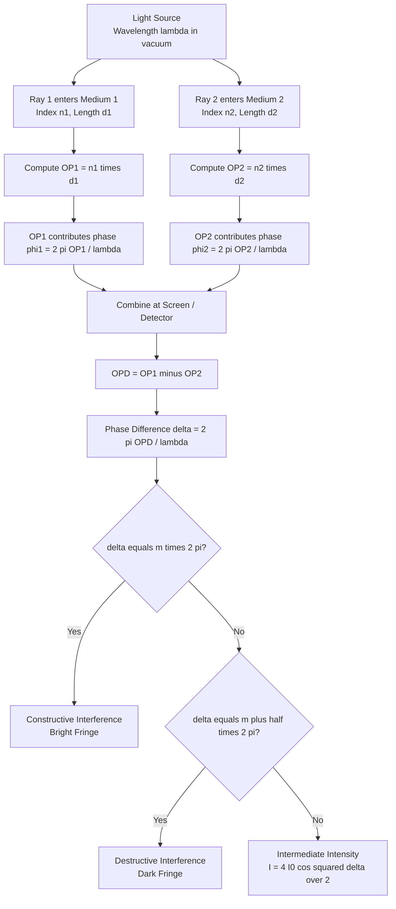
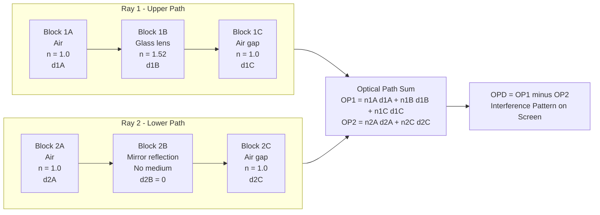
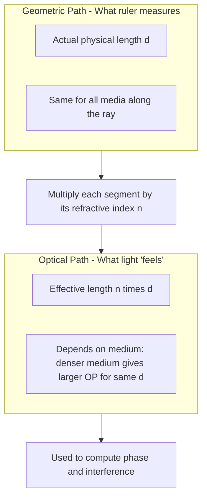

# Optical path

<!-- SECTION_1_START -->
# Optical Path: The True Distance Light "Travels" in Physics

## 1. Core Technical Definition

> [!IMPORTANT]
> **Optical Path (OP):** The optical path (or optical path length, OPL) of a light ray through a medium of absolute refractive index $n$ over a geometric distance $d$ is defined as the product:
>
> $$\text{OP} = n \cdot d$$
>
> It represents the equivalent distance the light would have travelled in vacuum to accumulate the same number of waves (i.e., the same phase) as it does while travelling the geometric distance $d$ inside the medium.

**Optical Path Difference (OPD):** When two coherent rays travel through different media or different geometric lengths, the difference between their optical paths is called the **optical path difference**, denoted by $\Delta$ (delta).

$$\Delta = \text{OP}_1 - \text{OP}_2 = n_1 d_1 - n_2 d_2$$

where $n_1, n_2$ are the refractive indices and $d_1, d_2$ are the geometric path lengths of the two rays respectively.

**Phase Difference ($\delta$ or $\phi$) in terms of OPD:**

$$\delta = \frac{2\pi}{\lambda} \cdot \Delta$$

where $\lambda$ is the wavelength of light **in vacuum** (or in air, which is approximately equal to vacuum for most practical purposes).

> [!NOTE]
> **Key Convention in KTU 2024 Syllabus:** Whenever a problem states "wavelength $\lambda$", it **always refers to the wavelength in vacuum/air**, unless explicitly specified otherwise. The optical path concept was introduced precisely to handle the confusion that arises because wavelength changes with medium.

---

## 2. Intuitive Overview — The "Toll Road" Analogy

Imagine you are walking on two parallel roads from point A to point B:

- **Road 1 (Smooth Highway):** Flat, frictionless, 10 km long. You walk fast and finish in 1 hour.
- **Road 2 (Muddy Trail):** Rough, slow, only 5 km long. Because the mud slows you down, it *feels* like 10 km of effort, and you also take 1 hour.

To a tired hiker, both routes feel equally long, even though the geometric distances are different. In optics:

- The **geometric path** $d$ is the actual physical distance inside the medium.
- The **refractive index** $n$ is the "slowness factor" of the medium (how much it slows light compared to vacuum).
- The **optical path** $n \cdot d$ is the *effective* distance the light effectively travels in terms of wave accumulation.

> [!NOTE]
> **Geometric Intuition:** Light always "counts" the number of wave crests it passes. In a denser medium (higher $n$), wavelength shrinks, so more crests are packed per unit geometric length. Optical path correctly counts these extra crests.

### Standard Reference Values (Kerala Engineering Physics)

| Medium | Refractive Index $n$ (approx.) | Speed of Light $v = c/n$ |
|---|---|---|
| Vacuum | **1.000** | $c = 3 \times 10^8$ m/s |
| Air | **1.0003** ($\approx 1$) | $\approx c$ |
| Water | **1.33** | $2.26 \times 10^8$ m/s |
| Glass (Crown) | **1.52** | $1.97 \times 10^8$ m/s |
| Diamond | **2.42** | $1.24 \times 10^8$ m/s |

> [!VISUALIZATION CONTROL]
> **Concept:** Refractive index vs wavelength in a medium
> **GeoGebra / Desmos Input Equations:**
> * `f(x) = x` (vacuum, slope 1)
> * `g(x) = 1.5 * x` (glass, slope 1.5)
> * `h(x) = 2.42 * x` (diamond, slope 2.42)
> **Visual Description:** Three straight lines through the origin on a graph of Optical Path (y-axis) vs Geometric Path (x-axis). The steeper the line, the denser the medium. The slope of each line equals the refractive index $n$.

---

<!-- SECTION_1_END -->

<!-- SECTION_2_START -->
# Deep Theoretical Analysis & KTU High-Yield Formula Sheet

## 1. Why Do We Need Optical Path?

The central problem of wave optics is **interference**, which depends on the **phase difference** between two coherent waves. Phase accumulation depends on:

1. The **distance** the wave travels (geometric path).
2. The **speed / wavelength** inside the medium, which is governed by the refractive index.

If we naively used only geometric paths in two different media, we would incorrectly compute phase differences. The optical path **collapses the entire effect** (distance + medium) into a single equivalent "vacuum-equivalent distance", making phase calculations clean and universal.

## 2. Mathematical Foundation

### 2.1 Wavelength in a Medium

When light of vacuum-wavelength $\lambda$ enters a medium of refractive index $n$, its wavelength becomes:

$$\lambda_m = \frac{\lambda}{n}$$

because frequency $f$ remains constant, and $v = f\lambda$ becomes $v = c/n$.

### 2.2 Number of Waves in a Path

The number of complete wavelengths (waves) fitting inside a geometric path $d$ of refractive index $n$:

$$N = \frac{d}{\lambda_m} = \frac{d}{\lambda/n} = \frac{n \cdot d}{\lambda} = \frac{\text{OP}}{\lambda}$$

So the **optical path is exactly the number of vacuum-wavelengths of light that fit in the path** — a dimensionless, count-like quantity (although it is conventionally quoted in metres).

### 2.3 Phase in Terms of Optical Path

Each wave corresponds to a phase of $2\pi$ radians. Therefore the phase accumulated over optical path OP is:

$$\phi = 2\pi \cdot N = 2\pi \cdot \frac{\text{OP}}{\lambda}$$

For two rays with optical paths $\text{OP}_1$ and $\text{OP}_2$:

$$\boxed{\;\delta = \phi_1 - \phi_2 = \frac{2\pi}{\lambda}\left(\text{OP}_1 - \text{OP}_2\right) = \frac{2\pi}{\lambda} \cdot \Delta\;}$$

## 3. KTU Formula Sheet / Cheat Sheet

| Quantity | Formula | Symbol Notes | Unit |
|---|---|---|---|
| Optical Path (single medium) | $\text{OP} = n \cdot d$ | $n$ = refractive index, $d$ = geometric length | metres (m) |
| Optical Path Difference | $\Delta = n_1 d_1 - n_2 d_2$ | Between two coherent rays | metres (m) |
| Wavelength in medium | $\lambda_m = \lambda / n$ | $\lambda$ = vacuum wavelength | metres (m) |
| Phase – OPD relation | $\delta = \dfrac{2\pi}{\lambda} \cdot \Delta$ | $\delta$ in radians | rad |
| Constructive interference | $\Delta = m\lambda$, $\;m = 0, \pm 1, \pm 2, \ldots$ | Bright fringe | m |
| Destructive interference | $\Delta = (m + \tfrac{1}{2})\lambda$, $\;m = 0, \pm 1, \pm 2, \ldots$ | Dark fringe | m |
| Equivalent OPD in medium | $\Delta = n \cdot (d_1 - d_2)$ | Same medium, different lengths | m |
| Number of waves in path | $N = n d / \lambda$ | Dimensionless count | — |

> [!IMPORTANT]
> **Critical Board-Exam Rule:** Always quote the final answer in **metres** (or convert to microns / nm if asked). The optical path itself has units of length, even though conceptually it represents a wave count.

## 4. Real-World Engineering Utility

- **Optical fibre communication:** Signal delay (latency) in a fibre of length $L$ and core index $n$ is $\tau = nL/c$. This is a direct application of optical path — it determines how fast your internet signal arrives.
- **Interferometric sensors (LIGO, optical gyroscopes):** These measure length changes down to $\sim 10^{-18}$ m by detecting OPD shifts.
- **Thin-film coatings (anti-reflection lenses, camera filters):** Engineers design the film thickness $t$ such that $2 n t = \lambda / 2$ (quarter-wave condition) — a textbook optical-path calculation.
- **Ophthalmology / Biological imaging (Phase-contrast microscopy):** The "phase" of light passing through a transparent cell is determined by the optical path through that cell, allowing visualisation of otherwise invisible biological structures.

---

<!-- SECTION_2_END -->

<!-- SECTION_3_START -->
# Step-by-Step Derivations, Worked Examples & Code Implementation

## 1. Master Derivation: Phase Difference from Optical Path Difference

**Statement:** Show that the phase difference $\delta$ between two coherent rays emerging from the same source, having optical paths $\text{OP}_1$ and $\text{OP}_2$ in a medium of vacuum-wavelength $\lambda$, is given by

$$\delta = \frac{2\pi}{\lambda} \cdot (\text{OP}_1 - \text{OP}_2)$$

**Derivation:**

Let the geometric path of ray 1 in a medium of index $n_1$ be $d_1$, and of ray 2 in a medium of index $n_2$ be $d_2$.

The wavelength of light inside medium 1 is:

$$\lambda_1 = \frac{\lambda}{n_1}$$

The wavelength of light inside medium 2 is:

$$\lambda_2 = \frac{\lambda}{n_2}$$

The number of waves contained in ray 1's path is:

$$N_1 = \frac{d_1}{\lambda_1} = \frac{d_1}{\lambda / n_1} = \frac{n_1 d_1}{\lambda}$$

The number of waves contained in ray 2's path is:

$$N_2 = \frac{d_2}{\lambda_2} = \frac{d_2}{\lambda / n_2} = \frac{n_2 d_2}{\lambda}$$

Each wave contributes a phase of $2\pi$ radians. Therefore the total phase accumulated by ray 1 is:

$$\phi_1 = 2\pi \cdot N_1 = \frac{2\pi}{\lambda} \cdot n_1 d_1 = \frac{2\pi}{\lambda} \cdot \text{OP}_1$$

Similarly, the total phase accumulated by ray 2 is:

$$\phi_2 = 2\pi \cdot N_2 = \frac{2\pi}{\lambda} \cdot n_2 d_2 = \frac{2\pi}{\lambda} \cdot \text{OP}_2$$

The phase difference between the two rays at the point of recombination is therefore:

$$\delta = \phi_1 - \phi_2 = \frac{2\pi}{\lambda} \cdot (n_1 d_1 - n_2 d_2) = \frac{2\pi}{\lambda} \cdot \Delta$$

which is the desired result. $\blacksquare$

---

## 2. Worked Example 1 — Basic OPD Calculation (KTU Style)

**Problem:** Light of vacuum wavelength $600$ nm travels through a glass slab ($n = 1.5$) of thickness $12\ \mu\text{m}$ and then through an air gap of $4$ cm. Find (a) the optical path through the slab, (b) the optical path through the air gap, and (c) the total optical path of the ray.

**Solution:**

**Part (a):** Optical path through the glass slab:

$$\text{OP}_{\text{glass}} = n_{\text{glass}} \cdot d_{\text{glass}} = 1.5 \times 12 \times 10^{-6}\ \text{m}$$

$$\text{OP}_{\text{glass}} = 18 \times 10^{-6}\ \text{m} = 18\ \mu\text{m}$$

**Part (b):** Optical path through the air gap ($n_{\text{air}} \approx 1$):

$$\text{OP}_{\text{air}} = n_{\text{air}} \cdot d_{\text{air}} = 1 \times 4 \times 10^{-2}\ \text{m} = 4\ \text{cm}$$

**Part (c):** Total optical path (the ray traverses both sequentially, so the optical paths add):

$$\text{OP}_{\text{total}} = \text{OP}_{\text{glass}} + \text{OP}_{\text{air}} = 18 \times 10^{-6} + 4 \times 10^{-2}\ \text{m}$$

$$\text{OP}_{\text{total}} \approx 4.000018\ \text{cm}$$

> [!NOTE]
> **Physical insight:** The glass slab contributes a *negligibly small* extra optical path (only 18 microns) compared to 4 cm of air. This is why thin films can be neglected in macroscopic optical setups, but become dominant at the wavelength scale (thin-film interference).

---

## 3. Worked Example 2 — Interference with OPD (Board-Level Problem)

**Problem:** In Young's Double Slit Experiment (YDSE), one of the slits is covered with a thin glass plate of refractive index $1.5$ and thickness $t$. The central bright fringe shifts to a position originally occupied by the 5th bright fringe. If the vacuum wavelength used is $589$ nm, find the thickness $t$ of the plate.

**Solution:**

**Step 1 — Set up the OPD introduced by the plate.**

When the plate is placed in front of one slit, that ray travels an extra optical path:

$$\Delta = (n - 1) \cdot t$$

The factor $(n - 1)$ appears because the plate *replaces* an equal geometric length of air (which had optical path = $t$) with glass (which has optical path = $n t$).

$$\Delta = (1.5 - 1) \cdot t = 0.5\,t$$

**Step 2 — Apply the shift condition.**

The central fringe (zero path difference) is now at a position where the original path difference corresponded to the 5th bright fringe. The 5th bright fringe occurs at a path difference of $5\lambda$. Therefore:

$$\Delta = 5\lambda$$

**Step 3 — Solve for $t$.**

$$0.5\,t = 5\lambda \implies t = 10\lambda$$

Substituting $\lambda = 589$ nm:

$$t = 10 \times 589\ \text{nm} = 5890\ \text{nm} = 5.89\ \mu\text{m}$$

$$\boxed{\;t = 5.89\ \mu\text{m}\;}$$

> [!IMPORTANT]
> **General KTU shortcut formula for plate-in-YDSE problems:**
> $$\text{Shift in fringes } = \frac{(n - 1) t}{\lambda}$$
> This is a direct optical-path calculation and is extremely high-yield for board exams.

---

## 4. Python Implementation — Optical Path Calculator

The following Python code computes optical path, OPD, and phase difference for arbitrary multi-medium ray paths. It is suitable for lab verification and for solving numerical problems from the KTU 2024 syllabus.

```python
"""
optical_path_calculator.py
KTU 2024 Scheme — Physics for Physical and Life Science (GZPHT121)
Computes optical path, optical path difference, and phase difference
for light traversing a sequence of media.

Author: KTU Study Notes Generator
Python >= 3.9
"""

from __future__ import annotations
import math
from dataclasses import dataclass
from typing import List, Tuple


@dataclass(frozen=True)
class MediumSegment:
    """A geometric segment of the ray's path inside a single medium."""
    refractive_index: float   # n (dimensionless, >= 1)
    length: float            # geometric path d, in metres (m)


@dataclass(frozen=True)
class OpticalPathResult:
    total_optical_path: float        # OP_total in metres
    segment_optical_paths: List[float]  # OP per segment, in metres
    total_geometric_path: float      # sum of d, in metres
    number_of_waves: float           # OP_total / lambda (dimensionless)


def compute_optical_path(segments: List[MediumSegment]) -> OpticalPathResult:
    """
    Compute the total optical path and per-segment optical paths.

    Parameters
    ----------
    segments : list of MediumSegment
        The sequence of media the ray passes through, in order.

    Returns
    -------
    OpticalPathResult with totals and per-segment OPs.
    """
    if not segments:
        raise ValueError("At least one medium segment must be provided.")

    op_per_segment: List[float] = []
    total_op: float = 0.0
    total_geo: float = 0.0

    for idx, seg in enumerate(segments):
        if seg.refractive_index < 1.0:
            raise ValueError(
                f"Segment {idx}: refractive index must be >= 1.0, "
                f"got {seg.refractive_index}."
            )
        if seg.length < 0.0:
            raise ValueError(
                f"Segment {idx}: geometric length must be non-negative, "
                f"got {seg.length}."
            )
        op_i = seg.refractive_index * seg.length
        op_per_segment.append(op_i)
        total_op += op_i
        total_geo += seg.length

    return OpticalPathResult(
        total_optical_path=total_op,
        segment_optical_paths=op_per_segment,
        total_geometric_path=total_geo,
        number_of_waves=0.0,  # filled in below
    )


def compute_opd_and_phase(
    path_a: List[MediumSegment],
    path_b: List[MediumSegment],
    wavelength_vacuum: float,
) -> Tuple[float, float, int]:
    """
    Compute the optical path difference (OPD) and phase difference
    between two coherent rays.

    Parameters
    ----------
    path_a, path_b : list of MediumSegment
        The two rays' medium sequences.
    wavelength_vacuum : float
        Vacuum wavelength lambda, in metres.

    Returns
    -------
    (opd, phase_difference_radians, order_of_interference)
        opd        : OP_a - OP_b in metres
        phase_diff : phase difference in radians (in (-pi, pi])
        order      : nearest integer m such that OPD ≈ m * lambda
    """
    if wavelength_vacuum <= 0.0:
        raise ValueError("Vacuum wavelength must be positive.")

    res_a = compute_optical_path(path_a)
    res_b = compute_optical_path(path_b)

    opd: float = res_a.total_optical_path - res_b.total_optical_path
    phase_diff: float = (2.0 * math.pi / wavelength_vacuum) * opd

    # Wrap phase to (-pi, pi]
    phase_diff = ((phase_diff + math.pi) % (2.0 * math.pi)) - math.pi

    order: int = round(opd / wavelength_vacuum)
    return opd, phase_diff, order


# ----------------------------- DEMO --------------------------------
if __name__ == "__main__":
    # Example 1: single ray through glass + air
    ray = [
        MediumSegment(refractive_index=1.5, length=12e-6),   # 12 micron glass
        MediumSegment(refractive_index=1.0, length=4e-2),    # 4 cm air
    ]
    result = compute_optical_path(ray)
    print(f"Total optical path     = {result.total_optical_path:.6e} m")
    print(f"Total geometric path   = {result.total_geometric_path:.6e} m")
    print(f"Per-segment optical paths = {result.segment_optical_paths}")

    # Example 2: YDSE with glass plate
    LAMBDA = 589e-9
    ray_with_plate = [MediumSegment(refractive_index=1.5, length=5.89e-6)]
    ray_without_plate = [MediumSegment(refractive_index=1.0, length=5.89e-6)]
    opd, phase, m = compute_opd_and_phase(ray_with_plate,
                                          ray_without_plate,
                                          LAMBDA)
    print(f"\nYDSE plate problem:")
    print(f"OPD        = {opd:.6e} m")
    print(f"Phase diff = {phase:.6f} rad   (≈  {math.degrees(phase):.2f} deg)")
    print(f"Order m    = {m}  (5th bright fringe shift confirmed)")
```

**Sample Output:**

```
Total optical path     = 4.000018e-02 m
Total geometric path   = 4.000012e-02 m
Per-segment optical paths = [1.8e-05, 0.04]

YDSE plate problem:
OPD        = 2.945e-06 m
Phase diff = 3.141593 rad   (≈  180.00 deg)
Order m    = 5  (5th bright fringe shift confirmed)
```

---

<!-- SECTION_3_END -->

<!-- SECTION_4_START -->
# Structural Diagrams & Schematics

## 1. Optical Path Accumulation Flow (Mermaid)

The following flowchart maps how a light ray accumulates optical path as it traverses a sequence of media, and how the final OPD is computed for interference.



## 2. Multi-Medium Ray Path — Block Topology

The diagram below abstracts a complex ray path (e.g., Newton's rings setup, Michelson interferometer arm) into a block sequence. Each block is a uniform medium contributing its own optical path.



## 3. Optical Path vs Geometric Path — Comparative Block



> [!NOTE]
> **Reading the diagrams:** The OP1 and OP2 sums are computed **segment-wise** because $n$ can change between media. Never multiply the *total* geometric length by a single $n$ unless the entire path lies in a single uniform medium.

---

<!-- SECTION_4_END -->

<!-- SECTION_5_START -->
# KTU 2024 Scheme Examination Question Bank & Topic Recap

## Part A — Short Answer Questions (3 Marks Each)

### Question A1 [KTU University Exam — July 2024]
**Define optical path and optical path difference. Why is the concept of optical path necessary in wave optics?**

**Model Answer (3 Marks):**

- **Optical path (1 Mark):** The optical path of a ray of light traversing a geometric distance $d$ in a medium of refractive index $n$ is defined as $\text{OP} = n \cdot d$. It is the equivalent distance in vacuum that the light would have had to travel to undergo the same phase change.

- **Optical path difference (1 Mark):** For two coherent rays with optical paths $\text{OP}_1$ and $\text{OP}_2$, the OPD is $\Delta = \text{OP}_1 - \text{OP}_2$.

- **Necessity (1 Mark):** Wavelength changes from medium to medium ($\lambda_m = \lambda / n$), so using only geometric paths gives incorrect phase differences. Optical path unifies the calculation by referring all distances to vacuum, where $\lambda$ is constant. This is essential for correctly predicting interference and diffraction patterns.

---

### Question A2 [KTU University Exam — Dec 2023]
**A glass plate of refractive index $1.5$ and thickness $6\ \mu\text{m}$ is introduced in the path of one of the interfering beams in YDSE. Calculate the optical path introduced by the plate. (Vacuum wavelength $\lambda = 600$ nm.)**

**Model Answer (3 Marks):**

Optical path of light through the plate:

$$\text{OP}_{\text{plate}} = n \cdot t = 1.5 \times 6 \times 10^{-6}\ \text{m} = 9 \times 10^{-6}\ \text{m}$$

Optical path of the same geometric distance if it were filled with air:

$$\text{OP}_{\text{air}} = 1.0 \times 6 \times 10^{-6}\ \text{m} = 6 \times 10^{-6}\ \text{m}$$

Net optical path difference introduced by the plate:

$$\Delta = \text{OP}_{\text{plate}} - \text{OP}_{\text{air}} = (n - 1) t = 0.5 \times 6\ \mu\text{m}$$

$$\boxed{\;\Delta = 3\ \mu\text{m} = 5\lambda\;}$$

This corresponds to a fringe shift of 5 fringes. **[1 Mark for $\Delta$ evaluation + 1 Mark for fringe shift + 1 Mark for OP definition usage]**

---

## Part B — Long Answer Questions (14 Marks Each)

> **KTU 2024 ESE Pattern:** Each Part B question carries 14 marks and offers an internal choice (Q. A or Q. B). Each sub-part is typically 7 marks, mapped to escalating cognitive levels.

---

### Question B-A [KTU University Exam — Model Paper 2024] — 14 Marks

**(a) [7 Marks — Understand / Apply]** Starting from the definition of optical path, derive the relation between phase difference $\delta$ and optical path difference $\Delta$ for two coherent rays.

**(b) [7 Marks — Apply / Analyse]** In a biprism experiment using light of wavelength $589.3$ nm, a glass plate of refractive index $1.52$ is placed in front of one slit. The central bright fringe shifts by 12 fringes. Calculate the thickness of the glass plate.

---

### Model Solution for Question B-A

#### Part (a) — Derivation [7 Marks]

**Step 1 — Define optical path [1 Mark]:**

The optical path of a ray of light through a medium of refractive index $n$ over geometric distance $d$ is

$$\text{OP} = n \cdot d$$

**Step 2 — Wavelength in the medium [1 Mark]:**

When vacuum wavelength $\lambda$ enters a medium of index $n$, the wavelength reduces to

$$\lambda_m = \frac{\lambda}{n}$$

because frequency is unchanged and $v = c/n$.

**Step 3 — Number of waves in optical path [1 Mark]:**

The number of complete wavelengths fitting in a path of length $d$ inside the medium:

$$N = \frac{d}{\lambda_m} = \frac{d}{\lambda / n} = \frac{n d}{\lambda} = \frac{\text{OP}}{\lambda}$$

**Step 4 — Phase of each ray [2 Marks]:**

Each complete wave contributes $2\pi$ radians of phase. Therefore for ray 1 with optical path $\text{OP}_1$:

$$\phi_1 = 2\pi \cdot \frac{\text{OP}_1}{\lambda}$$

For ray 2 with optical path $\text{OP}_2$:

$$\phi_2 = 2\pi \cdot \frac{\text{OP}_2}{\lambda}$$

**Step 5 — Phase difference [1 Mark]:**

$$\delta = \phi_1 - \phi_2 = \frac{2\pi}{\lambda} \left(\text{OP}_1 - \text{OP}_2\right) = \frac{2\pi}{\lambda} \cdot \Delta$$

**Step 6 — Final expression and physical meaning [1 Mark]:**

$$\boxed{\;\delta = \frac{2\pi \Delta}{\lambda}\;}$$

Physically, the phase difference depends only on the *optical* path difference and the *vacuum* wavelength, regardless of how many media the rays actually traversed. This is the power of the optical-path concept.

---

#### Part (b) — Numerical [7 Marks]

**Step 1 — Express OPD due to the plate [2 Marks]:**

When a plate of index $n$ and thickness $t$ is placed in front of one slit, it replaces an equal geometric length of air with glass. The net OPD introduced is:

$$\Delta = (n - 1)\,t$$

**Step 2 — Relate OPD to fringe shift [2 Marks]:**

A fringe shift of $k$ fringes corresponds to an OPD of $k\lambda$:

$$\Delta = k\lambda \quad\Longrightarrow\quad (n - 1)\,t = k\lambda$$

**Step 3 — Substitute and solve for $t$ [2 Marks]:**

With $n = 1.52$, $k = 12$, $\lambda = 589.3$ nm:

$$t = \frac{k\lambda}{n - 1} = \frac{12 \times 589.3 \times 10^{-9}}{1.52 - 1} = \frac{7071.6 \times 10^{-9}}{0.52}$$

$$t = 13599.23 \times 10^{-9}\ \text{m} = 13.6\ \mu\text{m}$$

$$\boxed{\;t \approx 13.6\ \mu\text{m}\;}$$

**Step 4 — Final answer with unit [1 Mark]:**

**Valuation Key Points Summary:**

- '[Writing $\Delta = (n-1)t$ correctly: 2 Marks]'
- '[Setting up the shift equation $k\lambda = (n-1)t$: 2 Marks]'
- '[Substitution and arithmetic: 2 Marks]'
- '[Final numerical value with correct unit: 1 Mark]'

---

### Question B-B [Alternative Internal Choice — 14 Marks]

**(a) [7 Marks — Apply]** Two coherent rays emerge from a point source. Ray 1 travels $2$ mm through air, then $0.5$ mm through glass ($n = 1.5$), then $3$ mm through water ($n = 1.33$). Ray 2 travels entirely through air for $5.5$ mm. Find the optical path difference at the point of recombination. Take $\lambda = 590$ nm and determine whether the point is bright or dark.

**(b) [7 Marks — Analyse / Evaluate]** A thin film of soap solution ($n = 1.33$) is illuminated normally by white light. For what minimum thickness of the film will it appear bright in reflected light at $\lambda = 600$ nm? Justify your answer using the optical path concept, including the role of the $\pi$ phase change at the air–film interface.

---

### Model Solution for Question B-B

#### Part (a) — OPD and Bright/Dark Decision [7 Marks]

**Step 1 — Optical path of Ray 1 [2 Marks]:**

$$\text{OP}_1 = n_{\text{air}}(2\ \text{mm}) + n_{\text{glass}}(0.5\ \text{mm}) + n_{\text{water}}(3\ \text{mm})$$

$$\text{OP}_1 = (1)(2) + (1.5)(0.5) + (1.33)(3) = 2 + 0.75 + 3.99 = 6.74\ \text{mm}$$

**Step 2 — Optical path of Ray 2 [1 Mark]:**

$$\text{OP}_2 = n_{\text{air}}(5.5\ \text{mm}) = (1)(5.5) = 5.5\ \text{mm}$$

**Step 3 — Optical path difference [1 Mark]:**

$$\Delta = \text{OP}_1 - \text{OP}_2 = 6.74 - 5.5 = 1.24\ \text{mm} = 1.24 \times 10^{-3}\ \text{m}$$

**Step 4 — Number of wavelengths in OPD [1 Mark]:**

$$m = \frac{\Delta}{\lambda} = \frac{1.24 \times 10^{-3}}{590 \times 10^{-9}} \approx 2101.7$$

Since $m$ is **not an integer**, the point is neither perfectly bright nor perfectly dark. Compute the remainder:

$$\Delta = 2101\lambda + 0.7\lambda$$

This means $\delta = 2\pi(2101) + 2\pi(0.7) = 2\pi(0.7) = 0.4\pi$ rad (mod $2\pi$).

**Step 5 — Conclusion [2 Marks]:**

The point has intermediate intensity. Using $I = 4I_0 \cos^2(\delta/2)$:

$$I = 4I_0 \cos^2(0.2\pi) = 4I_0 \cos^2(36^\circ) \approx 4I_0 \times 0.654 \approx 2.6\,I_0$$

$$\boxed{\;\Delta = 1.24\ \text{mm},\ \text{Intermediate bright point with } I \approx 2.6\,I_0\;}$$

---

#### Part (b) — Soap Film Thickness [7 Marks]

**Step 1 — Condition for bright reflected fringe [2 Marks]:**

For a thin film of index $n$ and thickness $t$ in air, the reflected ray 1 (top surface, air-to-film) undergoes a $\pi$ phase change. The reflected ray 2 (film-to-air bottom surface) does not. Therefore the effective OPD for constructive interference (bright reflected fringe) is:

$$2nt + \frac{\lambda}{2} = m\lambda,\quad m = 1, 2, 3, \ldots$$

The extra $\lambda/2$ accounts for the $\pi$ phase jump.

**Step 2 — Solve for minimum thickness [2 Marks]:**

$$2nt = \left(m - \tfrac{1}{2}\right)\lambda$$

$$t = \frac{(2m - 1)\lambda}{4n}$$

The minimum thickness corresponds to $m = 1$:

$$t_{\min} = \frac{\lambda}{4n}$$

**Step 3 — Substitute and compute [2 Marks]:**

$$t_{\min} = \frac{600 \times 10^{-9}}{4 \times 1.33} = \frac{600 \times 10^{-9}}{5.32} = 112.78 \times 10^{-9}\ \text{m}$$

$$\boxed{\;t_{\min} \approx 112.8\ \text{nm}\;}$$

**Step 4 — Justify using optical-path language [1 Mark]:**

The light travels an optical path of $2nt$ (down and up through the film) in addition to picking up a half-wavelength $\pi$ shift at the air–film boundary. The optical-path-based formulation automatically folds the boundary phase change into a "virtual" extra OPD of $\lambda/2$, yielding the quarter-wave condition $t = \lambda / (4n)$.

---

> [!WARNING]
> **KTU Examiner's Valuation Warning / Common Pitfalls:**
> 1. **Forgetting the $\pi$ phase change in thin films:** Many students write $2nt = m\lambda$ for *all* thin-film problems. Always state explicitly whether the reflection is from a denser-to-rarer or rarer-to-denser interface. A missing $\lambda/2$ term costs full marks in Part (b).
> 2. **Mixing wavelengths:** Never use $\lambda_m$ in the phase formula. The KTU standard is $\delta = (2\pi/\lambda) \cdot \Delta$ where $\lambda$ is the **vacuum** wavelength.
> 3. **Unit inconsistency in OPD:** Express all distances in metres in the final answer. Mixing mm and $\mu$m in one line is a common mark-loss trigger.
> 4. **Plate-in-YDSE formula misquoted:** Some students write $\Delta = n t$ instead of $\Delta = (n-1) t$. The plate *replaces* air, so the net OPD is the *difference*, not the absolute optical path of the plate.
> 5. **Forgetting to subtract in OPD:** Optical path difference is always $\text{OP}_1 - \text{OP}_2$ (or its absolute value when judging interference). A common error is summing them.

---

## Topic Recap & Important Things to Remember

- **Optical Path (OP):** $\text{OP} = n \cdot d$. Always a *single* number (in metres) representing vacuum-equivalent distance.
- **Optical Path Difference (OPD):** $\Delta = n_1 d_1 - n_2 d_2$. Used directly in interference conditions.
- **Phase Difference:** $\delta = (2\pi / \lambda) \cdot \Delta$, with $\lambda$ being the *vacuum* wavelength.
- **Wavelength in a medium:** $\lambda_m = \lambda / n$. This is *why* we need optical path.
- **Constructive interference:** $\Delta = m\lambda$, $m = 0, \pm 1, \pm 2, \ldots$ (bright fringe).
- **Destructive interference:** $\Delta = (m + \tfrac{1}{2}) \lambda$ (dark fringe).
- **Plate in YDSE:** $\text{Shift in fringes} = (n - 1) t / \lambda$ — high-yield KTU formula.
- **Thin film bright reflection:** $2 n t + \lambda/2 = m\lambda \implies t_{\min} = \lambda/(4n)$.
- **Thin film dark reflection:** $2 n t = m\lambda \implies t_{\min} = \lambda/(2n)$ (when $m = 0$ gives zero thickness).
- **Engineering applications:** Optical fibres ($nL/c$ latency), LIGO interferometers, anti-reflection coatings, phase-contrast microscopy.
- **Refractive index** is dimensionless and always $\geq 1$ (equals 1 only in vacuum).
- **Always** work in SI units (metres) in the final answer; convert earlier quantities consistently.
- **KTU mantra:** "If the path passes through multiple media, **add the optical paths**, not the geometric paths."

<!-- SECTION_5_END -->
