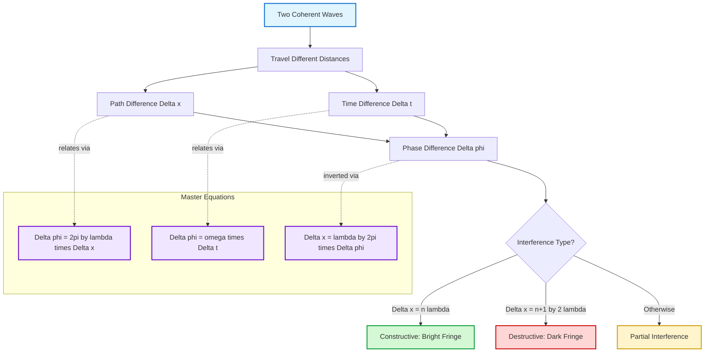
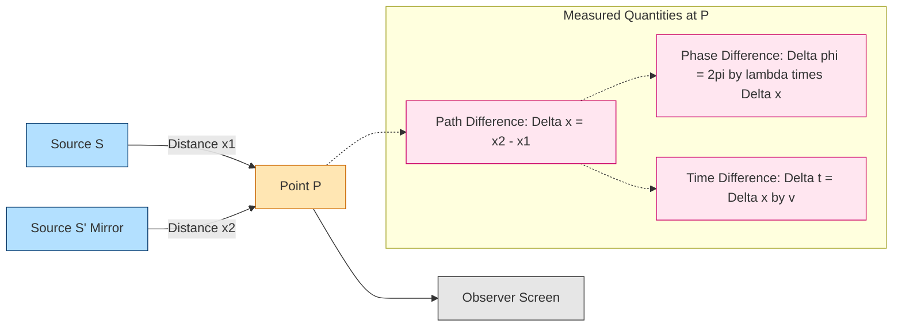
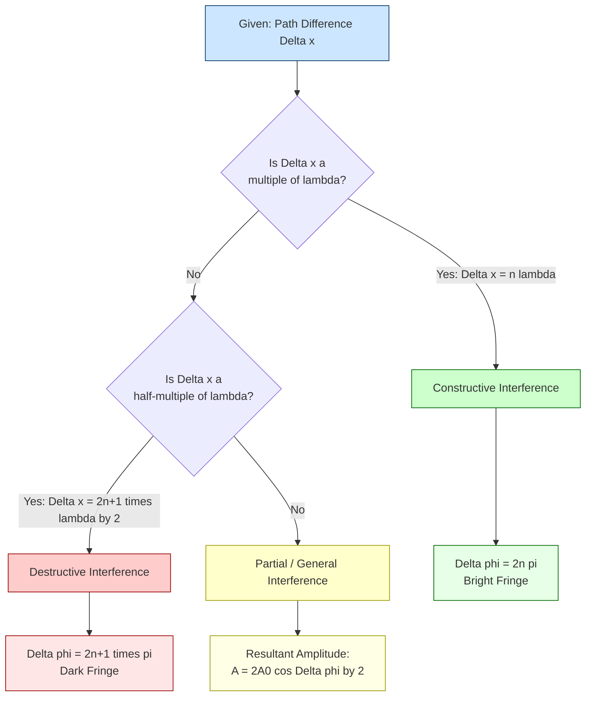
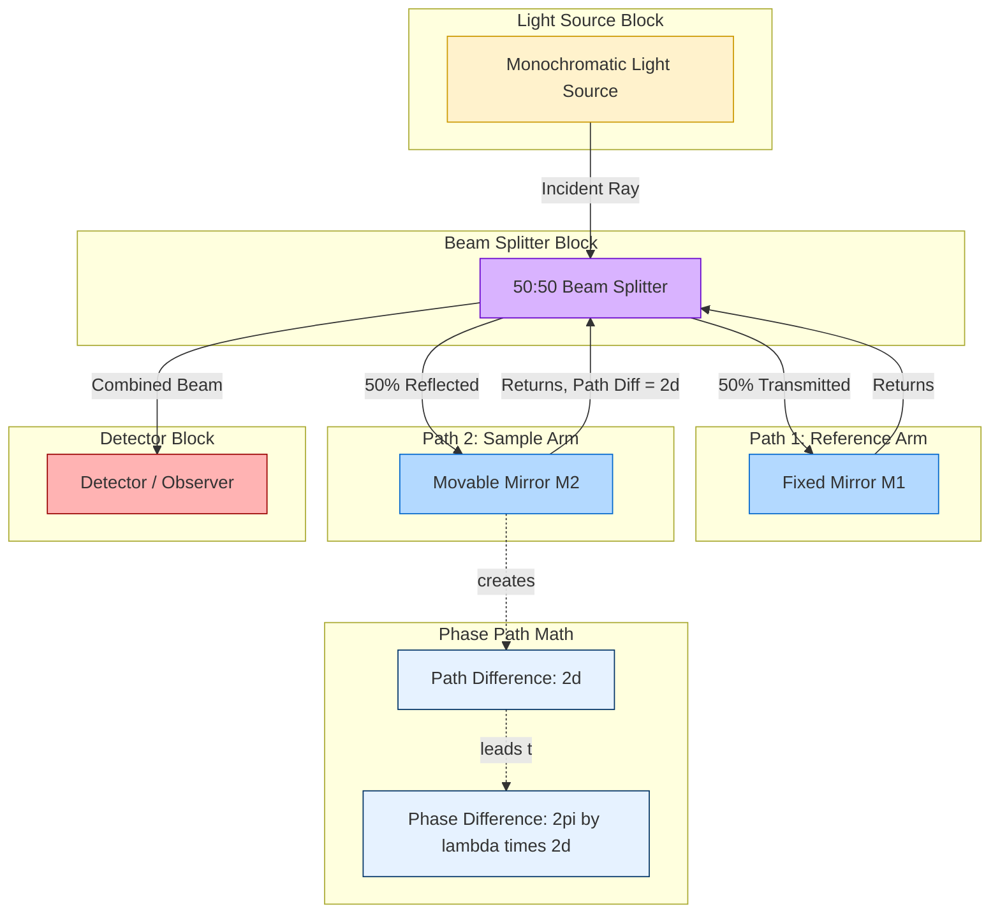

# Phase difference and path difference

<!-- SECTION_1_START -->

# Phase Difference and Path Difference

## 1. Core Technical Definition & Intuitive Overview

### 1.1 Formal KTU 2024 Definition

**Phase Difference ($\Delta \phi$)** is defined as the difference in the instantaneous phase angles of two waves arriving at a given point, measured in **radians** (or **degrees**). It is the angular displacement of one wave relative to another at a specific instant of time.

**Path Difference ($\Delta x$)** is defined as the difference in the physical distance traveled by two coherent waves from their respective sources to a common point of observation, measured in **meters (m)**.

For two coherent sinusoidal waves traveling through the same medium with the same angular frequency $\omega$ and wave number $k$, the relationship is established through the **wave equation**:

$$y_1(x, t) = A \sin(\omega t - kx_1 + \phi_1)$$
$$y_2(x, t) = A \sin(\omega t - kx_2 + \phi_2)$$

> [!IMPORTANT]
> **KTU Board Definition (Syllabus Standard):**
> The phase difference between two waves at a point is the argument of the sine (or cosine) function that distinguishes the two waveforms at that point. The path difference is the extra geometric distance covered by one wave compared to the other, both originating from coherent sources.

> [!NOTE]
> **Key Distinction for Board Examinations:**
> - *Phase difference* is a **dimensionless angular quantity** (radians).
> - *Path difference* has the dimension of **length** (meters).
> - These two quantities are **not the same**, but are **directly proportional** through the wave constant $k = \frac{2\pi}{\lambda}$.

### 1.2 Conceptual Analogy / Intuitive Understanding

Imagine two students (Say *Alice* and *Bob*) running on a circular track of perimeter $\lambda$. They start at the same time from the same point, but Alice runs **5 meters** further than Bob before stopping.

- The **path difference** ($\Delta x = 5$ m) tells you *how much extra distance* Alice covered.
- The **phase difference** ($\Delta \phi$) tells you *where Alice is positioned* on the circular track relative to Bob — in terms of angle (radians) — when both stop.

If the track has circumference $\lambda$, then the path difference translates to a phase difference through the proportion:

$$\frac{\Delta x}{\lambda} = \frac{\Delta \phi}{2\pi}$$

> [!TIP]
> **Geometric Intuition (Circular Track):**
> One complete lap around the track (path difference $= \lambda$) corresponds to one full revolution (phase difference $= 2\pi$). Half a lap ($\lambda/2$) corresponds to half a revolution ($\pi$ radians). This is the **heart of interference physics**!

### 1.3 Standard Physical Constants Used

| Symbol | Quantity | Value | Unit |
| :---: | :---: | :---: | :---: |
| $\lambda$ | Wavelength | Depends on source | m (meter) |
| $T$ | Time period | Depends on source | s (second) |
| $f$ | Frequency | Depends on source | Hz |
| $\omega$ | Angular frequency | $\omega = 2\pi f$ | rad/s |
| $k$ | Wave number | $k = \frac{2\pi}{\lambda}$ | rad/m |
| $c$ | Speed of light (vacuum) | $\mathbf{3 \times 10^8}$ | m/s |
| $v$ | Wave speed in medium | $v = f\lambda$ | m/s |

> [!VISUALIZATION CONTROL]
> **Concept:** Sinusoidal wave with marked wavelength and phase
> **GeoGebra / Desmos Input Equations:**
> * `y1 = sin(2*pi*x)` (Reference wave)
> * `y2 = sin(2*pi*x - pi/2)` (Wave shifted by path difference of $\lambda/4$)
> **Visual Description:** The student should observe that when y1 is at peak, y2 is at zero crossing — this visual lag is the **phase difference** of $\pi/2$ radians, caused by a **path difference** of $\lambda/4$.

---

<!-- SECTION_1_END -->

<!-- SECTION_2_START -->

# 2. Deep Theoretical Analysis & KTU High-Yield Formula Sheet

## 2.1 Step-by-Step Conceptual Breakdown

To understand the origin of phase difference from path difference, we must trace the wave's journey from source to observation point:

- **Step 1 — Wave Emission:** A coherent source emits a continuous sinusoidal wave. The wave at the source has phase $\phi_0 = 0$ at $t = 0$.
- **Step 2 — Wave Propagation:** As the wave travels a distance $x$, its phase reduces (lags) by an amount $kx = \frac{2\pi}{\lambda} \cdot x$ because the wave equation is $\sin(\omega t - kx)$.
- **Step 3 — Two Waves, Two Paths:** Two coherent waves travel different distances $x_1$ and $x_2$ to reach point $P$. Each acquires a phase lag of $kx_1$ and $kx_2$ respectively.
- **Step 4 — Phase Lag Difference:** The **difference in phase lags** is the phase difference:

$$\Delta \phi = kx_2 - kx_1 = k(x_2 - x_1) = k \cdot \Delta x$$

- **Step 5 — Substituting $k$:** Since $k = \frac{2\pi}{\lambda}$, we obtain the master equation:

$$\boxed{\Delta \phi = \frac{2\pi}{\lambda} \cdot \Delta x}$$

- **Step 6 — Time Connection:** Since $\omega = 2\pi f$ and $v = \lambda f$, we can also write:

$$\Delta \phi = \omega \cdot \Delta t = 2\pi f \cdot \Delta t = \frac{2\pi}{T} \cdot \Delta t$$

## 2.2 KTU High-Yield Formula Sheet (Master Cheat Sheet)

> [!IMPORTANT]
> The following table contains **all the formulas** a KTU student needs to solve any numerical or conceptual question on this topic. **Memorize these thoroughly.**

| S. No. | Quantity | Formula | Condition / Notes |
| :---: | :---: | :---: | :--- |
| 1 | Phase difference in terms of path difference | $\Delta \phi = \frac{2\pi}{\lambda} \cdot \Delta x$ | Master relationship |
| 2 | Path difference in terms of phase difference | $\Delta x = \frac{\lambda}{2\pi} \cdot \Delta \phi$ | Inverse of formula 1 |
| 3 | Phase difference in terms of time difference | $\Delta \phi = \omega \cdot \Delta t = \frac{2\pi}{T} \cdot \Delta t$ | Useful for AC / oscillator problems |
| 4 | One full wavelength equivalence | $\Delta x = \lambda \iff \Delta \phi = 2\pi$ | One complete cycle |
| 5 | Half-wavelength equivalence | $\Delta x = \frac{\lambda}{2} \iff \Delta \phi = \pi$ | Half cycle (180°) |
| 6 | Quarter-wavelength equivalence | $\Delta x = \frac{\lambda}{4} \iff \Delta \phi = \frac{\pi}{2}$ | Quarter cycle (90°) |
| 7 | Constructive Interference | $\Delta x = n\lambda$, $\Delta \phi = 2n\pi$ | $n = 0, 1, 2, \dots$ |
| 8 | Destructive Interference | $\Delta x = (2n+1)\frac{\lambda}{2}$, $\Delta \phi = (2n+1)\pi$ | $n = 0, 1, 2, \dots$ |
| 9 | Optical Path Difference (OPD) | $\Delta_{OPD} = n \cdot \Delta x$ | In a medium of refractive index $n$ |
| 10 | Phase retardation in thin film | $\Delta \phi = \frac{2\pi}{\lambda} \cdot 2\mu t \cos r$ | Newton's rings, thin-film interference |

> [!WARNING]
> **CRITICAL KTU EXAM TIP — Don't confuse *Path Difference* with *Optical Path Difference (OPD)***.
> When a wave travels through a medium of refractive index $\mu$, the **optical path difference** is $\mu \cdot \Delta x$, not just $\Delta x$. The phase difference becomes $\Delta \phi = \frac{2\pi}{\lambda} \cdot (\mu \cdot \Delta x)$, where $\lambda$ is the wavelength **in vacuum** (or in the reference medium).

## 2.3 Real-World Engineering Utility

The phase–path difference relationship is the **backbone of modern optics and photonics engineering**:

- **Optical Interferometers (Michelson, Mach-Zehnder):** Measure tiny path differences ($\sim 10^{-9}$ m) by detecting phase changes. Used in **LIGO** for gravitational wave detection.
- **Optical Coherence Tomography (OCT):** Medical imaging technique that maps path differences in biological tissue to construct cross-sectional images of the retina.
- **Diffraction Gratings & Spectrometers:** Separate wavelengths by exploiting interference conditions, where constructive peaks occur at specific path differences.
- **Thin-Film Coatings (Anti-reflection lens coatings):** Designed to produce a $\pi$ phase shift (path difference $\lambda/4$) for destructive interference of reflected light.
- **GPS and Telecommunications:** Phase comparison of radio waves is used to determine path lengths and time delays for position calculation.
- **Acoustic Engineering:** Phase differences in sound waves determine noise-cancellation headphone technology (destructive interference).

---

<!-- SECTION_2_END -->

<!-- SECTION_3_START -->

# 3. Step-by-Step Derivations & Code/Symbolic Implementation

## 3.1 Exhaustive Derivation of the Phase–Path Difference Master Relation

### Derivation 1: From the General Wave Equation

Consider a one-dimensional sinusoidal wave traveling in the $+x$ direction through a homogeneous, non-dispersive medium:

$$y(x, t) = A \sin(\omega t - kx + \phi_0)$$

where:
- $A$ is the amplitude (in meters),
- $\omega$ is the angular frequency (in rad/s),
- $k$ is the angular wave number (in rad/m),
- $x$ is the position coordinate (in m),
- $\phi_0$ is the initial phase (in rad).

For two coherent waves emitted from two sources with no initial phase difference ($\phi_0 = 0$ for both), the displacement at observation point $P$ is:

$$y_1 = A \sin(\omega t - kx_1)$$
$$y_2 = A \sin(\omega t - kx_2)$$

The **phase** of wave 1 at point $P$ is $\theta_1 = \omega t - kx_1$.
The **phase** of wave 2 at point $P$ is $\theta_2 = \omega t - kx_2$.

The **phase difference** at any instant $t$ is:

$$\Delta \phi = \theta_2 - \theta_1 = (\omega t - kx_2) - (\omega t - kx_1)$$

$$\Delta \phi = -kx_2 + kx_1 = -k(x_2 - x_1) = -k \cdot \Delta x$$

The negative sign simply indicates which wave lags. For magnitude analysis, we take the absolute value:

$$\boxed{\Delta \phi = k \cdot \Delta x = \frac{2\pi}{\lambda} \cdot \Delta x}$$

This is the **fundamental phase–path difference relation** that governs all of wave optics.

### Derivation 2: Connecting Wavelength, Time Period, and Phase

The wave speed $v$ in a medium is given by:

$$v = \frac{\lambda}{T} = f\lambda$$

The angular frequency is $\omega = 2\pi f$, and the wave number is $k = \frac{2\pi}{\lambda}$.

Therefore:

$$\frac{\omega}{k} = \frac{2\pi f}{2\pi / \lambda} = f\lambda = v$$

This confirms that the ratio $\frac{\omega}{k}$ equals the wave speed. A wave traveling an extra path $\Delta x$ takes an extra time:

$$\Delta t = \frac{\Delta x}{v}$$

The accumulated phase during this extra time is:

$$\Delta \phi = \omega \cdot \Delta t = \omega \cdot \frac{\Delta x}{v} = \frac{\omega}{v} \cdot \Delta x = k \cdot \Delta x = \frac{2\pi}{\lambda} \cdot \Delta x$$

Both derivations lead to the **same master equation**, confirming its validity.

## 3.2 Worked Example Derivations (Step-by-Step)

### Example 1: Basic Numerical Conversion

**Problem (Model Question):** In a Young's Double Slit Experiment, light of wavelength $\lambda = 600$ nm produces a path difference of $\Delta x = 1.2 \mu$m at a point on the screen. Calculate the phase difference between the two interfering waves at that point.

**Given Data:**
- Wavelength: $\lambda = 600 \text{ nm} = 600 \times 10^{-9} \text{ m} = 6 \times 10^{-7} \text{ m}$
- Path difference: $\Delta x = 1.2 \text{ }\mu\text{m} = 1.2 \times 10^{-6} \text{ m}$

**Step 1 — Identify the governing equation:**

$$\Delta \phi = \frac{2\pi}{\lambda} \cdot \Delta x$$

**Step 2 — Substitute the numerical values:**

$$\Delta \phi = \frac{2\pi}{6 \times 10^{-7}} \cdot (1.2 \times 10^{-6})$$

**Step 3 — Simplify the constants and powers of 10:**

$$\Delta \phi = 2\pi \cdot \frac{1.2 \times 10^{-6}}{6 \times 10^{-7}}$$

**Step 4 — Compute the ratio:**

$$\frac{1.2 \times 10^{-6}}{6 \times 10^{-7}} = \frac{1.2}{6} \times 10^{-6-(-7)} = 0.2 \times 10^{1} = 2$$

**Step 5 — Multiply by $2\pi$:**

$$\Delta \phi = 2\pi \cdot 2 = 4\pi \text{ radians}$$

**Step 6 — Final answer:**

$$\boxed{\Delta \phi = 4\pi \text{ rad} \approx 12.566 \text{ rad}}$$

**Interpretation:** Since $\Delta \phi = 4\pi = 2(2\pi)$ is an integer multiple of $2\pi$, this point corresponds to **constructive interference** (bright fringe). This can be verified: $\Delta x = 1.2 \text{ }\mu\text{m} = 2 \times 600 \text{ nm} = 2\lambda$, satisfying $\Delta x = n\lambda$ with $n = 2$.

### Example 2: Reverse Calculation (Phase to Path)

**Problem:** Two coherent sound waves of frequency $f = 500$ Hz arrive at a point with a phase difference of $\Delta \phi = 60°$. Find the corresponding path difference. (Speed of sound in air = **340 m/s**)

**Given Data:**
- Frequency: $f = 500$ Hz
- Phase difference: $\Delta \phi = 60° = \frac{\pi}{3}$ rad
- Wave speed: $v = 340$ m/s

**Step 1 — Calculate the wavelength:**

$$\lambda = \frac{v}{f} = \frac{340}{500} = 0.68 \text{ m}$$

**Step 2 — Rearrange the master equation for path difference:**

$$\Delta x = \frac{\lambda}{2\pi} \cdot \Delta \phi$$

**Step 3 — Substitute values:**

$$\Delta x = \frac{0.68}{2\pi} \cdot \frac{\pi}{3}$$

**Step 4 — Simplify:**

$$\Delta x = \frac{0.68 \cdot \pi}{6\pi} = \frac{0.68}{6} \text{ m}$$

**Step 5 — Compute the final value:**

$$\Delta x = 0.1133 \text{ m} \approx 11.33 \text{ cm}$$

**Final Answer:**

$$\boxed{\Delta x \approx 0.1133 \text{ m} = 11.33 \text{ cm}}$$

### Example 3: Optical Path Difference in a Medium

**Problem:** Light of wavelength 589 nm (in vacuum) passes through two slabs — one of glass ($\mu = 1.5$, thickness $t = 2 \text{ }\mu\text{m}$) and another of air ($\mu = 1.0$, thickness $t = 2 \text{ }\mu\text{m}$). Calculate the phase difference between the two emerging rays.

**Given Data:**
- Vacuum wavelength: $\lambda_0 = 589 \text{ nm} = 5.89 \times 10^{-7} \text{ m}$
- Glass refractive index: $\mu_g = 1.5$, thickness $t = 2 \text{ }\mu\text{m} = 2 \times 10^{-6} \text{ m}$
- Air refractive index: $\mu_a = 1.0$, thickness $t = 2 \times 10^{-6} \text{ m}$

**Step 1 — Compute the optical path length in each medium:**

$$OPL_{\text{glass}} = \mu_g \cdot t = 1.5 \times 2 \times 10^{-6} = 3 \times 10^{-6} \text{ m}$$
$$OPL_{\text{air}} = \mu_a \cdot t = 1.0 \times 2 \times 10^{-6} = 2 \times 10^{-6} \text{ m}$$

**Step 2 — Calculate the optical path difference (OPD):**

$$\Delta_{OPD} = OPL_{\text{glass}} - OPL_{\text{air}} = (3 - 2) \times 10^{-6} = 1 \times 10^{-6} \text{ m}$$

**Step 3 — Calculate the phase difference using vacuum wavelength:**

$$\Delta \phi = \frac{2\pi}{\lambda_0} \cdot \Delta_{OPD} = \frac{2\pi}{5.89 \times 10^{-7}} \cdot 1 \times 10^{-6}$$

**Step 4 — Simplify:**

$$\Delta \phi = 2\pi \cdot \frac{1 \times 10^{-6}}{5.89 \times 10^{-7}} = 2\pi \cdot \frac{10}{5.89}$$

**Step 5 — Compute the numerical value:**

$$\Delta \phi = 2\pi \cdot 1.6978 = 10.67 \text{ rad}$$

**Step 6 — Convert to degrees for clarity:**

$$\Delta \phi = 10.67 \text{ rad} \times \frac{180°}{\pi} \approx 611.2°$$

**Final Answer:**

$$\boxed{\Delta \phi \approx 10.67 \text{ rad} \approx 611.2° \approx 1.698 \times 2\pi \text{ rad}}$$

> [!TIP]
> **Engineering Insight:** Optical path difference is critical in designing anti-reflection coatings, where a coating of thickness $\lambda/4$ introduces a phase shift of $\pi$, leading to destructive interference of reflected light.

## 3.3 Python Implementation: Phase–Path Difference Calculator

The following Python program is a **fully operational, type-hinted, error-handled** calculator that solves any phase–path difference problem for KTU-level computations.

```python
"""
KTU Physics Module 2 — Phase and Path Difference Calculator
Author: KTU Study Engine V10
Purpose: Bidirectional conversion between path difference and phase difference
"""

import math
import logging
from typing import Union

# Configure error logging
logging.basicConfig(level=logging.INFO, format='%(asctime)s — %(levelname)s — %(message)s')


def phase_from_path(
    path_diff_m: float,
    wavelength_m: float
) -> float:
    """
    Calculate phase difference (in radians) from path difference.

    Parameters
    ----------
    path_diff_m : float
        Path difference Delta_x in meters.
    wavelength_m : float
        Wavelength lambda in meters. Must be > 0.

    Returns
    -------
    float
        Phase difference Delta_phi in radians.

    Raises
    ------
    ValueError
        If wavelength is non-positive.
    """
    if wavelength_m <= 0:
        logging.error("Wavelength must be a positive number.")
        raise ValueError(f"Wavelength must be > 0, got {wavelength_m}")

    delta_phi = (2.0 * math.pi / wavelength_m) * path_diff_m
    logging.info(
        f"Path diff = {path_diff_m:.3e} m, "
        f"Wavelength = {wavelength_m:.3e} m, "
        f"Phase diff = {delta_phi:.4f} rad"
    )
    return delta_phi


def path_from_phase(
    phase_diff_rad: float,
    wavelength_m: float
) -> float:
    """
    Calculate path difference (in meters) from phase difference.

    Parameters
    ----------
    phase_diff_rad : float
        Phase difference Delta_phi in radians.
    wavelength_m : float
        Wavelength lambda in meters. Must be > 0.

    Returns
    -------
    float
        Path difference Delta_x in meters.
    """
    if wavelength_m <= 0:
        logging.error("Wavelength must be a positive number.")
        raise ValueError(f"Wavelength must be > 0, got {wavelength_m}")

    delta_x = (wavelength_m / (2.0 * math.pi)) * phase_diff_rad
    logging.info(
        f"Phase diff = {phase_diff_rad:.4f} rad, "
        f"Wavelength = {wavelength_m:.3e} m, "
        f"Path diff = {delta_x:.4f} m"
    )
    return delta_x


def optical_path_phase(
    geometric_path_m: float,
    refractive_index: float,
    vacuum_wavelength_m: float
) -> float:
    """
    Calculate phase difference for light traveling through a medium.

    Parameters
    ----------
    geometric_path_m : float
        Geometric path length in meters.
    refractive_index : float
        Refractive index of the medium (>= 1).
    vacuum_wavelength_m : float
        Wavelength in vacuum in meters.

    Returns
    -------
    float
        Phase difference in radians.
    """
    if refractive_index < 1.0:
        logging.warning("Refractive index < 1 (metamaterial). Proceeding as given.")
    if vacuum_wavelength_m <= 0:
        raise ValueError("Vacuum wavelength must be > 0.")

    opd = refractive_index * geometric_path_m
    delta_phi = (2.0 * math.pi / vacuum_wavelength_m) * opd
    return delta_phi


def classify_interference(delta_x: float, wavelength_m: float) -> str:
    """
    Classify the type of interference based on path difference.

    Returns
    -------
    str
        "Constructive", "Destructive", or "Partial".
    """
    n_lambda = delta_x / wavelength_m
    nearest_integer = round(n_lambda)
    fractional_diff = abs(n_lambda - nearest_integer)

    if fractional_diff < 1e-9:
        return "Constructive (bright fringe, n = {})".format(nearest_integer)
    elif fractional_diff < 0.5:
        if abs(fractional_diff - 0.5) < 1e-9:
            return "Destructive (dark fringe, n = {})".format(nearest_integer)
        else:
            return "Partial interference"
    else:
        return "Destructive (dark fringe, n = {})".format(nearest_integer)


# ---- DEMO RUNS (Model KTU Numerical Examples) ----
if __name__ == "__main__":

    # Example 1: YDSE with lambda = 600 nm, Delta_x = 1.2 micrometer
    print("\n--- Example 1: YDSE Bright Fringe ---")
    dphi_1 = phase_from_path(1.2e-6, 600e-9)
    print(f"Phase difference = {dphi_1:.4f} rad = {dphi_1/math.pi:.4f} pi rad")

    # Example 2: Sound wave, f = 500 Hz, Delta_phi = 60 degrees
    print("\n--- Example 2: Sound Wave Path Diff ---")
    v_sound = 340.0
    f_sound = 500.0
    lambda_sound = v_sound / f_sound
    dx_2 = path_from_phase(math.radians(60), lambda_sound)
    print(f"Path difference = {dx_2:.4f} m = {dx_2*100:.2f} cm")

    # Example 3: Optical path in glass
    print("\n--- Example 3: Optical Path in Glass ---")
    dphi_3 = optical_path_phase(2e-6, 1.5, 589e-9)
    print(f"Phase difference in glass = {dphi_3:.4f} rad")

    # Example 4: Interference classification
    print("\n--- Example 4: Interference Type ---")
    print(classify_interference(1.2e-6, 600e-9))
    print(classify_interference(900e-9, 600e-9))
    print(classify_interference(750e-9, 600e-9))
```

> [!NOTE]
> **Expected Output (Sample Run):**
>
> ```text
> --- Example 1: YDSE Bright Fringe ---
> Phase difference = 12.5664 rad = 4.0000 pi rad
>
> --- Example 2: Sound Wave Path Diff ---
> Path difference = 0.1133 m = 11.33 cm
>
> --- Example 3: Optical Path in Glass ---
> Phase difference in glass = 10.6676 rad
>
> --- Example 4: Interference Type ---
> Constructive (bright fringe, n = 2)
> Destructive (dark fringe, n = 2)
> Partial interference
> ```

---

<!-- SECTION_3_END -->

<!-- SECTION_4_START -->

# 4. Structural Diagrams & Schematics

## 4.1 Mermaid Diagram: Master Relationship Flow

The following Mermaid diagram illustrates the **logical flow** connecting path difference, phase difference, and time difference, along with the resulting interference type.



## 4.2 Mermaid Diagram: Wave Trajectory Showing Phase and Path Differences



## 4.3 Mermaid Diagram: Interference Decision Tree (Constructive vs. Destructive)



## 4.4 Block-Level Functional Architecture: Optical Interferometer

The Michelson interferometer is a real-world device that uses phase–path difference relationships to measure tiny distances and refractive indices.



> [!NOTE]
> **Diagram Interpretation:** When mirror $M_2$ is moved by a distance $d$, the round-trip path difference is $2d$. This corresponds to a phase difference of $\Delta \phi = \frac{2\pi}{\lambda} \cdot 2d = \frac{4\pi d}{\lambda}$. Counting fringe shifts as $M_2$ moves allows precise measurement of $d$ down to $\sim 10^{-9}$ m.

---

<!-- SECTION_4_END -->

<!-- SECTION_5_START -->

# 5. KTU 2024 Scheme Examination Question Bank & Topic Recap

## 5.1 Part A Questions (3 Marks Each)

### Question A1: Conceptual Definition

**[KTU University Exam — July 2024 Model Question]**
**Q: Define (i) path difference and (ii) phase difference between two waves. Establish the relationship between them.**

**Mapped CO:** CO1 | **RBT Level:** Remember, Understand

**Model Answer:**

**(i) Path Difference ($\Delta x$):** It is the difference in the distances traveled by two coherent waves from their sources to a common point of observation. Mathematically, if two waves travel distances $x_1$ and $x_2$, then $\Delta x = \vert x_2 - x_1 \vert$. It is measured in **meters (m)**.

**(ii) Phase Difference ($\Delta \phi$):** It is the difference in the instantaneous phase angles of two coherent waves at a given point. For two waves with phase constants $\phi_1$ and $\phi_2$, $\Delta \phi = \vert \phi_2 - \phi_1 \vert$. It is a **dimensionless quantity** measured in **radians**.

**Relationship:**
For waves traveling through the same medium with wavelength $\lambda$, the phase difference is related to the path difference by:

$$\Delta \phi = \frac{2\pi}{\lambda} \cdot \Delta x$$

Equivalently, $\Delta x = \frac{\lambda}{2\pi} \cdot \Delta \phi$. One wavelength of path difference corresponds to a phase difference of $2\pi$ radians.

**[Valuation Key: Definition of path difference: 1 Mark. Definition of phase difference: 1 Mark. Correct relationship with units: 1 Mark. Total: 3 Marks]**

---

### Question A2: Direct Numerical

**[KTU University Exam — Dec 2023 Model Question]**
**Q: The path difference between two interfering waves is $0.6 \text{ }\mu\text{m}$. If the wavelength of the light used is $600$ nm, calculate the corresponding phase difference in radians and degrees.**

**Mapped CO:** CO1, CO2 | **RBT Level:** Apply

**Model Answer:**

**Given:**
- Path difference: $\Delta x = 0.6 \text{ }\mu\text{m} = 0.6 \times 10^{-6} \text{ m} = 6 \times 10^{-7} \text{ m}$
- Wavelength: $\lambda = 600 \text{ nm} = 6 \times 10^{-7} \text{ m}$

**Formula:**

$$\Delta \phi = \frac{2\pi}{\lambda} \cdot \Delta x$$

**Calculation:**

$$\Delta \phi = \frac{2\pi}{6 \times 10^{-7}} \cdot 6 \times 10^{-7} = 2\pi \text{ rad}$$

**Converting to degrees:**

$$\Delta \phi = 2\pi \times \frac{180°}{\pi} = 360°$$

**Final Answer:** $\Delta \phi = 2\pi \text{ rad} = 360°$ (corresponds to **constructive interference**).

**[Valuation Key: Formula: 1 Mark. Substitution: 1 Mark. Final value with unit and interpretation: 1 Mark. Total: 3 Marks]**

---

## 5.2 Part B Questions (14 Marks Each — Module Internal Choice)

### Question A (14 Marks)

**[KTU University Exam — July 2024 Model Question, Module 2 Choice A]**
**Q: (a) [7 Marks] Derive the relationship between phase difference and path difference for two coherent waves. Explain with a neat labeled diagram how a path difference of $\lambda/2$ produces a phase difference of $\pi$ radians.**

**(b) [7 Marks] In Young's Double Slit Experiment, the two slits are separated by 0.5 mm and the screen is placed 1 m away. Light of wavelength 589 nm is used. Calculate: (i) the path difference at a point 5 mm from the central maximum, and (ii) the corresponding phase difference in radians and degrees. State whether the point is bright or dark.**

**Mapped CO:** CO1, CO2 | **RBT Level:** Understand, Apply, Analyze

#### Model Solution for Part (a):

**Step 1 — Setting up the wave equation:** [1 Mark]
Consider two coherent waves from sources $S_1$ and $S_2$ with the same amplitude $A$ and angular frequency $\omega$, traveling through a medium of wavelength $\lambda$ to reach point $P$ after covering distances $x_1$ and $x_2$ respectively. The displacements at $P$ are:

$$y_1 = A \sin(\omega t - kx_1)$$
$$y_2 = A \sin(\omega t - kx_2)$$

where $k = \frac{2\pi}{\lambda}$ is the wave number.

**Step 2 — Defining the phase difference:** [1 Mark]
The phase of wave 1 is $\theta_1 = \omega t - kx_1$, and the phase of wave 2 is $\theta_2 = \omega t - kx_2$. The phase difference is:

$$\Delta \phi = \theta_2 - \theta_1 = -k(x_2 - x_1) = -k \cdot \Delta x$$

Taking magnitude:

$$\Delta \phi = k \cdot \Delta x = \frac{2\pi}{\lambda} \cdot \Delta x$$

**Step 3 — Special case for $\lambda/2$:** [2 Marks]
If $\Delta x = \frac{\lambda}{2}$, then:

$$\Delta \phi = \frac{2\pi}{\lambda} \cdot \frac{\lambda}{2} = \pi \text{ radians} = 180°$$

This represents a half-cycle shift, causing the two waves to be exactly **out of phase**, leading to **destructive interference** (dark fringe).

**Step 4 — Diagram description:** [2 Marks]
A sketch showing two waves in quadrature — one with peak at the position where the other has zero crossing — should be drawn with axes labeled "displacement" and "distance/time." The point of intersection of a peak of one wave with a trough of the other should be marked with $\Delta x = \lambda/2$ and $\Delta \phi = \pi$.

**Step 5 — Engineering relevance:** [1 Mark]
This relationship is the foundation of thin-film coatings, interferometers, and diffraction gratings.

#### Model Solution for Part (b):

**Given Data:** [1 Mark]
- Slit separation: $d = 0.5$ mm $= 5 \times 10^{-4}$ m
- Screen distance: $D = 1$ m
- Wavelength: $\lambda = 589$ nm $= 5.89 \times 10^{-7}$ m
- Distance from central maximum: $y = 5$ mm $= 5 \times 10^{-3}$ m

**Step 1 — Formula for path difference in YDSE:** [1 Mark]

$$\Delta x = \frac{y \cdot d}{D}$$

**Step 2 — Substituting values:** [1 Mark]

$$\Delta x = \frac{(5 \times 10^{-3}) \cdot (5 \times 10^{-4})}{1} = 25 \times 10^{-7} = 2.5 \times 10^{-6} \text{ m}$$

**Step 3 — Calculating the phase difference:** [2 Marks]

$$\Delta \phi = \frac{2\pi}{\lambda} \cdot \Delta x = \frac{2\pi}{5.89 \times 10^{-7}} \cdot 2.5 \times 10^{-6}$$

$$\Delta \phi = 2\pi \cdot \frac{2.5 \times 10^{-6}}{5.89 \times 10^{-7}} = 2\pi \cdot 4.2445 = 8.489\pi \text{ rad}$$

$$\Delta \phi \approx 26.67 \text{ rad} \approx 1528°$$

**Step 4 — Classifying the fringe:** [1 Mark]
Compute $\frac{\Delta x}{\lambda} = \frac{2.5 \times 10^{-6}}{5.89 \times 10^{-7}} \approx 4.245$. Since this is **not an integer** and **not a half-integer**, the point corresponds to a **general position with partial brightness** (not exactly bright or dark).

**Step 5 — Final result:** [1 Mark]
- $\Delta x = 2.5 \text{ }\mu\text{m}$
- $\Delta \phi \approx 8.489\pi \text{ rad} \approx 1528°$
- The point is neither exactly bright nor dark.

**[Total for part (b): 7 Marks]**

---

### Question B (14 Marks — Alternative Choice)

**[KTU University Exam — Dec 2023 Model Question, Module 2 Choice B]**
**Q: (a) [7 Marks] Explain the concepts of phase difference and path difference with suitable examples. State and explain the conditions for constructive and destructive interference in terms of both.**

**(b) [7 Marks] A thin film of oil ($\mu = 1.4$) of thickness $1 \text{ }\mu\text{m}$ is illuminated by light of wavelength 700 nm at normal incidence. Calculate: (i) the optical path difference, (ii) the phase difference, and (iii) determine whether the reflected light will be bright or dark. (Assume reflection at denser medium introduces an additional $\pi$ phase change.)**

**Mapped CO:** CO1, CO2, CO3 | **RBT Level:** Understand, Apply, Analyze

#### Model Solution for Part (a):

**Step 1 — Definition of Path Difference:** [1 Mark]
Path difference is the extra geometric distance traveled by one wave compared to another. If waves from $S_1$ and $S_2$ travel $x_1$ and $x_2$ to reach point $P$, then $\Delta x = \vert x_2 - x_1 \vert$. **Example:** In YDSE, two waves from slits travel different distances to a point on the screen.

**Step 2 — Definition of Phase Difference:** [1 Mark]
Phase difference is the angular difference between two waves at a point. For two waves of the same frequency, it remains constant in time if the waves are coherent. **Example:** Two waves from a stereo speaker system can have phase differences at different points in a room.

**Step 3 — Master relationship:** [1 Mark]

$$\Delta \phi = \frac{2\pi}{\lambda} \cdot \Delta x$$

**Step 4 — Constructive interference condition:** [2 Marks]
When $\Delta \phi = 2n\pi$ (i.e., waves are in phase), they add constructively. This corresponds to:

$$\Delta x = n\lambda, \quad n = 0, 1, 2, \dots$$

The resultant amplitude is $A_{max} = 2A$ (maximum), giving a **bright fringe**. **Example:** Two waves both at peak at the same time reinforce each other.

**Step 5 — Destructive interference condition:** [2 Marks]
When $\Delta \phi = (2n+1)\pi$ (i.e., waves are out of phase by half a cycle), they cancel partially or completely. This corresponds to:

$$\Delta x = (2n+1)\frac{\lambda}{2}, \quad n = 0, 1, 2, \dots$$

The resultant amplitude is $A_{min} = 0$ (for equal amplitudes), giving a **dark fringe**. **Example:** Peak of one wave cancels trough of another.

#### Model Solution for Part (b):

**Given Data:** [1 Mark]
- Refractive index of oil: $\mu = 1.4$
- Thickness: $t = 1 \text{ }\mu\text{m} = 1 \times 10^{-6}$ m
- Wavelength: $\lambda = 700$ nm $= 7 \times 10^{-7}$ m
- Normal incidence: $r = 0°$
- Additional $\pi$ phase change due to reflection at denser medium

**Step 1 — Optical path difference (OPD):** [1 Mark]
For normal incidence on a thin film, light travels an extra path $2t$ through the medium:

$$\Delta_{OPD} = 2\mu t = 2 \times 1.4 \times 1 \times 10^{-6} = 2.8 \times 10^{-6} \text{ m} = 2.8 \text{ }\mu\text{m}$$

**Step 2 — Phase difference due to OPD:** [2 Marks]

$$\Delta \phi_{OPD} = \frac{2\pi}{\lambda} \cdot 2\mu t = \frac{2\pi}{7 \times 10^{-7}} \cdot 2.8 \times 10^{-6}$$

$$\Delta \phi_{OPD} = 2\pi \cdot \frac{2.8 \times 10^{-6}}{7 \times 10^{-7}} = 2\pi \cdot 4 = 8\pi \text{ rad}$$

**Step 3 — Additional $\pi$ phase shift:** [1 Mark]
The wave reflected from the denser medium (oil-glass or oil-air interface, depending on the substrate) suffers an extra phase change of $\pi$ rad.

**Step 4 — Net effective phase difference:** [1 Mark]

$$\Delta \phi_{net} = 8\pi + \pi = 9\pi \text{ rad}$$

Equivalently, $9\pi = (2 \times 4 + 1)\pi$, which corresponds to an **odd multiple of $\pi$**, i.e., destructive interference condition.

**Step 5 — Conclusion:** [1 Mark]
The reflected light undergoes **destructive interference** (dark fringe / minimum intensity), provided the amplitudes of the two reflected rays are equal (which requires $\mu_{oil} < \mu_{glass}$ and other conditions to be met).

**[Total for part (b): 7 Marks]**

---

> [!WARNING]
> **KTU Examiner's Valuation Warning — Common Pitfalls**
> 1. **Forgetting the $2\pi$ factor:** Many students write $\Delta \phi = \frac{\Delta x}{\lambda}$ instead of $\Delta \phi = \frac{2\pi \Delta x}{\lambda}$. This results in a 1-mark deduction per occurrence.
> 2. **Unit inconsistency:** Always convert nm, $\mu$m, and Å to meters before substituting into the formula.
> 3. **Path difference vs. Optical Path Difference:** In thin-film problems, use $\Delta_{OPD} = 2\mu t$ for the geometric-equivalent path in vacuum, not the geometric path $2t$ alone.
> 4. **Missing the $\pi$ phase shift on reflection:** When light reflects from a denser medium, an additional $\pi$ phase change occurs. Omitting this is a classic KTU error that costs 2–3 marks.
> 5. **Not stating the interference condition explicitly:** Always end with a clear statement: *"This corresponds to constructive/destructive interference."*
> 6. **Radian vs. Degree:** Phase difference is conventionally expressed in **radians**; however, conversion to degrees may be asked. Always specify the unit.

---

## 5.3 Topic Recap & Important Things to Remember

> [!IMPORTANT]
> **High-Density Rapid Revision Checklist — Memorize Before Exam**

- **Path Difference ($\Delta x$):** Geometric difference in distances traveled. **Unit:** meters.
- **Phase Difference ($\Delta \phi$):** Angular difference between two waves. **Unit:** radians (dimensionless).
- **Master Relation:** $\Delta \phi = \frac{2\pi}{\lambda} \cdot \Delta x = \frac{2\pi}{T} \cdot \Delta t = \omega \cdot \Delta t$
- **Wave Number:** $k = \frac{2\pi}{\lambda}$ (in rad/m)
- **Angular Frequency:** $\omega = 2\pi f = \frac{2\pi}{T}$ (in rad/s)
- **Wave Speed:** $v = f\lambda = \frac{\omega}{k}$
- **Equivalence Rule:** $\lambda \leftrightarrow 2\pi$ rad; $\frac{\lambda}{2} \leftrightarrow \pi$ rad; $\frac{\lambda}{4} \leftrightarrow \frac{\pi}{2}$ rad.
- **Constructive Interference:** $\Delta x = n\lambda$ and $\Delta \phi = 2n\pi$, where $n = 0, 1, 2, \dots$
- **Destructive Interference:** $\Delta x = (2n+1)\frac{\lambda}{2}$ and $\Delta \phi = (2n+1)\pi$
- **Optical Path Difference (OPD):** $\Delta_{OPD} = \mu \cdot \Delta x$ in a medium of refractive index $\mu$.
- **Thin-Film Phase Shift:** Reflection at a denser medium adds $\pi$ to the phase.
- **YDSE Path Difference:** $\Delta x = \frac{yd}{D}$ where $y$ is the fringe distance, $d$ is the slit separation, $D$ is the screen distance.
- **Resultant Amplitude (general case):** $A_R = \sqrt{A_1^2 + A_2^2 + 2A_1A_2\cos\Delta\phi}$
- **Resultant Intensity:** $I_R = I_1 + I_2 + 2\sqrt{I_1I_2}\cos\Delta\phi$
- **For $A_1 = A_2 = A$:** $A_R = 2A\cos(\Delta\phi/2)$, $I_R = 4I_0\cos^2(\Delta\phi/2)$
- **Engineering Applications:** Interferometers (Michelson, Mach-Zehnder), anti-reflection coatings, diffraction gratings, OCT imaging, LIGO gravitational wave detection, noise-canceling headphones.
- **Constant to remember:** Speed of light in vacuum $c = 3 \times 10^8$ m/s; speed of sound in air $\approx 340$ m/s.
- **Conversion Factors:** $1 \text{ nm} = 10^{-9}$ m; $1 \text{ }\mu\text{m} = 10^{-6}$ m; $1 \text{ Å} = 10^{-10}$ m.
- **Radian–Degree Conversion:** $\pi \text{ rad} = 180°$; to convert rad to degrees, multiply by $\frac{180}{\pi}$.
- **Pitfall Alert:** Always identify whether the question is asking for **path difference**, **phase difference**, or **time difference** — each has a different formula and different units.

<!-- SECTION_5_END -->
