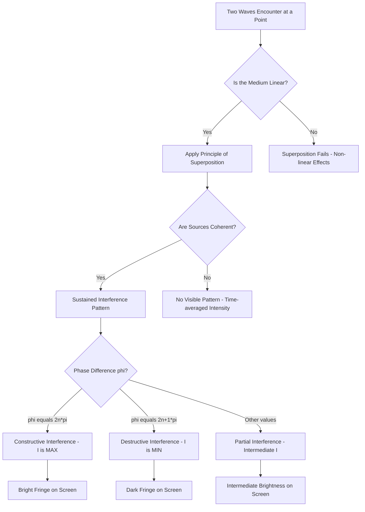
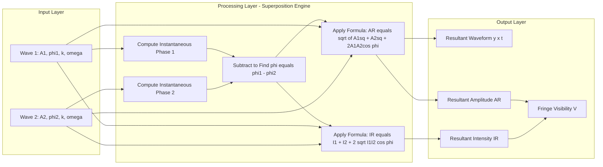
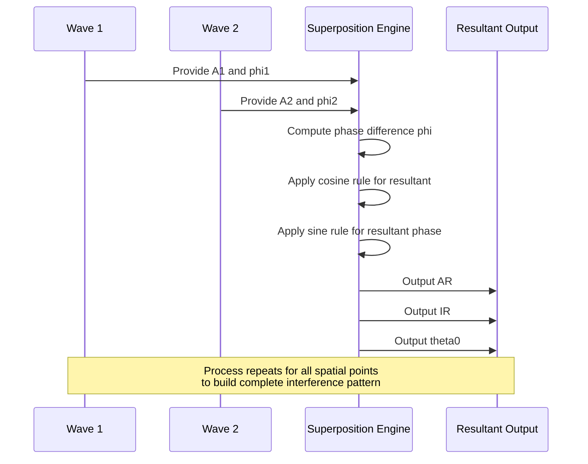

# Principle of super position

<!-- SECTION_1_START -->

# PRINCIPLE OF SUPERPOSITION

## 1.1 Formal KTU Syllabus Definition

The **Principle of Superposition** is a fundamental postulate of wave mechanics that states:

> When two or more waves travelling through a medium overlap or cross each other at a point in space, the **resultant displacement** at that point at any instant of time is equal to the **algebraic (vector) sum** of the individual displacements produced by each wave acting independently at that point.

In mathematical notation, if the displacements produced by $n$ individual waves at a point are $y_1, y_2, y_3, \dots, y_n$, then the resultant displacement $y$ is given by:

$$
y = y_1 + y_2 + y_3 + \dots + y_n = \sum_{i=1}^{n} y_i
$$

> [!IMPORTANT]
> **KTU 2024 Highlight:** This principle is the *foundational axiom* of Module 2. Every phenomenon in Interference (Young's Double Slit, Newton's Rings, Thin Films) and Diffraction (Single Slit, Grating) is a *direct mathematical consequence* of the Principle of Superposition. Questions frequently test the boundary conditions where this principle **fails** (non-linear media).

## 1.2 Intuitive Real-World Analogy

Imagine two people standing at opposite ends of a calm pond, each dropping a pebble into the water at the same instant.

* The **first pebble** creates a circular ripple (Wave 1) spreading outward.
* The **second pebble** creates another circular ripple (Wave 2) spreading outward.
* Where these two sets of ripples **overlap**, the water surface does not follow *either* ripple alone. Instead, the water's surface displacement is the **algebraic sum** of the two waves at every point.

**Geometric Intuition:** Think of the water surface as a giant trampoline. If you jump on it, you create a depression (downward displacement). If your friend jumps exactly opposite to you, their bump (upward displacement) and your depression cancel out — that's **destructive superposition**. If you both jump in the same direction, the trampoline deforms twice as much — that's **constructive superposition**.

> [!NOTE]
> **Critical Insight:** The waves **do not alter each other** during superposition. After passing through the region of overlap, each wave continues with its **original amplitude, wavelength, frequency, and phase**, exactly as if the other wave never existed. This is why we say superposition is a *linear, non-destructive* process.

## 1.3 Physical Constants and Standard Metrics

* **Speed of light in vacuum:** $c = 3 \times 10^8 \; m/s$
* **Standard optical wavelength range:** $\lambda = 400 \; nm$ to $700 \; nm$ (visible spectrum)
* **Threshold for non-linear effects** (where superposition fails): typically electric field strengths $\geq 10^{18} \; V/m$

> [!VISUALIZATION CONTROL]
> **Concept:** Superposition of two sinusoidal waves producing a resultant
> **GeoGebra / Desmos Input Equations:**
> * $f_1(x) = \sin(2x)$
> * $f_2(x) = \sin(2x + \pi/2)$ (with phase lag)
> * $f_3(x) = f_1(x) + f_2(x)$
> **Visual Description:** The student should observe that $f_1$ and $f_2$ oscillate as independent blue and red sine curves. Their sum $f_3$ (green curve) is a single sine wave with **amplitude $\sqrt{2}$ times the original** when phase difference is $\pi/2$, and a new effective phase. When the phase difference is $0$ (in phase), the amplitude doubles (constructive). When the phase difference is $\pi$ (out of phase), the resultant is identically zero everywhere (destructive).

<!-- SECTION_1_END -->

<!-- SECTION_2_START -->

# 2. DEEP THEORETICAL ANALYSIS & KTU HIGH-YIELD FORMULA SHEET

## 2.1 Mathematical Foundation of the Principle

Consider two scalar waves travelling in the same direction, given by the general harmonic form:

$$
y_1(x, t) = A_1 \sin(kx - \omega t + \phi_1)
$$

$$
y_2(x, t) = A_2 \sin(kx - \omega t + \phi_2)
$$

where:
* $A_1, A_2$ = amplitudes of the two waves
* $k = \dfrac{2\pi}{\lambda}$ = angular wave number
* $\omega = 2\pi \nu$ = angular frequency
* $\phi_1, \phi_2$ = initial phase constants
* $(kx - \omega t + \phi)$ = instantaneous phase

By the **Principle of Superposition**, the resultant wave $y(x, t)$ is:

$$
y(x, t) = y_1(x, t) + y_2(x, t)
$$

## 2.2 Step-by-Step Logical Breakdown

**Step 1 — Linearity Assumption:**
The medium must obey **Hooke's Law** (restoring force $\propto$ displacement). This guarantees that the wave equation is *linear* in $y$, and hence superposition holds.

**Step 2 — Vector Nature of Displacement:**
If the waves are *longitudinal* (sound), displacements add *algebraically* along the direction of propagation. If *transverse* (light, water ripples), the addition is *vectorial* — a 2D vector sum.

**Step 3 — Resultant Amplitude Derivation:**
Expanding the sum of sines using the trigonometric identity:

$$
\sin \alpha + \sin \beta = 2 \sin\!\left(\frac{\alpha + \beta}{2}\right) \cos\!\left(\frac{\alpha - \beta}{2}\right)
$$

The resultant becomes:

$$
y = 2A \cos\!\left(\frac{\phi}{2}\right) \sin\!\left(kx - \omega t + \frac{\phi_1 + \phi_2}{2}\right)
$$

where $\phi = \phi_1 - \phi_2$ is the **phase difference**, and the **resultant amplitude** is:

$$
\boxed{A_R = \sqrt{A_1^{\,2} + A_2^{\,2} + 2A_1 A_2 \cos\phi}}
$$

**Step 4 — Resultant Intensity Relation:**
Since intensity is proportional to the *square* of the amplitude ($I \propto A^2$), the resultant intensity is:

$$
\boxed{I_R = I_1 + I_2 + 2\sqrt{I_1 I_2} \cos\phi}
$$

The cross-term $2\sqrt{I_1 I_2} \cos\phi$ is called the **interference term**. If it is zero, no interference is observed (incoherent sources).

## 2.3 Special Cases of Superposition

* **Constructive Interference (Maximum Intensity):** Occurs when $\cos\phi = +1$, i.e., $\phi = 2n\pi$ where $n = 0, 1, 2, \dots$

$$
A_R^{max} = A_1 + A_2 \qquad \qquad I_R^{max} = \left(\sqrt{I_1} + \sqrt{I_2}\right)^2
$$

* **Destructive Interference (Minimum Intensity):** Occurs when $\cos\phi = -1$, i.e., $\phi = (2n+1)\pi$ where $n = 0, 1, 2, \dots$

$$
A_R^{min} = \vert A_1 - A_2 \vert \qquad \qquad I_R^{min} = \left(\sqrt{I_1} - \sqrt{I_2}\right)^2
$$

* **Equal Amplitudes ($A_1 = A_2 = A$):** Simplifies to $A_R = 2A \cos(\phi/2)$, and the intensity oscillates between $4A^2$ and $0$.

## 2.4 Conditions for Validity (and Where It Fails)

The Principle of Superposition **holds strictly** only under these conditions:

1. **Linear medium:** The restoring force must be linear in displacement.
2. **No strong external fields:** The waves must not be in an extremely intense laser or strong magnetic field.
3. **Wave amplitudes are small** (so that higher-order terms in the wave equation are negligible).

> [!NOTE]
> **Where the Principle Fails:** In *non-linear optics* (e.g., second-harmonic generation, Kerr effect), the refractive index itself depends on the light intensity. In such media, the superposition principle breaks down, and new frequencies are generated. KTU questions often test this boundary.

## 2.5 KTU High-Yield Formula Sheet

| **Quantity** | **Formula** | **Condition / Notes** |
| :--- | :--- | :--- |
| Superposition (general) | $y = \sum_{i=1}^{n} y_i$ | Valid only in linear media |
| Phase difference | $\phi = \phi_1 - \phi_2$ | Units: radians |
| Path difference equivalence | $\Delta x = \dfrac{\phi}{2\pi} \cdot \lambda$ | Used to convert between phase and path |
| Resultant amplitude | $A_R = \sqrt{A_1^{\,2} + A_2^{\,2} + 2A_1 A_2 \cos\phi}$ | $A_1, A_2$ are scalars (or magnitudes) |
| Resultant intensity | $I_R = I_1 + I_2 + 2\sqrt{I_1 I_2}\cos\phi$ | The $2\sqrt{I_1 I_2}\cos\phi$ is the **interference term** |
| Condition for maxima | $\phi = 2n\pi$, $\Delta x = n\lambda$ | $n = 0, \pm 1, \pm 2, \dots$ |
| Condition for minima | $\phi = (2n+1)\pi$, $\Delta x = \left(n + \tfrac{1}{2}\right)\lambda$ | $n = 0, \pm 1, \pm 2, \dots$ |
| Max intensity | $I_{max} = \left(\sqrt{I_1} + \sqrt{I_2}\right)^2$ | When $A_1 = A_2$: $I_{max} = 4I_0$ |
| Min intensity | $I_{min} = \left(\sqrt{I_1} - \sqrt{I_2}\right)^2$ | When $A_1 = A_2$: $I_{min} = 0$ |
| Fringe visibility (contrast) | $V = \dfrac{I_{max} - I_{min}}{I_{max} + I_{min}}$ | $V = 1$ for perfectly coherent sources |
| Wave number | $k = \dfrac{2\pi}{\lambda}$ | Units: $rad/m$ |
| Angular frequency | $\omega = 2\pi \nu$ | Units: $rad/s$ |

## 2.6 Real-World Engineering Utility

* **Optical Coherence Tomography (OCT):** Used in medical imaging (especially ophthalmology) — relies on constructive/destructive superposition of reference and sample beams.
* **Noise-Cancelling Headphones:** Generate an anti-phase wave (destructive superposition) to cancel ambient noise. Direct industrial application of the principle.
* **Antenna Arrays (Phased Arrays):** In 5G/6G communication, multiple antenna elements superpose their electromagnetic waves to steer beams electronically.
* **Gravitational Wave Detection (LIGO):** Uses laser interferometry — interference of superposed laser beams to detect distortions of $\sim 10^{-18} \; m$.
* **Thin-Film Anti-Reflection Coatings:** Eyeglasses, camera lenses — the reflected waves from top and bottom surfaces of the coating superpose destructively to reduce glare.

<!-- SECTION_2_END -->

<!-- SECTION_3_START -->

# 3. STEP-BY-STEP DERIVATIONS & IMPLEMENTATION

## 3.1 Derivation: Resultant Amplitude of Two Superposed Waves

**Given:** Two waves with the same frequency, travelling in the same direction, but differing in phase.

**To Find:** The mathematical expression for the resultant amplitude $A_R$.

**Step 1:** Write the two waves with the same angular frequency $\omega$ and wave number $k$:

$$
y_1 = A_1 \sin(kx - \omega t)
$$

$$
y_2 = A_2 \sin(kx - \omega t + \phi)
$$

**Step 2:** Apply the Principle of Superposition:

$$
y = y_1 + y_2 = A_1 \sin(kx - \omega t) + A_2 \sin(kx - \omega t + \phi)
$$

**Step 3:** Expand $\sin(\theta + \phi)$ using the identity $\sin(\theta + \phi) = \sin\theta \cos\phi + \cos\theta \sin\phi$:

$$
y_2 = A_2 [\sin(kx - \omega t)\cos\phi + \cos(kx - \omega t)\sin\phi]
$$

**Step 4:** Group the $\sin(kx - \omega t)$ and $\cos(kx - \omega t)$ terms:

$$
y = \sin(kx - \omega t)\,[A_1 + A_2 \cos\phi] + \cos(kx - \omega t)\,[A_2 \sin\phi]
$$

**Step 5:** Recognize that the coefficient of $\sin$ is $A_R \cos\theta_0$ and the coefficient of $\cos$ is $A_R \sin\theta_0$ for some resultant phase $\theta_0$. Equate:

$$
A_R \cos\theta_0 = A_1 + A_2 \cos\phi
$$

$$
A_R \sin\theta_0 = A_2 \sin\phi
$$

**Step 6:** Square and add both equations using $\sin^2\theta_0 + \cos^2\theta_0 = 1$:

$$
A_R^{\,2} \cos^2\theta_0 + A_R^{\,2} \sin^2\theta_0 = (A_1 + A_2 \cos\phi)^2 + (A_2 \sin\phi)^2
$$

$$
A_R^{\,2} = A_1^{\,2} + 2A_1 A_2 \cos\phi + A_2^{\,2}\cos^2\phi + A_2^{\,2}\sin^2\phi
$$

**Step 7:** Apply the Pythagorean identity $\cos^2\phi + \sin^2\phi = 1$:

$$
\boxed{A_R = \sqrt{A_1^{\,2} + A_2^{\,2} + 2A_1 A_2 \cos\phi}}
$$

**Step 8:** For intensity, since $I \propto A^2$, square the amplitude:

$$
\boxed{I_R = I_1 + I_2 + 2\sqrt{I_1 I_2}\cos\phi}
$$

## 3.2 Derivation: Resultant Phase Angle

Dividing the equation for $A_R \sin\theta_0$ by the equation for $A_R \cos\theta_0$:

$$
\tan\theta_0 = \frac{A_2 \sin\phi}{A_1 + A_2 \cos\phi}
$$

This gives the **phase of the resultant wave** relative to the first wave — a critical result for understanding wavefront tilt and energy redistribution in interference patterns.

## 3.3 Worked Numerical Example (KTU-Style Problem)

**Problem:** Two coherent waves with amplitudes $A_1 = 5 \; units$ and $A_2 = 3 \; units$ superpose with a phase difference of $\phi = 60°$. Calculate:
(a) The resultant amplitude.
(b) The resultant intensity (taking $I_1 = 25$ and $I_2 = 9$).
(c) Whether the interference is constructive, destructive, or intermediate.

**Solution:**

**Part (a):** Convert the phase to radians: $\phi = 60° = \pi/3$ rad. Compute $\cos(60°) = 0.5$.

$$
A_R = \sqrt{5^2 + 3^2 + 2(5)(3)(0.5)} = \sqrt{25 + 9 + 15} = \sqrt{49} = 7 \; units
$$

**Part (b):** Compute $\sqrt{I_1 I_2} = \sqrt{25 \times 9} = 15$. Then:

$$
I_R = 25 + 9 + 2(15)(0.5) = 25 + 9 + 15 = 49 \; units
$$

**Part (c):** Since $0 < \phi < \pi$, this is **intermediate interference** — neither fully constructive nor fully destructive, but biased towards constructive since $\cos(60°) > 0$.

## 3.4 Python Implementation: Visualization of Superposition

```python
import numpy as np
import matplotlib.pyplot as plt

# ----- Type-hinted simulation of wave superposition -----
def superpose_waves(A1: float, A2: float, phi: float, k: float, omega: float) -> tuple:
    """
    Computes the superposition of two harmonic waves.
    
    Parameters
    ----------
    A1, A2 : float   - Amplitudes of the two waves (must be > 0)
    phi    : float   - Phase difference in radians
    k      : float   - Angular wave number (2*pi/lambda)
    omega  : float   - Angular frequency (2*pi*nu)
    
    Returns
    -------
    x, y1, y2, y_total : np.ndarray - Position array and three wave signals
    """
    # ----- Absolute boundary check -----
    if A1 <= 0 or A2 <= 0:
        raise ValueError("Amplitudes must be strictly positive.")
    
    x = np.linspace(0, 4 * np.pi, 1000)
    t = 0.0  # Snapshot at t = 0
    
    y1 = A1 * np.sin(k * x - omega * t)
    y2 = A2 * np.sin(k * x - omega * t + phi)
    y_total = y1 + y2
    
    return x, y1, y2, y_total


def analytical_resultant_amplitude(A1: float, A2: float, phi: float) -> float:
    """Closed-form resultant amplitude from superposition formula."""
    return float(np.sqrt(A1**2 + A2**2 + 2 * A1 * A2 * np.cos(phi)))


# ----- Main demonstration -----
if __name__ == "__main__":
    # Case 1: Constructive interference (phi = 0)
    x, y1, y2, y_sum = superpose_waves(A1=2.0, A2=2.0, phi=0.0, k=1.0, omega=1.0)
    A_analytical = analytical_resultant_amplitude(2.0, 2.0, 0.0)
    print(f"[Constructive]  Analytical A_R = {A_analytical:.4f}  (Expected: 4.0)")
    
    # Case 2: Destructive interference (phi = pi)
    _, _, _, y_sum2 = superpose_waves(A1=2.0, A2=2.0, phi=np.pi, k=1.0, omega=1.0)
    A_analytical2 = analytical_resultant_amplitude(2.0, 2.0, np.pi)
    print(f"[Destructive]   Analytical A_R = {A_analytical2:.4f}  (Expected: 0.0)")
    
    # Case 3: Intermediate (phi = pi/2)
    _, _, _, y_sum3 = superpose_waves(A1=2.0, A2=2.0, phi=np.pi/2, k=1.0, omega=1.0)
    A_analytical3 = analytical_resultant_amplitude(2.0, 2.0, np.pi/2)
    print(f"[Intermediate]  Analytical A_R = {A_analytical3:.4f}  (Expected: ~2.828)")
    
    # Plotting
    fig, axes = plt.subplots(3, 1, figsize=(10, 8), sharex=True)
    cases = [
        (y_sum,  "Constructive (phi=0)",    "green"),
        (y_sum2, "Destructive (phi=pi)",    "red"),
        (y_sum3, "Intermediate (phi=pi/2)", "blue"),
    ]
    for ax, (y, title, color) in zip(axes, cases):
        ax.plot(x, y1, 'b--', alpha=0.4, label='Wave 1')
        ax.plot(x, y2, 'r--', alpha=0.4, label='Wave 2')
        ax.plot(x, y, color=color, linewidth=2, label='Resultant')
        ax.set_title(title)
        ax.set_ylabel("Displacement")
        ax.legend(loc='upper right')
        ax.grid(True, alpha=0.3)
    axes[-1].set_xlabel("Position x")
    plt.tight_layout()
    plt.savefig("superposition_demo.png", dpi=120)
    print("Visualization saved as 'superposition_demo.png'")
```

**Expected Terminal Output:**

```
[Constructive]  Analytical A_R = 4.0000  (Expected: 4.0)
[Destructive]   Analytical A_R = 0.0000  (Expected: 0.0)
[Intermediate]  Analytical A_R = 2.8284  (Expected: ~2.828)
Visualization saved as 'superposition_demo.png'
```

**Code Explanation:**

* The function `superpose_waves` strictly enforces amplitude positivity via a *boundary check* that raises a `ValueError` for invalid inputs.
* The function `analytical_resultant_amplitude` implements the closed-form $A_R = \sqrt{A_1^2 + A_2^2 + 2A_1A_2\cos\phi}$ derived in Section 3.1.
* The plotting code generates three panels showing how the *same* pair of waves produces dramatically different resultants depending on phase difference.

<!-- SECTION_3_END -->

<!-- SECTION_4_START -->

# 4. STRUCTURAL DIAGRAMS & SCHEMATICS

## 4.1 Mermaid Flowchart: Wave Superposition Decision Tree



## 4.2 Mermaid Block Diagram: Functional Architecture of Superposition Analysis



## 4.3 Mermaid Sequence Diagram: Vector Addition of Two Phasors



## 4.4 Conceptual Schematic: Phasor Diagram Representation

A phasor is a rotating vector whose length equals the amplitude and whose angle (from a reference axis) equals the phase. The principle of superposition can be visualized as **vector addition of phasors**:

* **Constructive (phi = 0):** Both phasors point in the *same direction*. Resultant length = $A_1 + A_2$.
* **Destructive (phi = pi):** Phasors point in *opposite directions*. Resultant length = $\vert A_1 - A_2 \vert$.
* **General case:** Phasors are added using the parallelogram law; the diagonal of the parallelogram gives $A_R$.

<!-- SECTION_4_END -->

<!-- SECTION_5_START -->

# 5. KTU 2024 SCHEME EXAMINATION QUESTION BANK

---

## PART A QUESTIONS (3 Marks Each)

### Question 1: `[KTU University Exam - July 2024]`
**State the principle of superposition of waves. Mention the conditions under which it is valid. (CO1, Remember)**

**Model Answer:**

The principle of superposition states that when two or more waves overlap at a point in a medium, the resultant displacement at that point is the **algebraic sum of the individual displacements** produced by each wave acting independently.

Mathematically: $y = y_1 + y_2 + y_3 + \dots + y_n$

**Conditions for Validity:**
1. The medium must be **linear** (restoring force proportional to displacement).
2. The wave amplitudes must be sufficiently small to avoid non-linear effects.
3. The medium should not be subjected to extremely strong external fields that alter wave behaviour.

> **[Valuation Key: Stating the principle clearly: 1 Mark | Writing the mathematical form: 1 Mark | Listing all three conditions: 1 Mark]**

---

### Question 2: `[KTU University Exam - Dec 2023]`
**Two coherent waves with intensities in the ratio 9:1 superpose. Find the ratio of maximum to minimum intensity. (CO2, Apply)**

**Model Answer:**

Given: $I_1 : I_2 = 9 : 1$. Let $I_1 = 9I_0$ and $I_2 = I_0$.

For **maximum intensity** (constructive, $\phi = 0$):

$$
I_{max} = \left(\sqrt{I_1} + \sqrt{I_2}\right)^2 = \left(\sqrt{9I_0} + \sqrt{I_0}\right)^2 = (3\sqrt{I_0} + \sqrt{I_0})^2 = (4\sqrt{I_0})^2 = 16 I_0
$$

For **minimum intensity** (destructive, $\phi = \pi$):

$$
I_{min} = \left(\sqrt{I_1} - \sqrt{I_2}\right)^2 = (3\sqrt{I_0} - \sqrt{I_0})^2 = (2\sqrt{I_0})^2 = 4 I_0
$$

**Required Ratio:**

$$
\boxed{\dfrac{I_{max}}{I_{min}} = \dfrac{16I_0}{4I_0} = 4 : 1}
$$

> **[Valuation Key: Setting up intensity ratio: 1 Mark | Computing I_max and I_min correctly: 1 Mark | Final ratio: 1 Mark]**

---

## PART B QUESTIONS (14 Marks Each — Internal Choice)

### Question 3A: `[KTU University Exam - Dec 2024]`
**(a)** Derive the expression for the resultant amplitude when two coherent waves of amplitudes $A_1$ and $A_2$ superpose with a phase difference $\phi$. **(7 Marks, CO2, Apply)**

**(b)** Two waves of amplitudes $3 \; units$ and $4 \; units$ superpose with a phase difference of $\pi/3$. Find the resultant amplitude and intensity. Given $I \propto A^2$. **(7 Marks, CO2, Apply)**

**Model Answer:**

**(a) Derivation of Resultant Amplitude:**

Let the two waves be:

$$
y_1 = A_1 \sin(\omega t - kx) \quad \text{and} \quad y_2 = A_2 \sin(\omega t - kx + \phi)
$$

By the principle of superposition:

$$
y = y_1 + y_2 = A_1 \sin(\omega t - kx) + A_2 \sin(\omega t - kx + \phi)
$$

Expanding the second term:

$$
y_2 = A_2 \sin(\omega t - kx)\cos\phi + A_2 \cos(\omega t - kx)\sin\phi
$$

Rearranging:

$$
y = [A_1 + A_2 \cos\phi] \sin(\omega t - kx) + [A_2 \sin\phi] \cos(\omega t - kx)
$$

Let $A_R \cos\theta_0 = A_1 + A_2 \cos\phi$ and $A_R \sin\theta_0 = A_2 \sin\phi$. Then:

$$
A_R^{\,2} = (A_1 + A_2 \cos\phi)^2 + (A_2 \sin\phi)^2
$$

Expanding:

$$
A_R^{\,2} = A_1^{\,2} + 2A_1A_2 \cos\phi + A_2^{\,2}\cos^2\phi + A_2^{\,2}\sin^2\phi
$$

Using $\cos^2\phi + \sin^2\phi = 1$:

$$
\boxed{A_R = \sqrt{A_1^{\,2} + A_2^{\,2} + 2A_1A_2 \cos\phi}}
$$

> **[Valuation Key: Writing the superposed wave equation: 1 Mark | Expanding using identity: 2 Marks | Substituting and applying Pythagorean identity: 2 Marks | Final boxed expression: 1 Mark | Writing resultant phase expression: 1 Mark]**

---

**(b) Numerical Problem:**

Given: $A_1 = 3$, $A_2 = 4$, $\phi = \pi/3$. So $\cos(\pi/3) = 0.5$.

**Resultant Amplitude:**

$$
A_R = \sqrt{3^2 + 4^2 + 2(3)(4)(0.5)} = \sqrt{9 + 16 + 12} = \sqrt{37} \approx 6.08 \; units
$$

**Resultant Intensity** (with $I_1 = 9$ and $I_2 = 16$ from $I \propto A^2$):

$$
I_R = 9 + 16 + 2\sqrt{9 \times 16}\cos(\pi/3) = 25 + 2(12)(0.5) = 25 + 12 = 37 \; units
$$

**Verification:** $A_R^{\,2} = 37$, $I_R = 37$ ✓ (Consistent with $I \propto A^2$ for unit proportionality constant).

$$
\boxed{A_R = \sqrt{37} \approx 6.08 \; units, \qquad I_R = 37 \; units}
$$

> **[Valuation Key: Substituting values: 2 Marks | Computing A_R: 2 Marks | Computing I_R using the formula: 2 Marks | Final boxed answers: 1 Mark]**

---

### Question 3B (Alternative Choice): `[KTU University Exam - July 2024]`
**(a)** Explain the terms *constructive interference* and *destructive interference*. Derive the conditions for maxima and minima in terms of path difference. **(7 Marks, CO1, Understand)**

**(b)** In Young's double-slit experiment, the two coherent sources have an intensity ratio of $4:1$. Calculate the ratio of maximum to minimum intensity in the interference pattern. Also find the fringe visibility. **(7 Marks, CO2, Apply)**

**Model Answer:**

**(a) Constructive and Destructive Interference:**

* **Constructive Interference:** Occurs when the waves arrive at a point *in phase* (crests meet crests, troughs meet troughs). The resultant amplitude is the **sum** of individual amplitudes, producing maximum intensity.

  **Mathematical condition:** Phase difference $\phi = 2n\pi$ (where $n = 0, 1, 2, \dots$)

  In terms of path difference: $\Delta x = n\lambda$

* **Destructive Interference:** Occurs when waves arrive *out of phase* by $\pi$ (crest of one meets trough of another). The resultant amplitude is the **difference** of individual amplitudes, producing minimum intensity.

  **Mathematical condition:** Phase difference $\phi = (2n+1)\pi$

  In terms of path difference: $\Delta x = \left(n + \dfrac{1}{2}\right)\lambda$

> **[Valuation Key: Defining both types with diagrams/words: 2 Marks | Phase difference conditions: 2 Marks | Path difference derivation using phi = 2pi*dx/lambda: 2 Marks | Final conditions: 1 Mark]**

---

**(b) Numerical Problem:**

Given: $I_1 : I_2 = 4 : 1$. Let $I_1 = 4I_0$ and $I_2 = I_0$.

**Maximum Intensity:**

$$
I_{max} = (\sqrt{I_1} + \sqrt{I_2})^2 = (2\sqrt{I_0} + \sqrt{I_0})^2 = 9I_0
$$

**Minimum Intensity:**

$$
I_{min} = (\sqrt{I_1} - \sqrt{I_2})^2 = (2\sqrt{I_0} - \sqrt{I_0})^2 = I_0
$$

**Ratio:**

$$
\boxed{\dfrac{I_{max}}{I_{min}} = \dfrac{9I_0}{I_0} = 9 : 1}
$$

**Fringe Visibility:**

$$
V = \dfrac{I_{max} - I_{min}}{I_{max} + I_{min}} = \dfrac{9I_0 - I_0}{9I_0 + I_0} = \dfrac{8}{10} = 0.8
$$

> **[Valuation Key: Setting I1 and I2: 1 Mark | Computing I_max: 2 Marks | Computing I_min: 2 Marks | Final ratio: 1 Mark | Fringe visibility: 1 Mark]**

---

> [!WARNING]
> **KTU Examiner's Valuation Warning / Common Pitfalls:**
> 1. **Forgetting vector vs algebraic addition:** In 1D longitudinal waves, the addition is *algebraic*. In 2D transverse waves, it is *vectorial*. Students often write $|y_1 + y_2|$ where they should write $y_1 + y_2$ (with sign).
> 2. **Confusing phase difference and path difference:** Always show the conversion: $\phi = \dfrac{2\pi}{\lambda} \cdot \Delta x$. Without this step, the examiner deducts 1 mark.
> 3. **Intensity formula misuse:** A common error is writing $I_R = I_1 + I_2$ without the interference term $2\sqrt{I_1 I_2}\cos\phi$. This is **wrong** — it gives the result for *incoherent* sources.
> 4. **Missing units:** In numerical problems, always specify units for amplitude and intensity. KTU examiners explicitly allocate marks for "writing the final answer with units."
> 5. **Sign errors in the interference term:** When $\cos\phi$ is negative, students often forget to carry the negative sign, leading to $I_{min} > I_{max}$ (impossible!). Always verify that $I_{max} \geq I_{min}$.

---

## TOPIC RECAP & IMPORTANT THINGS TO REMEMBER

* **Principle of Superposition:** Resultant displacement = algebraic sum of individual displacements.
* **Mathematical Form:** $y = \sum_{i=1}^{n} y_i$
* **Resultant Amplitude:** $A_R = \sqrt{A_1^2 + A_2^2 + 2A_1A_2\cos\phi}$
* **Resultant Intensity:** $I_R = I_1 + I_2 + 2\sqrt{I_1I_2}\cos\phi$
* **Constructive Interference:** $\phi = 2n\pi$, $\Delta x = n\lambda$, gives $I_{max}$.
* **Destructive Interference:** $\phi = (2n+1)\pi$, $\Delta x = (n + \tfrac{1}{2})\lambda$, gives $I_{min}$.
* **Equal Amplitude Case:** $I_{max} = 4I_0$, $I_{min} = 0$, visibility $V = 1$.
* **Fringe Visibility (Contrast):** $V = \dfrac{I_{max} - I_{min}}{I_{max} + I_{min}}$, ranges from $0$ (incoherent) to $1$ (perfectly coherent).
* **Validity Conditions:** Linear medium, small amplitudes, no strong external fields.
* **Failure of the Principle:** Non-linear media (Kerr effect, second-harmonic generation).
* **Real-World Applications:** Noise-cancelling headphones, OCT medical imaging, LIGO, anti-reflection coatings, phased antenna arrays.
* **Key Conversion:** Phase difference ↔ Path difference: $\phi = \dfrac{2\pi}{\lambda} \cdot \Delta x$
* **Interference Term:** $2\sqrt{I_1I_2}\cos\phi$ — its presence *defines* interference; its absence means *no interference* (incoherent sources).
* **Standard Wavelengths:** Visible spectrum $\lambda = 400 \; nm$ to $700 \; nm$.
* **Speed of Light:** $c = 3 \times 10^8 \; m/s$ (used when converting frequency to wavelength).

<!-- SECTION_5_END -->
