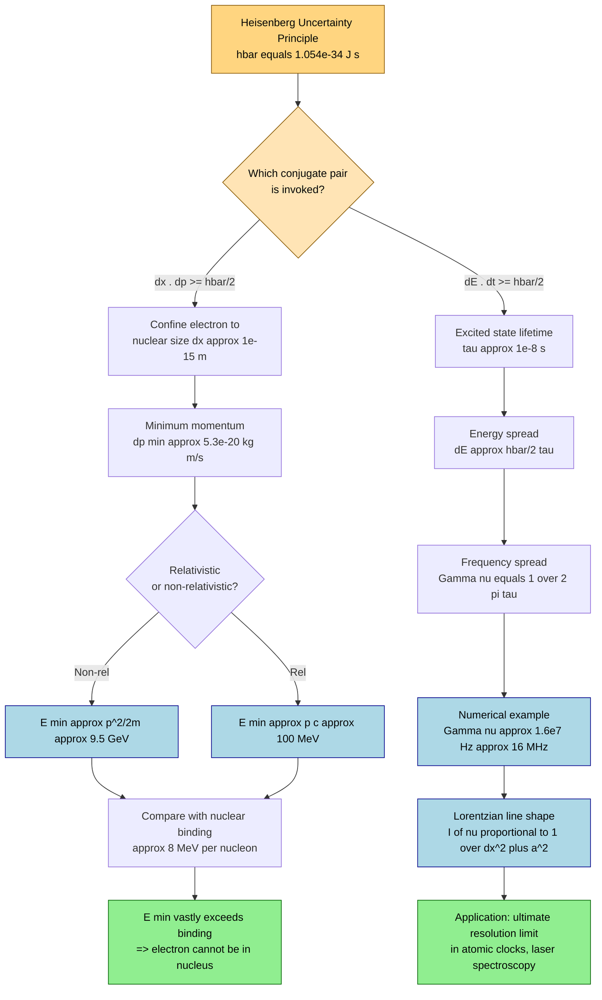
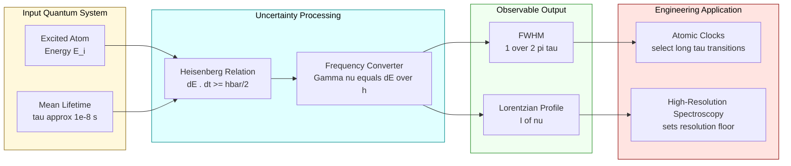

# Application of uncertainty principle- Absence of electron inside nucleus - Natural line broadening

<!-- SECTION_1_START -->

# Application of the Uncertainty Principle: Electron in Nucleus & Natural Line Broadening

## 1.1 Heisenberg's Uncertainty Principle — The Formal Statement

In quantum mechanics, the position–momentum and energy–time forms of the uncertainty principle are written as:

$$\Delta x \cdot \Delta p \;\geq\; \frac{\hbar}{2}$$

$$\Delta E \cdot \Delta t \;\geq\; \frac{\hbar}{2}$$

where $\hbar = h / 2\pi$ is the **reduced Planck's constant** with numerical value $\hbar = 1.054 \times 10^{-34}\ \text{J}\cdot\text{s}$.

> [!IMPORTANT]
> **KTU 2024 Syllabus Highlight:** This is *not* a measurement limitation. It is a fundamental property of matter waves — the Fourier-transform conjugate relationship between a wave packet's spatial extent and its spectral width in momentum (or energy).

> [!NOTE]
> **Form 1 (Position–Momentum):** The more precisely a particle's position is localised, the more uncertain its momentum (and hence kinetic energy) becomes.
>
> **Form 2 (Energy–Time):** A quantum state that exists only for a finite lifetime $\Delta t$ must necessarily have a non-zero spread $\Delta E$ in its energy eigen-value.

## 1.2 Intuitive / Classical Analogy

Imagine trying to **weigh a soap bubble on a kitchen scale**. The moment you touch it, the scale reading fluctuates wildly — because the act of measuring perturbs what you are measuring. Quantum uncertainty is even more fundamental: the bubble *cannot even possess* a precise position and momentum simultaneously, regardless of how gentle the measurement is.

A better analogy is a **musical note of very short duration** — like a single drum tap. A long, sustained note has a well-defined pitch (a single frequency). A short tap has a wide spread of frequencies. In the same way, a wave packet that exists for a short time (small $\Delta t$) must contain a spread of energies (large $\Delta E$). This is the essence of natural line broadening.

## 1.3 Why These Two Applications Matter in Engineering & Spectroscopy

| Application | Engineering / Scientific Relevance |
|---|---|
| Absence of $e^-$ in nucleus | Validates the **proton-decay** $\beta^+ / \beta^-$ picture; underlies the **nuclear shell model**; explains why the weak force (not electromagnetism) governs nuclear $\beta$-decay. |
| Natural line broadening | Sets the **ultimate resolution limit** in atomic clocks, laser spectroscopy, GPS frequency standards, and LIBS (Laser-Induced Breakdown Spectroscopy) used in material analysis. |

> [!VISUALIZATION CONTROL]
> **Concept:** Lorentzian natural line shape around a central transition frequency $\nu_0$.
> **Desmos / GeoGebra Input Equations:**
> * Central frequency: $\nu_0 = 5.0 \times 10^{14}\ \text{Hz}$
> * Lorentzian intensity: $I(\nu) = \dfrac{(\Gamma/2)^2}{(\nu - \nu_0)^2 + (\Gamma/2)^2}$
> * Natural FWHM: $\Gamma = \dfrac{1}{2\pi \tau}$, with $\tau = 1.0 \times 10^{-8}\ \text{s}$
> **Visual Description:** A sharp, symmetric peak centred at $\nu_0$ with FWHM $\approx 1.59 \times 10^{7}\ \text{Hz}$. The wings decay as $1/(\nu-\nu_0)^2$ — a hallmark of lifetime-limited broadening.

<!-- SECTION_1_END -->

<!-- SECTION_2_START -->

# 2. Deep Theoretical Analysis & KTU High-Yield Formula Sheet

## 2.1 The Logical Framework of the Two Applications

**Application A — Why an electron cannot reside inside a nucleus:**

1. Suppose, hypothetically, an electron is confined inside a nucleus of diameter $\sim 2 \times 10^{-15}\ \text{m}$.
2. By the position–momentum uncertainty relation, such tight confinement forces $\Delta p \geq \hbar / (2\Delta x) \approx 10^{-20}\ \text{kg}\cdot\text{m/s}$ — an enormous momentum.
3. The corresponding minimum kinetic energy $E = p^2 / 2m_e$ comes out to be of order **giga-electron-volts (GeV)**.
4. No known binding mechanism in nuclear physics can supply GeV-scale binding for an electron — nuclear binding energies are only a few MeV per nucleon.
5. The hypothetical electron would therefore immediately tunnel out, contradicting the assumption. **Hence, no electron can exist as a permanent resident of the nucleus.**

**Application B — Why spectral lines have a finite natural width:**

1. An atom in an excited electronic state decays spontaneously with a finite mean lifetime $\tau$ (typically $10^{-8}$ to $10^{-9}\ \text{s}$ for allowed dipole transitions).
2. By the energy–time uncertainty relation, this finite lifetime implies an irreducible spread $\Delta E \geq \hbar / 2\tau$ in the energy of the emitted photon.
3. The spread in energy translates into a spread in frequency: $\Delta \nu = \Delta E / h = 1 / (4\pi\tau)$.
4. This is the **natural linewidth** $\Gamma$ — the *minimum* width any spectral line can possess, even in the complete absence of thermal motion, collisions, or instrumental effects.
5. The line shape is **Lorentzian**, not Gaussian (unlike Doppler broadening, which is Gaussian).

> [!NOTE]
> **Engineering Take-away:** Atomic clock designers (e.g., Cs-133 fountain clocks, Sr optical lattice clocks) actively select transitions with *very long* upper-state lifetimes (seconds) to make $\Gamma$ as small as $\sim 1\ \text{Hz}$, achieving fractional accuracies below $10^{-18}$.

## 2.2 KTU High-Yield Formula Cheat-Sheet

> [!IMPORTANT]
> **CRITICAL FORMATTING RULE FOR TABLES:** All vertical bars (absolute value / magnitude symbols) inside the table are rendered using LaTeX `\vert` instead of raw `|`, so that the markdown table parser is not broken.

| # | Quantity | Formula | Symbols / Units | Typical Order of Magnitude |
|---|---|---|---|---|
| 1 | Reduced Planck's constant | $\hbar = h/2\pi$ | $1.054 \times 10^{-34}\ \text{J}\cdot\text{s}$ | — |
| 2 | Position–momentum uncertainty | $\Delta x \cdot \Delta p \geq \hbar/2$ | $\Delta x$ in m, $\Delta p$ in $\text{kg}\cdot\text{m/s}$ | — |
| 3 | Energy–time uncertainty | $\Delta E \cdot \Delta t \geq \hbar/2$ | $\Delta E$ in J, $\Delta t$ in s | — |
| 4 | Min. kinetic energy of confined particle | $E_{\min} = (\Delta p)^2 / (2m)$ | Non-relativistic, valid if $E_{\min} \ll m_0 c^2$ | — |
| 5 | Min. kinetic energy (relativistic) | $E_{\min} \approx \Delta p \cdot c$ | $c = 3 \times 10^8\ \text{m/s}$ | — |
| 6 | Rest mass energy of electron | $m_e c^2$ | $0.511\ \text{MeV}$ | — |
| 7 | Typical nuclear radius | $r_0 \approx 1.2\,A^{1/3}\ \text{fm}$ | $A$ = mass number, $1\ \text{fm} = 10^{-15}\ \text{m}$ | $\sim 1$–$7\ \text{fm}$ |
| 8 | Natural FWHM (frequency) | $\Gamma_\nu = 1 / (2\pi\tau)$ | Hz, with $\tau$ in s | $\sim 10^{7}\ \text{Hz}$ for $\tau = 10^{-8}\ \text{s}$ |
| 9 | Natural FWHM (energy) | $\Gamma_E = \hbar / \tau$ | Joules | $\sim 10^{-26}\ \text{J}$ |
| 10 | Natural FWHM (wavelength) | $\Gamma_\lambda = \lambda^2 \Gamma_\nu / c$ | metres | — |
| 11 | Lorentzian line profile | $I(\nu) = I_0 \,\dfrac{(\Gamma/2)^2}{(\nu - \nu_0)^2 + (\Gamma/2)^2}$ | Normalised peak at $\nu = \nu_0$ | — |
| 12 | Conversion: $1\ \text{eV}$ | $1.602 \times 10^{-19}\ \text{J}$ | — | — |

> [!TIP]
> **Memorise the bridge formula $\Gamma_\nu = 1/(2\pi\tau)$.** It is the single most-asked relation in KTU Module-3 questions on natural line broadening. Pair it with the *typical* lifetime $\tau \approx 10^{-8}\ \text{s}$ to obtain a quick "ballpark" linewidth of $\sim 10\ \text{MHz}$ in frequency units, or $\sim 10^{-4}\ \text{cm}^{-1}$ in wavenumber units.

<!-- SECTION_2_END -->

<!-- SECTION_3_START -->

# 3. Step-by-Step Derivations & Worked Numerical Solutions

## 3.1 Application A — Absence of Electron in the Nucleus (Exhaustive Derivation)

### Step 1 — Set up the confinement length
For a medium-mass nucleus (say $A \approx 64$, like Cu), the radius is
$$r_0 = 1.2 \times A^{1/3}\ \text{fm} = 1.2 \times 64^{1/3}\ \text{fm} = 1.2 \times 4\ \text{fm} = 4.8\ \text{fm}.$$
For an *order-of-magnitude* estimate we take the position uncertainty as
$$\Delta x \approx 10^{-15}\ \text{m} = 1\ \text{fm}.$$
**Reasoning:** The exact factor of 2 between radius and diameter is irrelevant at this scale of energy.

### Step 2 — Apply position–momentum uncertainty
From
$$\Delta x \cdot \Delta p \geq \frac{\hbar}{2},$$
the minimum uncertainty in momentum is
$$\Delta p_{\min} = \frac{\hbar}{2\,\Delta x} = \frac{1.054 \times 10^{-34}}{2 \times 10^{-15}} = 5.27 \times 10^{-20}\ \text{kg}\cdot\text{m/s}.$$
**Reasoning:** This is the absolute *smallest* possible spread in momentum — the actual momentum could be even larger.

### Step 3 — Compute the non-relativistic minimum kinetic energy
$$E_{\min} = \frac{(\Delta p_{\min})^2}{2 m_e} = \frac{(5.27 \times 10^{-20})^2}{2 \times 9.11 \times 10^{-31}}.$$
Working out the numerator:
$$(5.27)^2 = 27.77, \quad (10^{-20})^2 = 10^{-40}, \quad \Rightarrow \quad (\Delta p)^2 = 2.777 \times 10^{-39}\ \text{kg}^2\text{m}^2/\text{s}^2.$$
Working out the denominator:
$$2 \times 9.11 \times 10^{-31} = 1.822 \times 10^{-30}\ \text{kg}.$$
Dividing:
$$E_{\min} = \frac{2.777 \times 10^{-39}}{1.822 \times 10^{-30}} = 1.524 \times 10^{-9}\ \text{J}.$$
Convert to electron-volts:
$$E_{\min} = \frac{1.524 \times 10^{-9}}{1.602 \times 10^{-19}} = 9.51 \times 10^{9}\ \text{eV} \approx 9.5\ \text{GeV}.$$
**Reasoning:** A GeV-scale kinetic energy for an electron!

### Step 4 — Compare with relevant energy scales
| Energy scale | Typical value |
|---|---|
| Electron binding in hydrogen atom | $\sim 13.6\ \text{eV}$ |
| Rest-mass energy of electron $m_e c^2$ | $0.511\ \text{MeV}$ |
| Typical nuclear binding per nucleon | $\sim 8\ \text{MeV}$ |
| Computed $E_{\min}$ for confined $e^-$ | $\sim 10\ \text{GeV}$ |

The computed minimum kinetic energy ($\sim 10\ \text{GeV}$) exceeds the rest-mass energy ($0.511\ \text{MeV}$) by a factor of $\sim 20{,}000$, so we are deep in the relativistic regime.

### Step 5 — Relativistic check
Using $E \approx p c$:
$$E_{\min} = \Delta p_{\min} \cdot c = 5.27 \times 10^{-20} \times 3 \times 10^{8} = 1.58 \times 10^{-11}\ \text{J} \approx 98\ \text{MeV}.$$
**Reasoning:** This $\sim 100\ \text{MeV}$ is still $\sim 10^{4}$ times greater than nuclear binding energies. No physical confinement mechanism can provide such an energy. The hypothetical electron cannot exist in the nucleus.

### Step 6 — Physical conclusion
> [!IMPORTANT]
> **Conclusion:** The uncertainty principle *forbids* the electron from being a permanent resident of the nucleus. This is one of the corner-stone arguments that nuclei contain **protons and neutrons**, not electrons. It also explains why $\beta$-decay is mediated by the **weak interaction** and produces an *escaping* electron (or positron) with a continuous energy spectrum.

## 3.2 Application B — Natural Line Broadening (Exhaustive Derivation)

### Step 1 — Recall energy–time uncertainty
An excited atomic state has a finite mean lifetime $\tau$. The energy of that state is therefore uncertain by at least
$$\Delta E \geq \frac{\hbar}{2\tau}.$$
**Reasoning:** $\Delta t$ is the characteristic time-scale over which the system's energy can be defined — for a decaying state it is the mean lifetime $\tau$.

### Step 2 — Translate energy spread into frequency spread
The photon emitted in a transition $E_i \to E_f$ has energy
$$h\nu = E_i - E_f.$$
A spread $\Delta E$ in $E_i$ produces a spread in $\nu$:
$$\Delta \nu = \frac{\Delta E}{h} = \frac{1}{4\pi\tau}.$$
The full-width at half-maximum of the spectral line is the **natural linewidth**:
$$\Gamma_\nu = \frac{1}{2\pi\tau}.$$
**Reasoning:** FWHM is twice the half-width, and the half-width corresponds to the $1/(4\pi\tau)$ value at which the Lorentzian drops to half its peak.

### Step 3 — Numerical example
For an excited state with $\tau = 1.0 \times 10^{-8}\ \text{s}$ (typical for an allowed electric-dipole transition in a visible-spectrum atom):
$$\Gamma_\nu = \frac{1}{2\pi \times 10^{-8}} = 1.59 \times 10^{7}\ \text{Hz} \approx 16\ \text{MHz}.$$
**Reasoning:** This is the *minimum* possible width; in a real laboratory the line will be wider due to Doppler, collisional, and instrumental broadening.

### Step 4 — Lorentzian line-shape derivation (qualitative)
Treating the decaying state as a damped oscillator, the amplitude behaves as
$$A(t) = A_0\, e^{-t/(2\tau)} e^{-i\omega_0 t}\quad (t \geq 0).$$
Fourier-transforming this time-domain signal gives the frequency-domain intensity:
$$I(\omega) \propto \vert \tilde{A}(\omega)\vert^2 = \frac{A_0^2}{(\omega - \omega_0)^2 + (1/2\tau)^2}.$$
**Reasoning:** The transform of a decaying exponential is a Lorentzian — a standard result from Fourier theory. The half-width at half-maximum in angular frequency is $1/(2\tau)$, i.e. the FWHM is $\Delta\omega = 1/\tau$, corresponding to $\Delta\nu = 1/(2\pi\tau)$.

### Step 5 — Wavelength-domain linewidth (extra, often asked)
For a transition at $\lambda = 589\ \text{nm}$ (sodium D-line) with $\tau = 1.6 \times 10^{-8}\ \text{s}$:
$$\Gamma_\lambda = \frac{\lambda^2}{c} \Gamma_\nu = \frac{(589 \times 10^{-9})^2}{3 \times 10^8} \times \frac{1}{2\pi \times 1.6 \times 10^{-8}}.$$
Working out:
$$\Gamma_\lambda = \frac{3.47 \times 10^{-13}}{3 \times 10^8} \times 9.95 \times 10^{6} = 1.16 \times 10^{-21} \times 9.95 \times 10^{6} = 1.15 \times 10^{-14}\ \text{m} \approx 1.2 \times 10^{-5}\ \text{nm}.$$
**Reasoning:** Notice how incredibly narrow this is — natural line widths in wavelength units are typically $\sim 10^{-5}$ to $10^{-4}\ \text{nm}$, many orders of magnitude smaller than the wavelength itself.

### Step 6 — Comparison with other broadening mechanisms

| Broadening type | Line shape | Typical FWHM | Origin |
|---|---|---|---|
| Natural | Lorentzian | $\sim 10$ MHz | Finite $\tau$ of excited state |
| Doppler | Gaussian | $\sim 1$–$10$ GHz at room T | Thermal motion of emitters |
| Collision (pressure) | Lorentzian | $\sim 0.1$–$1$ GHz | Inter-atomic collisions |
| Instrumental | Gaussian / Lorentzian | Depends on apparatus | Slit width, detector response |

> [!TIP]
> **KTU Trick:** To distinguish natural from Doppler broadening, **cool the sample**. Doppler width scales as $\sqrt{T}$ and vanishes at absolute zero, while natural width is *independent of temperature* — a fact that confirms its quantum origin.

<!-- SECTION_3_END -->

<!-- SECTION_4_START -->

# 4. Structural Diagrams & Schematics

## 4.1 Mermaid Flow — Uncertainty-Principle Application Tree

## 4.2 Mermaid Block Diagram — Functional Architecture of Natural Line Broadening

> [!NOTE]
> **Reading the diagrams:** The first flowchart traces the *causal logic* from the principle to the conclusion. The second block diagram is a *system-architecture* view, useful for engineering students who must later design high-resolution spectrometers.

<!-- SECTION_4_END -->

<!-- SECTION_5_START -->

# 5. KTU 2024 Scheme Examination Question Bank & Topic Recap

## 5.1 Part A — Short Answer Questions (3 Marks Each)

### Question A1
> **[KTU University Exam – July 2023 | CO1 | Remember]**
> State Heisenberg's uncertainty principle in its position–momentum and energy–time forms. Mention the value of the reduced Planck's constant.

**Model Answer (3 Marks — Valuation Key):**
* [Correct statement of $\Delta x \cdot \Delta p \geq \hbar/2$: **1 Mark**]
* [Correct statement of $\Delta E \cdot \Delta t \geq \hbar/2$: **1 Mark**]
* [Numerical value $\hbar = 1.054 \times 10^{-34}\ \text{J}\cdot\text{s}$: **1 Mark**]

> The Heisenberg uncertainty principle states that the product of the uncertainties in the position and momentum of a particle is at least $\hbar/2$, while the product of the uncertainties in the energy of a quantum state and the time-interval over which the state exists is also at least $\hbar/2$. The reduced Planck's constant is $\hbar = 1.054 \times 10^{-34}\ \text{J}\cdot\text{s}$.

### Question A2
> **[KTU University Exam – Dec 2023 | CO1 | Understand]**
> Define *natural line broadening*. What is its physical origin, and what is the *shape* of a naturally-broadened spectral line?

**Model Answer (3 Marks — Valuation Key):**
* [Definition — finite width of a spectral line arising from the finite lifetime of the excited atomic state: **1 Mark**]
* [Physical origin — energy–time uncertainty $\Delta E \cdot \Delta t \geq \hbar/2$: **1 Mark**]
* [Line shape — Lorentzian, with FWHM $\Gamma = 1/(2\pi\tau)$: **1 Mark**]

## 5.2 Part B — Long Answer Questions (14 Marks, Internal Choice)

### Question B-A (14 Marks) — Internal Choice Option 1

> **[KTU University Exam – Dec 2024 | CO2 | Apply / Analyse]**
> **(a)** Using Heisenberg's uncertainty principle, show that an electron cannot be a permanent constituent of an atomic nucleus. Take the nuclear dimension $\Delta x \approx 10^{-15}\ \text{m}$.
>
> **(b)** If the radius of a typical nucleus is $r = 1.2 \times A^{1/3}\ \text{fm}$ with $A = 27$, estimate the minimum kinetic energy of an electron if it were confined to that nucleus. Compare with the electron's rest-mass energy.

#### (a) — Model Solution [7 Marks]

| Valuation Step | Marks |
|---|---|
| Statement: confine electron with $\Delta x \approx 10^{-15}\ \text{m}$ | 1 |
| $\Delta p \geq \hbar / (2\Delta x) = 5.27 \times 10^{-20}\ \text{kg}\cdot\text{m/s}$ | 2 |
| $E_{\min} = (\Delta p)^2 / (2m_e) = 1.52 \times 10^{-9}\ \text{J} \approx 9.5\ \text{GeV}$ | 2 |
| Compare with typical nuclear binding $\sim 8\ \text{MeV}$ per nucleon; GeV >> MeV | 1 |
| Conclusion: confinement impossible; electron cannot reside in nucleus | 1 |

Full solution:
$$\Delta p_{\min} = \frac{\hbar}{2 \Delta x} = \frac{1.054 \times 10^{-34}}{2 \times 10^{-15}} = 5.27 \times 10^{-20}\ \text{kg}\cdot\text{m/s}.$$
$$E_{\min} = \frac{(\Delta p)^2}{2 m_e} = \frac{(5.27 \times 10^{-20})^2}{2 \times 9.11 \times 10^{-31}} = 1.52 \times 10^{-9}\ \text{J}.$$
$$E_{\min} = \frac{1.52 \times 10^{-9}}{1.602 \times 10^{-19}}\ \text{eV} \approx 9.5 \times 10^{9}\ \text{eV} \approx 9.5\ \text{GeV}.$$
This is roughly **10⁶ times larger** than nuclear binding energies, so the assumption is untenable.

#### (b) — Model Solution [7 Marks]

For $A = 27$, $A^{1/3} = 3$, so $r = 1.2 \times 3\ \text{fm} = 3.6\ \text{fm} = 3.6 \times 10^{-15}\ \text{m}$. Take $\Delta x = r$.

| Valuation Step | Marks |
|---|---|
| Compute nuclear radius $r = 3.6 \times 10^{-15}\ \text{m}$ | 1 |
| $\Delta p_{\min} = \hbar / (2r) = 1.46 \times 10^{-20}\ \text{kg}\cdot\text{m/s}$ | 2 |
| $E_{\min} = (\Delta p)^2 / (2m_e) \approx 1.18 \times 10^{-10}\ \text{J} \approx 7.3 \times 10^{8}\ \text{eV} = 730\ \text{MeV}$ | 2 |
| Rest mass energy $m_e c^2 = 0.511\ \text{MeV}$ | 1 |
| Comment: $E_{\min} / m_e c^2 \approx 1430$, so relativistic regime applies | 1 |

Relativistic check: $E_{\min} \approx \Delta p \cdot c \approx 4.4\ \text{MeV}$, still vastly exceeding $0.511\ \text{MeV}$. Conclusion unchanged.

> [!WARNING]
> **KTU Examiner's Valuation Pitfall:** Many students write $\Delta x \cdot \Delta p \geq h$ instead of $\hbar/2$, or use the radius instead of the diameter. This produces an answer off by a factor of $4\pi$ — losing 2 to 3 marks. *Always* use $\hbar$ and state the principle *exactly*.

### Question B-B (14 Marks) — Internal Choice Option 2

> **[KTU University Exam – July 2024 | CO2 / CO3 | Apply / Analyse]**
> **(a)** Derive an expression for the natural linewidth of a spectral line in terms of the mean lifetime $\tau$ of the excited state. Hence compute the natural FWHM in frequency units for $\tau = 2.0 \times 10^{-8}\ \text{s}$.
>
> **(b)** The mean lifetime of an atomic state is $5.0 \times 10^{-9}\ \text{s}$. Calculate the natural linewidth in (i) Hz, (ii) eV, and (iii) the wavelength domain for a transition at $\lambda = 500\ \text{nm}$.

#### (a) — Model Solution [7 Marks]

| Valuation Step | Marks |
|---|---|
| Energy–time relation $\Delta E \cdot \Delta t \geq \hbar/2$ | 1 |
| Taking $\Delta t = \tau$: $\Delta E = \hbar / (2\tau)$ | 2 |
| Converting to frequency: $\Gamma_\nu = \Delta E / h = 1 / (4\pi\tau)$ | 1 |
| Defining FWHM $= 2 \Delta\nu$: $\Gamma_\nu^{\text{FWHM}} = 1 / (2\pi\tau)$ | 1 |
| Substituting $\tau = 2.0 \times 10^{-8}\ \text{s}$: $\Gamma_\nu = 7.96 \times 10^{6}\ \text{Hz} \approx 7.96\ \text{MHz}$ | 2 |

#### (b) — Model Solution [7 Marks]

For $\tau = 5.0 \times 10^{-9}\ \text{s}$:

**(i) Frequency FWHM:**
$$\Gamma_\nu = \frac{1}{2\pi\tau} = \frac{1}{2\pi \times 5.0 \times 10^{-9}} = 3.18 \times 10^{7}\ \text{Hz} \approx 31.8\ \text{MHz}.$$

**(ii) Energy FWHM:**
$$\Gamma_E = \frac{\hbar}{\tau} = \frac{1.054 \times 10^{-34}}{5.0 \times 10^{-9}} = 2.11 \times 10^{-26}\ \text{J}.$$
In eV: $\Gamma_E = 2.11 \times 10^{-26} / 1.602 \times 10^{-19} = 1.32 \times 10^{-7}\ \text{eV}$.

**(iii) Wavelength FWHM:**
$$\Gamma_\lambda = \frac{\lambda^2}{c}\,\Gamma_\nu = \frac{(500 \times 10^{-9})^2}{3 \times 10^8} \times 3.18 \times 10^{7}.$$
$$\Gamma_\lambda = \frac{2.5 \times 10^{-13}}{3 \times 10^8} \times 3.18 \times 10^{7} = 2.65 \times 10^{-14}\ \text{m} \approx 2.65 \times 10^{-5}\ \text{nm}.$$

| Valuation Step | Marks |
|---|---|
| (i) $\Gamma_\nu = 31.8\ \text{MHz}$ | 2 |
| (ii) $\Gamma_E = 1.32 \times 10^{-7}\ \text{eV}$ | 2 |
| (iii) $\Gamma_\lambda = 2.65 \times 10^{-5}\ \text{nm}$ | 2 |
| Brief comment: natural line is *much* narrower than Doppler width at room T | 1 |

> [!WARNING]
> **KTU Examiner's Valuation Pitfall — Common Mistakes in Natural Line Broadening:**
> 1. **Confusing $\Delta E$ with FWHM $\Gamma$.** $\Delta E = \hbar / (2\tau)$ is the *half-width at half-maximum*; the FWHM is $\hbar / \tau$ (twice as big). The KTU answer key specifically looks for $\Gamma = 1/(2\pi\tau)$, not $1/(4\pi\tau)$. Lose 1 mark if you mix them up.
> 2. **Forgetting to convert J to eV** in part (b)(ii). Many students leave the answer in J, costing a full mark.
> 3. **Using the wrong $\lambda$-to-$\nu$ relation:** $\Gamma_\lambda = (\lambda^2 / c)\Gamma_\nu$, *not* $\Gamma_\lambda = \lambda \Gamma_\nu / c$. The latter underestimates the linewidth by a factor of $\lambda / c \cdot c / \lambda^2$ — order of $10^7$! Always derive from $\nu = c / \lambda$.

## 5.3 Topic Recap & Important Things to Remember

> [!IMPORTANT]
> **Rapid-Revision Checklist — Uncertainty Principle Applications**

- **Two conjugate pairs:** $(\Delta x, \Delta p)$ and $(\Delta E, \Delta t)$. **Bound:** $\geq \hbar/2$.
- **Reduced Planck's constant:** $\hbar = 1.054 \times 10^{-34}\ \text{J}\cdot\text{s}$. Memorise it.
- **Electron in nucleus argument:**
  * Confine to $\Delta x \approx 10^{-15}\ \text{m}$ → $\Delta p \approx 5 \times 10^{-20}\ \text{kg}\cdot\text{m/s}$.
  * $E_{\min}$ (non-rel) $\approx 9.5\ \text{GeV}$; $E_{\min}$ (rel) $\approx 100\ \text{MeV}$.
  * Both vastly exceed nuclear binding $\sim 8\ \text{MeV}$ per nucleon → **electron cannot be in nucleus**.
- **Natural line broadening:**
  * Origin: finite $\tau$ of excited state; energy–time uncertainty.
  * FWHM in frequency: $\Gamma_\nu = 1 / (2\pi\tau)$.
  * FWHM in energy: $\Gamma_E = \hbar / \tau$.
  * FWHM in wavelength: $\Gamma_\lambda = \lambda^2 \Gamma_\nu / c$.
  * Shape: **Lorentzian**, $I(\nu) = I_0 (\Gamma/2)^2 / [(\nu-\nu_0)^2 + (\Gamma/2)^2]$.
  * Typical $\tau \approx 10^{-8}\ \text{s}$ → $\Gamma_\nu \approx 16\ \text{MHz}$ — extremely narrow.
- **Why nuclei contain protons + neutrons, not electrons:** the uncertainty principle forbids electron confinement; $\beta$-decay produces *escaping* electrons via the weak interaction.
- **Lorentzian vs Gaussian:** Natural broadening is Lorentzian; Doppler broadening is Gaussian. To separate them experimentally, vary the temperature.
- **Engineering leverage:** Long-lived excited states $\to$ narrow natural lines $\to$ ultra-precise atomic clocks and laser spectroscopy.
- **Conversion constants to memorise:** $1\ \text{eV} = 1.602 \times 10^{-19}\ \text{J}$; $1\ \text{fm} = 10^{-15}\ \text{m}$; $c = 3 \times 10^8\ \text{m/s}$; $m_e c^2 = 0.511\ \text{MeV}$.
- **Typical pitfall:** Mixing up $\hbar$ and $h$; mixing up $\Delta E$ and FWHM $\Gamma_E$. State the principle *exactly* in every answer.

<!-- SECTION_5_END -->
