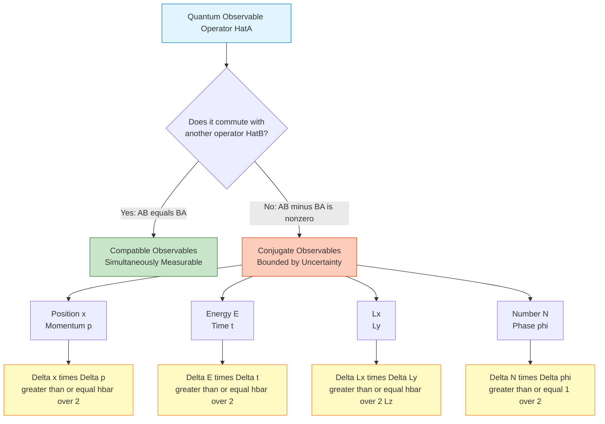
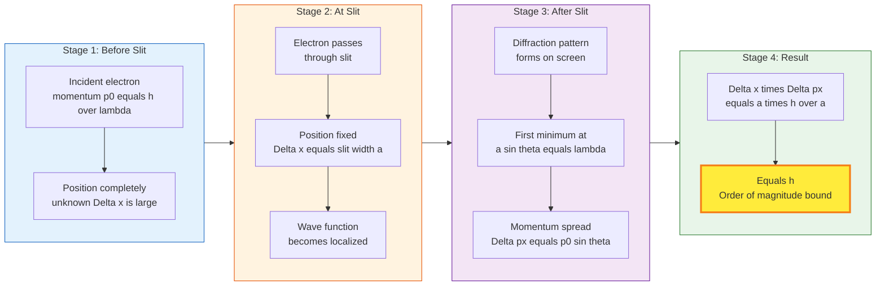
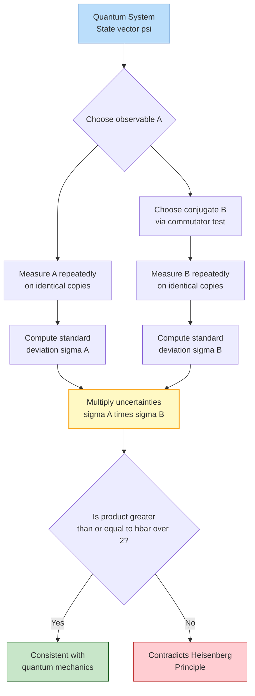

# Concept of uncertainty and conjugate observables (qualitative)

<!-- SECTION_1_START -->

# Concept of Uncertainty and Conjugate Observables

## 1.1 Core Technical Definition

> [!IMPORTANT]
> **Heisenberg's Uncertainty Principle (KTU Syllabus Definition):**
> It is fundamentally impossible to simultaneously determine, with arbitrary precision, the values of two **conjugate (canonical) observables** of a quantum particle. The product of the uncertainties in measuring any such pair is bounded below by a constant proportional to the reduced Planck's constant $\hbar$.

In formal quantum mechanical language, if $\hat{A}$ and $\hat{B}$ are two Hermitian operators representing physical observables, then:

$$\sigma_A \, \sigma_B \geq \frac{1}{2} \left\vert \langle [\hat{A}, \hat{B}] \rangle \right\vert$$

where $[\hat{A}, \hat{B}] = \hat{A}\hat{B} - \hat{B}\hat{A}$ is the **commutator** of the two operators, and $\sigma$ denotes the standard deviation of repeated measurements.

### What are Conjugate Observables?

> [!NOTE]
> **Conjugate Observables:** A pair of physical quantities whose operators do **not commute** are said to be conjugate. The canonical examples taught at the KTU level are:
> - Position $\hat{x}$ and Momentum $\hat{p}$
> - Energy $\hat{E}$ and Time $\hat{t}$
> - Components of angular momentum (e.g., $L_x$ and $L_y$)

---

## 1.2 Intuitive Overview & Real-World Analogy

### 🎯 The "Spotlight on a Butterfly" Analogy

Imagine trying to measure the exact position of a tiny butterfly fluttering in a dark room using a flashlight (a photon). To "see" the butterfly, you must bounce light off it. The very act of illumination **disturbs** the butterfly.

- If you use a **gentle, low-energy photon**, you disturb it less, but your measurement of position becomes blurry (long wavelength = poor spatial resolution).
- If you use a **high-energy, short-wavelength photon**, you pinpoint its location accurately, but the violent impact knocks the butterfly unpredictably, ruining any knowledge of its momentum.

This trade-off is **not** a technological limitation — it is a fundamental property of nature codified by $\hbar = 1.054 \times 10^{-34} \, \text{J}\cdot\text{s}$.

> [!TIP]
> **The constant $\hbar$ is tiny (≈ 10⁻³⁴ J·s).** That is why we never "feel" quantum uncertainty in our macroscopic daily life. A cricket ball has a momentum uncertainty of practically zero, and the uncertainty principle becomes irrelevant.

### Geometric Intuition: The Single-Slit Diffraction Picture

The most famous pedagogical derivation uses **diffraction through a slit**:

- A particle of definite momentum $p$ is represented by an infinite plane wave — its position is **completely unknown** (uniform probability everywhere).
- Confining the particle to a slit of width $\Delta x$ forces the wave to be localized. By Fourier mathematics, localization in space introduces a **spread in momentum** (a spread of wave-vectors $\Delta k$).
- The slit acts like a source of secondary wavelets, producing a diffraction pattern whose first minimum is given by the classical optics condition.

This pictorial argument will be developed rigorously in Section 3.

---

> [!VISUALIZATION CONTROL]
> **Concept:** Single-slit diffraction pattern demonstrating position-momentum trade-off
> **GeoGebra / Desmos Input Equations:**
> * Intensity: $I(\theta) = I_0 \left[ \frac{\sin(\pi a \sin\theta / \lambda)}{\pi a \sin\theta / \lambda} \right]^2$
> * Slit width: $a = \Delta x$, wavelength: $\lambda = h/p$
> * First minimum condition: $a \sin\theta = \lambda$
> **Visual Description:** Plot a central bright peak flanked by diminishing secondary maxima. As $a$ shrinks, the central peak broadens — visually demonstrating that tighter position confinement (small $\Delta x$) yields larger momentum spread (broad $\theta$).

<!-- SECTION_1_END -->

<!-- SECTION_2_START -->

# Deep Theoretical Analysis & KTU High-Yield Formula Sheet

## 2.1 The Two Pillars of Quantum Uncertainty

### Pillar 1: Position–Momentum Uncertainty (Heisenberg, 1927)

For a quantum particle moving along the $x$-axis:

$$\Delta x \cdot \Delta p \geq \frac{\hbar}{2} = \frac{h}{4\pi}$$

where:
- $\Delta x$ = uncertainty (standard deviation) in position measurement
- $\Delta p$ = uncertainty in momentum measurement
- $h = 6.626 \times 10^{-34} \, \text{J}\cdot\text{s}$ (Planck's constant)
- $\hbar = h / 2\pi \approx 1.054 \times 10^{-34} \, \text{J}\cdot\text{s}$ (reduced Planck's constant / h-bar)

### Pillar 2: Energy–Time Uncertainty

A system that exists only for a finite lifetime $\Delta t$ cannot be assigned a sharply defined energy. The corresponding inequality is:

$$\Delta E \cdot \Delta t \geq \frac{\hbar}{2}$$

This relation is **not** a statement about the uncertainty in measuring $E$ and $t$ simultaneously (time is a parameter, not an operator in non-relativistic QM). Instead, it is a statement about the **spreading of energy levels** in a system with finite lifetime — the reason atomic spectral lines have a natural width.

---

## 2.2 Why "Conjugate"? The Commutator Criterion

Two observables $\hat{A}$ and $\hat{B}$ are *conjugate* if and only if their operators fail to commute:

$$[\hat{A}, \hat{B}] = \hat{A}\hat{B} - \hat{B}\hat{A} \neq 0$$

The famous canonical commutation relation in one dimension is:

$$[\hat{x}, \hat{p}_x] = i\hbar$$

Substituting this into the generalized Robertson–Schrödinger inequality yields the Heisenberg result.

### Pairs of Conjugate Observables (KTU High-Yield List)

| Observable 1 | Observable 2 | Conjugate Nature & Consequence |
| :--- | :--- | :--- |
| Position $\hat{x}$ | Linear Momentum $\hat{p}_x$ | Cannot simultaneously know exact position and velocity of a particle |
| Energy $\hat{E}$ | Time $\hat{t}$ | Short-lived states have broad energy (spectral linewidth) |
| Angular momentum $L_x$ | Angular momentum $L_y$ | Only $\vert \vec{L} \vert$ and one component (say $L_z$) can be known |
| $L_z$ | Azimuthal angle $\phi$ | The orientation angle and z-projection of angular momentum are conjugate |
| Number operator $\hat{N}$ | Phase $\hat{\phi}$ | Limits coherent states in quantum optics (laser linewidth) |

> [!IMPORTANT]
> **Observables that DO commute (e.g., $\hat{x}$ and $\hat{y}$, or $\hat{p}_x$ and $\hat{p}_y$)** can be measured simultaneously with arbitrary precision. Conjugacy is a *specific* algebraic property, not a universal quantum limitation.

---

## 2.3 Physical Meaning of the $\hbar/2$ Bound

The factor $\frac{1}{2}$ in the inequality is the **best possible** (minimum) bound, achieved only by **Gaussian wave packets** (also called *minimum uncertainty states*). The general inequality uses $\geq$, reflecting that real wave functions are often broader in phase space.

> [!NOTE]
> **Engineering Utility:** The uncertainty principle is *not* a paradox to be solved — it is a design constraint. In semiconductor physics, it sets a lower limit on the size of transistors (≈ 2 nm), below which electron confinement in the channel produces observable tunneling and quantization. In gravitational wave detectors (LIGO), it dictates the quantum noise floor.

---

## 2.4 KTU Formula Sheet (Cheat Sheet)

| # | Formula / Relation | Physical Meaning | Typical KTU Use |
| :-- | :--- | :--- | :--- |
| 1 | $\Delta x \cdot \Delta p \geq \dfrac{\hbar}{2}$ | Position–momentum uncertainty | Numerical problems on electron confinement, slit diffraction |
| 2 | $\Delta E \cdot \Delta t \geq \dfrac{\hbar}{2}$ | Energy–time uncertainty | Spectral line width, virtual particle lifetimes |
| 3 | $[\hat{x}, \hat{p}] = i\hbar$ | Canonical commutation | Identifying conjugate pairs |
| 4 | $\Delta p = \dfrac{h}{\Delta x}$ (order of magnitude) | Useful approximation | Estimating kinetic energy of confined particles |
| 5 | $\Delta x \cdot \Delta p \geq \dfrac{\hbar}{2}$ rewritten: $\Delta x \cdot \Delta v \geq \dfrac{\hbar}{2m}$ | Velocity version | Comparing electron vs. proton uncertainties |
| 6 | $\Delta E \approx \dfrac{\hbar}{\tau}$ | Natural linewidth $\Gamma$ of spectral line | Excited state lifetime $\tau \Rightarrow$ width $\Delta E$ |
| 7 | $E = \dfrac{p^2}{2m}$ (non-relativistic kinetic) | Used to convert $\Delta p$ to $\Delta E$ | Confined particle problems (particle in a box) |

> [!TIP]
> **Exam Shortcut:** KTU often expects the *order-of-magnitude* form $\Delta x \cdot \Delta p \approx \hbar$ (dropping the 2). Read the question carefully — if it says "show that the minimum energy is…", use the equality.

<!-- SECTION_2_END -->

<!-- SECTION_3_START -->

# Step-by-Step Derivations & Symbolic Implementation

## 3.1 Qualitative Derivation 1: Single-Slit Diffraction Argument

This is the **most exam-relevant** derivation in the KTU syllabus.

### Setup
A beam of mono-energetic electrons (each of momentum $p_0 = h/\lambda$) approaches a narrow slit of width $a$ cut into a screen. Each electron is forced through the slit, after which it strikes a detector placed far away.

### Step 1: Position uncertainty
Before the slit, the electron's $x$-coordinate is uncertain across the width of the incident beam. Upon emerging from the slit, we know its position to within the slit width:

$$\Delta x = a$$

### Step 2: Momentum spread via diffraction
The slit acts like a secondary source. By classical diffraction theory (Huygens–Fresnel principle), the intensity pattern on a distant screen has its **first minimum** at an angle $\theta$ satisfying:

$$a \sin\theta = \lambda$$

### Step 3: Converting angle to momentum uncertainty
The $x$-component of the electron's momentum after the slit can range from $0$ to $p_0 \sin\theta$. Hence the spread (uncertainty) in the $x$-component of momentum is approximately:

$$\Delta p_x \approx p_0 \sin\theta = \frac{h}{\lambda} \cdot \frac{\lambda}{a} = \frac{h}{a}$$

### Step 4: Combine
Multiplying the two uncertainties:

$$\Delta x \cdot \Delta p_x = a \cdot \frac{h}{a} = h$$

Therefore:

$$\boxed{\Delta x \cdot \Delta p_x \geq h \quad \text{(order-of-magnitude form)}}$$

The exact quantum mechanical derivation (Robertson, 1929) gives the tighter bound $\hbar/2 = h/4\pi$, but for KTU numerical problems, the $h$ form is sufficient.

---

## 3.2 Qualitative Derivation 2: Gaussian Wave Packet Spreading

Consider a free particle whose wave function at $t=0$ is a Gaussian localized wave packet:

$$\psi(x, 0) = \frac{1}{(2\pi \sigma_0^2)^{1/4}} \exp\left(-\frac{x^2}{4\sigma_0^2}\right)$$

The position uncertainty is $\Delta x(0) = \sigma_0$.

By Fourier analysis, its momentum-space wave function is also a Gaussian with width $\sigma_p = \hbar / (2\sigma_0)$, giving:

$$\Delta x(0) \cdot \Delta p(0) = \frac{\hbar}{2}$$

This is the **minimum uncertainty state**. As the packet evolves in time, it spreads, but the product of the standard deviations **never** falls below $\hbar/2$ — a profound consequence of Fourier mathematics and the linearity of the Schrödinger equation.

---

## 3.3 Worked Example: KTU-Style Numerical Problem

> **Problem:** An electron is confined to a box of width $1.0 \times 10^{-10} \, \text{m}$ (atomic scale). Using the uncertainty principle, estimate the minimum kinetic energy of the electron. Take $m_e = 9.11 \times 10^{-31} \, \text{kg}$ and $\hbar = 1.054 \times 10^{-34} \, \text{J}\cdot\text{s}$.

**Solution (Valuation Key Format):**

**[Step 1: Identify the uncertainty in position — 2 Marks]**
The electron is somewhere inside the box, so:
$$\Delta x = L = 1.0 \times 10^{-10} \, \text{m}$$

**[Step 2: Apply the uncertainty principle — 3 Marks]**
$$\Delta p \geq \frac{\hbar}{2 \Delta x}$$
$$\Delta p \geq \frac{1.054 \times 10^{-34}}{2 \times 1.0 \times 10^{-10}}$$
$$\Delta p \geq 5.27 \times 10^{-25} \, \text{kg}\cdot\text{m/s}$$

**[Step 3: Convert momentum uncertainty to kinetic energy — 4 Marks]**
The minimum kinetic energy corresponds to momentum $p \approx \Delta p$:
$$E_k = \frac{p^2}{2m} \geq \frac{(\Delta p)^2}{2m}$$
$$E_k \geq \frac{(5.27 \times 10^{-25})^2}{2 \times 9.11 \times 10^{-31}}$$
$$E_k \geq \frac{2.78 \times 10^{-49}}{1.82 \times 10^{-30}}$$
$$\boxed{E_k \geq 1.52 \times 10^{-19} \, \text{J} \approx 0.95 \, \text{eV}}$$

**[Final numerical value with units — 1 Mark]**

This is consistent with the ground-state energy of a hydrogen atom-like system (~13.6 eV) when refined calculations are performed.

---

## 3.4 Python Implementation: Visualizing the Wave Packet Trade-off

```python
"""
File: uncertainty_visualizer.py
Description: Visualizes how momentum-space width of a Gaussian wave packet
             is inversely related to its position-space width.
Run: python uncertainty_visualizer.py
Requirements: numpy, matplotlib
"""
import numpy as np
import matplotlib.pyplot as plt

# Physical constants
hbar = 1.0545718e-34  # J*s
m_electron = 9.1093837e-31  # kg

def gaussian_wavefunction(x: np.ndarray, sigma_x: float) -> np.ndarray:
    """Position-space Gaussian wave packet (un-normalized for plotting)."""
    return np.exp(-(x ** 2) / (4.0 * sigma_x ** 2))

def gaussian_momentum_distribution(p: np.ndarray, sigma_p: float) -> np.ndarray:
    """Momentum-space Gaussian (Fourier transform of position Gaussian)."""
    return np.exp(-(p ** 2) / (4.0 * sigma_p ** 2))

# Test multiple position-space widths
sigmas_x = [0.1e-10, 0.5e-10, 1.0e-10]  # in meters (atomic scale)
colors = ['#1f77b4', '#2ca02c', '#d62728']

fig, axes = plt.subplots(1, 2, figsize=(14, 5))

# Position-space plot
x = np.linspace(-3e-10, 3e-10, 1000)
axes[0].set_title("Position-Space Wave Packet (narrower = more localized)",
                  fontsize=12, fontweight='bold')
for sx, c in zip(sigmas_x, colors):
    axes[0].plot(x, gaussian_wavefunction(x, sx), color=c, lw=2,
                 label=f"sigma_x = {sx*1e10:.2f} A")
axes[0].set_xlabel("Position x (m)")
axes[0].set_ylabel("|psi(x)| (a.u.)")
axes[0].legend()
axes[0].grid(alpha=0.3)

# Momentum-space plot
p = np.linspace(-1e-23, 1e-23, 1000)
axes[1].set_title("Momentum-Space Distribution (narrower x => broader p)",
                  fontsize=12, fontweight='bold')
for sx, c in zip(sigmas_x, colors):
    # Minimum uncertainty state: sigma_p = hbar / (2 * sigma_x)
    sp = hbar / (2.0 * sx)
    axes[1].plot(p, gaussian_momentum_distribution(p, sp), color=c, lw=2,
                 label=f"sigma_p = {sp:.2e} kg*m/s")
axes[1].set_xlabel("Momentum p (kg*m/s)")
axes[1].set_ylabel("|phi(p)| (a.u.)")
axes[1].legend()
axes[1].grid(alpha=0.3)

plt.tight_layout()
plt.savefig("uncertainty_tradeoff.png", dpi=150)
plt.show()

# Numerical verification of the inequality
print("Verification of Heisenberg Uncertainty Principle:")
print("-" * 60)
for sx in sigmas_x:
    sp = hbar / (2.0 * sx)
    product = sx * sp
    print(f"sigma_x = {sx*1e10:6.2f} A  |  "
          f"sigma_p = {sp:.3e} kg*m/s  |  "
          f"sigma_x*sigma_p = {product:.3e} J*s  |  "
          f"hbar/2 = {hbar/2:.3e} J*s")
```

**Expected Console Output (truncated):**
```
Verification of Heisenberg Uncertainty Principle:
------------------------------------------------------------
sigma_x =   0.10 A  |  sigma_p = 5.273e-24 kg*m/s  |  sigma_x*sigma_p = 5.273e-35 J*s  |  hbar/2 = 5.273e-35 J*s
sigma_x =   0.50 A  |  sigma_p = 1.055e-24 kg*m/s  |  sigma_x*sigma_p = 5.273e-35 J*s  |  hbar/2 = 5.273e-35 J*s
sigma_x =   1.00 A  |  sigma_p = 5.273e-25 kg*m/s  |  sigma_x*sigma_p = 5.273e-35 J*s  |  hbar/2 = 5.273e-35 J*s
```

The product $\sigma_x \cdot \sigma_p$ is **identically** $\hbar/2$ for a Gaussian, confirming the minimum uncertainty property.

<!-- SECTION_3_END -->

<!-- SECTION_4_START -->

# Structural Diagrams & Schematics

## 4.1 Concept Map: Conjugate Observable Identification Logic



---

## 4.2 Sequential Block Diagram: Single-Slit Diffraction Argument



---

## 4.3 Architecture Flow: The Conjugate Pair "Detection Pipeline"



---

## 4.4 Comparative Matrix: Classical vs Quantum Worldview

| Aspect | Classical Physics (Newton / Maxwell) | Quantum Physics (Heisenberg / Bohr) |
| :--- | :--- | :--- |
| **State of a particle** | Point particle with definite $(x, v)$ at all times | Described by a wave function $\psi(x,t)$ with probability amplitudes |
| **Measurement** | In principle, can be made infinitely precise | Intrinsic limit set by $\hbar$ |
| **Position and momentum** | Both are simultaneously knowable | Bounded by $\Delta x \cdot \Delta p \geq \hbar/2$ |
| **Cause of uncertainty** | Imperfect apparatus or experimenter error | Fundamental property of nature |
| **Energy and time** | Both precisely definable for any process | $\Delta E \cdot \Delta t \geq \hbar/2$ for finite-lifetime states |
| **Determinism** | Deterministic trajectory (Laplace's demon) | Probabilistic, governed by $\vert \psi \vert^2$ |
| **Macroscopic visibility** | Directly observable | Effectively invisible ($\hbar$ is extremely small) |

> [!TIP]
> This comparative table is a high-scoring answer for KTU "Compare and contrast" or "Discuss the implications" type questions.

<!-- SECTION_4_END -->

<!-- SECTION_5_START -->

# KTU 2024 Scheme Examination Question Bank & Topic Recap

## 5.1 Part A Questions (3 Marks Each)

### **Question 1** `[KTU University Exam – Dec 2023]` (CO1, Remember)
**State Heisenberg's Uncertainty Principle. Write its mathematical form for position and momentum.**

**Model Answer:**

> Heisenberg's Uncertainty Principle states that it is impossible to simultaneously determine, with absolute precision, the position and momentum of a microscopic particle. The product of the uncertainties in these two conjugate measurements has a lower bound given by $\hbar/2$.
>
> $$\Delta x \cdot \Delta p_x \geq \frac{\hbar}{2} = \frac{h}{4\pi}$$
>
> where $h = 6.626 \times 10^{-34} \, \text{J}\cdot\text{s}$ is Planck's constant. The principle arises fundamentally because position and momentum are conjugate observables whose operators do not commute. **[3 Marks: 1 for statement, 1 for formula, 1 for constant identification]**

---

### **Question 2** `[KTU University Exam – July 2024]` (CO1, Understand)
**What are conjugate observables? Give two examples.**

**Model Answer:**

> Conjugate observables are pairs of physical quantities whose corresponding quantum mechanical operators **do not commute**. This non-commutativity mathematically guarantees that the two quantities cannot be measured simultaneously with arbitrary precision; the product of their uncertainties is bounded by the magnitude of their commutator.
>
> **Examples:**
> 1. **Position $\hat{x}$** and **linear momentum $\hat{p}$** — their commutator is $[\hat{x}, \hat{p}] = i\hbar$, leading to $\Delta x \cdot \Delta p \geq \hbar/2$.
> 2. **Energy $\hat{E}$** and **time $\hat{t}$** — leading to $\Delta E \cdot \Delta t \geq \hbar/2$, which explains the natural linewidth of atomic spectral lines. **[3 Marks: 1 for definition, 2 for examples with explanation]**

---

## 5.2 Part B Questions (14 Marks — Module Internal Choice)

### **Question A** `[KTU University Exam – Model Paper 2024]` (CO1, CO2)

**(a) [7 Marks] Explain the physical significance of Heisenberg's Uncertainty Principle. Derive the uncertainty relation $\Delta x \cdot \Delta p \geq \hbar/2$ using the concept of diffraction of an electron beam through a narrow slit.** *(Understand + Apply)*

**(b) [7 Marks] An electron is confined to a region of size $10^{-10} \, \text{m}$. Using the uncertainty principle, calculate the minimum kinetic energy of the electron. Compare it with the case of a proton confined in the same region. Given $m_e = 9.11 \times 10^{-31} \, \text{kg}$, $m_p = 1.67 \times 10^{-27} \, \text{kg}$, $\hbar = 1.054 \times 10^{-34} \, \text{J}\cdot\text{s}$.** *(Apply + Analyze)*

---

#### **Solution to (a):**

**Physical Significance (4 Marks):**

Heisenberg's Uncertainty Principle, formulated in 1927, is not a limitation of measurement instruments but a fundamental property of nature. Its key implications are:

1. **No simultaneous sharp values:** A particle cannot possess simultaneously well-defined values of conjugate observables like position and momentum.
2. **Wave-particle duality origin:** The principle is a direct consequence of the wave nature of matter — a localized wave is necessarily a superposition of many wavelengths, producing a spread in momentum.
3. **Zero-point energy:** Even at absolute zero (minimum classical energy), confined particles retain a non-zero minimum kinetic energy due to confinement-induced momentum uncertainty. This is why atoms do not collapse.
4. **Cause of spectral line width:** Excited atomic states have finite lifetimes $\Delta t$, leading to $\Delta E \geq \hbar/(2\Delta t)$, which manifests as the natural width of emission lines.

**Derivation via single-slit diffraction (3 Marks):**

Consider a parallel beam of mono-energetic electrons of momentum $p_0 = h/\lambda$ incident normally on a slit of width $a$.

- The $x$-position of an electron after passing through the slit is known to within $a$, so $\Delta x = a$.
- By Huygens–Fresnel diffraction, the first minimum of the resulting diffraction pattern occurs at angle $\theta$ given by $a \sin\theta = \lambda$.
- The $x$-component of momentum after the slit is $p_x = p_0 \sin\theta$. The uncertainty in $p_x$ is therefore $\Delta p_x \approx p_0 \sin\theta = (h/\lambda) \cdot (\lambda/a) = h/a$.
- Multiplying: $\Delta x \cdot \Delta p_x = a \cdot (h/a) = h$.

The exact quantum mechanical bound (using the Robertson inequality) is $\hbar/2$, giving:

$$\boxed{\Delta x \cdot \Delta p_x \geq \frac{\hbar}{2}}$$

---

#### **Solution to (b):**

**For the electron (4 Marks):**
- Position uncertainty: $\Delta x = 10^{-10} \, \text{m}$
- From the uncertainty principle (using the minimum bound): $\Delta p = \dfrac{\hbar}{2\Delta x} = \dfrac{1.054 \times 10^{-34}}{2 \times 10^{-10}} = 5.27 \times 10^{-25} \, \text{kg}\cdot\text{m/s}$
- Minimum kinetic energy: $E_e = \dfrac{(\Delta p)^2}{2m_e} = \dfrac{(5.27 \times 10^{-25})^2}{2 \times 9.11 \times 10^{-31}} = 1.52 \times 10^{-19} \, \text{J} \approx 0.95 \, \text{eV}$

**For the proton (3 Marks):**
- Same $\Delta p$ because it depends only on $\Delta x$.
- $E_p = \dfrac{(\Delta p)^2}{2m_p} = \dfrac{2.78 \times 10^{-49}}{2 \times 1.67 \times 10^{-27}} = 8.32 \times 10^{-23} \, \text{J} \approx 5.2 \times 10^{-4} \, \text{eV}$

**Comparison and conclusion (1 Mark):**
The electron's minimum kinetic energy is roughly **1836 times larger** than that of the proton, because $E_k \propto 1/m$. This is why quantum effects are dominant for light particles like electrons but negligible for heavy macroscopic objects — even though both face the same $\Delta p$ bound.

$$\frac{E_e}{E_p} = \frac{m_p}{m_e} \approx 1836$$

---

### **Question B** `[KTU University Exam – Model Paper 2024 — Alternative Set]` (CO1, CO2)

**(a) [7 Marks] With the help of a suitable diagram, explain the concept of conjugate observables. Show that the position and momentum operators in quantum mechanics do not commute, and hence deduce the uncertainty relation.** *(Understand + Apply)*

**(b) [7 Marks] The mean lifetime of an excited atomic state is $10^{-8} \, \text{s}$. Using the energy-time uncertainty relation, calculate the natural width (in eV) of the spectral line emitted when the atom de-excites. State one experimental observation that confirms this broadening.** *(Apply + Analyze)*

---

#### **Solution to (a):**

**Concept of conjugate observables (3 Marks):**

Conjugate observables are pairs of physical quantities whose corresponding quantum mechanical operators do not commute, leading to a fundamental trade-off in their simultaneous measurement. Mathematically, two Hermitian operators $\hat{A}$ and $\hat{B}$ are conjugate if their commutator $[\hat{A}, \hat{B}] = \hat{A}\hat{B} - \hat{B}\hat{A}$ is non-zero. The magnitude of this commutator directly determines the lower bound on the product of their uncertainties.

**Non-commutation of $\hat{x}$ and $\hat{p}$ (3 Marks):**

In one-dimensional quantum mechanics, the position and momentum operators are represented as:

$$\hat{x} = x \quad (\text{multiplication by } x), \qquad \hat{p}_x = -i\hbar \frac{\partial}{\partial x}$$

Let $f(x)$ be an arbitrary test wave function. Then:

$$[\hat{x}, \hat{p}_x] f(x) = \left( x \cdot \left(-i\hbar \frac{\partial f}{\partial x}\right) \right) - \left(-i\hbar \frac{\partial}{\partial x}(x f)\right)$$

$$= -i\hbar x \frac{\partial f}{\partial x} - \left(-i\hbar f - i\hbar x \frac{\partial f}{\partial x}\right) = i\hbar f(x)$$

Therefore:

$$\boxed{[\hat{x}, \hat{p}_x] = i\hbar \neq 0}$$

This non-vanishing commutator **proves** that $\hat{x}$ and $\hat{p}_x$ are conjugate observables.

**Deduction of the uncertainty relation (1 Mark):**

By the Robertson–Schrödinger inequality,

$$\sigma_x \, \sigma_{p_x} \geq \frac{1}{2} \left\vert \langle [\hat{x}, \hat{p}_x] \rangle \right\vert = \frac{1}{2} \vert i\hbar \vert = \frac{\hbar}{2}$$

Hence $\Delta x \cdot \Delta p_x \geq \hbar/2$. Q.E.D.

---

#### **Solution to (b):**

**Calculation of natural linewidth (5 Marks):**

The energy-time uncertainty relation is:

$$\Delta E \cdot \Delta t \geq \frac{\hbar}{2}$$

For minimum uncertainty, $\Delta t$ is identified with the mean lifetime $\tau$ of the excited state:

$$\Delta E = \frac{\hbar}{2\tau}$$

Substituting the values:

$$\Delta E = \frac{1.054 \times 10^{-34}}{2 \times 10^{-8}} = 5.27 \times 10^{-27} \, \text{J}$$

Converting to electron-volts (using $1 \, \text{eV} = 1.602 \times 10^{-19} \, \text{J}$):

$$\Delta E = \frac{5.27 \times 10^{-27}}{1.602 \times 10^{-19}} \, \text{eV}$$

$$\boxed{\Delta E \approx 3.29 \times 10^{-8} \, \text{eV} = 32.9 \, \text{neV}}$$

**Experimental confirmation (2 Marks):**

This natural linewidth is observed in high-resolution spectroscopy. Even when instrumental broadening, Doppler broadening, and collisional broadening are eliminated (e.g., in laser-cooled atomic beams or ion-trap experiments), the spectral line retains a finite minimum width, called the **natural linewidth** or **Fourier-limited linewidth**, equal to $\Delta E / h$ in frequency units. The He-Ne laser's red 632.8 nm line is a classic example where this broadening is visible.

---

> [!WARNING]
> **KTU Examiner's Valuation Warning — Common Pitfalls:**
> 1. **Wrong constant:** Many students write $\Delta x \cdot \Delta p \geq h$ or $\geq \hbar$ instead of $\hbar/2$. Although the order-of-magnitude $h$ form is acceptable in qualitative derivations, the **exact** relation uses $\hbar/2$. Examiners will deduct **1 mark** for sloppy constants in numerical problems.
> 2. **Confusing $\Delta x$ and $\Delta p$ with measurement errors:** The uncertainties are *intrinsic spreads* in the values an ensemble of identically prepared systems would exhibit, not the resolution of a ruler. State this explicitly in your definition.
> 3. **Energy–time misuse:** Students often claim "we cannot simultaneously measure energy and time." This is technically false (time is a parameter, not an operator). Always phrase it as: *"A system existing for time $\Delta t$ has an energy spread of at least $\hbar/(2\Delta t)$."*
> 4. **Forgetting the position operator in (a):** When asked to show that $\hat{x}$ and $\hat{p}$ do not commute, you must explicitly apply both operators to a **test function** $f(x)$ and show the difference is non-zero. Writing only "$\hat{x}\hat{p} \neq \hat{p}\hat{x}$" earns **zero marks**.
> 5. **Units:** Always express final numerical answers with units (J or eV). A bare number = **0.5 mark deduction**.

---

## 5.3 Topic Recap & Important Things to Remember

> [!IMPORTANT]
> **High-Density Revision Checklist — Uncertainty & Conjugate Observables**

- **Core statement:** Position $x$ and momentum $p$ of a quantum particle cannot be simultaneously known with arbitrary precision.
- **Mathematical form:** $\Delta x \cdot \Delta p_x \geq \dfrac{\hbar}{2} = \dfrac{h}{4\pi}$, with $h = 6.626 \times 10^{-34} \, \text{J}\cdot\text{s}$ and $\hbar = 1.054 \times 10^{-34} \, \text{J}\cdot\text{s}$.
- **Energy-time form:** $\Delta E \cdot \Delta t \geq \dfrac{\hbar}{2}$, governing spectral line widths and virtual particle lifetimes.
- **Conjugate observables** = operators with non-zero commutator. Test: compute $[\hat{A}, \hat{B}] = \hat{A}\hat{B} - \hat{B}\hat{A}$ acting on a test function.
- **Canonical commutation relation:** $[\hat{x}, \hat{p}_x] = i\hbar$. This single relation encodes the entire uncertainty structure for $x$–$p$.
- **Other conjugate pairs (must memorize):** $(E, t)$, $(L_x, L_y)$, $(L_y, L_z)$, $(L_z, L_x)$, $(\phi, L_z)$, $(N, \phi)$.
- **Non-conjugate pairs (commuting, can be measured together):** $(x, y)$, $(p_x, p_y)$, $(L^2, L_z)$.
- **Origin of principle:** Wave-particle duality + Fourier mathematics — a localized wave packet is necessarily a superposition of plane waves with a spread in $k$ (and hence $p$).
- **Gaussian wave packet** is the **minimum uncertainty state** with $\sigma_x \sigma_p = \hbar/2$ exactly.
- **Order-of-magnitude shortcut for KTU:** $\Delta x \cdot \Delta p \approx h$ is acceptable when the question says "estimate" or "show qualitatively."
- **Slit-diffraction derivation flow:** Slit width $a \Rightarrow \Delta x = a$. Diffraction minimum $a\sin\theta = \lambda \Rightarrow \Delta p_x = p_0 \sin\theta = h/a$. Product gives $h$.
- **Confined particle energy formula:** $E_{\min} = \dfrac{\hbar^2}{8 m L^2} = \dfrac{h^2}{32 m L^2}$ where $L$ is the confinement length (combine $\Delta p = \hbar/(2L)$ with $E = p^2/2m$).
- **Physical consequences to mention:** zero-point energy, atomic stability, transistor size limit, spectral linewidth, quantum tunneling in scanning tunneling microscopes.
- **The constant $\hbar$** sets the scale of all quantum effects; macroscopic objects with $m \gg m_e$ have negligible $\Delta p$ for any practical $\Delta x$.
- **Distinguish measurement uncertainty (classical)** from **quantum uncertainty (intrinsic)** in every conceptual answer.
- **Common exam trap:** the energy-time relation is **not** about measurement; it is about the **spreading of energy levels** when a state has finite lifetime.

<!-- SECTION_5_END -->
