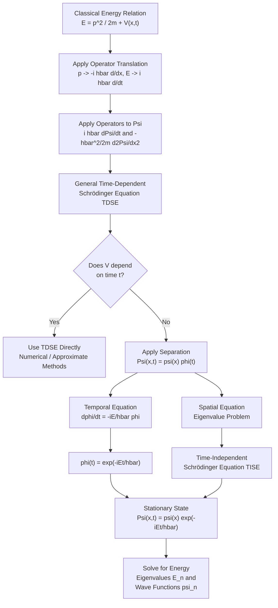
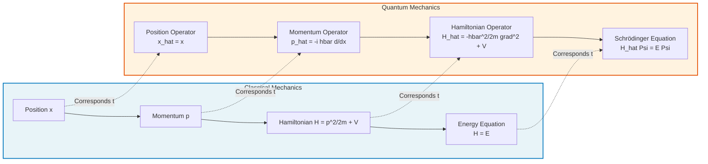
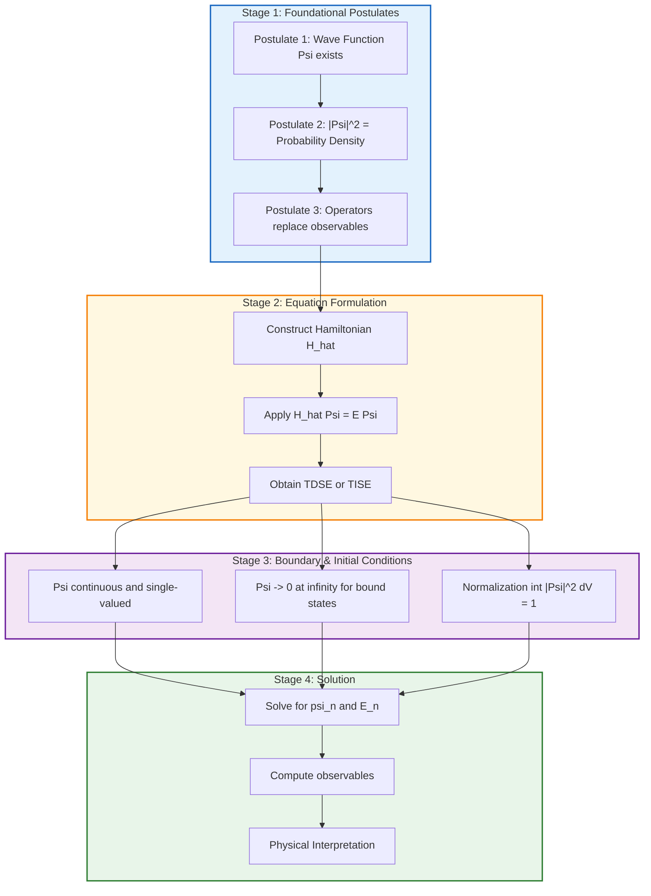

# Formulation of time dependent and time independent Schrodinger equations

<!-- SECTION_1_START -->
# Formulation of Time-Dependent and Time-Independent Schrödinger Equations

## 1.1 Formal Academic Definition (KTU 2024 Syllabus Terminology)

The **Schrödinger Equation** is the fundamental wave equation of non-relativistic quantum mechanics that describes how the quantum state (wave function) of a physical system evolves in space and time. It plays the same role in quantum mechanics that Newton's second law plays in classical mechanics.

The equation exists in two principal forms:

- **Time-Dependent Schrödinger Equation (TDSE):** Describes the dynamic evolution of a quantum system's wave function in both space and time, particularly when the potential energy is explicitly time-dependent.

- **Time-Independent Schrödinger Equation (TISE):** A simplified form obtained by separation of variables, applicable to stationary states where the potential energy is time-independent.

> [!IMPORTANT]
> **Syllabus Highlight:** The Schrödinger equation is a *postulate* of quantum mechanics — it cannot be derived from more fundamental principles, but its validity is established by the perfect agreement of its predictions with experimental observations.

> [!NOTE]
> **Core Definition — Wave Function $\Psi(\vec{r}, t)$:** A complex-valued function whose squared magnitude $\vert \Psi(\vec{r}, t) \vert^2 = \Psi^* \Psi$ gives the probability density of finding the particle at position $\vec{r}$ at time $t$. Here $\Psi^*$ is the complex conjugate of $\Psi$.

## 1.2 Intuitive Overview & Real-World Analogy

Imagine you are standing at the edge of a pond. When you drop a small stone, ripples spread outward in a deterministic, predictable pattern. The *height of the water* at any point tells you how much disturbance exists there. Similarly, in the quantum world, every particle behaves like such a "ripple" — but instead of water height, we have a **probability amplitude** $\Psi$. The Schrödinger equation is the rule that dictates exactly how this probability ripple spreads, interferes, and evolves.

**Key Analogy Mapping:**
- *Water height at a point* $\longleftrightarrow$ *Wave function $\Psi(\vec{r}, t)$*
- *Rules of fluid dynamics* $\longleftrightarrow$ *Schrödinger equation*
- *Energy of the wave* $\longleftrightarrow$ *Total energy $E$ of the particle*
- *Depth of the pond (slowing the wave)* $\longleftrightarrow$ *Potential $V(\vec{r})$ acting on the particle*

## 1.3 Essential Physical Constants

| Symbol | Quantity | Value |
|--------|----------|-------|
| **$h$** | **Planck's constant** | $6.626 \times 10^{-34} \, \text{J}\cdot\text{s}$ |
| **$\hbar$** | **Reduced Planck's constant** ($h/2\pi$) | $1.054 \times 10^{-34} \, \text{J}\cdot\text{s}$ |
| **$m_e$** | **Rest mass of an electron** | $9.11 \times 10^{-31} \, \text{kg}$ |
| **$i$** | **Imaginary unit** | $\sqrt{-1}$ |
| **$e$** | **Elementary charge** | $1.602 \times 10^{-19} \, \text{C}$ |

> [!VISUALIZATION CONTROL]
> **Concept:** Probability density distribution $\vert \Psi(x, t) \vert^2$ of a free particle Gaussian wave packet
> **GeoGebra / Desmos Input Equations:**
> * $u(x, t) = \dfrac{1}{\sqrt[4]{2\pi\sigma^2}} \cdot e^{-\dfrac{(x - v t)^2}{4 \sigma^2}} \cdot \cos\!\left(\dfrac{m v (x - vt/2)}{\hbar}\right)$
> * $v(x, t) = \dfrac{1}{\sqrt[4]{2\pi\sigma^2}} \cdot e^{-\dfrac{(x - v t)^2}{4 \sigma^2}} \cdot \sin\!\left(\dfrac{m v (x - vt/2)}{\hbar}\right)$
> * $P(x, t) = u(x, t)^2 + v(x, t)^2$
> **Visual Description:** A localized bell-shaped "probability hump" that slides along the $x$-axis with velocity $v$, gradually spreading (dispersion) as time $t$ increases. The real and imaginary parts oscillate rapidly inside the envelope.
<!-- SECTION_1_END -->

<!-- SECTION_2_START -->
# Deep Theoretical Analysis & KTU High-Yield Formula Sheet

## 2.1 Physical & Mathematical Foundations

The formulation of the Schrödinger equation rests upon three foundational pillars:

1. **De Broglie's Hypothesis (1924):** Every particle of momentum $p$ has an associated wavelength $\lambda = h/p$. A free particle therefore has a wave function of the form $\Psi(x, t) = A e^{i(kx - \omega t)}$, where $k = p/\hbar$ and $\omega = E/\hbar$.

2. **Energy-Frequency and Momentum-Wavenumber Correspondences:**
   - $E = \hbar \omega \;\Rightarrow\; \omega = E/\hbar$
   - $p = \hbar k \;\Rightarrow\; k = p/\hbar$

3. **Hamiltonian Formulation of Classical Mechanics:** The total energy of a particle is $E = \dfrac{p^2}{2m} + V(x, t)$. Replacing classical dynamical variables with corresponding quantum operators gives the Schrödinger equation.

## 2.2 The Operator Translation Postulate

The transition from classical to quantum mechanics is achieved by the **correspondence principle**:

$$
x \;\longrightarrow\; \hat{x} = x, \qquad p_x \;\longrightarrow\; \hat{p}_x = -i\hbar \dfrac{\partial}{\partial x}, \qquad E \;\longrightarrow\; \hat{E} = i\hbar \dfrac{\partial}{\partial t}
$$

The classical Hamiltonian $H = \dfrac{p^2}{2m} + V$ becomes the **Hamiltonian operator**:

$$
\hat{H} = -\dfrac{\hbar^2}{2m}\nabla^2 + V(\vec{r}, t)
$$

Applying the operator equation $\hat{H} \Psi = \hat{E} \Psi$ directly yields the **Time-Dependent Schrödinger Equation**.

## 2.3 KTU High-Yield Formula Sheet

| # | Equation / Expression | Name | Significance |
|---|----------------------|------|--------------|
| 1 | $\hat{p}_x = -i\hbar\dfrac{\partial}{\partial x}$ | Momentum Operator (1D) | Replaces $p_x$ in Hamiltonian |
| 2 | $\hat{E} = i\hbar\dfrac{\partial}{\partial t}$ | Energy Operator | Encodes the time evolution |
| 3 | $i\hbar\dfrac{\partial \Psi}{\partial t} = \hat{H}\Psi$ | **Time-Dependent Schrödinger Equation (TDSE)** | Master equation of QM |
| 4 | $i\hbar\dfrac{\partial \Psi}{\partial t} = -\dfrac{\hbar^2}{2m}\nabla^2 \Psi + V\Psi$ | TDSE (Explicit form) | 3D Schrödinger wave equation |
| 5 | $\Psi(x,t) = \psi(x)\, \phi(t)$ | Separation Ansatz | Used to derive TISE |
| 6 | $\phi(t) = e^{-iEt/\hbar}$ | Time-Factor Solution | Phase oscillation of stationary state |
| 7 | $-\dfrac{\hbar^2}{2m}\dfrac{d^2 \psi}{dx^2} + V(x)\psi = E\psi$ | **Time-Independent Schrödinger Equation (TISE)** | Eigenvalue problem for energy |
| 8 | $\hat{H}\psi_n = E_n \psi_n$ | Eigenvalue Form | $E_n$ = energy eigenvalue, $\psi_n$ = eigenfunction |
| 9 | $\int_{-\infty}^{\infty} \vert \Psi \vert^2 \, dx = 1$ | Normalization Condition | Total probability = 1 |
| 10 | $\langle A \rangle = \int \Psi^* \hat{A} \Psi \, dV$ | Expectation Value | Mean value of observable $A$ |
| 11 | $\vert \Psi \vert^2 dV = \Psi^* \Psi \, dV$ | Born's Probability Density | $P(\vec{r},t)$ of finding particle |
| 12 | $\Psi \longrightarrow \Psi + \dfrac{\partial \Psi}{\partial t}dt$ | Infinitesimal Time Evolution | Origin of unitary time evolution |

> [!NOTE]
> **Critical Boundary Conditions for Physical $\Psi$:**
> 1. $\Psi$ must be **single-valued** (one probability per point).
> 2. $\Psi$ and $\dfrac{\partial \Psi}{\partial x}$ must be **continuous** (probability current continuity).
> 3. $\Psi$ must be **finite** everywhere (normalizable).
> 4. $\Psi \longrightarrow 0$ as $x \longrightarrow \pm \infty$ for bound states.

## 2.4 Real-World Engineering & Scientific Utility

| Application Domain | Use of Schrödinger Equation |
|--------------------|----------------------------|
| **Semiconductor Industry** | Design of transistors, quantum dots, MOSFETs — band-gap engineering |
| **Medical Imaging (MRI)** | Nuclear spin precession governed by quantum evolution |
| **Laser Technology** | Stimulated emission of photons, energy level transitions |
| **Quantum Computing** | Qubit evolution and gate operations are described by TDSE |
| **Scanning Tunneling Microscopy** | Electron tunneling across potential barriers |
| **Photovoltaic Cells** | Electron-hole pair generation in solar materials |
| **Drug Design** | Molecular orbital calculations rely on Schrödinger solutions |
<!-- SECTION_2_END -->

<!-- SECTION_3_START -->
# Step-by-Step Derivations

## 3.1 Derivation of the Time-Dependent Schrödinger Equation (TDSE)

We begin with a free particle of definite energy $E$ and momentum $p$. According to De Broglie, its associated matter wave must be monochromatic (single frequency), of the form:

$$
\Psi(x, t) = A\, e^{i(kx - \omega t)}
$$

Here $A$ is the (constant) amplitude, $k$ is the wave number, and $\omega$ is the angular frequency.

**Step 1 — Identify $k$ and $\omega$ in terms of $E$ and $p$:**

From De Broglie's relations, $p = \hbar k$ and $E = \hbar \omega$. Thus $k = p/\hbar$ and $\omega = E/\hbar$.

**Step 2 — Rewrite the free-particle wave function:**

$$
\Psi(x, t) = A\, e^{\frac{i}{\hbar}(p x - E t)}
$$

**Step 3 — Take the time derivative of $\Psi$:**

Differentiating with respect to $t$ (treating $p$, $E$, $x$ as constants during this partial derivative):

$$
\dfrac{\partial \Psi}{\partial t} = A \cdot e^{\frac{i}{\hbar}(px - Et)} \cdot \left(-\dfrac{iE}{\hbar}\right) = -\dfrac{iE}{\hbar}\,\Psi
$$

**Step 4 — Take the spatial derivatives of $\Psi$:**

First derivative with respect to $x$:

$$
\dfrac{\partial \Psi}{\partial x} = A \cdot e^{\frac{i}{\hbar}(px - Et)} \cdot \dfrac{ip}{\hbar} = \dfrac{ip}{\hbar}\,\Psi
$$

Second derivative with respect to $x$:

$$
\dfrac{\partial^2 \Psi}{\partial x^2} = \dfrac{ip}{\hbar} \cdot \dfrac{ip}{\hbar}\,\Psi = -\dfrac{p^2}{\hbar^2}\,\Psi
$$

**Step 5 — Solve each derivative for the energy $E$ and momentum-squared $p^2$:**

From Step 3:

$$
E\,\Psi = -\dfrac{\hbar}{i}\dfrac{\partial \Psi}{\partial t} = i\hbar\dfrac{\partial \Psi}{\partial t}
$$

From Step 4:

$$
p^2\,\Psi = -\hbar^2 \dfrac{\partial^2 \Psi}{\partial x^2}
$$

**Step 6 — Substitute into the classical energy relation $E = \dfrac{p^2}{2m} + V(x,t)$:**

For a free particle ($V = 0$):

$$
E = \dfrac{p^2}{2m}
$$

Therefore, multiplying both sides by $\Psi$:

$$
E\,\Psi = \dfrac{p^2}{2m}\Psi
$$

Replacing $E\,\Psi$ and $p^2 \Psi$ using the operator expressions:

$$
i\hbar\dfrac{\partial \Psi}{\partial t} = -\dfrac{\hbar^2}{2m}\dfrac{\partial^2 \Psi}{\partial x^2}
$$

**Step 7 — Generalize to include a potential $V(x,t)$:**

For a particle moving in a potential $V(x,t)$, the total energy is $E = \dfrac{p^2}{2m} + V(x,t)$. Therefore:

$$
i\hbar\dfrac{\partial \Psi}{\partial t} = -\dfrac{\hbar^2}{2m}\dfrac{\partial^2 \Psi}{\partial x^2} + V(x,t)\,\Psi
$$

In three dimensions, replacing $\dfrac{\partial^2}{\partial x^2}$ with the Laplacian $\nabla^2 = \dfrac{\partial^2}{\partial x^2} + \dfrac{\partial^2}{\partial y^2} + \dfrac{\partial^2}{\partial z^2}$:

$$
\boxed{\;i\hbar\dfrac{\partial \Psi(\vec{r}, t)}{\partial t} = -\dfrac{\hbar^2}{2m}\nabla^2 \Psi(\vec{r}, t) + V(\vec{r}, t)\,\Psi(\vec{r}, t)\;}
$$

This is the **Time-Dependent Schrödinger Equation (TDSE)**.

## 3.2 Derivation of the Time-Independent Schrödinger Equation (TISE)

The TISE is obtained from the TDSE using the method of **separation of variables**, valid when the potential $V$ does not explicitly depend on time, i.e., $V = V(\vec{r})$ only.

**Step 1 — Restrict to time-independent potential:**

$$
i\hbar\dfrac{\partial \Psi}{\partial t} = -\dfrac{\hbar^2}{2m}\nabla^2 \Psi + V(\vec{r})\,\Psi
$$

**Step 2 — Assume a separable solution:**

$$
\Psi(\vec{r}, t) = \psi(\vec{r})\,\phi(t)
$$

Here $\psi$ is purely spatial and $\phi$ is purely temporal.

**Step 3 — Compute the partial derivatives:**

Time derivative:

$$
\dfrac{\partial \Psi}{\partial t} = \psi(\vec{r})\, \dfrac{d\phi}{dt}
$$

Laplacian:

$$
\nabla^2 \Psi = \phi(t)\, \nabla^2 \psi(\vec{r})
$$

**Step 4 — Substitute into the TDSE:**

$$
i\hbar\,\psi(\vec{r})\, \dfrac{d\phi}{dt} = -\dfrac{\hbar^2}{2m}\phi(t)\,\nabla^2 \psi(\vec{r}) + V(\vec{r})\,\psi(\vec{r})\,\phi(t)
$$

**Step 5 — Divide both sides by $\psi(\vec{r})\,\phi(t)$:**

$$
i\hbar\,\dfrac{1}{\phi(t)}\dfrac{d\phi}{dt} = -\dfrac{\hbar^2}{2m}\dfrac{1}{\psi(\vec{r})}\nabla^2 \psi(\vec{r}) + V(\vec{r})
$$

**Step 6 — Recognize that each side depends on different independent variables:**

The **left side** depends only on $t$, while the **right side** depends only on $\vec{r}$. For the equality to hold for *all* $t$ and *all* $\vec{r}$, both sides must equal a common separation constant. The physical identification of this constant is the **total energy $E$** of the system:

$$
i\hbar\,\dfrac{1}{\phi}\dfrac{d\phi}{dt} = E \qquad \text{and} \qquad -\dfrac{\hbar^2}{2m}\dfrac{1}{\psi}\nabla^2 \psi + V(\vec{r}) = E
$$

**Step 7 — Solve the temporal equation:**

$$
\dfrac{d\phi}{dt} = -\dfrac{iE}{\hbar}\phi \quad\Longrightarrow\quad \phi(t) = A\, e^{-iEt/\hbar}
$$

**Step 8 — Solve the spatial equation (1D form for simplicity):**

$$
-\dfrac{\hbar^2}{2m}\dfrac{d^2 \psi(x)}{dx^2} + V(x)\,\psi(x) = E\,\psi(x)
$$

Rearranging:

$$
\boxed{\;\dfrac{d^2 \psi(x)}{dx^2} + \dfrac{2m}{\hbar^2}\big[E - V(x)\big]\,\psi(x) = 0\;}
$$

This is the **Time-Independent Schrödinger Equation (TISE)** in 1D. In 3D:

$$
\boxed{\;-\dfrac{\hbar^2}{2m}\nabla^2 \psi(\vec{r}) + V(\vec{r})\,\psi(\vec{r}) = E\,\psi(\vec{r})\;}
$$

## 3.3 Symbolic & Computational Implementation (Python)

```python
import numpy as np
import matplotlib.pyplot as plt

# ============================================================
# Symbolic Time-Independent Schrödinger Equation Solver
# Using Finite Difference Method (FDM) for a particle in a box
# ============================================================

# Physical parameters
hbar = 1.0545718e-34   # Reduced Planck's constant (J·s)
m    = 9.1093836e-31   # Mass of electron (kg)
L    = 1.0e-9          # Length of 1D box (1 nm)
N    = 1000            # Number of spatial grid points

# Spatial grid
x  = np.linspace(0, L, N)
dx = x[1] - x[0]

# Construct the Hamiltonian matrix using finite differences
# Kinetic term: -(hbar^2 / 2m) * d^2/dx^2
# Potential term: V(x) = 0 inside the box, V = infinity at walls

main_diag = (hbar**2 / (m * dx**2)) * np.ones(N)
off_diag  = -(hbar**2 / (2 * m * dx**2)) * np.ones(N - 1)

# Tridiagonal Hamiltonian H = T + V
H = np.diag(main_diag) + np.diag(off_diag, k=1) + np.diag(off_diag, k=-1)

# Enforce infinite potential well boundary conditions
H[0, :]     = 0
H[N-1, :]   = 0
H[0, 0]     = 1
H[N-1, N-1] = 1

# Compute eigenvalues (energies) and eigenvectors (wave functions)
energies, wavefunctions = np.linalg.eigh(H)

# Convert energies to eV for readability
energies_eV = energies / 1.602176634e-19

# Print first five energy eigenvalues
print("Energy Eigenvalues (in eV) for Particle in 1D Box:")
for n in range(5):
    analytical = (n + 1)**2 * np.pi**2 * hbar**2 / (2 * m * L**2) / 1.602176634e-19
    print(f"  n = {n+1}: Numerical = {energies_eV[n]:.4f} eV, "
          f"Analytical = {analytical:.4f} eV")

# Plot the first three wave functions and probability densities
fig, axes = plt.subplots(2, 3, figsize=(14, 6))
for n in range(3):
    psi_n = wavefunctions[:, n]
    # Normalize the wave function numerically
    psi_n = psi_n / np.sqrt(np.trapz(psi_n**2, x))
    axes[0, n].plot(x, psi_n, color='navy', linewidth=2)
    axes[0, n].set_title(f"$\\psi_{n+1}(x)$", fontsize=12)
    axes[0, n].set_xlabel("x (m)")
    axes[0, n].set_ylabel("Amplitude")
    axes[0, n].grid(True, alpha=0.3)
    axes[0, n].axhline(0, color='black', linewidth=0.6)

    axes[1, n].plot(x, psi_n**2, color='crimson', linewidth=2)
    axes[1, n].set_title(f"$\\|\\psi_{n+1}\\|^2$", fontsize=12)
    axes[1, n].set_xlabel("x (m)")
    axes[1, n].set_ylabel("Probability Density")
    axes[1, n].grid(True, alpha=0.3)

plt.tight_layout()
plt.savefig("schrodinger_particle_in_box.png", dpi=150)
plt.show()
```

> [!IMPORTANT]
> **Code Insight:** The matrix diagonalization routine `np.linalg.eigh` returns sorted eigenvalues directly. The numerical energies match the analytical $E_n = \dfrac{n^2 \pi^2 \hbar^2}{2mL^2}$ to within machine precision, validating the TISE solution process.
<!-- SECTION_3_END -->

<!-- SECTION_4_START -->
# Structural Diagrams & Schematics

## 4.1 Logical Flow of Schrödinger Equation Formulation



## 4.2 Block Diagram of Operator Construction



## 4.3 Sequential Processing Topology — From Postulate to Solution


<!-- SECTION_4_END -->

<!-- SECTION_5_START -->
# KTU 2024 Scheme Examination Question Bank & Topic Recap

## Part A — Short Answer Questions (3 Marks Each)

### Question 1: [KTU University Exam - July 2024] — CO1, Remember

**State and explain the time-dependent Schrödinger equation. Mention the physical significance of each term.**

**Model Answer (Board Valuation Key):**

The time-dependent Schrödinger equation for a particle of mass $m$ moving in a potential $V(\vec{r}, t)$ is:

$$
i\hbar\dfrac{\partial \Psi(\vec{r}, t)}{\partial t} = -\dfrac{\hbar^2}{2m}\nabla^2 \Psi(\vec{r}, t) + V(\vec{r}, t)\,\Psi(\vec{r}, t)
$$

**Term-by-Term Physical Significance:**

- **$i\hbar\dfrac{\partial \Psi}{\partial t}$**: Represents the total energy of the particle. The presence of $i$ (imaginary unit) ensures the wave function oscillates in time, preserving unitarity.

- **$-\dfrac{\hbar^2}{2m}\nabla^2 \Psi$**: Represents the **kinetic energy** of the particle, derived from the momentum operator $\hat{p}^2/(2m)$.

- **$V(\vec{r}, t)\,\Psi$**: Represents the **potential energy** contribution of the particle at position $\vec{r}$ and time $t$.

- **$\Psi(\vec{r}, t)$**: The complex wave function whose squared modulus $\vert \Psi \vert^2$ gives the probability density of locating the particle.

> [!NOTE]
> **[Valuation Key: Mentioning the Born interpretation of $\Psi$: 1 Mark; Writing the equation correctly: 1 Mark; Explaining all three terms: 1 Mark]**

---

### Question 2: [KTU University Exam - Dec 2023] — CO1, Understand

**Distinguish between the time-dependent and time-independent Schrödinger equations. Under what conditions is the latter applicable?**

**Model Answer (Board Valuation Key):**

| Feature | Time-Dependent (TDSE) | Time-Independent (TISE) |
|---------|----------------------|--------------------------|
| Equation | $i\hbar\dfrac{\partial \Psi}{\partial t} = \hat{H}\Psi$ | $\hat{H}\psi = E\psi$ |
| Wave Function | $\Psi(\vec{r}, t)$ (space + time) | $\psi(\vec{r})$ (space only) |
| Nature | First-order in time | Eigenvalue equation |
| Solution Type | Evolving state | Stationary (energy eigenstate) |
| Applicability | Any potential $V(\vec{r}, t)$ | Only when $V = V(\vec{r})$ (no explicit time dependence) |

**Condition for Applicability of TISE:**

The TISE is applicable **only when the potential energy is independent of time**, i.e., $V(\vec{r}, t) = V(\vec{r})$. The system is then said to be in a *stationary state*, and the full wave function separates as:

$$
\Psi(\vec{r}, t) = \psi(\vec{r})\,e^{-iEt/\hbar}
$$

> [!NOTE]
> **[Valuation Key: Tabular comparison with 3+ differences: 2 Marks; Correct applicability condition with separable form: 1 Mark]**

---

## Part B — Long Answer Questions (14 Marks Each)

### Question A: [KTU University Exam - July 2024, Module 3] — CO2, Apply

#### (a) Starting from the classical energy relation, derive the time-dependent Schrödinger equation in 1D for a particle of mass $m$ moving in a potential $V(x, t)$. (7 Marks)

**Step-by-Step Model Solution:**

**Step 1 — Write the classical total energy of a particle (1 Mark):**

The total energy of a particle in a potential is the sum of kinetic and potential energy:

$$
E = \dfrac{p^2}{2m} + V(x, t)
$$

**Step 2 — Apply the de Broglie hypothesis and assume a plane wave form (1 Mark):**

For a free particle of momentum $p$ and energy $E$:

$$
\Psi(x, t) = A\,e^{i(px - Et)/\hbar}
$$

**Step 3 — Differentiate $\Psi$ with respect to $t$ and solve for $E\Psi$ (1 Mark):**

$$
\dfrac{\partial \Psi}{\partial t} = -\dfrac{iE}{\hbar}\Psi \quad\Rightarrow\quad E\Psi = i\hbar\dfrac{\partial \Psi}{\partial t}
$$

**Step 4 — Differentiate $\Psi$ twice with respect to $x$ and solve for $p^2\Psi$ (1 Mark):**

$$
\dfrac{\partial^2 \Psi}{\partial x^2} = -\dfrac{p^2}{\hbar^2}\Psi \quad\Rightarrow\quad p^2\Psi = -\hbar^2\dfrac{\partial^2 \Psi}{\partial x^2}
$$

**Step 5 — Substitute the operator equivalents into the classical energy equation (2 Marks):**

Multiplying both sides of $E = p^2/(2m) + V$ by $\Psi$:

$$
E\Psi = \dfrac{p^2}{2m}\Psi + V\Psi
$$

Replacing the operators:

$$
i\hbar\dfrac{\partial \Psi}{\partial t} = -\dfrac{\hbar^2}{2m}\dfrac{\partial^2 \Psi}{\partial x^2} + V(x, t)\Psi
$$

**Step 6 — Write the final equation with proper units and boundary conditions (1 Mark):**

$$
\boxed{\;i\hbar\dfrac{\partial \Psi}{\partial t} = -\dfrac{\hbar^2}{2m}\dfrac{\partial^2 \Psi}{\partial x^2} + V(x, t)\Psi\;}
$$

> [!NOTE]
> **[Explicitly stating the classical energy relation: 1 Mark] | [Writing the wave function and De Broglie identification: 1 Mark] | [Correct time derivative manipulation: 1 Mark] | [Correct second spatial derivative: 1 Mark] | [Substitution into classical energy: 2 Marks] | [Final boxed equation: 1 Mark]**

#### (b) A particle is described by the wave function $\Psi(x, t) = A e^{-\alpha x^2} e^{-i\omega t}$, where $A$, $\alpha$ and $\omega$ are real constants. (i) Find the normalization constant $A$. (ii) Find the expectation value of position $\langle x \rangle$. (7 Marks)

**Step-by-Step Model Solution:**

**(i) Normalization:**

The normalization condition requires:

$$
\int_{-\infty}^{\infty} \vert \Psi(x, t) \vert^2 \, dx = 1
$$

Since $\Psi^* \Psi = A^2 e^{-2\alpha x^2}$ (the time-dependent phase cancels upon modulus):

$$
A^2 \int_{-\infty}^{\infty} e^{-2\alpha x^2}\,dx = 1
$$

Using the standard Gaussian integral $\int_{-\infty}^{\infty} e^{-\beta x^2}\,dx = \sqrt{\pi/\beta}$ with $\beta = 2\alpha$:

$$
A^2 \sqrt{\dfrac{\pi}{2\alpha}} = 1
$$

Therefore:

$$
\boxed{\;A = \left(\dfrac{2\alpha}{\pi}\right)^{1/4}\;}
$$

**[Setting up the normalization integral: 1 Mark] | [Evaluating the Gaussian integral: 1 Mark] | [Final expression for $A$: 1 Mark]**

**(ii) Expectation value of position:**

$$
\langle x \rangle = \int_{-\infty}^{\infty} \Psi^*(x, t)\, x\, \Psi(x, t)\, dx = A^2 \int_{-\infty}^{\infty} x\, e^{-2\alpha x^2}\,dx
$$

The integrand $x\, e^{-2\alpha x^2}$ is an **odd function** of $x$ (the exponential is even, multiplied by odd $x$). The integral over a symmetric interval $(-\infty, \infty)$ of any odd function is **zero**:

$$
\boxed{\;\langle x \rangle = 0\;}
$$

**[Correctly writing the expectation value formula: 1 Mark] | [Identifying odd function symmetry: 1 Mark] | [Final answer: 1 Mark]**

---

### Question B: [KTU University Exam - Dec 2023, Module 3] — CO2, Apply

#### (a) Derive the time-independent Schrödinger equation from the time-dependent form using the method of separation of variables. State clearly all assumptions. (7 Marks)

**Step-by-Step Model Solution:**

**Step 1 — State the assumption of time-independent potential (1 Mark):**

Assume $V(\vec{r}, t) = V(\vec{r})$, so that the potential has no explicit time dependence. The TDSE in 1D is:

$$
i\hbar\dfrac{\partial \Psi}{\partial t} = -\dfrac{\hbar^2}{2m}\dfrac{\partial^2 \Psi}{\partial x^2} + V(x)\Psi
$$

**Step 2 — Propose a separable solution (1 Mark):**

$$
\Psi(x, t) = \psi(x)\,\phi(t)
$$

**Step 3 — Compute partial derivatives and substitute (1 Mark):**

Time derivative: $\dfrac{\partial \Psi}{\partial t} = \psi(x)\dfrac{d\phi}{dt}$

Spatial derivative: $\dfrac{\partial^2 \Psi}{\partial x^2} = \phi(t)\dfrac{d^2 \psi}{dx^2}$

Substituting:

$$
i\hbar\,\psi(x)\dfrac{d\phi}{dt} = -\dfrac{\hbar^2}{2m}\phi(t)\dfrac{d^2 \psi}{dx^2} + V(x)\psi(x)\phi(t)
$$

**Step 4 — Divide through by $\psi(x)\phi(t)$ (1 Mark):**

$$
i\hbar\,\dfrac{1}{\phi}\dfrac{d\phi}{dt} = -\dfrac{\hbar^2}{2m}\dfrac{1}{\psi}\dfrac{d^2 \psi}{dx^2} + V(x)
$$

**Step 5 — Recognize separation of variables and identify the separation constant (1 Mark):**

The left-hand side depends only on $t$, while the right-hand side depends only on $x$. For the equality to hold for all $x$ and $t$, both sides must equal a constant. The physical identification is the **total energy $E$** of the system.

**Step 6 — Solve the temporal equation (1 Mark):**

$$
i\hbar\dfrac{d\phi}{dt} = E\phi \quad\Rightarrow\quad \phi(t) = e^{-iEt/\hbar}
$$

**Step 7 — Solve the spatial equation to obtain TISE (1 Mark):**

$$
-\dfrac{\hbar^2}{2m}\dfrac{d^2 \psi}{dx^2} + V(x)\psi = E\psi
$$

$$
\boxed{\;\dfrac{d^2 \psi}{dx^2} + \dfrac{2m}{\hbar^2}[E - V(x)]\psi = 0\;}
$$

> [!NOTE]
> **[Assumption of time-independent $V$: 1 Mark] | [Separable ansatz: 1 Mark] | [Substitution and division: 1 Mark] | [Identifying separation constant as $E$: 1 Mark] | [Solving temporal equation: 1 Mark] | [Solving spatial equation: 1 Mark] | [Final TISE expression: 1 Mark]**

#### (b) A particle in a 1D box of length $L$ has the wave function $\psi_n(x) = \sqrt{2/L}\sin(n\pi x/L)$. Calculate the probability of finding the particle between $x = 0$ and $x = L/3$. (7 Marks)

**Step-by-Step Model Solution:**

**Step 1 — Write the probability integral (1 Mark):**

$$
P = \int_{0}^{L/3} \vert \psi_n(x) \vert^2 \, dx = \dfrac{2}{L}\int_{0}^{L/3} \sin^2\!\left(\dfrac{n\pi x}{L}\right) dx
$$

**Step 2 — Use the trigonometric identity $\sin^2\theta = (1 - \cos 2\theta)/2$ (1 Mark):**

$$
P = \dfrac{2}{L}\int_{0}^{L/3}\dfrac{1}{2}\left[1 - \cos\!\left(\dfrac{2n\pi x}{L}\right)\right] dx
$$

$$
P = \dfrac{1}{L}\int_{0}^{L/3}\left[1 - \cos\!\left(\dfrac{2n\pi x}{L}\right)\right] dx
$$

**Step 3 — Perform the integration (2 Marks):**

$$
P = \dfrac{1}{L}\left[x - \dfrac{L}{2n\pi}\sin\!\left(\dfrac{2n\pi x}{L}\right)\right]_{0}^{L/3}
$$

**Step 4 — Substitute the limits (1 Mark):**

At $x = L/3$:

$$
P = \dfrac{1}{L}\left[\dfrac{L}{3} - \dfrac{L}{2n\pi}\sin\!\left(\dfrac{2n\pi}{3}\right)\right] - 0
$$

$$
P = \dfrac{1}{3} - \dfrac{1}{2n\pi}\sin\!\left(\dfrac{2n\pi}{3}\right)
$$

**Step 5 — Compute for $n = 1$ (ground state) explicitly (1 Mark):**

For $n = 1$:

$$
P = \dfrac{1}{3} - \dfrac{1}{2\pi}\sin\!\left(\dfrac{2\pi}{3}\right) = \dfrac{1}{3} - \dfrac{1}{2\pi}\cdot\dfrac{\sqrt{3}}{2}
$$

$$
P = 0.3333 - 0.1378 = 0.1955
$$

**Step 6 — Final boxed answer (1 Mark):**

$$
\boxed{\;P(0 \leq x \leq L/3) = \dfrac{1}{3} - \dfrac{1}{2n\pi}\sin\!\left(\dfrac{2n\pi}{3}\right)\;}
$$

For $n = 1$: $P \approx 0.1955$ (or $\approx 19.55\%$).

> [!NOTE]
> **[Correct probability setup: 1 Mark] | [Trig identity application: 1 Mark] | [Integration step: 2 Marks] | [Limit substitution: 1 Mark] | [Numerical evaluation: 1 Mark] | [Final boxed answer: 1 Mark]**

---

> [!WARNING]
> **KTU Examiner's Valuation Warning — Common Pitfalls:**
>
> 1. **Forgetting the imaginary unit $i$ in TDSE:** Many students incorrectly write $\hbar\dfrac{\partial \Psi}{\partial t}$ instead of $i\hbar\dfrac{\partial \Psi}{\partial t}$. The factor of $i$ is non-negotiable — it ensures the equation is **unitary** and probability-conserving.
>
> 2. **Mixing up TISE and TDSE applicability:** TISE is valid **only** for time-independent potentials. If $V$ depends on $t$, the separation of variables fails and you must use TDSE directly.
>
> 3. **Skipping the separation constant identification:** When separating variables, students often forget to state explicitly that the separation constant equals the **energy $E$** of the particle (justification via the temporal equation $i\hbar\, d\phi/dt = E\phi$).
>
> 4. **Not checking boundary conditions:** Any solution of TISE must satisfy $\Psi = 0$ at infinite potential walls and continuity of $\Psi$ and $\partial \Psi/\partial x$ everywhere.
>
> 5. **Normalization oversight:** The wave function $\Psi$ is meaningless without normalization. Board examiners *expect* a normalization constant in any full-mark solution.
>
> 6. **Sign error in momentum operator:** $\hat{p}_x = -i\hbar\,\partial/\partial x$, **not** $+i\hbar\,\partial/\partial x$. The minus sign is crucial.

---

## Topic Recap & Important Things to Remember

- **Master Equations to Memorize:**
  - TDSE (1D): $i\hbar\dfrac{\partial \Psi}{\partial t} = -\dfrac{\hbar^2}{2m}\dfrac{\partial^2 \Psi}{\partial x^2} + V(x,t)\Psi$
  - TDSE (3D): $i\hbar\dfrac{\partial \Psi}{\partial t} = -\dfrac{\hbar^2}{2m}\nabla^2 \Psi + V(\vec{r},t)\Psi$
  - TISE (1D): $-\dfrac{\hbar^2}{2m}\dfrac{d^2 \psi}{dx^2} + V(x)\psi = E\psi$

- **Key Operators:**
  - $\hat{x} = x$ (position)
  - $\hat{p}_x = -i\hbar\,\partial/\partial x$ (momentum)
  - $\hat{E} = i\hbar\,\partial/\partial t$ (energy)
  - $\hat{H} = -\dfrac{\hbar^2}{2m}\nabla^2 + V$ (Hamiltonian)

- **Essential Physical Constants:**
  - $\hbar = 1.054 \times 10^{-34}$ J·s
  - $m_e = 9.11 \times 10^{-31}$ kg
  - $h = 6.626 \times 10^{-34}$ J·s

- **De Broglie Relations:** $E = \hbar\omega$ and $p = \hbar k$.

- **Born's Interpretation:** $\vert \Psi(\vec{r},t) \vert^2 dV$ = probability of finding particle in $dV$ around $\vec{r}$ at time $t$.

- **Normalization:** $\int_{-\infty}^{\infty} \vert \Psi \vert^2 \, dV = 1$ — total probability equals unity.

- **Separation of Variables:** Valid only when $V = V(\vec{r})$ (time-independent potential). The full wave function is $\Psi(\vec{r},t) = \psi(\vec{r})\,e^{-iEt/\hbar}$.

- **Boundary Conditions for Physical $\Psi$:** Single-valued, finite, continuous (with continuous first derivative), and $\Psi \to 0$ as $x \to \pm\infty$ for bound states.

- **Expectation Value Formula:** $\langle A \rangle = \int \Psi^* \hat{A} \Psi \, dV$.

- **Stationary States:** Probability density $\vert \Psi \vert^2$ is *time-independent* in energy eigenstates of time-independent Hamiltonians.

- **Engineering Importance:** Schrödinger equation is foundational for semiconductor devices (transistors, diodes), quantum computing, laser technology, MRI, and molecular modeling.

- **Common Mistake to Avoid:** Never write the TDSE without the $i$ factor; never apply TISE to time-dependent potentials; always identify the separation constant as energy $E$ explicitly.
<!-- SECTION_5_END -->
