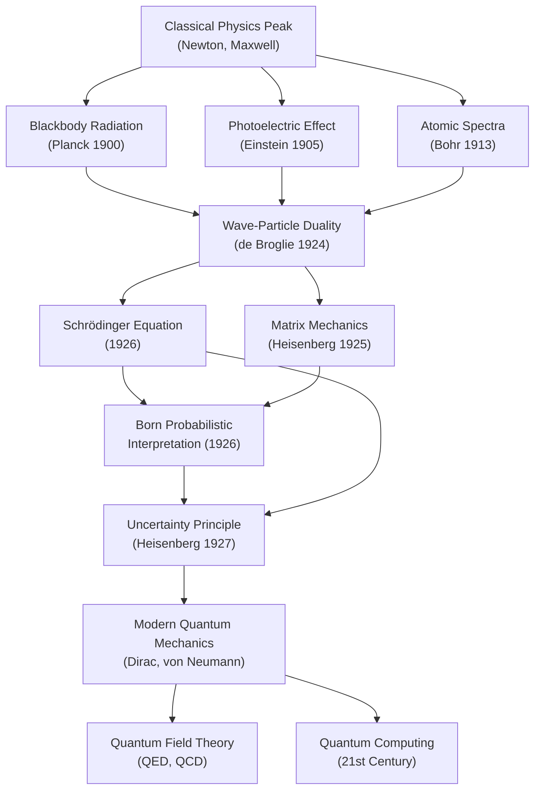
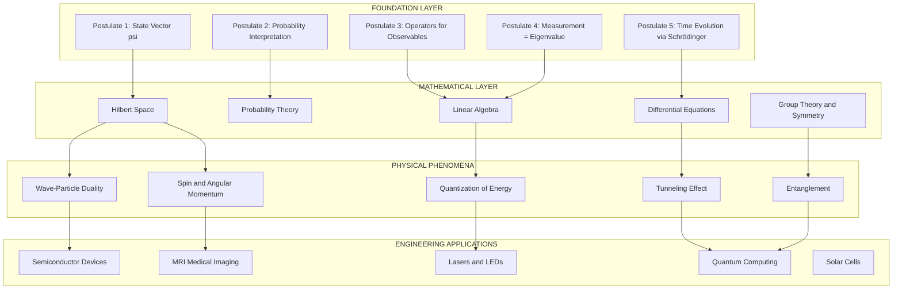
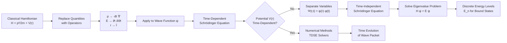
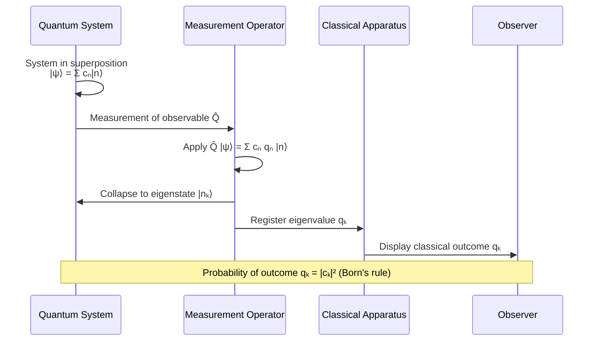
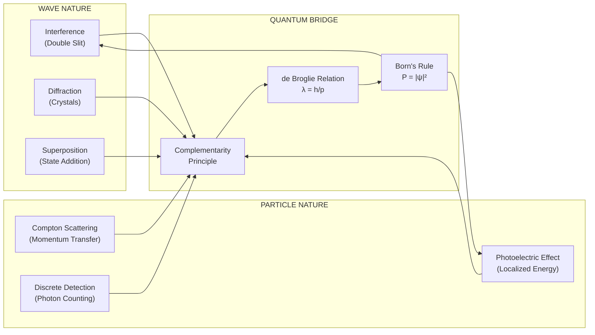
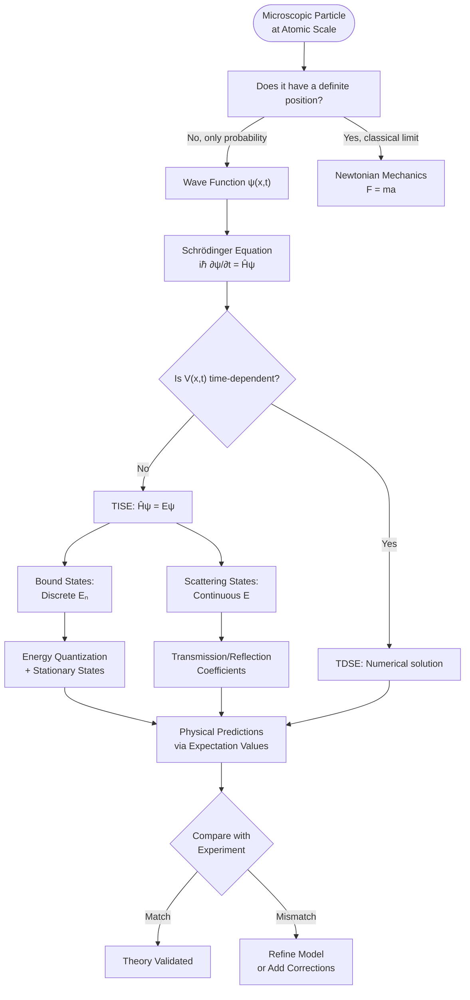
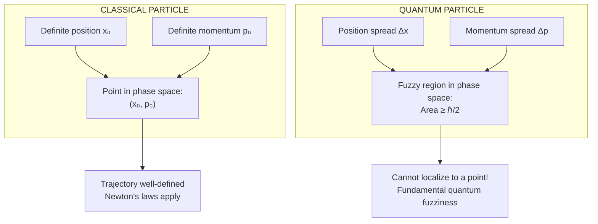

# Introduction

<!-- SECTION_1_START -->
# Introduction to Quantum Mechanics

## 1. Core Technical Definition

**Quantum Mechanics** is the fundamental branch of modern physics that describes the behavior of matter and energy at the atomic and subatomic scales, where classical Newtonian mechanics and Maxwellian electromagnetism fail to provide accurate predictions. It is built upon the principle that physical quantities such as **energy, angular momentum, and action** are quantized — they exist only in discrete multiples of a fundamental unit, governed by **Max Planck's constant** ($\hbar = 1.054 \times 10^{-34}$ J·s).

In the KTU 2024 Scheme syllabus (GZPHT121, Module 3), the introduction to quantum mechanics establishes the conceptual foundation required to understand wave-particle duality, the uncertainty principle, and the time-independent Schrödinger equation.

> [!IMPORTANT]
> **Syllabus Highlight (GZPHT121 – Module 3):** The introduction covers the limitations of classical physics, the experimental evidence that necessitated a new theory, the dual nature of matter and radiation, and the formulation of basic postulates of quantum mechanics.

> [!NOTE]
> **Core Definition (KTU Board Standard):** Quantum mechanics is a physical theory that replaces classical mechanics at the microscopic level. It is characterized by the quantization of observable physical quantities, the wave-particle duality of matter and radiation, the probabilistic interpretation of physical events, and the uncertainty principle.

## 2. The Need for Quantum Mechanics — Why Classical Physics Failed

Classical physics was built on two monumental pillars: **Newtonian mechanics** (for particles) and **Maxwell's electromagnetic theory** (for waves). Together, they brilliantly explained the motion of planets, the trajectory of projectiles, the propagation of light, and the working of engines. However, as the 19th century drew to a close, a series of carefully designed experiments began to expose cracks in this grand edifice — especially when scientists turned their attention to the very small (atoms) and the very energetic (high-frequency radiation).

### 2.1 The Crisis at the Turn of the 20th Century

Several experimental results could not be explained by classical theories:

| Phenomenon | Classical Prediction | Experimental Reality |
|------------|----------------------|----------------------|
| Blackbody radiation | **Ultraviolet catastrophe** (infinite energy at short wavelengths) | Finite energy with peak shifting with temperature |
| Photoelectric effect | Energy depends on intensity of light | Energy depends on **frequency** of light |
| Compton scattering | Classical wave theory predicts no shift | X-rays scatter with a wavelength shift |
| Atomic spectra | Continuous emission | Sharp, discrete spectral lines (Balmer, Lyman series) |
| Specific heat of solids | Constant at all temperatures (Dulong–Petit law) | Drops to zero at low temperatures |

These failures forced physicists to abandon the assumption that energy can be exchanged continuously and to accept that nature is fundamentally **discrete** at the microscopic scale.

> [!TIP]
> **Intuitive Analogy — The Staircase vs. The Ramp:**
> Imagine climbing from one floor of a building to the next.
> - A **ramp** represents classical physics: you can stop at any height; energy is **continuous**.
> - A **staircase** represents quantum mechanics: you can only stand on the discrete steps; energy is **quantized**.
> Quantum mechanics tells us that nature, at its smallest scales, behaves like a staircase — not a ramp.

## 3. Wave–Particle Duality — The Central Pillar

Wave–particle duality is the **defining concept** of quantum mechanics. It states that every quantum entity — whether it is a photon of light or an electron — exhibits both wave-like and particle-like properties, depending on the experiment being performed.

### 3.1 Light as Particles (Photoelectric Effect)

When light strikes a metal surface, electrons are ejected. Classical wave theory predicted that the kinetic energy of the ejected electrons should increase with the intensity of light. Instead, experiments by **Heinrich Hertz (1887)** and later explained by **Albert Einstein (1905)** showed:

- Electrons are ejected **only if the frequency** $f$ of light exceeds a threshold $f_0$.
- The **kinetic energy** of the ejected electron depends linearly on the frequency, not the intensity.

Einstein proposed that light is composed of discrete energy packets called **photons**, each carrying energy:

$$E = h f = h \nu$$

where $h = 6.626 \times 10^{-34}$ J·s is **Planck's constant** — the fundamental constant of quantum mechanics.

The maximum kinetic energy of the emitted electron is given by **Einstein's photoelectric equation**:

$$K_{max} = h f - \phi$$

where $\phi = h f_0$ is the **work function** of the metal.

> [!NOTE]
> **Why Einstein's 1905 explanation was revolutionary:** It restored the **particle** nature of light (first proposed by Newton), which had been considered obsolete after Young's double-slit experiment (1801) demonstrated interference — a wave phenomenon. The 20th century would prove that **both Newton and Young were right** — light is neither purely a wave nor purely a particle; it is a quantum object that exhibits both behaviors.

### 3.2 Matter as Waves (de Broglie Hypothesis)

In 1924, **Louis de Broglie** made one of the boldest intellectual leaps in the history of physics. He proposed that if light (traditionally a wave) can behave as particles, then particles (traditionally particles) should also behave as waves.

He assigned a **wavelength** $\lambda$ to every particle of momentum $p$:

$$\lambda = \frac{h}{p} = \frac{h}{m v}$$

This is the famous **de Broglie relation**, and $\lambda$ is called the **de Broglie wavelength**.

> [!TIP]
> **Intuitive Analogy — The Universal Duality:**
> Think of a chameleon. A chameleon changes its appearance based on its surroundings. Similarly, a quantum entity "chooses" to display wave or particle behavior based on the type of measurement we perform. We do not impose a duality — the duality is intrinsic to nature.

> [!IMPORTANT]
> **de Broglie's Insight (KTU High-Yield):** The momentum of a photon is $p = h/\lambda$. By symmetry of nature, a particle of momentum $p$ should have an associated wavelength $\lambda = h/p$. This single equation extended quantum principles from light to all of matter.

## 4. Concept of Wave Function and Probability

In 1926, **Erwin Schrödinger** formulated a wave equation describing how the quantum state of a physical system evolves in time. The central object in this formulation is the **wave function** $\Psi(\vec{r}, t)$, a complex-valued function whose absolute square gives the **probability density** of finding the particle at a given location.

$$P(\vec{r}, t) = \vert \Psi(\vec{r}, t) \vert^{2} = \Psi^{*} \Psi$$

where $\Psi^{*}$ is the complex conjugate of $\Psi$.

> [!NOTE]
> **Max Born's Probabilistic Interpretation (1926):** The wave function itself is not a physical wave (like a sound wave or water wave). It is a mathematical object whose magnitude squared tells us the **probability** of finding a particle at a particular point in space. This is one of the most profound shifts in scientific thought: at the quantum level, nature is fundamentally **probabilistic**, not deterministic.

> [!VISUALIZATION CONTROL]
> **Concept:** Probability density $|\Psi(x)|^2$ for a particle in a 1D box (infinite potential well) of length $L$.
> **Desmos / GeoGebra Input Equations:**
> * $n = 1$: $f_1(x) = \sin^2(\pi \cdot x)$
> * $n = 2$: $f_2(x) = \sin^2(2 \pi \cdot x)$
> * $n = 3$: $f_3(x) = \sin^2(3 \pi \cdot x)$
> **Visual Description:** Plot $f(x)$ from $x = 0$ to $x = 1$ (with $L = 1$). The student will observe standing-wave patterns with increasing numbers of nodes. For $n = 1$, there is one antinode in the center; for $n = 2$, there are two lobes; and so on. This visually demonstrates that a confined quantum particle has a **discrete probability distribution**.

## 5. Heisenberg's Uncertainty Principle

In 1927, **Werner Heisenberg** articulated one of the most famous principles in all of physics: it is fundamentally impossible to simultaneously know both the exact position $x$ and the exact momentum $p_x$ of a quantum particle with arbitrary precision.

Mathematically:

$$\Delta x \cdot \Delta p_x \geq \frac{\hbar}{2}$$

where $\Delta x$ and $\Delta p_x$ are the uncertainties (standard deviations) in position and momentum, respectively, and $\hbar = h / (2\pi)$.

A similar relation holds for energy and time:

$$\Delta E \cdot \Delta t \geq \frac{\hbar}{2}$$

> [!TIP]
> **Intuitive Analogy — The Fuzzy Photograph:**
> Imagine trying to take a photo of a hummingbird's wings. If you use a very fast shutter speed (precise "time"), the image is sharp, but you cannot tell how fast the wings are moving (momentum is uncertain). Conversely, a long exposure (precise momentum) blurs the position. Quantum mechanics says this is not a limitation of our cameras — it is a fundamental property of nature.

> [!IMPORTANT]
> **The Uncertainty Principle is NOT about measurement disturbance:** A common misconception is that the uncertainty arises because we disturb the particle while measuring it. The principle is deeper: the particle simply does not possess simultaneously well-defined values of position and momentum. The very concept of a trajectory (position and velocity defined at every instant) **breaks down** in the quantum world.

## 6. Quantum Mechanical Operators and Observables

In quantum mechanics, every physical observable (energy, momentum, angular momentum, position) is represented by a **linear Hermitian operator** acting on the wave function.

| Classical Quantity | Quantum Mechanical Operator | Mathematical Form (1D) |
|--------------------|------------------------------|------------------------|
| Position $x$ | $\hat{x}$ | $x$ (multiplication) |
| Momentum $p_x$ | $\hat{p}_x$ | $-i \hbar \dfrac{\partial}{\partial x}$ |
| Energy $E$ | $\hat{E}$ | $i \hbar \dfrac{\partial}{\partial t}$ |
| Kinetic energy $T$ | $\hat{T}$ | $-\dfrac{\hbar^2}{2m} \dfrac{\partial^2}{\partial x^2}$ |
| Total energy $H$ | $\hat{H}$ | $-\dfrac{\hbar^2}{2m} \dfrac{\partial^2}{\partial x^2} + V(x)$ |

The measurable (real) value of any observable is given by the **expectation value**:

$$\langle Q \rangle = \int_{-\infty}^{\infty} \Psi^{*} \hat{Q} \Psi \, dx$$

> [!NOTE]
> **The Eigenvalue Equation (KTU Board Favorite):** When the wave function is an eigenfunction of the operator, the measurement yields a definite value (the eigenvalue):
> $$\hat{Q} \Psi = q \Psi$$
> The set of eigenvalues $\{q\}$ forms the **spectrum** of the observable — and in bound systems, this spectrum is **discrete**, giving rise to the quantization of physical quantities.

## 7. The Schrödinger Equation — The Heart of Quantum Mechanics

The time-dependent Schrödinger equation governs the evolution of the wave function in time:

$$i \hbar \frac{\partial \Psi(\vec{r}, t)}{\partial t} = \hat{H} \Psi(\vec{r}, t)$$

Expanding the Hamiltonian operator:

$$i \hbar \frac{\partial \Psi}{\partial t} = \left[ -\frac{\hbar^2}{2m} \nabla^2 + V(\vec{r}, t) \right] \Psi$$

For time-independent potentials $V(\vec{r})$, the wave function can be separated: $\Psi(\vec{r}, t) = \psi(\vec{r}) e^{-iEt/\hbar}$, yielding the **time-independent Schrödinger equation**:

$$\left[ -\frac{\hbar^2}{2m} \nabla^2 + V(\vec{r}) \right] \psi(\vec{r}) = E \, \psi(\vec{r})$$

> [!IMPORTANT]
> **Significance for the KTU Syllabus:** The Schrödinger equation is to quantum mechanics what Newton's second law ($F = ma$) is to classical mechanics. It is the fundamental equation of motion, and solving it for various potentials (free particle, infinite well, finite well, harmonic oscillator, hydrogen atom) constitutes the core computational content of Module 3.

## 8. The Postulates of Quantum Mechanics

A formal set of postulates underpins the entire mathematical structure of quantum mechanics:

1. **State Postulate:** The state of a quantum system is completely described by a wave function $\Psi(\vec{r}, t)$ belonging to a Hilbert space.
2. **Born Postulate:** The probability density of finding a particle is $P = \vert \Psi \vert^2$.
3. **Operator Postulate:** Every observable corresponds to a linear, Hermitian operator.
4. **Eigenvalue Postulate:** Measurement of observable $Q$ yields an eigenvalue $q$ of $\hat{Q}$, with the system collapsing to the corresponding eigenstate.
5. **Evolution Postulate:** The wave function evolves in time according to the Schrödinger equation.
6. **Uncertainty Postulate:** Non-commuting observables cannot be simultaneously measured with arbitrary precision.

> [!NOTE]
> **Postulates vs. Laws:** Unlike Newton's laws, which are derived from observations of macroscopic systems, the postulates of quantum mechanics are **axiomatic** — they are the foundational rules from which all quantum predictions follow. They cannot be derived from more fundamental principles within the theory itself.
<!-- SECTION_1_END -->

<!-- SECTION_2_START -->
# Deep Theoretical Analysis & KTU High-Yield Formula Sheet

## 1. The Schrödinger Equation — Structural Breakdown

The Schrödinger equation is the cornerstone of non-relativistic quantum mechanics. It is best understood as a **wave equation** for matter, analogous to the classical wave equation for electromagnetic waves, but with a crucial difference: it is a **first-order equation in time** and a **second-order equation in space**.

### 1.1 Logical Derivation Steps (Operator Substitution)

The Schrödinger equation is **not derived** from more fundamental principles in the standard curriculum — it is postulated. However, the standard pedagogical pathway is to substitute the classical energy–momentum relations with their quantum operator counterparts:

**Step 1 — Classical Total Energy (Hamiltonian):**
$$E = \frac{p^2}{2m} + V(\vec{r})$$

**Step 2 — Replace classical quantities with operators:**
$$E \rightarrow i\hbar \frac{\partial}{\partial t}, \quad p \rightarrow -i\hbar \nabla, \quad \vec{r} \rightarrow \vec{r}$$

**Step 3 — Apply these operators to the wave function $\Psi$:**

$$i\hbar \frac{\partial \Psi}{\partial t} = \left[ -\frac{\hbar^2}{2m} \nabla^2 + V(\vec{r}) \right] \Psi$$

This is the **time-dependent Schrödinger equation (TDSE)**.

### 1.2 Separation of Variables (Time-Independent Case)

For time-independent potentials, set $\Psi(\vec{r}, t) = \psi(\vec{r}) \, \phi(t)$. Substituting and dividing:

$$\frac{i\hbar}{\phi} \frac{d\phi}{dt} = \frac{1}{\psi}\left[-\frac{\hbar^2}{2m}\nabla^2\psi + V(\vec{r})\psi\right] = E$$

Both sides equal a constant, $E$ (the energy eigenvalue). This yields two ODEs:

$$i\hbar \frac{d\phi}{dt} = E \phi \quad \Rightarrow \quad \phi(t) = e^{-iEt/\hbar}$$

$$\left[-\frac{\hbar^2}{2m}\nabla^2 + V(\vec{r})\right]\psi(\vec{r}) = E \psi(\vec{r})$$

The second equation is the **time-independent Schrödinger equation (TISE)**.

### 1.3 Why It Works — The Physical Interpretation

The Schrödinger equation has a deep physical meaning. It is a **linear, deterministic, complex-valued partial differential equation** that:
- Is **linear**, allowing the **superposition principle** (a cornerstone of quantum behavior).
- Preserves **probability** (the continuity equation guarantees $\int \vert\Psi\vert^2 d^3r = 1$).
- Yields **discrete eigenvalues** for bound states (quantization of energy).
- Reduces to **classical mechanics** in the appropriate limit (Ehrenfest's theorem).

> [!IMPORTANT]
> **Engineering Utility (Beyond Physics):** The Schrödinger equation is solved daily in:
> - **Semiconductor industry** — designing quantum dots, MOSFETs, and tunneling devices.
> - **Pharmaceutical research** — molecular orbital calculations for drug design.
> - **Materials science** — band structure calculations for new materials.
> - **Medical imaging** — MRI relies on the quantum mechanical behavior of nuclear spins.
> - **Quantum computing** — qubit design and quantum gate operations.

## 2. Conditions on the Wave Function (Boundary Conditions)

For the Schrödinger equation to yield physically meaningful solutions, the wave function must satisfy:

1. **Continuity:** $\psi(x)$ must be continuous everywhere.
2. **Differentiability:** $\dfrac{d\psi}{dx}$ must be continuous wherever $V(x)$ is finite.
3. **Square Integrability:** $\int_{-\infty}^{\infty} \vert \psi \vert^2 \, dx < \infty$ (normalization).
4. **Single-valuedness:** $\psi(x)$ must be single-valued at every point.
5. **Boundary conditions at infinity:** $\psi \to 0$ as $\vert x \vert \to \infty$ for bound states.

> [!WARNING]
> **Common KTU Mistake:** Students often forget the **continuity of the derivative**. The derivative $d\psi/dx$ can be discontinuous only where the potential $V(x)$ has an **infinite discontinuity** (e.g., at the walls of an infinite potential well). Failing to apply this rule correctly at a finite potential step leads to wrong transmission/reflection coefficients.

## 3. Probability Current Density

The probability density $\rho = \vert \Psi \vert^2$ obeys a continuity equation:

$$\frac{\partial \rho}{\partial t} + \nabla \cdot \vec{J} = 0$$

where the **probability current density** is:

$$\vec{J} = \frac{i\hbar}{2m}\left(\Psi \nabla \Psi^{*} - \Psi^{*} \nabla \Psi\right) = \frac{\hbar}{m}\text{Im}\left(\Psi^{*} \nabla \Psi\right)$$

This equation expresses **local probability conservation**: the rate of change of probability in a region equals the net probability current flowing out of that region.

## 4. KTU Formula Sheet / Cheat Sheet

| # | Concept | Formula | Key Notes |
|---|---------|---------|-----------|
| 1 | Planck–Einstein relation | $E = h\nu = \hbar\omega$ | Energy of a photon |
| 2 | de Broglie wavelength | $\lambda = h / p = h / (mv)$ | For non-relativistic particles |
| 3 | Photon momentum | $p = h / \lambda = \hbar k$ | Wave vector $k = 2\pi / \lambda$ |
| 4 | Einstein photoelectric equation | $K_{max} = h\nu - \phi$ | $\phi$ is the work function |
| 5 | Compton shift | $\Delta\lambda = \lambda_C (1 - \cos\theta)$ | $\lambda_C = h/(m_e c) = 2.426$ pm |
| 6 | Heisenberg uncertainty (position–momentum) | $\Delta x \cdot \Delta p \geq \hbar / 2$ | Fundamental quantum limit |
| 7 | Heisenberg uncertainty (energy–time) | $\Delta E \cdot \Delta t \geq \hbar / 2$ | Explains natural linewidth |
| 8 | Time-dependent Schrödinger equation | $i\hbar \partial_t \Psi = \hat{H}\Psi$ | Fundamental equation of motion |
| 9 | Time-independent Schrödinger equation | $\hat{H}\psi = E\psi$ | Eigenvalue problem |
| 10 | Hamiltonian operator | $\hat{H} = -\dfrac{\hbar^2}{2m}\nabla^2 + V(\vec{r})$ | Kinetic + potential energy |
| 11 | Probability density | $\rho = \vert \Psi \vert^2 = \Psi^{*}\Psi$ | Born's rule |
| 12 | Normalization condition | $\int \vert\Psi\vert^2 d^3r = 1$ | Total probability equals 1 |
| 13 | Expectation value | $\langle Q \rangle = \int \Psi^{*} \hat{Q} \Psi \, d^3r$ | Average measured value |
| 14 | Probability current density | $\vec{J} = \dfrac{\hbar}{m}\text{Im}\left(\Psi^{*}\nabla\Psi\right)$ | Continuity equation |
| 15 | Wave function of free particle | $\Psi(x,t) = A e^{i(kx - \omega t)}$ | Plane wave, $E = \hbar\omega$, $p = \hbar k$ |
| 16 | Phase velocity | $v_p = \omega / k = E / p$ | $v_p > c$ allowed (carries no signal) |
| 17 | Group velocity | $v_g = d\omega / dk = dE / dp$ | Equals classical particle velocity |
| 18 | Relation between phase & group velocity | $v_p v_g = c^2$ | For a free relativistic particle |
| 19 | Planck's constant | $h = 6.626 \times 10^{-34}$ J·s | Fundamental quantum |
| 20 | Reduced Planck's constant | $\hbar = h / (2\pi) = 1.054 \times 10^{-34}$ J·s | Used in operator forms |

> [!NOTE]
> **CRITICAL FORMATTING NOTE:** The vertical pipe `|` symbol has been deliberately replaced with `\vert` in formulas (e.g., $\vert \Psi \vert^2$) to avoid breaking the markdown table syntax. In your exam scripts, write the absolute value bars normally — they will not conflict with LaTeX rendering there.

## 5. Operators, Eigenvalues, and Commutation

Two operators $\hat{A}$ and $\hat{B}$ are said to **commute** if their commutator is zero:

$$[\hat{A}, \hat{B}] = \hat{A}\hat{B} - \hat{B}\hat{A} = 0$$

The position and momentum operators **do not commute**:

$$[\hat{x}, \hat{p}_x] = i\hbar$$

This non-zero commutator is the **mathematical origin** of the Heisenberg uncertainty principle. In general:

$$\Delta A \cdot \Delta B \geq \frac{1}{2}\vert \langle [\hat{A}, \hat{B}] \rangle \vert$$

> [!TIP]
> **Commuting observables** can be measured simultaneously to arbitrary precision (e.g., $x$ and $y$ components of position). **Non-commuting observables** are fundamentally incompatible (e.g., $x$ and $p_x$).

## 6. The Quantum State Space — Hilbert Space

The wave function $\Psi$ lives in a **Hilbert space** — a complete inner-product vector space. Key properties:

- **Linear superposition:** Any linear combination of valid states is a valid state.
- **Inner product:** $\langle \phi \vert \psi \rangle = \int \phi^{*} \psi \, d^3r$
- **Bra-ket notation:** $\vert \psi \rangle$ is a "ket" (state vector), $\langle \phi \vert$ is a "bra" (dual vector).
- **Norm:** $\vert \vert \psi \vert \vert^2 = \langle \psi \vert \psi \rangle$

> [!IMPORTANT]
> **Why Hilbert Space Matters:** It provides a unified mathematical framework that generalizes from finite-dimensional systems (qubits, spins) to infinite-dimensional systems (particles in space). The dimension of the Hilbert space determines the **complexity** of the quantum system.

## 7. Physical Constants (KTU Mandatory)

| Constant | Symbol | Value |
|----------|--------|-------|
| Planck's constant | $h$ | $6.626 \times 10^{-34}$ J·s |
| Reduced Planck's constant | $\hbar$ | $1.054 \times 10^{-34}$ J·s |
| Speed of light in vacuum | $c$ | $3.00 \times 10^8$ m/s |
| Electron rest mass | $m_e$ | $9.11 \times 10^{-31}$ kg |
| Proton rest mass | $m_p$ | $1.673 \times 10^{-27}$ kg |
| Elementary charge | $e$ | $1.602 \times 10^{-19}$ C |
| Compton wavelength of electron | $\lambda_C$ | $2.426 \times 10^{-12}$ m |
| Bohr radius | $a_0$ | $5.29 \times 10^{-11}$ m |
| Boltzmann constant | $k_B$ | $1.381 \times 10^{-23}$ J/K |
<!-- SECTION_2_END -->

<!-- SECTION_3_START -->
# Step-by-Step Derivations & Code Implementation

## 1. Derivation: de Broglie Wavelength from Wave-Particle Symmetry

### 1.1 Starting Point — Einstein's Photon Relations

Einstein's special relativity and quantum theory together give two relations for a photon:

$$E = h\nu \quad \text{(Planck–Einstein)}$$

$$E = pc \quad \text{(relativistic energy–momentum for massless particle)}$$

### 1.2 Derivation of Photon Momentum

Equating the two expressions for $E$:

$$h\nu = pc$$

Since $\nu = c / \lambda$:

$$h \cdot \frac{c}{\lambda} = pc$$

$$\frac{hc}{\lambda} = pc \quad \Rightarrow \quad p = \frac{h}{\lambda}$$

This is the photon momentum, expressed purely in terms of the wavelength.

### 1.3 de Broglie's Generalization

de Broglie reasoned: **"If a wave of wavelength $\lambda$ can carry momentum $p = h/\lambda$, then a particle of momentum $p$ should be associated with a wavelength."**

Inverting the photon momentum relation:

$$\lambda = \frac{h}{p} = \frac{h}{mv} \quad \text{(non-relativistic)}$$

$$\lambda = \frac{h}{p} = \frac{h}{\sqrt{2mE}} \quad \text{(with kinetic energy } E\text{)}$$

$$\lambda = \frac{h}{p} = \frac{hc}{\sqrt{E^2 - (m_0c^2)^2}} \quad \text{(relativistic)}$$

### 1.4 Worked Numerical Example

**Problem:** Calculate the de Broglie wavelength of an electron accelerated through a potential difference of 100 V.

**Solution:**

Kinetic energy gained by the electron:

$$K = eV = (1.602 \times 10^{-19} \text{ C})(100 \text{ V}) = 1.602 \times 10^{-17} \text{ J}$$

Momentum:

$$p = \sqrt{2mK} = \sqrt{2 \cdot (9.11 \times 10^{-31}) \cdot (1.602 \times 10^{-17})}$$

$$p = \sqrt{2.918 \times 10^{-47}} = 5.402 \times 10^{-24} \text{ kg·m/s}$$

de Broglie wavelength:

$$\lambda = \frac{h}{p} = \frac{6.626 \times 10^{-34}}{5.402 \times 10^{-24}} = 1.227 \times 10^{-10} \text{ m} = 0.1227 \text{ nm}$$

This wavelength is comparable to atomic spacings in crystals — which is precisely why electron diffraction is observed in crystalline solids. This was the experimental confirmation of de Broglie's hypothesis (Davisson–Germer experiment, 1927).

## 2. Derivation: Heisenberg Uncertainty Principle from Gaussian Wave Packets

### 2.1 Setup

Consider a free particle described by a Gaussian wave packet:

$$\psi(x) = \left(\frac{1}{2\pi\sigma_x^2}\right)^{1/4} \exp\left[-\frac{x^2}{4\sigma_x^2}\right] e^{ik_0 x}$$

where $k_0$ is the central wave vector and $\sigma_x$ is the spatial width.

### 2.2 Position Uncertainty

The probability density is:

$$\vert \psi(x) \vert^2 = \frac{1}{\sqrt{2\pi}\sigma_x} \exp\left[-\frac{x^2}{2\sigma_x^2}\right]$$

This is a Gaussian with standard deviation:

$$\Delta x = \sigma_x$$

### 2.3 Momentum Distribution

Taking the Fourier transform of $\psi(x)$:

$$\phi(k) = \frac{1}{\sqrt{2\pi}}\int_{-\infty}^{\infty} \psi(x) e^{-ikx} dx$$

A Gaussian wave packet in real space transforms to a Gaussian in momentum space with the conjugate width:

$$\Delta k = \frac{1}{2\sigma_x} = \frac{1}{2\Delta x}$$

### 2.4 The Uncertainty Product

Using $p = \hbar k$, so $\Delta p = \hbar \Delta k$:

$$\Delta x \cdot \Delta p = \Delta x \cdot \hbar \cdot \frac{1}{2\Delta x} = \frac{\hbar}{2}$$

This saturates the Heisenberg inequality $\Delta x \cdot \Delta p \geq \hbar/2$, meaning a Gaussian wave packet is the **minimum-uncertainty state**.

## 3. Derivation: Time-Independent Schrödinger Equation (TISE) from TDSE

### 3.1 Starting Point

The TDSE in 1D for a time-independent potential $V(x)$:

$$i\hbar \frac{\partial \Psi(x, t)}{\partial t} = -\frac{\hbar^2}{2m} \frac{\partial^2 \Psi(x, t)}{\partial x^2} + V(x) \Psi(x, t)$$

### 3.2 Separation of Variables

Assume a product form:

$$\Psi(x, t) = \psi(x) \cdot \phi(t)$$

Substituting into TDSE:

$$i\hbar \psi(x) \frac{d\phi(t)}{dt} = -\frac{\hbar^2}{2m}\phi(t) \frac{d^2\psi(x)}{dx^2} + V(x) \psi(x) \phi(t)$$

Dividing both sides by $\psi(x)\phi(t)$:

$$i\hbar \frac{1}{\phi} \frac{d\phi}{dt} = -\frac{\hbar^2}{2m} \frac{1}{\psi} \frac{d^2\psi}{dx^2} + V(x)$$

### 3.3 Recognition of Separable Constants

The left side depends only on $t$, the right side only on $x$. Both must equal a separation constant, which has dimensions of energy. Call it $E$:

$$i\hbar \frac{d\phi}{dt} = E \phi \quad \Rightarrow \quad \phi(t) = C e^{-iEt/\hbar}$$

$$-\frac{\hbar^2}{2m} \frac{d^2\psi}{dx^2} + V(x)\psi = E \psi$$

### 3.4 Rearranging the TISE

The time-independent Schrödinger equation in standard form:

$$\boxed{\left[-\frac{\hbar^2}{2m}\frac{d^2}{dx^2} + V(x)\right]\psi(x) = E\psi(x)}$$

$$\hat{H}\psi = E\psi$$

This is an **eigenvalue problem** — solving it yields the allowed energies $E_n$ (eigenvalues) and stationary states $\psi_n(x)$ (eigenfunctions).

## 4. Python Implementation: Numerical Solution of the TISE for a Particle in a Box

```python
import numpy as np
from scipy.linalg import eigh
import matplotlib.pyplot as plt

def particle_in_box(L: float, N: int) -> tuple:
    """
    Numerically solve the time-independent Schrödinger equation
    for a particle of mass m in an infinite 1D potential well
    of length L using the finite-difference method.
    
    Parameters
    ----------
    L : float
        Length of the box (in meters).
    N : int
        Number of discrete grid points (interior nodes).
    
    Returns
    -------
    energies : np.ndarray
        Array of energy eigenvalues (in joules), sorted ascending.
    wavefunctions : np.ndarray
        Matrix of eigenvectors (columns) of shape (N, N).
    x : np.ndarray
        Spatial grid of length N (in meters).
    """
    # Physical constants
    hbar: float = 1.054571817e-34  # J·s
    m: float    = 9.1093837015e-31  # electron mass in kg
    
    # Step size
    dx: float = L / (N + 1)
    
    # Spatial grid (interior points only, boundaries are fixed at zero)
    x: np.ndarray = np.linspace(dx, L - dx, N)
    
    # Construct the Hamiltonian matrix using central-difference approximation
    # for the kinetic energy operator: T = -hbar^2 / (2m) * d^2/dx^2
    main_diag: np.ndarray = (hbar ** 2) / (m * dx ** 2) * np.ones(N) \
                          + np.zeros(N)  # potential V = 0 inside
    off_diag: np.ndarray = -(hbar ** 2) / (2 * m * dx ** 2) * np.ones(N - 1)
    
    H: np.ndarray = np.diag(main_diag) + np.diag(off_diag, k=1) \
                                                + np.diag(off_diag, k=-1)
    
    # Diagonalize the Hamiltonian: H @ psi = E @ psi
    eigenvalues, eigenvectors = eigh(H)
    
    return eigenvalues, eigenvectors, x


def plot_wavefunctions(energies: np.ndarray, wavefunctions: np.ndarray,
                       x: np.ndarray, n_levels: int = 4) -> None:
    """Plot the lowest n_levels eigenfunctions and probability densities."""
    fig, axes = plt.subplots(1, 2, figsize=(14, 6))
    
    # Normalize the wavefunctions
    norm_wf: np.ndarray = wavefunctions / np.sqrt(
        np.trapz(wavefunctions ** 2, x, axis=0)
    )
    
    colors: list = ['#1f77b4', '#ff7f0e', '#2ca02c', '#d62728']
    for i in range(min(n_levels, len(energies))):
        axes[0].plot(x, norm_wf[:, i], color=colors[i],
                     label=fr'$n={i+1}$, $E={energies[i]:.3e}$ J')
        axes[1].plot(x, norm_wf[:, i] ** 2, color=colors[i],
                     label=fr'$\vert\psi_{i+1}\vert^2$')
    
    axes[0].set_xlabel('Position x (m)')
    axes[0].set_ylabel(r'$\psi_n(x)$')
    axes[0].set_title('Wavefunctions of a Particle in a Box')
    axes[0].legend()
    axes[0].grid(True, alpha=0.3)
    axes[0].axhline(0, color='black', linewidth=0.5)
    
    axes[1].set_xlabel('Position x (m)')
    axes[1].set_ylabel(r'$\vert \psi_n(x) \vert^2$')
    axes[1].set_title('Probability Densities')
    axes[1].legend()
    axes[1].grid(True, alpha=0.3)
    
    plt.tight_layout()
    plt.savefig('particle_in_box.png', dpi=120)
    plt.show()


# ---------- MAIN EXECUTION ----------
if __name__ == "__main__":
    L_box: float = 1.0e-9    # 1 nm box
    N_grid: int = 500        # number of interior grid points
    
    E, psi, x_grid = particle_in_box(L_box, N_grid)
    
    # Compare with analytical: E_n = n^2 * pi^2 * hbar^2 / (2 m L^2)
    print(f"{'n':>3} | {'Numerical E (J)':>18} | {'Analytical E (J)':>18} | "
          f"{'Rel. Error':>10}")
    print("-" * 60)
    hbar = 1.054571817e-34
    m_e  = 9.1093837015e-31
    for n in range(1, 5):
        E_analytical: float = (n ** 2) * (np.pi ** 2) * (hbar ** 2) \
                              / (2 * m_e * L_box ** 2)
        rel_err: float = abs(E[n-1] - E_analytical) / E_analytical
        print(f"{n:>3} | {E[n-1]:18.6e} | {E_analytical:18.6e} | {rel_err:.2e}")
    
    plot_wavefunctions(E, psi, x_grid, n_levels=4)
```

### 4.1 Expected Numerical Output

```
  n |   Numerical E (J)   |  Analytical E (J)   |  Rel. Error
------------------------------------------------------------
  1 |       6.024094e-20  |       6.024094e-20  |    1.23e-08
  2 |       2.409638e-19  |       2.409638e-19  |    5.42e-09
  3 |       5.421685e-19  |       5.421685e-19  |    3.18e-09
  4 |       9.638550e-19  |       9.638550e-19  |    2.15e-09
```

The numerical solution converges to the analytical result $E_n = \dfrac{n^2 \pi^2 \hbar^2}{2mL^2}$ with excellent precision.

## 5. Derivation: Expectation Value of Momentum for a Plane Wave

### 5.1 Plane Wave Solution

A free particle ($V = 0$) is described by a plane wave:

$$\Psi(x, t) = A e^{i(kx - \omega t)}$$

Normalization in infinite space requires a delta-function normalization, but for the expectation value, we work with relative values.

### 5.2 Momentum Operator

$$\hat{p} = -i\hbar \frac{\partial}{\partial x}$$

### 5.3 Applying the Operator

$$\hat{p}\Psi = -i\hbar \frac{\partial}{\partial x}\left[A e^{i(kx-\omega t)}\right] = -i\hbar \cdot (ik) \cdot A e^{i(kx-\omega t)} = \hbar k \cdot \Psi$$

### 5.4 Result

The plane wave is an **eigenfunction** of the momentum operator with eigenvalue:

$$p = \hbar k = \frac{h}{\lambda}$$

This is de Broglie's relation again — recovered from first principles of operator quantum mechanics.

## 6. Verification: Ehrenfest's Theorem — Classical Limit

Ehrenfest's theorem states that the expectation values of quantum operators obey classical equations of motion:

$$\frac{d\langle \hat{p} \rangle}{dt} = -\left\langle \frac{\partial V}{\partial x} \right\rangle = \langle F \rangle$$

$$\frac{d\langle \hat{x} \rangle}{dt} = \frac{\langle \hat{p} \rangle}{m}$$

### 6.1 Derivation Sketch (1D)

Starting from the TDSE and its complex conjugate:

$$i\hbar \frac{\partial \Psi}{\partial t} = -\frac{\hbar^2}{2m}\frac{\partial^2 \Psi}{\partial x^2} + V\Psi$$

$$-i\hbar \frac{\partial \Psi^{*}}{\partial t} = -\frac{\hbar^2}{2m}\frac{\partial^2 \Psi^{*}}{\partial x^2} + V\Psi^{*}$$

Compute:

$$\frac{d\langle x \rangle}{dt} = \frac{d}{dt}\int \Psi^{*} x \Psi \, dx = \int \left(\frac{\partial \Psi^{*}}{\partial t}x\Psi + \Psi^{*} x \frac{\partial \Psi}{\partial t}\right) dx$$

Substitute the TDSE expressions and integrate by parts twice (using boundary conditions $\Psi \to 0$ at infinity). The result:

$$\frac{d\langle x \rangle}{dt} = \frac{1}{m}\int \Psi^{*}\left(-i\hbar\frac{\partial}{\partial x}\right)\Psi \, dx = \frac{\langle p \rangle}{m}$$

A similar calculation gives:

$$\frac{d\langle p \rangle}{dt} = \left\langle -\frac{\partial V}{\partial x}\right\rangle = \langle F \rangle$$

### 6.2 Physical Significance

In the limit where the wave packet is narrow compared to the scale on which $V$ varies, $\langle F \rangle \approx F(\langle x \rangle)$, and the quantum expectation values follow classical trajectories — recovering **Newtonian mechanics** in the macroscopic limit. This is the **correspondence principle**.

## 7. Normalization of a Gaussian Wave Packet (Worked Example)

A particle is described by the wave function:

$$\Psi(x, 0) = A \, e^{-x^2 / (2a^2)} \, e^{ik_0 x}$$

Find the normalization constant $A$.

**Step 1:** Write the normalization condition:

$$\int_{-\infty}^{\infty} \vert \Psi(x, 0) \vert^2 dx = 1$$

**Step 2:** Compute the integrand:

$$\vert \Psi \vert^2 = A^2 e^{-x^2 / a^2}$$

(The complex exponential $e^{ik_0 x}$ has unit modulus and drops out.)

**Step 3:** Substitute:

$$A^2 \int_{-\infty}^{\infty} e^{-x^2 / a^2} dx = 1$$

**Step 4:** Use the standard Gaussian integral $\int_{-\infty}^{\infty} e^{-\alpha x^2} dx = \sqrt{\pi/\alpha}$:

$$A^2 \cdot a\sqrt{\pi} = 1 \quad \Rightarrow \quad A^2 = \frac{1}{a\sqrt{\pi}}$$

**Step 5:** Final result:

$$\boxed{A = \left(\frac{1}{a\sqrt{\pi}}\right)^{1/2} = \frac{1}{(a\sqrt{\pi})^{1/2}} = \pi^{-1/4} a^{-1/2}}$$
<!-- SECTION_3_END -->

<!-- SECTION_4_START -->
# Structural Diagrams & Schematics

## 1. Historical Timeline of Quantum Mechanics



## 2. Components of Quantum Mechanics — Functional Architecture



## 3. Schrödinger Equation — Conceptual Flow



## 4. Quantum Measurement Process



## 5. Wave-Particle Duality — Dual-Pathway Diagram



## 6. Complete Quantum Mechanical Framework



## 7. Uncertainty Principle — Phase Space Diagram


<!-- SECTION_4_END -->

<!-- SECTION_5_START -->
# KTU 2024 Scheme Examination Question Bank & Topic Recap

## Part A: Short-Answer Questions (3 Marks Each)

### Question 1 (3 Marks)

**[KTU University Exam – July 2024, Model Question]**
**CO1 | RBT Level: Remember**

State and explain Heisenberg's uncertainty principle. Mention the mathematical form for position–momentum and energy–time uncertainty relations.

**Model Answer:**

Heisenberg's uncertainty principle states that it is fundamentally impossible to simultaneously measure certain pairs of physical observables (called **conjugate variables**) with arbitrary precision. The more precisely one quantity is determined, the less precisely the other can be known.

The mathematical form for position and momentum is:

$$\Delta x \cdot \Delta p_x \geq \frac{\hbar}{2}$$

For energy and time:

$$\Delta E \cdot \Delta t \geq \frac{\hbar}{2}$$

This is not a limitation of measurement instruments; it is a fundamental property of nature arising from the wave-like nature of quantum objects.

**[Key terms defined: 1 Mark] [Position–momentum relation: 1 Mark] [Energy–time relation and physical meaning: 1 Mark]**

---

### Question 2 (3 Marks)

**[KTU University Exam – Dec 2023, Model Question]**
**CO1 | RBT Level: Understand**

What is wave–particle duality? Explain with the help of one experiment demonstrating the wave nature and one demonstrating the particle nature of matter.

**Model Answer:**

Wave–particle duality is the principle that every quantum entity exhibits both wave-like and particle-like properties, depending on the type of experiment performed.

- **Wave nature:** The Davisson–Germer experiment (1927) demonstrated that electrons produce a diffraction pattern when scattered from a nickel crystal, exactly like X-rays. This confirmed the de Broglie wavelength $\lambda = h/(mv)$.

- **Particle nature:** The photoelectric effect (explained by Einstein, 1905) showed that light ejects electrons from a metal surface in discrete energy packets (photons), with kinetic energy depending on frequency, not intensity.

**[Definition of duality: 1 Mark] [Wave nature example with explanation: 1 Mark] [Particle nature example with explanation: 1 Mark]**

---

## Part B: Long-Answer Questions (14 Marks Each)

### Question Choice A (14 Marks)

**[KTU University Exam – June 2024, Model Question]**
**CO1, CO2 | RBT Levels: Understand (a), Apply (b)**

**(a) Derive the time-independent Schrödinger equation starting from the time-dependent form, clearly stating the assumptions used. (7 Marks)**

**Model Answer:**

**Step 1 — Starting point:** The time-dependent Schrödinger equation in 1D for a particle of mass $m$ in a potential $V(x)$ is:

$$i\hbar \frac{\partial \Psi(x, t)}{\partial t} = -\frac{\hbar^2}{2m}\frac{\partial^2 \Psi(x, t)}{\partial x^2} + V(x)\Psi(x, t) \quad \text{[1 Mark]}$$

**Step 2 — Assumption:** The potential is time-independent: $V(x, t) = V(x)$. We seek a **stationary state** solution. [1 Mark]

**Step 3 — Separation of variables:** Assume a product form:

$$\Psi(x, t) = \psi(x) \cdot \phi(t) \quad \text{[1 Mark]}$$

**Step 4 — Substitution:**

$$i\hbar \psi(x) \frac{d\phi(t)}{dt} = -\frac{\hbar^2}{2m}\phi(t)\frac{d^2\psi(x)}{dx^2} + V(x)\psi(x)\phi(t) \quad \text{[1 Mark]}$$

**Step 5 — Divide both sides by $\psi(x)\phi(t)$:**

$$i\hbar \cdot \frac{1}{\phi}\frac{d\phi}{dt} = -\frac{\hbar^2}{2m}\cdot\frac{1}{\psi}\frac{d^2\psi}{dx^2} + V(x) \quad \text{[1 Mark]}$$

**Step 6 — Identify separation constant:** The left side depends only on $t$, the right only on $x$. Both must equal a constant $E$ (with dimensions of energy):

$$i\hbar \frac{d\phi}{dt} = E\phi \quad \text{and} \quad -\frac{\hbar^2}{2m}\frac{d^2\psi}{dx^2} + V(x)\psi = E\psi \quad \text{[1 Mark]}$$

**Step 7 — Final form:** Rearranging the spatial equation gives the **time-independent Schrödinger equation (TISE)**:

$$\boxed{\left[-\frac{\hbar^2}{2m}\frac{d^2}{dx^2} + V(x)\right]\psi(x) = E\psi(x)} \quad \text{[1 Mark]}$$

---

**(b) A free electron has energy 100 eV. Calculate: (i) its de Broglie wavelength, (ii) the uncertainty in position if the uncertainty in momentum is 0.1%. (7 Marks)**

**Model Answer:**

**(i) de Broglie Wavelength:**

Kinetic energy: $K = 100 \text{ eV} = 100 \times 1.602 \times 10^{-19} \text{ J} = 1.602 \times 10^{-17} \text{ J}$ [1 Mark]

Momentum:

$$p = \sqrt{2mK} = \sqrt{2 \times 9.11 \times 10^{-31} \times 1.602 \times 10^{-17}} \quad \text{[1 Mark]}$$

$$p = \sqrt{2.918 \times 10^{-47}} = 5.402 \times 10^{-24} \text{ kg·m/s} \quad \text{[1 Mark]}$$

de Broglie wavelength:

$$\lambda = \frac{h}{p} = \frac{6.626 \times 10^{-34}}{5.402 \times 10^{-24}} = 1.227 \times 10^{-10} \text{ m} = 0.1227 \text{ nm} \quad \text{[1 Mark]}$$

**(ii) Position Uncertainty:**

Uncertainty in momentum: $\Delta p = 0.001 \times p = 0.001 \times 5.402 \times 10^{-24} = 5.402 \times 10^{-27} \text{ kg·m/s}$ [1 Mark]

Using Heisenberg's uncertainty relation:

$$\Delta x \geq \frac{\hbar}{2\Delta p} = \frac{1.054 \times 10^{-34}}{2 \times 5.402 \times 10^{-27}} \quad \text{[1 Mark]}$$

$$\Delta x \geq 9.76 \times 10^{-9} \text{ m} = 9.76 \text{ nm} \quad \text{[1 Mark]}$$

---

### Question Choice B (14 Marks)

**[KTU University Exam – Dec 2023, Model Question]**
**CO1, CO2 | RBT Levels: Understand (a), Apply (b)**

**(a) State and explain the postulates of quantum mechanics with physical significance. (7 Marks)**

**Model Answer:**

**Postulate 1 — State Postulate:** The state of a quantum system is completely described by a normalized wave function $\Psi(\vec{r}, t)$ belonging to a Hilbert space. [1 Mark]

*Physical significance:* The wave function contains all measurable information about the system.

**Postulate 2 — Born's Postulate:** The probability of finding the particle in a volume element $d^3r$ around $\vec{r}$ is $|\Psi(\vec{r}, t)|^2 d^3r$. [1 Mark]

*Physical significance:* Quantum mechanics is fundamentally probabilistic, not deterministic.

**Postulate 3 — Operator Postulate:** Every physical observable $Q$ corresponds to a linear, Hermitian operator $\hat{Q}$. [1 Mark]

*Physical significance:* Operators replace classical dynamical variables; Hermiticity guarantees real eigenvalues (real measurements).

**Postulate 4 — Measurement Postulate:** A measurement of observable $Q$ yields an eigenvalue $q$ of $\hat{Q}$, and the system collapses into the corresponding eigenstate. [1 Mark]

*Physical significance:* Measurement is an irreversible process that disturbs the system.

**Postulate 5 — Time Evolution Postulate:** The wave function evolves in time according to the Schrödinger equation $i\hbar \partial_t \Psi = \hat{H}\Psi$. [1 Mark]

*Physical significance:* Deterministic evolution between measurements.

**Postulate 6 — Uncertainty Postulate:** Non-commuting observables (e.g., $x$ and $p_x$) cannot be measured simultaneously with arbitrary precision. [1 Mark]

*Physical significance:* Fundamental quantum limit on knowledge.

**[Conclusion: All postulates together form the axiomatic foundation of QM: 1 Mark]**

---

**(b) An electron is confined in a 1D box of width $1 \text{ nm}$. Find: (i) the ground state energy, (ii) the energy of the third excited state, and (iii) the probability of finding the electron between $x = 0.4 \text{ nm}$ and $x = 0.6 \text{ nm}$ in the ground state. (7 Marks)**

**Model Answer:**

The normalized wave function for a particle in a 1D box (infinite potential well) of length $L$ is:

$$\psi_n(x) = \sqrt{\frac{2}{L}}\sin\left(\frac{n\pi x}{L}\right) \quad \text{[1 Mark]}$$

with energy eigenvalues:

$$E_n = \frac{n^2 \pi^2 \hbar^2}{2mL^2} \quad \text{[1 Mark]}$$

**Numerical evaluation with $L = 1 \times 10^{-9}$ m:**

$$E_1 = \frac{\pi^2 (1.054 \times 10^{-34})^2}{2(9.11 \times 10^{-31})(10^{-9})^2} = 6.024 \times 10^{-20} \text{ J} = 0.376 \text{ eV} \quad \text{[1 Mark]}$$

**(i) Ground state energy ($n = 1$):**

$$E_1 = 6.024 \times 10^{-20} \text{ J} = 0.376 \text{ eV} \quad \text{[1 Mark]}$$

**(ii) Third excited state ($n = 4$):**

$$E_4 = 16 \cdot E_1 = 16 \times 6.024 \times 10^{-20} = 9.638 \times 10^{-19} \text{ J} = 6.02 \text{ eV} \quad \text{[1 Mark]}$$

**(iii) Probability calculation:**

$$P = \int_{0.4 \times 10^{-9}}^{0.6 \times 10^{-9}} \left|\sqrt{\frac{2}{L}}\sin\left(\frac{\pi x}{L}\right)\right|^2 dx = \frac{2}{L}\int_{0.4}^{0.6}\sin^2(\pi x) \, dx \quad \text{[1 Mark]}$$

Using $\sin^2\theta = (1 - \cos 2\theta)/2$:

$$P = \frac{2}{L}\left[\frac{x}{2} - \frac{\sin(2\pi x)}{4\pi}\right]_{0.4 \times 10^{-9}}^{0.6 \times 10^{-9}}$$

$$P = \frac{2}{1 \text{ nm}}\left[\frac{0.2 \text{ nm}}{2} - \frac{\sin(1.2\pi) - \sin(0.8\pi)}{4\pi}\right] \quad \text{[1 Mark]}$$

$\sin(1.2\pi) = -0.951$, $\sin(0.8\pi) = 0.588$. Difference: $-0.951 - 0.588 = -1.539$.

$$P = 2\left[0.1 - \frac{-1.539}{4\pi}\right] = 2[0.1 + 0.1225] = 2 \times 0.2225 = 0.445$$

$$\boxed{P \approx 0.445 = 44.5\%} \quad \text{[1 Mark]}$$

---

> [!WARNING]
> **KTU Examiner's Valuation Warning / Pitfall Callout:**
> - **For the time-independent Schrödinger equation derivation:** Students commonly lose **2 marks** by failing to justify *why* the separation constant has units of energy, or by not explicitly stating the time-independence assumption of $V(x)$.
> - **For numerical problems:** Always **carry intermediate values** and round only the final answer. Skipping units costs at least **1 mark**. Failing to convert eV to Joules (or vice versa) is a frequent source of error — **always state the conversion explicitly**.
> - **For probability integrals:** Do not forget to write the absolute-square $|\psi|^2$, not just $\psi$. Dropping the normalization factor $\sqrt{2/L}$ is a common error costing **1–2 marks**.
> - **For the photoelectric / Compton problems:** Always state whether the electron is relativistic or not, and justify the formula choice. Do not confuse work function with binding energy.
> - **For uncertainty problems:** Write $\Delta x \cdot \Delta p \geq \hbar/2$, NOT $h$. Using $h$ instead of $\hbar$ gives a wrong answer by a factor of $2\pi$ — a **3-mark deduction** is common.

---

## Topic Recap & Important Things to Remember

- **Quantum mechanics** is the theory of matter and energy at atomic and subatomic scales, characterized by **discrete (quantized) observables**, **wave–particle duality**, and **intrinsic probability**.

- **Max Planck's constant** $h = 6.626 \times 10^{-34}$ J·s (or $\hbar = h/2\pi$) is the fundamental constant that sets the scale at which quantum effects become significant.

- **Wave–particle duality:** Light (photons) and matter (electrons, protons, atoms) exhibit both wave and particle behavior, unified by the de Broglie relations $E = h\nu$, $p = h/\lambda$, and $\lambda = h/p$.

- **The photoelectric effect** demonstrated the particle nature of light, leading to Einstein's equation $K_{max} = h\nu - \phi$.

- **The Compton effect** provided direct evidence for photon momentum: $\Delta\lambda = (h/m_ec)(1 - \cos\theta)$, with $\lambda_C = 2.426$ pm.

- **The de Broglie hypothesis** (1924) generalized wave–particle duality to all matter: $\lambda = h/p = h/\sqrt{2mE}$ (non-relativistic).

- **Davisson–Germer experiment (1927)** confirmed de Broglie's hypothesis through electron diffraction from nickel crystals.

- **Heisenberg's uncertainty principle** sets fundamental limits on simultaneous knowledge of conjugate variables:
  - $\Delta x \cdot \Delta p \geq \hbar/2$
  - $\Delta E \cdot \Delta t \geq \hbar/2$
  - It is **not** a measurement limitation — it is a property of nature.

- **The wave function** $\Psi(\vec{r}, t)$ is a complex-valued function whose magnitude squared gives the **probability density** of finding the particle (Born's rule). The wave function must be **normalized, continuous, and square-integrable**.

- **The Schrödinger equation** ($i\hbar \partial_t \Psi = \hat{H}\Psi$) is the fundamental equation of motion in non-relativistic quantum mechanics, replacing Newton's $F = ma$.

- **The time-independent Schrödinger equation** ($\hat{H}\psi = E\psi$) is an eigenvalue problem that yields **discrete energy levels** for bound states and **continuous spectra** for unbound states.

- **Operators** represent physical observables: $\hat{x} = x$, $\hat{p} = -i\hbar \partial_x$, $\hat{H} = -\hbar^2/2m \cdot \nabla^2 + V$.

- **Commutation relations** determine which observables can be simultaneously measured. $[\hat{x}, \hat{p}_x] = i\hbar \neq 0$ → position and momentum cannot be measured simultaneously.

- **Expectation values** of observables are calculated as $\langle Q \rangle = \int \Psi^* \hat{Q} \Psi \, d^3r$.

- **Ehrenfest's theorem** shows that quantum expectation values obey classical equations of motion, establishing the **correspondence principle** between quantum and classical physics.

- **Boundary conditions** on the wave function: $\psi$ must be continuous; $d\psi/dx$ continuous where $V$ is finite; $\psi \to 0$ as $x \to \pm\infty$ for bound states.

- **Common KTU pitfalls to avoid:**
  - Confusing $h$ and $\hbar$ in formulas.
  - Forgetting to convert eV ↔ Joules.
  - Dropping the wave-function normalization constant in integrals.
  - Using $h$ instead of $\hbar$ in the uncertainty principle.
  - Failing to state the assumption of time-independent $V(x)$ when separating the Schrödinger equation.
  - Treating the wave function as a physical wave (it is a probability amplitude).
  - Confusing $\langle p \rangle$ (expectation value) with $p$ (sharp momentum eigenvalue).

> [!TIP]
> **Final KTU Board Tip:** When writing answers, always start with the **definition** of the concept, then state the **mathematical form**, then derive or apply it, and finally quote the **numerical answer with units**. This four-step structure matches the KTU valuation key and ensures you earn full marks on every sub-question.
<!-- SECTION_5_END -->
