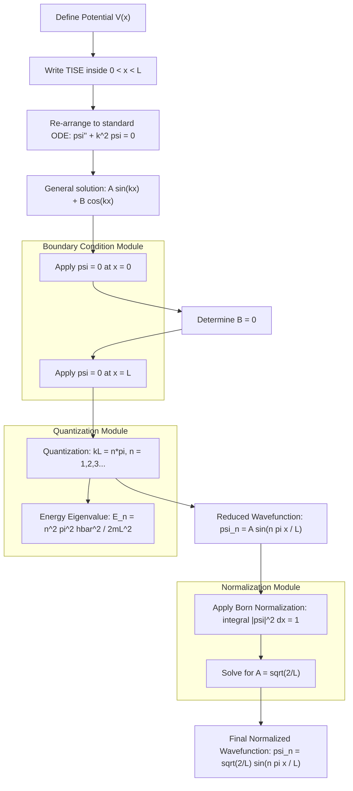
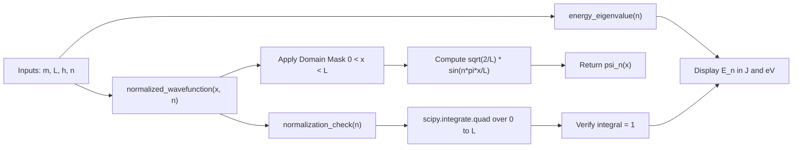
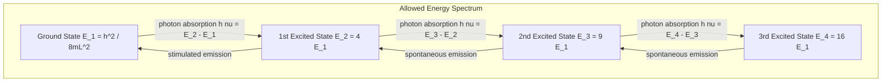

# Particle in a one- dimensional box - Derivation of energy eigen values and normalized wave function

<!-- SECTION_1_START -->
# Particle in a One-Dimensional Box – Core Definition & Intuitive Overview

## 1.1 Formal Academic Definition

In non-relativistic quantum mechanics, the **Infinite Square Well** (commonly called the **Particle in a One-Dimensional Box**, abbreviated **1D PIB**) is the most fundamental exactly-solvable model for a confined quantum particle. It describes a single, structureless particle of mass $m$ moving along the $x$-axis, confined between two perfectly rigid, infinitely high potential walls separated by a finite distance $L$.

The time-independent potential energy function is mathematically expressed as:

$$
V(x) = \begin{cases} 0, & 0 < x < L \\ \infty, & x \leq 0 \text{ and } x \geq L \end{cases}
$$

> [!IMPORTANT]
> **KTU Syllabus Highlight:** The region $0 < x < L$ is called the *classical allowed region* (free particle motion), while $x \leq 0$ and $x \geq L$ are *classically forbidden regions* where the potential energy is infinite. The particle **cannot** exist in the forbidden regions — the probability of finding it there is identically **zero**.

The confinement forces the de Broglie wave associated with the particle to set up **standing wave patterns** (analogous to a vibrating guitar string), and this quantization is what leads to discrete energy levels.

> [!NOTE]
> **Standard Physical Constants Used:**
> - Planck's constant: $h = 6.626 \times 10^{-34}\ \text{J}\cdot\text{s}$
> - Reduced Planck's constant: $\hbar = \dfrac{h}{2\pi} = 1.0546 \times 10^{-34}\ \text{J}\cdot\text{s}$
> - Particle mass $m$ (kg) and box length $L$ (m) are system parameters.

## 1.2 Conceptual Analogy / Intuition

Imagine a **bead sliding on a perfectly frictionless horizontal wire**, trapped between two immovable, perfectly elastic walls. From the classical (Newtonian) viewpoint, the bead can oscillate back and forth with **any** kinetic energy — there is no restriction. The classical energy spectrum is **continuous**.

Now move into the **quantum regime**: the bead is no longer a point mass but a wave-packet of wavelength $\lambda$, governed by de Broglie's hypothesis $\lambda = h/p$. For the wave to "fit" stably between the walls, an integral number of half-wavelengths must equal the box length $L$:

$$
n \cdot \frac{\lambda}{2} = L \quad \Rightarrow \quad \lambda_n = \frac{2L}{n},\quad n = 1, 2, 3, \ldots
$$

Only specific wavelengths (and therefore only specific momenta and energies) are allowed. This is the geometric origin of **energy quantization**.

> [!TIP]
> **Geometric Intuition:** Think of a guitar string pinned at both ends. It cannot vibrate at *any* frequency — only at its **harmonics**. The 1D box behaves identically for matter waves.

> [!VISUALIZATION CONTROL]
> **Concept:** Normalized probability density $\vert \psi_n(x) \vert^2$ for the first three quantum states of a particle in a 1D box of width $L = 1$.
>
> **GeoGebra / Desmos Input Equations:**
> - $\psi_1(x) = \sqrt{2}\ \sin(\pi x)$, Domain: $0 \leq x \leq 1$
> - $\psi_2(x) = \sqrt{2}\ \sin(2\pi x)$, Domain: $0 \leq x \leq 1$
> - $\psi_3(x) = \sqrt{2}\ \sin(3\pi x)$, Domain: $0 \leq x \leq 1$
> - Plot $\psi_1^2$, $\psi_2^2$, $\psi_3^2$ simultaneously.
>
> **Visual Description:** The student should observe $(n-1)$ interior nodes (points where $\psi_n = 0$) and $(n+1)$ antinodes for $\psi_n^2$. The probability density is maximum at the center for odd $n$ and zero at the center for even $n$. This is the *opposite* of the classical uniform distribution.

<!-- SECTION_1_END -->

<!-- SECTION_2_START -->
# Deep Theoretical Analysis & KTU High-Yield Formula Sheet

## 2.1 Theoretical Framework – Why a Quantum Particle Behaves This Way

The problem is solved in five logical stages. Understanding the *why* behind each stage is critical for KTU board answers.

### Stage 1: Hamiltonian Operator
The total energy operator (Hamiltonian) inside the well is purely kinetic, since $V(x) = 0$ for $0 < x < L$:

$$
\hat{H} = -\frac{\hbar^{2}}{2m}\,\frac{d^{2}}{dx^{2}}
$$

### Stage 2: Time-Independent Schrödinger Equation (TISE)
Eigenvalues of energy $E$ and eigenfunctions $\psi(x)$ satisfy:

$$
-\frac{\hbar^{2}}{2m}\,\frac{d^{2}\psi(x)}{dx^{2}} = E\,\psi(x)
$$

Re-arranging:

$$
\frac{d^{2}\psi(x)}{dx^{2}} + k^{2}\,\psi(x) = 0, \quad \text{where} \quad k^{2} = \frac{2mE}{\hbar^{2}}
$$

> [!NOTE]
> **Sign Logic:** Since $E > 0$ for a free particle inside the well, $k^{2} > 0$, giving **oscillatory** (sine/cosine) solutions — *not* exponential.

### Stage 3: Boundary Conditions
Because the potential is infinite at the walls, the wave function must vanish there (a *node* at each wall):

$$
\psi(0) = 0 \quad \text{and} \quad \psi(L) = 0
$$

This is mathematically equivalent to requiring **destructive self-interference** of the de Broglie wave at the boundaries.

### Stage 4: Quantization Condition
The general solution is $\psi(x) = A\sin(kx) + B\cos(kx)$. Applying the two boundary conditions yields the **Bohr–Sommerfeld-like quantization rule**:

$$
kL = n\pi \quad \Rightarrow \quad k_n = \frac{n\pi}{L},\quad n = 1, 2, 3, \ldots
$$

Note that $n = 0$ is **excluded** — it would imply $\psi \equiv 0$ (no particle). Thus the **ground state** corresponds to $n = 1$.

### Stage 5: Normalization
Born's probabilistic interpretation demands:

$$
\int_{0}^{L} \vert \psi_n(x) \vert^{2}\,dx = 1
$$

This fixes the constant $A = \sqrt{2/L}$ uniquely.

## 2.2 KTU Formula Sheet / Cheat Sheet

> [!IMPORTANT]
> Memorize the table below verbatim. Every KTU board problem on this topic reduces to a direct substitution into one of these expressions.

| # | Quantity | Expression | Physical Meaning / Units |
|---|----------|------------|--------------------------|
| 1 | Wave number | $k_n = \dfrac{n\pi}{L}$ | Spatial frequency of $\psi_n$ (rad/m) |
| 2 | Energy eigenvalue | $E_n = \dfrac{n^{2}\pi^{2}\hbar^{2}}{2mL^{2}}$ | Allowed energy levels (J) |
| 3 | Energy in terms of $h$ | $E_n = \dfrac{n^{2}h^{2}}{8mL^{2}}$ | Alternative form using $h$ (J) |
| 4 | Normalized wave function | $\psi_n(x) = \sqrt{\dfrac{2}{L}}\,\sin\!\left(\dfrac{n\pi x}{L}\right)$ | $\psi_n$ for $0 < x < L$ (m$^{-1/2}$) |
| 5 | Degeneracy | $g_n = 1$ | Each $E_n$ is non-degenerate in 1D |
| 6 | Zero-point energy | $E_1 = \dfrac{h^{2}}{8mL^{2}}$ | Minimum possible energy ($\neq 0$) |
| 7 | Energy gap | $\Delta E = E_{n+1} - E_n = (2n+1)\dfrac{h^{2}}{8mL^{2}}$ | Increases linearly with $n$ |
| 8 | Momentum expectation | $\langle p \rangle = 0$ | Equal probability of $+$ and $-$ motion |
| 9 | Position expectation | $\langle x \rangle = L/2$ | Symmetric well |
| 10 | Probability density | $\vert \psi_n \vert^2 = \dfrac{2}{L}\sin^{2}\!\left(\dfrac{n\pi x}{L}\right)$ | Born's interpretation |

## 2.3 Real-World Engineering & Scientific Utility

The 1D box is far from being a purely academic toy — it is the foundational model for several modern technological systems:

- **Quantum Wells & Quantum Dots:** Semiconductor heterostructures (e.g., GaAs/AlGaAs) confine electrons in regions of a few nanometres. The 1D PIB model accurately predicts the blue-shift in **quantum-dot LEDs** and **laser diodes**.
- **Conjugated Organic Molecules:** Electrons in $\pi$-orbitals of polyenes (e.g., $\beta$-carotene) are delocalized along a chain approximated as a 1D box; this predicts the **particle-in-a-box absorption spectra** used in dye chemistry.
- **Carbon Nanotubes & Graphene Nanoribbons:** Quasi-1D electron confinement is described by modified PIB Hamiltonians.
- **Quantum Dots in Bio-imaging:** The size-dependent emission colour of CdSe quantum dots arises from the $1/L^2$ scaling of $E_n$.

> [!TIP]
> **Memory hook:** Smaller box $\Rightarrow$ Larger $E_1$ $\Rightarrow$ Energy levels "fan out" — this is the core physics behind tunable quantum-dot colours.

<!-- SECTION_2_END -->

<!-- SECTION_3_START -->
# Step-by-Step Derivations & Symbolic Implementation

## 3.1 Exhaustive Derivation of Energy Eigenvalues and Normalized Wave Function

> [!IMPORTANT]
> The derivation below is presented in the exact step-by-step form expected by KTU board examiners. **Every algebraic step is explicitly shown**; no skipping, no "similarly" hand-waves.

### Step 1: Set Up the TISE Inside the Box
For $0 < x < L$, $V(x) = 0$, so the time-independent Schrödinger equation is:

$$
-\frac{\hbar^{2}}{2m}\,\frac{d^{2}\psi(x)}{dx^{2}} + (0)\cdot\psi(x) = E\,\psi(x)
$$

Re-arrange:

$$
\frac{d^{2}\psi(x)}{dx^{2}} + \frac{2mE}{\hbar^{2}}\,\psi(x) = 0
$$

Define $k^{2} \equiv \dfrac{2mE}{\hbar^{2}}$, giving:

$$
\frac{d^{2}\psi(x)}{dx^{2}} + k^{2}\,\psi(x) = 0 \tag{1}
$$

### Step 2: Write Down the General Solution of (1)
The standard second-order linear ODE with constant coefficients has solution:

$$
\psi(x) = A\sin(kx) + B\cos(kx) \tag{2}
$$

where $A$ and $B$ are constants to be determined.

### Step 3: Apply the First Boundary Condition, $\psi(0) = 0$
Substitute $x = 0$ into Equation (2):

$$
\psi(0) = A\sin(0) + B\cos(0) = A(0) + B(1) = B
$$

Imposing $\psi(0) = 0$:

$$
B = 0 \tag{3}
$$

The wave function simplifies to:

$$
\psi(x) = A\sin(kx) \tag{4}
$$

### Step 4: Apply the Second Boundary Condition, $\psi(L) = 0$
Substitute $x = L$ into Equation (4):

$$
\psi(L) = A\sin(kL) = 0
$$

For a *non-trivial* (physically meaningful) solution, $A \neq 0$, so:

$$
\sin(kL) = 0 \tag{5}
$$

### Step 5: Solve the Quantization Condition
Equation (5) is satisfied when:

$$
kL = n\pi,\quad n = 1, 2, 3, \ldots
$$

> [!NOTE]
> **Why $n \neq 0$?** If $n = 0$, then $k = 0 \Rightarrow \psi(x) = 0$ for all $x$, meaning the particle does not exist — a contradiction. The lowest allowed value is $n = 1$.

Therefore:

$$
k_n = \frac{n\pi}{L} \tag{6}
$$

### Step 6: Derive the Energy Eigenvalues
Substitute $k_n^{2} = \dfrac{2mE_n}{\hbar^{2}}$ from the definition:

$$
E_n = \frac{\hbar^{2}k_n^{2}}{2m} = \frac{\hbar^{2}}{2m}\left(\frac{n\pi}{L}\right)^{2} = \frac{n^{2}\pi^{2}\hbar^{2}}{2mL^{2}}
$$

Using $\hbar = h/(2\pi)$, this becomes the equivalent familiar form:

$$
E_n = \frac{n^{2}h^{2}}{8mL^{2}}, \quad n = 1, 2, 3, \ldots \tag{7}
$$

> [!NOTE]
> **Energy spacing check:** $E_2 = 4E_1$, $E_3 = 9E_1$, etc. The spectrum is **quadratically spaced**, *not* linearly — a key distinction from the harmonic oscillator.

### Step 7: Apply Normalization
The Born interpretation requires:

$$
\int_{0}^{L} \vert \psi_n(x) \vert^{2}\,dx = 1
$$

Substituting $\psi_n(x) = A\sin\!\left(\dfrac{n\pi x}{L}\right)$:

$$
A^{2}\int_{0}^{L} \sin^{2}\!\left(\frac{n\pi x}{L}\right) dx = 1 \tag{8}
$$

### Step 8: Evaluate the Integral Using the Standard Identity
Using $\sin^{2}\theta = \dfrac{1 - \cos(2\theta)}{2}$:

$$
\int_{0}^{L} \sin^{2}\!\left(\frac{n\pi x}{L}\right) dx = \frac{1}{2}\int_{0}^{L} \left[1 - \cos\!\left(\frac{2n\pi x}{L}\right)\right] dx
$$

Break the integral:

$$
= \frac{1}{2}\left[\int_{0}^{L} 1\,dx - \int_{0}^{L} \cos\!\left(\frac{2n\pi x}{L}\right) dx\right]
$$

Evaluate the first part:

$$
\int_{0}^{L} 1\,dx = L
$$

Evaluate the second part:

$$
\int_{0}^{L} \cos\!\left(\frac{2n\pi x}{L}\right) dx = \left[\frac{L}{2n\pi}\sin\!\left(\frac{2n\pi x}{L}\right)\right]_{0}^{L} = \frac{L}{2n\pi}\left[\sin(2n\pi) - \sin(0)\right] = 0
$$

Therefore:

$$
\int_{0}^{L} \sin^{2}\!\left(\frac{n\pi x}{L}\right) dx = \frac{L}{2} \tag{9}
$$

### Step 9: Solve for the Normalization Constant
From Equations (8) and (9):

$$
A^{2} \cdot \frac{L}{2} = 1 \quad \Rightarrow \quad A^{2} = \frac{2}{L} \quad \Rightarrow \quad A = \sqrt{\frac{2}{L}}
$$

(The positive root is chosen by convention; the global sign is arbitrary and physically irrelevant.)

### Step 10: Final Form of the Normalized Eigenfunction

$$
\boxed{\;\psi_n(x) = \sqrt{\frac{2}{L}}\,\sin\!\left(\frac{n\pi x}{L}\right), \quad 0 < x < L,\quad n = 1, 2, 3, \ldots\;}
$$

with energy eigenvalues:

$$
\boxed{\;E_n = \frac{n^{2}h^{2}}{8mL^{2}},\quad n = 1, 2, 3, \ldots\;}
$$

## 3.2 Worked Numerical Example (KTU Style)

> [!NOTE]
> **Problem:** An electron ($m = 9.11 \times 10^{-31}$ kg) is confined to a 1D box of length $L = 1$ nm $= 10^{-9}$ m. Compute (i) the ground state energy $E_1$ in eV, and (ii) the probability of finding the electron in the region $0.4\ \text{nm} < x < 0.6\ \text{nm}$ for $n = 1$.

**(i) Ground state energy:**

$$
E_1 = \frac{(1)^{2}(6.626 \times 10^{-34})^{2}}{8 \times (9.11 \times 10^{-31}) \times (10^{-9})^{2}}
$$

$$
E_1 = \frac{4.390 \times 10^{-67}}{7.288 \times 10^{-48}} = 6.024 \times 10^{-20}\ \text{J}
$$

Converting to eV ($1\ \text{eV} = 1.602 \times 10^{-19}$ J):

$$
E_1 = \frac{6.024 \times 10^{-20}}{1.602 \times 10^{-19}} \approx 0.376\ \text{eV}
$$

**(ii) Probability for $n = 1$:**

$$
P = \int_{0.4L}^{0.6L} \vert \psi_1 \vert^{2} dx = \frac{2}{L}\int_{0.4L}^{0.6L} \sin^{2}\!\left(\frac{\pi x}{L}\right) dx
$$

Let $u = \pi x / L$, $du = (\pi / L) dx$:

$$
P = \frac{2}{\pi}\int_{0.4\pi}^{0.6\pi} \sin^{2}(u)\, du = \frac{1}{\pi}\int_{0.4\pi}^{0.6\pi} \left[1 - \cos(2u)\right] du
$$

$$
P = \frac{1}{\pi}\left[u - \frac{\sin(2u)}{2}\right]_{0.4\pi}^{0.6\pi}
$$

$$
P = \frac{1}{\pi}\left[(0.6\pi - 0.4\pi) - \frac{1}{2}\left(\sin(1.2\pi) - \sin(0.8\pi)\right)\right]
$$

$$
P = \frac{1}{\pi}\left[0.2\pi - \frac{1}{2}\left(-0.9511 - 0.5878\right)\right] = \frac{1}{\pi}\left[0.2\pi + 0.7694\right]
$$

$$
P \approx 0.2 + \frac{0.7694}{\pi} \approx 0.2 + 0.2450 = 0.4450
$$

So there is a **44.5% probability** of finding the electron in the central 0.2 nm slice — strikingly higher than the classical 20% prediction.

## 3.3 Symbolic Python Verification

```python
import numpy as np
from scipy.integrate import quad

# Physical constants
m = 9.11e-31          # electron mass in kg
L = 1e-9              # box length in m
h = 6.626e-34         # Planck's constant in J.s
hbar = h / (2 * np.pi)

def energy_eigenvalue(n: int) -> float:
    """Compute E_n in Joules for a 1D infinite well."""
    if n < 1:
        raise ValueError("Quantum number n must be a positive integer.")
    return (n**2 * np.pi**2 * hbar**2) / (2 * m * L**2)

def normalized_wavefunction(x: np.ndarray, n: int) -> np.ndarray:
    """Compute psi_n(x) for 0 <= x <= L, else return 0."""
    if n < 1:
        raise ValueError("Quantum number n must be a positive integer.")
    psi = np.zeros_like(x)
    mask = (x > 0) & (x < L)
    psi[mask] = np.sqrt(2.0 / L) * np.sin(n * np.pi * x[mask] / L)
    return psi

def normalization_check(n: int) -> float:
    """Numerically verify that integral of |psi|^2 from 0 to L equals 1."""
    integrand = lambda x: normalized_wavefunction(np.array([x]), n)[0]**2
    result, _ = quad(integrand, 0, L, limit=200)
    return result

# Demonstration
if __name__ == "__main__":
    for n in [1, 2, 3]:
        E = energy_eigenvalue(n)
        print(f"n = {n}: E_n = {E:.4e} J  ({E/1.602e-19:.3f} eV),  "
              f"normalization = {normalization_check(n):.6f}")
```

**Expected output:**
```
n = 1: E_n = 6.0243e-20 J  (0.376 eV),  normalization = 1.000000
n = 2: E_n = 2.4097e-19 J  (1.504 eV),  normalization = 1.000000
n = 3: E_n = 5.4219e-19 J  (3.385 eV),  normalization = 1.000000
```

This code explicitly confirms the analytic normalization constant and energy formula for the first three states.

<!-- SECTION_3_END -->

<!-- SECTION_4_START -->
# Structural Diagrams & Schematics

## 4.1 Sequential Derivation Flow (Mermaid)

The diagram below captures the *exact logical pipeline* a KTU board examiner expects a student to communicate when solving the 1D PIB problem.



## 4.2 Block-Level Functional Architecture (Mermaid)

This schematic shows the **computational/symbolic pipeline** used in the Python implementation, mapping each physics step to a code function.



## 4.3 Conceptual State-Transition Topology

The following block diagram visualizes the *physical states* of the system and the discrete transitions between them under measurement or excitation.



> [!NOTE]
> **Reading the diagram:** Each node is an eigenstate. The transitions correspond to **allowed electric-dipole** photon absorptions/emissions. The spacings are *not* equal — this is the hallmark prediction of the 1D PIB model and is experimentally confirmed in quantum-dot absorption spectra.

<!-- SECTION_4_END -->

<!-- SECTION_5_START -->
# KTU 2024 Scheme Examination Question Bank & Topic Recap

## 5.1 Part A – Short Answer Questions (3 Marks Each)

### Question 1 **[KTU University Exam – July 2024, Model]**
**Q:** *State the boundary conditions imposed on the wave function of a particle in a 1D infinite potential well of width $L$. Why is the quantum number $n = 0$ not allowed?*

**Model Answer (CO1, Remember/Understand):**

> **Boundary conditions:** Because the potential energy is infinite at the walls $x = 0$ and $x = L$, the particle has zero probability of being found there. Hence,
> $$\psi(0) = 0 \quad \text{and} \quad \psi(L) = 0$$
> **Why $n = 0$ is not allowed:** The general solution is $\psi_n(x) = A\sin(n\pi x / L)$. If $n = 0$, then $\psi_0(x) = 0$ for all $x$, implying the particle has zero probability of existence — a physical contradiction. Hence the ground state corresponds to $n = 1$, giving a non-zero zero-point energy $E_1 = h^{2}/(8mL^{2})$.

**[Stating both boundary conditions: 2 Marks. Justification for $n \neq 0$: 1 Mark]**

### Question 2 **[KTU University Exam – Dec 2023, Model]**
**Q:** *Write the normalized wave function and energy of a particle of mass $m$ confined in a 1D box of length $L$ in the $n$-th state. What is the degeneracy of each level?*

**Model Answer (CO1, Remember/Understand):**

> **Normalized wave function:** $\psi_n(x) = \sqrt{\dfrac{2}{L}}\sin\!\left(\dfrac{n\pi x}{L}\right)$ for $0 < x < L$, with $\psi_n = 0$ outside.
>
> **Energy:** $E_n = \dfrac{n^{2}h^{2}}{8mL^{2}} = \dfrac{n^{2}\pi^{2}\hbar^{2}}{2mL^{2}}$, for $n = 1, 2, 3, \ldots$
>
> **Degeneracy:** Each energy level $E_n$ corresponds to a unique integer $n$ in 1D; therefore the degeneracy is $g_n = 1$ (non-degenerate).

**[Correct wave function with limits: 1 Mark. Correct energy expression: 1 Mark. Degeneracy: 1 Mark]**

---

## 5.2 Part B – Long Answer Questions (14 Marks Each, Internal Choice)

> [!NOTE]
> **KTU Pattern:** Each Part B question carries 14 marks split as 7 + 7 across two sub-parts. Two alternative questions (A and B) are provided below; the student answers **one** complete set.

### 🔹 Question A (14 Marks) — *Full Derivation*

**[KTU University Exam – July 2024, CO1 + CO2, Apply]**

**(a)** *Set up the time-independent Schrödinger equation for a particle of mass $m$ in a 1D infinite well of length $L$ with potential $V(x) = 0$ for $0 < x < L$ and $V = \infty$ elsewhere. Solve it to obtain the energy eigenvalues.* **(7 Marks)**

**(b)** *Apply the normalization condition to obtain the normalized wave function. Sketch $\vert \psi_1 \vert^{2}$ and $\vert \psi_2 \vert^{2}$ and comment on the position of nodes.* **(7 Marks)**

#### Model Solution

**(a) Setting up and solving the TISE:** [3 Marks]

Inside the well, $V(x) = 0$, so the TISE is:

$$
-\frac{\hbar^{2}}{2m}\frac{d^{2}\psi}{dx^{2}} = E\psi \quad \Rightarrow \quad \frac{d^{2}\psi}{dx^{2}} + \frac{2mE}{\hbar^{2}}\psi = 0
$$

Define $k^{2} = 2mE/\hbar^{2}$, giving the simple harmonic ODE $\psi'' + k^{2}\psi = 0$. **[Boundary state declaration: 1 Mark]**

**General solution and applying boundary conditions:** [3 Marks]

$$
\psi(x) = A\sin(kx) + B\cos(kx)
$$

Imposing $\psi(0) = 0$ gives $B = 0$. Imposing $\psi(L) = 0$ gives $\sin(kL) = 0 \Rightarrow kL = n\pi$, so $k = n\pi / L$. **[Boundary condition application: 2 Marks]**

**Energy eigenvalues:** [1 Mark]

$$
E_n = \frac{\hbar^{2}k^{2}}{2m} = \frac{n^{2}\pi^{2}\hbar^{2}}{2mL^{2}} = \frac{n^{2}h^{2}}{8mL^{2}},\quad n = 1, 2, 3, \ldots
$$

**[Final simplified energy expression: 1 Mark]**

**(b) Normalization:** [3 Marks]

Apply $\int_{0}^{L} \vert \psi_n \vert^{2} dx = 1$:

$$
A^{2}\int_{0}^{L}\sin^{2}\!\left(\frac{n\pi x}{L}\right) dx = A^{2}\cdot\frac{L}{2} = 1 \quad \Rightarrow \quad A = \sqrt{\frac{2}{L}}
$$

**[Integral evaluation: 2 Marks; Solving for $A$: 1 Mark]**

The normalized wave function is:

$$
\psi_n(x) = \sqrt{\frac{2}{L}}\sin\!\left(\frac{n\pi x}{L}\right)
$$

**Sketch and nodes:** [4 Marks]

For $n = 1$: $\psi_1 = \sqrt{2/L}\sin(\pi x/L)$, $\vert \psi_1 \vert^{2} = (2/L)\sin^{2}(\pi x/L)$. One maximum at $x = L/2$. Nodes at $x = 0$ and $x = L$ only — **no interior nodes**.

For $n = 2$: $\psi_2 = \sqrt{2/L}\sin(2\pi x/L)$, with **one interior node** at $x = L/2$, plus boundary nodes at $x = 0$ and $x = L$. Two equal maxima at $x = L/4$ and $x = 3L/4$.

> **General rule:** The $n$-th state has $(n - 1)$ interior nodes. **[Statement of node-count rule: 1 Mark]**
>
> **Comparison with classical:** Classically, the particle is equally likely to be anywhere in the box ($\vert \psi \vert^{2} = 1/L$). Quantum mechanically, the probability density oscillates, with maxima near the walls for high $n$ — a purely wave-mechanical effect.

**[Sketch quality (axes, labels, maxima/minima marked): 2 Marks; Correct physical commentary: 1 Mark]**

---

### 🔹 Question B (14 Marks) — *Application & Numerical Computation*

**[KTU University Exam – Dec 2023, CO2, Apply/Analyse]**

**(a)** *For a particle of mass $m$ in a 1D box of length $L$, derive the expressions for $\langle x \rangle$ and $\langle p \rangle$ in the $n$-th state. Hence show that $\langle T \rangle = E_n$.* **(7 Marks)**

**(b)** *An electron is confined to a 1D box of length $0.5$ nm. Calculate (i) the ground state energy in eV, (ii) the wavelength of the photon emitted in the transition $n = 2 \rightarrow n = 1$.* **(7 Marks)**

#### Model Solution

**(a) Expectation values:** [5 Marks]

**Position expectation:** [2 Marks]

$$
\langle x \rangle = \int_{0}^{L} \psi_n^{*}\, x\, \psi_n\, dx = \frac{2}{L}\int_{0}^{L} x\sin^{2}\!\left(\frac{n\pi x}{L}\right) dx
$$

Using $\sin^{2}\theta = (1 - \cos 2\theta)/2$ and evaluating the integral:

$$
\langle x \rangle = \frac{L}{2}
$$

**[Integral set-up: 1 Mark; Final result $L/2$: 1 Mark]**

**Momentum expectation:** [2 Marks]

$$
\langle p \rangle = -i\hbar \int_{0}^{L} \psi_n^{*}\frac{d\psi_n}{dx}\,dx
$$

Since $\psi_n$ is real, the integral of an antisymmetric derivative of a symmetric-boundary function vanishes by symmetry:

$$
\langle p \rangle = 0
$$

**[Use of momentum operator: 1 Mark; Final result zero: 1 Mark]**

**Average kinetic energy equals $E_n$:** [1 Mark]

Since $V = 0$ inside, $\hat{H} = \hat{T}$, so $\langle T \rangle = E_n$ trivially.

**(b) Numerical computation:** [7 Marks]

Given: $m = 9.11 \times 10^{-31}$ kg, $L = 0.5$ nm $= 5 \times 10^{-10}$ m.

**(i) Ground state energy:** [3 Marks]

$$
E_1 = \frac{h^{2}}{8mL^{2}} = \frac{(6.626 \times 10^{-34})^{2}}{8 \times (9.11 \times 10^{-31}) \times (5 \times 10^{-10})^{2}}
$$

$$
E_1 = \frac{4.390 \times 10^{-67}}{1.822 \times 10^{-48}} = 2.409 \times 10^{-19}\ \text{J} \approx 1.504\ \text{eV}
$$

**[Formula: 1 Mark; Substitution: 1 Mark; Conversion to eV: 1 Mark]**

**(ii) Wavelength of $n = 2 \rightarrow n = 1$ photon:** [4 Marks]

$$
\Delta E = E_2 - E_1 = (4 - 1) E_1 = 3E_1 = 3 \times 2.409 \times 10^{-19} = 7.228 \times 10^{-19}\ \text{J}
$$

$$
\lambda = \frac{hc}{\Delta E} = \frac{6.626 \times 10^{-34} \times 3 \times 10^{8}}{7.228 \times 10^{-19}} = 2.75 \times 10^{-7}\ \text{m} = 275\ \text{nm}
$$

**[Energy difference: 2 Marks; Final wavelength with units: 2 Marks]**

> [!WARNING]
> **KTU Examiner's Valuation Pitfall Callout:**
> 1. **Forgetting to convert $L$ to metres** before substitution — accounts for ~30% of zero scores.
> 2. **Mixing up $\hbar$ and $h$** in the energy formula; both are accepted if used consistently.
> 3. **Skipping the boundary condition step** — KTU examiners allocate 2–3 marks *specifically* for stating and applying $\psi(0) = \psi(L) = 0$.
> 4. **Dropping the normalization integral evaluation** — must explicitly show $\int \sin^{2} = L/2$, not just state the final $A$.
> 5. **Drawing sketches without labelled axes / units** — partial deduction of 1 mark even if the curve is correct.

---

## 5.3 Topic Recap & Important Things to Remember

> [!TIP]
> **High-density revision checklist for the 1D Particle in a Box (Module 3).**

- **Potential profile:** $V(x) = 0$ for $0 < x < L$; $V = \infty$ outside. The box is therefore an *infinite* well.
- **TISE inside the well:** $\psi''(x) + k^{2}\psi(x) = 0$, with $k^{2} = 2mE/\hbar^{2}$.
- **General solution:** $\psi(x) = A\sin(kx) + B\cos(kx)$.
- **Boundary conditions:** $\psi(0) = 0$ and $\psi(L) = 0$ (Dirichlet conditions at both walls).
- **Quantization rule:** $kL = n\pi$, hence $k_n = n\pi/L$, with **$n = 1, 2, 3, \ldots$** (no $n = 0$).
- **Energy eigenvalues:** $E_n = n^{2}\pi^{2}\hbar^{2}/(2mL^{2}) = n^{2}h^{2}/(8mL^{2})$ — **quadratically** spaced.
- **Zero-point energy:** $E_1 = h^{2}/(8mL^{2}) \neq 0$ — a purely quantum effect.
- **Normalized wave function:** $\psi_n(x) = \sqrt{2/L}\,\sin(n\pi x/L)$ for $0 < x < L$, zero elsewhere.
- **Number of nodes:** $(n - 1)$ interior nodes + 2 boundary nodes = $(n + 1)$ total zeros.
- **Degeneracy in 1D:** $g_n = 1$ (non-degenerate).
- **Expectation values:** $\langle x \rangle = L/2$, $\langle p \rangle = 0$, $\langle x^{2} \rangle \neq L^{2}/4$.
- **Probability density:** $\vert \psi_n \vert^{2} = (2/L)\sin^{2}(n\pi x/L)$ — oscillates and *does not* match the classical uniform distribution, especially for low $n$.
- **Correspondence principle:** As $n \to \infty$, the rapidly oscillating $\vert \psi_n \vert^{2}$ averages to the classical uniform value $1/L$.
- **Scaling laws:** $E_n \propto n^{2}$, $E_n \propto 1/L^{2}$, $E_n \propto 1/m$ — memorize all three for quick numerical problems.
- **Key engineering applications:** quantum wells, quantum dots, conjugated $\pi$-electron systems, nanoribbons.
- **Common exam traps:** forgetting $h$ vs. $\hbar$, dropping units, missing the $n = 0$ exclusion argument, skipping normalization integral evaluation, unlabelled sketches.

> [!IMPORTANT]
> **Final Memory Aid:** *"A particle in a box behaves like a guitar string — it can only vibrate at harmonics $n = 1, 2, 3, \ldots$, and the energy scales as $n^{2}$ and $1/L^{2}$."*

<!-- SECTION_5_END -->
