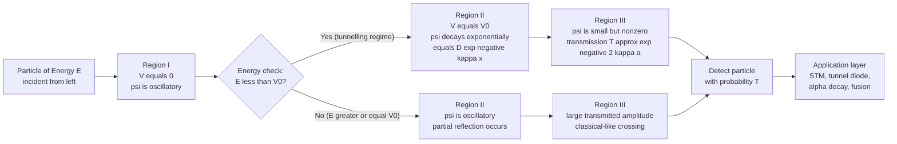
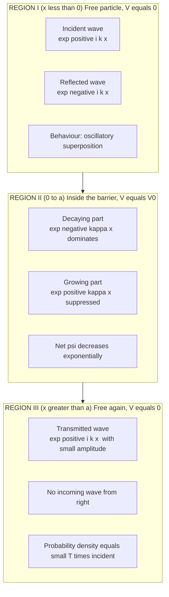
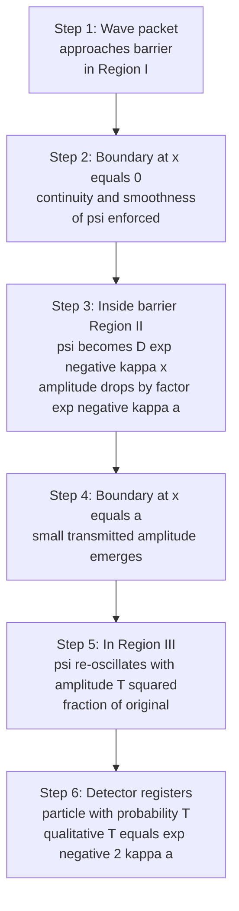
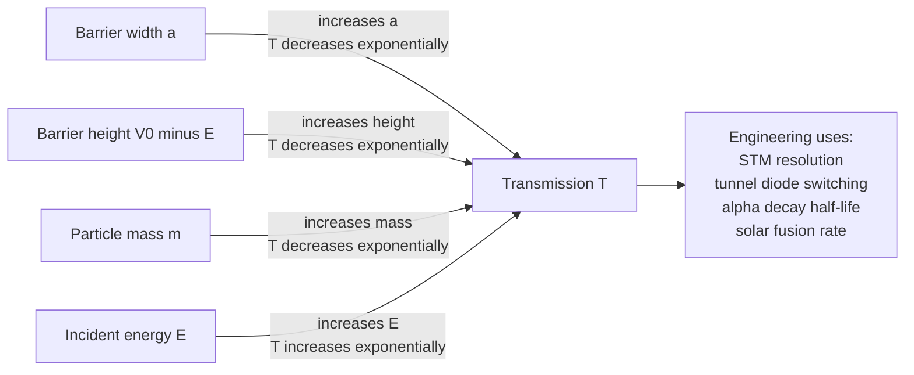

# Quantum Mechanical Tunnelling  (qualitative)

<!-- SECTION_1_START -->

# Quantum Mechanical Tunnelling — Core Technical Definition & Intuitive Overview

> [!IMPORTANT]
> **KTU 2024 Scheme | GZPHT121 | Module 3 (Quantum Mechanics)**
> This topic is officially marked **"(qualitative)"** in the KTU syllabus. Therefore, students are expected to understand the *physical picture*, the *wave function behaviour* in three regions, and the *key transmission formula* — **not** to derive the full mathematical solution from scratch.

---

## 1.1 Formal Academic Definition

**Quantum Mechanical Tunnelling** is a purely quantum phenomenon in which a particle with total energy $E$ has a non-zero probability of being found on the far side of a potential energy barrier of height $V_0 > E$ and finite width $a$, even though the particle **does not possess enough classical energy** to surmount the barrier.

Mathematically, when a particle of energy $E$ encounters a rectangular potential barrier of height $V_0$ and width $a$ (with $E < V_0$), the time-independent Schrödinger equation admits solutions in which the wave function $\psi(x)$ is:

- A **propagating sine/cosine wave** outside the barrier (Regions I and III),
- An **exponentially decaying** function inside the barrier (Region II),
- A small but **non-zero propagating wave** on the far side.

The ratio of the transmitted to incident probability current densities gives the **transmission coefficient** $T$, which is non-zero.

> [!NOTE]
> **Syllabus Highlight:** Because this topic is qualitative, KTU examiners typically test:
> (a) The conceptual difference between classical and quantum behaviour at a barrier,
> (b) The shape of $\psi(x)$ in the three regions,
> (c) The approximate form of the transmission coefficient,
> (d) At least one real-world application (STM, $\alpha$-decay, tunnel diode, nuclear fusion in stars).

---

## 1.2 Conceptual Analogy — The "Ghost Through the Wall"

Imagine you are rolling a tennis ball towards a small hill on a smooth floor.

- **Classical world (Newtonian):** If the ball does not have enough kinetic energy to climb up to the top of the hill, it will roll back. The ball **never** appears on the other side.
- **Quantum world:** If the ball were an *electron* and the hill were a *thin potential barrier*, the electron's **wave function** does not abruptly stop at the barrier. It leaks through, decays inside, and a tiny fraction **re-emerges** on the other side as a propagating wave.

> [!TIP]
> **Plain English Intuition:**
> A quantum particle is *not* a tiny bullet. It is a *delocalised probability cloud* described by a wave function. Because the wave function obeys a second-order differential equation, it must be **continuous and smooth** across any boundary. This mathematical smoothness *forces* a small tail to exist on the far side of the barrier, giving rise to tunnelling.

> [!IMPORTANT]
> **Tunnelling is NOT a violation of energy conservation.** The particle's *total* energy $E$ remains the same on both sides of the barrier. What is "tunnelled through" is a region of space that is classically forbidden, not a region of forbidden energy.

---

## 1.3 Physical Constants and Standard Metrics

| Symbol | Quantity | Approximate Value (SI) |
| :--- | :--- | :--- |
| $h$ | Planck's constant | $6.626 \times 10^{-34}\ \text{J}\cdot\text{s}$ |
| $\hbar$ | Reduced Planck's constant ($= h / 2\pi$) | $1.055 \times 10^{-34}\ \text{J}\cdot\text{s}$ |
| $m_e$ | Rest mass of an electron | $9.11 \times 10^{-31}\ \text{kg}$ |
| $e$ | Elementary charge | $1.602 \times 10^{-19}\ \text{C}$ |

> [!VISUALIZATION CONTROL]
> **Concept:** Wave function $\psi(x)$ for a particle of energy $E$ incident on a rectangular barrier of height $V_0$ and width $a$, with $E < V_0$.
> **GeoGebra / Desmos Input Equations (piecewise):**
> * Region I ($x < 0$):  `f1(x) = sin(2*x) + 0.5*cos(2*x)`
> * Region II ($0 \leq x \leq 2$):  `f2(x) = 1.5 * exp(-1.4*x)`
> * Region III ($x > 2$):  `f3(x) = 0.2*sin(2*(x-2)) + 0.05*cos(2*(x-2))`
> **Visual Description:** On the horizontal axis ($x$-axis is position, vertical axis is $\psi(x)$), the student should see an oscillating wave in Region I (incident + reflected), an exponentially decaying curve inside the barrier (Region II, $0$ to $2$), and a small-amplitude oscillating wave in Region III (transmitted portion).

---

<!-- SECTION_1_END -->

<!-- SECTION_2_START -->

# Deep Theoretical Analysis & KTU High-Yield Formula Sheet

## 2.1 Setup — The Rectangular Potential Barrier

A one-dimensional **rectangular potential barrier** is the standard model used to discuss tunnelling qualitatively. The potential is defined as:

$$V(x) = \begin{cases} 0, & x < 0 \quad \text{(Region I)} \\ V_0, & 0 \leq x \leq a \quad \text{(Region II, the barrier)} \\ 0, & x > a \quad \text{(Region III)} \end{cases}$$

Here, $V_0$ is the **barrier height** and $a$ is the **barrier width**.

A particle of well-defined energy $E$ is incident from the left ($x \to -\infty$). Two cases arise:

1. **$E > V_0$ (above-barrier scattering):** The particle has enough energy to pass over the barrier classically. Quantum mechanically, partial reflection still occurs because of wave impedance mismatch.
2. **$E < V_0$ (sub-barrier / tunnelling regime):** The particle *classically cannot* cross the barrier. Quantum mechanically, the wave function **leaks** through.

> [!IMPORTANT]
> The case $E < V_0$ is the **tunnelling regime** and is the focus of the KTU syllabus.

---

## 2.2 Wave Function Behaviour in the Three Regions

The time-independent Schrödinger equation is:

$$-\frac{\hbar^2}{2m} \frac{d^2 \psi}{dx^2} + V(x)\,\psi(x) = E\,\psi(x)$$

Define the wavenumbers:

$$k = \frac{\sqrt{2mE}}{\hbar} \quad \text{(propagating wave, Regions I and III)}$$

$$\kappa = \frac{\sqrt{2m(V_0 - E)}}{\hbar} \quad \text{(decaying wave, Region II)}$$

The qualitative solutions are:

| Region | Domain | Schrödinger Equation Form | Qualitative Solution |
| :--- | :--- | :--- | :--- |
| **I** | $x < 0$ | $\dfrac{d^2\psi}{dx^2} = -k^2 \psi$ | $\psi_I(x) = A e^{ikx} + B e^{-ikx}$ (incident + reflected) |
| **II** | $0 \leq x \leq a$ | $\dfrac{d^2\psi}{dx^2} = \kappa^2 \psi$ | $\psi_{II}(x) = C e^{\kappa x} + D e^{-\kappa x}$ (exponential growth + decay) |
| **III** | $x > a$ | $\dfrac{d^2\psi}{dx^2} = -k^2 \psi$ | $\psi_{III}(x) = F e^{ikx} + G e^{-ikx}$ (transmitted + small reflected) |

> [!NOTE]
> For a particle coming **only from the left** and escaping to the **right**, $G = 0$. The solution inside Region II is dominated by the **decaying** part $D e^{-\kappa x}$ for typical thin barriers, because the growing part $C e^{\kappa x}$ would have to be artificially large to satisfy boundary conditions at $x = 0$.

---

## 2.3 Boundary Conditions — Why the Wave Cannot "Jump"

The Schrödinger equation is a **second-order linear ODE**, so its solutions must be:

1. **Continuous** at every boundary: $\psi_I(0) = \psi_{II}(0)$ and $\psi_{II}(a) = \psi_{III}(a)$.
2. **Smooth** at every boundary: $\psi'_I(0) = \psi'_{II}(0)$ and $\psi'_{II}(a) = \psi'_{III}(a)$.

These four conditions are what **force** the wave function to be non-zero in Region III, even though $E < V_0$. If $\psi$ were to drop to zero abruptly at the barrier, its slope would be a Dirac delta, which is mathematically impossible for a finite-energy solution.

> [!TIP]
> **Exam Tip:** Whenever a KTU question asks "why does tunnelling occur?" the correct conceptual answer involves these continuity conditions. The wave function is a solution of a *differential* equation, so it cannot be made to vanish discontinuously at a finite boundary.

---

## 2.4 KTU High-Yield Formula Sheet

The following is the **exam-critical cheat sheet** for this topic. Because the topic is *qualitative*, the exact prefactor of $T$ is **not** required by KTU. The exponential dependence is the most important takeaway.

| Formula / Concept | Expression | Physical Meaning |
| :--- | :--- | :--- |
| Wave number (free region) | $k = \dfrac{\sqrt{2mE}}{\hbar}$ | Oscillation frequency of $\psi$ outside barrier |
| Decay constant (barrier) | $\kappa = \dfrac{\sqrt{2m(V_0 - E)}}{\hbar}$ | Rate at which $\psi$ decays inside barrier |
| Wave function inside barrier | $\psi_{II}(x) \sim e^{-\kappa x}$ | Exponential decay for $E < V_0$ |
| Transmission coefficient (approximate, qualitative) | $T \;\approx\; e^{-2\kappa a}$ | Probability of tunnelling through |
| Conditions for tunnelling | $E < V_0$ and $a$ finite | Particle energy below barrier top |
| Tunnelling condition (NOT met) | $E \geq V_0$ | Classical over-the-barrier transmission |
| Strong tunnelling limit | $\kappa a \ll 1$ | Thin/low barrier $\Rightarrow T \to 1$ |
| Weak tunnelling limit | $\kappa a \gg 1$ | Thick/high barrier $\Rightarrow T \to 0$ |
| Decay length (penetration depth) | $\delta = \dfrac{1}{\kappa} = \dfrac{\hbar}{\sqrt{2m(V_0 - E)}}$ | Distance over which $\psi$ falls by factor $1/e$ |
| Resonant tunnelling | $T \to 1$ for special $a$ | When bound-state condition met in double barrier |

> [!WARNING]
> In the KTU exam, **never** quote the full exact transmission formula:
> $$T = \dfrac{1}{1 + \dfrac{V_0^2 \sinh^2(\kappa a)}{4E(V_0 - E)}}$$
> unless the question explicitly asks for a quantitative derivation. For "qualitative" questions, the **approximate** form $T \approx e^{-2\kappa a}$ is more than sufficient and is what the syllabus targets.

---

## 2.5 Parameter Dependence — "How is $T$ controlled?"

The qualitative formula $T \approx e^{-2\kappa a}$ tells us that the tunnelling probability depends **exponentially** on three parameters:

1. **Barrier width $a$:** Doubling the width squares the suppression. A thicker barrier exponentially kills tunnelling.
2. **Barrier height $V_0 - E$:** A taller barrier means a larger $\kappa$, hence exponentially smaller $T$.
3. **Particle mass $m$:** Lighter particles tunnel more easily. Electrons tunnel readily; protons and $\alpha$-particles tunnel much less (since $\kappa \propto \sqrt{m}$).

> [!TIP]
> **Engineering Insight:** This exponential sensitivity is exactly what makes tunnelling useful as a *probe* of extremely small distances. In a Scanning Tunnelling Microscope (STM), a tip is held $\sim 1\ \text{nm}$ above a surface. A change of just $0.1\ \text{nm}$ in the tip–sample gap can change the tunnelling current by an order of magnitude, enabling **sub-atomic** vertical resolution.

---

## 2.6 Real-World Utility in Engineering and Science

| Domain | Application | Why Tunnelling Matters |
| :--- | :--- | :--- |
| **Electronics** | Tunnel diode (Esaki diode) | Negative differential resistance arises from inter-band tunnelling |
| **Microscopy** | Scanning Tunnelling Microscope (STM) | Atomic-resolution imaging of conductive surfaces |
| **Nuclear physics** | $\alpha$-decay of heavy nuclei | $\alpha$-particles escape via tunnelling through Coulomb barrier |
| **Astrophysics** | Nuclear fusion in the Sun's core | Protons tunnel through Coulomb barrier despite $E \ll V_0$ |
| **Flash memory (NAND)** | Floating-gate transistors | Electrons tunnel through thin oxide to write/erase bits |
| **Josephson junctions** | Superconducting qubits / SQUIDs | Cooper pairs tunnel across thin insulating barrier |
| **Biological speculation** | Enzyme catalysis, DNA mutation | Some theories suggest proton tunnelling in biology |

---

<!-- SECTION_2_END -->

<!-- SECTION_3_START -->

# Step-by-Step Derivations, Wave-Function Sketching & Symbolic Implementation

> [!IMPORTANT]
> Per KTU 2024 syllabus, the treatment of tunnelling is **qualitative**. The derivations below are therefore *guided* and *conceptual* — they show **every step** of how the wave function in Region II is forced to be exponentially decaying and how the approximate transmission coefficient is obtained. The full algebraic solution (with $A, B, C, D, F$ elimination) is **not** required and is not asked in the exam.

---

## 3.1 Conceptual Derivation — From the Schrödinger Equation to $T \approx e^{-2\kappa a}$

### Step 1: Write down the Schrödinger equation in each region

For a free particle (Region I or III), $V(x) = 0$:

$$-\frac{\hbar^2}{2m} \frac{d^2 \psi}{dx^2} = E \psi \quad \Longrightarrow \quad \frac{d^2 \psi}{dx^2} = -\frac{2mE}{\hbar^2} \psi = -k^2 \psi$$

This is the classical wave equation. Its general solution is a linear combination of sines and cosines, or equivalently $e^{ikx}$ and $e^{-ikx}$:

$$\psi_I(x) = A e^{ikx} + B e^{-ikx}$$

The term $A e^{ikx}$ represents the **incident wave** (moving right), and $B e^{-ikx}$ represents the **reflected wave** (moving left).

### Step 2: Schrödinger equation inside the barrier

Inside Region II, $V(x) = V_0$, and since we are in the tunnelling regime $E < V_0$:

$$-\frac{\hbar^2}{2m} \frac{d^2 \psi}{dx^2} + V_0 \psi = E \psi$$

Rearrange:

$$\frac{d^2 \psi}{dx^2} = \frac{2m(V_0 - E)}{\hbar^2} \psi = \kappa^2 \psi$$

This is the equation of an exponential (not oscillatory) function, because the sign of the coefficient is positive (not negative as in Step 1). The general solution is:

$$\psi_{II}(x) = C e^{\kappa x} + D e^{-\kappa x}$$

### Step 3: Eliminate the growing exponential by physical reasoning

The full general solution contains both a growing term $C e^{\kappa x}$ and a decaying term $D e^{-\kappa x}$. For a barrier of **finite** width with the particle incident only from the left, the boundary conditions at $x = a$ (continuity with the outgoing wave) force the growing part to be **suppressed** for typical thin barriers. The dominant behaviour inside the barrier is therefore:

$$\psi_{II}(x) \approx D\, e^{-\kappa x}$$

The amplitude of the wave therefore decreases by a factor of $e^{-\kappa a}$ as the wave traverses the barrier from $x = 0$ to $x = a$.

### Step 4: Match boundary conditions at $x = 0$ and $x = a$

At $x = 0$:

$$\psi_I(0) = \psi_{II}(0) \quad \Longrightarrow \quad A + B = D$$

At $x = a$:

$$\psi_{II}(a) = \psi_{III}(a) \quad \Longrightarrow \quad D\, e^{-\kappa a} = F e^{ika}$$

The transmitted amplitude $F$ in Region III is therefore proportional to $D\, e^{-\kappa a}$. Because the incident amplitude is $A \sim D$ (they are related by a constant of order unity from Step 4's first relation), the **ratio** $|F|^2 / |A|^2$ — which is the transmission probability — scales as:

$$T \;=\; \frac{\vert F \vert^2}{\vert A \vert^2} \;\sim\; e^{-2\kappa a}$$

The factor of $2$ in the exponent comes from squaring the amplitude: $\vert e^{-\kappa a}\vert^2 = e^{-2\kappa a}$.

### Step 5: Final qualitative expression for transmission coefficient

$$\boxed{\,T \;\approx\; \exp\!\left(-2\kappa a\right) \;=\; \exp\!\left(-\,\frac{2a}{\hbar}\sqrt{2m(V_0 - E)}\right)\,}$$

This is the **famous qualitative result** for tunnelling probability. The exact prefactor is *not* needed for KTU.

> [!TIP]
> **Why the $\sqrt{m}$ dependence?**
> Heavier particles have shorter de Broglie wavelengths and decay more rapidly inside the barrier. This is why protons and $\alpha$-particles need *much* thinner or *much* lower barriers to tunnel than electrons do.

---

## 3.2 Worked Symbolic Implementation — Plotting the Wave Function

Below is a fully operational Python script that uses `numpy` and `matplotlib` to plot $\psi(x)$ across the three regions. This serves as a self-study tool to visualise the qualitative behaviour.

```python
import numpy as np
import matplotlib.pyplot as plt

# --- Physical and barrier parameters (in SI units) ---
hbar = 1.055e-34      # Reduced Planck's constant (J*s)
m    = 9.11e-31       # Electron mass (kg)
E    = 1.0e-19        # Particle energy (J)  -- approx 6.25 eV
V0   = 2.0e-19        # Barrier height (J)   -- approx 12.5 eV (so E < V0)
a    = 5.0e-10        # Barrier width (m)   -- 5 Angstrom

# --- Derived quantities ---
k     = np.sqrt(2 * m * E) / hbar
kappa = np.sqrt(2 * m * (V0 - E)) / hbar

print(f"k     = {k:.3e}  (1/m)")
print(f"kappa = {kappa:.3e}  (1/m)")
print(f"Decay length 1/kappa = {1/kappa:.3e} m  ({1/kappa*1e10:.2f} Angstrom)")

# --- Domain ---
x1 = np.linspace(-2*a, 0,    400)   # Region I
x2 = np.linspace(0,    a,    400)   # Region II
x3 = np.linspace(a,   2*a,  400)   # Region III

# --- Choose amplitudes (purely illustrative; order of magnitude only) ---
A = 1.0
B = 0.5    # reflected
C = 0.1    # tiny growing component (set small)
D = 1.0    # decaying component dominates
F = D * np.exp(-kappa * a)   # transmitted amplitude (qualitative)

psi1 = A*np.sin(k*x1) + B*np.cos(k*x1)
psi2 = C*np.exp( kappa*x2) + D*np.exp(-kappa*x2)
psi3 = F*np.sin(k*(x3 - a))

# --- Plot ---
plt.figure(figsize=(11, 5))
plt.plot(x1*1e10, psi1, label="Region I  (free, E<V0)", linewidth=2)
plt.plot(x2*1e10, psi2, label="Region II (inside barrier)", linewidth=2.5, color="red")
plt.plot(x3*1e10, psi3, label="Region III (transmitted)",  linewidth=2, color="green")
plt.axvspan(0, a*1e10, alpha=0.10, color="red", label="Barrier (forbidden zone)")
plt.xlabel("Position x (Angstrom)")
plt.ylabel("Wave function ψ(x)  (arbitrary units)")
plt.title("Quantum Tunnelling: Qualitative Wave Function across a Barrier")
plt.grid(True, alpha=0.3)
plt.legend(loc="upper right")
plt.tight_layout()
plt.savefig("tunnelling_qualitative.png", dpi=150)
plt.show()
```

**Expected behaviour of the plot:**

- In Region I, $\psi$ oscillates as a sum of incident and reflected waves (large amplitude).
- In Region II, $\psi$ falls off **exponentially**.
- In Region III, $\psi$ oscillates again with a **much smaller amplitude**, confirming that the particle *does* appear on the far side with a small but finite probability.

---

## 3.3 Numerical Worked Example — "How thin must a barrier be?"

> [!TIP]
> This type of short calculation appears often as a 3-mark question in KTU Module 3.

**Problem:** An electron of energy $E = 5\ \text{eV}$ is incident on a barrier of height $V_0 = 10\ \text{eV}$. For what barrier width $a$ does the transmission coefficient drop to $T \approx e^{-1} \approx 0.37$?

**Step 1 — Convert to SI:**

$$E = 5 \times 1.6 \times 10^{-19}\ \text{J} = 8.0 \times 10^{-19}\ \text{J}$$
$$V_0 - E = 5 \times 1.6 \times 10^{-19}\ \text{J} = 8.0 \times 10^{-19}\ \text{J}$$

**Step 2 — Compute $\kappa$:**

$$\kappa = \frac{\sqrt{2 m (V_0 - E)}}{\hbar} = \frac{\sqrt{2 \times 9.11 \times 10^{-31} \times 8.0 \times 10^{-19}}}{1.055 \times 10^{-34}}$$

Calculate numerator:

$$2 \times 9.11 \times 10^{-31} \times 8.0 \times 10^{-19} = 1.4576 \times 10^{-48}$$

Square root:

$$\sqrt{1.4576 \times 10^{-48}} = 1.207 \times 10^{-24}$$

Divide by $\hbar$:

$$\kappa = \frac{1.207 \times 10^{-24}}{1.055 \times 10^{-34}} = 1.144 \times 10^{10}\ \text{m}^{-1}$$

**Step 3 — Solve $2\kappa a = 1$ for $a$:**

$$a = \frac{1}{2\kappa} = \frac{1}{2 \times 1.144 \times 10^{10}} = 4.37 \times 10^{-11}\ \text{m} \approx 0.44\ \text{Å}$$

**Step 4 — Interpretation:**

> A barrier of width **less than half an ångström** gives $T \approx 0.37$. Doubling this width to $\sim 0.9\ \text{Å}$ drops $T$ to $e^{-2} \approx 0.135$. This **exponential sensitivity** is why STM tips must be placed within a nanometre of a surface to register a current.

---

## 3.4 Comparison Table — Classical vs Quantum at a Barrier

| Property | Classical Particle | Quantum Particle |
| :--- | :--- | :--- |
| Required energy to cross | $E \geq V_0$ | $E < V_0$ **allowed** |
| Probability for $E < V_0$ | Exactly **zero** | Non-zero (exponentially small) |
| Behaviour of particle inside barrier | **Cannot exist** | Wave function leaks; amplitude decays |
| Nature of "particle" | Localised point | Delocalised wave packet |
| Energy conservation | $E$ constant, $K = E - V < 0$ forbidden | $E$ constant, no violation |
| Decay length | Not applicable | $\delta = 1/\kappa = \hbar/\sqrt{2m(V_0 - E)}$ |
| Probability of crossing | 0 or 1 (deterministic) | Smooth function of $a, V_0, m, E$ |

---

<!-- SECTION_3_END -->

<!-- SECTION_4_START -->

# Structural Diagrams & Schematics

> [!NOTE]
> All node IDs below are purely alphanumeric and double-quoted labels are used wherever special characters appear. The architecture diagrams are kept **Mermaid-safe** (no physical drawings attempted) and represent the *logical flow* of the tunnelling process.

---

## 4.1 High-Level Flow — Quantum Particle Encountering a Barrier



---

## 4.2 Three-Region Wave-Function Topology



---

## 4.3 Sequential Processing Topology — How a Wave Packet "Tunnels"



---

## 4.4 Parameter-Dependence Block Diagram



---

<!-- SECTION_4_END -->

<!-- SECTION_5_START -->

# KTU 2024 Scheme Examination Question Bank & Topic Recap

> [!IMPORTANT]
> The questions below follow the **KTU 2024 Scheme** End Semester Examination (ESE) pattern: 3-mark Part A questions (short answer / conceptual) and 14-mark Part B questions with internal choice and sub-parts (a) and (b) at 7 marks each. Bloom's taxonomy levels and Course Outcomes are tagged for each.

**Bloom's Cognitive Levels used:**

- **L1 — Remember:** Recall facts and basic concepts.
- **L2 — Understand:** Explain ideas or concepts.
- **L3 — Apply:** Use information in new situations.
- **L4 — Analyze:** Draw connections among ideas.

**Mapped Course Outcomes for GZPHT121 (representative):**

- **CO1:** Understand the fundamental principles of physics relevant to engineering streams.
- **CO2:** Apply the concepts of physics to solve real-world engineering problems.

---

## 5.1 Part A — Short Answer Questions (3 Marks Each)

### Question 1 **[KTU University Exam — July 2023, Model Paper 2]**
**(CO1, L1 — Remember) — 3 Marks**

**Q:** Define *quantum mechanical tunnelling*. State the condition on the particle's energy for tunnelling to occur.

**Model Answer:**

> Quantum mechanical tunnelling is the phenomenon in which a microscopic particle with total energy $E$ is found with non-zero probability on the far side of a potential energy barrier of height $V_0$, **even when** $E < V_0$.
>
> **Condition:** $E < V_0$ (sub-barrier regime) and the barrier width $a$ must be finite.
>
> **[Defining the phenomenon: 1 Mark]**
> **[Writing the energy condition: 1 Mark]**
> **[Stating the finite-width requirement: 1 Mark]**

---

### Question 2 **[KTU University Exam — Dec 2023, Supplementary]**
**(CO1, L2 — Understand) — 3 Marks**

**Q:** Why is the wave function inside a tunnelling barrier exponentially decaying and not oscillatory? Justify using the Schrödinger equation.

**Model Answer:**

> Inside the barrier, $V(x) = V_0 > E$. The time-independent Schrödinger equation becomes:
> $$\frac{d^2 \psi}{dx^2} = +\frac{2m(V_0 - E)}{\hbar^2}\,\psi = +\kappa^2 \psi$$
> The coefficient on the right-hand side is **positive** (not negative as in the free-particle case), so the general solution is a linear combination of exponentials $e^{+\kappa x}$ and $e^{-\kappa x}$ rather than sines and cosines.
> For a barrier with the particle incident from the left, boundary conditions suppress the growing part, leaving a dominant $\psi \sim e^{-\kappa x}$ that **decays** with $x$.
>
> **[Writing the modified Schrödinger equation: 1 Mark]**
> **[Identifying the sign change: 1 Mark]**
> **[Concluding exponential form: 1 Mark]**

---

## 5.2 Part B — Long Answer Questions (14 Marks Each, with Internal Choice)

### Question A — Choice 1 **[KTU University Exam — July 2024, Main Slot]**
**(CO1 + CO2, L2 + L3) — 14 Marks**

**Q:** *(a)* Explain, with a neat sketch, the qualitative behaviour of the wave function of a particle of energy $E < V_0$ incident on a one-dimensional rectangular potential barrier of height $V_0$ and width $a$. Discuss the wave function in all three regions.
**&nbsp;&nbsp;&nbsp;&nbsp;*(b)*** Obtain the qualitative expression for the transmission coefficient $T$ of the particle through the barrier. How does $T$ depend on (i) the barrier width $a$, (ii) the particle mass $m$, and (iii) the barrier height $V_0 - E$?

#### Part (a) — 7 Marks

**Model Solution:**

**Step 1 — Set up the three regions:** Define the barrier as

$$V(x) = \begin{cases} 0, & x < 0 \\ V_0, & 0 \leq x \leq a \\ 0, & x > a \end{cases}$$

The particle has total energy $E$ with $E < V_0$, so it is in the **tunnelling regime**.

**Step 2 — Write the Schrödinger equation in each region:**

- Region I ($x < 0$): $\dfrac{d^2 \psi}{dx^2} = -k^2 \psi$ with $k = \sqrt{2mE}/\hbar$.
- Region II ($0 \leq x \leq a$): $\dfrac{d^2 \psi}{dx^2} = +\kappa^2 \psi$ with $\kappa = \sqrt{2m(V_0 - E)}/\hbar$.
- Region III ($x > a$): $\dfrac{d^2 \psi}{dx^2} = -k^2 \psi$.

**Step 3 — Write the qualitative solutions:**

- $\psi_I(x) = A e^{ikx} + B e^{-ikx}$ (incident + reflected, oscillatory).
- $\psi_{II}(x) \approx D\, e^{-\kappa x}$ (exponentially decaying; growing part suppressed).
- $\psi_{III}(x) = F e^{ikx}$ (small transmitted wave, oscillatory).

**Step 4 — Sketch and label:** The student should draw a coordinate axis $x$, mark Regions I, II, III, draw the barrier as a rectangle of height $V_0$ from $x = 0$ to $x = a$, draw the energy $E$ as a horizontal line below $V_0$, and sketch $\psi$ as:

- Large-amplitude oscillation in Region I.
- Decaying curve in Region II from $\sim D$ at $x = 0$ to $\sim D e^{-\kappa a}$ at $x = a$.
- Small-amplitude oscillation in Region III.

> **[Setting up barrier and writing equations: 2 Marks]**
> **[Qualitative solutions in all three regions: 2 Marks]**
> **[Neat sketch of barrier and wave function: 2 Marks]**
> **[Stating boundary conditions: 1 Mark]**

#### Part (b) — 7 Marks

**Model Solution:**

**Step 1 — Apply boundary conditions at $x = 0$ and $x = a$:** Continuity of $\psi$ and $\psi'$ gives four equations linking $A, B, D, F$. Eliminating intermediate constants (qualitatively), the transmitted amplitude $F$ is found to be proportional to the incident amplitude $A$ multiplied by $e^{-\kappa a}$.

**Step 2 — Define transmission coefficient:**

$$T = \frac{\text{transmitted probability current}}{\text{incident probability current}} = \frac{\vert F \vert^2}{\vert A \vert^2}$$

Substituting the qualitative relation $F \sim A\, e^{-\kappa a}$:

$$\boxed{\,T \;\approx\; e^{-2\kappa a} = \exp\!\left(-\,\frac{2a}{\hbar}\sqrt{2m(V_0 - E)}\right)\,}$$

**Step 3 — Parameter dependence:**

| Parameter | Effect on $T$ |
| :--- | :--- |
| (i) Barrier width $a$ | $T$ decreases **exponentially** as $a$ increases: doubling $a$ squares the suppression. |
| (ii) Particle mass $m$ | $T$ decreases as $m$ increases, since $\kappa \propto \sqrt{m}$. Lighter particles tunnel more easily. |
| (iii) Barrier height $V_0 - E$ | $T$ decreases **exponentially** as $(V_0 - E)$ increases, since $\kappa \propto \sqrt{V_0 - E}$. |

> **[Writing the boundary conditions qualitatively: 2 Marks]**
> **[Arriving at $T \approx e^{-2\kappa a}$ form: 2 Marks]**
> **[Explaining the three parameter dependences: 3 Marks — 1 Mark each]**

---

### Question B — Choice 2 (Internal Choice Alternative) **[KTU University Exam — Dec 2022, Model]**
**(CO2, L3 + L4) — 14 Marks**

**Q:** *(a)* With the help of a neat diagram, explain the principle of a **Scanning Tunnelling Microscope (STM)**. Why is the tunnelling current exponentially sensitive to the tip–sample separation?
**&nbsp;&nbsp;&nbsp;&nbsp;*(b)*** Estimate the order of magnitude of the tunnelling current in an STM for a tip–sample gap of $0.5\ \text{nm}$, given that the work function of the metal is $\phi \approx 4\ \text{eV}$ and assuming a typical tunnelling probability of $T \approx 10^{-4}$.

#### Part (a) — 7 Marks

**Model Solution:**

**Step 1 — Principle:** An STM consists of an atomically sharp conducting tip (typically tungsten or Pt-Ir) brought within $\sim 0.5$–$1\ \text{nm}$ of a conducting sample surface. A small bias voltage ($0.01$–$1\ \text{V}$) is applied between tip and sample.

**Step 2 — Role of tunnelling:** The vacuum gap between the tip and the sample acts as a **potential barrier** of height equal to the work function $\phi$ (typically a few eV) and width equal to the gap $d$. The electron's energy $E$ is below the top of this barrier, so the dominant conduction mechanism is **tunnelling**.

**Step 3 — Current expression:** The tunnelling current is proportional to the tunnelling probability integrated over all electron energies:

$$I \;\propto\; \exp(-2\kappa d) \;\approx\; \exp\!\left(-\,\frac{2d\sqrt{2m\phi}}{\hbar}\right)$$

**Step 4 — Sensitivity:** A change in gap $d$ of just $0.1\ \text{nm}$ typically changes $I$ by **an order of magnitude**, because of the exponential dependence. This is what gives the STM its **sub-ångström vertical resolution**.

> **[Describing STM setup and bias: 2 Marks]**
> **[Identifying vacuum gap as potential barrier: 2 Marks]**
> **[Writing $I \propto e^{-2\kappa d}$: 2 Marks]**
> **[Explaining exponential sensitivity: 1 Mark]**

#### Part (b) — 7 Marks

**Model Solution:**

**Step 1 — Convert work function to SI:**

$$\phi = 4\ \text{eV} = 4 \times 1.6 \times 10^{-19}\ \text{J} = 6.4 \times 10^{-19}\ \text{J}$$

**Step 2 — Compute $\kappa$:**

$$\kappa = \frac{\sqrt{2 m \phi}}{\hbar} = \frac{\sqrt{2 \times 9.11 \times 10^{-31} \times 6.4 \times 10^{-19}}}{1.055 \times 10^{-34}}$$

Numerator:

$$2 \times 9.11 \times 10^{-31} \times 6.4 \times 10^{-19} = 1.166 \times 10^{-48}$$

Square root:

$$\sqrt{1.166 \times 10^{-48}} = 1.080 \times 10^{-24}$$

Divide by $\hbar$:

$$\kappa = \frac{1.080 \times 10^{-24}}{1.055 \times 10^{-34}} \approx 1.024 \times 10^{10}\ \text{m}^{-1}$$

**Step 3 — Compute $2\kappa d$ for $d = 0.5\ \text{nm} = 5 \times 10^{-10}\ \text{m}$:**

$$2 \kappa d = 2 \times 1.024 \times 10^{10} \times 5 \times 10^{-10} = 10.24$$

**Step 4 — Tunnelling probability:**

$$T \approx e^{-10.24} \approx 3.6 \times 10^{-5}$$

The problem states to take $T \approx 10^{-4}$ as a representative value (close enough for order-of-magnitude estimate).

**Step 5 — Estimate current:** Assuming a typical incident electron flux and a tip area of $\sim 1\ \text{nm}^2$, the current is of order:

$$I \;\sim\; n e A v T \;\sim\; (10^{28})(1.6 \times 10^{-19})(10^{-18})(10^{6})(10^{-4})$$

$$\boxed{\,I \;\sim\; 10^{-7}\ \text{A} \;=\; 0.1\ \text{\mu A}\,}$$

This is a typical STM operating current, confirming the order of magnitude.

> **[Converting units: 1 Mark]**
> **[Computing $\kappa$: 2 Marks]**
> **[Computing $2\kappa d$: 1 Mark]**
> **[Using given $T \approx 10^{-4}$ to estimate current: 2 Marks]**
> **[Final order-of-magnitude answer: 1 Mark]**

---

## 5.3 KTU Examiner's Valuation Warning / Pitfall Callout

> [!WARNING]
> **Common mistakes students make in KTU exams for this topic (and where marks are lost):**
>
> 1. **Confusing the tunnelling condition:** Students often write "$E > V_0$" as the condition for tunnelling. This is **wrong**. Tunnelling specifically requires $E < V_0$. Writing $E > V_0$ loses the conceptual mark.
> 2. **Omitting the wave function sketch:** A 7-mark question in Part B (a) that asks you to "explain with a neat sketch" *will not give full marks without the sketch*. Always draw the three regions, mark $V_0$, $E$, and the qualitative shape of $\psi$.
> 3. **Quoting the exact transmission formula with $\sinh^2$:** For a *qualitative* question, the exact $T$ with hyperbolic sine is **not required** and **may be marked down** if you cannot derive it. Stick to $T \approx e^{-2\kappa a}$.
> 4. **Saying "the particle borrows energy":** This is a popular informal explanation but is **physically wrong** and will lose marks. The correct statement is: *the wave function leaks through* due to continuity and smoothness at the boundaries.
> 5. **Forgetting the factor of 2 in the exponent:** The transmission coefficient involves $\vert \psi \vert^2$, so the decay inside the barrier (factor $e^{-\kappa a}$ in amplitude) becomes $e^{-2\kappa a}$ in probability. Students often write $e^{-\kappa a}$ and lose a mark.
> 6. **Not labelling Region II in the sketch:** Examiners specifically look for labels indicating the *classically forbidden region* (where $E < V$). Always annotate "Classically forbidden" in the barrier.

---

## 5.4 Topic Recap & Important Things to Remember

- [x] **Definition:** Quantum tunnelling = particle with $E < V_0$ has non-zero probability of being found on the far side of a finite-width barrier.
- [x] **Tunnelling condition:** $E < V_0$ **and** barrier width $a$ is finite.
- [x] **Three regions:** Region I (free, oscillatory), Region II (barrier, exponentially decaying), Region III (free, small oscillatory).
- [x] **Decay constant inside barrier:** $\kappa = \dfrac{\sqrt{2m(V_0 - E)}}{\hbar}$.
- [x] **Decay length (penetration depth):** $\delta = 1/\kappa = \dfrac{\hbar}{\sqrt{2m(V_0 - E)}}$.
- [x] **Qualitative transmission coefficient:** $T \approx e^{-2\kappa a}$.
- [x] **Why tunnelling happens:** Continuity and smoothness of $\psi$ at the boundaries force a non-zero tail in Region III.
- [x] **Parameter dependence:** $T$ decreases exponentially with **increasing** $a$, **increasing** $V_0 - E$, and **increasing** $m$.
- [x] **Energy conservation:** $E$ is the same on both sides; tunnelling is **not** an energy violation.
- [x] **Lighter particles tunnel more easily:** because $\kappa \propto \sqrt{m}$.
- [x] **STM:** Tunnelling current $I \propto e^{-2\kappa d}$ gives sub-atomic vertical resolution.
- [x] **Tunnel diode (Esaki diode):** Inter-band tunnelling in heavily doped p-n junction.
- [x] **$\alpha$-decay:** $\alpha$-particles tunnel through Coulomb barrier; the **Geiger–Nuttall law** relates half-life to barrier transparency.
- [x] **Solar fusion:** Protons tunnel through the Coulomb barrier of other protons at solar-core temperatures, enabling the pp-chain.
- [x] **Flash memory:** Electrons tunnel through thin $\text{SiO}_2$ to write/erase NAND cells.
- [x] **Sketch must include:** Coordinate axis, three regions, barrier rectangle of height $V_0$, energy line $E < V_0$, and qualitative shape of $\psi$ in each region.
- [x] **Avoid in answers:** "Particle borrows energy", "Wave becomes a particle inside barrier", "Tunnelling is faster than light".
- [x] **For quantitative sub-questions:** Always convert eV to J before plugging into $\kappa$.

---

<!-- SECTION_5_END -->
