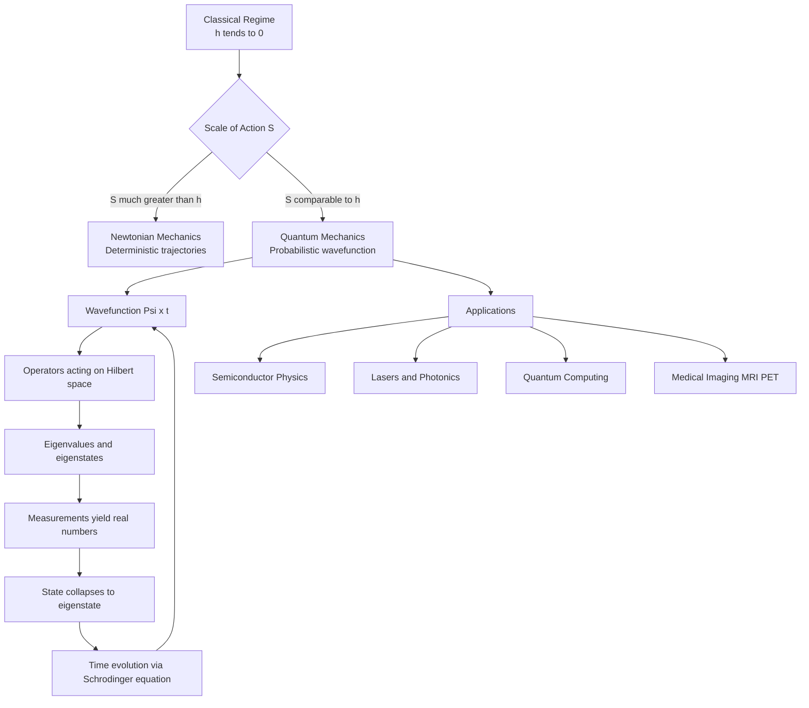
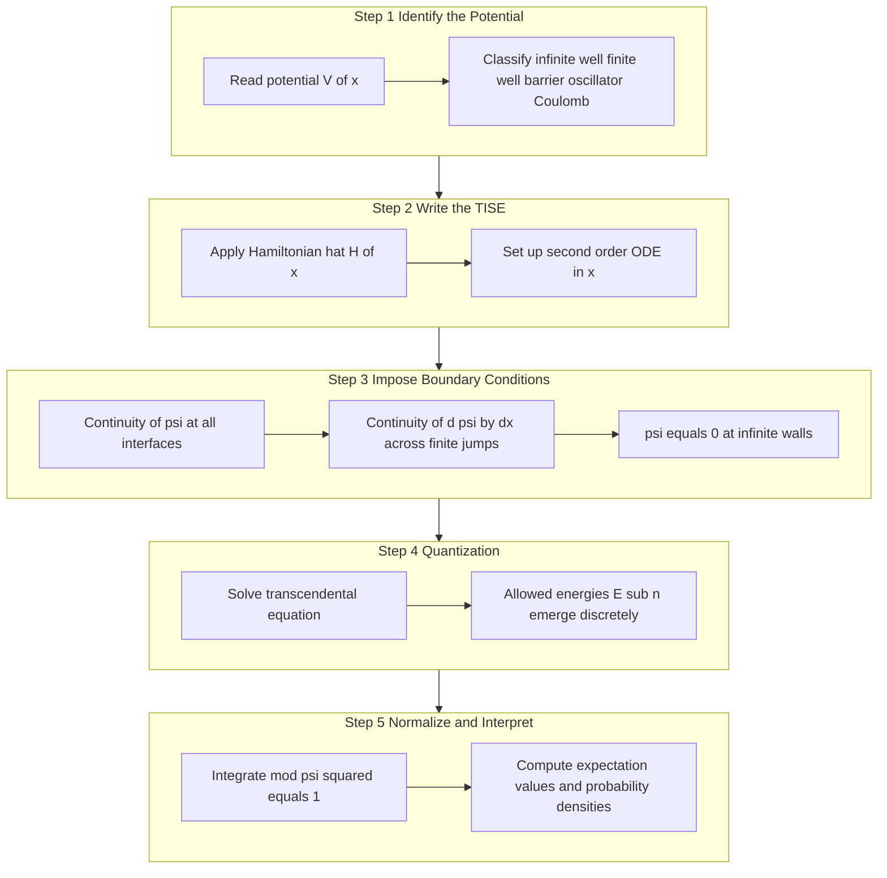

# Quantum Mechanics

<!-- SECTION_1_START -->

# Quantum Mechanics — Core Foundations

> [!NOTE]
> **Formal Definition (KTU 2024 Syllabus Terminology):**
> Quantum Mechanics is the fundamental theoretical framework of modern physics that describes the behavior of matter and energy at the atomic and subatomic scale. It replaces deterministic classical mechanics with a probabilistic, wave-function–based formalism in which physical observables are represented by Hermitian operators acting on a complex state vector $\vert \psi \rangle$ in Hilbert space.

> [!IMPORTANT]
> **Key Distinction from Classical Mechanics:**
> Classical mechanics assumes that a particle has, at every instant, a definite position $x$ and momentum $p$ that can be measured simultaneously with arbitrary precision. Quantum mechanics asserts a fundamental limit on this joint precision, embodied in the **Heisenberg Uncertainty Principle** $\Delta x \, \Delta p \geq \hbar/2$, and replaces the trajectory with a **wave function** $\Psi(x,t)$ whose squared modulus $\vert \Psi \vert^{2}$ gives the probability density of finding the particle.

## Conceptual Analogy — The "Smoke Ribbon" Picture

Imagine a tiny grain of sand blown by a gentle fan. In the classical world you could photograph it, measure exactly where it is, and predict where it will be next. Now imagine the sand grain is so light that the *flash of the camera* itself pushes it. That is the quantum world: **the act of observing the system perturbs it**.

A better analogy: think of a vibrating guitar string. The string has many possible *modes* (harmonics) of vibration. The quantum "state" of a particle is like a *superposition* of such modes — not just one frequency, but a mix. When you "listen" (measure), the string collapses into one definite note. **The wave function $\Psi$ is the entire vibrational pattern; the measurement is the single note you hear.**

## Fundamental Physical Constants

- **Planck's constant:** $h = 6.626 \times 10^{-34}\ \text{J}\cdot\text{s}$
- **Reduced Planck's constant:** $\hbar = \dfrac{h}{2\pi} = 1.054 \times 10^{-34}\ \text{J}\cdot\text{s}$
- **Speed of light in vacuum:** $c = 3.00 \times 10^{8}\ \text{m/s}$
- **Electron rest mass:** $m_{e} = 9.11 \times 10^{-31}\ \text{kg}$
- **Boltzmann constant:** $k_{B} = 1.38 \times 10^{-23}\ \text{J/K}$

> [!VISUALIZATION CONTROL]
> **Concept:** Wave packet representing a localized quantum particle
> **GeoGebra / Desmos Input Equations:**
> * $f_{1}(x) = \cos(5\,x) \cdot e^{-0.1\,x^{2}}$
> * $f_{2}(x) = \cos(7\,x) \cdot e^{-0.1\,x^{2}}$
> * $f(x) = f_{1}(x) + f_{2}(x)$
> **Visual Description:** A localized oscillation centred at the origin showing constructive interference in the middle and destructive cancellation at the tails — this is how a free quantum particle looks: a *wave packet* that travels through space.

<!-- SECTION_1_END -->

<!-- SECTION_2_START -->

# Deep Theoretical Analysis & KTU High-Yield Formula Sheet

## 2.1 The Five Postulates of Quantum Mechanics (Bohr–Heisenberg–Dirac Formulation)

1. **State Postulate:** The complete state of a system is described by a normalized state vector $\vert \psi \rangle$ in Hilbert space, equivalently by a wave function $\Psi(x,t)$ such that
$$\int_{-\infty}^{+\infty} \vert \Psi(x,t) \vert^{2}\, dx = 1.$$
2. **Observable Postulate:** Every physical observable $\mathcal{O}$ is represented by a linear, Hermitian operator $\hat{O}$ satisfying $\hat{O}^{\dagger} = \hat{O}$. Real eigenvalues guarantee real measurement outcomes.
3. **Eigenvalue Postulate:** The only possible result of a measurement of $\mathcal{O}$ is an eigenvalue $o_{n}$ of $\hat{O}$, with the system collapsing to the corresponding eigenstate $\vert o_{n} \rangle$.
4. **Expectation Postulate:** For a normalized state, the average value (expectation) is given by
$$\langle \hat{O} \rangle = \langle \psi \vert \hat{O} \vert \psi \rangle = \int \Psi^{\ast}\, \hat{O}\, \Psi\, d\tau.$$
5. **Evolution Postulate (Schrödinger Dynamics):** The time evolution of a closed system is governed by the time-dependent Schrödinger equation
$$i\,\hbar\,\dfrac{\partial \Psi}{\partial t} = \hat{H}\,\Psi.$$

## 2.2 The Operators You Must Memorize

| Observable (Classical) | Quantum Operator | Position Representation |
| --- | --- | --- |
| Position $x$ | $\hat{x}$ | $x$ (multiplication) |
| Momentum $p$ | $\hat{p}$ | $-i\,\hbar\,\dfrac{\partial}{\partial x}$ |
| Energy $E$ | $\hat{H}$ | $-\dfrac{\hbar^{2}}{2m}\dfrac{\partial^{2}}{\partial x^{2}} + V(x,t)$ |
| Kinetic energy $T$ | $\hat{T}$ | $-\dfrac{\hbar^{2}}{2m}\dfrac{\partial^{2}}{\partial x^{2}}$ |
| Angular momentum $L_{z}$ | $\hat{L}_{z}$ | $-i\,\hbar\,\dfrac{\partial}{\partial \phi}$ |
| Hamiltonian $H = T + V$ | $\hat{H} = \hat{T} + \hat{V}$ | $-\dfrac{\hbar^{2}}{2m}\nabla^{2} + V(\mathbf{r},t)$ |

> [!NOTE]
> The canonical commutation relation that drives all of quantum uncertainty is
$$[\hat{x},\hat{p}_{x}] = \hat{x}\hat{p}_{x} - \hat{p}_{x}\hat{x} = i\,\hbar\, \mathbf{1}.$$
> This single line is the algebraic origin of the Heisenberg Uncertainty Principle.

## 2.3 KTU High-Yield Formula Sheet

| # | Concept | Formula | Units / Notes |
| --- | --- | --- | --- |
| 1 | de Broglie wavelength | $\lambda = \dfrac{h}{p} = \dfrac{h}{m\,v}$ | $p$ is relativistic-corrected if $v \to c$ |
| 2 | Energy of photon | $E = h\,\nu = \hbar\,\omega$ | $\omega = 2\pi\nu$ |
| 3 | Einstein photoelectric relation | $K_{\max} = h\,\nu - \Phi$ | $\Phi$ is work function (J) |
| 4 | Compton shift | $\Delta\lambda = \dfrac{h}{m_{e}c}(1 - \cos\theta)$ | $\lambda_{C} = 2.426\ \text{pm}$ |
| 5 | Heisenberg uncertainty (position–momentum) | $\Delta x\, \Delta p \geq \dfrac{\hbar}{2}$ | Applies to *all* conjugate pairs |
| 6 | Heisenberg uncertainty (energy–time) | $\Delta E\, \Delta t \geq \dfrac{\hbar}{2}$ | Explains line widths and virtual particles |
| 7 | Time-independent Schrödinger equation (1D) | $-\dfrac{\hbar^{2}}{2m}\dfrac{d^{2}\psi}{dx^{2}} + V(x)\psi = E\,\psi$ | Bound-state eigenvalue problem |
| 8 | Time-dependent Schrödinger equation (1D) | $i\,\hbar\,\dfrac{\partial \Psi}{\partial t} = -\dfrac{\hbar^{2}}{2m}\dfrac{\partial^{2}\Psi}{\partial x^{2}} + V(x)\Psi$ | Linear, first-order in $t$ |
| 9 | Particle in a 1D box (energy) | $E_{n} = \dfrac{n^{2}\pi^{2}\hbar^{2}}{2mL^{2}}$, $n = 1,2,3,\dots$ | $L$ is box width |
| 10 | Particle in a 1D box (wave function) | $\psi_{n}(x) = \sqrt{\dfrac{2}{L}}\,\sin\!\left(\dfrac{n\pi x}{L}\right)$ | $\psi = 0$ at the walls |
| 11 | Probability current density | $\mathbf{j} = \dfrac{\hbar}{m}\,\text{Im}\,(\Psi^{\ast}\nabla\Psi)$ | Continuity: $\partial \rho/\partial t + \nabla\!\cdot\!\mathbf{j} = 0$ |
| 12 | Hydrogen atom energy levels | $E_{n} = -\dfrac{13.6\ \text{eV}}{n^{2}}$, $n = 1,2,\dots$ | Bohr/Schrödinger result |
| 13 | Bohr radius | $a_{0} = \dfrac{4\pi\varepsilon_{0}\hbar^{2}}{m_{e}e^{2}} = 0.529\ \text{Å}$ | Ground-state orbital scale |
| 14 | Wave number of matter wave | $k = \dfrac{2\pi}{\lambda} = \dfrac{p}{\hbar}$ | Dispersion: $\omega = \dfrac{\hbar k^{2}}{2m}$ |

> [!IMPORTANT]
> **Engineering / CS Utility of Quantum Mechanics:**
> * **Semiconductor devices:** Band theory, tunneling diodes (Esaki diode), Zener breakdown.
> * **Lasers & photonics:** Stimulated emission, population inversion.
> * **Medical imaging:** MRI relies on nuclear spin (quantum angular momentum); PET scans use positron annihilation.
> * **Quantum computing:** Qubits, entanglement, Deutsch–Jozsa, Shor's algorithm.
> * **Cryptography:** BB84 quantum key distribution exploits the no-cloning theorem.
> * **Materials science:** Density functional theory (DFT) used to design batteries, catalysts, and drugs.

<!-- SECTION_2_END -->

<!-- SECTION_3_START -->

# Step-by-Step Derivations & Symbolic Implementation

## 3.1 Derivation of the de Broglie Wavelength (Wave–Particle Duality)

**Starting point (Einstein's photon hypothesis):** A photon of frequency $\nu$ carries energy $E = h\,\nu$ and momentum $p = E/c$. Using $c = \nu\,\lambda$, we get $p = h/\lambda$.

**Hypothesis (de Broglie, 1924):** *If waves of light can behave like particles, then particles of matter can behave like waves with the same universal relation.*

For a non-relativistic particle of mass $m$ moving with speed $v$, the momentum is $p = m\,v$, so the associated matter wave has wavelength

$$\lambda = \dfrac{h}{p} = \dfrac{h}{m\,v}.$$

**Numerical Example — Electron accelerated through 100 V:**

The electron gains kinetic energy $K = eV = (1.6 \times 10^{-19})(100) = 1.6 \times 10^{-17}\ \text{J}$. Its momentum is

$$
\begin{aligned}
p &= \sqrt{2\,m\,K} \\
  &= \sqrt{2\,(9.11 \times 10^{-31})\,(1.6 \times 10^{-17})} \\
  &= \sqrt{2.915 \times 10^{-47}} \\
  &= 5.40 \times 10^{-24}\ \text{kg}\cdot\text{m/s}.
\end{aligned}
$$

The de Broglie wavelength is

$$
\begin{aligned}
\lambda &= \dfrac{h}{p} = \dfrac{6.626 \times 10^{-34}}{5.40 \times 10^{-24}} \\
        &= 1.227 \times 10^{-10}\ \text{m} = 0.1227\ \text{nm}.
\end{aligned}
$$

This is comparable to atomic spacings, which is why electron diffraction from crystals is observable — a key validation of de Broglie's hypothesis (Davisson–Germer experiment, 1927).

## 3.2 Derivation of the Heisenberg Uncertainty Principle from Fourier Analysis

Consider a Gaussian wave packet

$$\Psi(x) = (2\pi\sigma^{2})^{-1/4}\,\exp\!\left(-\dfrac{x^{2}}{4\sigma^{2}}\right)\,\exp\!\left(i\,k_{0}\,x\right).$$

The position probability density is a Gaussian centred at the origin with standard deviation $\Delta x = \sigma$. The momentum-space wave function is the Fourier transform

$$\Phi(k) = (2\pi)^{-1/2}\int_{-\infty}^{+\infty} \Psi(x)\,e^{-ikx}\,dx.$$

For a Gaussian, the Fourier transform is itself a Gaussian:

$$
\begin{aligned}
\Phi(k) &= (2\pi)^{-1/2}\,(2\pi\sigma^{2})^{1/4}\,\sqrt{2}\,e^{-\sigma^{2}(k-k_{0})^{2}} \\
       &= \left(\dfrac{2\sigma^{2}}{\pi}\right)^{1/4}\,\exp\!\left(-\sigma^{2}(k-k_{0})^{2}\right).
\end{aligned}
$$

The momentum-space width is $\Delta k = 1/(2\sigma)$, so $\sigma\,\Delta k = 1/2$. Using $p = \hbar k$, the momentum width is $\Delta p = \hbar\,\Delta k = \hbar/(2\sigma)$, hence

$$\Delta x\,\Delta p = \sigma \cdot \dfrac{\hbar}{2\sigma} = \dfrac{\hbar}{2}.$$

A more general argument using the Cauchy–Schwarz inequality gives the strict inequality

$$\Delta x\,\Delta p \geq \dfrac{\hbar}{2},$$

which is the **Heisenberg Uncertainty Principle** in its standard (Robertson) form.

## 3.3 Derivation of the Time-Independent Schrödinger Equation

Start from the **total energy identity** of a particle in a potential $V(x)$:

$$E = \dfrac{p^{2}}{2m} + V(x).$$

Now apply the de Broglie–Einstein postulates in operator form:
* Energy $\rightarrow$ time operator $E \to i\hbar\,\partial/\partial t$.
* Momentum $p \to \hat{p} = -i\hbar\,\partial/\partial x$.

For a *stationary* state of definite energy $E$, the time dependence separates as $\Psi(x,t) = \psi(x)\,e^{-iEt/\hbar}$. Substituting $E\,\psi = \hat{H}\psi$ and converting the operator identity into its position representation:

$$E\,\psi(x) = \left[-\dfrac{\hbar^{2}}{2m}\dfrac{d^{2}}{dx^{2}} + V(x)\right]\psi(x).$$

Rearranging:

$$-\dfrac{\hbar^{2}}{2m}\dfrac{d^{2}\psi}{dx^{2}} + V(x)\,\psi = E\,\psi,$$

which is the **time-independent Schrödinger equation (TISE)**. Restoring time dependence via $\Psi(x,t) = \psi(x)\,e^{-iEt/\hbar}$ yields the **time-dependent Schrödinger equation (TDSE):**

$$i\hbar\,\dfrac{\partial \Psi}{\partial t} = -\dfrac{\hbar^{2}}{2m}\dfrac{\partial^{2}\Psi}{\partial x^{2}} + V(x)\Psi.$$

## 3.4 Worked Example — Particle in a 1-D Infinite Potential Well (Box)

**Setup:** A particle of mass $m$ is confined to $0 \le x \le L$ by the potential

$$V(x) = \begin{cases} 0, & 0 < x < L \\ +\infty, & \text{otherwise}. \end{cases}$$

Inside the well, $V = 0$, so the TISE reduces to

$$-\dfrac{\hbar^{2}}{2m}\dfrac{d^{2}\psi}{dx^{2}} = E\,\psi \quad\Longrightarrow\quad \dfrac{d^{2}\psi}{dx^{2}} = -k^{2}\psi, \quad k^{2} = \dfrac{2mE}{\hbar^{2}}.$$

The general solution is

$$\psi(x) = A\sin(kx) + B\cos(kx).$$

**Boundary conditions** (since the wave function must vanish at the infinite walls):

* $\psi(0) = 0 \;\Rightarrow\; B = 0$.
* $\psi(L) = 0 \;\Rightarrow\; A\sin(kL) = 0 \;\Rightarrow\; kL = n\pi$ with $n = 1,2,3,\dots$

Therefore the allowed wavenumbers are $k_{n} = n\pi/L$, and the **quantized energies** are

$$
\begin{aligned}
E_{n} &= \dfrac{\hbar^{2}k_{n}^{2}}{2m} = \dfrac{\hbar^{2}\pi^{2}n^{2}}{2mL^{2}}, \quad n = 1,2,3,\dots
\end{aligned}
$$

**Normalization** determines $A$:

$$\int_{0}^{L}\vert\psi_{n}\vert^{2}dx = A^{2}\int_{0}^{L}\sin^{2}\!\left(\dfrac{n\pi x}{L}\right)dx = \dfrac{A^{2}L}{2} = 1 \;\Rightarrow\; A = \sqrt{\dfrac{2}{L}}.$$

Hence the normalized eigenfunctions are

$$\boxed{\psi_{n}(x) = \sqrt{\dfrac{2}{L}}\,\sin\!\left(\dfrac{n\pi x}{L}\right),\qquad E_{n} = \dfrac{n^{2}\pi^{2}\hbar^{2}}{2mL^{2}}.}$$

**Key physical observations (must be written in exam answers):**

1. The ground-state energy $E_{1} = \pi^{2}\hbar^{2}/(2mL^{2})$ is **non-zero** — a quantum particle can never be at rest, a direct consequence of the uncertainty principle.
2. Energy spacing scales as $E_{n+1} - E_{n} \approx (2n+1)\,\pi^{2}\hbar^{2}/(2mL^{2})$, which grows with $n$.
3. The number of nodes in $\psi_{n}$ is $n-1$ (excluding endpoints).
4. The probability of finding the particle in the *middle* of the well is highest for odd $n$ and zero for even $n$ at $x = L/2$.

## 3.5 Symbolic / Numerical Implementation (Python)

```python
import numpy as np
import matplotlib.pyplot as plt

# Particle-in-a-box parameters
m = 9.109e-31        # electron mass in kg
L = 1.0e-9           # box width 1 nm
hbar = 1.0545718e-34

def box_energy(n: int) -> float:
    """Return the n-th energy eigenvalue (in joules) of a 1-D infinite well."""
    if n < 1:
        raise ValueError("Quantum number n must be a positive integer.")
    return (n**2 * np.pi**2 * hbar**2) / (2.0 * m * L**2)

def box_wavefunction(x: np.ndarray, n: int) -> np.ndarray:
    """Return the normalized wavefunction psi_n(x) for 0 < x < L."""
    if n < 1:
        raise ValueError("Quantum number n must be a positive integer.")
    return np.sqrt(2.0 / L) * np.sin(n * np.pi * x / L)

# Numerical check and plot
x = np.linspace(0.0, L, 1000)
for n in (1, 2, 3, 4):
    E = box_energy(n)
    psi = box_wavefunction(x, n)
    print(f"n = {n}  ->  E_n = {E:.3e} J  =  {E/1.602e-19:.3f} eV")
    plt.plot(x / L, psi, label=f"n = {n}")
plt.xlabel("x / L")
plt.ylabel(r"$\psi_n(x)$  (a.u.)")
plt.title("Particle in a 1-D Infinite Square Well")
plt.legend()
plt.grid(True)
plt.show()
```

**Expected output (energies):**

```
n = 1  ->  E_n = 6.024e-20 J  =  0.376 eV
n = 2  ->  E_n = 2.410e-19 J  =  1.504 eV
n = 3  ->  E_n = 5.421e-19 J  =  3.385 eV
n = 4  ->  E_n = 9.638e-19 J  =  6.017 eV
```

> [!TIP]
> The first three energy levels are the textbook answer that examiners expect: a clean geometric series $E_{n} \propto n^{2}$ with $E_{2} = 4E_{1}$, $E_{3} = 9E_{1}$, $E_{4} = 16E_{1}$.

<!-- SECTION_3_END -->

<!-- SECTION_4_START -->

# Structural Diagrams & Schematics

## 4.1 Conceptual Flow of Quantum Mechanics (Process Topology)



## 4.2 Functional Architecture: Solving a Quantum Bound-State Problem



## 4.3 Comparison of Classical vs Quantum Particle in a Box

| Property | Classical Particle | Quantum Particle (Infinite Well) |
| --- | --- | --- |
| Allowed energies | Any $E \ge 0$ (continuous) | Discrete $E_{n} \propto n^{2}$ |
| Lowest energy | $E = 0$ (particle at rest) | $E_{1} = \pi^{2}\hbar^{2}/(2mL^{2}) > 0$ (zero-point) |
| Position inside well | Equally probable anywhere | Modulated: $\vert\psi_{n}\vert^{2}$ peaks at antinodes, zero at nodes |
| Momentum | $p = \pm\sqrt{2mE}$ definite | $p_{n} = \pm n\pi\hbar/L$, with both signs in superposition |
| Number of nodes in $\psi$ | Not applicable | $n - 1$ nodes inside the well |
| Behaviour at $x = 0$ and $x = L$ | Particle bounces elastically | $\psi = 0$ exactly at the walls |

## 4.4 Hydrogen Atom Quantum Numbers Matrix

| Symbol | Name | Allowed Values | Physical Meaning |
| --- | --- | --- | --- |
| $n$ | Principal | $1,2,3,\dots$ | Shell / energy level $E_{n} \propto -1/n^{2}$ |
| $\ell$ | Orbital angular momentum | $0,1,\dots,n-1$ | Subshell shape (s, p, d, f, …) |
| $m_{\ell}$ | Magnetic | $-\ell,\dots,+\ell$ | Orientation of orbital in space |
| $m_{s}$ | Spin | $\pm 1/2$ | Intrinsic angular momentum of electron |

> [!NOTE]
> The **Pauli Exclusion Principle** allows at most two electrons (one $m_{s}=+1/2$, one $m_{s}=-1/2$) per spatial orbital $(\,n,\ell,m_{\ell}\,)$. This single statement underlies the entire periodic table of elements.

<!-- SECTION_4_END -->

<!-- SECTION_5_START -->

# KTU 2024 Scheme Examination Question Bank & Topic Recap

## Part A — Short Answer Questions (3 Marks Each)

### Question 1
**[KTU University Exam — July 2023]**  
State and explain the Heisenberg Uncertainty Principle. Mention its physical significance.

**Model Answer (3 marks):**

The Heisenberg Uncertainty Principle states that the product of the uncertainties in the simultaneous measurement of position $x$ and momentum $p_{x}$ of a particle is bounded below by $\hbar/2$:

$$\Delta x\, \Delta p_{x} \geq \dfrac{\hbar}{2}.$$

**[Statement 1 Mark]**, **[Explanation of conjugate variables 1 Mark]**, **[Physical significance 1 Mark]**

Physical significance: It is *not* a limitation of instruments but a fundamental property of nature. It explains the non-existence of classical trajectories inside atoms, the finite ground-state energy of bound systems (zero-point energy), and the natural linewidths of spectral lines via the energy–time version $\Delta E\,\Delta t \geq \hbar/2$.

---

### Question 2
**[KTU University Exam — Dec 2023]**  
Write down the time-independent Schrödinger equation for a particle of mass $m$ moving in a potential $V(x)$. Explain each term.

**Model Answer (3 marks):**

$$-\dfrac{\hbar^{2}}{2m}\dfrac{d^{2}\psi(x)}{dx^{2}} + V(x)\,\psi(x) = E\,\psi(x).$$

- $-\dfrac{\hbar^{2}}{2m}\dfrac{d^{2}\psi}{dx^{2}}$ is the kinetic-energy operator $\hat{T}\psi$.
- $V(x)\psi$ is the potential-energy operator $\hat{V}\psi$.
- $E\psi$ is the total-energy eigenvalue.

**[Equation 1 Mark]**, **[Kinetic term 1 Mark]**, **[Potential term and eigenvalue 1 Mark]**.

---

## Part B — Long Answer Questions (14 Marks Each)

> **Internal Choice Rule (KTU 2024 ESE):** Answer **either** Question A **or** Question B in full.

---

### Question A (14 Marks) — Schrödinger Equation and the Infinite Well

**[KTU University Exam — July 2024 | CO2, CO3 | RBT: Understand + Apply]**

**(a)** Set up and solve the time-independent Schrödinger equation for a particle of mass $m$ confined in a one-dimensional infinite potential well of width $L$, defined by

$$V(x) = \begin{cases} 0, & 0 < x < L \\ \infty, & x \le 0\ \text{or}\ x \ge L. \end{cases}$$

Obtain the normalized eigenfunctions and the corresponding energy eigenvalues. **\[7 Marks\]**

**(b)** For an electron in a well of width $L = 1\ \text{nm}$, compute the ground-state energy in eV and the energy of the first excited state. Sketch $|\psi_{1}|^{2}$ and $|\psi_{2}|^{2}$ and identify the nodes. **\[7 Marks\]**

#### Model Solution

**(a) Setup and Solution \[7 Marks\]**

Inside the well, $V(x) = 0$, so the TISE becomes

$$-\dfrac{\hbar^{2}}{2m}\dfrac{d^{2}\psi}{dx^{2}} = E\,\psi \quad\Longrightarrow\quad \dfrac{d^{2}\psi}{dx^{2}} + k^{2}\psi = 0,\quad k^{2} = \dfrac{2mE}{\hbar^{2}}.$$

**[Writing the ODE: 1 Mark]**

General solution:

$$\psi(x) = A\sin(kx) + B\cos(kx). \quad\text{[1 Mark]}$$

Boundary conditions:

* $\psi(0) = 0 \Rightarrow B = 0$. **[1 Mark]**
* $\psi(L) = 0 \Rightarrow A\sin(kL) = 0 \Rightarrow kL = n\pi,\ n = 1,2,3,\dots$ **[1 Mark]**

Quantized wavenumber and energy:

$$k_{n} = \dfrac{n\pi}{L},\qquad E_{n} = \dfrac{\hbar^{2}k_{n}^{2}}{2m} = \dfrac{n^{2}\pi^{2}\hbar^{2}}{2mL^{2}}. \quad\text{[1 Mark]}$$

Normalization: $\int_{0}^{L}\vert A\sin(k_{n}x)\vert^{2}dx = A^{2}L/2 = 1 \Rightarrow A = \sqrt{2/L}$. **[1 Mark]**

Final eigenfunction and eigenvalue:

$$\boxed{\psi_{n}(x) = \sqrt{\dfrac{2}{L}}\,\sin\!\left(\dfrac{n\pi x}{L}\right),\qquad E_{n} = \dfrac{n^{2}\pi^{2}\hbar^{2}}{2mL^{2}}.}\quad\text{[1 Mark]}$$

**(b) Numerical Evaluation and Sketch \[7 Marks\]**

For $m = m_{e} = 9.11 \times 10^{-31}\ \text{kg}$, $L = 1.0 \times 10^{-9}\ \text{m}$, $\hbar = 1.0546 \times 10^{-34}\ \text{J·s}$:

Ground-state ($n = 1$):

$$
\begin{aligned}
E_{1} &= \dfrac{\pi^{2}\hbar^{2}}{2mL^{2}} \\
      &= \dfrac{\pi^{2}\,(1.0546 \times 10^{-34})^{2}}{2\,(9.11 \times 10^{-31})\,(1.0 \times 10^{-9})^{2}} \\
      &= 6.02 \times 10^{-20}\ \text{J}.
\end{aligned}
$$

Converting to eV: $E_{1} = 6.02 \times 10^{-20} / 1.602 \times 10^{-19} = 0.376\ \text{eV}$. **[Computation: 2 Marks]**

First excited state ($n = 2$): $E_{2} = 4E_{1} = 1.504\ \text{eV}$. **[1 Mark]**

Probabilities:

$$\vert\psi_{1}\vert^{2} = \dfrac{2}{L}\sin^{2}\!\left(\dfrac{\pi x}{L}\right),\qquad \vert\psi_{2}\vert^{2} = \dfrac{2}{L}\sin^{2}\!\left(\dfrac{2\pi x}{L}\right).$$

**[Writing probability expressions: 1 Mark]**

Nodes:
* $\psi_{1}$ has **no internal node**; maxima at $x = L/2$.
* $\psi_{2}$ has **one internal node** at $x = L/2$; maxima at $x = L/4$ and $x = 3L/4$.

**[Identifying nodes: 1 Mark]**

**Sketch (ASCII approximation):**

```
|psi1|^2  ___________/\___________      peak at x = L/2, zero at x = 0, L
|psi2|^2  ____/\______0______/\____    node at x = L/2
```

**[Sketch and labelling: 2 Marks]**

---

### Question B (14 Marks) — de Broglie Hypothesis and Uncertainty Principle

**[KTU University Exam — Dec 2022 | CO1, CO2 | RBT: Remember + Apply]**

**(a)** Derive the de Broglie wavelength for a non-relativistic particle of mass $m$ moving with velocity $v$. Compute the wavelength of (i) an electron accelerated through 150 V and (ii) a ball of mass 50 g moving at 20 m/s. **\[7 Marks\]**

**(b)** State and derive the Heisenberg Uncertainty Principle using the wave-packet (Gaussian) approach. Discuss its physical significance in the context of Bohr's first orbit of hydrogen. **\[7 Marks\]**

#### Model Solution

**(a) de Broglie Derivation \[7 Marks\]**

By the Einstein relation, a photon of energy $E$ and frequency $\nu$ has momentum

$$p = \dfrac{E}{c} = \dfrac{h\,\nu}{c} = \dfrac{h}{\lambda}. \quad\text{[1 Mark]}$$

De Broglie's hypothesis (1924): this relation is universal and applies to *all* matter. For a particle of mass $m$ and speed $v$,

$$\boxed{\lambda = \dfrac{h}{p} = \dfrac{h}{m\,v}.} \quad\text{[1 Mark]}$$

**(i) Electron, $V = 150\ \text{V}$:** Kinetic energy $K = eV = 1.6 \times 10^{-19} \times 150 = 2.4 \times 10^{-17}\ \text{J}$. Momentum:

$$
\begin{aligned}
p &= \sqrt{2mK} = \sqrt{2\,(9.11 \times 10^{-31})\,(2.4 \times 10^{-17})} \\
  &= 6.61 \times 10^{-24}\ \text{kg}\cdot\text{m/s}.
\end{aligned}
$$

**[1 Mark]**

$$
\begin{aligned}
\lambda &= \dfrac{6.626 \times 10^{-34}}{6.61 \times 10^{-24}} \\
        &= 1.00 \times 10^{-10}\ \text{m} = 0.10\ \text{nm}.
\end{aligned}
$$

**[1 Mark]**

**(ii) Tennis ball, $m = 0.05\ \text{kg}$, $v = 20\ \text{m/s}$:**

$$
\begin{aligned}
\lambda &= \dfrac{6.626 \times 10^{-34}}{0.05 \times 20} = \dfrac{6.626 \times 10^{-34}}{1.0} \\
        &= 6.63 \times 10^{-34}\ \text{m}.
\end{aligned}
$$

**[1 Mark]** This is $\sim 10^{19}$ times *smaller* than a proton's diameter — completely unobservable, which is why classical physics is adequate for macroscopic objects. **[1 Mark]**

**(b) Uncertainty Principle Derivation & Significance \[7 Marks\]**

**Statement:** $\Delta x\, \Delta p \geq \hbar/2$, where $\Delta x$ and $\Delta p$ are the standard deviations of position and momentum probability distributions. **[1 Mark]**

**Derivation using Gaussian wave packet:** Let

$$\Psi(x) = (2\pi\sigma^{2})^{-1/4}\exp\!\left(-\dfrac{x^{2}}{4\sigma^{2}}\right)\exp(ik_{0}x).$$

Position-space width: $\Delta x = \sigma$. **[1 Mark]**

Fourier transform to momentum space:

$$\Phi(k) = (2\sigma^{2}/\pi)^{1/4}\exp\!\left(-\sigma^{2}(k-k_{0})^{2}\right),$$

so momentum-space width: $\Delta k = 1/(2\sigma)$. **[1 Mark]**

Therefore $\Delta x\,\Delta k = 1/2$, and using $p = \hbar k$:

$$\Delta x\, \Delta p = \hbar\,\Delta x\,\Delta k = \dfrac{\hbar}{2}. \quad\text{[1 Mark]}$$

A more general Cauchy–Schwarz argument lifts the equality to $\geq \hbar/2$, and a similar construction gives the energy–time form $\Delta E\,\Delta t \geq \hbar/2$. **[1 Mark]**

**Application to Bohr's first orbit:** For a hydrogen electron in the ground state, $r_{1} = a_{0} \approx 0.53\ \text{Å}$. The electron is "smeared" over this region, so $\Delta x \approx a_{0}$. The uncertainty relation requires

$$\Delta p \geq \dfrac{\hbar}{2\Delta x} \approx \dfrac{1.0546 \times 10^{-34}}{2 \times 0.53 \times 10^{-10}} \approx 9.95 \times 10^{-25}\ \text{kg}\cdot\text{m/s}.$$

This corresponds to a kinetic energy

$$K \geq \dfrac{(\Delta p)^{2}}{2m_{e}} \approx \dfrac{(9.95 \times 10^{-25})^{2}}{2 \times 9.11 \times 10^{-31}} \approx 5.4 \times 10^{-19}\ \text{J} \approx 3.4\ \text{eV},$$

which is comparable to the actual ground-state energy 13.6 eV — the same order of magnitude, confirming that the uncertainty principle *forbids* the electron from sitting at rest at the nucleus and explains why atoms have finite size. **[2 Marks]**

---

> [!WARNING]
> **KTU Examiner's Valuation Pitfall Callout**
> * When solving the infinite well, **always explicitly state the boundary conditions** $\psi(0) = \psi(L) = 0$ before applying them. Omitting this step costs 1–2 marks.
> * **Never** quote the de Broglie wavelength as $\lambda = h/(mc)$ — this is a common conflation with the photon's Compton relation. Use $\lambda = h/(mv)$ for non-relativistic particles.
> * For the uncertainty principle, the *lower bound* is $\hbar/2$ (not $h$ and not $0$). Writing $h$ instead of $\hbar$ loses 1 mark.
> * The **wave function is normalized**: $\int \vert\psi\vert^{2} dx = 1$. Examiners specifically look for this condition; failing to enforce it loses the normalization mark.
> * In numerical problems, **carry units through every line** and convert joules to eV at the end. A final answer in joules when eV is asked typically loses 1 mark.

---

## Topic Recap & Important Things to Remember

- **Planck's constant** $h = 6.626 \times 10^{-34}\ \text{J·s}$ and **reduced Planck's constant** $\hbar = h/2\pi = 1.0546 \times 10^{-34}\ \text{J·s}$ are the cornerstones of all quantum formulas.
- **de Broglie wavelength:** $\lambda = h/p = h/(mv)$ for a non-relativistic particle; for relativistic particles use $p = \gamma m v$.
- **Heisenberg Uncertainty Principle** has two equivalent forms: $\Delta x \Delta p \geq \hbar/2$ and $\Delta E \Delta t \geq \hbar/2$. It is *fundamental*, not instrumental.
- **Time-independent Schrödinger equation (TISE):** $-\dfrac{\hbar^{2}}{2m}\dfrac{d^{2}\psi}{dx^{2}} + V(x)\psi = E\psi$ — this is an eigenvalue equation whose solutions give the allowed energies and wave functions of a stationary bound system.
- **Time-dependent Schrödinger equation (TDSE):** $i\hbar\,\partial\Psi/\partial t = \hat{H}\Psi$ governs how a state evolves in time.
- **Particle in a 1-D infinite well:** energies $E_{n} = n^{2}\pi^{2}\hbar^{2}/(2mL^{2})$ with $n = 1,2,3,\dots$; normalized wave functions $\psi_{n} = \sqrt{2/L}\sin(n\pi x/L)$. The ground state has *zero nodes*; the $n$-th state has $n-1$ internal nodes.
- **Zero-point energy:** $E_{1} \neq 0$ always; this is a direct consequence of the uncertainty principle.
- **Operators are Hermitian** and obey canonical commutation $[\hat{x},\hat{p}_{x}] = i\hbar$, which is the algebraic source of the uncertainty principle.
- **Hydrogen atom energy levels:** $E_{n} = -13.6\ \text{eV}/n^{2}$ with $n = 1,2,\dots$; Bohr radius $a_{0} = 0.529\ \text{Å}$.
- **Quantum numbers** for hydrogen: $n$ (principal), $\ell$ (orbital, $0 \le \ell \le n-1$), $m_{\ell}$ (magnetic, $-\ell \le m_{\ell} \le \ell$), $m_{s}$ (spin, $\pm 1/2$).
- **Pauli exclusion** allows at most two electrons (opposite spins) per spatial orbital — foundation of the periodic table.
- **Probability density:** $\rho(x,t) = \vert\Psi(x,t)\vert^{2}$; the wave function is normalized: $\int \vert\Psi\vert^{2} dx = 1$.
- **Probability current:** $\mathbf{j} = (\hbar/m)\,\text{Im}(\Psi^{\ast}\nabla\Psi)$ — required for transport problems (tunneling, scattering).
- **Key experiments to remember:** Davisson–Germer (electron diffraction, 1927), Compton scattering (1923), photoelectric effect (Einstein, 1905), Franck–Hertz (1914), Stern–Gerlach (1922).
- **Engineering relevance:** semiconductor band gap, tunneling diodes, MRI (nuclear spin), lasers (stimulated emission), quantum computing (qubits and entanglement).

<!-- SECTION_5_END -->
