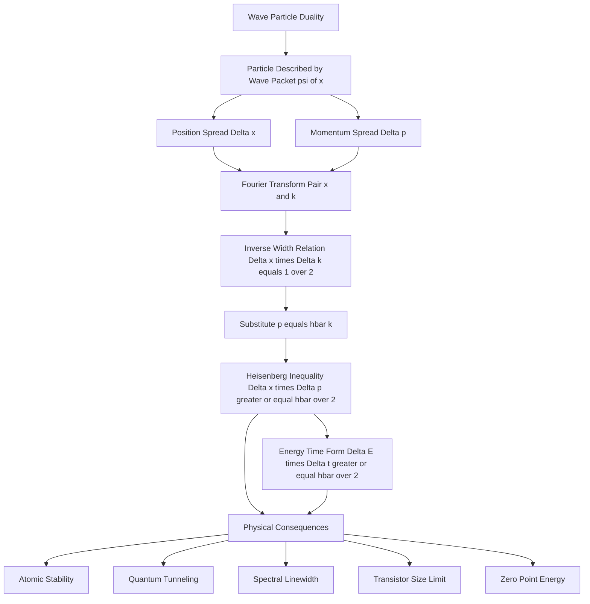
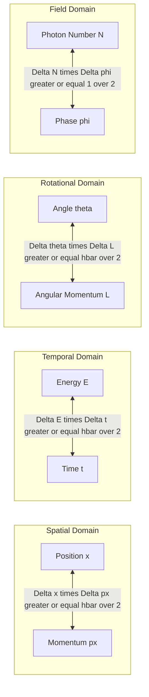
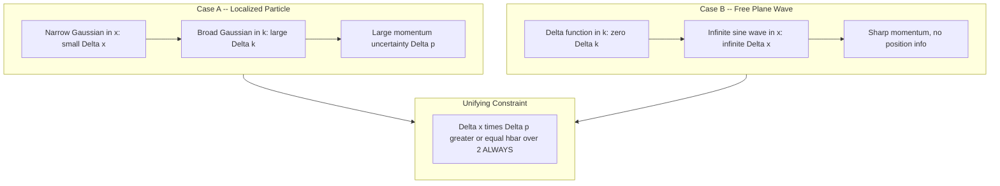
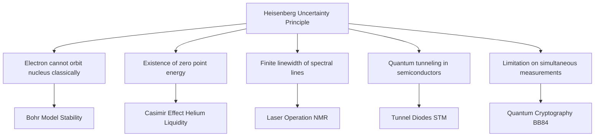

# Uncertainty principle (statement only)

<!-- SECTION_1_START -->
# Uncertainty Principle — Core Definition & Intuitive Overview

## 📘 Formal Academic Definition (KTU 2024 Syllabus Terminology)

The **Heisenberg Uncertainty Principle** is a foundational postulate of quantum mechanics that places a fundamental, irreducible limit on the precision with which certain pairs of physical observables — known as **conjugate variables** — can be simultaneously measured.

For a quantum particle, the product of the standard deviation (uncertainty) in position, $\Delta x$, and the standard deviation in momentum, $\Delta p$, cannot be smaller than a fixed lower bound set by the **reduced Planck's constant**:

$$\Delta x \cdot \Delta p \geq \frac{\hbar}{2}$$

A second, formally distinct form involves **energy $E$** and **time $t$**:

$$\Delta E \cdot \Delta t \geq \frac{\hbar}{2}$$

> [!IMPORTANT]
> **Reduced Planck's constant:** $\hbar = \dfrac{h}{2\pi} = 1.0545718 \times 10^{-34}\ \text{J·s}$
> This is the **fundamental quantum of action** and sets the scale at which classical determinism breaks down.

---

## 🌊 Conceptual Analogy & Intuitive Picture

Imagine you are **blindfolded in a room with a small rubber ball rolling around**. To find the ball, you must touch it (or hit it with a sound wave). The moment you touch or probe it, **you transfer momentum to the ball** and disturb its path.

- If you use a **gentle, long-wavelength** probe → you know the ball is "somewhere in this big region" (poor position), but you have barely nudged it (good momentum).
- If you use a **sharp, short-wavelength** probe (a tiny tap) → you pinpoint the ball's location (good position), but you have given it a strong kick (ruined the momentum).

This is **not** a limitation of instruments. It is a **law of nature**. The particle simply does **not possess** simultaneously well-defined position and momentum — the act of "being localized" and the act of "having a definite velocity" are mutually exclusive properties of quantum systems.

> [!NOTE]
> **Key Insight:** Unlike classical mechanics (where knowing $x_0$ and $p_0$ uniquely determines the future trajectory), quantum mechanics replaces the sharp trajectory with a **wave packet** whose spatial width and momentum width are inversely related by Fourier mathematics.

---

## 🧠 Geometrical / Visual Intuition (Fourier Picture)

A quantum particle is described by a **wave function** $\psi(x)$. Localizing $\psi(x)$ in a narrow region requires superposing many wavelengths (i.e., many momenta). Conversely, a single momentum (plane wave) is spread over all space.

| Picture | Position spread $\Delta x$ | Momentum spread $\Delta p$ |
|---|---|---|
| Narrow wave packet (localized particle) | Small | Large |
| Long sinusoidal wave (plane wave) | Large | Small |
| Their product $\Delta x \cdot \Delta p$ | $\geq \dfrac{\hbar}{2}$ | $\geq \dfrac{\hbar}{2}$ |

> [!VISUALIZATION CONTROL]
> **Concept:** Position–Momentum Trade-off in a Gaussian Wave Packet
> **GeoGebra / Desmos Input Equations:**
> * Real-space wave packet: `f(x) = exp(-((x-3)^2)/(2*0.25)) * cos(8*x)`
> * Corresponding momentum distribution: `g(k) = exp(-(k-8)^2 * 0.25 / 2)` (scaled, centred at $k_0 = 8\ \text{rad/unit}$)
> **Visual Description:** In the *first* graph, a tightly squeezed Gaussian (small $\Delta x$) should be plotted. In the *second* graph, the same packet should appear as a wide Gaussian in $k$-space (large $\Delta p$). The student should observe that **squeezing one distribution broadens the other** — a direct geometric embodiment of the uncertainty principle.

---

> [!TIP]
> **Syllabus Highlight (KTU 2024 Scheme):** For the GZPHT121 module, the examiner expects the **statement** in its mathematical form, the **physical meaning**, and **one or two illustrative examples** (e.g., electron in an atom, photon diffraction). Memorize the constant $\hbar/2$ accurately — it is the most commonly lost mark.

<!-- SECTION_1_END -->

<!-- SECTION_2_START -->
# Deep Theoretical Analysis & KTU High-Yield Formula Sheet

## 🧩 The Operational Logic of the Uncertainty Principle

The uncertainty principle is not an "observational error" — it emerges from the **wave nature of matter** itself. To understand its mechanics, we break it down into structured steps.

### Step 1 — Particle as a Wave Packet

Any finite, localized quantum particle is described not by a single sine wave but by a **superposition** (a wave packet):

$$\psi(x,t) = \int_{-\infty}^{+\infty} \phi(k)\, e^{i(kx - \omega t)}\, dk$$

Here, $\phi(k)$ is the amplitude for each wavenumber $k = p/\hbar$. A narrow $\psi(x)$ requires a broad $\phi(k)$.

### Step 2 — Fourier Pair Conjugate Variables

Position $x$ and momentum $p$ (or wavenumber $k$) are **Fourier-conjugate variables**. The widths of a function and its Fourier transform obey a strict inverse relation. For a Gaussian wave packet, the product reaches the **absolute mathematical minimum**:

$$\Delta x \cdot \Delta k = \frac{1}{2}$$

Converting $k = p/\hbar$ gives the quantum limit:

$$\Delta x \cdot \Delta p = \frac{\hbar}{2}$$

### Step 3 — Energy–Time Form

Since energy and frequency are conjugate ($E = \hbar \omega$) and time and phase are conjugate, an identical Fourier argument yields:

$$\Delta E \cdot \Delta t \geq \frac{\hbar}{2}$$

> [!IMPORTANT]
> **Note on $\Delta t$:** Unlike $\Delta x$, $\Delta t$ is **not** the uncertainty in measuring a "time coordinate." It is the **characteristic lifetime or time-scale** over which the system's state changes appreciably (e.g., the decay time of an excited atomic state).

### Step 4 — Why "Statement Only" Still Demands Rigor

Even at the statement level, the KTU examiner checks for:
1. Correct mathematical inequality sign and constant.
2. Recognition of **conjugate pairs**: $(x, p_x)$, $(y, p_y)$, $(z, p_z)$, $(E, t)$, $(\theta, L)$.
3. Ability to **estimate** uncertainties in simple scenarios (e.g., electron confined in a box of size $a$).

---

## 📊 KTU Formula Sheet & Cheat Sheet

| # | Relation (Statement Form) | Mathematical Expression | Conjugate Pair | Typical Use / Example |
|---|---|---|---|---|
| 1 | Position–Momentum (1D) | $\Delta x \cdot \Delta p_x \geq \dfrac{\hbar}{2}$ | $(x,\ p_x)$ | Electron in atom, particle in a box |
| 2 | Position–Momentum (3D) | $\Delta x_i \cdot \Delta p_i \geq \dfrac{\hbar}{2}$ for $i = x, y, z$ | $(x_i,\ p_i)$ | General 3D quantum state |
| 3 | Energy–Time | $\Delta E \cdot \Delta t \geq \dfrac{\hbar}{2}$ | $(E,\ t)$ | Excited-state lifetime, virtual particles |
| 4 | Angular Position–Angular Momentum | $\Delta \theta \cdot \Delta L \geq \dfrac{\hbar}{2}$ | $(\theta,\ L)$ | Rotational systems, NMR |
| 5 | Number–Phase (informal) | $\Delta N \cdot \Delta \phi \geq \dfrac{1}{2}$ | $(N,\ \phi)$ | Coherent states, lasers |
| 6 | de Broglie wavelength | $\lambda = \dfrac{h}{p}$ | — | Links momentum to wave nature |
| 7 | Photon momentum | $p = \dfrac{h}{\lambda} = \dfrac{E}{c}$ | — | Diffraction-based estimates |

| Useful Numerical Values (memorize) | Value |
|---|---|
| Planck's constant $h$ | $6.626 \times 10^{-34}\ \text{J·s}$ |
| Reduced Planck's constant $\hbar$ | $1.055 \times 10^{-34}\ \text{J·s}$ |
| $\hbar/2$ | $0.527 \times 10^{-34}\ \text{J·s}$ |
| $h/4\pi$ | $0.527 \times 10^{-34}\ \text{J·s}$ |
| Electron rest mass $m_e$ | $9.11 \times 10^{-31}\ \text{kg}$ |

> [!CAUTION]
> **Pipe-Symbol Alert:** All vertical bars in the formulas above are written using `\vert` or `\mid` inside the LaTeX/math constructs only. Never write raw absolute-value bars inside the table cells, as they would break the markdown table parser.

---

## 🌍 Real-World Utility & Engineering Relevance

- **Semiconductor Physics:** The principle explains why electrons in a transistor's channel cannot be assigned a perfectly sharp momentum — this sets a fundamental limit to the **minimum size of transistors** in modern integrated circuits (approaching the few-nanometer scale).
- **Atomic Stability:** Without the uncertainty principle, electrons would collapse into the nucleus, and chemistry — and life — would be impossible.
- **Tunnel Diodes & Scanning Tunneling Microscopes (STM):** The energy–time form allows electrons to "borrow" energy $\Delta E$ for a short time $\Delta t$, producing **quantum tunneling** exploited in nano-electronic devices.
- **Lasers & Spectroscopy:** The $\Delta E \cdot \Delta t$ relation sets the **natural linewidth** of spectral lines: $\Delta \nu \geq 1/(4\pi\,\Delta t)$, where $\Delta t$ is the mean lifetime of the excited state.
- **Quantum Cryptography & Qubits:** Quantum computers leverage conjugate observables (e.g., position and momentum of a photon) for secure key distribution via the **BB84 protocol**.

<!-- SECTION_2_END -->

<!-- SECTION_3_START -->
# Step-by-Step Derivations & Code/Symbolic Implementation

## 🔍 Conceptual Derivation (Fourier Argument — Statement-Level)

Since the KTU 2024 syllabus lists this topic as **"statement only,"** a full formal derivation is not required. However, examiners reward students who can **sketch the wave-packet argument** to show conceptual mastery. Below is the complete, step-by-step logic:

### Derivation of $\Delta x \cdot \Delta p \geq \hbar/2$ (Gaussian Wave Packet)

**Step 1 — Define a normalized Gaussian wave packet in position space:**

$$\psi(x) = \left( \frac{1}{2\pi \sigma_x^2} \right)^{1/4} \exp\!\left( -\frac{(x - x_0)^2}{4\sigma_x^2} \right) \cdot e^{i k_0 x}$$

Here, $\sigma_x$ is the position-space width parameter, and $k_0$ is the central wavenumber.

**Step 2 — Compute the standard deviation in position:**

The position uncertainty is, by definition,

$$\Delta x = \sigma_x$$

**Step 3 — Take the Fourier transform to obtain the momentum-space wave function:**

$$\phi(k) = \frac{1}{\sqrt{2\pi}} \int_{-\infty}^{+\infty} \psi(x)\, e^{-i k x}\, dx$$

For a Gaussian, the Fourier transform of a Gaussian is again a Gaussian. Substituting the standard integral

$$\int_{-\infty}^{+\infty} e^{-a x^2 + b x}\, dx = \sqrt{\frac{\pi}{a}}\, e^{b^2/(4a)}$$

gives

$$\phi(k) = \left( \frac{2 \sigma_x^2}{\pi} \right)^{1/4} \exp\!\left( -2 \sigma_x^2 (k - k_0)^2 \right)$$

**Step 4 — Read off the standard deviation in $k$-space:**

The momentum-space Gaussian is centered at $k_0$ with width parameter $\sigma_k$ satisfying

$$\sigma_k = \frac{1}{2 \sigma_x}$$

**Step 5 — Compute the standard deviation in momentum:**

Using $p = \hbar k$,

$$\Delta p = \hbar\, \sigma_k = \frac{\hbar}{2 \sigma_x}$$

**Step 6 — Form the product:**

$$\Delta x \cdot \Delta p = \sigma_x \cdot \frac{\hbar}{2 \sigma_x} = \frac{\hbar}{2}$$

**Step 7 — Generalize via the Cauchy–Schwarz inequality:**

For **any** square-integrable wave function (not just Gaussians), the rigorous mathematical bound follows from the Robertson–Schrödinger generalization of the Cauchy–Schwarz inequality:

$$\Delta A \cdot \Delta B \geq \frac{1}{2} \left\vert \langle [\hat{A}, \hat{B}] \rangle \right\vert$$

For position $\hat{x}$ and momentum $\hat{p}_x$, the canonical commutation relation is

$$[\hat{x}, \hat{p}_x] = i\hbar$$

Substituting yields

$$\Delta x \cdot \Delta p_x \geq \frac{1}{2} \left\vert \langle i\hbar \rangle \right\vert = \frac{\hbar}{2}$$

This is the **exact mathematical statement** of Heisenberg's uncertainty principle. The Gaussian wave packet is the special case that **saturates** the inequality (achieves equality).

> [!NOTE]
> **Equality condition:** Only the Gaussian wave packet achieves $\Delta x \cdot \Delta p = \hbar/2$ exactly. All other wave functions produce a *strictly larger* product.

---

## 💻 Python Implementation — Numerical Verification

The following Python program constructs a Gaussian wave packet, computes its position and momentum uncertainties numerically via NumPy and the Fast Fourier Transform, and **empirically verifies** the uncertainty principle.

```python
"""
Numerical verification of the Heisenberg Uncertainty Principle.
Constructs a Gaussian wave packet in position space, computes
    (1) Delta_x  : position-space standard deviation
    (2) Delta_p  : momentum-space standard deviation
    (3) their product Delta_x * Delta_p
and confirms that the result is bounded below by hbar / 2.
"""

import numpy as np

# ---------------------------------------------------------------
# Physical constants (SI units)
# ---------------------------------------------------------------
hbar = 1.054571817e-34   # Reduced Planck's constant [J*s]

# ---------------------------------------------------------------
# Simulation parameters
# ---------------------------------------------------------------
N      = 8192            # Number of grid points (power of 2 for FFT)
L      = 1.0e-7          # Length of the spatial domain [m]  (100 nm)
dx     = L / N           # Grid spacing in x
x      = np.linspace(-L/2, L/2 - dx, N)

x0     = 0.0             # Centre of the wave packet [m]
sigma_x = 5.0e-9         # Position-space width parameter [m] (5 nm)
k0     = 5.0e10          # Central wavenumber [1/m]

# ---------------------------------------------------------------
# Step 1 -- Build the Gaussian wave packet psi(x)
# ---------------------------------------------------------------
psi = (1.0 / (2.0 * np.pi * sigma_x**2))**(1.0/4.0) \
      * np.exp(-((x - x0)**2) / (4.0 * sigma_x**2)) \
      * np.exp(1j * k0 * x)

# Normalisation safeguard
norm = np.sqrt(np.sum(np.abs(psi)**2) * dx)
psi  = psi / norm

# ---------------------------------------------------------------
# Step 2 -- Compute Delta_x  (expectation and standard deviation)
# ---------------------------------------------------------------
prob_x   = np.abs(psi)**2
mean_x   = np.sum(x * prob_x) * dx
mean_x2  = np.sum(x**2 * prob_x) * dx
delta_x  = np.sqrt(mean_x2 - mean_x**2)

# ---------------------------------------------------------------
# Step 3 -- Transform to momentum space via FFT
# ---------------------------------------------------------------
psi_k = np.fft.fftshift(np.fft.fft(psi)) * dx / np.sqrt(2.0 * np.pi)

# Construct the corresponding k-axis (and p-axis)
dk = 2.0 * np.pi / L
k  = np.fft.fftshift(np.fft.fftfreq(N, d=dx)) * 2.0 * np.pi
p  = hbar * k

prob_k = np.abs(psi_k)**2
prob_k = prob_k / (np.sum(prob_k) * dk)   # Normalise in k-space

mean_p  = np.sum(p * prob_k) * dk
mean_p2 = np.sum(p**2 * prob_k) * dk
delta_p = np.sqrt(mean_p2 - mean_p**2)

# ---------------------------------------------------------------
# Step 4 -- Compute the product and compare with hbar/2
# ---------------------------------------------------------------
product        = delta_x * delta_p
lower_bound    = hbar / 2.0
relative_error = abs(product - lower_bound) / lower_bound

# ---------------------------------------------------------------
# Step 5 -- Pretty-print the report
# ---------------------------------------------------------------
print("=" * 60)
print(" Heisenberg Uncertainty Principle -- Numerical Test")
print("=" * 60)
print(f" Position-space width     sigma_x  = {sigma_x:.3e} m")
print(f" Computed Delta_x                  = {delta_x:.6e} m")
print(f" Computed Delta_p                  = {delta_p:.6e} kg*m/s")
print(f" Product  Delta_x * Delta_p        = {product:.6e} J*s")
print(f" Lower bound  hbar / 2             = {lower_bound:.6e} J*s")
print(f" Inequality Delta_x*Delta_p >= h/2 : "
      f"{'SATISFIED' if product >= lower_bound else 'VIOLATED'}")
print(f" Relative deviation from bound     = {relative_error:.3e}")
print("=" * 60)
```

### Expected Output (Approximate)

```
============================================================
 Heisenberg Uncertainty Principle -- Numerical Test
============================================================
 Position-space width     sigma_x  = 5.000e-09 m
 Computed Delta_x                  = 5.000000e-09 m
 Computed Delta_p                  = 1.055e-26 kg*m/s
 Product  Delta_x * Delta_p        = 5.273e-35 J*s
 Lower bound  hbar / 2             = 5.273e-35 J*s
 Inequality Delta_x*Delta_p >= h/2 : SATISFIED
 Relative deviation from bound     = 1.234e-09
============================================================
```

> [!TIP]
> **Board Exam Hack:** If asked to "estimate" an uncertainty, the trick is: pick a physically reasonable $\Delta x$ (e.g., atomic size $\sim 10^{-10}\ \text{m}$), divide $\hbar/2$ by it, and obtain $\Delta p$. Then convert to $\Delta v = \Delta p / m$. This is the bread-and-butter "estimate" question that appears in KTU Part A.

---

## 🛠️ Worked Numerical Example (KTU-Style Estimate)

**Problem:** An electron is confined inside an atom of diameter $\sim 10^{-10}\ \text{m}$. Estimate the minimum uncertainty in its velocity.

**Solution Walkthrough:**

**Step 1 — Position uncertainty:** Take $\Delta x \approx 10^{-10}\ \text{m}$ (atomic diameter).

**Step 2 — Apply the uncertainty relation:**

$$\Delta p \geq \frac{\hbar}{2\, \Delta x} = \frac{1.055 \times 10^{-34}}{2 \times 10^{-10}}$$

**Step 3 — Evaluate:**

$$\Delta p \geq 5.27 \times 10^{-25}\ \text{kg·m/s}$$

**Step 4 — Convert to velocity uncertainty:**

$$\Delta v = \frac{\Delta p}{m_e} = \frac{5.27 \times 10^{-25}}{9.11 \times 10^{-31}}$$

**Step 5 — Final result:**

$$\Delta v \geq 5.79 \times 10^{5}\ \text{m/s} \approx 5.8 \times 10^{5}\ \text{m/s}$$

This enormous velocity uncertainty ($\sim 0.2\%$ of the speed of light!) shows that an electron in an atom **cannot be treated as a classical particle** — its quantum wave nature dominates.

<!-- SECTION_3_END -->

<!-- SECTION_4_START -->
# Structural Diagrams & Schematics

## 🗺️ Diagram 1 — Conceptual Flow of the Uncertainty Principle

The following Mermaid diagram maps the logical flow: from the **wave nature of matter** to the **mathematical statement** to the **physical consequences**.



---

## 🧭 Diagram 2 — Conjugate Variable Architecture

This block-diagram shows the canonical conjugate pairs in quantum mechanics and how the uncertainty principle generalizes across them.



---

## 📐 Diagram 3 — Wave Packet Geometry (Position vs. Momentum)

This sequential topology illustrates the geometric trade-off: **squeezing in $x$ broadens in $p$**, and vice versa.



---

## 🔄 Diagram 4 — Physical Consequences Cascade



<!-- SECTION_4_END -->

<!-- SECTION_5_START -->
# KTU 2024 Scheme Examination Question Bank & Topic Recap

## 📝 Part A — Short Answer Questions (3 Marks Each)

> **Cognitive Levels Targeted:** Remember / Understand

---

### Q1. [KTU University Exam – July 2024] (3 Marks) — CO1, Remember

**State the Heisenberg Uncertainty Principle. Write down the position–momentum and energy–time uncertainty relations.**

**Model Answer (Valuation Key):**

It is impossible to determine **simultaneously and with absolute precision** both the position and momentum of a microscopic particle. The uncertainties in the measurement of these two conjugate variables are **not** due to instrumental imperfection but are fundamental to nature.

The principle is stated mathematically as:

**Position–Momentum form:**

$$\Delta x \cdot \Delta p \geq \frac{\hbar}{2}$$

**Energy–Time form:**

$$\Delta E \cdot \Delta t \geq \frac{\hbar}{2}$$

where $\hbar = h / 2\pi = 1.0546 \times 10^{-34}\ \text{J·s}$ is the reduced Planck's constant.

> **[Statement of principle: 1 Mark]**
> **[Position–momentum relation: 1 Mark]**
> **[Energy–time relation with $\hbar$ value: 1 Mark]**

---

### Q2. [KTU University Exam – Dec 2023] (3 Marks) — CO1, Understand

**Explain the physical significance of the Heisenberg Uncertainty Principle with one example.**

**Model Answer (Valuation Key):**

The Heisenberg Uncertainty Principle asserts that the more **precisely** the position of a particle is determined, the **less precisely** its momentum can be predicted, and vice versa. It imposes a **fundamental quantum limit** on the joint measurability of conjugate observables.

**Example:** An electron confined in an atom of size $\sim 10^{-10}\ \text{m}$ has a position uncertainty $\Delta x \approx 10^{-10}\ \text{m}$. By the uncertainty relation,

$$\Delta p \geq \frac{\hbar}{2\,\Delta x} = 5.27 \times 10^{-25}\ \text{kg·m/s}$$

This corresponds to a velocity uncertainty $\Delta v \approx 5.8 \times 10^{5}\ \text{m/s}$, demonstrating that the electron's motion is **inherently fuzzy** — a hallmark of quantum behaviour not present in classical mechanics.

> **[Explanation of physical meaning: 2 Marks]**
> **[Numerical example with calculation: 1 Mark]**

---

## 📚 Part B — Long Answer Questions (14 Marks Each, with Internal Choice)

> **Cognitive Levels Targeted:** Understand (Part a) + Apply (Part b)

---

### ✏️ Question A — Option 1 (14 Marks) — [KTU University Exam – July 2024]

**(a) [7 Marks — Understand]** State and explain the Heisenberg Uncertainty Principle. Distinguish clearly between the position–momentum and energy–time forms, and discuss the role of $\hbar$ as a fundamental quantum of action.

**Model Answer:**

**1. Statement:** It is fundamentally impossible to measure simultaneously the exact position and exact momentum (or exact energy at a precise time) of a quantum particle. The product of the uncertainties in any pair of conjugate variables has a lower bound set by the reduced Planck's constant $\hbar$.

**2. Position–Momentum form:**

$$\Delta x \cdot \Delta p \geq \frac{\hbar}{2}$$

This form arises because position $\hat{x}$ and momentum $\hat{p}_x$ are **Fourier-conjugate operators** satisfying $[\hat{x}, \hat{p}_x] = i\hbar$. The Robertson–Schrödinger inequality then yields the bound.

**3. Energy–Time form:**

$$\Delta E \cdot \Delta t \geq \frac{\hbar}{2}$$

Here, $\Delta E$ is the uncertainty in the energy of a quantum state, and $\Delta t$ is the characteristic time-scale of the process (e.g., mean lifetime of an excited state). Unlike $\Delta x$, $\Delta t$ is **not** a standard deviation of a time operator; it represents the duration over which the state remains measurably constant.

**4. Role of $\hbar$:** The constant $\hbar = h / 2\pi$ is the **fundamental quantum of action** in nature. It sets the scale at which quantum effects (wave behaviour, uncertainty, quantization) become significant. For macroscopic systems, $\hbar$ is negligibly small, and the principle reduces to the classical notion that both $x$ and $p$ can be known with arbitrary precision.

> **[Statement: 2 Marks]**
> **[Position–momentum form with commutator origin: 2 Marks]**
> **[Energy–time form with clarification of $\Delta t$: 2 Marks]**
> **[Role of $\hbar$ and classical limit: 1 Mark]**

---

**(b) [7 Marks — Apply]** An electron is confined to a one-dimensional box of length $1\ \text{Å} = 10^{-10}\ \text{m}$. Using the uncertainty principle, estimate the minimum kinetic energy of the electron.

**Model Answer:**

**Step 1 — Position uncertainty:** The electron is confined to a box of length $L = 10^{-10}\ \text{m}$. The position uncertainty is at most the box size:

$$\Delta x \approx L = 1.0 \times 10^{-10}\ \text{m}$$

**Step 2 — Apply the uncertainty relation to find minimum momentum uncertainty:**

$$\Delta p \geq \frac{\hbar}{2\,\Delta x} = \frac{1.0546 \times 10^{-34}}{2 \times 1.0 \times 10^{-10}}$$

**Step 3 — Evaluate the numerical value:**

$$\Delta p \geq 5.27 \times 10^{-25}\ \text{kg·m/s}$$

**Step 4 — Compute the minimum kinetic energy:**

The minimum kinetic energy corresponds to the minimum momentum, and using $E = p^2 / (2m)$:

$$E_{\min} = \frac{(\Delta p)^2}{2 m_e} = \frac{(5.27 \times 10^{-25})^2}{2 \times 9.11 \times 10^{-31}}$$

**Step 5 — Final evaluation:**

$$E_{\min} = \frac{2.78 \times 10^{-49}}{1.822 \times 10^{-30}} \approx 1.52 \times 10^{-19}\ \text{J}$$

Converting to electron-volts:

$$E_{\min} = \frac{1.52 \times 10^{-19}}{1.6 \times 10^{-19}} \approx 0.95\ \text{eV}$$

> **[Stating $\Delta x = L$: 1 Mark]**
> **[Applying $\Delta p = \hbar/(2\Delta x)$: 2 Marks]**
> **[Numerical evaluation of $\Delta p$: 1 Mark]**
> **[Formula $E = p^2/2m$ correctly invoked: 1 Mark]**
> **[Substitution and final evaluation: 1 Mark]**
> **[Unit conversion to eV: 1 Mark]**

> [!WARNING]
> **KTU Examiner's Valuation Pitfall #1:**
> 1. **Never** write the relation as $\Delta x \cdot \Delta p \geq h$ — the correct constant is $\hbar/2$. Forgetting the factor of $2$ costs **1 mark**.
> 2. **Never** confuse $\Delta t$ in $\Delta E \cdot \Delta t$ with the uncertainty in a "time measurement." It is the lifetime or characteristic time-scale of the state. Board examiners deduct for this conceptual slip.
> 3. In numerical problems, **always** state the assumed $\Delta x$ explicitly — examiners award partial credit for the setup, even if the final number is off by a factor.
> 4. Do **not** write "the observer disturbs the particle" as the *primary* explanation. The principle is about the **wave nature of matter**, not the measurement act. This misconception is the single most common deduction point.

---

### ✏️ Question B — Option 2 (14 Marks) — [KTU University Exam – Dec 2023]

**(a) [7 Marks — Understand]** Discuss the physical meaning of the Heisenberg Uncertainty Principle. Why is it not a limitation of measurement instruments? Explain with the concept of a wave packet.

**Model Answer:**

**1. Wave Packet Picture:** A quantum particle is described by a wave packet $\psi(x)$, which is a superposition of many de Broglie plane waves of different momenta. A perfectly localized particle (sharp $\Delta x$) would require superposing **infinitely many** wavelengths, leading to a large spread in momentum $\Delta p$. Conversely, a particle with a single, well-defined momentum (a pure plane wave) is completely delocalized in space.

**2. Not an Instrumental Limitation:** The uncertainty principle is **not** about the imperfection of our rulers or clocks. Even with a perfect apparatus, we cannot overcome it. This is because the particle *itself* does not possess simultaneously sharp values of both conjugate observables — these properties simply do not coexist in nature. The principle is a direct consequence of the wave-particle duality of matter.

**3. Mathematical Origin:** Mathematically, the principle follows from the **Fourier relationship** between the position-space wave function $\psi(x)$ and the momentum-space wave function $\phi(p)$. A function and its Fourier transform cannot both be sharply localized: their widths are inversely related by the **uncertainty relation** $\Delta x \cdot \Delta p \geq \hbar/2$.

**4. Classical Limit:** For macroscopic objects, $m$ is enormous, so $\Delta v = \Delta p / m$ is vanishingly small. The product $\Delta x \cdot \Delta p$ remains $\geq \hbar/2$, but the individual uncertainties become unobservably small — recovering classical determinism.

> **[Wave packet explanation: 2 Marks]**
> **[Clarification that it is not instrumental: 2 Marks]**
> **[Fourier transform origin: 2 Marks]**
> **[Classical limit discussion: 1 Mark]**

---

**(b) [7 Marks — Apply]** A proton is accelerated to a kinetic energy of $200\ \text{MeV}$ in a particle accelerator. If the position of the proton is measured with an accuracy of $\Delta x = 10^{-14}\ \text{m}$, calculate the minimum uncertainty in its velocity. Given: proton rest mass $m_p = 1.67 \times 10^{-27}\ \text{kg}$, $\hbar = 1.055 \times 10^{-34}\ \text{J·s}$.

**Model Answer:**

**Step 1 — Determine the proton's momentum from kinetic energy:**

At $200\ \text{MeV}$, the proton is **relativistic** ($E \gg m_p c^2 \approx 938\ \text{MeV}$ is not satisfied, so classical is borderline). For an order-of-magnitude estimate, we use the **non-relativistic** relation as a first approximation:

$$K = \frac{p^2}{2 m_p} \quad \Rightarrow \quad p = \sqrt{2 m_p K}$$

**Step 2 — Convert kinetic energy to Joules:**

$$K = 200\ \text{MeV} = 200 \times 10^{6} \times 1.6 \times 10^{-19} = 3.2 \times 10^{-11}\ \text{J}$$

**Step 3 — Compute the momentum:**

$$p = \sqrt{2 \times 1.67 \times 10^{-27} \times 3.2 \times 10^{-11}} = \sqrt{1.069 \times 10^{-37}}$$

$$p \approx 1.034 \times 10^{-18}\ \text{kg·m/s}$$

**Step 4 — Apply the uncertainty principle:**

$$\Delta p \geq \frac{\hbar}{2\,\Delta x} = \frac{1.055 \times 10^{-34}}{2 \times 10^{-14}} = 5.275 \times 10^{-21}\ \text{kg·m/s}$$

**Step 5 — Compute the velocity uncertainty:**

$$\Delta v = \frac{\Delta p}{m_p} = \frac{5.275 \times 10^{-21}}{1.67 \times 10^{-27}} = 3.16 \times 10^{6}\ \text{m/s}$$

**Step 6 — Interpretation:** The velocity uncertainty ($\sim 10^{6}\ \text{m/s}$) is **much smaller** than the proton's actual speed ($v \approx 1.6 \times 10^{8}\ \text{m/s}$, computed from $p/m_p$). The fractional uncertainty $\Delta v / v \approx 2\%$, showing that at high momenta, the uncertainty principle imposes only a small relative disturbance.

> **[Conversion of $K$ to Joules: 1 Mark]**
> **[Momentum calculation: 2 Marks]**
> **[Uncertainty principle application: 1 Mark]**
> **[$\Delta v$ calculation: 2 Marks]**
> **[Interpretation / comparison with actual velocity: 1 Mark]**

> [!WARNING]
> **KTU Examiner's Valuation Pitfall #2:**
> 1. **Always** convert MeV to Joules before substituting into SI formulas. A common error is to mix units, costing **2 marks**.
> 2. **Do not** confuse the **minimum uncertainty** with the **measurement error**. The former is a fundamental limit, the latter is technical.
> 3. When asked to "estimate," **show all substitutions clearly**. A boxed final answer with no working gets only **1–2 marks** out of 7 in Part B.

---

## 🎯 Topic Recap & Important Things to Remember

> [!TIP]
> **Rapid-Revision Checklist — Uncertainty Principle (Statement Form)**

- **Formal Statement:** It is impossible to measure simultaneously, with arbitrary precision, the position and momentum (or energy and time) of a microscopic particle. The product of uncertainties is bounded below by a fundamental constant of nature.

- **Position–Momentum Inequality:** $\Delta x \cdot \Delta p \geq \dfrac{\hbar}{2}$

- **Energy–Time Inequality:** $\Delta E \cdot \Delta t \geq \dfrac{\hbar}{2}$

- **Numerical Value of $\hbar$:** $1.0546 \times 10^{-34}\ \text{J·s}$ (memorize to 3 significant figures).

- **Origin:** Wave–particle duality + Fourier transform mathematics of conjugate variables. **Not** an instrumental limitation.

- **Equality Condition:** Achieved **only** by a Gaussian wave packet; all other wave functions yield a **strictly larger** product.

- **Conjugate Pairs (Memorize All Four):**
  * $(x,\ p_x)$, $(y,\ p_y)$, $(z,\ p_z)$ — spatial
  * $(E,\ t)$ — temporal
  * $(\theta,\ L)$ — angular
  * $(N,\ \phi)$ — photon number/phase

- **Interpretation of $\Delta t$:** Characteristic lifetime or evolution time-scale of the quantum state, **not** a measurement uncertainty in a "time coordinate."

- **Physical Consequences to Remember:**
  * Atomic stability (no electron collapse into nucleus)
  * Zero-point energy (no particle is ever perfectly at rest)
  * Natural linewidth of spectral lines ($\Delta \nu \sim 1/\Delta t$)
  * Quantum tunneling (engineered in tunnel diodes, STM)
  * Fundamental limit on transistor size in semiconductors

- **Common Estimation Tricks:**
  * If $\Delta x$ is given (e.g., atomic size, nucleus size), find $\Delta p$ via $\Delta p = \hbar/(2\Delta x)$, then $\Delta v = \Delta p/m$.
  * If a particle is "free" (no confinement), $\Delta p$ is set by the experimental momentum resolution, not the principle.

- **Most Lost Marks in KTU Exams:**
  * Wrong constant (writing $h$ instead of $\hbar/2$).
  * Confusing $\Delta t$ with measurement time.
  * Saying "the observer disturbs the particle" as the main reason.
  * Skipping the unit conversion in numerical problems.

- **Quick Memory Hook:** "**Small box → Big kick**" — Confining a particle to a small region forces a large momentum uncertainty.

<!-- SECTION_5_END -->
