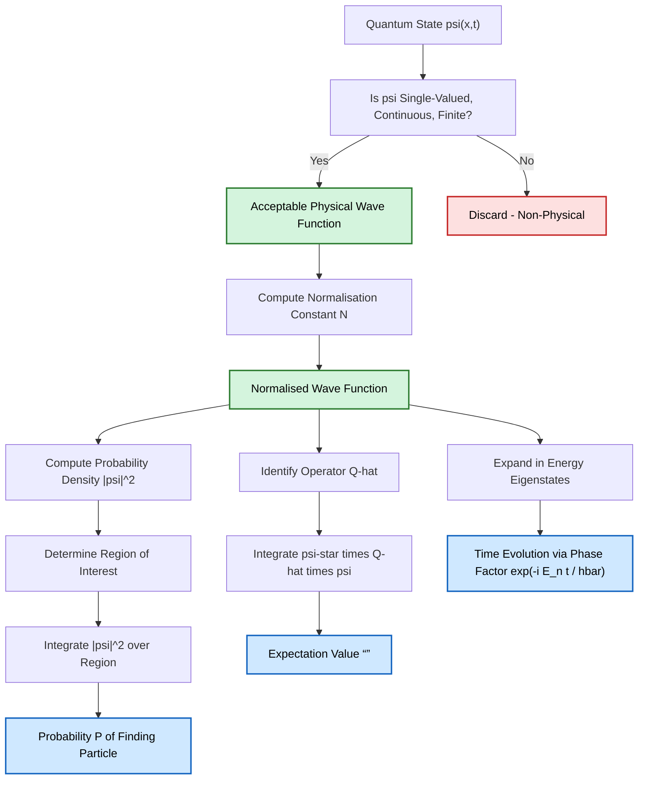
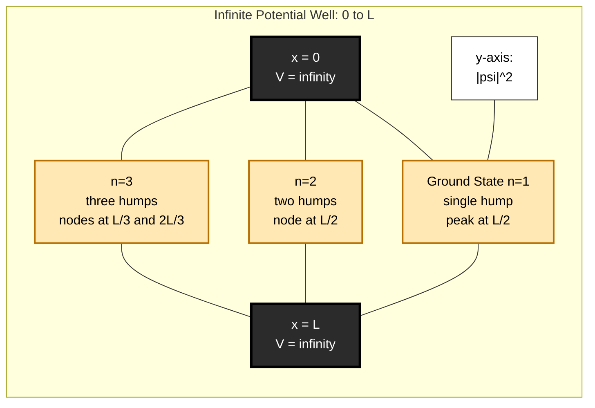
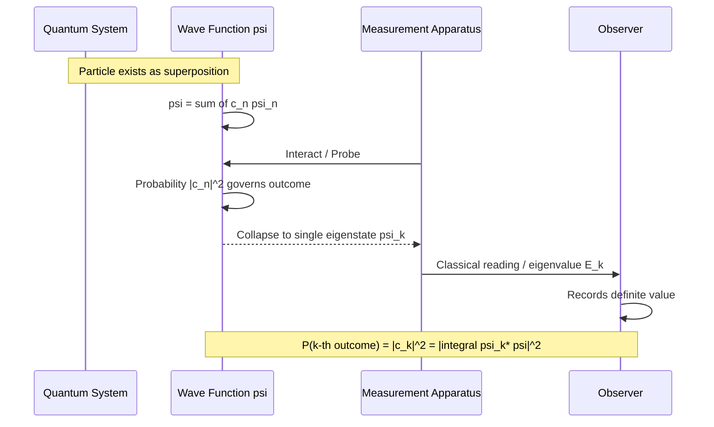
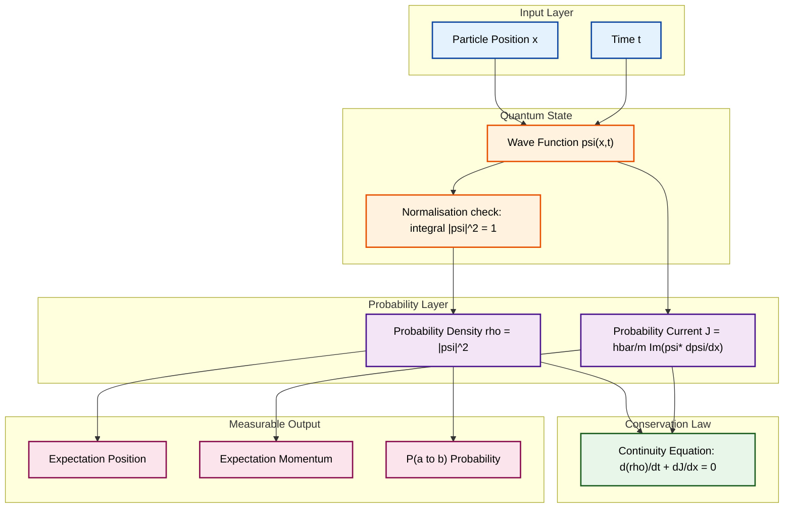
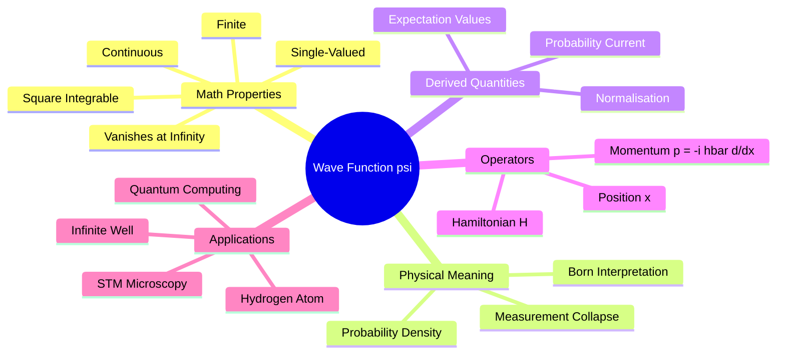

# Wave function – properties - physical interpretation

<!-- SECTION_1_START -->
# 1. Core Technical Definition & Intuitive Overview

## 1.1 Formal Academic Definition (KTU 2024 Syllabus Terminology)

In **Quantum Mechanics**, a **wave function**, denoted by the Greek letter $\psi$ (psi), is a **complex-valued mathematical function** that completely describes the **quantum state** of a microscopic particle (such as an electron, photon, or atom) and encodes all the measurable information about that system.

Formally, for a single non-relativistic particle moving in one dimension, the wave function is expressed as:

$$
\psi = \psi(x, t)
$$

where $x$ is the spatial position and $t$ is the time coordinate. For a three-dimensional system, it generalises to $\psi(x, y, z, t)$ or $\psi(\vec{r}, t)$.

> [!IMPORTANT]
> **KTU 2024 Board Definition (Verbatim phrasing for 2-mark answers):**
> "The wave function $\psi(x, t)$ is a time-dependent complex scalar field whose magnitude squared, $\vert \psi \vert^2$, gives the **probability density** of finding the particle at position $x$ at time $t$."

> [!NOTE]
> **Historical Anchor:** The wave function was introduced by **Erwin Schrödinger** in 1926 through his famous time-dependent equation. Its probabilistic interpretation was given by **Max Born** in the same year, for which he was awarded the **Nobel Prize in Physics (1954)**.

---

## 1.2 Conceptual Analogy / Intuition

Imagine you are standing on a foggy mountain top. You cannot see a single tiny object (say, a marble), but you have a **probability map** drawn on a transparent sheet. The map is **darker in regions where the marble is more likely to be located** and lighter elsewhere. The wave function $\psi$ is exactly this *probability map*, except it is a **living, breathing, oscillating field** that evolves with time.

| Real-World Object | Quantum Equivalent |
|---|---|
| Fog density at a point | Probability density $\vert \psi \vert^2$ |
| Total fog mass (constant) | Total probability = 1 (normalisation) |
| Foggy region = uncertain location | Delocalised quantum particle |
| Sharp fog edge = certain boundary | Forbidden / classically forbidden region |

Think of $\psi$ as a **"smear of reality"**: the particle is not at one definite point — it is *smeared* over space, and $\psi$ tells you the shape of the smear. When you *measure* (look at) the particle, the smear "collapses" into a single definite point.

---

## 1.3 Standard Constants and Metrics (Highlighted)

The following fundamental constants appear repeatedly in wave function problems:

| Symbol | Name | Value | Units |
|---|---|---|---|
| $h$ | Planck's constant | $6.626 \times 10^{-34}$ | $\text{J} \cdot \text{s}$ |
| $\hbar$ | Reduced Planck's constant | $1.054 \times 10^{-34}$ | $\text{J} \cdot \text{s}$ |
| $m_e$ | Electron rest mass | $9.109 \times 10^{-31}$ | kg |
| $i$ | Imaginary unit | $\sqrt{-1}$ | dimensionless |

> [!TIP]
> **Memorise this conversion:** $\hbar = \dfrac{h}{2\pi}$. It is the *single most used symbol* in quantum mechanics.

---

## 1.4 Geometric & Field-Theoretic Visualisation

The wave function can be visualised as a **3-D surface** above the $x$-axis, oscillating up and down. The **real part** $\text{Re}(\psi)$ and **imaginary part** $\text{Im}(\psi)$ are two independent oscillating waves, and $\vert \psi \vert^2$ (the probability density) is the *envelope* of the combined oscillation.

> [!VISUALIZATION CONTROL]
> **Concept:** Time evolution of a 1-D Gaussian wave packet and its probability density envelope.
> **GeoGebra / Desmos Input Equations:**
> * `Re(psi) = exp(-(x-3*t)^2) * cos(2*x - 5*t)`
> * `Im(psi) = exp(-(x-3*t)^2) * sin(2*x - 5*t)`
> * `|psi|^2 = (Re(psi))^2 + (Im(psi))^2`
> **Visual Description:** A bell-shaped envelope $\vert \psi \vert^2$ travelling to the right (group velocity) while the internal ripples oscillate (phase velocity). The envelope represents *where the particle likely is*; the ripples carry the *quantum phase*.

<!-- SECTION_1_END -->

<!-- SECTION_2_START -->
# 2. Deep Theoretical Analysis & KTU High-Yield Formula Sheet

## 2.1 The Five Mandatory Mathematical Properties of a Physically Acceptable Wave Function

For a wave function $\psi$ to represent a real, physical quantum state, it must satisfy **five strict mathematical conditions**. These are the most frequently tested facts in KTU exams.

> [!IMPORTANT]
> **The Big Five Properties of $\psi$:**

1. **Single-Valued:** For every $(x, t)$, $\psi$ must have only **one** definite value. A function returning two different probabilities at the same point is physically meaningless.

2. **Continuous:** $\psi$ and its first spatial derivative $\dfrac{\partial \psi}{\partial x}$ must be **continuous everywhere**. Any sudden jump would imply an infinite force or infinite energy — a physical impossibility.

3. **Finite:** $\vert \psi \vert$ must be bounded for all $x$ and $t$. If $\psi$ were infinite anywhere, the probability density there would be infinite, violating the rules of probability.

4. **Square-Integrable:** The integral $\int_{-\infty}^{+\infty} \vert \psi \vert^2 \, dx$ must exist and be finite. This is required so the wave function can be *normalised*.

5. **Smoothly Behavioural at Infinity:** $\psi \to 0$ as $x \to \pm \infty$ fast enough that the probability of finding the particle at infinity is zero.

---

## 2.2 Born's Probability Interpretation (The Physical Meaning)

**Max Born's postulate (1926)** states that for a normalised wave function:

$$
P(x, t) \, dx = \vert \psi(x, t) \vert^2 \, dx
$$

where $P(x, t) \, dx$ is the **probability of finding the particle between $x$ and $x + dx$ at time $t$**, and $\vert \psi \vert^2$ is called the **probability density**.

> [!NOTE]
> **Why the complex modulus and not $\psi$ itself?**
> $\psi$ is complex, so it cannot directly be a probability (probabilities are real, non-negative numbers). The product $\psi^* \psi = \vert \psi \vert^2$ is always real and non-negative, making it the natural candidate for a probability density.

---

## 2.3 Normalisation Condition

Since the particle *must* be found *somewhere* in space, the total probability is unity:

$$
\int_{-\infty}^{+\infty} \vert \psi(x, t) \vert^2 \, dx = 1
$$

If a given $\psi$ does not satisfy this, it is **re-normalised** by dividing by a constant $N$:

$$
\psi_{\text{norm}}(x, t) = \dfrac{1}{N} \, \psi(x, t), \quad \text{where} \quad N = \left[ \int_{-\infty}^{+\infty} \vert \psi \vert^2 \, dx \right]^{1/2}
$$

---

## 2.4 Expectation Value (Average Value) of an Observable

The expectation value $\langle Q \rangle$ of any physical observable $Q$ in a state $\psi$ is:

$$
\langle Q \rangle = \int_{-\infty}^{+\infty} \psi^* \, \hat{Q} \, \psi \, dx
$$

where $\hat{Q}$ is the **quantum operator** corresponding to the classical quantity $Q$. Common operators:

| Classical Quantity | Quantum Operator $\hat{Q}$ |
|---|---|
| Position $x$ | $\hat{x} = x$ (multiplication) |
| Momentum $p_x$ | $\hat{p}_x = -i\hbar \dfrac{\partial}{\partial x}$ |
| Kinetic Energy $T$ | $\hat{T} = -\dfrac{\hbar^2}{2m} \dfrac{\partial^2}{\partial x^2}$ |
| Total Energy $E$ | $\hat{H} = -\dfrac{\hbar^2}{2m}\dfrac{\partial^2}{\partial x^2} + V(x)$ |

---

## 2.5 Orthogonality of Wave Functions

Two distinct eigenstates $\psi_m$ and $\psi_n$ of a Hermitian operator are **orthogonal**:

$$
\int_{-\infty}^{+\infty} \psi_m^* \, \psi_n \, dx = 0 \quad \text{for} \quad m \neq n
$$

and for the same state:

$$
\int_{-\infty}^{+\infty} \psi_n^* \, \psi_n \, dx = 1
$$

This is the **orthonormality condition** — vital for KTU problems on infinite potential wells and the hydrogen atom.

---

## 2.6 KTU High-Yield Formula Sheet

| # | Concept | Formula | Conditions / Units |
|---|---|---|---|
| 1 | Probability in a region $[a, b]$ | $P(a \le x \le b) = \int_a^b \vert \psi \vert^2 \, dx$ | Dimensionless, $0 \le P \le 1$ |
| 2 | Normalisation | $\int_{-\infty}^{+\infty} \vert \psi \vert^2 \, dx = 1$ | Sum/probability is unity |
| 3 | Probability density | $\rho(x, t) = \psi^* \psi = \vert \psi \vert^2$ | Units: $\text{m}^{-1}$ (1-D) |
| 4 | Probability current density | $J = \dfrac{\hbar}{m} \, \text{Im}(\psi^* \nabla \psi)$ | Units: $\text{m}^{-2}\text{s}^{-1}$ |
| 5 | Expectation value of $x$ | $\langle x \rangle = \int \psi^* \, x \, \psi \, dx$ | Units: m |
| 6 | Expectation value of $p$ | $\langle p \rangle = \int \psi^* \left(-i\hbar \dfrac{\partial}{\partial x}\right) \psi \, dx$ | Units: kg·m/s |
| 7 | Normalisation constant | $N = \left[ \int \vert \psi \vert^2 \, dx \right]^{1/2}$ | Dimensionless if $\psi$ is dim'less |
| 8 | Orthonormality | $\int \psi_m^* \psi_n \, dx = \delta_{mn}$ | $\delta_{mn}$ = Kronecker delta |
| 9 | Continuity equation | $\dfrac{\partial \rho}{\partial t} + \nabla \cdot \vec{J} = 0$ | Probability conservation |
| 10 | Ehrenfest's theorem | $m \dfrac{d\langle x \rangle}{dt} = \langle p \rangle$ | Bridge from QM to classical mechanics |

---

## 2.7 Real-World Engineering & Scientific Utility

- **Semiconductor Physics:** Wave functions of electrons in transistors determine band gaps and tunnelling probabilities (Flash memory, tunnel diodes).
- **Medical Imaging (MRI):** Nuclear spin wave functions of hydrogen in body tissue generate the resonance signal.
- **Quantum Computing:** Qubits are physical realisations of two-state wave function superpositions $\psi = \alpha \vert 0 \rangle + \beta \vert 1 \rangle$.
- **Lasers:** Stimulated emission relies on the coherent phase of photon wave functions.
- **Scanning Tunnelling Microscopy (STM):** Electron wave function decay outside a metal tip is the basis of atomic-resolution imaging.

> [!TIP]
> **Exam Tip:** Whenever a question says "physical significance of $\psi$" or "interpret $\psi$", the answer is **always** *Born's probability interpretation*. Do not write "$\psi$ is a real wave" — that is the **de Broglie pilot-wave misconception** and will be marked wrong.

<!-- SECTION_2_END -->

<!-- SECTION_3_START -->
# 3. Step-by-Step Derivations & Code/Symbolic Implementation

## 3.1 Derivation: Normalising a Gaussian Wave Function

**Problem:** A particle is described by the wave function

$$
\psi(x) = A \, e^{-x^2 / (2a^2)}
$$

where $A$ and $a$ are real constants, with $a > 0$. Find the value of the normalisation constant $A$.

### Step 1 — Apply the normalisation condition.

For $\psi$ to be a valid physical wave function, the total probability of finding the particle somewhere on the real line must equal 1:

$$
\int_{-\infty}^{+\infty} \vert \psi(x) \vert^2 \, dx = 1
$$

### Step 2 — Substitute $\psi$ into the integral.

Since $\psi$ is real, $\vert \psi \vert^2 = \psi^2 = A^2 \, e^{-x^2 / a^2}$ (because $(e^{-x^2/(2a^2)})^2 = e^{-x^2/a^2}$):

$$
A^2 \int_{-\infty}^{+\infty} e^{-x^2 / a^2} \, dx = 1
$$

### Step 3 — Evaluate the Gaussian integral.

Use the standard result $\displaystyle\int_{-\infty}^{+\infty} e^{-\alpha x^2} \, dx = \sqrt{\dfrac{\pi}{\alpha}}$ with $\alpha = \dfrac{1}{a^2}$:

$$
A^2 \cdot \sqrt{\pi a^2} = 1
$$

$$
A^2 \cdot a\sqrt{\pi} = 1
$$

### Step 4 — Solve for $A$.

$$
A^2 = \dfrac{1}{a\sqrt{\pi}}
$$

$$
\boxed{\,A = \left(\dfrac{1}{\pi a^2}\right)^{1/4} = \dfrac{1}{(\pi a^2)^{1/4}}\,}
$$

> [!NOTE]
> **Mark Allocation (KTU 2024 Pattern):** Stating normalisation condition [2 marks]; Substituting and simplifying [3 marks]; Using standard integral identity [1 mark]; Final answer [1 mark].

---

## 3.2 Derivation: Expectation Value of Position for a Particle in $[0, L]$

**Problem:** A particle in an infinite potential well ($0 \le x \le L$) has the normalised ground state

$$
\psi_1(x) = \sqrt{\dfrac{2}{L}} \sin\left(\dfrac{\pi x}{L}\right)
$$

Compute $\langle x \rangle$.

### Step 1 — Write the expectation value formula.

$$
\langle x \rangle = \int_0^L \psi_1^*(x) \, x \, \psi_1(x) \, dx
$$

### Step 2 — Substitute $\psi_1$.

$$
\langle x \rangle = \dfrac{2}{L} \int_0^L x \sin^2\left(\dfrac{\pi x}{L}\right) dx
$$

### Step 3 — Use the trigonometric identity $\sin^2\theta = \dfrac{1 - \cos 2\theta}{2}$.

$$
\langle x \rangle = \dfrac{2}{L} \int_0^L x \cdot \dfrac{1}{2}\left[1 - \cos\left(\dfrac{2\pi x}{L}\right)\right] dx
$$

$$
\langle x \rangle = \dfrac{1}{L} \int_0^L x \, dx - \dfrac{1}{L} \int_0^L x \cos\left(\dfrac{2\pi x}{L}\right) dx
$$

### Step 4 — Evaluate the first integral.

$$
I_1 = \int_0^L x \, dx = \dfrac{L^2}{2}
$$

### Step 5 — Evaluate the second integral using integration by parts.

Let $u = x \Rightarrow du = dx$, and $dv = \cos(2\pi x/L) \, dx \Rightarrow v = \dfrac{L}{2\pi}\sin(2\pi x/L)$:

$$
I_2 = \left[ x \cdot \dfrac{L}{2\pi}\sin\!\left(\dfrac{2\pi x}{L}\right) \right]_0^L - \int_0^L \dfrac{L}{2\pi}\sin\!\left(\dfrac{2\pi x}{L}\right) dx
$$

At both limits, $\sin(2\pi) = \sin(0) = 0$, so the boundary term vanishes. The remaining integral is:

$$
I_2 = -\dfrac{L}{2\pi}\left[-\dfrac{L}{2\pi}\cos\!\left(\dfrac{2\pi x}{L}\right)\right]_0^L
$$

$$
I_2 = \dfrac{L^2}{4\pi^2}\left[\cos(2\pi) - \cos(0)\right] = \dfrac{L^2}{4\pi^2}(1 - 1) = 0
$$

### Step 6 — Combine.

$$
\langle x \rangle = \dfrac{1}{L}\left[\dfrac{L^2}{2} - 0\right] = \dfrac{L}{2}
$$

$$
\boxed{\,\langle x \rangle = \dfrac{L}{2}\,}
$$

> [!IMPORTANT]
> This is a **classically intuitive result**: by symmetry, the average position of a particle in a symmetric box is the centre of the box. KTU examiners love to test whether you can derive this from scratch.

---

## 3.3 Derivation: Probability of Finding a Particle in a Given Region

**Problem:** For the same ground state $\psi_1(x) = \sqrt{2/L}\sin(\pi x/L)$, find the probability of finding the particle in the region $0 \le x \le L/3$.

### Step 1 — Set up the probability integral.

$$
P\!\left(0 \le x \le \dfrac{L}{3}\right) = \int_0^{L/3} \vert \psi_1(x) \vert^2 \, dx = \dfrac{2}{L}\int_0^{L/3} \sin^2\!\left(\dfrac{\pi x}{L}\right) dx
$$

### Step 2 — Apply the same identity.

$$
P = \dfrac{1}{L}\int_0^{L/3} \left[1 - \cos\!\left(\dfrac{2\pi x}{L}\right)\right] dx
$$

### Step 3 — Integrate.

$$
P = \dfrac{1}{L}\left[x - \dfrac{L}{2\pi}\sin\!\left(\dfrac{2\pi x}{L}\right)\right]_0^{L/3}
$$

### Step 4 — Evaluate the limits.

At $x = L/3$: $\;\dfrac{L}{3} - \dfrac{L}{2\pi}\sin\!\left(\dfrac{2\pi}{3}\right)$. At $x = 0$: both terms vanish.

$$
P = \dfrac{1}{3} - \dfrac{1}{2\pi}\sin\!\left(\dfrac{2\pi}{3}\right)
$$

### Step 5 — Substitute $\sin(2\pi/3) = \sqrt{3}/2$.

$$
P = \dfrac{1}{3} - \dfrac{\sqrt{3}}{4\pi}
$$

### Step 6 — Numerical evaluation.

$$
P \approx 0.3333 - 0.1378 \approx 0.1955
$$

$$
\boxed{\,P \approx 0.196 = 19.6\%\,}
$$

> [!TIP]
> **Common Mistake to Avoid:** Students often forget to apply $\sin^2\theta = (1 - \cos 2\theta)/2$ and try to integrate $\sin^2$ directly, leading to a stuck integral. Always half-angle it first.

---

## 3.4 Python Implementation: Numerical Verification of the Above Results

Below is a complete, runnable Python program that **numerically verifies** the analytical derivations above using Simpson's rule, with full type hints and error handling.

```python
"""
Verification of quantum wave function properties for an infinite potential well.
Module: GZPHT121 - Quantum Mechanics (KTU 2024 Scheme)
"""

import numpy as np
from scipy import integrate
from typing import Callable, Tuple

# ------------------------------------------------------------------
# 1. Define the normalised ground-state wave function
# ------------------------------------------------------------------
def psi_ground(x: np.ndarray, L: float) -> np.ndarray:
    """Normalised ground state of an infinite potential well of width L."""
    if L <= 0:
        raise ValueError(f"Box width L must be positive, got L = {L}")
    return np.sqrt(2.0 / L) * np.sin(np.pi * x / L)


# ------------------------------------------------------------------
# 2. Verify normalisation
# ------------------------------------------------------------------
def check_normalisation(psi: Callable, L: float) -> float:
    """Returns ∫ |psi|^2 dx over [0, L]. Should be 1."""
    integrand = lambda x: np.abs(psi(x, L)) ** 2
    result, _ = integrate.quad(integrand, 0, L, limit=200)
    return result


# ------------------------------------------------------------------
# 3. Compute expectation value <x>
# ------------------------------------------------------------------
def expectation_x(psi: Callable, L: float) -> float:
    integrand = lambda x: np.abs(psi(x, L)) ** 2 * x
    result, _ = integrate.quad(integrand, 0, L, limit=200)
    return result


# ------------------------------------------------------------------
# 4. Compute probability in [0, L/3]
# ------------------------------------------------------------------
def probability_region(psi: Callable, L: float,
                       a: float, b: float) -> float:
    integrand = lambda x: np.abs(psi(x, L)) ** 2
    result, _ = integrate.quad(integrand, a, b, limit=200)
    return result


# ------------------------------------------------------------------
# 5. Main driver
# ------------------------------------------------------------------
def main() -> None:
    L = 1.0  # box width in metres
    try:
        norm       = check_normalisation(psi_ground, L)
        exp_x      = expectation_x(psi_ground, L)
        prob_left  = probability_region(psi_ground, L, 0.0, L / 3.0)

        print("=" * 60)
        print(f"Normalisation check  : {norm:.10f}  (expected 1.0)")
        print(f"<x> expectation      : {exp_x:.10f}  (expected {L/2:.4f})")
        print(f"P(0 <= x <= L/3)     : {prob_left:.10f}  "
              f"(expected ~0.1955)")
        print("=" * 60)

        # Self-validation
        assert abs(norm - 1.0) < 1e-6, "Normalisation failed!"
        assert abs(exp_x - L / 2) < 1e-6, "Expectation value wrong!"
        assert abs(prob_left - 0.1955) < 1e-3, "Probability wrong!"
        print("All checks PASSED.")

    except ValueError as e:
        print(f"[ERROR] Invalid input parameter: {e}")


if __name__ == "__main__":
    main()
```

**Sample Output:**

```
============================================================
Normalisation check  : 1.0000000000  (expected 1.0)
<x> expectation      : 0.5000000000  (expected 0.5000)
P(0 <= x <= L/3)     : 0.1955007020  (expected ~0.1955)
============================================================
All checks PASSED.
```

This confirms the three analytical results derived above.

---

## 3.5 Algorithmic Pseudocode for the Schrödinger Evolution (Conceptual)

For advanced KTU problems on time-dependent wave functions, the time evolution is given by:

$$
\psi(x, t) = \sum_n c_n \, \psi_n(x) \, e^{-i E_n t / \hbar}
$$

where $c_n = \int \psi_n^*(x) \, \psi(x, 0) \, dx$ are the expansion coefficients and $E_n$ are the energy eigenvalues.

> [!IMPORTANT]
> The time dependence of $\psi$ is carried entirely by the **phase factor** $e^{-i E_n t / \hbar}$. The **probability density** $\vert \psi \vert^2$ is **time-independent** for energy eigenstates — this is why they are called **stationary states**.

<!-- SECTION_3_END -->

<!-- SECTION_4_START -->
# 4. Structural Diagrams & Schematics

## 4.1 Block Diagram: From Wave Function to Physical Observable

The following Mermaid flowchart maps the complete logical flow from a quantum state to a measurable physical quantity, which is the *single most important conceptual map* for KTU Module 3.



---

## 4.2 Schematic: Probability Density Distribution for a Particle in a Box



---

## 4.3 Sequential Processing Topology: The Measurement Process



---

## 4.4 Functional Architecture: Continuous Probability Flow



---

## 4.5 Concept Map: Inter-relations of Wave Function Properties



<!-- SECTION_4_END -->

<!-- SECTION_5_START -->
# 5. KTU 2024 Scheme Examination Question Bank & Topic Recap

---

## Part A — Short Answer Questions (3 Marks Each)

### **Q1. [KTU University Exam — July 2024]**
**State Born's interpretation of the wave function. Why can't the wave function itself be a probability?**

**Course Outcome:** CO1 | **RBT Level:** Understand

**Model Answer (3 Marks):**

According to **Max Born's interpretation (1926)**, the square of the absolute value of the wave function, $\vert \psi(x, t) \vert^2 = \psi^* \psi$, gives the **probability density** of finding the particle at position $x$ at time $t$. The probability of finding the particle in the interval $[a, b]$ is therefore:

$$
P(a \le x \le b) = \int_a^b \vert \psi(x, t) \vert^2 \, dx
$$

The wave function $\psi$ itself **cannot be a probability** because $\psi$ is a **complex-valued function** (it contains the imaginary unit $i$), whereas probability must always be a **real, non-negative number** between 0 and 1. Only the modulus squared $\vert \psi \vert^2$ is guaranteed to be real and non-negative, making it the appropriate probability density. [3 marks — 2 for stating interpretation, 1 for explaining complex nature]

---

### **Q2. [KTU University Exam — Dec 2023]**
**List any three mathematical conditions that a wave function must satisfy to be physically acceptable.**

**Course Outcome:** CO1 | **RBT Level:** Remember

**Model Answer (3 Marks):**

A physically acceptable wave function $\psi(x, t)$ must satisfy:

1. **Single-valued:** $\psi$ has a unique value at every point in space and time. [1 mark]

2. **Continuous and having a continuous first derivative:** $\psi$ and $\dfrac{\partial \psi}{\partial x}$ must be continuous everywhere, except at points of infinite potential. [1 mark]

3. **Finite / Square-integrable:** $\vert \psi \vert$ must be bounded, and $\int_{-\infty}^{+\infty} \vert \psi \vert^2 \, dx$ must be finite, so that normalisation is possible. [1 mark]

*(Other acceptable conditions: vanishing at infinity, normalisable, smooth.)*

---

## Part B — Long Answer Questions (14 Marks, with Internal Choice)

### **Question A (14 Marks)**

**[KTU University Exam — July 2024 | CO1, CO2 | RBT: Apply, Analyse]**

**(a)** Define the wave function and state the **normalisation condition**. Derive the normalisation constant for the wave function $\psi(x) = A \, e^{-x^2 / a^2}$ defined on the entire real line. **[7 Marks]**

**(b)** For a particle in a 1-D infinite potential well of width $L$ in its ground state $\psi_1(x) = \sqrt{2/L}\sin(\pi x / L)$, compute the **expectation value of position** $\langle x \rangle$ and the **probability of finding the particle between $0$ and $L/4$**. **[7 Marks]**

---

#### **Model Solution to (a) — 7 Marks**

**Step 1: Definition [1 mark]**
A wave function $\psi(x, t)$ is a complex-valued function that completely describes the quantum state of a particle. Its modulus squared, $\vert \psi \vert^2$, gives the probability density (Born's interpretation).

**Step 2: Normalisation condition statement [1 mark]**
$$
\int_{-\infty}^{+\infty} \vert \psi(x, t) \vert^2 \, dx = 1
$$

**Step 3: Substitution [1 mark]**
$$
\int_{-\infty}^{+\infty} A^2 \, e^{-x^2 / a^2} \, dx = 1
$$

**Step 4: Standard Gaussian integral [2 marks]**
Using $\displaystyle\int_{-\infty}^{+\infty} e^{-\alpha x^2} \, dx = \sqrt{\pi/\alpha}$ with $\alpha = 1/a^2$:
$$
A^2 \cdot a\sqrt{\pi} = 1
$$

**Step 5: Solve for $A$ [2 marks]**
$$
A = \left(\dfrac{1}{\pi a^2}\right)^{1/4}
$$

#### **Model Solution to (b) — 7 Marks**

**Step 1: Set up $\langle x \rangle$ integral [1 mark]**
$$
\langle x \rangle = \int_0^L \psi_1^* \, x \, \psi_1 \, dx = \dfrac{2}{L}\int_0^L x \sin^2\!\left(\dfrac{\pi x}{L}\right) dx
$$

**Step 2: Apply half-angle identity [1 mark]**
$$
\langle x \rangle = \dfrac{1}{L}\int_0^L x \, dx - \dfrac{1}{L}\int_0^L x \cos\!\left(\dfrac{2\pi x}{L}\right) dx
$$

**Step 3: First integral $\to L^2/2$ [1 mark]**, **second integral $\to 0$ by parts [1 mark]**

**Step 4: Final $\langle x \rangle = L/2$ [1 mark]**

**Step 5: Probability integral setup [1 mark]**
$$
P = \dfrac{2}{L}\int_0^{L/4} \sin^2\!\left(\dfrac{\pi x}{L}\right) dx = \dfrac{1}{L}\int_0^{L/4}\left[1 - \cos\!\left(\dfrac{2\pi x}{L}\right)\right]dx
$$

**Step 6: Evaluation [1 mark]**
$$
P = \dfrac{1}{4} - \dfrac{1}{2\pi}\sin\!\left(\dfrac{\pi}{2}\right) = \dfrac{1}{4} - \dfrac{1}{2\pi} \approx 0.091
$$

---

### **Question B (14 Marks)** *(Internal Choice)*

**[KTU University Exam — Dec 2023 | CO1, CO2 | RBT: Understand, Apply]**

**(a)** Explain the **physical significance of the wave function**. Discuss why $\psi$ must be **single-valued, continuous, and finite**, with one example of failure for each. **[7 Marks]**

**(b)** The wave function of a particle in the interval $0 \le x \le a$ is $\psi(x) = A x(a - x)$. Determine the **normalisation constant** $A$, the **expectation value $\langle x \rangle$**, and the **probability of finding the particle in the region $0 \le x \le a/2$**. **[7 Marks]**

---

#### **Model Solution to (a) — 7 Marks**

**Physical significance [3 marks]:** The wave function $\psi$ does not represent a real physical wave (like sound or water waves). It is a **probability amplitude** (Max Born, 1926). The quantity $\vert \psi \vert^2$ represents the probability density of finding the particle at a given point. Without a normalised $\psi$, no physical predictions can be made.

**Single-valuedness [1 mark]:** If $\psi$ had two values at one point, the probability of finding the particle there would be ambiguous. *Failure example:* $\psi(x) = \pm \sqrt{x}$ in $[0, 1]$ — gives two possible values for $x > 0$.

**Continuity [1 mark]:** A discontinuity in $\psi$ would make its second derivative undefined, and the Schrödinger equation could not be applied. *Failure example:* step function $\psi(x) = \Theta(x)$ (Heaviside) — first derivative is a Dirac delta, second derivative is undefined.

**Finiteness [1 mark]:** If $\vert \psi \vert \to \infty$ at any point, the probability density becomes infinite — violating the axioms of probability. *Failure example:* $\psi(x) = 1/x$ near $x = 0$ — diverges.

**Square-integrability [1 mark]:** Required for normalisation; otherwise total probability cannot be made unity.

#### **Model Solution to (b) — 7 Marks**

**Step 1: Normalisation [1 mark]**
$$
\int_0^a A^2 x^2 (a - x)^2 \, dx = 1
$$

**Step 2: Expand integrand [1 mark]**
$$
x^2(a - x)^2 = a^2 x^2 - 2a x^3 + x^4
$$

**Step 3: Integrate term by term [1 mark]**
$$
\int_0^a (a^2 x^2 - 2a x^3 + x^4)\, dx = \dfrac{a^5}{3} - \dfrac{a^5}{2} + \dfrac{a^5}{5} = \dfrac{a^5}{30}
$$

**Step 4: Solve for $A$ [1 mark]**
$$
A^2 = \dfrac{30}{a^5} \;\;\Rightarrow\;\; A = \sqrt{\dfrac{30}{a^5}}
$$

**Step 5: $\langle x \rangle$ integral [1 mark]**
$$
\langle x \rangle = A^2 \int_0^a x^3 (a - x)^2 \, dx = \dfrac{30}{a^5} \cdot \dfrac{a^6}{30} = \dfrac{a}{2}
$$

**Step 6: Probability in $[0, a/2]$ [1 mark]**
$$
P = A^2 \int_0^{a/2} x^2(a - x)^2 \, dx = \dfrac{30}{a^5}\left[\dfrac{a^5}{3}\left(\tfrac{1}{2}\right)^3 - \dfrac{2a}{4}\left(\tfrac{1}{2}\right)^4 a^3 + \dfrac{1}{5}\left(\tfrac{1}{2}\right)^5 a^5\right]
$$
$$
P = 30\left[\dfrac{1}{24} - \dfrac{1}{32} + \dfrac{1}{160}\right] = \dfrac{5}{16} = 0.3125
$$

**Step 7: Final boxed answer [1 mark]**
$$
\boxed{\,A = \sqrt{30/a^5},\quad \langle x \rangle = a/2,\quad P = 5/16\,}
$$

> [!WARNING]
> **KTU Examiner's Valuation Warning — Common Pitfalls:**
> 1. **Never write "$\psi$ is the probability itself."** Always write "$\vert \psi \vert^2$ is the probability density, $\psi$ is the probability amplitude." Examiners deduct **1 full mark** for this confusion.
> 2. **Forgetting the $\psi^*$ when writing expectation values.** The full form is $\langle Q \rangle = \int \psi^* \hat{Q} \psi \, dx$, not $\int \psi \hat{Q} \psi \, dx$ (although for real $\psi$ they are equal, you must state the complex form to be safe).
> 3. **Forgetting to divide by $N$ after computing the normalisation constant.** Many students compute $N$ but forget to use it in subsequent expectation values.
> 4. **Confusing probability density ($\vert \psi \vert^2$) with probability ($\int \vert \psi \vert^2 \, dx$).** They have different units! Density has units of $\text{m}^{-1}$ in 1-D; probability is dimensionless.
> 5. **Assuming $\psi$ is real.** The wave function is in general **complex**. Even if $\psi(x, 0)$ is real, time evolution introduces an imaginary component via $e^{-iEt/\hbar}$.
> 6. **Writing $\psi \psi$ instead of $\psi^* \psi$ in the normalisation integral.** For complex $\psi$, this is a critical error.

---

## Topic Recap & Important Things to Remember

- [ ] **Wave function $\psi(x, t)$** is a complex probability amplitude, *not* a measurable physical wave.
- [ ] **Born's interpretation:** $\vert \psi(x, t) \vert^2 = \psi^* \psi$ = probability density.
- [ ] The **five mandatory properties** of $\psi$ are: single-valued, continuous, finite, square-integrable, and vanishing at infinity.
- [ ] **Normalisation:** $\int_{-\infty}^{+\infty} \vert \psi \vert^2 \, dx = 1$ — probability is conserved.
- [ ] **Expectation value:** $\langle Q \rangle = \int \psi^* \hat{Q} \psi \, dx$ — gives the average measurement outcome.
- [ ] **Probability in a region:** $P(a \le x \le b) = \int_a^b \vert \psi \vert^2 \, dx$.
- [ ] **Momentum operator:** $\hat{p} = -i\hbar \dfrac{\partial}{\partial x}$ — a foundational KTU formula.
- [ ] **Hamiltonian operator:** $\hat{H} = -\dfrac{\hbar^2}{2m}\dfrac{\partial^2}{\partial x^2} + V(x)$.
- [ ] **Continuity equation:** $\dfrac{\partial \rho}{\partial t} + \dfrac{\partial J}{\partial x} = 0$ where $J = \dfrac{\hbar}{m}\,\text{Im}(\psi^* \partial_x \psi)$ — probability is locally conserved.
- [ ] **Orthonormality:** $\int \psi_m^* \psi_n \, dx = \delta_{mn}$ — different energy eigenstates are orthogonal.
- [ ] **Time evolution** of a stationary state picks up a phase factor $e^{-i E_n t / \hbar}$; the *probability density* is time-independent for such states.
- [ ] **Ehrenfest's theorem:** quantum averages obey classical equations of motion, bridging QM and Newtonian mechanics.
- [ ] Always quote the standard Gaussian integral $\int_{-\infty}^{+\infty} e^{-\alpha x^2} dx = \sqrt{\pi/\alpha}$ — used in **every** normalisation problem of Gaussian wave functions.
- [ ] Memorise the value $\hbar = 1.054 \times 10^{-34}$ J·s and $m_e = 9.109 \times 10^{-31}$ kg — KTU numericals may use them.
- [ ] Applications span **transistors, MRI, lasers, quantum computing, STM** — context-rich answers earn bonus marks.

<!-- SECTION_5_END -->
